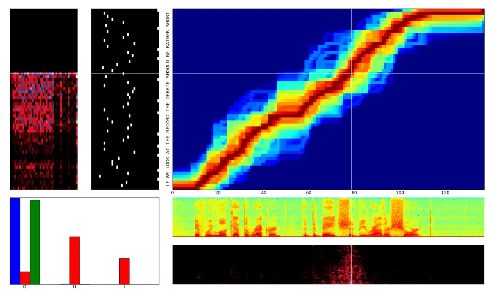

# Sequence Transduction with Recurrent Neural Networks

Alex Graves Address: Department of Computer Science, University of
Toronto, Canada

###### Abstract

Many machine learning tasks can be expressed as the transformation—or
_transduction_—of input sequences into output sequences: speech
recognition, machine translation, protein secondary structure prediction
and text-to-speech to name but a few. One of the key challenges in
sequence transduction is learning to represent both the input and output
sequences in a way that is invariant to sequential distortions such as
shrinking, stretching and translating. Recurrent neural networks (RNNs)
are a powerful sequence learning architecture that has proven capable of
learning such representations. However RNNs traditionally require a
pre-defined alignment between the input and output sequences to perform
transduction. This is a severe limitation since _finding_ the alignment
is the most difficult aspect of many sequence transduction problems.
Indeed, even determining the length of the output sequence is often
challenging. This paper introduces an end-to-end, probabilistic sequence
transduction system, based entirely on RNNs, that is in principle able
to transform any input sequence into any finite, discrete output
sequence. Experimental results for phoneme recognition are provided on
the TIMIT speech corpus.

###### Keywords: 

recurrent neural networks, sequence learning, transduction, machine
learning, ICML

## 1 Introduction

The ability to transform and manipulate sequences is a crucial part of
human intelligence: everything we know about the world reaches us in the
form of sensory sequences, and everything we do to interact with the
world requires sequences of actions and thoughts. The creation of
automatic sequence transducers therefore seems an important step towards
artificial intelligence. A major problem faced by such systems is how to
represent sequential information in a way that is invariant, or at least
robust, to sequential distortions. Moreover this robustness should apply
to both the input and output sequences.

For example, transforming audio signals into sequences of words requires
the ability to identify speech sounds (such as phonemes or syllables)
despite the apparent distortions created by different voices, variable
speaking rates, background noise etc. If a language model is used to
inject prior knowledge about the output sequences, it must also be
robust to missing words, mispronunciations, non-lexical utterances etc.

Recurrent neural networks (RNNs) are a promising architecture for
general-purpose sequence transduction. The combination of a
high-dimensional multivariate internal state and nonlinear
state-to-state dynamics offers more expressive power than conventional
sequential algorithms such as hidden Markov models. In particular RNNs
are better at storing and accessing information over long periods of
time. While the early years of RNNs were dogged by difficulties in
learning (Hochreiter et al., 2001), recent results have shown that they
are now capable of delivering state-of-the-art results in real-world
tasks such as handwriting recognition (Graves et al., 2008; Graves &
Schmidhuber, 2008), text generation (Sutskever et al., 2011) and
language modelling (Mikolov et al., 2010). Furthermore, these results
demonstrate the use of long-range memory to perform such actions as
closing parentheses after many intervening characters (Sutskever et al.,
2011), or using delayed strokes to identify handwritten characters from
pen trajectories (Graves et al., 2008).

However RNNs are usually restricted to problems where the alignment
between the input and output sequence is known in advance. For example,
RNNs may be used to classify every frame in a speech signal, or every
amino acid in a protein chain. If the network outputs are probabilistic
this leads to a distribution over output sequences of the same length as
the input sequence. But for a general-purpose sequence transducer, where
the output length is unknown in advance, we would prefer a distribution
over sequences of _all_ lengths. Furthermore, since we do not how the
inputs and outputs should be aligned, this distribution would ideally
cover all possible alignments.

Connectionist Temporal Classification (CTC) is an RNN output layer that
defines a distribution over all alignments with all output sequences not
longer than the input sequence (Graves et al., 2006). However, as well
as precluding tasks, such as text-to-speech, where the output sequence
is longer than the input sequence, CTC does not model the
interdependencies between the outputs. The transducer described in this
paper extends CTC by defining a distribution over output sequences of
all lengths, and by jointly modelling both input-output and
output-output dependencies.

As a discriminative sequential model the transducer has similarities
with ‘chain-graph’ conditional random fields (CRFs) (Lafferty et al.,
2001). However the transducer’s construction from RNNs, with their
ability to extract features from raw data and their potentially
unbounded range of dependency, is in marked contrast with the pairwise
output potentials and hand-crafted input features typically used for
CRFs. Closer in spirit is the *Graph Transformer Network* (Bottou
et al., 1997) paradigm, in which differentiable modules (often neural
networks) can be globally trained to perform consecutive graph
transformations such as detection, segmentation and recognition.

Section 2 defines the RNN transducer, showing how it can be trained and
applied to test data, Section 3 presents experimental results on the
TIMIT speech corpus and concluding remarks and directions for future
work are given in Section 4.

## 2 Recurrent Neural Network Transducer

Let $`\bm{x}=(x_{1},x_{2},\ldots,x_{T})`$ be a length $`T`$ _input
sequence_ of arbitrary length belonging to the set $`\mathcal{{X}}^{*}`$
of all sequences over some _input space_ $`\mathcal{{X}}`$. Let
$`\bm{y}=(y_{1},y_{2},\ldots,y_{U})`$ be a length $`U`$ _output
sequence_ belonging to the set $`\mathcal{{Y}}^{*}`$ of all sequences
over some _output space_ $`\mathcal{{Y}}`$. Both the inputs vectors
$`x_{t}`$ and the output vectors $`y_{u}`$ are represented by
fixed-length real-valued vectors; for example if the task is phonetic
speech recognition, each $`x_{t}`$ would typically be a vector of MFC
coefficients and each $`y_{t}`$ would be a one-hot vector encoding a
particular phoneme. In this paper we will assume that the output space
is discrete; however the method can be readily extended to continuous
output spaces, provided a tractable, differentiable model can be found
for $`\mathcal{{Y}}`$.

Define the _extended output space_ $`\bar{\mathcal{{Y}}}`$ as
$`\mathcal{{Y}}\cup\varnothing`$, where $`\varnothing`$ denotes the
_null_ output. The intuitive meaning of $`\varnothing`$ is ‘output
nothing’; the sequence
$`(y_{1},\varnothing,\varnothing,y_{2},\varnothing,y_{3})\in\bar{\mathcal{{Y}}}^{*}`$
is therefore equivalent to $`(y_{1},y_{2},y_{3})\in\mathcal{{Y}}^{*}`$.
We refer to the elements $`\bm{a}\in\bar{\mathcal{{Y}}}^{*}`$ as
_alignments_, since the location of the null symbols determines an
alignment between the input and output sequences. Given $`\bm{x}`$, the
RNN transducer defines a conditional distribution
$`\Pr(\bm{a}\in\bar{\mathcal{{Y}}}^{*}|\bm{x})`$. This distribution is
then collapsed onto the following distribution over
$`\mathcal{{Y}}^{*}`$

```math
\Pr(\bm{y}\in\mathcal{{Y}}^{*}|\bm{x})=\sum_{\bm{a}\in\mathcal{B}^{-1}(\bm{y})}{\Pr(\bm{a}|\bm{x})} \tag{1}
```

where $`\mathcal{B}:\bar{\mathcal{{Y}}}^{*}\mapsto\mathcal{{Y}}^{*}`$ is
a function that removes the null symbols from the alignments in
$`\bar{\mathcal{{Y}}}^{*}`$.

Two recurrent neural networks are used to determine
$`\Pr(\bm{a}\in\bar{\mathcal{{Y}}}^{*}|\bm{x})`$. One network, referred
to as the _transcription network_ $`\mathcal{F}`$, scans the input
sequence $`\bm{x}`$ and outputs the sequence
$`\bm{f}=(f_{1},\ldots,f_{T})`$ of transcription vectors¹¹ 1 For
simplicity we assume the transcription sequence to be the same length as
the input sequence; however this may not be true, for example if the
transcription network uses a pooling architecture (LeCun et al., 1998)
to reduce the sequence length.. The other network, referred to as the
_prediction network_ $`\mathcal{G}`$, scans the output sequence
$`\bm{y}`$ and outputs the prediction vector sequence
$`\bm{g}=(g_{0},g_{1}\ldots,g_{U})`$.

### 2.1 Prediction Network

The prediction network $`\mathcal{G}`$ is a recurrent neural network
consisting of an input layer, an output layer and a single hidden layer.
The length $`U+1`$ input sequence
$`\hat{\bm{y}}=(\varnothing,y_{1},\ldots,y_{U})`$ to $`\mathcal{G}`$
output sequence $`\bm{y}`$ with $`\varnothing`$ prepended. The inputs
are encoded as one-hot vectors; that is, if $`\mathcal{{Y}}`$ consists
of $`K`$ labels and $`y_{u}=k`$, then $`\hat{\bm{y}}_{u}`$ is a length
$`K`$ vector whose elements are all zero except the $`k^{th}`$, which is
one. $`\varnothing`$ is encoded as a length $`K`$ vector of zeros. The
input layer is therefore size $`K`$. The output layer is size $`K+1`$
(one unit for each element of $`\bar{\mathcal{{Y}}}`$) and hence the
prediction vectors $`g_{u}`$ are also size $`K+1`$.

Given $`\hat{\bm{y}}`$, $`\mathcal{G}`$ computes the hidden vector
sequence $`(h_{0},\ldots,h_{U})`$ and the prediction sequence
$`(g_{0},\ldots,g_{U})`$ by iterating the following equations from
$`u=0`$ to $`U`$:

```math
\displaystyle h_{u} \displaystyle=\mathcal{H}\left(W_{ih}\hat{\bm{y}}_{u}+W_{hh}h_{u-1}+b_{h}\right) \tag{2}
```

```math
\displaystyle g_{u} \displaystyle=W_{ho}h_{u}+b_{o} \tag{3}
```

where $`W_{ih}`$ is the input-hidden weight matrix, $`W_{hh}`$ is the
hidden-hidden weight matrix, $`W_{ho}`$ is the hidden-output weight
matrix, $`b_{h}`$ and $`b_{o}`$ are bias terms, and $`\mathcal{H}`$ is
the hidden layer function. In traditional RNNs $`\mathcal{H}`$ is an
elementwise application of the $`tanh`$ or _logistic sigmoid_
$`\sigma(x)=1/(1+\exp(-x))`$ functions. However we have found that the
Long Short-Term Memory (LSTM) architecture (Hochreiter & Schmidhuber,
1997; Gers, 2001) is better at finding and exploiting long range
contextual information. For the version of LSTM used in this paper
$`\mathcal{H}`$ is implemented by the following composite function:

```math
\displaystyle\alpha_{n} \displaystyle=\sigma\left(W_{i\alpha}i_{n}+W_{h\alpha}h_{n-1}+W_{s\alpha}s_{n-1}\right) \tag{4}
```

```math
\displaystyle\beta_{n} \displaystyle=\sigma\left(W_{i\beta}i_{n}+W_{h\beta}h_{n-1}+W_{s\beta}s_{n-1}\right) \tag{5}
```

```math
\displaystyle s_{n} \displaystyle=\beta_{n}s_{n-1}+\alpha_{n}\tanh\left(W_{is}i_{n}+W_{hs}\right) \tag{6}
```

```math
\displaystyle\gamma_{n} \displaystyle=\sigma\left(W_{i\gamma}i_{n}+W_{h\gamma}h_{n-1}+W_{s\gamma}s_{n}\right) \tag{7}
```

```math
\displaystyle h_{n} \displaystyle=\gamma_{n}\tanh(s_{n}) \tag{8}
```

where $`\alpha`$, $`\beta`$, $`\gamma`$ and $`s`$ are respectively the
_input gate_, _forget gate_, _output gate_ and _state_ vectors, all of
which are the same size as the hidden vector $`h`$. The weight matrix
subscripts have the obvious meaning, for example $`W_{h\alpha}`$ is the
hidden-input gate matrix, $`W_{i\gamma}`$ is the input-output gate
matrix etc. The weight matrices from the state to gate vectors are
diagonal, so element $`m`$ in each gate vector only receives input from
element $`m`$ of the state vector. The bias terms (which are added to
$`\alpha`$, $`\beta`$, $`s`$ and $`\gamma`$) have been omitted for
clarity.

The prediction network attempts to model each element of $`\bm{y}`$
given the previous ones; it is therefore similar to a standard
next-step-prediction RNN, only with the added option of making ‘null’
predictions.

### 2.2 Transcription Network

The transcription network $`\mathcal{F}`$ is a *bidirectional
RNN* (Schuster & Paliwal, 1997) that scans the input sequence $`\bm{x}`$
forwards and backwards with two separate hidden layers, both of which
feed forward to a single output layer. Bidirectional RNNs are preferred
because each output vector depends on the whole input sequence (rather
than on the previous inputs only, as is the case with normal RNNs);
however we have not tested to what extent this impacts performance.

Given a length $`T`$ input sequence $`(x_{1}\ldots x_{T})`$, a
bidirectional RNN computes the _forward_ hidden sequence
$`(\overrightarrow{h}_{1},\ldots,\overrightarrow{h}_{T})`$, the
_backward_ hidden sequence
$`(\overleftarrow{h}_{1},\ldots,\overleftarrow{h}_{T})`$, and the
transcription sequence $`(f_{1},\ldots,f_{T})`$ by first iterating the
backward layer from $`t=T`$ to $`1`$:

```math
\displaystyle\overleftarrow{h}_{t}=\mathcal{H}\left(W_{i\overleftarrow{h}}i_{t}+W_{\overleftarrow{h}\overleftarrow{h}}\overleftarrow{h}_{t+1}+b_{\overleftarrow{h}}\right) \tag{9}
```

then iterating the forward and output layers from $`t=1`$ to $`T`$:

```math
\displaystyle\overrightarrow{h}_{t} \displaystyle=\mathcal{H}\left(W_{i\overrightarrow{h}}i_{t}+W_{\overrightarrow{h}\overrightarrow{h}}\overrightarrow{h}_{t-1}+b_{\overrightarrow{h}}\right) \tag{10}
```

```math
\displaystyle o_{t} \displaystyle=W_{\overrightarrow{h}o}\overrightarrow{h}_{t}+W_{\overleftarrow{h}o}\overleftarrow{h}_{t}+b_{o} \tag{11}
```

For a bidirectional LSTM network (Graves & Schmidhuber, 2005),
$`\mathcal{H}`$ is implemented by Eqs. 4, 5, 6, 7 and 8. For a task with
$`K`$ output labels, the output layer of the transcription network is
size $`K+1`$, just like the prediction network, and hence the
transcription vectors $`f_{t}`$ are also size $`K+1`$.

The transcription network is similar to a Connectionist Temporal
Classification RNN, which also uses a null output to define a
distribution over input-output alignments.

### 2.3 Output Distribution

Given the transcription vector $`f_{t}`$, where $`1\leq t\leq T`$, the
prediction vector $`g_{u}`$, where $`0\leq u\leq U`$, and label
$`k\in\bar{\mathcal{{Y}}}`$, define the _output density function_

```math
h(k,t,u)=\exp\left(f_{t}^{k}+g_{u}^{k}\right) \tag{12}
```

where superscript $`k`$ denotes the $`k^{th}`$ element of the vectors.
The density can be normalised to yield the conditional _output
distribution_:

```math
\Pr(k\in\bar{\mathcal{{Y}}}|t,u)=\frac{h(k,t,u)}{\sum_{k^{\prime}\in\bar{\mathcal{{Y}}}}{h(k^{\prime},t,u)}} \tag{13}
```

To simplify notation, define

```math
\displaystyle y(t,u) \displaystyle\equiv\Pr(y_{u+1}|t,u) \tag{14}
```

```math
\displaystyle\varnothing(t,u) \displaystyle\equiv\Pr(\varnothing|t,u) \tag{15}
```

$`\Pr(k|t,u)`$ is used to determine the transition probabilities in the
lattice shown in Fig. 1. The set of possible paths from the bottom left
to the terminal node in the top right corresponds to the complete set of
alignments between $`\bm{x}`$ and $`\bm{y}`$, i.e. to the set
$`\bar{\mathcal{{Y}}}^{*}\cap\mathcal{B}^{-1}(\bm{y})`$. Therefore all
possible input-output alignments are assigned a probability, the sum of
which is the total probability $`\Pr(\bm{y}|\bm{x})`$ of the output
sequence given the input sequence. Since a similar lattice could be
drawn for _any_ finite $`\bm{y}\in\mathcal{{Y}}^{*}`$, $`\Pr(k|t,u)`$
defines a distribution over all possible output sequences, given a
single input sequence.

Figure 1: Output probability lattice defined by $`\Pr(k|t,u)`$. The node
at $`t,u`$ represents the probability of having output the first $`u`$
elements of the output sequence by point $`t`$ in the transcription
sequence. The horizontal arrow leaving node $`t,u`$ represents the
probability $`\varnothing(t,u)`$ of outputting nothing at $`(t,u)`$; the
vertical arrow represents the probability $`y(t,u)`$ of outputting the
element $`u+1`$ of $`\bm{y}`$. The black nodes at the bottom represent
the null state before any outputs have been emitted. The paths starting
at the bottom left and reaching the terminal node in the top right (one
of which is shown in red) correspond to the possible alignments between
the input and output sequences. Each alignment starts with probability
1, and its final probability is the product of the transition
probabilities of the arrows they pass through (shown for the red path).

A naive calculation of $`\Pr(\bm{y}|\bm{x})`$ from the lattice would be
intractable; however an efficient forward-backward algorithm is
described below.

### 2.4 Forward-Backward Algorithm

Define the _forward variable_ $`\alpha(t,u)`$ as the probability of
outputting $`\bm{y}_{[1:u]}`$ during $`\bm{f}_{[1:t]}`$. The forward
variables for all $`1\leq t\leq T`$ and $`0\leq u\leq U`$ can be
calculated recursively using

```math
\displaystyle\alpha(t,u) \displaystyle=\alpha(t-1,u)\varnothing(t-1,u)
```

```math
\displaystyle+\alpha(t,u-1)y(t,u-1) \tag{16}
```

with initial condition $`\alpha(1,0)=1`$. The total output sequence
probability is equal to the forward variable at the terminal node:

```math
\Pr(\bm{y}|\bm{x})=\alpha(T,U)\varnothing(T,U) \tag{17}
```

Define the _backward variable_ $`\beta(t,u)`$ as the probability of
outputting $`\bm{y}_{[u+1:U]}`$ during $`\bm{f}_{[t:T]}`$. Then

```math
\displaystyle\beta(t,u)=\beta(t+1,u)\varnothing(t,u)+\beta(t,u+1)y(t,u) \tag{18}
```

with initial condition $`\beta(T,U)=\varnothing(T,U)`$. From the
definition of the forward and backward variables it follows that their
product $`\alpha(t,u)\beta(t,u)`$ at any point $`(t,u)`$ in the output
lattice is equal to the probability of emitting the complete output
sequence _if $`y_{u}`$ is emitted during transcription step $`t`$_.
Fig. 2 shows a plot of the forward variables, the backward variables and
their product for a speech recognition task.

Figure 2: Forward-backward variables during a speech recognition task.
The image at the bottom is the input sequence: a spectrogram of an
utterance. The three heat maps above that show the logarithms of the
forward variables (top) backward variables (middle) and their product
(bottom) across the output lattice. The text to the left is the target
sequence.

### 2.5 Training

Given an input sequence $`\bm{x}`$ and a _target sequence_
$`\bm{y}^{*}`$, the natural way to train the model is to minimise the
log-loss $`\mathcal{L}=-\ln\Pr(\bm{y}^{*}|\bm{x})`$ of the target
sequence. We do this by calculating the gradient of $`\mathcal{L}`$ with
respect to the network weights parameters and performing gradient
descent. Analysing the diffusion of probability through the output
lattice shows that $`\Pr(\bm{y}^{*}|\bm{x})`$ is equal to the sum of
$`\alpha(t,u)\beta(t,u)`$ over any top-left to bottom-right diagonal
through the nodes. That is, $`\forall\ n:1\leq n\leq U+T`$

```math
\Pr(\bm{y}^{*}|\bm{x})=\hskip-5.0pt\sum_{(t,u):t+u=n}{\hskip-10.0pt\alpha(t,u)\beta(t,u)} \tag{19}
```

From 16, 18 and 19 and the definition of $`\mathcal{L}`$ it follows that

```math
\frac{\partial\mathcal{L}}{\partial\Pr(k|t,u)}=-\frac{\alpha(t,u)}{\Pr(\bm{y}^{*}|\bm{x})}\begin{cases}\beta(t,u+1)\text{ if $k=y_{u+1}$}\\
\beta(t+1,u)\text{ if $k=\varnothing$}\\
0\text{ otherwise}\end{cases} \tag{20}
```

And therefore

```math
\displaystyle\frac{\partial\mathcal{L}}{\partial f_{t}^{k}} \displaystyle=\sum_{u=0}^{U}{\sum_{k^{\prime}\in\bar{\mathcal{{Y}}}}{\frac{\partial\mathcal{L}}{\partial\Pr(k^{\prime}|t,u)}\frac{\partial\Pr(k^{\prime}|t,u)}{\partial f_{t}^{k}}}} \tag{21}
```

```math
\displaystyle\frac{\partial\mathcal{L}}{\partial g_{u}^{k}} \displaystyle=\sum_{t=1}^{T}{\sum_{k^{\prime}\in\bar{\mathcal{{Y}}}}{\frac{\partial\mathcal{L}}{\partial\Pr(k^{\prime}|t,u)}\frac{\partial\Pr(k^{\prime}|t,u)}{\partial g_{u}^{k}}}} \tag{22}
```

where, from Eq. 13

```math
\displaystyle\frac{\partial\Pr(k^{\prime}|t,u)}{\partial f_{t}^{k}}\hskip-1.5pt=\hskip-1.5pt\frac{\partial\Pr(k^{\prime}|t,u)}{\partial g_{u}^{k}}\hskip-1.5pt=\hskip-1.5pt\Pr(k^{\prime}|t,u)\left[\delta_{kk^{\prime}}\hskip-1.5pt-\hskip-1.5pt\Pr(k|t,u)\right]
```

The gradient with respect to the network weights can then be calculated
by applying *Backpropagation Through Time* (Williams & Zipser, 1995) to
each network independently.

A separate softmax could be calculated for every $`\Pr(k|t,u)`$ required
by the forward-backward algorithm. However this is computationally
expensive due to the high cost of the exponential function. Recalling
that $`\exp(a+b)=\exp(a)\exp(b)`$, we can instead precompute all the
$`\exp\left(f(t,\bm{x})\right)`$ and $`\exp(g(\bm{y}_{[1:u]}))`$ terms
and use their products to determine $`\Pr(k|t,u)`$. This reduces the
number of exponential evaluations from $`O(TU)`$ to $`O(T+U)`$ for each
length $`T`$ transcription sequence and length $`U`$ target sequence
used for training.

### 2.6 Testing

When the transducer is evaluated on test data, we seek the mode of the
output sequence distribution induced by the input sequence.
Unfortunately, finding the mode is much harder than determining the
probability of a single sequence. The complication is that the
prediction function $`g(\bm{y}_{[1:u]})`$ (and hence the output
distribution $`\Pr(k|t,u)`$) may depend on _all_ previous outputs
emitted by the model. The method employed in this paper is a fixed-width
beam search through the tree of output sequences. The advantage of beam
search is that it scales to arbitrarily long sequences, and allows
computational cost to be traded off against search accuracy.

Let $`\Pr(\bm{y})`$ be the approximate probability of emitting some
output sequence $`\bm{y}`$ found by the search so far. Let
$`\Pr(k|\bm{y},t)`$ be the probability of extending $`\bm{y}`$ by
$`k\in\bar{\mathcal{{Y}}}`$ during transcription step $`t`$. Let
$`pref(\bm{y})`$ be the set of proper prefixes of $`\bm{y}`$ (including
the null sequence $`\bm{\varnothing}`$), and for some
$`\hat{\bm{y}}\in pref(\bm{y})`$, let
$`\Pr(\bm{y}|\hat{\bm{y}},t)=\prod_{u=|\hat{\bm{y}}|+1}^{|\bm{y}|}{\Pr(y_{u}|\bm{y}_{[0:u-1]},t)}`$.
Pseudocode for a width $`W`$ beam search for the output sequence with
highest length-normalised probability given some length $`T`$
transcription sequence is given in Algorithm 1.

 Initalise: $`B=\{\bm{\varnothing}\}`$; $`\Pr(\bm{\varnothing})=1`$

 for $`t=1`$ to $`T`$ do

  $`A=B`$

  $`B=\{\}`$

  for $`\bm{y}`$ in $`A`$ do

   $`\Pr(\bm{y})\ +\hskip-3.0pt=\hskip 1.0pt\sum_{\hat{\bm{y}}\in pref(\bm{y})\cap A}{\Pr(\hat{\bm{y}})\Pr(\bm{y}|\hat{\bm{y}},t)}`$

  end for

  while $`B`$ contains less than $`W`$ elements more probable than the
most probable in $`A`$ do

   $`\bm{y}^{*}=`$ most probable in $`A`$

   Remove $`\bm{y}^{*}`$ from $`A`$

   $`\Pr(\bm{y}^{*})=\Pr(\bm{y}^{*})\Pr(\varnothing|\bm{y},t)`$

   Add $`\bm{y}^{*}`$ to $`B`$

   for $`k\in\mathcal{{Y}}`$ do

    $`\Pr(\bm{y}^{*}+k)=\Pr(\bm{y}^{*})\Pr(k|\bm{y}^{*},t)`$

    Add $`\bm{y}^{*}+k`$ to $`A`$

   end for

  end while

  Remove all but the $`W`$ most probable from $`B`$

 end for

 Return: $`\bm{y}`$ with highest $`\log\Pr(\bm{y})/|\bm{y}|`$ in $`B`$

Algorithm 1 Output Sequence Beam Search

The algorithm can be trivially extended to an $`N`$ best search
($`N\leq W`$) by returning a sorted list of the $`N`$ best elements in
$`B`$ instead of the single best element. The length normalisation in
the final line appears to be important for good performance, as
otherwise shorter output sequences are excessively favoured over longer
ones; similar techniques are employed for hidden Markov models in speech
and handwriting recognition (Bertolami et al., 2006).

Observing from Eq. 2 that the prediction network outputs are independent
of previous hidden vectors given the current one, we can iteratively
compute the prediction vectors for each output sequence $`\bm{y}+k`$
considered during the beam search by storing the hidden vectors for all
$`\bm{y}`$, and running Eq. 2 for one step with $`k`$ as input. The
prediction vectors can then be combined with the transcription vectors
to compute the probabilities. This procedure greatly accelerates the
beam search, at the cost of increased memory use. Note that for LSTM
networks both the hidden vectors $`h`$ and the state vectors $`s`$
should be stored.

## 3 Experimental Results

To evaluate the potential of the RNN transducer we applied it to the
task of phoneme recognition on the TIMIT speech corpus (DAR, 1990). We
also compared its performance to that of a standalone next-step
prediction RNN and a standalone Connectionist Temporal Classification
(CTC) RNN, to gain insight into the interaction between the two sources
of information.

### 3.1 Task and Data

The core training and test sets of TIMIT (which we used for our
experiments) contain respectively 3696 and 192 phonetically transcribed
utterances. We defined a validation set by randomly selecting 184
sequences from the training set; this put us at a slight disadvantage
compared to many TIMIT evaluations, where the validation set is drawn
from the non-core test set, and all 3696 sequences are used for
training. The reduced set of 39 phoneme targets (Lee & Hon, 1989) was
used during both training and testing.

Standard speech preprocessing was applied to transform the audio files
into feature sequences. 26 channel mel-frequency filter bank and a
pre-emphasis coefficient of 0.97 were used to compute 12 mel-frequency
cepstral coefficients plus an energy coefficient on 25ms Hamming windows
at 10ms intervals. Delta coefficients were added to create input
sequences of length 26 vectors, and all coefficient were normalised to
have mean zero and standard deviation one over the training set.

The standard performance measure for TIMIT is the phoneme error rate on
the test set: that is, the summed edit distance between the output
sequences and the target sequences, divided by the total length of the
target sequences. Phoneme error rate, which is customarily presented as
a percentage, is recorded for both the transcription network and the
transducer. The error recorded for the prediction network is the
misclassification rate of the next phoneme given the previous ones.

We also record the log-loss on the test set. To put this quantity in
more accessible terms we convert it into the average number of bits per
phoneme target.

### 3.2 Network Parameters

The prediction network consisted of a size 128 LSTM hidden layer, 39
input units and 40 output units. The transcription network consisted of
two size 128 LSTM hidden layers, 26 inputs and 40 outputs. This gave a
total of 261,328 weights in the RNN transducer. The standalone
prediction and CTC networks (which were structurally identical to their
counterparts in the transducer, except that the prediction network had
one fewer output unit) had 91,431 and 169,768 weights respectively. All
networks were trained with online steepest descent (weight updates after
every sequence) using a learning rate of $`10^{-4}`$ and a momentum of
0.9. Gaussian weight noise (Jim et al., 1996) with a standard deviation
of $`0.075`$ was injected during training to reduce overfitting. The
prediction and transduction networks were stopped at the point of lowest
log-loss on the validation set; the CTC network was stopped at the point
of lowest phoneme error rate on the validation set. All network were
initialised with uniformly distributed random weights in the range
\[-0.1,0.1\]. For the CTC network, prefix search decoding (Graves
et al., 2006) was used to transcribe the test set, with a probability
threshold of 0.995. For the transduction network, the beam search
algorithm described in Algorithm 1 was used with a beam width of 4000.

### 3.3 Results

The results are presented in Table 1. The phoneme error rate of the
transducer is among the lowest recorded on TIMIT (the current benchmark
is 20.5% (Dahl et al., 2010)). As far as we are aware, it is the best
result with a recurrent neural network.

Nonetheless the advantage of the transducer over the CTC network on its
own is relatively slight. This may be because the TIMIT transcriptions
are too small a training set for the prediction network: around 150K
labels, as opposed to the millions of words typically used to train
language models. This is supported by the poor performance of the
standalone prediction network: it misclassifies almost three quarters of
the targets, and its per-phoneme loss is not much better than the
entropy of the phoneme distribution (4.6 bits). We would therefore hope
for a greater improvement on a larger dataset. Alternatively the
prediction network could be pretrained on a large ‘target-only’ dataset,
then jointly retrained on the smaller dataset as part of the transducer.
The analogous procedure in HMM speech recognisers is to combine language
models extracted from large text corpora with acoustic models trained on
smaller speech corpora.

| Network    | Epochs | Log-loss | Error Rate |
| ---------- | ------ | -------- | ---------- |
| Prediction | 58     | 4.0      | 72.9%      |
| CTC        | 96     | 1.3      | 25.5%      |
| Transducer | 76     | 1.0      | 23.2%      |

Table 1: Phoneme Recognition Results on the TIMIT Speech Corpus.
‘Log-loss’ is in units of bits per target phoneme. ‘Epochs’ is the
number of passes through the training set before convergence.

### 3.4 Analysis

One advantage of a differentiable system is that the sensitivity of each
component to every other component can be easily calculated. This allows
us to analyse the dependency of the output probability lattice on its
two sources of information: the input sequence and the previous outputs.
Fig. 3 visualises these relationships for an RNN transducer applied to
‘end-to-end’ speech recognition, where raw spectrogram images are
directly transcribed with character sequences with no intermediate
conversion into phonemes.



Figure 3: Visualisation of the transducer applied to end-to-end speech
recognition. As in Fig. 2, the heat map in the top right shows the
log-probability of the target sequence passing through each point in the
output lattice. The image immediately below that shows the input
sequence (a speech spectrogram), and the image immediately to the left
shows the inputs to the prediction network (a series of one-hot binary
vectors encoding the target characters). Note the learned ‘time warping’
between the two sequences. Also note the blue ‘tendrils’, corresponding
to low probability alignments, and the short vertical segments,
corresponding to common character sequences (such as ‘TH’ and ‘HER’)
emitted during a single input step.

The bar graphs in the bottom left indicate the labels most strongly
predicted by the output distribution (blue), the transcription function
(red) and the prediction function (green) at the point in the output
lattice indicated by the crosshair. In this case the transcription
network simultaneously predicts the letters ‘O’, ‘U’ and ‘L’, presumably
because these correspond to the vowel sound in ‘SHOULD’; the prediction
network strongly predicts ‘O’; and the output distribution sums the two
to give highest probability to ‘O’.

The heat map below the input sequence shows the sensitivity of the
probability at the crosshair to the pixels in the input sequence; the
heat map to the left of the prediction inputs shows the sensitivity of
the same point to the previous outputs. The maps suggest that both
networks are sensitive to long range dependencies, with visible effects
extending across the length of input and output sequences. Note the dark
horizontal bands in the prediction heat map; these correspond to a
lowered sensitivity to spaces between words. Similarly the transcription
network is more sensitive to parts of the spectrogram with higher
energy. The sensitivity of the transcription network extends in both
directions because it is bidirectional, unlike the prediction network.

## 4 Conclusions and Future Work

We have introduced a generic sequence transducer composed of two
recurrent neural networks and demonstrated its ability to integrate
acoustic and linguistic information during a speech recognition task.

We are currently training the transducer on large-scale speech and
handwriting recognition databases. Some of the illustrations in this
paper are drawn from an ongoing experiment in end-to-end speech
recognition.

In the future we would like to look at a wider range of sequence
transduction problems, particularly those that are difficult to tackle
with conventional algorithms such as HMMs. One example would be
text-to-speech, where a small number of discrete input labels are
transformed into long, continuous output trajectories. Another is
machine translation, which is particularly challenging due to the
complex alignment between the input and output sequences.

### Acknowledgements

Ilya Sutskever, Chris Maddison and Geoffrey Hinton provided helpful
discussions and suggestions for this work. Alex Graves is a Junior
Fellow of the Canadian Institute for Advanced Research.

## References

- Bertolami et al. (2006) Bertolami, R, Zimmermann, M, and Bunke, H.
  Rejection strategies for offline handwritten text line recognition.
  _Pattern Recognition Letters_, 27(16):2005–2012, 2006.
- Bottou et al. (1997) Bottou, Leon, Bengio, Yoshua, and Cun, Yann Le.
  Global training of document processing systems using graph transformer
  networks. In _CVPR_, pp. 489–, 1997.
- Dahl et al. (2010) Dahl, G., Ranzato, M., Mohamed, A., and Hinton, G.
  Phone recognition with the mean-covariance restricted boltzmann
  machine. In _NIPS_. 2010.
- DAR (1990) _The DARPA TIMIT Acoustic-Phonetic Continuous Speech Corpus
  (TIMIT)_. DARPA-ISTO, speech disc cd1-1.1 edition, 1990.
- Gers (2001) Gers, F. _Long Short-Term Memory in Recurrent Neural
  Networks_. PhD thesis, Ecole Polytechnique Fédérale de Lausanne, 2001.
- Graves & Schmidhuber (2005) Graves, A. and Schmidhuber, J. Framewise
  phoneme classification with bidirectional LSTM and other neural
  network architectures. _Neural Networks_, 18:602–610, 2005.
- Graves & Schmidhuber (2008) Graves, A. and Schmidhuber, J. Offline
  handwriting recognition with multidimensional recurrent neural
  networks. In _NIPS_, 2008.
- Graves et al. (2006) Graves, A., Fernández, S., Gomez, F., and
  Schmidhuber, J. Connectionist temporal classification: Labelling
  unsegmented sequence data with recurrent neural networks. In
  _ICML_, 2006.
- Graves et al. (2008) Graves, A., Fernández, S., Liwicki, M., Bunke,
  H., and Schmidhuber, J. Unconstrained Online Handwriting Recognition
  with Recurrent Neural Networks. In _NIPS_. 2008.
- Hochreiter & Schmidhuber (1997) Hochreiter, S. and Schmidhuber, J.
  Long Short-Term Memory. _Neural Computation_, 9(8):1735–1780, 1997.
- Hochreiter et al. (2001) Hochreiter, S., Bengio, Y., Frasconi, P., and
  Schmidhuber, J. Gradient Flow in Recurrent Nets: the Difficulty of
  Learning Long-term Dependencies. In Kremer, S. C. and Kolen, J. F.
  (eds.), _A Field Guide to Dynamical Recurrent Neural Networks_. 2001.
- Jim et al. (1996) Jim, Kam-Chuen, Giles, C., and Horne, B. An analysis
  of noise in recurrent neural networks: convergence and generalization.
  _Neural Networks, IEEE Transactions on_, 7(6):1424 –1438, 1996.
- Lafferty et al. (2001) Lafferty, J. D., McCallum, A., and Pereira, F.
  C. N. Conditional Random Fields: Probabilistic Models for Segmenting
  and Labeling Sequence Data. In _ICML_, 2001.
- LeCun et al. (1998) LeCun, Y., Bottou, L., Bengio, Y., and Haffner, P.
  Gradient-based learning applied to document recognition. _Proceedings
  of the IEEE_, 86(11):2278–2324, 1998.
- Lee & Hon (1989) Lee, K. and Hon, H. Speaker-independent phone
  recognition using hidden markov models. _IEEE Transactions on
  Acoustics, Speech, and Signal Processing_, 1989.
- Mikolov et al. (2010) Mikolov, T., Karafiát, M., Burget, L., Cernocky,
  J., and Khudanpur, S. Recurrent neural network based language model.
  In _Eleventh Annual Conference of the International Speech
  Communication Association_, 2010.
- Schuster & Paliwal (1997) Schuster, M. and Paliwal, K. Bidirectional
  recurrent neural networks. _IEEE Transactions on Signal Processing_,
  45:2673–2681, 1997.
- Sutskever et al. (2011) Sutskever, I., Martens, J., and Hinton, G.
  Generating text with recurrent neural networks. In _ICML_, 2011.
- Williams & Zipser (1995) Williams, R. and Zipser, D. Gradient-based
  learning algorithms for recurrent networks and their computational
  complexity. In _Back-propagation: Theory, Architectures and
  Applications_, pp. 433–486. 1995.
