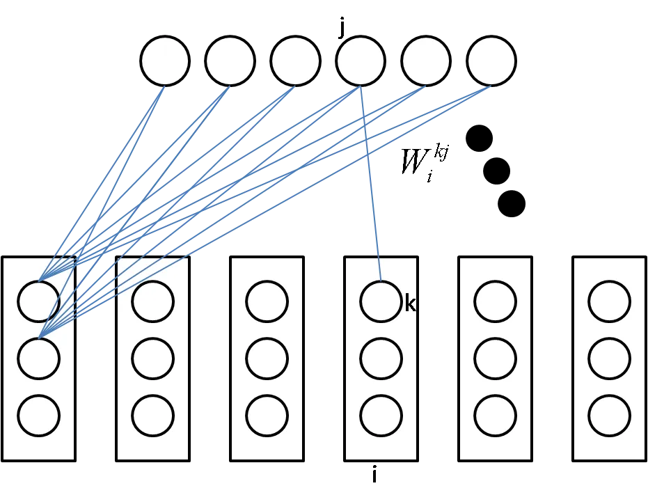
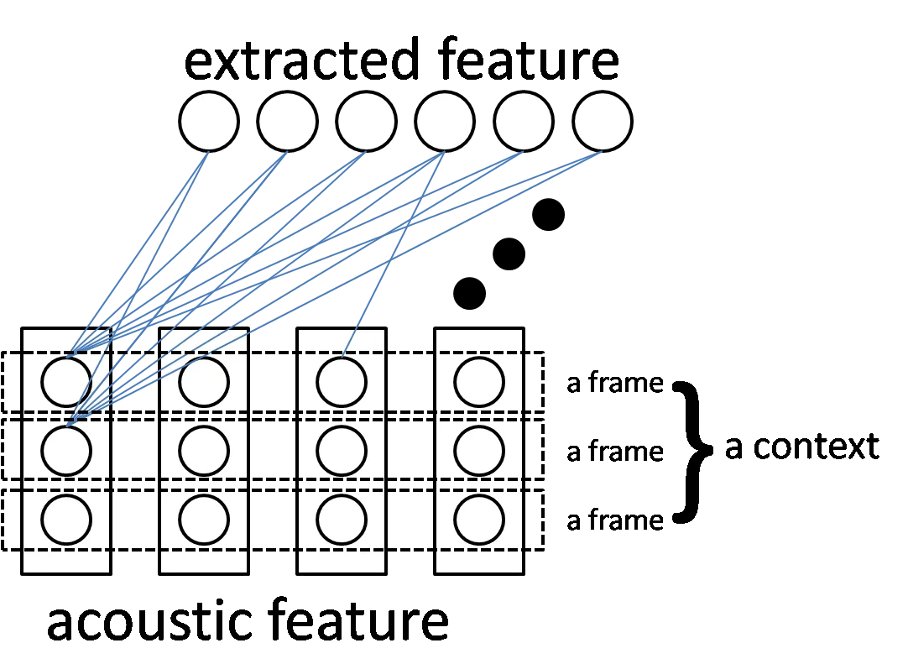

# Feature Learning with Gaussian Restricted Boltzmann Machine for Robust Speech Recognition

###### Abstract

In this paper, we first present a new variant of Gaussian restricted
Boltzmann machine (GRBM) called multivariate Gaussian restricted
Boltzmann machine (MGRBM), with its definition and learning algorithm.
Then we propose using a learned GRBM or MGRBM to extract better features
for robust speech recognition. Our experiments on Aurora2 show that both
GRBM-extracted and MGRBM-extracted feature performs much better than
Mel-frequency cepstral coefficient (MFCC) with either HMM-GMM or hybrid
HMM-deep neural network (DNN) acoustic model, and MGRBM-extracted
feature is slightly better.

|                                                                                           |
| ----------------------------------------------------------------------------------------- |
| Xin Zheng^(1,2), Zhiyong Wu^(1,2,3), Helen Meng^(1,3), Weifeng Li¹, Lianhong Cai^(1,2)    |
| ¹Tsinghua-CUHK Joint Research Center for Media Sciences, Technologies and Systems         |
| Shenzhen Key Laboratory of Information Science and Technology                             |
| Graduate School at Shenzhen, Tsinghua University, Shenzhen 518055, China                  |
| ²Tsinghua National Laboratory for Information Science and Technology (TNList)             |
| Department of Computer Science and Technology, Tsinghua University, Beijing 100084, China |
| ³Department of Systems Engineering and Engineering Management                             |
| The Chinese University of Hong Kong, Shatin, N.T., Hong Kong SAR, China                   |
| zhengx11@mails.tsinghua.edu.cn, zywu@sz.tsinghua.edu.cn, hmmeng@se.cuhk.edu.hk,           |
| li.weifeng@sz.tsinghua.edu.cn, clh-dcs@tsinghua.edu.cn                                    |

Index Terms: restricted Boltzmann machine, robust speech recognition,
feature learning

## 1 Introduction

Since hybrid hidden markov model (HMM)-deep neural network (DNN) was
introduced to large-vocabulary continuous speech recognition (LVCSR),
the accuracy of speech recognition system has made significant
performance improvements in idealized environments \[1\]\[2\]. Such
progression urges the development of speech recognition systems that are
robust to background noise and channel distortion, as more and more
speech applications are deploying on mobile devices. State-of-the-art
robust automatic speech recognition system usually involves intensive
specialized domain knowledge \[3\]. But we are more interested in the
transformation of feature.

Feature learning (representation learning) \[4\] is a developing field
that grows alongside with deep learning. The aim of feature learning is
to learn a certain kind of transformation through which we are able to
extract information that makes discrimination much easier for
classifiers. Feature learning needs as little feature engineering as
possible, and transformed feature is much closer to real underlying
factors that generate the original features that we observe.

In this paper, we made our first attempt to apply the idea of feature
learning to robust speech recognition. Although dozens of alternatives
have been proposed over the past few decades, MFCC is still the default
choice of feature for many speech applications. Instead of trying to
propose another alternative, we are more interested in learning a better
representation of MFCC feature with restricted Boltzmann machine (RBM)
and its variants. We will explain why RBM may be able to learn a more
suitable representation of MFCC for robust speech recognition. We will
also be proposing a new variant of RBM called multivariate Gaussian
restricted Boltzmann machine (MGRBM) which is specially designed for
modeling the distribution of speech data. MGRBM is able to capture the
evolving characteristic of speech within a context of several frames
which is difficult to model with a Gaussian restricted Boltzmann machine
(GRBM). We perform our experiments on the Aurora2 corpus and our results
show that the learned features are better than the original feature for
robust speech recognition.

## 2 Model

### 2.1 Restricted Boltzmann Machine

The Boltzman machine is a special kind of Markov random field which
models the joint probability distribution of the visible variable and
hidden variable. Visible and hidden variable are both defined to be
multidimensional Bernoulli variables. The distribution can be written
as:

```math
\displaystyle p(v,h)=\frac{1}{Z}e^{-E(v,h;\theta)} \tag{1}
```

and

```math
\displaystyle E(v,h;\theta)=-\frac{1}{2}v^{T}Uv-\frac{1}{2}h^{T}Vh-v^{T}Wh-a^{T}v-b^{T}h \tag{2}
```

$`E(v,h;\theta)`$ in (1) is called energy function.
$`\theta=\{U,V,W,a,b\}`$. $`U,V,W`$ models the visible-visible,
hidden-hidden, and visible-hidden interaction respectively. $`a`$ and
$`b`$ are bias vectors.

The Restricted Boltzmann Machine (RBM) \[5\] is perhaps the most
widely-used variant of Boltzmann machine. The energy function of RBM is
the simplified version of that in the Boltzmann machine by making
$`U=0`$ and $`V=0`$. That is, the energy function of an RBM is:

```math
\displaystyle E(v,h;\theta)=-a^{T}v-b^{T}h-v^{T}Wh \tag{3}
```

An RBM is typically trained with maximum likelihood estimation. Taking
the derivative with respect to the logarithm of the product of all the
probability of training cases, we can derive the learning algorithm of
RBM as follows:

```math
\displaystyle\Delta W \displaystyle= \displaystyle\epsilon(<vh^{T}>_{data}-<vh^{T}>_{model}) \tag{4}
```

```math
\displaystyle\Delta a \displaystyle= \displaystyle\epsilon(<v>_{data}-<v>_{model}) \tag{5}
```

```math
\displaystyle\Delta b \displaystyle= \displaystyle\epsilon(<h>_{data}-<h>_{model}) \tag{6}
```

The symbol $`<\cdot>_{data}`$ in (4)(5)(6) represents an average with
respect to the conditional distribution $`p(v|h)`$ and
$`<\cdot>_{model}`$ represents an average with respect to the joint
distribution $`p(v,h)`$. The $`<\cdot>_{data}`$ for RBM is generally
easy to train because:

```math
\displaystyle p(h_{j}=1|v)=sigmoid(b_{j}+W_{j}v) \tag{7}
```

```math
\displaystyle p(v_{i}=1|h)=sigmoid(a_{i}+W_{\cdot i}^{T}h) \tag{8}
```

(7)(8) can be derived from the definition of RBM and
$`sigmoid(x)=\frac{1}{1+e^{-x}}`$. However, $`<\cdot>_{model}`$ is much
harder to obtain. To address this problem, $`<\cdot>_{model}`$ is
usually approximated with $`<\cdot>_{recon}`$ as the following:

```math
\displaystyle\Delta W \displaystyle= \displaystyle\epsilon(<vh^{T}>_{data}-<vh^{T}>_{recon}) \tag{9}
```

```math
\displaystyle\Delta a \displaystyle= \displaystyle\epsilon(<v>_{data}-<v>_{recon}) \tag{10}
```

```math
\displaystyle\Delta b \displaystyle= \displaystyle\epsilon(<h>_{data}-<h>_{recon}) \tag{11}
```

The $`<\cdot>_{recon}`$ represents an average with respect to the
reconstruction of the visible data. The reconstruction of visible data
is obtained by setting each node in hidden layer value 1 with
probability (7), followed by setting each node in visible layer value 1
with probability (8). This is the contrastive divergence algorithm (CD)
\[6\] for training of RBM. CD has been empirically showed to be adequate
for many applications.

### 2.2 Gaussian Restricted Boltzmann Machine

To model real-valued data, the Gaussian restricted Boltzmann machine
(GRBM) has been proposed \[7\]\[8\]. The energy function of GRBM is
typically defined with:

```math
\displaystyle E(v,h;\theta)=\sum_{i}\frac{(v_{i}-a_{i})^{2}}{2\sigma_{i}^{2}}-\sum_{ij}W_{ij}\frac{v_{i}}{\sigma_{i}}h_{j}-\sum_{j}b_{j}h_{j} \tag{12}
```

in which $`\theta=\{a,b,W,\sigma\}`$ and $`\sigma_{i}`$ models the
standard deviation of each visible units.

Conveniently, the learning algorithm of GRBM is the same with RBM
(9)(10)(11). The conditional probabilities necessary for CD of a GRBM
are:

```math
\displaystyle p(v_{i}|h)=\mathcal{N}(a_{i}+\sigma_{i}\sum_{j}W_{ij}h_{j},\sigma_{i}^{2}) \tag{13}
```

```math
\displaystyle p(h_{j}=1|v)=sigmoid(b_{j}+\sum_{i}W_{ij}\frac{v_{i}}{\sigma_{i}}) \tag{14}
```

Generally speaking, $`\sigma_{i}`$ can be learned from data, but it’s
difficult with CD. The training data to be modeled with a GRBM are
always pre-processed mean 0 and variance 1 and thus $`\sigma_{i}`$ can
be fixed with 1 and not trained. The reason why $`\sigma_{i}`$ is
difficult to train with CD can be explained as follows: When
$`\sigma_{i}`$ is much smaller than 1, the visible-hidden effects (13)
tends to be large and hidden-visible effects (14) tends to be small. The
result of such effect is that hidden units always tend to be firmly 1 or
0, and thus undermine the whole training process.

One disadvantage of GRBM is its conditional independence assumption.
That is, conditioned on the hidden layer, each visible unit is assumed
to follow a Gaussian distribution and independent with each other.
However, for natural data such as speech and image, they tend to have
local similarity property. Take speech data for example, the smoothness
of speech always makes one frame of acoustic feature similar to the
frames next to it. Such local similarity property is difficult to
capture with GRBM and yet contains certain amount of information. To
offset this problem, we propose a variant of GRBM called multivariate
Gaussian restricted Boltzmann machine.

### 2.3 Multivariate Gaussian Restricted Boltzmann Machine



Figure 1: Graphical model of a multivariate Gaussian restricted
Boltzmann machine. Links between sub-units in visible layer and hidden
units are fully connected. The interaction of the $`k`$th sub-unit in
the $`i`$th visible unit with $`j`$th hidden unit is modeled with
$`W_{i}^{kj}`$.

The multivariate Gaussian restricted Boltzmann machine (MGRBM) is a
natural generalization of GRBM. The graphical model of a MGRBM is
illustrated in Figure 1. Compared with GRBM, in which each unit in
visible layer is modeled with a Gaussian distribution given the hidden
layer, a MGRBM assumes that each unit in visible layer is modeled with a
multivariate Gaussian distribution given the hidden layer. Similar to
what $`\sigma_{i}`$ models in a GRBM, we denote the covariance matrix of
each unit in visible layer of a MGRBM with $`\Sigma_{i}`$. Consider only
the non-degenerate case, $`\Sigma_{i}`$ is a positive-definite matrix
and thus Cholesky decomposition can be applied: $`\Sigma_{i}=AA^{T}`$.
Since matrix $`A`$ is full-rank, we can denote $`B=A^{-1}`$. With these
notation, we can define the energy function of an MGRBM as:

```math
\displaystyle\begin{split}E(v,h;\theta)=\frac{1}{2}\sum_{i}(v_{i}-\mu_{i})^{T}B_{i}B_{i}^{T}(v_{i}-\mu_{i})\\
-\sum_{i}v_{i}^{T}B_{i}W_{i}h-b^{T}h\end{split} \tag{15}
```

Suppose the number of units in visible layer and hidden layer is
$`N_{v}`$ and $`N_{h}`$ respectively, and each unit in visible layer has
$`d`$ dimension. Then $`v_{i},\mu_{i}`$ each is a $`d\times 1`$ vector;
$`B_{i}`$ each is a $`d\times d`$ matrix; $`W_{i}`$ each is a
$`d\times N_{h}`$ matrix; $`b`$ and $`h`$ are both $`N_{h}\times 1`$
vectors.

Similar to GRBM, we can also prove that:

```math
\displaystyle p(v_{i}|h)=\mathcal{N}(\mu_{i}+(B_{i}^{T})^{-1}W_{i}h,(B_{i}^{T})^{-1}B_{i}^{-1}) \tag{16}
```

```math
\displaystyle p(h_{j}=1|v)=sigmoid(b_{j}+\sum_{i}W_{ij}^{T}B_{i}v_{i}) \tag{17}
```

and learning algorithm is:

```math
\displaystyle\begin{split}\Delta\mu_{i}=\epsilon(<B_{i}B_{i}^{T}(v_{i}-\mu_{i})>_{data}\\
-<B_{i}B_{i}^{T}(v_{i}-\mu_{i})>_{model})\end{split} \tag{18}
```

```math
\displaystyle\Delta b=\epsilon(<h>_{data}-<h>_{model}) \tag{19}
```

```math
\displaystyle\Delta W_{i}=\epsilon(<B_{i}^{T}v_{i}h^{T}>_{data}-<B_{i}^{T}v_{i}h^{T}>_{model}) \tag{20}
```

```math
\displaystyle\begin{split}\Delta B_{i}=\epsilon(<(v_{i}-\mu_{i})(v_{i}-\mu_{i})^{T}B_{i}-v_{i}h^{T}W_{i}^{T}>_{data}\\
-<(v_{i}-\mu_{i})(v_{i}-\mu_{i})^{T}B_{i}-v_{i}h^{T}W_{i}^{T}>_{model})\end{split} \tag{21}
```

In our experiment, we use persistent contrastive divergence (PCD) \[9\]
to train MGRBM. The algorithm can be written as:

```math
\displaystyle\begin{split}\Delta\mu_{i}=\epsilon(<B_{i}B_{i}^{T}(v_{i}-\mu_{i})>_{data}\\
-<B_{i}B_{i}^{T}(v_{i}-\mu_{i})>_{fanta})\end{split} \tag{22}
```

```math
\displaystyle\Delta b=\epsilon(<h>_{data}-<h>_{fanta}) \tag{23}
```

```math
\displaystyle\Delta W_{i}=\epsilon(<B_{i}^{T}v_{i}h^{T}>_{data}-<B_{i}^{T}v_{i}h^{T}>_{fanta}) \tag{24}
```

```math
\displaystyle\begin{split}\Delta B_{i}=\epsilon(<(v_{i}-\mu_{i})(v_{i}-\mu_{i})^{T}B_{i}-v_{i}h^{T}W_{i}^{T}>_{data}\\
-<(v_{i}-\mu_{i})(v_{i}-\mu_{i})^{T}B_{i}-v_{i}h^{T}W_{i}^{T}>_{fanta})\end{split} \tag{25}
```

with $`<\cdot>_{fanta}`$ denotes average with respect to fantasy
particles.

Notice that the problem for updating variances in a GRBM which we
described in section 2.2 still exists in MGRBM. In section 3.1 we will
explain how we address this problem in our experiments.

MGRBM is specially designed for speech data to address the problem of
GRBM described above. Typically, for the task of speech recognition with
hybrid HMM-neural network (NN) method, a context of several frames of
acoustic feature is used for each training case. Unlike GRBM, MGRBM can
explicitly model the evolving characteristics in each context. How a
MGRBM can be used for robust feature extraction is illustrated in figure 2. Concretely, suppose the original acoustic feature for each frame has
$`D`$ dimensions and each context is chosen to be $`C`$ frames. Then the
visible layer of MGRBM has $`D`$ units, each has dimension $`C`$; the
$`d`$th dimension in the $`c`$th frame acoustic feature corresponds to
the $`c`$th dimension of $`d`$th unit.



Figure 2: Extract new feature from acoustic feature with multivariate
Gaussian restricted Boltzmann machine.

There are two reasons for the above setting. First, the correlation
modeled across each dimension of acoustic feature would act as a strong
regularization in temporal perspective if training data is much
different from testing data. Second, as is the case with GRBM, MGRBM
also has conditional independence assumption. Fortunately, this
assumption is indeed satisfied if we use MFCC as acoustic feature, for
the step of discrete cosine transform already has the effect of
decorrelation.

### 2.4 Feature Learning for Robust Speech Recognition

Despite of its prevalence and huge success in phoneme recognition
\[10\]\[11\] and LVCSR \[1\], deep neural network (DNN) stand alone is
rarely used as a acoustic model for robust speech recognition. We
believe that this is due to the fact that neural network is a
discriminative model, whose optimization objective is better
discriminative power and lower classification error. However, for the
task of robust speech recognition, especially in mismatched scenario
where the training data is clean and the testing data is noisy, the
power of such model is greatly degraded due to its poor generalization
over highly distorted data. We assert that DNN performs significantly
poorly in very noisy conditions than GMM and we will prove it in our
experiments later.

Generative models focus on modeling how the data is “generated”. Natural
data such as speech and image are usually high-dimensional, but all that
make sense occupy only a subspace (or lower-dimensional manifold). The
learning process of a generative model is essentially to find out this
manifold by tuning all its parameters. Background noise from real-life
environment, we believe, is substantially different from white noise,
because the former kind of signal contains certain characteristic shared
with sounds that spread through the air. For this reason, we consider it
more appropriate to model speech with generative models. So, we would
like to find a model that can leverage such advantage of generative
models and yet escape from a model with strong assumption like GMM, and
RBM is indeed a such model.

As a generative model, RBM (and its variants) makes little assumption of
data. What is more important, it belongs to a family called product of
experts (as opposed to mixture of experts which GMM belongs to) \[12\].
This makes it exponentially more powerful and less prone to
over-fitting. Other than modeling the distribution of data, it provides
a natural way to transform feature by applying (7)(14)(17). Since such
transformation takes the whole distribution of data into consideration,
the learned feature tends to be much more abstract and expressive.

## 3 Experiments

In this paper, we used the Aurora2 data set \[13\] for our experiments.
In all the experiments described below, we used only clean data set as
training data and whole test set as testing data.

We intentionally use acoustic models that are simple and comparable. Two
different kinds of acoustic model is utilized in our experiments :
HMM-GMM and hybrid HMM-DNN. With each kind of acoustic model, we compare
the word error rate (WER) of three kinds of feature : MFCC (12
coefficients + energy + delta + acceleration, 39-dimension),
GRBM-extracted feature (G-feature) and MGRBM-extracted feature
(M-feature). We used standard Aurora2 setup described in \[13\] for
baseline system (GMM + MFCC). We use DNN simply because it is a good
classifier and it is much more natural to employ RBM-extracted feature.

### 3.1 RBM Training

We used two kinds of RBM in our experiment, one for feature extraction
and the other for pre-training of DNN.

GRBM and MGRBM are both trained to extract feature for comparison. For
these GRBMs and MGRBMs, PCD with stochastic gradient descent (SGD) was
used. The size of a mini-batch is 128 and no momentum was applied. The
number of fantasy particles was the same with the size of a mini-batch,
and one full Gibbs update was performed for each gradient estimate. For
all the weights and biases, learning rate was 0.001. For the updating of
$`B_{i}`$ in (15) of an MGRBM, learning rate was 0.0001. To avoid the
problem of updating variances described in section 2.2, we divide each
$`B_{i}`$ by its trace after each updating. This step makes all diagonal
elements of $`B_{i}`$ fixed with one and thus make the learning stable.
All GRBM and MGRBM were trained for 400 epochs and each with 1024 hidden
units, which made G-feature and M-feature both has 1024 dimensions. The
visible layer corresponds to a context of 9 frame of MFCC feature, which
makes the number of visible units of GRBM 351 and MGRBM 39$`\times`$9.

For all the GRBMs and RBMs that were used for pre-training DNNs, CD
algorithm (CD-1), SGD with batch size 128 and a momentum of 0.9 were
used. We trained all the RBMs with learning rate of 0.01 for 50 epochs
and all the GRBMs with learning rate of 0.001 for 100 epochs.

### 3.2 DNN Training

All DNNs in our experiments have 4 hidden layers, each hidden layer with
1024 units. DNNs were pre-trained with stacked RBM (section 3.1) as
described in \[14\] and fine-tuned with back-propagation algorithm with
SGD as described in \[11\]. The learning rate for back-propagation
started from 1.0 and was halved if an increase of substitution error on
development set was observed during the end of each epoch and all the
weights roll-back to the end of last epoch. When using MFCC feature, the
input layer of DNN corresponds to 9 frame of MFCC, which is 351 units.
The output layer has 180 units, with each unit corresponding to each
state in HMM. All data to be trained with DNN are normalized to have
mean 0 and variance 1 with respect to each dimension.

### 3.3 Results

All results from our experiments are shown in Table 1. We averaged WER
in all test set across different noises. The first thing we should
notice is that in the lowest SNR condition, HMM-DNN performs
consistently poorer than HMM-GMM, which confirms our assertion in
section 2.4. Those WER that exceeded 100% was due to many substitution
errors. From the last three columns, we can clearly see the advantage of
G-feature over MFCC and M-feature over G-feature. Although the
improvements does not seems to be obvious, the trend that the gap
between M-feature and G-feature increases with the decrease of SNR is
still distinguishable. The reason why the improvements of M-feature over
G-feature is marginal, we believe, is that the model which we trained is
still not good enough. All the learning rates, number of epochs and
number of hidden units are chosen heuristically, and 9 frame of context
might be not sufficiently long. So there is no reason to believe we have
exploited the full potential of MGRBM.

|       |       |              |              |        |        |        |
| ----- | ----- | ------------ | ------------ | ------ | ------ | ------ |
| SNR   | GMM   |              |              | DNN    |        |        |
|       | MFCC  | G-feat (PCA) | M-feat (PCA) | MFCC   | G-feat | M-feat |
| Clean | 1.05  | 1.94         | 2.75         | 1.27   | 0.76   | 0.82   |
| 20dB  | 6.10  | 4.28         | 6.21         | 3.76   | 2.93   | 2.49   |
| 15dB  | 15.18 | 8.50         | 13.67        | 9.09   | 6.47   | 5.64   |
| 10dB  | 34.82 | 21.64        | 32.06        | 25.85  | 17.37  | 15.79  |
| 5dB   | 61.27 | 49.80        | 59.75        | 58.05  | 41.87  | 40.99  |
| 0dB   | 82.56 | 75.15        | 79.89        | 93.16  | 78.32  | 75.28  |
| -5dB  | 91.20 | 87.59        | 90.07        | 108.79 | 106.20 | 94.68  |

Table 1: Comparison of different features, all numbers are percentage of
WER. G-feat and M-feat here represents G-feature and M-feature
respectively.

With HMM-GMM as acoustic model, the comparison is not so
straightforward, because training a 1024-dimensional GMM would leads to
severe over-fitting. So we reduced the dimension of G-feature and
M-feature to 39 dimensions with principal component analysis (PCA).
Notice that this is actually not the right thing to do, because the sum
of top 39 eigenvalues only consists 91.8% and 69.7% of sum of all
eigenvalues for G-feature and M-feature respectively. Despite of such
great loss of information, both G-feature and M-feature performs better
than MFCC for all SNR levels except the clean speech.

## 4 Conclusion and Discussion

In this paper, we briefly reviewed the definition and learning algorithm
of RBM and GRBM. We then propose a new variant of RBM called MGRBM by
which we would like to model the covariance of adjacent frames within
each context. After that we offered an explanation of why a feature
learned with RBM (and its variants) might be able to enhance the
performance of robust speech recognition over original feature. Finally
we performed our experiments on Aurora2 and showed that feature that
learned with GRBM and MGRBM would indeed improve the average accuracy
across environment in every SNR condition over original MFCC feature.

Throughout the process of feature learning with GRBM, virtually nothing
is presupposed. This makes it adaptable with any feature generated from
a front-end. Aside from training a GRBM, which can be done off-line, the
extra cost of the feature transformation is merely a multiplication with
a matrix. From this perspective, feature learning with GRBM is similar
to the TANDEM system \[15\], but the latter is purely supervised. Hence
many advantages can be gained if lots of data is accessible but little
is labeled. What is more important, GRBM-extracted feature can be used
for the TANDEM System seamlessly, which makes TANDEM system
semi-supervised and thus further enhancement of performance can be
achieved.

## 5 Acknowledgements

This work is partially supported by the National Basic Research Program
(973 Program) of China(2012CB316401), the National Natural Science
Foundation of China (60928005, 60805008, 60931160443 and 61003094), the
Ph.D. Programs Foundation of Ministry of Education of China
(200800031015), the Upgrading Plan Project of Shenzhen Key Laboratory
and the Science and Technology R&D Funding of the Shenzhen Municipal.

## References

- \[1\] G. Dahl, D. Yu, L. Deng, , and A. Acero, “Large vocabulary
  continuous speech recognition with context-dependent dbn-hmms,” in
  _Proc. ICASSP_, 2011.
- \[2\] G. E. Hinton, L. Deng, D. Yu, G. Dahl, A. Mohamed, N. Jaitly,
  A. Senior, V. Vanhoucke, P. Nguyen, T. Sainathand, and B. Kingsbury,
  “Deep neural networks for acoustic modeling in speech recognition,”
  _IEEE Signal Processing Magazine_, 2012.
- \[3\] ETSI, “Advanced front-end feature extraction algorithm,” ETSI ES
  202 050, Tech. Rep., 2007.
- \[4\] Y. Bengio, A. Courville, and P. Vincent, “Representation
  learning: A review and new perspectives,” arXiv:1206.5538 \[cs.LG\].
- \[5\] P. Smolensky, “Information processing in dynamical systems:
  Foundations of harmony theory,” _Parallel Distributed Processing:
  Explorations in the Microstructure of Cognition_, vol. 1, 1986.
- \[6\] G. E. Hinton, “Training products of experts by minimizingc
  ontrastive divergence,” _Neural Computation_, vol. 14, pp.
  1771–1800, 2002.
- \[7\] G. E. Hinton and R. Salakhutdinov, “Reducing the dimensionality
  of data with neural networks,” _Science_, vol. 313, pp. 504–507, 2006.
- \[8\] G. W. Taylor, G. E. Hinton, and S. T. Roweis, “Two
  distributed-state models for generating high-dimensional time series,”
  _The Journal of Machine Learning Research_, vol. 12, pp.
  1025–1068, 2011.
- \[9\] T. Tieleman, “Training restricted boltzmann machines using
  approximations to the likelihood gradient,” in _Proc. of ICML_, 2008.
- \[10\] A. Mohamed, G. E. Dahl, and G. E. Hinton, “Deep belief networks
  for phone recognition,” in _NIPS Workshop on Deep Learning for Speech
  Recognition and Related Applications_, 2009.
- \[11\] A. Mohamed, G. Dahl, and G. Hinton, “Acoustic modeling using
  deep belief networks,” _IEEE Trans. on Audio, Speech and Language
  Processing_, 2011.
- \[12\] G. E. Hinton, “Products of experts,” _ICANN_, vol. 1, pp.
  1–6, 1999.
- \[13\] H. G. Hirsch and D. Pierce, “The aurora experimental framework
  for the performance evaluation of speech recognition systems under
  noise conditions,” in _Proc. ISCA ITRW ASR2000_, 2000.
- \[14\] G. E. Hinton, S. Osindero, and Y. Teh, “A fast learning
  algorithm for deep belief nets,” _Neural Computation_, vol. 18, pp.
  1527–1554, 2006.
- \[15\] H. Hermansky, D. P. W. Ellis, and S. Sharma, “Tandem
  connectionist feature extraction for conventional hmm systems,” in
  _Proc. ICASSP_, 2000, pp. 1635–1638.
