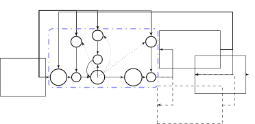

# LONG SHORT-TERM MEMORY BASED RECURRENT NEURAL NETWORK ARCHITECTURES FOR LARGE VOCABULARY SPEECH RECOGNITION

Haşim Sak    Andrew Senior    Françoise Beaufays

###### Abstract

Long Short-Term Memory (LSTM) is a recurrent neural network (RNN)
architecture that has been designed to address the vanishing and
exploding gradient problems of conventional RNNs. Unlike feedforward
neural networks, RNNs have cyclic connections making them powerful for
modeling sequences. They have been successfully used for sequence
labeling and sequence prediction tasks, such as handwriting recognition,
language modeling, phonetic labeling of acoustic frames. However, in
contrast to the deep neural networks, the use of RNNs in speech
recognition has been limited to phone recognition in small scale tasks.
In this paper, we present novel LSTM based RNN architectures which make
more effective use of model parameters to train acoustic models for
large vocabulary speech recognition. We train and compare LSTM, RNN and
DNN models at various numbers of parameters and configurations. We show
that LSTM models converge quickly and give state of the art speech
recognition performance for relatively small sized models. ¹¹ 1 The
original manuscript has been submitted to ICASSP 2014 conference on
November 4, 2013 and it has been rejected due to having content on the
reference only 5th page. This version has been slightly edited to
reflect the latest experimental results.

###### Index Terms: 

Long Short-Term Memory, LSTM, recurrent neural network, RNN, speech
recognition.

^(†)^(†)address: Google  
{hasim,andrewsenior,fsb@google.com}

## 1 Introduction

Unlike feedforward neural networks (FFNN) such as deep neural networks
(DNNs), the architecture of recurrent neural networks (RNNs) have cycles
feeding the activations from previous time steps as input to the network
to make a decision for the current input. The activations from the
previous time step are stored in the internal state of the network and
they provide indefinite temporal contextual information in contrast to
the fixed contextual windows used as inputs in FFNNs. Therefore, RNNs
use a dynamically changing contextual window of all sequence history
rather than a static fixed size window over the sequence. This
capability makes RNNs better suited for sequence modeling tasks such as
sequence prediction and sequence labeling tasks.

However, training conventional RNNs with the gradient-based
back-propagation through time (BPTT) technique is difficult due to the
vanishing gradient and exploding gradient problems \[1\]. In addition,
these problems limit the capability of RNNs to model the long range
context dependencies to 5-10 discrete time steps between relevant input
signals and output.

To address these problems, an elegant RNN architecture – Long Short-Term
Memory (LSTM) – has been designed \[2\]. The original architecture of
LSTMs contained special units called memory blocks in the recurrent
hidden layer. The memory blocks contain memory cells with
self-connections storing (remembering) the temporal state of the network
in addition to special multiplicative units called gates to control the
flow of information. Each memory block contains an input gate which
controls the flow of input activations into the memory cell and an
output gate which controls the output flow of cell activations into the
rest of the network. Later, to address a weakness of LSTM models
preventing them from processing continuous input streams that are not
segmented into subsequences – which would allow resetting the cell
states at the begining of subsequences – a forget gate was added to the
memory block \[3\]. A forget gate scales the internal state of the cell
before adding it as input to the cell through self recurrent connection
of the cell, therefore adaptively forgetting or resetting cell’s memory.
Besides, the modern LSTM architecture contains peephole connections from
its internal cells to the gates in the same cell to learn precise timing
of the outputs \[4\].

LSTMs and conventional RNNs have been successfully applied to sequence
prediction and sequence labeling tasks. LSTM models have been shown to
perform better than RNNs on learning context-free and context-sensitive
languages \[5\]. Bidirectional LSTM networks similar to bidirectional
RNNs \[6\] operating on the input sequence in both direction to make a
decision for the current input has been proposed for phonetic labeling
of acoustic frames on the TIMIT speech database \[7\]. For online and
offline handwriting recognition, bidirectional LSTM networks with a
connectionist temporal classification (CTC) output layer using a forward
backward type of algorithm which allows the network to be trained on
unsegmented sequence data, have been shown to outperform a state of the
art HMM-based system \[8\]. Recently, following the success of DNNs for
acoustic modeling \[9, 10, 11\], a deep LSTM RNN – a stack of multiple
LSTM layers – combined with a CTC output layer and an RNN transducer
predicting phone sequences – has been shown to get the state of the art
results in phone recognition on the TIMIT database \[12\]. In language
modeling, a conventional RNN has obtained very significant reduction of
perplexity over standard $`n`$-gram models \[13\].

While DNNs have shown state of the art performance in both phone
recognition and large vocabulary speech recognition \[9, 10, 11\], the
application of LSTM networks has been limited to phone recognition on
the TIMIT database, and it has required using additional techniques and
models such as CTC and RNN transducer to obtain better results than
DNNs.

In this paper, we show that LSTM based RNN architectures can obtain
state of the art performance in a large vocabulary speech recognition
system with thousands of context dependent (CD) states. The proposed
architectures modify the standard architecture of the LSTM networks to
make better use of the model parameters while addressing the
computational efficiency problems of large networks.

## 2 LSTM Architectures

In the standard architecture of LSTM networks, there are an input layer,
a recurrent LSTM layer and an output layer. The input layer is connected
to the LSTM layer. The recurrent connections in the LSTM layer are
directly from the cell output units to the cell input units, input
gates, output gates and forget gates. The cell output units are
connected to the output layer of the network. The total number of
parameters $`W`$ in a standard LSTM network with one cell in each memory
block, ignoring the biases, can be calculated as follows:

```math
W=n_{c}\times n_{c}\times 4+n_{i}\times n_{c}\times 4+n_{c}\times n_{o}+n_{c}\times 3
```

where $`n_{c}`$ is the number of memory cells (and number of memory
blocks in this case), $`n_{i}`$ is the number of input units, and
$`n_{o}`$ is the number of output units. The computational complexity of
learning LSTM models per weight and time step with the stochastic
gradient descent (SGD) optimization technique is $`O(1)`$. Therefore,
the learning computational complexity per time step is $`O(W)`$. The
learning time for a network with a relatively small number of inputs is
dominated by the $`n_{c}\times(n_{c}+n_{o})`$ factor. For the tasks
requiring a large number of output units and a large number of memory
cells to store temporal contextual information, learning LSTM models
become computationally expensive.

As an alternative to the standard architecture, we propose two novel
architectures to address the computational complexity of learning LSTM
models. The two architectures are shown in the same Figure 1. In one of
them, we connect the cell output units to a recurrent projection layer
which connects to the cell input units and gates for recurrency in
addition to network output units for the prediction of the outputs.
Hence, the number of parameters in this model is
$`n_{c}\times n_{r}\times 4+n_{i}\times n_{c}\times 4+n_{r}\times n_{o}+n_{c}\times n_{r}+n_{c}\times 3`$,
where $`n_{r}`$ is the number of units in the recurrent projection
layer. In the other one, in addition to the recurrent projection layer,
we add another non-recurrent projection layer which is directly
connected to the output layer. This model has
$`n_{c}\times n_{r}\times 4+n_{i}\times n_{c}\times 4+(n_{r}+n_{p})\times n_{o}+n_{c}\times(n_{r}+n_{p})+n_{c}\times 3`$
parameters, where $`n_{p}`$ is the number of units in the non-recurrent
projection layer and it allows us to increase the number of units in the
projection layers without increasing the number of parameters in the
recurrent connections ($`n_{c}\times n_{r}\times 4`$). Note that having
two projection layers with regard to output units is effectively
equivalent to having a single projection layer with $`n_{r}+n_{p}`$
units.

An LSTM network computes a mapping from an input sequence
$`x=(x_{1},...,x_{T})`$ to an output sequence $`y=(y_{1},...,y_{T})`$ by
calculating the network unit activations using the following equations
iteratively from $`t=1`$ to $`T`$:

```math
\displaystyle i_{t}=\sigma(W_{ix}x_{t}+W_{im}m_{t-1}+W_{ic}c_{t-1}+b_{i}) \tag{1}
```

```math
\displaystyle f_{t}=\sigma(W_{fx}x_{t}+W_{mf}m_{t-1}+W_{cf}c_{t-1}+b_{f}) \tag{2}
```

```math
\displaystyle c_{t}=f_{t}\odot c_{t-1}+i_{t}\odot g(W_{cx}x_{t}+W_{cm}m_{t-1}+b_{c}) \tag{3}
```

```math
\displaystyle o_{t}=\sigma(W_{ox}x_{t}+W_{om}m_{t-1}+W_{oc}c_{t}+b_{o}) \tag{4}
```

```math
\displaystyle m_{t}=o_{t}\odot h(c_{t}) \tag{5}
```

```math
\displaystyle y_{t}=W_{ym}m_{t}+b_{y} \tag{6}
```

where the $`W`$ terms denote weight matrices (e.g. $`W_{ix}`$ is the
matrix of weights from the input gate to the input), the $`b`$ terms
denote bias vectors ($`b_{i}`$ is the input gate bias vector),
$`\sigma`$ is the logistic sigmoid function, and $`i`$, $`f`$, $`o`$ and
$`c`$ are respectively the input gate, forget gate, output gate and cell
activation vectors, all of which are the same size as the cell output
activation vector $`m`$, $`\odot`$ is the element-wise product of the
vectors and $`g`$ and $`h`$ are the cell input and cell output
activation functions, generally $`tanh`$.

With the proposed LSTM architecture with both recurrent and
non-recurrent projection layer, the equations are as follows:

```math
\displaystyle i_{t}=\sigma(W_{ix}x_{t}+W_{ir}r_{t-1}+W_{ic}c_{t-1}+b_{i}) \tag{7}
```

```math
\displaystyle f_{t}=\sigma(W_{fx}x_{t}+W_{rf}r_{t-1}+W_{cf}c_{t-1}+b_{f}) \tag{8}
```

```math
\displaystyle c_{t}=f_{t}\odot c_{t-1}+i_{t}\odot g(W_{cx}x_{t}+W_{cr}r_{t-1}+b_{c}) \tag{9}
```

```math
\displaystyle o_{t}=\sigma(W_{ox}x_{t}+W_{or}r_{t-1}+W_{oc}c_{t}+b_{o}) \tag{10}
```

```math
\displaystyle m_{t}=o_{t}\odot h(c_{t}) \tag{11}
```

```math
\displaystyle r_{t}=W_{rm}m_{t} \tag{12}
```

```math
\displaystyle p_{t}=W_{pm}m_{t} \tag{13}
```

```math
\displaystyle y_{t}=W_{yr}r_{t}+W_{yp}p_{t}+b_{y} \tag{14}
```

where the $`r`$ and $`p`$ denote the recurrent and optional
non-recurrent unit activations.



Figure 1: LSTM based RNN architectures with a recurrent projection layer
and an optional non-recurrent projection layer. A single memory block is
shown for clarity.

### 2.1 Implementation

We choose to implement the proposed LSTM architectures on multi-core CPU
on a single machine rather than on GPU. The decision was based on CPU’s
relatively simpler implementation complexity and ease of debugging. CPU
implementation also allows easier distributed implementation on a large
cluster of machines if the learning time of large networks becomes a
major bottleneck on a single machine \[14\]. For matrix operations, we
use the Eigen matrix library \[15\]. This templated C++ library provides
efficient implementations for matrix operations on CPU using vectorized
instructions (SIMD – single instruction multiple data). We implemented
activation functions and gradient calculations on matrices using SIMD
instructions to benefit from parallelization.

We use the asynchronous stochastic gradient descent (ASGD) optimization
technique. The update of the parameters with the gradients is done
asynchronously from multiple threads on a multi-core machine. Each
thread operates on a batch of sequences in parallel for computational
efficiency – for instance, we can do matrix-matrix multiplications
rather than vector-matrix multiplications – and for more stochasticity
since model parameters can be updated from multiple input sequence at
the same time. In addition to batching of sequences in a single thread,
training with multiple threads effectively results in much larger batch
of sequences (number of threads times batch size) to be processed in
parallel.

We use the truncated backpropagation through time (BPTT) learning
algorithm to update the model parameters \[16\]. We use a fixed time
step $`T_{bptt}`$ (e.g. 20) to forward-propagate the activations and
backward-propagate the gradients. In the learning process, we split an
input sequence into a vector of subsequences of size $`T_{bptt}`$. The
subsequences of an utterance are processed in their original order.
First, we calculate and forward-propagate the activations iteratively
using the network input and the activations from the previous time step
for $`T_{bptt}`$ time steps starting from the first frame and calculate
the network errors using network cost function at each time step. Then,
we calculate and back-propagate the gradients from a cross-entropy
criterion, using the errors at each time step and the gradients from the
next time step starting from the time $`T_{bptt}`$. Finally, the
gradients for the network parameters (weights) are accumulated for
$`T_{bptt}`$ time steps and the weights are updated. The state of memory
cells after processing each subsequence is saved for the next
subsequence. Note that when processing multiple subsequences from
different input sequences, some subsequences can be shorter than
$`T_{bptt}`$ since we could reach the end of those sequences. In the
next batch of subsequences, we replace them with subsequences from a new
input sequence, and reset the state of the cells for them.

## 3 Experiments

We evaluate and compare the performance of DNN, RNN and LSTM neural
network architectures on a large vocabulary speech recognition task –
Google English Voice Search task.

### 3.1 Systems & Evaluation

All the networks are trained on a 3 million utterance (about 1900 hours)
dataset consisting of anonymized and hand-transcribed Google voice
search and dictation traffic. The dataset is represented with 25ms
frames of 40-dimensional log-filterbank energy features computed every
10ms. The utterances are aligned with a 90 million parameter FFNN with
14247 CD states. We train networks for three different output states
inventories: 126, 2000 and 8000. These are obtained by mapping 14247
states down to these smaller state inventories through equivalence
classes. The 126 state set are the context independent (CI) states (3 x
42). The weights in all the networks before training are randomly
initialized. We try to set the learning rate specific to a network
architecture and its configuration to the largest value that results in
a stable convergence. The learning rates are exponentially decayed
during training.

During training, we evaluate frame accuracies (i.e. phone state labeling
accuracy of acoustic frames) on a held out development set of 200,000
frames. The trained models are evaluated in a speech recognition system
on a test set of 23,000 hand-transcribed utterances and the word error
rates (WERs) are reported. The vocabulary size of the language model
used in the decoding is 2.6 million.

The DNNs are trained with SGD with a minibatch size of 200 frames on a
Graphics Processing Unit (GPU). Each network is fully connected with
logistic sigmoid hidden layers and with a softmax output layer
representing phone HMM states. For consistency with the LSTM
architectures, some of the networks have a low-rank projection
layer \[17\]. The DNNs inputs consist of stacked frames from an
asymmetrical window, with 5 frames on the right and either 10 or 15
frames on the left (denoted 10w5 and 15w5 respectively)

The LSTM and conventional RNN architectures of various configurations
are trained with ASGD with 24 threads, each asynchronously processing
one partition of data, with each thread computing a gradient step on 4
or 8 subsequences from different utterances. A time step of 20
($`T_{bptt}`$) is used to forward-propagate and the activations and
backward-propagate the gradients using the truncated BPTT learning
algorithm. The units in the hidden layer of RNNs use the logistic
sigmoid activation function. The RNNs with the recurrent projection
layer architecture use linear activation units in the projection layer.
The LSTMs use hyperbolic tangent activation (tanh) for the cell input
units and cell output units, and logistic sigmoid for the input, output
and forget gate units. The recurrent projection and optional
non-recurrent projection layers in the LSTMs use linear activation
units. The input to the LSTMs and RNNs is 25ms frame of 40-dimensional
log-filterbank energy features (no window of frames). Since the
information from the future frames helps making better decisions for the
current frame, consistent with the DNNs, we delay the output state label
by 5 frames.

### 3.2 Results

Figure 2: 126 context independent phone HMM states.

Figure 3: 2000 context dependent phone HMM states.

Figure 4: 8000 context dependent phone HMM states.

Figure 2,  3, and  4 show the frame accuracy results for 126, 2000 and
8000 state outputs, respectively. In the figures, the name of the
network configuration contains the information about the network size
and architecture. $`cN`$ states the number ($`N`$) of memory cells in
the LSTMs and the number of units in the hidden layer in the RNNs.
$`rN`$ states the number of recurrent projection units in the LSTMs and
RNNs. $`pN`$ states the number of non-recurrent projection units in the
LSTMs. The DNN configuration names state the left context and right
context size (e.g. 10w5), the number of hidden layers (e.g. 6), the
number of units in each of the hidden layers (e.g. 1024) and optional
low-rank projection layer size (e.g. 256). The number of parameters in
each model is given in parenthesis. We evaluated the RNNs only for 126
state output configuration, since they performed significantly worse
than the DNNs and LSTMs. As can be seen from Figure 2, the RNNs were
also very unstable at the beginning of the training and, to achieve
convergence, we had to limit the activations and the gradients due to
the exploding gradient problem. The LSTM networks give much better frame
accuracy than the RNNs and DNNs while converging faster. The proposed
LSTM projected RNN architectures give significantly better accuracy than
the standard LSTM RNN architecture with the same number of parameters –
compare LSTM_512 with LSTM_1024_256 in Figure 3. The LSTM network with
both recurrent and non-recurrent projection layers generally performs
better than the LSTM network with only recurrent projection layer except
for the 2000 state experiment where we have set the learning rate too
small.

Figure 5: 126 context independent phone HMM states.

Figure 6: 2000 context dependent phone HMM states.

Figure 7: 8000 context dependent phone HMM states.

Figure 5,  6, and  7 show the WERs for the same models for 126, 2000 and
8000 state outputs, respectively. Note that some of the LSTM networks
have not converged yet, we will update the results when the models
converge in the final revision of the paper. The speech recognition
experiments show that the LSTM networks give improved speech recognition
accuracy for the context independent 126 output state model, context
dependent 2000 output state embedded size model (constrained to run on a
mobile phone processor) and relatively large 8000 output state model. As
can be seen from Figure 6, the proposed architectures (compare
LSTM_c1024_r256 with LSTM_c512) are essential for obtaining better
recognition accuracies than DNNs. We also did an experiment to show that
depth is very important for DNNs – compare DNN_10w5_2_864_lr256 with
DNN_10w5_5_512_lr256 in Figure 6.

## 4 Conclusion

As far as we know, this paper presents the first application of LSTM
networks in a large vocabulary speech recognition task. To address the
scalability issue of the LSTMs to large networks with large number of
output units, we introduce two architecutures that make more effective
use of model parameters than the standard LSTM architecture. One of the
proposed architectures introduces a recurrent projection layer between
the LSTM layer (which itself has no recursion) and the output layer. The
other introduces another non-recurrent projection layer to increase the
projection layer size without adding more recurrent connections and this
decoupling provides more flexibility. We show that the proposed
architectures improve the performance of the LSTM networks significantly
over the standard LSTM. We also show that the proposed LSTM
architectures give better performance than DNNs on a large vocabulary
speech recognition task with a large number of output states. Training
LSTM networks on a single multi-core machine does not scale well to
larger networks. We will investigate GPU- and distributed
CPU-implementations similar to \[14\] to address that.

## References

- \[1\] Yoshua Bengio, Patrice Simard, and Paolo Frasconi, “Learning
  long-term dependencies with gradient descent is difficult,” Neural
  Networks, IEEE Transactions on, vol. 5, no. 2, pp. 157–166, 1994.
- \[2\] Sepp Hochreiter and Jürgen Schmidhuber, “Long short-term
  memory,” Neural Computation, vol. 9, no. 8, pp. 1735–1780, Nov. 1997.
- \[3\] Felix A. Gers, Jürgen Schmidhuber, and Fred Cummins, “Learning
  to forget: Continual prediction with LSTM,” Neural Computation, vol.
  12, no. 10, pp. 2451–2471, 2000.
- \[4\] Felix A. Gers, Nicol N. Schraudolph, and Jürgen Schmidhuber,
  “Learning precise timing with LSTM recurrent networks,” Journal of
  Machine Learning Research, vol. 3, pp. 115–143, Mar. 2003.
- \[5\] Felix A. Gers and Jürgen Schmidhuber, “LSTM recurrent networks
  learn simple context free and context sensitive languages,” IEEE
  Transactions on Neural Networks, vol. 12, no. 6, pp. 1333–1340, 2001.
- \[6\] Mike Schuster and Kuldip K. Paliwal, “Bidirectional recurrent
  neural networks,” Signal Processing, IEEE Transactions on, vol. 45,
  no. 11, pp. 2673–2681, 1997.
- \[7\] Alex Graves and Jürgen Schmidhuber, “Framewise phoneme
  classification with bidirectional LSTM and other neural network
  architectures,” Neural Networks, vol. 12, pp. 5–6, 2005.
- \[8\] Alex Graves, Marcus Liwicki, Santiago Fernandez, Roman
  Bertolami, Horst Bunke, and Jürgen Schmidhuber, “A novel connectionist
  system for unconstrained handwriting recognition,” Pattern Analysis
  and Machine Intelligence, IEEE Transactions on, vol. 31, no. 5, pp.
  855–868, 2009.
- \[9\] Abdel Rahman Mohamed, George E. Dahl, and Geoffrey E. Hinton,
  “Acoustic modeling using deep belief networks,” IEEE Transactions on
  Audio, Speech & Language Processing, vol. 20, no. 1, pp. 14–22, 2012.
- \[10\] George E. Dahl, Dong Yu, Li Deng, and Alex Acero,
  “Context-dependent pre-trained deep neural networks for
  large-vocabulary speech recognition,” IEEE Transactions on Audio,
  Speech & Language Processing, vol. 20, no. 1, pp. 30–42, Jan. 2012.
- \[11\] Navdeep Jaitly, Patrick Nguyen, Andrew Senior, and Vincent
  Vanhoucke, “Application of pretrained deep neural networks to large
  vocabulary speech recognition,” in Proceedings of INTERSPEECH, 2012.
- \[12\] Alex Graves, Abdel-rahman Mohamed, and Geoffrey Hinton, “Speech
  recognition with deep recurrent neural networks,” in Proceedings of
  ICASSP, 2013.
- \[13\] Tomáš Mikolov, Martin Karafiát, Lukáš Burget, Jan Černocký, and
  Sanjeev Khudanpur, “Recurrent neural network based language model,” in
  Proceedings of INTERSPEECH. 2010, vol. 2010, pp. 1045–1048,
  International Speech Communication Association.
- \[14\] Jeffrey Dean, Greg Corrado, Rajat Monga, Kai Chen, Matthieu
  Devin, Quoc V. Le, Mark Z. Mao, Marc’Aurelio Ranzato, Andrew W.
  Senior, Paul A. Tucker, Ke Yang, and Andrew Y. Ng, “Large scale
  distributed deep networks.,” in NIPS, 2012, pp. 1232–1240.
- \[15\] Gaël Guennebaud, Benoît Jacob, et al., “Eigen v3,”
  http://eigen.tuxfamily.org, 2010.
- \[16\] Ronald J. Williams and Jing Peng, “An efficient gradient-based
  algorithm for online training of recurrent network trajectories,”
  Neural Computation, vol. 2, pp. 490–501, 1990.
- \[17\] T.N. Sainath, B. Kingsbury, V. Sindhwani, E. Arisoy, and
  B. Ramabhadran, “Low-rank matrix factorization for deep neural network
  training with high-dimensional output targets,” in Proc. ICASSP, 2013.
