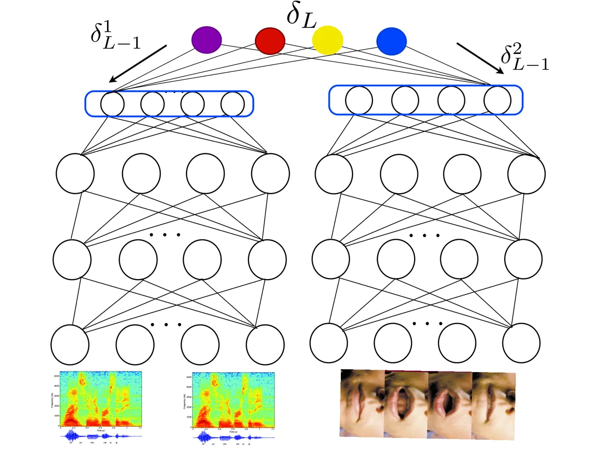

# Deep Multi-Modal Learning for Audio-Visual Speech Recognition

Youssef Mroueh^(⋆) , Etienne Marcheret^(†), Vaibhava Goel ^(†)
Note: This work was done while Youssef Mroueh was an intern in the
Speech and Algorithms Group at IBM T.J Watson Research Center.
Affiliation: $`\star`$ Poggio Lab, CSAIL, LCSL, Massachussetts Institute
of Technology Affiliation: and Istituto Italiano di Tecnologia.
Affiliation: $`\dagger`$ IBM T.J Watson Research Center
Email: [ymroueh@mit.edu,etiennem@us.ibm.com,vgoel@us.ibm.com ](mailto:)

August 24, 2026

###### Abstract

In this paper, we present methods in deep multimodal learning for fusing
speech and visual modalities for Audio-Visual Automatic Speech
Recognition (AV-ASR). First, we study an approach where uni-modal deep
networks are trained separately and their final hidden layers fused to
obtain a joint feature space in which another deep network is built.
While the audio network alone achieves a phone error rate (PER) of
$`41\%`$ under clean condition on the IBM large vocabulary audio-visual
studio dataset, this fusion model achieves a PER of $`35.83\%`$
demonstrating the tremendous value of the visual channel in phone
classification even in audio with high signal to noise ratio. Second, we
present a new deep network architecture that uses a bilinear softmax
layer to account for class specific correlations between modalities. We
show that combining the posteriors from the bilinear networks with those
from the fused model mentioned above results in a further significant
phone error rate reduction, yielding a final PER of $`34.03\%`$.

## 1 Introduction

Human speech perception is not only about hearing but also about seeing:
our brain integrates the waveforms representing the speech information
as well as the lips poses and motions, often called visemes, which carry
important visual information about what is being said. This has been
demonstrated by the so called McGurk effect \[MM76\], which shows that a
voicing of _ba_ and a mouthing of _ga_ is perceived as being *da*. In
the presence of noise and multiple speakers (cocktail party effect),
humans rely on lip reading in order to enhance speech recognition
\[CHLN08\]. The visual information is also important in a clean speech
scenario as it helps in disambiguating voices with similar acoustics
\[Sum92\].  
In Audio-Visual Automatic Speech Recognition (AV-ASR), both audio
recordings and videos of the person talking are available at training
time. It is challenging to build models that integrates both visual and
audio information, and that enhance the recognition performance of the
overall system. While most previous works in AV-ASR focused on enhancing
the performance in the noisy case \[PNLM04, NKK+11\], where the visual
information can be crucial, we focus in this paper on showing that the
visual information is indeed helpful even in the clean speech
scenario.  
Multimodal learning consists of fusing and relating information coming
from different sources, hence AV-ASR is an important multimodal problem.
Finding correlations between different modalities, and modeling their
interactions, has been addressed in various learning frameworks and has
been applied to AV-ASR \[Gea09, LS06, MHD96, PKPM07, PKPM09, PKPM06\].
Deep Neural Networks (DNN) have shown impressive performance in both
audio and visual classification tasks, which is why we restrict
ourselves to the deep multimodal learning framework \[YGS89, NKK+11, SS,
SCMN, AALB13\].  
In this paper, we propose methods in deep learning to fuse modalities,
and validate them on the _IBM AV-ASR Large Vocabulary Studio Dataset_
(Section 2). First we consider the training of two networks on the audio
and the visual modality separately. Then, considering the last layer of
each network as a better feature space, and concatenating them, we train
a classifier on that joint representation, and obtain gains in Phone
Error Rates (PER), with respect to an audio-only trained network. We
then propose a new bilinear network that accounts for correlations
between modalities and allows for joint training of the two networks, we
show that a committee of such bilinear networks, fused at the level of
posteriors, achieves a better PER in a clean speech scenario.  
The paper is organized as follows. In Section 2 we present the IBM
AV-ASR large vocabulary studio dataset, our feature extraction pipeline
for the audio and the visual channels. Next, in Section 3, we present
results for the fusion of networks separately trained on each modality.
In Section 4 we introduce the bilinear DNN that allows for a joint
training and captures correlations between the two modalities, and
derive its back-propagation algorithm in Section 5. Finally we present
posterior combination of bimodal and bilinear bimodal DNNs in Section 6.

## 2 Audio-Visual Data Set & Feature Extraction

In this Section we present the IBM AV-ASR Large Vocabulary Studio
dataset, and our feature extraction pipeline.

### 2.1 IBM AV-ASR Large Vocabulary Studio Dataset

The IBM AV-ASR Large Vocabulary Studio Dataset consists of $`40`$ hours
of audio-visual recordings from $`262`$ speakers. These were carried out
in clean, studio conditions. The audio is sampled at $`16`$ KHz along
with the video frame rate of $`30`$ frames per second at
$`704\times 480`$ resolution. The vocabulary size in these recordings is
$`10,400`$ words. This data set was divided into a test set of $`2`$
hours of audio+video from $`22`$ speakers, with the rest used for
training.

### 2.2 Feature Extraction

For the audio channel we extract 24 MFCC coefficients at 100 frames per
second. Nine consecutive frames of MFCC coefficients are stacked and
projected to 40 dimensions using an LDA matrix. Input to the audio
neural network is formed by concatenating $`\pm 4`$ LDA frames to the
central frame of interest, resulting in an audio feature vector of
dimension $`360`$.

For the visual channel we start by detecting the face in the image using
the openCV implementation of the Viola-Jones algorithm. We then do a
mouth carving by an openCV mouth detection model. Both these utilize the
ENCARA2 model as described in \[MDHL11\]. In order to get an invariant
representation to small distortions and scales we then extract level 1
and level 2 scattering coefficients \[BM13\] on the $`64\times 64`$
mouth region of interest and then reduce their dimension to 60 using LDA
(Linear discriminant Analysis). In order to match the audio frame rate
we replicate video frames according to audio and video time stamps. We
also add $`\pm 4`$ context frames to the central frame of interest, and
obtain finally a visual feature vector of dimension $`540`$.

### 2.3 Context-dependent Phoneme Targets

Each audio+video frame is labeled with one of $`1328`$ targets that
represent context dependent phonemes. $`42`$ phones in phonetic context
of $`\pm 2`$ are clustered using decision trees down to $`1328`$
classes. We measure classification error rate at the level of these
$`1328`$ classes, this is referred to as phone error rate (PER).

## 3 Uni-modal DNNs & Feature Fusion

In the supervised multimodal scenario, we are given a training set $`S`$
of $`N`$ labeled examples, and $`C`$ classes:

```math
S=\{(x^{1}_{i},x^{2}_{i},y_{i}),i=1\dots N\},\quad y_{i}\in\mathcal{Y}=\{1\dots C\},
```

where $`x^{1}_{i},x^{2}_{i}`$ correspond to the first and the second
modality feature vectors, respectively. We note $`t_{i}=e_{y_{i}}`$ the
classification targets, where $`\{e_{y}\}_{y\in\mathcal{Y}}`$ is the
canonical basis in $`\mathbb{R}^{C}`$. Let $`\rho(y|x^{1},x^{2})`$ be
the posterior probability of being in class $`y`$ given the two
modalities $`x^{1}`$ and $`x^{2}`$. In a classification task, we would
like to find the model that maximizes the cross-entropy $`\mathcal{E}`$:

```math
\mathcal{E}=\frac{1}{N}\sum_{i=1}^{N}\sum_{y=1}^{C}t_{i}^{y}\log\rho(y|x^{1}_{i},x^{2}_{i}). \tag{1}
```

The first multimodal modeling approach we study is to train two separate
networks $`DNN_{a}`$ and $`DNN_{v}`$ on the audio and the visual
features, respectively. The networks are optimized under the
cross-entropy objective (1) using the stochastic gradient descent. We
formed a joint Audio-Visual feature representation by concatenating the
outputs of final hidden layers of these two networks, as shown in
Figure 1. This feature space is then kept fixed while a deep or a
shallow (softmax only) network is trained in this fused space up to the
targets. To keep the feature space dimension manageable, we configure
the individual audio and video networks to have a low dimensional final
hidden layer.



Figure 1: Bimodal DNN.

We consider for $`DNN_{a}`$ and $`DNN_{v}`$ the following
architecture $`dim/1024/1024/1024/1024/1024/200/1328`$, where
$`dim=360`$ for $`DNN_{a}`$ and $`dim=540`$ for $`DNN_{v}`$. The fused
feature space dimension is $`400`$.

While $`DNN_{a}`$ achieves a PER of $`41.25\%`$, $`DNN_{v}`$ alone
achieves a PER of $`69.36\%`$, showing that the visual information alone
carries some information but that is not enough in itself to get a low
error rate. A deep network built in the fused feature space results in a
PER of $`35.77\%`$ while a softmax layer only in this feature space
yields PER of $`35.83\%`$. This substantial PER gain from joint
audio-visual representation, even in clean audio conditions,
demonstrates the value of visual information for the phoneme
classification task. Interestingly, the deep and the shallow fusion are
roughly on par in terms of PER. Results are summarized in the following
table:

|                            | PER         | Cross-Entropy  |
| -------------------------- | ----------- | -------------- |
| $`DNN_{a}`$ (Audio Alone)  | $`41.25\%`$ | $`1.53948848`$ |
| $`DNN_{v}`$ (Visual Alone) | $`69.36\%`$ | $`3.24791566`$ |
| Bimodal (DNN Fusion )      | 35.77%      | $`1.31047744`$ |
| Bimodal (SoftMax Fusion)   | 35.83%      | $`1.31077926`$ |

Table 1: Empirical Evaluation on the AV-ASR Studio dataset.

## 4 Bilinear Deep Neural Network

In the previous section the training was done separately on the two
modalities, in this section we address the joint training problem, and
introduce the bilinear bimodal DNN.

For a DNN, we note by $`\sigma`$ the non linearity function (sigmoid in
this paper), $`v_{\ell}`$ the input of a unit, and $`h_{\ell}`$ the
output of a unit in a layer $`\ell`$. For a layer $`\ell`$ we note the
dimension of an input $`v_{\ell}`$ by $`K_{\ell}`$. As shown in Figure
1, we consider two DNNs, one for each modality that we fuse at the level
of the decision function. For simplicity of the exposure, we assume the
same number of layers $`L`$ $`(L_{1}=L_{2}=L)`$. For the intermediate
layers, we have the standard separate networks:

```math
h^{j}_{\ell}=\sigma(W^{j,\top}_{\ell}v^{j}_{\ell}+b^{j}_{\ell}),\quad v^{j}_{\ell}=h^{j}_{\ell-1},\quad h^{j}_{0}=x^{j},
```

```math
W^{j}_{\ell}\in\mathbb{R}^{K^{j}_{\ell}\times K^{j}_{\ell+1}},b^{j}_{\ell}\in\mathbb{R}^{K^{j}_{\ell+1}},\ell=1\dots L-1,j\in\{1,2\}.
```

The fusion happens at the last hidden layer, where the posteriors
capture the correlation between the intermediate non-linear features of
the two modalities produced by the DNN layers, through a bilinear term.
Let $`v^{1}_{L}=h^{1}_{L-1},~v^{2}_{L}=h^{2}_{L-1}`$, the posteriors
have the following form:

```math
\rho\left(y|x^{1},x^{2}\right)=\frac{\exp\left(v^{1,\top}_{L}W^{y}v^{2}_{L}+V^{\top}_{y}\left(\begin{array}[]{c}v^{1}_{L}\\
v^{2}_{L}\end{array}\right)+b_{y}\right)}{Z}, \tag{2}
```

where
$`Z=\sum_{y^{\prime}\in\mathcal{Y}}\exp\left(v^{1,\top}_{L}W^{y^{\prime}}v^{2}_{L}+V^{\top}_{y^{\prime}}\left(\begin{array}[]{c}v^{1}_{L}\\
v^{2}_{L}\end{array}\right)+b_{y^{\prime}}\right)`$,
$`W^{y}\in\mathbb{R}^{K^{1}_{L}\times K^{2}_{L}},V_{y}=[V^{1}_{y},V^{2}_{y}]\in\mathbb{R}^{(K^{1}_{L}+K^{2}_{L})},b_{y}\in\mathbb{R}`$
and $`y\in\{1\dots C\}`$.

### 4.1 Factored Bilinear Softmax

As the number of classes increases, the bilinear model becomes
cumbersome computationally, and we need large training sets to get
better estimates of the parameters. In order to decrease the
computational complexity of the model, we propose the use of a
factorization of the bilinear term, that is similar to the one in
\[MZHP\], but is motivated in our case by Canonical Correlation Analysis
(CCA) \[HSST04\]:

```math
W^{y}=U^{1}\rm{diag}(w_{y})U^{2,\top},y=1\dots C,\\
 \tag{3}
```

where
$`U^{1}\in\mathbb{R}^{K^{1}_{L}\times F},U^{2}\in\mathbb{R}^{K^{2}_{L}\times F},w_{y}\in\mathbb{R}^{F}`$,
and $`\rm{diag}(w_{y})`$ is a diagonal matrix with $`w_{y}`$ on its
diagonal . For numerical stability we consider
$`||U^{j}||_{F}\leq\lambda,j\in\{1,2\}`$, where $`\lambda`$ is a
regularization parameter. We note by $`F`$ the dimension of the fused
space, which is typically smaller than $`K^{1}_{L}`$ and $`K^{2}_{L}`$ .
Considering the factorization in (3) and maximizing the cross-entropy in
the bilinear model (2), we have :

```math
\log\rho(y|x^{1},x^{2})=Tr(U^{1,\top}v^{1}_{L}v^{2,\top}_{L}U^{2}\rm{diag}(w_{y}))+\left\langle{V^{1}_{y}},{v^{1}_{L}}\right\rangle+\left\langle{V^{2}_{y}},{v^{2}_{L}}\right\rangle+b_{y}-\log(Z).
```

For fixed weights $`w_{y}`$, learning $`(U^{1},U^{2})`$ corresponds to a
class specific weighted CCA-like learning where we are looking for
projections that maximize alignment between the intermediate features of
the two modalities, in a discriminative way. Deep CCA of \[AALB13\]
shares similarities with this model.  
On the other hand, for fixed $`(U^{1},U^{2})`$, we can rewrite the
log-posteriors in the following way:

```math
\log(\rho(y|x^{1},x^{2}))=\left\langle{w_{y}},{U^{1,\top}v^{1}_{L}\odot U^{2,\top}v^{2}_{L}}\right\rangle+\left\langle{V^{1}_{y}},{v^{1}_{L}}\right\rangle+\left\langle{V^{2}_{y}},{v^{2}_{L}}\right\rangle+b_{y}-\log(Z)
```

where $`\odot`$ is the element-wise vector product.  
Hence, for fixed $`(U^{1},U^{2})`$, we are learning a linear hyperplane
in the fused space of dimension $`F`$. The projection on $`U^{1}`$ and
$`U^{2}`$ defines a CCA-like lower dimensional spaces, where the two
modalities are maximally correlated. The fused space is then defined as
the element-wise vector product between two co-occurring vectors in the
CCA-like lower dimensional spaces. Hence, we can think of the last layer
of the bilinear, bimodal DNN as being an ordinary softmax, having the
following input
$`(v^{1}_{L},v^{2}_{L},U^{1,\top}v^{1}_{L}\odot U^{2,\top}v^{2}_{L})\in\mathbb{R}^{K^{1}_{L}+K^{2}_{L}+F}`$.
Therefore the decision function is learned based on the individual
contributions of the modalities $`v^{1}_{L}`$ and $`v^{2}_{L}`$, as well
as the joint representation produced by the fused space
$`U^{1,\top}v^{1}_{L}\odot U^{2,\top}v^{2}_{L}`$.

### 4.2 Factored Bilinear Softmax With Sharing

When the classes we would like to predict are organized as the leaves of
a tree structure of depth two, we can further reduce the computational
complexity by sharing weights between leaves having the same parent
node. This is the case in AV-ASR as the $`1328`$ contextual phoneme
states are organized as leaves of a tree, where the parent nodes
correspond to $`42`$ different phoneme categories. In that case we share
the bilinear term across leaves having the same parents. By doing so in
the case of AV-ASR, we are only taking into account the correlations
between the audio and the visual channel at the phoneme level, rather
than on a fine grained grid of contextual states. We can think of this
sharing as a pooling operation at the phoneme level. More formally,
assume that the label set $`\mathcal{Y}`$ is partitioned into $`G`$ non
overlapping groups $`\{\mathcal{Y}_{g}\}_{g=1\dots G}`$, we assume that:

```math
W^{y}=W^{g}=U^{1}\rm{diag}(w_{g})U^{2,\top},~\forall~y\in\mathcal{Y}_{g},g=1\dots G.
```

Hence we reduce the number of weights to learn for the joint
representation from $`C\times F`$ to $`G\times F`$.

## 5 Back-propagation with the Factored Bilinear DNN with Sharing

In this section we give the back-propagation algorithm and the update
rules for the bilinear DNN with sharing (_bi²-DDN-wS_). Recall that our
classes have a tree structure with leaves $`y`$, and parent nodes $`g`$;
a training example is therefore labeled by its leave label $`y`$
(States) as well its parent node $`g`$ (Phonemes),
$`(x^{1},x^{2},y,g)`$, $`y\in\{1\dots C\}`$, and $`g\in\{1\dots G\}`$.
We use the notation $`g(y)`$ to note the group to which $`y`$ belongs,
and we set $`Root_{g(y)}=1,Root_{g}=0,g=1\dots G,g\neq g(y)`$.  
For the bilinear softmax with sharing, we keep track of the errors at
the level of the labels (States), as well as the groups level
(Phonemes):

```math
\displaystyle\delta^{k}_{L} \displaystyle=t_{k}-\rho(k|v^{1}_{L},v^{2}_{L}),\quad k=1\dots C,\quad\delta_{L}\in\mathbb{R}^{C\times 1}.
```

```math
\displaystyle\delta^{g}_{G} \displaystyle=Root_{g}-\sum_{k\in\mathcal{Y}_{g}}\rho(k|v^{1}_{L},v^{2}_{L}),\quad g=1\dots G,\quad\delta_{G}\in\mathbb{R}^{G\times 1}.
```

Let $`W=[w_{1},\dots,w_{G}]\in\mathbb{R}^{F\times G}`$, the gradients of
the parameters of the bilinear softmax are given by:

```math
\displaystyle\frac{\partial\mathcal{E}}{\partial W} \displaystyle=\left(U^{1,\top}v^{1}_{L}\odot U^{2,\top}v^{2}_{L}\right)\delta^{\top}_{G}.
```

```math
\displaystyle\frac{\partial\mathcal{E}}{\partial U^{1}} \displaystyle=v^{1}_{L}v^{2,\top}_{L}U^{2}\rm{diag}(W\delta_{G}),\frac{\partial\mathcal{E}}{\partial U^{2}}=v^{2}_{L}v^{1,\top}_{L}U^{1}\rm{diag}(W\delta_{G}).
```

```math
\displaystyle\frac{\partial\mathcal{E}}{\partial V^{1}} \displaystyle=v^{1}_{L}\delta^{\top}_{L},~\frac{\partial\mathcal{E}}{\partial V^{2}}=v^{2}_{L}\delta^{\top}_{L},~\frac{\partial\mathcal{E}}{\partial b}=\delta_{L}.
```

For the layer right before the Bilinear softmax, we have a double
projection to the first modality network (audio stream) and to the
second modality network (visual stream).  
We need to compute:

```math
\displaystyle W^{g} \displaystyle=U^{1}\rm{diag}(w_{g})U^{2,\top},g=1\dots G.
```

```math
\displaystyle m^{2\rightarrow 1}_{g} \displaystyle=W^{g}v^{2}_{L}\quad M^{2\rightarrow 1}_{L}=[m^{2\rightarrow 1}_{1},\dots,m^{2\rightarrow 1}_{G}]\in\mathbb{R}^{K^{1}_{L}\times G}.
```

```math
\displaystyle m^{1\rightarrow 2}_{g} \displaystyle=W^{g,\top}v^{1}_{L}\quad M^{1\rightarrow 2}_{L}=[m^{1\rightarrow 2}_{1},\dots,m^{1\rightarrow 2}_{G}]\in\mathbb{R}^{K^{2}_{L}\times G}.
```

Let $`V^{j}=[V^{j}_{1}\dots V^{j}_{C}],~j\in\{1,2\}`$, hence the errors
we propagate to each network have the following form:

```math
\displaystyle\delta^{1}_{L-1} \displaystyle= \displaystyle\frac{\partial\mathcal{E}}{\partial v^{1}_{L}}=M^{2\rightarrow 1}_{L}\delta_{G}+V^{1}\delta_{L}. \tag{4}
```

```math
\displaystyle\delta^{2}_{L-1} \displaystyle= \displaystyle\frac{\partial\mathcal{E}}{\partial v^{2}_{L}}=M^{1\rightarrow 2}_{L}\delta_{G}+V^{2}\delta_{L}. \tag{5}
```

Note that the errors now have an additional term,
$`M^{2\rightarrow 1}_{L}\delta_{G}`$, and
$`M^{1\rightarrow 2}_{L}\delta_{G}`$, respectively. We can think of
those terms as messages passed between networks through the bilinear
term. In that way, one network influences the weights of the other one.
For the rest of the updates, it follows standard back-propagation in
both networks; we give it here for completeness. Let
$`u^{1}_{\ell}=W^{1,\top}_{\ell}v^{1}_{\ell}+b^{1}_{\ell},~u^{2}_{\ell}=W^{2,\top}_{\ell}v^{2}_{\ell}+b^{2}_{\ell}`$,
then finally we have:
$`\frac{\partial\mathcal{E}}{\partial W^{j}_{\ell}}=v^{j}_{\ell}(diag(\sigma^{\prime}(u^{j}_{\ell})\delta^{j}_{\ell})^{\top},\frac{\partial\mathcal{E}}{\partial b^{j}_{\ell}}=diag(\sigma^{\prime}(u^{j}_{\ell}))\delta^{j}_{\ell},`$
$`\delta^{j}_{\ell-1}=W^{j}_{\ell}\delta^{j}_{\ell},~j\in\{1,2\},~\ell=L-1\dots..1,`$
where $`\delta^{1}_{L-1}`$, and $`\delta^{2}_{L-1}`$ are given in
equations (4) and (5). For each variable $`\theta`$, we have an update
rule
$`\theta\leftarrow\theta+\eta\frac{\partial\mathcal{E}}{\partial\theta}`$,
where $`\eta`$ is the learning rate. For $`U^{1}`$ and $`U^{2}`$, we
need to keep control of the Frobenius norm by following the gradient
step with a projection to the Frobenius ball :
$`U^{j}\leftarrow U^{j}\min(1,\frac{\lambda}{||U^{j}||}_{F}),j\in\{1,2\}`$.

###### Remark 1.

For the bilinear softmax without sharing the update rules are similar
($`\delta_{G}`$ is replaced by $`\delta_{L}`$).

## 6 Combining Posteriors from Bimodal and Bilinear Bimodal Networks

We experiment with various factored _bi²-DNN-wS_ architectures,
initialized at random on the IBM AV-ASR Large Vocabulary Studio Dataset.
We use the following notation for the architecture of the bilinear
network: $`[arch_{a}|arch_{v}|F]`$, where $`arch_{a}`$ and $`arch_{v}`$
are the architectures of the audio and the visual network respectively,
and $`F`$ is the dimension of the fused space. We consider architectures
by increasing complexity
$`Arch=[360,500,500,200,1328|540,500,500,200,1328|F=200]`$,
$`Arch_{1}=[360,600,600,400,100,1328|540,600,600,400,100,1328|F=100]`$,
and
$`Arch_{2}=[360,500,500,500,500,500,200,1328|540,500,500,500,500,500,200,1328|F=200]`$.  
In all our experiments we set $`\lambda=2`$. Recall that the bimodal DNN
using the separate training paradigm introduced in Section 3 achieves
$`35.83\%`$ PER. As shown in Table 2, each architecture alone does not
improve on the bimodal DNN, but averaging the posteriors of the three
architectures we obtain a small gain. A gain of $`1.8\%`$ absolute is
obtained by averaging the posteriors of the bimodal and the bilinear
bimodal networks, showing that the bilinear networks have uncorrelated
errors with the bimodal network.

|                                           |             |
| ----------------------------------------- | ----------- |
|                                           | PER         |
| $`Arch`$                                  | $`38.89\%`$ |
| $`Arch_{1}`$                              | $`39.01\%`$ |
| $`Arch_{2}`$                              | $`38.36\%`$ |
| Bimodal                                   | $`35.83\%`$ |
| $`Arch+Arch_{1}+Arch_{2}`$                | 35.54%      |
| $`Arch+Arch_{1}+Arch_{2}+\text{Bimodal}`$ | 34.03%      |

Table 2: Empirical evaluation on the AV-ASR Studio dataset.

## 7 Conclusion

In this paper we have studied deep multimodal learning for the task of
phonetic classification from audio and visual modalities. We demonstrate
that even in clean acoustic conditions using visual channel in addition
to speech results in signifiantly improved classification performance. A
bilinear bimodal DNN is introduced which leverages correlation between
the audio and visual modalities, and leads to further error rate
reduction.

## References

- \[AALB13\] Galen Andrew, Raman Arora, Karen Livescu, and Jeff Bilmes.
  Deep canonical correlation analysis. In International Conference on
  Machine Learning (ICML), Atlanta, Georgia, 2013.
- \[BM13\] Joan Bruna and Stephane Mallat. Invariant scattering
  convolution networks. IEEE Trans. Pattern Anal. Mach. Intell.,
  35(8):1872–1886, August 2013.
- \[CHLN08\] S. Cox, R. Harvey, Y. Lan, and J. Newman. The challenge of
  multispeaker lip-reading. In International Conference on
  Auditory-Visual Speech Processing, 2008.
- \[Gea09\] Mihai Gurban and et al. Information theoretic feature
  extraction for audio-visual speech recognition. IEEE Transactions on
  signal processing, 2009.
- \[HSST04\] David R. Hardoon, S�ndor Szedm�k, and John Shawe-Taylor.
  Canonical correlation analysis: An overview with application to
  learning methods. Neural Computation, 16(12):2639–2664, 2004.
- \[LS06\] Patrick Lucey and Sridha Sridharan. Patch-based
  representation of visual speech. In Proceedings of the HCSNet Workshop
  on Use of Vision in Human-computer Interaction - Volume 56, VisHCI
  ’06, pages 79–85, Darlinghurst, Australia, Australia, 2006. Australian
  Computer Society, Inc.
- \[MDHL11\] Modesto Castrillon Mcastrillon, Oscar Deniz, Daniel
  Hernandez, and Javier Lorenzo. A comparison of face and facial feature
  detectors based on the viola–jones general object detection framework.
  Machine Vision and Applications, 22(3):481–494, 2011.
- \[MHD96\] Uwe Meier, Wolfgang H�rst, and Paul Duchnowski. Adaptive
  bimodal sensor fusion for automatic speechreading, 1996.
- \[MM76\] H. McGurk and J. MacDonald. Hearing lips and seeing voices.
  Nature, 264:746–748, 1976.
- \[MZHP\] Roland Memisevic, Christopher Zach, Geoffrey Hinton, and Marc
  Pollefeys. Gated softmax classification. In Advances in Neural
  Information Processing Systems 23.
- \[NKK⁺11\] Jiquan Ngiam, Aditya Khosla, Mingyu Kim, Juhan Nam, Honglak
  Lee, and Andrew Y. Ng. Multimodal deep learning. In International
  Conference on Machine Learning (ICML), Bellevue, USA, June 2011.
- \[PKPM06\] Vassilis Pitsikalis, Athanassios Katsamanis, George
  Papandreou, and Petros Maragos. Adaptive multimodal fusion by
  uncertainty compensation. In INTERSPEECH 2006 - ICSLP, Ninth
  International Conference on Spoken Language Processing, Pittsburgh,
  PA, USA, September 17-21, 2006, 2006.
- \[PKPM07\] George Papandreou, Athanassios Katsamanis, Vassilis
  Pitsikalis, and Petros Maragos. Multimodal fusion and learning with
  uncertain features applied to audiovisual speech recognition. In IEEE
  9th Workshop on Multimedia Signal Processing, MMSP 2007, Chania,
  Crete, Greece, October 1-3, 2007, pages 264–267, 2007.
- \[PKPM09\] George Papandreou, Athanassios Katsamanis, Vassilis
  Pitsikalis, and Petros Maragos. Adaptive multimodal fusion by
  uncertainty compensation with application to audiovisual speech
  recognition. IEEE Transactions on Audio, Speech & Language Processing,
  17(3):423–435, 2009.
- \[PNLM04\] G. Potamianos, C. Neti, J. Luettin, and I. Matthews.
  Audio-visual automatic speech recognition: An overview. In Issues in
  Visual and Audio-Visual Speech Processing. MIT Press, 2004.
- \[SCMN\] Richard Socher, Danqi Chen, Christopher D. Manning, and
  Andrew Ng. Reasoning with neural tensor networks for knowledge base
  completion. In Advances in Neural Information Processing Systems 26.
- \[SS\] Nitish Srivastava and Ruslan Salakhutdinov. Multimodal learning
  with deep boltzmann machines. In Advances in Neural Information
  Processing Systems 25.
- \[Sum92\] Q. Summerfield. Lipreading and audio-visual speech
  perception. In Trans. R. Soc., London, 1992.
- \[YGS89\] Ben P. Yuhas, Moise H. Goldstein, and Terrence J. Sejnowski.
  Integration of acoustic and visual speech signals using neural
  networks. IEEE Communications Magazine, 1989.
