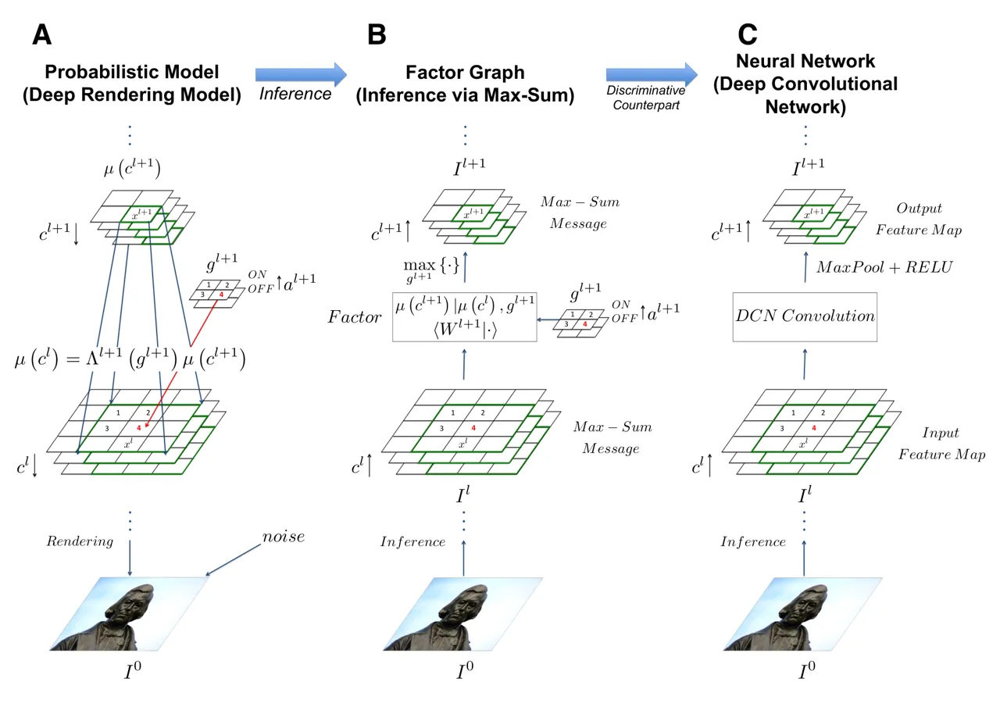
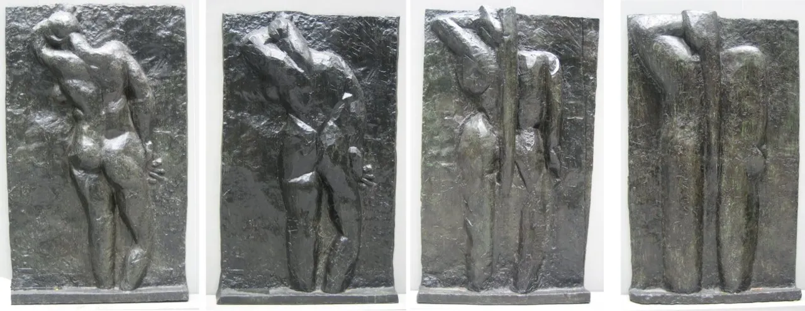
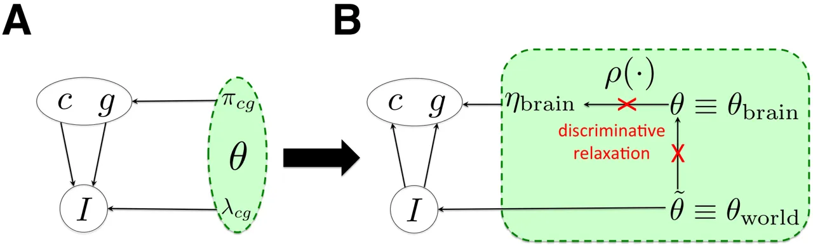
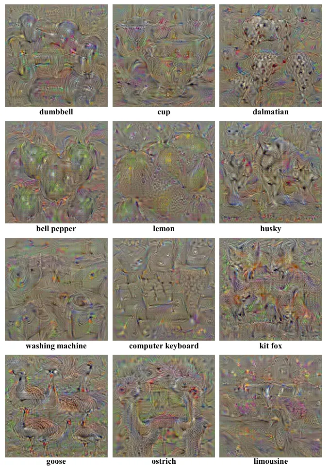

# A Probabilistic Theory of Deep Learning

Ankit B. Patel    Tan Nguyen    Richard G. Baraniuk
Affiliation: Department of Electrical and Computer Engineering
Affiliation: Rice University Affiliation: {abp4, mn15, richb}@rice.edu
Affiliation: April 2, 2015

> A grand challenge in machine learning is the development of
> computational algorithms that match or outperform humans in perceptual
> inference tasks such as visual object and speech recognition. The key
> factor complicating such tasks is the presence of numerous nuisance
> variables, for instance, the unknown object position, orientation, and
> scale in object recognition or the unknown voice pronunciation, pitch,
> and speed in speech recognition. Recently, a new breed of deep
> learning algorithms have emerged for high-nuisance inference tasks;
> they are constructed from many layers of alternating linear and
> nonlinear processing units and are trained using large-scale
> algorithms and massive amounts of training data. The recent success of
> deep learning systems is impressive — they now routinely yield pattern
> recognition systems with near- or super-human capabilities — but a
> fundamental question remains: Why do they work? Intuitions abound, but
> a coherent framework for understanding, analyzing, and synthesizing
> deep learning architectures has remained elusive.
>
> We answer this question by developing a new probabilistic framework
> for deep learning based on a Bayesian generative probabilistic model
> that explicitly captures variation due to nuisance variables. The
> graphical structure of the model enables it to be learned from data
> using classical expectation-maximization techniques. Furthermore, by
> relaxing the generative model to a discriminative one, we can recover
> two of the current leading deep learning systems, deep convolutional
> neural networks (DCNs) and random decision forests (RDFs), providing
> insights into their successes and shortcomings as well as a principled
> route to their improvement.

###### Contents

1.  1 Introduction
2.  2 A Deep Probabilistic Model for Nuisance Variation
    1.  2.1 The Rendering Model: Capturing Nuisance Variation
    2.  2.2 Deriving the Key Elements of One Layer of a Deep
        Convolutional  
        Network from the Rendering Model
    3.  2.3 The Deep Rendering Model: Capturing Levels of Abstraction
    4.  2.4 Inference in the Deep Rendering Model
        1.  2.4.1 What About the SoftMax Regression Layer?
    5.  2.5 DCNs are Probabilistic Message Passing Networks
        1.  2.5.1 Deep Rendering Model and Message Passing
        2.  2.5.2 A Unification of Neural Networks and Probabilistic
            Inference
        3.  2.5.3 The Probabilistic Role of Max-Pooling
    6.  2.6 Learning the Rendering Models
        1.  2.6.1 EM Algorithm for the Shallow Rendering Model
        2.  2.6.2 EM Algorithm for the Deep Rendering Model
        3.  2.6.3 What About DropOut Training?
    7.  2.7 From Generative to Discriminative Classifiers
        1.  2.7.1 Transforming a Generative Classifier into a
            Discriminative One
        2.  2.7.2 From the Deep Rendering Model to Deep Convolutional
            Networks
3.  3 New Insights into Deep Convolutional Networks
    1.  3.1 DCNs Possess Full Probabilistic Semantics
    2.  3.2 Class Appearance Models and Activity Maximization
    3.  3.3 (Dis)Entanglement: Supervised Learning of Task Targets Is  
        Intertwined with Unsupervised Learning of Latent Task Nuisances
4.  4 From the Deep Rendering Model to Random Decision Forests
    1.  4.1 The Evolutionary Deep Rendering Model: A Hierarchy of
        Categories
    2.  4.2 Inference with the E-DRM Yields a Decision Tree
        1.  4.2.1 What About the Leaf Histograms?
    3.  4.3 Bootstrap Aggregation to Prevent Overfitting Yields A
        Decision  
        Forest
    4.  4.4 EM Learning for the E-DRM Yields the InfoMax Principle
5.  5 Relation to Prior Work
    1.  5.1 Relation to Mixture of Factor Analyzers
    2.  5.2 _i_-Theory: Invariant Representations Inspired by Sensory
        Cortex
    3.  5.3 Scattering Transform: Achieving Invariance via Wavelets
    4.  5.4 Learning Deep Architectures via Sparsity
    5.  5.5 Google FaceNet: Learning Useful Representations with DCNs
    6.  5.6 Renormalization Theory
    7.  5.7 Summary of Key Distinguishing Features of the DRM
6.  6 New Directions
    1.  6.1 More Realistic Rendering Models
    2.  6.2 New Inference Algorithms
        1.  6.2.1 Soft Inference
        2.  6.2.2 Top-Down Convolutional Nets: Top-Down Inference via
            the DRM
    3.  6.3 New Learning Algorithms
        1.  6.3.1 Derivative-Free Learning
        2.  6.3.2 Dynamics: Learning from Video
        3.  6.3.3 Training from Labeled and Unlabeled Data
7.  A Supplemental Information
    1.  A.1 From the Gaussian Rendering Model Classifier to Deep DCNs
    2.  A.2 Generalizing to Arbitrary Mixtures of Exponential Family  
        Distributions
    3.  A.3 Regularization Schemes: Deriving the DropOut Algorithm
8.  References and Notes

## 1 Introduction

Humans are expert at a wide array of complicated sensory inference
tasks, from recognizing objects in an image to understanding phonemes in
a speech signal, despite significant variations such as the position,
orientation, and scale of objects and the pronunciation, pitch, and
volume of speech. Indeed, the main challenge in many sensory perception
tasks in vision, speech, and natural language processing is a high
amount of such nuisance variation. Nuisance variations complicate
perception, because they turn otherwise simple statistical inference
problems with a small number of variables (e.g., class label) into much
higher-dimensional problems. For example, images of a car taken from
different camera viewpoints lie on a highly curved, nonlinear manifold
in high-dimensional space that is intertwined with the manifolds of
myriad other objects. The key challenge in developing an inference
algorithm is then how to factor out all of the nuisance variation in the
input. Over the past few decades, a vast literature that approaches this
problem from myriad different perspectives has developed, but the most
difficult inference problems have remained out of reach.

Recently, a new breed of machine learning algorithms have emerged for
high-nuisance inference tasks, resulting in pattern recognition systems
with sometimes super-human capabilities \[1\]. These so-called deep
learning systems share two common hallmarks. First, architecturally,
they are constructed from many layers of alternating linear and
nonlinear processing units. Second, computationally, their parameters
are learned using large-scale algorithms and massive amounts of training
data. Two examples of such architectures are the deep convolutional
neural network (DCN), which has seen great success in tasks like visual
object recognition and localization \[2\], speech recognition \[3\], and
part-of-speech recognition \[4\], and random decision forests (RDFs)
\[5\] for image segmentation. The success of deep learning systems is
impressive, but a fundamental question remains: Why do they work?
Intuitions abound to explain their success. Some explanations focus on
properties of feature invariance and selectivity developed over multiple
layers, while others credit raw computational power and the amount of
available training data \[1\]. However, beyond these intuitions, a
coherent theoretical framework for understanding, analyzing, and
synthesizing deep learning architectures has remained elusive.

In this paper, we develop a new theoretical framework that provides
insights into both the successes and shortcomings of deep learning
systems, as well as a principled route to their design and improvement.
Our framework is based on a generative probabilistic model that
explicitly captures variation due to latent nuisance variables. The
Rendering Model (RM) explicitly models nuisance variation through a
rendering function that combines the task-specific variables of interest
(e.g., object class in an object recognition task) and the collection of
nuisance variables. The Deep Rendering Model (DRM) extends the RM in a
hierarchical fashion by rendering via a product of affine nuisance
transformations across multiple levels of abstraction. The graphical
structures of the RM and DRM enable inference via message passing,
using, for example, the sum-product or max-sum algorithms, and training
via the expectation-maximization (EM) algorithm. A key element of the
framework is the relaxation of the RM/DRM generative model to a
discriminative one in order to optimize the bias-variance tradeoff.

The DRM unites and subsumes two of the current leading deep learning
based systems as max-sum message passing networks. That is, configuring
the DRM with two different nuisance structures — Gaussian translational
nuisance or evolutionary additive nuisance — leads directly to DCNs and
RDFs, respectively. The intimate connection between the DRM and these
deep learning systems provides a range of new insights into how and why
they work, answering several open questions. Moreover, the DRM provides
insights into how and why deep learning fails and suggests pathways to
their improvement.

It is important to note that our theory and methods apply to a wide
range of different inference tasks (including, for example,
classification, estimation, regression, etc.) that feature a number of
task-irrelevant nuisance variables (including, for example, object and
speech recognition). However, for concreteness of exposition, we will
focus below on the classification problem underlying visual object
recognition.

This paper is organized as follows. Section 2 introduces the RM and DRM
and demonstrates step-by-step how they map onto DCNs. Section 3 then
summarizes some of the key insights that the DRM provides into the
operation and performance of DCNs. Section 4 proceeds in a similar
fashion to derive RDFs from a variant of the DRM that models a hierarchy
of categories. Section 6 closes the paper by suggesting a number of
promising avenues for research, including several that should lead to
improvement in deep learning system performance and generality. The
proofs of several results appear in the Appendix.

## 2 A Deep Probabilistic Model for Nuisance Variation

This section develops the RM, a generative probabilistic model that
explicitly captures nuisance transformations as latent variables. We
show how inference in the RM corresponds to operations in a single layer
of a DCN. We then extend the RM by defining the DRM, a rendering model
with layers representing different scales or levels of abstraction.
Finally, we show that, after the application of a discriminative
relaxation, inference and learning in the DRM correspond to feedforward
propagation and back propagation training in the DCN. This enables us to
conclude that DCNs are probabilistic message passing networks, thus
unifying the probabilistic and neural network perspectives.

### 2.1 The Rendering Model: Capturing Nuisance Variation

Visual object recognition is naturally formulated as a statistical
classification problem.¹¹ 1 Recall that we focus on object recognition
from images only for concreteness of exposition. We are given a
$`D`$-pixel, multi-channel image $`I`$ of an object, with intensity
$`I(x,\omega)`$ at pixel $`x`$ and channel $`\omega`$ (e.g.,
$`\omega=`${red, green, blue}). We seek to infer the object’s identity
(class) $`c\in{\mathcal{C}}`$, where $`{\mathcal{C}}`$ is a finite set
of classes.²² 2 The restriction for $`{\mathcal{C}}`$ to be finite can
be removed by using a nonparametric prior such as a Chinese Restaurant
Process (CRP) \[6\] We will use the terms “object” and “class”
interchangeably. Given a joint probabilistic model $`p(I,c)`$ for images
and objects, we can classify a particular image $`I`$ using the maximum
a posteriori (MAP) classifier

```math
\displaystyle\hat{c}(I)=\argmax_{c\in{\mathcal{C}}}\,p(c|I)=\argmax_{c\in{\mathcal{C}}}\,p(I|c)p(c), \tag{1}
```

where $`p(I|c)`$ is the image likelihood, $`p(c)`$ is the prior
distribution over the classes, and $`p(c|I)\propto p(I|c)p(c)`$ by
Bayes’ rule.

Object recognition, like many other inference tasks, is complicated by a
high amount of variation due to nuisance variables, which the above
formation ignores. We advocate explicitly modeling nuisance variables by
encapsulating all of them into a (possibly high-dimensional) parameter
$`g\in{\mathcal{G}}`$, where $`{\mathcal{G}}`$ is the set of all
nuisances. In some cases, it is natural for $`g`$ to be a transformation
and for $`{\mathcal{G}}`$ to be endowed with a (semi-)group structure.

We now propose a generative model for images that explicitly models the
relationship between images $`I`$ of the same object $`c`$ subject to
nuisance $`g`$. First, given $`c`$, $`g`$, and other auxiliary
parameters, we define the rendering function $`R(c,g)`$ that renders
(produces) an image. In image inference problems, for example,
$`R(c,g)`$ might be a photorealistic computer graphics engine (c.f.,
Pixar). A particular realization of an image is then generated by adding
noise to the output of the renderer:

```math
I|c,g=R(c,g)+\textrm{noise}. \tag{2}
```

We assume that the noise distribution is from the exponential family,
which includes a large number of practically useful distributions (e.g.,
Gaussian, Poisson). Also we assume that the noise is independent and
identically distributed (iid) as a function of pixel location $`x`$ and
that the class and nuisance variables are independently distributed
according to categorical distributions.³³ 3 Independence is merely a
convenient approximation; in practice, $`g`$ can depend on $`c`$. For
example, humans have difficulty recognizing and discriminating upside
down faces \[7\]. With these assumptions, Eq. 2 then becomes the
probabilistic (shallow) Rendering Model (RM)

```math
\displaystyle c \displaystyle\sim{\rm Cat}(\{\pi_{c}\}_{c\in{\mathcal{C}}}),\quad\quad
```

```math
\displaystyle g \displaystyle\sim{\rm Cat}(\{\pi_{g}\}_{g\in{\mathcal{G}}}),\quad\quad
```

```math
\displaystyle I|c,g \displaystyle\sim\mathcal{Q}(\theta_{cg}). \tag{3}
```

Here $`\mathcal{Q}(\theta_{cg})`$ denotes a distribution from the
exponential family with parameters $`\theta_{cg}`$, which include the
mixing probabilities $`\pi_{cg}`$, natural parameters
$`\eta(\theta_{cg})`$, sufficient statistics $`T(I)`$ and whose mean is
the rendered template $`\mu_{cg}=R(c,g)`$.

An important special case is when $`\mathcal{Q}(\theta_{cg})`$ is
Gaussian, and this defines the Gaussian Rendering Model (GRM), in which
images are generated according to

```math
\displaystyle I|c,g\sim\mathcal{N}(I|\mu_{cg}=R(c,g),\Sigma_{cg}=\sigma^{2}\bf{1}), \tag{4}
```

where $`\bf{1}`$ is the identity matrix. The GRM generalizes both the
Gaussian Naïve Bayes Classifier (GNBC) and the Gaussian Mixture Model
(GMM) by allowing variation in the image to depend on an observed class
label $`c`$, like a GNBC, and on an unobserved nuisance label $`g`$,
like a GMM. The GNBC, GMM and the (G)RM can all be conveniently
described as a directed graphical model \[8\]. Figure 1A depicts the
graphical models for the GNBC and GMM, while Fig. 1B shows how they are
combined to form the (G)RM.

Finally, since the world is spatially varying and an image can contain a
number of different objects, it is natural to break the image up into a
number of (overlapping) subimages, called _patches_, that are indexed by
spatial location $`x`$. Thus, a patch is defined here as a collection of
pixels centered on a single pixel $`x`$. In general, patches can
overlap, meaning that (i) they do not tile the image, and (ii) an image
pixel $`x`$ can belong to more than one patch. Given this notion of
pixels and patches, we allow the class and nuisance variables to depend
on pixel/patch location: i.e., local image class $`c(x)`$ and local
nuisance $`g(x)`$ (see Fig. 2A). We will omit the dependence on $`x`$
when it is clear from context.

Figure 1: Graphical depiction of the Naive Bayes Classifier (A, left),
Gaussian Mixture Model (A, right), the shallow Rendering Model (B) and
the Deep Rendering Model (C). All dependence on pixel location $`x`$ has
been suppressed for clarity.

The notion of a rendering operator is quite general and can refer to any
function that maps a target variable $`c`$ and nuisance variables $`g`$
into a pattern or template $`R(c,g)`$. For example, in speech
recognition, $`c`$ might be a phoneme, in which case $`g`$ represents
volume, pitch, speed, and accent, and $`R(c,g)`$ is the amplitude of the
acoustic signal (or alternatively the time-frequency representation). In
natural language processing, $`c`$ might be the grammatical
part-of-speech, in which case $`g`$ represents syntax and grammar, and
$`R(c,g)`$ is a clause, phrase or sentence.

To perform object recognition with the RM via Eq. 1, we must marginalize
out the nuisance variables $`g`$. We consider two approaches for doing
so, one conventional and one unconventional. The Sum-Product RM
Classifier (SP-RMC) sums over all nuisance variables
$`g\in{\mathcal{G}}`$ and then chooses the most likely class:

```math
\displaystyle\hat{c}_{\rm SP}(I) \displaystyle=\argmax_{c\in{\mathcal{C}}}\frac{1}{|{\mathcal{G}}|}\sum_{g\in{\mathcal{G}}}p(I|c,g)p(c)p(g)
```

```math
\displaystyle=\argmax_{c\in{\mathcal{C}}}\frac{1}{|{\mathcal{G}}|}\sum_{g\in{\mathcal{G}}}\exp\langle\eta(\theta_{cg})|T(I)\rangle, \tag{5}
```

where $`\langle\cdot|\cdot\rangle`$ is the bra-ket notation for inner
products and in the last line we have used the definition of an
exponential family distribution. Thus the SP-RM computes the marginal of
the posterior distribution over the target variable, given the input
image. This is the conventional approach used in most probabilistic
modeling with latent variables.

An alternative and less conventional approach is to use the Max-Sum RM
Classifier (MS-RMC), which _maximizes_ over all $`g\in{\mathcal{G}}`$
and then chooses the most likely class:

```math
\displaystyle\hat{c}_{\rm MS}(I) \displaystyle=\argmax_{c\in{\mathcal{C}}}\max_{g\in{\mathcal{G}}}p(I|c,g)p(c)p(g)
```

```math
\displaystyle=\argmax_{c\in{\mathcal{C}}}\max_{g\in{\mathcal{G}}}\langle\eta(\theta_{cg})|T(I)\rangle. \tag{6}
```

The MS-RMC computes the mode of the posterior distribution over the
target _and_ nuisance variables, given the input image. Equivalently, it
computes the most likely global configuration of target and nuisance
variables for the image. Intuitively, this is an effective strategy when
there is one explanation $`g^{*}\in{\mathcal{G}}`$ that dominates all
other explanations $`g\neq g^{*}`$. This condition is justified in
settings where the rendering function is deterministic or nearly
noise-free. This approach to classification is unconventional in both
the machine learning and computational neuroscience literatures, where
the sum-product approach is most commonly used, although it has received
some recent attention \[9\].

Both the sum-product and max-sum classifiers amount to applying an
affine transformation to the input image $`I`$ (via an inner product
that performs feature detection via template matching), followed by a
sum or max nonlinearity that marginalizes over the nuisance variables.

Throughout the paper we will assume isotropic or diagonal Gaussian noise
for simplicity, but the treatment presented here can be generalized to
any distribution from the exponential family in a straightforward
manner. Note that such an extension may require a non-linear
transformation (i.e. quadratic or logarithmic $`T(I)`$), depending on
the specific exponential family. Please see Supplement Section A.2 for
more details.

### 2.2 Deriving the Key Elements of One Layer of a Deep Convolutional Network from the Rendering Model

Having formulated the Rendering Model (RM), we now show how to connect
the RM with deep convolutional networks (DCNs). We will see that the
MS-RMC (after imposing a few additional assumptions on the RM) gives
rise to most commonly used DCN layer types.

Our first assumption is that the noise added to the rendered template is
isotropically Gaussian (GRM) i.e. each pixel has the same noise variance
$`\sigma^{2}`$ that is independent of the configuration $`(c,g)`$. Then,
assuming the image is normalized $`\|I\|^{2}=1`$, Eq. 6 yields the
max-sum Gaussian RM classifier (see Appendix A.1 for a detailed proof)

```math
\displaystyle\hat{c}_{\rm MS}(I) \displaystyle=\argmax_{c\in{\mathcal{C}}}\max_{g\in{\mathcal{G}}}\left\langle\frac{1}{\sigma^{2}}\mu_{cg}\Big|I\right\rangle-\frac{1}{2\sigma^{2}}\|\mu_{cg}\|_{2}^{2}+\ln\pi_{c}\pi_{g}
```

```math
\displaystyle\equiv\argmax_{c\in{\mathcal{C}}}\max_{g\in{\mathcal{G}}}\>\langle w_{cg}|I\rangle+b_{cg}, \tag{7}
```

where we have defined the _natural parameters_
$`\eta\equiv\{w_{cg},b_{cg}\}`$ in terms of the _traditional parameters_
$`\theta\equiv\{\sigma^{2},\mu_{cg},\pi_{c},\pi_{g}\}`$ according to⁴⁴ 4
Since the Gaussian distribution of the noise is in the exponential
family, it can be reparametrized in terms of the natural parameters.
This is known as canonical form.

```math
\displaystyle w_{cg} \displaystyle\equiv\frac{1}{\sigma^{2}}\mu_{cg}=\frac{1}{\sigma^{2}}R(c,g)
```

```math
\displaystyle b_{cg} \displaystyle\equiv\frac{1}{2\sigma^{2}}\|\mu_{cg}\|_{2}^{2}+\ln\pi_{c}\pi_{g}. \tag{8}
```

Note that we have suppressed the parameters’ dependence on pixel
location $`x`$.

We will now demonstrate that the sequence of operations in the MS-RMC in
Eq. 7 coincides exactly with the operations involved in one layer of a
DCN (or, more generally, a _max-out neural network_\[10\]): image
normalization, linear template matching, thresholding, and max pooling.
See Fig. 2C. We now explore each operation in Eq. 7 in detail to make
the link precise.



Figure 2: An example of mapping from the Deep Rendering Model (DRM) to
its corresponding factor graph to a Deep Convolutional Network (DCN)
showing only the transformation from level $`\ell`$ of the hierarchy of
abstraction to level $`\ell+1`$. (A) DRM generative model: a single
super pixel $`x^{\ell+1}`$ at level $`\ell+1`$ (green, upper) renders
down to a $`3\times 3`$ image patch at level $`\ell`$ (green, lower),
whose location is specified by $`g^{\ell+1}`$ (red). (B) Factor graph
representation of the DRM model that supports efficient inference
algorithms such as the max-sum message passing shown here. (C)
Computational network that implements the max-sum message passing
algorithm from (B) _explicitly_; its structure exactly matches that of a
DCN.

First, the image is normalized. Until recently, there were several
different types of normalization typically employed in DCNs: local
response normalization, and local contrast normalization\[11, 12\].
However, the most recent highly performing DCNs employ a different form
of normalization, known as _batch-normalization_\[13\]. We will come
back to this later when we show how to derive batch normalization from a
principled approach. One implication of this is that it is unclear what
probabilistic assumption the older forms of normalization arise from, if
any.

Second, the image is filtered with a set of noise-scaled rendered
templates $`w_{cg}`$. The size of the templates depends on the size of
the objects of class $`c`$ and the values of the nuisance variables
$`g`$. Large objects will have large templates, corresponding to a fully
connected layer in a DCN \[14\], while small objects will have small
templates, corresponding to a locally connected layer in a DCN \[15\].
If the distribution of objects depends on the pixel position $`x`$
(e.g., cars are more likely on the ground while planes are more likely
in the air) then, in general, we will need different rendered templates
at each $`x`$. In this case, the locally connected layer is appropriate.
If, on the other hand, all objects are equally likely to be present at
all locations throughout the entire image, then we can assume
translational invariance in the RM. This yields a global set of
templates that are used at all pixels $`x`$, corresponding to a
convolutional layer in a DCN \[14\] (see Appendix A.2 for a detailed
proof). If the filter sizes are large relative to the scale at which the
image variation occurs and the filters are overcomplete, then adjacent
filters overlap and waste computation. In these case, it is appropriate
to use a _strided_ convolution, where the output of the traditional
convolution is down-sampled by some factor; this saves some computation
without losing information.

Third, the resulting activations (log-probabilities of the hypotheses)
are passed through a pooling layer; i.e., if $`g`$ is a translational
nuisance, then taking the maximum over $`g`$ corresponds to max pooling
in a DCN.

Fourth, recall that a given image pixel $`x`$ will reside in several
overlapping image patches, each rendered by its own parent class
$`c(x)`$ and the nuisance location $`g(x)`$ (Fig. 2A). Thus we must
consider the possibility of collisions: i.e. when two different parents
$`c(x_{1})\neq c(x_{2})`$ might render the same pixel (or patch). To
avoid such undesirable collisions, it is natural to force the rendering
to be locally sparse: i.e. we must enforce that only one renderer in a
local neighborhood can be “active”.

To formalize this, we endow each parent renderer with an ON/OFF state
via a switching variable
$`a\in{\mathcal{A}}\equiv\{\textrm{ON},\textrm{OFF}\}`$. If
$`a=\textrm{ON}=1`$, then the rendered image patch is left untouched,
whereas if $`a=\textrm{OFF}=0`$, the image patch is masked with zeros
after rendering. Thus, the switching variable $`a`$ models (in)active
parent renderers.

However, these switching variables have strong correlations due to the
crowding out effect: if one is ON, then its neighbors must be OFF in
order to prevent rendering collisions. Although natural for realistic
rendering, this complicates inference. Thus, we employ an approximation
by instead assuming that the state of each renderer ON or OFF completely
at random and thus independent of any other variables, including the
measurements (i.e., the image itself). Of course, an approximation to
real rendering, but it simplifies inference, and leads directly to
rectified linear units, as we show below. Such approximations to true
sparsity have been extensively studied, and are known as spike-and-slab
sparse coding models \[16, 17\].

Since the switching variables are latent (unobserved), we must
max-marginalize over them during classification, as we did with nuisance
variables $`g`$ in the last section (one can think of $`a`$ as just
another nuisance). This leads to (see Appendix A.3 for a more detailed
proof)

```math
\displaystyle\hat{c}(I) \displaystyle=\argmax_{c\in{\mathcal{C}}}\max_{g\in{\mathcal{G}}}\max_{a\in{\mathcal{A}}}\left\langle\frac{1}{\sigma^{2}}a\mu_{cg}\Big|I\right\rangle-\frac{1}{2\sigma^{2}}(\|a\mu_{cg}\|_{2}^{2}+\|I\|_{2}^{2}))+\ln\pi_{c}\pi_{g}\pi_{a}
```

```math
\displaystyle\equiv\argmax_{c\in{\mathcal{C}}}\max_{g\in{\mathcal{G}}}\max_{a\in{\mathcal{A}}}a(\langle w_{cg}|I\rangle+b_{cg})+b_{cga}
```

```math
\displaystyle=\argmax_{c\in{\mathcal{C}}}\max_{g\in{\mathcal{G}}}\textrm{ReLU}\left(\langle w_{cg}|I\rangle+b_{cg}\right), \tag{9}
```

where $`b_{cga}`$ and $`b_{cg}`$ are bias terms and
$`\textrm{ReLu}(u)\equiv(u)_{+}=\max\{u,0\}`$ denotes the
soft-thresholding operation performed by the Rectified Linear Units
(ReLU) in modern DCNs \[18\]. In the last line, we have assumed that the
prior $`\pi_{cg}`$ is uniform so that $`b_{cga}`$ is independent of
$`c`$ and $`g`$ and can be dropped.

### 2.3 The Deep Rendering Model: Capturing Levels of Abstraction

The world is summarizable at varying levels of abstraction, and
Hierarchical Bayesian Models (HBMs) can exploit this fact to accelerate
learning. In particular, the power of abstraction allows the higher
levels of an HBM to learn concepts and categories far more rapidly than
lower levels, due to stronger inductive biases and exposure to more data
\[19\]. This is informally known as the _Blessing of Abstraction_
\[19\]. In light of these benefits, it is natural for us to extend the
RM into an HBM, thus giving it the power to summarize data at different
levels of abstraction.

In order to illustrate this concept, consider the example of rendering
an image of a face, at different levels of detail
$`\ell\in\{L,L-1,\ldots,0\}`$. At level $`\ell=L`$ (the coarsest level
of abstraction), we specify only the identity of the face $`c^{L}`$ and
its overall location and pose $`g^{L}`$ without specifying any
finer-scale details such as the locations of the eyes or type of facial
expression. At level $`\ell=L-1`$, we specify finer-grained details,
such as the existence of a left eye ($`c^{L-1}`$) with a certain
location, pose, and state (e.g., $`g^{L-1}=`$ open or closed), again
without specifying any finer-scale parameters (such as eyelash length or
pupil shape). We continue in this way, at each level $`\ell`$ adding
finer-scaled information that was unspecified at level $`\ell-1`$, until
at level $`\ell=0`$ we have fully specified the image’s pixel
intensities, leaving us with the fully rendered, multi-channel image
$`I^{0}(x^{\ell},\omega^{\ell})`$. Here $`x^{\ell}`$ refers to a pixel
location at level $`\ell`$.

For another illustrative example, consider The Back Series of sculptures
by the artist Henri Matisse (Fig. 3). As one moves from left to right,
the sculptures become increasingly abstract, losing low-level features
and details, while preserving high-level features essential for the
overall meaning: i.e. $`(c^{L},g^{L})=`$ “woman with her back facing
us.” Conversely, as one moves from right to left, the sculptures become
increasingly concrete, progressively gaining finer-scale details
(nuisance parameters $`g^{\ell},\ell=L-1,\dots,0`$) and culminating in a
rich and textured rendering.



Figure 3: This sculpture by Henri Matisse illustrates the Deep Rendering
Model (DRM). The sculpture in the leftmost panel is analogous to a fully
rendered image at the lowest abstraction level $`\ell=0`$. Moving from
left to right, the sculptures become progressively more abstract, until
the in the rightmost panel we reach the highest abstraction level
$`\ell=3`$. The finer-scale details in the first three panels that are
lost in the fourth are the nuisance parameters $`g`$, whereas the
coarser-scale details in the last panel that are preserved are the
target $`c`$.

We formalize this process of progressive rendering by defining the Deep
Rendering Model (DRM). Analogous to the Matisse sculptures, the image
generation process in a DRM starts at the highest level of abstraction
($`\ell=L`$), with the random choice of the object class $`c^{L}`$ and
overall pose $`g^{L}`$. It is then followed by generation of the
lower-level details $`g^{\ell}`$, and a progressive level-by-level
($`\ell\rightarrow\ell-1`$) rendering of a set of intermediate rendered
“images” $`\mu^{\ell}`$, each with more detailed information. The
process finally culminates in a fully rendered
$`D^{0}\equiv D`$-dimensional image $`\mu^{0}=I^{0}\equiv I`$
($`\ell=0`$). Mathematically,

```math
\displaystyle c^{L} \displaystyle\sim{\rm Cat}(\pi(c^{L})),\quad c^{L}\in{\mathcal{C}}^{L},
```

```math
\displaystyle g^{\ell+1} \displaystyle\sim{\rm Cat}(\pi(g^{\ell+1})),\quad g^{\ell+1}\in{\mathcal{G}}^{\ell+1},\quad\ell=L-1,L-2,\dots,0
```

```math
\displaystyle\mu(c^{L},g) \displaystyle=\Lambda(g)\mu(c^{L})\equiv\Lambda^{1}(g^{1})\cdots\Lambda^{L}(g^{L})\cdot\mu(c^{L}),\quad g=\{g^{\ell}\}_{\ell=1}^{L}
```

```math
\displaystyle I(c^{L},g) \displaystyle=\mu(c^{L},g)+\mathcal{N}(0,\sigma^{2}1_{D})\in{\mathbb{R}}^{D}. \tag{10}
```

Here $`{\mathcal{C}}^{\ell},{\mathcal{G}}^{\ell}`$ are the sets of all
target-relevant and target-irrelevant nuisance variables at level
$`\ell`$, respectively. The _rendering path_ is defined as the sequence
$`(c^{L},g^{L},\ldots,g^{\ell},\ldots,g^{1})`$ from the root (overall
class) down to the individual pixels at $`\ell=0`$. $`\mu(c^{L})`$ is an
abstract template for the high-level class $`c^{L}`$, and
$`\Lambda(g)\equiv\prod_{\ell}\Lambda^{\ell}(g^{\ell})`$ represents the
sequence of local nuisance transformations that renders finer-scale
details as one moves from abstract to concrete. Note that each
$`\Lambda^{\ell}(g^{\ell})`$ is an _affine_ transformation with a bias
term $`\alpha(g^{\ell})`$ that we have suppressed for clarity⁵⁵ 5 This
assumes that we are using an exponential family with linear sufficient
statistics i.e. $`T(I)=(I,1)^{T}`$. However, note that the family we use
here is not Gaussian, it is instead a Factor Analyzer, a different
probabilistic model.. Figure 2A illustrates the corresponding graphical
model. As before, we have suppressed the dependence of
$`c^{\ell},g^{\ell}`$ on the pixel location $`x^{\ell}`$ at level
$`\ell`$ of the hierarchy.

We can cast the DRM into an incremental form by defining an intermediate
class $`c^{\ell}\equiv(c^{L},g^{L},\ldots,g^{\ell+1})`$ that intuitively
represents a partial rendering path up to level $`\ell`$. Then, the
partial rendering from level $`\ell+1`$ to $`\ell`$ can be written as an
affine transformation

```math
\displaystyle\mu(c^{\ell})=\Lambda^{\ell+1}(g^{\ell+1})\cdot\mu(c^{\ell+1})+\alpha(g^{\ell+1})+\mathcal{N}(0,\Psi^{\ell+1}), \tag{11}
```

where we have shown the bias term $`\alpha`$ explicitly and introduced
noise⁶⁶ 6 We introduce noise for two reasons: (1) it will make it easier
to connect later to existing EM algorithms for factor analyzers and (2)
we can always take the noise-free limit to impose cluster
well-separatedness if needed. Indeed, if the rendering process is
deterministic or nearly noise-free, then the latter is justified. with a
diagonal covariance $`\Psi^{\ell+1}`$. It is important to note that
$`c^{\ell},g^{\ell}`$ can correspond to different kinds of target
relevant and irrelevant features at different levels. For example, when
rendering faces, $`c^{1}(x^{1})`$ might correspond to different edge
orientations and $`g^{1}(x^{1})`$ to different edge locations in patch
$`x^{1}`$, whereas $`c^{2}(x^{2})`$ might correspond to different eye
types and $`g^{2}(x^{2})`$ to different eye gaze directions in patch
$`x^{2}`$.

The DRM generates images at intermediate abstraction levels via the
incremental rendering functions in Eq. 11 (see Fig. 2A). Hence the
complete rendering function $`R(c,g)`$ from Eq. 2 is a composition of
incremental rendering functions, amounting to a product of affine
transformations as in Eq. 10. Compared to the shallow RM, the factorized
structure of the DRM results in an exponential reduction in the number
of free parameters, from
$`D^{0}\,|{\mathcal{C}}^{L}|\prod_{\ell}|{\mathcal{G}}_{\ell}|`$ to
$`|{\mathcal{C}}^{L}|\sum_{\ell}D^{\ell}|{\mathcal{G}}^{\ell}|`$ where
$`D^{\ell}`$ is the number of pixels in the intermediate image
$`\mu^{\ell}`$, thus enabling more efficient inference and learning, and
most importantly, better generalization.

The DRM as formulated here is distinct from but related to several other
hierarchical models, such as the Deep Mixture of Factor Analyzers (DMFA)
\[20\] and the Deep Gaussian Mixture Model \[21\], both of which are
essentially compositions of another model — the Mixture of Factor
Analyzers (MFA) \[22\]. We will highlight the similarities and
differences with these models in more detail in Section 5.

### 2.4 Inference in the Deep Rendering Model

Inference in the DRM is similar to inference in the shallow RM. For
example, to classify images we can use either the sum-product (Eq. 5) or
the max-sum (Eq. 6) classifier. The key difference between the deep and
shallow RMs is that the DRM yields iterated layer-by-layer updates, from
fine-to-coarse abstraction (bottom-up) and from coarse-to-fine
abstraction (top-down). In the case we are only interested in inferring
the high-level class $`c^{L}`$, we only need the fine-to-coarse pass and
so we will only consider it in this section.

Importantly, the bottom-up pass leads directly to DCNs, implying that
DCNs ignore potentially useful top-down information. This maybe an
explanation for their difficulties in vision tasks with occlusion and
clutter, where such top-down information is essential for disambiguating
local bottom-up hypotheses. Later on in Section 6.2.2, we will describe
the coarse-to-fine pass and a new class of Top-Down DCNs that do make
use of such information.

Given an input image $`I^{0}`$, the max-sum classifier infers the most
likely global configuration $`\{c^{\ell}`$, $`g^{\ell}\}`$,
$`\ell=0,1,\dots,L`$ by executing the max-sum message passing algorithm
in two stages: (i) from fine-to-coarse levels of abstraction to infer
the overall class label $`\hat{c}^{L}_{\rm MS}`$ and (ii) from
coarse-to-fine levels of abstraction to infer the latent variables
$`\hat{c}^{\ell}_{\rm MS}`$ and $`\hat{g}^{\ell}_{\rm MS}`$ at all
intermediate levels $`\ell`$. As mentioned above, we will focus on the
fine-to-coarse pass. Since the DRM is an RM with a hierarchical prior on
the rendered templates, we can use Eq. 7 to derive the _fine-to-coarse
max-sum DRM classifier (MS-DRMC)_ as:

```math
\displaystyle\hat{c}_{MS}(I) \displaystyle=\argmax_{c^{L}\in{\mathcal{C}}}\max_{g\in{\mathcal{G}}}\>\langle\eta(c^{L},g)|\Sigma^{-1}|I^{0}\rangle
```

```math
\displaystyle=\argmax_{c^{L}\in{\mathcal{C}}}\max_{g\in{\mathcal{G}}}\>\langle\Lambda(g)\mu(c^{L})|(\Lambda(g)\Lambda(g)^{T})^{{\dagger}}|I^{0}\rangle
```

```math
\displaystyle=\argmax_{c^{L}\in{\mathcal{C}}}\max_{g\in{\mathcal{G}}}\>\langle\mu(c^{L})|\prod_{\ell=L}^{1}\Lambda^{\ell}(g^{\ell})^{{\dagger}}|I^{0}\rangle
```

```math
\displaystyle=\argmax_{c^{L}\in{\mathcal{C}}}\>\langle\mu(c^{L})|\prod_{\ell=L}^{1}\max_{g^{\ell}\in{\mathcal{G}}^{\ell}}\Lambda^{\ell}(g^{\ell})^{{\dagger}}|I^{0}\rangle
```

```math
\displaystyle=\argmax_{c^{L}\in{\mathcal{C}}}\>\langle\mu(c^{L})|\max_{g^{L}\in{\mathcal{G}}^{L}}\Lambda^{L}(g^{L})^{{\dagger}}\cdots\underbrace{\max_{g^{1}\in{\mathcal{G}}^{1}}\Lambda^{1}(g^{1})^{{\dagger}}|I^{0}}_{\equiv\,I^{1}}\rangle
```

```math
\displaystyle\equiv\argmax_{c^{L}\in{\mathcal{C}}}\>\langle\mu(c^{L})|\max_{g^{L}\in{\mathcal{G}}^{L}}\Lambda^{L}(g^{L})^{{\dagger}}\cdots\underbrace{\max_{g^{2}\in{\mathcal{G}}^{2}}\Lambda^{2}(g^{2})^{{\dagger}}|I^{1}}_{\equiv\,I^{2}}\rangle
```

```math
\displaystyle\equiv\argmax_{c^{L}\in{\mathcal{C}}}\>\langle\mu(c^{L})|\max_{g^{L}\in{\mathcal{G}}^{L}}\Lambda^{L}(g^{L})^{{\dagger}}\cdots\max_{g^{3}\in{\mathcal{G}}^{3}}\Lambda^{3}(g^{3})^{{\dagger}}|I^{2}\rangle
```

```math
\displaystyle~~\vdots
```

```math
\displaystyle\equiv\argmax_{c^{L}\in{\mathcal{C}}}\>\langle\mu(c^{L})|I^{L}\rangle, \tag{12}
```

where $`\Sigma\equiv\Lambda(g)\Lambda(g)^{T}`$ is the covariance of the
rendered image $`I`$ and $`\langle x|M|y\rangle\equiv x^{T}My`$. Note
the significant change with respect to the shallow RM: the covariance
$`\Sigma`$ is no longer diagonal due to the iterative affine
transformations during rendering (Eq. 11), and so we must decorrelate
the input image (via $`\Sigma^{-1}I^{0}`$ in the first line) in order to
classify accurately.

Note also that we have omitted the bias terms for clarity and that
$`M^{{\dagger}}`$ is the pseudoinverse of matrix $`M`$. In the fourth
line, we used the distributivity of max over products⁷⁷ 7 For $`a>0`$,
$`\max\{ab,ac\}=a\max\{b,c\}`$. and in the last lines defined the
intermediate quantities

```math
\displaystyle I^{\ell+1} \displaystyle\equiv\max_{g^{\ell+1}\in{\mathcal{G}}^{\ell+1}}\langle\underbrace{(\Lambda^{\ell+1}(g^{\ell+1}))^{{\dagger}}}_{\equiv W^{\ell+1}}|I^{\ell}\rangle
```

```math
\displaystyle=\max_{g^{\ell+1}\in{\mathcal{G}}^{\ell+1}}\langle W^{\ell+1}(g^{\ell+1})|I^{\ell}\rangle
```

```math
\displaystyle\equiv{\rm MaxPool}({\rm Conv}(I^{\ell})). \tag{13}
```

Here $`I^{\ell}=I^{\ell}(x^{\ell},c^{\ell})`$ is the feature map output
of layer $`\ell`$ indexed by channels $`c^{\ell}`$ and
$`\eta(c^{\ell},g^{\ell})\propto\mu(c^{\ell},g^{\ell})`$ are the natural
parameters (i.e., intermediate rendered templates) for level $`\ell`$.

If we care only about inferring the overall class of the image
$`c^{L}(I^{0})`$, then the fine-to-coarse pass suffices, since all
information relevant to determining the overall class has been
integrated. That is, for high-level classification, we need only iterate
Eqs. 12 and 13. Note that Eq. 12 simplifies to Eq. 9 when we assume
sparse patch rendering as in Section 2.2.

Coming back to DCNs, we have see that the $`\ell`$-th iteration of
Eq. 12 or Eq. 9 corresponds to feedforward propagation in the
$`\ell`$-th layer of a DCN. Thus a DCN’s operation has a probabilistic
interpretation as fine-to-coarse inference of the most probable global
configuration in the DRM.

#### 2.4.1 What About the SoftMax Regression Layer?

It is important to note that we have not fully reconstituted the
architecture of modern a DCN as yet. In particular, the SoftMax
regression layer, typically attached to the end of network, is missing.
This means that the high-level class $`c^{L}`$ in the DRM (Eq. 12) _is
not necessarily the same as the training data class labels_
$`\tilde{c}`$ given in the dataset. In fact, the two labels
$`\tilde{c}`$ and $`c^{L}`$ are in general distinct.

_But then how are we to interpret $`c^{L}`$?_ The answer is that the
most probable global configuration $`(c^{L},g^{*})`$ inferred by a DCN
can be interpreted as a _good representation_ of the input image, i.e.,
one that _disentangles the many nuisance factors into (nearly)
independent components_ $`c^{L},g^{*}`$. ⁸⁸ 8 In this sense, the DRM can
be seen as a deep (nonlinear) generalization of Independent Components
Analysis \[23\]. Under this interpretation, it becomes clear that the
high-level class $`c^{L}`$ in the disentangled representation need not
be the same as the training data class label $`\tilde{c}`$.

The disentangled representation for $`c^{L}`$ lies in the penultimate
layer activations: $`\hat{a}^{L}(I_{n})=\ln p(c^{L},g^{*}|I_{n})`$.
Given this representation, we can infer the class label $`\tilde{c}`$ by
using a simple linear classifier such as the SoftMax regression⁹⁹ 9 Note
that this implicitly assumes that a good disentangled representation of
an image will be useful for the classification task at hand..
Explicitly, the Softmax regression layer computes
$`p(\tilde{c}|\hat{a}^{L};\theta_{\rm Softmax})=\phi(W^{L+1}\hat{a}^{L}+b^{L+1})`$,
and then chooses the most likely class. Here $`\phi(\cdot)`$ is the
softmax function and $`\theta_{\rm Softmax}\equiv\{W^{L+1},b^{L+1}\}`$
are the parameters of the SoftMax regression layer.

### 2.5 DCNs are Probabilistic Message Passing Networks

#### 2.5.1 Deep Rendering Model and Message Passing

Encouraged by the correspondence identified in Section 2.4, we step back
for a moment to reinterpret all of the major elements of DCNs in a
probabilistic light. Our derivation of the DRM inference algorithm above
is mathematically equivalent to performing _max-sum message passing on
the factor graph representation of the DRM_, which is shown in Fig. 2B.
The factor graph encodes the same information as the generative model
but organizes it in a manner that simplifies the definition and
execution of inference algorithms \[24\]. Such inference algorithms are
called message passing algorithms, because they work by passing
real-valued functions called messages along the edges between nodes. In
the DRM/DCN, the messages sent from finer to coarser levels are the
feature maps $`I^{\ell}(x^{\ell},c^{\ell})`$. However, unlike the input
image $`I^{0}`$, the channels $`c^{\ell}`$ in these feature maps do not
refer to colors (e.g, red, green, blue) but instead to more abstract
features (e.g., edge orientations or the open/closed state of an
eyelid).

#### 2.5.2 A Unification of Neural Networks and Probabilistic Inference

The factor graph formulation provides a powerful interpretation that the
_convolution, Max-Pooling and ReLu operations in a DCN correspond to
max-sum inference in a DRM_. Thus, we see that architectures and layer
types commonly used in today’s DCNs are not ad hoc; rather they can be
derived from precise probabilistic assumptions that entirely determine
their structure. Thus the DRM unifies two perspectives — neural network
and probabilistic inference. A summary of the relationship between the
two perspectives is given in Table 1.

![[Uncaptioned
image]](arxiv-1504-00641--7fc52e6ee9bf.figures/figure-3.webp)

Table 1: Summary of probabilistic and neural network perspectives for
DCNs. The DRM provides an exact correspondence between the two,
providing a probabilistic interpretation for all of the common elements
of DCNs relating to the underlying model, inference algorithm, and
learning rules. \[BN\] = reference \[25\].

#### 2.5.3 The Probabilistic Role of Max-Pooling

Consider the role of max-pooling from the message passing perspective.
We see that it can be interpreted as the “max” in max-sum, thus
executing a max-marginalization over nuisance variables $`g`$.
Typically, this operation would be intractable, since there are
exponentially many configurations $`g\in{\mathcal{G}}`$. But here the
DRM’s model of abstraction — a deep product of affine transformations —
comes to the rescue. It enables us to convert an otherwise intractable
max-marginalization over $`g`$ into a tractable sequence of iterated
max-marginalizations over abstraction levels $`g^{\ell}`$ (Eqs. 12,
13).¹⁰¹⁰ 10 This can be seen, equivalently, as the execution of the
max-product algorithm \[26\]. Thus, _the max-pooling operation
implements probabilistic marginalization, so is absolutely essential to
the DCN’s ability to factor out nuisance variation._ Indeed, since the
ReLu can also be cast as a max-pooling over ON/OFF switching variables,
we conclude that _the most important operation in DCNs is max-pooling_.
This is in conflict with some recent claims to the contrary \[27\].

### 2.6 Learning the Rendering Models

Since the RM and DRM are graphical models with latent variables, we can
learn their parameters from training data using the
expectation-maximization (EM) algorithm \[28\]. We first develop the EM
algorithm for the shallow RM from Section 2.1 and then extend it to the
DRM from Section 2.3.

#### 2.6.1 EM Algorithm for the Shallow Rendering Model

Given a dataset of labeled training images
$`\{I_{n},c_{n}\}_{n=1}^{N}`$, each iteration of the EM algorithm
consists of an E-step that infers the latent variables given the
observed variables and the “old” parameters
$`\hat{\theta}_{\rm gen}^{\rm old}`$ from the last M-step, followed by
an M-step that updates the parameter estimates according to

```math
\displaystyle\quad\gamma_{ncg}=p(c,g|I_{n};\hat{\theta}_{\rm gen}^{\rm old}), \tag{14}
```

```math
\displaystyle\quad\hat{\theta}=\argmax_{\theta}\sum_{n}\sum_{cg}\gamma_{ncg}L(\theta). \tag{15}
```

Here $`\gamma_{ncg}`$ are the posterior probabilities over the latent
mixture components (also called the _responsibilities_), the sum
$`\sum_{cg}`$ is over all possible global configurations
$`(c,g)\in{\mathcal{C}}\times{\mathcal{G}}`$, and $`L(\theta)`$ is the
complete-data log-likelihood for the model.

For the RM, the parameters are defined as
$`\theta\equiv\{\pi_{c},\pi_{g},\mu_{cg},\sigma^{2}\}`$ and include the
prior probabilities of the different classes $`\pi_{c}`$ and nuisance
variables $`\pi_{g}`$ along with the rendered templates $`\mu_{cg}`$ and
the pixel noise variance $`\sigma^{2}`$. If, instead of an isotropic
Gaussian RM, we use a full-covariance Gaussian RM or an RM with a
different exponential family distribution, then the sufficient
statistics and the rendered template parameters would be different (e.g.
quadratic for a full covariance Gaussian).

When the clusters in the RM are well-separated (or equivalently, when
the rendering introduces little noise), each input image can be assigned
to its nearest cluster in a “hard” E-step, wherein we care only about
the most likely configuration of the $`c^{\ell}`$ and $`g^{\ell}`$ given
the input $`I^{0}`$. In this case, the responsibility
$`\gamma_{ncg}^{\ell}=1`$ if $`c^{\ell}`$ and $`g^{\ell}`$ in image
$`I_{n}`$ are consistent with the most likely configuration; otherwise
it equals 0. Thus, we can compute the responsibilities using max-sum
message passing according to Eqs. 12 and 14. In this case, the hard EM
algorithm reduces to

```math
\displaystyle\textrm{ Hard E-step:}\quad\gamma_{ncg}^{\ell} \displaystyle=\llbracket(c,g)=(c^{*}_{n},g^{*}_{n})\rrbracket \tag{16}
```

```math
\displaystyle\textrm{M-step:}\quad\hat{N}_{cg}^{\ell} \displaystyle=\sum_{n}\gamma_{ncg}^{\ell}
```

```math
\displaystyle\hat{\pi}_{cg}^{\ell} \displaystyle=\frac{\hat{N}_{cg}^{\ell}}{N}
```

```math
\displaystyle\hat{\mu}_{cg}^{\ell} \displaystyle=\frac{1}{\hat{N}_{cg}^{\ell}}\sum_{n}\gamma_{ncg}^{\ell}I_{n}^{\ell}
```

```math
\displaystyle(\hat{\sigma}_{cg}^{2})^{\ell} \displaystyle=\frac{1}{\hat{N}_{cg}^{\ell}}\sum_{n}\gamma_{ncg}^{\ell}\|I_{n}^{\ell}-\mu_{cg}^{\ell}\|_{2}^{2}, \tag{17}
```

where we have used the Iversen bracket to denote a boolean expression,
i.e., $`\llbracket b\rrbracket\equiv 1`$ if $`b`$ is true and
$`\llbracket b\rrbracket\equiv 0`$ if $`b`$ is false.

#### 2.6.2 EM Algorithm for the Deep Rendering Model

For high-nuisance tasks, the EM algorithm for the shallow RM is
computationally intractable, since it requires recomputing the
responsibilities and parameters _for all possible configurations_
$`\tau\equiv(c^{L},g^{L},\ldots g^{1})`$.

There are exponentially many such configurations (
$`|{\mathcal{C}}^{L}|\prod_{\ell}|{\mathcal{G}}^{\ell}|`$), one for each
possible rendering tree rooted at $`c^{L}`$. However, the crux of the
DRM is the factorized form of the rendered templates (Eq. 11), which
results in a dramatic reduction in the number of parameters. This
enables us to efficiently infer the most probable configuration
*exactly*¹¹¹¹ 11 Note that this is exact for the spike-n-slab
approximation to the truly sparse rendering model where only one
renderer per neighborhood is active, as described in Section 2.2.
Technically, this approximation is not a tree, but instead a so-called
polytree. Nevertheless, max-sum is exact for trees and polytrees\[29\].
via Eq. 12 and thus avoid the need to resort to slower, approximate
sampling techniques (e.g. Gibbs sampling), which are commonly used for
approximate inference in deep HBMs \[20, 21\]. We will exploit this
realization below in the DRM E-step.

Guided by the EM algorithm for MFA\[22\], we can extend the EM algorithm
for the shallow RM from the previous section into one for the DRM. The
DRM E-step performs inference, finding the most likely rendering tree
configuration
$`\tau_{n}^{*}\equiv(c_{n}^{L},g_{n}^{L},\ldots,g_{n}^{1})^{*}`$ given
the current training input $`I_{n}^{0}`$. The DRM M-step updates the
parameters in each layer — the weights and biases — via a
responsibility-weighted regression of output activations off of input
activations. This can be interpreted as each layer learning how to
summarize its input feature map into a coarser-grained output feature
map, the essence of abstraction.

In the following it will be convenient to define and use the augmented
form¹²¹² 12 $`y=mx+b\equiv\tilde{m}^{T}\tilde{x}`$, where
$`\tilde{m}\equiv[m|b]`$ and $`\tilde{x}\equiv[x|1]`$ are the augmented
forms for the parameters and input. for certain parameters so that
affine transformations can be recast as linear ones. Mathematically, a
single EM iteration for the DRM is then defined as

```math
\displaystyle\gamma_{n\tau} \displaystyle=\llbracket\tau=\tau_{n}^{*}\rrbracket\>\>\textrm{where}\>\>\tau_{n}^{*}\equiv\argmax_{\tau}\left\{\ln p(\tau|I_{n})\right\} \tag{18}
```

```math
\displaystyle{\mathbb{E}}\left[\mu^{\ell}(c^{\ell})\right] \displaystyle=\Lambda^{\ell}(g^{\ell})^{{\dagger}}(I^{\ell-1}_{n}-\alpha^{\ell}(g^{\ell}))\equiv W^{\ell}(g^{\ell})I^{\ell-1}_{n}+b^{\ell}(g^{\ell}) \tag{19}
```

```math
\displaystyle{\mathbb{E}}\left[\mu^{\ell}(c^{\ell})\mu^{\ell}(c^{\ell})^{T}\right] \displaystyle=\mathbf{1}-\Lambda^{\ell}(g^{\ell})^{{\dagger}}\Lambda^{\ell}(g^{\ell})+
```

```math
\displaystyle\qquad\Lambda^{\ell}(g^{\ell})^{{\dagger}}(I^{\ell-1}_{n}-\alpha^{\ell}(g^{\ell}))(I^{\ell-1}_{n}-\alpha^{\ell}(g^{\ell}))^{T}(\Lambda^{\ell}(g^{\ell})^{{\dagger}})^{T} \tag{20}
```

```math
\displaystyle\pi(\tau) \displaystyle=\frac{1}{N}\sum_{n}\gamma_{n\tau} \tag{21}
```

```math
\displaystyle\tilde{\Lambda}^{\ell}(g^{\ell}) \displaystyle\equiv\left[\Lambda^{\ell}(g^{\ell})\,|\,\alpha^{\ell}(g^{\ell})\right]
```

```math
\displaystyle=\left(\sum_{n}\gamma_{n\tau}I^{\ell-1}_{n}{\mathbb{E}}\left[\tilde{\mu}^{\ell}(c^{\ell})\right]^{T}\right)\left(\sum_{n}\gamma_{n\tau}{\mathbb{E}}\left[\tilde{\mu}^{\ell}(c^{\ell})\tilde{\mu}^{\ell}(c^{\ell})^{T}\right]\right)^{-1} \tag{22}
```

```math
\displaystyle\Psi^{\ell} \displaystyle=\frac{1}{N}{\rm diag}\left\{\sum_{n}\gamma_{n\tau}\left(I_{n}^{\ell-1}-\tilde{\Lambda}^{\ell}(g^{\ell}){\mathbb{E}}\left[\tilde{\mu}^{\ell}(c^{\ell})\right]\right)(I_{n}^{\ell-1})^{T}\right\}, \tag{23}
```

where
$`\Lambda^{\ell}(g^{\ell})^{{\dagger}}\equiv\Lambda^{\ell}(g^{\ell})^{T}(\Psi^{\ell}+\Lambda^{\ell}(g^{\ell})(\Lambda^{\ell}(g^{\ell}))^{T})^{-1}`$
and
$`{\mathbb{E}}\left[\tilde{\mu}^{\ell}(c^{\ell})\right]=\left[{\mathbb{E}}\left[\mu^{\ell}(c^{\ell})\right]\,|\ 1\right]`$.
Note that the nuisance variables $`g^{\ell}`$ comprise both the
translational and the switching variables that were introduced earlier
for DCNs.

Note that this new EM algorithm is a _derivative-free alternative to the
back propagation algorithm_ for training DCNs that is fast, easy to
implement, and intuitive.

A powerful learning rule discovered recently and independently by Google
\[25\] can be seen as an approximation to the above EM algorithm,
whereby Eq. 18 is approximated by normalizing the input activations with
respect to each training batch and introducing scaling and bias
parameters according to

```math
\displaystyle{\mathbb{E}}\left[\mu^{\ell}(c^{\ell})\right] \displaystyle=\Lambda^{\ell}(g^{\ell})^{{\dagger}}(I^{\ell-1}_{n}-\alpha^{\ell}(g^{\ell}))
```

```math
\displaystyle\approx\Gamma\cdot\tilde{I}^{\ell-1}_{n}+\beta
```

```math
\displaystyle\equiv\Gamma\cdot\left(\frac{I^{\ell-1}_{n}-\bar{I}_{\mathcal{B}}}{\sigma_{\mathcal{B}}}\right)+\beta. \tag{24}
```

Here $`\tilde{I}^{\ell-1}_{n}`$ are the batch-normalized activations,
and $`\bar{I}_{\mathcal{B}}`$ and $`\sigma_{\mathcal{B}}`$ are the batch
mean and standard deviation vector of the input activations,
respectively. Note that the division is element-wise, since each
activation is normalized independently to avoid a costly full covariance
calculation. The diagonal matrix $`\Gamma`$ and bias vector $`\beta`$
are parameters that are introduced to compensate for any distortions due
to the batch-normalization. In light of our EM algorithm derivation for
the DRM, it is clear that this scheme is a crude approximation to the
true normalization step in Eq. 18, whose decorrelation scheme uses the
nuisance-dependent mean $`\alpha(g^{\ell})`$ and full covariance
$`\Lambda^{\ell}(g^{\ell})^{{\dagger}}`$. Nevertheless, the excellent
performance of the Google algorithm bodes well for the performance of
the exact EM algorithm for the DRM developed above.

#### 2.6.3 What About DropOut Training?

We did not mention the most common regularization scheme used with DCNs
— DropOut\[30\]. DropOut training consists of units in the DCN dropping
their outputs at random. This can be seen as a kind of noise corruption,
and encourages the learning of features that are robust to missing data
and prevents feature co-adaptation as well \[30, 18\]. DropOut is not
specific to DCNs; it can be used with other architectures as well. For
brevity, we refer the reader to the proof of the DropOut algorithm in
Appendix A.7. There we show that DropOut can be derived from the EM
algorithm.

### 2.7 From Generative to Discriminative Classifiers

We have constructed a correspondence between the DRM and DCNs, but the
mapping defined so far is not exact. In particular, note the constraints
on the weights and biases in Eq. 8. These are reflections of the
distributional assumptions underlying the Gaussian DRM. DCNs do not have
such constraints — their weights and biases are free parameters. As a
result, when faced with training data that violates the DRM’s underlying
assumptions (model misspecification), the DCN will have more freedom to
compensate. In order to complete our mapping and create an _exact_
correspondence between the DRM and DCNs, we relax these parameter
constraints, allowing the weights and biases to be free and independent
parameters. However, this seems an ad hoc approach. _Can we instead
theoretically motivate such a relaxation?_

It turns out that the distinction between the DRM and DCN classifiers is
fundamental: the former is known as a _generative classifier_ while the
latter is known as a _discriminative classifier_\[31, 32\]. The
distinction between generative and discriminative models has to do with
the _bias-variance tradeoff_. On the one hand, generative models have
strong distributional assumptions, and thus introduce significant model
bias in order to lower model variance (i.e., less risk of overfitting).
On the other hand, discriminative models relax some of the
distributional assumptions in order to lower the model bias and thus
“let the data speak for itself”, but they do so at the cost of higher
variance (i.e., more risk of overfitting)\[31, 32\]. Practically
speaking, if a generative model is misspecified and if enough labeled
data is available, then a discriminative model will achieve better
performance on a specific task\[32\]. However, if the generative model
really is the _true_ data-generating distribution (or there is not much
labeled data for the task), then the generative model will be the better
choice.

Having motivated the distinction between the two types of models, in
this section we will define a method for transforming one into the other
that we call a _discriminative relaxation_. We call the resulting
discriminative classifier a _discriminative counterpart_ of the
generative classifier.¹³¹³ 13 The discriminative relaxation procedure is
a many-to-one mapping: several generative models might have the same
discriminative model as their counterpart. We will then show that
applying this procedure to the generative DRM classifier (with
constrained weights) yields the discriminative DCN classifier (with free
weights). Although we will focus again on the Gaussian DRM, the
treatment can be generalized to other exponential family distributions
with a few modifications (see Appendix A.6 for more details).

#### 2.7.1 Transforming a Generative Classifier into a Discriminative One

Before we formally define the procedure, some preliminary definitions
and remarks will be helpful. A generative classifier models the joint
distribution $`p(c,I)`$ of the input features _and_ the class labels. It
can then classify inputs by using Bayes Rule to calculate
$`p(c|I)\propto p(c,I)=p(I|c)p(c)`$ and picking the most likely label
$`c`$. Training such a classifier is known as _generative learning_,
since one can generate synthetic features $`I`$ by sampling the joint
distribution $`p(c,I)`$. Therefore, a generative classifier learns an
_indirect_ map from input features $`I`$ to labels $`c`$ by modeling the
joint distribution $`p(c,I)`$ of the labels _and_ the features.

In contrast, a discriminative classifier parametrically models
$`p(c|I)=p(c|I;\theta_{d})`$ and then trains on a dataset of
input-output pairs $`\{(I_{n},c_{n})\}_{n=1}^{N}`$ in order to estimate
the parameter $`\theta_{d}`$. This is known as _discriminative
learning_, since we directly discriminate between different labels $`c`$
given an input feature $`I`$. Therefore, a discriminative classifier
learns a direct map from input features $`I`$ to labels $`c`$ by
_directly_ modeling the conditional distribution $`p(c|I)`$ of the
labels _given_ the features.

Given these definitions, we can now define the _discriminative
relaxation_ procedure for converting a generative classifier into a
discriminative one. Starting with the standard learning objective for a
generative classifier, we will employ a series of transformations and
relaxations to obtain the learning objective for a discriminative
classifier. Mathematically, we have

```math
\displaystyle\max_{\theta}L_{\rm gen}(\theta) \displaystyle\equiv\max_{\theta}\sum_{n}\ln p(c_{n},I_{n}|\theta)
```

```math
\displaystyle\overset{(a)}{=}\max_{\theta}\sum_{n}\ln p(c_{n}|I_{n},\theta)+\ln p(I_{n}|\theta)
```

```math
\displaystyle\overset{(b)}{=}\max_{\theta,\tilde{\theta}:\theta=\tilde{\theta}}\sum_{n}\ln p(c_{n}|I_{n},\theta)+\ln p(I_{n}|\tilde{\theta})
```

```math
\displaystyle\overset{(c)}{\leq}\max_{\theta}\underbrace{\sum_{n}\ln p(c_{n}|I_{n},\theta)}_{\equiv L_{\rm cond}(\theta)}
```

```math
\displaystyle\overset{(d)}{=}\max_{\eta:\eta=\rho(\theta)}\sum_{n}\ln p(c_{n}|I_{n},\eta)
```

```math
\displaystyle\overset{(e)}{\leq}\max_{\eta}\underbrace{\sum_{n}\ln p(c_{n}|I_{n},\eta)}_{\equiv L_{\rm dis}(\eta)}, \tag{25}
```

where the $`L`$’s are the _generative_, _conditional_ and
_discriminative_ log-likelihoods, respectively. In line (a), we used the
Chain Rule of Probability. In line (b), we introduced an extra set of
parameters $`\tilde{\theta}`$ while also introducing a constraint that
enforces equality with the old set of generative parameters $`\theta`$.
In line (c), we relax the equality constraint (first introduced by
Bishop, LaSerre and Minka in \[31\]), allowing the classifier parameters
$`\theta`$ to differ from the image generation parameters
$`\tilde{\theta}`$. In line (d), we pass to the _natural
parametrization_ of the exponential family distribution $`I|c`$, where
the natural parameters $`\eta=\rho(\theta)`$ are a fixed function of the
conventional parameters $`\theta`$. This constraint on the natural
parameters ensures that optimization of $`L_{\rm cond}(\eta)`$ yields
the same answer as optimization of $`L_{\rm cond}(\theta)`$. And
finally, in line (e) we relax the natural parameter constraint to get
the learning objective for a discriminative classifier, where the
parameters $`\eta`$ are now free to be optimized.

In summary, starting with a generative classifier with learning
objective $`L_{\rm gen}(\theta)`$, we complete steps (a) through (e) to
arrive at a discriminative classifier with learning objective
$`L_{\rm dis}(\eta)`$. We refer to this process as a _discriminative
relaxation of a generative classifier_ and the resulting classifier is a
_discriminative counterpart to the generative classifier_.

Figure 4 illustrates the discriminative relaxation procedure as applied
to the RM (or DRM). If we consider a Gaussian (D)RM, then $`\theta`$
simply comprises the mixing probabilities $`\pi_{cg}`$ and the mixture
parameters $`\lambda_{cg}`$, and so that we have
$`\theta=\{\pi_{cg},\mu_{cg},\sigma^{2}\}`$. The corresponding relaxed
discriminative parameters are the weights and biases
$`\eta_{\rm dis}\equiv\{w_{cg},b_{cg}\}`$.



Figure 4: Graphical depiction of discriminative relaxation procedure.
(A) The Rendering Model (RM) is depicted graphically, with mixing
probability parameters $`\pi_{cg}`$ and rendered template parameters
$`\lambda_{cg}`$. The brain-world transformation converts the RM (A) to
an equivalent graphical model (B), where an extra set of parameters
$`\tilde{\theta}`$ and constraints (arrows from $`\theta`$ to
$`\tilde{\theta}`$ to $`\eta`$) have been introduced. Discriminatively
relaxing these constraints (B, red X’s) yields the single-layer DCN as
the discriminative counterpart to the original generative RM classifier
in (A).

Intuitively, we can interpret the discriminative relaxation as a
brain-world transformation applied to a generative model. According to
this interpretation, instead of the world generating images and class
labels (Fig. 4A), we instead imagine the world generating images
$`I_{n}`$ via the rendering parameters
$`\tilde{\theta}\equiv\theta_{\rm world}`$ while the brain generates
labels $`c_{n},g_{n}`$ via the classifier parameters
$`\eta_{\rm dis}\equiv\eta_{\rm brain}`$ (Fig. 4B). Note that the
graphical model depicted in Fig. 4B is equivalent to that in Fig. 4A,
except for the relaxation of the parameter constraints (red
$`\times`$’s) that represent the discriminative relaxation.

#### 2.7.2 From the Deep Rendering Model to Deep Convolutional Networks

We can now apply the above to show that _the DCN is a discriminative
relaxation of the DRM_. First, we apply the brain-world transformation
(Eq. 25) to the DRM. The resulting classifier is precisely a deep
_MaxOut neural network \[10\]_ as discussed earlier. Second, we impose
translational invariance at the finer scales of abstraction $`\ell`$ and
introduce switching variables $`a`$ to model inactive renderers. This
yields convolutional layers with ReLu activation functions, as in
Section 2.1. Third, the learning algorithm for the generative DRM
classifier — the EM algorithm in Eqs. 18–23 — must be modified according
to Eq. 25 to account for the discriminative relaxation. In particular,
note that _the new discriminative E-step is only fine-to-coarse and
corresponds to forward propagation in DCNs_. As for the discriminative
M-step, there are a variety of choices: any general purpose optimization
algorithm can be used (e.g., Newton-Raphson, conjugate gradient, etc.).
Choosing gradient descent this leads to the classical _back propagation_
algorithm for neural network training \[33\]. Typically, modern-day DCNs
are trained using a variant of back propagation called _Stochastic
Gradient Descent (SGD)_, in which gradients are computed using one
mini-batch of data at a time (instead of the entire dataset). In light
of our developments here, we can re-interpret SGD as a discriminative
counterpart to the generative _batch_ EM algorithm\[34, 35\].

This completes the mapping from the DRM to DCNs. We have shown that DCN
classifiers are a discriminative relaxation of DRM classifiers, with
forward propagation in a DCN corresponding to inference of the most
probable configuration in a DRM.¹⁴¹⁴ 14 As mentioned in Section 2.4.1,
this is typically followed by a Softmax Regression layer at the end.
This layer classifies the hidden representation (the penultimate layer
activations $`\hat{a}^{L}(I_{n})`$) into the class labels
$`\tilde{c}_{n}`$ used for training. See Section 2.4.1 for more details.
We have also re-interpreted learning: SGD back propagation training in
DCNs is a discriminative relaxation of a batch EM learning algorithm for
the DRM. We have provided a principled motivation for passing from the
generative DRM to its discriminative counterpart DCN by showing that the
discriminative relaxation helps alleviate model misspecification issues
by increasing the DRM’s flexibility, at the cost of slower learning and
requiring more training data.

## 3 New Insights into Deep Convolutional Networks

In light of the intimate connection between DRMs and DCNs, the DRM
provides new insights into how and why DCNs work, answering many open
questions. And importantly, DRMs also show us how and why DCNs fail and
what we can do to improve them (see Section 6). In this section, we
explore some of these insights.

### 3.1 DCNs Possess Full Probabilistic Semantics

The factor graph formulation of the DRM (Fig. 2B) provides a useful
interpretation of DCNs: it shows us that the convolutional and
max-pooling layers correspond to standard message passing operations, as
applied _inside_ factor nodes in the factor graph of the DRM. In
particular, _the max-sum algorithm corresponds to a max-pool-conv neural
network, whereas the sum-product algorithm corresponds to a
mean-pool-conv neural network._ More generally, we see that
architectures and layer types used commonly in successful DCNs are
neither arbitrary nor ad hoc; rather they can be derived from precise
probabilistic assumptions that almost entirely determine their
structure. A summary of the two perspectives — neural network and
probabilistic — are given in Table 1.

### 3.2 Class Appearance Models and Activity Maximization

Our derivation of inference in the DRM enables us to understand just how
trained DCNs distill and store knowledge from past experiences in their
parameters. Specifically, the DRM generates rendered templates
$`\mu(c^{L},g)\equiv\mu(c^{L},g^{L},\ldots,g^{1})`$ via a product of
affine transformations, thus implying that _class appearance models in
DCNs (and DRMs) are stored in a factorized form across multiple levels
of abstraction._ Thus, we can explain why past attempts to understand
how DCNs store memories by examining filters at each layer were a
fruitless exercise: it is _the product of all the filters/weights over
all layers that yield meaningful images of objects_. Indeed, this fact
is encapsulated mathematically in Eqs. 10, 11. Notably, recent studies
in computational neuroscience have also shown a strong similarity
between representations in primate visual cortex and a highly trained
DCN \[36\], suggesting that the brain might also employ factorized class
appearance models.

We can also shed new light on another approach to understanding DCN
memories that proceeds by searching for input images that maximize the
activity of a particular class unit (say, cat) \[37\], a technique we
call _activity maximization_. Results from activity maximization on a
high performance DCN trained on 15 million images from \[37\] is shown
in Fig. 5. The resulting images are striking and reveal much about how
DCNs store memories. We now derive a closed-form expression for the
activity-maximizing images as a function of the underlying DRM model’s
learned parameters. Mathematically, we seek the image $`I`$ that
maximizes the score $`S(c|I)`$ of a specific object class. Using the
DRM, we have

```math
\displaystyle\max_{I}S(c^{\ell}|I) \displaystyle=\max_{I}\max_{g\in{\mathcal{G}}}\>\langle\frac{1}{\sigma^{2}}\mu(c^{\ell},g^{\ell})|I\rangle
```

```math
\displaystyle\propto\max_{g\in{\mathcal{G}}}\max_{I}\>\langle\mu(c^{\ell},g)|I\rangle
```

```math
\displaystyle=\max_{g\in{\mathcal{G}}}\max_{I_{{\mathcal{P}}_{1}}}\cdots\max_{I_{{\mathcal{P}}_{p}}}\>\langle\mu(c^{\ell},g)|\sum_{{\mathcal{P}}_{i}\in{\mathcal{P}}}I_{{\mathcal{P}}_{i}}\rangle
```

```math
\displaystyle=\max_{g\in{\mathcal{G}}}\>\sum_{{\mathcal{P}}_{i}\in{\mathcal{P}}}\max_{I_{{\mathcal{P}}_{i}}}\>\langle\mu(c^{\ell},g)|I_{{\mathcal{P}}_{i}}\rangle
```

```math
\displaystyle=\max_{g\in{\mathcal{G}}}\>\sum_{{\mathcal{P}}_{i}\in{\mathcal{P}}}\>\langle\mu(c^{\ell},g)|I^{*}_{{\mathcal{P}}_{i}}(c^{\ell},g)\rangle
```

```math
\displaystyle=\sum_{{\mathcal{P}}_{i}\in{\mathcal{P}}}\>\langle\mu(c^{\ell},g)|I^{*}_{{\mathcal{P}}_{i}}(c^{\ell},g^{*}_{{\mathcal{P}}_{i}}\rangle, \tag{26}
```

where
$`I^{*}_{{\mathcal{P}}_{i}}(c^{\ell},g)\equiv\argmax_{I_{{\mathcal{P}}_{i}}}\>\langle\mu(c^{\ell},g)|I_{{\mathcal{P}}_{i}}\rangle`$
and
$`g^{*}_{{\mathcal{P}}_{i}}=g^{*}(c^{\ell},{\mathcal{P}}_{i})\equiv\argmax_{g\in{\mathcal{G}}}\>\langle\mu(c^{\ell},g)|I^{*}_{{\mathcal{P}}_{i}}(c^{\ell},g)\rangle`$.
In the third line, the image $`I`$ is decomposed into $`P`$ patches
$`I_{{\mathcal{P}}_{i}}`$ of the same size as $`I`$, with all pixels
outside of the patch $`{\mathcal{P}}_{i}`$ set to zero. The
$`\max_{g\in{\mathcal{G}}}`$ operator finds the most probable
$`g^{*}_{{\mathcal{P}}_{i}}`$ within each patch. The solution $`I^{*}`$
of the activity maximization is then the sum of the individual
activity-maximizing patches

```math
\displaystyle I^{*}\equiv\sum_{{\mathcal{P}}_{i}\in{\mathcal{P}}}I^{*}_{{\mathcal{P}}_{i}}(c^{\ell},g^{*}_{{\mathcal{P}}_{i}})\propto\sum_{{\mathcal{P}}_{i}\in{\mathcal{P}}}\mu(c^{\ell},g^{*}_{{\mathcal{P}}_{i}}). \tag{27}
```

Eq. 27 implies that $`I^{*}`$ contains multiple appearances of the same
object but in various poses. Each activity-maximizing patch has its own
pose (i.e. $`g^{*}_{{\mathcal{P}}_{i}}`$), in agreement with Fig. 5.
Such images provide strong confirming evidence that the underlying model
is a mixture over nuisance (pose) parameters, as is expected in light of
the DRM.



Figure 5: Results of activity maximization on ImageNet dataset. For a
given class $`c`$, activity-maximizing inputs are superpositions of
various poses of the object, with distinct patches $`{\mathcal{P}}_{i}`$
containing distinct poses $`g^{*}_{{\mathcal{P}}_{i}}`$, as predicted by
Eq. 27. Figure adapted from \[37\] with permission from the authors.

### 3.3 (Dis)Entanglement: Supervised Learning of Task Targets Is Intertwined with Unsupervised Learning of Latent Task Nuisances

A key goal of representation learning is to disentangle the factors of
variation that contribute to an image’s appearance. Given our
formulation of the DRM, it is clear that DCNs are discriminative
classifiers that capture these factors of variation with latent nuisance
variables $`g`$. As such, the theory presented here makes a clear
prediction that _for a DCN, supervised learning of task targets will
lead inevitably to unsupervised learning of latent task nuisance
variables_. From the perspective of manifold learning, this means that
the architecture of DCNs is designed to learn and disentangle the
intrinsic dimensions of the data manifold.

In order to test this prediction, we trained a DCN to classify
synthetically rendered images of naturalistic objects, such as cars and
planes. Since we explicitly used a renderer, we have the power to
systematically control variation in factors such as pose, location, and
lighting. After training, we probed the layers of the trained DCN to
quantify how much linearly separable information exists about the task
target $`c`$ and latent nuisance variables $`g`$. Figure 6 shows that
the trained DCN possesses significant information about latent factors
of variation and, furthermore, the more nuisance variables, the more
layers are required to disentangle the factors. This is strong evidence
that depth is necessary and that the amount of depth required increases
with the complexity of the class models and the nuisance variations.

In light of these results, when we talk about training DCNs, the
traditional distinction between supervised and unsupervised learning is
ill-defined at worst and misleading at best. This is evident from the
initial formulation of the RM, where $`c`$ is the task target and $`g`$
is a latent variable capturing all nuisance parameters (Fig. 1). Put
another way, our derivation above shows that _DCNs are discriminative
classifiers with latent variables that capture nuisance variation_. We
believe the main reason this was not noticed earlier is probably that
latent nuisance variables in a DCN are hidden within the max-pooling
units, which serve the dual purpose of learning _and_ marginalizing out
the latent nuisance variables.

Figure 6: Manifold entanglement and disentanglement as illustrated in a
5-layer max-out DCN trained to classify synthetically rendered images of
planes (top) and naturalistic objects (bottom) in different poses,
locations, depths and lighting conditions. The amount of linearly
separable information about the target variable (object identity, red)
increases with layer depth while information about nuisance variables
(slant, tilt, left-right location, depth location) follows an inverted
U-shaped curve. Layers with increasing information correspond to
disentanglement of the manifold — factoring variation into independent
parameters — whereas layers with decreasing information correspond to
marginalization over the nuisance parameters. Note that disentanglement
of the latent nuisance parameters is achieved progressively over
multiple layers, without requiring the network to explicitly train for
them. Due to the complexity of the variation induced, several layers are
required for successful disentanglement, as predicted by our theory.

## 4 From the Deep Rendering Model to Random Decision Forests

Random Decision Forests (RDF)s \[5, 38\] are one of the best performing
but least understood classifiers in machine learning. While intuitive,
their structure does not seem to arise from a proper probabilistic
model. Their success in a vast array of ML tasks is perplexing, with no
clear explanation or theoretical understanding. In particular, they have
been quite successful in real-time image and video segmentation tasks,
the most prominent example being their use for pose estimation and body
part tracking in the Microsoft Kinect gaming system \[39\]. They also
have had great success in medical image segmentation problems \[5, 38\],
wherein distinguishing different organs or cell types is quite difficult
and typically requires expert annotators.

In this section we show that, like DCNs, RDFs can also be derived from
the DRM model, but with a different set of assumptions regarding the
nuisance structure. Instead of translational and switching nuisances, we
will show that an additive mutation nuisance process that generates a
hierarchy of categories (e.g., evolution of a taxonomy of living
organisms) is at the heart of the RDF. As in the DRM to DCN derivation,
we will start with a generative classifier and then derive its
discriminative relaxation. As such, RDFs possess a similar
interpretation as DCNs in that they can be cast as max-sum message
passing networks.

A _decision tree classifier_ takes an input image $`I`$ and asks a
series of questions about it. The answer to each question determines
which branch in the tree to follow. At the next node, another question
is asked. This pattern is repeated until a leaf $`b`$ of the tree is
reached. At the leaf, there is a class posterior probability
distribution $`p(c|I,b)`$ that can be used for classification. Different
leaves contain different class posteriors. An RDF is an ensemble of
decision tree classifiers $`t\in\mathcal{T}`$. To classify an input
$`I`$, it is sent as input to each decision tree $`t\in\mathcal{T}`$
individually, and each decision tree outputs a class posterior
$`p(c|I,b,t)`$. These are then averaged to obtain an overall posterior
$`p(c|I)=\sum_{t}p(c|I,b,t)p(t)`$, from which the most likely class
$`c`$ is chosen. Typically we assume $`p(t)=1/|\mathcal{T}|`$.

### 4.1 The Evolutionary Deep Rendering Model: A Hierarchy of Categories

We define the _evolutionary DRM_ (E-DRM) as a DRM with an evolutionary
tree of categories. Samples from the model are generated by starting
from the root ancestor template and randomly mutating the templates.
Each child template is an additive mutation of its parent, where the
specific mutation does not depend on the parent (see Eq. 29 below).
Repeating this pattern at each child node, an entire evolutionary tree
of templates is generated. We assume for simplicity that we are working
with a Gaussian E-DRM so that at the leaves of the tree a sample is
generated by adding Gaussian pixel noise. Of course, as described
earlier, this can be extended to handle other noise distributions from
the exponential family. Mathematically, we have

```math
\displaystyle c^{L} \displaystyle\sim{\rm Cat}(\pi(c^{L})),\quad c^{L}\in{\mathcal{C}}^{L},
```

```math
\displaystyle g^{\ell+1} \displaystyle\sim{\rm Cat}(\pi(g^{\ell+1})),\quad g^{\ell+1}\in{\mathcal{G}}^{\ell+1},\quad\ell=L-1,L-2,\dots,0
```

```math
\displaystyle\mu(c^{L},g) \displaystyle=\Lambda(g)\mu(c^{L})\equiv\Lambda^{1}(g^{1})\cdots\Lambda^{L}(g^{L})\cdot\mu(c^{L})
```

```math
\displaystyle=\mu(c^{L})+\alpha(g^{L})+\cdots+\alpha(g^{1}),\quad g=\{g^{\ell}\}_{\ell=1}^{L}
```

```math
\displaystyle I(c^{L},g) \displaystyle=\mu(c^{L},g)+\mathcal{N}(0,\sigma^{2}1_{D})\in{\mathbb{R}}^{D}. \tag{28}
```

Here, $`\Lambda^{\ell}(g^{\ell})`$ has a special structure due to the
additive mutation process:
$`\Lambda^{\ell}(g^{\ell})=[{\bf 1}\,|\,\alpha(g^{\ell})]`$, where
$`{\bf 1}`$ is the identity matrix. As before,
$`{\mathcal{C}}^{\ell},{\mathcal{G}}^{\ell}`$ are the sets of all
target-relevant and target-irrelevant nuisance variables at level
$`\ell`$, respectively. (The target here is the same as with the DRM and
DCNs — the overall class label $`c^{L}`$.) The rendering path represents
template evolution and is defined as the sequence
$`(c^{L},g^{L},\ldots,g^{\ell},\ldots,g^{1})`$ from the root ancestor
template down to the individual pixels at $`\ell=0`$. $`\mu(c^{L})`$ is
an abstract template for the root ancestor $`c^{L}`$, and
$`\sum_{\ell}\alpha(g^{\ell})`$ represents the sequence of local
nuisance transformations, in this case, the accumulation of many
additive mutations.

As with the DRM, we can cast the E-DRM into an incremental form by
defining an intermediate class
$`c^{\ell}\equiv(c^{L},g^{L},\ldots,g^{\ell+1})`$ that intuitively
represents a partial evolutionary path up to level $`\ell`$. Then, the
mutation from level $`\ell+1`$ to $`\ell`$ can be written as

```math
\displaystyle\mu(c^{\ell})=\Lambda^{\ell+1}(g^{\ell+1})\cdot\mu(c^{\ell+1})=\mu(c^{\ell+1})+\alpha(g^{\ell+1}), \tag{29}
```

where $`\alpha(g^{\ell})`$ is the mutation added to the template at
level $`\ell`$ in the evolutionary tree.

As a generative model, the E-DRM is a mixture of evolutionary paths,
where each path starts at the root and ends at a leaf species in the
tree. Each leaf species is associated with a rendered template
$`\mu(c^{L},g^{L},\ldots,g^{1})`$.

### 4.2 Inference with the E-DRM Yields a Decision Tree

Since the E-DRM is an RM with a hierarchical prior on the rendered
templates, we can use Eq. 7 to derive the E-DRM inference algorithm as:

```math
\displaystyle\hat{c}_{MS}(I) \displaystyle=\argmax_{c^{L}\in{\mathcal{C}}^{L}}\max_{g\in{\mathcal{G}}}\>\langle\eta(c^{L},g)|I^{0}\rangle
```

```math
\displaystyle=\argmax_{c^{L}\in{\mathcal{C}}^{L}}\max_{g\in{\mathcal{G}}}\>\langle\Lambda(g)\mu(c^{L})|I^{0}\rangle
```

```math
\displaystyle=\argmax_{c^{L}\in{\mathcal{C}}^{L}}\max_{g^{1}\in{\mathcal{G}}^{1}}\cdots\max_{g^{L}\in{\mathcal{G}}^{L}}\>\langle\mu(c^{L})+\alpha(g^{L})+\cdots+\alpha(g^{1})|I^{0}\rangle
```

```math
\displaystyle=\argmax_{c^{L}\in{\mathcal{C}}^{L}}\max_{g^{1}\in{\mathcal{G}}^{1}}\cdots\max_{g^{L-1}\in{\mathcal{G}}^{L-1}}\>\langle\underbrace{\mu(c^{L})+\alpha(g^{L*})}_{\equiv\mu(c^{L},g^{L*})=\mu(c^{L-1})}+\cdots+\alpha(g^{1})|I^{0}\rangle
```

```math
\displaystyle=\argmax_{c^{L}\in{\mathcal{C}}^{L}}\max_{g^{1}\in{\mathcal{G}}^{1}}\cdots\max_{g^{L-1}\in{\mathcal{G}}^{L-1}}\>\langle\mu(c^{L-1})+\alpha(g^{L-1})+\cdots+\alpha(g^{1})|I^{0}\rangle
```

```math
\displaystyle~~\vdots
```

```math
\displaystyle\equiv\argmax_{c^{L}\in{\mathcal{C}}^{L}}\>\langle\mu(c^{L},g^{*})|I^{0}\rangle, \tag{30}
```

Note that we have explicitly shown the bias terms here, since they
represent the additive mutations. In the last lines, we repeatedly use
the distributivity of max over sums, resulting in the iteration

```math
\displaystyle g^{\ell+1}(c^{\ell+1})^{*} \displaystyle\equiv\argmax_{g^{\ell+1}\in{\mathcal{G}}^{\ell+1}}\langle\underbrace{\mu(c^{\ell+1},g^{\ell+1})}_{\equiv W^{\ell+1}}|I^{0}\rangle
```

```math
\displaystyle=\argmax_{g^{\ell+1}\in{\mathcal{G}}^{\ell+1}}\langle W^{\ell+1}(c^{\ell+1},g^{\ell+1})|I^{0}\rangle
```

```math
\displaystyle\equiv{\rm ChooseChild}({\rm Filter}(I^{0})). \tag{31}
```

Note the key differences from the DRN/DCN inference derivation in
Eq. 12: (i) the input to each layer is always the input image $`I^{0}`$,
(ii) the iterations go from coarse-to-fine (from root ancestor to leaf
species) rather than fine-to-coarse, and (iii) the resulting network is
not a neural network but rather a deep decision tree of single-layer
neural networks. These differences are due to the special additive
structure of the mutational nuisances and the evolutionary tree process
underlying the generation of category templates.

#### 4.2.1 What About the Leaf Histograms?

The mapping to a single decision tree is not yet complete; the leaf
label histograms \[5, 38\] are missing. Analogous to the missing SoftMax
regression layers with DCNs (Sec 2.4.1), the high-level representation
class label $`c^{L}`$ inferred by the E-DRM in Eq. 30 _need not be the
training data class label_ $`\tilde{c}`$. For clarity, we treat the two
as separate in general.

But then how do we understand $`c^{L}`$? We can interpret the inferred
configuration $`\tau^{*}=(c^{L*},g^{*})`$ as _a disentangled
representation_ of the input, wherein the different factors in
$`\tau^{*}`$, including $`c^{L}`$, vary independently in the world. In
contrast to DCNs, the class labels $`\tilde{c}`$ in a decision tree are
instead inferred from the _discrete evolutionary path_ variable
$`\tau^{*}`$ through the use of the leaf histograms
$`p(\tilde{c}|\tau^{*})`$. Note that decision trees also have label
histograms at all internal (non-leaf) nodes, but that they are not
needed for inference. However, they do play a critical role in learning,
as we will see below.

We are almost finished with our mapping from inference in Gaussian
E-DRMs to decision trees. To finish the mapping, we need only apply the
discriminative relaxation (Eq. 25) in order to allow the weights and
biases that define the decision functions in the internal nodes to be
free. Note that this is exactly analogous to steps in Section 2.7 for
mapping from the Gaussian DRM to DCNs.

### 4.3 Bootstrap Aggregation to Prevent Overfitting Yields A Decision Forest

Thus far we have derived the inference algorithm for the E-DRM and shown
that its discriminative counterpart is indeed a single decision tree.
But how to relate to this result to the entire forest? This is
important, since it is well known that individual decision trees are
notoriously good at overfitting data. Indeed, the historical motivation
for introducing a forest of decision trees has been in order to prevent
such overfitting by averaging over many different models, each trained
on a randomly drawn subset of the data. This technique is known as
_bootstrap aggregation_ or _bagging_ for short, and was first introduced
by Breiman in the context of decision trees \[38\]. For completeness, in
this section we review bagging, thus completing our mapping from the
E-DRM to the RDF.

In order to derive bagging, it will be necessary in the following to
make explicit the dependence of learned inference parameters $`\theta`$
on the training data
$`{\mathcal{D}}_{CI}\equiv\{(c_{n},I_{n})\}_{n=1}^{N}`$, i.e.
$`\theta=\theta({\mathcal{D}}_{CI})`$. This dependence is typically
suppressed in most work, but is necessary here as bagging entails
_training different decision trees $`t`$ on different subsets
$`{\mathcal{D}}_{t}\subset{\mathcal{D}}`$ of the full training data_. In
other words, $`\theta_{t}=\theta_{t}({\mathcal{D}}_{t})`$.

Mathematically, we perform inference as follows: Given all previously
seen data $`{\mathcal{D}}_{CI}`$ and an unseen image $`I`$, we classify
$`I`$ by computing the posterior distribution

```math
\displaystyle p(c|I,{\mathcal{D}}_{CI}) \displaystyle=\sum_{A}p(c,A|I,{\mathcal{D}}_{CI})
```

```math
\displaystyle=\sum_{A}p(c|I,{\mathcal{D}}_{CI},A)p(A)
```

```math
\displaystyle\equiv{\mathbb{E}}_{A}[p(c|I,{\mathcal{D}}_{CI},A)]
```

```math
\displaystyle\overset{(a)}{\approx}\frac{1}{T}\sum_{t\in{\mathcal{T}}}p(c|I,{\mathcal{D}}_{CI},A_{t})
```

```math
\displaystyle\overset{(b)}{=}\frac{1}{T}\sum_{t\in{\mathcal{T}}}\int d\theta_{t}\,p(c|I,\theta_{t})\,p(\theta_{t}|{\mathcal{D}}_{CI},A_{t})
```

```math
\displaystyle\overset{(c)}{\approx}\underbrace{\frac{1}{T}\sum_{t\in{\mathcal{T}}}p(c|I,\theta_{t}^{*})}_{\rm Decision\,Forest\,Classifier},\quad\theta_{t}^{*}\equiv\max_{\theta}p(\theta|{\mathcal{D}}_{CI}(A_{t})). \tag{32}
```

Here $`A_{t}\equiv(a_{tn})_{n=1}^{N}`$ is a collection of switching
variables that indicates which data points are included, i.e.,
$`a_{tn}=1`$ if data point $`n`$ is included in dataset
$`{\mathcal{D}}_{t}\equiv{\mathcal{D}}_{CI}(A_{t})`$. In this way, we
have randomly subsampled the full dataset $`{\mathcal{D}}_{CI}`$ (with
replacement) $`T`$ times in line (a), approximating the true
marginalization over all possible subsets of the data. In line (b), we
perform Bayesian Model Averaging over all possible values of the
E-DRM/decision tree parameters $`\theta_{t}`$. Since this is
intractable, we approximate it with the MAP estimate $`\theta_{t}^{*}`$
in line (c). The overall result is that each E-DRM (or decision tree)
$`t`$ is trained separately on a randomly drawn subset
$`{\mathcal{D}}_{t}\equiv{\mathcal{D}}_{CI}(A_{t})\subset{\mathcal{D}}_{CI}`$
of the entire dataset, and the final output of the classifier is an
average over the individual classifiers.

### 4.4 EM Learning for the E-DRM Yields the InfoMax Principle

One approach to train an E-DRM classifier is to maximize the mutual
information between the given training labels $`\tilde{c}`$ and the
inferred (partial) rendering path
$`\tau^{\ell}\equiv(c^{L},g^{L},\ldots,g^{l})`$ at each level. Note that
$`\tilde{c}`$ and $`\tau^{\ell}`$ are both _discrete_ random variables.

This Mutual Information-based Classifier (MIC) plays the same role as
the Softmax regression layer in DCNs, predicting the class labels
$`\tilde{c}`$ given a good disentangled representation $`\tau^{\ell*}`$
of the input $`I`$. In order to train the MIC classifier, we update the
classifier parameters $`\theta_{\rm MIC}`$ in each M-step as the
solution to the optimization:

```math
\displaystyle\max_{\theta}MI(\tilde{c},(c^{L},g^{L},\ldots,g^{1})) \displaystyle=\max_{\theta^{1}}\cdots\max_{\theta^{L}}\sum_{l=L}^{1}MI(\tilde{c},g_{n}^{l}|g_{n}^{l+1};\theta^{l})
```

```math
\displaystyle=\sum_{l=L}^{1}\max_{\theta^{l}}MI(\tilde{c},g_{n}^{l}|g_{n}^{l+1};\theta^{l})
```

```math
\displaystyle=\sum_{l=L}^{1}\max_{\theta^{l}}\underbrace{H[\tilde{c}]-H[\tilde{c}|g_{n}^{l};\theta^{l}]}_{\equiv\textrm{Information Gain}}. \tag{33}
```

Here $`MI(\cdot,\cdot)`$ is the _mutual information_ between two random
variables, $`H[\cdot]`$ is the entropy of a random variable, and
$`\theta^{\ell}`$ are the parameters at layer $`\ell`$. In the first
line, we have used the layer-by-layer structure of the E-DRM to split
the mutual information calculation across levels, from coarse to fine.
In the second line, we have used the max-sum algorithm (dynamic
programming) to split up the optimization into a sequence of
optimizations from $`\ell=L\rightarrow\ell=1`$. In the third line, we
have used the information-theoretic relationship
$`MI(X,Y)\equiv H[X]-H[Y|X]`$. This algorithm is known as _InfoMax_ in
the literature \[5\].

## 5 Relation to Prior Work

### 5.1 Relation to Mixture of Factor Analyzers

As mentioned above, on a high level, the DRM is related to hierarchical
models based on the Mixture of Factor Analyzers (MFA) \[22\]. Indeed, if
we add noise to each partial rendering step from level $`\ell`$ to
$`\ell-1`$ in the DRM, then Eq. 11 becomes

```math
\displaystyle I^{\ell-1}\sim\mathcal{N}\left(\Lambda^{\ell}(g^{\ell})\mu^{\ell}(c^{\ell})+\alpha^{\ell}(g^{\ell}),\Psi^{\ell}\right), \tag{34}
```

where we have introduced the diagonal noise covariance $`\Psi^{\ell}`$.
This is equivalent to the MFA model. The DRM and DMFA both employ
parameter sharing, resulting in an exponential reduction in the number
of parameters, as compared to the collapsed or shallow version of the
models. This serves as a strong regularizer to prevent overfitting.

Despite the high-level similarities, there are several essential
differences between the DRM and the MFA-based models, all of which are
critical for reproducing DCNs. First, in the DRM the only randomness is
due to the choice of the $`g^{\ell}`$ and the observation noise after
rendering. This naturally leads to inference of the most probable
configuration via the max-sum algorithm, which is equivalent to
max-pooling in the DCN. Second, the DRM’s affine transformations
$`\Lambda^{\ell}`$ act on multi-channel images at level $`\ell+1`$ to
produce multi-channel images at level $`\ell`$. This structure is
important, because it leads directly to the notion of (multi-channel)
feature maps in DCNs. Third, a DRM’s layers vary in connectivity from
sparse to dense, as they give rise to convolutional, locally connected,
and fully connected layers in the resulting DCN. Fourth, the DRM has
switching variables that model (in)active renderers (Section 2.1). The
manifestation of these variables in the DCN are the ReLus (Eq. 9). Thus,
the critical elements of the DCN architecture arise directly from
aspects of the DRM structure that are absent in MFA-based models.

### 5.2 _i_-Theory: Invariant Representations Inspired by Sensory Cortex

_Representational Invariance and selectivity (RI)_ are important ideas
that have developed in the computational neuroscience community.
According to this perspective, the main purpose of the feedforward
aspects of visual cortical processing in the ventral stream are to
compute a representation for a sensed image that is invariant to
irrelevant transformations (e.g., pose, lighting etc.) \[40, 41\]. In
this sense, the RI perspective is quite similar to the DRM in its basic
motivations. However, the RI approach has remained qualitative in its
explanatory power until recently, when a theory of invariant
representations in deep architectures — dubbed _i-theory_ — was proposed
\[42, 43\]. Inspired by neuroscience and models of the visual cortex, it
is the first serious attempt at explaining the success of deep
architectures, formalizing intuitions about invariance and selectivity
in a rigorous and quantitatively precise manner.

The _i_-theory posits a representation that employs group averages and
orbits to explicitly insure invariance to specific types of nuisance
transformations. These transformation must possess a mathematical
semi-group structure; as a result, the invariance constraint is relaxed
to a notion of partial invariance, which is built up slowly over
multiple layers of the architecture.

At a high level, the DRM shares similar goals with _i_-theory in that it
attempts to capture explicitly the notion of nuisance transformations.
However, the DRM differs from _i_-theory in two critical ways. First, it
does not impose a semi-group structure on the set of nuisance
transformations. This provides the DRM the flexibility to learn a
representation that is invariant to a wider class of nuisance
transformations, including non-rigid ones. Second, the DRM does not fix
the representation for images in advance. Instead, the representation
emerges naturally out of the inference process. For instance, sum- and
max-pooling emerge as probabilistic marginalization over nuisance
variables and thus are necessary for proper inference. The deep
iterative nature of the DCN also arises as a direct mathematical
consequence of the DRM’s rendering model, which comprises multiple
levels of abstraction.

This is the most important difference between the two theories. Despite
these differences, _i_-theory is complementary to our approach in
several ways, one of which is that it spends a good deal of energy
focusing on questions such as: How many templates are required for
accurate discrimination? How many samples are needed for learning? We
plan to pursue these questions for the DRM in future work.

### 5.3 Scattering Transform: Achieving Invariance via Wavelets

We have used the DRM, with its notion of target and nuisance variables,
to explain the power of DCN for learning selectivity and invariance to
nuisance transformations. Another theoretical approach to learning
selectivity and invariance is the _Scattering Transform_ (ST) \[44,
45\], which consists of a series of linear wavelet transforms
interleaved by nonlinear modulus-pooling of the wavelet coefficients.
The goal is to _explicitly hand-design invariance_ to a specific set of
nuisance transformations (translations, rotations, scalings, and small
deformations) by using the properties of wavelet transforms.

If we ignore the modulus-pooling for a moment, then the ST implicitly
assumes that images can be modeled as linear combinations of
pre-determined wavelet templates. Thus the ST approach has a maximally
strong model bias, in that there is no learning at all. The ST performs
well on tasks that are consistent with its strong model bias, i.e., on
small datasets for which successful performance is therefore contingent
on strong model bias. However, the ST will be more challenged on
difficult real-world tasks with complex nuisance structure for which
large datasets are available. This contrasts strongly with the approach
presented here and that of the machine learning community at large,
where hand-designed features have been outperformed by learned features
in the vast majority of tasks.

### 5.4 Learning Deep Architectures via Sparsity

What is the optimal machine learning architecture to use for a given
task? This question has typically been answered by exhaustively
searching over many different architectures. But is there a way to
_learn_ the optimal architecture directly from the data? Arora et al.
\[46\] provide some of the first theoretical results in this direction.
In order to retain theoretical tractability, they assume a simple sparse
neural network as the generative model for the data. Then, given the
data, they design a greedy learning algorithm that reconstructs the
architecture of the generating neural network, layer-by-layer.

They prove that their algorithm is optimal under a certain set of
restrictive assumptions. Indeed, as a consequence of these restrictions,
their results do not directly apply to the DRM or other plausible
generative models of natural images. However, the core message of the
paper has nonetheless been influential in the development of the
_Inception_ architecture \[13\], which has recently achieved the highest
accuracy on the ImageNet classification benchmark \[25\].

How does the sparse reconstruction approach relate to the DRM? The DRM
is indeed also a sparse generative model: the act of rendering an image
is approximated as a sequence of affine transformations applied to an
abstract high-level class template. Thus, the DRM can potentially be
represented as a sparse neural network. Another similarity between the
two approaches is the focus on clustering highly correlated activations
in the next coarser layer of abstraction. Indeed the DRM is a
composition of sparse factor analyzers, and so each higher layer
$`\ell+1`$ in a DCN really does decorrelate and cluster the layer
$`\ell`$ below, as quantified by Eq. 18.

But despite these high-level similarities, the two approaches differ
significantly in their overall goals and results. First, our focus has
not been on recovering the architectural parameters; instead we have
focused on the class of architectures that are well-suited to the task
of factoring out large amounts of nuisance variation. In this sense the
goals of the two approaches are different and complementary. Second, we
are able to derive the structure of DCNs and RDFs exactly from the DRM.
This enables us to bring to bear the full power of probabilistic
analysis for solving high-nuisance problems; moreover, it will enable us
to build better models and representations for hard tasks by addressing
limitations of current approaches in a principled manner.

### 5.5 Google FaceNet: Learning Useful Representations with DCNs

Recently, Google developed a new face recognition architecture called
_FaceNet_ \[47\] that illustrates the power of learning good
representations. It achieves state-of-the-art accuracy in face
recognition and clustering on several public benchmarks. FaceNet uses a
DCN architecture, but crucially, it was not trained for classification.
Instead, it is trained to optimize a novel learning objective called
_triplet finding_ that learns good representations in general.

The basic idea behind their new representation-based learning objective
is to _encourage the DCN’s latent representation to embed images of the
same class close to each other while embedding images of different
classes far away from each other_, an idea that is similar to the NuMax
algorithm\[48\]. In other words, the learning objective enforces a
_well-separatedness_ criterion. In light of our work connecting DRMs to
DCNs, we will next show how this new learning objective can be
understood from the perspective of the DRM.

The correspondence between the DRM and the triplet learning objective is
simple. Since rendering is a deterministic (or nearly noise-free)
function of the global configuration $`(c,g)`$, one explanation should
dominate for any given input image $`I=R(c,g)`$, or equivalently, the
clusters $`(c,g)`$ should be well-separated. Thus, the noise-free,
deterministic, and well-separated DRM are all equivalent. Indeed, we
implicitly used the well-separatedness criterion when we employed the
Hard EM algorithm to establish the correspondence between DRMs and
DCNs/RDFs.

### 5.6 Renormalization Theory

Given the DRM’s notion of irrelevant (nuisance) transformations and
multiple levels of abstraction, we can interpret a DCN’s action as an
iterative coarse-graining of an image, thus relating our work to another
recent approach to understanding deep learning that draws upon an
analogy from renormalization theory in physics\[49\]. This approach
constructs an exact correspondence between the Restricted Boltzmann
Machine (RBM) and block-spin renormalization — an iterative
coarse-graining technique from physics that compresses a configuration
of binary random variables (spins) to a smaller configuration with less
variables. The goal is to preserve as much information about the
longer-range correlations as possible, while integrating out
shorter-range fluctuations.

Our work here shows that this analogy goes even further as we have
created an exact mapping between the DCN and the DRM, the latter of
which can be interpreted as a new real-space renormalization scheme.
Indeed, the DRM’s main goal is to factor out irrelevant features over
multiple levels of detail, and it thus bears a strong resemblance to the
core tenets of renormalization theory. As a result, we believe this will
be an important avenue for further research.

### 5.7 Summary of Key Distinguishing Features of the DRM

The key features that distinguish the DRM approach from others in the
literature can be summarized as: (i) The DRM explicitly models nuisance
variation across multiple levels of abstraction via a product of affine
transformations. This factorized linear structure serves dual purposes:
it enables (ii) exact inference (via the max-sum/max-product algorithm)
and (iii) it serves as a regularizer, preventing overfitting by a novel
exponential reduction in the number of parameters. Critically, (iv) the
inference is not performed for a single variable of interest but instead
for the full global configuration. This is justified in low-noise
settings, i.e., when the rendering process is nearly deterministic, and
suggests the intriguing possibility that vision is less about
probabilities and more about inverting a complicated (but deterministic)
rendering transformation.

## 6 New Directions

We have shown that the DRM is a powerful generative model that underlies
both DCNs and RDFs, the two most powerful vision paradigms currently
employed in machine learning. Despite the power of the DRM/DCN/RDF, it
has limitations, and there is room for improvement. (Since both DCNs and
RDFs stem from DRMs, we will loosely refer to them both as DCNs in the
following, although technically an RDF corresponds to a kind of tree of
DCNs.)

In broad terms, most of the limitations of the DCN framework can be
traced back to the fact that it is a discriminative classifier whose
underlying generative model was not known. Without a generative model,
many important tasks are very difficult or impossible, including
sampling, model refinement, top-down inference, faster learning, model
selection, and learning from unlabeled data. With a generative model,
these tasks become feasible. Moreover, the DCN models rendering as a
sequence of affine transformations, which severely limits its ability to
capture many important real-world visual phenomena, including
figure-ground segmentation, occlusion/clutter, and refraction. It also
lacks several operations that appear to be fundamental in the brain:
feed-back, dynamics, and 3D geometry. Finally, it is unable to learn
from unlabeled data and to generalize from few examples. As a result,
DCNs require enormous amounts of labeled data for training.

These limitations can be overcome by designing new deep networks based
on new model structures (extended DRMs), new message-passing inference
algorithms, and new learning rules, as summarized in Table 2. We now
explore these solutions in more detail.

Table 2: Limitations of current DCNs and potential solutions using
extended DRMs.

### 6.1 More Realistic Rendering Models

We can improve DCNs by designing better generative models incorporating
more realistic assumptions about the rendering process by which latent
variables cause images. These assumptions should include symmetries of
translation, rotation, scaling \[44\], perspective, and non-rigid
deformations, as rendered by computer graphics and multi-view geometry.

In order to encourage more intrinsic computer graphics-based
representations, we can enforce these symmetries on the parameters
during learning \[50, 51\]. Initially, we could use local affine
approximations to these transformations \[52\]. For example, we could
impose weight tying based on 3D rotations in depth. Other nuisance
transformations are also of interest, such as scaling (i.e., motion
towards or away from a camera). Indeed, scaling-based templates are
already in use by the state-of-the-art DCNs such as the _Inception_
architectures developed by Google \[13\], and so this approach has
already shown substantial promise.

We can also perform intrinsic transformations directly on 3D scene
representations. For example, we could train networks with depth maps,
in which a subset of channels in input feature maps encode pixel
$`z`$-depth. These augmented input features will help define useful
higher-level features for 2D image features, and thereby transfer
representational benefits even to test images that do not provide depth
information \[53\]. With these richer geometric representations,
learning and inference algorithms can be modified to account for 3D
constraints according to the equations of multi-view geometry \[53\].

Another important limitation of the DCN is its restriction to static
images. There is no notion of time or dynamics in the corresponding DRM
model. As a result, DCN training on large-scale datasets requires
millions of images in order to learn the structure of high-dimensional
nuisance variables, resulting in a glacial learning process. In
contrast, learning from natural videos should result in an accelerated
learning process, _as typically only a few nuisance variables change
from frame to frame_. This property should enable substantial
acceleration in learning, as inference about which nuisance variables
have changed will be faster and more accurate \[54\]. See Section 6.3.2
below for more details.

### 6.2 New Inference Algorithms

#### 6.2.1 Soft Inference

We showed above in Section 2.4 that DCNs implicitly infer the most
probable global interpretation of the scene, via the max-sum algorithm
\[55\]. However, there is potentially major component missing in this
algorithm: max-sum message passing only propagates the most likely
hypothesis to higher levels of abstraction, which may not be the optimal
strategy, in general, especially if uncertainty in the measurements is
high (e.g., vision in a fog or at nighttime). Consequently, we can
consider a wider variety of _softer_ inference algorithms by defining a
temperature parameter that enables us to smoothly interpolate between
the max-sum and sum-product algorithms, as well as other message-passing
variants such as the approximate Variational Bayes EM \[56\]. To the
best of our knowledge, this notion of a soft DCN is novel.

#### 6.2.2 Top-Down Convolutional Nets: Top-Down Inference via the DRM

The DCN inference algorithm lacks any form of top-down inference or
feedback. Performance on tasks using low-level features is then
suboptimal, because higher-level information informs low-level variables
neither for inference nor for learning. We can solve this problem by
using the DRM, since it is a proper generative model and thus enables us
to implement top-down message passing properly.

Employing the same steps as outlined in Section 2, we can convert the
DRM into a top-down DCN, a neural network that implements both the
bottom-up and top-down passes of inference via the max-sum message
passing algorithm. This kind of top-down inference should have a
dramatic impact on scene understanding tasks that require segmentation
such as target detection with occlusion and clutter, where local
bottom-up hypotheses about features are ambiguous. To the best of our
knowledge, this is the first principled approach to defining top-down
DCNs.

### 6.3 New Learning Algorithms

#### 6.3.1 Derivative-Free Learning

Back propagation is often used in deep learning algorithms due to its
simplicity. We have shown above that back propagation in DCNs is
actually an inefficient implementation of an approximate EM algorithm,
whose E-step consists of bottom-up inference and whose M-step is a
gradient descent step that fails to take advantage of the underlying
probabilistic model (the DRM). To the contrary, our above EM algorithm
(Eqs. 18–23) is both much faster and more accurate, because it directly
exploits the DRM’s structure. Its E-step incorporates bottom-up and
top-down inference, and its M-step is a fast computation of sufficient
statistics (e.g., sample counts, means, and covariances). The speed-up
in efficiency should be substantial, since generative learning is
typically much faster than discriminative learning due to the
bias-variance tradeoff \[32\]; moreover, the EM-algorithm is
intrinsically more parallelizable \[57\].

#### 6.3.2 Dynamics: Learning from Video

Although deep NNs have incorporated time and dynamics for auditory tasks
\[58, 59, 60\], DCNs for visual tasks have remained predominantly static
(images as opposed to videos) and are trained on static inputs. Latent
causes in the natural world tend to change little from frame-to-frame,
such that previous frames serve as partial self-supervision during
learning \[61\]. A dynamic version of the DRM would train without
external supervision on large quantities of video data (using the
corresponding EM algorithm). We can supplement video recordings of
natural dynamic scenes with synthetically rendered videos of objects
traveling along smooth trajectories, which will enable the training to
focus on learning key nuisance factors that cause difficulty (e.g.,
occlusion).

#### 6.3.3 Training from Labeled and Unlabeled Data

DCNs are purely discriminative techniques and thus cannot benefit from
unlabeled data. However, armed with a generative model we can perform
_hybrid discriminative-generative training \[31\]_ that enables training
to benefit from both labeled and unlabeled data in a principled manner.
This should dramatically increase the power of pre-training, by
encouraging representations of the input that have disentangled factors
of variation. This hybrid generative-discriminative learning is achieved
by the optimization of a novel objective function for learning, that
relies on both the generative model _and_ its discriminative relaxation.
In particular, the learning objective will have terms for both, as
described in \[31\]. Recall from Section 2.7 that the discriminative
relaxation of a generative model is performed by relaxing certain
parameter constraints during learning, according to

```math
\displaystyle\max_{\theta}L_{\rm gen}(\theta;\mathcal{D}_{CI}) \displaystyle=\max_{\eta:\eta=\rho(\theta)}L_{\rm nat}(\eta;\mathcal{D}_{CI})
```

```math
\displaystyle\leq\max_{\eta:\eta=\rho(\theta)}L_{\rm cond}(\eta;\mathcal{D}_{C|I})
```

```math
\displaystyle\leq\max_{\eta}L_{\rm dis}(\eta;\mathcal{D}_{C|I}), \tag{35}
```

where the $`L`$’s are the model’s generative, naturally parametrized
generative, conditional, and discriminative likelihoods. Here $`\eta`$
are the natural parameters expressed as a function of the traditional
parameters $`\theta`$, $`\mathcal{D}_{CI}`$ is the training dataset of
labels and images, and $`\mathcal{D}_{C|I}`$ is the training dataset of
labels given images. Although the discriminative relaxation is optional,
it is very important for achieving high performance in real-world
classifiers as discriminative models have less model bias and,
therefore, are less sensitive to model mis-specifications \[32\]. Thus,
we will design new principled training algorithms that span the spectrum
from discriminative (e.g., Stochastic Gradient Descent with Back
Propagation) to generative (e.g., EM Algorithm).

## Acknowledgments

Thanks to CJ Barberan for help with the manuscript and to Mayank Kumar,
Ali Mousavi, Salman Asif and Andreas Tolias for comments and
discussions. Thanks to Karen Simonyan for providing the activity
maximization figure. A special thanks to Xaq Pitkow whose keen insight,
criticisms and detailed feedback on this work have been instrumental in
its development. Thanks to Ruchi Kukreja for her unwavering support and
her humor and to Raina Patel for providing inspiration.

## Appendix A Supplemental Information

### A.1 From the Gaussian Rendering Model Classifier to Deep DCNs

###### Proposition A.1 (MaxOut NNs).

The discriminative relaxation of a noise-free GRM classifier is a single
layer NN consisting of a local template matching operation followed by a
piecewise linear activation function (also known as a _MaxOut
NN_\[10\]).

###### Proof.

In order to teach the reader, we prove this claim exhaustively. Later
claims will have simple proofs that exploit the fact that the RM’s
distribution is from the exponential family.

```math
\displaystyle\hat{c}(I) \displaystyle\equiv\argmax_{c\in{\mathcal{C}}}p(c|I)
```

```math
\displaystyle=\argmax_{c\in{\mathcal{C}}}\left\{p(I|c)p(c)\right\}
```

```math
\displaystyle=\argmax_{c\in{\mathcal{C}}}\left\{\sum_{h\in{\mathcal{H}}}p(I|c,h)p(c,h)\right\}
```

```math
\displaystyle\overset{(a)}{=}\argmax_{c\in{\mathcal{C}}}\left\{\max_{h\in{\mathcal{H}}}p(I|c,h)p(c,h)\right\}
```

```math
\displaystyle=\argmax_{c\in{\mathcal{C}}}\left\{\max_{h\in{\mathcal{H}}}\exp\left(\ln p(I|c,h)+\ln p(c,h)\right)\right\}
```

```math
\displaystyle\overset{(b)}{=}\argmax_{c\in{\mathcal{C}}}\left\{\max_{h\in{\mathcal{H}}}\exp\left(\sum_{\omega}\ln p(I^{\omega}|c,h)+\ln p(c,h)\right)\right\}
```

```math
\displaystyle\overset{(c)}{=}\argmax_{c\in{\mathcal{C}}}\left\{\max_{h\in{\mathcal{H}}}\exp\left(-\frac{1}{2}\sum_{\omega}\left<I^{\omega}-\mu_{ch}^{\omega}|\Sigma^{-1}_{ch}|I^{\omega}-\mu_{ch}^{\omega}\right>+\ln p(c,h)-\frac{D}{2}\ln|\Sigma_{ch}|\right)\right\}
```

```math
\displaystyle=\argmax_{c\in{\mathcal{C}}}\left\{\max_{h\in{\mathcal{H}}}\exp\left(\sum_{\omega}\left<w_{ch}^{\omega}|I^{\omega}\right>+b_{ch}^{\omega}\right)\right\}
```

```math
\displaystyle\overset{(d)}{\equiv}\argmax_{c\in{\mathcal{C}}}\left\{\exp\left(\max_{h\in{\mathcal{H}}}\left\{w_{ch}{\,\,\star_{LC}\,\,}I\right\}\right)\right\}
```

```math
\displaystyle=\argmax_{c\in{\mathcal{C}}}\left\{\max_{h\in{\mathcal{H}}}\left\{w_{ch}{\,\,\star_{LC}\,\,}I\right\}\right\}
```

```math
\displaystyle=\textrm{Choose}\left\{\textrm{MaxOutPool}(\textrm{LocalTemplateMatch}(I))\right\}
```

```math
\displaystyle=\textrm{MaxOut-NN}(I;\theta).
```

In line (a), we take the noise-free limit of the GRM, which means that
one hypothesis $`(c,h)`$ dominates all others in likelihood. In line
(b), we assume that the image $`I`$ consists of multiple channels
$`\omega\in\Omega`$, that are conditionally independent given the global
configuration $`(c,h)`$. Typically, for input images these are color
channels and $`\Omega\equiv\{r,g,b\}`$ but in general $`\Omega`$ can be
more abstract (e.g. as in feature maps). In line (c), we assume that the
pixel noise covariance is isotropic and conditionally independent given
the global configuration $`(c,h)`$, so that
$`\Sigma_{ch}=\sigma_{x}^{2}\mathbf{1}_{D}`$ is proportional to the
$`D\times D`$ identity matrix $`\mathbf{1}_{D}`$. In line (d), we
defined the _locally connected template matching operator_
$`{\,\,\star_{LC}\,\,}`$, which is a location-dependent template
matching operation. ∎

Note that the nuisance variables $`h\in{\mathcal{H}}`$ are
(max-)marginalized over, after the application of a local template
matching operation against a set of filters/templates
$`{\mathcal{W}}\equiv\{w_{ch}\}_{c\in{\mathcal{C}},h\in{\mathcal{H}}}`$

###### Lemma A.2 (Translational Nuisance $`{\,\,\rightarrow_{d}\,\,}`$ DCN Convolution).

The MaxOut template matching and pooling operation (from Proposition
A.1) for a set of translational nuisance variables
$`{\mathcal{H}}\equiv{\mathcal{G}}_{T}`$ reduces to the traditional DCN
convolution and max-pooling operation.

###### Proof.

Let the activation for a single output unit be $`y_{c}(I)`$. Then we
have

```math
\displaystyle y_{c}(I) \displaystyle\equiv\max_{h\in{\mathcal{H}}}\left\{w_{ch}{\,\,\star_{LC}\,\,}I\right\}
```

```math
\displaystyle=\max_{g\in{\mathcal{G}}_{T}}\left\{\left<w_{cg}|I\right>\right\}
```

```math
\displaystyle=\max_{g\in{\mathcal{G}}_{T}}\left\{\left<T_{g}w_{c}|I\right>\right\}
```

```math
\displaystyle=\max_{g\in{\mathcal{G}}_{T}}\left\{\left<w_{c}|T_{-g}I\right>\right\}
```

```math
\displaystyle=\max_{g\in{\mathcal{G}}_{T}}\left\{(w_{c}{\,\,\star_{\textrm{DCN}}\,\,}I)_{g}\right\}
```

```math
\displaystyle=\MaxPool(w_{c}{\,\,\star_{\textrm{DCN}}\,\,}I).
```

Finally, vectorizing in $`c`$ gives us the desired result
$`y(I)=\MaxPool({\mathcal{W}}{\,\,\star_{\textrm{DCN}}\,\,}I)`$. ∎

###### Proposition A.3 (Max Pooling DCNs with ReLu Activations).

The discriminative relaxation of a noise-free GRM with translational
nuisances and random missing data is a single convolutional layer of a
traditional DCN. The layer consists of a generalized convolution
operation, followed by a ReLu activation function and a Max-Pooling
operation.

###### Proof.

We will model completely random missing data as a nuisance
transformation
$`a\in{\mathcal{A}}\equiv\{\textrm{keep},\textrm{drop}\}`$, where
$`a=\textrm{keep}=1`$ leaves the rendered image data untouched, while
$`a=\textrm{drop}=0`$ throws out the entire image after rendering. Thus,
the switching variable $`a`$ models missing data. Critically, whether
the data is missing is assumed to be completely random and thus
independent of any other task variables, including the measurements
(i.e. the image itself). Since the missingness of the evidence is just
another nuisance, we can invoke Proposition A.1 to conclude that the
discriminative relaxation of a noise-free GRM with random missing data
is also a MaxOut-DCN, but with a specialized structure which we now
derive.

Mathematically, we decompose the nuisance variable $`h\in{\mathcal{H}}`$
into two parts
$`h=(g,a)\in{\mathcal{H}}={\mathcal{G}}\times{\mathcal{A}}`$, and then,
following a similar line of reasoning as in Proposition A.1, we have

```math
\displaystyle\hat{c}(I) \displaystyle=\argmax_{c\in{\mathcal{C}}}\max_{h\in{\mathcal{H}}}p(c,h|I)
```

```math
\displaystyle=\argmax_{c\in{\mathcal{C}}}\left\{\max_{h\in{\mathcal{H}}}\left\{w_{ch}{\,\,\star_{LC}\,\,}I\right\}\right\}
```

```math
\displaystyle\overset{(a)}{=}\argmax_{c\in{\mathcal{C}}}\left\{\max_{g\in{\mathcal{G}}}\max_{a\in{\mathcal{A}}}\left\{a(\langle w_{cg}|I\rangle+b_{cg})+b_{cg}^{\prime}+b_{a}+b_{I}^{\prime}\right\}\right\}
```

```math
\displaystyle\overset{(b)}{=}\argmax_{c\in{\mathcal{C}}}\left\{\max_{g\in{\mathcal{G}}}\left\{\max\{(w_{c}{\,\,\star_{\textrm{DCN}}\,\,}I)_{g},0\right\}+b_{cg}^{\prime}+b_{\textrm{drop}}^{\prime}+b_{I}^{\prime}\}\right\}
```

```math
\displaystyle\overset{(c)}{=}\argmax_{c\in{\mathcal{C}}}\left\{\max_{g\in{\mathcal{G}}}\left\{\max\{(w_{c}{\,\,\star_{\textrm{DCN}}\,\,}I)_{g},0\right\}+b_{cg}^{\prime}\}\right\}
```

```math
\displaystyle\overset{(d)}{=}\argmax_{c\in{\mathcal{C}}}\left\{\max_{g\in{\mathcal{G}}}\left\{\max\{(w_{c}{\,\,\star_{\textrm{DCN}}\,\,}I)_{g},0\right\}\}\right\}
```

```math
\displaystyle=\textrm{Choose}\left\{\textrm{MaxPool}(\textrm{ReLu}(\textrm{DCNConv}(I)))\right\}
```

```math
\displaystyle=\textrm{DCN}(I;\theta).
```

In line (a) we calculated the log-posterior

```math
\displaystyle\ln p(c,h|I) \displaystyle=\ln p(c,g,a|I)
```

```math
\displaystyle=\ln p(I|c,g,a)+\ln p(c,g,a)
```

```math
\displaystyle=\frac{1}{2\sigma_{x}^{2}}\langle a\mu_{cg}|I\rangle-\frac{1}{2\sigma_{x}^{2}}(\|a\mu_{cg}\|_{2}^{2}+\|I\|_{2}^{2}))+\ln p(c,g,a)
```

```math
\displaystyle\equiv a(\langle w_{cg}|I\rangle+b_{cg})+b_{cg}^{\prime}+b_{a}+b_{I}^{\prime},
```

where
$`a\in\{0,1\},b_{a}\equiv\ln p(a),b_{cg}^{\prime}\equiv\ln p(c,g),b_{I}^{\prime}\equiv-\frac{1}{2\sigma_{x}^{2}}\|I\|_{2}^{2}`$.
In line (b), we use Lemma A.2 to write the expression in terms of the
DCN convolution operator, after which we invoke the identity
$`\max\{u,v\}=\max\{u-v,0\}+v\equiv\textrm{ReLu}(u-v)+v`$ for real
numbers $`u,v\in{\mathbb{R}}`$. Here we’ve defined
$`b_{\textrm{drop}}^{\prime}\equiv\ln p(a=\textrm{keep})`$ and we’ve
used a slightly modified DCN convolution operator
$`{\,\,\star_{\textrm{DCN}}\,\,}`$ defined by
$`w_{cg}{\,\,\star_{\textrm{DCN}}\,\,}I\equiv w_{cg}\star I+\ln\left(\frac{p(a=\textrm{keep})}{p(a=\textrm{drop})}\right)`$.
Also, we observe that all the primed constants are independent of $`a`$
and so can be pulled outside of the $`\max_{a}`$. In line(c), the two
primed constants that are also independent of $`c,g`$ can be dropped due
to the $`\argmax_{cg}`$. Finally, in line (d), we assume a uniform prior
over $`c,g`$. The resulting sequence of operations corresponds _exactly_
to those applied in a single convolutional layer of a traditional DCN. ∎

###### Remark A.4 (The Probabilistic Origin of the Rectified Linear Unit).

Note the origin of the ReLu in the proof above: it compares the relative
(log-)likelihood of two hypotheses $`a=\textrm{keep}`$ and
$`a=\textrm{drop}`$, i.e. whether the current measurements (image data
$`I`$) are available/relevant/important or instead
missing/irrelevant/unimportant for hypothesis $`(c,g)`$. In this way,
the ReLu also promotes sparsity in the activations.

### A.2 Generalizing to Arbitrary Mixtures of Exponential Family Distributions

In the last section, we showed that the GRM – a mixture of Gaussian
Nuisance Classifiers – has as its discriminative relaxation a MaxOut NN.
In this section, we generalize this result to an arbitrary mixture of
Exponential family Nuisance classifiers. For example, consider a
Laplacian RM (LRM) or a Poisson RM (PRM).

###### Definition A.5 (Exponential Family Distributions).

A distribution $`p(x;\theta)`$ is in the exponential family if it can be
written in the form

```math
p(x;\theta)=h(x)\exp(\langle\eta(\theta)|T(x)\rangle-A(\eta)),
```

where $`\eta(\theta)`$ is the vector of natural parameters, $`T(x)`$is
the vector of sufficient statistics, $`A(\eta(\theta))`$ is the
log-partition function.

By generalizing to the exponential family, we will see that derivations
of the discriminative relations will simplify greatly, with the key
roles being played by familiar concepts such as natural parameters,
sufficient statistics and log-partition functions. Furthermore, most
importantly, we will see that the resulting discriminative counter parts
are _still_ MaxOut NNs. Thus MaxOut NNs are quite a robust class, as
most E-family mixtures have MaxOut NNs as d-counterparts.

###### Theorem A.6 (Discriminative Counterparts to Exponential Family Mixtures are MaxOut Neural Nets).

Let $`{\mathcal{M}}_{g}`$ be a Nuisance Mixture Classifier from the
Exponential Family. Then the discriminative counterpart
$`{\mathcal{M}}_{d}`$ of $`{\mathcal{M}}_{g}`$ is a MaxOut NN.

###### Proof.

The proof is analogous to the proof of Proposition A.1, except we
generalize by using the definition of an exponential family distribution
(above). We simply use the fact that all exponential family
distributions have a natural or canonical form as described above in the
Definition A.5. Thus the natural parameters will serve as generalized
weights and biases, while the sufficient statistic serves as the
generalized input. Note that this may require a non-linear
transformation i.e. quadratic or logarithmic, depending on the specific
exponential family. ∎

### A.3 Regularization Schemes: Deriving the DropOut Algorithm

Despite the large amount of labeled data available in many real-world
vision applications of deep DCNs, regularization schemes are still a
critical part of training, essential for avoiding overfitting the data.
The most important such scheme is DropOut \[30\] and it consist of
training with unreliable neurons and synapses. Unreliability is modeled
by a ‘dropout’ probability $`p_{d}`$ that the neuron will not fire (i.e.
output activation is zero) or that the synapse won’t send its output to
the receiving neuron. Intuitively, downstream neurons cannot rely on
every piece of data/evidence always being there, and thus are forced to
develop a robust set of features. This prevents the co-adaptation of
feature detectors that undermines generalization ability.

In this section, we answer the question: Can we derive the DropOut
algorithm from the generative modeling perspective? Here we show that
the answer is yes. Dropout can be derived from the GRM generative model
via the use of the EM algorithm under the condition of (completely
random) missing data.

###### Proposition A.7.

The discriminative relaxation of a noise-free GRM with completely random
missing data is a DropOut DCN\[18\] with Max-Pooling.

###### Proof.

Since we have data that is _missing completely at random_, we can use
the EM algorithm to train the GRM\[56\]. Our strategy is to show that a
single iteration of the EM-algorithm corresponds to a full epoch of
DropOut DCN training (i.e. one pass thru the entire dataset). Note that
typically an EM-algorithm is used to train generative models; here we
utilize the EM-algorithm in a novel way, performing a discriminative
relaxation in the M-step. In this way, we use the generative EM
algorithm to define a _discriminative EM algorithm (d-EM)_.

The d-E-step is equivalent to usual generative E-step. Given the
observed data $`X`$ and the current parameter estimate
$`\hat{\theta}^{t}`$, we will compute the posterior of the latent
variables $`Z=(H,A)`$ where $`A`$ is the missing data indicator matrix
i.e. $`A_{np}=1`$ iff the $`p`$-th feature (e.g. pixel intensity) of the
input data $`I_{n}`$ (e.g. natural image) is available. $`H`$ contains
all other latent nuisance variables (e.g. pose) that are important for
the classification task. Since we assume a noise-free GRM, we will
actually execute a _hybrid_ E-step: hard in $`H`$ and soft in $`A`$. The
hard-E step will yield the Max-Sum Message Passing algorithm, while the
soft E-step will yield the ensemble average that is the characteristic
feature of Dropout\[18\].

In the d-M-step, we will start out by maximizing the complete-data
log-likelihood $`\ell(\theta;H,A,X)`$, just as in the usual generative
M-step. However, near the end of the derivation _we will employ a
discriminative relaxation_ that will free us from the rigid
distributional assumptions of the generative model $`\theta_{g}`$ and
instead leave us with a much more flexible set of assumptions, as
embodied in the discriminative modeling problem for $`\theta_{d}`$.

Mathematically, we have a single E-step and M-step that leads to a
parameter update as follows:

```math
\displaystyle\ell(\hat{\theta}_{\textrm{new}})\equiv \displaystyle\max_{\theta}\Big\{{\mathbb{E}}_{Z|X}[\ell(\theta;Z,X)]\Big\}
```

```math
\displaystyle= \displaystyle\max_{\theta}\Big\{{\mathbb{E}}_{A}{\mathbb{E}}_{H|X}[\ell(\theta;H,A,X)]\Big\}
```

```math
\displaystyle= \displaystyle\max_{\theta}\Big\{{\mathbb{E}}_{A}{\mathbb{E}}_{H|X}\Big[\ell(\theta;C,H|I,A)+\ell(\theta;I)+\ell(\theta;A)\Big]\Big\}
```

```math
\displaystyle= \displaystyle\max_{\theta_{d}\sim_{d}\theta_{g}}\Big\{{\mathbb{E}}_{A}{\mathbb{E}}_{H|X}\Big[\ell(\theta_{d};C,H|I,A)+\ell(\theta_{g};I)\Big]\Big\}
```

```math
\displaystyle\leq \displaystyle\max_{\theta_{d}}\Big\{{\mathbb{E}}_{A}{\mathbb{E}}_{H|X}\Big[\ell(\theta_{d};C,H|I,A)\Big]\Big\}
```

```math
\displaystyle= \displaystyle\max_{\theta_{d}}\Big\{{\mathbb{E}}_{A}{\mathbb{M}}_{H|X}\Big[\ell(\theta_{d};C,H|I,A)\Big]\Big\}
```

```math
\displaystyle\equiv \displaystyle\max_{\theta_{d}}\Big\{{\mathbb{E}}_{A}\Big[\ell(\theta_{d};C,H^{*}|I,A)\Big]\Big\}
```

```math
\displaystyle= \displaystyle\max_{\theta_{d}}\Big\{\sum_{A}p(A)\cdot\ell(\theta_{d};C,H^{*}|I,A)\Big\}
```

```math
\displaystyle\approx \displaystyle\max_{\theta_{d}}\Big\{\sum_{A\in\mathcal{T}}p(A)\cdot\ell(\theta_{d};C,H^{*}|I,A)\Big\}
```

```math
\displaystyle= \displaystyle\max_{\theta_{d}}\Big\{\sum_{A\in\mathcal{T}}p(A)\cdot\sum_{n\in\mathcal{D_{CI}^{\textrm{dropout}}}}\ln p(c_{n},h_{n}^{*}|I_{n}^{\textrm{dropout}};\theta_{d})\Big\}.
```

Here we have defined the _conditional likelihood_
$`\ell(\theta;D_{1}|D_{2})\equiv\ln p(D_{1}|D_{2};\theta)`$, and
$`D=(D_{1},D_{2})`$ is some partition of the data. This definition
allows us to write
$`\ell(\theta;D)=\ell(\theta;D_{1}|D_{2})+\ell(\theta;D_{2})`$ by
invoking the conditional probability law
$`p(D|\theta)=p(D_{1}|D_{2};\theta)\cdot p(D_{2}|\theta)`$. The symbol
$`{\mathbb{M}}_{H|X}[f(H)]\equiv\max_{H}\{p(H|X)f(H)\}`$ and the reduced
dataset $`\mathcal{D_{CI}^{\textrm{dropout}}}(A)`$ is simply the
original dataset of labels and features less the missing data (as
specified by $`A`$).

The final objective function left for us to optimize is a mixture of
exponentially-many discriminative models, each trained on a different
random subset of the training data, but all sharing parameters (weights
and biases). Since the sum over $`A`$ is intractable, we approximate the
sums by Monte Carlo sampling of $`A`$ (the soft part of the E-step),
yielding an ensemble $`\mathcal{E}\equiv\{A^{(i)}\}`$. The resulting
optimization corresponds exactly to the DropOut algorithm. ∎

## References and Notes

- \[1\] J. Schmidhuber, “Deep learning in neural networks: An overview,”
  _Neural Networks_, vol. 61, pp. 85–117, 2015.
- \[2\] M. D. Zeiler and R. Fergus, “Visualizing and understanding
  convolutional networks,” in _Computer Vision–ECCV 2014_. Springer,
  2014, pp. 818–833.
- \[3\] A. Hannun, C. Case, J. Casper, B. Catanzaro, G. Diamos,
  E. Elsen, R. Prenger, S. Satheesh, S. Sengupta, A. Coates _et al._,
  “Deepspeech: Scaling up end-to-end speech recognition,” _arXiv
  preprint arXiv:1412.5567_, 2014.
- \[4\] H. Schmid, “Part-of-speech tagging with neural networks,” in
  _Proceedings of the 15th Conference on Computational Linguistics -
  Volume 1_, ser. COLING ’94. Stroudsburg, PA, USA: Association for
  Computational Linguistics, 1994, pp. 172–176. \[Online\]. Available:
  http://dx.doi.org/10.3115/991886.991915
- \[5\] A. Criminisi and J. Shotton, _Decision Forests for Computer
  Vision and Medical Image Analysis_, ser. Advances in Computer Vision
  and Pattern Recognition. Springer London, 2013. \[Online\]. Available:
  https://books.google.com/books?id=F6a-NAEACAAJ
- \[6\] D. Griffiths and M. Tenenbaum, “Hierarchical topic models and
  the nested chinese restaurant process,” _Advances in neural
  information processing systems_, vol. 16, p. 17, 2004.
- \[7\] J. H. Searcy and J. C. Bartlett, “Inversion and processing of
  component and spatial-relational information in faces.” _Journal of
  experimental psychology. Human perception and performance_, vol. 22,
  no. 4, pp. 904–915, Aug. 1996.
- \[8\] M. I. Jordan and T. J. Sejnowski, _Graphical models: Foundations
  of neural computation_. MIT press, 2001.
- \[9\] Y. Bengio, A. Courville, and P. Vincent, “Representation
  learning: A review and new perspectives,” _Pattern Analysis and
  Machine Intelligence, IEEE Transactions on_, vol. 35, no. 8, pp.
  1798–1828, 2013.
- \[10\] I. J. Goodfellow, D. Warde-Farley, M. Mirza, A. Courville, and
  Y. Bengio, “Maxout networks,” _arXiv preprint arXiv:1302.4389_, 2013.
- \[11\] A. Krizhevsky, I. Sutskever, and G. Hinton, “ImageNet
  Classification with Deep Convolutional Neural Networks,” _NIPS_, pp.
  1–9, Nov. 2012.
- \[12\] K. Jarrett, K. Kavukcuoglu, M. Ranzato, and Y. LeCun, “What is
  the best multi-stage architecture for object recognition?” in
  _Computer Vision, 2009 IEEE 12th International Conference on_. IEEE,
  2009, pp. 2146–2153.
- \[13\] C. Szegedy, W. Liu, Y. Jia, P. Sermanet, S. Reed, D. Anguelov,
  D. Erhan, V. Vanhoucke, and A. Rabinovich, “Going deeper with
  convolutions,” _arXiv preprint arXiv:1409.4842_, 2014.
- \[14\] Y. LeCun, L. Bottou, Y. Bengio, and P. Haffner, “Gradient-based
  learning applied to document recognition,” _Proceedings of the IEEE_,
  vol. 86, no. 11, pp. 2278–2324, 1998.
- \[15\] Y. Taigman, M. Yang, M. Ranzato, and L. Wolf, “Deepface:
  Closing the gap to human-level performance in face verification,” in
  _Computer Vision and Pattern Recognition (CVPR), 2014 IEEE Conference
  on_. IEEE, 2014, pp. 1701–1708.
- \[16\] J. Lücke and A.-S. Sheikh, “Closed-form em for sparse coding
  and its application to source separation,” in _Latent Variable
  Analysis and Signal Separation_. Springer, 2012, pp. 213–221.
- \[17\] I. Goodfellow, A. Courville, and Y. Bengio, “Large-scale
  feature learning with spike-and-slab sparse coding,” _arXiv preprint
  arXiv:1206.6407_, 2012.
- \[18\] G. E. Dahl, T. N. Sainath, and G. E. Hinton, “Improving deep
  neural networks for lvcsr using rectified linear units and dropout,”
  in _Acoustics, Speech and Signal Processing (ICASSP), 2013 IEEE
  International Conference on_. IEEE, 2013, pp. 8609–8613.
- \[19\] J. B. Tenenbaum, C. Kemp, T. L. Griffiths, and N. D. Goodman,
  “How to grow a mind: Statistics, structure, and abstraction,”
  _science_, vol. 331, no. 6022, pp. 1279–1285, 2011.
- \[20\] Y. Tang, R. Salakhutdinov, and G. Hinton, “Deep mixtures of
  factor analysers,” _arXiv preprint arXiv:1206.4635_, 2012.
- \[21\] A. van den Oord and B. Schrauwen, “Factoring variations in
  natural images with deep gaussian mixture models,” in _Advances in
  Neural Information Processing Systems_, 2014, pp. 3518–3526.
- \[22\] Z. Ghahramani, G. E. Hinton _et al._, “The em algorithm for
  mixtures of factor analyzers,” Technical Report CRG-TR-96-1,
  University of Toronto, Tech. Rep., 1996.
- \[23\] A. Hyvärinen, J. Karhunen, and E. Oja, _Independent component
  analysis_. John Wiley & Sons, 2004, vol. 46.
- \[24\] F. R. Kschischang, B. J. Frey, and H.-A. Loeliger, “Factor
  graphs and the sum-product algorithm,” _Information Theory, IEEE
  Transactions on_, vol. 47, no. 2, pp. 498–519, 2001.
- \[25\] S. Ioffe and C. Szegedy, “Batch normalization: Accelerating
  deep network training by reducing internal covariate shift,” _arXiv
  preprint arXiv:1502.03167_, 2015.
- \[26\] P. F. Felzenszwalb and D. P. Huttenlocher, “Efficient belief
  propagation for early vision,” _International journal of computer
  vision_, vol. 70, no. 1, pp. 41–54, 2006.
- \[27\] G. Hinton, “What’s wrong with convolutional nets?” 2014,
  available from the MIT TechTV website.
- \[28\] S. Roweis and Z. Ghahramani, “Learning nonlinear dynamical
  systems using the expectation–maximization algorithm,” _Kalman
  filtering and neural networks_, p. 175, 2001.
- \[29\] T. Vámos, “Judea pearl: Probabilistic reasoning in intelligent
  systems,” _Decision Support Systems_, vol. 8, no. 1, pp. 73–75, 1992.
- \[30\] G. E. Hinton, N. Srivastava, A. Krizhevsky, I. Sutskever, and
  R. R. Salakhutdinov, “Improving neural networks by preventing
  co-adaptation of feature detectors,” _arXiv preprint
  arXiv:1207.0580_, 2012.
- \[31\] C. M. Bishop, J. Lasserre _et al._, “Generative or
  discriminative? getting the best of both worlds,” _Bayesian
  Statistics_, vol. 8, pp. 3–24, 2007.
- \[32\] A. Jordan, “On discriminative vs. generative classifiers: A
  comparison of logistic regression and naive bayes,” _Advances in
  neural information processing systems_, vol. 14, p. 841, 2002.
- \[33\] B. M. Wilamowski, S. Iplikci, O. Kaynak, and M. Ö. Efe, “An
  algorithm for fast convergence in training neural networks,” in
  _Proceedings of the international joint conference on neural
  networks_, vol. 2, 2001, pp. 1778–1782.
- \[34\] O. Cappé and E. Moulines, “Online em algorithm for latent data
  models,” _Journal of the Royal Statistical Society_, 2008.
- \[35\] M. Jordan, _Learning in Graphical Models_, ser. Adaptive
  computation and machine learning. London, 1998. \[Online\]. Available:
  https://books.google.com/books?id=zac7L4LbNtUC
- \[36\] D. L. Yamins, H. Hong, C. F. Cadieu, E. A. Solomon, D. Seibert,
  and J. J. DiCarlo, “Performance-optimized hierarchical models predict
  neural responses in higher visual cortex,” _Proceedings of the
  National Academy of Sciences_, vol. 111, no. 23, pp. 8619–8624, 2014.
- \[37\] K. Simonyan, A. Vedaldi, and A. Zisserman, “Deep inside
  convolutional networks: Visualising image classification models and
  saliency maps,” _arXiv preprint arXiv:1312.6034_, 2013.
- \[38\] L. Breiman, “Random forests,” _Machine learning_, vol. 45,
  no. 1, pp. 5–32, 2001.
- \[39\] N.-Q. Pham, H.-S. Le, D.-D. Nguyen, and T.-G. Ngo, “A study of
  feature combination in gesture recognition with kinect,” in _Knowledge
  and Systems Engineering_. Springer, 2015, pp. 459–471.
- \[40\] N. Pinto, D. D. Cox, and J. J. DiCarlo, “Why is Real-World
  Visual Object Recognition Hard?” _PLoS Computational Biology_, vol. 4,
  no. 1, p. e27, 2008.
- \[41\] J. J. DiCarlo, D. Zoccolan, and N. C. Rust, “Perspective,”
  _Neuron_, vol. 73, no. 3, pp. 415–434, Feb. 2012.
- \[42\] F. Anselmi, J. Mutch, and T. Poggio, “Magic Materials,”
  _Proceedings of the National Academy of Sciences_, vol. 104, no. 51,
  pp. 20 167–20 172, Dec. 2007.
- \[43\] F. Anselmi, L. Rosasco, and T. Poggio, “On invariance and
  selectivity in representation learning,” _arXiv preprint
  arXiv:1503.05938_, 2015.
- \[44\] J. Bruna and S. Mallat, “Invariant scattering convolution
  networks,” _Pattern Analysis and Machine Intelligence, IEEE
  Transactions on_, vol. 35, no. 8, pp. 1872–1886, 2013.
- \[45\] S. Mallat, “Group invariant scattering,” _Communications on
  Pure and Applied Mathematics_, vol. 65, no. 10, pp. 1331–1398, 2012.
- \[46\] S. Arora, A. Bhaskara, R. Ge, and T. Ma, “Provable bounds for
  learning some deep representations,” _arXiv preprint
  arXiv:1310.6343_, 2013.
- \[47\] F. Schroff, D. Kalenichenko, and J. Philbin, “Facenet: A
  unified embedding for face recognition and clustering,” _arXiv
  preprint arXiv:1503.03832_, 2015.
- \[48\] C. Hegde, A. Sankaranarayanan, W. Yin, and R. Baraniuk, “A
  convex approach for learning near-isometric linear embeddings,”
  _preparation, August_, 2012.
- \[49\] P. Mehta and D. J. Schwab, “An exact mapping between the
  variational renormalization group and deep learning,” _arXiv preprint
  arXiv:1410.3831_, 2014.
- \[50\] X. Miao and R. P. Rao, “Learning the lie groups of visual
  invariance,” _Neural computation_, vol. 19, no. 10, pp.
  2665–2693, 2007.
- \[51\] F. Anselmi, J. Z. Leibo, L. Rosasco, J. Mutch, A. Tacchetti,
  and T. Poggio, “Unsupervised learning of invariant representations in
  hierarchical architectures,” _arXiv preprint arXiv:1311.4158_, 2013.
- \[52\] J. Sohl-Dickstein, J. C. Wang, and B. A. Olshausen, “An
  unsupervised algorithm for learning lie group transformations,” _arXiv
  preprint arXiv:1001.1027_, 2010.
- \[53\] R. Hartley and A. Zisserman, _Multiple view geometry in
  computer vision_. Cambridge university press, 2003.
- \[54\] V. Michalski, R. Memisevic, and K. Konda, “Modeling sequential
  data using higher-order relational features and predictive training,”
  _arXiv preprint arXiv:1402.2333_, 2014.
- \[55\] J. Pearl, “Probabilistic reasoning in intelligent systems:
  Networks of plausible inference. morgan kauffman pub,” 1988.
- \[56\] C. M. Bishop _et al._, _Pattern recognition and machine
  learning_. springer New York, 2006, vol. 4, no. 4.
- \[57\] N. Kumar, S. Satoor, and I. Buck, “Fast parallel expectation
  maximization for gaussian mixture models on gpus using cuda,” in _High
  Performance Computing and Communications, 2009. HPCC’09. 11th IEEE
  International Conference on_. IEEE, 2009, pp. 103–109.
- \[58\] S. Hochreiter and J. Schmidhuber, “Long short-term memory,”
  _Neural computation_, vol. 9, no. 8, pp. 1735–1780, 1997.
- \[59\] A. Graves, A.-R. Mohamed, and G. Hinton, “Speech recognition
  with deep recurrent neural networks,” in _Acoustics, Speech and Signal
  Processing (ICASSP), 2013 IEEE International Conference on_. IEEE,
  2013, pp. 6645–6649.
- \[60\] A. Graves, N. Jaitly, and A.-R. Mohamed, “Hybrid speech
  recognition with deep bidirectional lstm,” in _Automatic Speech
  Recognition and Understanding (ASRU), 2013 IEEE Workshop on_. IEEE,
  2013, pp. 273–278.
- \[61\] L. Wiskott, “How does our visual system achieve shift and size
  invariance,” _JL van Hemmen and TJ Sejnowski, editors_, vol. 23, pp.
  322–340, 2006.
