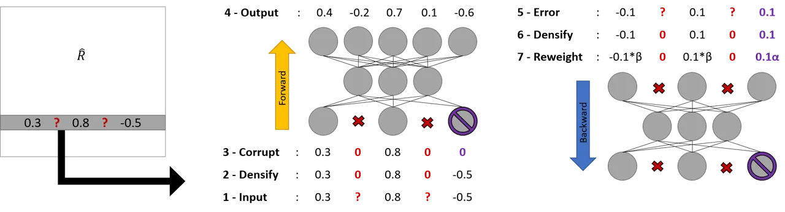
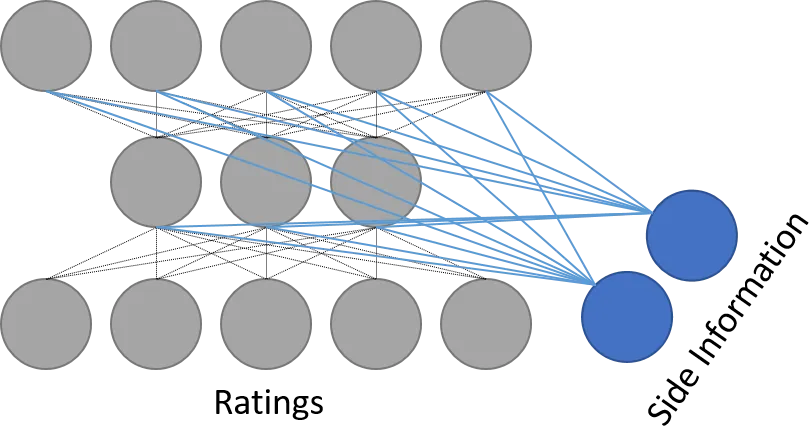

# Hybrid Collaborative Filtering with Autoencoders

Florian Strub Affiliation: Univ. Lille, CNRS, Centrale Lille  
UMR 9189 - CRIStAL  
F-59000 Lille, France  
Email: florian.strub@inria.fr    Jérémie Mary Affiliation: Univ. Lille,
CNRS, Centrale Lille  
UMR 9189 - CRIStAL  
F-59000 Lille, France  
Email: jeremie.mary@inria.fr    Romaric Gaudel Affiliation: Univ. Lille,
CNRS, Centrale Lille  
UMR 9189 - CRIStAL  
F-59000 Lille, France  
Email: romaric.gaudel@inria.fr

###### Abstract

Collaborative Filtering aims at exploiting the feedback of users to
provide personalised recommendations. Such algorithms look for latent
variables in a large sparse matrix of ratings. They can be enhanced by
adding side information to tackle the well-known cold start problem.
While Neural Networks have tremendous success in image and speech
recognition, they have received less attention in Collaborative
Filtering. This is all the more surprising that Neural Networks are able
to discover latent variables in large and heterogeneous datasets. In
this paper, we introduce a Collaborative Filtering Neural network
architecture aka CFN which computes a non-linear Matrix Factorization
from sparse rating inputs and side information. We show experimentally
on the MovieLens and Douban dataset that CFN outperforms the state of
the art and benefits from side information. We provide an implementation
of the algorithm as a reusable plugin for Torch, a popular Neural
Network framework.

## I Introduction

Recommendation systems advise users on which items (movies, musics,
books etc.) they are more likely to be interested in. A good
recommendation system may dramatically increase the amount of sales of a
firm or retain customers. For instance, 80% of movies watched on Netflix
come from the recommender system of the company \[1\]. One efficient way
to design such algorithm is to predict how a user would rate a given
item. Two key methods co-exist to tackle this issue: _Content-Based
Filtering_ (CBF) and _Collaborative Filtering_ (CF).

CBF uses the user/item knowledge to estimate a new rating. For instance,
user information can be the age, gender, or graph of friends etc. Item
information can be the movie genre, a short description, or the tags. On
the other side, CF uses the ratings history of users and items. The
feedback of _one_ user on _some_ items is combined with the feedback of
_all_ other users on _all_ items to predict a new rating. For instance,
if someone rated a few books, Collaborative Filtering aims at estimating
the ratings he would have given to thousands of other books by using the
ratings of all the other readers. CF is often preferred to CBF because
it wins the agnostic vs. studied contest: CF only relies on the ratings
of the users while CBF requires advanced engineering on items to well
perform \[2\].

The most successful approach in CF is to retrieve potential latent
factors from the sparse matrix of ratings. Book latent factors are
likely to encapsulate the book genre (spy novel, fantasy, etc.) or some
writing styles. Common latent factor techniques compute a low-rank
rating matrix by applying Singular Value Decomposition through gradient
descent \[3\] or Regularized Alternating Least Square algorithm \[4\].
However, these methods are linear and cannot catch subtle factors. Newer
algorithms were explored to face those constraints such as Factorization
Machines \[5\]. More recent works combine several low-rank matrices such
as Local Low Rank Matrix Approximation \[6\] or WEMAREC \[7\] to enhance
the recommendation.

Another limitation of CF is known as the _cold start_ problem: how to
recommend an item to a user when no rating exists for neither the user
nor the item? To overcome this issue, one idea is to build a hybrid
model mixing CF and CBF where side information is integrated into the
training process. The goal is to supplant the lack of ratings through
side information. A successful approach \[8, 9\] extends the Bayesian
Probabilistic Matrix Factorization Framework \[10\] to integrate side
information. However, recent algorithms outperform them in the general
case \[11\].

In this paper we introduce a CF approach based on Stacked Denoising
Autoencoders \[12\] which tackles both challenges: learning a non-linear
representation of users and items, and alleviating the cold start
problem by integrating side information. Compared to previous attempts
in that direction \[13, 14, 15, 16, 17\], our framework integrates the
sparse matrix of ratings and side information in a unique Network. This
joint model leads to a scalable and robust approach which beats
state-of-the-art results in CF. Reusable source code is provided in
Torch to reproduce the results. Last but not least, we show that CF
approaches based on Matrix Factorization have a strong link with our
approach.

The paper is organized as follows. First, Sec. II summarizes the
state-of-the-art in CF and Neural Networks. Then, our model is described
in Sec. III and IV and its relation with Matrix Factorization is
characterized in Sec. III-B. Finally, experimental results are given and
discussed in Sec. V and Sec. VI discusses algorithmic aspects.

## II Preliminaries

### II-A Denoising Autoencoders

The proposed approach builds upon Autoencoders which are feed-forward
Neural Networks popularized by Kramer \[18\]. They are unsupervised
Networks where the output of the Network aims at reconstructing the
initial input. The Network is constrained to use narrow hidden layers,
forcing a dimensionality reduction on the data. The Network is trained
by back-propagating the squared error loss on the reconstruction. Such
Networks are divided into two parts:

- •
  the encoder : $`f(\mathbf{x})=\sigma(\mathbf{W_{1}x+b_{1}})`$,
- •
  the decoder : $`g(\mathbf{y})=\sigma(\mathbf{W_{2}y+b_{2}})`$,

with $`\mathbf{x}\in\mathbb{R}^{N}`$ the input,
$`\mathbf{y}\in\mathbb{R}^{k}`$ the output, $`k`$ the size of the
Autoencoder’s bottleneck ($`k\ll N`$),
$`\mathbf{W_{1}}\in\mathbb{R}^{k\times N}`$ and
$`\mathbf{W_{2}}\in\mathbb{R}^{N\times k}`$ the weight matrices,
$`\mathbf{b_{1}}\in\mathbb{R}^{k}`$ and
$`\mathbf{b_{2}}\in\mathbb{R}^{N}`$ the bias vectors, and $`\sigma(.)`$
a non-linear transfer function. The full Autoencoder will be denoted
$`nn(\mathbf{x})\stackrel{{\scriptstyle\text{def}}}{{=}}g(f(\mathbf{x}))`$.

Recent work in Deep Learning advocates to stack pre-trained encoders to
initialize Deep Neural Networks \[19\]. This process enables the lowest
layers of the Network to find low-dimensional representations. It
experimentally increases the quality of the whole Network. Yet, classic
Autoencoders may degenerate into identity Networks and they fail to
learn the latent relationship between data. \[12\] tackle this issue by
corrupting inputs, pushing the Network to denoise the final outputs. One
method is to add Gaussian noise on a random fraction of the input.
Another method is to mask a random fraction of the input by replacing
them with zero. In this case, the Denoising AutoEncoder (DAE) loss
function is modified to emphasize the denoising aspect of the Network.
The loss is based on two main hyperparameters $`\alpha`$, $`\beta`$.
They balance whether the Network would focus on denoising the input
($`\alpha`$) or reconstructing the input ($`\beta`$):

```math
L_{2,\alpha,\beta}(\mathbf{x},\mathbf{\tilde{x}})=\alpha\left(\sum_{j\in\mathcal{C}(\mathbf{\tilde{x})}}[nn(\mathbf{\tilde{x}})_{j}-x_{j}]^{2}\right)+\\
\beta\left(\sum_{j\not\in\mathcal{C}(\mathbf{\tilde{x})}}[nn(\mathbf{\tilde{x}})_{j}-x_{j}]^{2}\right),
```

where $`\mathbf{\tilde{x}}\in\mathbb{R}^{N}`$ is a corrupted version of
the input $`\mathbf{x}`$, $`\mathcal{C}`$ is the set of corrupted
elements in $`\mathbf{\tilde{x}}`$, and $`nn(\mathbf{x})_{j}`$ is the
$`j^{th}`$ output of the Network while fed with $`\mathbf{x}`$.

### II-B Matrix Factorization

One of the most successful approach of Collaborative Filtering is Matrix
Factorization \[3\]. This method retrieves latent factors from the
ratings given by the users. The underlying idea is that key features are
hidden in the ratings themselves. Given $`N`$ users and $`M`$ items, the
rating $`r_{ij}`$ is the rating given by the $`i^{th}`$ user for the
$`j^{th}`$ item. It entails a sparse matrix of ratings
$`\mathbf{R}\in\mathbb{R}^{N\times M}`$. In Collaborative Filtering,
sparsity is originally produced by missing values rather than zero
values. The goal of Matrix Factorization is to find a $`k`$ low rank
matrix $`\mathbf{\widehat{R}}\in\mathbb{R}^{N\times M}`$ where
$`\mathbf{\widehat{R}}=\mathbf{U}\mathbf{V}^{T}`$ with
$`\mathbf{U}\in\mathbb{R}^{N\times k}`$ and
$`\mathbf{V}\in\mathbb{R}^{M\times k}`$ two matrices of rank $`k`$
encoding a dense representation of the users/items. In it simplest form,
($`\mathbf{U}`$ ,$`\mathbf{V}`$) is the solution of

```math
\argmin_{\mathbf{U},\mathbf{V}}\sum_{(i,j)\in\mathcal{K}(\mathbf{R})}(r_{ij}-\mathbf{\bar{u}}_{i}^{T}\mathbf{\bar{v}}_{j})^{2}+\lambda(\|\bar{\mathbf{u}}_{i}\|_{F}^{2}+\|\bar{\mathbf{v}}_{j}\|_{F}^{2}),
```

where $`\mathcal{K}(\mathbf{R})`$ is the set of indices of known ratings
of $`\mathbf{R}`$, ($`\bar{\mathbf{u}}_{i}`$, $`\bar{\mathbf{v}}_{j}`$)
are the dense and low rank rows of ($`\mathbf{U}`$ ,$`\mathbf{V}`$) and
$`\|.\|_{F}`$ is the Frobenius norm. Vectors $`\bar{\mathbf{u}}_{i}`$
and $`\bar{\mathbf{v}}_{j}`$ are treated as column-vectors.



Fig. 1: Feed Forward/Backward process for sparse Autoencoders. The
sparse input is drawn from the matrix of ratings, unknown values are
turned to zero, some ratings are masked (input corruption) and a dense
estimate is finally obtained. Before backpropagation, unknown ratings
are turned to zero error, prediction errors are reweighed by $`\alpha`$
and reconstruction errors are reweighed by $`\beta`$.

### II-C Related Work

Neural Networks have attracted little attention in the CF community. In
a preliminary work, \[13\] tackled the Netflix challenge using
Restricted Boltzmann Machines but little published work had follow
\[20\]. While Deep Learning has tremendous success in image and speech
recognition \[21\], sparse data has received less attention and remains
a challenging problem for Neural Networks.

Nevertheless, Neural Networks are able to discover non-linear latent
variables with heterogeneous data \[21\] which makes them a promising
tool for CF. \[14, 15, 16\] directly train Autoencoders to provide the
best predicted ratings. Those methods report excellent results in the
general case. However, the cold start initialization problem is ignored.
For instance, AutoRec \[14\] replaces unpredictable ratings by an
arbitrary selected score. In our case, we apply a training loss designed
for _sparse_ rating inputs and we integrate side information to lessen
the cold start effect.

Other contributions deal with this cold start problem by using Neural
Networks properties for CBF: Neural Networks are first trained to learn
a feature representation from the item which is then processed by a CF
approach such as Probabilistic Matrix Factorization \[22\] to provide
the final rating. For instance, \[23, 24\] respectively auto-encode
bag-of-words from restaurant reviews and movie plots, \[25\] auto-encode
heterogeneous side information from users and items. Finally, \[26, 27\]
use Convolutional Networks on music samples. In our case, side
information and ratings are used together without any unsupervised
pretreatment.

### II-D Notation

In the rest of the paper, we will use the following notations:

- •
  $`\mathbf{u_{i}}`$, $`\mathbf{v_{j}}`$ are the sparse rows/columns of
  $`\mathbf{R}`$;
- •
  $`\mathbf{\tilde{u}}_{i}`$, $`\mathbf{\tilde{v}_{j}}`$ are corrupted
  versions of $`\mathbf{u_{i}}`$, $`\mathbf{v_{j}}`$;
- •
  $`\mathbf{\hat{u}}_{i}`$, $`\mathbf{\hat{v}}_{j}`$ are dense estimates
  of $`\mathbf{\widehat{R}}`$;
- •
  $`\mathbf{\bar{u}}_{i}`$, $`\mathbf{\bar{v}}_{j}`$ are dense low rank
  representations of $`\mathbf{u_{i}}`$, $`\mathbf{v_{j}}`$.

## III Autoencoders and CF

User preferences are encoded as a sparse matrix of ratings
$`\mathbf{R}`$. A user is represented by a sparse line
$`\mathbf{u}_{i}\in\mathbb{R}^{N}`$ and an item is represented by a
sparse column $`\mathbf{v}_{j}\in\mathbb{R}^{M}`$. The Collaborative
Filtering objective can be formulated as: _turn the sparse vectors
$`\mathbf{u}_{i}`$/$`\mathbf{v}_{j}`$, into dense vectors
$`\hat{\mathbf{u}}_{i}`$/$`\hat{\mathbf{v}}_{j}`$_.

We propose to perform this conversion with Autoencoders. To do so, we
need to define two types of Autoencoders:

- •
  U-CFN is defined as $`\hat{\mathbf{u}}_{i}=nn(\mathbf{u_{i}})`$,
- •
  V-CFN is defined as $`\hat{\mathbf{v}}_{j}=nn(\mathbf{v_{j}})`$.

The encoding part of these Autoencoders aims at building a low-rank
dense representation of the sparse input of ratings. The decoding part
aims at predicting a dense vector of ratings from the low-rank dense
representation of the encoder. This new approach differs from classic
Autoencoders which only aim at reconstructing/denoising the input. As we
will see later, the training loss will then differ from the evaluation
one.

### III-A Sparse Inputs

There is no standard approach for using sparse vectors as inputs of
Neural Networks. Most of the papers dealing with sparse inputs get
around by pre-computing an estimate of the missing values \[28, 29\]. In
our case, we want the Autoencoder to handle this prediction issue by
itself. Such problems have already been studied in industry \[30\] where
5% of the values are missing. However in Collaborative Filtering we
often face datasets with more than 95% missing values. Furthermore,
missing values are _not_ known during _training_ in Collaborative
Filtering which makes the task even more difficult.

Our approach includes three ingredients to handle the training of sparse
Autoencoders:

- •
  inhibit the edges of the input layers by zeroing out values in the
  input,
- •
  inhibit the edges of the output layers by zeroing out back-propagated
  values,
- •
  use a denoising loss to emphasize rating prediction over rating
  reconstruction.

One way to inhibit the input edges is to turn missing values to zero. To
keep the Autoencoder from always returning zero, we also use an
empirical loss that disregards the loss of unknown values. No error is
back-propagated for missing values. Therefore, the error is
back-propagated for actual zero values while it is discarded for missing
values. In other words, missing values do not bring information to the
Network. This operation is equivalent to removing the neurons with
missing values described in \[13, 14\]. However, Our method has
important computational advantages because only one Neural Networks is
trained whereas other techniques has to share the weights among
thousands of Networks.

Finally, we take advantage of the masking noise from the Denoising
AutoEncoders (DAE) empirical loss. By simulating missing values in the
training process, Autoencoders are trained to predict them. In
Collaborative Filtering, this prediction aspect is actually the final
target. Thus, emphasizing the prediction criterion turns the classic
unsupervised training of Autoencoders into a simulated supervfigureised
learning. By mixing both the reconstruction and prediction criteria, the
training can be thought as a pseudo-semi-supervised learning. This makes
the DAE loss a promising objective function. After regularization, the
final training loss is:

```math
L_{2,\alpha,\beta}(\mathbf{x},\mathbf{\tilde{x}})=\alpha\left(\sum_{j\in\mathcal{C}(\tilde{\mathbf{x}})\cap\mathcal{K}(\mathbf{x})}[nn(\mathbf{\tilde{x}})_{j}-x_{j}]^{2}\right)+\\
\beta\left(\sum_{j\not\in\mathcal{C}(\tilde{\mathbf{x}})\cap\mathcal{K}(\mathbf{x})}[nn(\mathbf{\tilde{x}})_{j}-x_{j}]^{2}\right)+\lambda\|\mathbf{W}\|_{F}^{2},
```

where $`\mathcal{K}(\mathbf{x})`$ are the indices of known values of
$`\mathbf{x}`$, $`\mathbf{W}`$ is the flatten vector of weights of the
Network and $`\lambda`$ is the regularization hyperparameter. The full
forward/backward process is explained in Figure 1. Importantly,
Autoencoders with sparse inputs differs from sparse-Autoencoders \[31\]
or Dropout regularization \[32\] in the sense that Sparse Autoencoders
and Droupout inhibit the hidden neurons for regularization purpose.
Every inputs/outputs are also known.

### III-B Low Rank Matrix Factorization

Autoencoders are actually strongly linked with Matrix Factorization. For
an Autoencoder with only one hidden layer and no output transfer
function, the response of the network is
$`nn(\mathbf{x})=\mathbf{W_{2}}\;\sigma(\mathbf{W_{1}x+b_{1}})+\mathbf{b_{2}},`$
where $`\mathbf{W_{1},W_{2}}`$ are the weights matrices and
$`\mathbf{b_{1},b_{2}}`$ the bias terms. Let $`\mathbf{x}`$ be the
representation $`\mathbf{u}_{i}`$ of the user $`i`$, then we recover a
predicted vector $`\hat{\mathbf{u}}_{i}`$ of the form
$`\mathbf{V}\mathbf{\bar{u}_{i}}`$:

```math
\hat{\mathbf{u}}_{i}=nn(\mathbf{u_{i}})=\underbrace{\left[\mathbf{W_{2}}\;{\mathbf{I}_{N}}\right]}_{\mathbf{V}}\;\underbrace{\left[\begin{array}[]{c}\sigma(\mathbf{W_{1}u_{i}+b_{1}})\\
\mathbf{b_{2}}\end{array}\right]}_{\mathbf{\bar{u}_{i}}}.
```

Symmetrically, $`\hat{\mathbf{v}}_{j}`$ has the form
$`\mathbf{U}\mathbf{\bar{v}_{j}}`$:

```math
\hat{\mathbf{v}}_{j}=nn(\mathbf{v_{j}})=\underbrace{\left[\mathbf{W^{\prime}_{2}}\;\mathbf{I}_{M}\right]}_{\mathbf{U}}\;\underbrace{\left[\begin{array}[]{c}\sigma(\mathbf{W^{\prime}_{1}v_{j}+b^{\prime}_{1}})\\
\mathbf{b^{\prime}_{2}}\end{array}\right]}_{\mathbf{\bar{v}_{j}}}.
```

The difference with standard Low Rank Matrix Factorization stands in the
definition of $`\mathbf{\bar{u}_{i}}`$/$`\mathbf{\bar{v}_{j}}`$. For the
Matrix Factorization by ALS, $`\mathbf{\widehat{R}}`$ is iteratively
built by solving for each row $`i`$ of $`\mathbf{U}`$ (resp. column
$`j`$ of $`\mathbf{V^{T}}`$) a linear least square regression using the
known values of the $`i^{th}`$ row of $`\mathbf{R}`$ (resp. $`j^{th}`$
column of $`\mathbf{R}`$) as observations of a scalar product in
dimension $`k`$ of $`\mathbf{\bar{u}_{i}}`$ and the corresponding
columns of $`\mathbf{V^{T}}`$ (resp. $`\mathbf{\bar{v}_{j}}`$ and the
corresponding rows of $`\mathbf{U}`$). An Autoencoder aims at a
projection in dimension $`k`$ composed with the non linearity
$`\sigma`$. This process corresponds to a non linear matrix
factorization.

Note that CFN also breaks the symmetry between $`\mathbf{U}`$ and
$`\mathbf{V}`$. For example, while Matrix Factorization approaches learn
both $`\mathbf{U}`$ and $`\mathbf{V}`$, U-CFN learns $`\mathbf{V}`$ and
only indirectly learns $`\mathbf{U}`$: U-CFN targets the function to
build $`\mathbf{\bar{u}_{i}}`$ whatever the row $`\mathbf{u_{i}}`$. A
nice benefit is that the learned Autoencoder is able to fill in every
vector $`\mathbf{u_{i}}`$, even if that vector was not in the training
data.

Both non-linear decompositions on rows and columns are done
independently, which means that the matrix $`\mathbf{V}`$ learned by
U-CFN from rows can differ from the concatenation of vectors
$`\mathbf{\bar{v}_{j}}`$ predicted by V-CFN from columns.

Finally, it is very important to differentiate CFN from Restrictive
Boltzman Machine (RBM) for Collaborative Filtering \[13\]. By
construction, RBM only handles binary input. Thus, one has to discretize
the rating of users/items for both the input/output layers. First, it
striclty limits the use of RBM on database with real numbers. Secondly,
the resulting weight architecture clearly differs from CFN. in RBM,
Imput/output ratings are encoded by $`D`$ weights where $`D`$ is the
number of discretized features while CFN only requires a single weight.
Thus, no direct link can be done between Matrix Factorization and RBM .
Besides, this architecture also prevents RBM from being used to
initialize the input/ouput layers of CFN.

## IV Integrating side information



Fig. 2: Integrating side information. The Network has two inputs: the
classic Autoencoder rating input and a side information input. Side
information is wired to every neurons in the Network.

Collaborative Filtering only relies on the feedback of users regarding a
set of items. When additional information is available for the users and
the items, this can sound restrictive. One would think that adding more
information can help in several ways: increasing the prediction
accuracy, speeding up the training, increasing the robustness of the
model, etc. Furthermore, pure Collaborative Filtering suffers from the
cold start problem: when very little information is available on an
item, Collaborative Filtering will have difficulties recommending it.
When bad recommendations are provided, the probability to receive
valuable feedback is lowered leading to a vicious circle for new items.
A common way to tackle this problem is to add some side information to
ensure a better initialization of the system. This is known in the
recommendation community as hybridization.

The simplest approach to integrate side information is to append
additional user/item bias to the rating prediction \[3\]:

```math
\hat{r}_{ij}=\bar{\mathbf{u}}_{i}^{T}\bar{\mathbf{v}}_{j}+b_{u,i}+b_{v,j}+b^{\prime},
```

where $`b_{u,i}`$, $`b_{v,j}`$, $`b^{\prime}`$ are respectively the
user, item, and global bias of the Matrix Factorization. Computing these
bias can be done through hand-crafted engineering or Collaborative
Filtering technique. For instance, one method is to extend the dense
feature vectors of rank $`k`$ by directly appending side information on
them \[9\]. Therefore, the estimated rating is computed by:

```math
\displaystyle\hat{r}_{ij} \displaystyle=\{\bar{\mathbf{u}}_{i},\mathbf{x}_{i}\}\otimes\{\bar{\mathbf{v}}_{j},\mathbf{y}_{j}\}
```

```math
\displaystyle\stackrel{{\scriptstyle\text{def}}}{{=}}\bar{\mathbf{u}}_{[1:k],i}^{T}\bar{\mathbf{v}}_{[1:k],j}+\underbrace{\bar{\mathbf{u}}_{[k+1:k+Q],i}^{T}\mathbf{y}_{j}}_{b_{v,j}}+\underbrace{\mathbf{x}_{i}^{T}\bar{\mathbf{v}}_{[k+1:k+P],j}}_{b_{u,i}},
```

where $`\mathbf{x}_{i}\in\mathbb{R}^{P}`$ and
$`\mathbf{y}_{j}\in\mathbb{R}^{Q}`$ respectively are a vector
representation of side information for the user and for the item.
Unfortunately, those methods cannot be directly applied to Neural
Networks because Autoencoders optimize $`\mathbf{U}`$ and $`\mathbf{V}`$
independently. New strategies must be designed to incorporate side
information. One notable example was recently made by \[33\] for bitext
word alignment.

In our case, the first idea would be to append the side information to
the sparse input vector. For simplicity purpose, the next equations will
only focus on shallow U-Autoencoders with no output transfer functions.
Yet, this can be extended to more complex Networks and V-Autoencoders.
Therefore, we get:

```math
\displaystyle\hat{\mathbf{u}}_{i}=nn(\{\mathbf{u}_{i},\mathbf{x}_{i}\}) \displaystyle=\mathbf{V}\;\sigma(\mathbf{W}^{\prime}_{1}\{\mathbf{u}_{i},\mathbf{x}_{i}\}+\mathbf{b_{1}})+\mathbf{b_{2}},
```

where $`\mathbf{W}^{\prime}_{1}\in\mathbb{R}^{k\times(N+P)}`$ is a
weight matrix.

When no previous rating exist, it enables the Neural Networks to have at
an input to predict new ratings. With this scenario, side information is
assimilated to pseudo-ratings that will always exist for every items.
However, when the dimension of the Neural Network input is far greater
than the dimension of the side information, the Autoencoder may have
difficulties to use it efficiently.

Yet, common Matrix Factorization would append side information to dense
feature representations $`\{\mathbf{\bar{u}}_{i},\mathbf{x}_{i}\}`$
rather than sparse feature representation as we just proposed
$`\{\mathbf{u}_{i},\mathbf{x}_{i}\}`$. A solution to reproduce this idea
is to inject the side information to every layer inputs of the Network:

```math
\displaystyle nn(\{\mathbf{u}_{i},\mathbf{x}_{i}\}) \displaystyle=\mathbf{V}^{\prime}\;\{\overbrace{\sigma(\mathbf{W}^{\prime}_{1}\{\mathbf{u}_{i},\mathbf{x}_{i}\}+\mathbf{b_{1}})}^{\mathbf{\bar{u}^{\prime}}_{i}},\mathbf{x}_{i}\}+\mathbf{b_{2}}
```

```math
\displaystyle=\mathbf{V}^{\prime}\;\{\mathbf{\bar{u}^{\prime}}_{i},\mathbf{x}_{i}\}+\mathbf{b_{2}}
```

```math
\displaystyle=\mathbf{V}^{\prime}_{[1:k]}\mathbf{\bar{u}^{\prime}}_{i}+\underbrace{\mathbf{V}^{\prime}_{[k+1:k+P]}\mathbf{x}_{i}}_{\mathbf{b}_{u,i}}+\mathbf{b_{2}},
```

where $`\mathbf{V}^{\prime}\in\mathbb{R}^{(N\times k+P)}`$ is a weight
matrix,
$`\mathbf{V}^{\prime}_{[1:k]}\in\mathbb{R}^{N\times k},\mathbf{V}^{\prime}_{[k+1:k+P]}\in\mathbb{R}^{N\times P}`$
are respectively the submatrices of $`\mathbf{V}^{\prime}`$ that contain
the columns from $`1`$ to $`k`$ and $`k+1`$ to $`k+P`$.

By injecting the side information in every layer, the dynamic
Autoencoders representation is forced to integrate this new data.
However, to avoid side information to overstep the dense rating
representation. Thus, we enforce the following constraint. The dimension
of the sparse input must be greater than the dimension of the
Autoencoder bottleneck which must be greater than the dimension of the
side information ¹¹ 1 When side information is sparse, the dimension of
the side information can be assimilated to the number of non-zero
parameters. Therefore, we get:

```math
\displaystyle P\ll k\ll N\;\;\;\text{ and }\;\;\;Q\ll k\ll M.
```

We finally obtain an Autoencoder which can incorporate side information
and be trained through backpropagation. See Figure 2 for a graphical
representation of the corresponding network.

## V Experiments

### V-A Benchmark Models

We benchmark CFN with five matrix completion algorithms:

- •
  ALS-WR (Alternating Least Squares with
  Weighted-$`\lambda`$-Regularization) \[4\] solves the low-rank matrix
  factorization problem by alternatively fixing $`\mathbf{U}`$ and
  $`\mathbf{V}`$ and solving the resulting linear regression problem.
  Experiments are run with the Apache Mahout²² 2
  [http://mahout.apache.org/](http://mahout.apache.org/). We use a rank
  of 200;
- •
  SVDFeature \[34\] learns a feature-based matrix factorization: side
  information are used to predict the bias term and to reweight the
  matrix factorization. We use a rank of 64 and tune other
  hyperparameters by random search;
- •
  BPMF (Bayesian Probabilistic Matrix Factorization) \[10\] infers the
  matrix decomposition after a statistical model. We use a rank of 10;
- •
  LLORMA \[6\] estimates the rating matrix as a weighted sum of low-rank
  matrices. Experiments are run with the Prea API³³ 3
  [http://prea.gatech.edu/](http://prea.gatech.edu/). We use a rank of
  20, 30 anchor points which entails a global pseudo-rank of 600. Other
  hyperparameters are picked as recommended in \[6\];
- •
  I-Autorec \[14\] trains one Autoencoder per item, sharing the weights
  between the different Autoencoders. We use 600 hidden neurons with the
  training hyperparameters recommended by the author.

In every scenario, we selected the highest possible rank which does not
lead to overfitting despite a strong regularization. For instance,
increasing the rank of BPMF does not significantly increase the final
RMSE, idem for SVDFeature. Furthermore, we constrained the algorithms to
run in less than two days. Similar benchmarks can be found in the
litterature \[35, 7, 6\].

### V-B Data

Experiments are conducted on MovieLens and Douban datasets. The
MovieLens-1M, MovieLens-10M and MovieLens-20M datasets respectively
provide 1/10/20 millions discrete ratings from 6/72/138 thousands users
on 4/10/27 thousands movies. Side information for MovieLens-1M is the
age, sex and gender of the user and the movie category (action, thriller
etc.). Side information for MovieLens-10/20M is a matrix of tags
$`\mathbf{T}`$ where $`T_{ij}`$ is the occurrence of the $`j^{th}`$ tag
for the $`i^{th}`$ movie and the movie category. No side information is
provided for users.

The Douban dataset \[36\] provides 17 million discrete ratings from 129
thousands users on 58 thousands movies. Side information is the
bi-directional user/friend relations for the user. The user/friend
relation are treated like the matrix of tags from MovieLens. No side
information is provided for items.

#### Pre/post-processing

For each dataset, the full dataset is considered and the ratings are
normalized from -1 to 1. We split the dataset into random 90%-10%
train-test datasets and inputs are unbiased before the training process:
denoting $`\mu`$ the mean over the training set, $`b_{u_{i}}`$ the mean
of the $`i^{th}`$ user and $`b_{v_{i}}`$ the mean of the $`v^{th}`$
item, U-CFN and V-CFN respectively learn from
$`r_{ij}^{unbiased}=r_{ij}-b_{u_{i}}`$ and
$`r_{ij}^{unbiased}=r_{ij}-b_{v_{i}}`$. The bias computed on the
training set is added back while evaluating the learned matrix.

#### Side Information

In order to enforce the side information constraint,
$`Q\ll k_{v}\ll M`$, Principal Component Analysis is performed on the
matrix of tags. We keep the 50 greatest eigenvectors⁴⁴ 4 The number of
eigenvalues is arbitrary selected. We do not focus on optimizing the
quality of this representation. and normalize them by the square root of
their respective eigenvalue: given
$`\mathbf{T}=\mathbf{P}\mathbf{D}\mathbf{Q}^{T}`$ with $`\mathbf{D}`$
the diagonal matrix of eigenvalues sorted in descending order, the movie
tags are represented by
$`\mathbf{Y}=\mathbf{P}_{[1:M],[1:K^{\prime}]}\mathbf{D}_{[1:K^{\prime}],[1:K^{\prime}]}^{0.5}`$
with $`K^{\prime}`$ the number of kept eigenvectors. Binary
representation such as the movie category is then concatenated to
$`\mathbf{Y}`$.

|            |                       |                       |                       |                       |
| ---------- | --------------------- | --------------------- | --------------------- | --------------------- |
| Algorithms | MovieLens-1M          | MovieLens-10M         | MovieLens-20M         | Douban                |
| BPMF       | 0.8705 $`\pm`$ 4.3e-3 | 0.8213 $`\pm`$ 6.5e-4 | 0.8123 $`\pm`$ 3.5e-4 | 0.7133 $`\pm`$ 3.0e-4 |
| ALS-WR     | 0.8433 $`\pm`$ 1.8e-3 | 0.7830 $`\pm`$ 1.9e-4 | 0.7746 $`\pm`$ 2.7e-4 | 0.7010 $`\pm`$ 3.2e-4 |
| SVDFeature | 0.8631 $`\pm`$ 2.5e-3 | 0.7907 $`\pm`$ 8.4e-4 | 0.7852 $`\pm`$ 5.4e-4 | \*                    |
| LLORMA     | 0.8371 $`\pm`$ 2.4e-3 | 0.7949 $`\pm`$ 2.3e-4 | 0.7843 $`\pm`$ 3.2e-4 | 0.6968 $`\pm`$ 2.7e-4 |
| I-Autorec  | 0.8305 $`\pm`$ 2.8e-3 | 0.7831 $`\pm`$ 2.4e-4 | 0.7742 $`\pm`$ 4.4e-4 | 0.6945 $`\pm`$ 3.1e-4 |
| U-CFN      | 0.8574 $`\pm`$ 2.4e-3 | 0.7954 $`\pm`$ 7.4e-4 | 0.7856 $`\pm`$ 1.4e-4 | 0.7049 $`\pm`$ 2.2e-4 |
| U-CFN++    | 0.8572 $`\pm`$ 1.6e-3 | N/A                   | N/A                   | 0.7050 $`\pm`$ 1.2e-4 |
| V-CFN      | 0.8388 $`\pm`$ 2.5e-3 | 0.7767 $`\pm`$ 5.4e-4 | 0.7663 $`\pm`$ 2.9e-4 | 0.6911 $`\pm`$ 3.2e-4 |
| V-CFN++    | 0.8377 $`\pm`$ 1.8e-3 | 0.7754 $`\pm`$ 6.3e-4 | 0.7652 $`\pm`$ 2.3e-4 | N/A                   |

TABLE I: RMSE with a training ratio of 90%/10%. The ++ suffix denotes
algorithms using side information. When side information are missing,
the N/A acronym is used. The \* character indicates that the results
were too low after four days of computation.

### V-C Error Function

We measure the prediction accuracy by the mean of _Root Mean Square
Error_ (RMSE). Denoting $`\mathbf{R_{test}}`$ the matrix test ratings
and $`\mathbf{\widehat{R}}`$ the full matrix returned by the learning
algorithm, the RMSE is:

```math
RMSE(\mathbf{\widehat{R}},\mathbf{R_{test}})=\\
\sqrt{\frac{1}{|\mathcal{K}(R_{test})|}\sum_{(i,j)\in\mathcal{K}(R_{test})}(r_{test,ij}-\hat{r}_{ij})^{2}},
```

where $`|\mathcal{K}(R_{test})|`$ is the number of ratings in the
testing dataset. Note that, in the case of Autoencoders,
$`\mathbf{\widehat{R}}`$ is computed by feeding the network with
training data. As such, $`\hat{r}_{ij}`$ stands for
$`nn(\mathbf{u}_{train,i})_{j}`$ for U-CFN, and
$`nn(\mathbf{v}_{train,j})_{i}`$ for V-CFN.

### V-D Training Settings

We train 2-layers Autoencoders for MovieLens-1/10/20M and the Douban
datasets. The layers have from $`500`$ to $`700`$ hidden neurons.
Weights are initialized using the fan-in rule \[37\]. Transfer functions
are hyperbolic tangents. The Neural Network is optimized with stochastic
backpropagation with minibatch of size 30 and a weight decay is added
for regularization. Hyperparameters⁵⁵ 5 Hyperparameters used for the
experiments are provided with the source code. are tuned by a genetic
algorithm already used by \[38\] in a different context.

| Interval | V-CFN  | V-CFN++ | %Improv. |
| -------- | ------ | ------- | -------- |
| 0.0-0.2  | 1.0030 | 0.9938  | 0.96     |
| 0.2-0.4  | 0.9188 | 0.9084  | 1.15     |
| 0.4-0.6  | 0.8748 | 0.8669  | 0.91     |
| 0.6-0.8  | 0.8473 | 0.8420  | 0.63     |
| 0.8-1.0  | 0.7976 | 0.7964  | 0.15     |
| Full     | 0.8075 | 0.8055  | 0.25     |

(a) MovieLens-10M (50%/50%)

| Interval | V-CFN  | V-CFN++ | %Improv. |
| -------- | ------ | ------- | -------- |
| 0.0-0.2  | 0.9539 | 0.9444  | 1.01     |
| 0.2-0.4  | 0.8815 | 0.8730  | 0.96     |
| 0.4-0.6  | 0.8487 | 0.8408  | 0.95     |
| 0.6-0.8  | 0.8139 | 0.8110  | 0.35     |
| 0.8-1.0  | 0.7674 | 0.7669  | 0.06     |
| Full     | 0.7767 | 0.7756  | 0.14     |

(b) MovieLens-10M (90%/10%)

TABLE II: RMSE computed by cluster of items sorted by their respective
number of ratings on MovieLens-10M. For instance, the first cluster
contains the 20% of items with the lowest number of ratings. The last
cluster far outweigh other clusters and hide more subtle results.

|            |   $`\alpha`$ |  $`\beta`$ | %Mask |   RMSE |
| ---------- | ------------ | ---------- | ----- | ------ |
| Supervised | 0.91         | 0          | 0     | 0.8020 |
| Unsup.     | 0            | 0.54       | 0.25  | 0.7795 |
| Mixed      | 0.91         | 0.54       | 0.25  | 0.7768 |

(a) MovieLens-10M (90%/10%)

|            |   $`\alpha`$ |   $`\beta`$ | %Mask |   RMSE |
| ---------- | ------------ | ----------- | ----- | ------ |
| Supervised | 1            | 0           | 0.25  | 0.7982 |
| Unsup.     | 0            | 0.60        | 0     | 0.7690 |
| Mixed      | 1            | 0.60        | 0.25  | 0.7663 |

(b) MovieLens-20M (90%/10%)

TABLE III: Impact of the denoising loss in the training process. If we
focus on the prediction (aka supervised setting), the autoencoder
provides poor results. If we focus on the reconstruction with no masking
noise (aka unsupervised setting), the Autoencoder already provides
excellent results. By using a mixture of those techniques, the network
converges to a better score.

Fig. 3: RMSE as a function of the training set ratio for MovieLens-10M.
Training hyperparameters are kept constant across dataset. CFN and
I-Autorec are very robust to a change in the density. On the other side,
SVDFeature turns out to be unstable and should be fine-tuned for each
ratio.

### V-E Results

_Comparison to state-of-the-art_. Table I displays the RMSE on MovieLens
and Douban datasets. Reported results are computed through $`k`$-fold
cross-validation and confidence intervals correspond to a 95% range.
Except for the smallest dataset, V-CFNs leads to the best results; V-CFN
is competitive compared to the state-of-the-art Collaborative Filtering
approaches. To the best of our knowledge, the best result published
regarding MovieLens-10M (training ratio of 90%/10% and no side
information) are reported by \[35\] and \[7\] with a final RMSE of
respectively $`0.7682`$ and $`0.7769`$. However, those two methods
require to recompute the full matrix for every new ratings. CFN has the
key advantage to provide similar performance while being able to refine
its prediction on the fly for new ratings. More generally, we are not
aware of recent works that both manage to reach state of the art reslts
while successfully integrated side information. For instance, \[39, 40\]
reported a global RMSE above $`0.8`$ on MovieLens-10M.

Fig. 4: RMSE as a function of the numer of epoch for CFN for
MovieLens-10M (90%/10%). The network quickly converges to a very low
RMSE and then refine its prediction upon epoches.

Note that V-CFN outperforms U-CFN. It suggests that the structure on the
items is stronger than the one on users i.e. it is easier to guess
tastes based on movies you liked than to find some users similar to you.
Of course, the behaviour could be different on some other datasets. The
training evoluation is described in the Figure 4.

_Impact of side information_. At first sight at Table I, the use of side
information has a limited impact on the RMSE. This statement has to be
mitigated: as the repartition of known entries in the dataset is not
uniform, the estimates are biased towards users and items with a lot of
ratings. For theses users and movies, the dataset already contains a lot
of information, thus having some extra information will have a marginal
effect. Users and items with few ratings should benefit more from some
side information but the estimation bias hides them.

In order to exhibit the utility of side information, we report in Table
II the RMSE conditionally to the number of missing values for items. As
expected, the fewer number of ratings for an item, the more important
the side information. This is very desirable for a real system: the
effective use of side information to the new items is crucial to deal
with the flow of new products. A more careful analysis of the RMSE
improvement in this setting shows that the improvement is uniformly
distributed over the users whatever their number of ratings. This
corresponds to the fact that the available side information is only
about items. To complete the picture, we train V-CFN on MovieLens-10M
with either the movie genre or the matrix of tags with a training ratio
of 90%/10%. Both side information increase the global RMSE by 0.10%
while concatenating them increases the final score by 0.14%. Therefore,
V-CFN handles the heterogeneity of side information.

_Impact of the loss_. The impact of the denoising loss is highlighted in
Table III: the bigger the dataset, the more usefull the de noising loss.
On the other side, a network dealing with smaller dataset such as
MovieLens-1M may suffer from masked entries.

_Impact of the non-linearity_. We train I-CFN by removing the
non-linearity to study its impact on the training. For fairness, we kept
the $`\alpha`$, $`\beta`$, the masking ratio and the number of hidden
neurons constant. Furthermore, we search for the best learning rates and
L2 regularization throught the genetic algorithm. For movieLens-10M, we
obtain a final RMSE of 0.8151 $`\pm`$ 1.4e-3 which is far worse than
classic I-CFN.

_Impact of the training ratio_. Last but not least, CFN remains very
robust to a variation of data density as shown in Figure 3. It is all
the more impressive that hyperparameters are first optimized for a
training/testing ratio of 90%/10%. Cold-start and Warm-start scenario
are also far more well-handled by Neural Networks than more classic CF
algorithms. These are highly valuable properties in an industrial
context.

## VI Remarks

### VI-A Source code

Torch is a powerful framework written in Lua to quickly prototype Neural
Networks. It is a widely used (Facebook, Deep Mind) industry standard.
However, Torch lacks some important basic tools to deal with sparse
inputs. Thus, we develop several new modules to deal with DAE loss,
sparse DAE loss and sparse inputs on both CPU and GPU. They can easily
be plugged into existing code. An out-of-the-box tutorial is available
to run the experiments. The code is freely available on Github⁶⁶ 6
[https://github.com/fstrub95/Autoencoders_cf](https://github.com/fstrub95/Autoencoders_cf)
and Luarocks ⁷⁷ 7 luarocks install nnsparse.

### VI-B Scalability

One major problem that most Collaborative Filtering have to solve is
scalability since dataset often have hundred of thousands users and
items. An efficient algorithm must be trained in a reasonable amount of
time and provide quick feedback during evaluation time.

Recent advances in GPU computation managed to reduce the training time
of Neural Networks by several orders of magnitude. However,
Collaborative Filtering deals with sparse data and GPUs are designed to
perform well on dense data. \[13, 14\] face this sparsity constraint by
building small dense Networks with shared weights. Yet, this approach
may lead to important synchronisation latencies. In our case, we tackle
the issue by selectively densifying the inputs just before sending them
to the GPUs cores without modification of the result of the computation.
It introduces an overhead on the computational complexity but this
implementation allows the GPUs to work at their full strength. In
practice, vector operations overtake the extra cost. Such approach is an
efficient strategy to handle sparse data which achieves a balance
between memory footprint and computational time. We are able to train
Large Neural Networks within a few minutes as shown in Table IV. For
purpose of comparison, on MovieLens-20M with a 16 thread 2.7Ghz Core
processor, ALS-WR (r=20) computes the final matrix within a half-hour
with close results, SVDFeatures (r=64) requires a few hours, BPMF (r=10)
and I-Autorec (r=600) require half a day, ALS-WR (r=200) a full day and
LLORMA (r=20\*30) needs several days with the Prea library. At the time
of writing, alternative strategies to train networks with sparse inputs
on GPUs are under development. Although, one may complain that CFN
benefit from GPU, no other algorithm (except ALS-WR) can be easily
parallelized on such device. we believe that algorithms that natively
work on GPU are auspicious in the light of the progress achieved on GPU.

| Dataset   | CFN | \#Param | Time   | Memory   |
| --------- | --- | ------- | ------ | -------- |
| MLens-1M  | V   | 8M      | 2m03s  | 250MiB   |
| MLens-10M | V   | 100M    | 18m34s | 1,532MiB |
| MLens-20M | V   | 194M    | 34m45s | 2,905MiB |
| MLens-1M  | U   | 5M      | 7m17s  | 262MiB   |
| MLens-10M | U   | 15M     | 34m51s | 543MiB   |
| MLens-20M | U   | 38M     | 59m35s | 1,044Mib |

TABLE IV: Training time and memory footprint for a 2-layers CFN without
side information for MovieLens-10M (90%/10%). The GPU is a standard GTX 980. $`Time`$ is the average training duration (around 20-30 epochs).
Parameters are the weight and bias matrices. Memory is retrieved by the
GPU driver during the training. It includes the dataset, the model
parameters and the training buffer. Although the memory footprint highly
depends on the implementation, it provides a good order of magnitude.
Adding side information would increase by around 5% the final time and
memory footprint.

### VI-C Future Works

Implicit feedback may greatly enhance the quality of Collaborative
Filtering algorithms \[3, 5\]. For instance, Implicit feedback would be
incorporated to CFN by feeding the Network with an additional binary
input. By doing so, \[13\] enhance the quality of prediction for
Restricted Boltzmann Machine on the Netflix Dataset. Additionally,
Content-Based Techniques with Deep learning such as \[26, 27\] would be
plugged to CFN. The idea is to train a joint Network that would directly
link the raw item features to the ratings such as music, pictures or
word representations. As a different topic, V-CFN and U-CFN sometimes
report different errors. This is more likely to happen when they are fed
with side information. One interesting work would be to combine a
suitable Network that mix both of them. Finally, other metrics exist to
estimate the quality of Collaborative Filtering to fit other real-world
constraints. Normalized Discounted Cumulative Gain \[41\] or F-score are
sometimes preferred to RMSE and should be benchmarked.

## VII Conclusion

In this paper, we have introduced a Neural Network architecture, aka
CFN, to perform Collaborative Filtering with side information. Contrary
to other attempts with Neural Networks, this joint Network integrates
side information and learns a non-linear representation of users or
items into a unique Neural Network. This approach manages to beats state
of the art results in CF on both MovieLens and Douban datasets. It
performs excellent results in both cold-start and warm-start scenario.
CFN has also valuable assets for industry, it is scalable, robust and it
successfully deals with large dataset. Finally, a reusable source code
is provided in Torch and hyperparameters are provided to reproduce the
results.

### Acknowledgements

The authors would like to acknowledge the stimulating environment
provided by SequeL research group, Inria and CRIStAL. This work was
supported by French Ministry of Higher Education and Research, by CPER
Nord-Pas de Calais/FEDER DATA Advanced data science and technologies
2015-2020, the Projet CHIST-ERA IGLU and by FUI Hermès. Experiments were
carried out using Grid’5000 tested, supported by Inria, CNRS, RENATER
and several universities as well as other organizations.

## References

- \[1\] C. Gomez-Uribe and N. Hunt, “The netflix recommender system:
  Algorithms, business value, and innovation,” _ACM Trans. Manage. Inf.
  Syst._, vol. 6, no. 4, pp. 13:1–13:19, 2015.
- \[2\] P. Lops, M. D. Gemmis, and G. Semeraro, “Content-based
  recommender systems: State of the art and trends,” in _Recommender
  systems handbook_. Springer, 2011, pp. 73–105.
- \[3\] Y. Koren, R. Bell, and C. Volinsky, “Matrix factorization
  techniques for recommender systems,” _Computer_, no. 8, pp.
  30–37, 2009.
- \[4\] Y. Zhou, D. Wilkinson, R. Schreiber, and R. Pan, “Large-scale
  parallel collaborative filtering for the netflix prize,” in
  _Algorithmic Aspects in Information and Management_. Springer, 2008,
  pp. 337–348.
- \[5\] S. Rendle, “Factorization machines,” in _Proc. of ICDM’10_,
  2010, pp. 995–1000.
- \[6\] J. Lee, S. Kim, G. Lebanon, and Y. Singerm, “Local low-rank
  matrix approximation,” in _Proc. of ICML’13_, 2013, pp. 82–90.
- \[7\] C. Chen, D. Li, Y. Zhao, Q. Lv, and L. Shang, “Wemarec: Accurate
  and scalable recommendation through weighted and ensemble matrix
  approximation,” in _Proc. of the International ACM SIGIR Conference on
  Research and Development in Information Retrieval_. ACM, 2015, pp.
  303–312.
- \[8\] R. P. Adams and G. E. D. I. Murray, “Incorporating side
  information in probabilistic matrix factorization with gaussian
  processes,” _arXiv preprint arXiv:1003.4944_, 2010.
- \[9\] I. Porteous and M. W. A. U. Asuncion, “Bayesian matrix
  factorization with side information and dirichlet process mixtures.”
  in _Proc. of AAAI’10_, 2010.
- \[10\] R. Salakhutdinov and A. Mnih, “Bayesian probabilistic matrix
  factorization using markov chain monte carlo,” in _Proc. of
  ICML’08_. ACM, 2008, pp. 880–887.
- \[11\] J. Lee, M. Sun, and G. Lebanon, “A comparative study of
  collaborative filtering algorithms,” _arXiv preprint
  arXiv:1205.3193_, 2012.
- \[12\] P. Vincent, H. Larochelle, I. Lajoie, Y. Bengio, and
  P. Manzagol, “Stacked Denoising Autoencoders: Learning Useful
  Representations in a Deep Network with a Local Denoising Criterion,”
  _Jour. of Mach. Learn. Res._, vol. 11, no. 3, pp. 3371–3408, 2010.
- \[13\] R. Salakhutdinov, A. Mnih, and G. Hinton, “Restricted boltzmann
  machines for collaborative filtering,” in _Proc. of ICML’07_. ACM,
  2007, pp. 791–798.
- \[14\] S. Sedhain, A. K. Menon, S. Sanner, and L. Xie, “Autorec:
  Autoencoders meet collaborative filtering,” in _Proc. of Int. Conf. on
  World Wide Web Companion_, 2015, pp. 111–112.
- \[15\] F. Strub and J. Mary, “Collaborative Filtering with Stacked
  Denoising AutoEncoders and Sparse Inputs,” in _NIPS Workshop on
  Machine Learning for eCommerce_, Montreal, Canada, 2015.
- \[16\] G. Dziugaite and D. Roy, “Neural network matrix factorization,”
  _arXiv preprint arXiv:1511.06443_, 2015.
- \[17\] Y. Wu, C. DuBois, A. Zheng, and M. Ester, “Collaborative
  denoising auto-encoders for top-n recommender systems,” in _Proc. of
  WSDM’16_. ACM, pp. 153–162.
- \[18\] M. A. Kramer, “Nonlinear principal component analysis using
  autoassociative neural networks,” _AIChE journal_, vol. 37, no. 2, pp.
  233–243, 1991.
- \[19\] X. Glorot and Y. Bengio, “Understanding the difficulty of
  training deep feedforward neural networks,” in _Proc. of AISTATS’10_,
  2010, pp. 249–256.
- \[20\] T. T. Truyen, D. Phung, and S. Venkatesh, “Ordinal boltzmann
  machines for collaborative filtering,” in _Proc. of UAI’09_. AUAI
  Press, 2009, pp. 548–556.
- \[21\] Y. LeCun, Y. Bengio, and G. Hinton, “Deep learning,” _Nature_,
  vol. 521, no. 7553, pp. 436–444, 2015.
- \[22\] A. Mnih and R. Salakhutdinov, “Probabilistic matrix
  factorization,” in _Advances in neural information processing
  systems_, 2007, pp. 1257–1264.
- \[23\] X. Glorot, A. Bordes, and Y. Bengio, “Deep sparse rectifier
  neural networks,” in _Proc. of AISTATS’11_, 2011, pp. 315–323.
- \[24\] H. Wang, N. Wang, and D. Y. Yeung, “Collaborative deep learning
  for recommender systems,” _arXiv preprint arXiv:1409.2944_, 2014.
- \[25\] S. Li, J. Kawale, and Y. Fu, “Deep collaborative filtering via
  marginalized denoising auto-encoder,” in _Proc. of CIKM’15_. ACM,
  2015, pp. 811–820.
- \[26\] A. Van den Oord, S. Dieleman, and B. Schrauwen, “Deep
  content-based music recommendation,” in _Proc. of NIPS’13_, 2013, pp.
  2643–2651.
- \[27\] H. Wang, N. Wang, and D. Y. Yeung, “Improving content-based and
  hybrid music recommendation using deep learning,” in _Proceedings of
  the ACM International Conference on Multimedia_. ACM, 2014, pp.
  627–636.
- \[28\] V. Tresp, S. Ahmad, and R. Neuneier, “Training Neural Networks
  with Deficient Data,” _Advances in Neural Information Processing
  Systems 6_, pp. 128–135, 1994.
- \[29\] C. M. Bishop, _Neural networks for pattern recognition_. Oxford
  univ. press, 1995.
- \[30\] V. Miranda, J. Krstulovic, H. Keko, C. Moreira, and J. Pereira,
  “Reconstructing Missing Data in State Estimation With Autoencoders,”
  _IEEE Transactions on Power Systems_, vol. 27, no. 2, pp.
  604–611, 2012.
- \[31\] H. Lee, A. Battle, R. Raina, and A. Ng, “Efficient sparse
  coding algorithms,” in _Advances in neural information processing
  systems_, 2006, pp. 801–808.
- \[32\] N. Srivastava, G. Hinton, A. Krizhevsk, I. Sutskever, and
  R. Salakhutdinov, “Dropout: A simple way to prevent neural networks
  from overfitting,” _The Journal of Machine Learning Research_,
  vol. 15, no. 1, pp. 1929–1958, 2014.
- \[33\] W. Ammar, C. Dyer, and N. A. Smith, “Conditional random field
  autoencoders for unsupervised structured prediction,” in _Proc. of
  NIPS’14_, 2014, pp. 3311–3319.
- \[34\] T. Chen, W. Zhang, Q. Lu, K. Chen, Z. Zheng, and Y. Yong,
  “Svdfeature: a toolkit for feature-based collaborative filtering,”
  _JMLR_, vol. 13, no. 1, pp. 3619–3622, 2012.
- \[35\] D. Li, C. Chen, Q. Lv, J. Yan, L. Shang, and S. Chu, “Low-rank
  matrix approximation with stability,” in _Proc. of ICML’16_, 2016.
- \[36\] H. Ma, D. Zhou, C. Liu, M. R. Lyu, and I. King, “Recommender
  systems with social regularization,” in _Proceedings of the fourth ACM
  international conference on Web search and data mining_, ser. WSDM
  ’11, Hong Kong, China, 2011, pp. 287–296.
- \[37\] Y. LeCun, L. Bottou, G. Orr, and K. Muller, “Efficient
  backprop,” in _Neural networks: Tricks of the trade_. Springer, 1998,
  pp. 9–48.
- \[38\] O. Teytaud, S. Gelly, and J. Mary, “Active learning in
  regression, with application to stochastic dynamic programming.” in
  _ICINCO and CAP_, A. International Conference On Informatics in
  Control and Robotics, Eds., 2007, iConf, pp. 373–386.
- \[39\] Y.-D. Kim and S. Choi, “Scalable variational bayesian matrix
  factorization with side information,” in _Proc. of AISTATS’14,
  Reykjavik, Iceland_, 2014.
- \[40\] R. Kumar, B. K. Verma, and S. S. Rastogi, “Social popularity
  based svd++ recommender system,” _International Journal of Computer
  Applications_, vol. 87, no. 14, 2014.
- \[41\] K. Järvelin and K. Kekäläinen, “Cumulated gain-based evaluation
  of ir techniques,” _ACM Transactions on Information Systems (TOIS)_,
  vol. 20, no. 4, pp. 422–446, 2002.

## VIII Appendix

### VIII-A Genetic Algorithm

We use the following genetic algorithm \[38\] to find the
hyperparameters of our model. The cross-over of two individuals
$`\mathbf{x}`$ and $`\mathbf{y}`$ gives birth to two new individuals
$`\frac{2}{3}\mathbf{x}+\frac{1}{3}\mathbf{y}`$ and
$`\frac{1}{3}\mathbf{x}+\frac{2}{3}\mathbf{y}`$. The mutation of one
individual is obtained by using an isotropic Gaussian law with the mean
centred on the current values of parameters and a standard deviation of
$`\frac{\sigma}{\sqrt[\textbullet]{\textbullet}sqrt[n]{d}}`$ with $`n`$
the number of individuals and $`d`$ the dimension of the space. Let
$`\lambda_{1}`$, $`\lambda_{2}`$, $`\lambda_{3}`$ and $`\lambda_{4}`$ be
such that $`\lambda_{1}+\lambda_{2}+\lambda_{3}+\lambda_{4}=1`$. Once an
initial population of $`n`$ individuals is created, we proceed as follow
at each iteration:

- •
  We copy $`n\lambda_{1}`$ best individuals (Set $`S_{1}`$)
- •
  We apply the cross-over rule to the $`\frac{n}{2}\lambda_{2}`$
  following best individuals with randomly picked individuals in
  $`S_{1}`$
- •
  We mutate $`n\lambda_{3}`$ randomly picked individuals in $`S_{1}`$
- •
  We generate $`n\lambda_{4}`$ new individuals

| CFN hyperparameters | Probabilistic law-1M |
| ------------------- | -------------------- |
| $`alpha`$           | U\[0.8,1.2\]         |
| $`beta`$            | U\[0,1\]             |
| masking ratio       | U\[0,1\]             |
| bottleneck size     | U\[500,700\]         |
| learning rate       | U\[0,0.5\]           |
| learning rate decay | U\[0,0.5\]           |
| weight decay        | U\[0,0.5\]           |

TABLE V: Gene description for CFN. Hyperparameters of the genetic
algorithms were $`n=20`$, $`\sigma=0.08`$, $`\lambda_{1}=1/10`$,
$`\lambda_{2}=2/10`$, $`\lambda_{3}=3/10`$, $`\lambda_{4}=4/10`$
