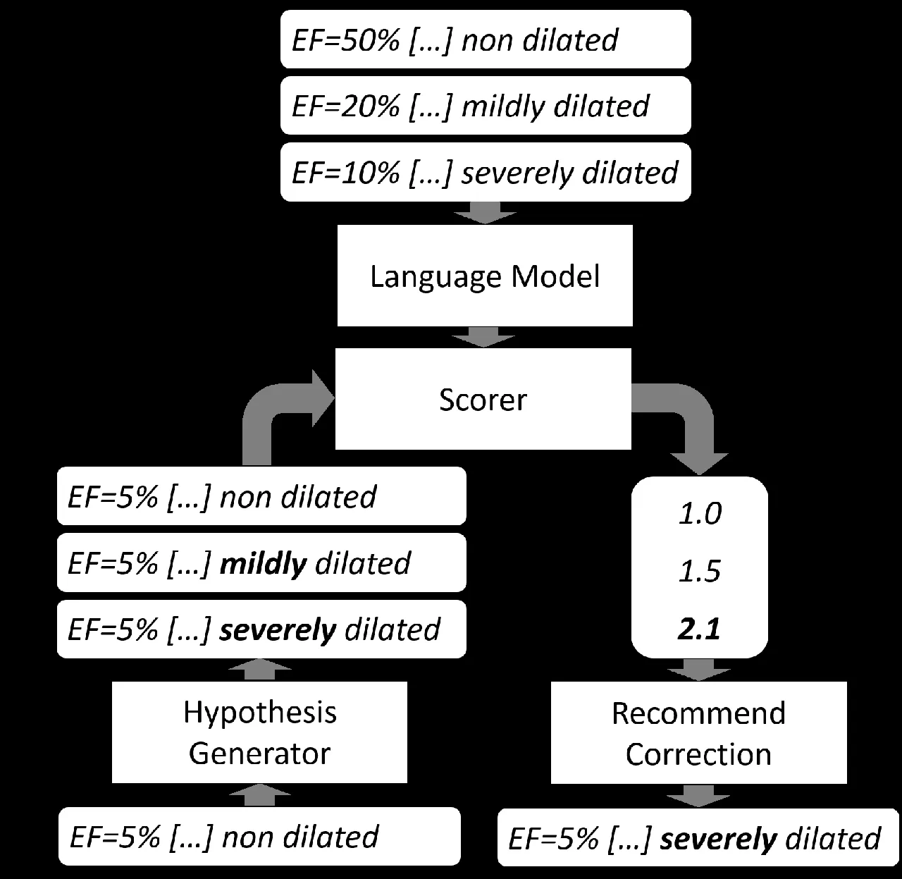
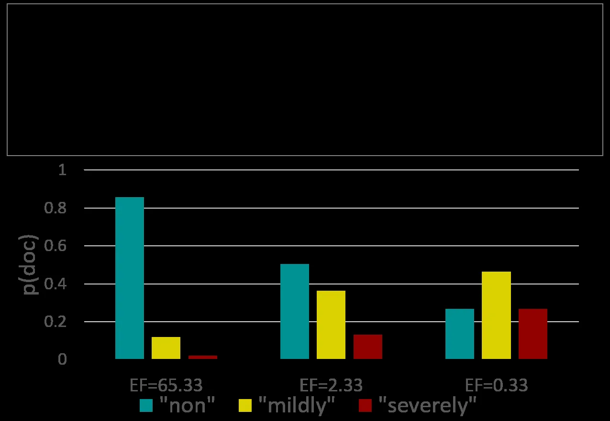

# Numerically Grounded Language Models for Semantic Error Correction

Georgios P. Spithourakis Affiliation: Deptartment of Computer Science   
Isabelle Augenstein Affiliation: University College London    Sebastian
Riedel Affiliation: {g.spithourakis, i.augenstein,
s.riedel}@cs.ucl.ac.uk

###### Abstract

Semantic error detection and correction is an important task for
applications such as fact checking, speech-to-text or grammatical error
correction. Current approaches generally focus on relatively shallow
semantics and do not account for numeric quantities. Our approach uses
language models grounded in numbers within the text. Such groundings are
easily achieved for recurrent neural language model architectures, which
can be further conditioned on incomplete background knowledge bases. Our
evaluation on clinical reports shows that numerical grounding improves
perplexity by 33% and F1 for semantic error correction by 5 points when
compared to ungrounded approaches. Conditioning on a knowledge base
yields further improvements.

## 1 Introduction

Figure 1: Semantic error correction using language models.

In many real world scenarios it is important to detect and potentially
correct semantic errors and inconsistencies in text. For example, when
clinicians compose reports, some statements in the text may be
inconsistent with measurements taken from the patient \[Bowman (2013\].
Error rates in clinical data range from 2.3% to 26.9% \[Goldberg et al.
(2008\] and many of them are number-based errors  \[Arts et al. (2002\].
Likewise, a blog writer may make statistical claims that contradict
facts recorded in databases \[Munger (2008\]. Numerical concepts
constitute 29% of contradictions in Wikipedia and
GoogleNews \[De Marneffe et al. (2008\] and 8.8% of contradictory pairs
in entailment datasets \[Dagan et al. (2006\].

These inconsistencies may stem from oversight, lack of reporting
guidelines or negligence. In fact they may not even be errors at all,
but point to interesting outliers, or to errors in a reference database.
In all cases, it is important to spot and possibly correct such
inconsistencies. This task is known as semantic error correction
(SEC) \[Dahlmeier and Ng (2011\].

In this paper, we propose a SEC approach to support clinicians with
writing patient reports. A SEC system reads a patient’s structured
background information from a knowledge base (KB) and their clinical
report. Then it recommends improvements to the text of the report for
semantic consistency. An example of an inconsistency is shown in
Figure 1. The SEC system has been trained on a dataset of records and
learnt that the phrases “non dilated” and “severely dilated” correspond
to high and low values for “EF” (abbreviation for “ejection fraction”, a
clinical measurement), respectively. If then the system is presented
with the phrase “non dilated” in the context of a low value, it will
detect a semantic inconsistency and correct the text to “severely
dilated”.

Our contributions are: 1) a straightforward extension to recurrent
neural network (RNN) language models for grounding them in numbers
available in the text; 2) a simple method for modelling text conditioned
on an incomplete KB by lexicalising it; 3) our evaluation on a semantic
error correction task for clinical records shows that our method
achieves F1 improvements of 5 and 6 percentage points with grounding and
KB conditioning, respectively, over an ungrounded approach (F1 of 49%).

## 2 Methodology

Our approach to semantic error correction (Figure 1) starts with
training a language model (LM), which can be grounded in numeric
quantities mentioned in-line with text (Subsection 2.1) and/or
conditioned on a potentially incomplete KB (Subsection 2.2). Given a
document for semantic checking, a hypothesis generator proposes
corrections, which are then scored using the trained language model
(Subsection 2.3). A final decision step involves accepting the best
scoring hypothesis.

Figure 2: A language model that is numerically grounded and conditioned
on a lexicalised KB. Examples of data in rounded rectangles.

### 2.1 Numerically grounded language modelling

Let $`\{w_{1},...,w_{T}\}`$ denote a document, where $`w_{t}`$ is the
one-hot representation of the $`t`$-th token and $`V`$ is the vocabulary
size. A neural LM uses a matrix, $`E_{in}\in\mathbb{R}^{D\times V}`$, to
derive word embeddings, $`e^{w}_{t}=E_{in}w_{t}`$. A hidden state from
the previous time step, $`h_{t-1}`$, and the current word embedding,
$`e^{w}_{t}`$, are sequentially fed to an RNN’s recurrence function to
produce the current hidden state, $`h_{t}\in\mathbb{R}^{D}`$. The
conditional probability of the next word is estimated as
$`\softmax(E_{out}h_{t})`$, where $`E_{out}\in\mathbb{R}^{V\times D}`$
is an output embeddings matrix.

We propose concatenating a representation, $`e^{n}_{t}`$, of the numeric
value of $`w_{t}`$ to the inputs of the RNN’s recurrence function at
each time step. Through this numeric representation, the model can
generalise to out-of-vocabulary numbers. A straightforward
representation is defining $`e^{n}_{t}=\float(w_{t})`$, where
$`\float(.)`$ is a numeric conversion function that returns a floating
point number constructed from the string of its input. If conversion
fails, it returns zero. The proposed mechanism for _numerical grounding_
is shown in Figure 2. Now the probability of each next word depends on
numbers that have appeared earlier in the text. We treat numbers as a
separate modality that happens to share the same medium as natural
language (text), but can convey exact measurements of properties of the
real world. At training time, the numeric representations mediate to
ground the language model in the real world.

### 2.2 Conditioning on incomplete KBs

The proposed extension can also be used in _conditional language
modelling_ of documents given a knowledge base. Consider a set of KB
tuples accompanying each document and describing its attributes in the
form $`<attribute,value>`$, where attributes are defined by a KB schema.
We can _lexicalise_ the KB by converting its tuples into textual
statements of the form ”$`attribute:value`$”. An example of how we
lexicalise the KB is shown in Figure 2. The generated tokens can then be
interpreted for their word embeddings and numeric representations. This
approach can incorporate KB tuples flexibly, even when values of some
attributes are missing.

### 2.3 Semantic error correction

A statistical model chooses the most likely correction from a set of
possible correction choices. If the model scores a corrected hypothesis
higher than the original document, the correction is accepted.

A _hypothesis generator function_, $`G`$, takes the original document,
$`H_{0}`$, as input and generates a set of candidate corrected documents
$`G(H_{0})=\{H_{1},...,H_{M}\}`$. A simple hypothesis generator uses
confusion sets of semantically related words to produce all possible
substitutions.

A _scorer model_, $`s`$, assigns a score $`s(H_{i})\in\mathbb{R}`$ to a
hypothesis $`H_{i}`$. The scorer is based on a likelihood ratio test
between the original document (null hypothesis, $`H_{0}`$) and each
candidate correction (alternative hypotheses, $`H_{i}`$), i.e.
$`s(H_{i})=\frac{p(H_{i})}{p(H_{0})}`$. The assigned score represents
how much more probable a correction is than the original document.

The probability of observing a document, $`p(H_{i})`$, can be estimated
using language models, or grounded and conditional variants thereof.

## 3 Data

|             |        |         |        |        |        |
| ----------- | ------ | ------- | ------ | ------ | ------ |
|             |        |         | train  | dev    | test   |
| \#documents |        |         | 11,158 | 1,625  | 3,220  |
| \#tokens/   | doc    | all     | 204.9  | 204.4  | 202.2  |
|             |        | words   | 95.7%  | 95.7%  | 95.7%  |
|             |        | numeric | 4.3%   | 4.3%   | 4.3%   |
| \#unique    | tokens | all     | 18,916 | 6,572  | 9,515  |
|             |        | words   | 47.8%  | 58.25% | 54.1%  |
|             |        | numeric | 52.24% | 41.9%  | 45.81% |
| OOV         | rate   | all     | 5.0%   | 5.1%   | 5.2%   |
|             |        | words   | 3.4%   | 3.5%   | 3.5%   |
|             |        | numeric | 40.4%  | 40.8%  | 41.8%  |

Table 1: Statistics for clinical dataset. Counts for non-numeric (words)
and numeric tokens reported as percentage of counts for all tokens.
Out-of-vocabulary (OOV) rates are for vocabulary of $`1000`$ most
frequent words in the train data.

Our dataset comprises 16,003 clinical records from the London Chest
Hospital (Table 1). Each patient record consists of a text report and
accompanying structured KB tuples. The latter describe 20 possible
numeric attributes (age, gender, etc.), which are also partly contained
in the report. On average, $`7.7`$ tuples are completed per record.
Numeric tokens constitute only a small proportion of each sentence
(4.3%), but account for a large part of the unique tokens vocabulary
($`>`$40%) and suffer high OOV rates.

| description         | confusion set          |
| ------------------- | ---------------------- |
| intensifiers (adv): | non, mildly, severely  |
| intensifiers (adj): | mild, moderate, severe |
| units:              | cm, mm, ml, kg, bpm    |
| viability:          | viable, non-viable     |
| quartiles:          | 25, 50, 75, 100        |
| inequalities:       | $`<`$, $`>`$           |

Table 2: Confusion sets.

To evaluate SEC, we generate a “corrupted” dataset of semantic errors
from the test part of the “trusted” dataset (Table 1, last column). We
manually build confusion sets (Table 2) by searching the development set
for words related to numeric quantities and grouping them if they appear
in similar contexts. Then, for each document in the trusted test set we
generate an erroneous document by sampling a substitution from the
confusion sets. Documents with no possible substitution are excluded.
The resulting “corrupted” dataset is balanced, containing 2,926 correct
and 2,926 incorrect documents.

## 4 Results and discussion

Our _base LM_ is a single-layer long short-term memory network (LSTM, ?)
with all latent dimensions (internal matrices, input and output
embeddings) set to $`D=50`$. We extend this baseline to a _conditional_
variant by conditioning on the lexicalised KB (see Section 2.2). We also
derive a numerically _grounded_ model by concatenating the numerical
representation of each token to the inputs of the base LM model (see
Section 2.1). Finally, we consider a model that is both grounded and
conditional (_g-conditional_).

The vocabulary contains the $`V=1000`$ most frequent tokens in the
training set. Out-of-vocabulary tokens are substituted with
$`<`$num_unk$`>`$, if numeric, and $`<`$unk$`>`$, otherwise. We extract
the numerical representations before masking, so that the grounded
models can generalise to out-of-vocabulary numbers. Models are trained
to minimise token cross-entropy, with $`20`$ epochs of back-propagation
and adaptive mini-batch gradient descent (AdaDelta) \[Zeiler (2012\].

For SEC, we use an oracle hypothesis generator that has access to the
groundtruth confusion sets (Table 2). We estimate the scorer
(Section 2.3) using the trained _base_, _conditional_, _grounded_ or
_g-conditional_ LMs. As additional baselines we consider a scorer that
assigns _random_ scores from a uniform distribution and _always_
(_never_) scorers that assign the lowest (highest) score to the original
document and uniformly random scores to the corrections.

| model         | tokens  | PP    | APP     |
| ------------- | ------- | ----- | ------- |
| base LM       | all     | 14.96 | 22.11   |
|               | words   | 13.93 | 17.94   |
|               | numeric | 72.38 | 2289.47 |
| conditional   | all     | 14.52 | 21.47   |
|               | words   | 13.49 | 17.38   |
|               | numeric | 74.48 | 2355.77 |
| grounded      | all     | 9.91  | 14.66   |
|               | words   | 9.28  | 11.96   |
|               | numeric | 42.67 | 1349.59 |
| g-conditional | all     | 9.39  | 13.88   |
|               | words   | 8.80  | 11.33   |
|               | numeric | 39.84 | 1260.28 |

Table 3: Language modelling evaluation results on the test set. We
report perplexity (PP) and adjusted perplexity (APP). Best results in
bold.

### 4.1 Experiment 1: Numerically grounded LM

We report perplexity and adjusted perplexity \[Ueberla (1994\] of our
LMs on the test set for all tokens and token classes (Table 3). Adjusted
perplexity is not sensitive to OOV-rates and thus allows for meaningful
comparisons across token classes. Perplexities are high for numeric
tokens because they form a large proportion of the vocabulary. The
_grounded_ and _g-conditional_ models achieved a 33.3% and 36.9%
improvement in perplexity, respectively, over the _base LM_ model.
Conditioning without grounding yields only slight improvements, because
most of the numerical values from the lexicalised KB are
out-of-vocabulary.

The qualitative example in Figure 3 demonstrates how numeric values
influence the probability of tokens given their history. We select a
document from the development set and substitute its numeric values as
we vary $`EF`$ (the rest are set by solving a known system of
equations). The selected exact values were unseen in the training data.
We calculate the probabilities for observing the document with different
word choices {“non”, “mildly”, “severely”} under the _grounded_ LM and
find that “non dilated” is associated with higher $`EF`$ values. This
shows that it has captured semantic dependencies on numbers.

Figure 3: Qualitative example. Template document and document
probabilities for $`<`$WORD$`>`$={‘non’, ‘mildly’, ‘severely’} and
varying numbers. Probabilities are renormalised over the set of possible
choices.

### 4.2 Experiment 2: Semantic error correction

We evaluate SEC systems on the corrupted dataset (Section 3) for
detection and correction.

For detection, we report precision, recall and F1 scores in Table 4. Our
_g-conditional_ model achieves the best results, a total F1 improvement
of 2 points over the _base LM_ model and 7 points over the best
baseline. The conditional model without grounding performs slightly
worse in the F1 metric than the _base LM_. Note that with more
hypotheses the _random_ baseline behaves more similarly to _always_. Our
hypothesis generator generated on average 12 hypotheses per document.
The results of _never_ are zero as it fails to detect any error.

For correction, we report mean average precision (MAP) in addition to
the same metrics as for detection (Table 5). The former measures the
position of the ranking of the correct hypothesis. The _always_
(_never_) baseline ranks the correct hypothesis at the top (bottom).
Again, the _g-conditional_ model yields the best results, achieving an
improvement of 6 points in F1 and 5 points in MAP over the _base LM_
model and an improvement of 47 points in F1 and 9 points in MAP over the
best baseline. The _conditional_ model without grounding has the worst
performance among the LM-based models.

|               |       |       |       |
| ------------- | ----- | ----- | ----- |
| model         | P     | R     | F1    |
| random        | 50.27 | 90.29 | 64.58 |
| always        | 50.00 | 100.0 | 66.67 |
| never         | 0.0   | 0.0   | 0.0   |
| base LM       | 57.51 | 94.05 | 71.38 |
| conditional   | 56.86 | 94.43 | 70.98 |
| grounded      | 58.87 | 94.70 | 72.61 |
| g-conditional | 60.48 | 95.25 | 73.98 |

Table 4: Error detection results on the test set. We report precision
(P), recall (R) and F1. Best results in bold.

## 5 Related Work

Grounded language models represent the relationship between words and
the non-linguistic context they refer to. Previous work grounds language
on vision \[Bruni et al. (2014, Socher et al. (2014, Silberer and Lapata
(2014\], audio \[Kiela and Clark (2015\], video \[Fleischman and Roy
(2008\], colour \[McMahan and Stone (2015\], and olfactory
perception \[Kiela et al. (2015\]. However, no previous approach has
explored in-line numbers as a source of grounding.

Our language modelling approach to SEC is inspired by LM approaches to
grammatical error detection (GEC) \[Ng et al. (2013, Felice et al.
(2014\]. They similarly derive confusion sets of semantically related
words, substitute the target words with alternatives and score them with
an LM. Existing semantic error correction approaches aim at correcting
word error choices \[Dahlmeier and Ng (2011\], collocation
errors \[Kochmar (2016\], and semantic anomalies in adjective-noun
combinations \[Vecchi et al. (2011\]. So far, SEC approaches focus on
short distance semantic agreement, whereas our approach can detect
errors which require to resolve long-range dependencies. Work on GEC and
SEC shows that language models are useful for error correction, however
they neither ground in numeric quantities nor incorporate background
KBs.

|               |       |       |       |       |
| ------------- | ----- | ----- | ----- | ----- |
| model         | MAP   | P     | R     | F1    |
| random        | 27.75 | 5.73  | 10.29 | 7.36  |
| always        | 20.39 | 6.13  | 12.26 | 8.18  |
| never         | 60.06 | 0.0   | 0.0   | 0.0   |
| base LM       | 64.37 | 39.54 | 64.66 | 49.07 |
| conditional   | 62.76 | 37.46 | 62.20 | 46.76 |
| grounded      | 68.21 | 44.25 | 71.19 | 54.58 |
| g-conditional | 69.14 | 45.36 | 71.43 | 55.48 |

Table 5: Error correction results on the test set. We report mean
average precision (MAP), precision (P), recall (R) and F1. Best results
in bold.

## 6 Conclusion

In this paper, we proposed a simple technique to model language in
relation to numbers it refers to, as well as conditionally on incomplete
knowledge bases. We found that the proposed techniques lead to
performance improvements in the tasks of language modelling, and
semantic error detection and correction. Numerically grounded models
make it possible to capture semantic dependencies of content words on
numbers.

In future work, we will plan to apply numerically grounded models to
other tasks, such as numeric error correction. We will explore
alternative ways for deriving the numeric representations, such as
accounting for verbal descriptions of numbers. For SEC, a trainable
hypothesis generator can potentially improve the coverage of the system.

## Acknowledgments

The authors would like to thank the anonymous reviewers for their
insightful comments. We also thank Steffen Petersen for providing the
dataset and advising us on the clinical aspects of this work. This
research was supported by the Farr Institute of Health Informatics
Research.

## References

- \[Arts et al. (2002\] Danielle GT Arts, Nicolette F De Keizer, and
  Gert-Jan Scheffer. 2002. Defining and improving data quality in
  medical registries: a literature review, case study, and generic
  framework. Journal of the American Medical Informatics Association,
  9(6):600–611.
- \[Bowman (2013\] Sue Bowman. 2013. Impact of Electronic Health Record
  Systems on Information Integrity: Quality and Safety Implications.
  Perspectives in Health Information Management, page 1.
- \[Bruni et al. (2014\] Elia Bruni, Nam-Khanh Tran, and Marco Baroni. 2014. Multimodal distributional semantics. J. Artif. Intell.
  Res.(JAIR), 49(1-47).
- \[Dagan et al. (2006\] Ido Dagan, Oren Glickman, and Bernardo Magnini. 2006. The pascal recognising textual entailment challenge. In Machine
  learning challenges. evaluating predictive uncertainty, visual object
  classification, and recognising tectual entailment, pages 177–190.
  Springer.
- \[Dahlmeier and Ng (2011\] Daniel Dahlmeier and Hwee Tou Ng. 2011.
  Correcting Semantic Collocation Errors with L1-induced Paraphrases. In
  Proceedings of EMNLP, pages 107–117.
- \[De Marneffe et al. (2008\] Marie-Catherine De Marneffe, Anna N
  Rafferty, and Christopher D Manning. 2008. Finding Contradictions in
  Text. In ACL, volume 8, pages 1039–1047.
- \[Felice et al. (2014\] Mariano Felice, Zheng Yuan, Øistein E
  Andersen, Helen Yannakoudakis, and Ekaterina Kochmar. 2014.
  Grammatical error correction using hybrid systems and type filtering.
  In CoNLL Shared Task, pages 15–24.
- \[Fleischman and Roy (2008\] Michael Fleischman and Deb Roy. 2008.
  Grounded Language Modeling for Automatic Speech Recognition of Sports
  Video. In Proceedings of ACL, pages 121–129.
- \[Goldberg et al. (2008\] Saveli Goldberg, Andrzej Niemierko, and
  Alexander Turchin. 2008. Analysis of data errors in clinical research
  databases. In AMIA. Citeseer.
- \[Hochreiter and Schmidhuber (1997\] Sepp Hochreiter and Jürgen
  Schmidhuber. 1997. Long short-term memory. Neural computation,
  9(8):1735–1780.
- \[Kiela and Clark (2015\] Douwe Kiela and Stephen Clark. 2015. Multi-
  and Cross-Modal Semantics Beyond Vision: Grounding in Auditory
  Perception. In Proceedings of EMNLP, pages 2461–2470.
- \[Kiela et al. (2015\] Douwe Kiela, Luana Bulat, and Stephen Clark. 2015. Grounding Semantics in Olfactory Perception. In Proceedings of
  ACL, pages 231–236.
- \[Kochmar (2016\] Ekaterina Kochmar. 2016. Error Detection in Content
  Word Combinations. Ph.D. thesis, University of Cambridge, Computer
  Laboratory.
- \[McMahan and Stone (2015\] Brian McMahan and Matthew Stone. 2015. A
  bayesian model of grounded color semantics. Transactions of the
  Association for Computational Linguistics, 3:103–115.
- \[Munger (2008\] Michael C Munger. 2008. Blogging and political
  information: truth or truthiness? Public Choice, 134(1-2):125–138.
- \[Ng et al. (2013\] Hwee Tou Ng, Siew Mei Wu, Yuanbin Wu, Christian
  Hadiwinoto, and Joel Tetreault. 2013. The CoNLL-2013 Shared Task on
  Grammatical Error Correction. In Hwee Tou Ng, Joel Tetreault, Siew Mei
  Wu, Yuanbin Wu, and Christian Hadiwinoto, editors, Proceedings of the
  CoNLL: Shared Task, pages 1–12.
- \[Silberer and Lapata (2014\] Carina Silberer and Mirella Lapata. 2014. Learning Grounded Meaning Representations with Autoencoders. In
  Proceedings of ACL, pages 721–732.
- \[Socher et al. (2014\] Richard Socher, Andrej Karpathy, Quoc V. Le,
  Christopher D. Manning, and Andrew Y. Ng. 2014. Grounded
  Compositional Semantics for Finding and Describing Images with
  Sentences. TACL, 2:207–218.
- \[Ueberla (1994\] Joerg Ueberla. 1994. Analysing a simple language
  model· some general conclusions for language models for speech
  recognition. Computer Speech & Language, 8(2):153–176.
- \[Vecchi et al. (2011\] Eva Maria Vecchi, Marco Baroni, and Roberto
  Zamparelli. 2011. (Linear) Maps of the Impossible: Capturing semantic
  anomalies in distributional space. In Proceedings of the Workshop on
  Distributional Semantics and Compositionality, pages 1–9.
- \[Zeiler (2012\] Matthew D. Zeiler. 2012. ADADELTA: An Adaptive
  Learning Rate Method. CoRR, abs/1212.5701.
