∎

# Temperature-Based Deep Boltzmann Machines

Journal: Neural Processing Letters

Leandro Aparecido Passos Júnior    João Paulo Papa
Affiliation: Department of Computing, Federal University of São Carlos  
Tel.: +55-16-3351-8232 / Fax: +55-16-3351-8233 E-mail:
<leandropassosjr@gmail.com> Affiliation: Department of Computing, São
Paulo State University  
Tel./Fax: +55-14-3103-6079 E-mail: <papa@fc.unesp.br>

Received: date / Accepted: date

###### Abstract

Deep learning techniques have been paramount in the last years, mainly
due to their outstanding results in a number of applications, that range
from speech recognition to face-based user identification. Despite other
techniques employed for such purposes, Deep Boltzmann Machines are among
the most used ones, which are composed of layers of Restricted Boltzmann
Machines (RBMs) stacked on top of each other. In this work, we evaluate
the concept of temperature in DBMs, which play a key role in
Boltzmann-related distributions, but it has never been considered in
this context up to date. Therefore, the main contribution of this paper
is to take into account this information and to evaluate its influence
in DBMs considering the task of binary image reconstruction. We expect
this work can foster future research considering the usage of different
temperatures during learning in DBMs.

###### Keywords: 

Deep Learning Deep Boltzmann Machines Machine learning

## 1 Introduction

Deep learning techniques have attracted considerable attention in the
last years due to their outstanding results in a number of
applications \[5, 3, 26\], since such techniques possess an intrinsic
ability to learn different information at each level of a hierarchy of
layers \[13\]. Restricted Boltzmann Machines (RBMs) \[10\], for
instance, are among the most pursued techniques, even though they are
not deep learning-oriented themselves, but by building blocks composed
of stacked RBMs on top of each other one can obtain the so-called Deep
Belief Networks (DBNs) \[11\] or the Deep Boltzmann Machines
(DBMs) \[22\], which basically differ from each other by the way the
inner layers interact among themselves.

The Restricted Boltzmann Machine is a probabilistic model that uses a
layer of hidden units to model the distribution over a set of inputs,
thus compounding a generative stochastic neural network \[12, 23\]. RBMs
were firstly idealized under the name of “Harmonium” by Smolensky in
1986 \[25\], and some years later renamed to RBM by Hinton et.
al. \[9\]. Since then, the scientific community has been putting a lot
of effort in order to improve the results in a number of application
that somehow make use of RBM-based models \[7, 8, 17, 18, 19, 29\].

Roughly speaking, the key role in RBMs concerns their learning parameter
step, which is usually carried out by sampling in Markov chains in order
to approximate the gradient of the logarithm of the likelihood
concerning the estimated data with respect to the input one. In this
context, Li et. al. \[14\] recently highlighted the importance of a
crucial concept in Boltzmann-related distributions: their “temperature”,
which has a main role in the field of statistical
mechanics \[15\], \[2\], \[4\], idealized by Wolfgang Boltzmann. In
fact, a Maxwell-Boltzmann distribution \[6, 24, 16\] is a probability
distribution of particles over various possible energy states without
interacting with one another, expect for some very brief collisions,
where they exchange energy. Li et. al. \[14\] demonstrated the
temperature influences on the way RBMs fire neurons, as well as they
showed its analogy to the state of particles in a physical system, where
a lower temperature leads to a lower particle activity, but higher
entropy \[1\], \[21\].

However, as far we are concerned, the impact of different temperatures
during the Markov sampling has never been considered in Deep Boltzmann
Machines. Therefore, the main contributions of this work are two fold:
(i) to foster the scientific literature regarding DBMs, and (ii) to
evaluate the impact of temperature during DBM learning phase. Also, we
considered Deep Belief Networks for comparison purposes concerning the
task of binary image reconstruction over three public datasets. The
remainder of this paper is organized as follows. Section 2 presents the
theoretical background related to DBMs and the proposed
temperature-based approach, and Section 3 describes the methodology
adopted in this work. The experimental results are discussed in
Section 4, and conclusions and future works are stated in Section 5.

## 2 Deep Boltzmann Machines

In this section, we briefly explain the theoretical background related
to RBMs and DBMs.

### 2.1 Restricted Boltzmann Machines

Restricted Boltzmann Machines are energy-based stochastic neural
networks composed of two layers of neurons (visible and hidden), in
which the learning phase is conducted by means of an unsupervised
fashion. A naïve architecture of a Restricted Boltzmann Machine
comprises a visible layer v with $`m`$ units and a hidden layer h with
$`n`$ units. Additionally, a real-valued matrix
$`\textbf{W}_{m\times n}`$ models the weights between the visible and
hidden neurons, where $`w_{ij}`$ stands for the weight between the
visible unit $`v_{i}`$ and the hidden unit $`h_{j}`$.

Let us assume both v and h as being binary-valued units. In other words,
$`\textbf{v}\in\{0,1\}^{m}`$ e $`\textbf{h}\in\{0,1\}^{n}`$. The energy
function of a Restricted Boltzmann Machine is given by:

```math
E(\textbf{v},\textbf{h})=-\sum_{i=1}^{m}a_{i}v_{i}-\sum_{j=1}^{n}b_{j}h_{j}-\sum_{i=1}^{m}\sum_{j=1}^{n}v_{i}h_{j}w_{ij}, \tag{1}
```

where a e b stand for the biases of visible and hidden units,
respectively.

The probability of a joint configuration $`(\textbf{v},\textbf{h})`$ is
computed as follows:

```math
P(\textbf{v},\textbf{h})=\frac{1}{Z}e^{-E(\textbf{v},\textbf{h})}, \tag{2}
```

where $`Z`$ stands for the so-called partition function, which is
basically a normalization factor computed over all possible
configurations involving the visible and hidden units. Similarly, the
marginal probability of a visible (input) vector is given by:

```math
P(\textbf{v})=\frac{1}{Z}\displaystyle\sum_{\textbf{h}}e^{-E(\textbf{v},\textbf{h})}. \tag{3}
```

Since the RBM is a bipartite graph, the activations of both visible and
hidden units are mutually independent, thus leading to the following
conditional probabilities:

```math
P(\textbf{v}|\textbf{h})=\prod_{i=1}^{m}P(v_{i}|\textbf{h}), \tag{4}
```

and

```math
P(\textbf{h}|\textbf{v})=\prod_{j=1}^{n}P(h_{j}|\textbf{v}), \tag{5}
```

where

```math
P(v_{i}=1|\textbf{h})=\phi\left(\sum_{j=1}^{n}w_{ij}h_{j}+a_{i}\right), \tag{6}
```

and

```math
P(h_{j}=1|\textbf{v})=\phi\left(\sum_{i=1}^{m}w_{ij}v_{i}+b_{j}\right). \tag{7}
```

Note that $`\phi(\cdot)`$ stands for the logistic-sigmoid function.

Let $`\theta=(W,a,b)`$ be the set of parameters of an RBM, which can be
learned through a training algorithm that aims at maximizing the product
of probabilities given all the available training data $`{\cal V}`$, as
follows:

```math
\arg\max_{\Theta}\prod_{\textbf{v}\in{\cal V}}P(\textbf{v}). \tag{8}
```

One can solve the aforementioned equation using the following
derivatives over the matrix of weights W, and biases a and b at
iteration $`t`$ as follows:

```math
\textbf{W}^{t+1}=\textbf{W}^{t}+\underbrace{\eta(P(\textbf{h}|\textbf{v})\textbf{v}^{T}-P(\tilde{\textbf{h}}|\tilde{\textbf{v}})\tilde{\textbf{v}}^{T})+\Phi}_{=\Delta\textbf{W}^{t}}, \tag{9}
```

```math
\textbf{a}^{t+1}=\textbf{a}^{t}+\underbrace{\eta(\textbf{v}-\tilde{\textbf{v}})+\alpha\Delta\textbf{a}^{t-1}}_{=\Delta\textbf{a}^{t}} \tag{10}
```

and

```math
\textbf{b}^{t+1}=\textbf{b}^{t}+\underbrace{\eta(P(\textbf{h}|\textbf{v})-P(\tilde{\textbf{h}}|\tilde{\textbf{v}}))+\alpha\Delta\textbf{b}^{t-1}}_{=\Delta\textbf{b}^{t}}, \tag{11}
```

where $`\eta`$ stands for the learning rate, and $`\lambda`$ and
$`\alpha`$ denote the weight decay and the momentum, respectively.
Notice the terms $`P(\tilde{\textbf{h}}|\tilde{\textbf{v}})`$ and
$`\tilde{\textbf{v}}`$ can be obtained by means of the Contrastive
Divergence \[9\] technique, which basically ends up performing Gibbs
sampling using the training data as the visible units. Roughly speaking,
Equations 9, 10 and 11 employ the well-known Gradient Descent as the
optimization algorithm. The additional term $`\Phi`$ in Equation 9 is
used to control the values of matrix W during the convergence process,
and it is formulated as follows:

```math
\Phi=-\lambda\textbf{W}^{t}+\alpha\Delta\textbf{W}^{t-1}. \tag{12}
```

### 2.2 Deep Boltzmann Machines

Learning more complex and internal representations of the data can be
accomplished by using stacked RBMs, such as DBNs and DBMs. In this
paper, we are interested in the DBM formulation, which is slightly
different from DBN one. Suppose we have a DBM with two layers, where
$`\textbf{h}^{1}`$ and $`\textbf{h}^{2}`$ stand for the hidden units at
the first and second layer, respectively.

The energy of a DBM can be computed as follows:

```math
E(\textbf{v},\textbf{h}^{1},\textbf{h}^{2})=-\sum_{i=1}^{m^{1}}\sum_{j=1}^{n^{1}}v_{i}h^{1}_{j}w^{1}_{ij}-\sum_{i=1}^{m^{2}}\sum_{j=1}^{n^{2}}h^{1}_{i}h^{2}_{j}w^{2}_{ij}, \tag{13}
```

where $`m^{1}`$ and $`m^{2}`$ stand for the number of visible units in
the first and second layers, respectively, and $`n^{1}`$ and $`n^{2}`$
stand for the number of hidden units in the first and second layers,
respectively. In addition, we have the weight matrices
$`\textbf{W}^{1}_{m^{1}\times n^{1}}`$ and
$`\textbf{W}^{2}_{m^{2}\times n^{2}}`$, which encode the weights of the
connections between vectors v and $`\textbf{h}^{1}`$, and vectors
$`\textbf{h}^{1}`$ and $`\textbf{h}^{2}`$, respectively. For the sake of
simplification, we dropped the bias terms out.

The marginal probability the model assigns to a given input vector v is
given by:

```math
P(\textbf{v})=\frac{1}{Z}\displaystyle\sum_{\textbf{h}^{1},\textbf{h}^{2}}e^{-E(\textbf{v},\textbf{h}^{1},\textbf{h}^{2})}. \tag{14}
```

Finally, the conditional probabilities over the visible and the two
hidden units are given as follows:

```math
P(v_{i}=1|\textbf{h}^{1})=\phi\left(\sum_{j=1}^{n^{1}}w^{1}_{ij}h^{1}_{j}\right), \tag{15}
```

```math
P(h^{2}_{z}=1|\textbf{h}^{1})=\phi\left(\sum_{i=1}^{m^{2}}w^{2}_{iz}h^{1}_{i}\right), \tag{16}
```

and

```math
P(h^{1}_{j}=1|\textbf{v},\textbf{h}^{2})=\phi\left(\sum_{i=1}^{m^{1}}w^{1}_{ij}v_{i}+\sum_{z=1}^{n^{2}}w^{2}_{jz}h^{2}_{z}\right). \tag{17}
```

After learning the first RBM using Contrastive Divergence, for instance,
the generative model can be written as follows:

```math
P(\textbf{v})=\sum_{\textbf{h}^{1}}P(\textbf{h}^{1})P(\textbf{v}|\textbf{h}^{1}), \tag{18}
```

where
$`P(\textbf{h}^{1})=\sum_{\textbf{v}}P(\textbf{h}^{1},\textbf{v})`$.
Further, we shall proceed with the learning process of the second RBM,
which then replaces $`P(\textbf{h}^{1})`$ by
$`P(\textbf{h}^{1})=\sum_{\textbf{h}^{2}}P(\textbf{h}^{1},\textbf{h}^{2})`$.
Roughly speaking, using such procedure, the conditional probabilities
given by Equations 15-17, and Contrastive Divergence, one can learn DBM
parameters one layer at a time \[22\].

### 2.3 Temperature-based Deep Boltzmann Machines

Li et. al. \[14\] showed that a temperature parameter $`T`$ controls the
sharpness of the logistic-sigmoid function. In order to incorporate the
temperature effect into the RBM context, they introduced this parameter
to the joint distribution of the vectors v and h in Equation 2, which
can be rewritten as follows:

```math
P(\textbf{v},\textbf{h},T)=\frac{1}{Z}e^{\frac{-E(\textbf{v},\textbf{h})}{T}}. \tag{19}
```

When $`T=1`$, the aforementioned equation degenerates to Equation 2. In
addition, Equation 7 can be rewritten in order to accommodate the
temperature parameter as follows:

```math
P(h_{j}=1|\textbf{v})=\phi\left(\frac{\sum_{i=1}^{m}w_{ij}v_{i}}{T}\right). \tag{20}
```

Notice the temperature parameter does not affect the conditional
probability of the input units (Equation 6).

In order to apply the very same idea to DBMs, the conditional
probabilities over the two hidden layers given by Equations 16 and 17
can be derived and expressed using the following formulation,
respectively:

```math
P(h^{2}_{z}=1|\textbf{h}^{1})=\phi\left(\frac{\sum_{i=1}^{m^{2}}w^{2}_{iz}h^{1}_{i}}{T}\right), \tag{21}
```

and

```math
P(h^{1}_{j}=1|\textbf{v},\textbf{h}^{2})=\phi\left(\frac{\sum_{i=1}^{m^{1}}w^{1}_{ij}v_{i}}{T}+\sum_{z=1}^{n^{2}}w^{2}_{jz}h^{2}_{z}\right). \tag{22}
```

## 3 Methodology

In this section, we present the methodology employed to evaluate the
proposed approach, as well the datasets and the experimental setup.

### 3.1 Datasets

We propose to evaluate the behaviour of DBMs under different
temperatures in the context of binary image reconstruction using three
public datasets, as described below:

- •
  MNIST dataset¹¹ 1 http://yann.lecun.com/exdb/mnist/: it is composed of
  images of handwritten digits. The original version contains a training
  set with $`60,000`$ images from digits ‘0’-‘9’, as well as a test set
  with $`10,000`$ images²² 2 The images are originally available in
  grayscale with resolution of $`28\times 28`$, but they were reduced to
  $`14\times 14`$ images.. Due to the high computational burden for DBM
  model selection, we decided to employ the original test set together
  with a reduced version of the training set³³ 3 The original training
  set was reduced to $`2\%`$ of its former size, which corresponds to
  $`1,200`$ images..
- •
  CalTech 101 Silhouettes Data Set⁴⁴ 4
  https://people.cs.umass.edu/~marlin/data.shtml: it is based on the
  former Caltech 101 dataset, and it comprises silhouettes of images
  from 101 classes with resolution of $`28\times 28`$. We have used only
  the training and test sets, since our optimization model aims at
  minimizing the MSE error over the training set.
- •
  Semeion Handwritten Digit Data Set⁵⁵ 5
  https://archive.ics.uci.edu/ml/datasets/Semeion+Handwritten+Digit: it
  is formed by $`1,593`$ images from handwritten digits ‘0’ - ‘9’
  written in two ways: the first time in a normal way (accurately) and
  the second time in a fast way (no accuracy). In the end, they were
  stretched with resolution of $`16\times 16`$ in a grayscale of $`256`$
  values and then each pixel was binarized.

### 3.2 Experimental Setup

We employed a $`3`$-layered architecture for all datasets as follows:
$`i`$-$`500`$-$`500`$-$`2000`$, where $`i`$ stands for the number of
pixels used as input for each dataset, i.e. 196 ($`14\times 14`$
images), 784 ($`28\times 28`$ images) and 256 ($`16\times 16`$ images)
considering MNIST, Caltech 101 Silhouettes and Semeion Handwritten Digit
datasets, respectively. Therefore, we have a first and a second hidden
layers with $`500`$ neurons each, followed by a third hidden layer with
$`2000`$ neurons. Since this architecture has been commonly employed in
several works in the literature, we opted to employ it in our work
either. The remaining parameters used during the learning steps were
chosen empirically and fixed for each layer as follows: $`\eta=0.1`$
(learning rate), $`\lambda=0.1`$ (weight decay), $`\alpha=0.00001`$
(penalty parameter). In addition, we compared DBMs against DBNs using
the very same configuration, i.e. architecture and parameters.

In order to provide a statistical analysis by means of the Wilcoxon
signed-rank test with significance of $`0.05`$ \[30\], we conducted a
cross-validation procedure with $`20`$ runnings. In regard to the
temperature, we considered a set of values within the range
$`T\in\{0.1,0.2,0.5,0.8,1.0,1.2,1.5,2.0\}`$ for the sake of comparison
purposes.

Finally, we employed $`30`$ epochs for DBM and DBN learning weights
procedure with mini-batches of size $`20`$. In order to provide a more
precise experimental validation, we trained both DBMs and DBNs with two
different algorithms⁶⁶ 6 One sampling iteration was used for all
learning algorithms.: Contrastive Divergence (CD) \[9\] and Persistent
Contrastive Divergence (PCD) \[28\].

## 4 Experimental Results

In this section, we present the experimental results concerning the
proposed temperature-based Deep Boltzmann Machine over three public
datasets aiming at the task of binary image reconstruction. Table I
presents the results considering Semeion Handwritten Digit dataset, in
which the values in bold stand for the most accurate ones by means of
the Wilcoxon signed-rank test. Notice we considered the minimum squared
error (MSE) over the test set as the measure for comparison purposes.

|         |         |         |         |         |         |         |         |         |
| ------- | ------- | ------- | ------- | ------- | ------- | ------- | ------- | ------- |
|         | 0.1     | 0.2     | 0.5     | 0.8     | 1.0     | 1.2     | 1.5     | 2.0     |
| DBM-CD  | 0.19919 | 0.20060 | 0.19483 | 0.19525 | 0.19577 | 0.20250 | 0.21428 | 0.23187 |
| DBM-PCD | 0.19819 | 0.19986 | 0.19506 | 0.19424 | 0.19698 | 0.20226 | 0.21482 | 0.23165 |
| DBN-CD  | 0.21613 | 0.21977 | 0.21814 | 0.21465 | 0.21352 | 0.21413 | 0.21725 | 0.22455 |
| DBN-PCD | 0.21051 | 0.21155 | 0.21660 | 0.21104 | 0.21012 | 0.21031 | 0.21080 | 0.21431 |

Table 1: Average MSE over the test set considering Semeion Handwritten
Digit dataset.

Clearly, one can not observe a statistical difference between DBM-CD and
DBM-PCD when using $`T\in\{0.5,0.8,1.0\}`$, except for DBM-PCD and
$`T=1`$. Also, our results confirm the ones obtained by Lin et
al. \[14\], i.e. the lower the temperature the higher the entropy. In
short, we can learn more information at low temperatures, thus obtaining
better results (obviously, we are constrained to a minimum bound
concerning the temperature). According to Ranzato et al. \[20\],
sparsity in the neuron’s activity favours the power of generalization of
a network, which is somehow related to dropping neurons out in order to
avoid overfitting \[27\]. We have observed the following statement: the
lower the temperature, the higher the probability of turning “on” hidden
units (Equation 22), which forces DBM to push down the weights (W)
looking at sparsity. When we push the weights down, we also decrease the
probability of turning on the hidden units, i.e. we try to deactivate
them, thus forcing the network to learn by other ways. We observed the
process of pushing the weights down to be more “radical” at lower
temperatures.

Figure 1 displays the values of the connection weights between the input
and the first hidden layer. Since we used an architecture with $`500`$
hidden neurons in the first layer, we chose $`225`$ neurons at random to
display what sort of information they have learned. According to Table
I, some of the better results were obtained using $`T=0.5`$ (Figure 1b)
and $`T=1`$ (Figure 1c), which can be observed in the images either.
Notice we can observe some digits at these images (e.g. highlighted
regions in Figure 1b), while they are scarce in others. Additionally,
DBNs seemed to benefit from lower temperatures, but their results were
inferior to the ones obtained by DBMs.

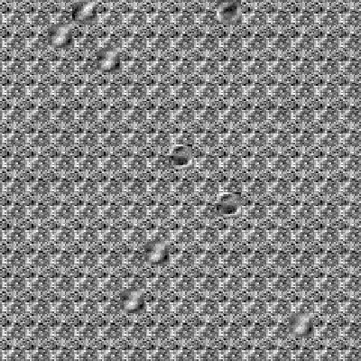
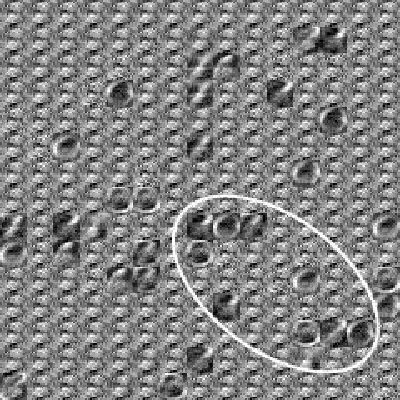
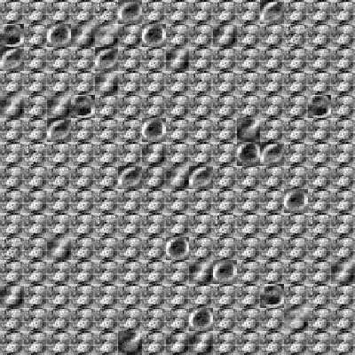
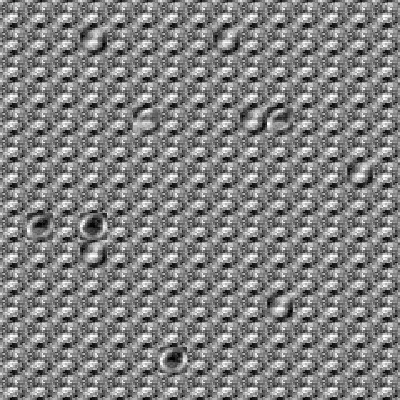 (a) (b) (c)
(d)

Figure 1: Effect of different temperatures by means of DBM-PCD
considering Semeion Handwritten Digit dataset with respect to the
connection weights of the first hidden layer for: (a) $`T=0.1`$, (b)
$`T=0.5`$, (c) $`T=1.0`$, (d) $`T=2.0`$.

Table II displays the MSE results over MNIST dataset, where the best
results were obtained with $`T=0.1`$. Once again, the results confirmed
the hypothesis that better results can be obtained at lower
temperatures, probably due to the lower interaction between visible and
hidden units, which may imply in a slower convergence, but avoiding
local optima (learning in DBMs is essentially an optimization problem,
where we aim at minimizing the energy of each training sample in order
to increase its probability - Equations 13 and 14). Figure 2 displays
the connection weights between the input and the first hidden layer
concerning DBM-PCD, where the highlighted region depicts some important
information learned from the hidden neurons. Notice the neurons do not
seem to contribute a lot with respect to different information learned
from each other at higher temperatures (Figure 2d), since most of them
have similar information encoded.

|         |         |         |         |         |         |         |         |         |
| ------- | ------- | ------- | ------- | ------- | ------- | ------- | ------- | ------- |
|         | 0.1     | 0.2     | 0.5     | 0.8     | 1.0     | 1.2     | 1.5     | 2.0     |
| DBM-CD  | 0.08647 | 0.08768 | 0.08786 | 0.08881 | 0.09111 | 0.09222 | 0.09402 | 0.09629 |
| DBM-PCD | 0.08637 | 0.08759 | 0.08793 | 0.08870 | 0.09106 | 0.09231 | 0.09405 | 0.09618 |
| DBN-CD  | 0.08993 | 0.09432 | 0.09259 | 0.09012 | 0.08933 | 0.08924 | 0.08966 | 0.09110 |
| DBN-PCD | 0.08784 | 0.08811 | 0.08919 | 0.08874 | 0.08833 | 0.08820 | 0.08838 | 0.08994 |

Table 2: Average MSE over the test set considering MNIST dataset.

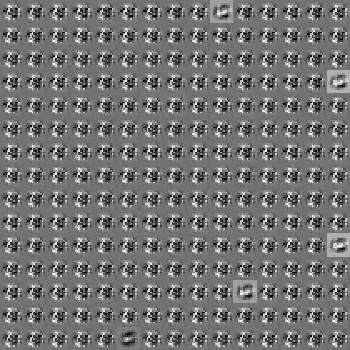
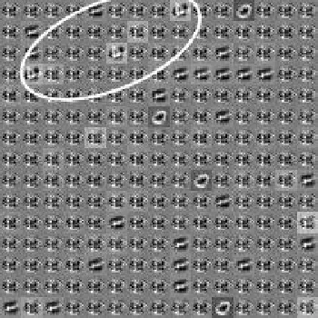
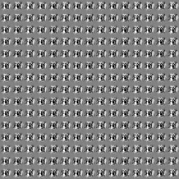
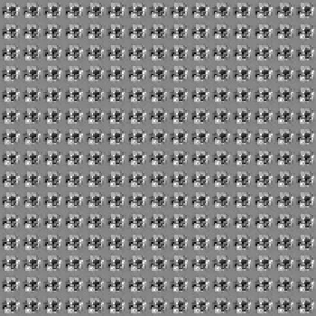 (a) (b) (c)
(d)

Figure 2: Effect of different temperatures by means of DBM-PCD
considering MNIST dataset with respect to the connection weights of the
first hidden layer for: (a) $`T=0.1`$, (b) $`T=0.5`$, (c) $`T=1.0`$, (d)
$`T=2.0`$.

Table III presents the MSE results obtained over Caltech 101 Silhouettes
dataset, where the lower temperatures obtained the best results. In this
case, both DBM and DBN obtained similar results. Since this dataset
comprises a number of different objects and classes, it is more
complicated to figure out some shape with respect to the neurons’
activity in Figure 3. Curiously, the neurons’ response at the lower
temperatures (Figure 3a) led to a different behaviour that has been
observed in the previous datasets, since the more “active” neurons with
respect to different information learned were the ones obtained with
$`T=2`$ at the training step. We believe such behaviour is due to the
number of iterations for learning used in this paper, which might not be
enough for convergence purposes at lower temperatures, since this
dataset poses a greater challenge than the others (it has a great
intra-class variablity).

|         |         |         |         |         |         |         |         |         |
| ------- | ------- | ------- | ------- | ------- | ------- | ------- | ------- | ------- |
|         | 0.1     | 0.2     | 0.5     | 0.8     | 1.0     | 1.2     | 1.5     | 2.0     |
| DBM-CD  | 0.16072 | 0.16119 | 0.16304 | 0.16335 | 0.16335 | 0.16375 | 0.16410 | 0.16390 |
| DBM-PCD | 0.16068 | 0.16125 | 0.16295 | 0.16387 | 0.16359 | 0.16451 | 0.16368 | 0.16389 |
| DBN-CD  | 0.16061 | 0.16107 | 0.16269 | 0.16301 | 0.16320 | 0.16310 | 0.16320 | 0.16282 |
| DBN-PCD | 0.16062 | 0.16085 | 0.16146 | 0.16158 | 0.16158 | 0.16190 | 0.16176 | 0.16267 |

Table 3: Average MSE over the test set considering Caltech 101
Silhouettes dataset.

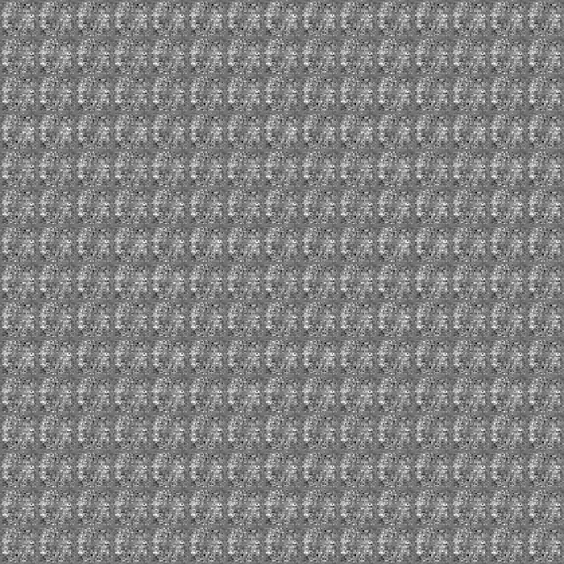
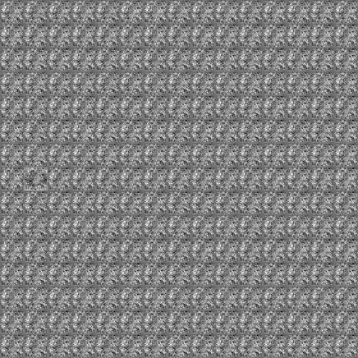
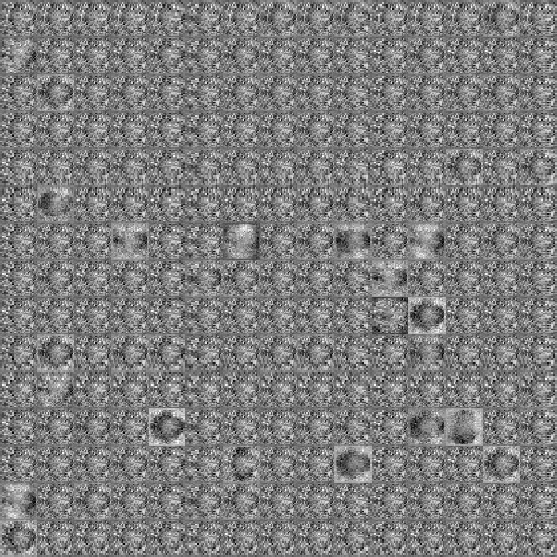
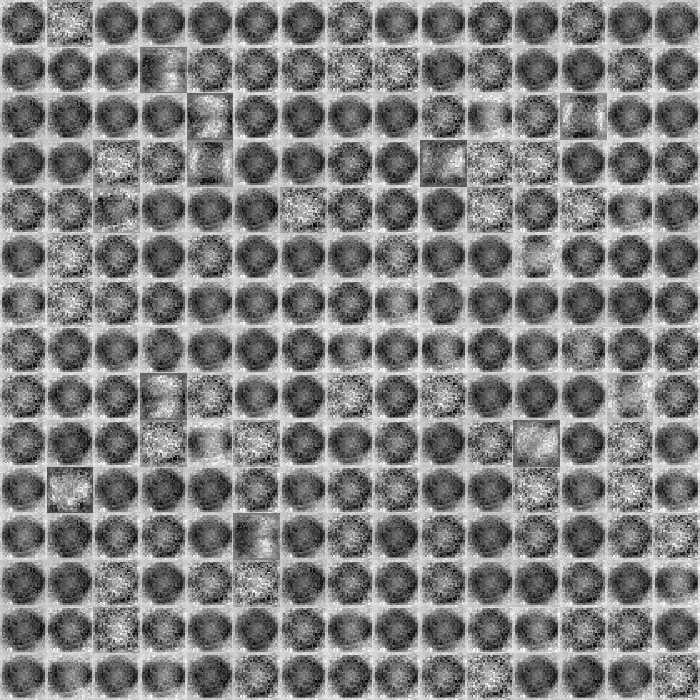 (a) (b) (c)
(d)

Figure 3: Effect of different temperatures by means of DBM-PCD
considering Caltech 101 Silhouettes dataset with respect to the
connection weights of the first hidden layer for: (a) $`T=0.1`$, (b)
$`T=0.5`$, (c) $`T=1.0`$, (d) $`T=2.0`$..

## 5 Conclusions and Future Works

In this work, we dealt with the problem of different temperatures at the
DBM learning step. Inspired by a very recent work that proposed the
Temperature-based Restricted Boltzmann Machines \[14\], we decided to
evaluate the influence of the temperature when learning with Deep
Boltzmann Machines aiming at the task of binary image reconstruction.
Our results confirm the hypothesis raised by Li et al. \[14\], where the
lower the temperature, the more generalized is the network. Thus, more
accurate results can be obtained.

We observed the network pushes the weights down at lower temperatures in
order to favour the sparsity, since the probability of tuning on hidden
units is greater at lower temperatures. In regard to future works, we
aim to propose an adaptive temperature, which can be linearly
increased/decreased along the iterations in order to speed up the
convergence process.

## Acknowledgments

The authors would like to thank FAPESP grant \#2014/16250-9, Capes and
CNPq grant \#306166/2014-3.

## References

- (1) Bekenstein, J.D.: Black holes and entropy. Physical Review D 7(8),
  2333 (1973)
- (2) Beraldo e Silva, L., Lima, M., Sodré, L., Perez, J.: Statistical
  mechanics of self-gravitating systems: Mixing as a criterion for
  indistinguishability. Physical Review D 90(12), 123,004 (2014)
- (3) Duong, C.N., Luu, K., Quach, K.G., Bui, T.D.: 2015 ieee conference
  on beyond principal components: Deep boltzmann machines for face
  modeling. In: Computer Vision and Pattern Recognition, CVPR ’15, pp.
  4786–4794 (2015)
- (4) Gadjiev, B., Progulova, T.: Origin of generalized entropies and
  generalized statistical mechanics for superstatistical multifractal
  systems. In: International Workshop on Bayesian Inference and Maximum
  Entropy Methods in Science and Engineering, vol. 1641, pp.
  595–602 (2015)
- (5) Goh, H., Thome, N., Cord, M., Lim, J.H.: Computer Vision – ECCV
  2012: 12th European Conference on Computer Vision, Florence, Italy,
  October 7-13, 2012, Proceedings, Part V, chap. Unsupervised and
  Supervised Visual Codes with Restricted Boltzmann Machines, pp.
  298–311. Springer Berlin Heidelberg, Berlin, Heidelberg (2012).
  DOI 10.1007/978-3-642-33715-4_22. URL
  http://dx.doi.org/10.1007/978-3-642-33715-4_22
- (6) Gordon, B.L.: Maxwell–boltzmann statistics and the metaphysics of
  modality. Synthese 133(3), 393–417 (2002)
- (7) Hinton, G., Salakhutdinov, R.: Reducing the dimensionality of data
  with neural networks. Science 313(5786), 504 – 507 (2006)
- (8) Hinton, G., Salakhutdinov, R.: Discovering binary codes for
  documents by learning deep generative models. Topics in Cognitive
  Science 3(1), 74–91 (2011)
- (9) Hinton, G.E.: Training products of experts by minimizing
  contrastive divergence. Neural Computation 14(8), 1771–1800 (2002)
- (10) Hinton, G.E.: Neural networks: Tricks of the trade: Second
  edition. chap. A Practical Guide to Training Restricted Boltzmann
  Machines, pp. 599–619. Springer Berlin Heidelberg, Berlin, Heidelberg
  (2012). DOI 10.1007/978-3-642-35289-8_32
- (11) Hinton, G.E., Osindero, S., Teh, Y.W.: A fast learning algorithm
  for deep belief nets. Neural Computation 18(7), 1527–1554 (2006)
- (12) Larochelle, H., Mandel, M., Pascanu, R., Bengio, Y.: Learning
  algorithms for the classification restricted boltzmann machine. The
  Journal of Machine Learning Research 13(1), 643–669 (2012)
- (13) LeCun, Y., Bengio, Y., Hinton, G.E.: Deep learning. Nature 521,
  436–444 (2015)
- (14) Li, G., Deng, L., Xu, Y., Wen, C., Wang, W., Pei, J., Shi, L.:
  Temperature based restricted boltzmann machines. Scientific reports 6,
  19,133 (2016)
- (15) Mendes, G., Ribeiro, M., Mendes, R., Lenzi, E., Nobre, F.:
  Nonlinear kramers equation associated with nonextensive statistical
  mechanics. Physical Review E 91(5), 052,106 (2015)
- (16) Niven, R.K.: Exact maxwell–boltzmann, bose–einstein and
  fermi–dirac statistics. Physics Letters A 342(4), 286–293 (2005)
- (17) Papa, J.P., Rosa, G.H., Costa, K.A.P., Marana, A.N., Scheirer,
  W., Cox, D.D.: On the model selection of bernoulli restricted
  boltzmann machines through harmony search. In: Proceedings of the
  Genetic and Evolutionary Computation Conference, GECCO ’15, pp.
  1449–1450. ACM, New York, USA (2015)
- (18) Papa, J.P., Rosa, G.H., Marana, A.N., Scheirer, W., Cox, D.D.:
  Model selection for discriminative restricted boltzmann machines
  through meta-heuristic techniques. Journal of Computational Science 9,
  14–18 (2015)
- (19) Papa, J.P., Scheirer, W., Cox, D.D.: Fine-tuning deep belief
  networks using harmony search. Applied Soft Computing (2015).
  DOI http://dx.doi.org/10.1016/j.asoc.2015.08.043. (accepted for
  publication)
- (20) Ranzato, M., Boureau, Y., Cun, Y.: Sparse feature learning for
  deep belief networks. In: J. Platt, D. Koller, Y. Singer, S. Roweis
  (eds.) Advances in Neural Information Processing Systems 20, pp.
  1185–1192. Curran Associates, Inc. (2008)
- (21) RRNYI, A.: On measures of entropy and information (1961)
- (22) Salakhutdinov, R., Hinton, G.E.: An efficient learning procedure
  for deep boltzmann machines. Neural Computation 24(8),
  1967–2006 (2012)
- (23) Schmidhuber, J.: Deep learning in neural networks: An overview.
  Neural Networks 61, 85–117 (2015)
- (24) Shim, J.W., Gatignol, R.: Robust thermal boundary conditions
  applicable to a wall along which temperature varies in lattice-gas
  cellular automata. Physical Review E 81(4), 046,703 (2010)
- (25) Smolensky, P.: Information processing in dynamical systems:
  Foundations of harmony theory. Tech. rep., DTIC Document (1986)
- (26) Sohn, K., Lee, H., Yan, X.: Learning structured output
  representation using deep conditional generative models. In:
  C. Cortes, N.D. Lawrence, D.D. Lee, M. Sugiyama, R. Garnett (eds.)
  Advances in Neural Information Processing Systems 28, pp. 3465–3473.
  Curran Associates, Inc. (2015)
- (27) Srivastava, N., Hinton, G.E., Krizhevsky, A., Sutskever, I.,
  Salakhutdinov, R.: Dropout: A simple way to prevent neural networks
  from overfitting. The Journal of Machine Learning Research 15(1),
  1929–1958 (2014)
- (28) Tieleman, T.: Training restricted boltzmann machines using
  approximations to the likelihood gradient. In: Proceedings of the 25th
  International Conference on Machine Learning, ICML ’08, pp. 1064–1071.
  ACM, New York, NY, USA (2008)
- (29) Tomczak, J.M., Gonczarek, A.: Learning invariant features using
  subspace restricted boltzmann machine. Neural Processing Letters pp.
  1–10 (2016)
- (30) Wilcoxon, F.: Individual Comparisons by Ranking Methods.
  Biometrics Bulletin 1(6), 80–83 (1945). DOI 10.2307/3001968. URL
  http://dx.doi.org/10.2307/3001968
