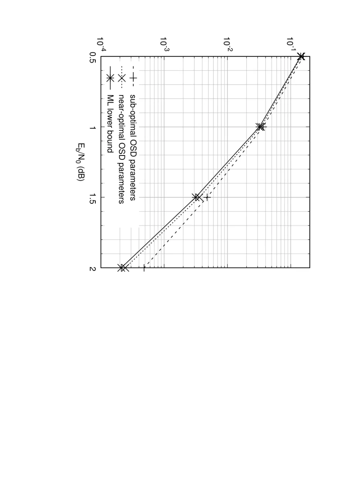
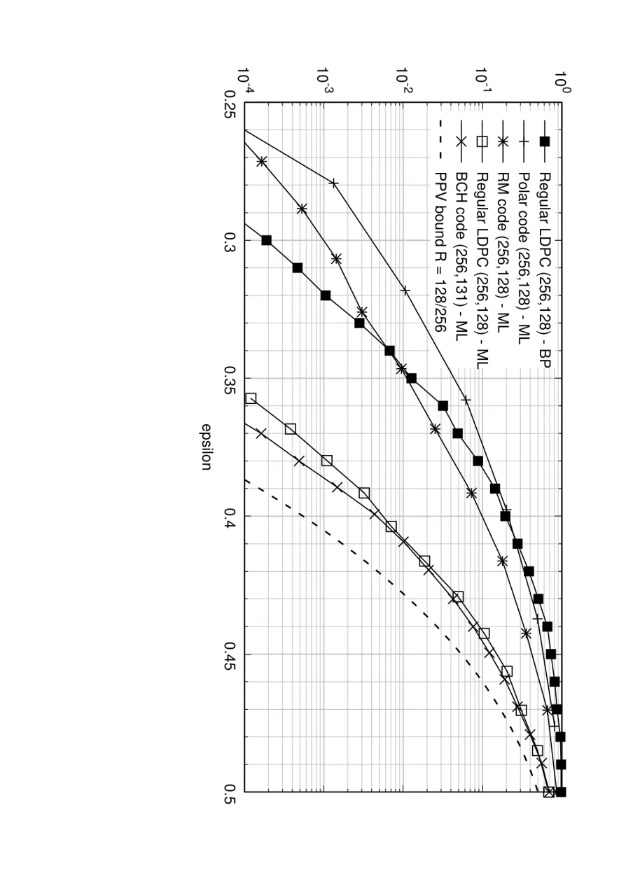
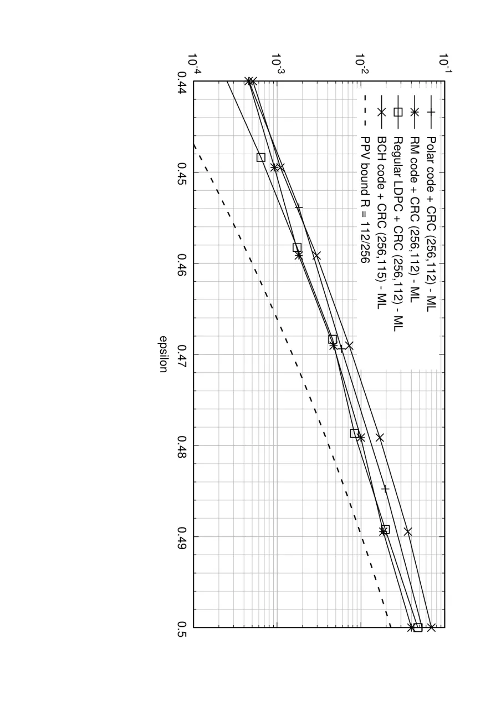
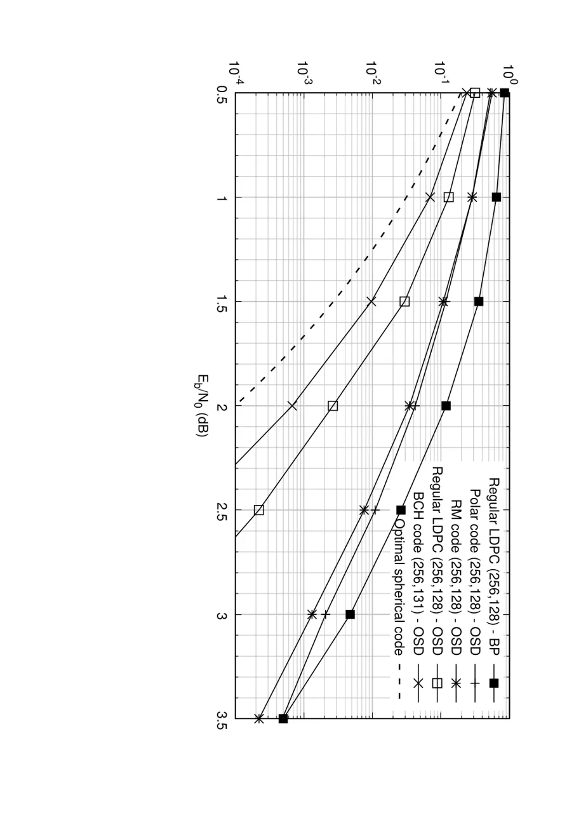
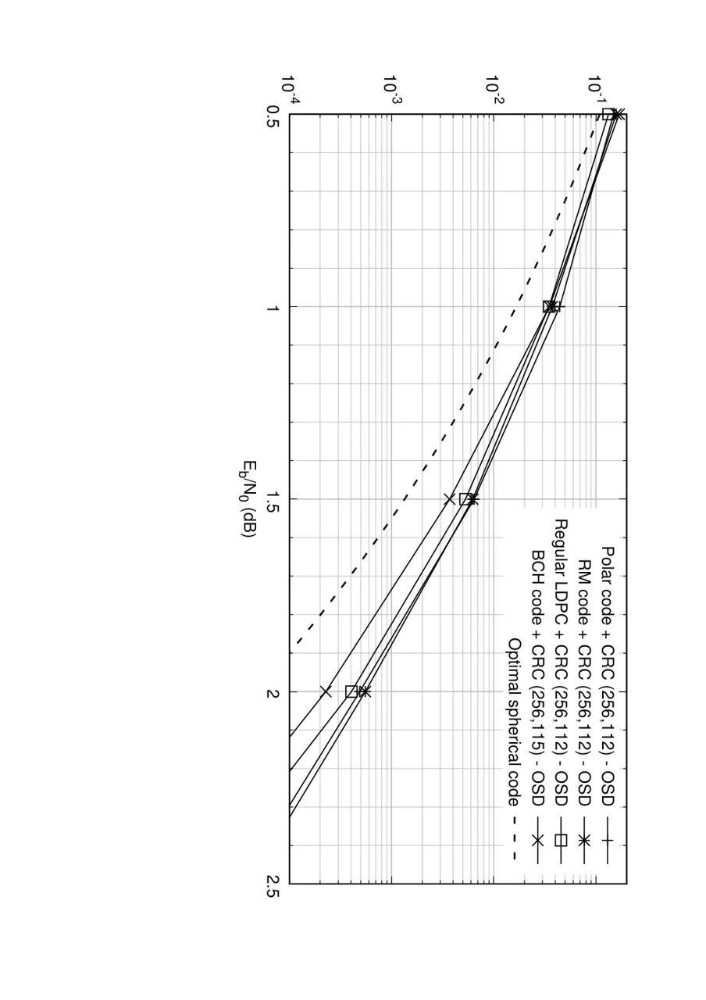

# Performance Comparison of Short-Length Error-Correcting Codes

PubID: pubid: This paper was submitted to the IEEE SCVT conference 2016

J. Van Wonterghem^(∗), A. Alloum$`\dagger`$, J.J. Boutros$`\ddagger`$,
and M. Moeneclaey^(∗) Affiliation: ¹Ghent University, 9000 Ghent,
Belgium, johannes.vanwonterghem@ugent.be Affiliation: Affiliation:
²Nokia Bell Labs, 91620 Nozay, France, amira.alloum@nokia-bell-labs.com
Affiliation: Affiliation: ³Texas A&M University, 23874 Doha, Qatar,
boutros@tamu.edu

###### Abstract

We compare the performance of short-length linear binary codes on the
binary erasure channel and the binary-input Gaussian channel. We use a
universal decoder that can decode any linear binary block code:
Gaussian-elimination based Maximum-Likelihood decoder on the erasure
channel and probabilistic Ordered Statistics Decoder on the Gaussian
channel. As such we compare codes and not decoders. The word error rate
versus the channel parameter is found for LDPC, Reed-Muller, Polar, and
BCH codes at length 256 bits. BCH codes outperform other codes in
absence of cyclic redundancy check. Under joint decoding, the
concatenation of a cyclic redundancy check makes all codes perform very
close to optimal lower bounds.

## I Introduction

One of the main goals of Information Theory founded by C.E. Shannon in
1948 is to make digital communications over a noisy channel.
Applications are found in nowadays technology in fourth and fifth
generations of mobile networks, in digital video broadcast, in optical
communications at the Internet backbone, etc. Information Theory \[1\]
predicts the existence of good error-correcting codes that are capable
of achieving channel capacity. These optimal codes can transmit at the
highest possible information rate given the noise level in the channel.
In the past half century, mathematicians and engineers built many
families of error-correcting codes \[2\],\[3\], to make true (or almost
true) the performance predicted by Information Theory. The latter is a
theory for asymptotically long codes. At asymptotic length, the code
analysis is easier \[4\] (think about the law of large numbers). Also,
in some specific applications such as fiber optic communications and
data storage, huge packets of data are used allowing the application of
capacity achieving codes. In recent fifth generation systems which are
currently under construction, engineers are interested in short length
packets. In parallel, at the theoretical side, researchers are studying
the finite length regime of codes (e.g. \[6\]). Our paper is dedicated
to error-correcting codes of short length, typically 256 bits. Phenomena
observed at asymptotic length (100 thousand bits and above) like channel
polarization \[7\] and threshold saturation \[8\] do not have a
practical effect at these short lengths.

In this work, we compare the performance of short-length linear binary
codes under equal-complexity identical decoding conditions based on a
universal decoder. Complexity is not the main issue of this paper. We
aim at comparing codes with respect to their performance by means of the
best possible decoder which yields Maximum Likelihood (ML) or near
Maximum Likelihood error rates. Two channels are considered for this
performance comparison: the binary erasure channel (BEC) and the binary
input additive white Gaussian noise (BI-AWGN) channel. The former
channel corrupts the transmitted codeword by erasing some of its bits,
the latter adds white Gaussian noise to the observed values
corresponding to the codeword bits. To recover the original information
transmitted over the channel, the receiver has to decode the corrupted
observation. Over the years, many decoding strategies have been
developed, often specific to one family of error-correcting codes
\[3\],\[4\],\[9\]. For our comparison, we use a universal decoder that
can decode any linear binary block code: Gaussian-elimination based ML
decoder on the BEC and probabilistic Ordered Statistics Decoder (OSD) on
the BI-AWGN channel. Moreover, the decoders under consideration are also
optimal$`/`$near-optimal whereas many decoding strategies are
sub-optimal, favoring decoding speed over performance. As a result we
compare codes and not decoders.

The paper is structured as follows. Notation and ML decoding on the
erasure channel are described in the next section. Section III briefly
explains OSD decoding and its improvements. The list of linear binary
block codes considered in this paper is found in Section IV. Section V
includes performance results in terms of word error rate. Our
conclusions on the performance of short-length codes are drawn in the
final section.

## II Notation and ML decoding on the BEC

The first scenario we consider is that of ML decoding on the BEC
channel. At the transmitter, a length-$`k`$ binary information message
$`\boldsymbol{b}=\left(b_{1},...,b_{k}\right)`$, consisting of
independent and identically distributed (i.i.d.) bits with
$`P(b_{i}=0)=P(b_{i}=1)=1/2`$, is encoded into a binary coded message
$`\boldsymbol{c}=(c_{1},...,c_{n})`$ of length $`n`$ using a linear
binary block code $`C`$. The code $`C`$ is completely specified by its
$`k\times n`$ generator matrix $`G`$ \[2\]. In systematic form we have
$`G=[I_{k}|P]`$, where $`I_{k}`$ is the $`k\times k`$ identity and $`P`$
is a parity matrix defining the code. The encoding operation can be
written as
$`\boldsymbol{c}=\boldsymbol{b}G=[\boldsymbol{b}\penalty\ |\penalty\ \boldsymbol{p}]`$
with $`\boldsymbol{p}`$ the parity bits corresponding to
$`\boldsymbol{b}`$. This codeword is transmitted over the BEC channel
with erasure probability $`\epsilon`$ such that at the receiver we get
the sequence $`\boldsymbol{y}`$ with $`P(y_{i}=?)=\epsilon`$ and
$`P(y_{i}=c_{i})=1-\epsilon`$, for $`i=1\ldots n`$, i.e. the symbol
transmitted over the channel is erased with probability $`\epsilon`$. At
the receiver, ML decision is performed to construct an estimate
$`\hat{\boldsymbol{b}}=\argmax P(\boldsymbol{y}|\boldsymbol{b})`$ of the
originally transmitted $`\boldsymbol{b}`$, based on the observation
$`\boldsymbol{y}`$.

Maximum Likelihood decoding of a linear binary code on the erasure
channel is equivalent to filling bits, as much as possible, among those
erased by the channel. The verb fill is equivalent to solve in this
context. Let $`H`$ be the $`(n-k)\times n`$ parity-check matrix of
$`C`$. The parity-check constraint $`H\boldsymbol{c}^{t}=0`$ is true for
every codeword $`\boldsymbol{c}`$ in $`C`$ \[2\]. The linear system
$`H\boldsymbol{c}^{t}=0`$ is used to fill erasures via Gaussian
elimination. Let $`w`$ be the erasure weight, i.e. $`w`$ is the number
of erased bits in the transmitted codeword $`\boldsymbol{c}`$. Assume
that $`C`$ has parameters $`(n,k,d_{H})`$, where $`d_{H}`$ is its
minimum Hamming distance. For $`w\leq d_{H}-1`$, all $`w`$ erasures in
any $`w`$ positions can be filled by an algebraic decoder or a ML
decoder \[3\]. For non-trivial binary codes, for
$`d_{H}\leq w\leq n-k`$, $`n-k`$ being the rank of $`H`$, algebraic
decoding fails because it is bounded by $`d_{H}`$ whereas ML decoding
based on solving $`H\boldsymbol{c}^{t}=0`$ may fill a fraction of the
erased bits or all of them.

ML decoding via Gaussian elimination has an affordable complexity, at
least in software applications, for a code length $`n`$ as high as a
thousand bits. The cost of solving $`H\boldsymbol{c}^{t}=0`$ is
$`O(n\times(n-k)^{2})`$. Results shown in Section V are obtained for a
short length $`n=256`$.

## III OSD decoding on the BI-AWGN

The transmitter for the BI-AWGN channel is the same as for the BEC
channel, notation is inherited from the previous section. Before
transmission on the BI-AWGN channel, the coded message is mapped to a
BPSK symbol sequence $`\boldsymbol{s}\in\{-1,+1\}^{n}`$ using the rule
$`s_{i}=2c_{i}-1`$. This symbol sequence is transmitted over the AWGN
channel characterized by its single sided noise spectral density
$`N_{0}`$. At the output of the channel, we receive
$`\boldsymbol{r}=\boldsymbol{s}+\boldsymbol{w}`$ where
$`\boldsymbol{w}=(w_{1},...,w_{n})`$ is a set of i.i.d. real Gaussian
random variables with zero mean and variance $`\sigma^{2}=N_{0}/2`$.
Note that the symbols $`s_{i}`$ are normalized to unit energy such that
the energy transmitted per information bit equals $`E_{b}=\frac{n}{k}`$.

At the receiver soft-decision decoding is performed to construct an
estimate $`\hat{\boldsymbol{b}}`$ of the originally transmitted
information message $`\boldsymbol{b}`$. For this estimate, the decoder
makes use of two vectors corresponding to the sign and magnitude of the
received signal $`\boldsymbol{r}`$:  
The hard-decision
$`\boldsymbol{y}=[\boldsymbol{b}_{\text{HD}}|\boldsymbol{p}_{\text{HD}}]`$
where

```math
y_{i}=\begin{cases}0&\text{for }r_{i}<0\\
1&\text{for }r_{i}\geq 0\end{cases}
```

and the confidence values

```math
\alpha_{i}=\left|r_{i}\right|,\penalty\ \penalty\ \penalty\ i=1\ldots n.
```

To understand that $`\alpha_{i}`$ is indeed a measure for the confidence
of the received $`r_{i}`$, it suffices to see that the log-likelihood
ratio is
$`\text{$\Lambda$}_{i}=\log\frac{P(c_{i}=0|r_{i})}{P(c_{i}=1|r_{i})}=\frac{2r_{i}}{\sigma^{2}}`$
for the considered system.

A hard-decision decoder only uses the vector $`\boldsymbol{y}`$ to
produce its estimate $`\hat{\boldsymbol{b}}`$. The omission of the
information contained in the magnitude of $`\boldsymbol{r}`$ explains
why hard-decision decoders perform worse than soft-decision decoders
(page 15 in \[9\]).

### III-A Soft-decision decoding using the OSD algorithm

Soft-decision decoding by the receiver is performed using the OSD
algorithm, an efficient most reliable basis (MRB) decoding algorithm
firstly proposed by Dorsch \[10\], further developed by Fang and Battail
\[11\], and later analyzed and revived by Fossorier and Lin \[12\]. In
the first step of the algorithm, the received vector $`\boldsymbol{r}`$
is sorted in order of descending confidence and the corresponding
permutation $`\pi_{1}`$ is applied to the generator matrix $`G`$,
yielding $`G^{\prime}`$. Gaussian elimination is now performed on
$`G^{\prime}`$ to construct the systematic $`\tilde{G}`$, note that an
additional permutation $`\pi_{2}`$ may be necessary. We write
$`\tilde{\boldsymbol{y}}=\pi_{2}\left(\pi_{1}\left(\boldsymbol{y}\right)\right)=\left[\tilde{\boldsymbol{b}}_{\text{HD}}\penalty\ |\penalty\ \tilde{\boldsymbol{p}}_{\text{HD}}\right]`$
and
$`\tilde{\boldsymbol{\alpha}}=\pi_{2}\left(\pi_{1}\left(\boldsymbol{\alpha}\right)\right)`$,
note that $`\tilde{\boldsymbol{b}}_{\text{HD}}`$ corresponds to the
most-reliable independent positions of the received vector
$`\boldsymbol{r}`$.

During the OSD algorithm, test-error patterns (TEPs)
$`\boldsymbol{e}_{i}`$ of increasing weight are generated. They are
added to the hard-decision information bits
$`\tilde{\boldsymbol{b}}_{\text{HD}}`$ on the MRB and the corresponding
codeword $`\tilde{\boldsymbol{c}}_{i}`$ is obtained by re-encoding via
the systematic generator matrix $`\tilde{G}`$. The trivial TEP
$`\boldsymbol{e}_{0}=\boldsymbol{0}`$ results in the order-0 OSD
codeword
$`\tilde{\boldsymbol{c}}_{0}=(\tilde{\boldsymbol{b}}_{\text{HD}}+\boldsymbol{e}_{0})\cdot\tilde{G}=\tilde{\boldsymbol{b}}_{\text{HD}}\cdot\tilde{G}`$.
The TEP $`\boldsymbol{e}_{j}`$ results in codeword
$`\tilde{\boldsymbol{c}}_{j}=\tilde{\boldsymbol{c}}_{0}+\boldsymbol{e}_{j}\cdot\tilde{G}`$.
Undoing the permutations yields the estimate
$`\hat{\boldsymbol{c}}_{j}=\pi_{1}^{-1}\left(\pi_{2}^{-1}\left(\tilde{\boldsymbol{c}}_{j}\right)\right)`$
of the original codeword $`\boldsymbol{c}`$.

After every re-encoding operation, the Euclidean distance between the
OSD codeword $`\hat{\boldsymbol{c}}_{j}`$ and the received vector
$`\boldsymbol{r}`$ is calculated. If this distance is lower than that of
the current best OSD codeword, we select $`\hat{\boldsymbol{c}}_{j}`$ as
the new best codeword estimate. Note that for BPSK modulation,
minimizing the Euclidean distance is equivalent to minimizing the
weighted Hamming distance

```math
\text{WHD}_{j}=\sum\limits_{\begin{subarray}{c}1\leq i\leq n\\
\hat{c}_{j,i}\neq y_{i}\end{subarray}}\alpha_{i}.
```

The OSD algorithm is terminated after a predetermined number of
re-encodings. For example, in OSD order 2, the following patterns are
generated:

```math
\displaystyle 000...000 \displaystyle 000...001 \displaystyle 000...011
```

```math
\displaystyle 000...010 \displaystyle 000...101
```

```math
\displaystyle 000...100 \displaystyle 000...110
```

```math
\displaystyle 100...000 \displaystyle 110...000
```

It follows that in OSD order 1, $`1+k`$ patterns are generated, in OSD
order 2 we generate $`1+k+\frac{1}{2}k(k-1)`$ patterns, etc. Hence the
complexity of the algorithm is $`O(k^{\text{OSD order}})`$. In \[12\] it
was shown that order-$`l`$ reprocessing is asymptotically optimal (close
to ML) for

```math
l\geq\min\left\{\left\lceil d_{H}/4-1\right\rceil,k\right\},
```

such that the complexity is determined by both $`k`$ and $`d_{H}`$.
Choosing the OSD order lower than the optimal allows a
performance-complexity trade-off. In this paper, in Section V, we
compare codes at the best possible OSD decoding performance.

### III-B Improvements

In the literature, several improvements to the original OSD algorithm
have been presented that aim to reduce the complexity of the optimal
decoder and offer a finer performance-complexity trade-off \[13, 14, 15,
16, 17, 18, 19\]. In our implementation of the algorithm we used the
probabilistic necessary condition from \[17\], the probabilistic
sufficient condition \[15\], the reference re-encoding scheme \[17\],
the preprocessing rules from \[16\], and the multiple biases diversity
scheme from \[18\].

After having implemented these improvements, we can no longer use the
rule $`l\geq\min\left\{\left\lceil d_{H}/4-1\right\rceil,k\right\}`$ to
determine the optimal OSD order. Furthermore, the parameters of the
improvements also have to be set. To determine if the decoder performs
(near-)optimally, we make use of an ML lower bound calculated during
computer simulation. Whenever the decoder outputs an erroneous estimate
of the originally transmitted information word, the Euclidean distance
between the original codeword $`\boldsymbol{c}`$ and the received vector
$`\boldsymbol{s}`$ is evaluated. If this distance is larger than the
distance between the decoder output $`\hat{\boldsymbol{c}}`$ and
$`\boldsymbol{s}`$, then the ML decoder would also have made an
erroneous decision.

Figure 1 shows the simulated performance of the (256,115) extended BCH
code for two different choices of OSD parameters. The ML lower bound
derived from the simulation with near-optimal parameters is also shown.
We conclude that the second set of parameters leads to near-optimal
results for this particular code at these signal-to-noise (SNR) values.
The sub-optimal parameters, not considered in Section V, are however
suitable for some practical applications because they lead to a decoding
with a noticeably lower complexity at the expense of only a small loss
of performance.



Figure 1: Word error rate versus signal-to-noise ratio for a (256,115)
binary BCH code. ML lower bound and word error rates for two sets of OSD
parameters are shown.

## IV List of Codes suited to Short-Length Error-Correction

We apologize for not considering convolutional codes and turbo codes
(parallel concatenated conv. codes) \[20\], \[21\]. Results on turbo
codes will be included in a future work.

Given the recent research activity in the Coding community \[22, 24, 25,
26, 27\], we had to consider Polar codes and Reed-Muller codes. Also,
BCH codes are known to be good codes at short length \[2\], \[3\].
Finally, LDPC codes from modern coding theory \[4\] are included. The
list of binary codes regarded for performance comparison in the next
section is:

- •
  Reed-Muller codes: The code length is $`n=2^{\ell}`$. Take Arikan’s
  kernel $`G_{2}`$ \[22\] and build its Kronecker product $`\ell`$
  times, i.e. build $`G_{2}^{\otimes\ell}`$. Then, select the $`k`$ rows
  of largest Hamming weight to get the $`k\times n`$ generator matrix.
- •
  Polar codes: As for Reed-Muller codes, $`k`$ rows are selected from
  $`G_{2}^{\otimes\ell}`$. These rows correspond to highest mutual
  information channels after $`\ell`$ splittings. The generator matrix
  of the Polar code is found by exact splitting and adapted to each
  value of the channel parameter. For the BI-AWGN channel, we used
  density evolution \[4\] to split the channel and construct the code
  \[23\].
- •
  BCH codes: Standard binary primitive $`(n,k,t)`$ BCH codes are built
  from their generator polynomial \[2\], \[3\]. An extension by one
  parity bit is made to get an even length.
- •
  LDPC codes: Regular (3,6) low-density parity-check codes are built
  from a random bipartite Tanner graph \[4\]. Length-2 cycles are
  avoided, the number of length-4 cycles is reduced, but no other
  constraint was applied to the graph construction.

The use of a cyclic redundancy check (CRC) code to improve list decoding
of polar codes was introduced by I. Tal and A. Vardy \[24\]. Here, given
the universal nature of Gaussian elimination for ML decoding on the BEC
and the universal nature of OSD decoding on the BI-AWGN channel, the CRC
code was jointly decoded with all of the codes listed above to
investigate its influence on the performance. By jointly we mean that a
unique generator matrix is used for decoding. This joint matrix is
simply the product of the CRC matrix with the generator matrix of the
original code $`C`$. Let $`G`$ be the $`k\times n`$ generator matrix of
$`C`$. Let $`G_{CRC}`$ be the $`(k-m)\times k`$ generator matrix of the
CRC code, where $`m`$ is the degree of the CRC polynomial. Then, joint
OSD decoding is based on the following generator matrix:

```math
G_{CRC}\times G.
```

The serial concatenation has the CRC as outer code and the original
error-correcting code $`C`$ as inner code. It is clear that the CRC will
scramble the original matrix $`G`$ making any code $`C`$ look like a
random code. We considered $`m=16`$ redundancy bits and the CRC-CCITT
code with generator polynomial

```math
g(x)=x^{16}+x^{12}+x^{5}+1.
```

## V Performance Results

We ran computer simulations to obtain the performance of binary codes
listed in the previous section. Randomly generated data is transmitted
using the systems described in sections II and III. At every considered
value of $`\epsilon`$ for the BEC and $`E_{b}/N_{0}`$ for the BI-AWGN
channel, codewords were generated, transmitted, and decoded until 100
word errors occurred. During the computer simulation on the BI-AWGN
channel, the ML lower bound was also recorded but we omit it from the
figures to keep the graphs as clear as possible. The OSD parameters were
chosen such that the performance is near-ML and the ML lower bound
(almost) coincides with the actual simulated performance of the code.

Lower bounds on the optimal performance of finite-length codes exist for
both the BEC and BI-AWGN channel. On the figures we include for the BEC
the Polyanskiy-Poor-Verdú (PPV) bound on the maximal achievable rate,
from Theorem 53 in \[6\],

```math
P_{ew}\approx Q\left(\frac{1-\epsilon-R}{\sqrt{\epsilon(1-\epsilon)}}\sqrt{n}\right),
```

where $`P_{ew}`$ is the word error probability at coding rate $`R`$,
length $`n`$, and BEC parameter $`\epsilon`$. $`Q(.)`$ is the
Gaussian-tail function. Computer simulations below take $`n=256`$ and
$`R=1/2`$ or close to $`1/2`$. On the BI-AWGN channel, we include the
word error probability of optimal spherical codes, by C.E. Shannon
\[5\],

```math
\displaystyle P_{ew}\approx \displaystyle\frac{1}{\sqrt{n\pi}}\frac{1}{\sqrt{1+G^{2}}\sin\theta_{0}}
```

```math
\displaystyle\times\frac{\Big[G\sin\theta_{0}\exp\Big(-\frac{RE_{b}}{N_{0}}+\frac{1}{2}\sqrt{\frac{2RE_{b}}{N_{0}}}G\cos\theta_{0}\Big)\Big]^{n}}{\sqrt{\frac{2RE_{b}}{N_{0}}}G\sin^{2}\theta_{0}-\cos\theta_{0}},
```

where
$`G=\frac{1}{2}\Big[\sqrt{\frac{2RE_{b}}{N_{0}}}\cos\theta_{0}+\sqrt{\frac{2RE_{b}}{N_{0}}\cos^{2}\theta_{0}+4}\Big]`$.
The cone half-angle $`\theta_{0}`$ is computed by solving

```math
2^{nR}\approx\frac{\sqrt{2\pi n}\sin\theta_{0}\cos\theta_{0}}{\sin^{n}\theta_{0}}.
```

The two above approximations from \[5\] are extremely accurate for
lengths $`n\geq 100`$.

Figure 2 shows the word error rate versus the channel erasure
probability for LDPC, Polar, RM, and BCH codes, all under ML decoding on
the BEC. The performance of the LDPC code under iterative
belief-propagation (BP) decoding is also included. No CRC is used for
this performance comparison. The binary (256,131) BCH code is
outperforming all other codes. Notice that the regular-(3,6) binary LDPC
code has an excellent behavior.

Figure 3 shows the same codes on the BEC concatenated with the 16-bit
CRC code given in Section IV. The horizontal scale in Figure 3 is from
0.44 to 0.5 only! All codes exhibit a performance within a small range
of error rate. As mentioned in Section IV, the CRC scrambles the
original generator matrix and the universal decoder (Gaussian
elimination or OSD) does a joint decoding of both codes.

It is worth mentioning that the BCH code has dimension
$`k\penalty\ =\penalty\ 115`$, hence its coding rate is higher than
other codes and its PPV bound moves up with respect to the PPV bound at
rate $`1/2`$. This explains why the BCH code appears to be weaker, in
fact it is closer to its PPV bound than the other codes.

The word error rate on the binary-input Gaussian channel is plotted on
Figures 4 and 5, without and with CRC respectively. Figure 4 also
includes the LDPC code under iterative belief-propagation (BP) decoding.
With or without CRC, the (256,128) BCH code has the best performance
versus the signal-to-noise ratio. As on the BEC, the CRC makes all codes
behave almost like random codes, so the SNR gap between the worst and
the best codes is very small.



Figure 2: Word error rate versus channel erasure probability.
Performance comparison of codes at length 256 and rate $`1/2`$. No CRC.
The RM code is weak at length $`n=256`$, however it behaves very close
to LDPC and BCH at $`n=128`$.



Figure 3: Word error rate versus channel erasure probability.
Performance comparison of codes with length 256 and rate $`1/2`$. A
16-bit CRC is concatenated with all codes. The horizontal scale is
stretched to let us distinguish the small difference between codes.



Figure 4: Word error rate versus signal-to-noise ratio. Performance
comparison of codes with length 256 and rate $`1/2`$. No CRC.



Figure 5: Word error rate versus signal-to-noise ratio. Performance
comparison of codes with length 256 and rate $`1/2`$. A 16-bit CRC is
concatenated with all codes. Codes with CRC cannot improve further due
to the optimal spherical code bound (gap of 0.1-0.3 dB).

## VI Conclusions

We have compared the performance of four different short-length linear
binary codes on the binary erasure channel (BEC) and the binary-input
Gaussian (BI-AWGN) channel. The word error rate versus the channel
parameter was plotted for LDPC, Reed-Muller, Polar, and BCH codes. In
both channel scenarios, a universal, optimal$`/`$near-optimal decoder
was used: the ML decoder for the BEC (via Gaussian elimination) and the
OSD soft-decision decoder for the AWGN channel. From the computer
simulation results, we conclude that the BCH code outperforms
Reed-Muller, Polar, and LDPC codes on both channels. This behavior
changes when we concatenate codes with a 16-bit CRC and perform joint
decoding. As a result, the performance curves of the different codes lie
much closer together and the choice of a good error-correcting code is
not so critical.

## Acknowledgment

Johannes Van Wonterghem would like to thank the Research Foundation in
Flanders (FWO) for funding his PhD fellowship. The work of Joseph J.
Boutros was supported by the Qatar National Research Fund (QNRF), a
member of Qatar Foundation, under NPRP project 6-784-2-329.  
The authors are grateful to Yury Polyanskiy for his precious and
constructive comments on this work.

## References

- \[1\] T.M. Cover and J.A. Thomas, Elements of Information Theory,
  Wiley-Interscience, 2006.
- \[2\] F.J. MacWilliams and N.J.A. Sloane, The theory of
  error-correcting codes, North-Holland, 1977.
- \[3\] R.E. Blahut, Algebraic codes for data transmission, Cambridge
  University Press, 2003.
- \[4\] T.J. Richardson and R.L. Urbanke, Modern coding theory,
  Cambridge University Press, 2008.
- \[5\] C.E. Shannon,”Probability of error for optimal codes in a
  Gaussian channel,” Bell System Technical Journal, vol. 38, no. 3, pp.
  611-656, May 1959.
- \[6\] Y. Polyanskiy, H.V. Poor, and S. Verdú, “Channel coding rate in
  the finite blocklength regime,” IEEE Trans. Inf. Theory, vol. 56, no.
  5, pp. 2307-2359, May 2010.
- \[7\] E. Arıkan, “Channel polarization: A method for constructing
  capacity achieving codes for symmetric binary-input memoryless
  channels,” IEEE Trans. Inf. Theory, vol. 55, no. 7, pp. 3051-3073,
  July 2009.
- \[8\] S. Kudekar, T. Richardson, and R.L. Urbanke, “Spatially coupled
  ensembles universally achieve capacity under belief propagation,” IEEE
  Trans. Inf. Theory, vol. 59, no. 12, pp. 7761-7813, Dec. 2013.
- \[9\] W.E. Ryan and S. Lin, Channel Codes, Classical and Modern,
  Cambridge University Press, 2009.
- \[10\] B. Dorsch, “A decoding algorithm for binary block codes and
  J-ary output channels,” IEEE Trans. Inf. Theory, vol. 20, pp. 391-394,
  May 1974.
- \[11\] J. Fang, “Décodage pondéré optimal des codes linéaires en
  blocs et quelques sujets sur la complexité du décodage”, PhD Thesis,
  ENST, March 1987
- \[12\] M. P. C. Fossorier and S. Lin, “Soft-decision decoding of
  linear block codes based on ordered statistics,” IEEE Trans. Inf.
  Theory, vol. 41, no. 5, pp. 1379-1396, Sep. 1995.
- \[13\] M. Fossorier, “Reliability-based soft-decision decoding with
  iterative information set reduction,” IEEE Trans. Inf. Theory, vol.
  48, pp. 3101-3106, Dec. 2002.
- \[14\] A. Valembois and M. P. C. Fossorier, “Box and match techniques
  applied to soft-decision decoding,” IEEE Trans. Inf. Theory, vol. 50,
  no. 5, pp. 796-810, Dec. 2004.
- \[15\] W. Jin and M. P. C. Fossorier, “Probabilistic Sufficient
  Conditions on Optimality for Reliability Based Decoding of Linear
  Block Codes,” IEEE International Symposium on Information Theory,
  Seattle, WA, pp. 2235-2239, 2006.
- \[16\] Y. Wu and C.N. Hadjicostis, “Soft-Decision Decoding of Linear
  Block Codes Using Preprocessing and Diversification,” IEEE Trans. Inf.
  Theory, vol. 53, no. 1, pp. 378-393, Jan. 2007.
- \[17\] Y. Wu and C.N. Hadjicostis, “Soft-Decision Decoding Using
  Ordered Recodings on the Most Reliable Basis,” IEEE Trans. Inf.
  Theory, vol. 53, no. 2, pp. 829-836, Feb. 2007.
- \[18\] W. Jin and M. P. C. Fossorier, “Reliability-Based
  Soft-Decision Decoding With Multiple Biases,” IEEE Trans. Inf. Theory,
  vol. 53, no. 1, pp. 105-120, Jan. 2007.
- \[19\] Y. Wu and M. P. C. Fossorier, “Soft-decision decoding using
  time and memory diversification,” IEEE International Symposium on
  Information Theory, Toronto, ON, 2008, pp. 76-80, 2008.
- \[20\] C. Berrou and A. Glavieux, “Near optimum error correcting
  coding and decoding: Turbo-codes,” IEEE Trans. on Communications, vol.
  44, pp. 1261-1271, Oct. 1996.
- \[21\] S. Benedetto and G. Montorsi, “Unveiling turbo-codes: some
  results on parallel concatenated coding schemes,” IEEE Trans. on Inf.
  Theory, vol. 42, no. 2, pp. 409-428, March 1996.
- \[22\] E. Arıkan, “A performance comparison of polar codes and
  Reed-Muller codes,” IEEE Comm. Letters, vol. 12, pp. 447-449,
  June 2008.
- \[23\] R. Mori and T. Tanaka, “ Performance of polar codes with the
  construction using density evolution,” IEEE Comm. Letters, vol. 13,
  pp. 519-521, July 2009.
- \[24\] I. Tal and A. Vardy, “List decoding of polar codes,” IEEE
  International Symposium on Information Theory, St. Petersburg, Russia,
  pp. 1-5, 2011.
- \[25\] M. Mondelli, S.H. Hassani, and R. Urbanke, “From Polar to
  Reed-Muller Codes: a technique to improve the finite-length
  performance,” arXiv:1401.3127 \[cs.IT\], Sept. 2014.
- \[26\] H. Vangala, E. Viterbo, and Y. Hong, “A Comparative Study of
  Polar Code Constructions for the AWGN Channel,” arXiv:1501.02473
  \[cs.IT\], Jan. 2015.
- \[27\] S. Kudekar, S. Kumar, M. Mondelli, H.D. Pfister, E. Sasoglu,
  and R. Urbanke, “Reed-Muller Codes Achieve Capacity on Erasure
  Channels,” arXiv:1601.04689 \[cs.IT\], Jan 2016.
