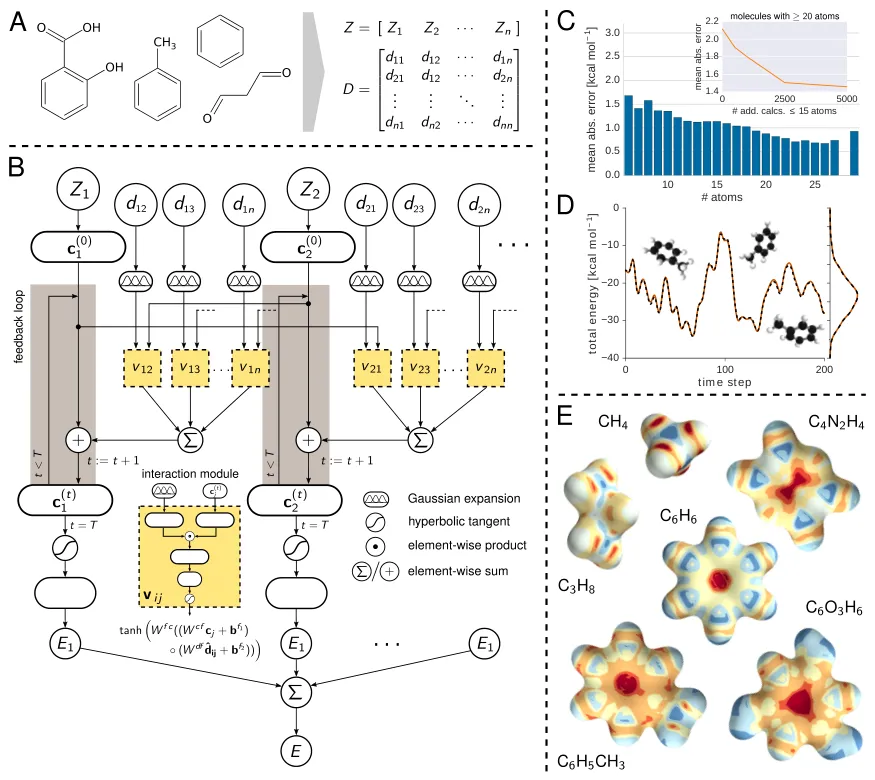
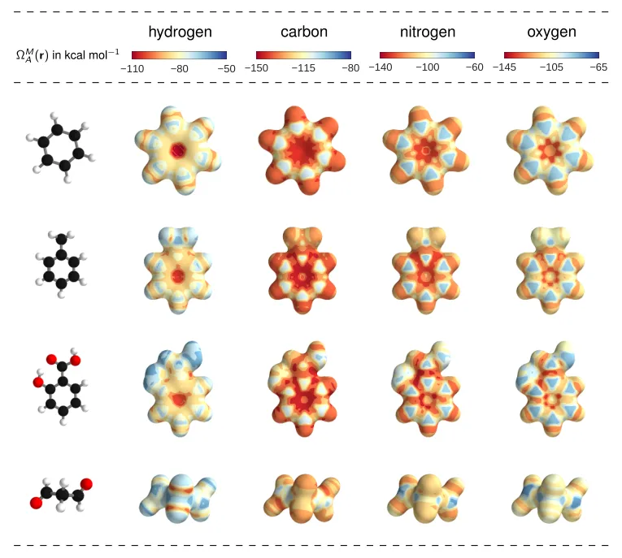
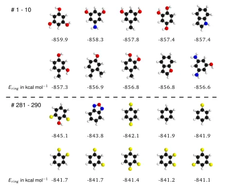
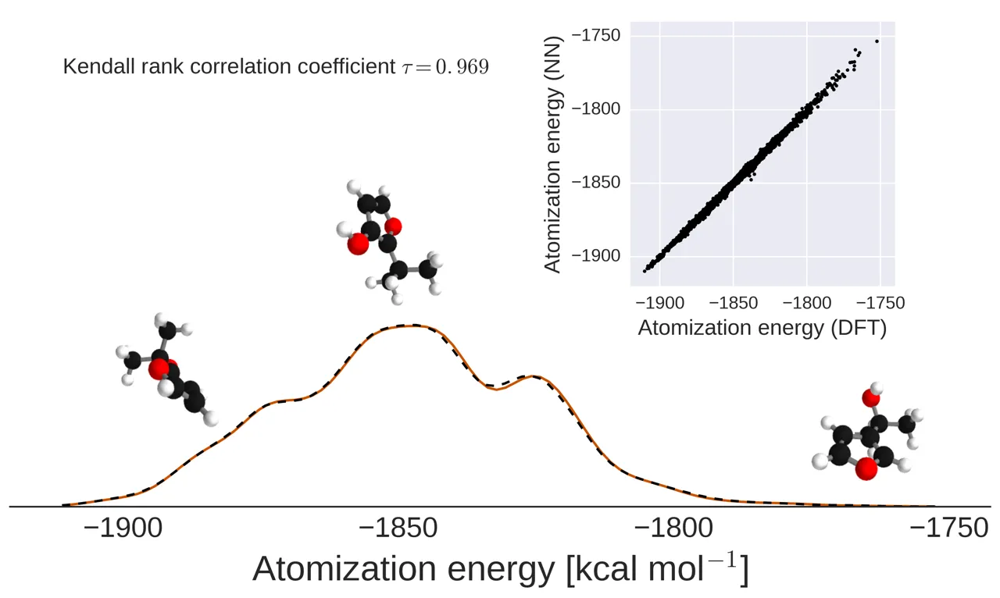
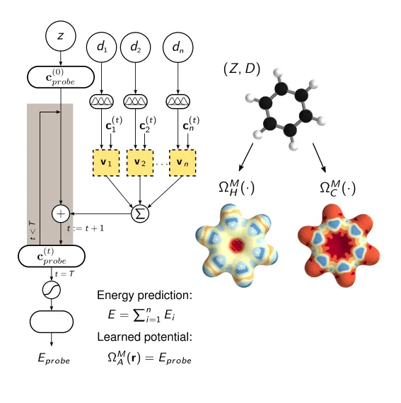
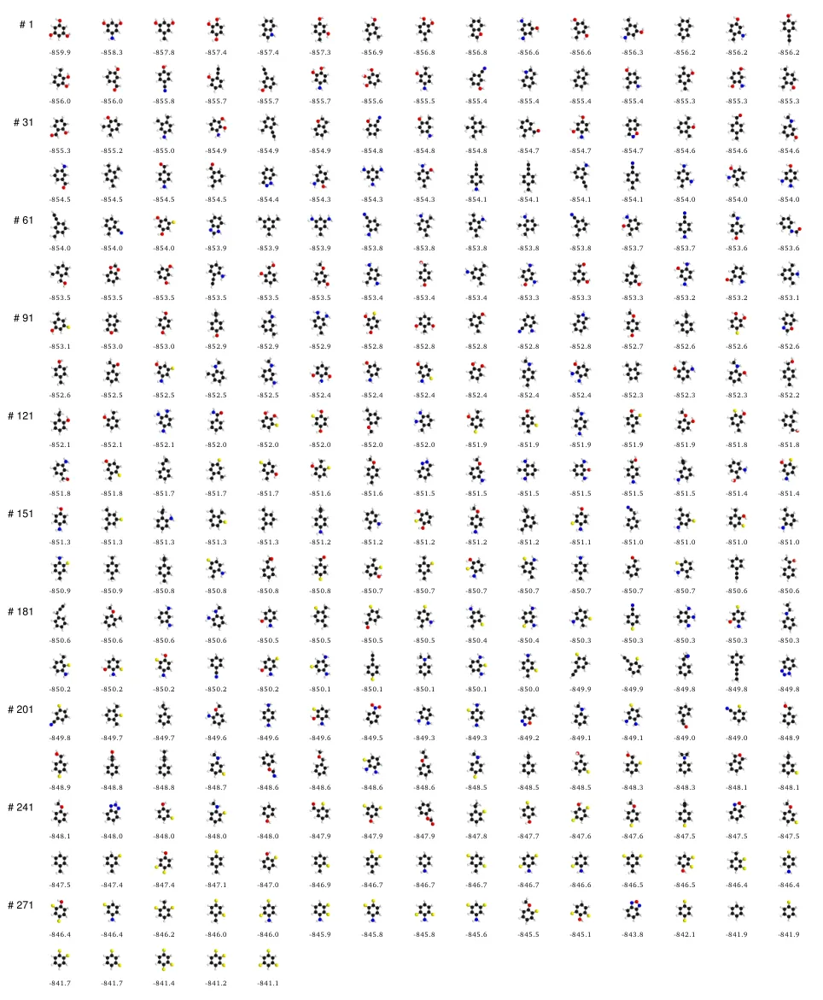
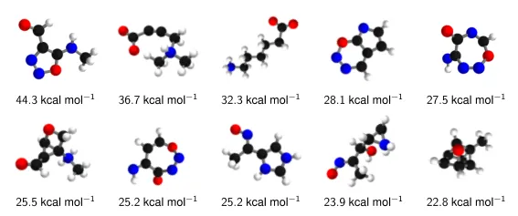
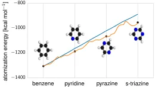
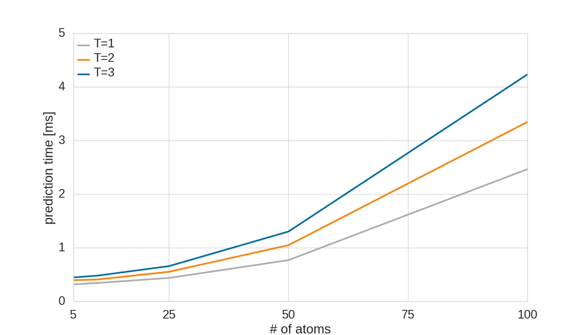

# Quantum-Chemical Insights from Deep Tensor Neural Networks

Kristof T. Schütt¹ Affiliation: ¹Machine Learning Group, Technische
Universität Berlin, Marchstr. 23, 10587 Berlin, Germany  
²Department of Brain and Cognitive Engineering, Korea University,
Anam-dong, Seongbuk-gu, Seoul 136-713, Republic of Korea  
³Fritz-Haber-Institut der Max-Planck-Gesellschaft, Faradayweg 4-6,
D-14195, Berlin, Germany  
⁴Physics and Materials Science Research Unit, University of Luxembourg,
L-1511 Luxembourg    Farhad Arbabzadah¹ Affiliation: ¹Machine Learning
Group, Technische Universität Berlin, Marchstr. 23, 10587 Berlin,
Germany  
²Department of Brain and Cognitive Engineering, Korea University,
Anam-dong, Seongbuk-gu, Seoul 136-713, Republic of Korea  
³Fritz-Haber-Institut der Max-Planck-Gesellschaft, Faradayweg 4-6,
D-14195, Berlin, Germany  
⁴Physics and Materials Science Research Unit, University of Luxembourg,
L-1511 Luxembourg    Stefan Chmiela¹ Affiliation: ¹Machine Learning
Group, Technische Universität Berlin, Marchstr. 23, 10587 Berlin,
Germany  
²Department of Brain and Cognitive Engineering, Korea University,
Anam-dong, Seongbuk-gu, Seoul 136-713, Republic of Korea  
³Fritz-Haber-Institut der Max-Planck-Gesellschaft, Faradayweg 4-6,
D-14195, Berlin, Germany  
⁴Physics and Materials Science Research Unit, University of Luxembourg,
L-1511 Luxembourg    Klaus R. Müller^(1,2)
Email: <klaus-robert.mueller@tu-berlin.de> Affiliation: ¹Machine
Learning Group, Technische Universität Berlin, Marchstr. 23, 10587
Berlin, Germany  
²Department of Brain and Cognitive Engineering, Korea University,
Anam-dong, Seongbuk-gu, Seoul 136-713, Republic of Korea  
³Fritz-Haber-Institut der Max-Planck-Gesellschaft, Faradayweg 4-6,
D-14195, Berlin, Germany  
⁴Physics and Materials Science Research Unit, University of Luxembourg,
L-1511 Luxembourg    Alexandre Tkatchenko^(3,4)
Email: <alexandre.tkatchenko@uni.lu> Affiliation: ¹Machine Learning
Group, Technische Universität Berlin, Marchstr. 23, 10587 Berlin,
Germany  
²Department of Brain and Cognitive Engineering, Korea University,
Anam-dong, Seongbuk-gu, Seoul 136-713, Republic of Korea  
³Fritz-Haber-Institut der Max-Planck-Gesellschaft, Faradayweg 4-6,
D-14195, Berlin, Germany  
⁴Physics and Materials Science Research Unit, University of Luxembourg,
L-1511 Luxembourg

###### Abstract

Learning from data has led to paradigm shifts in a multitude of
disciplines, including web, text, and image search, speech recognition,
as well as bioinformatics. Can machine learning spur similar
breakthroughs in understanding quantum many-body systems? Here we
develop an efficient deep learning approach that enables spatially and
chemically resolved insights into quantum-mechanical observables of
molecular systems. We unify concepts from many-body Hamiltonians with
purpose-designed deep tensor neural networks (DTNN), which leads to
size-extensive and uniformly accurate (1 kcal/mol) predictions in
compositional and configurational chemical space for molecules of
intermediate size. As an example of chemical relevance, the DTNN model
reveals a classification of aromatic rings with respect to their
stability – a useful property that is not contained as such in the
training dataset. Further applications of DTNN for predicting atomic
energies and local chemical potentials in molecules, reliable isomer
energies, and molecules with peculiar electronic structure demonstrate
the high potential of machine learning for revealing novel insights into
complex quantum-chemical systems.



Figure 1: Prediction and explanation of molecular energies with a deep
tensor neural network (DTNN). (A) Molecules are encoded as input for the
neural network by a vector of nuclear charges and an inter-atomic
distance matrix. This description is complete and invariant to rotation
and translation. (B) Illustration of the network architecture. Each atom
type corresponds to a vector of coefficients $`\mathbf{c}_{i}^{(0)}`$
which is repeatedly refined by interactions $`\mathbf{v}_{ij}`$. The
interactions depend on the current representation
$`\mathbf{c}_{j}^{(t)}`$ as well as the distance $`d_{ij}`$ to an atom
$`j`$. After $`T`$ iterations, an energy contribution $`E_{i}`$ is
predicted for the final coefficient vector $`\mathbf{c}_{i}^{(T)}`$. The
molecular energy $`E`$ is the sum over these atomic contributions. (C)
Mean absolute errors of predictions for the GDB-9 dataset of 129,000
molecules as a function of the number of atoms. The employed neural
network uses two interaction passes ($`T=2`$) and 50000 reference
calculation during training. The inset shows the error of an equivalent
network trained on 5000 GDB-9 molecules with 20 or more atoms, as small
molecules with 15 or less atoms are added to the training set. (D)
Extract from the calculated (black) and predicted (orange) molecular
dynamics trajectory of toluene. The curve on the right shows the
agreement of the predicted and calculated energy distributions. (E)
Energy contribution $`E_{probe}`$ (or local chemical potential
$`\Omega_{\rm{H}}(\mathbf{r})`$, see text) of a hydrogen test charge on
a $`\sum_{i}\|\mathbf{r}-\mathbf{r}_{i}\|^{-2}`$ isosurface for various
molecules from the GDB-9 dataset for a DTNN model with $`T=2`$.

Chemistry permeates all aspects of our life, from the development of new
drugs to the food that we consume and materials we use on a daily basis.
Chemists rely on empirical observations based on creative and
painstaking experimentation that leads to eventual discoveries of
molecules and materials with desired properties and mechanisms to
synthesize them. Many discoveries in chemistry can be guided by
searching large databases of experimental or computational molecular
structures and properties by using concepts based on chemical
similarity. Because the structure and properties of molecules are
determined by the laws of quantum mechanics, ultimately chemical
discovery must be based on fundamental quantum principles. Indeed,
electronic structure calculations and intelligent data analysis (machine
learning, ML) have recently been combined aiming towards the goal of
accelerated discovery of chemicals with desired properties \[1, 2, 3, 4,
5, 6, 7, 8\]. However, so far the majority of these pioneering efforts
have focused on the construction of reduced models trained on large
datasets of density-functional theory calculations. In this work, we
develop an efficient deep learning approach that enables spatially and
chemically resolved insights into quantum-mechanical properties of
molecular systems beyond those trivially contained in the training
dataset. Obviously, computational models are not predictive if they lack
accuracy. In addition to being interpretable, size extensive and
efficient, our deep tensor neural network (DTNN) approach is uniformly
accurate (1 kcal/mol) throughout compositional and configurational
chemical space. On the more fundamental side, the mathematical
construction of the DTNN model provides statistically rigorous
partitioning of extensive molecular properties into atomic contributions
– a long-standing challenge for quantum-mechanical calculations of
molecules.

## I Molecular Deep Tensor Neural Networks

It is common to use a carefully chosen representation of the problem at
hand as a basis for machine learning \[9, 10, 11\]. For example,
molecules can be represented as Coulomb matrices \[7, 2, 13\],
scattering transforms \[14\], bags of bonds (BoB) \[15\], smooth overlap
of atomic positions (SOAP) \[16, 17\], or generalized symmetry
functions \[18, 19\]. Kernel-based learning of molecular properties
transforms these representations non-linearly by virtue of kernel
functions. In contrast, deep neural networks \[15\] are able to infer
the underlying regularities and learn an efficient representation in a
layer-wise fashion \[21\].

Molecular properties are governed by the laws of quantum mechanics,
which yield the remarkable flexibility of chemical systems, but also
impose constraints on the behavior of bonding in molecules. The approach
presented here utilizes the many-body Hamiltonian concept for the
construction of the DTNN architecture (see Fig. 1), embracing the
principles of quantum chemistry, while maintaining the full flexibility
of a complex data-driven learning machine.

DTNN receives molecular structures through a vector of nuclear charges
$`Z`$ and a matrix of atomic distances $`D`$ ensuring rotational and
translational invariance by construction (Fig. 1A). The distances are
expanded in a Gaussian basis, yielding a feature vector
$`\hat{\mathbf{d}}_{ij}`$, which accounts for the different nature of
interactions at various distance regimes.

The total energy $`E_{M}`$ for the molecule $`M`$ composed of $`N`$
atoms is written as a sum over $`N`$ atomic energy contributions
$`E_{i}`$, thus satisfying permutational invariance with respect to atom
indexing. Each atom $`i`$ is represented by a coefficient vector
$`\mathbf{c}\in\mathbb{R}^{B}`$, where $`B`$ is the number of basis
functions, or features. Motivated by quantum-chemical atomic basis set
expansions, we assign an atom type-specific descriptor vector
$`\mathbf{c}_{Z_{i}}`$ to these coefficients $`\mathbf{c}_{i}^{(0)}`$.
Subsequently, this atomic expansion is repeatedly refined by pairwise
interactions with the surrounding atoms

```math
\mathbf{c}^{(t+1)}_{i}=\mathbf{c}^{(t)}_{i}+\sum_{j\neq i}\mathbf{v}_{ij}, \tag{1}
```

where the interaction term $`\mathbf{v}_{ij}`$ reflects the influence of
atom $`j`$ at a distance $`D_{ij}`$ on atom $`i`$. Note that this
refinement step is seamlessly integrated into the architecture of the
molecular DTNN, and is therefore adapted throughout the learning
process. Considering a molecule as a graph, $`T`$ refinements of the
coefficient vectors are comprised of all walks of length $`T`$ through
the molecule ending at the corresponding atom \[22, 23, 24\]. From the
point of view of many-body interatomic interactions, subsequent
refinement steps $`t`$ correlate atomic neighborhoods with increasing
complexity.

While the initial atomic representation only considers isolated atoms,
the interaction terms characterize how the basis functions of two atoms
overlap with each other at a certain distance. Each refinement step aims
to reduce these overlaps, thereby embedding the atoms of the molecule
into their chemical environment. Following this procedure, the DTNN
implicitly learns an atom-centered basis that is unique and efficient
with respect to the property to be predicted.

Non-linear coupling between the atomic vector features and the
interatomic distances is achieved by a tensor layer \[19, 17\], such
that the coefficient $`k`$ of the refinement is given by

```math
v_{ijk}=\tanh\left(\mathbf{c}_{j}^{(t)}V_{k}\hat{\mathbf{d}}_{ij}+(W^{c}\mathbf{c}_{j}^{(t)})_{k}+(W^{d}\hat{\mathbf{d}}_{ij})_{k}+b_{k}\right), \tag{2}
```

where $`b_{k}`$ is the bias of feature $`k`$ and $`W^{c}`$ and $`W^{d}`$
are the weights of atom representation and distance, respectively. The
slice $`V_{k}`$ of the parameter tensor
$`V\in\mathbb{R}^{B\times B\times G}`$ combines the inputs
multiplicatively. Since $`V`$ incorporates many parameters, using this
kind of layer is both computationally expensive as well as prone to
overfitting. Therefore, we employ a low-rank tensor factorization, as
described in \[20\], such that

```math
\mathbf{v}_{ij}=\tanh\left[W^{fc}\left((W^{cf}\mathbf{c}_{j}+\mathbf{b}^{f_{1}})\circ(W^{df}\mathbf{\hat{d}_{ij}}+\mathbf{b}^{f_{2}})\right)\right], \tag{3}
```

where ’$`\circ`$’ represents element-wise multiplication while
$`W^{cf}`$, $`\mathbf{b}^{f_{1}}`$, $`W^{df}`$, $`\mathbf{b}^{f_{2}}`$
and $`W^{fc}`$ are the weight matrices and corresponding biases of atom
representations, distances and resulting factors, respectively. As the
dimensionality of $`W^{cf}\mathbf{c}_{j}`$ and
$`W^{df}\mathbf{\hat{d}_{ij}}`$ corresponds to the number of factors,
choosing only a few drastically decreases the number of parameters, thus
solving both issues of the tensor layer at once.

Arriving at the final embedding after a given number of interaction
refinements, two fully-connected layers predict an energy contribution
from each atomic coefficient vector, such that their sum corresponds to
the total molecular energy $`E_{M}`$. Therefore, the DTNN architecture
scales with the number of atoms in a molecule, fully capturing the
extensive nature of the energy. All weights, biases as well as the atom
type-specific descriptors were initialized randomly and trained using
stochastic gradient descent \[28\].

## II Learning molecular energies

To demonstrate the versatility of the proposed DTNN, we train models
with up to three interaction passes $`T=3`$ for both compositional and
configurational degrees of freedom in molecular systems. The DTNN
accuracy saturates at $`T=3`$, and leads to a strong correlation between
atoms in molecules, as can be visualized by the complexity of the
potential learned by the network (see Fig. 1E). For training, we employ
chemically diverse datasets of equilibrium molecular structures, as well
as molecular dynamics (MD) trajectories for small molecules \[28\]. We
employ two subsets of the GDB-13 database \[1, 30\] referred to as
GDB-7, including more than 7,000 molecules with up to 7 heavy (C, N, O,
F) atoms, and GDB-9, consisting of 129,000 molecules with up to 9 heavy
atoms \[3\]. In both cases, the learning task is to predict the
molecular total energy calculated with density-functional theory (DFT).
All GDB molecules are stable and synthetically accessible according to
organic chemistry rules \[30\]. Molecular features such as functional
groups or signatures include single, double and triple bonds; (hetero-)
cycles, carboxy, cyanide, amide, amine, alcohol, epoxy, sulfide, ether,
ester, chloride, aliphatic and aromatic groups. For each of the many
possible stoichiometries, many constitutional isomers are considered,
each being represented only by a low-energy conformational isomer.

As Table S2 demonstrates, DTNN achieves a mean absolute error (MAEs) of
1.0 kcal/mol on both GDB datasets, training on 5.8k GDB-7 (80%) and 25k
(20%) GDB-9 reference calculations, respectively \[24\]. Fig. 1C shows
the performance on GDB-9 depending on the size of the molecule. We
observe that larger molecules have lower errors because of their
abundance in the training data. The per-atom DTNN energy prediction and
the fact that chemical interactions have a finite distance range means
that the DTNN model will yield a constant error per atom upon increasing
molecular size. To assess the effective range of chemical interactions
we have imposed a distance cutoff to interatomic interactions of
$`3\AA`$, yielding only a 0.1 kcal/mol increase in the error. However,
this distance cutoff restricts only the direct interactions considered
in the refinement steps. With multiple refinements, the effective cutoff
increases by a factor of $`T`$ due to indirect interactions over
multiple atoms. Given large enough molecules, so that a reasonable
distance cutoff can be chosen, scaling to larger molecules will require
only to have well-represented local environments. Along the same vein,
we trained the network on a restricted subset of 5k molecules with more
than 20 atoms. By adding smaller molecules to the training set, we are
able to reduce the test error from 2.1 kcal/mol to less than 1.5
kcal/mol (see inset in Fig. 1C). This result demonstrates that our model
is able to transfer knowledge learned from small molecules to larger
molecules with diverse functional groups.

While only encompassing conformations of a single molecule, reproducing
MD simulation trajectories poses a radically different challenge to
predicting energies of purely equilibrium structures. We learned
potential energies for MD trajectories of benzene, toluene,
malonaldehyde and salicylic acid, carried out at a rather high
temperature of 500 K to achieve exhaustive exploration of the
potential-energy surface of such small molecules. The neural network
yields mean absolute errors of 0.05 kcal/mol, 0.18 kcal/mol, 0.17
kcal/mol and 0.39 kcal/mol for these molecules, respectively (see
Table S2). Fig. 1D shows the excellent agreement between the DFT and
DTNN MD trajectory of toluene as well as the corresponding energy
distributions. The DTNN errors are much smaller than the energy of
thermal fluctuations at room temperature ($`\sim`$0.6 kcal/mol), meaning
that DTNN potential-energy surfaces can be utilized to calculate
accurate molecular thermodynamic properties by virtue of Monte Carlo
simulations.

The ability of DTNN to accurately describe equilibrium structures within
the GDB-9 database and MD trajectories of selected molecules of chemical
relevance demonstrates the feasibility of developing a universal machine
learning architecture that can capture compositional as well as
configurational degrees of freedom in the vast chemical space (see
Applications section for further analysis). While the employed
architecture of the DTNN is universal, the learned coefficients are
different for GDB-9 and MD trajectories of single molecules.



Figure 2: Chemical potentials $`\Omega^{M}_{A}(\mathbf{r})`$ for
$`A=\{C,N,O,H\}`$ atoms for benzene, toluene, salicylic acid, and
malondehyde. The isosurface was generated for
$`\sum_{i}\|\mathbf{r}-\mathbf{r}_{i}\|^{-2}`$ = 3.8 Å⁻² (the index
$`i`$ is used to sum over all atoms of the corresponding molecule).



Figure 3: Classification of molecular carbon ring stability. Shown are
20 molecules (10 most stable and 10 least stable) with respect to the
energy of the carbon ring predicted by the DTNN model.



Figure 4: Isomer energies with chemical formula C₇O₂H₁₀. DTNN trained on
the GDB-9 database is able to acurately discriminate between 6095
different isomers of C₇O₂H₁₀, which exhibit a non-trivial spectrum of
relative energies.

## III Applications

### III.1 Quantum-chemical insights

Beyond predicting accurate energies, the true power of DTNN lies in its
ability to provide novel quantum-chemical insights. In the context of
DTNN, we define a local chemical potential
$`\Omega^{M}_{A}(\mathbf{r})`$ as an energy of a certain atom type
$`A`$, located at a position $`\mathbf{r}`$ in the molecule $`M`$. While
the DTNN models the interatomic interactions, we only allow the atoms of
the molecule act on the probe atom, while the probe does not influence
the molecule \[28\]. The spatial and chemical sensitivity provided by
our DTNN approach is shown in Fig. 1E for a variety of fundamental
molecular building blocks. In this case, we employed hydrogen as a test
charge, while the results for $`\Omega^{M}_{\rm{C,N,O}}(\mathbf{r})`$
are shown in Fig. 2. Despite being trained only on total energies of
molecules, the DTNN approach clearly grasps fundamental chemical
concepts such as bond saturation and different degrees of aromaticity.
For example, the DTNN model predicts the C₆O₃H₆ molecule to be “more
aromatic” than benzene or toluene (see Fig. 1E). Remarkably, it turns
out that C₆O₃H₆ does have higher ring stability than both benzene and
toluene and DTNN predicts it to be the molecule with the most stable
aromatic carbon ring among all molecules in the GDB-9 database (see
Fig. 3). Further chemical effects learned by the DTNN model are shown in
Fig. 2 that demonstrates the differences in the chemical potential
distribution of H, C, N, and O atoms in benzene, toluene, salicylic
acid, and malonaldehyde. For example, the chemical potentials of
different atoms over an aromatic ring are qualitatively different for H,
C, N, and O atoms – an evident fact for a trained chemist. However, the
subtle chemical differences described by DTNN are accompanied by
chemically accurate predictions – a challenging task for humans.

Because DTNN provides atomic energies by construction, it allows us to
classify molecules by the stability of different building blocks, for
example aromatic rings or methyl groups. An example of such
classification is shown in Fig. 3, where we plot the molecules with most
stable and least stable carbon aromatic rings in GDB-9. The distribution
of atomic energies is shown in Fig. S4, while Fig. S5 lists the full
stability ranking. The DTNN classification leads to interesting
stability trends, notwithstanding the intrinsic non-uniqueness of atomic
energy partitioning. However, unlike atomic projections employed in
electronic-structure calculations, the DTNN approach has a firm
foundation in statistical learning theory. In quantum-chemical
calculations, every molecule would correspond to a different
partitioning depending on its self-consistent electron density. In
contrast, the DTNN approach learns the partitioning on a large molecular
dataset, generating a transferable and global “dressed atom”
representation of molecules in chemical space. Recalling that DTNN
exhibits errors below 1 kcal/mol, the classification shown in Fig. 3 can
provide useful guidance for the chemical discovery of molecules with
desired properties. Analytical gradients of the DTNN model with respect
to chemical composition or $`\Omega^{M}_{A}(\mathbf{r})`$ could also aid
in the exploration of chemical compound space \[32\].

### III.2 Energy predictions for isomers: Towards mapping chemical space

The quantitative accuracy achieved by DTNN and its size extensivity
paves the way to the calculation of configurational and conformational
energy differences – a long-standing challenge for machine learning
approaches \[7, 2, 13, 33\]. The reliability of DTNN for isomer energy
predictions is demonstrated by the energy distribution in Fig. 4 for
molecular isomers with C₇O₂H₁₀ chemical formula (a total of 6095 isomers
in the GDB-9 dataset).

Training a common network for compositional and configurational degrees
of freedoms requires a more complex model. Furthermore, it comes with
technical challenges such as sampling and multiscale issues since the MD
trajectories form clusters of small variation within the chemical
compound space. As a proof of principle, we trained the DTNN to predict
various MD trajectories of the C₇O₂H₁₀ isomers. To this end, we
calculated short MD trajectories of 5000 steps each for 113 randomly
picked isomers as well as consistent total energies for all equilbrium
structures. The training set is composed of the isomers in equilibrium
as well as 50% of each MD trajectory. The remaining MD calculations are
used for validation and testing. Despite the vastly increased
complexity, our DTNN model achieves a mean absolute error of 1.7
kcal/mol, providing a proof-of-principle demonstration of describing
complex chemical spaces.

## IV Discussion

DTNNs provide an efficient way to represent chemical environments
allowing for chemically accurate predictions. To this end, an implicit,
atom-centered basis is learned from reference ab initio calculations.
Employing this representation, atoms can be embedded in their chemical
environment within a few refinement steps. Furthermore, DTNNs have the
advantage that the embedding is built recursively from pairwise
distances. Therefore, all necessary invariances (translation, rotation,
permutation) are guaranteed to be exploited by the model.

In previous approaches, potential-energy surfaces were constructed by
fitting many-body expansions with neural networks \[34, 35, 36\].
However, these methods require a separate NN for each non-equivalent
many-body term in the expansion. Since DTNN learns a common basis in
which the atom interact, higher-order interactions can obtained more
efficiently without separate treament.

Approaches like SOAP \[17, 16\] or manually crafted atom-centered
symmetry functions \[37, 18, 19\] are, like DTNN, based on representing
chemical environments. All these approaches have in common that
size-extensivity regarding the number of atoms is achieved by predicting
atomic energy contributions using a non-linear regression method (e.g.,
neural networks or kernel ridge regression). However, the previous
approaches have a fixed set of basis functions describing the atomic
environments. In contrast, DTNNs are able to adapt to the problem at
hand in a data-driven fashion. Beyond the obvious advantage of not
having to manually select symmetry functions and carefully tune
hyper-parameters of the representation, this property of the DTNN makes
it possible to gain insights by analyzing the learned representation.

Obviously, more work is required to extend this predictive power for
larger molecules, where the DTNN model will have to be combined with a
reliable model for long-range interatomic (van der Waals) interactions.
The intrinsic interpolation smoothness achieved by the DTNN model can
also be used to identify molecules with peculiar electronic structure.
Fig. S6 shows a list of molecules with the largest DTNN errors compared
to reference DFT calculations. It is noteworthy that most molecules in
this figure are characterized by unconventional bonding and the
electronic structure of these molecules has potential multi-reference
character. The large prediction errors could stem from these molecules
being not sufficiently represented by the training data. On the other
hand, DTNN predictions might turn out to be closer to the correct answer
due to its smooth interpolation in chemical space. Higher-level
quantum-chemical calculations would be required to investigate this
interesting hypothesis in the future.

## V Outlook

We have proposed and developed a deep tensor neural network that enables
understanding of quantum-chemical many-body systems beyond properties
contained in the training dataset. The DTNN model is scalable with
molecular size, efficient, and achieves uniform accuracy of 1 kcal/mol
throughout compositional and configuration space for molecules of
intermediate size. The DTNN model leads to novel insights into chemical
systems, a fact that we illustrated on the example of relative aromatic
ring stability, local molecular chemical potentials, relative isomer
energies, and the identification of molecules with peculiar electronic
structure.

Many avenues remain for improving the DTNN model on multiple fronts.
Among these we mention the extension of the model to increasingly larger
molecules, predicting alltomic forces and frequencies, and non-extensive
electronic and optical properties. We propose the DTNN model as a
versatile framework for understanding complex quantum-mechanical systems
based on high-throughput electronic structure calculations.

###### Acknowledgements.

## References

- \[1\] B. Kang and G. Ceder, Nature 458, 190 (2009).
- \[2\] J. K. Nørskov, T. Bligaard, J. Rossmeisl, and C. H. Christensen,
  Nature Chem. 1, 37 (2009).
- \[3\] J. Hachmann, R. Olivares-Amaya, S. Atahan-Evrenk,
  C. Amador-Bedolla, R. S. Sánchez-Carrera, A. Gold-Parker, L. Vogt,
  A. M. Brockway, and A. Aspuru-Guzik, J. Phys. Chem. Lett. 2, 2241
  (2011).
- \[4\] E. O. Pyzer-Knapp, C. Suh, R. Gómez-Bombarelli,
  J. Aguilera-Iparraguirre, and A. Aspuru-Guzik, Annu. Rev. Mater. Res.
  45, 195 (2015).
- \[5\] S. Curtarolo, G. L. Hart, M. B. Nardelli, N. Mingo, S. Sanvito,
  and O. Levy, Nature Mater. 12, 191 (2013).
- \[6\] J. C. Snyder, M. Rupp, K. Hansen, K.-R. Müller, and K. Burke,
  Phys. Rev. Lett. 108, 253002 (2012).
- \[7\] M. Rupp, A. Tkatchenko, K.-R. Müller, and O. A. Von Lilienfeld,
  Phys. Rev. Lett. 108, 058301 (2012).
- \[8\] R. Ramakrishnan, P. O. Dral, M. Rupp, and O. A. von
  Lilienfeld, J. Chem. Theory Comput. 11, 2087 (2015).
- \[9\] C. M. Bishop, _Pattern Recognition and Machine Learning_
  (Springer, 2006).
- \[10\] L. M. Ghiringhelli, J. Vybiral, S. V. Levchenko, C. Draxl, and
  M. Scheffler, Phys. Rev. Lett. 114, 105503 (2015).
- \[11\] K. Schütt, H. Glawe, F. Brockherde, A. Sanna, K. Müller, and
  E. Gross, Phys. Rev. B 89, 205118 (2014).
- \[12\] G. Montavon, M. Rupp, V. Gobre, A. Vazquez-Mayagoitia,
  K. Hansen, A. Tkatchenko, K.-R. Müller, and O. A. von Lilienfeld,
  New J. Phys. 15, 095003 (2013).
- \[13\] K. Hansen, G. Montavon, F. Biegler, S. Fazli, M. Rupp,
  M. Scheffler, O. A. Von Lilienfeld, A. Tkatchenko, and K.-R.
  Müller, J. Chem. Theory Comput. 9, 3404 (2013).
- \[14\] M. Hirn, N. Poilvert, and S. Mallat, arXiv preprint
  arXiv:1502.02077 (2015).
- \[15\] K. Hansen, F. Biegler, R. Ramakrishnan, W. Pronobis, O. A. von
  Lilienfeld, K.-R. Müller, and A. Tkatchenko, J. Phys. Chem. Lett. 6,
  2326 (2015).
- \[16\] A. P. Bartók, R. Kondor, and G. Csányi, Phys. Rev. B 87, 184115
  (2013).
- \[17\] A. P. Bartók, M. C. Payne, R. Kondor, and G. Csányi, Phys. Rev.
  Lett. 104, 136403 (2010).
- \[18\] J. Behler, J. Chem. Phys. 134, 074106 (2011a).
- \[19\] J. Behler, Phys. Chem. Chem. Phys. 13, 17930 (2011b).
- \[20\] Y. LeCun, Y. Bengio, and G. Hinton, Nature 521, 436 (2015).
- \[21\] G. Montavon, M. L. Braun, and K.-R. Müller, Journ. Mach. Learn.
  Res. 12, 2563 (2011).
- \[22\] F. Scarselli, M. Gori, A. C. Tsoi, M. Hagenbuchner, and
  G. Monfardini, IEEE Trans. Neural Netw. 20, 61 (2009).
- \[23\] D. K. Duvenaud, D. Maclaurin, J. Iparraguirre, R. Bombarell,
  T. Hirzel, A. Aspuru-Guzik, and R. P. Adams, in _NIPS_, edited by
  C. Cortes, N. D. Lawrence, D. D. Lee, M. Sugiyama, and
  R. Garnett (2015) pp. 2224–2232.
- \[24\] “Supplementary text.” .
- \[25\] R. Socher, A. Perelygin, J. Y. Wu, J. Chuang, C. D. Manning,
  A. Y. Ng, and C. Potts, in _EMNLP_, Vol. 1631 (2013) p. 1642.
- \[26\] I. Sutskever, J. Martens, and G. E. Hinton, in _ICML_ (2011)
  pp. 1017–1024.
- \[27\] G. W. Taylor and G. E. Hinton, in _ICML_ (2009) pp. 1025–1032.
- \[28\] “Materials and methods are available as supplementary
  materials.” .
- \[29\] L. C. Blum and J.-L. Reymond, J. Am. Chem. Soc. 131, 8732
  (2009).
- \[30\] J.-L. Reymond, Acc. Chem. Res. 48, 722 (2015).
- \[31\] R. Ramakrishnan, P. O. Dral, M. Rupp, and O. A. von Lilienfeld,
  Sci. Data 1, 140022 (2014).
- \[32\] O. A. von Lilienfeld, Int. J. Quantum Chem. 113, 1676 (2013).
- \[33\] S. De, A. P. Bartók, G. Csányi, and M. Ceriotti, arXiv preprint
  arXiv:1601.04077 (2015).
- \[34\] M. Malshe, R. Narulkar, L. Raff, M. Hagan, S. Bukkapatnam,
  P. Agrawal, and R. Komanduri, J. Chem. Phys. 130, 184102 (2009).
- \[35\] S. Manzhos and T. Carrington Jr, J. Chem. Phys. 125, 084109
  (2006).
- \[36\] S. Manzhos and T. Carrington Jr, J. Chem. Phys. 129, 224104
  (2008).
- \[37\] J. Behler and M. Parrinello, Phys. Rev. Lett. 98, 146401
  (2007).

Supplementary Materials

## Materials and Methods

### Data

We employ two subsets of the GDB database \[1\], referred to in this
paper as GDB-7 and GDB-9. GDB-7 contains 7211 molecules with up to 7
heavy atoms out of the elements C, N, O, S and Cl, saturated with
hydrogen \[2\]. Similarly, GDB-9 includes 133,885 molecules with up to 9
heavy atoms out of C, O, N, F \[3\]. Both data sets include calculations
of atomization energies employing density functional theory \[4\] with
the PBE0 \[5\] and B3LYP \[6, 7, 8, 9, 10\] exchange-correlation
potential, respectively.

The molecular dynamics trajectories are calculated at a temperature of
500 K and resolution of 0.5fs using density functional theory with the
PBE exchange-correlation potential \[11\]. The data sets for benzene,
toluene, malonaldehyde and salicylic acid consist of 627k, 442k, 993k
and 320k time steps, respectively. In the presented experiments, we
predict the potential energy of the MD geometries.

### The deep tensor neural network model

The molecular energies of the various data sets are predicted using a
deep tensor neural network. The core idea is to represent atoms in the
molecule as vectors depending on their type and to subsequently refine
the representation by embedding the atoms in their neighborhood. This is
done in a sequence of interaction passes where the atom representations
influence each other in a pair-wise fashion. While each of these
refinements depends only on the pair-wise atomic distances, multiple
passes enable the architecture to also take angular information into
account. Due to this decomposition of atomic interactions, an efficient
representation of embedded atoms is learned following quantum chemical
principles.

In the following, we describe the deep tensor neural network
step-by-step, including hyper-parameters used in our experiments.

1.  1.  Assign initial atomic descriptors  
        We assign an initial coefficient vector to each atom $`i`$ of the
        molecule according to its nuclear charge $`Z`$:

    ```math
    \mathbf{c}_{i}^{(0)}=\mathbf{c}_{Z_{i}}\in R^{B}, \tag{4}
    ```

    where B is the number of basis functions. All presented models use
    atomic descriptors with 30 coefficients. We initialize each
    coefficient randomly following
    $`\mathbf{c}_{Z}\sim\mathcal{N}(0,1/\sqrt{B})`$.

2.  2.  Gaussian feature expansion of the inter-atomic distances  
        The inter-atomic distances $`d_{ij}`$ are spread across many
        dimensions by a uniform grid of Gaussians

    ```math
    \hat{\mathbf{d}}_{ij}=\left[\exp\left(-\frac{(d_{ij}-(\mu_{min}+k\Delta\mu))^{2}}{2\sigma^{2}}\right)\right]_{0\leq k\leq\mu_{max}/\Delta\mu}, \tag{5}
    ```

    with $`\Delta\mu`$ being the gap between two Gaussians of width
    $`\sigma`$.

    In our experiments, we set both to $`0.2\,`$Å. The center of the
    first Gaussian $`\mu_{min}`$ was set to $`-1`$, while $`\mu_{max}`$
    was chosen depending on the range of distances in the data
    ($`10\,`$Å for GDB-7 and benzene, $`15\,`$Å for toluene,
    malonaldehyde and salicylic acid and $`20\,`$Å for GDB-9).

3.  3.  Perform $`T`$ interaction passes Each coefficient vector
        $`\mathbf{c}^{(t)}_{i}`$, corresponding to atom $`i`$ after $`t`$
        passes, is corrected by the interactions with the other atoms of the
        molecule:

    ```math
    \mathbf{c}^{(t+1)}_{i}=\mathbf{c}^{(t)}_{i}+\sum_{j\neq i}\mathbf{v}_{ij}. \tag{6}
    ```

    Here, we model the interaction $`v`$ as follows:

    ```math
    \mathbf{v}_{ij}=\tanh\left(W^{fc}((W^{cf}\mathbf{c}_{j}+\mathbf{b}^{f_{1}})\circ(W^{df}\mathbf{\hat{d}_{ij}}+\mathbf{b}^{f_{2}}))\right), \tag{7}
    ```

    where the circle ($`\circ`$) represents the element-wise matrix
    product. The factor representation in the presented models employs
    60 neurons.

4.  4.  Predict energy contributions  
        Finally, we predict the energy contributions $`E_{i}`$ from each
        atom $`i`$. Employing two fully-connected layers, for each atom a
        scaled energy contribution $`\hat{E}_{i}`$ is predicted:

    ```math
    \mathbf{o}_{i}=\tanh(W^{out_{1}}\mathbf{c}^{(T)}_{i}+\mathbf{b}^{out_{1}}) \tag{8}
    ```

    ```math
    \hat{E}_{i}=W^{out_{2}}\mathbf{o}_{i}+\mathbf{b}^{out_{2}} \tag{9}
    ```

    In our experiments, the hidden layer $`\mathbf{o}_{i}`$ possesses 15
    neurons. To obtain the final contributions, $`\hat{E}_{i}`$ is
    shifted to the mean $`E_{\mu}`$ and scaled by the standard deviation
    $`E_{std}`$ of the energy per atom estimated on the training set.

    ```math
    E_{i}=(\hat{E}_{i}+E_{\mu})E_{std} \tag{10}
    ```

    This procedure ensures a good starting point for the training.

5.  5.  Obtain the molecular energy $`E=\sum_{i}E_{i}`$

The bias parameters as well as $`W^{out_{2}}`$ are initially set to
zero. All other weight matrices are initialized drawing from a uniform
distribution according to \[12\].

The deep tensor neural networks have been trained for 3000 epochs
minimizing the squared error, using stochastic gradient descent with 0.9
momentum and a constant learning rate \[13\]. The final results are
taken from the models with the best validation error in early stopping.

### Computational cost of training and prediction

All DTNN models were trained and executed on an NVIDIA Tesla K40 GPU.
The computational cost of the employed models depends on the number of
reference calculations, the number of interaction passes as well as the
number of atoms per molecule. The training times for all models and data
sets are shown in Table 1, ranging from 6 hours for 5.768 reference
calculations of GDB-7 with one interaction pass, to 162 hours for
100.000 reference calculations of the GDB-9 data set with 3 interaction
passes.

On the other hand, the prediction is instantaneous: all models predict
examples from the employed data sets in less than 1 ms. Fig. 12 shows
the scaling of the prediction time with the number of atoms and
interaction layers. Even for a molecule with 100 atoms, a DTNN with 3
interaction layers requires less than 5 ms for a prediction.

The prediction as well as the training steps scale linearly with the
number of interaction passes and quadratically with the number of atoms,
since the pairwise atomic distances are required for the interactions.
For large molecules it is reasonable to introduce a distance cutoff
(future work). In that case, the DTNN will also scale linearly with the
number of atoms.

### Computing the local potentials of the DTNN

Given a trained neural network as described in the previous section, one
can extract the coefficients vectors $`\mathbf{c}^{(t)}_{i}`$ for each
atom $`i`$ and each interaction pass $`t`$ for a molecule of interest.
From each final representation $`\mathbf{c}^{(T)}_{i}`$, the energy
contribution $`E_{i}`$ of the corresponding atom to the molecular energy
can be obtained. Instead, we let the molecule act on a probe atom,
described by its charge $`z`$ and the pairwise distances
$`d_{1},\dots,d_{n}`$ to the atoms of the molecule:

```math
\mathbf{c}^{(t+1)}_{probe}=\mathbf{c}^{(t)}_{probe}+\sum_{j=1}^{n}\mathbf{v}_{j}, \tag{11}
```

with
$`\mathbf{v}_{j}=\tanh\left(W^{fc}((W^{cf}\mathbf{c}_{j}+\mathbf{b}^{f_{1}})\circ(W^{df}\mathbf{\hat{d}}_{j}+\mathbf{b}^{f_{2}}))\right)`$.
While this is equivalent to how the coefficient vectors of the molecule
are corrected, here, the molecule does not get to be influenced by the
probe. Now, the energy of the probe atom is predicted as usual from the
final representation $`\mathbf{c}^{(T)}_{probe}`$. Interpreting this as
a local potential $`\Omega_{A}^{M}(\mathbf{r})`$ generated by the
molecule, we can use the neural network to visualize the learned
interactions as illustrated in Fig. 5. The presented energy surfaces
show the potential for different probe atoms plotted on an isosurface of
$`\sum_{i=1}^{n}d_{i}^{-2}`$. We used Mayavi \[14\] for the
visualization of the surfaces.

### Computing an alchemical path with the DTNN

The alchemical paths in Fig. 11 were generated by gradually moving the
atoms as well as interpolating between the initial coefficient vectors
for changes of atom types. Given two nuclear charges $`A,B`$, the
coefficient vector for any charge $`Z_{i}=\alpha_{i}A+(1-\alpha)B`$ with
$`0\leq\alpha\leq 1`$ is given by

```math
\mathbf{c}_{Z_{i}}=\alpha_{i}\mathbf{c}_{A}+(1-\alpha_{i})\mathbf{c}_{B}. \tag{12}
```

Similarly, in order to add or remove atoms, we introduce fading factors
$`\beta_{1},\dots,\beta_{n}\in[0,1]`$ for each atom. This way,
influences on other atoms

```math
\mathbf{c}^{(t+1)}_{i}=\mathbf{c}^{(t)}_{i}+\sum_{j\neq i}\beta_{j}v(\mathbf{c}^{(t)}_{j},D_{ij}) \tag{13}
```

as well as energy contributions to the molecular energy
$`E=\sum_{i=1}^{n}\beta_{i}E_{i}`$ can be faded out.

## Supplementary Text

### Discussion of the results

Table 2 shows the mean absolute (MAE) and root mean squared errors
(RMSE) as well as standard errors over five randomly drawn training
sets. For GDB-9 and the MD data sets, 1k reference calculations were
used as validation set for early stopping, while the remaining data was
used for testing. In case of GDB-7, validation and test set contained
10% of the reference calculations each. With respect to the mean
absolute error, chemical accuracy can be achieved on all employed data
sets using models with two or three interactions passes.

Figs. 6 and 7 show the dependence of the performance on the number of
training examples for the benzene MD data set and GDB-9, respectively.
In both learning curves (A), an increase from 1.000 to 10.000 training
examples reduces the error drastically while another increase to 100.000
examples yields comparatively small improvement. The error distributions
(B) show that models with two and three interaction passes trained on at
least 25.000 GDB-9 references calculations predict 95% of the unknown
molecules with an error of 3.0 kcal/mol or lower. Correspondingly, the
same models trained on 25.000 or more MD reference calculations of
benzene predict 95% of the unknown benzene configurations with a maximum
error lower than 1.3 kcal/mol.

Beyond a certain number of reference calculations, the models with one
interaction pass perform significantly worse in all theses respects.
Thus, multiple interaction passes indeed enrich the learned feature
representation as demonstrated by the increased predictability of
previously unseen molecules.

### Relations to other deep neural networks

Deep learning has lead to major advances in computer vision, language
processing, speech recognition and other applications \[15\]. In our
model, we embed the atom type in a vector space $`R^{B}`$. This idea is
inspired by word embeddings (word2vec) employed in natural language
processing \[16\]. In order to model inter-atomic effects, we need to
represent the influence of an atom represented by $`\mathbf{c}_{j}`$ at
the distance $`d_{ij}`$. To account for multiple regimes of atomic
distances as well as different dimensionality of the two inputs, we
apply the Gaussian feature mapping described above. Similar approaches
have been applied to the entries of the Coulomb matrix for the
prediction of molecular properties before \[2\]. A natural way to
connect distance and atom representation is a tensor layer as used in
text generation \[17\], reasoning \[18\] or sentiment analysis \[19\].
For an efficient computation as well as regularization, we employ a
factorized tensor layer, corresponding to a low-rank approximation of
the tensor product \[20\].

Convolutional neural networks have been applied to images, speech and
text with great success due to their ability to capture local
structure \[21, 22, 23, 24, 25, 26\]. In a convolution layer, local
filters are applied to local environments, e.g., image patches,
extracting features relevant to the classification task. Similarly,
local correlations of atoms may be exploited in a chemistry setting. The
atom interaction in our model can indeed be regarded as a non-linear
generalization of a convolution. In contrast to images however, atoms of
molecules are not arranged on a grid. Therefore, the convolution kernels
need to be continuous. We define a function
$`C^{t}:R^{3}\rightarrow R^{B}`$ yielding
$`\mathbf{c}_{i}^{t}=C^{t}(\mathbf{r}_{i})`$ at the atom positions. Now,
we can rewrite the interactions as

```math
C^{t+1}(\mathbf{r}_{i})_{k}=C^{t}(\mathbf{r}_{i})_{k}+\sum_{j\neq i}h(f(\mathbf{r}_{j})_{k}g(\|\mathbf{r}_{j}-\mathbf{r}_{i}\|)_{k}), \tag{14}
```

with

```math
f(\mathbf{r}_{j})=W^{cf}C^{t}(\mathbf{r}_{j})+\mathbf{b}^{f_{1}}, \tag{15}
```

```math
g(D_{ij})=W^{df}\mathbf{\hat{d}_{ij}}+\mathbf{b}^{f_{2}}, \tag{16}
```

```math
h(x)=\tanh(W^{fc}\mathbf{x}). \tag{17}
```

For $`h`$ being the identity, the sum is equivalent to a discrete
convolution.

## Figures



Figure 5: Illustration of how the surface plots are obtained from a
trained network as shown in Fig. 1. The deep network can be interpreted
as representing a local potential $`\Omega_{A}^{M}(\mathbf{r})`$ created
by the atoms of the molecule. Putting a probe atom A with nuclear charge
$`z`$ at a position $`\mathbf{r}`$ described by the distances to the
atoms of the molecule $`d_{1},\dots,d_{n}`$ yields an energy
$`E_{probe}`$.

Figure 6: Chemical compound space. Errors depending on the size of the
training set for models with $`T=1,2,3`$ interaction passes trained on
GDB-9. (A) Mean absolute error of neural networks depending on the
number of training examples. Error bars correspond to standard errors
over five repetitions. For more than 5k examples, the error bars vanish
due to standard errors below 0.05 kcal/mol. (B) Error distribution for
models trained on 10k, 25k, 50k and 100k training examples. The box
spans between the 25% and 75% quantiles, while the whiskers mark the 5%
and 95% quantiles.

Figure 7: Molecular dynamics. Errors depending on the size of the
training set for models with $`T=1,2,3`$ interaction passes trained on
the Benzene data set. (A) Mean absolute error of neural networks
depending on the number of training examples. Error bars correspond to
standard errors over five repetitions. For more than 10k examples, the
error bars vanish due to standard errors below 0.01 kcal/mol. (B) Error
distribution for models trained on 10k, 25k, 50k and 100k training
examples. The box spans between the 25% and 75% quantiles, while the
whiskers mark the 5% and 95% quantiles.

Figure 8: Distribution of atomic energy contributions $`E_{i}`$ in the
GDB-9 data set. The energy contributions were predicted using the GDB-9
model with two interaction passes trained on 50k reference calculations.



Figure 9: List of 6-membered carbon rings ordered by the sum of energy
contributions of the ring atoms. The energy contributions were predicted
using the GDB-9 model with three interaction passes trained on 50k
reference calculations. Energy contributions are given in kcal/mol.



Figure 10: Top-10 largest prediction errors on the GDB-9 model with two
interaction passes trained on 50k reference calculations.



Figure 11: An alchemical path of the DTNN trained on 50k GDB-9 reference
calculations with $`T=2`$. The DTNN model is able to smoothly create,
remove and move atoms as well as continuously change their
element-specific characteristics. A path leading from benzene to
s-triazine was computed by only changing, removing and changing types of
atoms (blue). In the second path (orange), atoms were also moved to the
new equilibrium positions. The black dots mark the energy of DFT
reference calculations.



Figure 12: Prediction time needed for a molecule depending on the number
of atoms and number of interaction passes $`T`$ of the employed DTNN.
All predictions were computed on an NVIDIA Tesla K40 GPU.

## Tables

| Data set       | \# training examples | $`T=1`$ | $`T=2`$ | $`T=3`$ |
| -------------- | -------------------- | ------- | ------- | ------- |
| GDB-7          | 5768                 | 6       | 7       | 8       |
| GDB-9          | 25k                  | 28      | 35      | 42      |
|                | 50k                  | 55      | 71      | 82      |
|                | 100k                 | 110     | 139     | 162     |
| Benzene        | 25k                  | 21      | 27      | 32      |
|                | 50k                  | 44      | 53      | 61      |
|                | 100k                 | 84      | 104     | 121     |
| Toluene        | 25k                  | 24      | 27      | 32      |
|                | 50k                  | 45      | 55      | 64      |
|                | 100k                 | 88      | 108     | 127     |
| Malonaldehyde  | 25k                  | 21      | 25      | 29      |
|                | 50k                  | 41      | 52      | 59      |
|                | 100k                 | 85      | 106     | 117     |
| Salicylic acid | 25k                  | 22      | 31      | 32      |
|                | 50k                  | 44      | 54      | 65      |
|                | 100k                 | 91      | 109     | 125     |

Table 1: Training duration for the presented neural networks with up to
three interaction passes ($`T=1,2,3`$) in hours. All models were trained
with stochastic gradient descent with momentum for 3.000 epochs on an
NVIDIA Tesla K40 GPU.

|                |                      |                  |                  |                           |                           |                           |                           |     |
| -------------- | -------------------- | ---------------- | ---------------- | ------------------------- | ------------------------- | ------------------------- | ------------------------- | --- |
| Data set       | \# training examples | T=1              |                  | T=2                       |                           | T=3                       |                           |     |
|                |                      | MAE              | RMSE             | MAE                       | RMSE                      | MAE                       | RMSE                      |     |
| GDB-7          | 5768                 | $`1.28\pm 0.04`$ | $`1.99\pm 0.14`$ | $`\mathbf{1.04\pm 0.02}`$ | $`\mathbf{1.43\pm 0.02}`$ | $`\mathbf{1.04\pm 0.01}`$ | $`1.45\pm 0.01`$          |     |
| GDB-9          | 25k                  | $`1.61\pm 0.02`$ | $`2.31\pm 0.02`$ | $`1.09\pm 0.01`$          | $`1.62\pm 0.02`$          | $`\mathbf{1.04\pm 0.02}`$ | $`\mathbf{1.53\pm 0.02}`$ |     |
|                | 50k                  | $`1.49\pm 0.02`$ | $`2.14\pm 0.03`$ | $`0.96\pm 0.01`$          | $`\mathbf{1.37\pm 0.03}`$ | $`\mathbf{0.94\pm 0.01}`$ | $`\mathbf{1.37\pm 0.01}`$ |     |
|                | 100k                 | $`1.54\pm 0.03`$ | $`2.17\pm 0.04`$ | $`0.93\pm 0.02`$          | $`1.33\pm 0.03`$          | $`\mathbf{0.84\pm 0.02}`$ | $`\mathbf{1.21\pm 0.02}`$ |     |
| Benzene        | 25k                  | $`0.07\pm 0.00`$ | $`0.10\pm 0.00`$ | $`0.05\pm 0.00`$          | $`\mathbf{0.06\pm 0.00}`$ | $`\mathbf{0.04\pm 0.00}`$ | $`\mathbf{0.06\pm 0.00}`$ |     |
|                | 50k                  | $`0.06\pm 0.00`$ | $`0.08\pm 0.00`$ | $`\mathbf{0.04\pm 0.00}`$ | $`\mathbf{0.05\pm 0.00}`$ | $`\mathbf{0.04\pm 0.00}`$ | $`\mathbf{0.05\pm 0.00}`$ |     |
|                | 100k                 | $`0.07\pm 0.00`$ | $`0.10\pm 0.00`$ | $`\mathbf{0.05\pm 0.00}`$ | $`\mathbf{0.06\pm 0.00}`$ | $`\mathbf{0.05\pm 0.00}`$ | $`\mathbf{0.06\pm 0.00}`$ |     |
| Toluene        | 25k                  | $`0.48\pm 0.01`$ | $`0.63\pm 0.01`$ | $`\mathbf{0.20\pm 0.00}`$ | $`\mathbf{0.28\pm 0.00}`$ | $`0.23\pm 0.00`$          | $`0.31\pm 0.01`$          |     |
|                | 50k                  | $`0.44\pm 0.00`$ | $`0.59\pm 0.01`$ | $`\mathbf{0.18\pm 0.00}`$ | $`\mathbf{0.24\pm 0.00}`$ | $`\mathbf{0.18\pm 0.00}`$ | $`\mathbf{0.24\pm 0.00}`$ |     |
|                | 100k                 | $`0.42\pm 0.01`$ | $`0.56\pm 0.01`$ | $`\mathbf{0.16\pm 0.00}`$ | $`\mathbf{0.21\pm 0.00}`$ | $`0.17\pm 0.00`$          | $`0.22\pm 0.00`$          |     |
| Malonaldehyde  | 25k                  | $`0.54\pm 0.00`$ | $`0.74\pm 0.00`$ | $`\mathbf{0.23\pm 0.00}`$ | $`0.34\pm 0.00`$          | $`\mathbf{0.23\pm 0.00}`$ | $`\mathbf{0.33\pm 0.00}`$ |     |
|                | 50k                  | $`0.49\pm 0.01`$ | $`0.68\pm 0.01`$ | $`0.20\pm 0.00`$          | $`0.28\pm 0.00`$          | $`\mathbf{0.19\pm 0.00}`$ | $`\mathbf{0.27\pm 0.00}`$ |     |
|                | 100k                 | $`0.51\pm 0.01`$ | $`0.70\pm 0.01`$ | $`0.18\pm 0.00`$          | $`0.25\pm 0.00`$          | $`\mathbf{0.17\pm 0.00}`$ | $`\mathbf{0.24\pm 0.00}`$ |     |
| Salicylic acid | 25k                  | $`0.80\pm 0.02`$ | $`1.05\pm 0.03`$ | $`\mathbf{0.54\pm 0.02}`$ | $`\mathbf{0.72\pm 0.03}`$ | $`0.79\pm 0.02`$          | $`1.03\pm 0.03`$          |     |
|                | 50k                  | $`0.73\pm 0.01`$ | $`0.94\pm 0.01`$ | $`\mathbf{0.41\pm 0.00}`$ | $`\mathbf{0.54\pm 0.00}`$ | $`0.50\pm 0.01`$          | $`0.65\pm 0.01`$          |     |
|                | 100k                 | $`0.67\pm 0.01`$ | $`0.88\pm 0.01`$ | $`\mathbf{0.39\pm 0.01}`$ | $`\mathbf{0.51\pm 0.01}`$ | $`0.42\pm 0.01`$          | $`0.54\pm 0.01`$          |     |

Table 2: Errors of neural networks with up to 3 interaction passes for
various data sets and numbers of reference calculations used in training
in kcal mol⁻¹. Mean absolute errors (MAE), root mean squared errors
(RMSE) as well as respective standard errors of the mean are printed.
Additionally, the maximum error over all folds is given. Best results
are printed in bold.

## References

- \[1\] L. C. Blum and J.-L. Reymond, J. Am. Chem. Soc. 131, 8732
  (2009).
- \[2\] G. Montavon, M. Rupp, V. Gobre, A. Vazquez-Mayagoitia,
  K. Hansen, A. Tkatchenko, K.-R. Müller, and O. A. von Lilienfeld,
  New J. Phys. 15, 095003 (2013).
- \[3\] R. Ramakrishnan, P. O. Dral, M. Rupp, and O. A. von Lilienfeld,
  Sci. Data 1, 140022 (2014).
- \[4\] P. Hohenberg and W. Kohn, Phys. Rev. 136, B864 (1964).
- \[5\] J. P. Perdew, M. Ernzerhof, and K. Burke, J. Chem. Phys. 105,
  9982 (1996a).
- \[6\] A. D. Becke, Phys. Rev. A 38, 3098 (1988).
- \[7\] C. Lee, W. Yang, and R. G. Parr, Phys. Rev. B 37, 785 (1988).
- \[8\] S. H. Vosko, L. Wilk, and M. Nusair, Can. J. Phys. 58, 1200
  (1980).
- \[9\] P. Stephens, F. Devlin, C. Chabalowski, and M. J. Frisch, J.
  Phys. Chem. 98, 11623 (1994).
- \[10\] A. Becke, J. Chem. Phys 98, 5648 (1993).
- \[11\] J. P. Perdew, K. Burke, and M. Ernzerhof, Phys. Rev. Lett. 77,
  3865 (1996b).
- \[12\] X. Glorot and Y. Bengio, in _AISTATS_ (2010) pp. 249–256.
- \[13\] Y. A. LeCun, L. Bottou, G. B. Orr, and K.-R. Müller, in _Neural
  networks: Tricks of the trade_ (Springer, 2012) pp. 9–48.
- \[14\] P. Ramachandran and G. Varoquaux, Comput. Sci. Eng. 13, 40
  (2011).
- \[15\] Y. LeCun, Y. Bengio, and G. Hinton, Nature 521, 436 (2015).
- \[16\] T. Mikolov, I. Sutskever, K. Chen, G. S. Corrado, and J. Dean,
  in _NIPS_ (2013) pp. 3111–3119.
- \[17\] I. Sutskever, J. Martens, and G. E. Hinton, in _ICML_ (2011)
  pp. 1017–1024.
- \[18\] R. Socher, D. Chen, C. D. Manning, and A. Ng, in _NIPS_ (2013)
  pp. 926–934.
- \[19\] R. Socher, A. Perelygin, J. Y. Wu, J. Chuang, C. D. Manning,
  A. Y. Ng, and C. Potts, in _EMNLP_, Vol. 1631 (2013) p. 1642.
- \[20\] G. W. Taylor and G. E. Hinton, in _ICML_ (2009) pp. 1025–1032.
- \[21\] D. Ciresan, U. Meier, and J. Schmidhuber, in _CVPR_ (2012) pp.
  3642–3649.
- \[22\] A. Krizhevsky, I. Sutskever, and G. E. Hinton, in _NIPS_,
  edited by F. Pereira, C. Burges, L. Bottou, and K. Weinberger (2012)
  pp. 1097–1105.
- \[23\] Y. LeCun and Y. Bengio, The handbook of brain theory and neural
  networks 3361, 1995 (1995).
- \[24\] G. Hinton, L. Deng, D. Yu, G. E. Dahl, A.-r. Mohamed,
  N. Jaitly, A. Senior, V. Vanhoucke, P. Nguyen, T. N. Sainath,
  _et al._, IEEE Signal Process. Mag. 29, 82 (2012).
- \[25\] T. N. Sainath, B. Kingsbury, G. Saon, H. Soltau, A.-r. Mohamed,
  G. Dahl, and B. Ramabhadran, Neural Networks 64, 39 (2015).
- \[26\] R. Collobert and J. Weston, in _ICML_ (2008) pp. 160–167.
