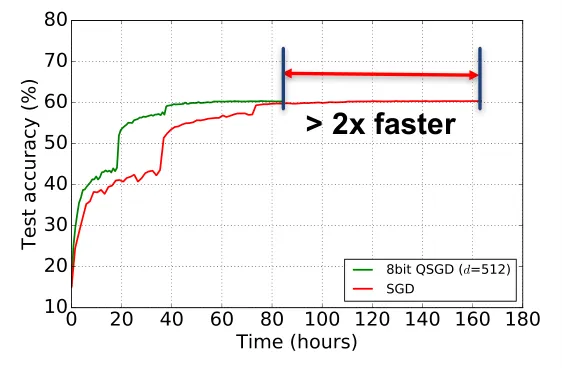

# QSGD: Communication-Efficient SGD via Gradient Quantization and Encoding

Dan Alistarh Affiliation: IST Austria & ETH Zurich
Email: [dan.alistarh@ist.ac.at](mailto:)    Demjan Grubic
Affiliation: ETH Zurich & Google
Email: [demjangrubic@gmail.com](mailto:)    Jerry Z. Li Affiliation: MIT
Email: [jerryzli@mit.edu](mailto:)    Ryota Tomioka
Affiliation: Microsoft Research Email: [ryoto@microsoft.com](mailto:)   
Milan Vojnovic Affiliation: London School of Economics
Email: [M.Vojnovic@lse.ac.uk](mailto:)

###### Abstract

Parallel implementations of stochastic gradient descent (SGD) have
received significant research attention, thanks to its excellent
scalability properties. A fundamental barrier when parallelizing SGD is
the high bandwidth cost of communicating gradient updates between nodes;
consequently, several lossy compresion heuristics have been proposed, by
which nodes only communicate _quantized_ gradients. Although effective
in practice, these heuristics do not always converge.

In this paper, we propose _Quantized SGD (QSGD)_, a family of
compression schemes with convergence guarantees and good practical
performance. QSGD allows the user to smoothly trade off _communication
bandwidth_ and _convergence time_: nodes can adjust the number of bits
sent per iteration, at the cost of possibly higher variance. We show
that this trade-off is inherent, in the sense that improving it past
some threshold would violate information-theoretic lower bounds. QSGD
guarantees convergence for convex and non-convex objectives, under
asynchrony, and can be extended to stochastic variance-reduced
techniques.

When applied to training deep neural networks for image classification
and automated speech recognition, QSGD leads to significant reductions
in end-to-end training time. For instance, on 16GPUs, we can train the
ResNet-152 network to full accuracy on ImageNet 1.8$`\times`$ faster
than the full-precision variant.

   

|     |
| --- |
|     |

## 1 Introduction

The surge of massive data has led to significant interest in
_distributed_ algorithms for scaling computations in the context of
machine learning and optimization. In this context, much attention has
been devoted to scaling large-scale _stochastic gradient descent_ (SGD)
algorithms \[33\], which can be briefly defined as follows. Let
$`f:\R^{n}\to\R`$ be a function which we want to minimize. We have
access to stochastic gradients $`\widetilde{g}`$ such that
$`\E[\widetilde{g}(\bm{x})]=\nabla f(\bm{x})`$. A standard instance of
SGD will converge towards the minimum by iterating the procedure

```math
\bm{x}_{t+1}=\bm{x}_{t}-\eta_{t}\widetilde{g}(\bm{x}_{t}), \tag{1}
```

where $`\bm{x}_{t}`$ is the current candidate, and $`\eta_{t}`$ is a
variable step-size parameter. Notably, this arises if we are given
i.i.d. data points $`X_{1},\ldots,X_{m}`$ generated from an unknown
distribution $`D`$, and a loss function $`\ell(X,\theta)`$, which
measures the loss of the model $`\theta`$ at data point $`X`$. We wish
to find a model $`\theta^{*}`$ which minimizes
$`f(\theta)=\E_{X\sim D}[\ell(X,\theta)]`$, the expected loss to the
data. This framework captures many fundamental tasks, such as neural
network training.

In this paper, we focus on _parallel_ SGD methods, which have received
considerable attention recently due to their high scalability \[6, 8,
32, 13\]. Specifically, we consider a setting where a large dataset is
partitioned among $`K`$ processors, which collectively minimize a
function $`f`$. Each processor maintains a local copy of the parameter
vector $`\bm{x}_{t}`$; in each iteration, it obtains a new stochastic
gradient update (corresponding to its local data). Processors then
broadcast their gradient updates to their peers, and aggregate the
gradients to compute the new iterate $`\bm{x}_{t+1}`$.

In most current implementations of parallel SGD, in each iteration, each
processor must communicate its entire gradient update to all other
processors. If the gradient vector is dense, each processor will need to
send and receive $`n`$ floating-point numbers _per iteration_ to/from
each peer to communicate the gradients and maintain the parameter vector
$`\bm{x}`$. In practical applications, communicating the gradients in
each iteration has been observed to be a significant performance
bottleneck \[35, 37, 8\].

One popular way to reduce this cost has been to perform *lossy
compression of the gradients* \[11, 1, 3, 10, 41\]. A simple
implementation is to simply _reduce precision_ of the representation,
which has been shown to converge under convexity and sparsity
assumptions \[10\]. A more drastic quantization technique is
*1BitSGD* \[35, 37\], which reduces each component of the gradient to
_just its sign_ (one bit), scaled by the average over the coordinates of
$`\widetilde{g}`$, accumulating errors locally. 1BitSGD was
experimentally observed to preserve convergence \[35\], under certain
conditions; thanks to the reduction in communication, it enabled
state-of-the-art scaling of deep neural networks (DNNs) for acoustic
modelling \[37\]. However, it is currently not known if 1BitSGD provides
any guarantees, even under strong assumptions, and it is not clear if
higher compression is achievable.

#### Contributions.

Our focus is understanding the trade-offs between the _communication
cost_ of data-parallel SGD, and its _convergence guarantees_. We propose
a family of algorithms allowing for lossy compression of gradients
called _Quantized SGD (QSGD)_, by which processors can trade-off the
number of bits communicated per iteration with the variance added to the
process.

QSGD is built on two algorithmic ideas. The first is an intuitive
_stochastic quantization_ scheme: given the gradient vector at a
processor, we _quantize_ each component by randomized rounding to a
discrete set of values, in a principled way which preserves the
statistical properties of the original. The second step is an efficient
lossless code for quantized gradients, which exploits their statistical
properties to generate efficient encodings. Our analysis gives tight
bounds on the precision-variance trade-off induced by QSGD.

At one extreme of this trade-off, we can guarantee that each processor
transmits at most $`\sqrt{n}(\log n+O(1))`$ expected bits per iteration,
while increasing variance by at most a $`\sqrt{n}`$ multiplicative
factor. At the other extreme, we show that each processor can transmit
$`\leq 2.8n+32`$ bits per iteration in expectation, while increasing
variance by a only a factor of $`2`$. In particular, in the latter
regime, compared to full precision SGD, we use $`\approx 2.8n`$ bits of
communication per iteration as opposed to $`32n`$ bits, and guarantee at
most $`2\times`$ more iterations, leading to bandwidth savings of
$`\approx 5.7\times`$.

QSGD is fairly general: it can also be shown to converge, under
assumptions, to local minima for non-convex objectives, as well as under
asynchronous iterations. One non-trivial extension we develop is a
*stochastic variance-reduced* \[23\] variant of QSGD, called QSVRG,
which has exponential convergence rate.

One key question is whether QSGD’s compression-variance trade-off is
_inherent_: for instance, does any algorithm guaranteeing at most
constant variance blowup need to transmit $`\Omega(n)`$ bits per
iteration? The answer is positive: improving asymptotically upon this
trade-off would break the communication complexity lower bound of
distributed mean estimation (see \[44, Proposition 2\] and \[38\]).

#### Experiments.

The crucial question is whether, in practice, QSGD can reduce
communication cost by enough to offset the overhead of any additional
iterations to convergence. The answer is yes. We explore the
practicality of QSGD on a variety of state-of-the-art datasets and
machine learning models: we examine its performance in training networks
for image classification tasks (AlexNet, Inception, ResNet, and VGG) on
the ImageNet \[12\] and CIFAR-10 \[25\] datasets, as well as on
LSTMs \[19\] for speech recognition. We implement QSGD in Microsoft
CNTK \[3\].

Experiments show that all these models can significantly benefit from
reduced communication when doing multi-GPU training, _with virtually no
accuracy loss_, and _under standard parameters_. For example, when
training AlexNet on 16 GPUs with standard parameters, the reduction in
communication time is $`4\times`$, and the reduction in training to the
network’s top accuracy is $`2.5\times`$. When training an LSTM on two
GPUs, the reduction in communication time is $`6.8\times`$, while the
reduction in training time to the same target accuracy is $`2.7\times`$.
Further, even computationally-heavy architectures such as Inception and
ResNet can benefit from the reduction in communication: on 16GPUs, QSGD
reduces the end-to-end convergence time of ResNet152 by approximately
$`2\times`$. Networks trained with QSGD can converge to virtually the
same accuracy as full-precision variants, and that gradient quantization
may even slightly _improve_ accuracy in some settings.

#### Related Work.

One line of related research studies the _communication complexity_ of
convex optimization. In particular, \[40\] studied two-processor convex
minimization in the same model, provided a lower bound of
$`\Omega(n(\log n+\log(1/\epsilon)))`$ bits on the communication cost of
$`n`$-dimensional convex problems, and proposed a _non-stochastic_
algorithm for strongly convex problems, whose communication cost is
within a log factor of the lower bound. By contrast, our focus is on
_stochastic_ gradient methods. Recent work \[5\] focused on _round
complexity_ lower bounds on the number of _communication rounds_
necessary for convex learning.

Buckwild! \[10\] was the first to consider the convergence guarantees of
low-precision SGD. It gave upper bounds on the error probability of SGD,
assuming unbiased stochastic quantization, convexity, and gradient
sparsity, and showed significant speedup when solving convex problems on
CPUs. QSGD refines these results by focusing on the trade-off between
communication and convergence. We view quantization as an independent
source of variance for SGD, which allows us to employ standard
convergence results \[7\]. The main differences from Buckwild! are
that 1) we focus on the variance-precision trade-off; 2) our results
apply to the quantized non-convex case; 3) we validate the practicality
of our scheme on neural network training on GPUs. Concurrent work
proposes TernGrad \[41\], which starts from a similar stochastic
quantization, but focuses on the case where individual gradient
components can have only three possible values. They show that
significant speedups can be achieved on TensorFlow \[1\], while
maintaining accuracy within a few percentage points relative to full
precision. The main differences to our work are: 1) our implementation
guarantees convergence under standard assumptions; 2) we strive to
provide a black-box compression technique, with no additional
hyperparameters to tune; 3) experimentally, QSGD maintains the same
accuracy within the same target number of epochs; for this, we allow
gradients to have larger bit width; 4) our experiments focus on the
single-machine multi-GPU case.

We note that QSGD can be applied to solve the distributed mean
estimation problem \[38, 24\] with an optimal error-communication
trade-off in some regimes. In contrast to the elegant random rotation
solution presented in \[38\], QSGD employs quantization and Elias
coding. Our use case is different from the federated learning
application of \[38, 24\], and has the advantage of being more efficient
to compute on a GPU.

There is an extremely rich area studying algorithms and systems for
efficient distributed large-scale learning, e.g. \[6, 11, 1, 3, 39, 32,
10, 21, 43\]. Significant interest has recently been dedicated to
_quantized_ frameworks, both for inference, e.g., \[1, 17\] and
training \[45, 35, 20, 37, 16, 10, 42\]. In this context, \[35\]
proposed 1BitSGD, a heuristic for compressing gradients in SGD, inspired
by delta-sigma modulation \[34\]. It is implemented in Microsoft CNTK,
and has a cost of $`n`$ bits and two floats per iteration. Variants of
it were shown to perform well on large-scale Amazon datasets by \[37\].
Compared to 1BitSGD, QSGD can achieve asymptotically higher compression,
provably converges under standard assumptions, and shows superior
practical performance in some cases.

## 2 Preliminaries

SGD has many variants, with different preconditions and guarantees. Our
techniques are rather portable, and can usually be applied in a
black-box fashion on top of SGD. For conciseness, we will focus on a
basic SGD setup. The following assumptions are standard; see e.g. \[7\].

Let $`\mathcal{X}\subseteq\R^{n}`$ be a known convex set, and let
$`f:\mathcal{X}\to\R`$ be differentiable, convex, smooth, and unknown.
We assume repeated access to stochastic gradients of $`f`$, which on
(possibly random) input $`\bm{x}`$, outputs a direction which is in
expectation the correct direction to move in. Formally:

###### Definition 2.1.

Fix $`f:\mathcal{X}\to\R`$. A _stochastic gradient_ for $`f`$ is a
random function $`\widetilde{g}(\bm{x})`$ so that
$`\E[\widetilde{g}(\bm{x})]=\nabla f(\bm{x})`$. We say the stochastic
gradient has second moment at most $`B`$ if
$`\E[\|\widetilde{g}\|_{2}^{2}]\leq B`$ for all $`x\in\mathcal{X}`$. We
say it has variance at most $`\sigma^{2}`$ if
$`\E[\|\widetilde{g}(\bm{x})-\nabla f(\bm{x})\|_{2}^{2}]\leq\sigma^{2}`$
for all $`x\in\mathcal{X}`$.

Observe that any stochastic gradient with second moment bound $`B`$ is
automatically also a stochastic gradient with variance bound
$`\sigma^{2}=B`$, since
$`\E[\|\widetilde{g}(\bm{x})-\nabla f(\bm{x})\|^{2}]\leq\E[\|\widetilde{g}(\bm{x})\|^{2}]`$
as long as $`\E[\widetilde{g}(\bm{x})]=\nabla f(\bm{x})`$. Second, in
convex optimization, one often assumes a second moment bound when
dealing with non-smooth convex optimization, and a variance bound when
dealing with smooth convex optimization. However, for us it will be
convenient to consistently assume a second moment bound. This does not
seem to be a major distinction in theory or in practice \[7\].

Given access to stochastic gradients, and a starting point
$`\bm{x}_{0}`$, SGD builds iterates $`\bm{x}_{t}`$ given by Equation
(1), projected onto $`\mathcal{X}`$, where $`(\eta_{t})_{t\geq 0}`$ is a
sequence of step sizes. In this setting, one can show:

###### Theorem 2.1 (\[7\], Theorem 6.3).

Let $`\mathcal{X}\subseteq\R^{n}`$ be convex, and let
$`f:\mathcal{X}\to\R`$ be unknown, convex, and $`L`$-smooth. Let
$`\bm{x}_{0}\in\mathcal{X}`$ be given, and let
$`R^{2}=\sup_{x\in\mathcal{X}}\|\bm{x}-\bm{x}_{0}\|^{2}`$. Let $`T>0`$
be fixed. Given repeated, independent access to stochastic gradients
with variance bound $`\sigma^{2}`$ for $`f`$, SGD with initial point
$`\bm{x}_{0}`$ and constant step sizes
$`\eta_{t}=\frac{1}{L+1/\gamma}`$, where
$`\gamma=\frac{R}{\sigma}\sqrt{\frac{2}{T}}`$, achieves

```math
\displaystyle\E\left[f\left(\frac{1}{T}\sum_{t=0}^{T}\bm{x}_{t}\right)\right]-\min_{\bm{x}\in\mathcal{X}}f(\bm{x})\leq R\sqrt{\frac{2\sigma^{2}}{T}}+\frac{LR^{2}}{T}\;. \tag{2}
```

#### Minibatched SGD.

A modification to the SGD scheme presented above often observed in
practice is a technique known as _minibatching_. In minibatched SGD,
updates are of the form
$`\bm{x}_{t+1}=\Pi_{\mathcal{X}}(\bm{x}_{t}-\eta_{t}\widetilde{G}_{t}(\bm{x}_{t}))`$,
where
$`\widetilde{G}_{t}(\bm{x}_{t})=\frac{1}{m}\sum_{i=1}^{m}\widetilde{g}_{t,i}`$,
and where each $`\widetilde{g}_{t,i}`$ is an independent stochastic
gradient for $`f`$ at $`\bm{x}_{t}`$. It is not hard to see that if
$`\widetilde{g}_{t,i}`$ are stochastic gradients with variance bound
$`\sigma^{2}`$, then the $`\widetilde{G}_{t}`$ is a stochastic gradient
with variance bound $`\sigma^{2}/m`$. By inspection of Theorem 2.1, as
long as the first term in (2) dominates, minibatched SGD requires
$`1/m`$ fewer iterations to converge.

#### Data-Parallel SGD.

We consider synchronous _data-parallel_ SGD, modelling real-world
multi-GPU systems, and focus on the communication cost of SGD in this
setting. We have a set of $`K`$ processors $`p_{1},p_{2},\ldots,p_{K}`$
who proceed in synchronous steps, and communicate using point-to-point
messages. Each processor maintains a local copy of a vector $`\bm{x}`$
of dimension $`n`$, representing the current estimate of the minimizer,
and has access to private, independent stochastic gradients for $`f`$.

Data: Local copy of the parameter vector $`\bm{x}`$ 1 for _each
iteration $`t`$_ do     2 Let $`\widetilde{g}^{i}_{t}`$ be an
independent stochastic gradient ;     3
$`\boxed{M^{i}\leftarrow\mathord{\sf Encode}(\widetilde{g}^{i}(\bm{x}))}`$
//encode gradients ;     4 $`\mathord{\sf broadcast}`$ $`M^{i}`$ to all
peers;     5 for _each peer $`\ell`$_ do        6
$`\mathord{\sf receive}`$ $`M^{\ell}`$ from peer $`\ell`$;        7
$`\boxed{\widehat{g}^{\ell}\leftarrow\mathord{\sf Decode}(M^{\ell})}`$
//decode gradients ;     8 end for     9
$`\bm{x}_{t+1}\leftarrow\bm{x}_{t}-(\eta_{t}/K)\sum_{\ell=1}^{K}\widehat{g}^{\ell}`$;
10 end for Algorithm 1 Parallel SGD Algorithm. ![[Uncaptioned
image]](arxiv-1610-02132--c993d0df67d5.figures/figure-1.webp) Figure 1:
An illustration of generalized stochastic quantization with $`5`$
levels.

In each synchronous iteration, described in Algorithm 1, each processor
aggregates the value of $`\bm{x}`$, then obtains random gradient updates
for each component of $`\bm{x}`$, then communicates these updates to all
peers, and finally aggregates the received updates and applies them
locally. Importantly, we add _encoding_ and _decoding_ steps for the
gradients before and after send/receive in lines 2 and 1, respectively.
In the following, whenever describing a variant of SGD, we assume the
above general pattern, and only specify the _encode/decode_ functions.
Notice that the decoding step does not necessarily recover the original
gradient $`\widetilde{g}^{\ell}`$; instead, we usually apply an
_approximate_ version.

When the encoding and decoding steps are the identity (i.e., no encoding
/ decoding), we shall refer to this algorithm as _parallel SGD_. In this
case, it is a simple calculation to see that at each processor, if
$`\bm{x}_{t}`$ was the value of $`\bm{x}`$ that the processors held
before iteration $`t`$, then the updated value of $`\bm{x}`$ by the end
of this iteration is
$`\bm{x}_{t+1}=\bm{x}_{t}-(\eta_{t}/K)\sum_{\ell=1}^{K}\widetilde{g}^{\ell}(\bm{x}_{t})`$,
where each $`\widetilde{g}^{\ell}`$ is a stochatic gradient. In
particular, this update is merely a minibatched update of size $`K`$.
Thus, by the discussion above, and by rephrasing Theorem 2.1, we have
the following corollary:

###### Corollary 2.2.

Let $`\mathcal{X},f,L,\bm{x}_{0}`$, and $`R`$ be as in Theorem 2.1. Fix
$`\epsilon>0`$. Suppose we run parallel SGD on $`K`$ processors, each
with access to independent stochastic gradients with second moment bound
$`B`$, with step size $`\eta_{t}=1/(L+\sqrt{K}/\gamma)`$, where
$`\gamma`$ is as in Theorem 2.1. Then if

```math
T=O\left(R^{2}\cdot\max\left(\frac{2B}{K\epsilon^{2}},\frac{L}{\epsilon}\right)\right),\textnormal{ then }\E\left[f\left(\frac{1}{T}\sum_{t=0}^{T}\bm{x}_{t}\right)\right]-\min_{\bm{x}\in\mathcal{X}}f(\bm{x})\leq\epsilon. \tag{3}
```

In most reasonable regimes, the first term of the max in (3) will
dominate the number of iterations necessary. Specifically, the number of
iterations will depend linearly on the second moment bound $`B`$.

## 3 Quantized Stochastic Gradient Descent (QSGD)

In this section, we present our main results on stochastically quantized
SGD. Throughout, $`\log`$ denotes the base-2 logarithm, and the number
of bits to represent a float is $`32`$. For any vector
$`\bm{v}\in\R^{n}`$, we let $`\|\bm{v}\|_{0}`$ denote the number of
nonzeros of $`\bm{v}`$. For any string $`\omega\in\{0,1\}^{*}`$, we will
let $`|\omega|`$ denote its length. For any scalar $`x\in\R`$, we let
$`\text{sgn}\left(x\right)\in\{-1,+1\}`$ denote its sign, with
$`\text{sgn}\left(0\right)=1`$.

### 3.1 Generalized Stochastic Quantization and Coding

#### Stochastic Quantization.

We now consider a general, parametrizable lossy-compression scheme for
stochastic gradient vectors. The quantization function is denoted with
$`Q_{s}(\bm{v})`$, where $`s\geq 1`$ is a tuning parameter,
corresponding to the number of quantization levels we implement.
Intuitively, we define $`s`$ uniformly distributed levels between $`0`$
and $`1`$, to which each value is quantized in a way which preserves the
value in expectation, and introduces minimal variance. Please see
Figure 1.

For any $`\bm{v}\in\R^{n}`$ with $`\bm{v}\neq\bm{0}`$, $`Q_{s}(\bm{v})`$
is defined as

```math
Q_{s}(v_{i})=\|\bm{v}\|_{2}\cdot\text{sgn}\left(v_{i}\right)\cdot\xi_{i}(\bm{v},s)\;, \tag{4}
```

where $`\xi_{i}(\bm{v},s)`$’s are independent random variables defined
as follows. Let $`0\leq\ell<s`$ be an integer such that
$`|v_{i}|/\|\bm{v}\|_{2}\in[\ell/s,(\ell+1)/s]`$. That is,
$`[\ell/s,(\ell+1)/s]`$ is the quantization interval corresponding to
$`|v_{i}|/\|\bm{v}\|_{2}`$. Then

```math
\displaystyle\xi_{i}(\bm{v},s)=\left\{\begin{array}[]{ll}\ell/s&\mbox{with probability $1-p\left(\frac{|v_{i}|}{\|\bm{v}\|_{2}},s\right)$};\\
(\ell+1)/s&\mbox{otherwise}.\end{array}\right.
```

Here, $`p(a,s)=as-\ell`$ for any $`a\in[0,1]`$. If $`\bm{v}=\bm{0}`$,
then we define $`Q(\bm{v},s)=\bm{0}`$.

The distribution of $`\xi_{i}(\bm{v},s)`$ has minimal variance over
distributions with support $`\{0,1/s,\ldots,1\}`$, and its expectation
satisfies $`\E[\xi_{i}(\bm{v},s)]=|v_{i}|/\|\bm{v}\|_{2}`$. Formally, we
can show:

###### Lemma 3.1.

For any vector $`\bm{v}\in\R^{n}`$, we have that (i)
$`\E[Q_{s}(\bm{v})]=\bm{v}`$ (unbiasedness), (ii)
$`\E[\|Q_{s}(\bm{v})-\bm{v}\|_{2}^{2}]\leq\min(n/{s^{2}},\sqrt{n}/s)\|\bm{v}\|_{2}^{2}`$
(variance bound), and (iii)
$`\E[\|Q_{s}(\bm{v})\|_{0}]\leq s(s+\sqrt{n})`$ (sparsity).

#### Efficient Coding of Gradients.

Observe that for any vector $`\bm{v}`$, the output of $`Q_{s}(\bm{v})`$
is naturally expressible by a tuple
$`(\|\bm{v}\|_{2},\bm{\sigma},\bm{\zeta})`$, where $`\bm{\sigma}`$ is
the vector of signs of the $`\bm{v}_{i}`$’s and $`\bm{\zeta}`$ is the
vector of integer values $`s\cdot\xi_{i}(\bm{v},s)`$. The key idea
behind the coding scheme is that not all integer values
$`s\cdot\xi_{i}(\bm{v},s)`$ can be equally likely: in particular,
_larger integers are less frequent_. We will exploit this via a
specialized _Elias_ integer encoding \[14\].

Intuitively, for any positive integer $`k`$, its code, denoted
$`\mathrm{Elias}(k)`$, starts from the binary representation of $`k`$,
to which it prepends the _length_ of this representation. It then
recursively encodes this prefix. We show that for any positive integer
$`k`$, the length of the resulting code has
$`|\mathrm{Elias}(k)|=\log k+\log\log k+\ldots+1\leq(1+o(1))\log k+1`$,
and that encoding and decoding can be done efficiently.

Given a gradient vector represented as the triple
$`(\|\bm{v}\|_{2},\bm{\sigma},\bm{\zeta})`$, with $`s`$ quantization
levels, our coding outputs a string $`S`$ defined as follows. First, it
uses $`32`$ bits to encode $`\|\bm{v}\|_{2}`$. It proceeds to encode
using Elias recursive coding the position of the first nonzero entry of
$`\bm{\zeta}`$. It then appends a bit denoting $`\bm{\sigma}_{i}`$ and
follows that with $`\mathrm{Elias}(s\cdot\xi_{i}(\bm{v},s))`$.
Iteratively, it proceeds to encode the distance from the current
coordinate of $`\bm{\zeta}`$ to the next nonzero, and encodes the
$`\bm{\sigma}_{i}`$ and $`\bm{\zeta}_{i}`$ for that coordinate in the
same way. The decoding scheme is straightforward: we first read off
$`32`$ bits to construct $`\|\bm{v}\|_{2}`$, then iteratively use the
decoding scheme for Elias recursive coding to read off the positions and
values of the nonzeros of $`\bm{\zeta}`$ and $`\bm{\sigma}`$. The
properties of the quantization and of the encoding imply the following.

###### Theorem 3.2.

Let $`f:\R^{n}\to\R`$ be fixed, and let $`\bm{x}\in\R^{n}`$ be
arbitrary. Fix $`s\geq 2`$ quantization levels. If
$`\widetilde{g}(\bm{x})`$ is a stochastic gradient for $`f`$ at
$`\bm{x}`$ with second moment bound $`B`$, then
$`Q_{s}(\widetilde{g}(\bm{x}))`$ is a stochastic gradient for $`f`$ at
$`\bm{x}`$ with variance bound
$`\min\left(\frac{n}{s^{2}},\frac{\sqrt{n}}{s}\right)B`$. Moreover,
there is an encoding scheme so that in expectation, the number of bits
to communicate $`Q_{s}(\widetilde{g}(\bm{x}))`$ is upper bounded by

```math
\displaystyle\left(3+\left(\frac{3}{2}+o(1)\right)\log\left(\frac{2(s^{2}+n)}{s(s+\sqrt{n})}\right)\right)s(s+\sqrt{n})+32.
```

#### Sparse Regime.

For the case $`s=1`$, i.e., quantization levels $`0`$, $`1`$, and
$`-1`$, the gradient density is $`O(\sqrt{n})`$, while the second-moment
blowup is $`\leq\sqrt{n}`$. Intuitively, this means that we will employ
$`O(\sqrt{n}\log n)`$ bits per iteration, while the convergence time is
increased by $`O(\sqrt{n})`$.

#### Dense Regime.

The variance blowup is minimized to at most 2 for $`s=\sqrt{n}`$
quantization levels; in this case, we devise a more efficient encoding
which yields an order of magnitude shorter codes compared to the
full-precision variant. The proof of this statement is not entirely
obvious, as it exploits both the statistical properties of the
quantization and the guarantees of the Elias coding.

###### Corollary 3.3.

Let $`f,\bm{x}`$, and $`\widetilde{g}(\bm{x})`$ be as in Theorem 3.2.
There is an encoding scheme for $`Q_{\sqrt{n}}(\widetilde{g}(\bm{x}))`$
which in expectation has length at most $`2.8n+32.`$

### 3.2 QSGD Guarantees

Putting the bounds on the communication and variance given above with
the guarantees for SGD algorithms on smooth, convex functions yield the
following results:

###### Theorem 3.4 (Smooth Convex QSGD).

Let $`\mathcal{X},f,L,\bm{x}_{0}`$, and $`R`$ be as in Theorem 2.1. Fix
$`\epsilon>0`$. Suppose we run parallel QSGD with $`s`$ quantization
levels on $`K`$ processors accessing independent stochastic gradients
with second moment bound $`B`$, with step size
$`\eta_{t}=1/(L+\sqrt{K}/\gamma)`$, where $`\gamma`$ is as in Theorem
2.1 with $`\sigma=B^{\prime}`$, where
$`B^{\prime}=\min\left(\frac{n}{s^{2}},\frac{\sqrt{n}}{s}\right)B`$.
Then if
$`T=O\left(R^{2}\cdot\max\left(\frac{2B^{\prime}}{K\epsilon^{2}},\frac{L}{\epsilon}\right)\right),\textnormal{ then }\E\left[f\left(\frac{1}{T}\sum_{t=0}^{T}\bm{x}_{t}\right)\right]-\min_{\bm{x}\in\mathcal{X}}f(\bm{x})\leq\epsilon.`$
Moreover, QSGD requires
$`\left(3+\left(\frac{3}{2}+o(1)\right)\log\left(\frac{2(s^{2}+n)}{s^{2}+\sqrt{n}}\right)\right)(s^{2}+\sqrt{n})+32`$
bits of communication per round. In the special case when
$`s=\sqrt{n}`$, this can be reduced to $`2.8n+32`$.

QSGD is quite portable, and can be applied to almost any stochastic
gradient method. For illustration, we can use quantization along with
\[15\] to get communication-efficient non-convex SGD.

###### Theorem 3.5 (QSGD for smooth non-convex optimization).

Let $`f:\R^{n}\to\R`$ be a $`L`$-smooth (possibly nonconvex) function,
and let $`\bm{x}_{1}`$ be an arbitrary initial point. Let $`T>0`$ be
fixed, and $`s>0`$. Then there is a random stopping time $`R`$ supported
on $`\{1,\ldots,N\}`$ so that QSGD with quantization level $`s`$,
constant stepsizes $`\eta=O(1/L)`$ and access to stochastic gradients of
$`f`$ with second moment bound $`B`$ satisfies
$`\frac{1}{L}\E\left[\|\nabla f(\bm{x})\|_{2}^{2}\right]\leq O\left(\frac{\sqrt{L(f(\bm{x}_{1})-f^{*})}}{N}+\frac{\min(n/s^{2},\sqrt{n}/s)B}{L}\right).`$
Moreover, the communication cost is the same as in Theorem 3.4.

### 3.3 Quantized Variance-Reduced SGD

Assume we are given $`K`$ processors, and a parameter $`m>0`$, where
each processor $`i`$ has access to functions
$`\{f_{im/K},\ldots,f_{(i+1)m/K-1}\}`$. The goal is to approximately
minimize $`f=\frac{1}{m}\sum_{i=1}^{m}f_{i}`$. For processor $`i`$, let
$`h_{i}=\frac{1}{m}\sum_{j=im/K}^{(i+1)m/K-1}f_{i}`$ be the portion of
$`f`$ that it knows, so that $`f=\sum_{i=1}^{K}h_{i}`$.

A natural question is whether we can apply stochastic quantization to
reduce communication for parallel SVRG. Upon inspection, we notice that
the resulting update will break standard SVRG. We resolve this technical
issue, proving one can quantize SVRG updates using our techniques and
still obtain the same convergence bounds.

#### Algorithm Description.

Let $`\widetilde{Q}(\bm{v})=Q(\bm{v},\sqrt{n})`$, where $`Q(\bm{v},s)`$
is defined as in Section 3.1. Given arbitrary starting point
$`\bm{x}_{0}`$, we let $`\bm{y}^{(1)}=\bm{x}_{0}`$. At the beginning of
epoch $`p`$, each processor broadcasts $`\nabla h_{i}(\bm{y}^{(p)})`$,
that is, the unquantized full gradient, from which the processors each
aggregate
$`\nabla f(\bm{y}^{(p)})=\sum_{i=1}^{m}\nabla h_{i}(\bm{y}^{(p)})`$.
Within each epoch, for each iteration $`t=1,\ldots,T`$, and for each
processor $`i=1,\ldots,K`$, we let $`j^{(p)}_{i,t}`$ be a uniformly
random integer from $`[m]`$ completely independent from everything else.
Then, in iteration $`t`$ in epoch $`p`$, processor $`i`$ broadcasts the
update vector
$`\bm{u}^{(p)}_{t,i}=\widetilde{Q}\left(\nabla f_{j^{(p)}_{i,t}}(\bm{x}^{(p)}_{t})-\nabla f_{j^{(p)}_{i,t}}(\bm{y}^{(p)})+\nabla f(\bm{y}^{(p)})\right).`$

Each processor then computes the total update
$`\bm{u}^{(p)}_{t}=\frac{1}{K}\sum_{i=1}^{K}\bm{u}_{t,i}`$, and sets
$`\bm{x}^{(p)}_{t+1}=\bm{x}^{(p)}_{t}-\eta\bm{u}^{(p)}_{t}`$. At the end
of epoch $`p`$, each processor sets
$`\bm{y}^{(p+1)}=\frac{1}{T}\sum_{t=1}^{T}\bm{x}^{(p)}_{t}`$. We can
prove the following.

###### Theorem 3.6.

Let $`f(\bm{x})=\frac{1}{m}\sum_{i=1}^{m}f_{i}(\bm{x})`$, where $`f`$ is
$`\ell`$-strongly convex, and $`f_{i}`$ are convex and $`L`$-smooth, for
all $`i`$. Let $`\bm{x}^{*}`$ be the unique minimizer of $`f`$ over
$`\R^{n}`$. Then, if $`\eta=O(1/L)`$ and $`T=O(L/\ell)`$, then QSVRG
with initial point $`\bm{y}^{(1)}`$ ensures
$`\E\left[f(\bm{y}^{(p+1)})\right]-f(\bm{x^{*}})\leq 0.9^{p}\left(f(\bm{y}^{(1)})-f(\bm{x}^{*})\right),`$
for any epoch $`p\geq 1`$. Moreover, QSVRG with $`T`$ iterations per
epoch requires $`\leq(F+2.8n)(T+1)+Fn`$ bits of communication per epoch.

#### Discussion.

In particular, this allows us to largely decouple the dependence between
$`F`$ and the condition number of $`f`$ in the communication. Let
$`\kappa=L/\ell`$ denote the condition number of $`f`$. Observe that
whenever $`F\ll\kappa`$, the second term is subsumed by the first and
the per epoch communication is dominated by $`(F+2.8n)(T+1)`$.
Specifically, for any fixed $`\epsilon`$, to attain accuracy
$`\epsilon`$ we must take $`F=O(\log 1/\epsilon)`$. As long as
$`\log 1/\epsilon\geq\Omega(\kappa)`$, which is true for instance in the
case when $`\kappa\geq\poly\log(n)`$ and $`\epsilon\geq\poly(1/n)`$,
then the communication per epoch is $`O(\kappa(\log 1/\epsilon+n))`$.

#### Gradient Descent.

The full version of the paper \[4\] contains an application of QSGD to
gradient descent. Roughly, in this case, QSGD can simply truncate the
gradient to its top components, sorted by magnitude.

## 4 QSGD Variants

Our experiments will stretch the theory, as we use deep networks, with
non-convex objectives. (We have also tested QSGD for convex objectives.
Results closely follow the theory, and are therefore omitted.) Our
implementations will depart from the previous algorithm description as
follows.

First, we notice that the we can control the variance the quantization
by quantizing into _buckets_ of a fixed size $`d`$. If we view each
gradient as a one-dimensional vector $`\bm{v}`$, reshaping tensors if
necessary, a _bucket_ will be defined as a set of $`d`$ consecutive
vector values. (E.g. the $`i`$th bucket is the sub-vector
$`v[(i-1)d+1:i\cdot d]`$.) We will quantize each bucket _independently_,
using QSGD. Setting $`d=1`$ corresponds to no quantization (vanilla
SGD), and $`d=n`$ corresponds to full quantization, as described in the
previous section. It is easy to see that, using bucketing, the
guarantees from Lemma 3.1 will be expressed in terms of $`d`$, as
opposed to the full dimension $`n`$. This provides a knob by which we
can control variance, at the cost of storing an extra scaling factor on
every $`d`$ bucket values. As an example, if we use a bucket size of
$`512`$, and $`4`$ bits, the variance increase due to quantization will
be upper bounded by only $`\sqrt{512}/2^{4}\simeq 1.41`$. This provides
a theoretical justification for the similar convergence rates we observe
in practice.

The second difference from the theory is that we will scale by the
_maximum_ value of the vector (as opposed to the $`2`$-norm).
Intuitively, normalizing by the max preserves more values, and has
slightly higher accuracy for the same number of iterations. Both methods
have the same baseline bandwidth reduction because of lower bit width
(e.g. 32 bits to 2 bits per dimension), but normalizing by the max no
longer provides any sparsity guarantees. We note that this does not
affect our bounds in the regime where we use $`\Theta(\sqrt{n})`$
quantization levels per component, as we employ no sparsity in that
case. (However, we note that in practice max normalization also
generates non-trivial sparsity.)

## 5 Experiments

Figure 2: Breakdown of communication versus computation for various
neural networks, on $`2,4,8,16`$ GPUs, for full 32-bit precision versus
QSGD 4-bit. Each bar represents the total time for an epoch under
standard parameters. Epoch time is broken down into _communication_
(bottom, solid) and _computation_ (top, transparent). Although epoch
time _diminishes_ as we parallelize, the proportion of communication
_increases_.

| Network      | Dataset  | Params. | Init. Rate | Top-1 (32bit) | Top-1 (QSGD)   | Speedup (8 GPUs)           |
| ------------ | -------- | ------- | ---------- | ------------- | -------------- | -------------------------- |
| AlexNet      | ImageNet | 62M     | 0.07       | 59.50%        | 60.05% (4bit)  | 2.05 $`\times`$            |
| ResNet152    | ImageNet | 60M     | 1          | 77.0%         | 76.74% (8bit)  | 1.56 $`\times`$            |
| ResNet50     | ImageNet | 25M     | 1          | 74.68%        | 74.76% (4bit)  | 1.26 $`\times`$            |
| ResNet110    | CIFAR-10 | 1M      | 0.1        | 93.86%        | 94.19% (4bit)  | 1.10 $`\times`$            |
| BN-Inception | ImageNet | 11M     | 3.6        | \-            | \-             | 1.16$`\times`$ (projected) |
| VGG19        | ImageNet | 143M    | 0.1        | \-            | \-             | 2.25$`\times`$ (projected) |
| LSTM         | AN4      | 13M     | 0.5        | 81.13%        | 81.15 % (4bit) | 2$`\times`$ (2 GPUs)       |

Table 1: Description of networks, final top-1 accuracy, as well as
end-to-end training speedup on 8GPUs.


(a) AlexNet Accuracy versus Time.

(b) LSTM error vs Time.

(c) ResNet50 Accuracy.

Figure 3: Accuracy numbers for different networks. Light blue lines
represent 32-bit accuracy.

#### Setup.

We performed experiments on Amazon EC2 p2.16xlarge instances, with 16
NVIDIA K80 GPUs. Instances have GPUDirect peer-to-peer communication,
but do not currently support NVIDIA NCCL extensions. We have implemented
QSGD on GPUs using the Microsoft Cognitive Toolkit (CNTK) \[3\]. This
package provides efficient (MPI-based) GPU-to-GPU communication, and
implements an optimized version of 1bit-SGD \[35\]. Our code is released
as open-source \[31\].

We execute two types of tasks: _image classification_ on ILSVRC 2015
(ImageNet) \[12\], CIFAR-10 \[25\], and MNIST \[27\], and _speech
recognition_ on the CMU AN4 dataset \[2\]. For vision, we experimented
with AlexNet \[26\], VGG \[36\], ResNet \[18\], and Inception with Batch
Normalization \[22\] deep networks. For speech, we trained an LSTM
network \[19\]. See Table 1 for details.

#### Protocol.

Our methodology emphasizes _zero error tolerance_, in the sense that we
always aim to preserve the accuracy of the networks trained. We used
standard sizes for the networks, with hyper-parameters optimized for the
32bit precision variant. (Unless otherwise stated, we use the default
networks and hyper-parameters optimized for full-precision CNTK 2.0.) We
increased batch size when necessary to balance communication and
computation for larger GPU counts, but never past the point where we
lose accuracy. We employed *double buffering* \[35\] to perform
communication and quantization concurrently with the computation.
Quantization usually benefits from lowering learning rates; yet, we
always run the 32bit learning rate, and decrease bucket size to reduce
variance. We will not quantize small gradient matrices ($`<10`$K
elements), since the computational cost of quantizing them significantly
exceeds the reduction in communication. However, in all experiments,
more than $`99\%`$ of all parameters are transmitted in quantized form.
We reshape matrices to fit bucket sizes, so that no receptive field is
split across two buckets.

#### Communication vs. Computation.

In the first set of experiments, we examine the ratio between
computation and communication costs during training, for increased
parallelism. The image classification networks are trained on ImageNet,
while LSTM is trained on AN4. We examine the cost breakdown for these
networks over a pass over the dataset (epoch). Figure 2 gives the
results for various networks for image classification. The variance of
epoch times is practically negligible (\<1%), hence we omit confidence
intervals.

Figure 2 leads to some interesting observations. First, based on the
ratio of communication to computation, we can roughly split networks
into _communication-intensive_ (AlexNet, VGG, LSTM), and
_computation-intensive_ (Inception, ResNet). For both network types, the
relative impact of communication _increases significantly_ as we
increase the number of GPUs. Examining the breakdown for the 32-bit
version, all networks could significantly benefit from reduced
communication. For example, for AlexNet on 16 GPUs with batch size 1024,
more than $`80\%`$ of training time is spent on communication, whereas
for LSTM on 2 GPUs with batch size 256, the ratio is $`71\%`$. (These
ratios can be slightly changed by increasing batch size, but this can
decrease accuracy, see e.g. \[21\].)

Next, we examine the impact of QSGD on communication and overall
training time. (Communication time includes time spent compressing and
uncompressing gradients.) We measured QSGD with 2-bit quantization and
128 bucket size, and 4-bit and 8-bit quantization with 512 bucket size.
The results for these two variants are similar, since the different
bucket sizes mean that the 4bit version only sends $`77\%`$ more data
than the 2-bit version (but $`\sim 8\times`$ less than 32-bit). These
bucket sizes are chosen to ensure good convergence, but are not
carefully tuned.

On 16GPU AlexNet with batch size 1024, 4-bit QSGD reduces communication
time by $`4\times`$, and overall epoch time by $`2.5\times`$. On LSTM,
it reduces communication time by $`6.8\times`$, and overall epoch time
by $`2.7\times`$. Runtime improvements are non-trivial for all
architectures we considered.

#### Accuracy.

We now examine how QSGD influences accuracy and convergence rate. We ran
AlexNet and ResNet to full convergence on ImageNet, LSTM on AN4,
ResNet110 on CIFAR-10, as well as a two-layer perceptron on MNIST.
Results are given in Figure 5, and exact numbers are given in Table 1.
QSGD tests are performed on an 8GPU setup, and are compared against the
best known full-precision accuracy of the networks. In general, we
notice that 4bit or 8bit gradient quantization is sufficient to recover
or even slightly improve full accuracy, while ensuring non-trivial
speedup. Across all our experiments, 8-bit gradients with $`512`$ bucket
size have been sufficient to recover or improve upon the full-precision
accuracy. Our results are consistent with recent work \[30\] noting
benefits of adding noise to gradients when training deep networks. Thus,
quantization can be seen as a source of zero-mean noise, which happens
to render communication more efficient. At the same time, we note that
more aggressive quantization can hurt accuracy. In particular, 4-bit
QSGD with $`8192`$ bucket size (not shown) loses $`0.57\%`$ for top-5
accuracy, and $`0.68\%`$ for top-1, versus full precision on AlexNet
when trained for the same number of epochs. Also, QSGD with 2-bit and 64
bucket size has gap $`1.73\%`$ for top-1, and $`1.18\%`$ for top-1.

One issue we examined in more detail is which layers are more sensitive
to quantization. It appears that quantizing _convolutional layers_ too
aggressively (e.g., 2-bit precision) can lead to accuracy loss if
trained for the same period of time as the full precision variant.
However, increasing precision to 4-bit or 8-bit recovers accuracy. This
finding suggests that modern architectures for vision tasks, such as
ResNet or Inception, which are almost entirely convolutional, may
benefit less from quantization than recurrent deep networks such as
LSTMs.

#### Additional Experiments.

The full version of the paper contains additional experiments, including
a full comparison with 1BitSGD. In brief, QSGD outperforms or matches
the performance and final accuracy of 1BitSGD for the networks and
parameter values we consider.

## 6 Conclusions and Future Work

We have presented QSGD, a family of SGD algorithms which allow a smooth
trade off between the amount of communication per iteration and the
running time. Experiments suggest that QSGD is highly competitive with
the full-precision variant on a variety of tasks. There are a number of
optimizations we did not explore. The most significant is leveraging the
_sparsity_ created by QSGD. Current implementations of MPI do not
provide support for sparse types, but we plan to explore such support in
future work. Further, we plan to examine the potential of QSGD in
larger-scale applications, such as super-computing. On the theoretical
side, it is interesting to consider applications of quantization beyond
SGD.

The full version of this paper \[4\] contains complete proofs, as well
as additional applications.

## 7 Acknowledgments

The authors would like to thank Martin Jaggi, Ce Zhang, Frank Seide and
the CNTK team for their support during the development of this project,
as well as the anonymous NIPS reviewers for their careful consideration
and excellent suggestions. Dan Alistarh was supported by a Swiss
National Fund Ambizione Fellowship. Jerry Li was supported by the NSF
CAREER Award CCF-1453261, CCF-1565235, a Google Faculty Research Award,
and an NSF Graduate Research Fellowship. This work was developed in part
while Dan Alistarh, Jerri Li and Milan Vojnovic were with Microsoft
Research Cambridge, UK.

## References

- \[1\] Martın Abadi, Ashish Agarwal, Paul Barham, Eugene Brevdo,
  Zhifeng Chen, Craig Citro, Greg S Corrado, Andy Davis, Jeffrey Dean,
  Matthieu Devin, et al. Tensorflow: Large-scale machine learning on
  heterogeneous distributed systems. arXiv preprint
  arXiv:1603.04467, 2016.
- \[2\] Alex Acero. Acoustical and environmental robustness in automatic
  speech recognition, volume 201. Springer Science & Business
  Media, 2012.
- \[3\] Amit Agarwal, Eldar Akchurin, Chris Basoglu, Guoguo Chen, Scott
  Cyphers, Jasha Droppo, Adam Eversole, Brian Guenter, Mark Hillebrand,
  Ryan Hoens, et al. An introduction to computational networks and the
  computational network toolkit. Technical report, Tech. Rep.
  MSR-TR-2014-112, August 2014., 2014.
- \[4\] Dan Alistarh, Demjan Grubic, Jerry Li, Ryota Tomioka, and Milan
  Vojnovic. QSGD: Communication-efficient SGD via gradient quantization
  and encoding. arXiv preprint arXiv:1610.02132, 2016.
- \[5\] Yossi Arjevani and Ohad Shamir. Communication complexity of
  distributed convex learning and optimization. In NIPS, 2015.
- \[6\] Ron Bekkerman, Mikhail Bilenko, and John Langford. Scaling up
  machine learning: Parallel and distributed approaches. Cambridge
  University Press, 2011.
- \[7\] Sébastien Bubeck. Convex optimization: Algorithms and
  complexity. Foundations and Trends® in Machine Learning,
  8(3-4):231–357, 2015.
- \[8\] Trishul Chilimbi, Yutaka Suzue, Johnson Apacible, and Karthik
  Kalyanaraman. Project adam: Building an efficient and scalable deep
  learning training system. In OSDI, October 2014.
- \[9\] Cntk brainscript file for alexnet.
  [https://github.com/Microsoft/CNTK/tree/master/Examples/Image/Classification/AlexNet/BrainScript](https://github.com/Microsoft/CNTK/tree/master/Examples/Image/Classification/AlexNet/BrainScript).
  Accessed: 2017-02-24.
- \[10\] Christopher M De Sa, Ce Zhang, Kunle Olukotun, and Christopher
  Ré. Taming the wild: A unified analysis of hogwild-style algorithms.
  In NIPS, 2015.
- \[11\] Jeffrey Dean, Greg Corrado, Rajat Monga, Kai Chen, Matthieu
  Devin, Mark Mao, Andrew Senior, Paul Tucker, Ke Yang, Quoc V Le,
  et al. Large scale distributed deep networks. In NIPS, 2012.
- \[12\] Jia Deng, Wei Dong, Richard Socher, Li-Jia Li, Kai Li, and
  Li Fei-Fei. Imagenet: A large-scale hierarchical image database. In
  Computer Vision and Pattern Recognition, 2009. CVPR 2009. IEEE
  Conference on, pages 248–255. IEEE, 2009.
- \[13\] John C Duchi, Sorathan Chaturapruek, and Christopher Ré.
  Asynchronous stochastic convex optimization. NIPS, 2015.
- \[14\] Peter Elias. Universal codeword sets and representations of the
  integers. IEEE transactions on information theory,
  21(2):194–203, 1975.
- \[15\] Saeed Ghadimi and Guanghui Lan. Stochastic first- and
  zeroth-order methods for nonconvex stochastic programming. SIAM
  Journal on Optimization, 23(4):2341–2368, 2013.
- \[16\] Suyog Gupta, Ankur Agrawal, Kailash Gopalakrishnan, and Pritish
  Narayanan. Deep learning with limited numerical precision. In ICML,
  pages 1737–1746, 2015.
- \[17\] Song Han, Huizi Mao, and William J Dally. Deep compression:
  Compressing deep neural networks with pruning, trained quantization
  and huffman coding. arXiv preprint arXiv:1510.00149, 2015.
- \[18\] Kaiming He, Xiangyu Zhang, Shaoqing Ren, and Jian Sun. Deep
  residual learning for image recognition. In Proceedings of the IEEE
  Conference on Computer Vision and Pattern Recognition, pages
  770–778, 2016.
- \[19\] Sepp Hochreiter and Jürgen Schmidhuber. Long short-term memory.
  Neural computation, 9(8):1735–1780, 1997.
- \[20\] Itay Hubara, Matthieu Courbariaux, Daniel Soudry, Ran El-Yaniv,
  and Yoshua Bengio. Binarized neural networks. In Advances in Neural
  Information Processing Systems, pages 4107–4115, 2016.
- \[21\] Forrest N Iandola, Matthew W Moskewicz, Khalid Ashraf, and Kurt
  Keutzer. Firecaffe: near-linear acceleration of deep neural network
  training on compute clusters. In Proceedings of the IEEE Conference on
  Computer Vision and Pattern Recognition, pages 2592–2600, 2016.
- \[22\] Sergey Ioffe and Christian Szegedy. Batch normalization:
  Accelerating deep network training by reducing internal covariate
  shift. arXiv preprint arXiv:1502.03167, 2015.
- \[23\] Rie Johnson and Tong Zhang. Accelerating stochastic gradient
  descent using predictive variance reduction. In NIPS, 2013.
- \[24\] Jakub Konečnỳ. Stochastic, distributed and federated
  optimization for machine learning. arXiv preprint
  arXiv:1707.01155, 2017.
- \[25\] Alex Krizhevsky and Geoffrey Hinton. Learning multiple layers
  of features from tiny images, 2009.
- \[26\] Alex Krizhevsky, Ilya Sutskever, and Geoffrey E Hinton.
  Imagenet classification with deep convolutional neural networks. In
  Advances in neural information processing systems, pages
  1097–1105, 2012.
- \[27\] Yann LeCun, Corinna Cortes, and Christopher JC Burges. The
  mnist database of handwritten digits, 1998.
- \[28\] Mu Li, David G Andersen, Jun Woo Park, Alexander J Smola, Amr
  Ahmed, Vanja Josifovski, James Long, Eugene J Shekita, and Bor-Yiing
  Su. Scaling distributed machine learning with the parameter server. In
  OSDI, 2014.
- \[29\] Xiangru Lian, Yijun Huang, Yuncheng Li, and Ji Liu.
  Asynchronous parallel stochastic gradient for nonconvex optimization.
  In NIPS. 2015.
- \[30\] Arvind Neelakantan, Luke Vilnis, Quoc V Le, Ilya Sutskever,
  Lukasz Kaiser, Karol Kurach, and James Martens. Adding gradient noise
  improves learning for very deep networks. arXiv preprint
  arXiv:1511.06807, 2015.
- \[31\] Cntk implementation of qsgd.
  [https://gitlab.com/demjangrubic/QSGD](https://gitlab.com/demjangrubic/QSGD).
  Accessed: 2017-11-4.
- \[32\] Benjamin Recht, Christopher Re, Stephen Wright, and Feng Niu.
  Hogwild: A lock-free approach to parallelizing stochastic gradient
  descent. In NIPS, 2011.
- \[33\] Herbert Robbins and Sutton Monro. A stochastic approximation
  method. The Annals of Mathematical Statistics, pages 400–407, 1951.
- \[34\] Richard Schreier and Gabor C Temes. Understanding delta-sigma
  data converters, volume 74. IEEE Press, Piscataway, NJ, 2005.
- \[35\] Frank Seide, Hao Fu, Jasha Droppo, Gang Li, and Dong Yu. 1-bit
  stochastic gradient descent and its application to data-parallel
  distributed training of speech dnns. In INTERSPEECH, 2014.
- \[36\] Karen Simonyan and Andrew Zisserman. Very deep convolutional
  networks for large-scale image recognition. arXiv preprint
  arXiv:1409.1556, 2014.
- \[37\] Nikko Strom. Scalable distributed DNN training using commodity
  GPU cloud computing. In INTERSPEECH, 2015.
- \[38\] Ananda Theertha Suresh, Felix X Yu, H Brendan McMahan, and
  Sanjiv Kumar. Distributed mean estimation with limited communication.
  arXiv preprint arXiv:1611.00429, 2016.
- \[39\] Seiya Tokui, Kenta Oono, Shohei Hido, CA San Mateo, and Justin
  Clayton. Chainer: a next-generation open source framework for deep
  learning. In Proceedings of workshop on machine learning systems
  (LearningSys), 2015.
- \[40\] John N Tsitsiklis and Zhi-Quan Luo. Communication complexity of
  convex optimization. Journal of Complexity, 3(3), 1987.
- \[41\] Wei Wen, Cong Xu, Feng Yan, Chunpeng Wu, Yandan Wang, Yiran
  Chen, and Hai Li. Terngrad: Ternary gradients to reduce communication
  in distributed deep learning. arXiv preprint arXiv:1705.07878, 2017.
- \[42\] Hantian Zhang, Jerry Li, Kaan Kara, Dan Alistarh, Ji Liu, and
  Ce Zhang. Zipml: Training linear models with end-to-end low precision,
  and a little bit of deep learning. In International Conference on
  Machine Learning, pages 4035–4043, 2017.
- \[43\] Sixin Zhang, Anna E Choromanska, and Yann LeCun. Deep learning
  with elastic averaging sgd. In Advances in Neural Information
  Processing Systems, pages 685–693, 2015.
- \[44\] Yuchen Zhang, John Duchi, Michael I Jordan, and Martin J
  Wainwright. Information-theoretic lower bounds for distributed
  statistical estimation with communication constraints. In NIPS, 2013.
- \[45\] Shuchang Zhou, Yuxin Wu, Zekun Ni, Xinyu Zhou, He Wen, and
  Yuheng Zou. Dorefa-net: Training low bitwidth convolutional neural
  networks with low bitwidth gradients. arXiv preprint
  arXiv:1606.06160, 2016.

## Roadmap of the Appendix

## Appendix A Proof of Lemmas and Theorems

### A.1 Proof of Lemma 3.1

The first claim obviously holds. We thus turn our attention to the
second claim of the lemma. We first note the following bound:

```math
\displaystyle\E[\xi_{i}(\bm{v},s)^{2}] \displaystyle=\E[\xi_{i}(\bm{v},s)]^{2}+\E\left[\left(\xi_{i}(\bm{v},s)-\E[\xi_{i}(\bm{v},s)]\right)^{2}\right]
```

```math
\displaystyle=\frac{v_{i}^{2}}{\|\bm{v}\|_{2}^{2}}+\frac{1}{s^{2}}p\left(\frac{|v_{i}|}{\|\bm{v}\|_{2}},s\right)\left(1-p\left(\frac{|v_{i}|}{\|\bm{v}\|_{2}},s\right)\right)
```

```math
\displaystyle\leq\frac{v_{i}^{2}}{\|\bm{v}\|_{2}^{2}}+\frac{1}{s^{2}}p\left(\frac{|v_{i}|}{\|\bm{v}\|_{2}},s\right)\;.
```

Using this bound, we have

```math
\displaystyle\E[\|Q(\bm{v},s)\|^{2}] \displaystyle=\sum_{i=1}^{n}\E\left[\|\bm{v}\|_{2}^{2}\xi_{i}\left(\frac{|\bm{v}_{i}|}{\|\bm{v}\|_{2}},s\right)^{2}\right]
```

```math
\displaystyle\leq\|\bm{v}\|_{2}^{2}\sum_{i=1}^{n}\left[\frac{|\bm{v}_{i}|^{2}}{\|\bm{v}\|_{2}^{2}}+\frac{1}{s^{2}}p\left(\frac{|\bm{v}_{i}|}{\|\bm{v}\|_{2}},s\right)\right]
```

```math
\displaystyle=\left(1+\frac{1}{s^{2}}\sum_{i=1}^{n}p\left(\frac{|\bm{v}_{i}|}{\|\bm{v}\|_{2}},s\right)\right)\|\bm{v}\|_{2}^{2}
```

```math
\displaystyle\stackrel{{\scriptstyle a}}{{\leq}}\left(1+\min\left(\frac{n}{s^{2}},\frac{\|\bm{v}\|_{1}}{s\|\bm{v}\|_{2}}\right)\right)\|\bm{v}\|_{2}^{2}
```

```math
\displaystyle\leq\left(1+\min\left(\frac{n}{s^{2}},\frac{\sqrt{n}}{s}\right)\right)\|\bm{v}\|_{2}^{2}\;.
```

where (a) follows from the fact that $`p(a,s)\leq 1`$ and
$`p(a,s)\leq as`$. This immediately implies that
$`\E[\|Q(\bm{v},s)-\bm{v}\|_{2}^{2}]\leq\min\left(\frac{n}{s^{2}},\frac{\sqrt{n}}{s}\right)\cdot\|\bm{v}\|_{2}^{2}`$,
as claimed.

### A.2 A Compression Scheme for $`Q_{s}`$ Matching Theorem 3.2

In this section, we describe a scheme for coding $`Q_{s}`$ and provide
an upper bound for the expected number of information bits that it uses,
which gives the bound in Theorem 3.2.

Observe that for any vector $`\bm{v}`$, the output of $`Q(\bm{v},s)`$ is
naturally expressible by a tuple
$`(\|\bm{v}\|_{2},\bm{\sigma},\bm{\zeta})`$, where $`\bm{\sigma}`$ is
the vector of signs of the $`\bm{v}_{i}`$’s and $`\bm{\zeta}`$ is the
vector of $`\xi_{i}(\bm{v},s)`$ values. With a slight abuse of notation,
let us consider $`Q(\bm{v},s)`$ as a function from
$`\mathbb{R}\setminus\{0\}`$ to $`\mathcal{B}_{s}`$, where

```math
\displaystyle\mathcal{B}_{s}=\left\{(A,\bm{\sigma},\bm{z})\in\R\times\R^{n}\times\R^{n}:A\in\R_{\geq 0},\bm{\sigma}_{i}\in\{-1,+1\},\bm{z}_{i}\in\{0,1/s,\ldots,1\}\right\}\;.
```

We define a coding scheme that represents each tuple in
$`\mathcal{B}_{s}`$ with a codeword in $`\{0,1\}^{*}`$ according to a
mapping $`\mathrm{Code}_{s}:\mathcal{B}_{s}\to\{0,1\}^{*}`$.

To encode a single coordinate, we utilize a lossless encoding scheme for
positive integers known as _recursive Elias coding_ or _Elias omega
coding_.

###### Definition A.1.

Let $`k`$ be a positive integer. The _recursive Elias coding_ of $`k`$,
denoted $`\mathrm{Elias}(k)`$, is defined to be the $`\{0,1\}`$ string
constructed as follows. First, place a $`0`$ at the end of the string.
If $`k=0`$, then terminate. Otherwise, prepend the binary representation
of $`k`$ to the beginning of the code. Let $`k^{\prime}`$ be the number
of bits so prepended minus 1, and recursively encode $`k^{\prime}`$ in
the same fashion. To decode an recursive Elias coded integer, start with
$`N=1`$. Recursively, if the next bit is $`0`$, stop, and output $`N`$.
Otherwise, if the next bit is $`1`$, then read that bit and $`N`$
additional bits, and let that number in binary be the new $`N`$, and
repeat.

The following are well-known properties of the recursive Elias code
which are not too hard to prove.

###### Lemma A.1.

For any positive integer $`k`$, we have

1.  1.  $`|\mathrm{Elias}(k)|\leq\log k+\log\log k+\log\log\log k\ldots+1=(1+o(1))\log k+1`$.
2.  2.  The recursive Elias code of $`k`$ can be encoded and decoded in time
        $`O(|\mathrm{Elias}(k)|)`$.
3.  3.  Moreover, the decoding can be done without previously knowing a
        bound on the size of $`k`$.

Given a tuple $`(A,\bm{\sigma},\bm{z})\in\mathcal{B}_{s}`$, our coding
outputs a string $`S`$ defined as follows. First, it uses $`F`$ bits to
encode $`A`$. It proceeds to encode using Elias recursive coding the
position of the first nonzero entry of $`\bm{z}`$. It then appends a bit
denoting $`\bm{\sigma}_{i}`$ and follows that with
$`\mathrm{Elias}(s\bm{z}_{i})`$. Iteratively, it proceeds to encode the
distance from the current coordinate of $`\bm{z}`$ to the next nonzero
using $`c`$, and encodes the $`\bm{\sigma}_{i}`$ and $`\bm{z}_{i}`$ for
that coordinate in the same way. The decoding scheme is also
straightforward: we first read off $`F`$ bits to construct $`A`$, then
iteratively use the decoding scheme for Elias recursive coding to read
off the positions and values of the nonzeros of $`\bm{z}`$ and
$`\bm{\sigma}`$.

We can now present a full description of our lossy-compression scheme.
For any input vector $`\bm{v}`$, we first compute quantization
$`Q(\bm{v},s)`$, and then encode using $`\mathrm{Code}_{s}`$. In our
notation, this is expressed as
$`\bm{v}\to\mathrm{Code}_{s}(Q(\bm{v},s))`$.

###### Lemma A.2.

For any $`\bm{v}\in\R^{n}`$ and $`s^{2}+\sqrt{n}\leq n/2`$, we have

```math
\displaystyle\E[|\mathrm{Code}_{s}(Q(\bm{v},s))|]\leq\left(3+\frac{3}{2}\cdot(1+o(1))\log\left(\frac{2(s^{2}+n)}{s^{2}+\sqrt{n}}\right)\right)(s^{2}+\sqrt{n})\;.
```

This lemma together with Lemma 3.1 suffices to prove Theorem 3.2.

We first show a technical lemma about the behavior of the
coordinate-wise coding function $`c`$ on a vector with bounded
$`\ell_{p}`$ norm.

###### Lemma A.3.

Let $`\bm{q}\in\R^{d}`$ be a vector so that for all $`i`$, we have that
$`q_{i}`$ is a positive integer, and moreover,
$`\|\bm{q}\|_{p}^{p}\leq\rho`$. Then

```math
\displaystyle\sum_{i=1}^{d}|\mathrm{Elias}(\bm{q}_{i})|\leq\left(\frac{1+o(1)}{p}\log\left(\frac{\rho}{n}\right)+1\right)n\;.
```

###### Proof.

Recall that for any positive integer $`k`$, the length of
$`\mathrm{Elias}(k)`$ is at most $`(1+o(1))\log k+1`$. Hence, we have

```math
\displaystyle\sum_{i=1}^{d}|\mathrm{Elias}(\bm{q}_{i})| \displaystyle\leq(1+o(1))\sum_{i=1}^{d}(\log\bm{q}_{i})+d
```

```math
\displaystyle\leq\frac{1+o(1)}{p}\sum_{i=1}^{n}(\log(\bm{q}_{i}^{p}))+d
```

```math
\displaystyle\stackrel{{\scriptstyle(a)}}{{\leq}}\frac{1+o(1)}{p}n\log\left(\frac{1}{n}\sum_{i=1}^{n}\bm{q}_{i}^{p}\right)++d
```

```math
\displaystyle\leq\frac{1+o(1)}{p}n\log\left(\frac{\rho}{n}\right)+n\;
```

where (a) follows from Jensen’s inequality. ∎

We can bound the number of information bits needed for our coding scheme
in terms of the number of non-zeroes of our vector.

###### Lemma A.4.

For any tuple $`(A,\bm{\sigma},\bm{z})\in{\mathcal{B}}_{s}`$, the string
$`\mathrm{Code}_{s}(A,\bm{\sigma},\bm{z})`$ has length of at most this
many bits:

```math
\displaystyle F+\left((1+o(1))\cdot\log\left(\frac{n}{\|\bm{z}\|_{0}}\right)+\frac{1+o(1)}{2}\log\left(\frac{s^{2}\|\bm{z}\|_{2}^{2}}{\|\bm{z}\|_{0}}+3\right)\right)\cdot\|\bm{z}\|_{0}.
```

###### Proof.

First, the float $`A`$ takes $`F`$ bits to communicate. Let us now
consider the rest of the string. We break up the string into a couple of
parts. First, there is the subsequence $`S_{1}`$ dedicated to pointing
to the next nonzero coordinate of $`\bm{z}`$. Second, there is the
subsequence $`S_{2}`$ dedicated to communicating the sign and
$`c(\bm{z}_{i})`$ for each nonzero coordinate $`i`$. While these two
sets of bits are not consecutive within the string, it is clear that
they partition the remaining bits in the string. We bound the length of
these two substrings separately.

We first bound the length of $`S_{1}`$. Let
$`i_{1},\ldots,i_{\|\bm{z}\|_{0}}`$ be the nonzero coordinates of
$`\bm{z}`$. Then, from the definition of $`\mathrm{Code}_{s}`$, it is
not hard to see that $`S_{1}`$ consists of the encoding of the vector

```math
\displaystyle\bm{q}^{(1)}=(i_{1},i_{2}-i_{1},\ldots,i_{\|\bm{z}\|_{0}}-i_{\|\bm{z}\|_{0}-1})\;,
```

where each coordinate of this vector is encoded using $`c`$. By Lemma
A.3, since this vector has length $`\|\bm{z}\|_{0}`$ and has
$`\ell_{1}`$ norm at most $`n`$, we have that

```math
\displaystyle|S_{1}|\leq\left((1+o(1))\log\frac{n}{\|\bm{z}\|_{0}}+1\right)\|\bm{z}\|_{0}\;. \tag{6}
```

We now bound the length of $`S_{2}`$. Per non-zero coordinate of
$`\bm{z}`$, we need to communicate a sign (which takes one bit), and
$`c(s\bm{z}_{i})`$. Thus by Lemma A.3, we have that

```math
\displaystyle|S_{2}| \displaystyle=\sum_{j=1}^{\|\bm{z}\|_{0}}(1+|\mathrm{Elias}(s\bm{z}_{i})|)
```

```math
\displaystyle\leq\|\bm{z}\|_{0}+\left(\frac{(1+o(1))}{2}\log\frac{s^{2}\|\bm{z}\|_{2}^{2}}{\|\bm{z}\|_{0}}+1\right)\|\bm{z}\|_{0}\;. \tag{7}
```

Putting together (6) and (7) yields the desired conclusion. ∎

We first need the following technical lemma about the number of nonzeros
of $`Q(\bm{v},s)`$ that we have in expectation.

###### Lemma A.5.

Let $`\bm{v}\in\R^{n}`$ such that $`\|\bm{v}\|_{2}\neq 0`$. Then

```math
\E[\|Q(\bm{v},s)\|_{0}]\leq s^{2}+\sqrt{n}.
```

###### Proof.

Let $`\bm{u}=\bm{v}/\|\bm{v}\|_{2}`$. Let $`I(\bm{u})`$ denote the set
of coordinates $`i`$ of $`\bm{u}`$ so that $`u_{i}\leq 1/s`$. Since

```math
\displaystyle 1\geq\sum_{i\not\in I(\bm{u})}u_{i}^{2}\geq(n-|I(\bm{u})|)/s^{2}\;,
```

we must have that $`s^{2}\geq n-|I(\bm{u})|`$. Moreover, for each
$`i\in I(\bm{u})`$, we have that $`Q_{i}(\bm{v},s)`$ is nonzero with
probability $`\bm{u}_{i}`$, and zero otherwise. Hence

```math
\displaystyle\E[L(\bm{v})] \displaystyle\leq n-|I(\bm{u})|+\sum_{i\in I(\bm{u})}u_{i}\leq s^{2}+\|\bm{u}\|_{1}\leq s^{2}+\sqrt{n}\;.
```

∎

#### Proof of Lemma A.2

Let $`Q(\bm{v},s)=(\|\bm{v}\|_{2},\bm{\sigma},\bm{\zeta})`$, and let
$`\bm{u}=\bm{v}/\|\bm{v}\|_{2}`$. Observe that we always have that

```math
\|\bm{\zeta}\|_{2}^{2}\leq\sum_{i=1}^{n}\left(u_{i}+\frac{1}{s}\right)^{2}\stackrel{{\scriptstyle(a)}}{{\leq}}2\sum_{i=1}^{n}u_{i}^{2}+2\sum_{i=1}^{n}\frac{1}{s^{2}}=2\left(1+\frac{n}{s^{2}}\right)\;, \tag{8}
```

where (a) follows since $`(a+b)^{2}\leq 2(a^{2}+b^{2})`$ for all
$`a,b\in\R`$.

By Lemma A.4, we now have that

```math
\displaystyle\E[|\mathrm{Code}_{s}(Q(\bm{v},s)|]\leq \displaystyle F+(1+o(1))\E\left[\|\bm{\zeta}\|_{0}\log\left(\frac{n}{\|\bm{\zeta}\|_{0}}\right)\right]
```

```math
\displaystyle+ \displaystyle\frac{1+o(1)}{2}\E\left[\|\bm{\zeta}\|_{0}\log\left(\frac{s^{2}R(\bm{\zeta})}{\|\bm{\zeta}\|_{0}}\right)\right]+3\E[\|\bm{\zeta}\|_{0}]
```

```math
\displaystyle\leq \displaystyle F+(1+o(1))\E\left[\|\bm{\zeta}\|_{0}\log\left(\frac{n}{\|\bm{\zeta}\|_{0}}\right)\right]+
```

```math
\displaystyle\frac{1+o(1)}{2}\E\left[\|\bm{\zeta}\|_{0}\log\left(\frac{2\left(s^{2}+n\right)}{\|\bm{\zeta}\|_{0}}\right)\right]+3\left(s^{2}+\sqrt{n}\right)\;,
```

by (8) and Lemma A.5.

It is a straightforward verification that the function
$`f(x)=x\log\left(\frac{C}{x}\right)`$ is concave for all $`C>0`$.
Moreover, it is increasing up until $`x=C/2`$, and decreasing
afterwards. Hence, by Jensen’s inequality, Lemma A.5, and the assumption
that $`s^{2}+\sqrt{n}\leq n/2`$, we have that

```math
\displaystyle\E\left[\|\bm{\zeta}\|_{0}\log\left(\frac{n}{\|\bm{\zeta}\|_{0}}\right)\right] \displaystyle\leq(s^{2}+\sqrt{n})\log\left(\frac{n}{s^{2}+\sqrt{n}}\right)\;\mbox{, and}
```

```math
\displaystyle\E\left[\|\bm{\zeta}\|_{0}\log\left(\frac{2\left(s^{2}+n\right)}{\|\bm{\zeta}\|_{0}}\right)\right] \displaystyle\leq(s^{2}+\sqrt{n})\log\left(\frac{2(s^{2}+n)}{s^{2}+\sqrt{n}}\right)\;.
```

Simplifying yields the expression in the Lemma.

### A.3 A Compression Scheme for $`Q_{s}`$ Matching Theorem 3.3

For the case of the quantized SGD scheme that requires $`\Theta(n)`$
bits per iteration, we can improve the constant factor in the bit length
bound in Theorem A.2 by using a different encoding of $`Q(\bm{v},s)`$.
This corresponds to the regime where $`s=\sqrt{n}`$, i.e., where the
quantized update is not expected to be sparse. In this case, there is no
advantage gained by transmitting the location of the next nonzero, since
generally that will simply be the next coordinate of the vector.
Therefore, we may as well simply transmit the value of each coordinate
in sequence.

Motivated by the above remark, we define the following alternative
compression function. Define
$`\mathrm{Elias}^{\prime}(k)=\mathrm{Elias}(k+1)`$ to be a compression
function on all nonnegative natural numbers. It is easy to see that this
is uniquely decodable. Let $`\mathrm{Code}_{s}^{\prime}`$ be the
compression function which, on input $`(A,\bm{\sigma},\bm{z})`$, simply
encodes every coordinate of $`\bm{z}`$ in the same way as before, even
if it is zero, using $`\mathrm{Elias}^{\prime}`$. It is straightforward
to show that this compression function is still uniquely decodable.
Then, just as before, our full quantization scheme is as follows. For
any arbitrary vector $`\bm{v}`$, we first compute $`Q(\bm{v},s)`$, and
then encode using $`\mathrm{Code}^{\prime}_{s}`$. In our notation, this
is expressed as $`\bm{v}\to\mathrm{Code}_{s}^{\prime}(Q(\bm{v},s))`$.
For this compression scheme, we show:

###### Lemma A.6.

For any $`\bm{v}\in\R^{n}`$, we have

```math
\displaystyle\E[|\mathrm{Code}_{s}^{\prime}(Q(\bm{v},s))|]\leq F+\left(\frac{1+o(1)}{2}\left(\log\left(1+\frac{s^{2}+\min(n,s\sqrt{n})}{n}\right)+1\right)+2\right)n\;.
```

In particular, if $`s=\sqrt{n}`$, then
$`\E[|\mathrm{Code}_{s}^{\prime}(Q(\bm{v},s))|]\leq F+2.8n`$.

It is not hard to see that this is equivalent to the bound stated in
Theorem 3.3.

We start by showing the following lemma.

###### Lemma A.7.

For any tuple $`(A,\bm{\sigma},\bm{z})\in{\mathcal{B}}_{s}`$, the string
$`\mathrm{Code}_{s}^{\prime}(A,\bm{\sigma},\bm{z})`$ has length of at
most this many bits:

```math
\displaystyle F+\left(\frac{1+o(1)}{2}\left(\log\left(1+\frac{s^{2}\|\bm{z}\|_{2}^{2}}{n}\right)+1\right)+2\right)n.
```

###### Proof.

The proof of this lemma follows by similar arguments as that of
Lemma A.4. The main differences are that (1) we do not need to encode
the position of the nonzeros, and (2) we always encode
$`\mathrm{Elias}(k+1)`$ instead of $`\mathrm{Elias}(k)`$. Hence, for
coordinate $`i`$, we require $`1+\mathrm{Elias}(s\bm{z}_{i}+1)`$ bits,
since in addition to encoding $`\bm{z}_{i}`$ we must also encode the
sign. Thus the total number of bits may be bounded by

```math
\displaystyle F+\sum_{i=1}^{n}(\mathrm{Elias}(\bm{z}_{i}+1)+1) \displaystyle=F+n+\sum_{i=1}^{n}\mathrm{Elias}(s\bm{z}_{i}+1)
```

```math
\displaystyle\leq F+n+\sum_{i=1}^{n}\left[(1+o(1))\log(s\bm{z}_{i}+1)+1\right]
```

```math
\displaystyle\leq F+2n+(1+o(1))\sum_{i=1}^{n}\log(s\bm{z}_{i}+1)
```

```math
\displaystyle\leq F+2n+\frac{1+o(1)}{2}\sum_{i=1}^{n}\log((s\bm{z}_{i}+1)^{2})
```

```math
\displaystyle\stackrel{{\scriptstyle(a)}}{{\leq}}F+2n+\frac{1+o(1)}{2}\sum_{i=1}^{n}(\log(1+s^{2}\bm{z}_{i}^{2})+\log\left(2\right))
```

```math
\displaystyle\stackrel{{\scriptstyle(b)}}{{\leq}}F+2n+\frac{1+o(1)}{2}n\left(\log\left(1+\frac{1}{n}\sum_{i=1}^{n}s^{2}\bm{z}_{i}^{2}\right)+1\right)
```

where (a) follows from basic properties of logarithms and (b) follows
from the concavity of the function $`x\mapsto\log(1+x)`$ and Jensen’s
inequality. Simplifying yields the desired statement. ∎

#### Proof of Lemma A.6

As in the proof of Lemma A.2, let
$`Q(\bm{v},s)=(\|\bm{v}\|_{2},\bm{\sigma},\bm{\zeta})`$, and let
$`\bm{u}=\bm{v}/\|\bm{v}\|_{2}`$. By Lemma A.7, we have

```math
\displaystyle\E[|\mathrm{Code}_{s}^{\prime}(Q(\bm{v},s)|] \displaystyle\leq F+\left(\frac{1+o(1)}{2}\left(\E\left[\log\left(1+\frac{s^{2}R(\bm{\zeta})}{n}\right)\right]+1\right)+2\right)n
```

```math
\displaystyle\stackrel{{\scriptstyle(a)}}{{\leq}}F+\left(\frac{1+o(1)}{2}\left(\log\left(1+\frac{\E\left[s^{2}R(\bm{\zeta})\right]}{n}\right)+1\right)+2\right)n
```

```math
\displaystyle\stackrel{{\scriptstyle(b)}}{{\leq}}F+\left(\frac{1+o(1)}{2}\left(\log\left(1+\frac{s^{2}(1+\min(n/s^{2},\sqrt{n}/s)}{n}\right)+1\right)+2\right)n
```

where (a) follows from Jensen’s inequality, and (b) follows from the
proof of Lemma 3.1.

## Appendix B Quantized SVRG

#### Variance Reduction for Sums of Smooth Functions.

One common setting in which SGD sees application in machine learning is
when $`f`$ can be naturally expressed as a sum of smooth functions.
Formally, we assume that
$`f(\bm{x})=\frac{1}{m}\sum_{i=1}^{m}f_{i}(\bm{x})`$. When $`f`$ can be
expressed as a sum of smooth functions, this lends itself naturally to
SGD. This is because a natural stochastic gradient for $`f`$ in this
setting is, on input $`\bm{x}`$, to sample a uniformly random index
$`i`$, and output $`\nabla f_{i}(\bm{x})`$. We will also impose somewhat
stronger assumptions on $`f`$ and $`f_{1},f_{2},\ldots,f_{m}`$, namely,
that $`f`$ is strongly convex, and that each $`f_{i}`$ is convex and
smooth.

###### Definition B.1 (Strong Convexity).

Let $`f:\R^{n}\to\R`$ be a differentiable function. We say that $`f`$ is
$`\ell`$-strongly convex if for all $`x,y\in\R^{n}`$, we have

```math
\displaystyle f(x)-f(y)\leq\nabla f(x)^{T}(x-y)-\frac{\ell}{2}\|x-y\|_{2}^{2}\;.
```

Observe that when $`\ell=0`$ this is the standard definition of
convexity.

Note that it is well-known that even if we impose these stronger
assumptions on $`f`$ and $`f_{1},f_{2},\ldots,f_{m}`$, then by only
applying SGD one still cannot achieve exponential convergence rates,
i.e. error rates which improve as $`\exp(-T)`$ at iteration $`T`$. (Such
a rate is known in the optimization literature as _linear_ convergence.)
However, an epoch-based modification of SGD, known as stochastic
variance reduced gradient descent (SVRG) \[23\], is able to give such
rates in this specific setting. We describe the method below, following
the presentation of Bubeck \[7\].

#### Background on SVRG.

Let $`\bm{y}^{(1)}\in\R^{n}`$ be an arbitrary point. For
$`p=1,2,\ldots,P`$, we let $`\bm{x}_{1}^{(p)}=\bm{y}^{(p)}`$. Each $`p`$
is called an _epoch_. Then, within epoch $`p`$, for $`t=1,\ldots,T`$, we
let $`i^{(p)}_{t}`$ be a uniformly random integer from $`[m]`$
completely independent from everything else, and we set:

```math
\displaystyle\bm{x}^{(p)}_{t+1}=\bm{x}^{(p)}_{t}-\eta\left(\nabla f_{i^{(p)}_{t}}(\bm{x}^{(p)}_{t})-\nabla f_{i^{(p)}_{t}}(\bm{y}^{(p)})+\nabla f(\bm{y}^{(p)})\right)\;.
```

We then set

```math
\displaystyle y^{(p+1)}=\frac{1}{k}\sum_{i=1}^{k}\bm{x}^{(p)}_{t}\;.
```

With this iterative scheme, we have the following guarantee:

###### Theorem B.1 (\[23\]).

Let $`f(\bm{x})=\frac{1}{m}\sum_{i=1}^{m}f_{i}(\bm{x})`$, where $`f`$ is
$`\ell`$-strongly convex, and $`f_{i}`$ are convex and $`L`$-smooth, for
all $`i`$. Let $`\bm{x}^{*}`$ be the unique minimizer of $`f`$ over
$`\R^{n}`$. Then, if $`\eta=O(1/L)`$ and $`T=O(L/\ell)`$, we have

```math
\E\left[f(\bm{y}^{(p+1)})\right]-f(\bm{x^{*}})\leq 0.9^{p}\left(f(\bm{y}^{(1)})-f(\bm{x}^{*})\right)\;. \tag{9}
```

#### Quantized SVRG.

In parallel SVRG, we are given $`K`$ processors, each processor $`i`$
having access to $`f_{im/K},\ldots,f_{(i+1)m/K-1}`$. The goal is the
same as before: to approximately minimize
$`f=\frac{1}{m}\sum_{i=1}^{m}f_{i}`$. For processor $`i`$, let
$`h_{i}=\frac{1}{m}\sum_{j=im/K}^{(i+1)m/K-1}f_{i}`$ be the portion of
$`f`$ that it knows, so that $`f=\sum_{i=1}^{K}h_{i}`$.

A natural question is whether we can apply randomized quantization to
reduce communication for parallel SVRG. Whenever one applies our
quantization functions to the gradient updates in SVRG, the resulting
update is no longer an update of the form used in SVRG, and hence the
analysis for SVRG does not immediately give any results in black-box
fashion. Instead, we prove that despite this technical issue, one can
quantize SVRG updates using our techniques and still obtain the same
convergence bounds.

Let $`\widetilde{Q}(\bm{v})=Q(\bm{v},\sqrt{n})`$, where $`Q(\bm{v},s)`$
is defined as in Section 3.1. Our quantized SVRG updates are as follows.
Given arbitrary starting point $`\bm{x}_{0}`$, we let
$`\bm{y}^{(1)}=\bm{x}_{0}`$. At the beginning of epoch $`p`$, each
processor broadcasts

```math
\displaystyle H_{p,i}=\widetilde{Q}\left(\frac{1}{m}\sum_{j=im/K}^{(i+1)m/K-1}\nabla f_{i}(y^{(p)})\right)=\widetilde{Q}\left(\nabla h_{i}\right)\;,
```

from which the processors collectively form
$`H_{p}=\sum_{i=1}^{m}H_{p,i}`$ without additional communication. Within
each epoch, for each iteration $`t=1,\ldots,T`$, and for each processor
$`i=1,\ldots,K`$, we let $`j^{(p)}_{i,t}`$ be a uniformly random integer
from $`[m]`$ completely independent from everything else. Then, in
iteration $`t`$ in epoch $`p`$, processor $`i`$ broadcasts the update
vector

```math
\displaystyle\bm{u}^{(p)}_{t,i}=\widetilde{Q}\left(\nabla f_{j^{(p)}_{i,t}}(\bm{x}^{(p)}_{t})-\nabla f_{j^{(p)}_{i,t}}(\bm{y}^{(p)})+H_{p}\right).\;
```

Each processor then computes the total update for that iteration
$`\bm{u}^{(p)}_{t}=\frac{1}{K}\sum_{i=1}^{K}\bm{u}_{t,i}`$, and sets
$`\bm{x}^{(p)}_{t+1}=\bm{x}^{(p)}_{t}-\eta\bm{u}^{(p)}_{t}`$. At the end
of epoch $`p`$, each processor sets
$`\bm{y}^{(p+1)}=\frac{1}{T}\sum_{t=1}^{T}\bm{x}^{(p)}_{t}`$.

Our main theorem is that this algorithm still converges, and is
communication efficient:

###### Theorem B.2.

Let $`f(\bm{x})=\frac{1}{m}\sum_{i=1}^{m}f_{i}(\bm{x})`$, where $`f`$ is
$`\ell`$-strongly convex, and $`f_{i}`$ are convex and $`L`$-smooth, for
all $`i`$. Let $`\bm{x}^{*}`$ be the unique minimizer of $`f`$ over
$`\R^{n}`$. Then, if $`\eta=O(1/L)`$ and $`T=O(L/\ell)`$, then QSVRG
with initial point $`\bm{y}^{(1)}`$ ensures

```math
\E\left[f(\bm{y}^{(p+1)})\right]-f(\bm{x^{*}})\leq 0.9^{p}\left(f(\bm{y}^{(1)})-f(\bm{x}^{*})\right)\;. \tag{10}
```

Moreover, QSVRG with $`P`$ epochs and $`T`$ iterations per epoch
requires $`\leq P(F+2.8n)(T+1)`$ bits of communication per processor.

In particular, observe that when $`L/\ell`$ is a constant, this implies
that for all epochs $`p`$, we may communicate $`O(pn)`$ bits and get an
error rate of the form (16). Up to constant factors, this matches the
lower bound given in \[40\].

###### Proof of Theorem G.2.

By Theorem A.6, each processor transmits at most $`F+2.8n`$ bits per
iteration, and then an additional $`F+2.8n`$ bits per epoch to
communicate the $`H_{p,i}`$. Thus the claimed communication bound
follows trivially.

We now turn our attention to correctness. As with the case of quantized
SGD, it is not hard to see that the parallel updates are equivalent to
minibatched updates, and serve only to decrease the variance of the
random gradient estimate. Hence, as before, for simplicity of
presentation, we will consider the effect of quantization on convergence
rates on a single processor. In this case, the updates can be written
down somewhat more simply. Namely, in iteration $`t`$ of epoch $`p`$, we
have that

```math
\displaystyle\bm{x}^{(p)}_{t+1}=\bm{x}^{(p)}_{t}-\eta\widetilde{Q}^{(p)}_{t}\left(\nabla f_{j^{(p)}_{t}}(\bm{x}^{(p)}_{t})-\nabla f_{j^{(p)}_{t}}(\bm{y}^{(p)})+\widetilde{Q}^{(p)}(\nabla f(\bm{y}))\right)\;,
```

where $`j^{(p)}_{t}`$ is a random index of $`[m]`$, and
$`\widetilde{Q}^{(p)}_{t}`$ and $`\widetilde{Q}^{(p)}`$ are all
different, independent instances of $`\widetilde{Q}`$.

We follow the presentation in \[7\]. Fix an epoch $`p\geq 1`$, and let
$`\E`$ denote the expectation taken with respect to the randomness
within that epoch.

We will show that

```math
\displaystyle\E\left[f\left(\bm{y}^{(p+1)}\right)\right]-f(\bm{x}^{*})=\E\left[\frac{1}{T}\sum_{t=1}^{T}\bm{x}^{(p)}_{t}\right]-f(\bm{x}^{*})\leq 0.9^{p}\left(f(\bm{y}^{(1)})-f(\bm{x}^{*})\right)\;.
```

This clearly suffices to show the theorem. Because we only deal with a
fixed epoch, for simplicity of notation, we shall proceed to drop the
dependence on $`p`$ in the notation. For $`t=1,\ldots,T`$, let
$`\bm{v}_{t}=\widetilde{Q}_{t}\left(\nabla f_{j_{t}}(\bm{x}_{t})-\nabla f_{j_{t}}(\bm{y})-\widetilde{Q}^{(p)}(\nabla f(\bm{y}))\right)`$
be the update in iteration $`t`$. It suffices to show the following two
equations:

```math
\displaystyle\E_{j_{t},\widetilde{Q}_{t},\widetilde{Q}}\left[\bm{v}_{t}\right] \displaystyle=\nabla f(\bm{x}_{t})\;\mbox{, and}
```

```math
\displaystyle\E_{j_{t},\widetilde{Q}_{t},\widetilde{Q}}\left[\|\bm{v}_{t}\|^{2}\right] \displaystyle\leq C\cdot L\left(f(\bm{x}_{t})-f(\bm{x}^{*})+f(\bm{y})-f(\bm{x}^{*})\right)\;,
```

where $`C`$ is some universal constant. That the first equation is true
follows from the unbiasedness of $`\widetilde{Q}`$. We now show the
second. We have:

```math
\displaystyle\E_{j_{t},\widetilde{Q}_{t},\widetilde{Q}}\left[\|\bm{v}_{t}\|^{2}\right] \displaystyle=\E_{j_{t},\widetilde{Q}}\E_{\widetilde{Q}_{s}}\left[\|\bm{v}_{t}\|^{2}\right]
```

```math
\displaystyle\stackrel{{\scriptstyle(a)}}{{\leq}}2\E_{j_{t},\widetilde{Q}}\left[\left\|\nabla f_{j_{t}}(\bm{x}_{t})-\nabla f_{j_{t}}(\bm{y})+\widetilde{Q}^{(p)}(\nabla f(\bm{y}))\right\|^{2}\right]
```

```math
\displaystyle\stackrel{{\scriptstyle(b)}}{{\leq}}4\E_{j_{t}}\left[\left\|\nabla f_{j_{t}}(\bm{x}_{t})-\nabla f_{j_{t}}(\bm{x}^{*})\right\|^{2}\right]+4\E_{j_{t},\widetilde{Q}}\left[\left\|\nabla f_{j_{t}}(\bm{x}^{*})-\nabla f_{j_{t}}(\bm{y})+\widetilde{Q}^{(p)}(\nabla f(\bm{y}))\right\|^{2}\right]
```

```math
\displaystyle\stackrel{{\scriptstyle(c)}}{{\leq}}4\E_{j_{t}}\left[\left\|\nabla f_{j_{t}}(\bm{x}_{t})-\nabla f_{j_{t}}(\bm{x}^{*})\right\|^{2}\right]+4\E_{j_{t},\widetilde{Q}}\left[\left\|\nabla f_{j_{t}}(\bm{x}^{*})-\nabla f_{j_{t}}(\bm{y})+\nabla f(\bm{y})\right\|^{2}\right]
```

```math
\displaystyle~~~~~~~~+4\E_{j_{t},\widetilde{Q}}\left[\left\|\nabla f(\bm{y})-\widetilde{Q}^{(p)}(\nabla f(\bm{y}))\right\|^{2}\right]
```

```math
\displaystyle\stackrel{{\scriptstyle(d)}}{{\leq}}4\E_{j_{t}}\left[\left\|\nabla f_{j_{t}}(\bm{x}_{t})-\nabla f_{j_{t}}(\bm{x}^{*})\right\|^{2}\right]+4\E_{j_{t},\widetilde{Q}}\left[\left\|\nabla f_{j_{t}}(\bm{x}^{*})-\nabla f_{j_{t}}(\bm{y})+\nabla f(\bm{y})\right\|^{2}\right]
```

```math
\displaystyle~~~~~~~~+8\left\|\nabla f(\bm{y})\right\|^{2}
```

```math
\displaystyle\stackrel{{\scriptstyle(e)}}{{\leq}}8L\left(f(\bm{x}_{t})-f(\bm{x}^{*})\right)+4L\left(f(\bm{y})-f(\bm{x}^{*})\right)+16L(f(\bm{y})-f(\bm{x}^{*}))
```

```math
\displaystyle\leq C\cdot L\left(f(\bm{x}_{t})-f(\bm{x}^{*})+f(\bm{y})-f(\bm{x}^{*})\right),
```

as claimed, for some positive constant $`C\leq 16`$. Here (a) follows
from Lemma 3.1, (b) and (c) follow from the fact that
$`(a+b)^{2}\leq 2a^{2}+2b^{2}`$ for all scalars $`a,b`$, (d) follows
from Lemma 3.1 and independence, and (e) follows from Lemma 6.4 in \[7\]
and the standard fact that
$`\|\nabla f(\bm{y})\|^{2}\leq 2L(f(\bm{y})-f(\bm{x^{*}}))`$ if $`f`$ is
$`\ell`$-strongly convex.

Plugging these bounds into proof structure in \[7\] yields the proof of
G.1, as claimed. ∎

#### Why does naive quantization not achieve this rate?

Our analysis shows that quantized SVRG achieves the communication
efficient rate, using roughly 2.8 times as many bits per iteration, and
roughly $`C/2=8`$ times as many iterations. This may beg the question
why naive quantization schemes (say, quantizing down to 16 or 32 bits)
fails. At a high level, this is because any such quantization can
inherently only achieve up to constant error, since the stochastic
gradients are always biased by a (small) constant. To circumvent this,
one may quantize down to $`O(\log 1/\epsilon)`$ bits, however, this only
matches the upper bound given by \[40\], and is off from the optimal
rate (which we achieve) by a logarithmic factor.

## Appendix C Quantization for Non-convex SGD

As stated previously, our techniques are portable, and apply easily to a
variety of settings where SGD is applied. As a demonstration of this, we
show here how we may use quantization on top of recent results which
show that SGD converges to local minima when applied on smooth,
non-convex functions.

Throughout this paper, our theory only considers the case when $`f`$ is
a convex function. In many interesting applications such as neural
network training, however, the objective is non-convex, where much less
is known. However, there has been an interesting line of recent work
which shows that SGD at least always provably converges to a local
minima, when $`f`$ is smooth. For instance, by applying Theorem 2.1 in
\[15\], we immediately obtain the following convergence result for
quantized SGD. Let $`Q_{s}`$ be the quantization function defined in
Section 3.1. Here we will only state the convergence bound; the
communication complexity per iteration is the same as in 3.1.

###### Theorem C.1.

Let $`f:\R^{n}\to\R`$ be a $`L`$-smooth (possibly nonconvex) function,
and let $`\bm{x}_{1}`$ be an arbitrary initial point. Let $`T>0`$ be
fixed, and $`s>0`$. Then there is a random stopping time $`R`$ supported
on $`\{1,\ldots,N\}`$ so that QSGD with quantization function $`Q_{s}`$,
and constant stepsizes $`\eta=O(1/L)`$ and access to stochastic
gradients of $`f`$ with second moment bound $`B`$ satisfies

```math
\displaystyle\frac{1}{L}\E\left[\|\nabla f(\bm{x})\|_{2}^{2}\right]\leq O\left(\frac{\sqrt{L(f(\bm{x}_{1})-f^{*})}}{N}+\frac{(1+\min(n/s^{2},\sqrt{n}/s))B}{L}\right)\;.
```

Observe that the only difference in the assumptions in \[15\] from what
we generally assume is that they assume a variance bound on the
stochastic gradients, whereas we prefer a second moment bound. Hence our
result applies immediately to their setting.

Another recent result \[29\] demonstrates local convergence for SGD for
smooth non-convex functions in asynchronous settings. The formulas there
are more complicated, so for simplicity we will not reproduce them here.
However, it is not hard to see that quantization affects the convergence
bounds there in a manner which is parallel to Theorem 3.2.

## Appendix D Asynchronous QSGD

We consider an asynchronous parameter-server model \[28\], modelled
identically as in \[29, Section 3\]. In brief, the system consists of a
star-shaped network, with a central parameter server, communicating with
worker nodes, which exchange information with the master independently
and simultaneously. Asynchrony consists of the fact that competing
updates might be applied by the master to the shared parameter (but
workers always get a consistent version of the parameter).

In this context, the following follows from \[29, Theorem 1\]:

###### Theorem D.1.

Let $`f:\R^{n}\to\R`$ be a $`L`$-smooth (possibly nonconvex) function,
and let $`\bm{x}_{1}`$ be an arbitrary initial point. Assume unbiased
stochastic gradients, with bounded variance $`\sigma^{2}`$, and
Lipschitzian gradient with parameter $`L`$. Let $`K`$ be the number of
iterations, and $`M`$ be the minibatch size. Further assume that all the
locations of the gradient updates $`\{\xi_{k,m}\}_{k=[K],m=[M]}`$ are
independent random variables, and that the delay with which each update
is applied is upper bounded by a parameter $`T`$. Finally, assume that
the steplength sequence $`\{\gamma_{k}\}_{k=[K]}`$ satisfies

```math
LM\gamma_{k}+2L^{2}M^{2}T\gamma_{k}\sum_{\kappa=1}^{T}\gamma_{k+\kappa}\leq 1,\forall k=1,2,\ldots.
```

We then have the following ergodic convergence rate for the iteration of
QSGD with quantization function $`Q_{s}`$. Let
$`\gamma=\sum_{k=1}^{K}\gamma_{k}`$, and
$`\sigma_{s}=(1+\min(n/s^{2},\sqrt{n}/s))\sigma`$. Then:

```math
\sum_{k=1}^{K}\frac{\gamma_{k}\E\left[\|\nabla f(x_{k})\|\right]}{\gamma}\leq\frac{2(f(x_{1})-f(x^{*}))+\sum_{k=1}^{K}\left(\gamma_{k}^{2}ML+2L^{2}M^{2}\gamma_{k}\sum_{j=k-T}^{k-1}\gamma_{j}^{2}\right)\sigma_{s}^{2}}{M\gamma}.
```

## Appendix E Experiments

We now empirically validate our approach on data-parallel GPU training
of deep neural networks.

| Network      | Dataset  | Epochs | Parameters | Init. L. Rate | Minibatch size (2, 4, 8, 16 GPUs) |
| ------------ | -------- | ------ | ---------- | ------------- | --------------------------------- |
| AlexNet      | ImageNet | 112    | 62M        | 0.07          | Varies (256, 512, 1024, 1024)     |
| BN-Inception | ImageNet | 300    | 11M        | 3.6           | Varies (256, 256, 256, 1024)      |
| ResNet152    | ImageNet | 120    | 60M        | 1             | Varies (32, 64, 128, 256)         |
| VGG19        | ImageNet | 80     | 143M       | 0.1           | Varies (64, 128, 256)             |
| ResNet110    | CIFAR-10 | 160    | 1M         | 0.1           | 128                               |
| LSTM         | AN4      | 20     | 13M        | 0.5           | 256                               |

Table 2: Description of networks.

Figure 4: Breakdown of communication versus computation for various
neural networks, on $`2,4,8,16`$ GPUs, for full 32-bit precision versus
1BitSGD versus QSGD 2-bit and 4-bit. Each bar represents the total time
for an epoch under standard parameters. Epoch time is broken down into
_communication_ (bottom, solid color) and _computation_ (top,
transparent color). Notice that, although epoch time usually diminishes
as we increase parallelism, the proportion of communication cost
increases.

#### Setup.

We performed experiments on Amazon EC2 p2.16xlarge instances, using up
to 16 NVIDIA K80 GPUs. Instances have GPUDirect peer-to-peer
communication, but do not currently support NVIDIA NCCL extensions. We
have implemented QSGD on GPUs using the Microsoft Cognitive Toolkit
(CNTK) \[3\]. This package provides efficient (MPI-based) GPU-to-GPU
communication, and implements an optimized version of 1bit-SGD \[35\].
Our code is released both as open-source and as a docker instance.

We do not quantize small gradient matrices in QSGD, since the
computational cost of quantizing small matrices significantly exceeds
the reduction in communication from quantization. However, in all
experiments, at least $`99\%`$ of all parameters are transmitted in
quantized form. If required, we reshape matrices to fit bucket sizes.

We execute two types of tasks: _image classification_ on the ILSVRC
(ImageNet) \[12\], CIFAR-10 \[25\], and MNIST \[27\] datasets, and
_speech recognition_ on the CMU AN4 dataset \[2\]. For vision, we
experimented with AlexNet \[26\], VGG \[36\], ResNet \[18\], and
Inception with Batch Normalization \[22\] deep networks. For speech, we
trained an LSTM network \[19\]. See Table 1.

We used standard sizes for the networks, with hyper-parameters optimized
for the 32bit precision variant.¹¹ 1 Unless otherwise stated, we use the
default networks and hyper-parameters available in the open-source CNTK
2.0. Full details for networks and experiments are given in the
additional material. We increased batch size when necessary to balance
communication and computation for larger GPU counts, and we employed
*double buffering* \[35\] to perform communication and quantization
concurrently with the computation. Quantization usually benefits from
lowering learning rates; yet, we always run the 32bit learning rate, and
decrease bucket size to reduce variance if needed.

#### Communication vs. Computation.

In the first set of experiments, we examine the ratio between
computation and communication costs during training, for increased
parallelism. The image classification networks are trained on ImageNet,
while LSTM is trained on AN4. We examine the cost breakdown for these
networks over a pass over the dataset (epoch). Figure 2 gives image
classification results. The variance of epoch times is practically
negligible.

The data leads to some interesting observations. First, based on the
ratio of communication to computation, we can roughly split networks
into _communication-intensive_ (AlexNet, VGG, LSTM), and
_computation-intensive_ (Inception, ResNet). For both network types, the
relative impact of communication _increases significantly_ as we
increase the number of GPUs. Examining the breakdown for the 32-bit
version, all networks could significantly benefit from reduced
communication. For example, for AlexNet on 16 GPUs with batch size 1024,
more than $`80\%`$ of training time is spent on communication, whereas
for LSTM on 2 GPUs with batch size 256, the proportion is $`71\%`$
communication.²² 2 These ratios can be improved by increasing batch
size. However, increasing batch size further hurts convergence and
decreases accuracy, see also e.g. \[21\].

Next, we examine the impact of QSGD on communication and overall
training time. (For QSGD, communication time includes time spent
compressing and uncompressing gradients.) We measured QSGD with 2-bit
quantization and 64 bucket size, and 4-bit quantization and 8192 bucket
size. The results for these two variants are similar, since the
different bucket sizes mean that the 4bit version only sends $`77\%`$
more data than the 2-bit version (but $`\sim 8\times`$ less than
32-bit). These bucket sizes are chosen to ensure good convergence, but
are not carefully tuned.

On 16GPU AlexNet with batch size 1024, 4-bit QSGD reduces communication
time by $`4\times`$, and overall epoch time by $`2.5\times`$. On LSTM,
it reduces communication time by $`6.8\times`$, and overall epoch time
by $`2.7\times`$. Runtime improvements are non-trivial for all
architectures we considered.

#### Accuracy.

We now examine how QSGD influences accuracy and convergence rate. We ran
AlexNet to full convergence on ImageNet, LSTM on AN4, ResNet110 on
CIFAR-10, as well as a two-layer perceptron on MNIST. Results are given
in Figure 5.



(a) AlexNet Accuracy on ImageNet.

(b) ResNet110 Accuracy on CIFAR.

(c) LSTM Accuracy versus Time.

(d) Two-Layer Perceptron Accuracy on MNIST.

Figure 5: Accuracy numbers for different networks. The red lines in (a)
represent final 32-bit accuracy.

On ImageNet using AlexNet, 4-bit QSGD with $`8192`$ bucket size
converges to $`59.22\%`$ top-1 error, and $`81.63\%`$ top-5 error. The
gap from the 32bit version is $`0.57\%`$ for top-5, and $`0.68\%`$ for
top-1 \[9\]. QSGD with 2-bit and 64 bucket size has gap $`1.73\%`$ for
top-1, and $`1.18\%`$ for top-1. We note that we did not tune bucket
size, number of bits used, number of epochs or learning rate for this
experiment.

On AN4 using LSTMs, 2-bit QSGD has similar convergence rate and the same
accuracy as 32bit. It is able to converge $`3\times`$ faster to the
target accuracy with respect to full precision, thanks to reduced
communication overheads. The 4-bit variant has the same convergence and
accuracy, but is slightly slower than 2-bit (by less than $`10\%`$).

On CIFAR-10, 2-bit QSGD applied to ResNet-110 drops about $`1.22\%`$
top-1 accuracy points. However, 4-bit QSGD converges to the same
accuracy as the original, whereas 8-bit QSGD _improves_ accuracy by
$`0.33\%`$. We observe a similar result on MNIST, where 2-bit QSGD with
buckets equal to the size of hidden layers improves accuracy by
$`0.5\%`$. These results are consistent with recent work \[30\] noting
benefits of added noise in training deep networks. Linear models on e.g.
MNIST do not show such improvements.

One issue we examined in more detail is which layers are more sensitive
to quantization. It appears that quantizing _convolutional layers_ too
aggressively (e.g., 2-bit precision) can lead to accuracy loss if not
trained further. However, increasing precision to 4-bit or 8-bit
recovers accuracy. This finding suggests that modern architectures for
vision tasks, such as ResNet or Inception, which are almost entirely
convolutional, may benefit less from quantization than recurrent deep
networks such as LSTMs.

#### Comparison with 1BitSGD.

We have also compared against the 1BitSGD algorithm of \[35\]. Before
discussing results, it is important to note some design choices made in
the CNTK implementation of 1BitSGD. For objects without dynamic
dimensions, the first tensor dimension is the “row" while the rest are
flattened onto “columns." At the same time, 1BitSGD always quantizes
_per column_. In practice, this implies that quantization is often
applied to a column of very small dimension ($`1`$–$`3`$), especially in
the case of networks with many convolutions. This has the advantage of
having extremely low variance, but does not yield any communication
benefits. In fact, it can hurt performance due to the cost of
quantization. (By contrast, we reshape to quantize on large dimensions.)

Given this artefact, 1BitSGD is slower than even the 32bit version on
heavily convolutional networks such as ResNet and Inception. However,
1BitSGD matches the performance of 2-bit and 4-bit QSGD on AlexNet, VGG,
and LSTMs within $`10\%`$. In general, 1BitSGD attains very good
accuracy (on par with 32bit), probably since the more delicate
convolutional layers are not quantized. QSGD has the advantage of being
able to perform quantization _on the fly_, without error accumulation:
this saves memory, since we do not need to allocate an additional model
copy.

## Appendix F Quantized Gradient Descent: Description and Analysis

In this section, we consider the effect of lossy compression on standard
(non-stochastic) gradient descent. Since this procedure is not
data-parallel, we will first have to modify the blueprint for the
iterative procedure, as described in Algorithm 2. In particular, we
assume that, instead of directly applying the gradient to the iterate
$`\bm{x}_{t+1}`$, the procedure first _quantizes_ the gradient, before
applying it. This setting models a scenario where the model and the
computation are performed by different machines, and we wish to reduce
the communication cost of the gradient updates.

Data: Parameter vector $`\bm{x}`$

1 procedure $`\mathsf{GradientDescent}`$

2 for _each iteration $`t`$_ do

    3
$`\boxed{Q(\nabla f(\bm{x}))\leftarrow\mathord{\sf Quantize}(\nabla f(\bm{x})))}`$
//quantize gradient

    4 $`\bm{x}\leftarrow\bm{x}-\eta_{t}Q(\nabla f(\bm{x}))`$ //apply
gradient

5 end for

Algorithm 2 The gradient descent algorithm with gradient encoding.

We now give a quantization function tailored for gradient descent, prove
convergence of gradient descent with quantization, and then finally
bound the length of the encoding.

#### The Quantization Function.

We consider the following _deterministic_ quantization function,
inspired by \[35\]. For any vector $`\bm{v}\in\R^{n}`$, let
$`I(\bm{v})`$ be the smallest set of indices of $`\bm{v}`$ such that

```math
\sum_{i\in I(\bm{v})}|\bm{v}_{i}|\geq\|\bm{v}\|.
```

Further, define $`Q(\bm{v})`$ to be the vector

```math
\displaystyle Q(\bm{v})_{i}=\left\{\begin{array}[]{ll}\|\bm{v}\|&\mbox{if $x\geq 0$ and $i\in I(\bm{v})$};\\
-\|\bm{v}\|&\mbox{if $x<0$ and $i\in I(\bm{v})$};\\
0&\mbox{otherwise}.\end{array}\right.
```

Practically, we preserve the sign for each index in $`I(\bm{v})`$, the
2-norm of $`\bm{v}`$, and cancel out all remaining components of
$`\bm{v}`$.

#### Convergence Bound.

We begin by proving some properties of our quantization function. We
have the following:

###### Lemma F.1.

For all $`\bm{v}\in\R^{n}`$, we have

1.  1.  $`\bm{v}^{T}Q(\bm{v})\geq\|\bm{v}\|^{2}`$,
2.  2.  $`|I(v)|\leq\sqrt{n}`$, and
3.  3.  $`\|Q(\bm{v})\|^{2}\leq\sqrt{n}\|\bm{v}\|^{2}`$.

###### Proof.

For the first claim, observe that
$`\bm{v}^{T}Q(\bm{v})=\|\bm{v}\|\sum_{i\in I(\bm{v})}|\bm{v}_{i}|\geq\|\bm{v}\|^{2}`$.

We now prove the second claim. Let $`\bm{v}=(v_{1},\ldots,v_{n})`$, and
without loss of generality, assume that $`|v_{i}|\geq|v_{i+1}|`$ for all
$`i=1,\ldots,n-1`$, so that the coordinates are in decreasing order.
Then $`I(\bm{v})=\{1,\ldots,D\}`$ for some $`D`$.

We show that if $`D\geq\sqrt{n}`$ then
$`\sum_{i=1}^{D}|v_{i}|\geq\|\bm{v}\|`$, which shows that
$`|I(\bm{v})|\leq\sqrt{n}`$. Indeed, we have that

```math
\displaystyle\left(\sum_{i=1}^{D}|v_{i}|\right)^{2} \displaystyle=\sum_{i=1}^{D}v_{i}^{2}+\sum_{\begin{subarray}{c}i\neq j\\
i,j\leq D\end{subarray}}|v_{i}||v_{j}|
```

```math
\displaystyle\geq\sum_{i=1}^{D}v_{i}^{2}+(D^{2}-D)v_{D+1}^{2}\;.
```

On the other hand, we have

```math
\displaystyle\|\bm{v}\|^{2} \displaystyle=\sum_{i=1}^{D}v_{i}^{2}+\sum_{D+1}^{n}v_{i}^{2}
```

```math
\displaystyle\leq\sum_{i=1}^{D}v_{i}^{2}+(n-D)v_{D+1}^{2}\
```

and so we see that if $`D=\sqrt{n}`$, we must have
$`\left(\sum_{i=1}^{D}|v_{i}|\right)^{2}\geq\|\bm{v}\|^{2}`$, as
claimed.

For the third claim, observe that
$`\|Q(\bm{v})\|^{2}=\|\bm{v}\|^{2}\cdot|I(\bm{v})|`$; thus the claim
follows from the previous upper bound on the cardinality of
$`I(\bm{v})`$. ∎

To establish convergence of the quantized method, we prove the following
theorem.

###### Theorem F.2.

Let $`f:\R^{n}\to\R`$ be a $`\ell`$-strongly convex, $`L`$-smooth
function, with global minimizer $`\bm{x}^{\ast}`$, and condition number
$`\kappa=L/\ell`$. Then, for all step sizes $`\eta`$ satisfying
$`\eta\leq O\left(\frac{\ell}{L^{2}\sqrt{n}}\right),`$ for all
$`T\geq 1`$, and all initial points $`\bm{x}_{0}`$, we have

```math
\displaystyle f\left(\bm{x}_{T}\right)-f\left(\bm{x}^{\ast}\right)\leq\exp\left(-\Omega\left(\frac{1}{\kappa^{2}\sqrt{n}}\right)T\right)\left(f\left(\bm{x}_{0}\right)-f\left(\bm{x}^{\ast}\right)\right)\;.
```

###### Proof.

We first establish the following two properties:

###### Lemma F.3.

Let $`f`$ be $`\ell`$-strongly convex and $`L`$-smooth. Then,

1.  1.  for all $`\bm{x}\in\R^{n}`$,

    ```math
    \displaystyle\frac{\ell}{2}\|\bm{x}-\bm{x}^{\ast}\|^{2}\leq f(\bm{x})-f(\bm{x}^{\ast})\leq\frac{L}{2}\|\bm{x}-\bm{x}^{\ast}\|^{2}\;.
    ```

2.  2.  for all $`\bm{x}\in\R^{n}`$,

    ```math
    \displaystyle\nabla f(\bm{x})^{T}Q(\nabla f(\bm{x}))\geq\ell(f(\bm{x})-f(\bm{x}^{\ast}))\;.
    ```

###### Proof.

The first property follows directly from the definitions of strong
convexity and smoothness. We now show the second property. If
$`\bm{x}=\bm{x}^{\ast}`$ the property trivially holds so assume that
this does not happen. By Lemma F.1, we have

```math
\displaystyle\nabla f(\bm{x})^{T}Q(\nabla f(\bm{x}))\geq\|\nabla f(\bm{x})\|^{2}\;.
```

We then have

```math
\displaystyle f(\bm{x})-f(\bm{x}^{\ast}) \displaystyle\leq\nabla f(\bm{x})^{T}(\bm{x}-\bm{x}^{\ast})\leq\left\|\nabla f(\bm{x})\right\|\|\bm{x}-\bm{x}^{\ast}\|\;,
```

where the first inequality follows from convexity, and the second from
Cauchy-Schwartz. From strong convexity we then have that
$`\frac{\ell}{2}\|\bm{x}-\bm{x}^{\ast}\|^{2}\leq\nabla f^{T}(\bm{x})(\bm{x}-\bm{x}^{\ast})`$
from which we get that

```math
\displaystyle\frac{\ell}{2}\|\bm{x}-\bm{x}^{\ast}\| \displaystyle\leq\nabla f(\bm{x})^{T}\frac{\bm{x}-\bm{x}^{\ast}}{\|\bm{x}-\bm{x}^{\ast}\|}\leq\left\|\nabla f(\bm{x})\right\|\;,
```

where the last line follows since from self-duality of the 2-norm, we
know that for all vectors $`\bm{v}\in\R^{n}`$, we have
$`\|\bm{v}\|_{2}=\sup_{\|\bm{u}\|=1}\bm{v}^{T}\bm{u}`$. Putting these
two things together yields that

```math
\displaystyle f(\bm{x})-f(\bm{x}^{\ast}) \displaystyle\leq\frac{2}{\ell}\left\|\nabla f(\bm{x})\right\|^{2}\leq\frac{2}{\ell}\nabla f(\bm{x})^{T}Q(\nabla f(\bm{x}))\;,
```

as claimed. ∎

With all this in place, we can now complete the proof of the theorem.
Fix $`t\geq 0`$. By applying the lemma, we have:

```math
\displaystyle\nabla f(\bm{x}_{t})^{T}\left(\bm{x}_{t+1}-\bm{x}_{t}\right) \displaystyle=-\eta\nabla f(\bm{x}_{t})^{T}Q(\nabla f(\bm{x}_{t}))\leq-\eta\frac{\ell}{2}(f(\bm{x})-f(\bm{x}^{\ast}))\;. \tag{12}
```

Moreover, observe that, from standard properties of smooth
functions \[7\], we have

```math
\frac{1}{2L}\|\nabla f(\bm{x})\|^{2}\leq f(\bm{x})-f(\bm{x}^{\ast})\;. \tag{13}
```

Thus, we obtain the following chain of inequalities:

```math
\displaystyle f(\bm{x}_{t+1})-f(\bm{x}_{t}) \displaystyle\stackrel{{\scriptstyle(a)}}{{\leq}}\nabla f(\bm{x}_{t+1})^{T}(\bm{x}_{t+1}-\bm{x}_{t})
```

```math
\displaystyle=\nabla f(\bm{x}_{t})^{T}(\bm{x}_{t+1}-\bm{x}_{t})+\left(\nabla f(\bm{x}_{t+1})-\nabla f(\bm{x}_{t})\right)^{T}(\bm{x}_{t+1}-\bm{x}_{t})
```

```math
\displaystyle\stackrel{{\scriptstyle(b)}}{{\leq}}-\eta\frac{\ell}{2}(f(\bm{x}_{t})-f(\bm{x}^{\ast}))+\left\|\nabla f(\bm{x}_{t+1})-\nabla f(\bm{x}_{t})\right\|\left\|\bm{x}_{t+1}-\bm{x}_{t}\right\|
```

```math
\displaystyle\stackrel{{\scriptstyle(c)}}{{\leq}}-\eta\frac{\ell}{2}(f(\bm{x}_{t})-f(\bm{x}^{\ast}))+L\|\bm{x}_{t+1}-\bm{x}_{t}\|^{2}
```

```math
\displaystyle=-\eta\frac{\ell}{2}(f(\bm{x}_{t})-f(\bm{x}^{\ast}))+\eta^{2}L\|Q(\nabla f(x_{t}))\|^{2}
```

```math
\displaystyle\stackrel{{\scriptstyle(d)}}{{\leq}}-\eta\frac{\ell}{2}(f(\bm{x}_{t})-f(\bm{x}^{\ast}))+\eta^{2}L\sqrt{n}\|\nabla f(\bm{x}_{t})\|_{2}^{2}
```

```math
\displaystyle\stackrel{{\scriptstyle(e)}}{{\leq}}-\eta\frac{\ell}{2}(f(\bm{x}_{t})-f(\bm{x}^{\ast}))+\eta^{2}2L^{2}\sqrt{n}(f(\bm{x_{t}})-f(\bm{x}^{\ast}))
```

```math
\displaystyle=\left(-\eta\frac{\ell}{2}+2\eta^{2}L^{2}\sqrt{n}\right)(f(\bm{x_{t}})-f(\bm{x}^{\ast}))\;,
```

where (a) follows from the convexity of $`f`$, (b) follows from Equation
12 and the Cauchy-Schwarz inequality, (c) follows from the
$`L`$-smoothness of $`f`$, (d) follows from Lemma F.1, and (e) follows
from Equation 13. By our choice of $`\eta`$, we know that the RHS of
Equation 14 is negative. Hence, by Lemma F.3 and the definition of
$`\eta`$, we have

```math
f(\bm{x}_{t+1})-f(\bm{x}_{t})\leq-\Omega\left(\frac{1}{\kappa^{2}\sqrt{n}}\right)\left(f\left(\bm{x}_{T}\right)-f\left(\bm{x}^{\ast}\right)\right)\;. \tag{14}
```

Letting $`\delta_{t}=f(\bm{x}_{t})-f(\bm{x}^{\ast})`$, and observing
that $`f(\bm{x}_{t+1})-f(\bm{x}_{t})=\delta_{t+1}-\delta_{t}`$, we see
that Equation 14 is equivalent to the statement that

```math
\displaystyle\delta_{t+1}\leq\left(1-\Omega\left(\frac{1}{\kappa^{2}\sqrt{n}}\right)\right)\delta_{t}\;.
```

Thus altogether we have

```math
\displaystyle\delta_{T} \displaystyle\leq\left(1-\Omega\left(\frac{1}{\kappa^{2}\sqrt{n}}\right)\right)^{T}\delta_{0}
```

```math
\displaystyle\leq\exp\left(-\Omega\left(\frac{1}{\kappa^{2}\sqrt{n}}\right)T\right)\delta_{0}\;,
```

as claimed. ∎

#### Encoding Length.

We obtain the following:

###### Theorem F.4.

Let $`\bm{v}\in\R^{n}`$. Then

```math
|\mathrm{Code}(Q(\bm{v}))|\leq\sqrt{n}(\log(n)+1+\log(e))+F.
```

## Appendix G Quantized SVRG

#### Variance Reduction for Sums of Smooth Functions.

One common setting in which SGD sees application in machine learning is
when $`f`$ can be naturally expressed as a sum of smooth functions.
Formally, we assume that
$`f(\bm{x})=\frac{1}{m}\sum_{i=1}^{m}f_{i}(\bm{x})`$. When $`f`$ can be
expressed as a sum of smooth functions, this lends itself naturally to
SGD. This is because a natural stochastic gradient for $`f`$ in this
setting is, on input $`\bm{x}`$, to sample a uniformly random index
$`i`$, and output $`\nabla f_{i}(\bm{x})`$. We will also impose somewhat
stronger assumptions on $`f`$ and $`f_{1},f_{2},\ldots,f_{m}`$, namely,
that $`f`$ is strongly convex, and that each $`f_{i}`$ is convex and
smooth.

###### Definition G.1 (Strong Convexity).

Let $`f:\R^{n}\to\R`$ be a differentiable function. We say that $`f`$ is
$`\ell`$-strongly convex if for all $`x,y\in\R^{n}`$, we have

```math
\displaystyle f(x)-f(y)\leq\nabla f(x)^{T}(x-y)-\frac{\ell}{2}\|x-y\|_{2}^{2}\;.
```

Observe that when $`\ell=0`$ this is the standard definition of
convexity.

Note that it is well-known that even if we impose these stronger
assumptions on $`f`$ and $`f_{1},f_{2},\ldots,f_{m}`$, then by only
applying SGD one still cannot achieve exponential convergence rates,
i.e. error rates which improve as $`\exp(-T)`$ at iteration $`T`$. (Such
a rate is known in the optimization literature as _linear_ convergence.)
However, an epoch-based modification of SGD, known as stochastic
variance reduced gradient descent (SVRG) \[23\], is able to give such
rates in this specific setting. We describe the method below, following
the presentation of Bubeck \[7\].

#### Background on SVRG.

Let $`\bm{y}^{(1)}\in\R^{n}`$ be an arbitrary point. For
$`p=1,2,\ldots,P`$, we let $`\bm{x}_{1}^{(p)}=\bm{y}^{(p)}`$. Each $`p`$
is called an _epoch_. Then, within epoch $`p`$, for $`t=1,\ldots,T`$, we
let $`i^{(p)}_{t}`$ be a uniformly random integer from $`[m]`$
completely independent from everything else, and we set:

```math
\displaystyle\bm{x}^{(p)}_{t+1}=\bm{x}^{(p)}_{t}-\eta\left(\nabla f_{i^{(p)}_{t}}(\bm{x}^{(p)}_{t})-\nabla f_{i^{(p)}_{t}}(\bm{y}^{(p)})+\nabla f(\bm{y}^{(p)})\right)\;.
```

We then set

```math
\displaystyle y^{(p+1)}=\frac{1}{k}\sum_{i=1}^{k}\bm{x}^{(p)}_{t}\;.
```

With this iterative scheme, we have the following guarantee:

###### Theorem G.1 (\[23\]).

Let $`f(\bm{x})=\frac{1}{m}\sum_{i=1}^{m}f_{i}(\bm{x})`$, where $`f`$ is
$`\ell`$-strongly convex, and $`f_{i}`$ are convex and $`L`$-smooth, for
all $`i`$. Let $`\bm{x}^{*}`$ be the unique minimizer of $`f`$ over
$`\R^{n}`$. Then, if $`\eta=O(1/L)`$ and $`T=O(L/\ell)`$, we have

```math
\E\left[f(\bm{y}^{(p+1)})\right]-f(\bm{x^{*}})\leq 0.9^{p}\left(f(\bm{y}^{(1)})-f(\bm{x}^{*})\right)\;. \tag{15}
```

#### Quantized SVRG.

In parallel SVRG, we are given $`K`$ processors, each processor $`i`$
having access to $`f_{im/K},\ldots,f_{(i+1)m/K-1}`$. The goal is the
same as before: to approximately minimize
$`f=\frac{1}{m}\sum_{i=1}^{m}f_{i}`$. For processor $`i`$, let
$`h_{i}=\frac{1}{m}\sum_{j=im/K}^{(i+1)m/K-1}f_{i}`$ be the portion of
$`f`$ that it knows, so that $`f=\sum_{i=1}^{K}h_{i}`$.

A natural question is whether we can apply randomized quantization to
reduce communication for parallel SVRG. Whenever one applies our
quantization functions to the gradient updates in SVRG, the resulting
update is no longer an update of the form used in SVRG, and hence the
analysis for SVRG does not immediately give any results in black-box
fashion. Instead, we prove that despite this technical issue, one can
quantize SVRG updates using our techniques and still obtain the same
convergence bounds.

Let $`\widetilde{Q}(\bm{v})=Q(\bm{v},\sqrt{n})`$, where $`Q(\bm{v},s)`$
is defined as in Section 3.1. Our quantized SVRG updates are as follows.
Given arbitrary starting point $`\bm{x}_{0}`$, we let
$`\bm{y}^{(1)}=\bm{x}_{0}`$. At the beginning of epoch $`p`$, each
processor broadcasts

```math
\displaystyle H_{p,i}=\widetilde{Q}\left(\frac{1}{m}\sum_{j=im/K}^{(i+1)m/K-1}\nabla f_{i}(y^{(p)})\right)=\widetilde{Q}\left(\nabla h_{i}\right)\;,
```

from which the processors collectively form
$`H_{p}=\sum_{i=1}^{m}H_{p,i}`$ without additional communication. Within
each epoch, for each iteration $`t=1,\ldots,T`$, and for each processor
$`i=1,\ldots,K`$, we let $`j^{(p)}_{i,t}`$ be a uniformly random integer
from $`[m]`$ completely independent from everything else. Then, in
iteration $`t`$ in epoch $`p`$, processor $`i`$ broadcasts the update
vector

```math
\displaystyle\bm{u}^{(p)}_{t,i}=\widetilde{Q}\left(\nabla f_{j^{(p)}_{i,t}}(\bm{x}^{(p)}_{t})-\nabla f_{j^{(p)}_{i,t}}(\bm{y}^{(p)})+H_{p}\right).\;
```

Each processor then computes the total update for that iteration
$`\bm{u}^{(p)}_{t}=\frac{1}{K}\sum_{i=1}^{K}\bm{u}_{t,i}`$, and sets
$`\bm{x}^{(p)}_{t+1}=\bm{x}^{(p)}_{t}-\eta\bm{u}^{(p)}_{t}`$. At the end
of epoch $`p`$, each processor sets
$`\bm{y}^{(p+1)}=\frac{1}{T}\sum_{t=1}^{T}\bm{x}^{(p)}_{t}`$.

Our main theorem is that this algorithm still converges, and is
communication efficient:

###### Theorem G.2.

Let $`f(\bm{x})=\frac{1}{m}\sum_{i=1}^{m}f_{i}(\bm{x})`$, where $`f`$ is
$`\ell`$-strongly convex, and $`f_{i}`$ are convex and $`L`$-smooth, for
all $`i`$. Let $`\bm{x}^{*}`$ be the unique minimizer of $`f`$ over
$`\R^{n}`$. Then, if $`\eta=O(1/L)`$ and $`T=O(L/\ell)`$, then QSVRG
with initial point $`\bm{y}^{(1)}`$ ensures

```math
\E\left[f(\bm{y}^{(p+1)})\right]-f(\bm{x^{*}})\leq 0.9^{p}\left(f(\bm{y}^{(1)})-f(\bm{x}^{*})\right)\;. \tag{16}
```

Moreover, QSVRG with $`P`$ epochs and $`T`$ iterations per epoch
requires $`\leq P(F+2.8n)(T+1)`$ bits of communication per processor.

In particular, observe that when $`L/\ell`$ is a constant, this implies
that for all epochs $`p`$, we may communicate $`O(pn)`$ bits and get an
error rate of the form (16). Up to constant factors, this matches the
lower bound given in \[40\].

###### Proof of Theorem G.2.

By Theorem A.6, each processor transmits at most $`F+2.8n`$ bits per
iteration, and then an additional $`F+2.8n`$ bits per epoch to
communicate the $`H_{p,i}`$. Thus the claimed communication bound
follows trivially.

We now turn our attention to correctness. As with the case of quantized
SGD, it is not hard to see that the parallel updates are equivalent to
minibatched updates, and serve only to decrease the variance of the
random gradient estimate. Hence, as before, for simplicity of
presentation, we will consider the effect of quantization on convergence
rates on a single processor. In this case, the updates can be written
down somewhat more simply. Namely, in iteration $`t`$ of epoch $`p`$, we
have that

```math
\displaystyle\bm{x}^{(p)}_{t+1}=\bm{x}^{(p)}_{t}-\eta\widetilde{Q}^{(p)}_{t}\left(\nabla f_{j^{(p)}_{t}}(\bm{x}^{(p)}_{t})-\nabla f_{j^{(p)}_{t}}(\bm{y}^{(p)})+\widetilde{Q}^{(p)}(\nabla f(\bm{y}))\right)\;,
```

where $`j^{(p)}_{t}`$ is a random index of $`[m]`$, and
$`\widetilde{Q}^{(p)}_{t}`$ and $`\widetilde{Q}^{(p)}`$ are all
different, independent instances of $`\widetilde{Q}`$.

We follow the presentation in \[7\]. Fix an epoch $`p\geq 1`$, and let
$`\E`$ denote the expectation taken with respect to the randomness
within that epoch.

We will show that

```math
\displaystyle\E\left[f\left(\bm{y}^{(p+1)}\right)\right]-f(\bm{x}^{*})=\E\left[\frac{1}{T}\sum_{t=1}^{T}\bm{x}^{(p)}_{t}\right]-f(\bm{x}^{*})\leq 0.9^{p}\left(f(\bm{y}^{(1)})-f(\bm{x}^{*})\right)\;.
```

This clearly suffices to show the theorem. Because we only deal with a
fixed epoch, for simplicity of notation, we shall proceed to drop the
dependence on $`p`$ in the notation. For $`t=1,\ldots,T`$, let
$`\bm{v}_{t}=\widetilde{Q}_{t}\left(\nabla f_{j_{t}}(\bm{x}_{t})-\nabla f_{j_{t}}(\bm{y})-\widetilde{Q}^{(p)}(\nabla f(\bm{y}))\right)`$
be the update in iteration $`t`$. It suffices to show the following two
equations:

```math
\displaystyle\E_{j_{t},\widetilde{Q}_{t},\widetilde{Q}}\left[\bm{v}_{t}\right] \displaystyle=\nabla f(\bm{x}_{t})\;\mbox{, and}
```

```math
\displaystyle\E_{j_{t},\widetilde{Q}_{t},\widetilde{Q}}\left[\|\bm{v}_{t}\|^{2}\right] \displaystyle\leq C\cdot L\left(f(\bm{x}_{t})-f(\bm{x}^{*})+f(\bm{y})-f(\bm{x}^{*})\right)\;,
```

where $`C`$ is some universal constant. That the first equation is true
follows from the unbiasedness of $`\widetilde{Q}`$. We now show the
second. We have:

```math
\displaystyle\E_{j_{t},\widetilde{Q}_{t},\widetilde{Q}}\left[\|\bm{v}_{t}\|^{2}\right] \displaystyle=\E_{j_{t},\widetilde{Q}}\E_{\widetilde{Q}_{s}}\left[\|\bm{v}_{t}\|^{2}\right]
```

```math
\displaystyle\stackrel{{\scriptstyle(a)}}{{\leq}}2\E_{j_{t},\widetilde{Q}}\left[\left\|\nabla f_{j_{t}}(\bm{x}_{t})-\nabla f_{j_{t}}(\bm{y})+\widetilde{Q}^{(p)}(\nabla f(\bm{y}))\right\|^{2}\right]
```

```math
\displaystyle\stackrel{{\scriptstyle(b)}}{{\leq}}4\E_{j_{t}}\left[\left\|\nabla f_{j_{t}}(\bm{x}_{t})-\nabla f_{j_{t}}(\bm{x}^{*})\right\|^{2}\right]+4\E_{j_{t},\widetilde{Q}}\left[\left\|\nabla f_{j_{t}}(\bm{x}^{*})-\nabla f_{j_{t}}(\bm{y})+\widetilde{Q}^{(p)}(\nabla f(\bm{y}))\right\|^{2}\right]
```

```math
\displaystyle\stackrel{{\scriptstyle(c)}}{{\leq}}4\E_{j_{t}}\left[\left\|\nabla f_{j_{t}}(\bm{x}_{t})-\nabla f_{j_{t}}(\bm{x}^{*})\right\|^{2}\right]+4\E_{j_{t},\widetilde{Q}}\left[\left\|\nabla f_{j_{t}}(\bm{x}^{*})-\nabla f_{j_{t}}(\bm{y})+\nabla f(\bm{y})\right\|^{2}\right]
```

```math
\displaystyle~~~~~~~~+4\E_{j_{t},\widetilde{Q}}\left[\left\|\nabla f(\bm{y})-\widetilde{Q}^{(p)}(\nabla f(\bm{y}))\right\|^{2}\right]
```

```math
\displaystyle\stackrel{{\scriptstyle(d)}}{{\leq}}4\E_{j_{t}}\left[\left\|\nabla f_{j_{t}}(\bm{x}_{t})-\nabla f_{j_{t}}(\bm{x}^{*})\right\|^{2}\right]+4\E_{j_{t},\widetilde{Q}}\left[\left\|\nabla f_{j_{t}}(\bm{x}^{*})-\nabla f_{j_{t}}(\bm{y})+\nabla f(\bm{y})\right\|^{2}\right]
```

```math
\displaystyle~~~~~~~~+8\left\|\nabla f(\bm{y})\right\|^{2}
```

```math
\displaystyle\stackrel{{\scriptstyle(e)}}{{\leq}}8L\left(f(\bm{x}_{t})-f(\bm{x}^{*})\right)+4L\left(f(\bm{y})-f(\bm{x}^{*})\right)+16L(f(\bm{y})-f(\bm{x}^{*}))
```

```math
\displaystyle\leq C\cdot L\left(f(\bm{x}_{t})-f(\bm{x}^{*})+f(\bm{y})-f(\bm{x}^{*})\right),
```

as claimed, for some positive constant $`C\leq 16`$. Here (a) follows
from Lemma 3.1, (b) and (c) follow from the fact that
$`(a+b)^{2}\leq 2a^{2}+2b^{2}`$ for all scalars $`a,b`$, (d) follows
from Lemma 3.1 and independence, and (e) follows from Lemma 6.4 in \[7\]
and the standard fact that
$`\|\nabla f(\bm{y})\|^{2}\leq 2L(f(\bm{y})-f(\bm{x^{*}}))`$ if $`f`$ is
$`\ell`$-strongly convex.

Plugging these bounds into proof structure in \[7\] yields the proof of
G.1, as claimed. ∎

#### Why does naive quantization not achieve this rate?

Our analysis shows that quantized SVRG achieves the communication
efficient rate, using roughly 2.8 times as many bits per iteration, and
roughly $`C/2=8`$ times as many iterations. This may beg the question
why naive quantization schemes (say, quantizing down to 16 or 32 bits)
fails. At a high level, this is because any such quantization can
inherently only achieve up to constant error, since the stochastic
gradients are always biased by a (small) constant. To circumvent this,
one may quantize down to $`O(\log 1/\epsilon)`$ bits, however, this only
matches the upper bound given by \[40\], and is off from the optimal
rate (which we achieve) by a logarithmic factor.
