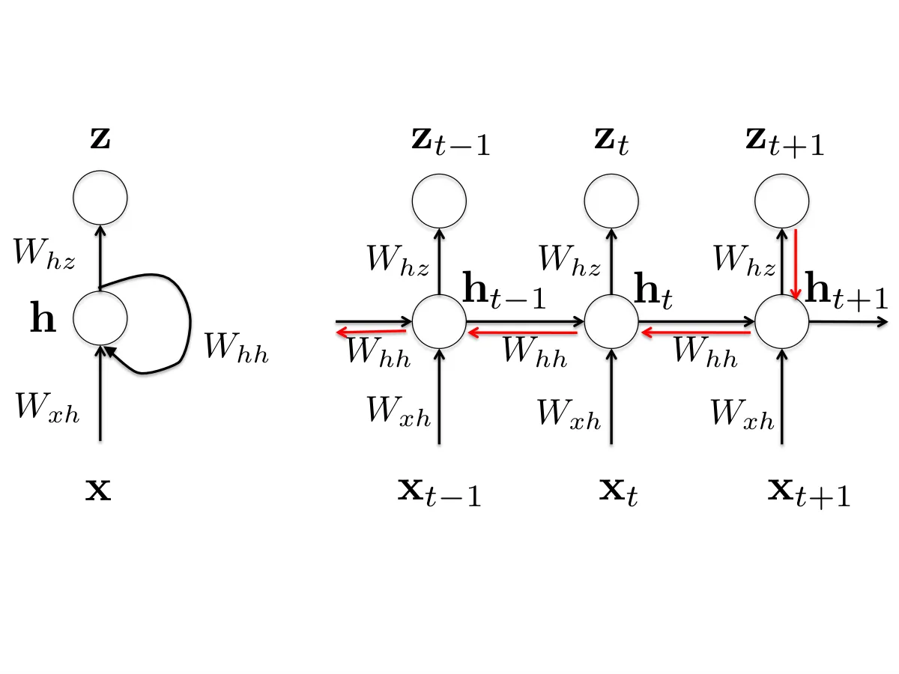
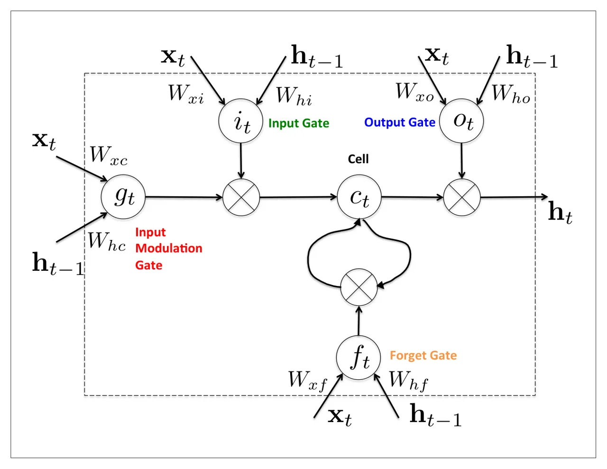
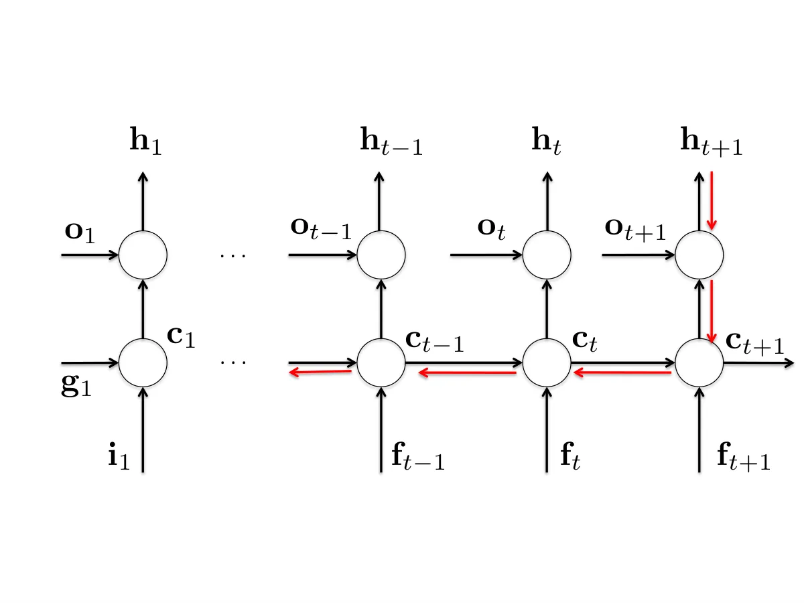

# A Gentle Tutorial of Recurrent Neural Network with Error Backpropagation

Gang Chen ^(†)^(†)thanks: email comments to gangchen@buffalo.edu
Affiliation: Department of Computer Science and Engineering, SUNY at
Buffalo

## 1 abstract

We describe recurrent neural networks (RNNs), which have attracted great
attention on sequential tasks, such as handwriting recognition, speech
recognition and image to text. However, compared to general feedforward
neural networks, RNNs have feedback loops, which makes it a little hard
to understand the backpropagation step. Thus, we focus on basics,
especially the error backpropagation to compute gradients with respect
to model parameters. Further, we go into detail on how error
backpropagation algorithm is applied on long short-term memory (LSTM) by
unfolding the memory unit.

## 2 Sequential data

Sequential data is common in a wide variety of domains including natural
language processing, speech recognition and computational biology. In
general, it is divided into time series and ordered data structures. As
for the time-series data, it changes over time and keeps consistent in
the adjacent clips, such as the time frames for speech or video
analysis, daily prices of stocks or the rainfall measurements on
successive days. There are also ordered data in the sequence, such as
text and sentence for handwriting recognition, and genes. For example,
successfully predicting protein-protein interactions requires knowledge
of the secondary structures of the proteins and semantic analysis might
involve annotating tokens with parts of speech tags.

The goal of this work is for sequence labeling, i.e. classify all items
in a sequence \[4\]. For example, in handwritten word recognition we
wish to label a sequence of characters given features of the characters;
in part of speech tagging, we wish to label a sequence of words.

More specifically, given an observation sequence
$`{\bf x}=\{{\bf x}_{1},{\bf x}_{2},...,{\bf x}_{T}\}`$ and its
corresponding label $`y=\{y_{1},y_{2},...,y_{T}\}`$, we want to learn a
map $`f:{\bf x}\mapsto y`$. In the following, we will introduce RNNs to
model the sequential data and give details on backpropagation over the
feedback loop.

|                                                           |
| --------------------------------------------------------- |
|  |

Figure 1: It is a RNN example: the left recursive description for RNNs,
and the right is the corresponding extended RNN model in a time
sequential manner.

## 3 Recurrent neural networks

A RNN is a kind of neural networks, which can send feedback signals (to
form a directed cycle), such as Hopfield net \[1\] and long-short term
memory (LSTM) \[2\]. RNN models a dynamic system, where the hidden state
$`{\bf h}_{t}`$ is not only dependent on the current observation
$`{\bf x}_{t}`$, but also relies on the previous hidden state
$`{\bf h}_{t-1}`$. More specifically, we can represent $`{\bf h}_{t}`$
as

```math
\displaystyle{\bf h}_{t}=f({\bf h}_{t-1},{\bf x}_{t}) \tag{1}
```

where $`f`$ is a nonlinear mapping. Thus, $`{\bf h}_{t}`$ contains
information about the whole sequence, which can be inferred from the
recursive definition in Eq. 1. In other words, RNN can use the hidden
variables as a memory to capture long term information from a sequence.

Suppose that we have the following RNN model, such that

```math
\displaystyle{\bf h}_{t}=tanh(W_{hh}{\bf h}_{t-1}+W_{xh}{\bf x}_{t}+{\bf b}_{\bf h}) \tag{2}
```

```math
\displaystyle z_{t}=softmax(W_{hz}{\bf h}_{t}+{\bf b}_{z}) \tag{3}
```

where $`z_{t}`$ is the prediction at the time step $`t`$, and
$`tanh(x)`$ is defined as

```math
\displaystyle tanh(x)=\frac{sinh(x)}{cosh(x)}=\frac{e^{x}-e^{-x}}{e^{x}+e^{-x}}=\frac{e^{2x}-1}{e^{2x}+1}
```

More specifically, the RNN model above has one hidden layer as depicted
in Fig. 1. Notice that it is very easy to extend the one hidden case
into multiple layers, which has been discussed in deep neural network
before. Considering the varying length for each sequential data, we also
assume the parameters in each time step are the same across the whole
sequential analysis. Otherwise it will be hard to compute the gradients.
In addition, sharing the weights for any sequential length can
generalize the model well. As for sequential labeling, we can use the
maximum likelihood to estimate model parameters. In other words, we can
minimize the negative log likelihood the objective function

```math
\displaystyle\mathcal{L}({\bf x},{\bf y})=-\sum_{t}y_{t}logz_{t} \tag{4}
```

In the following, we will use notation $`\mathcal{L}`$ as the objective
function for simplicity. And further we will use $`\mathcal{L}(t+1)`$ to
indicate the output at the time step $`t+1`$, s.t.
$`\mathcal{L}(t+1)=-y_{t+1}logz_{t+1}`$.

Let’s set $`\alpha_{t}=W_{hz}{\bf h}_{t}+{\bf b}_{z}`$, and then we have
$`z_{t}=softmax(\alpha_{t})`$ according to Eq. 3. By taking the
derivative with respect to $`\alpha_{t}`$ (refer to appendix for
details), we get the following

```math
\displaystyle\frac{\partial\mathcal{L}}{\partial\alpha_{t}}=-(y_{t}-z_{t}) \tag{5}
```

Note the weight $`W_{hz}`$ is shared across all time sequence, thus we
can differentiate to it at each time step and sum all together

```math
\displaystyle\frac{\partial\mathcal{L}}{\partial W_{hz}}=\sum_{t}\frac{\partial\mathcal{L}}{\partial z_{t}}\frac{\partial z_{t}}{\partial W_{hz}} \tag{6}
```

Similarly, we can get the gradient w.r.t. bias $`b_{z}`$

```math
\displaystyle\frac{\partial\mathcal{L}}{\partial b_{z}}=\sum_{t}\frac{\partial\mathcal{L}}{\partial z_{t}}\frac{\partial z_{t}}{\partial b_{z}} \tag{7}
```

Now let’s go through the details to derive the gradient w.r.t.
$`W_{hh}`$. Considering at the time step $`t\rightarrow t+1`$ in Fig. 1,

```math
\displaystyle\frac{\partial\mathcal{L}(t+1)}{\partial W_{hh}}=\frac{\partial\mathcal{L}(t+1)}{\partial z_{t+1}}\frac{\partial z_{t+1}}{\partial{\bf h}_{t+1}}\frac{\partial{\bf h}_{t+1}}{\partial W_{hh}} \tag{8}
```

where we only consider one step $`t\rightarrow(t+1)`$. And because the
hidden state $`{\bf h}_{t+1}`$ partially dependents on $`{\bf h}_{t}`$,
so we can use backpropagation to compute the above partial derivative.
Think further $`W_{hh}`$ is shared cross the whole time sequence,
according to the recursive definition in Eq. 2. Thus, at the time step
$`(t-1)\rightarrow t`$, we can further get the partial derivative w.r.t.
$`W_{hh}`$ as follows

```math
\displaystyle\frac{\partial\mathcal{L}(t+1)}{\partial W_{hh}}=\frac{\partial\mathcal{L}(t+1)}{\partial z_{t+1}}\frac{\partial z_{t+1}}{\partial{\bf h}_{t+1}}\frac{\partial{\bf h}_{t+1}}{\partial{\bf h}_{t}}\frac{\partial{\bf h}_{t}}{\partial W_{hh}} \tag{9}
```

Thus, at the time step $`t+1`$, we can compute gradient w.r.t.
$`z_{t+1}`$ and further use backpropagation through time (BPTT) from
$`t`$ to $`0`$ to calculate gradient w.r.t. $`W_{hh}`$, shown as the red
chain in Fig. 1. Thus, if we only consider the output $`z_{t+1}`$ at the
time step $`t+1`$, we can yield the following gradient w.r.t. $`W_{hh}`$

```math
\displaystyle\frac{\partial\mathcal{L}(t+1)}{\partial W_{hh}}=\sum_{k=1}^{t}\frac{\partial\mathcal{L}(t+1)}{\partial z_{t+1}}\frac{\partial z_{t+1}}{\partial{\bf h}_{t+1}}\frac{\partial{\bf h}_{t+1}}{\partial{\bf h}_{k}}\frac{\partial{\bf h}_{t}}{\partial W_{hh}} \tag{10}
```

Aggregate the gradients w.r.t. $`W_{hh}`$ over the whole time sequence
with back propagation, we can finally yield the following gradient
w.r.t. $`W_{hh}`$

```math
\displaystyle\frac{\partial\mathcal{L}}{\partial W_{hh}}=\sum_{t}\sum_{k=1}^{t+1}\frac{\partial\mathcal{L}(t+1)}{\partial z_{t+1}}\frac{\partial z_{t+1}}{\partial{\bf h}_{t+1}}\frac{\partial{\bf h}_{t+1}}{\partial{\bf h}_{k}}\frac{\partial{\bf h}_{k}}{\partial W_{hh}} \tag{11}
```

Now we turn to derive the gradient w.r.t. $`W_{xh}`$. Similarly, we
consider the time step $`t+1`$ (only contribution from
$`{\bf x}_{t+1}`$) and calculate the gradient w.r.t. to $`W_{xh}`$ as
follows

```math
\displaystyle\frac{\partial\mathcal{L}(t+1)}{\partial W_{xh}}=\frac{\partial\mathcal{L}(t+1)}{\partial{\bf h}_{t+1}}\frac{\partial{\bf h}_{t+1}}{\partial W_{xh}}
```

Because $`{\bf h}_{t}`$ and $`{\bf x}_{t+1}`$ both make contribution to
$`{\bf h}_{t+1}`$, we need to backpropagte to $`{\bf h}_{t}`$ as well.
If we consider the contribution from the time step $`t`$, we can further
get

```math
\displaystyle\frac{\partial\mathcal{L}(t+1)}{\partial W_{xh}}=\frac{\partial\mathcal{L}(t+1)}{\partial{\bf h}_{t+1}}\frac{\partial{\bf h}_{t+1}}{\partial W_{xh}}+\frac{\partial\mathcal{L}(t+1)}{\partial{\bf h}_{t}}\frac{\partial{\bf h}_{t}}{\partial W_{xh}}
```

```math
\displaystyle= \displaystyle\frac{\partial\mathcal{L}(t+1)}{\partial{\bf h}_{t+1}}\frac{\partial{\bf h}_{t+1}}{\partial W_{xh}}+\frac{\partial\mathcal{L}(t+1)}{\partial{\bf h}_{t+1}}\frac{\partial{\bf h}_{t+1}}{\partial{\bf h}_{t}}\frac{\partial{\bf h}_{t}}{\partial W_{xh}} \tag{12}
```

Thus, summing up all contributions from $`t`$ to $`0`$ via
backpropagation, we can yield the gradient at the time step $`t+1`$

```math
\displaystyle\frac{\partial\mathcal{L}(t+1)}{\partial W_{xh}}=\sum_{k=1}^{t+1}\frac{\partial\mathcal{L}(t+1)}{\partial{\bf h}_{t+1}}\frac{\partial{\bf h}_{t+1}}{\partial{\bf h}_{k}}\frac{\partial{\bf h}_{k}}{\partial W_{xh}} \tag{13}
```

Further, we can take derivative w.r.t. $`{W}_{xh}`$ over the whole
sequence as

```math
\displaystyle\frac{\partial\mathcal{L}}{\partial W_{xh}}=\sum_{t}\sum_{k=1}^{t+1}\frac{\partial\mathcal{L}(t+1)}{\partial z_{t+1}}\frac{\partial z_{t+1}}{\partial{\bf h}_{t+1}}\frac{\partial{\bf h}_{t+1}}{\partial{\bf h}_{k}}\frac{\partial{\bf h}_{k}}{\partial W_{xh}} \tag{14}
```

However, there are gradient vanishing or exploding problems to RNNs.
Notice that $`\frac{\partial{\bf h}_{t+1}}{\partial{\bf h}_{k}}`$ in Eq.
14 indicates matrix multiplication over the sequence. Because RNNs need
to backpropagate gradients over a long sequence (with small values in
the matrix multiplication), gradient value will shrink layer over layer,
and eventually vanish after a few time steps. Thus, the states that are
far away from the current time step does not contribute to the
parameters’ gradient computing (or parameters that RNNs is learning).
Another direction is the gradient exploding, which attributed to large
values in matrix multiplication.

Considering the weakness of RNNs, long short term memory (LSTM) was
proposed to handle gradient vanishing problem \[2\]. Notice that RNNs
makes use of a simple $`tanh`$ function to incorporate the correlation
between $`{\bf x}_{t}`$ and $`{\bf h}_{t-1}`$ and $`{\bf h}_{t}`$, while
LSTM model such correlation with a memory unit. And LSTM has attracted
great attention for time series data recently and yielded significant
improvement over RNNs. For example, LSTM has demonstrated very promising
results on handwriting recognition task. In the following part, we will
introduce LSTM, which introduces memory cells for the hidden states.

### 3.1 Long short-term memory (LSTM)

The architecture of RNNs have cycles incorporating the activations from
previous trim steps as input to the network to make a decision for the
current input, which makes RNNs better suited for sequential labeling
tasks. However, one vital problem of RNNs is the gradient vanishing
problem. LSTM \[2\] extends the RNNs model with two advantages: (1)
introduce the memory information (or cell) (2) handle long sequential
better, considering the gradient vanishing problem, refer to Fig. 2 for
the unit structure. In this part, we will introduce how to forward and
backward LSTM neural network, and we will derive gradients and
backpropagate error in details.

|                                                           |
| --------------------------------------------------------- |
|  |

Figure 2: It is an unit structure of LSTM, including 4 gates: input
modulation gate, input gate, forget gate and output gate.

The core of LSTM is a memory unit (or cell) $`{\bf c}_{t}`$ in Fig. 2,
which encodes the information of the inputs that have been observed up
to that step. The memory cell $`{\bf c}_{t}`$ has the same inputs
($`{\bf h}_{t-1}`$ and $`{\bf x}_{t}`$) and outputs $`{\bf h}_{t}`$ as a
normal recurrent network, but has more gating units which control the
information flow. The input gate and output gate respectively control
the information input to the memory unit and the information output from
the unit. More specifically, the output $`{\bf h}_{t}`$ of the LSTM cell
can be shut off via the output gate.

As to the memory cell itself, it is also controlled with a forget gate,
which can reset the memory unit with a sigmoid function. More
specifically, given a sequence data $`\{{\bf x}_{1},...,{\bf x}_{T}\}`$
we have the gate definition as follows:

```math
\displaystyle{\bf f}_{t}=\sigma(W_{xf}{\bf x}_{t}+W_{hf}{\bf h}_{t-1}+b_{f}) \tag{15}
```

```math
\displaystyle{\bf i}_{t}=\sigma(W_{xi}{\bf x}_{t}+W_{hi}{\bf h}_{t-1}+b_{i}) \tag{16}
```

```math
\displaystyle{\bf g}_{t}=tanh(W_{xc}{\bf x}_{t}+W_{hc}{\bf h}_{t-1}+b_{c}) \tag{17}
```

```math
\displaystyle{\bf c}_{t}={\bf f}_{t}\circ{\bf c}_{t-1}+{\bf i}_{t}\circ{\bf g}_{t} \tag{18}
```

```math
\displaystyle{\bf o}_{t}=\sigma(W_{xo}{\bf x}_{t}+W_{ho}{\bf h}_{t-1}+b_{o}) \tag{19}
```

```math
\displaystyle{\bf h}_{t}={\bf o}_{t}\circ tanh({\bf c}_{t}),\ z_{t}=softmax(W_{hz}{\bf h}_{t}+b_{z}) \tag{20}
```

where $`{\bf f}_{t}`$ indicates forget gate, $`{\bf i}_{t}`$ input gate,
$`{\bf o}_{t}`$ output gate and $`{\bf g}_{t}`$ input modulation gate.
Note that the memory unit models much more information than RNNs, except
Eq. 19.

Same as RNNs to make prediction, we can add a linear model over the
hidden state $`{\bf h}_{t}`$, and output the likelihood with softmax
function

```math
\displaystyle z_{t}=softmax(W_{hz}{\bf h}_{t}+b_{z})
```

If the groundtruth at time $`t`$ is $`y_{t}`$, we can consider
minimizing least square $`\frac{1}{2}(y_{t}-z_{t})^{2}`$ or cross entroy
to estimate model parameters. Thus, for the top layer classification
with weight $`W_{hz}`$, we can take derivative w.r.t. $`z_{t}`$ and
$`W_{hz}`$ respectively

```math
\displaystyle d{z_{t}}=y_{t}-z_{t} \tag{21}
```

```math
\displaystyle d{W_{hz}}=\sum_{t}{\bf h}_{t}d{z_{t}} \tag{22}
```

```math
\displaystyle d{{\bf h}_{T}}=W_{hz}d{z_{T}} \tag{23}
```

where we only consider the gradient w.r.t. $`{\bf h}_{T}`$ at the last
time step $`T`$. For any time step $`t`$, its gradient will be a little
different, which will be introduced later (refer to Eq. 33).

|                                                           |
| --------------------------------------------------------- |
|  |

Figure 3: This graph unfolds the memory unit of LSTM, with the purpose
to make it easy to understand error backpropagation.

then backpropagate the LSTM at the current time step $`t`$

```math
\displaystyle d{{\bf o}_{t}}=tanh({\bf c}_{t})d{\bf h}_{t} \tag{24}
```

```math
\displaystyle d{{\bf c}_{t}}=\big(1-tanh({\bf c}_{t})^{2}\big){\bf o}_{t}d{\bf h}_{t} \tag{25}
```

```math
\displaystyle d{{\bf f}_{t}}={\bf c}_{t-1}d{{\bf c}_{t}} \tag{26}
```

```math
\displaystyle d{{\bf c}_{t-1}}\ +=\ {\bf f}_{t}\circ d{\bf c}_{t} \tag{27}
```

```math
\displaystyle d{{\bf i}_{t}}={\bf g}_{t}d{{\bf c}_{t}} \tag{28}
```

```math
\displaystyle d{{\bf g}_{t}}={\bf i}_{t}d{{\bf c}_{t}} \tag{29}
```

where the gradient w.r.t. $`tanh({\bf c}_{t})`$ in Eq. 25 can be derived
according to Eq. 40 in Appendix.

further, back-propagate activation functions over the whole sequence

```math
\displaystyle d{W_{xo}}=\sum_{t}{\bf o}_{t}(1-{\bf o}_{t}){\bf x}_{t}d{{\bf o}_{t}}
```

```math
\displaystyle d{W_{xi}}=\sum_{t}{\bf i}_{t}(1-{\bf i}_{t}){\bf x}_{t}d{{\bf i}_{t}}
```

```math
\displaystyle d{W_{xf}}=\sum_{t}{\bf f}_{t}(1-{\bf f}_{t}){\bf x}_{t}d{{\bf f}_{t}}
```

```math
\displaystyle d{W_{xc}}=\sum_{t}(1-{\bf g}_{t}^{2}){\bf x}_{t}d{{\bf g}_{t}} \tag{30}
```

Note that the weights $`W_{xo}`$, $`W_{xi}`$, $`W_{xf}`$ and $`W_{xc}`$
are shared across the whole sequence, thus we need to take the same
summation over $`t`$ as RNNs in Eq. 6. Similarly, we have

```math
\displaystyle d{W_{ho}}=\sum_{t}{\bf o}_{t}(1-{\bf o}_{t}){\bf h}_{t-1}d{{\bf o}_{t}}
```

```math
\displaystyle d{W_{hi}}=\sum_{t}{\bf i}_{t}(1-{\bf i}_{t}){\bf h}_{t-1}d{{\bf i}_{t}}
```

```math
\displaystyle d{W_{hf}}=\sum_{t}{\bf f}_{t}(1-{\bf f}_{t}){\bf h}_{t-1}d{{\bf f}_{t}}
```

```math
\displaystyle d{W_{hc}}=\sum_{t}(1-{\bf g}_{t}^{2}){\bf h}_{t-1}d{{\bf g}_{t}} \tag{31}
```

and corresponding hiddens at the current time step $`t-1`$

```math
\displaystyle d{{\bf h}_{t-1}} \displaystyle={\bf o}_{t}(1-{\bf o}_{t})W_{ho}d{{\bf o}_{t}}+{\bf i}_{t}(1-{\bf i}_{t})W_{hi}d{{\bf i}_{t}}
```

```math
\displaystyle+{\bf f}_{t}(1-{\bf f}_{t})W_{hf}d{{\bf f}_{t}}+(1-{\bf g}_{t}^{2})W_{hc}d{{\bf g}_{t}} \tag{32}
```

```math
\displaystyle d{{\bf h}_{t-1}} \displaystyle=d{{\bf h}_{t-1}}+W_{hz}d{z_{t-1}} \tag{33}
```

where we consider two sources to derive $`d{{\bf h}_{t-1}}`$, one is
from activation function in Eq. 32 and the other is from the objective
function at the time step $`t-1`$ in Eq. 23.

### 3.2 Error backpropagation

In this part, we will give detail information on how to derive
gradients, especially Eq. 27. As we talked about RNNs before, we can
take the same strategy to unfold the memory unit, shown in Fig. 3.
Suppose we have the least square objective function

```math
\displaystyle\mathcal{L}({\bf x},\theta)=\min\sum_{t}\frac{1}{2}(y_{t}-z_{t})^{2} \tag{34}
```

where
$`\boldsymbol{\theta}=\{W_{hz},W_{xo},W_{xi},W_{xf},W_{xc},W_{ho},W_{hi},W_{hf},W_{hc}\}`$
with biases ignored. To make it easy to understand in the following, we
use $`\mathcal{L}(t)=\frac{1}{2}(y_{t}-z_{t})^{2}`$.

At the time step $`T`$, we take derivative w.r.t. $`{\bf c}_{T}`$

```math
\displaystyle\frac{\partial\mathcal{L}(T)}{\partial{\bf c}_{T}}=\frac{\partial\mathcal{L}(T)}{\partial{\bf h}_{T}}\frac{\partial{\bf h}_{T}}{\partial{\bf c}_{T}} \tag{35}
```

At the time step $`T-1`$, we take derivative of $`\mathcal{L}(T-1)`$
w.r.t. $`{\bf c}_{T-1}`$ as

```math
\displaystyle\frac{\partial\mathcal{L}(T-1)}{\partial{\bf c}_{T-1}}=\frac{\partial\mathcal{L}(T-1)}{\partial{\bf h}_{T-1}}\frac{\partial{\bf h}_{T-1}}{\partial{\bf c}_{T-1}} \tag{36}
```

However, according to Fig. 3, the error is not only backpropagated via
$`\mathcal{L}(T-1)`$, but also from $`{\bf c}_{T}`$, thus the final
gradient w.r.t. $`{\bf c}_{T-1}`$

```math
\displaystyle\frac{\partial\mathcal{L}(T-1)}{\partial{\bf c}_{T-1}}=\frac{\partial\mathcal{L}(T-1)}{\partial{\bf c}_{T-1}}+\frac{\partial\mathcal{L}(T)}{\partial{\bf c}_{T-1}}
```

```math
\displaystyle\frac{\partial\mathcal{L}(T-1)}{\partial{\bf c}_{T-1}}=\frac{\partial\mathcal{L}(T-1)}{\partial{\bf h}_{T-1}}\frac{\partial{\bf h}_{T-1}}{\partial{\bf c}_{T-1}}+\frac{\partial\mathcal{L}(T)}{\partial{\bf h}_{T}}\frac{\partial{\bf h}_{T}}{\partial{\bf c}_{T}}\frac{\partial{\bf c}_{T}}{\partial{\bf c}_{T-1}} \tag{37}
```

where we use the chain rule in Eq. 37. Further, we can rewrite Eq. 37 as

```math
\displaystyle d{{\bf c}_{T-1}}\ =d{{\bf c}_{T-1}}+{\bf f}_{T}\circ d{\bf c}_{T} \tag{38}
```

In a similar manner, we can derive Eq. 27 at any time step.

### 3.3 Parameters learning

Forward: we can use Eqs. 15-20 to update states as the feedforward
neural network from the time step $`1`$ to $`T`$.

Backword: we can backpropagate the error from $`T`$ to $`1`$ via Eqs.
24-33. After we get gradients using backpropagation, the model
$`\boldsymbol{\theta}`$ can be learnt with gradient based methods, such
as stochastic gradient descent and L-BFGS). If we use stochastic
gradient descent (SGD) to update
$`\boldsymbol{\theta}=\{W_{hz},W_{xo},W_{xi},W_{xf},W_{xc},W_{ho},W_{hi},W_{hf},W_{hc}\}`$,
then we have

```math
\boldsymbol{\theta}=\boldsymbol{\theta}-\eta d{\boldsymbol{\theta}} \tag{39}
```

where $`\eta`$ is the learning rate. Notice that more tricks can be
applied here.

## 4 Applications

RNNs can be used to handle sequential data, such as speech recognition.
RNNs can also be extended into multiple layers in a bi-directional
manner. Moreover, RNNs can be combines with other neural networks \[3\],
such as convolutional neural network to handle video to text problem, as
well as combining two LSTMs for machine translation.

## 5 Appendix

\(1\) Gradients related to $`f(x)=tanh(x)`$  
Take the derivative of $`tanh(x)`$ w.r.t. $`x`$

```math
\displaystyle\frac{\partial{tanh(x)}}{\partial(x)}=\frac{\partial{\frac{sinh(x)}{cosh(x)}}}{\partial{x}}
```

```math
\displaystyle= \displaystyle\frac{\frac{\partial{sinh(x)}}{\partial{x}}cosh(x)-sinh(x)\frac{\partial{cosh(x)}}{\partial{x}}}{\big(cosh(x)\big)^{2}}
```

```math
\displaystyle= \displaystyle\frac{[cosh(x)]^{2}-[sinh(x)]^{2}}{\big(cosh(x)\big)^{2}}
```

```math
\displaystyle= \displaystyle 1-[tanh(x)]^{2} \tag{40}
```

\(2\) Gradients related to Eq. 5  
As we know $`z=softmax(W_{hz}{\bf h}+{\bf b}_{z})`$ predicts the
probability assigned to $`K`$ classes without considering the time step
information in Eq. 5. Furthermore, we can use $`1`$ of $`K`$ encoding to
represent the groundtruth $`y`$, but with probability vector to
represent $`z=[p(\hat{y}_{1}),...,p(\hat{y}_{K})]`$. Then, we can
consider the gradient in each dimension, and then generalize it to the
vector case in the objective function
$`\mathcal{L}(W_{hz},{\bf b}_{z})=-ylogz`$. In the following, we will
first compute the gradient w.r.t.
$`\alpha_{j}(\Theta)=W_{hz}(:,j){\bf h}_{t}`$, and then generalize it to
$`k\neq j`$. And further, we can derive the gradients w.r.t. $`W_{hz}`$
and $`{\bf b}_{z}`$.

We know that

```math
\displaystyle p(\hat{y}_{j}|{\bf h}_{t};\Theta)=\frac{\textrm{exp}(\alpha_{j}(\Theta))}{\sum_{k}\textrm{exp}(\alpha_{k}(\Theta))} \tag{41}
```

Then take the derivative w.r.t. $`\alpha_{j}(\Theta)`$

```math
\displaystyle\frac{\partial{y_{j}\textrm{log}p(\hat{y}_{j}|{\bf h}_{t};\Theta)}}{\partial\alpha_{j}}
```

```math
\displaystyle=\frac{y_{j}}{p(\hat{y}_{j})}\frac{\textrm{exp}(\alpha_{j}(\Theta))\sum_{k}\textrm{exp}(\alpha_{k}(\Theta))-\textrm{exp}(\alpha_{j}(\Theta))\textrm{exp}(\alpha_{j}(\Theta))}{[\sum_{k}\textrm{exp}(\alpha_{k}(\Theta))]^{2}}
```

```math
\displaystyle=y_{j}(1-p(\hat{y}_{j})) \tag{42}
```

Similarly, $`\forall k\neq j`$ and its prediction $`p(\hat{y}_{k})`$, we
take the derivative w.r.t. $`\alpha_{j}(\Theta)`$,

```math
\displaystyle\frac{\partial{y_{k}\textrm{log}p(\hat{y}_{k}|{\bf h}_{t};\Theta)}}{\partial\alpha_{j}}
```

```math
\displaystyle=\frac{y_{k}}{p(\hat{y}_{k})}\frac{-\textrm{exp}(\alpha_{k}(\Theta))\textrm{exp}(\alpha_{j}(\Theta))}{[\sum_{s}\textrm{exp}(\alpha_{s}(\Theta))]^{2}}
```

```math
\displaystyle=-y_{k}p(\hat{y}_{j}) \tag{43}
```

Finally, we can yield the following gradient w.r.t.
$`\alpha_{j}(\Theta)`$

```math
\displaystyle\frac{\partial p(\hat{\bf y})}{\partial\alpha_{j}} \displaystyle=\sum_{j}\frac{\partial{y_{j}\textrm{log}p(\hat{y}_{j}|{\bf h}_{i};\Theta)}}{\partial\alpha_{j}}
```

```math
\displaystyle=\frac{\partial{\textrm{log}p(\hat{y}_{j}|{\bf h}_{i};\Theta)}}{\partial\alpha_{j}}+\sum_{k\neq j}\frac{\partial{\textrm{log}p(\hat{y}_{k}|{\bf h}_{i};\Theta)}}{\partial\alpha_{j}}
```

```math
\displaystyle=y_{j}-y_{j}p(\hat{y}_{j})-\sum_{k\neq j}y_{k}p(\hat{y}_{j})
```

```math
\displaystyle=y_{j}-p(\hat{y}_{j})(y_{j}+\sum_{k\neq j}y_{k})=y_{j}-p(\hat{y}_{j}) \tag{44}
```

where we use the results in Eqs. 42 and 43.

## References

- \[1\] Hopfield, J. J., Neural Networks and Physical Systems with
  Emergent Collective Computational Abilities, In Neurocomputing:
  Foundations of Research, 1988.
- \[2\] Hochreiter, Sepp and Schmidhuber, Jürgen, Long Short-Term
  Memory, In Neural Comput., 1997.
- \[3\] G. Chen and S. N. Srihari, Generalized K-fan Multimodal Deep
  Model with Shared Representations, 2015.
- \[4\] Gang Chen, Machine Learning: Basics, Models and Trends, 2016
