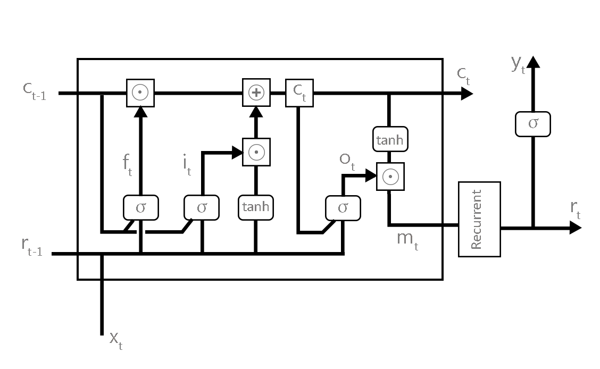
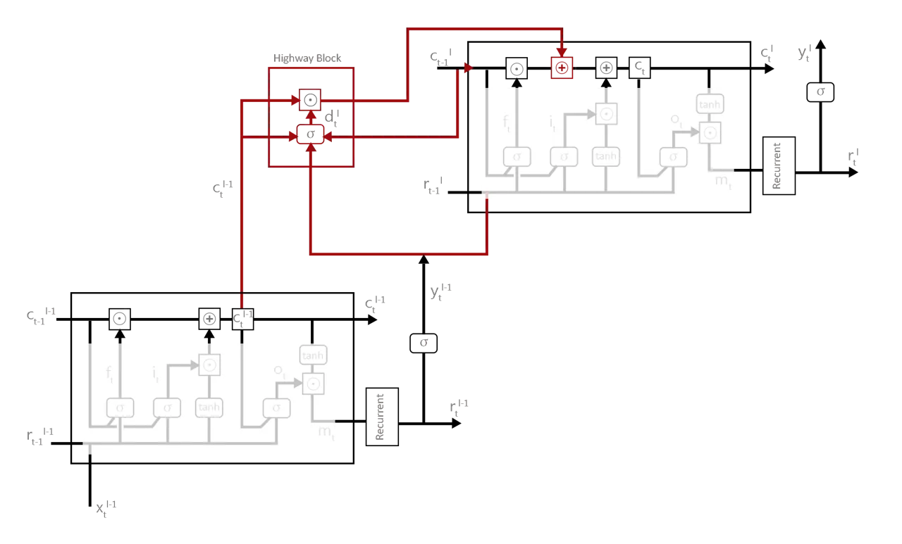

# END-TO-END ATTENTION-BASED DISTANT SPEECH RECOGNITION WITH HIGHWAY LSTM

Hassan Taherian Affiliation: Laboratory for Intelligent Multimedia
Processing,  
Amirkabir University of Technology, Hafez St., Tehran, Iran

Technical Report  
September 2016 E-mail <hasan.t@aut.ac.ir>

###### Abstract

End-to-end attention-based models have been shown to be competitive
alternatives to conventional DNN-HMM models in the Speech Recognition
Systems. In this paper, we extend existing end-to-end attention-based
models that can be applied for Distant Speech Recognition (DSR) task.
Specifically, we propose an end-to-end attention-based speech recognizer
with multichannel input that performs sequence prediction directly at
the character level. To gain a better performance, we also incorporate
Highway long short-term memory (HLSTM) which outperforms previous models
on AMI distant speech recognition task.

###### Keywords: 

Distant Speech Recognition, Attention, Highway LSTM

## 1 Introduction

Recently end-to-end neural network speech recognition systems has shown
promising results \[1, 2, 3\]. Further improvement were reported by
using more advanced models such as Attention-based Recurrent Sequence
Generator (ARSG) as part of an end-to-end speech recognition system
\[4\].

Although these new techniques help to decrease the word error rate (WER)
on the automatic speech recognition system (ASR), Distant Speech
Recognition (DSR) remains a challenging task due to the reverberation
and overlapping acoustic signals, even with sophisticated front-end
processing techniques such as state-of-the-art beamforming \[5\].

It is reported that using multiple microphones with signal preprocessing
techniques like beamforming will improve the performance of the DSR
\[5\]. However the performance of such techniques are suboptimal since
they are depended heavily on the microphone array geometry and the
location of target source \[6\]. Other works have shown that Deep Neural
Networks with multichannel inputs can be used for learning a suitable
representation for distant speech recognition without any front-end
preprocessing \[7\].

In this paper, we propose an extension to the current Attention-based
Recurrent Sequence Generator (ARSG) that can handle multichannel inputs.
We use \[4\] as the baseline while extend its single channel input to
multiple channel. We also integrate the language model in the decoder of
ASRG with Weighted Finite State Transducer (WFST) framework as it was
purposed in \[4\]. To avoid slowness in convergence, we use Highway LSTM
\[8\] in our model which allows us to have stacked LSTM layers without
having gradient vanishing problem.

Rest of the paper is organized as follows. In Section 2 we briefly
discuss related work. In Section 3 we introduce our proposed model and
describe integration of language model with Attention-based Recurrent
Sequence Generator. Finally, Conclusions are drawn in Section 4.

## 2 Related Work

Kim et al. already proposed an attention-based approach with
multichannel input \[9\]. In their work an attention mechanism is
embeded within a Recurrent Neural Network based acoustic model in order
to weigh channel inputs for a number of frames. The more reliable
channel input will get higher score. By calculating phase difference
between microphone pairs, they also incorporated spatial information in
their attention mechanism to accelerate learning of auditory attention.
They reported that this model achieve comparable performance to
beamforming techniques.

One advantage of using such model is that no prior knowledge of
microphone array geometry is required and real time processing is done
much faster than models with front-end preprocessing techniques.
However, by using conventional DNN-HMM acoustic model, they did not
utilize the full potential of attention mechanism in their proposed
model. The feature vectors, weighted by attention mechanism, can help to
condition the generation of the next element of the output sequence. In
our model, attention mechanism is similar to \[10\] but it I also
connected to the ARGS to produce an end-to-end results.

## 3 Proposed Model

Our model consists of three parts: an encoder, an attention mechanism
and a decoder. The model takes multichannel input X and stochastically
generates an output sequence ($`y_{1}`$, $`y_{2}`$, …, $`y_{T}`$). The
input X consists of N channel inputs X={$`X^{ch1}`$, $`X^{ch2}`$,…,
$`X^{chN}`$} where each channel $`X^{chi}`$ is a sequence of small
overlapping window of audio frames $`X^{chi}`$={$`X_{1}^{chi}`$,
$`X_{2}^{chi}`$,…, $`X_{L}^{chi}`$}. The encoder transforms the input
into another representation by using Recurrent Neural Network (RNN).
Then the attention mechanism weighs elements of new representation based
on their relevance to the output $`y`$ at each time step. Finally, the
decoder which is a RNN in our model, produces an output sequence
($`y_{1}`$, $`y_{2}`$, …, $`y_{T}`$) one character at time by using
weighted representation produced by attention mechanism and the hidden
state of the decoder. In the literature, combination of the attention
mechanism and the decoder is called Attention Recurrent Sequence
Generator (ARSG). ARSG is proposed to address the problem of learning
variable-length input and output sequences since in the conventional
RNNs, the length of the sequence of hidden state vectors is always equal
to the length of the input sequence.

In the following subsections we will discuss these three parts in
detail.

### 3.1 The Encoder

We concatenate frames of all channels and feed them as an input to the
encoder which is a RNN, at each time step t. Another approach to handle
multichannel input as Kim et al. proposed in \[9\], is to feed each
channel separately in to the RNN at each time step. Training such RNN in
this approach can be very slow for an end-to-end scenario since the
attention mechanism should weigh frames of each channel at every time
step. Moreover, phase difference calculation between microphone pairs
are needed for scoring frames. Because of these computational
complexities, we decided to concatenate all channel features and feed
them to the network as Liu et al. have done \[10\] in their model.

We used bidirectional highway long short-term memory (BHLSTM) in the
encoder. Zhang et al. showed that BHLSTM with dropout achieved
state-of-the-art performance in the AMI (SDM) task \[8\]. This model
addresses the gradient vanishing problem caused by stacking LSTM layers.
Thus this model allows the network to go much deeper \[8\]. BHLSTM is
based on long short-term memory projected (LSTMP) which originally
proposed by \[11\]. The operation of LSTMP network follows the equations

```math
\displaystyle i_{t} \displaystyle= \displaystyle\sigma(\mathbf{W_{xi}}x_{t}+\mathbf{W_{mi}}r_{t-1}+\mathbf{W_{ci}}c_{t-1}+b_{i}) \tag{1}
```

```math
\displaystyle f_{t} \displaystyle= \displaystyle\sigma(\mathbf{W_{xf}}x_{t}+\mathbf{W_{mf}}r_{t-1}+\mathbf{W_{cf}}c_{t-1}+b_{f}) \tag{2}
```

```math
\displaystyle c_{t} \displaystyle= \displaystyle f_{t}\odot c_{t-1}+i_{t}\odot tanh(\mathbf{W_{xc}}x_{t}+\mathbf{W_{mc}}r_{t-1}+b_{c}) \tag{3}
```

```math
\displaystyle o_{t} \displaystyle= \displaystyle\sigma(\mathbf{W_{xo}}x_{t}+\mathbf{W_{mo}}r_{t-1}+\mathbf{W_{co}}c_{t}+b_{o}) \tag{4}
```

```math
\displaystyle m_{t} \displaystyle= \displaystyle o_{t}\odot tanh(c_{t}) \tag{5}
```

```math
\displaystyle r_{t} \displaystyle= \displaystyle\mathbf{W_{rm}}m_{t} \tag{6}
```

```math
\displaystyle y_{t} \displaystyle= \displaystyle\sigma(\mathbf{W_{yr}}r_{t}+b_{y}) \tag{7}
```

iteratively from $`t=1`$ to $`T`$, where $`\mathbf{W}`$ term denote
weight matrices. $`\mathbf{W_{fc}}`$, $`\mathbf{W_{ic}}`$,
$`\mathbf{W_{oc}}`$ are diagonal weight matrices for peephole
connections. the $`b`$ terms denote bias vectors, $`\odot`$ denotes the
element-wise product, $`i`$, $`f`$, $`o`$, $`c`$ and $`m`$ are input
gate, forget gate, output gate, cell activation and cell output
activation vector respectively. $`x_{t}`$ and $`y_{t}`$ denotes input
and output to the layer at time step t. $`\sigma()`$ is sigmoid
activation fuction. finally $`r`$ denotes the recurrent unit
activations. a LSTMP unit can be seen as combination of standard LSTM
unit with peephole that its cell output activation $`m`$ is transformed
by a linear projection layer. This architecture, shown in the Figure 1,
converges faster than standard LSTM and it has less parameters than
standard LSTM while keeping the performance \[11\].



Figure 1: The architecture of LSTM Projected (LSTMP). It is similar to
LSTM with peephole with additioal projected layer. LSTMP reduces
training parameters and allows to have deeper models

The HLSTM RNN is illustrated in Figure 2. It is an extension to the
LSTMP model. It has an extra gate, called carry gate, between memory
cells of adjacent layers. The carry gate controls how much information
can flow between cells in adjacent layers. HLSTM architecture can be
orbtained by modification of Eq. (3):

```math
\displaystyle c_{t}^{l} \displaystyle= \displaystyle f_{t}^{l}\odot c_{t-1}^{l}+i_{t}^{l}\odot tanh(\mathbf{W_{xc}^{l}}x_{t}^{l}+\mathbf{W_{mc}^{l}}r_{t-1}^{l}+b_{c})+d_{t}^{l}\odot c_{t}^{l-1} \tag{8}
```

```math
\displaystyle d_{t}^{l} \displaystyle= \displaystyle\sigma(\mathbf{W_{xd}^{l}}x_{t}^{l}+w_{d1}^{l}\odot c_{t-1}^{l}+w_{d2}^{l}\odot c_{t}^{l-1}+b_{d}^{l}) \tag{9}
```

if the predecessor layer $`(l−-1)`$ is also an LSTM layer, otherwise:

```math
\displaystyle c_{t}^{l} \displaystyle= \displaystyle f_{t}^{l}\odot c_{t-1}^{l}+i_{t}^{l}\odot tanh(\mathbf{W_{xc}^{l}}x_{t}^{l}+\mathbf{W_{mc}^{l}}r_{t-1}^{l}+b_{c})+d_{t}^{l}\odot x_{t}^{l} \tag{10}
```

```math
\displaystyle d_{t}^{l} \displaystyle= \displaystyle\sigma(\mathbf{W_{xd}^{l}}x_{t}^{l}+w_{d1}^{l}\odot c_{t-1}^{l}+b_{d}^{l}) \tag{11}
```

where $`b_{d}^{l}`$ is a bias vector, $`w_{d1}^{l}`$ and $`w_{d2}^{l}`$
are weight vectors, $`\mathbf{W_{xd}^{l}}`$ is the weight matrix
connecting the carry gate to the input of this layer. In this study, we
also extend the HLSTM RNNs from unidirection to bidirection. Note that
the backward layer follows the same equations used in the forward layer
except that $`t-1`$ is replaced by $`t+1`$ to exploit future frames and
the model operates from $`t=T`$ to 1. The output of the forward and
backward layers are concatenated to form the input to the next layer.



Figure 2: The architecture of Highway LSTM (HLSTM). Cell states of
adjacent layers with LSTMP nodes are connected with Highway Block. HLSTM
has been shown to be effective to combat gradient vanishing problem in
deep recurrent neural networks

### 3.2 The Attetion Mechanism

Attention mechanism is a subnetwork that weighs the encoded inputs
$`h`$. It selects the temporal locations on input sequence that is
useful for updating hidden state of the decoder. Specifically, at each
time step $`i`$, the attention mechanism computes scalar energy
$`e_{i,l}`$ for each time step of encoded input $`h_{l}`$ and hidden
state of decoder $`s_{i}`$. The scalar energy will be converted into
probability distribution, which is called alignment, over time steps
using softmax function. Finally, the context vector $`c_{i}`$ is
calculated by linear combination of elements of encoded inputs $`h_{l}`$
\[12\].

```math
\displaystyle e_{i,l} \displaystyle= \displaystyle w^{T}tanh(\mathbf{W}s_{i}+\mathbf{V}h_{l}+b) \tag{12}
```

```math
\displaystyle\alpha_{i,l} \displaystyle= \displaystyle\frac{exp(e_{i,l})}{\sum_{l=1}^{L}exp(e_{i})} \tag{13}
```

```math
\displaystyle c_{i} \displaystyle= \displaystyle\sum_{l}\alpha_{i,l}h_{l} \tag{14}
```

Where $`\mathbf{W}`$ and $`\mathbf{V}`$ are matrix parameters and $`w`$
and $`b`$ are vector parameters. Note that the $`\alpha_{i,l}>0`$ and
$`\sum_{l}\alpha_{i}=1`$. This method is called context-based. Bahdanau
et al. showed that using context-based scheme for attention model is
prone to error since similar elements of embedded input $`h`$ is scored
equally \[4\]. To alleviate this problem, Bahdanau et al. suggested to
use previous alignment $`\alpha_{i-1}`$ by convolving it along time axis
for calculation of the scalar energy. Thus by changing Eq. (12) we have:

```math
\displaystyle\mathbf{F} \displaystyle= \displaystyle\mathbf{Q}*\alpha_{i-1} \tag{15}
```

```math
\displaystyle e_{i,l} \displaystyle= \displaystyle w^{T}tanh(\mathbf{W}s_{i}+\mathbf{V}h_{l}+\mathbf{U}f_{l}+b) \tag{16}
```

Where $`\mathbf{U}`$, $`\mathbf{Q}`$ are parameter matrices, \* denotes
convolution and $`f_{l}`$ are feature vectors of matrix $`\mathbf{F}`$.
A disadvantage of this model is the complexity of the training
procedure. The alignments $`\alpha_{i,l}`$ should be calculated for all
pairs of input and output position which is –$`\rm O(LT)`$. Chorowski et
al. suggested a windowing approach which limits the number of embedded
inputs for computation of alignments \[13\]. This approach reduces the
complexity to $`\rm O(L+T)`$.

### 3.3 The Decoder

The task of the decoder which is a RNN in ARSG framework, is to produce
probability distribution over the next character conditioned on all the
characters that already has been seen. This distribution is generated
with a MLP and a softmax by the hidden state of the decoder $`s_{i}`$
and the context vector of attention mechanism $`c_{i}`$.

```math
\displaystyle\mathbf{P}(y_{i}|X,y_{<i}) \displaystyle= \displaystyle\mathbf{MLP}(s_{i},c_{i}) \tag{17}
```

The hidden state of decoder $`s_{i}`$ is a function of previous hidden
state $`s_{i-1}`$, the previously emitted character $`y_{i-1}`$ and
context vector of attention mechanism $`c_{i-1}`$:

```math
\displaystyle s_{i} \displaystyle= \displaystyle f(s_{i-1},y_{i-1},c_{i-1}) \tag{18}
```

Where $`f`$ is a single layer of standard LSTM. The ARSG with encoder
can be trained jointly for end-to-end speech recognition. The objective
function is to maximize the log probability of each character sequence
condition on the previous characters.

```math
\displaystyle max_{\theta}\sum_{i}log\ \mathbf{P}(y_{i}|X,y_{<i}^{*};\theta) \tag{19}
```

Where $`\theta`$ is the network parameter and $`y^{*}`$ is the ground
truth of previous characters. To make it more resilient to the bad
predictions during test, Chen et al. suggested to sample from previous
predicted characters with the rate of 10% and use them as input for
predicting next character instead of ground truth transcript \[12\].

Chen et al. showed that end-to-end models for speech recognition can
achieve good results without using language model but for reducing word
error rate (WER), language model is essential \[12\]. One way for
integrating language model with the ARSG framework, as Bahdanau et al.
suggested, is to use Weighted Finite State Transducer (WFST) framework
\[4\]. By composition of grammar and lexicon, WFST defines the log
probability for a character sequence ( see \[14\]) . With the
combination of WFST and ARGS, we can look for transcripts that maximize:

```math
\displaystyle L \displaystyle= \displaystyle\sum_{i}log\ \mathbf{P}(y_{i}|X,y_{<i}^{*};\theta)+\beta log_{P_{LM}}(y) \tag{20}
```

in decoding time. Where $`\beta`$ is tunable parameter. (see \[4\]).
There are also other models for integrating language model to ARGS.
Shallow Fusion and Deep Fusion are two of them that are proposed by
Gulcehre et al. \[15\].

Integrating Shallow Fusion is similar to the WFST framework but it uses
Recurrent Neural Network language model (RNNLM) for producing log
probability of sequences. In Deep Fusion, the RNNLM is integrated with
the decoder subnetwork in ARSG framework. Specifically, the hidden state
of RNNLM is used as input for generating the probability distribution on
the next character in Eq. (17). However, in our work we opt to use WFST
framework for the sake of simplicity and training tractability of the
model.

## 4 Conclusion

In this work, we show the end-to-end models that are based only on
neural networks can be applied to the Distant Speech Recognition task
with concatenation of multichannel inputs. Also better accuracy is
expected with the usage of Highway LSTMs in the encoder network. For the
future work, we will study integration of Recurrent Neural Network
Language Model (RNNLM) with Attention-based Recurrent Sequence Generator
(ARSG) with Highway LSTM.

## References

- \[1\] A. Y. Hannun, A. L. Maas, D. Jurafsky, and A. Y. Ng,
  “First-Pass Large Vocabulary Continuous Speech Recognition using
  Bi-Directional Recurrent DNNs,” arXiv, pp. 1–-7, 2014.
- \[2\] A. Graves, S. Fernandez, F. Gomez, and J. Schmidhuber,
  “Connectionist Temporal Classification : Labelling Unsegmented
  Sequence Data with Recurrent Neural Networks,” Proc. 23rd Int. Conf.
  Mach. Learn., pp. 369–-376, 2006.
- \[3\] A. Graves and N. Jaitly, “Towards End-To-End Speech Recognition
  with Recurrent Neural Networks,” in JMLR Workshop and Conference
  Proceedings, 2014, vol. 32, no. 1, pp. 1764–-1772.
- \[4\] D. Bahdanau, J. Chorowski, D. Serdyuk, P. Brakel, and Y.
  Bengio, “End-To-End Attention-Based Large Vocabulary Speech
  Recognition,” arXiv, pp. 4945–-4949, 2015.
- \[5\] K. Kumatani, J. McDonough, and B. Raj, “Microphone array
  processing for distant speech recognition: From close-talking
  microphones to far-field sensors,” IEEE Signal Process. Mag., vol. 29,
  no. 6, pp. 127–-140, 2012.
- \[6\] M. L. Seltzer, B. Raj, and R. M. Stern, “Likelihood-maximizing
  beamforming for robust hands-free speech recognition,” IEEE Trans.
  Speech Audio Process., vol. 12, no. 5, pp. 489–-498, 2004.
- \[7\] P. Swietojanski, A. Ghoshal, and S. Renals, “Convolutional
  neural networks for distant speech recognition,” IEEE Signal Process.
  Lett., vol. 21, no. 9, pp. 1120–-1124, 2014.
- \[8\] Y. Zhang, G. Chen, D. Yu, K. Yaco, S. Khudanpur, and J. Glass,
  “Highway long short-term memory RNNS for distant speech recognition,”
  in ICASSP, IEEE International Conference on Acoustics, Speech and
  Signal Processing - Proceedings, 2016, vol. 2016–-May, pp. 5755–-5759.
- \[9\] S. Kim and I. Lane, “Recurrent Models for auditory attention in
  multi-microphone distance speech recognition,” Proc. Annu. Conf. Int.
  Speech Commun. Assoc. INTERSPEECH, pp. 1–-9, 2016.
- \[10\] Y. Liu, P. Zhang, and T. Hain, “Using neural network
  front-ends on far field multiple microphones based speech
  recognition,” in ICASSP, IEEE International Conference on Acoustics,
  Speech and Signal Processing - Proceedings, 2014, pp. 5542-–5546.
- \[11\] H. Sak, A. Senior, and F. Beaufays, “Long short-term memory
  based recurrent neural network architectures for large scale acoustic
  modeling,” in Interspeech 2014, 2014, no. September, pp. 338–-342.
- \[12\] W. Chan, N. Jaitly, Q. Le, and O. Vinyals, “Listen, attend and
  spell: A neural network for large vocabulary conversational speech
  recognition,” in ICASSP, IEEE International Conference on Acoustics,
  Speech and Signal Processing - Proceedings, 2016, vol. 2016–-May, pp.
  4960–-4964.
- \[13\] J. Chorowski, D. Bahdanau, K. Cho, and Y. Bengio, “End-to-end
  Continuous Speech Recognition using Attention-based Recurrent NN:
  First Results,” Deep Learn. Represent. Learn. Work. NIPS 2014, pp.
  1–-10, 2014.
- \[14\] M. Mohri, F. Pereira, and M. Riley, “Weighted finite-state
  transducers in speech recognition,” Comput. Speech Lang., vol. 16, pp.
  69–-88, 2002.
- \[15\] C. Gulcehre, O. Firat, K. Xu, K. Cho, L. Barrault,, H. C.
  Lin, F. Bougares, H. Schwenk and Y. Bengio, “On Using Monolingual
  Corpora in Neural Machine Translation,” arXiv Prepr.
  arXiv1503.03535, p. 9, 2015.
