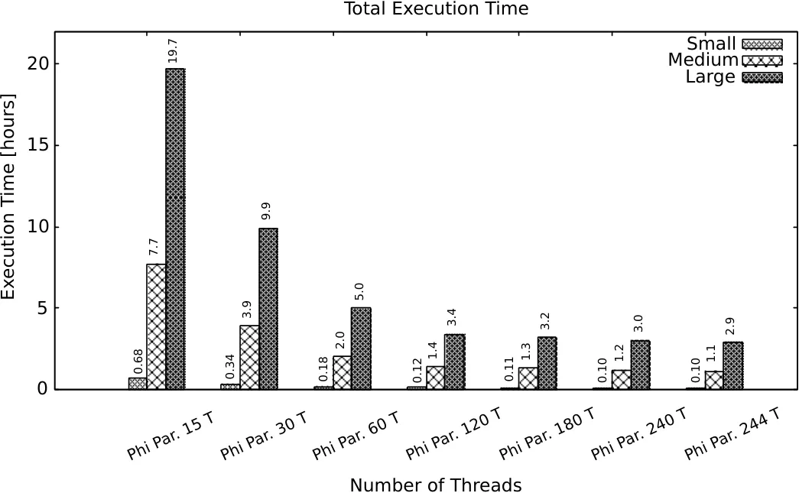
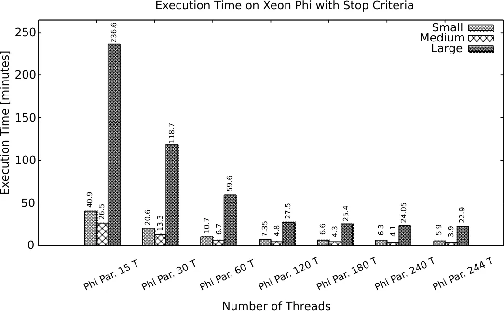
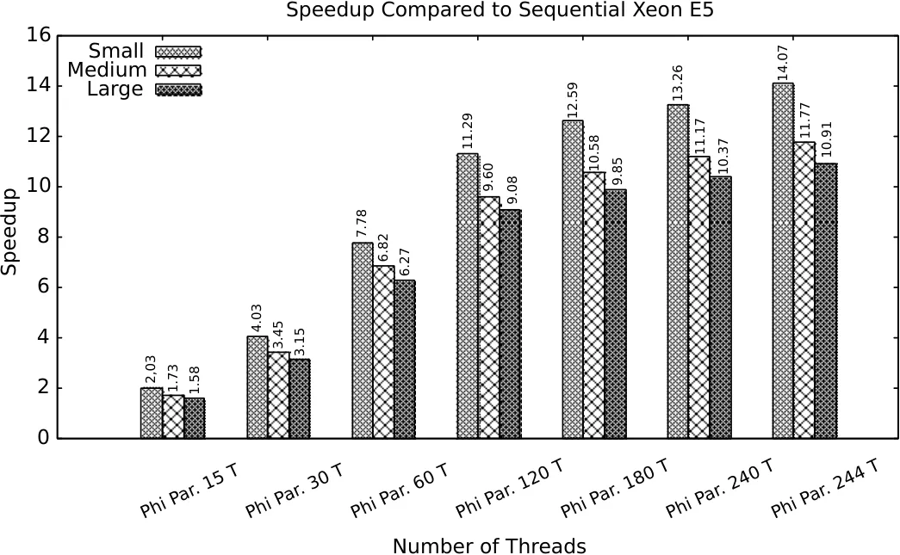
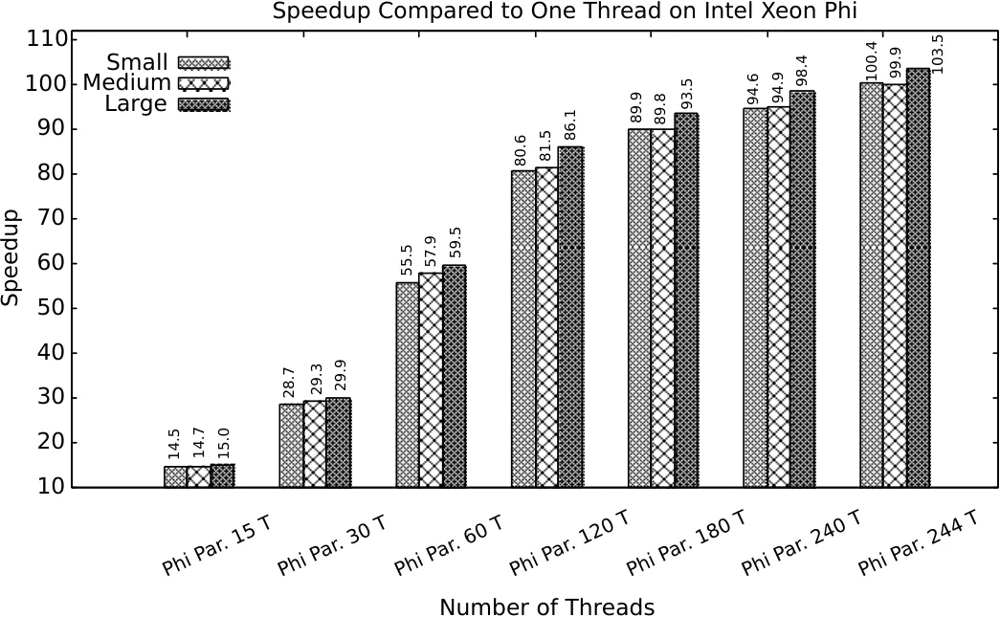
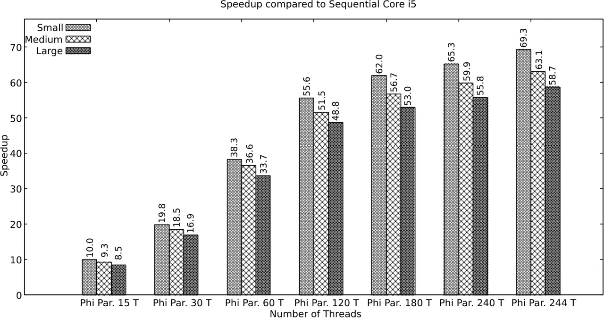
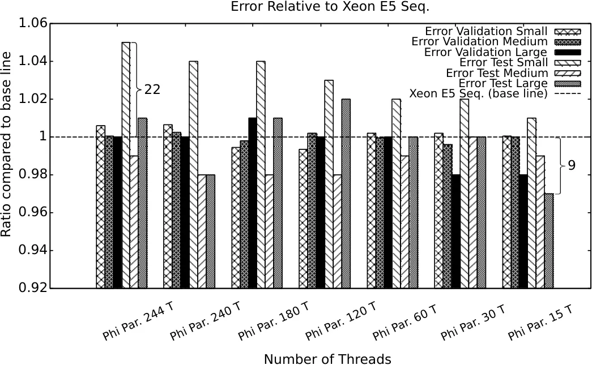
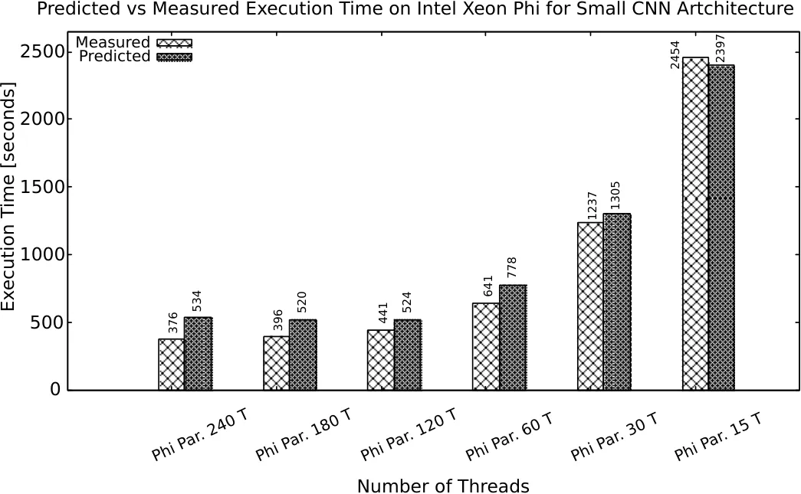
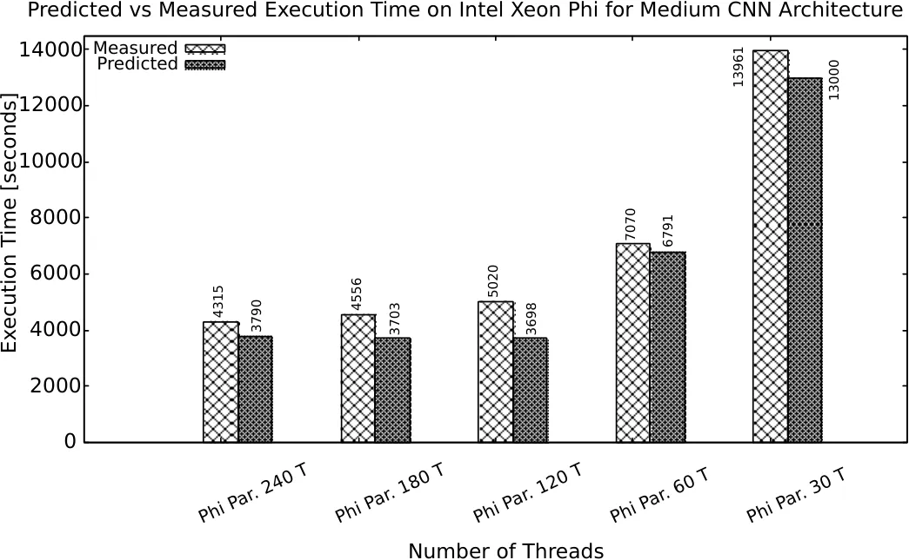
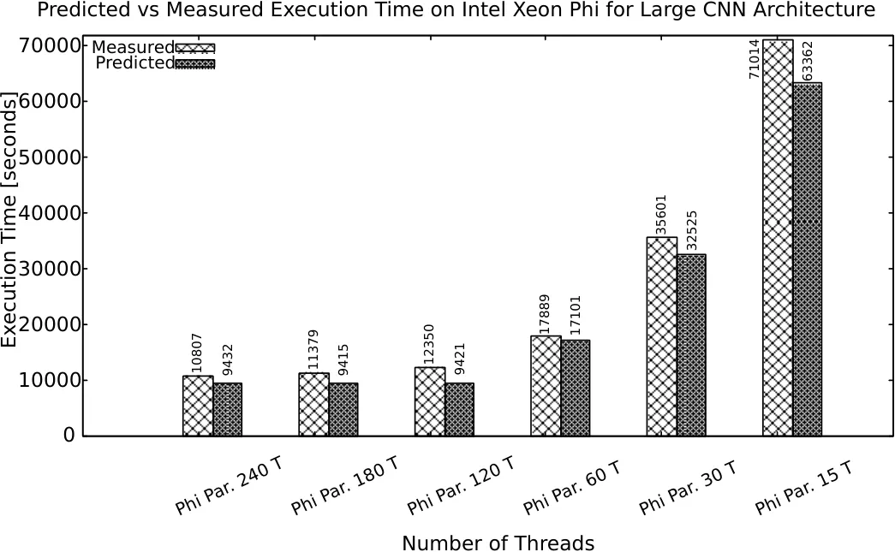

∎

# CHAOS: A Parallelization Scheme for Training Convolutional Neural Networks on Intel Xeon Phi

André Viebke    Suejb Memeti    Sabri Pllana    Ajith Abraham
Affiliation: A. Viebke Affiliation: S. Memeti E-mail:
<suejb.memeti@lnu.se> E-mail: <sabri.pllana@lnu.se>
Affiliation: Linnaeus University  
Address: Department of Computer Science, 351 95 Växjö, Sweden  
A. Viebke:  
S. Memeti:  
S. Pllana: E-mail: <av22cj@student.lnu.se> Affiliation: Machine
Intelligence Research Labs (MIR Labs)  
Address: 1, 3rd Street NW, P.O. Box 2259 Auburn, Washington 98071, USA
E-mail: <ajith.abraham@ieee.org>

Received: date / Accepted: date

###### Abstract

Deep learning is an important component of big-data analytic tools and
intelligent applications, such as, self-driving cars, computer vision,
speech recognition, or precision medicine. However, the training process
is computationally intensive, and often requires a large amount of time
if performed sequentially. Modern parallel computing systems provide the
capability to reduce the required training time of deep neural networks.
In this paper, we present our parallelization scheme for training
convolutional neural networks (CNN) named Controlled Hogwild with
Arbitrary Order of Synchronization (CHAOS). Major features of CHAOS
include the support for thread and vector parallelism, non-instant
updates of weight parameters during back-propagation without a
significant delay, and implicit synchronization in arbitrary order.
CHAOS is tailored for parallel computing systems that are accelerated
with the Intel Xeon Phi. We evaluate our parallelization approach
empirically using measurement techniques and performance modeling for
various numbers of threads and CNN architectures. Experimental results
for the MNIST dataset of handwritten digits using the total number of
threads on the Xeon Phi show speedups of up to $`103\times`$ compared to
the execution on one thread of the Xeon Phi, $`14\times`$ compared to
the sequential execution on Intel Xeon E5, and $`58\times`$ compared to
the sequential execution on Intel Core i5.

###### Keywords: 

parallel programming deep learning convolutional neural networks Intel
Xeon Phi

## 1 Introduction

Traditionally engineers developed applications by specifying computer
instructions that determined the application behavior. Nowadays
engineers focus on developing and implementing sophisticated deep
learning models that can learn to solve complex problems. Moreover, deep
learning algorithms \[27\] can learn from their own experience rather
than that of the engineer.

Many private and public organizations are collecting huge amounts of
data that may contain useful information from which valuable knowledge
may be derived. With the pervasiveness of the Internet of Things the
amount of available data is getting much larger \[20\]. Deep learning is
a useful tool for analyzing and learning from massive amounts of data
(also known as Big Data) that may be unlabeled and unstructured \[47,
44, 36\]. Deep learning algorithms can be found in many modern
applications \[54, 50, 19, 56, 48, 17, 21, 59\], such as, voice
recognition, face recognition, autonomous cars, classification of liver
diseases and breast cancer, computer vision, or social media.

A Convolutional Neural Network (CNN) is a variant of a Deep Neural
Network (DNN) \[14\]. Inspired by the visual cortex of animals, CNNs are
applied to state-of-the-art applications, including computer vision and
speech recognition \[15\]. However, supervised training of CNNs is
computationally demanding and time consuming, and in many cases, several
weeks are required to complete a training session. Often applications
are tested with different parameters, and each test requires a full
session of training.

Multi-core processors \[55\] and in particular many-core \[5\]
processing architectures, such as the NVIDIA Graphical Processing Unit
(GPU) \[37\] or the Intel Xeon Phi \[8\] co-processor, provide
processing capabilities that may be used to significantly speed-up the
training of CNNs. While existing research \[12, 53, 48, 57, 41\] has
addressed extensively the training of CNNs using GPUs, so far not much
attention is given to the Intel Xeon Phi co-processor. Beside the
performance capabilities, the Xeon Phi deserves our attention because of
programmability \[38\] and portability \[23\].

In this paper, we present our parallelization scheme for training
convolutional neural networks, named Controlled Hogwild with Arbitrary
Order of Synchronization (CHAOS). CHAOS is tailored for the Intel Xeon
Phi co-processor and exploits both the thread- and SIMD-level
parallelism. The thread-level parallelism is used to distribute the work
across the available threads, whereas SIMD parallelism is used to
compute the partial derivatives and weight gradients in convolutional
layer. Empirical evaluation of CHAOS is performed on an Intel Xeon Phi
7120 co-processor. For experimentation, we use various number of
threads, different CNNs architectures, and the MNIST dataset of
handwritten digits \[29\]. Experimental evaluation results show that
using the total number of available threads on the Intel Xeon Phi we can
achieve speedups of up to $`103\times`$ compared to the execution on one
thread of the Xeon Phi, $`14\times`$ compared to the sequential
execution on Intel Xeon E5, and $`58\times`$ compared to the sequential
execution on Intel Core i5. The error rates of the parallel execution
are comparable to the sequential one. Furthermore, we use performance
prediction to study the performance behavior of our parallel solution
for training CNNs for numbers of cores that go beyond the generation of
the Intel Xeon Phi that was used in this paper. The main contributions
of this paper include:

- •
  design and implementation of CHAOS parallelization scheme for training
  CNNs on the Intel Xeon Phi,
- •
  performance modeling of our parallel solution for training CNNs on the
  Intel Xeon Phi,
- •
  measurement-based empirical evaluation of CHAOS parallelization
  scheme,
- •
  model-based performance evaluation for future architectures of the
  Intel Xeon Phi.

The rest of the paper is organized as follows. We discuss the related
work in Section 2. Section 3 provides background information on CNNs and
the Intel Xeon Phi many-core architecture. Section 4 discusses the
design and implementation aspects of our parallelization scheme. The
experimental evaluation of our approach is presented in Section 5. We
summarize the paper in Section 6.

## 2 Related Work

In comparison to related work that target GPUs, the work related to
machine learning for Intel Xeon Phi is sparse. In this section, we
describe machine learning approaches that target the Intel Xeon Phi
co-processor, and thereafter we discuss CNN solutions for GPUs and
contrast them to our CHAOS implementation.

### 2.1 Machine Learning targeting Intel Xeon Phi

In this section, we discuss existing work for Support Vector Machines
(SVMs), Restricted Boltzmann Machines (RBMs), sparse auto encoders and
the Brain-State-in-a-Box (BSB) model.

You et al. \[58\] present a library for parallel Support Vector
Machines, MIC-SVM, which facilitates the use of SVMs on many- and
multi-core architectures including Intel Xeon Phi. Experiments performed
on several known datasets showed up to 84x speed up on the Intel Xeon
Phi compared to the sequential execution of LIBSVM \[6\]. In comparison
to their work, we target deep learning.

Jin et al. \[22\] perform the training of sparse auto encoders and
restricted Boltzmann machines on the Intel Xeon Phi 5110p. The authors
reported a speed up factor of $`7-10\times`$ times compared to the Xeon
E5620 CPU and more than $`300\times`$ times compared to the un-optimized
version executed on one thread on the co-processor. Their work targets
unsupervised deep learning of restricted Boltzmann machines and sparse
auto encoders, whereas we target supervised deep learning of CNNs.

The performance gain on Intel Xeon Phi 7110p for a model called
Brain-State-in-a-Box (BSB) used for text recognition is studied by Ahmed
et al. in \[2\]. The authors report about two-fold speedup for the
co-processor compared to a CPU with 16 cores when parallelizing the
algorithm. While both approaches target Intel Xeon Phi, our work
addresses training of CNNs on the MNIST dataset.

### 2.2 Related Work Targeting CNNs

In this section, we will discuss CNNs solutions for GPUs in the context
of computer vision (image classification). Work related to MNIST \[29\]
dataset is of most interest, also NORB \[30\] and CIFAR 10 \[25\] is
considered. Additionally, work done in speech recognition and document
processing is briefly addressed. We conclude this section by contrasting
the presented related work with our CHAOS parallelization scheme.

Work presented by Cireşan et al. \[12\] target a CNN implementation
raising the bars for the CIFAR10 (19.51% error rate), NORB (2.53% error
rate) and MNIST (0.35% error rate) datasets. The training was performed
on GPUs (Nvidia GTX 480 and GTX 580) where the authors managed to
decrease the training time severely - up to $`60\times`$ compared to
sequential execution on a CPU - and decrease the error rates to an, at
the time, state-of-the-art accuracy level.

Later, Cireşan et al. \[11\] presented their multi-column deep neural
network for classification of traffic sings. The results show that the
model performed almost human-like (humans'error rate about 0.20%) on the
MNIST dataset, achieving a best error rate of 0.23%. The authors trained
the network on a GPU.

Vrtanoski et al. \[53\] use OpenCL for parallelization of the
back-propagation algorithm for pattern recognition. They showed a
significant cost reduction, a maximum speedup of $`25.8\times`$ was
achieved on an ATI 5870 GPU compared to a Xeon W3530 CPU when training
the model on the MNIST dataset.

The ImageNet challenge aims to evaluate algorithms for large-scale
object detection and image classification based on the ImageNet dataset.
Krizhevsky et al. \[26\] joined the challenge and reduced the error rate
of the test set to 15.3% from the second best 26.2% using a CNN with 5
convolutional layers. For the experiments, two GPUs (Nvidia GTX 580)
were used only communicating in certain layers. The training lasted for
5 to 6 days.

In a later challenge, ILSVRC 2014, a team from Google entered the
competition with GoogleNet, a 22-layer deep CNN and won the
classification challenge with a 6.67% error rate. The training was
carried out on CPUs. The authors state that the network could be trained
on GPUs within a week, illuminating the limited amount of memory to be
one of the major concerns \[48\].

Yadan et al. \[57\] used multiple GPUs to train CNNs on the ImageNet
dataset using both data- and model-parallelism, i.e. either the input
space is divided into mini-batches where each GPU train its own batch
(data parallelism) or the GPUs train one sample together (model
parallelism). There is no direct comparison with the training time on
CPU, however, using 4 GPUs (Nvidia Titan) and model- and
data-parallelism, the network was trained for 4.8 days.

Song et al. \[46\] constructed a CNN to recognize face expressions and
developed a smart-phone app in which the user can capture a picture and
send it to a server hosting the network. The network, predicts a face
expression and sends the result back to the user. With the help of GPUs
(Nvidia Titan), the network was trained in a couple of hours on the
ImageNet dataset.

Scherer et al. \[42\] accelerated the large-scale neural networks with
parallel GPUs. Experiments with the NORB dataset on an Nvidia GTX 285
GPU showed a maximal speedup of $`115\times`$ compared to a CPU
implementation (Core i7 940). After training the network for 360 epochs,
an error rate of 8.6% was achieved.

Cireşan et al. \[10\] combined multiple CNNs to classify German traffic
signs and achieved a 99.15% recognition rate (0.85 % error rate). The
training was performed using an Intel Core i7 and 4 GPUs (2 x GTX 480
and 2 x GTX 580).

More recently Abadi et al. \[1\] presented TensorFlow, a system for
expressing and executing machine learning algorithms including training
deep neural network models.

Researchers have also found CNNs successful for speech tasks. Large
vocabulary continuous speech recognition deals with translation of
continuous speech for languages with large vocabularies. Sainath et al.
\[41\] investigated the advantages of CNNs performing speech recognition
tasks and compared the results with previous DNN approaches. Results
indicated on a 12-14% relative improvement of word error rates compared
to a DNN trained on GPUs.

Chellapilla et al. \[7\] investigated GPUs (Nvidia Geforce 7800 Ultra)
for document processing on the MNIST dataset and achieved a
$`4.11\times`$ speed up compared to the sequential execution a Intel
Pentium 4 CPU running at 2.5 GHz clock frequency.

In contrast to CHAOS, these studies target training of CNNs using GPUs,
whereas our approach addresses training of CNNs on the MNIST dataset
using the Intel Xeon Phi co-processor. While there are several review
papers (such as, \[4, 45, 49\]) and on-line articles (such as, \[35\])
that compare existing frameworks for parallelization of training CNN
architectures, we focus on detailed analysis of our proposed
parallelization approach using measurement techniques and performance
modeling. We compare the performance improvement achieved with CHAOS
parallelization scheme to the sequential version executed on Intel Xeon
Phi, Intel Xeon E5 and Intel Core i5 processor.

## 3 Background

In this section, we first provide some background information related to
the neural networks focusing on convolutional neural networks, and
thereafter we provide some information about the architecture of the
Intel Xeon Phi.

### 3.1 Neural Networks

A Convolutional Neural Network is a variant of a Deep Neural Network,
which introduces two additional layer types: _convolutional layers_ and
_pooling layers_. The mammal visual processing system is hierarchical
(deep) in nature. Higher level features are abstractions of lower level
ones. E.g. to understand speech, waveforms are translated through
several layers until reaching a linguistic level. A similar analogy can
be drawn for images, where edges and corners are lower level
abstractions translated into more spatial patterns on higher levels.
Moreover, it is also known that the animal cortex consists of both
simple and complex cells firing on certain visual inputs in their
receptive fields. Simple cells detect edge-like patterns whereas complex
cells are locally invariant, spanning larger receptive fields. These are
the very fundamental properties of the animal brain inspiring DNNs and
CNNs.

In this section, we first describe the DNNs and the Forward- and
Back-propagation, thereafter we introduce the CNNs.

#### 3.1.1 Deep Neural Networks

The architecture of a DNN consists of multiple layers of neurons.
Neurons are connected to each other through edges (weights). The network
can simply be thought of as a weighted graph; a directed acyclic graph
represents a feed-forward network. The depth and breadth of the network
differs as may the layer types. Regardless of the depth, a network has
at least one input and one output layer. A neuron has a set of incoming
weights, which have corresponding outgoing edges attached to neurons in
the previous layer. Also, a bias term is used at each layer as an
intercept term. The goal of the learning process is to adjust the
network weights and find a global minimum by reducing the overall error,
i.e. the deviation between the predicted and the desired outcome of all
the samples. The resulting weight parameters can thereafter be used to
make predictions of unseen inputs \[3\].

#### 3.1.2 Forward Propagation

DNNs can make predictions by forward propagating an input through the
network. Forward propagation proceeds by performing calculations at each
layer until reaching the output layer, which contains a vector
representing the prediction. For example, in image classification
problems, the output layer contains the prediction score that indicates
the likelihood that an image belongs to a category \[18, 3\].

The forward propagation starts from a given input layer, then at each
layer the activation for a neuron is activated using the equation
$`y^{l}_{i}=\sigma(x^{l}_{i})+I^{l}_{i}`$ where $`y^{l}_{i}`$ is the
output value of neuron $`i`$ at layer $`l`$, $`x^{l}_{i}`$ is the input
value of the same neuron, and $`\sigma`$ (sigmoid) is the activation
function. $`I^{l}_{i}`$ is used for the input layer when there is no
previous layer. The goal of the activation function is to return a
normalized value (sigmoid return \[0,1\] and tanh is used in cases where
the desired return values are \[-1,1\]). The input $`x^{l}_{i}`$ can be
calculated as $`x^{l}_{i}=\sum_{j}(w^{l}_{ji}y^{l-1}_{j})`$ where
$`w^{l}_{ji}`$ denotes the weight between neuron $`i`$ in the current
layer $`l`$, and $`j`$ in the previous layer, and $`y^{l-1}_{j}`$ the
output of the $`j`$th neuron at the previous layer. This process is
repeated until reaching the output layer. At the output layer, it is
common to apply a soft max function, or similar, to squash the output
vector and hence derive the prediction.

#### 3.1.3 Back-Propagation

Back-propagation is the process of propagating errors, i.e. the loss
calculated as the deviation between the predicted and the desired
output, backward in the network, by adjusting the weights at each layer.
The error and partial derivatives $`\delta^{l}_{i}`$ are calculated at
the output layer based on the predicted values from forward propagation
and the labeled value (the correct value). At each layer, the relative
error of each neuron is calculated and the weight parameters are updated
based on how much the neuron participated in the faulty prediction. The
equation:
$`\dfrac{\delta E}{\delta y^{l}_{i}}=\sum{w^{l}_{ij}\dfrac{\delta E}{\delta x^{l+1}_{j}}}`$
denotes that the partial derivative of neuron $`i`$ at the current layer
$`l`$ is the sum of the derivatives of connected neurons at the next
layer multiplied with the weights, assuming $`w^{l}`$ denotes the
weights between the maps. Additionally, a decay is commonly used to
control the impact of the updates, which is omitted in the above
calculations. More concretely, the algorithm can be thought of as
updating the layer's weights based on ”how much it was responsible for
the errors in the output” \[18, 3\].

#### 3.1.4 Convolutional Neural Networks

A Convolutional Neural Network is a multi-layer model constructed to
learn various levels of representations where higher level
representations are described based on the lower level ones \[43\]. It
is a variant of deep neural network that introduces two new layer types:
_convolutional_ and _pooling_ layers.

The convolutional layer consists of several feature maps where neurons
in each map connect to a grid of neurons in maps in the previous layer
through overlapping kernels. The kernels are tiled to cover the whole
input space. The approach is inspired by the receptive fields of the
mammal visual cortex. All neurons of a map extract the same features
from a map in the previous layer as they share the same set of weights.

Pooling layers intervene convolutional layers and have shown to lead to
faster convergence. Each neuron in a pooling layer outputs the
(maximum/average) value of a partition of neurons in the previous layer,
and hence only activates if the underlying grid contains the sought
feature. Besides from lowering the computational load, it also enables
position invariance and down samples the input by a factor relative to
the kernel size \[28\].

Figure 1 shows LeNet-5 that is an example of a Convolutional Neural
Network. Each layer of convolution and pooling (that is a specific
method of sub-sampling used in LeNet) comprise several feature maps.
Neurons in the feature map cover different sub-fields of the neurons
from the previous layer. All neurons in a map share the same weight
parameters, therefore they extract the same features from different
parts of the input from the previous layers.

Figure 1: The LeNet-5 architecture.

CNNs are commonly constructed similarly to the LeNet-5, beginning with
an input layer, followed by several convolutional/pooling combinations,
ending with a fully connected layer and an output layer \[28\]. Recent
networks are much deeper and/or wider, for instance, the GoogleNet
\[48\] consists of 22 layers.

Various implementations target the Convolutional Neural Networks, such
as: _EbLearn_ at New York University and _Caffe_ at Berkeley. As a basis
for our work we selected a project developed by Cireşan \[9\]. This
implementation targets the MNIST dataset of handwritten digits, and has
the possibility to dynamically configure the definition of layers, the
activation function and the connection types using a configuration file.

### 3.2 Parallel Systems accelerated with Intel®Xeon Phi™

Figure 2: An overview of our Emil system accelerated with the Intel Xeon
Phi.

Figure 2 depicts an overview of the Intel Xeon Phi (codenamed Knights
Corner) architecture. It is a many-core shared-memory co-processor,
which runs a lightweight Linux operating system that offers the
possibility to communicate with it over _ssh_. The Xeon Phi offers two
programming models:

1.  1.  _offload_ - parts of the applications running on the host are
        offloaded to the co-processor
2.  2.  _native_ - the code is compiled specifically for running natively on
        the co-processor. The code and all the required libraries should be
        transferred on the device. In this paper, we focus on the native
        mode.

The Intel Xeon Phi (type 7120P used in this paper) comprises 61 x86
cores, each core runs at 1.2 GHz base frequency, and up to 1.3GHz on max
turbo frequency \[8\]. Each core can switch between four hardware
threads in a round-robin manner, which amounts to a total of 244 threads
per co-processor. Theoretically, the co-processor can deliver up to one
teraFLOP/s of double precision performance, or two teraFLOP/s of single
precision performance. Each core has its own L1 (32KB) and L2 (512KB)
cache. The L2 cache is kept fully coherent by a global distributed
tag-directory (TD). The cores are connected through a bidirectional ring
bus interconnect, which forms a unified shared L2 cache of 30.5MB. In
addition to the cores, there are 16 memory channels that in theory offer
a maximum memory bandwidth of 352GB/s. The GDDR memory controllers
provide direct interface to the GDDR5 memory, and the PCIe Client Logic
provides direct interface to the PCIe bus.

Efficient usage of the available vector processing units of the Intel
Xeon Phi is essential to fully utilize the performance of the
co-processor \[52\]. Through the 512-bit wide SIMD registers it can
perform 16 (16 wide $`\times`$ 32 bit) single-precision or 8 (8 wide
$`\times`$ 64 bit) double-precision operations per cycle.

The performance capabilities of the Intel Xeon Phi are discussed and
investigated empirically by different researches within several domain
applications \[16, 32, 34, 51, 31, 33\].

## 4 Our Parallelization Scheme for Training Convolutional Neural Networks on Intel Xeon Phi

The parallelism can be either divided data-wise, i.e. threads process
several inputs concurrently, or model-wise, i.e. several threads share
the computational burden of one input. Whether one approach can be
advantageous over the other mainly depends on the synchronization
overhead of the weight vectors and how well it scales with the number of
processing units.

In this section, we first discuss the design aspects of our
parallelization scheme for training convolutional neural networks.
Thereafter, we discuss the implementation aspects that allow full
utilization of the Intel Xeon Phi co-processor.

### 4.1 Design Aspects

On-line stochastic gradient descent has the advantage of instant updates
of weights for each sample. However, the sequential nature of the
algorithm yields impediments as the number of multi- and many-core
platforms are emerging. We consider different existing parallelization
strategies for stochastic gradient descent:

Strategy A: Hybrid - uses both data- and model parallelism, such that
data parallelism is applied in convolutional layers, and the model
parallelism is applied in fully connected layers \[24\].

Strategy B: Averaged Stochastic Gradient - divides the input into
batches and feeds each batch to a node. This strategy proceeds as
follows: (1) Initialize the weights of the learner by randomization; (2)
Split the training data into _n_ equal chunks and send them to the
learners; (3) each learner process the data and calculates the weight
gradients for its batch; (4) send the calculated gradients back to the
master; (5) the master computes and updates the new weights; and (6) the
master sends the new weights to the nodes and a new iteration begins
\[13\]. The convergence speed is slightly worse than for the sequential
approach, however the training time is heavily reduced.

Strategy C: Delayed Stochastic Gradient - suggests updating the weight
parameters in a round-robin fashion by the workers. One solution is
splitting the samples by the number of threads, and let each thread work
on its own distinct chunk of samples, only sharing a common weight
vector. Threads are only allowed to update the weight vector in a
round-robin fashion, and hence each update will be delayed \[60\].

Strategy D: HogWild! - is a stochastic gradient descent without locks.
The approach is applicable for sparse optimization problems
(threads/core updates do not conflict much) \[40\].

In this paper, we introduce Controlled Hogwild with Arbitrary Order of
Synchronization (CHAOS), a parallelization scheme that can exploit both
thread- and SIMD-level parallelism available on Intel Xeon Phi. CHAOS is
a data-parallel controlled version of HogWild! with delayed updates,
which combines parts of strategies A-D. The key aspects of CHAOS are:

- •
  _Thread parallelism_ - The overview of our parallelization scheme is
  depicted in Figure 3. Initially for as many threads as there are
  available network instances are created, which share weight
  parameters, whereas to support concurrent processing of images some
  variables are private to each thread. After the initialization of CNNs
  and images is done, the process of training starts. The major steps of
  an epoch include: _Training_, _Validation_ and _Testing_. The first
  step, _Training_, proceeds with each worker picking an image, forward
  propagates it through the network, calculates the error, and
  back-propagates the partial derivatives, adjusting the weight
  parameters. Since each worker picks a new image from the set, other
  workers do not have to wait for significantly slow workers. After
  Training, each worker participates in _Validation_ and _Testing_
  evaluating the prediction accuracy of the network by predicting images
  in the validation and test set accordingly. Adoption of data
  parallelism was inspired by Krizhevsky \[24\], promoting data
  parallelism for convolutional layers as they are computationally
  intensive.
- •
  _Controlled HogWild_ - during the back-propagation the shared weights
  are updated after each layer's computations (a technique inspired by
  \[60\]), whereas the local weight parameters are updated instantly (a
  technique inspired by \[40\]), which means that the gradients are
  calculated locally first then shared with other workers. However, the
  update to the global gradients can be performed at any time, which
  means that there is no need to wait for other workers to finish their
  updates. This technique, which we refer to as non-instant updates of
  weight parameters without significant delay, allows us to avoid
  unnecessary cache line invalidation and memory writes.
- •
  _Arbitrary Order of Synchronization_ - There is no need for explicit
  synchronization, because all workers share weight parameter. However,
  an implicit synchronization is performed in an arbitrary order because
  writes are controlled by a first-come-first schedule and reads are
  performed on demand.

Figure 3: Major activities of _CHAOS_ parallelization scheme.

The main goal of CHAOS is to minimize the time spent in the
convolutional layers, which can be done through data parallelism,
adapting the knowledge presented in strategy A. In strategy B, the
synchronization is performed because of averaging worker's gradient
calculations. Since work is distributed, computations are performed on
stale parameters. The strategy can be applied in distributed and
non-distributed settings. The division of work over several distributed
workers was adapted in CHAOS. In strategy C, the updates are postponed
using a round-robin-fashion where each thread gets to update when it is
its turn. The difference compared to strategy B is that instances train
on the same set of weights and no averaging is performed. The advantage
is that all instances train on the same weights. The disadvantage of
this approach is the delayed updates of the weight parameters as they
are performed on stale data. Training on shared weights and delaying the
updates are adopted in CHAOS. Strategy D presents a lock-free approach
of updating the weight parameters, updates are performed instantly
without any locks. Our updates are not instant, however, after computing
the gradients there is nothing prohibiting a worker contributing to the
shared weights, the notion of instant inspired CHAOS.

### 4.2 Implementation Aspects

The main goal is to utilize the many cores of the Intel Xeon Phi
co-processor efficiently to lower the training time (execution time) of
the selected CNN algorithm, at the same time maintaining low deviation
in error rates, especially on the test set. Moreover, the quality of the
implementation is verified using errors and error rates on the
validation and test set.

In the sequential version, only minor modifications of the original
version were performed. Mainly, we added a _Reporter_ class to serialize
execution results. The instrumentation should not add any time penalties
in practice. However, if these penalties occur in the sequential version
they are likely to imply corresponding penalties in the parallel
version, therefore it should not impact the results.

The main goal of the parallel version is to lower the execution time of
the sequential implementation and to scale well with the number of
processing units on the co-processor. To facilitate this, it is
essential to fully consider the characteristics of the underlying
hardware. From results derived in the sequential execution we found the
hotspots of the application to be predominantly the convolutional
layers. The time spent in both forward- and back-propagation is about
94% of the total time of all layers (up to 99% for the larger network),
which is depicted in the Table 1.

| Layer type      | Forward propagation | Back-propagation | % of total |
| --------------- | ------------------- | ---------------- | ---------- |
| Fully connected | 40.9 s              | 30.9 s           | 1.4 %      |
| Convolutional   | 3,241 s             | 1,438 s          | 93.7 %     |
| Max pooling     | 188.3 s             | 8.2 s            | 3.9 %      |

Table 1: Execution times at each layer for the sequential version on the
Xeon E5 using the small CNN architecture.

In our proposed strategy, a set of $`N`$ network instances are created
and assigned to $`T`$ threads. We assume $`T==N`$, i.e. one thread per
network instance. $`T`$ threads are spawned, each responsible for its
own instance.

The overview of the algorithm is shown in Fig. 3. In Fig. 4 the
training, testing and back-propagation phase are shown in details.
Training (see Fig. 4(a)) picks an image, forward propagates it,
determines the loss and back-propagates the partial derivatives (deltas)
in the network - this process is done simultaneously by all workers,
each worker processing one image. Each worker participating in testing
(see Fig. 4(b)), picks an image, forward propagates it and then collects
errors and error rates. The results are cumulated for all threads.
Perhaps the most interesting part is the back-propagation (see Fig.
4(c)). The shared weights are used when propagating the deltas, however,
before updating the weight gradients, the pointers are set to the local
weights. Thereafter the algorithm proceeds by updating the local weights
first. When a worker has contributions to the global weights it can
update in a controlled manner, avoiding data races. Updates immediately
affect other workers in their training process. Hence the update is
delayed slightly, to decrease the invalidation of cache lines, yet
almost instant and workers do not have to wait for a longer period
before contributing with their knowledge.

(a) Training

(b) Testing

(c) Back-propagation

Figure 4: The detailed phase of training, testing and back-propagation
of one image.

To see why delays are important, consider the following scenario: If
training several network instances concurrently, they share the same
weight vectors, other variables are thread private. The major
consideration lies in the weight updates. Let $`W^{j}_{l}`$ be the
$`j`$-th weight on the $`l`$-th layer. In accordance with the current
implementation, a weight is updated several times since neurons in a map
(on the same layer) share the same weights, and the kernel is shifted
over the neurons. Further assume that several threads work on the same
weight $`W^{j}_{l}`$ at some point in time. Even if other threads only
read the weights, their local data, as saved in the Level 2 cache, will
be invalidated and a re-fetch is required to assert their integrity.
This happens because cache lines are shared between cores. The approach
of slightly delaying the updates and forcing one thread to update in
atomicity leads to fewer invalidations. Still a major disadvantages is
that the shared weights does not infer any data locality (data cannot
retain completely in Level 2 cache for a longer period).

[⬇](data:text/plain;base64,cmVtYXJrICMxNTQ3NTogLS0tIGJlZ2luIHZlY3RvciBsb29wIGNvc3Qgc3VtbWFyeSAtLS0KcmVtYXJrICMxNTQ3Njogc2NhbGFyIGxvb3AgY29zdDogMzAKcmVtYXJrICMxNTQ3NzogdmVjdG9yIGxvb3AgY29zdDogNy41MDAKcmVtYXJrICMxNTQ3ODogZXN0aW1hdGVkIHBvdGVudGlhbCBzcGVlZHVwOiAzLjk4MApyZW1hcmsgIzE1NDc5OiBsaWdodHdlaWdodCB2ZWN0b3Igb3BlcmF0aW9uczogNgpyZW1hcmsgIzE1NDgwOiBtZWRpdW0tb3ZlcmhlYWQgdmVjdG9yIG9wZXJhdGlvbnM6IDEKcmVtYXJrICMxNTQ4MTogaGVhdnktb3ZlcmhlYWQgdmVjdG9yIG9wZXJhdGlvbnM6IDEKcmVtYXJrICMxNTQ4ODogLS0tIGVuZCB2ZWN0b3IgbG9vcCBjb3N0IHN1bW1hcnkgLS0t)

remark \#15475: --- begin vector loop cost summary ---

remark \#15476: scalar loop cost: 30

remark \#15477: vector loop cost: 7.500

remark \#15478: estimated potential speedup: 3.980

remark \#15479: lightweight vector operations: 6

remark \#15480: medium-overhead vector operations: 1

remark \#15481: heavy-overhead vector operations: 1

remark \#15488: --- end vector loop cost summary ---

Listing 1: An extract from the vectorization report for the partial
derivative updates in the convolutional layer.

To further decrease the time spent in convolutional layers, loops were
vectorized to facilitate the vector processing unit of the co-processor.
Data was allocated using $`\_mm\_malloc()`$ with $`64`$ byte alignment
increasing the accuracy of memory requests. The vectorization was
achieved by adding $`\#pragma~omp~simd`$ instructions and explicitly
informing the compiler of the memory alignment using
$`\_\_assume\_aligned()`$. Some unnecessary overhead is added through
the lack of data alignment of the deltas and weights. The computations
of partial derivatives and weight gradients in the convolutional layers
are performed in a SIMD way, which allows efficient utiliziation of the
512 bit wide vector processing units of the Intel Xeon Phi. An extract
from the vectorization report (see Listing 1), for the updates of
partial derivatives in the convolutional layer shows an estimated
potential speed up of $`3.98\times`$ compared to the scalar loop.

Further algorithmic optimizations were performed. For example: (1) The
images are loaded into a pre-allocated memory instead of allocating new
memory when requesting an image; (2) Hardware pre-fetching was applied
to mitigate the shortcomings of the in-order-execution scheme.
Pre-fetching loads data to L2 cache to make it available for future
computations; (3) Letting workers pick images instead of assigning
images to workers, allow for a smaller overhead at the end of a
work-sharing construct; (4) The number of locks are minimized as far as
possible; (5) We made most of the variables thread private to achieve
data locality.

The training phase was distributed through thread parallelism, dividing
the input space over available workers. CHAOS uses the vector processing
units to improve performance and tries to retain local variables in
local cache as far as possible. The delayed updates decrease the
invalidation of cache lines. Since weight parameters are shared among
threads, there is a possibility that data can be fetched from another
core's cache instead of main memory, reducing the wait times. Also, the
memory was aligned to 64 bytes and unnecessary system calls were removed
from the parallel work.

## 5 Evaluation

In this section, we first describe the experimentation environment used
for evaluation of our CHAOS parallelization scheme. Thereafter, we
describe the development of a performance model for CHAOS. Finally we
discuss the obtained results with respect to scalability, speedup, and
prediction accuracy.

### 5.1 Experimental Setup

In this study, OpenMP was selected to facilitate the utilization of
thread- and SIMD-parallelism available in the Intel Xeon Phi
co-processor. C++ programming language is used for algorithm
implementation. The Intel Compiler 15.0.0 was used for native
compilation of the application for the co-processor, whereas the $`O3`$
level was used for optimization.

_System Configuration_ - To evaluate our approach we use an Intel Xeon
Phi accelerator that comprises 61 cores that run at 1.2 GHz. For
evaluation 1, 15, 30, 60, 120, 180, 240, and 244 threads of the
co-processor were used. Each thread was responsible for one network
instance. For comparison, we use two general purpose CPUs, including the
Intel Xeon E5-s695v2 that runs at 2.4 GHz clock frequency, and the Intel
Core i5 661 that runs at 3.33GHz clock frequency.

_Data Set_ - To evaluate our approach, the MNIST \[29\] dataset of
handwritten digits is used. In total the MNIST dataset comprises 70000
images, 60000 of which are used for training/validation and the rest for
testing.

_CNN Architectures_ - Three different CNN architectures were used for
evaluation, _small, medium_ and _large_. The small and medium
architecture were trained for 70 epochs, and the large one for 15
epochs, using a starting decay (eta) of 0.001 and factor of 0.9. The
small and medium network consist of seven layers in total (one input
layer, two convolutional layers, two max-poling layers, one fully
connected layer and the output layer). The difference between these two
networks is in the number of feature maps per layer and the number of
neurons per map. For example, the first convolutional layer of the small
network has five feature maps and 3380 neurons, whereas the first
convolutional layer of the medium network has 20 feature maps and 13520
neurons. The large network differs from the small and the medium network
in the number of layers as well. In total, there are nine layers, one
input layer, three convolutional layers, three max-pooling layers, one
fully connected layer and the output layer. Detailed information
(including the number and the size of feature maps, neurons, the size of
the kernels and the weights) about the considered architectures is
listed in Table 2.

To address the variability in performance measurements we have repeated
the execution of each parallel configuration for three times.

|        |                 |      |          |         |             |         |
| ------ | --------------- | ---- | -------- | ------- | ----------- | ------- |
|        | Layer Type      | Maps | Map Size | Neurons | Kernel Size | Weights |
| Large  | Input           | -    | 29x29    | 841     | -           | -       |
|        | Convolutional   | 20   | 26x26    | 13520   | 4x4         | 340     |
|        | Max-pooling     | 20   | 26x26    | 13520   | 1x1         | -       |
|        | Convolutional   | 60   | 22x22    | 29040   | 5x5         | 30060   |
|        | Max-pooling     | 60   | 11x11    | 7260    | 2x2         | -       |
|        | Convolutional   | 100  | 6x6      | 3600    | 6x6         | 216100  |
|        | Max-pooling     | 100  | 2x2      | 900     | 3x3         | -       |
|        | Fully connected | -    | 150      | 150     | -           | 135150  |
|        | Output          | -    | 10       | 10      | -           | 1510    |
| Medium | Input           | -    | 29x29    | 841     | -           | -       |
|        | Convolutional   | 20   | 26x26    | 13520   | 4x4         | 340     |
|        | Max-pooling     | 20   | 13x13    | 3380    | 2x2         | -       |
|        | Convolutional   | 40   | 9x9      | 3240    | 5x5         | 20040   |
|        | Max-pooling     | 40   | 3x3      | 360     | 3x3         | -       |
|        | Fully connected | -    | 150      | 150     | -           | 54150   |
|        | Output          | -    | 10       | 10      | -           | 1510    |
| Small  | Input           | -    | 29x29    | 841     | -           | -       |
|        | Convolutional   | 5    | 26x26    | 3380    | 4x4         | 85      |
|        | Max-pooling     | 5    | 13x13    | 845     | 2x2         | -       |
|        | Convolutional   | 10   | 9x9      | 810     | 5x5         | 1260    |
|        | Max-pooling     | 10   | 3x3      | 90      | 3x3         | -       |
|        | Fully connected | -    | 50       | 50      | -           | 4550    |
|        | Output          | -    | 10       | 10      | -           | 510     |

Table 2: CNN architectures for experimental evaluation of CHAOS.

### 5.2 Performance Model

A performance model \[39\] enables us to reason about the behavior of an
implementation in future execution contexts. Our performance model for
CHAOS implementation can predict the performance for numbers of threads
that go beyond the number of hardware threads supported in the Intel
Xeon Phi model that we used for evaluation. Additionally, it can predict
the performance of different CNN architectures with various number of
images and epochs.

The goal is to construct a parametrized model with the following
parameters $`ep,i,it`$ and $`p`$, where $`ep`$ stands for the number of
epochs, $`i`$ indicates the number of images in the training/validation
set, $`it`$ stands for the number of images in the test set, and $`p`$
is the number of processing units. Table 3 lists the full set of
variables used in our performance model, some of which are hardware
dependent and some others are independent of the underlying hardware.
Each variable is either measured, calculated, constant, or parameter in
the model. Listing 5 shows the formula used for our performance
prediction model.

$`\displaystyle T(i,it,ep,p,s)=T_{comp}(i,it,ep,p,s)+T_{mem}(ep,i,p)`$
$`\displaystyle=\Bigg(\dfrac{Prep+4*i+2*it+10*ep}{s}`$ (sequential work)
$`\displaystyle+\Bigg(\bigg(\Big(\dfrac{FProp+BProp}{s}\Big)*\dfrac{i}{p_{i}}*ep\bigg)`$
(training)
$`\displaystyle+\bigg(\Big(\dfrac{FProp}{s}\Big)*\dfrac{i}{p_{i}}*ep\bigg)`$
(validation)
$`\displaystyle+\bigg(\Big(\dfrac{FProp}{s}\Big)*\dfrac{it}{p_{it}}*ep\big)\Bigg)`$
(testing) $`\displaystyle*CPI\Bigg)*OperationFactor+T_{mem}(ep,i,p)`$

Listing 1: The formula for our performance prediction model.

The total execution time ($`T`$) is the sum of computations time
($`T_{comp}`$) and memory operations ($`T_{mem}`$). $`T`$ depends on
several factors including: speed, number of processing units,
communication costs (such as network latency), and memory contention.
The $`T_{comp}`$ is sum of sequential work, training, validation, and
testing. Most interesting is contentions causing wait times, including
memory latencies and synchronization overhead. $`T_{mem}`$ adds memory
and synchronization overheads. The contention is measured through an
experimental approach by executing a small script on the co-processor
for different thread counts, weights and layers.

[TABLE]

- \*
  The parameter is only used in prediction a)
- - The parameter is only used in prediction b)

Table 3: Variables used in the performance model.

We define $`T_{mem}(ep,i,p)=\frac{MemoryContention*ep*i}{p}`$ where
$`MemoryContention`$ is the measured memory contention when $`p`$
threads are fighting for the I/O weights concurrently. Table 4 depicts
the measured and predicted memory contentions for the Intel Xeon Phi.

Our performance prediction model is not concerned with any practical
measurements except for $`T_{mem}`$. Along with the CPI and
OperationFactor it is possible to derive the number of instructions
(theoretically) per cycle that each thread can perform.

| \# Threads | Small            | Medium           | Large            |
| ---------- | ---------------- | ---------------- | ---------------- |
| 1          | $`7.10*10^{-6}`$ | $`1.56*10^{-4}`$ | $`8.83*10^{-4}`$ |
| 15         | $`6.40*10^{-4}`$ | $`2.00*10^{-3}`$ | $`8.75*10^{-3}`$ |
| 30         | $`1.36*10^{-3}`$ | $`3.97*10^{-3}`$ | $`1.67*10^{-2}`$ |
| 60         | $`3.07*10^{-3}`$ | $`8.03*10^{-3}`$ | $`3.22*10^{-2}`$ |
| 120        | $`6.76*10^{-3}`$ | $`1.65*10^{-2}`$ | $`6.74*10^{-2}`$ |
| 180        | $`9.95*10^{-3}`$ | $`2.50*10^{-2}`$ | $`1.00*10^{-1}`$ |
| 240        | $`1.40*10^{-2}`$ | $`3.83*10^{-2}`$ | $`1.38*10^{-1}`$ |
| 480^(\*)   | $`2.78*10^{-2}`$ | $`7.31*10^{-2}`$ | $`2.73*10^{-1}`$ |
| 960^(\*)   | $`5.60*10^{-2}`$ | $`1.47*10^{-1}`$ | $`5.46*10^{-1}`$ |
| 1,920^(\*) | $`1.12*10^{-1}`$ | $`2.95*10^{-1}`$ | $`1.09`$         |
| 3,840^(\*) | $`2.25*10^{-1}`$ | $`5.91*10^{-1}`$ | $`2.19`$         |

- \*
  Predicted values

Table 4: Measured and predicted memory contention for the Intel Xeon
Phi.

We use $`Prep`$ to be different for each CNN architecture
($`10^{9},10^{10}`$ and $`10^{11}`$ for small, medium and large
architecture respectively). The $`OperationFactor`$ is adjusted to
closely match the measured value for 15 threads, and mitigate the
approximations done for instructions in the first place, at the same
time account for vectorization.

When one hardware thread is present per core, one instruction per cycle
can be assumed. For 4 threads per core, only 0.5 instructions per cycle
can be assumed, which means that each thread gets to execute two
instructions every fourth cycle ($`CPI`$ of 2) and hence we use the
$`CPI`$ factor to control the best theoretical amount of instructions a
thread can retire. The speed $`s`$ is defined in Table 3. $`FProp`$ and
$`BProp`$ are placeholders for the actual number of operations.

### 5.3 Results

In this section, we analyze the collected data with regards to the
execution time and speedup for varying number of threads and CNN
architectures. The errors and error rates (incorrect predictions) are
used to validate our implementation. Furthermore, we discuss the
deviation in number of incorrectly predicted images.

The execution time is the total time the algorithm executes, excluding
the time required to initialize the network instances and images (for
both the sequential and parallel version). The speed up is measured as
the relativeness between two execution times, with the sequential
execution times of Intel Xeon E5, Intel Core i5, and Xeon Phi as the
base. The error rate is the fraction of images the network was unable to
predict and the error the cumulated loss from the loss function.

In the figures and tables in this section, we use the following
notations: _Par_ refers to the parallel version, _Seq_ is the sequential
version, and _T_ denotes threads, e.g. _Phi Par. 1 T_ is the parallel
version and one thread on the Xeon Phi.

Result 1: _The CHAOS parallelization scheme scales gracefully to large
numbers of threads._

Figure 6 depicts the total execution time of the parallel version of the
implementation running on the Xeon Phi and the sequential version
running on the Xeon E5 CPU. We vary the number of threads on the Xeon
Phi between _1, 15, 30, 60, 120, 180, 240,_ and _244_, and the CNN
architectures between _small, medium_ and _large_. We elide the results
of _Xeon E5 Seq._ and _Phi Par. 1T_ for simplicity and clarity. The
large CNN architecture requires 31.1 hours to be completed sequentially
on the Xeon E5 CPU, whereas using one thread on the Xeon Phi requires
295.5 hours. By increasing the number of threads to 15, 30, and 60, the
execution time decreases to 19.7, 9.9, and 5.0 hours respectively. Using
the total number of threads (that is 244) on the Xeon Phi the training
may be completed in only 2.9 hours. We may observe a promising
scalability while increasing the number of threads. Similar results may
be observed for the small and medium architecture.

Figure 6: The total execution time for the parallel version executed on
the Intel Xeon Phi and the sequential version executed on the Intel Xeon
E5.

It should be considered that the selected CNN architectures were trained
for different number of epochs, and that larger networks tend to produce
better predictions (lower error rates). A fairer comparison would be to
compare the execution times until reaching a specific error rate on the
test set. In Fig. 7 the total execution times for the different CNN
architectures and threads on the Xeon Phi is shown. We have set the stop
criteria as the _error rate_ $`\leq 1.54\%`$, which is the ending error
rate of the test set for the small architecture. The large network
executes for a longer period even if it converges in fewer epochs, and
that the medium network needs less time to reach an equal (or better)
ending error rate than the small and large network. Note that several
other factors impact training, including the starting decay, the factor
which the decay is decreased, dataset, loss function, preparation of
images, initial weight values. Therefore, several combinations of
parameters need to be tested before finding a balance. In this study, we
focus on the number of epochs as the stop criteria and draw conclusions
from this, considering the deviation of the error and error rates.

Figure 7: The total execution time for the parallel version executed on
the Intel Xeon Phi by setting a stop criteria as the error rate is
$`\leq 1.54\%`$.

Result 2: _The total execution time is strongly influenced by the
forward-propagation and back-propagation in the network. The
convolutional layers are the most computationally expensive._

Table 5 depicts the time spent per layer for the large CNN architecture.
The results were gathered as the total time spent for all network
instances on all layers together. Dividing the total time by the number
of network instances and later the number of epochs, yields the number
of seconds spent on each layer per network instance and epoch. A lower
time spent on each layer per epoch and instance indicates on a speedup.
We may observe that the large architecture spends almost all the time in
the convolutional layers and almost no time in the other layers. For
_Phi Par. 240 T_ about $`88\%`$ is spent in the back-propagation of
convolutional layers and about $`10\%`$ in forward propagation. We have
observed similar results for small and medium CNN architecture, however
we elide these results for space.

We have observed that the more threads involved in training the more
percentage of the total time each thread spends in the back-propagation
of the convolutional layer, and less time in the others. Overall, the
time spent at each layer is decreased per thread when increasing the
number of threads. Therefore, there is an interesting relationship
between the layer times and the speed up of the algorithm.

|                |       |       |        |        |       |        |       |       |
| -------------- | ----- | ----- | ------ | ------ | ----- | ------ | ----- | ----- |
|                | BPF¹  |       | BPC²   |        | FPC³  |        | FPF⁴  |       |
|                | sec   | %     | sec    | %      | sec   | %      | sec   | %     |
| Phi Par. 244 T | 7.8   | 1.36% | 506.2  | 88.48% | 54.7  | 9.56%  | 0.23  | 0.04% |
| Phi Par. 240 T | 8.1   | 1.34% | 532.2  | 88.45% | 87.8  | 9.61%  | 0.24  | 0.04% |
| Phi Par. 180 T | 9.0   | 1.41% | 557.9  | 87.78% | 64.8  | 10.20% | 0.26  | 0.04% |
| Phi Par. 120 T | 11.3  | 1.63% | 598.4  | 86.82% | 75.4  | 10.94% | 0.28  | 0.04% |
| Phi Par. 60 T  | 19.5  | 1.91% | 877.7  | 86.19% | 114.4 | 11.23% | 0.47  | 0.05% |
| Phi Par. 30 T  | 34.7  | 1.71% | 1,749  | 86.36% | 228.3 | 11.27% | 0.94  | 0.05% |
| Phi Par. 15 T  | 60.8  | 1.50% | 3,495  | 86.52% | 456.9 | 11.31% | 1.90  | 0.05% |
| Phi Par. 1 T   | 836.7 | 1.38% | 52,387 | 86.60% | 6,859 | 11.34% | 29.75 | 0.05% |
| Xeon E5 Seq.   | 30.2  | 0.19% | 7,097  | 44.51% | 8714  | 54.66% | 17.04 | 0.11% |

- 1
  Back-propagation in fully connected layers
- 2
  Back-propagation of convolutional layers
- 3
  Forward-propagation of convolutional layers
- 4
  Forward-propagation in fully connected layers

Table 5: Average time spent on each layer for the large CNN
architecture.

Table 6 presents the speed up relative to the _Phi Par. 1 T_ for the
different architectures on the convolutional layer. The times are
collected by each network instance (through instrumentation of the
forward- and back-propagate function) and averaged over the number of
network instances and epochs. As can be seen, in almost all cases there
is an increase in speed up when increasing the network size, more
importantly, the speed up does not decrease. Maybe the most interesting
phenomena is that the speed up per layer have an almost direct
relationship to the speed up of the algorithm, especially if compared to
the back-propagation part. This emphasizes the importance of reducing
the time spent in the convolutional layers.

|                |        |        |        |        |        |        |
| -------------- | ------ | ------ | ------ | ------ | ------ | ------ |
|                | BPC-S¹ | BPC-M¹ | BPC-L¹ | FPC-S² | FPC-M² | FPC-L² |
| Phi Par. 244 T | 102.0  | 99.3   | 103.5  | 122.3  | 124.2  | 125.4  |
| Phi Par. 240 T | 96.5   | 94.1   | 98.4   | 114.3  | 117.3  | 118.7  |
| Phi Par. 180 T | 91.8   | 89.5   | 93.9   | 106.3  | 107.0  | 105.8  |
| Phi Par. 240 T | 82.7   | 82.4   | 87.5   | 91.0   | 91.0   | 91.0   |
| Phi Par. 60 T  | 56.9   | 58.9   | 59.7   | 58.6   | 60.1   | 60.0   |
| Phi Par. 30 T  | 29.2   | 29.6   | 29.9   | 29.8   | 30.2   | 30.1   |
| Phi Par. 15 T  | 14.7   | 14.8   | 15.0   | 14.9   | 15.1   | 15.0   |

- 1
  Back-Propagation of Convolutional layers - Small, Medium, Large CNN
- 2
  Forward-Propagation of Convolutional layers - Small, Medium, Large CNN

Table 6: Averaged layer speed up compared to the Phi Par. 1 T.

Result 3: _Using CHAOS parallel implementation for training of CNNs on
Intel Xeon Phi we achieved speedups of up to $`103\times`$,
$`14\times`$, and $`58\times`$ compared to the single-thread performance
on Intel Xeon Phi, Intel Xeon E5 CPU, and Intel Core i5, respectively._

Figures 8 and 9 emphasize the facts shown in Fig. 6 in terms of speedup.
Figure 8 depicts the speedup compared to the sequential execution on
Xeon E5 (_Xeon E5 Seq._) for various number of threads and CNN
architectures. As can be seen, adding more threads results in speedup
increase in all cases. Using 240 threads on the Xeon Phi infer a
$`13.26\times`$ speedup for the small CNN architecture. Utilizing the
last core of the Xeon Phi, which is used by the OS, shows even higher
speedup ($`14.07\times`$). We may observe that doubling the number of
threads from 15, to 30, and from 30 to 60 almost doubles the speedup
(2.03, 4.03, and 7.78). Increasing the number of threads further results
with significant speedup, but the double speedup trend breaks.

Figure 8: Speedup of the three CNN architectures by varying the number
of threads compared to the sequential execution on Intel Xeon E5.

Figure 9 shows the speedup compared to the execution running in one
thread of the Xeon Phi (_Phi Par. 1 T_) while varying the number of
threads and the CNN architectures. We may observe that the speedup is
close to linear for up to 60 threads for all CNN architectures.
Increasing the number of threads further results with significant
speedup. Moreover it can be seen that when keeping the number of threads
fixed and increasing the architecture size, the speed up increases with
a small factor as well, except for 244 threads. It seems like larger
architectures are beneficial. However, it could also be the case that
_Phi Par. 1 T_ executes relatively slower than _Xeon E5 Seq._ for larger
architectures than for smaller ones.

Figure 9: Speedup of the three CNN architectures by varying the number
of threads compared to one thread on Intel Xeon Phi.

Figure 10 shows the speedup compared to the sequential version executed
in Intel Core i5 (_Core i5 Seq._) while varying the number of threads
and the CNN architectures. We may observe that using 15 threads we gain
$`10\times`$ speedup. Doubling the number of threads to 30, and then to
60 results with close to double speedup increase (19.8 and 38.3). By
using 120 threads (that is two threads per core) the trend of double
speedup increase breaks ($`55.6\times`$). Increasing the number of
threads per core to three and four results with modest speedup increase
($`62\times`$ and $`65.3\times`$).

Figure 10: Speedup of the three CNN architectures by varying the number
of threads compared to one thread on Intel Core i5.

Result 4: _The image classification accuracy of parallel implementation
using CHAOS is comparable to the one running sequentially. The deviation
error and the number of incorrectly predicted images is not abundant._

We validate the implementation by comparing the error and error rates
for each epoch and configuration. Figure 11 depicts the ending errors
for the three considered CNN architectures for both validation and test
set. The black dashed line delineates the base line (that is a ratio of
1). Values below the line are considered better, whereas those above the
line are worse than for _Xeon E5 Seq_. As a base line, we use the Xeon
E5, however identical results are derived executing the sequential
version on any platform. As can be seen in Fig. 11, the largest
difference is encountered by _Phi Par. 244 T_, about 22 units (0.05%)
worse than the base line. On the contrary, _Phi Par. 15 T_ has 9
units'lower error compared to the base line for the large test set. The
validation sets are rather stable whereas the test set fluctuates more
heavily. Although one should consider the deviation in error
respectfully, they are not abundant in this case. Please note that the
diagram has a high zoom factor, hence the differences are magnified.

Figure 11: The relative cumulative error (loss) for the three considered
CNN architectures (small, medium, and large) for both validation and
test set.

Table 7 lists the number of incorrectly classified images for each CNN
architecture. For each architecture, the total (_Tot_) number of images
and the difference (_Diff_) compared to the optimal numbers of _Xeon E5
Seq._ are shown. Negative values indicate that the ending error rate was
better than optimal (less images were incorrectly predicted), whereas
positive values indicate that more images than Xeon E5 Seq. were
incorrectly predicted. For each column in the table, _best_ and _worst_
values are annotated with _underline_ and _bold_ fonts, respectively. No
obvious pattern can be found, however, increasing the number of threads
does not lead to worse prediction in general. _Phi Par. 180 T_ stands
out as it was 17 images better than _Xeon E5 Seq._ for small
architecture on validation set. _Phi Par. 15 T_ also performs worst on
the small architecture on the validation set. The overall worst
performance is achieved by _Phi par. 120 T_ on the test set for small
CNN architecture. Please note that the total number of images in the
validation set is $`60,000`$ and $`10,000`$ for the test set. Overall,
the number of incorrectly predicted images and the deviation from the
base line is not abundant.

| \#      | Validation |      |        |      |       |      | Test  |      |        |      |       |      |
| ------- | ---------- | ---- | ------ | ---- | ----- | ---- | ----- | ---- | ------ | ---- | ----- | ---- |
| of Phi  | Small      |      | Medium |      | Large |      | Small |      | Medium |      | Large |      |
| threads | Tot        | Diff | Tot    | Diff | Tot   | Diff | Tot   | Diff | Tot    | Diff | Tot   | Diff |
| 244     | 616        | 4    | 85     | 1    | 12    | 2    | 155   | 2    | 98     | 3    | 95    | 1    |
| 240     | 610        | -2   | 86     | 2    | 11    | 1    | 154   | 1    | 95     | 0    | 91    | -3   |
| 180     | 595        | -17  | 87     | 3    | 12    | 2    | 158   | 5    | 98     | 3    | 95    | 1    |
| 120     | 607        | -5   | 83     | -1   | 11    | 1    | 159   | 6    | 95     | 0    | 94    | 0    |
| 60      | 615        | 3    | 81     | -3   | 11    | 1    | 156   | 3    | 98     | 3    | 91    | -3   |
| 30      | 612        | 0    | 83     | -1   | 10    | 0    | 156   | 3    | 98     | 3    | 90    | -5   |
| 15      | 617        | 5    | 84     | 0    | 10    | 0    | 153   | 0    | 100    | 5    | 84    | -10  |

Table 7: The number of incorrectly classified images for different CNN
architectures.

Result 5: _The predicted execution times obtained from the performance
model match well the measured execution times._

Figures 12, 13, and 14 depict the predicted and measured execution times
for small, medium and large CNN architecture. For the small network (see
Fig. 12), the predictions are close to the measured values with a slight
deviation at the end. The prediction model seems to over-estimate the
execution time with a small factor.

Figure 12: The comparison between the predicted execution time and the
measured execution time on Intel Xeon Phi for the small CNN
architecture.

For the medium architecture (see Fig. 13) the prediction follow the
measured values closely, although it underestimates the execution time
slightly. At 120 threads, the measured and predicted values starts to
deviate, which are recovered at 240 threads.

Figure 13: The comparison between the predicted execution time and the
measured execution time on Intel Xeon Phi for the medium CNN
architecture.

The large architecture yields similar results as the medium. As can be
seen, the measured values are slightly higher than the predictions,
however, the predictions follow the measured values. As can be seen for
120 threads there is a deviation which is recovered for 240 threads.
Also, the predictions increase between 120 and 180, and 180 and 240
threads for both predictions, whereas the actual execution time is
lowered. This is most probably due to the CPI factor that is added when
3 or more threads are present on the same core. We use the expression
$`x=\dfrac{\mathinner{\!\left\lvert m-p\right\rvert}}{p}`$ to calculate
the deviation in predictions for our prediction model and all considered
architectures, where $`m`$ is the measured and $`p`$ is the predicted
value. The average deviations over all measured thread counts are as
follows: $`14.57\%`$ for the small CNN, $`14.76\%`$ for medium, and
$`15.36\%`$ for large CNN.

Figure 14: The comparison between the predicted execution time and the
measured execution time on Intel Xeon Phi for the large CNN
architecture.

Result 6: Prediction of execution time for number of threads that go
beyond the 240 hardware threads of the model of Intel Xeon Phi used in
this paper show that CHAOS scales well up to several thousands of
threads.

We used the prediction model to predict the execution times for 480,
960, 1920, and 3840 threads for different CNN architectures, using the
same parameters. The results in Table 8 show that if 3,840 threads were
available, the small network should take about 4.6 minutes to train, the
medium 14.5 minutes and the large 36.8 minutes. The predictions for the
large CNN architecture are not as well aligned when increasing to larger
thread counts as for small and medium.

| \# Threads | 480  | 960  | 1,920 | 3,840 |
| ---------- | ---- | ---- | ----- | ----- |
| Small CNN  | 6.6  | 5.4  | 4.9   | 4.6   |
| Medium CNN | 36.8 | 23.9 | 17.4  | 14.2  |
| Large CNN  | 92.9 | 60.8 | 44.8  | 36.8  |

Table 8: Predicted execution times (min) for 480, 960, 1,920 and 3,840
threads using the performance models.

Additionally, we evaluated the execution time for varying image counts,
and epochs, for 240 and 480 threads for the small CNN architecture. As
can be seen in Table 9 doubling the number of images or epochs,
approximately doubles the execution time. However, doubling the number
of threads does not reduce the execution time in half.

|        |         | 240 Threads |      |       |       | 480 Threads |      |       |       |
| ------ | ------- | ----------- | ---- | ----- | ----- | ----------- | ---- | ----- | ----- |
| Images |         | Epochs      |      |       |       | Epochs      |      |       |       |
| $`i`$¹ | $`it`$² | 70          | 140  | 280   | 560   | 70          | 140  | 280   | 560   |
| 60k    | 10k     | 8.9         | 17.6 | 35.0  | 69.7  | 6.6         | 12.9 | 25.6  | 51.1  |
| 120k   | 20k     | 17.6        | 35.0 | 69.7  | 139.3 | 12.9        | 25.6 | 51.1  | 101.9 |
| 240k   | 40k     | 35.0        | 69.7 | 139.3 | 278.3 | 25.6        | 51.1 | 101.9 | 203.6 |

- 1
  Number of images in the training/validation set
- 2
  Number of images in the test set

Table 9: The execution times in minutes when scaling epochs and images
for 240 and 480 threads using the performance model on the small CNN
architecture.

## 6 Summary and Future Work

Deep learning is important for many modern applications, such as, voice
recognition, face recognition, autonomous cars, precision medicine, or
computer vision. We have presented CHAOS that is a parallelization
scheme to speed up the training process of Convolutional Neural
Networks. CHAOS can exploit both thread- and SIMD-parallelism of Intel
Xeon Phi co-processor. Moreover, we have described our performance
prediction model, which we use to evaluate our parallelization solution
and infer the performance on future architectures of the Intel Xeon Phi.
Major observations include,

- •
  CHAOS parallel implementation scales well with the increase of the
  number of threads;
- •
  convolutional layers are the most computationally expensive part of
  the CNN training effort; for instance, for 240 threads, 88% of the
  time is spent on the back-propagation of convolutional layers;
- •
  using CHAOS for training CNNs on Intel Xeon Phi we achieved up to
  $`103\times`$, $`14\times`$, and $`58\times`$ speedup compared to the
  single-thread performance on Intel Xeon Phi, Intel Xeon E5 CPU, and
  Intel Core i5, respectively;
- •
  image classification accuracy of CHAOS parallel implementation is
  comparable to the one running sequentially;
- •
  predicted execution times values obtained from our performance model
  match well the measured execution times;
- •
  results of the performance model indicate that CHAOS scales well
  beyond the 240 hardware threads of the Intel Xeon Phi that is used in
  this paper for experimentation.

Future work will extend CHAOS to enable the use of all cores of host
CPUs and the co-processor(s).

## References

- (1) Abadi, M., et al.: TensorFlow: Large-scale machine learning on
  heterogeneous systems (2015). URL http://tensorflow.org/. Software
  available from tensorflow.org
- (2) Ahmed, K., Qiu, Q., Malani, P., Tamhankar, M.: Accelerating
  pattern matching in neuromorphic text recognition system using intel
  xeon phi coprocessor. In: Neural Networks (IJCNN), 2014 International
  Joint Conference on, pp. 4272–4279. IEEE (2014)
- (3) Andrew, N., Jiquan, N., Chuan Yu, F., Yifan, M., Caroline, S.:
  Ufldl tutorial on neural networks. Ufldl Tutorial on Neural
  Networks (2011)
- (4) Bahrampour, S., Ramakrishnan, N., Schott, L., Shah, M.:
  Comparative study of deep learning software frameworks. arXiv preprint
  arXiv:1511.06435 (2015)
- (5) Benkner, S., Pllana, S., Traff, J., Tsigas, P., Dolinsky, U.,
  Augonnet, C., Bachmayer, B., Kessler, C., Moloney, D., Osipov, V.:
  PEPPHER: Efficient and Productive Usage of Hybrid Computing Systems.
  Micro, IEEE 31(5), 28–41 (2011)
- (6) Chang, C.C., Lin, C.J.: Libsvm: a library for support vector
  machines. ACM Transactions on Intelligent Systems and Technology
  (TIST) 2(3), 27 (2011)
- (7) Chellapilla, K., Puri, S., Simard, P.: High performance
  convolutional neural networks for document processing. In: Tenth
  International Workshop on Frontiers in Handwriting Recognition.
  Suvisoft (2006)
- (8) Chrysos, G.: Intel® Xeon Phi™ Coprocessor-the Architecture. Intel
  Whitepaper (2012). URL
  https://software.intel.com/en-us/articles/intel-xeon-phi-coprocessor-codename-knights-corner
- (9) Cireşan, D.: Simple C/C++ code for training and testing MLPs and
  CNNs. http://people.idsia.ch/~ciresan/data/net.zip (2017). \[Online;
  accessed 14-February-2017\]
- (10) Cireşan, D., Meier, U., Masci, J., Schmidhuber, J.: A committee
  of neural networks for traffic sign classification. In: Neural
  Networks (IJCNN), The 2011 International Joint Conference on, pp.
  1918–1921. IEEE (2011)
- (11) Cireşan, D., Meier, U., Masci, J., Schmidhuber, J.: Multi-column
  deep neural network for traffic sign classification. Neural Networks
  32, 333–338 (2012)
- (12) Cireşan, D.C., Meier, U., Masci, J., Gambardella, L.M.,
  Schmidhuber, J.: High-performance neural networks for visual object
  classification. arXiv preprint arXiv:1102.0183 (2011)
- (13) De Grazia, M.D.F., Stoianov, I., Zorzi, M.: Parallelization of
  deep networks. In: ESANN (2012)
- (14) DeepLearning: Convolutional Neural Networks (LeNet) -
  DeepLearning 0.1 documentation.
  http://deeplearning.net/tutorial/lenet.html (2016). \[Online; accessed
  17-March-2016\]
- (15) Deng, L., Yu, D.: Deep learning: Methods and applications.
  Foundations and Trends in Signal Processing 7(3–4), 197–387 (2014)
- (16) Dokulil, J., Bajrovic, E., Benkner, S., Pllana, S., Sandrieser,
  M., Bachmayer, B.: High-level support for hybrid parallel execution of
  c++ applications targeting intel® xeon phi™ coprocessors. Procedia
  Computer Science 18(0), 2508 – 2511 (2013).
  DOI http://dx.doi.org/10.1016/j.procs.2013.05.430. 2013 International
  Conference on Computational Science
- (17) Fox, G.C., Jha, S., Qiu, J., Luckow, A.: Towards an understanding
  of facets and exemplars of big data applications. In: Proceedings of
  the 20 Years of Beowulf Workshop on Honor of Thomas Sterling’s 65th
  Birthday, Beowulf ’14, pp. 7–16. ACM, New York, NY, USA (2015).
  DOI 10.1145/2737909.2737912. URL
  http://doi.acm.org/10.1145/2737909.2737912
- (18) Gibansky, A.: Fully connected neural network algorithms.
  http://andrew.gibiansky.com/blog/machine-learning/fully-connected-neural-networks/
  (2016). \[Online; accessed 21-March-2016\]
- (19) Hadsell, R., Sermanet, P., Ben, J., Erkan, A., Scoffier, M.,
  Kavukcuoglu, K., Muller, U., LeCun, Y.: Learning long-range vision for
  autonomous off-road driving. Journal of Field Robotics 26(2),
  120–144 (2009)
- (20) Hsu, C.H.: Editorial. Future Generation Computer Systems
  36(Complete), 16–18 (2014). DOI 10.1016/j.future.2014.02.003
- (21) Jiang, P., Winkley, J., Zhao, C., Munnoch, R., Min, G., Yang,
  L.T.: An intelligent information forwarder for healthcare big data
  systems with distributed wearable sensors. IEEE Systems Journal 10(3),
  1147–1159 (2016). DOI 10.1109/JSYST.2014.2308324
- (22) Jin, L., Wang, Z., Gu, R., Yuan, C., Huang, Y.: Training large
  scale deep neural networks on the intel xeon phi many-core
  coprocessor. In: IPDPS Workshops, pp. 1622–1630. IEEE Computer
  Society (2014)
- (23) Kessler, C.W., Dastgeer, U., Thibault, S., Namyst, R., Richards,
  A., Dolinsky, U., Benkner, S., Träff, J.L., Pllana, S.:
  Programmability and performance portability aspects of heterogeneous
  multi-/manycore systems. In: 2012 Design, Automation Test in Europe
  Conference Exhibition (DATE), pp. 1403–1408. IEEE, Dresden, Germany
  (2012). DOI 10.1109/DATE.2012.6176582
- (24) Krizhevsky, A.: One weird trick for parallelizing convolutional
  neural networks. CoRR abs/1404.5997 (2014)
- (25) Krizhevsky, A., Hinton, G.: Learning multiple layers of features
  from tiny images (2009)
- (26) Krizhevsky, A., Sutskever, I., Hinton, G.E.: Imagenet
  classification with deep convolutional neural networks. In: Advances
  in neural information processing systems, pp. 1097–1105 (2012)
- (27) LeCun, Y., Bengio, Y., Hinton, G.: Deep learning. Nature
  521(7553), 436–444 (2015). URL http://dx.doi.org/10.1038/nature14539
- (28) LeCun, Y., Bottou, L., Bengio, Y., Haffner, P.: Gradient-based
  learning applied to document recognition. Proceedings of the IEEE
  86(11), 2278–2324 (1998)
- (29) LeCun, Y., Cortes, C.: Mnist handwritten digit database. AT&T
  Labs \[Online\]. Available: http://yann. lecun. com/exdb/mnist (2010)
- (30) LeCun, Y., Huang, F.J., Bottou, L.: Learning methods for generic
  object recognition with invariance to pose and lighting. In: Computer
  Vision and Pattern Recognition, 2004. CVPR 2004. Proceedings of the
  2004 IEEE Computer Society Conference on, vol. 2, pp. II–97.
  IEEE (2004)
- (31) Leung, K.C., Eyers, D., Tang, X., Mills, S., Huang, Z.:
  Investigating large-scale feature matching using the intel® xeon phi™
  coprocessor. In: Image and Vision Computing New Zealand (IVCNZ), 2013
  28th International Conference of, pp. 148–153. IEEE (2013)
- (32) Lu, M., Zhang, L., Huynh, H.P., Ong, Z., Liang, Y., He, B., Goh,
  R.S.M., Huynh, R.: Optimizing the mapreduce framework on intel xeon
  phi coprocessor. In: Big Data, 2013 IEEE International Conference on,
  pp. 125–130. IEEE (2013)
- (33) Memeti, S., Pllana, S.: Combinatorial optimization of dna
  sequence analysis on heterogeneous systems. Concurrency and
  Computation: Practice and Experience (2016). DOI 10.1002/cpe.4037. URL
  http://dx.doi.org/10.1002/cpe.4037
- (34) Memeti, S., Pllana, S.: A machine learning approach for
  accelerating dna sequence analysis. The International Journal of High
  Performance Computing Applications (2016).
  DOI 10.1177/1094342016654214. URL
  http://dx.doi.org/10.1177/1094342016654214
- (35) Murphy, J.: Deep Learning Frameworks: A Survey of TensorFlow,
  Torch, Theano, Caffe, Neon, and the IBM Machine Learning Stack.
  https://www.microway.com/hpc-tech-tips/deep-learning-frameworks-survey-tensorflow-torch-theano-caffe-neon-ibm-machine-learning-stack/
  (2016). \[Online; accessed 17-February-2017\]
- (36) Najafabadi, M.M., Villanustre, F., Khoshgoftaar, T.M., Seliya,
  N., Wald, R., Muharemagic, E.: Deep learning applications and
  challenges in big data analytics. Journal of Big Data 2(1), 1 (2015).
  DOI 10.1186/s40537-014-0007-7. URL
  http://dx.doi.org/10.1186/s40537-014-0007-7
- (37) NVIDIA: WhatisGPU-AcceleratedComputing?
  http://www.nvidia.com/object/what-is-gpu-computing.html (2016).
  \[Online; accessed 14-November-2016\]
- (38) Pllana, S., Benkner, S., Mehofer, E., Natvig, L., Xhafa, F.:
  Towards an intelligent environment for programming multi-core
  computing systems. In: Euro-Par 2008 Workshops - Parallel Processing,
  _Lecture Notes in Computer Science_, vol. 5415, pp. 141–151. Springer
  Berlin Heidelberg (2009)
- (39) Pllana, S., Benkner, S., Xhafa, F., Barolli, L.: Hybrid
  performance modeling and prediction of large-scale computing systems.
  In: 2008 International Conference on Complex, Intelligent and Software
  Intensive Systems, pp. 132–138 (2008). DOI 10.1109/CISIS.2008.20
- (40) Recht, B., Re, C., Wright, S., Niu, F.: Hogwild: A lock-free
  approach to parallelizing stochastic gradient descent. In: Advances in
  Neural Information Processing Systems, pp. 693–701 (2011)
- (41) Sainath, T.N., Kingsbury, B., Saon, G., Soltau, H., Mohamed,
  A.r., Dahl, G., Ramabhadran, B.: Deep convolutional neural networks
  for large-scale speech tasks. Neural Networks 64, 39–48 (2015)
- (42) Scherer, D., Schulz, H., Behnke, S.: Accelerating large-scale
  convolutional neural networks with parallel graphics multiprocessors.
  In: Artificial Neural Networks–ICANN 2010, pp. 82–91. Springer (2010)
- (43) Schmidhuber, J.: Deep learning in neural networks: An overview.
  Neural Networks 61, 85–117 (2015)
- (44) Sharma, S., Tim, U.S., Wong, J., Gadia, S., Sharma, S.: A brief
  review on leading big data models. Data Science Journal 13, 138–157
  (2014). DOI 10.2481/dsj.14-041
- (45) Shi, S., Wang, Q., Xu, P., Chu, X.: Benchmarking state-of-the-art
  deep learning software tools. arXiv preprint arXiv:1608.07249 (2016)
- (46) Song, I., Kim, H.J., Jeon, P.B.: Deep learning for real-time
  robust facial expression recognition on a smartphone. In: Consumer
  Electronics (ICCE), 2014 IEEE International Conference on, pp.
  564–567. IEEE (2014)
- (47) Strawn, G.: Data scientist. IT Professional 18(3), 55–57 (2016).
  DOI doi.ieeecomputersociety.org/10.1109/MITP.2016.41
- (48) Szegedy, C., Liu, W., Jia, Y., Sermanet, P., Reed, S., Anguelov,
  D., Erhan, D., Vanhoucke, V., Rabinovich, A.: Going deeper with
  convolutions. In: Proceedings of the IEEE Conference on Computer
  Vision and Pattern Recognition, pp. 1–9 (2015)
- (49) Tabik, S., Peralta, D., Herrera, A.H.P.F.: A snapshot of image
  pre-processing for convolutional neural networks: case study of mnist.
  International Journal of Computational Intelligence Systems 10,
  555––568 (2017)
- (50) Taigman, Y., Yang, M., Ranzato, M., Wolf, L.: Deepface: Closing
  the gap to human-level performance in face verification. In:
  Proceedings of the IEEE Conference on Computer Vision and Pattern
  Recognition, pp. 1701–1708 (2014)
- (51) Teodoro, G., Kurc, T., Kong, J., Cooper, L., Saltz, J.:
  Comparative performance analysis of intel xeon phi, gpu, and cpu.
  arXiv preprint arXiv:1311.0378 (2013)
- (52) Tian, X., Saito, H., Preis, S., Garcia, E.N., Kozhukhov, S.,
  Masten, M., Cherkasov, A.G., Panchenko, N.: Practical SIMD
  Vectorization Techniques for Intel® Xeon Phi Coprocessors. In: IPDPS
  Workshops, pp. 1149–1158. IEEE (2013)
- (53) Vrtanoski, J., Stojanovski, T.D.: Pattern recognition with opencl
  heterogeneous platform. In: Telecommunications Forum (TELFOR), 2012
  20th, pp. 701–704. IEEE (2012)
- (54) Washburn, A.: Siri Will Soon Understand You a Whole Lot Better —
  Wired. http://www.wired.com/2014/06/siri_ai/ (2014). \[Online;
  accessed 17-March-2016\]
- (55) Williams, S., Waterman, A., Patterson, D.: Roofline: An
  insightful visual performance model for multicore architectures.
  Commun. ACM 52(4), 65–76 (2009). DOI 10.1145/1498765.1498785. URL
  http://doi.acm.org/10.1145/1498765.1498785
- (56) Wu, K., Chen, X., Ding, M.: Deep learning based classification of
  focal liver lesions with contrast-enhanced ultrasound.
  Optik-International Journal for Light and Electron Optics 125(15),
  4057–4063 (2014)
- (57) Yadan, O., Adams, K., Taigman, Y., Ranzato, M.: Multi-gpu
  training of convnets. arXiv preprint arXiv:1312.5853 9 (2013)
- (58) You, Y., Song, S.L., Fu, H., Marquez, A., Dehnavi, M.M., Barker,
  K., Cameron, K.W., Randles, A.P., Yang, G.: Mic-svm: Designing a
  highly efficient support vector machine for advanced modern multi-core
  and many-core architectures. In: Parallel and Distributed Processing
  Symposium, 2014 IEEE 28th International, pp. 809–818. IEEE (2014)
- (59) Zhang, L., Wang, L., Wang, X., Liu, K., Abraham, A.: Research of
  Neural Network Classifier Based on FCM and PSO for Breast Cancer
  Classification, pp. 647–654. Springer Berlin Heidelberg, Berlin,
  Heidelberg (2012)
- (60) Zinkevich, M., Smola, A.J., Langford, J.: Slow learners are fast.
  In: Y. Bengio, D. Schuurmans, J.D. Lafferty, C.K.I. Williams,
  A. Culotta (eds.) NIPS, pp. 2331–2339. Curran Associates, Inc. (2009)
