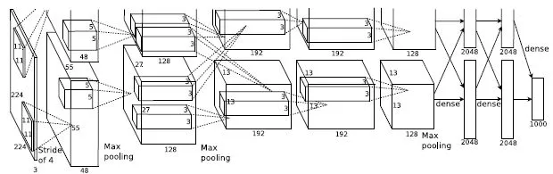
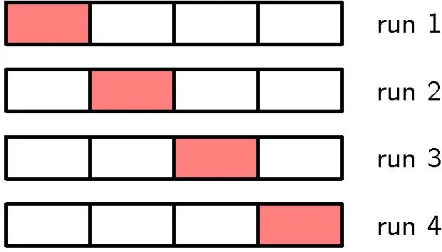
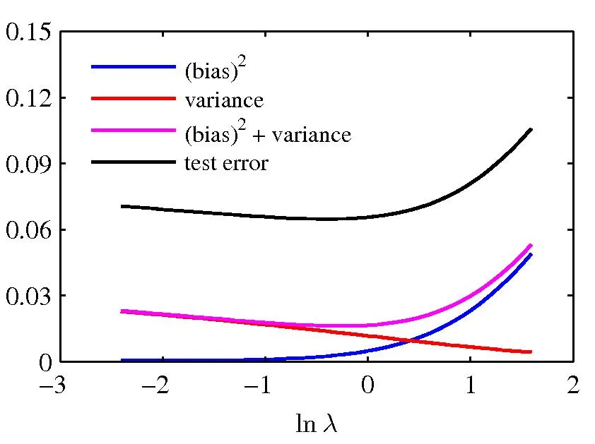

# On Generalization and Regularization in Deep Learning An Introduction for Data Scientists

Pirmin Lemberger Email: [pirmin.lemberger@weave.eu](mailto:)
Affiliation: Weave Business Technology Affiliation: 37 rue du Rocher,
75008 Paris Affiliation: weave.eu

August 24, 2026

###### Abstract

Why do large neural network generalize so well on complex tasks such as
image classification or speech recognition? What exactly is the role
regularization for them? These are arguably among the most important
open questions in machine learning today. In a recent and thought
provoking paper \[1\] several authors performed a number of numerical
experiments that hint at the need for novel theoretical concepts to
account for this phenomenon. The paper stirred quit a lot of excitement
among the machine learning community but at the same time it created
some confusion as discussions in \[2\] testifies. The aim of this
pedagogical paper is to make this debate accessible to a wider audience
of data scientists without advanced theoretical knowledge in statistical
learning. The focus here is on explicit mathematical definitions and on
a discussion of relevant concepts, not on proofs for which we provide
references.

## 1 Motivation

The heart and essence of machine learning is the idea of
_generalization_. Put in intuitive terms this is the ability for an
algorithm to be trained on samples
$`S=\{(\mathbf{x}_{1},y_{1}),\dots,(\mathbf{x}_{n},y_{n})\}`$ of $`n`$
examples of an unknown relation between some features
$`\mathbf{x}=(x_{1}\dots,x_{p})`$ and a target response $`y`$ and to
provide accurate predictions on new, unseen data. To achieve this goal
an algorithm tries to pick up an estimator $`\hat{f}`$ among a class of
function $`\mathcal{F}`$, called the _hypothesis class_ hereafter, which
makes small prediction errors $`|y_{i}-\hat{f}(\mathbf{x}_{i})|`$ when
evaluated on the train set $`S`$. Of course such an endeavor makes no
sense unless we can ascertain that the train set error is close in some
sense to the true error we would make on the whole population.
Practically this discrepancy is estimated using validation and test
sets, a procedure familiar to any data scientist.

Again, on intuitive grounds we expect that in order to make good
predictions we need to select a hypothesis class $`\mathcal{F}`$ that is
appropriate for the problem at hand. More precisely we should use some
prior knowledge about the nature of the link between between the
features $`\mathbf{x}`$ and the target $`y`$ to choose which functions
the class $`\mathcal{F}`$ should possess. For instance if, for any
reason, we know that with high probability the relation between
$`\mathbf{x}`$ and $`y`$ is approximately linear we better choose
$`\mathcal{F}`$ to contain only such functions
$`f_{\mathbf{w}}(\mathbf{x})=\mathbf{w}\cdot\mathbf{x}`$. In the most
general setting this relationship is encoded in a complicated and
unknown probability distribution $`P`$ on labeled observations
$`(\mathbf{x},y)`$. In many cases all we know is that the relation
between $`\mathbf{x}`$ and $`y`$ has some smoothness properties.

The set of techniques that data scientists use to adapt the hypothesis
class $`\mathcal{F}`$ to a specific problem is know as _regularization_.
Some of these are _explicit_ in the sense that they constrain estimators
$`f`$ in some way as we shall describe in section 2. Some are _implicit_
meaning that it is the dynamics of the algorithm which walks its way
through the set $`\mathcal{F}`$ in search for a good $`f`$ (typically
using stochastic gradient descent) that provides the regularization.
Some of these regularization techniques actually pertain more to art
than to mathematics as they rely more on experience and intuition than
on theorems.



Figure 1: The architecture of AlexNet which is one of the networks used
by the authors in \[1\]

_Deep Learning_ is a a very popular class of machine learning models,
roughly inspired by biology, that are particularly well suited for
tackling complex, AI-like tasks such as image classification, NLP or
automatic translation. Roughly speaking these models are defined by
stacking layers that, each, combine linear combinations of the input
with non-linear activation functions (and perhaps some regularization).
We won’t enter into defining them in detail here as many excellent
textbooks \[3, 4\] will do the job. Figure 1 shows the architecture of
AlexNet a deep network used in the experiment \[1\]. For our purpose,
which is a discussion of the issue of generalization and regularization,
suffice it to say here that these Deep Learning problems share the
following facts:

- •
  The number $`n`$ of samples available for training these networks is
  typically much smaller than the number $`k`$ of parameters
  $`\mathbf{w}=(w_{1},\dots,w_{k})`$ that define the functions
  $`f_{\mathbf{w}}\in\mathcal{F}`$ ¹¹ 1 The number of parameters $`k`$
  of a Deep Learning network such as AlexNet can be over a hundred of
  millions while being trained on “only” a few millions of images in
  image-net..
- •
  The probability distribution $`P(\mathbf{x},y)`$ is impossible to
  describe in any sensible way in practice. For concreteness, think of
  $`\mathbf{x}`$ as the pixels of and image an of $`y`$ as the name of
  an animal represented in the picture. Popular wisdom tells us
  nevertheless that conditional distributions $`P(\mathbf{x}|y)`$ are
  located in the vicinity of some sort of “manifold”
  $`M_{y}\subset\mathbb{R}^{p}`$.
- •
  The hypothesis class $`\mathcal{F}`$ is defined implicitly by some
  neural _network architecture_ together with one or more regularization
  procedures. In section 4 we shall briefly describe the more common
  such procedures.

As a matter of fact, from a practitioner’s point of view, Deep Learning
with its many tips and tricks \[5\] generalizes almost unreasonably
well. The question thus is: why? There are two kind of attempts at
explaining this mystery.

1.  1.  On the one hand there are heuristic explanations, which rely mostly
        on variants of physicist’s multi-scale analysis \[6\]. Proponents of
        these explanations argue that the efficiency of deep learning models
        $`\mathcal{F}`$ has its roots in the physical generating process
        $`P`$ of features $`\mathbf{x}`$ (such as image pixels) that
        describe objects found in nature. They claim this process is
        generally a hierarchy of simpler processes and that the
        multi-layered is well adapted to learn such signals. We won’t touch
        upon this further here.
2.  2.  On the other there are classical results from Empirical Risk
        Minimization theory \[7\] which substantiates the idea that the
        class $`\mathcal{F}`$ of hypothesis functions should not be too
        flexible in order for a model to generalize properly. This is our
        subject.

Numerical experiments in \[1\] are thought provoking because they
challenge the second class of explanations which all interpret
regularization as a way of limiting some specific measures of class
complexity. In the sequel we shall use _hypothesis class_ and _model_
interchangeably.

The main results from _Empirical Risk Minimization_ (ERM) theory which
form the necessary background for interpreting the experimental results
in \[1\] are presented in section 3. However, to put things in
perspective we first review the concepts of generalization and
regularization in the context of the bias-variance trade-off which is
more familiar for data scientists. Section 2 and 3 are actually
logically independent but the underlying theme of the _rigidity_ of a
class $`\mathcal{F}`$ of functions unifies them. In the context of
bias-variance trade-off the rigidity of a model is optimized to minimize
the so called _expected loss_, whereas in the context of ERM the
rigidity of a model allows to bound population errors with sample
errors. Finally, section 4 explains in what sense the experiments in
\[1\] are challenging ERM.

## 2 The Bias-Variance Trade-off

Readers in a hurry to learn the basics of ERM can skip this section
except for definitions (1) and (3).

### 2.1 The Expected Loss

In the most general setting the relationship between the features
$`\mathbf{x}`$ and the target $`y`$ is given by an unknown probability
distribution $`P`$ from which labeled observations $`(\mathbf{x},y)`$
are drawn. Assume we use a function $`f\in\mathcal{F}`$ from our
hypothesis class to make predictions and that we pick a loss function
$`\ell(y,f(\mathbf{x}))\equiv\ell_{f}(\mathbf{x},y)`$ to measure the
error between the true value $`y`$ and our prediction $`f(\mathbf{x})`$.
The _population error_ $`\mathrm{err}_{P}[f]`$, also called the
_expected loss_ (EL), can then be defined as

```math
\begin{split}\mathrm{err}_{P}[f]&\equiv\int\ell(y,f(\mathbf{x}))P(\mathbf{x},y)\,\mathrm{d}\mathbf{x}\,\mathrm{d}y\\
&\equiv\mathsf{E}_{P}[\ell_{f}].\end{split} \tag{1}
```

This is the quantity that we would ideally like to minimize as a
functional over $`\mathcal{F}`$. The special case of a _square loss
function_ $`\ell(y,f(\mathbf{x}))=[y-f(\mathbf{x})]^{2}`$ is
interesting, not because it is particularly useful in practice, but
because it leads to explicit expressions of various quantities. In this
special case, the optimal $`h`$ which minimizes (1) is given by the
conditional mean

```math
h(\mathbf{x})=\int yP(y\,|\mathbf{x})\mathrm{d}y\equiv\mathsf{E}_{P}[y|\mathbf{x}]. \tag{2}
```

As $`P`$ will forever remain unknown to us we must contend ourselves
with estimates $`\hat{h}_{S}`$ of the optimal $`h`$ based on finite
samples $`S=\{(\mathbf{x}_{1},y_{1}),\dots,(\mathbf{x}_{n},y_{n})\}`$.
An estimate $`\hat{h}_{S}`$ can be defined as a minimizer over
$`f\in\mathcal{F}`$ of the sample version of $`\mathrm{err}_{P}[f]`$

```math
\begin{split}\widehat{\mathrm{err}}_{S}[f]&\equiv\frac{1}{n}\sum_{i=1}^{n}\ell(y_{i},f(\mathbf{x}_{i}))\\
&\equiv\widehat{\mathsf{E}}_{S}[\ell_{f}].\end{split} \tag{3}
```

In a frequentist perspective, the accuracy of these empirical minimizers
$`\hat{h}_{S}\in\mathcal{F}`$ can then be defined by taking an average
of the EL over train sets $`S`$. We call it the _Average Expected Loss_
(AEL) even if this naming doesn’t particularly shine with elegance. We
denote the averaging operation over training samples $`S`$ by
$`\mathsf{Ave}`$ to distinguish it from the expectation
$`\mathsf{E}_{P}`$ over labeled observations

```math
\mathrm{AEL}\equiv\mathsf{Ave}[\mathrm{err}_{P}[\hat{h}_{S}]]. \tag{4}
```

### 2.2 The Bias-Variance Decomposition

It is instructive to examine the AEL for the special case of a square
loss function $`\ell(y,f(\mathbf{x}))=[y-f(\mathbf{x})]^{2}`$ because it
allows an explicit decomposition of the AEL into three components that
are easy to interpret. Indeed, let us denote the _Average Expected
Square Loss_ by AESL, the best possible estimator by
$`h(\mathbf{x})=\mathsf{E}_{P}[y|\mathbf{x}]`$ and the minimizer over
$`\mathcal{F}`$ of the empirical error $`\widehat{\mathrm{err}}_{S}[.]`$
by $`\hat{h}_{S}`$. A straightforward application of the above
definitions leads to the following decomposition, see for instance \[3\]

```math
\mathrm{AESL}=(\mathsf{bias})^{2}+\mathsf{variance}+\mathsf{noise}, \tag{5}
```

where

```math
\begin{split}(\mathsf{bias})^{2}&=\int\left(\mathsf{Ave}\left[\hat{h}_{S}(\mathbf{x})\right]-h(\mathbf{x})\right)^{2}P(\mathbf{x})\mathrm{d}\mathbf{x},\\
\mathsf{variance}&=\int\mathsf{Ave}\left[\left(\hat{h}_{S}(\mathbf{x})-\mathsf{Ave}[\hat{h}_{S}(\mathbf{x})]\right)^{2}\right]P(\mathbf{x})\mathrm{d}\mathbf{x},\\
\mathsf{noise}&=\int[h(\mathbf{x})-y]^{2}\,P(\mathbf{x},y)\mathrm{d}\mathbf{x}\,\mathrm{d}y.\end{split} \tag{6}
```

The $`(\mathsf{bias})^{2}`$ measures how much our predictions
$`\hat{h}_{S}(\mathbf{x})`$ averaged over all train sets $`S`$ deviate
from the optimal prediction $`h(x)`$. The $`\mathsf{variance}`$ measures
how much our predictions $`\hat{h}_{S}(\mathbf{x})`$ fluctuate around
their average value when the train set $`S`$ varies. Finally the
$`\mathsf{noise}`$ measures how much the true values $`y`$ fluctuate
around the best possible prediction $`h(\mathbf{x})`$, this is only term
which is independent of our predictions $`\hat{h}_{S}(\mathbf{x})`$.

### 2.3 Regularization as Constraints

Remember that all prediction functions $`\hat{h}_{S}`$ belong to some
hypothesis class $`\mathcal{F}`$ that defines our model. We can control
the $`\mathsf{variance}`$ by putting some constraints on functions which
belong to $`\mathcal{F}`$, thus preventing too large fluctuations of
$`\hat{h}_{S}`$ when training the model on different samples $`S`$.
Stronger constraint means a more rigid model and thus typically a
smaller $`\mathsf{variance}`$ but a larger $`(\mathsf{bias})^{2}`$.
Regularization of the model amounts to choosing the amount of _rigidity_
that will minimize AEL using an optimal trade-off between the
$`\mathsf{bias}`$ and the $`\mathsf{variance}`$. For the AESL it is
simply their sum which should be minimized as (5) shows.

If we consider a parametric model, each function
$`f_{\mathbf{w}}\in\mathcal{F}`$ is characterized by a vector
$`\mathbf{w}\in\mathbb{R}^{p}`$ of parameters and in particular
$`\hat{h}=f_{\widehat{\mathbf{w}}}`$. One way then to make the
regularization procedure explicit in this context is to put a constraint
on $`\mathbf{w}`$ such as for instance $`\|\mathbf{w}\|_{2}<c`$ (_Ridge_
regularization) or $`\|\mathbf{w}\|_{1}<c`$ (_Lasso_ regularization)
where the constant $`c`$ can be tuned for optimal rigidity. To minimize
$`\widehat{\mathrm{err}}_{S}[f_{\mathbf{w}}]`$ under such a constraint
one proceeds the usual way by defining a Lagrange function and look for
its minimum

```math
\widehat{\mathrm{err}}_{S}^{\mathrm{reg}}[f_{\mathbf{w}}]\equiv\widehat{\mathrm{err}}_{S}[f_{\mathbf{w}}]+\lambda\|\mathbf{w}\|_{p} \tag{7}
```

One can show that for each constraint $`c`$ there is indeed a
corresponding $`\lambda`$ for which $`\|\widehat{\mathbf{w}}\|_{p}<c`$.
Summarizing the intuition gained so far and denoting
$`\mathcal{F}_{\lambda}`$ the class of regularized functions

larger $`\lambda`$ $`\Leftrightarrow`$ smaller $`c`$ $`\Leftrightarrow`$
stronger constraints $`\Leftrightarrow`$ “smaller”
$`\mathcal{F}_{\lambda}`$ $`\Leftrightarrow`$ (smaller
$`\mathsf{variance}`$ and larger $`\mathsf{bias}`$).

If we want to explicit the dependence of our minimizer on the
regularization parameter $`\lambda`$ we use $`\hat{h}_{S,\lambda}`$.

### 2.4 Regularization in Practice

Practically the proper amount of regularization $`\lambda`$ in (7) is
chosen by using a procedure such as _cross-validation_ (CV) well known
to data scientist. This procedure can be viewed as giving an estimate
$`\widehat{\mathrm{AEL}}`$ for the true $`\mathrm{AEL}`$ defined in (4)
which involve _two_ distinct sampling procedures:

1.  1.  The first procedure estimates $`\mathsf{Ave}`$ in (4) by an
        arithmetic mean over $`r`$ _train sets_ $`S_{1},...,S_{r}`$ that
        correspond to a splitting of the original data $`S`$ into $`r`$
        folds as depicted in figure 2.
2.  2.  The second procedure estimates the population errors
        $`\mathrm{err}_{P}[\cdot]`$ in (4) by their sample versions
        $`\widehat{\mathrm{err}}_{T_{j}}[\cdot]`$ on the _test sets_
        $`T_{j}=S\backslash S_{j}`$.



Figure 2: A data set $`S`$ split into $`r=4`$ folds. The red rectangles
are the test sets $`T_{j}=S\backslash S_{j}`$ associated to the train
sets $`S_{j}`$.



Figure 3: Empirical estimation of the optimal regularization $`\lambda`$

We thus define the estimate of $`\mathrm{AEL}`$ as a function of
$`\lambda`$

```math
\widehat{\mathrm{AEL}}(\lambda)\equiv\frac{1}{r}\sum_{j=1}^{r}\widehat{\mathrm{err}}_{S\backslash S_{j}}[\hat{h}_{S_{j},\lambda}]. \tag{8}
```

Plotting $`\widehat{\mathrm{ESL}}`$ as a function of the regularization
$`\lambda`$ allows to find an estimator $`\widehat{\lambda}`$ of the
optimal rigidity of the model. When $`r=1`$ CV amounts to splitting the
data between a train set $`S`$ and a test set $`T`$. The _train error_
$`\widehat{\mathrm{err}}_{S}[{\hat{h}_{S,\lambda}}]`$ is usually smaller
than the _test error_
$`\widehat{\mathrm{err}}_{T}[{\hat{h}_{S,\lambda}}]`$ which typically
has an U-shaped graph as shown in figure 3.

Remark 1 : The bias-variance decomposition in (5) is strictly valid only
for a squared loss function $`\ell(y,\hat{y})=|y-\hat{y}|^{2}`$. However
on experimental grounds the heuristics behind the trade-off, namely the
set of equivalences above and the intuition behind figure 3 are expected
to remain valid for other loss functions $`\ell`$ as well.

Remark 2 : _Universality theorems_ for neural networks tell us that
there exists functions $`f`$, defined by even the simplest neural
network (NN) architectures, that will make the sample error
$`\widehat{\mathrm{err}}_{S}[f]`$ as small as we want when we minimize
_without_ regularization constraints ($`\lambda=0`$). In other words,
neural networks can possibly over-fit any sample $`S`$ provided the
network is large enough. These are mere existence theorems however and
they tell us nothing neither about how to optimize regularization
$`\lambda`$ to minimize EL nor on our practical ability to find a
minimizer in $`\mathcal{F}_{\lambda}`$ with these constraints.

## 3 Empirical Risk Minimization

The whole analysis in last section rests on our ability to approximate
the expected loss $`\mathrm{err}_{P}[f]=\mathsf{E}_{P}[\ell_{f}]`$
defined in (1) with its sample estimate
$`\widehat{\mathrm{err}}_{S}[f]=\widehat{\mathsf{E}}_{S}[\ell_{f}]`$
defined in (3). But how good exactly is this estimate? This is the
question we examine in the current section. It is also the subject
matter of _Empirical Risk Minimization_ in general.

We expect the discrepancy between the population expectation
$`\mathsf{E}_{P}[h]`$ of a function $`h`$ and its empirical estimate
$`\widehat{\mathsf{E}}_{S}[h]`$ to depend on the class of function
$`\mathcal{H}`$ from which we pick $`h`$. Intuition suggests that if the
set $`\mathcal{F}`$ is too flexible then there are high chances that our
empirical estimates could be way off the population expectation. There
are several ways to make such hand waving statements rigorous but they
all rely on some measure of complexity of a set $`\mathcal{H}`$ of
functions. We restrict in this paper to the _Rademacher_ complexity for
its intuitive character and because its one of the more recent concepts.

### 3.1 Rademacher Complexity

To introduce this concept consider a class $`\mathcal{H}`$ of real
valued function $`h`$ defined on an arbitrary space $`Z`$ and let
$`S=\{z_{1},\cdots,z_{n}\}`$ be a set of examples $`z_{i}`$ drawn
independently from a distribution $`P`$ over $`Z`$. Our aim is to
measure how well functions in $`\mathcal{H}`$ are able to match any
prescribed binary sequence $`\sigma=\{\sigma_{1},\dots,\sigma_{n}\}`$
when they are evaluated on samples $`S`$ drawn from $`P`$. How well a
single function $`h`$ fits the prescribed sequence $`\sigma`$ on the
sample $`S`$ can be defined as the correlation
$`\frac{1}{n}\sum_{i=1}^{n}\sigma_{i}h(z_{i})`$ between $`\sigma`$ and
the values $`h(S)\equiv(h(z_{1}),...,h(z_{n}))`$. It equals $`1`$ for a
perfect fit between $`h(S)`$ and $`\sigma`$. How well the class of
functions $`\mathcal{H}`$ as a whole can fit a specific sequence
$`\sigma`$ on the sample $`S`$ can naturally be defined as the highest
correlation we can achieve using functions $`h\in\mathcal{H}`$

```math
\sup_{h\in\mathcal{H}}\left(\frac{1}{n}\sum_{i=1}^{n}\sigma_{i}h(z_{i})\right). \tag{9}
```

A measure of how well functions in $`\mathcal{H}`$ can fit _any_
sequence $`\sigma`$ can be defined as the expectation
$`\mathsf{E}_{\sigma}`$ of (9) over sequences $`\sigma`$ (sampled
uniformly). This is by definition the _empirical Rademacher complexity_
of the class of functions $`\mathcal{H}`$ on the sample $`S`$

```math
\widehat{\mathsf{Rad}}_{n}(\mathcal{H})\equiv\mathsf{E}_{\sigma}\left[\sup_{h\in\mathcal{H}}\left(\frac{1}{n}\sum_{i=1}^{n}\sigma_{i}h(z_{i})\right)\right]. \tag{10}
```

Finally, the _Rademacher complexity_ of the class $`\mathcal{H}`$ is
defined as the expectation of (10) over samples $`S`$ of size $`n`$
drawn from $`P`$

```math
\mathsf{Rad}_{n}(\mathcal{H})\equiv\mathsf{E}_{P}[\widehat{\mathsf{Rad}}_{n}(\mathcal{H})]. \tag{11}
```

If we assume that functions $`h\in\mathcal{H}`$ are binary classifiers,
which means $`h(z)\in\{-1,+1\}`$, we see that (9) implies
$`0<\widehat{\mathsf{Rad}}_{n}(\mathcal{H})\leq 1`$. When
$`\widehat{\mathsf{Rad}}_{n}(\mathcal{H})`$ is close to its upper bound
$`1`$ the binary classification model defined by $`\mathcal{H}`$ can
literally “store” any binary assignment $`\sigma`$ to the examples in
$`S`$.

### 3.2 Bounding Population Expectations

The Rademacher complexity is the key ingredient for bounding a
population expectation $`\mathsf{E}_{P}[h]`$ with an empirical average
$`\widehat{\mathsf{E}}_{S}[h]`$. Assume we draw samples
$`S=\{z_{1},\dots,z_{n}\}`$ of size $`n`$ from a distribution $`P`$ and
that the functions $`h`$ we are interested in belong to a class
$`\mathcal{H}`$. Chose a small positive number $`0<\delta<1`$. Then the
following bound holds with a probability larger than $`1-\delta`$ for
any $`h\in\mathcal{H}`$, see \[7\]

```math
\mathsf{E}_{P}[h]\leq\widehat{\mathsf{E}}_{S}[h]+2\,\widehat{\mathsf{Rad}}_{n}(\mathcal{F})+3\sqrt{\frac{\ln(2/\delta)}{n}}. \tag{12}
```

The second term on the right hand side substantiates our intuition that
the discrepancy between the population expectation $`\mathsf{E}_{P}[h]`$
and the empirical expectation $`\widehat{\mathsf{E}}_{S}[h]`$ can grow
when the set of functions $`\mathcal{H}`$ becomes more and more
flexible. The last term is a price we pay for requiring small chances to
be wrong, fortunately it grows only logarithmicamlly as
$`\delta\rightarrow 0`$.

### 3.3 Application to Binary Classification Errors

Let us apply (12) to a _binary classification_ problem. In this case the
set $`Z`$ is simply the set $`\mathbb{R}^{p}\times\{-1,+1\}`$ of
observations $`z=(\mathbf{x},\sigma)`$. As
$`\mathrm{err}_{P}[f]=\mathsf{E}_{P}[\ell_{f}]`$ and
$`\widehat{\mathrm{err}}_{S}[f]=\mathsf{E}_{S}[\ell_{f}]`$ the functions
whose expectations we want to bound are the errors function $`\ell_{f}`$
associated with binary classifiers
$`f:\mathbb{R}^{p}\rightarrow\{-1,+1\}`$. Therefore here
$`\mathcal{H}=\{\ell_{f}|f\in\mathcal{F}\}`$ is the class of loss
functions. We select the _miss-classification rate_
$`\ell_{f}(\mathbf{x},\sigma)=\mathbb{I}_{f(\mathbf{x})\neq\sigma}`$ as
our loss function. Using
$`\mathbb{I}_{f(\mathbf{x})\neq\sigma}=[1-\sigma f(\mathbf{x})]/2`$ and
the (almost) obvious property, see \[7\]

```math
\widehat{\mathsf{Rad}}_{n}(a\mathcal{F}+b)=|a|\,\widehat{\mathsf{Rad}}_{n}(\mathcal{F})
```

we get
$`\widehat{\mathsf{Rad}}_{n}(\mathcal{H})=\frac{1}{2}\,\widehat{\mathsf{Rad}}_{n}(\mathcal{F})`$.
Using (12) we can thus express our basic inequality directly in terms of
the complexity of the hypothesis class $`\mathcal{F}`$

```math
\mathrm{err}_{P}[f]\leq\widehat{\mathrm{err}}_{S}[f]+\widehat{\mathsf{Rad}}_{n}(\mathcal{F})+3\sqrt{\frac{\ln(2/\delta)}{n}} \tag{13}
```

with probability $`>1-\eta`$.

_Inequality_ (13) _is the basic prerequisite for interpreting the
challenging results in paper_ \[1\]

Remark 1: It is important to realize that inequality (13) holds, of
course, uniformy for _any_ $`f\in\mathcal{F}`$. In particular $`f`$ need
not be a minimizer of the expected loss which was our main concern in
section 2.

Remark 2: Inequality (13) assumes that $`f`$ is selected from a fixed
class $`\mathcal{F}`$ whereas in the previous section we empirically
estimated an optimal rigidity $`\widehat{\lambda}`$ using a train set
$`S`$ and test set $`T`$. Although it is very tempting (and morally
right!) to substitute $`\mathcal{F}_{\widehat{\lambda}}`$ for
$`\mathcal{F}`$ in (13) strictly speaking this is not correct.

For parametric models the next step would be to bound
$`\widehat{\mathsf{Rad}}_{n}(\mathcal{F})`$ as a function of the sample
size $`n`$ and the number $`k`$ of parameters $`(w_{1},\dots,w_{k})`$
defining $`f_{\mathbf{w}}\in\mathcal{F}`$. To our knowledge there are no
explicit bounds of this kind. There exists however an interesting bound
for binary classification models which exemplifies the asymptotic
behavior of $`\widehat{\mathsf{Rad}}_{n}(\mathcal{F})`$ as
$`n\rightarrow\infty`$ for a fixed class $`\mathcal{F}`$. It involves an
alternative notion of complexity namely the _VC dimension_ $`d`$ of
$`\mathcal{F}`$ defined as follows: it is the size of the largest set
$`S=\{\mathbf{x}_{1},\dots,\mathbf{x}_{d}\}`$ such that for any binary
sequence $`\sigma=(\sigma_{1},\dots,\sigma_{d})`$ we can find an
$`f\in\mathcal{F}`$ that takes these values on $`S`$. The bound reads

```math
\widehat{\mathsf{Rad}}_{n}(\mathcal{F})\leq\sqrt{\frac{2d\ln n}{n}}, \tag{14}
```

which vanishes when the sample size $`n`$ grows larger which should come
as no surprise.

## 4 Regularization for Deep Neural Networks

Now asymptotic behavior is of interest for mathematicians but data
scientist are truly interested in finite samples! Here we can only
speculate about the value of $`\widehat{\mathsf{Rad}}_{n}(\mathcal{F})`$
as a function of the size $`n`$ of the sample and the number $`k`$ of
parameters. Or we can make experiments. In the context of Deep Learning
the case of particular interest is $`n\ll k`$. Recall the following:

Classical interpretation of regularization: Regularization is an
explicit or an implicit constraints on predictors $`f`$ that shrinks the
Rademacher complexity of a neural network model $`\mathcal{F}`$ towards
zero so that inequality (13) nearly saturates.

The most common such mechanisms in Deep Learning are, see \[3, 4\]

- •
  $`L^{2}`$ penalty on weights was shortly discussed in 2.3
- •
  Dropout consists in randomly dropping some links of the neural network
  during training thus preventing the model to adapt to closely to the
  train data.
- •
  Early stopping consists in monitoring the prediction error on a
  validation set while performing gradient descent and stopping it when
  the validation error start to increase. Conceptually it is close to
  the $`L^{p}`$ penalty \[3\].
- •
  Data augmentation is used in image recognition problems. The original
  data set is augmented with artificial images obtained by distorting
  (the size, the orientation, the hue of) the original images. It thus
  acts to increase $`n`$ without changing $`\mathcal{F}`$, thus reducing
  $`\widehat{\mathsf{Rad}}_{n}(\mathcal{F})`$ as (14) illustrates.
- •
  Implicit regularization effectively shrinks the class of
  $`\mathcal{F}`$ as a consequence of the dynamics of how the algorithm
  explores $`\mathcal{F}`$ when optimizing the network parameters
  $`\mathbf{w}`$. Why this happens is more mysterious than for the
  previous techniques.

The numerical experiments described in \[1\] involve large neural
networks with a number of parameters $`p>1\,000\,000`$ such as AlexNet
and deep Multilayer Perceptrons. The data sets
$`S=\{(\mathbf{x}_{1},y_{1}),\dots,(\mathbf{x}_{n},y_{n})\}`$ that where
used are image data sets such as CIFAR-10 which contains $`n=60\,000`$
images categorized in $`10`$ classes. The authors also trained the
models on pure noise images.

They then created artificial data sets
$`S^{\sigma}=\{(\mathbf{x}_{1},\sigma_{1},\dots,(\mathbf{x}_{n},\sigma_{n})\}`$
in which the labels $`\sigma_{i}`$ where generated randomly. They
noticed the surprising fact that for these large networks, _even without
any explicit regularization mechanism_ switched on, the train error
$`\widehat{\mathrm{err}}_{S^{\sigma}}[h_{S^{\sigma}}]`$ was close to
zero ($`<0.18\%`$) for _any_ binary assignment $`\sigma`$ and even for
images made of random pixels. Assuming this multi-class problem is cast
into series of equivalent binary classification problems this strongly
suggests:

Fact 1: The complexity $`\widehat{\mathsf{Rad}}_{n}(\mathcal{F})`$ of
these large models is very close to $`1`$. In other words these large
networks are able to “learn” or “store” these artificial data sets
almost perfectly. But remember:

Fact 2: Deep Learning models are known to generalize very well in
practice. This is the reason why people use them! In other words
minimizers of the sample error $`\widehat{\mathrm{err}}_{S}[.]`$ are
also verified to usefully approximate minimizers of the true population
error $`\mathrm{err}_{P}[.]`$.

Conclusion: Considering the basic bound (13), one way to reconcile fact
1 and fact 2 is simply to give up the classical interpretation of
regularization that pretends its role is to shrink the model complexity
$`\widehat{\mathsf{Rad}}_{n}(\mathcal{F})`$ towards zero. Another
possibility is that we need more refined bounds than (13). Remember that
this inequality assumed strictly nothing about the distribution $`P`$
from which samples $`S`$ are drawn. It should be no surprise then that
these kind of bounds are way too rough. They really don’t take into
account _at all_ what makes the specificity of deep neural networks! The
whole point of using techniques such as deep learning is that the models
$`\mathcal{F}`$ they define are somehow well adapted to the actual
samples $`S`$ that nature produces. What is a stake is better
understanding of the subtle interplay between the dynamics of the
learning process of a multilayered network, which defines an effective
$`\mathcal{F}`$, and the nature of the physical processes $`P`$ that
generate _physical_ samples $`S`$ on which they are trained. But for the
moment deep neural networks keep their mystery.

## Acknowledgments

I would like thank my colleagues Olivier Reisse, the founder of Weave
Business Technology entity, and Christophe Vallet who is leading the
Weave Data entity for their consistent support for all activities at the
Weave data lab where I work. I would also like to thank Marc-Antoine
Giuliani who is an expert in statistical learning theory and data
scientist at the Weave data lab for pointing our the many intricacies of
his field to a somewhat carefree physicist like me.

## References

- \[1\] Chiyuan Zhang, Samy Bengio, Moritz Hardt, Benjamin Recht, Oriol
  Vinyals, Understanding Deep Learning Requires Rethinking
  Generalization, ICLR 2017, arxiv.org/abs/1611.03530v2.
- \[2\] Chiyuan Zhang, Samy Bengio, Moritz Hardt, Benjamin Recht, Oriol
  Vinyals, Understanding Deep Learning Requires Rethinking
  Generalization, OpenReview.net,
  [https://openreview.net/forum?id=Sy8gdB9xx&noteId=Sy8gdB9xx](https://openreview.net/forum?id=Sy8gdB9xx&noteId=Sy8gdB9xx).
- \[3\] Christopher M. Bishop, Pattern Recognition And Machine Learning,
  Springer-Verlag New York Inc, second edition, 2011.
- \[4\] Ian Goodfellow, Yoshua Bengio and Aaron Courville, Deep
  Learning, MIT Press, 2016,
  [http://www.deeplearningbook.org](http://www.deeplearningbook.org).
- \[5\] Nikolas Markou, The Black Magic of Deep Learning - Tips and
  Tricks for the practitioner, EnVision blog,
  [http://nmarkou.blogspot.fr/2017/02/the-black-magic-of-deep-learning-tips.html](http://nmarkou.blogspot.fr/2017/02/the-black-magic-of-deep-learning-tips.html).
- \[6\] Henry W. Lin (Harvard), Max Tegmark (MIT), Why does deep and
  cheap learning work so well?
  [https://arxiv.org/abs/1608.08225v2](https://arxiv.org/abs/1608.08225v2).
- \[7\] Maria-Florina Balcan, Rademacher Complexity, Lecture Notes in
  Machine Learning Theory CS 8803 - Georgia Tech,
  [http://www.cs.cmu.edu/~ninamf/ML11/lect1117.pdf](http://www.cs.cmu.edu/~ninamf/ML11/lect1117.pdf)
