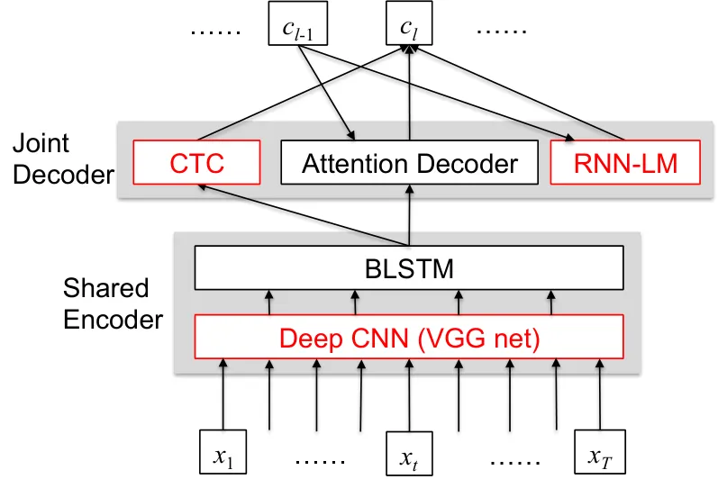

# Advances in Joint CTC-Attention based End-to-End Speech Recognition with a Deep CNN Encoder and RNN-LM

###### Abstract

We present a state-of-the-art end-to-end Automatic Speech Recognition
(ASR) model. We learn to listen and write characters with a joint
Connectionist Temporal Classification (CTC) and attention-based
encoder-decoder network. The encoder is a deep Convolutional Neural
Network (CNN) based on the VGG network. The CTC network sits on top of
the encoder and is jointly trained with the attention-based decoder.
During the beam search process, we combine the CTC predictions, the
attention-based decoder predictions and a separately trained LSTM
language model. We achieve a 5-10% error reduction compared to prior
systems on spontaneous Japanese and Chinese speech, and our end-to-end
model beats out traditional hybrid ASR systems.

Takaaki Hori¹, Shinji Watanabe¹, Yu Zhang², William Chan³

¹Mitsubishi Electric Research Laboratories  
²Massachusetts Institute of Technology  
³Carnegie Mellon University

{thori,watanabe}@merl.com, yzhang87@mit.edu, williamchan@cmu.edu

Index Terms: end-to-end speech recognition, encoder-decoder,
connectionist temporal classification, attention model

## 1 Introduction

Automatic Speech Recognition (ASR) is currently a mature set of
technologies that have been widely deployed, resulting in great success
in interface applications such as voice search \[1\]. A typical ASR
system is factorized into several modules including acoustic, lexicon,
and language models based on a probabilistic noisy channel model \[2\].
Over the last decade, dramatic improvements in acoustic and language
models have been driven by machine learning techniques known as deep
learning \[3\].

However, current systems lean heavily on the scaffolding of complicated
legacy architectures that grew up around traditional techniques,
including Hidden Markov Model (HMM), Gaussian Mixture Model (GMM), Deep
Neural Networks (DNN), followed by sequence discriminative training
\[4\]. We also need to build a pronunciation dictionary and a language
model, which require linguistic knowledge, and text preprocessing such
as tokenization for some languages without explicit word boundaries.
Finally, these modules are integrated into a Weighted Finite-State
Transducer (WFST) for efficient decoding. Consequently, it is quite
difficult for non-experts to use/develop ASR systems for new
applications, especially for new languages.

End-to-end ASR has the goal of simplifying the above module-based
architecture into a single-network architecture within a deep learning
framework, in order to address the above issues. End-to-end ASR methods
typically rely only on paired acoustic and language data without
linguistic knowledge, and train the model with a single algorithm.
Therefore, the approach potentially makes it possible to build ASR
systems without expert knowledge.

There are two major types of end-to-end architectures for ASR:
attention-based methods use an attention mechanism to perform alignment
between acoustic frames and recognized symbols \[5, 6, 7, 8, 9\], and
Connectionist Temporal Classification (CTC), uses Markov assumptions to
efficiently solve sequential problems by dynamic programming \[10, 11,
12\]. While CTC requires several conditional independence assumptions to
obtain the label sequence probabilities, the attention-based methods do
not use those assumptions. This property is advantageous to sequence
modeling, but the attention mechanism is too flexible in the sense that
it allows extremely non-sequential alignments like the case of machine
translation, although the alignments are usually monotonic in speech
recognition.

To solve this problem, we have proposed joint CTC-attention-based
end-to-end ASR \[13\], which effectively utilizes a CTC objective during
training of the attention model. Specifically, we attach the CTC
objective to an attention-based encoder network as a regularization
technique, which also encourages the alignments to be monotonic. In our
previous work, we demonstrated the approach improves the recognition
accuracy over the individual use of CTC or attention-based method
\[13\].

In this paper, we extend our prior work by incorporating several novel
extensions to the model, and investigate the performance compared to
traditional hybrid systems. The extensions we introduced are as follows.

1.  1.  Joint CTC-attention decoding: In our prior work, we used the CTC
        objective only for training. In this work, we use the CTC
        probabilities for decoding in combination with the attention-based
        probabilities. We propose two methods to combine their
        probabilities, one is a rescoring method and the other is a one-pass
        method.
2.  2.  Deep Convolutional Neural Network (CNN) encoder: We incorporate a
        VGG network in the encoder network, which is a deep CNN including 4
        convolution and 2 max-pooling layers \[14\].
3.  3.  Recurrent Neural Network Language Model (RNN-LM): We combine an
        RNN-LM network in parallel with the attention decoder, which can be
        trained separately or jointly, where the RNN-LM is trained with
        character sequences.

Although the efficacy of a deep CNN encoder has already been
demonstrated in end-to-end ASR \[15, 16\], the other two extensions have
not been experimented with yet. We present experimental results showing
efficacy of each technique, and finally we show that our joint
CTC-attention end-to-end ASR achieves performance superior to several
state-of-the-art hybrid ASR systems in Spontaneous Japanese and Mandarin
Chinese tasks.

## 2 Joint CTC-attention

In this section, we explain the joint CTC-attention framework, which
utilizes both benefits of CTC and attention during training \[13\].

### 2.1 Connectionist Temporal Classification (CTC)

Connectionist Temporal Classification (CTC) \[17\] is a latent variable
model that monotonically maps an input sequence to an output sequence of
shorter length. We assume here that the model outputs $`L`$-length
letter sequence $`C=\{c_{l}\in\mathcal{U}|l=1,\cdots,L\}`$ with a set of
distinct characters $`\mathcal{U}`$. CTC introduces framewise letter
sequence with an additional ”blank” symbol
$`Z=\{z_{t}\in\mathcal{U}\cup\text{blank}|t=1,\cdots,T\}`$. By using
conditional independence assumptions, the posterior distribution
$`p(C|X)`$ is factorized as follows:

```math
\displaystyle p(C|X)\approx\underbrace{\sum_{Z}\prod_{t}p(z_{t}|z_{t-1},C)p(z_{t}|X)}_{\triangleq p_{\text{ctc}}(C|X)}p(C) \tag{1}
```

As shown in Eq. (1), CTC has three distribution components by the Bayes
theorem similar to the conventional hybrid ASR case, i.e., framewise
posterior distribution $`p(z_{t}|X)`$, transition probability
$`p(z_{t}|z_{t-1},C)`$, and letter-based language model $`p(C)`$. We
also define the CTC objective function $`p_{\text{ctc}}(C|X)`$ used in
the later formulation.

The framewise posterior distribution $`p(z_{t}|X)`$ is conditioned on
all inputs $`X`$, and it is quite natural to be modeled by using
bidirectional long short-term memory (BLSTM):

```math
\displaystyle p(z_{t}|X) \displaystyle=\text{Softmax}(\text{Lin}(\mathbf{h}_{t})) \tag{2}
```

```math
\displaystyle\mathbf{h}_{t} \displaystyle=\text{BLSTM}(X). \tag{3}
```

$`\text{Softmax}(\cdot)`$ is a softmax activation function, and
$`\text{Lin}(\cdot)`$ is a linear layer to convert hidden vector
$`\mathbf{h}_{t}`$ to a $`(|\mathcal{U}|+1)`$ dimensional vector ($`+1`$
means a blank symbol introduced in CTC).

Although Eq. (1) has to deal with a summation over all possible $`Z`$,
we can efficiently compute this marginalization by using dynamic
programming thanks to the Markov property. In summary, although CTC and
hybrid systems are similar to each other due to conditional independence
assumptions, CTC does not require pronunciation dictionaries and omits
an HMM/GMM construction step.

### 2.2 Attention-based encoder-decoder

Compared with CTC approaches, the attention-based approach does not make
any conditional independence assumptions, and directly estimates the
posterior $`p(C|X)`$ based on the chain rule:

```math
\displaystyle p(C|X)=\underbrace{\prod_{l}p(c_{l}|c_{1},\cdots,c_{l-1},X)}_{\triangleq p_{\text{att}}(C|X)}, \tag{4}
```

where $`p_{\text{att}}(C|X)`$ is an attention-based objective function.
$`p(c_{l}|c_{1},\cdots,c_{l-1},X)`$ is obtained by

```math
\displaystyle p(c_{l} \displaystyle|c_{1},\cdots,c_{l-1},X)=\text{Decoder}(\mathbf{r}_{l},\mathbf{q}_{l-1},c_{l-1}) \tag{5}
```

```math
\displaystyle\mathbf{h}_{t} \displaystyle=\text{Encoder}(X) \tag{6}
```

```math
\displaystyle a_{lt} \displaystyle=\text{Attention}(\{a_{l-1}\}_{t},\mathbf{q}_{l-1},\mathbf{h}_{t}) \tag{7}
```

```math
\displaystyle\mathbf{r}_{l} \displaystyle=\sum_{t}a_{lt}\mathbf{h}_{t}. \tag{8}
```

Eq. (6) converts input feature vectors $`X`$ into a framewise hidden
vector $`\mathbf{h}_{t}`$ in an encoder network based on BLSTM, i.e.,
$`\text{Encoder}(X)\triangleq\text{BLSTM}(X)`$.
$`\text{Attention}(\cdot)`$ in Eq. (7) is based on a content-based
attention mechanism with convolutional features, as described in \[18\].
$`a_{lt}`$ is an attention weight, and represents a soft alignment of
hidden vector $`\mathbf{h}_{t}`$ for each output $`c_{l}`$ based on the
weighted summation of hidden vectors to form letter-wise hidden vector
$`\mathbf{r}_{l}`$ in Eq. (8). A decoder network is another recurrent
network conditioned on previous output $`c_{l-1}`$ and hidden vector
$`\mathbf{q}_{l-1}`$, similar to RNNLM, in addition to letter-wise
hidden vector $`\mathbf{r}_{l}`$. We use
$`\text{Decoder}(\cdot)\triangleq\text{Softmax}(\text{Lin}(\text{LSTM}(\cdot)))`$.

Attention-based ASR does not explicitly separate each module, but it
implicitly combines acoustic models, lexicon, and language models as
encoder, attention, and decoder networks, which can be jointly trained
as a single deep neural network. Compared with CTC, attention-based
models make predictions conditioned on all the previous predictions, and
thus can learn language. However, the cost of using an explicit
alignment without monotonic constraints means the alignment can become
impaired.

### 2.3 Multi-task learning

In \[13\], we used the CTC objective function as an auxiliary task to
train the attention model encoder within the multi-task learning (MTL)
framework. This approach substantially reduced irregular alignments
during training and inference, and provided improved performance in
several end-to-end ASR tasks.

The joint CTC-attention shares the same BLSTM encoder with CTC and
attention decoder networks. Unlike the sole attention model, the
forward-backward algorithm of CTC can enforce monotonic alignment
between speech and label sequences during training. That is, rather than
solely depending on the data-driven attention mechanism to estimate the
desired alignments in long sequences, the forward-backward algorithm in
CTC helps to speed up the process of estimating the desired alignment.
The objective to be maximized is a logarithmic linear combination of the
CTC and attention objectives, i.e., $`p_{\text{ctc}}(C|X)`$ in Eq. (1)
and $`p_{\text{att}}(C|X)`$ in Eq. (4):

```math
\displaystyle\mathcal{L}_{\text{MTL}} \displaystyle=\lambda\log p_{\text{ctc}}(C|X)+(1-\lambda)\log p_{\text{att}}(C|X), \tag{9}
```

with a tunable parameter $`\lambda:0\leq\lambda\leq 1`$.

## 3 Extended joint CTC-attention

This section introduces three extensions to our joint CTC-attention
end-to-end ASR. Figure 1 shows the extended architecture, which includes
joint decoding, a deep CNN encoder and an RNN-LM network.



Figure 1: Extended Joint CTC-attention ASR: the shared encoder contains
a VGG net followed by BLSTM layers and trained by both CTC and attention
model objectives simultaneously. The joint decoder predicts an output
label sequence by the CTC, attention decoder and RNN-LM. The extensions
made in this paper are colored in red.

### 3.1 Joint decoding

It is already been shown that the CTC objective helps guide the
attention model during training to be more robust and effective, and
produce a better model for speech recognition \[13\]. In this section,
we propose to use the CTC predictions also in the decoding process.

The inference step of attention-based speech recognition is performed by
output-label synchronous decoding with a beam search. But, we take the
CTC probabilities into account to find a better aligned hypothesis to
the input speech, i.e. the decoder finds the most probable character
sequence $`\hat{C}`$ given speech input $`X`$, according to

```math
\displaystyle\hat{C}=\arg\max_{C\in\mathcal{U}^{*}} \displaystyle\left\{\lambda\log p_{\text{ctc}}(C|X)\right.
```

```math
\displaystyle\left.+(1-\lambda)\log p_{\text{att}}(C|X)\right\}. \tag{10}
```

In the beam search process, the decoder computes a score of each partial
hypothesis. With the attention model, the score can be computed
recursively as

```math
\displaystyle\alpha_{\text{att}}(g_{l})=\alpha_{\text{att}}(g_{l-1})+\log p(c|g_{l-1},X), \tag{11}
```

where $`g_{l}`$ is a partial hypothesis with length $`l`$, and $`c`$ is
the last character of $`g_{l}`$, which is appended to $`g_{l-1}`$, i.e.
$`g_{l}=g_{l-1}\cdot c`$. The score for $`g_{l}`$ is obtained as the
addition of the original score $`\alpha(g_{l-1})`$ and the conditional
log probability given by the attention decoder in (5). During the beam
search, the number of partial hypotheses for each length is limited to a
predefined number, called a beam width, to exclude hypotheses with
relatively low scores, which dramatically improves the search
efficiency.

However, it is non-trivial to combine CTC and attention-based scores in
the beam search, because the attention decoder performs it
character-synchronously while CTC does it frame-synchronously. To
incorporate CTC probabilities in the score, we propose two methods. One
is a rescoring method, in which the decoder first obtains a set of
complete hypotheses using the beam search only with the attention model,
and rescores each hypothesis using Eq. (10), where
$`p_{\text{ctc}}(C|X)`$ can be computed with the CTC forward algorithm.
The other method is a one-pass decoding, in which we compute the
probability of each partial hypothesis using CTC and the attention
model. Here, we utilize the CTC prefix probability \[19\] defined as the
cumulative probability of all label sequences that have $`g_{l}`$ as
their prefix:

```math
\displaystyle p(g_{l},\dots|X)=\sum_{\nu\in(\mathcal{U}\cup\{\text{\tt<eos>}\})^{+}}P(g_{l}\cdot\nu|X), \tag{12}
```

and we obtain the CTC score as

```math
\displaystyle\alpha_{\text{ctc}}(g_{l})=\log p(g_{l},\dots|X), \tag{13}
```

where $`\nu`$ represents all possible label sequences except the empty
string, and \<eos\> indicates the end of sentence. The CTC score can not
be obtained recursively as in Eq. (11), but it can be computed
efficiently by keeping the forward probabilities over input frames for
each partial hypothesis. Then it is combined with
$`\alpha_{\text{att}}(g_{l})`$ using $`\lambda`$.

### 3.2 Encoder with Deep CNN

Our encoder network is boosted by using deep CNN, which is motivated by
the prior studies \[16, 15\]. We use the initial layers of the VGG net
architecture \[14\] followed by BLSTM layers in the encoder network. We
used the following 6-layer CNN architecture:

```math
\displaystyle\text{Convolution2D}(\text{\# in}=3,\text{\# out}=64,\text{filter}=3\times 3)
```

```math
\displaystyle\text{Convolution2D}(\text{\# in}=64,\text{\# out}=64,\text{filter}=3\times 3)
```

```math
\displaystyle\text{Maxpool2D}(\text{patch}=3\times 3,\text{stride}=2\times 2)
```

```math
\displaystyle\text{Convolution2D}(\text{\# in}=64,\text{\# out}=128,\text{filter}=3\times 3)
```

```math
\displaystyle\text{Convolution2D}(\text{\# in}=128,\text{\# out}=128,\text{filter}=3\times 3)
```

```math
\displaystyle\text{Maxpool2D}(\text{patch}=3\times 3,\text{stride}=2\times 2)
```

The initial three input channels are composed of the spectral features,
delta, and delta delta features. Input speech feature images are
downsampled to $`(1/4\times 1/4)`$ images along with the time-frequency
axises through the two max-pooling (Maxpool2D) layers.

### 3.3 Decoder with RNN-LM

We combine an RNN-LM network in parallel with the attention decoder,
which can be trained separately or jointly, where the RNN-LM is trained
with character sequences without word-level knowledge. Although the
attention decoder implicitly includes a language model as in Eq. (5), we
aim at introducing language model states purely dependent on the output
label sequence in the decoder, which potentially brings a complementary
effect.

As shown in Fig. 1, the RNN-LM probabilities are used to predict the
output label jointly with the decoder network. The RNN-LM information is
combined at the logits level or pre-softmax. If we use a pre-trained
RNN-LM without any joint training, we need a scaling factor. If we train
the model jointly with the other networks, we may combine their
pre-activations before the softmax without a scaling factor as this is
learnt. In effect, the attention-based decoder learns to use the LM
prior.

Although it is possible to apply the RNN-LM as a rescoring step, we
combine the RNN-LM network in the end-to-end model because we do not
wish to have an additional rescoring step. Also, we can view this as a
single large neural network model, even if parts of it are separately
pretrained. Furthermore, the RNN-LM can be trained jointly with the
encoder and decoder networks.

## 4 Experiments

We used Japanese and Mandarin Chinese ASR benchmarks to show the
effectiveness of the extended joint CTC-attention approaches.

The Japanese task is lecture speech recognition using the Corpus of
Spontaneous Japanese (CSJ) \[20\]. CSJ is a standard Japanese ASR task
based on a collection of monologue speech data including academic
lectures and simulated presentations. It has a total of 581 hours of
training data and three types of evaluation data, where each evaluation
task consists of 10 lectures (totally 5 hours). The Chinese task is
HKUST Mandarin Chinese conversational telephone speech recognition (MTS)
\[21\]. It has 5 hours recording for evaluation, and we extracted 5
hours from training data as a development set, and used the rest (167
hours) as a training set.

As input features, we used 80 mel-scale filterbank coefficients with
pitch features as suggested in \[22, 23\] for the BLSTM encoder, and
adding their delta and delta delta features for the CNN BLSTM encoder
\[15\]. The encoder was a 4-layer BLSTM with 320 cells in each layer and
direction, and linear projection layer is followed by each BLSTM layer.
The 2nd and 3rd bottom layers of the encoder read every second hidden
state in the network below, reducing the utterance length by the factor
of 4 (subsampling). When we used the VGG architecture, as described in
Section 3.2 as the CNN BLSTM encoder, the following BLSTM layers did not
subsample the input features. We used the location-based attention
mechanism \[18\], where the 10 centered convolution filters of width 100
were used to extract the convolutional features. The decoder network was
a 1-layer LSTM with 320 cells. We also built an RNN-LM as a 1-layer LSTM
for each task, where the CSJ model had 1000 cells and the MTS model had
800 cells. Each RNN-LM was first trained separately using the
transcription, combined with the decoder network, and optionally
re-trained with the encoder, decoder and CTC networks jointly. Note that
there is no extra text data been used here but we believe more
untranscribed data definitely can further improve the results.

The AdaDelta algorithm \[24\] with gradient clipping \[25\] was used for
the optimization. We used the $`\lambda=0.1`$ for CSJ and the
$`\lambda=0.5`$ for MTS in training and decoding based on our
preliminary investigation. The beam width was set to 20 in decoding
under all conditions. The joint CTC-attention ASR was implemented by
using the Chainer deep learning toolkit \[26\].

|                                                        |       |       |       |
| ------------------------------------------------------ | ----- | ----- | ----- |
| Model                                                  | Task1 | Task2 | Task3 |
| Attention                                              | 11.4  | 7.9   | 9.0   |
| MTL                                                    | 10.5  | 7.6   | 8.3   |
| MTL + joint decoding (rescoring)                       | 10.1  | 7.1   | 7.8   |
| MTL + joint decoding (one-pass)                        | 10.0  | 7.1   | 7.6   |
| MTL-large + joint dec. (one-pass)                      | 8.4   | 6.2   | 6.9   |
| + RNN-LM (separate)                                    | 7.9   | 5.8   | 6.7   |
| DNN-hybrid \[27\]^(∗)                                  | 9.0   | 7.2   | 9.6   |
| DNN-hybrid                                             | 8.4   | 6.9   | 7.1   |
| CTC-syllable \[28\]                                    | 9.4   | 7.3   | 7.5   |
| (^(∗)using only 236 hours for acoustic model training) |       |       |       |

Table 1: Character Error Rate (CER) for conventional attention and
proposed joint CTC-attention end-to-end ASR. Corpus of Spontaneous
Japanese speech recognition (CSJ) task.

|                                                       |      |      |
| ----------------------------------------------------- | ---- | ---- |
| Model                                                 | dev  | eval |
| Attention                                             | 40.3 | 37.8 |
| MTL                                                   | 38.7 | 36.6 |
| + joint decoding (rescoring)                          | 35.9 | 34.2 |
| + joint decoding (one-pass)                           | 35.5 | 33.9 |
| + RNN-LM (separate)                                   | 34.8 | 33.3 |
| + RNN-LM (joint training)                             | 33.6 | 32.1 |
| MTL+joint dec. (speed perturb., one-pass)             | 32.1 | 31.4 |
| + MTL-large                                           | 31.0 | 29.9 |
| + RNN-LM (separate)                                   | 30.2 | 29.2 |
| MTL+joint dec. (speed perturb., one-pass)             | -    | -    |
| + VGG net                                             | 30.0 | 28.9 |
| + RNN-LM (separate)                                   | 29.1 | 28.0 |
| DNN-hybrid                                            | –    | 35.9 |
| LSTM-hybrid (speed perturb.)                          | –    | 33.5 |
| CTC with language model \[23\]                        | –    | 34.8 |
| TDNN-hybrid, lattice-free MMI (speed purturb.) \[29\] | –    | 28.2 |

Table 2: Character Error Rate (CER) for conventional attention and
proposed joint CTC-attention end-to-end ASR. HKUST Mandarin Chinese
conversational telephone speech recognition (MTS) task.

Tables 1 and 2 show character error rates (CERs) of evaluated methods in
CSJ and MTS tasks, respectively. In both tasks, we can see the
effectiveness of joint decoding over the baseline attention model and
our prior work with multi-task learning (MTL), especially showing the
significant improvement of the joint decoding with the one-pass method
and RNN-LM integration. We performed retraining of the entire network
including the RNN-LM only in MTS task, because of time limitation. The
joint training further improved the performance, which reached 32.1% CER
as shown in Table 2.

We also built a larger network (MTL-large) for CSJ, which had a 6-layer
encoder network and an RNN-LM, to compare our method with the
conventional state-of-the-art techniques obtained by using linguistic
resources. The state-of-the-art CERs of DNN-sMBR hybrid systems are
obtained from the Kaldi recipe \[27\] and a system based on
syllable-based CTC with MAP decoding \[28\]. The Kaldi recipe systems
originally only use academic lectures (236h) for AM training, but we
extended to use all training data (581h). The LMs were trained with all
training-data transcriptions. Finally, our extended joint CTC-attention
end-to-end ASR achieved lower CERs than already reported CERs obtained
by the hybrid approaches for CSJ.

In MTS task, we generated more training data by linearly scaling the
audio lengths by factors of 0.9 and 1.1 (speed perturb.). The final
model including the VGG net and RNN-LM achieved 28.0% without using
linguistic resources, which defeats state-of-the-art systems including
recently-proposed lattice-free MMI methods. Although we could not apply
jointly-trained RNN-LM when using speed perturbation because of time
limitation, we hopefully obtain further improvement by joint training.

## 5 Conclusion

In this paper, we proposed a novel approach for joint CTC-attention
decoding and RNN-LM integraton for end-to-end ASR model. We also
explored deep CNN encoder to further improve the extracted acoustic
features. Together, we significantly improved current best end-to-end
ASR system without any linguistic resources such as morphological
analyzer and pronunciation dictionary, which are essential components of
conventional Mandarin Chinese and Japanese ASR systems. Our end-to-end
joint CTC-attention model outperforms hybrid systems without the use of
any explicit language model on our Japanese task. Moreover, our method
achieves state-of-the-art performance when combined with a pretrained
character level language model on both Chinese and Japanese, even when
compared to conventional hybrid-HMM systems. We note that despite using
a pretrained RNN-LM, the model can be seen as one big neural network
with a seperately pretrained components. Finally, we emphasize the text
data we used to train our RNN-LM is from the same text data in the
labelled audio data, we did not use any extra text. We believe our model
can be further improved using vast quantities of unlabelled data to
pretrain a RNN-LM and subsequently jointly trained with our model.

## References

- \[1\] T. N. Sainath, O. Vinyals, A. Senior, and H. Sak,
  “Convolutional, Long Short-Term Memory, Fully Connected Deep Neural
  Networks,” in _IEEE International Conference on Acoustics, Speech and
  Signal Processing_, 2015.
- \[2\] F. Jelinek, “Continuous speech recognition by statistical
  methods,” _Proceedings of the IEEE_, vol. 64, no. 4, pp.
  532–556, 1976.
- \[3\] G. Hinton, L. Deng, D. Yu, G. E. Dahl, A.-r. Mohamed, N. Jaitly,
  A. Senior, V. Vanhoucke, P. Nguyen, T. N. Sainath _et al._, “Deep
  neural networks for acoustic modeling in speech recognition: The
  shared views of four research groups,” _IEEE Signal Processing
  Magazine_, vol. 29, no. 6, pp. 82–97, 2012.
- \[4\] D. Povey, A. Ghoshal, G. Boulianne, L. Burget, O. Glembek,
  N. Goel, M. Hannemann, P. Motlicek, Y. Qian, P. Schwarz, J. Silovsky,
  G. Stemmer, and K. Vesely, “The kaldi speech recognition toolkit,” in
  _IEEE Workshop on Automatic Speech Recognition and Understanding
  (ASRU)_, Dec. 2011.
- \[5\] J. Chorowski, D. Bahdanau, K. Cho, and Y. Bengio, “End-to-end
  continuous speech recognition using attention-based recurrent NN:
  First results,” _arXiv preprint arXiv:1412.1602_, 2014.
- \[6\] W. Chan, N. Jaitly, Q. V. Le, and O. Vinyals, “Listen, attend
  and spell: A neural network for large vocabulary conversational speech
  recognition,” in _IEEE International Conference on Acoustics, Speech
  and Signal Processing (ICASSP)_, 2015.
- \[7\] L. Lu, X. Zhang, and S. Renals, “On training the recurrent
  neural network encoder-decoder for large vocabulary end-to-end speech
  recognition,” in _IEEE International Conference on Acoustics, Speech
  and Signal Processing (ICASSP)_, 2016, pp. 5060–5064.
- \[8\] W. Chan and I. Lane, “On Online Attention-based Speech
  Recognition and Joint Mandarin Character-Pinyin Training,” in
  _INTERSPEECH_, 2016.
- \[9\] W. Chan, Y. Zhang, Q. Le, and N. Jaitly, “Latent sequence
  decompositions,” in _International Conference on Learning
  Representations_, 2017.
- \[10\] A. Graves and N. Jaitly, “Towards end-to-end speech recognition
  with recurrent neural networks,” in _International Conference on
  Machine Learning (ICML)_, 2014, pp. 1764–1772.
- \[11\] Y. Miao, M. Gowayyed, and F. Metze, “EESEN: End-to-end speech
  recognition using deep RNN models and WFST-based decoding,” in _IEEE
  Workshop on Automatic Speech Recognition and Understanding (ASRU)_,
  2015, pp. 167–174.
- \[12\] D. Amodei, R. Anubhai, E. Battenberg, C. Case, J. Casper,
  B. Catanzaro, J. Chen, M. Chrzanowski, A. Coates, G. Diamos _et al._,
  “Deep speech 2: End-to-end speech recognition in english and
  mandarin,” _arXiv preprint arXiv:1512.02595_, 2015.
- \[13\] S. Kim, T. Hori, and S. Watanabe, “Joint CTC-attention based
  end-to-end speech recognition using multi-task learning,” in _IEEE
  International Conference on Acoustics, Speech and Signal Processing
  (ICASSP)_, 2017, pp. 4835–4839.
- \[14\] K. Simonyan and A. Zisserman, “Very deep convolutional networks
  for large-scale image recognition,” _arXiv preprint
  arXiv:1409.1556_, 2014.
- \[15\] Y. Zhang, W. Chan, and N. Jaitly, “Very deep convolutional
  networks for end-to-end speech recognition,” in _IEEE International
  Conference on Acoustics, Speech and Signal Processing_, 2017.
- \[16\] Y. Zhang, M. Pezeshki, P. Brakel, S. Zhang, C. L. Y. Bengio,
  and A. Courville, “Towards end-to-end speech recognition with deep
  convolutional neural networks,” _arXiv preprint
  arXiv:1701.02720_, 2017.
- \[17\] A. Graves, S. Fernández, F. Gomez, and J. Schmidhuber,
  “Connectionist temporal classification: labelling unsegmented sequence
  data with recurrent neural networks,” in _International Conference on
  Machine learning (ICML)_, 2006, pp. 369–376.
- \[18\] J. K. Chorowski, D. Bahdanau, D. Serdyuk, K. Cho, and
  Y. Bengio, “Attention-based models for speech recognition,” in
  _Advances in Neural Information Processing Systems (NIPS)_, 2015, pp.
  577–585.
- \[19\] A. Graves, “Supervised sequence labelling with recurrent neural
  networks,” _PhD thesis, Technische Universität München_, 2008.
- \[20\] K. Maekawa, H. Koiso, S. Furui, and H. Isahara, “Spontaneous
  speech corpus of japanese,” in _International Conference on Language
  Resources and Evaluation (LREC)_, vol. 2, 2000, pp. 947–952.
- \[21\] Y. Liu, P. Fung, Y. Yang, C. Cieri, S. Huang, and D. Graff,
  “HKUST/MTS: A very large scale mandarin telephone speech corpus,” in
  _Chinese Spoken Language Processing_. Springer, 2006, pp. 724–735.
- \[22\] P. Ghahremani, B. BabaAli, D. Povey, K. Riedhammer, J. Trmal,
  and S. Khudanpur, “A pitch extraction algorithm tuned for automatic
  speech recognition,” in _IEEE International Conference on Acoustics,
  Speech and Signal Processing (ICASSP)_. IEEE, 2014, pp. 2494–2498.
- \[23\] Y. Miao, M. Gowayyed, X. Na, T. Ko, F. Metze, and A. Waibel,
  “An empirical exploration of ctc acoustic models,” in _IEEE
  International Conference on Acoustics, Speech and Signal Processing
  (ICASSP)_, 2016, pp. 2623–2627.
- \[24\] M. D. Zeiler, “Adadelta: an adaptive learning rate method,”
  _arXiv preprint arXiv:1212.5701_, 2012.
- \[25\] R. Pascanu, T. Mikolov, and Y. Bengio, “On the difficulty of
  training recurrent neural networks,” _arXiv preprint
  arXiv:1211.5063_, 2012.
- \[26\] S. Tokui, K. Oono, S. Hido, and J. Clayton, “Chainer: a
  next-generation open source framework for deep learning,” in
  _Proceedings of Workshop on Machine Learning Systems (LearningSys) in
  NIPS_, 2015.
- \[27\] T. Moriya, T. Shinozaki, and S. Watanabe, “Kaldi recipe for
  Japanese spontaneous speech recognition and its evaluation,” in
  _Autumn Meeting of ASJ_, no. 3-Q-7, 2015.
- \[28\] N. Kanda, X. Lu, and H. Kawai, “Maximum a posteriori based
  decoding for CTC acoustic models,” in _Interspeech 2016_, 2016, pp.
  1868–1872.
- \[29\] D. Povey, V. Peddinti, D. Galvez, P. Ghahrmani, V. Manohar,
  X. Na, Y. Wang, and S. Khudanpur, “Purely sequence-trained neural
  networks for asr based on lattice-free MMI,” in _Interspeech_, 2016,
  pp. 2751–2755.
