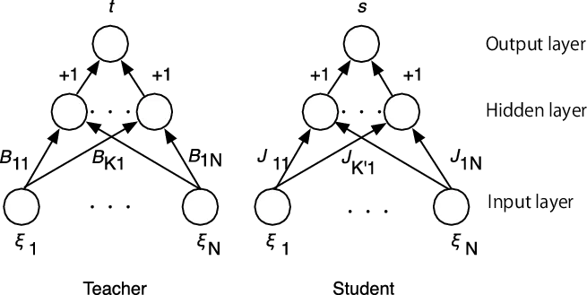
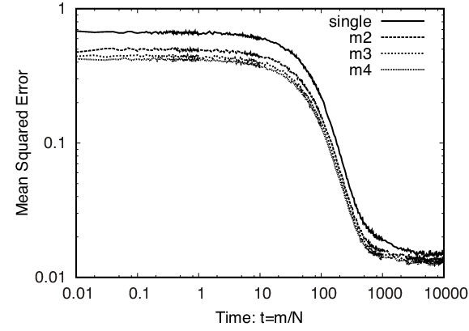
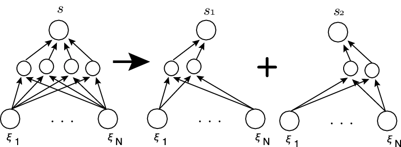
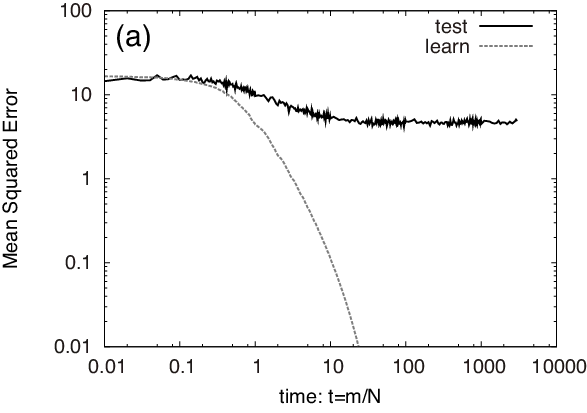
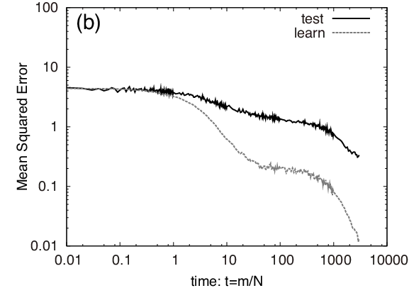
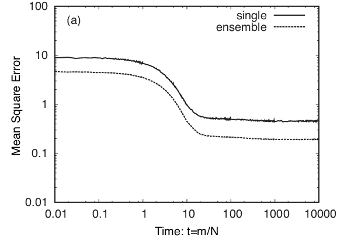
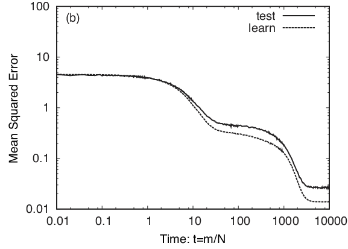
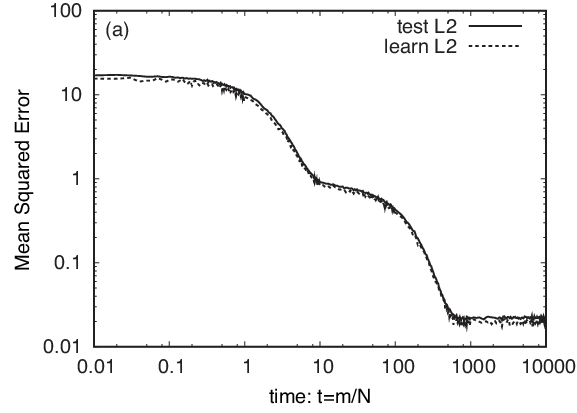

# Analysis of dropout learning regarded as ensemble learning

Kazuyuki Hara    Daisuke Saitoh    Hayaru Shouno

College of Industrial Technology, Nihon University,  
1-2-1 Izumi-cho, Narashino-shi, Chiba, 275-8575 Japan.  
Graduate School of Industrial Technology, Nihon University  
Graduate School of Informatics and Engineering,  
The University of Electro-Communications  
1-5-1 Chofugaoka, Chofu-shi, Tokyo, 182-8585 Japan.

###### Abstract

Deep learning is the state-of-the-art in fields such as visual object
recognition and speech recognition. This learning uses a large number of
layers, huge number of units, and connections. Therefore, overfitting is
a serious problem. To avoid this problem, dropout learning is proposed.
Dropout learning neglects some inputs and hidden units in the learning
process with a probability, $`p`$, and then, the neglected inputs and
hidden units are combined with the learned network to express the final
output. We find that the process of combining the neglected hidden units
with the learned network can be regarded as ensemble learning, so we
analyze dropout learning from this point of view.

keywords: Dropout learning, overfitting, regularization, ensemble
learning, soft-committee machine, teacher-student formulation

## 1 Introduction

Deep learning \[1, 2\] is attracting much attention in the field of
visual object recognition, speech recognition, object detection, and
many other domains. It provides automatic feature extraction and has the
ability to achieve outstanding performance \[3, 4\].

Deep learning uses a very deep layered network and a huge number of
data, so overfitting is a serious problem. To avoid overfitting,
regularization is used. Hinton et al. proposed a regularization method
called “dropout learning” \[5\] for this purpose. Dropout learning
follows two processes. At learning time, some hidden units are neglected
with a probability $`p`$, and this process reduces the network size. At
test time, learned hidden units and those not learned are summed up and
multiplied by $`p`$ to calculate the network output. We find that
summing up the learned and not learned units multiplied by $`p`$ can be
regarded as ensemble learning.

In this paper, we analyze dropout learning regarded as ensemble learning
\[6\]. On-line learning \[7, 8\] is used to learn a network. We analyze
dropout learning regarded as ensemble learning, except for using
different sets of of hidden units in dropout learning. We also analyze
dropout learning regarded as an L2 normalizer \[9\].

## 2 Model

In this paper, we use a teacher-student formulation and assume the
existence of a teacher network (teacher) that produces the desired
output for the student network (student). By introducing the teacher, we
can directly measure the similarity of the student weight vector to that
of the teacher. First, we formulate a teacher and a student, and then
introduce the gradient descent algorithm.

The teacher and student are a soft committee machine with $`N`$ input
units, hidden units, and an output, as shown in Fig. 1. The teacher
consists of $`K`$ hidden units, and the student consists of
$`K^{\prime}`$ hidden units. Each hidden unit is a perceptron. The
$`k`$th hidden weight vector of the teacher is
$`\bm{B}_{k}=(B_{k1},\ldots,B_{kN})`$, and the $`k^{\prime}`$th hidden
weight vector of student is
$`\bm{J}_{k^{\prime}}^{(m)}=(J_{k^{\prime}1}^{(m)},\ldots,J_{k^{\prime}N}^{(m)})`$,
where $`m`$ denotes learning iterations. In the soft committee machine,
all hidden-to-output weights are fixed to be $`+1`$ \[8\]. This network
calculates the majority vote of hidden outputs.



Figure 1: Network structures of teacher and student

We assume that both the teacher and the student receive
$`N`$-dimensional input
$`\bm{\xi}^{(m)}=(\xi_{1}^{m},\ldots,\xi_{N}^{(m)})`$, that the teacher
outputs
$`t^{(m)}=\sum_{k=1}^{K}t_{k}^{(m)}=\sum_{k=1}^{K}g(d_{k}^{(m)})`$, and
that the student outputs
$`s^{(m)}=\sum_{k^{\prime}=1}^{K^{\prime}}s_{k^{\prime}}^{(m)}=\sum_{k^{\prime}=1}^{K^{\prime}}g(y_{k^{\prime}}^{(m)})`$.
Here, $`g(\cdot)`$ is the output function of a hidden unit,
$`d_{k}^{(m)}`$ is the inner potential of the $`k`$th hidden unit of the
teacher calculated using
$`d_{k}^{(m)}=\sum_{i=1}^{N}B_{ki}\xi_{i}^{(m)}`$, and
$`y_{k^{\prime}}^{(m)}`$ is the inner potential of the $`k^{\prime}`$th
hidden unit of the student calculated using
$`y_{k^{\prime}}^{(m)}=\sum_{i=1}^{N}J_{k^{\prime}i}^{(m)}\xi_{i}^{(m)}`$.

We assume that the $`i`$th elements $`\xi_{i}^{(m)}`$ of the
independently drawn input $`\bm{\xi}^{(m)}`$ are uncorrelated random
variables with zero mean and unit variance; that is, that the $`i`$th
element of the input is drawn from a probability distribution
$`\mbox{P}(\xi_{i})`$. The thermodynamic limit of $`N\rightarrow\infty`$
is also assumed. The statistics of the inputs in the thermodynamic limit
are $`\left<\xi_{i}^{(m)}\right>=0`$,
$`\left<(\xi_{i}^{(m)})^{2}\right>\equiv\sigma_{\xi}^{2}=1`$, and
$`\left<\|\bm{\xi}^{(m)}\|\right>=\sqrt{N}`$, where
$`\left<\cdots\right>`$ denotes the average and $`\|\cdot\|`$ denotes
the norm of a vector. Each element $`B_{ki},\ k=1\sim K`$ is drawn from
a probability distribution with zero mean and $`1/N`$ variance. With the
assumption of the thermodynamic limit, the statistics of the teacher
weight vector are
$`\left<B_{ki}\right>=0,\left<(B_{ki})^{2}\right>\equiv\sigma_{B}^{2}=1/N`$,
and $`\left<\|\bm{B_{k}}\|\right>=1`$. This means that any combination
of $`\bm{B}_{l}\cdot\bm{B}_{l^{\prime}}=0`$. The distribution of inner
potential $`d_{k}^{(m)}`$ follows a Gaussian distribution with zero mean
and unit variance in the thermodynamic limit.

For the sake of analysis, we assume that each element of
$`J_{k^{\prime}i}^{(0)}`$, which is the initial value of the student
vector $`\bm{J}_{k^{\prime}}^{(0)}`$, is drawn from a probability
distribution with zero mean and $`1/N`$ variance. The statistics of the
$`k^{\prime}`$th hidden weight vector of the student are
$`\left<J_{k^{\prime}i}^{(0)}\right>=0,\left<(J_{k^{\prime}i}^{(0)})^{2}\right>\equiv\sigma_{J}^{2}=1/N`$,
and $`\left<\|\bm{J}_{k^{\prime}}^{(0)}\|\right>=1`$ in the
thermodynamic limit. This means that any combination of
$`\bm{J}_{l}^{(0)}\cdot\bm{J}_{l^{\prime}}^{(0)}=0`$. The output
function of the hidden units of the student $`g(\cdot)`$ is the same as
that of the teacher. The statistics of the student weight vector at the
$`m`$th iteration are $`\left<J_{k^{\prime}i}^{(m)}\right>=0`$,
$`\left<(J_{k^{\prime}i}^{(m)})^{2}\right>=(Q_{k^{\prime}k^{\prime}}^{(m)})^{2}/N`$,
and
$`\left<\|\bm{J}_{k^{\prime}}^{(m)}\|\right>=Q_{k^{\prime}k^{\prime}}^{(m)}`$.
Here,
$`(Q_{k^{\prime}k^{\prime}}^{(m)})^{2}=\bm{J}_{k^{\prime}}^{(m)}\cdot\bm{J}_{k^{\prime}}^{(m)}`$.
The distribution of the inner potential $`y_{k^{\prime}}^{(m)}`$ follows
a Gaussian distribution with zero mean and
$`(Q_{k^{\prime}k^{\prime}}^{(m)})^{2}`$ variance in the thermodynamic
limit.

Next, we introduce the stochastic gradient descent (SGD) algorithm for
the soft committee machine. The generalization error is defined as the
squared error $`\varepsilon`$ averaged over possible inputs:

```math
\varepsilon_{g}^{(m)}=\left<\varepsilon^{(m)}\right>=\frac{1}{2}\left<(t^{(m)}-s^{(m)})^{2}\right>=\frac{1}{2}\left<\left(\sum_{k=1}^{K}g(d_{k}^{(m)})-\sum_{k^{\prime}=1}^{K^{\prime}}g(y_{k^{\prime}}^{(m)})\right)^{2}\right>, \tag{1}
```

At each learning step $`m`$, a new uncorrelated input,
$`\bm{\xi}^{(m)}`$, is presented, and the current hidden weight vector
of the student $`\bm{J}_{k^{\prime}}^{(m)}`$ is updated using

```math
\bm{J}_{k^{\prime}}^{(m+1)}=\bm{J}_{k^{\prime}}^{(m)}+\frac{\eta}{N}\left(\sum_{l=1}^{K}g(d_{l}^{(m)})-\sum_{l^{\prime}=1}^{K^{\prime}}g(y_{l^{\prime}}^{(m)})\right)g^{\prime}(y_{k^{\prime}}^{(m)})\bm{\xi}^{(m)}, \tag{2}
```

where $`\eta`$ is the learning step size and $`g^{\prime}(x)`$ is the
derivative of the output function of the hidden unit $`g(x)`$.

On-line learning uses a new input at once, therefore, overfitting does
not occur. To evaluate the dropout learning in on-line learning,
pre-selected whole inputs frequently use in a on-line manner. From our
experiences, when the input dimension is $`N`$, then overfitting occurs
for pre-selected whole $`10\times N`$ inputs.

## 3 Dropout learning and ensemble learning

In this section, we compare dropout learning and ensemble learning
regarded as a way of calculating network output.

### 3.1 Ensemble learning

Eensemble learning is performed by using many learners (referred to as
students) to achieve better performance \[6\]. In ensemble learning,
each student learns the teacher independently, and each output is
averaged to calculate the ensemble output $`s_{en}`$.

```math
s_{en}=\sum_{k^{\prime}_{en}=1}^{K_{en}}C_{k^{\prime}_{en}}s_{k^{\prime}_{en}}=\sum_{k^{\prime}_{en}=1}^{K_{en}}C_{k^{\prime}_{en}}\sum_{k^{\prime}=1}^{K^{\prime}}g(y_{k^{\prime}}) \tag{3}
```

Here, $`C_{k^{\prime}_{en}}`$ is a weight for averaging. $`K_{en}`$ is
the number of students.

Figure 3 shows computer simulation results. The teacher and student
include two hidden units. The output function $`g(x)`$ is the error
function
$`\mbox{erf}(x/\sqrt{2})=\int_{-x}^{x}dt\exp(-t^{2}/s)/\sqrt{2\pi}`$. In
the figure, the horizontal axis is time $`t=m/N`$. Here, $`m`$ is the
iteration number, and $`N`$ is the dimension of input units. Input
dimension is $`N=10000`$, and $`10\times N`$ inputs are frequently used.
The vertical axis is the mean squared error (MSE) for $`N`$ input data.
Each elements $`\xi_{i}^{(m)}`$ of the independently drawn input
$`\bm{\xi}^{(m)}`$ are uncorrelated random variables with zero mean and
unit variance. Target for $`\bm{\xi}^{(m)}`$ is the teacher output. The
teacher and the initial student weight vectors are set as described in
Sec. 2. In the figure, “Single” is the result of using a single student.
“m2” is the result of using an ensemble of two students, “m3” is that of
an ensemble of three students, and “m4” is that of ensemble of four
students. As shown, the ensemble of four students outperformed the other
two cases.



Figure 2: Effect of ensemble learning



Figure 3: Network divided into two networks to apply ensemble learning

Next, we modify the ensemble learning. We divide the student (with
$`K^{\prime}`$ hidden units) into $`K_{en}`$ networks (See Fig. 3. Here,
$`K^{\prime}=4`$ and $`K_{en}=2`$). These divided networks learn the
teacher independently, and then we calculate the ensemble output
$`s_{en}`$ by averaging the outputs $`s_{k^{\prime}_{en}l^{\prime}}`$
as:

```math
s_{en}=\frac{1}{K_{en}}\sum_{k^{\prime}_{en}=1}^{K_{en}}s_{k^{\prime}_{en}}=\frac{1}{K_{en}}\sum_{k^{\prime}_{en}=1}^{K_{en}}\sum_{l^{\prime}=1}^{M/K_{en}}g(y_{k^{\prime}_{en}l^{\prime}}). \tag{4}
```

Here, $`s_{k^{\prime}_{en}}`$ is the output of a divided network with
$`M/K_{en}`$ hidden units, and $`g(y_{k^{\prime}_{en}l^{\prime}})`$ is
the $`l^{\prime}`$th hidden output in the $`k^{\prime}_{en}`$th divided
network. Eq. (4) corresponds to Eq. (3) when
$`C_{k^{\prime}_{en}}=\frac{1}{K_{en}}`$ and
$`K^{\prime}=\frac{M}{K_{en}}`$.

### 3.2 Dropout learning

In this subsection, we introduce dropout learning \[5\]. Dropout
learning is used in deep learning to prevent overfitting. A small number
of data compared with the size of a network may cause overfitting
\[10\]. In the state of overfitting, the learning error (the error for
learning data) and the test error (the error by cross-validation) become
different. Figure 4 shows the result of the SGD and that of dropout
learning. The soft committee machine was used for both the teacher and
student. $`\mbox{erf}(x/\sqrt{2})`$ was used as the output function
$`g(x)`$. Input dimension is $`N=1000`$, and the teacher had two hidden
units, and the student had 100 hidden units. The input and its target
are generated as those of Fig.3. The learning step size $`\eta`$ was set
to $`0.01`$, and $`1000`$ pieces of inputs were used iteratively for
learning. In Fig. 4(a) shows the learning curve of the SGD. In this
setting, overfitting occurred. Figure 4(b) shows the learning curve of
the SGD with dropout learning. The learning error was small compared
with the test error; however, the difference between the learning error
and the test error was not as significant as that of the SGD. Therefore,
these results shows that dropout learning prevent overfitting.





Figure 4: Effect of dropout. (a) is learning curve of SGD, and (b) is
that of dropout learning.

The learning equation of dropout learning for the soft committee machine
can be written as the next equation.

```math
\bm{J}_{k^{\prime}}^{(m+1)}=\bm{J}_{k^{\prime}}^{(m)}+\frac{\eta}{N}\left(\sum_{l=1}^{K}g(d_{l}^{(m)})-\sum_{l^{\prime}\notin D^{(m)}}^{(1-p)K^{\prime}}g(y_{l^{\prime}}^{(m)})\right)g^{\prime}(y_{k^{\prime}}^{(m)})\bm{\xi}^{(m)}, \tag{5}
```

Here, $`D^{(m)}`$ shows a set of hidden units that is randomly selected
with respect to the probability $`p`$ from all the hidden units at the
$`m`$th iteration. The hidden units in $`D^{(m)}`$ are not subject to
learning. After the learning, the student’s output $`s^{(m)}`$ is
calculated by the sum of learned hidden outputs and those not learned
multiplied by $`p`$.

```math
s^{(m)}=p*\left\{\sum_{l^{\prime}\notin{D}^{(m)}}^{(1-p)K^{\prime}}g(y_{l^{\prime}}^{(m)})+\sum_{l^{\prime}\in D^{(m)}}^{pK^{\prime}}g(y_{l^{\prime}}^{(m-1)})\right\} \tag{6}
```

This equation is regarded as the ensemble of a learned network (the
first term) and that of a not learned network (the second term) when the
probability is $`p=0.5`$. Equation 6 is correspond to Eq. (4) when
$`p=1/K_{en}`$ and $`K_{en}=2`$. However, a set of hidden units in
$`D^{(m)}`$ is selected at random in every iteration. So, dropout
learning is regarded as ensemble learning performed by using a different
set of hidden units in every iteration. Instead, the original ensemble
learning is the average of the fixed set of hidden units throughout the
learning. This difference may cause the difference in performances
between dropout learning and ensemble learning.

## 4 Results

### 4.1 Comparison between dropout learning and ensemble learning

In this section, the error function $`\mbox{erf}(x/\sqrt{2})`$ is used
as the output function $`g(x)`$. We compared dropout learning and
ensemble learning. We used two soft committee machines with 50 hidden
units for ensemble learning. For dropout learning, we used one soft
committee machine with 100 hidden units. We set $`p=0.5`$; then, dropout
learning selected 50 hidden units in $`D^{(m)}`$ with 50 unselected
hidden units remaining. Therefore, dropout learning and ensemble
learning had the same architectures. Input dimension is $`N=1000`$, and
the learning step size was set to $`\eta=0.01`$. The input and its
target are generated as those of Fig.3. $`N`$ inputs were used
iteratively for learning. Figure 5 shows the results. The horizontal
axes is time $`t=m/N`$, and the vertical axis is the MSE calculated for
$`N`$ input data. In Fig. 5(a), “single” shows the soft-committee
machines with 50 hidden units. “ensemble” shows the results given by
ensemble learning. Test errors are used in these figures. In Fig. 5(b),
“test” shows the MSE given by the test data. “learn” shows the MSE given
by the learning data. Results are obtained by average of 10 trials. As
shown in Fig. 5(a), the ensemble learning achieved an MSE smaller than
that of the single network. However, dropout learning achieved an MSE
smaller than that of ensemble learning. Therefore, ensemble learning
using a different set of hidden units in every iteration (this is the
dropout) performs better than when using the same set of hidden units
throughout the learning. Note that even with dropout learning using more
hidden units than ensemble learning, overfitting did not occur.
Therefore, in the next subsection, we will compare dropout learning with
the SGD with L2 regularization.





Figure 5: Results of comparison between dropout learning and ensemble
learning. (a) is ensemble learning of two networks, and (b) is dropout
learning with respect to $`p=0.5`$.

### 4.2 Comparison between dropout learning and SGD with L2 regularization

The next learning equation shows the SGD with L2 regularization.

```math
\bm{J}_{k^{\prime}}^{(m+1)}=\bm{J}_{k^{\prime}}^{(m)}+\frac{\eta}{N}\left(\sum_{l=1}^{K}g(d_{l}^{(m)})-\sum_{l^{\prime}=1}^{K^{\prime}}g(y_{l^{\prime}}^{(m)})\right)g^{\prime}(y_{k^{\prime}}^{(m)})\bm{\xi}^{(m)}-\alpha\|\bm{J}_{k^{\prime}}^{(m)}\|^{2}. \tag{7}
```

Here, $`\alpha`$ is a coefficient of the L2 penalty.

In Fig. 6, we show the learning results of the SGD with L2
regularization. Results are obtained by average of 10 trials. The
conditions were the same as those of Fig. 5.



Figure 6: Learning curve of SGD with L2 normalization

From comparison between Fig. 6 and Fig. 5(b), the residual error of
dropout learning was almost the same as that of the SGD with L2
regularization. Therefore, the regularization effort of dropout learning
is the same as the L2 regularization. Note that for the SGD with L2
regularization, we must choose $`\alpha`$ in trials; however, dropout
learning has no tuning parameter.

## 5 Conclusion

In this paper, we analyzed dropout learning regarded as ensemble
learning. In ensemble learning, we divide the network into several
sub-networks, and then we learn each sub-network independently. After
the learning, the ensemble output is calculated by using the average of
the sub-network outputs. We showed that dropout learning can be regarded
as ensemble learning except for using a different set of hidden units in
every learning iteration. Using a different set of hidden unit
outperforms ensemble learning. We also showed that dropout learning
achieves the same performance as the L2 regularizer. Our future work is
the theoretical analysis of dropout learning with ReLU activation
function.

### Acknowledgments

The authors thank Dr. Masato Okada and Dr. Hideitsu Hino for insightful
discussions.

## References

- \[1\] G. E. Hinton, S. Osindero, and Y. Teh, “A fast learning
  algorithm for deep belief nets”, Neural Computation, 18, pp. 1527–1554
  (2006).
- \[2\] Y. LeCun, Y. Bengio, and G. Hinton, “Deep learning”, NATURE,
  vol. 521, pp. 436–444 (2015).
- \[3\] A. Krizhevsky, I. Sutskever, and G. E. Hinton, “ImageNet
  Classification with Deep Convolutional Neural Networks”, Advanced in
  Neural Information Processing System 25, (2012).
- \[4\] L. Deng, J. Li, et al., “Recent advances in deep learning for
  speech research at Microsoft”, ICASSP (2013).
- \[5\] G. E. Hinton, N. Srivastava, A. Krizhevsky, I. Sutskever,
  and R. R. Salakhutdinov, “Improving neural networks by preventing
  co-adaptation of feature detectors”, The Computing Research Repository
  (CoRR), vol. abs/ 1207.0580 (2012).
- \[6\] K. Hara and M. Okada, “Ensemble Learning of Linear Perceptrons:
  On-Line Learning Theory”, Journal of the Physical Society of Japan,
  vol. 74, no. 11, pp. 2966–2972 (2005).
- \[7\] M. Biehl and H. Schwarze, “Learning by on-line gradient
  descent”, Journal of Physics A: Mathematical and General Physics, 28,
  643–656 (1995).
- \[8\] D. Saad and S. A. Solla, “On-line learning in soft-committee
  machines”, Physical Review E, 52, pp. 4225–4243 (1995).
- \[9\] S. Wager, Sida Wang, and Percy Liang, “Dropout Training as
  Adaptive Regularization”, Advance in Neural Information Processing
  System 26 (2013).
- \[10\] C. M. Bishop, Pattern Recognition and Machine learning,
  Springer (2006).
