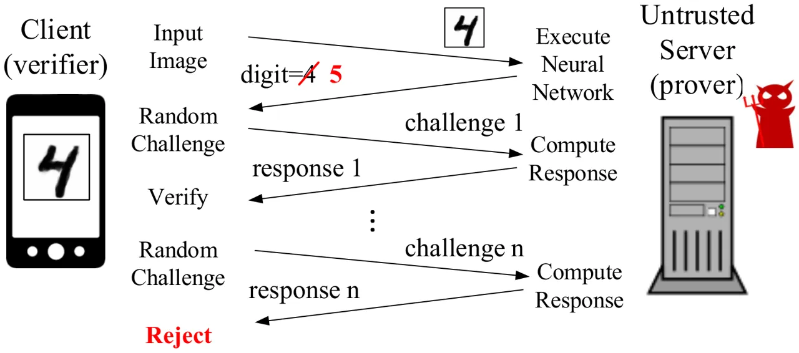

\AppendGraphicsExtensions

.tif

# SafetyNets: Verifiable Execution of Deep Neural Networks on an Untrusted Cloud

Zahra Ghodsi    Tianyu Gu    Siddharth Garg Affiliation: New York
University Affiliation: {zg451, tg1553, sg175}@nyu.edu

###### Abstract

Inference using deep neural networks is often outsourced to the cloud
since it is a computationally demanding task. However, this raises a
fundamental issue of trust. How can a client be sure that the cloud has
performed inference correctly? A lazy cloud provider might use a simpler
but less accurate model to reduce its own computational load, or worse,
maliciously modify the inference results sent to the client. We propose
SafetyNets, a framework that enables an untrusted server (the cloud) to
provide a client with a short mathematical proof of the correctness of
inference tasks that they perform on behalf of the client. Specifically,
SafetyNets develops and implements a specialized _interactive proof_
(IP) protocol for verifiable execution of a class of deep neural
networks, i.e., those that can be represented as arithmetic circuits.
Our empirical results on three- and four-layer deep neural networks
demonstrate the run-time costs of SafetyNets for both the client and
server are low. SafetyNets detects any incorrect computations of the
neural network by the untrusted server with high probability, while
achieving state-of-the-art accuracy on the MNIST digit recognition
($`99.4\%`$) and TIMIT speech recognition tasks ($`75.22\%`$).

   

|     |
| --- |
|     |

## 1 Introduction

Recent advances in deep learning have shown that multi-layer neural
networks can achieve state-of-the-art performance on a wide range of
machine learning tasks. However, training and performing inference on
neural networks can be computationally expensive. For this reason,
several commercial vendors have begun offering “machine learning as a
service" (MLaaS) solutions that allow clients to _outsource_ machine
learning computations, both training and inference, to the cloud.

While promising, the MLaaS model (and outsourced computing, in general)
raises immediate security concerns, specifically relating to the
_integrity_ (or correctness) of computations performed by the cloud and
the _privacy_ of the client’s data \[15\]. This paper focuses on the
former, i.e., the question of integrity. Specifically, how can a client
perform inference using a deep neural network on an untrusted cloud,
while obtaining strong assurance that the cloud has performed inference
correctly?

Indeed, there are compelling reasons for a client to be wary of a
third-party cloud’s computations. For one, the cloud has a financial
incentive to be “lazy." A lazy cloud might use a simpler but less
accurate model, for instance, a single-layer instead of a multi-layer
neural network, to reduce its computational costs. Further the cloud
could be compromised by malware that modifies the results sent back to
the client with malicious intent. For instance, the cloud might always
mis-classify a certain digit in a digit recognition task, or allow
unauthorized access to certain users in a face recognition based
authentication system.

The security risks posed by cloud computing have spurred theoretical
advances in the area of _verifiable computing_ (VC) \[19\]. The idea is
to enable a client to _provably_ (and _cheaply_) verify that an
untrusted server has performed computations correctly. To do so, the
server provides to the client (in addition to the result of computation)
a _mathematical_ proof of the correctness of the result. The client
rejects, with high probability, any incorrectly computed results (or
proofs) provided by the server, while always accepting correct results
(and corresponding proofs) ¹¹ 1 Note that the SafetyNets is not intended
to and cannot catch any inherent mis-classifications due to the model
itself, only those that result from incorrect computations of the model
by the server.. VC techniques aim for the following desirable
properties: the size of the proof should be small, the client’s
verification effort must be lower than performing the computation
locally, and the server’s effort in generating proofs should not be too
high.

The advantage of proof-based VC is that it provides _unconditional_,
mathematical guarantees on the integrity of computation performed by the
server. Alternative solutions for verifiable execution require the
client to make trust _assumptions_ that are hard for the client to
independently verify. Trusted platform modules \[7\], for instance,
require the client to place trust on the hardware manufacturer, and
assume that the hardware is tamper-proof. Audits based on the server’s
execution time \[14\] require precise knowledge of the server’s hardware
configuration and assume, for instance, that the server is not
over-clocked.



Figure 1: High-level overview of the SafetyNets IP protocol. In this
example, an untrusted server intentionally changes the classification
output from $`4`$ to $`5`$.

The work in this paper leverages powerful VC techniques referred to as
interactive proof (IP) systems \[5, 9, 17, 18\]. An IP system consists
of two entities, a prover ($`\mathcal{P}`$), i.e., the untrusted server,
and a verifier ($`\mathcal{V}`$), i.e., the client. The framework is
illustrated in Figure 1. The verifier sends the prover an input
$`\bm{x}`$, say a batch of test images, and asks the prover to compute a
function $`\bm{y}=f(\bm{x})`$. In our setting, $`f(.)`$ is a trained
multi-layer neural network that is known to both the verifier and
prover, and $`\bm{y}`$ is the neural network’s classification output for
each image in the batch. The prover performs the computation and sends
the verifier a purported result $`\bm{y^{\prime}}`$ (which is not equal
to $`\bm{y}`$ if the prover cheats). The verifier and prover then engage
in $`n`$ rounds of interaction. In each round, the verifier sends the
prover a randomly picked challenge, and the prover provides a response
based on the IP protocol. The verifier _accepts_ that
$`\bm{y^{\prime}}`$ is indeed equal to $`f(\bm{x})`$ if it is satisfied
with the prover’s response in each round, and _rejects_ otherwise.

A major criticism of IP systems (and, indeed, all existing VC
techniques) when used for verifying general-purpose computations is that
the prover’s overheads are _large_, often orders of magnitude more than
just computing $`f(\bm{x})`$ \[19\]. Recently, however, Thaler \[17\]
showed that certain types of computations admit IP protocols with highly
efficient verifiers and provers, which lays the foundations for the
specialized IP protocols for deep neural networks that we develop in
this paper.

#### Paper Contributions.

This paper introduces SafetyNets, a new (and to the best of our
knowledge, the first) approach for verifiable execution of deep neural
networks on untrusted clouds. Specifically, SafetyNets composes a new,
specialized IP protocol for the neural network’s activation layers with
Thaler’s IP protocol for matrix multiplication to achieve end-to-end
verifiability, dramatically reducing the bandwidth costs versus a naive
solution that verifies the execution of each layer of the neural network
separately.

SafetyNets applies to a certain class of neural networks that can be
represented as arithmetic circuits that perform computations over finite
fields (i.e., integers modulo a large prime $`p`$). Our implementation
of SafetyNets addresses several practical challenges in this context,
including the choice of the prime $`p`$, its relationship to accuracy of
the neural network, and to the verifier and prover run-times.

Empirical evaluations on the MNIST digit recognition and TIMIT speech
recognition tasks illustrate that SafetyNets enables practical, low-cost
verifiable outsourcing of deep neural network execution without
compromising classification accuracy. Specifically, the client’s
execution time is $`8\times`$-$`80\times`$ lower than executing the
network locally, the server’s overhead in generating proofs is less than
$`5\%`$, and the client/server exchange less than $`8`$ KBytes of data
during the IP protocol. SafetyNets’s security guarantees ensure that a
client can detect any incorrect computations performed by a malicious
server with probability vanishingly close to $`1`$. At the same time,
SafetyNets achieves state-of-the-art classification accuracies of
$`99.4\%`$ and $`75.22\%`$ on the MNIST and TIMIT datasets,
respectively.

## 2 Background

In this section, we begin by reviewing necessary background on IP
systems, and then describe the restricted class of neural networks
(those that can be represented as arithmetic circuits) that SafetyNets
handles.

### 2.1 Interactive Proof Systems

Existing IP systems proposed in literature \[5, 9, 17, 18\] use, at
their heart, a protocol referred to as the sum-check protocol \[13\]
that we describe here in some detail, and then discuss its applicability
in verifying general-purpose computations expressed as arithmetic
circuits.

#### Sum-check Protocol

Consider a $`d`$-degree $`n`$-variate polynomial
$`g(x_{1},x_{2},\ldots,x_{n})`$, where each variable
$`x_{i}\in\mathbb{F}_{p}`$ ($`\mathbb{F}_{p}`$ is the set of all natural
numbers between zero and $`p-1`$, for a given prime $`p`$) and
$`g:\mathbb{F}_{p}^{n}\rightarrow\mathbb{F}_{p}`$. The prover
$`\mathcal{P}`$ seeks to prove the following claim:

```math
y=\sum_{x_{1}\in\{0,1\}}\sum_{x_{2}\in\{0,1\}}\ldots\sum_{x_{n}\in\{0,1\}}g(x_{1},x_{2},\ldots,x_{n}) \tag{1}
```

that is, the sum of $`g`$ evaluated at $`2^{n}`$ points is $`y`$.
$`\mathcal{P}`$ and $`\mathcal{V}`$ now engage in a sum-check protocol
to verify this claim. In the first round of the protocol,
$`\mathcal{P}`$ sends the following unidimensional polynomial

```math
h(x_{1})=\sum_{x_{2}\in\{0,1\}}\sum_{x_{3}\in\{0,1\}}\ldots\sum_{x_{n}\in\{0,1\}}g(x_{1},x_{2},\ldots,x_{n}) \tag{2}
```

to $`\mathcal{V}`$ in the form of its coefficients. $`\mathcal{V}`$
checks if $`h(0)+h(1)=y`$. If yes, it proceeds, otherwise it rejects
$`\mathcal{P}`$’s claim. Next, $`\mathcal{V}`$ picks a random value
$`q_{1}\in\mathbb{F}_{p}`$ and evaluates $`h(q_{1})`$ which, based on
Equation 2, yields a new claim:

```math
h(q_{1})=\sum_{x_{2}\in\{0,1\}}\sum_{x_{3}\in\{0,1\}}\ldots\sum_{x_{n}\in\{0,1\}}g(q_{1},x_{2},\ldots,x_{n}). \tag{3}
```

$`\mathcal{V}`$ now recursively calls the sum-check protocol to verify
this new claim. By the final round of the sum-check protocol,
$`\mathcal{P}`$ returns the value $`g(q_{1},q_{2},\ldots,q_{n})`$ and
the $`\mathcal{V}`$ checks if this value is correct by evaluating the
polynomial by itself. If so, $`\mathcal{V}`$ accepts the original claim
in Equation 1, otherwise it rejects the claim.

###### Lemma 2.1.

\[2\] $`\mathcal{V}`$ rejects an incorrect claim by $`\mathcal{P}`$ with
probability greater than $`\left(1-\epsilon\right)`$ where
$`\epsilon=\frac{nd}{p}`$ is referred to as the soundness error.

#### IPs for Verifying Arithmetic Circuits

In their seminal work, Goldwasser et al. \[9\] demonstrated how
sum-check can be used to verify the execution of arithmetic circuits
using an IP protocol now referred to as GKR. An arithmetic circuit is a
directed acyclic graph of computation over elements of a finite field
$`\mathbb{F}_{p}`$ in which each node can perform either _addition_ or
_multiplication_ operations (modulo $`p`$). While we refer the reader to
 \[9\] for further details of GKR, one important aspect of the protocol
bears mention.

GKR organizes nodes of an arithmetic circuit into _layers_; starting
with the circuit inputs, the outputs of one layer feed the inputs of the
next. The GKR proof protocol operates backwards from the circuit outputs
to its inputs. Specifically, GKR uses sum-check to reduce the prover’s
assertion about the circuit output into an assertion about the inputs of
the output layer. This assertion is then reduced to an assertion about
the inputs of the penultimate layer, and so on. The protocol continues
iteratively till the verifier is left with an assertion about the
circuit inputs, which it checks on its own. The layered nature of GKR’s
prover aligns almost perfectly with the structure of a multi-layer
neural network and motivates the use of an IP system based on GKR for
SafetyNets.

### 2.2 Neural Networks as Arithmetic Circuits

As mentioned before, SafetyNets applies to neural networks that can be
expressed as arithmetic circuits. This requirement places the following
restrictions on the neural network layers.

#### Quadratic Activations

The activation functions in SafetyNets must be polynomials with integer
coefficients (or, more precisely, coefficients in the field
$`\mathbb{F}_{p}`$). The simplest of these is the element-wise quadratic
activation function whose output is simply the square of its input.
Other commonly used activation functions such as ReLU, sigmoid or
softmax activations are precluded, _except_ in the final output layer.
Prior work has shown that neural networks with quadratic activations
have the same representation power as networks those with threshold
activations and can be efficiently trained \[6, 12\].

#### Sum Pooling

Pooling layers are commonly used to reduce the network size, to prevent
overfitting and provide translation invariance. SafetyNets uses sum
pooling, wherein the output of the pooling layer is the sum of
activations in each local region. However, techniques such as max
pooling \[10\] and stochastic pooling \[20\] are not supported since max
and divisions operations are not easily represented as arithmetic
circuits.

#### Finite Field Computations

SafetyNets supports computations over elements of the field
$`\mathbb{F}_{p}`$, that is, integers in the range
$`\{-\frac{p-1}{2},\ldots,0,\ldots,\frac{p-1}{2}\}`$. The inputs,
weights and all intermediate values computed in the network must lie in
this range. Note that due to the use of quadratic activations and sum
pooling, the values in the network can become quite large. In practice,
we will pick large primes to support these large values. We note that
this restriction applies to the inference phase _only_; the network can
be trained with floating point inputs and weights. The inputs and
weights are then re-scaled and quantized, as explained in Section 3.3,
to finite field elements.

We note that the restrictions above are shared by a recently proposed
technique, CryptoNets \[8\], that seeks to perform neural network based
inference on _encrypted_ inputs so as to guarantee data privacy.
However, Cryptonets does not guarantee integrity and compared to
SafetyNets, incurs high costs for both the client and server (see
Section 4.3 for a comparison). Conversely, SafetyNets is targeted
towards applications where integrity is critical, but does not provide
privacy.

### 2.3 Mathematical Model

An $`L`$ layer neural network with the constraints discussed above can
be modeled, without loss of generality, as follows. The input to the
network is $`\bm{x}\in\mathbb{F}_{p}^{n_{0}\times b}`$, where $`n_{0}`$
is the dimension of each input and $`b`$ is the batch size. Layer
$`i\in[1,L]`$ has $`n_{i}`$ output neurons²² 2 The $`0^{th}`$ layer is
defined to be input layer and thus $`\bm{y_{0}}=\bm{x}`$., and is
specified using a weight matrix
$`\bm{w}_{i-1}\in\mathbb{F}_{p}^{n_{i}\times n_{i-1}}`$, and biases
$`\bm{b}_{i-1}\in\mathbb{F}_{p}^{n_{i}}`$.

The output of Layer $`i\in[1,L]`$,
$`\bm{y}_{i}\in\mathbb{F}_{p}^{n_{i}\times b}`$ is:

```math
\bm{y}_{i}=\sigma_{quad}(\bm{w}_{i-1}.\bm{y}_{i-1}+\bm{b}_{i-1}\bm{1}^{T})\,\,\forall i\in[1,L-1];\quad\bm{y}_{L}=\sigma_{out}(\bm{w}_{L-1}.\bm{y}_{L-1}+\bm{b}_{L-1}\bm{1}^{T}), \tag{4}
```

where $`\sigma_{quad}(.)`$ is the quadratic activation function,
$`\sigma_{out}(.)`$ is the activation function of the output layer, and
$`\bm{1}\in\mathbb{F}_{p}^{b}`$ is the vector of all ones. We will
typically use softmax activations in the output layer. We will also find
it convenient to introduce the variable
$`\bm{z}_{i}\in\mathbb{F}_{p}^{{n_{i+1}}\times b}`$ defined as

```math
\bm{z}_{i}=\bm{w}_{i}.\bm{y}_{i}+\bm{b}_{i}\bm{1}^{T}\,\,\forall i\in[0,L-1]. \tag{5}
```

The model captures both fully connected and convolutional layers; in the
latter case the weight matrix is sparse. Further, without loss of
generality, all successive linear transformations in a layer, for
instance sum pooling followed by convolutions, are represented using a
single weight matrix.

With this model in place, the goal of SafetyNets is to enable the client
to verify that $`\bf{y_{L}}`$ was correctly computed by the server. We
note that as in prior work \[18\], SafetyNets amortizes the prover and
verifier costs over _batches_ of inputs. If the server incorrectly
computes the output corresponding to any input in a batch, the verifier
rejects the entire batch of computations.

## 3 SafetyNets

We now describe the design and implementation of our end-to-end IP
protocol for verifying execution of deep networks. The SafetyNets
protocol is a specialized form of the IP protocols developed by
Thaler \[17\] for verifying “regular" arithmetic circuits, that
themselves specialize and refine prior work \[5\]. The starting point
for the protocol is a polynomial representation of the network’s inputs
and parameters, referred to as a multilinear extension.

#### Multilinear Extensions

Consider a matrix $`\bm{w}\in\mathbb{F}_{p}^{n\times n}`$. Each row and
column of $`\bm{w}`$ can be referenced using $`m=\log_{2}(n)`$ bits, and
consequently one can represent $`\bm{w}`$ as a function
$`W:\{0,1\}^{m}\times\{0,1\}^{m}\rightarrow\mathbb{F}_{p}`$. That is,
given Boolean vectors $`\bm{t},\bm{u}\in\{0,1\}^{m}`$, the function
$`W(\bm{t},\bm{u})`$ returns the element of $`\bm{w}`$ at the row and
column specified by Boolean vectors $`\bm{t}`$ and $`\bm{u}`$,
respectively.

A _multi-linear extension_ of $`W`$ is a polynomial function
$`\tilde{W}:\mathbb{F}_{p}^{m}\times\mathbb{F}_{p}^{m}\rightarrow\mathbb{F}_{p}`$
that has the following two properties: (1) given vectors
$`\bm{t},\bm{u}\in\mathbb{F}_{p}^{m}`$ such that
$`\tilde{W}(\bm{t},\bm{u})=W(\bm{t},\bm{u})`$ for all points on the unit
hyper-cube, that is, for all $`\bm{t},\bm{u}\in\{0,1\}^{m}`$; and (2)
$`\tilde{W}`$ has degree 1 in each of its variables. In the remainder of
this discussion, we will use $`\tilde{X}`$, $`\tilde{Y_{i}}`$ and
$`\tilde{Z_{i}}`$ and $`\tilde{W_{i}}`$ to refer to multi-linear
extensions of $`\bm{x}`$, $`\bm{y_{i}}`$, $`\bm{z_{i}}`$, and
$`\bm{w_{i}}`$, respectively, for $`i\in[1,L]`$. We will also assume,
for clarity of exposition, that the biases, $`\bm{b_{i}}`$ are zero for
all layers. The supplementary draft describes how biases are
incorporated. Consistent with the IP literature, the description of our
protocol refers to the client as the verifier and the server as the
prover.

#### Protocol Overview

The verifier seeks to check the result $`\bm{y}_{L}`$ provided by the
prover corresponding to input $`\bm{x}`$. Note that $`\bm{y}_{L}`$ is
the output of the final activation layer which, as discussed in
Section 2.2, is the only layer that does not use quadratic activations,
and is hence not amenable to an IP.

Instead, in SafetyNets, the prover computes and sends $`\bm{z}_{L-1}`$
(the _input_ of the final activation layer) as a result to the verifier.
$`\bm{z}_{L-1}`$ has the same dimensions as $`\bm{y}_{L}`$ and therefore
this refinement has no impact on the server to client bandwidth.
Furthermore, the verifier can easily compute
$`\bm{y}_{L}=\sigma_{out}(\bm{z}_{L-1})`$ locally.

Now, the verifier needs to check whether the prover computed
$`\bm{z}_{L-1}`$ correctly. As noted by Vu et al. \[18\], this check can
be replaced by a check on whether the multilinear extension of
$`\bm{z}_{L-1}`$ is correctly computed at a randomly picked point in the
field, with minimal impact on the soundness error. That is, the verifier
picks two vectors, $`\bm{q}_{L-1}\in\mathbb{F}_{p}^{log(n_{L})}`$ and
$`\bm{r}_{L-1}\in\mathbb{F}_{p}^{log(b)}`$ at _random_, evaluates
$`\tilde{Z}_{L-1}(\bm{q}_{L-1},\bm{r}_{L-1})`$, and checks whether it
was correctly computed using a specialized sum-check protocol for matrix
multiplication due to Thaler \[17\] (described in Section 3.1).

Since $`\bm{z}_{L-1}`$ depends on $`\bm{w}_{L-1}`$ and $`\bm{y}_{L-1}`$,
sum-check yields assertions on the values of
$`\tilde{W}_{L-1}(\bm{q}_{L-1},\bm{s}_{L-1})`$ and
$`\tilde{Y}_{L-1}(\bm{s}_{L-1},\bm{r}_{L-1})`$, where
$`\bm{s}_{L-1}\in\mathbb{F}_{p}^{log(n_{L-1})}`$ is another random
vector picked by the verifier during sum-check.

$`\tilde{W}_{L-1}(\bm{q}_{L-1},\bm{s}_{L-1})`$ is an assertion about the
weight of the final layer. This is checked by the verifier locally since
the weights are known to both the prover and verifier. Finally, the
verifier uses our specialized sum-check protocol for activation layers
(described in Section 3.2) to reduce the assertion on
$`\tilde{Y}_{L-1}(\bm{s}_{L-1},\bm{r}_{L-1})`$ to an assertion on
$`\tilde{Z}_{L-2}(\bm{q}_{L-2},\bm{s}_{L-2})`$. The protocol repeats
till it reaches the input layer and produces an assertion on
$`\tilde{X}(\bm{s}_{0},\bm{r}_{0})`$, the multilinear extension of the
input $`\bf{x}`$. The verifier checks this locally. If at any point in
the protocol, the verifier’s checks fail, it rejects the prover’s
computation. Next, we describe the sum-check protocols for matrix
multiplication and activation that SafetyNets uses.

### 3.1 Sum-check for Matrix Multiplication

Since $`\bm{z}_{i}=\bm{w}_{i}.\bm{y}_{i}`$ (recall we assumed zero
biases for clarity), we can check an assertion about the multilinear
extension of $`\bm{z}_{i}`$ evaluated at randomly picked points
$`\bm{q}_{i}`$ and $`\bm{r}_{i}`$ by expressing
$`\tilde{Z}_{i}(\bm{q}_{i},\bm{r}_{i})`$ as \[17\]:

```math
\tilde{Z}_{i}(\bm{q}_{i},\bm{r}_{i})=\sum_{j\in\{0,1\}^{\log(n_{i})}}\tilde{W}_{i}(\bm{q}_{i},\bm{j}).\tilde{Y}_{i}(\bm{j},\bm{r}_{i}) \tag{6}
```

Note that Equation 6 has the same form as the sum-check problem in
Equation 1. Consequently the sum-check protocol described in Section 2.1
can be used to verify this assertion. At the end of the sum-check
rounds, the verifier will have assertions on $`\tilde{W}_{i}`$ which it
checks locally, and $`\tilde{Y}_{i}`$ which is checked using the
sum-check protocol for quadratic activations described in Section 3.2.

The prover run-time for running the sum-check protocol in layer $`i`$ is
$`\mathbb{O}(n_{i}(n_{i-1}+b))`$, the verifier’s run-time is
$`\mathbb{O}(n_{i}n_{i-1})`$ and the prover/verifier exchange
$`4\log(n_{i})`$ field elements.

### 3.2 Sum-check for Quadratic Activation

In this step, we check an assertion about the output of quadratic
activation layer $`i`$, $`\tilde{Y}_{i}(\bm{s}_{i},\bm{r}_{i})`$, by
writing it in terms of the input of the activation layer as follows:

```math
\tilde{Y}_{i}(\bm{s}_{i},\bm{r}_{i})=\sum_{j\in\{0,1\}^{\log(n_{i})},k\in\{0,1\}^{\log(b)}}\tilde{I}(\bm{s}_{i},\bm{j})\tilde{I}(\bm{r}_{i},\bm{k})\tilde{Z}_{i-1}^{2}(\bm{j},\bm{k}), \tag{7}
```

where $`\tilde{I}(.,.)`$ is the multilinear extension of the identity
matrix. Equation 7 can also be verified using the sum-check protocol,
and yields an assertion about $`\tilde{Z}_{i-1}`$, i.e., the inputs to
the activation layer. This assertion is in turn checked using the
protocol described in Section 3.1.

The prover run-time for running the sum-check protocol in layer $`i`$ is
$`\mathbb{O}(bn_{i})`$, the verifier’s run-time is
$`\mathbb{O}(\log(bn_{i}))`$ and the prover/verifier exchange
$`5\log(bn_{i})`$ field elements. This completes the theoertical
description of the SafetyNets specialized IP protocol.

###### Lemma 3.1.

The SafetyNets verifier rejects incorrect computations with probability
greater than $`\left(1-\epsilon\right)`$ where
$`\epsilon=\frac{3b\sum_{i=0}^{L}n_{i}}{p}`$ is the soundness error.

In practice, with $`p=2^{61}-1`$ the soundness error
$`<\frac{1}{2^{30}}`$ for practical network parameters and batch sizes.

### 3.3 Implementation

The fact that SafetyNets operates only on elements in a finite field
$`\mathbb{F}_{p}`$ during inference imposes a practical challenge. That
is, how do we convert floating point inputs and weights from training
into field elements, and how do we select the size of the field $`p`$?

Let $`\bm{w^{\prime}}_{i}\in\mathbb{R}^{n_{i-1}\times n_{i}}`$ and
$`\bm{b^{\prime}}_{i}\in\mathbb{R}^{n_{i}}`$ be the floating point
parameters obtained from training for each layer $`i\in[1,L]`$. We
convert the weights to integers by multiplying with a constant
$`\beta>1`$ and rounding, i.e.,
$`\bm{w}_{i}=\lfloor\beta\bm{w^{\prime}}_{i}\rceil`$. We do the same for
inputs with a scaling factor $`\alpha`$, i.e.,
$`\bm{x}=\lfloor\alpha\bm{x^{\prime}}\rceil`$. Then, to ensure that all
values in the network scale isotropically, we must set
$`\bm{b}_{i}=\lfloor\alpha^{2^{i-1}}\beta^{(2^{i-1}+1)}\bm{b^{\prime}}_{i}\rceil`$.

While larger $`\alpha`$ and $`\beta`$ values imply lower quantization
errors, they also result in large values in the network, especially in
the layers closer to the output. Similar empirical observations were
made by the CryptoNets work \[8\]. To ensure accuracy the values in the
network must lie in the range $`[-\frac{p-1}{2},\frac{p-1}{2}]`$; this
influences the choice of the prime $`p`$. On the other hand, we note
that large primes increase the verifier and prover run-time because of
the higher cost of performing modular additions and multiplications.

As in prior works \[5, 17, 18\], we restrict our choice of $`p`$ to
Mersenne primes since they afford efficient modular arithmetic
implementations, and specifically to the primes $`p=2^{61}-1`$ and
$`p=2^{127}-1`$. For a given $`p`$, we explore and different values of
$`\alpha`$ and $`\beta`$ and use the validation dataset to the pick the
ones that maximize accuracy while ensuring that the values in the
network lie within $`[-\frac{p-1}{2},\frac{p-1}{2}]`$.

## 4 Empirical Evaluation

In this section, we present empirical evidence to support our claim that
SafetyNets enables low-cost verifiable execution of deep neural networks
on untrusted clouds without compromising classification accuracy.

### 4.1 Setup

#### Datasets

We evaluated SafetyNets on three classifications tasks. (1) Handwritten
digit recognition on the MNIST dataset, using 50,000 training, 10,000
validation and 10,000 test images. (2) A more challenging version of
digit recognition, MNIST-Back-Rand, an artificial dataset generated by
inserting a random background into MNIST image \[1\]. The dataset has
10,000 training, 2,000 validation and 50,000 test images. ZCA whitening
is applied to the raw dataset before training and testing \[4\]. (3)
Speech recognition on the TIMIT dataset, split into a training set with
462 speakers, a validation set with 144 speakers and a testing set with
24 speakers. The raw audio samples are pre-processed as described
by \[3\]. Each example includes its preceding and succeeding 7 frames,
resulting in a 1845-dimensional input in total. During testing, all
labels are mapped to 39 classes \[11\] for evaluation.

#### Neural Networks

For the two MNIST tasks, we used a convolutional neural network same
as \[21\] with 2 convolutional layers with $`5\times 5`$ filters, a
stride of $`1`$ and a mapcount of 16 and 32 for the first and second
layer respectively. Each convolutional layer is followed by quadratic
activations and $`2\times 2`$ sum pooling with a stride of 2. The fully
connected layer uses softmax activation. We refer to this network as
CNN-2-Quad. For TIMIT, we use a four layer network described by  \[3\]
with 3 hidden, fully connected layers with $`2000`$ neurons and
quadratic activations. The output layer is fully connected with $`183`$
output neurons and softmax activation. We refer to this network as
FcNN-3-Quad. Since quadratic activations are not commonly used, we
compare the performance of CNN-2-Quad and FcNN-3-Quad with baseline
versions in which the quadratic activations are replaced by ReLUs. The
baseline networks are CNN-2-ReLU and FcNN-3-ReLU.

The hyper-parameters for training are selected based on the validation
datasets. The Adam Optimizer is used for CNNs with learning rate 0.001,
exponential decay and dropout probability 0.75. The AdaGrad optimizer is
used for FcNNs with a learning rate of 0.01 and dropout probability 0.5.
We found that norm gradient clipping was required for training the
CNN-2-Quad and FcNN-3-Quad networks, since the gradient values for
quadratic activations can become large.

Our implementation of SafetyNets uses Thaler’s code for the IP protocol
for matrix multiplication  \[17\] and our own implementation of the IP
for quadratic activations. We use an Intel Core i7-4600U CPU running at
$`2.10`$ GHz for benchmarking.

### 4.2 Classification Accuracy of SafetyNets

(a) MNIST

(b) MNIST-Back-Rand

(c) TIMIT

Figure 2: Evolution of training and test error for the MNIST,
MNIST-Back-Rand and TIMIT tasks.

SafetyNets places certain restrictions on the activation function
(quadratic) and requires weights and inputs to be integers (in field
$`F_{p}`$). We begin by analyzing how (and if) these restrictions impact
classification accuracy/error. Figure 2 compares training and test error
of CNN-2-Quad/FcNN-3-Quad versus CNN-2-ReLU/FcNN-3-ReLU. For all three
tasks, the networks with quadratic activations are competitive with
networks that use ReLU activations. Further, we observe that the
networks with quadratic activations appear to converge faster during
training, possibly because their gradients are larger despite gradient
clipping.

Next, we used the scaling and rounding strategy proposed in Section 3.3
to convert weights and inputs to integers. Table 1 shows the impact of
scaling factors $`\alpha`$ and $`\beta`$ on the classification error and
maximum values observed in the network during inference for
MNIST-Back-Rand. The validation error drops as $`\alpha`$ and $`\beta`$
are increased. On the other hand, for $`p=2^{61}-1`$, the largest value
allowed is $`1.35\times 10^{18}`$; this rules out $`\alpha`$ and
$`\beta`$ greater than $`64`$, as shown in the table. For
MNIST-Back-Rand, we pick $`\alpha=\beta=16`$ based on validation data,
and obtain a test error of $`4.67\%`$. Following a similar methodology,
we obtain a test error of $`0.63\%`$ for MNIST ($`p=2^{61}-1`$) and
$`25.7\%`$ for TIMIT ($`p=2^{127}-1`$). We note that SafetyNets does not
support techniques such as Maxout \[10\] that have demonstrated lower
error on MNIST ($`0.45\%`$). Ba et al. \[3\] report an error of
$`18.5\%`$ for TIMIT using an _ensemble_ of nine deep neural networks,
which SafetyNets might be able to support by verifying each network
individually and performing ensemble averaging at the client-side.

### 4.3 Verifier and Prover Run-times

Figure 3: Run-time of verifier, prover and baseline execution time for
the arithmetic circuit representation of FcNN-Quad-3 versus input batch
size.

The relevant performance metrics for SafetyNets are (1) the client’s (or
verifier’s) run-time, (2) the server’s run-time which includes baseline
time to execute the neural network and overhead of generating proofs,
and (3) the bandwidth required by the IP protocol. Ideally, these
quantities should be small, and importantly, the client’s run-time
should be smaller than the case in which it executes the network by
itself. Figure 3 plots run-time data over input batch sizes ranging from
256 to 2048 for FcNN-Quad-3.

For FcNN-Quad-3, the client’s time for verifying proofs is $`8\times`$
to $`82\times`$ faster than the baseline in which it executes
FcNN-Quad-3 itself, and decreases with batch size. The increase in the
server’s execution time due to the overhead of generating proofs is only
$`5\%`$ over the baseline unverified execution of FcNN-Quad-3. The
prover and verifier exchange less than 8 KBytes of data during the IP
protocol for a batch size of 2048, which is negligible (less than
$`2\%`$) compared to the bandwidth required to communicate inputs and
outputs back and forth. In all settings, the soundness error
$`\epsilon`$, i.e., the chance that the verifier fails to detect
incorrect computations by the server is less than $`\frac{1}{2^{30}}`$,
a negligible value. We note SafetyNets has significantly lower bandwidth
costs compared to an approach that _separately_ verifies the execution
of each layer using only the IP protocol for matrix multiplication.

A recent and closely related technique, CryptoNets \[8\], uses
homomorphic encryption to provide privacy, but not integrity, for neural
networks executing in the cloud. Since SafetyNets and CryptoNets target
different security goals a direct comparison is not entirely meaningful.
However, from the data presented in the CryptoNets paper, we note that
the client’s run-time for MNIST using a CNN similar to ours and an input
batch size $`b=4096`$ is about 600 seconds, primarily because of the
high cost of encryptions. For the same batch size, the client-side
run-time of SafetyNets is less than 10 seconds. From this rough
comparison, it appears that integrity is a more practically achievable
security goal than privacy.

|           | $`\alpha=4`$ |                       | $`\alpha=8`$ |                       | $`\alpha=16`$ |                       | $`\alpha=32`$ |                            | $`\alpha=64`$ |                            |
| --------- | ------------ | --------------------- | ------------ | --------------------- | ------------- | --------------------- | ------------- | -------------------------- | ------------- | -------------------------- |
| $`\beta`$ | Err          | Max                   | Err          | Max                   | Err           | Max                   | Err           | Max                        | Err           | Max                        |
| 4         | $`0.188`$    | $`4.0\times 10^{8}`$  | $`0.073`$    | $`4.0\times 10^{10}`$ | $`0.042`$     | $`5.5\times 10^{12}`$ | $`0.039`$     | $`6.6\times 10^{14}`$      | $`0.04`$      | $`8.8\times 10^{16}`$      |
| 8         | $`0.194`$    | $`6.1\times 10^{9}`$  | $`0.072`$    | $`6.9\times 10^{11}`$ | $`0.039`$     | $`8.3\times 10^{13}`$ | $`0.038`$     | $`1.0\times 10^{16}`$      | $`0.037`$     | $`\bm{1.3\times 10^{18}}`$ |
| 16        | $`0.188`$    | $`9.4\times 10^{10}`$ | $`0.072`$    | $`1.1\times 10^{13}`$ | $`0.036`$     | $`1.3\times 10^{15}`$ | $`0.037`$     | $`1.6\times 10^{17}`$      | $`0.035`$     | $`\bm{2.1\times 10^{19}}`$ |
| 32        | $`0.186`$    | $`1.5\times 10^{12}`$ | $`0.073`$    | $`1.7\times 10^{14}`$ | $`0.038`$     | $`2.1\times 10^{16}`$ | $`0.037`$     | $`\bm{2.6\times 10^{18}}`$ | $`0.036`$     | $`\bm{3.5\times 10^{20}}`$ |
| 64        | $`0.185`$    | $`2.5\times 10^{13}`$ | $`0.073`$    | $`2.8\times 10^{15}`$ | $`0.038`$     | $`3.4\times 10^{17}`$ | $`0.037`$     | $`\bm{4.2\times 10^{19}}`$ | $`0.036`$     | $`\bm{5.6\times 10^{21}}`$ |

Table 1: Validation error and maximum value observed in the network for
MNIST-Rand-Back and different values of scaling parameters, $`\alpha`$
and $`\beta`$. Shown in bold red font are values of $`\alpha`$ and
$`\beta`$ that are infeasible because the maximum value exceeds that
allowed by prime $`p=2^{61}-1`$.

## 5 Conclusion

In this paper, we have presented SafetyNets, a new framework that allows
a client to provably verify the correctness of deep neural network based
inference running on an untrusted clouds. Building upon the rich
literature on interactive proof systems for verifying general-purpose
and specialized computations, we designed and implemented a specialized
IP protocol tailored for a certain class of deep neural networks, i.e.,
those that can be represented as arithmetic circuits. We showed that
placing these restrictions did not impact the accuracy of the networks
on real-world classification tasks like digit and speech recognition,
while enabling a client to verifiably outsource inference to the cloud
at low-cost. For our future work, we will apply SafetyNets to deeper
networks and extend it to address _both_ integrity and privacy. There
are VC techniques \[16\] that guarantee both, but typically come at
higher costs.

## References

- \[1\] Variations on the MNIST digits.
  [http://www.iro.umontreal.ca/~lisa/twiki/bin/view.cgi/Public/MnistVariations](http://www.iro.umontreal.ca/~lisa/twiki/bin/view.cgi/Public/MnistVariations), 2007.
- \[2\] S. Arora and B. Barak. Computational complexity: a modern
  approach. Cambridge University Press, 2009.
- \[3\] J. Ba and R. Caruana. Do deep nets really need to be deep? In
  Advances in neural information processing systems, pages
  2654–2662, 2014.
- \[4\] A. Coates, A. Ng, and H. Lee. An analysis of single-layer
  networks in unsupervised feature learning. In Proceedings of the
  fourteenth international conference on artificial intelligence and
  statistics, pages 215–223, 2011.
- \[5\] G. Cormode, J. Thaler, and K. Yi. Verifying computations with
  streaming interactive proofs. Proceedings of the VLDB Endowment, pages
  25–36, 2011.
- \[6\] A. Gautier, Q. N. Nguyen, and M. Hein. Globally optimal training
  of generalized polynomial neural networks with nonlinear spectral
  methods. pages 1687–1695, 2016.
- \[7\] R. Gennaro, C. Gentry, and B. Parno. Non-interactive verifiable
  computing: Outsourcing computation to untrusted workers. Annual
  Cryptology Conference, pages 465–482, 2010.
- \[8\] R. Gilad-Bachrach, N. Dowlin, K. Laine, K. Lauter, M. Naehrig,
  and J. Wernsing. Cryptonets: Applying neural networks to encrypted
  data with high throughput and accuracy. pages 201–210, 2016.
- \[9\] S. Goldwasser, Y. T. Kalai, and G. N. Rothblum. Delegating
  computation: interactive proofs for muggles. Proceedings of the
  fortieth annual ACM symposium on Theory of computing, pages
  113–122, 2008.
- \[10\] I. J. Goodfellow, D. Warde-Farley, M. Mirza, A. Courville, and
  Y. Bengio. Maxout networks. arXiv preprint arXiv:1302.4389, 2013.
- \[11\] K.-F. Lee and H.-W. Hon. Speaker-independent phone recognition
  using hidden markov models. IEEE Transactions on Acoustics, Speech,
  and Signal Processing, 37(11):1641–1648, 1989.
- \[12\] R. Livni, S. Shalev-Shwartz, and O. Shamir. On the
  computational efficiency of training neural networks. In Advances in
  Neural Information Processing Systems, pages 855–863, 2014.
- \[13\] C. Lund, L. Fortnow, H. Karloff, and N. Nisan. Algebraic
  methods for interactive proof systems. Journal of the ACM (JACM),
  pages 859–868, 1992.
- \[14\] F. Monrose, P. Wyckoff, and A. D. Rubin. Distributed execution
  with remote audit. NDSS, 99:3–5, 1999.
- \[15\] N. Papernot, P. McDaniel, A. Sinha, and M. Wellman. Towards the
  science of security and privacy in machine learning. arXiv preprint
  arXiv:1611.03814, 2016.
- \[16\] B. Parno, J. Howell, C. Gentry, and M. Raykova. Pinocchio:
  Nearly practical verifiable computation. In Security and Privacy (SP),
  2013 IEEE Symposium on, pages 238–252. IEEE, 2013.
- \[17\] J. Thaler. Time-optimal interactive proofs for circuit
  evaluation. Advances in Cryptology–CRYPTO 2013, pages 71–89, 2013.
- \[18\] V. Vu, S. Setty, A. J. Blumberg, and M. Walfish. A hybrid
  architecture for interactive verifiable computation. Security and
  Privacy (SP), 2013 IEEE Symposium on, pages 223–237, 2013.
- \[19\] M. Walfish and A. J. Blumberg. Verifying computations without
  reexecuting them. Communications of the ACM, 58(2):74–84, 2015.
- \[20\] M. D. Zeiler and R. Fergus. Stochastic pooling for
  regularization of deep convolutional neural networks. arXiv preprint
  arXiv:1301.3557, 2013.
- \[21\] Y. Zhang, P. Liang, and M. J. Wainwright. Convexified
  convolutional neural networks. arXiv preprint arXiv:1609.01000, 2016.

## Proof of Lemma 3.1

#### Lemma 3.1

The SafetyNets verifier rejects incorrect computations with probability
greater than $`\left(1-\epsilon\right)`$ where
$`\epsilon=\frac{3b\sum_{i=0}^{L}n_{i}}{p}`$ is the soundness error.

###### Proof.

Verifying a multi-linear extension of the output sampled at a random
point, instead of each value adds a soundness error of
$`\epsilon=\frac{bn_{L}}{p}`$. Each instance of the sum-check protocol
adds to the soundness error \[18\]. The IP protocol for matrix
multiplication adds a soundness error of $`\epsilon=\frac{2n_{i-1}}{p}`$
in Layer $`i`$ \[17\]. Finally, the IP protocol for quadratic
activations adds a soundness error of $`\epsilon=\frac{3bn_{i}}{p}`$ in
Layer $`i`$ \[17\]. Summing together we get a total soundness error of
$`\frac{2\sum_{i=0}^{L-1}n_{i}+3\sum_{i=1}^{L-1}bn_{i}+bn_{L}}{p}`$. The
final result is an upper bound on this value. ∎

## Handling Bias Variables

We assumed that the bias variables were zero, allowing us to write
$`bm{z}_{i}=\bm{w}_{i}.\bm{y}_{i}`$ while it should be
$`bm{z}_{i}=\bm{w}_{i}.\bm{y}_{i}+\bm{b}_{i}\bm{1}^{T}`$. Let
$`\bm{z^{\prime}}_{i}=\bm{w}_{i}.\bm{y}_{i}`$ We seek to convert an
assertion on $`\tilde{Z}_{i}(\bm{q}_{i},\bm{r}_{i})`$ to an assertion on
$`\tilde{Z^{\prime}}_{i}`$. We can do so by noting that:

```math
\tilde{Z}_{i}(\bm{q}_{i},\bm{r}_{i})=\sum_{j\in\{0,1\}^{\log(n_{i})}}\tilde{I}(\bm{j},\bm{q}_{i})(\tilde{Z^{\prime}}_{i}(\bm{j},\bm{r}_{i})+\tilde{B}_{i}(\bm{j})) \tag{8}
```

which can be reduced to sum-check and thus yields an assertion on
$`\tilde{B}_{i}`$ which the verifier checks locally and
$`\tilde{Z^{\prime}}_{i}`$, which is passed to the IP protocol for
matrix multiplication.
