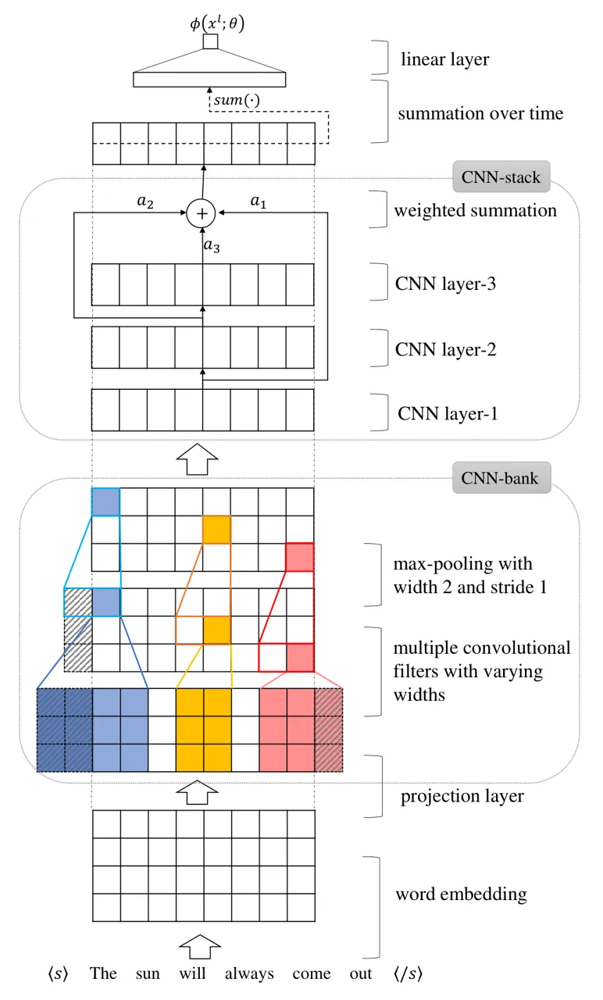
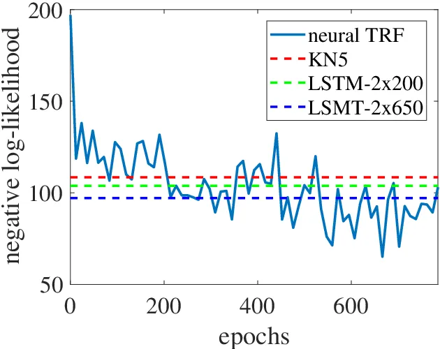
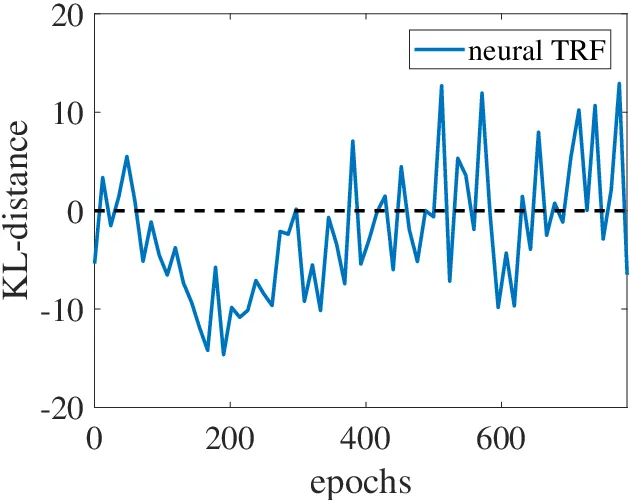

# Language modeling with Neural trans-dimensional random fields

Bin Wang    Zhijian Ou ^(†)^(†)thanks: This work is supported by NSFC
grant 61473168.

###### Abstract

Trans-dimensional random field language models (TRF LMs) have recently
been introduced, where sentences are modeled as a collection of random
fields. The TRF approach has been shown to have the advantages of being
computationally more efficient in inference than LSTM LMs with close
performance and being able to flexibly integrate rich features. In this
paper we propose neural TRFs, beyond of the previous discrete TRFs that
only use linear potentials with discrete features. The idea is to use
nonlinear potentials with continuous features, implemented by neural
networks (NNs), in the TRF framework. Neural TRFs combine the advantages
of both NNs and TRFs. The benefits of word embedding, nonlinear feature
learning and larger context modeling are inherited from the use of NNs.
At the same time, the strength of efficient inference by avoiding
expensive softmax is preserved. A number of technical contributions,
including employing deep convolutional neural networks (CNNs) to define
the potentials and incorporating the joint stochastic approximation
(JSA) strategy in the training algorithm, are developed in this work,
which enable us to successfully train neural TRF LMs. Various LMs are
evaluated in terms of speech recognition WERs by rescoring the 1000-best
lists of WSJ’92 test data. The results show that neural TRF LMs not only
improve over discrete TRF LMs, but also perform slightly better than
LSTM LMs with only one fifth of parameters and 16x faster inference
efficiency.

###### Index Terms: 

Language modeling, Random field, Stochastic approximation

^(†)^(†)address: Department of Electronic Engineering, Tsinghua
university, Beijing, China.  
wangbin12@mails.tsinghua.edu.cn, ozj@tsinghua.edu.cn

## 1 Introduction

Statistical language models, which estimate the joint probability of
words in a sentence, form a crucial component in many applications such
as automatic speech recognition (ASR) and machine translation (MT).
Recently, neural network language models (NN LMs), which can be either
feedforward NNs (FNNs) \[1\] or recurrent NNs (RNNs) \[2, 3\], have been
shown to surpass classical n-gram LMs. RNNs with Long Short-Term Memory
(LSTM) units are particularly popular. Remarkably, both n-gram LMs and
NN LMs follow the directed graphical modeling approach, which represents
the joint probability in terms of conditionals. In contrast, a new
trans-dimensional random field (TRF) LM \[4, 5\] has recently been
introduced in the undirected graphical modeling approach, where
sentences are modeled as a collection of random fields and the joint
probability is defined in terms of local potential functions. It has
been shown that TRF LMs significantly outperform n-gram LMs, and perform
close to LSTM LMs but are computationally more efficient (200x faster)
in inference (i.e. computing sentence probability).

Although the TRF approach has the capacity to support nonlinear
potential functions and rich features, only linear potentials with
discrete features (such as word and class n-gram features) are used in
the previous TRF models, which limit their performances. The previous
TRF models \[4, 5\] will thus be referred to as discrete TRFs. This
limitation is clear when comparing discrete TRF LMs with LSTM LMs.
First, LSTM LMs associate with each word in the vocabulary a real-valued
feature vector. Such word embedding in continuous vector space creates a
notion of similarity between words and achieves a level of
generalization that is hard with discrete features. Discrete TRFs mainly
rely on word classing and various orders of discrete features for
smoothing parameter estimates. Second, LSTM LMs learn nonlinear
interactions between underlying features by use of NNs, while discrete
TRF LMs basically are log-linear models. Third, LSTM models could model
larger contexts by using memory cells than discrete TRF models. Despite
these differences, discrete TRF LMs still achieves impressive
performances, being close to LSTM LMs. A promising extension is to
integrate NNs into the TRF framework, thus eliminating the above
limitation of discrete TRFs.

The above analysis motivates us to propose neural trans-dimensional
random fields (neural TRFs) in this paper. The idea is to use nonlinear
potentials with continuous features, implemented by NNs, in the TRF
framework. Neural TRFs combine the advantages of both NNs and TRFs. The
benefits of word embedding, nonlinear feature learning and larger
context modeling are inherited from the use of NNs. At the same time,
the strength of efficient inference by avoiding expensive softmax is
preserved.

We have developed a stochastic approximation (SA) algorithm, called
augmented SA (AugSA), with Markov chain Monte Carlo (MCMC) to estimate
the model parameters and normalizing constants for discrete TRFs. Note
that the log-likelihood of a discrete TRF is concave, guaranteeing
training convergence to the global maximum. Fitting neural TRFs is a
non-convex optimization problem, which is more challenging. There are a
number of technical contributions made in this work, which enable us to
successfully train neural TRFs. First, we employ deep convolutional
neural networks (CNNs) to define the potential functions. CNNs can be
stacked to represent larger and larger context, and allows easier
gradient propagation than LSTM RNNs. Second, the AugSA training
algorithm is extended to train neural TRFs, by incorporating the joint
stochastic approximation (JSA) \[6\] strategy, which has been used to
successfully train deep generative models. The JSA strategy is to
introduce an auxiliary distribution to serve as the proposal for
constructing MCMC operator for the target distribution. The
log-likelihood of the target distribution and the KL-divergence between
the target distribution and the auxiliary distribution are jointly
optimized. The resulting AugSA plus JSA algorithm is crucial for
handling deep CNN features, not only significantly reducing computation
cost for every SA iteration step but also considerably improving SA
training convergence. Third, several additional techniques are found to
improve the convergence for training neural TRFs, including wider local
jump in MCMC, Adam optimizer \[7\], and training set mini-batching.

Various LMs are evaluated in terms of speech recognition WERs by
rescoring the 1000-best lists of WSJ’92 test data. The neural TRF LM
improves over the discrete TRF LM, reducing WER from 7.92% to 7.60%,
with less parameters. Compared with state-of-the-art LSTM LMs \[8\], the
neural TRF LM outperforms the small LSTM LM (2 hidden layers and 200
units per layer) with relative WER reduction of 4.5%, and performs
slightly better than the medium LSTM LM (2 hidden layers and 650 units
per layer) with only one fifth of parameters. Moreover, the inference of
the neural TRF LM is about 16 times faster than the medium LSTM LM. The
average time cost for rescoring a 1000-best list for a utterance in
WSJ’92 test set are about 0.4 second vs 6.36 seconds, both using 1 GPU.

In the rest of the paper, we first discuss related works in Section 2.
Then we introduce the new neural TRF model in Section 3 and its training
algorithm in Section 4. After presenting experimental results in Section
5, the conclusions are made in Section 6.

## 2 Related work

LM research can be roughly divided into two tracks. The directed
graphical modeling approach, includes the classic n-gram LMs and various
NN LMs. The undirected graphical modeling approach, has few priori work,
except \[9, 4, 5\]. A review of the two tracks can be found in \[5\]. To
our knowledge, the TRF work represents the first success in using
undirected graphical modeling approach to language modeling. Starting
from discrete TRFs, the main new features of neural TRFs proposed in
this paper is the marriage of random fields and neural networks, and the
use of CNNs for feature extraction. In the following, we mainly comment
on these two related studies and the connection to our work.

### 2.1 Marriage of random fields and neural networks

A key strength of NNs is their nonlinear feature learning ability.
Random fields (RFs) are powerful for describing interactions among
structured random variables. Combining RFs and NNs has been pursued but
most models developed so far are in fact combining conditional random
fields (CRFs) \[10\] and NNs, namely “CRFs+NNs”. In conventional CRFs,
both node potentials and edge potentials are defined as linear functions
using discrete indicator features. “CRFs+NNs” has been introduced a few
times in priori literature. It was termed Conditional Neural Fields in
\[11\], and later Neural Conditional Random Fields \[12\] with a
slightly different specification of potentials. It also appeared
previously in the speech recognition literature \[13\]. Recently, there
are increasing more studies that use various types of NNs, e.g. FNNs
\[14\], RNNs \[15\], LSTM RNNs \[16\], to extract features as input to
CRFs. Remarkably, the general idea in “CRFs+NNs” models is to implement
the combination by using NNs to represent the potential functions in a
RF. This is in spirit the same as in neural TRFs. However the algorithms
developed in “CRFs+NNs” studies are not applicable to neural TRFs
because the sample spaces of these CRFs are much smaller than that of
TRFs.

It is worth pointing out that CRFs can only be used for discriminative
tasks, e.g. sequence labeling, structured prediction tasks. In contrast,
language modeling is a generative modeling task. A generative random
field model is proposed in \[17\], where the potentials are also defined
as CNNs, but it is only for modeling fixed-size images (i.e.
fix-dimensional modeling).

### 2.2 Convolutional neural networks

Besides the great success in computer vision, CNNs have recently
received more attention in language modeling. CNNs over language act as
feature detectors and can be stacked hierarchically to capture large
context, like in computer vision. It is shown in \[18\] that applying
convolutional layers in FNNs performs better than conventional FNN LMs
but is below LSTM LMs. Convolutional layers can also be used within
RNNs, e.g. as studied in \[19\], 1-D convolutional filters of varying
widths are applied over characters, whose output is fed to the upper
LSTM RNN. Recently, it is shown in \[20\] that CNN-FNNs with a novel
gating mechanism benefit gradient propagation and perform slightly
better than LSTM LMs. Similarly, our pilot experiment shows that using
the stacked structure of CNNs in neural TRFs allows easier model
training than using the recurrent structure of RNNs.

## 3 Model Definition

Throughout, we denote by $`x^{l}=(x_{1},\cdots,x_{l})`$ a sentence (i.e.
word sequence) of length $`l`$, ranging from $`1`$ to $`m`$. Sentences
of length $`l`$ are assumed to be distributed from an exponential family
model:

```math
p_{l}(x^{l};\theta)=\frac{1}{Z_{l}(\theta)}e^{\phi(x^{l};\theta)} \tag{1}
```

where $`\theta`$ indicates the set of parameters and $`\phi`$ is the
potential function, and $`Z_{l}(\theta)`$ is the normalization constant
of length $`l`$, i.e.
$`Z_{l}(\theta)=\sum_{x^{l}}e^{\phi(x^{l};\theta)}`$. Moreover, assume
that length $`l`$ is associated with a probability $`\pi_{l}`$ for
$`l=1,\cdots,m`$. Therefore, the pair $`(l,x^{l})`$ is jointly
distributed as:

```math
p(l,x^{l};\theta)=\pi_{l}p_{l}(x^{l};\theta) \tag{2}
```

Different from using linear potentials in discrete TRFs \[5\], neural
TRFs define the potential function $`\phi(x^{l};\theta)`$ by a deep CNN,
as described below and shown in Fig. 1.

Embedding and projection. First, each word $`x_{i}`$ ($`i=1,\cdots,l`$)
in a sentence is mapped to an embedded vector $`e_{i}\in R^{d_{e}}`$.
Then a projection layer with rectified linear unit (ReLU) activation is
applied to each embedding vector to reduce the dimension, i.e.

```math
y_{i}=\max\{W_{p}e_{i}+b_{p},0\},i=1,\cdots,l \tag{3}
```

where $`y_{i}\in R^{d_{p}}`$ is the output of the projection layer of
dimension $`d_{p}`$; $`W_{p}\in R^{d_{p}\times d_{e}}`$ and
$`b_{p}\in R^{d_{p}}`$ are the parameters.



Figure 1: The deep CNN architecture used to define the potential
function $`\phi(x^{l};\theta)`$. Shadow areas denote the padded zeros.

CNN-bank. The outputs of the projection layer are fed into a CNN-bank
module, which contains a set of 1-D convolutional filters with widths
ranging from 1 to $`K`$. These filters explicitly model local contextual
information (akin to modeling unigrams, bigrams, up to $`K`$-grams)
\[19\]. Denote by $`F\in R^{d_{p}\times k}`$ a filter of width $`k`$,
$`k=1,\cdots,K`$, and by $`Y=[y_{1},\cdots,y_{l}]\in R^{d_{p}\times l}`$
the output of the projection layer. We first symmetrically pad zeros to
the beginning and end of $`Y`$ to make it $`k-1`$ longer, denoted by
$`Y^{\prime}\in R^{d_{p}\times(l+k-1)}`$. Then the convolution is
performed between $`Y^{\prime}`$ and filter $`F`$, and the output
_feature map_ $`f\in R^{l}`$ is given by

```math
f[i]=\max\{\langle Y^{\prime}[:,i:i+k-1],F\rangle,0\},i=1,\cdots,l \tag{4}
```

where $`f[i]`$ is the $`i`$-th component of vector $`f`$,
$`Y^{\prime}[:,i:i+k-1]`$ is the $`i`$-to-$`(i+k-1)`$-th columns of
$`Y^{\prime}`$ and $`\langle A,B\rangle`$ is the Forbenius inner
product. Such convolution with the above padding scheme is known as
*half convolution*¹¹ 1
http://deeplearning.net/software/theano/library/tensor/nnet/conv.html.
The output feature maps from multiple filters with varying widths are
spliced together, and followed by a max-pooling over time with width 2
and stride 1. Zeros are also padded before the max-pooling to preserve
the time dimensionality. Suppose there are $`w`$ filters for each filter
width. The output of the CNN-bank module is $`Y_{b}\in R^{wK\times l}`$.

CNN-stack. On the top of the CNN-bank module, a CNN-stack module
consists of a stack of 1-D convolutional layers to further extract
hierarchical features with $`n`$ layers. The outputs of each
convolutional layer are weighted summarized, which is similar to the
skip-connections in \[21\]. Let $`Y_{s}^{j}\in R^{d_{s}\times l}`$
denote the output of the $`j`$-th convolutional layer, $`j=1,\cdots,n`$.
Our experiments use $`d_{s}<wK`$ to reduce the dimension and employ
_half convolution_ at each CNN layer. The output of the CNN-stack module
$`Y_{s}\in R^{d_{s}\times l}`$ is:

```math
Y_{s}[:,i]=\max\{0,\sum_{j=1}^{n}a_{j}\ast Y_{s}^{j}[:,i]\},i=1,\cdots,l \tag{5}
```

where $`a_{j}\in R^{d_{s}}`$ is the weights applied to the $`j`$-th
layer and $`\ast`$ is the element-wise multiplication.

Summation over time. Finally, the potential function is defined to take
the following value:

```math
\phi(x^{l};\theta)=\lambda^{T}\sum_{i=1}^{l}Y_{s}[:,i]+c \tag{6}
```

where $`\lambda\in R^{d_{s}}`$, $`c\in R`$ are the parameters. In
summary, $`\theta`$ denotes the collection of all the parameters defined
in the deep CNNs.

## 4 Model learning

A novel learning algorithm, called augmented SA (AugSA), has been
developed to estimate both the model parameters and normalizing
constants for discrete TRFs \[5\]. In this section, the AugSA algorithm
is extended to train neural TRFs.

### 4.1 AugSA plus JSA

In AugSA, we introduce the following joint distribution of
$`(l,x^{l})`$:

```math
p(l,x^{l};\theta,\zeta)=\pi_{l}^{0}p_{l}(x^{l};\theta,\zeta)=\frac{\pi_{l}^{0}}{Z_{1}(\theta)e^{\zeta_{l}}}e^{\phi(x^{l};\theta)} \tag{7}
```

where $`\zeta=(\zeta_{1},\cdots,\zeta_{m})^{T}`$ with $`\zeta_{1}=0`$
and $`\zeta_{l}`$ is the hypothesized value of the log ratio of
$`Z_{l}(\theta)`$ with respect to $`Z_{1}(\theta)`$, namely
$`\log\{Z_{l}(\theta)/Z_{1}(\theta)\}`$, $`l=1,\cdots,m`$.
$`Z_{1}(\theta)`$ is chosen as the reference value and can be calculated
exactly. $`\pi_{l}^{0}`$ is the specified length probability used in
model training. Note that we set the prior length probability
$`\pi_{l}`$ to the empirical length probability in inference.

Denote by $`D`$ the training set and by $`D_{l}`$ the collection of
sentences of length $`l`$ in the training set. The maximum likelihood
estimation of parameter $`\theta`$ and normalization constant $`\zeta`$
can be found by solving the following simultaneous equations \[5\]:

```math
\displaystyle E_{D}\left[\frac{\partial\phi}{\partial\theta}\right]-\sum_{l=1}^{m}\frac{|D_{l}|}{|D|}E_{p_{l}}\left[\frac{\partial\phi}{\partial\theta}\right]=0, \tag{8}
```

```math
\displaystyle\sum_{x^{l}}p(l,x^{l};\theta,\zeta)=\pi^{0}_{l}, \tag{9}
```

where $`|D_{l}|`$ is the number of sentences in set $`D_{l}`$,
$`|D|=\sum_{l=1}^{m}|D_{l}|`$, $`E_{D}`$ is the empirical expectation on
the training set $`D`$ and $`E_{p_{l}}`$ is the expectation with respect
to the model distribution $`p_{l}(x^{l};\theta,\zeta)`$ in (7):

```math
E_{D}\left[\frac{\partial\phi}{\partial\theta}\right]=\frac{1}{|D|}\sum_{l=1}^{m}\sum_{x^{l}\in D_{l}}\frac{\partial\phi(x^{l};\theta)}{\partial\theta}
```

```math
E_{p_{l}}\left[\frac{\partial\phi}{\partial\theta}\right]=\sum_{x^{l}}p_{l}(x^{l};\theta,\zeta)\frac{\partial\phi(x^{l};\theta)}{\partial\theta}
```

Exact solving (8) and (9) is infeasible. AugSA is proposed to
stochastically solve (8) and (9) in the SA framework \[22\], which
iterates MCMC sampling and parameter update. The convergence of SA has
been studied under various conditions \[23, 24, 25\]. The MCMC sampling
in AugSA is implemented by the trans-dimensional mixture sampling
(TransMS) algorithm \[5\] to simulate sentences of different dimensions
from the joint distribution $`p(l,x^{l};\theta,\zeta)`$ in (7).

The sampling operations in TransMS make the computational bottleneck in
AugSA. Suppose that we use Gibbs sampling to simulate a sentence for a
given length, which is the method used in \[5\] for training discrete
TRFs. We need to calculate the conditional distribution
$`p_{l}(x_{i}|x_{\neq i})`$ of word $`x_{i}`$ for each position $`i`$,
given all the other words $`x_{\neq i}`$. This is computational
expensive because calculating $`p_{l}(x_{i}|x_{\neq i})`$ needs to
enumerate all the possible values of $`x_{i}\in\mathcal{V}`$ and to
compute the joint probability $`p_{l}(x_{i},x_{\neq i})`$ for each
possible value, where $`\mathcal{V}`$ denotes the vocabulary. In \[5\],
word classing is introduced to accelerate sampling, which means that
each word is assigned to a single class. Through applying
Metropolis-Hastings (MH) within Gibbs sampling, we first sample the
class by using a reduced model as the proposal, which includes only the
features that depend on $`x_{i}`$ through its class, and then sample the
word. This reduces the computational cost from $`|\mathcal{V}|`$ to
$`|\mathcal{V}|/|\mathcal{C}|`$, where $`|\mathcal{C}|`$ denotes the
number of classes. However, the computation reduction in using word
classing in neural TRFs is not as significant as in discrete TRFs,
because the deep CNN potentials in neural TRFs involve a much larger
context, which makes the sampling computation with the reduced model
still expensive.

1: training set $`D`$

2: Init the parameter $`\theta^{(0)}`$ and $`\mu^{(0)}`$ and set
$`\zeta^{(0)}=(0,\log{|\mathcal{V}|},2\log{|\mathcal{V}|},\cdots,(m-1)\log{|\mathcal{V}|})`$,
where $`|\mathcal{V}|`$ is the vocabulary size.

3: for $`t=1,2,\dots,t_{max}`$ do

4:   Random select $`K_{D}`$ sentences from the training set, as
$`D^{(t)}`$

5:   Generate $`K_{B}`$ sentences using TransMS in section 4.2, as
$`B^{(t)}`$

6:   Compute $`\theta^{(t)}`$ based on (11)

7:   Compute $`\zeta^{(t)}`$ based on (12) and (13)

8:   Compute $`\mu^{(t)}`$ based on (14)

9: end for

Figure 2: The AugSA plus JSA algorithm for training neural TRFs

To apply AugSA to neural TRFs, we borrow the idea of joint stochastic
approximation (JSA) \[6\], which has been used to successfully train
deep generative models. The JSA strategy is to introduce an auxiliary
distribution $`q(l,x^{l};\mu)`$ with parameter $`\mu`$ to serve as the
proposal for constructing MCMC operator for the target distribution
$`p(l,x^{l};\theta,\zeta)`$ in (7). The log-likelihood of the target
distribution and the KL-divergence between the target distribution and
the auxiliary distribution are jointly optimized. Therefore, the AugSA
plus JSA algorithm is defined as stochastically solving the three
simultaneous equations, namely (8), (9) together with

```math
\frac{\partial}{\partial\mu}KL(p(l,x^{l};\theta,\zeta)||q(l,x^{l};\mu))=0 \tag{10}
```

At each iteration, the parameter $`\mu`$ of the auxiliary distribution
$`q(l,x^{l};\mu)`$ is updated together with the parameter $`\theta`$ and
normalization constants $`\zeta`$, and $`q(l,x^{l};\mu)`$ is used in
TransMS as a proposal distribution (See Section 4.2 for details). In
this paper, the auxiliary distribution is implemented by an LSTM RNN.

Moreover, several additional techniques are used to suit the use of
nonlinear potentials and to improve the convergence for training neural
TRFs. The first technique, called training set mini-batching \[4\], is
that at each iteration, a mini-batch of sentences is randomly selected
from the training set and the empirical expectation is calculated over
this mini-batch. This is crucial for training neural TRFs because unlike
in discrete TRFs, the gradient of the nonlinear potential function
$`\phi`$ with respect to $`\theta`$ depends on the parameters
$`\theta`$. Second, the Adam \[7\] optimizer is used to update the
parameter $`\theta`$, saving the computation cost for estimating the
empirical variances.

The AugSA plus JSA algorithm is summarized in Fig. 2 and detailed as
follows. At iteration $`t`$, we first random select $`K_{D}`$ samples
from training set $`D`$, denoted by $`D^{(t)}`$. Then TransMS (in
Section 4.2) is performed to generate $`K_{B}`$ samples, denoted by
$`B^{(t)}`$. The update for the parameters $`\theta`$ is:

```math
\theta^{(t)}=\theta^{(t-1)}+\gamma_{\theta,t}Adam\left\{E_{D^{(t)}}\left[\frac{\partial\phi}{\partial\theta}\right]-\frac{1}{K_{B}}\sum_{(l,x^{l})\in B^{(t)}}\frac{\tilde{\pi}_{l}}{\pi_{l}^{0}}\frac{\partial\phi}{\partial\theta}\right\}, \tag{11}
```

where $`Adam`$ denotes the Adam optimizer, $`\gamma_{\theta,t}`$ is the
learning rate for $`\theta`$ and $`\tilde{\pi}_{l}`$ is the empirical
probability of length $`l`$. Remarkably, the gradient of $`\phi`$ with
respect to $`\theta`$ can be efficiently computed by backpropagtion. The
update for the normalization constants $`\zeta`$ is the same as in
\[5\]:

```math
\displaystyle\zeta^{(t-\frac{1}{2})} \displaystyle=\zeta^{(t-1)}+\gamma_{\zeta,t}\left\{\frac{\delta_{1}(B^{(t)})}{\pi^{0}_{1}},\cdots,\frac{\delta_{m}(B^{(t)})}{\pi^{0}_{m}}\right\}^{T}, \tag{12}
```

```math
\displaystyle\zeta^{(t)} \displaystyle=\zeta^{(t-\frac{1}{2})}-\zeta^{(t-\frac{1}{2})}_{1}, \tag{13}
```

where $`\zeta^{(t)}_{1}`$, the first element of $`\zeta^{(t)}`$, is set
to 0 by (13), and $`\gamma_{\zeta,t}`$ is the learning rate for
$`\zeta`$, and $`\delta_{l}(B^{(t)})`$ is the proportion of length $`l`$
appearing in $`B^{(t)}`$:

```math
\delta_{l}(B^{(t)})=\frac{1}{K_{B}}\sum_{(j,x^{j})\in B^{(t)}}{1(j=l)}.
```

The update for the parameters $`\mu`$ of the auxiliary distribution is:

```math
\mu^{(t)}=\mu^{(t-1)}+\gamma_{\mu,t}\sum_{(l,x^{l})\in B^{(t)}}\frac{\partial}{\partial\mu}\log q(l,x^{l};\mu), \tag{14}
```

where $`\gamma_{\mu,t}`$ is the learning rate for $`\mu`$.

### 4.2 TransMS with an auxiliary distribution

The trans-dimensional mixture sampling (TransMS) proposed in \[5\] is
extended for applying AugSA plus JSA. The TransMS consists of two steps
at each iteration: local jump between dimensions and Markov move for a
given dimension. First, the auxiliary distribution $`q(l,x^{l};\mu)`$ is
introduced as the proposal distribution $`g(\cdot|x^{h})`$ in both local
jump and Markov move. Second, multiple-trial metropolis independence
sampling (MTMIS) \[26\] is used to increase the acceptance rate. Let
$`l^{(t-1)}`$ and $`x^{(t-1)}`$ denote the length and sequence before
sampling at iteration $`t`$. The algorithm is described as follows.

Step I: Local jump. Assuming $`l^{(t-1)}=k`$, first we draw a new length
$`j\sim\Gamma(k,\cdot)`$, where the jump distribution
$`\Gamma(k,\cdot)`$ is defined to be uniform in the neighborhood of
$`k`$:

```math
\Gamma(k,j)=\frac{1}{\min(k+r,m)-\max(k-r,1)+1}, \tag{15}
```

if $`|k-j|\leq r`$ and to be $`0`$ otherwise, where $`m`$ is the maximum
length and $`r`$ is the jump range, which is set to be one in \[5\].

If $`j=k`$, we retain the observation, i.e. set $`l^{(t)}=l^{(t-1)}`$
and $`x^{(t)}=x^{(t-1)}`$, and perform the next step directly.

If $`j>k`$, we first draw a subsequence $`u^{j-k}`$ of length $`j-k`$
from a proposal distribution: $`u^{j-k}\sim g(\cdot|x^{(t-1)})`$. Then
we set $`l^{(t)}=j`$ and $`x^{(t)}=\{x^{(t-1)},u^{j-k}\}`$ with
probability

```math
\min\left\{1,\frac{\Gamma(j,k)}{\Gamma(k,j)}\frac{p(j,\{x^{(t-1)},u^{j-k}\};\theta,\zeta)}{p(k,x^{(t-1)};\theta,\zeta)g(u^{j-k}|x^{(t-1)})}\right\}, \tag{16}
```

where $`\{x^{(t-1)},u^{j-k}\}`$ denotes the sequence with length $`j`$
whose first $`k`$ elements are $`x^{(t-1)}`$ and the last $`j-k`$
elements are $`u^{j-k}`$.

If $`j<k`$, we set $`l^{(t)}=j`$ and $`x^{(t)}=x^{(t-1)}_{1:j}`$ with
probability

```math
\min\left\{1,\frac{\Gamma(j,k)}{\Gamma(k,j)}\frac{p(j,x_{1:j}^{(t-1)};\theta,\zeta)g(x_{j+1:k}^{(t-1)}|x_{1:j}^{(t-1)})}{p(k,x^{(t-1)};\theta,\zeta)}\right\}, \tag{17}
```

where $`x_{i:j}^{(t-1)}`$ denotes the subsequence of $`x^{(t-1)}`$ from
the $`i`$-th position to the $`j`$-th position.

Here, the proposal distribution $`g(\cdot|x^{h})`$ is computed using the
auxiliary distribution $`q(l,x^{l};\mu)`$. For $`q(l,x^{l};\mu)`$
implemented by an LSTM RNN as in this paper, calculating
$`g(\cdot|x^{h})`$ and sampling form $`g(\cdot|x^{h})`$ can be performed
recurrently.

Step II: Markov move. In this step, given the current sequence and
fixing the length, we perform the block Gibbs sampling from the first
position to the last position with block-size $`s`$. MTMIS is used with
the same proposal distribution $`g(\cdot|x^{h})`$ as in local jump. In
our experiments, the block-size $`s=5`$ and multiple-trial number
$`M=10`$. Denote by $`(l,x^{l})`$ the current length and sequence after
local jump. For positions $`i=1,s+1,2s+1,\cdots`$, Markov move proceeds
as follows:

- •
  Generate $`M`$ i.i.d. samples
  $`u^{s}_{(k)}\sim g(\cdot|x^{l}_{1:i-1})`$, each of length $`s`$,
  $`k=1,\cdots,M`$, compute

  ```math
  w(u^{s}_{(k)})=\frac{p(l,\{x^{l}_{1:i-1},u^{s}_{(k)},x^{l}_{i+s:l}\};\theta,\zeta)}{g(u^{s}_{(k)}|x^{l}_{1:i-1})}
  ```

  and $`W=\sum_{k=1}^{M}w(u^{s}_{(k)})`$, where $`u^{s}_{(k)}`$ is a
  sequence of length $`s`$ and
  $`\{x^{l}_{1:i-1},u^{s}_{(k)},x^{l}_{i+s:l}\}`$ denotes the
  concatenation of the three subsequences $`x^{l}_{1:i-1}`$,
  $`u^{s}_{(k)}`$ and $`x^{l}_{i+s:l}`$.

- •
  Draw $`u^{s}`$ from the trial set
  $`\{u^{s}_{(1)},\cdots,u^{s}_{(M)}\}`$ with probability proportional
  to $`w(u^{s}_{(k)})`$.
- •
  Set $`x^{(t+1)}=\{x^{l}_{1:i-1},u^{s},x^{l}_{i+s:l}\}`$ with
  probability

  ```math
  \min\left\{1,\frac{W}{W-w(u^{s})+w(x^{l}_{i:i+s-1})}\right\}
  ```

## 5 Experiments

### 5.1 Experiment setup and baseline LMs

| LSTMs                | PPL   | WER-p | WER-r | WER-s |
| -------------------- | ----- | ----- | ----- | ----- |
| LSTM-2$`\times`$200  | 113.9 | 8.14  | 7.96  | 7.80  |
| LSTM-2$`\times`$650  | 84.1  | 7.59  | 7.66  | 7.85  |
| LSTM-2$`\times`$1500 | 78.7  | 7.32  | 7.36  | 8.18  |

Table 1: Comparison of three different rescoring strategies for LSTM
LMs. “LSTM-2$`\times`$200/650/1500” indicates the LSTM with 2 hidden
layers and 200/650/1500 hidden units per layer. “PPL” denotes the
perplexity on the PTB test set. “WER-p”, “WER-r” and “WER-s” correspond
to the preserve, reset and shuffle strategy respectively.

In this section, we compare neural TRF LMs with different LMs on speech
recognition. The LM training corpus is the Wall Street Journal (WSJ)
portion of Penn Treebank (PTB). Sections 0-20 are used as the training
set (about 930 K words), sections 21-22 as the development set (74 K)
and section 23-24 as the test set (82 K). The vocabulary is limited to
10 K words, including a special token $`\langle\text{UNK}\rangle`$
denoting the word not in the vocabulary. This setting is the same as
that used in other studies \[2, 8, 4, 5\]. For evaluation in terms of
speech recognition WERs, various LMs obtained using PTB training and
development sets are applied to rescore the 1000-best lists from
recognizing WSJ’92 test data (330 utterances). For each utterance, the
1000-best list of candidate sentences are generated by the first-pass
recognition using the Kaldi toolkit \[27\] with a DNN-based acoustic
models. The oracle WER of the 1000-best list is 0.93%.

The baseline LMs include a 5-gram LM with modified Kneser-Ney smoothing
\[28\] (denoted by “KN5”), and three LSTM LMs with 2 hidden layers and
200, 600, 1500 hidden units per layer respectively, which are called
small, medium and large LSTMs in \[8\]. We reproduce the three LSTM LMs
in \[8\] and use them in our rescoring experiments. The 5-gram LM is
trained using the SRILM toolkit \[29\], which automatically adds the
beginning-token $`\langle\text{s}\rangle`$ and end-token
$`\langle\text{/s}\rangle`$ at the beginning and the end of each
sentence. When applying the KN5 LM to rescoring, the beginning-token and
end-token are also added to each sentence in the 1000-best list.

In contrast, for training LSTM LMs, a tricky practice \[8\] is to only
add the end-token at the end of each sentence, and then concatenate all
training sentences. This in fact treats the whole training corpus as a
single long sentence. In rescoring, only the end-token is added to each
sentence, like in training. But there are three strategies of how the
initial hidden state is configured in rescoring.

1.  1.  preserve: the final hidden state (i.e. the hidden state which
        predicts the end-token) of the previous sentence is preserved and
        used to compute the initial state of the current sentence together
        with the end-token.
2.  2.  reset: the final state of the previous sentence is reset to zero.
3.  3.  shuffle: we first shuffle all the candidate sentences of all the
        testing utterances, and then use the first strategy. This eliminate
        the unfair use of information across sentences.

The WERs of the above strategies are shown in Table 1. It can be seen
that the lowest WER is achieved by “LSTM-2$`\times`$1500” with 2 hidden
layer and 1500 hidden units, using the preserve strategy. When we
shuffle the sentences, the WER increases significantly, from 7.32 to
8.18, which is even worse than the WER of “LSTM-2$`\times`$200”. This is
because that in the preserve strategy, the candidate sentences of each
utterance are rescored successively. The final hidden state carries
relevant information to benefit the prediction of the next candidate
sentence which belongs to the same testing utterance as the current
candidate sentence. After shuffling, the relation between adjacent
candidate sentences is broken. The information preserved in the hidden
states may mislead the prediction.

In the following, we use “WER-r”, the WER obtained by the reset
strategy, as the performance measure of the LSTM LMs, since the
resulting WERs are independent of the processing order of the candidate
sentences and stable. Moreover, this enables a more fair comparison with
KN5 and neural TRF LMs, since they do not use any information across
sentences.

|                              |              |        |             |                         |                      |
| ---------------------------- | ------------ | ------ | ----------- | ----------------------- | -------------------- |
| Model                        | PPL          | WER(%) | \#param (M) | Training time           | Inference time       |
| KN5                          | 141.2        | 8.78   | 2.3         | 22 seconds (1 CPU)      | 0.06 seconds (1 CPU) |
| LSTM-2$`\times`$200          | 113.9        | 7.96   | 4.6         | about 1.7 hours (1 GPU) | 6.36 seconds (1 GPU) |
| LSTM-2$`\times`$650          | 84.1         | 7.66   | 19.8        | about 7.5 hours (1 GPU) | 6.36 seconds (1 GPU) |
| LSTM-2$`\times`$1500         | 78.7         | 7.36   | 66.0        | about 1 day (1 GPU)     | 9.09 seconds (1 GPU) |
| discrete TRF \[5\]           | $`\geq`$130  | 7.92   | 6.4         | about 1 day (8 CPUs)    | 0.16 seconds (1 CPU) |
| neural TRF                   | $`\geq`$37.4 | 7.60   | 4.0         | about 3 days (1 GPU)    | 0.40 second (1 GPU)  |
| KN5$`+`$LSTM-2$`\times`$1500 | \-           | 7.47   |             |                         |                      |
| TRF$`+`$LSTM-2$`\times`$1500 | \-           | 7.17   |             |                         |                      |

Table 2: Performances of various LMs. “PPL” is the perplexity on PTB
test set. “WER” is the word error rate on WSJ’92 test data. “#param” is
the number of parameter numbers (in millions). “$`+`$” denotes the
log-linear interpolation with equal weights of $`0.5`$. For LSTMs, the
WER is obtained using the reset strategy. “Inference time” denotes the
average time of rescoring the 1000-best list for each utterance.

### 5.2 Neural TRF LMs in speech recognition

| word embedding size  | 256                                                                       |
| -------------------- | ------------------------------------------------------------------------- |
| projection dimension | 128                                                                       |
| CNN-bank             | cnn-$`k`$-128, with $`k`$ ranging from 1 to 10                            |
| max-pooling          | width 2 and stride 1                                                      |
| CNN-stack            | cnn-$`3`$-128 $`\rightarrow`$ cnn-$`3`$-128 $`\rightarrow`$ cnn-$`3`$-128 |

Table 3: CNN configuration in neural TRFs. “cnn-$`k`$-$`n`$” denotes a
1-D CNN with filter width $`k`$ and output dimension $`n`$.
“$`A\rightarrow B`$” denotes that the output of layer $`A`$ is fed into
layer $`B`$.

The CNN configuration used in neural TRF models is shown in table 3. The
AugSA plus JSA algorithm in Fig.2 is used to train neural TRF LMs on PTB
training corpus. At each iteration, we random select $`K_{D}=1000`$
sentences from training corpus, and generate $`K_{B}=100`$ sentences of
various lengths using the TransMS algorithm described in Section 4.2.
The auxiliary distribution $`q(l,x^{l};\mu)`$ is defined as a LSTM LM
with 1 hidden layers and 250 hidden units. The learning rates in (11),
(12) and (14) are set as $`\gamma_{\theta,t}=1/(t+10^{4})`$,
$`\gamma_{\zeta,t}=t^{-0.2}`$ and $`\gamma_{\mu,t}=1.0`$. The length
distribution $`\pi^{0}_{l}`$ is set as specified in \[5\].

All the parameters of the CNN and LSTM are initialized randomly within
an interval from -0.1 to 0.1, except for the word embedding of the CNN,
which is initialized by running the word2vec toolkit \[30\] on PTB
training set and updated during training. We stop the training once the
smoothed log-likelihood (moving average of 1000 iterations) on the PTB
development set does not increase significantly, resulting in 33,000
iterations (about 800 epochs). The negative log-likelihood of TRF LMs on
PTB test set and the KL-divergence between the model distribution
$`p(l,x^{l};\theta,\zeta)`$ and the auxiliary distribution
$`q(l,x^{l};\mu)`$ are shown in Fig. 3.

As the model parameters of neural TRF LMs are estimated stochastically,
we cache 10 model parameters from the most recent 10 training epochs.
After the training is stopped, we calculate the PPLs over PTB test set
and the LM scores of the 1000-best lists, using the cached 10 model
parameters. Then the resulting 10 PPLs are averaged as the final PPL,
and the LM scores from the 10 models are averaged and used in rescoring,
giving the final WER. This is similar to model combination using
sentence-level log-linear interpolation, which reduces the variance of
stochastically estimated models.

The PPLs and WERs of various LMs are shown in Table 2, from which there
are several comments. First, as studied in \[5\], AugSA tends to
underestimate the perplexity on test set. The reported PPLs in Table 2
should be a lower bound of the true PPLs of the TRF models. Second, the
neural TRF LM achieves the WER of 7.60, which outperforms the discrete
TRF using features “w+c+ws+cs+wsh+csh+tied” \[5\] with relative
reduction of 4.0%. Compared with “LSTM-2x200” with similar model size,
the neural TRF LM achieves a relative WER reduction of 4.5%. Compared
with “LSTM-2x650”, the neural TRF LM achieves a slightly lower WER with
only a fifth of parameters. The large “LSTM-2x1500” performs slightly
better than the neural TRF but with 16.5 times more parameters. Third,
we examine how neural TRF LMs and LSMT LMs are complimentary to each
other. The probability of each sentences are log-linearly combined with
equal interpolated weights of $`0.5`$. The interpolated neural TRF and
“LSTM-2x1500” further reduces the WER and achieves the lowest WER of
7.17.

Moreover, the inference with neural TRF LMs is much faster than with
LSTM LMs. The time cost of using ten neural TRFs to rescore the
1000-best list for each utterance is about 0.4 second. Compared with
LSTM LMs, the inference of neural TRFs is about 16 times faster than
“LSTM-2x200” and “LSTM-2x650”, and about 23 times faster than
“LSTM-2x1500”.



(a)



(b)

Figure 3: (a) The negative log-likelihood on PTB test set and (b) the
KL-divergence $`KL(p||q)`$, at each training epoch.

## 6 Conclusion

In this paper, we further study the TRF approach to language modeling
and define neural TRF LMs that combine the advantages of both NNs and
TRFs. The following contributions enable us to successfully train neural
TRFs.

- •
  Although the nonlinear potential functions could be implemented by
  arbitrary NNs (FNNs or RNNs), the design of the deep CNN architecture
  in this paper is found to be important for efficient training.
- •
  The proposed AugSA plus JSA training algorithm is crucial for the
  learning of neural TRFs to be feasible.
- •
  Several additional techniques are found to be useful for training
  neural TRFs, including wider local jump in MCMC, Adam optimizer, and
  training set mini-batching.

It is worth pointing out that apart from the success in language
modeling, the neural TRF models can also be applied to other sequential
and trans-dimensional data modeling tasks in general, and also to
discriminative modeling tasks, e.g. extending current “CRFs+NNs” models.
For language modeling, integrating richer nonlinear and structured
features is an important future direction.

## References

- \[1\] Holger Schwenk, “Continuous space language models,” Computer
  Speech & Language, vol. 21, pp. 492–518, 2007.
- \[2\] Tomas Mikolov, Stefan Kombrink, Lukas Burget, Jan H Cernocky,
  and Sanjeev Khudanpur, “Extensions of recurrent neural network
  language model,” in Proc. International Conference on Acoustics,
  Speech and Signal Processing (ICASSP), 2011.
- \[3\] Martin Sundermeyer, Ralf Schlüter, and Hermann Ney, “Lstm neural
  networks for language modeling.,” in Proc. Interspeech, 2012, pp.
  194–197.
- \[4\] Bin Wang, Zhijian Ou, and Zhiqiang Tan, “Trans-dimensional
  random fields for language modeling,” in Proc. Annu. Meeting of the
  Association for Computational Linguistics (ACL), 2015.
- \[5\] Bin Wang, Zhijian Ou, and Zhiqiang Tan, “Learning
  trans-dimensional random fields with applications to language
  modeling,” IEEE Transactions on Pattern Analysis and Machine
  Intelligence (PAMI), 2017.
- \[6\] Haotian Xu and Zhijian Ou, “Joint stochastic approximation
  learning of helmholtz machines,” International Conference on Learning
  Representations (ICLR) Workshop Track, 2016.
- \[7\] Diederik Kingma and Jimmy Ba, “Adam: A method for stochastic
  optimization,” arXiv:1412.6980 \[cs.LG\], 2014.
- \[8\] Wojciech Zaremba, Ilya Sutskever, and Oriol Vinyals, “Recurrent
  neural network regularization,” arXiv preprint arXiv:1409.2329, 2014.
- \[9\] Ronald Rosenfeld, Stanley F. Chen, and Xiaojin Zhu,
  “Whole-sentence exponential language models: a vehicle for
  linguistic-statistical integration,” Computer Speech & Language, vol.
  15, pp. 55–73, 2001.
- \[10\] John Lafferty, Andrew McCallum, and Fernando Pereira,
  “Conditional random fields: Probabilistic models for segmenting and
  labeling sequence data,” Proc. International Conference on Machine
  Learning (ICML), pp. 282–289, 2001.
- \[11\] Jian Peng, Liefeng Bo, and Jinbo Xu, “Conditional neural
  fields,” in Advances in neural information processing systems, 2009,
  pp. 1419–1427.
- \[12\] Thierry Artieres et al., “Neural conditional random fields,” in
  Proceedings of the Thirteenth International Conference on Artificial
  Intelligence and Statistics, 2010.
- \[13\] Rohit Prabhavalkar and Eric Fosler-Lussier, “Backpropagation
  training for multilayer conditional random field based phone
  recognition,” in Acoustics Speech and Signal Processing (ICASSP), 2010
  IEEE International Conference on. IEEE, 2010, pp. 5534–5537.
- \[14\] Ronan Collobert, Jason Weston, Léon Bottou, Michael Karlen,
  Koray Kavukcuoglu, and Pavel Kuksa, “Natural language processing
  (almost) from scratch,” Journal of Machine Learning Research, vol. 12,
  no. Aug, pp. 2493–2537, 2011.
- \[15\] Kaisheng Yao, Baolin Peng, Geoffrey Zweig, Dong Yu, Xiaolong
  Li, and Feng Gao, “Recurrent conditional random field for language
  understanding,” in Acoustics, Speech and Signal Processing (ICASSP),
  2014 IEEE International Conference on, 2014.
- \[16\] Xuezhe Ma and Eduard Hovy, “End-to-end sequence labeling via
  bi-directional lstm-cnns-crf,” arXiv preprint arXiv:1603.01354, 2016.
- \[17\] Jianwen Xie, Yang Lu, Song-Chun Zhu, and Yingnian Wu, “A theory
  of generative convnet,” in International Conference on Machine
  Learning, 2016.
- \[18\] Ngoc-Quan Pham, German Kruszewski, and Gemma Boleda,
  “Convolutional neural network language models,” in Proc. of
  EMNLP, 2016.
- \[19\] Yoon Kim, Yacine Jernite, David Sontag, and Alexander M Rush,
  “Character-aware neural language models,” in Thirtieth AAAI Conference
  on Artificial Intelligence, 2016.
- \[20\] Yann N Dauphin, Angela Fan, Michael Auli, and David Grangier,
  “Language modeling with gated convolutional networks,” arXiv preprint
  arXiv:1612.08083, 2016.
- \[21\] Aäron van den Oord, Sander Dieleman, Heiga Zen, Karen Simonyan,
  Oriol Vinyals, Alex Graves, Nal Kalchbrenner, Andrew Senior, and Koray
  Kavukcuoglu, “Wavenet: A generative model for raw audio,” CoRR
  abs/1609.03499, 2016.
- \[22\] Herbert Robbins and Sutton Monro, “A stochastic approximation
  method,” The Annals of Mathematical Statistics, pp. 400–407, 1951.
- \[23\] Albert Benveniste, Michel Métivier, and Pierre Priouret,
  Adaptive algorithms and stochastic approximations, New York:
  Springer, 1990.
- \[24\] Hanfu Chen, Stochastic approximation and its applications,
  Springer Science & Business Media, 2002.
- \[25\] Zhiqiang Tan, “Optimally adjusted mixture sampling and locally
  weighted histogram analysis,” Journal of Computational and Graphical
  Statistics, vol. 26, pp. 54–65, 2017.
- \[26\] Jun S Liu, Monte Carlo strategies in scientific computing,
  Springer Science & Business Media, 2008.
- \[27\] “Kaldi,” http://kaldi.sourceforge.net/.
- \[28\] Stanley F. Chen and Joshua Goodman, “An empirical study of
  smoothing techniques for language modeling,” Computer Speech &
  Language, vol. 13, pp. 359–394, 1999.
- \[29\] “Srilm - the sri language modeling toolkit,”
  http://www.speech.sri.com/projects/srilm/.
- \[30\] “word2vec,” https://code.google.com/archive/p/word2vec.
