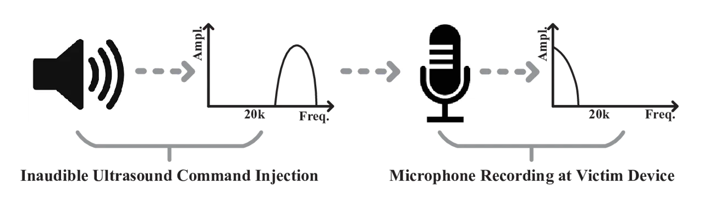
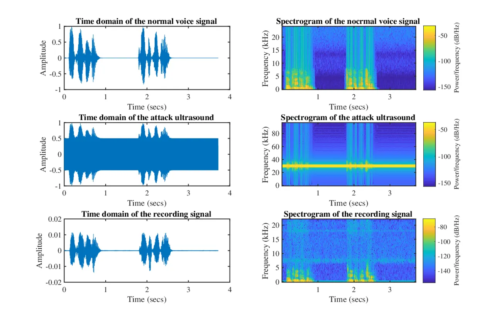

# Inaudible Voice Commands

Liwei Song, Prateek Mittal  
[liweis@princeton.edu](mailto:liweis@princeton.edu),
[pmittal@princeton.edu](mailto:pmittal@princeton.edu)  
Department of Electrical Engineering, Princeton University

© none

###### Abstract.

Voice assistants like Siri enable us to control IoT devices conveniently
with voice commands, however, they also provide new attack opportunities
for adversaries. Previous papers attack voice assistants with obfuscated
voice commands by leveraging the gap between speech recognition system
and human voice perception. The limitation is that these obfuscated
commands are audible and thus conspicuous to device owners. In this
paper, we propose a novel mechanism to directly attack the microphone
used for sensing voice data with _inaudible voice commands_. We show
that the adversary can exploit the microphone’s non-linearity and play
well-designed _inaudible ultrasounds_ to cause the microphone to record
normal voice commands, and thus control the victim device
inconspicuously. We demonstrate via end-to-end real-world experiments
that our inaudible voice commands can attack an Android phone and an
Amazon Echo device with high success rates at a range of 2-3 meters.

###### Keywords: 

microphone; non-linearity; intermodulation; ultrasound injection

## 1. Introduction

Voice is becoming an increasingly popular input method for humans to
interact with Internet of Things (IoT) devices. With the help of
microphones and speech recognition techniques, we can talk to voice
assistants, such as Siri, Google Now, Cortana and Alexa for controlling
smart phones, computers, wearables and other IoT devices. Despite their
ease of use, these voice assistants also provide adversaries new attack
opportunities to access IoT devices with voice command injections.

Previous studies about voice command injections target the speech
recognition procedure. Vaidya et al. (1) design garbled audio signals to
control voice assistants without knowing the speech recognition system.
Their approach obfuscates normal voice commands by modifying some
acoustic features so that they are not human-understandable, but can
still be recognized by victim devices. Carlini et al. (2) improve this
black-box approach with more realistic settings and propose a more
powerful white-box attack method based on knowledge of speech
recognition procedure. Although not human-recognizable, these obfuscated
voice commands are still conspicuous, as device owners can still hear
the obfuscated sounds and become suspicious.



Figure 1. The attack scenario for inaudible voice commands.

In contrast, we propose a novel _inaudible_ attack method by targeting
the microphone used for voice sensing by the victim device. Due to the
inherent non-linearity of the microphone, its output signal contains
“new” frequencies other than input signal’s spectrum. These “new”
frequencies are not just integer multiples of original frequencies, but
also the sum and difference of original input frequencies. Based on this
security flaw, our attack scenario is shown in Fig. 1. The adversary
plays an ultrasound signal with spectrum above $`20kHz`$, which is
inaudible to humans. Then the victim device’s microphone processes this
input, but suffers from non-linearity, causing the introduction of new
frequencies in the audible spectrum. With careful design of the original
ultrasound, these new audible frequencies recorded by the microphone are
interpreted as actionable commands by voice assistant software.

In this paper, we put forward a detailed attack algorithm to obtain
inaudible voice commands and perform end-to-end real-world experiments
for validation. Our results show that the proposed inaudible voice
commands can attack an Android phone with $`100\%`$ success at a
distance of 3 meters, and an Amazon Echo device with $`80\%`$ success at
a distance of 2 meters.

## 2. Related Work

Recently, a few papers have proposed attacks against data-collecting
sensors. Son et al. (3) show that intentional resonant sounds can
disrupt the MEMS gyroscopes and cause drones to crash. Furthermore, by
leveraging the circuit imperfections, Trippel et al. (4) achieve control
of the outputs of MEMS accelerometers with resonant acoustic injections.
Different from these approaches, we consider the microphone’s
non-linearity, so we do not need to find the resonant frequency.
Instead, we need to carefully design ultrasounds that are interpreted by
microphones as normal voice commands.

Roy et al. (5) conduct a similar work, where the non-linearity of the
microphone is exploited to realize inaudible acoustic data
communications and jamming of spying microphones. However, their data
communication method needs additional decoding procedures after the
receiving microphone, and their jamming method injects strong _random_
noises to spying microphones. In contrast, we consider a completely
different scenario, where the target microphone needs no modification
and its outputs have to be interpreted as target voice commands.

## 3. Ultrasound Injection Attacks

In our attack scenario, the goal is to obtain well-designed ultrasounds
which are inaudible when played but can be recorded similarly to normal
commands at microphones. The victim can be any common IoT device with an
off-the-shelf microphone, and it does not need any modification, except
adopting the always-on mode to continuously listen for voice input,
which has been used in many IoT devices such as Amazon Echo. To perform
an attack, the adversary only needs to be physically proximate to the
target and have the control of a speaker to play ultrasound, which can
be achieved by either bringing an inconspicuous speaker close to the
target or using a position-fixed speaker to attack nearby devices.

### 3.1. Non-Linearity Insight


Figure 2. Typical diagram of a microphone.

As shown in Fig. 2, a typical microphone consists of four modules. The
transducer generates voltage variation proportional to the sound
pressure, which passes through the amplifier for signal enlargement. The
low-pass filter (LPF) is then adopted to filter out high frequency
components. Finally, the analog to digital converter (ADC) is used for
digitalization and quantization. Since the audible sound frequency
ranges from $`20Hz`$ to $`20kHz`$, a typical sampling rate for ADC is
$`48kHz`$ or $`44.1kHz`$, and the filter’s cut-off frequency is usually
set about $`20kHz`$ .

To obtain a good-quality sound recording, the transducer and the
amplifier should be fabricated as linear as possible. However, they
still exhibit non-linear phenomena in practice. Assume the input sound
signal is $`S_{in}`$, the output signal after amplifier $`S_{out}`$ can
be expressed as

```math
S_{out}=\sum_{i=1}^{\infty}G_{i}S_{in}^{i}=G_{1}S_{in}+G_{2}S_{in}^{2}+G_{3}S_{in}^{3}+\cdots,\\
 \tag{1}
```

where $`G_{1}S_{in}`$ is the linear term and dominates for input sound
in normal range. The other terms reflect the non-linearity and have an
impact for a large input amplitude, usually the third and higher order
terms are relatively weak compared to the second-order term.

The non-linearity introduces both _harmonic distortion and
intermodulation distortion_ to the output signal. Suppose the input
signal is sum of two tones with frequencies $`f_{1}`$ and $`f_{2}`$,
i.e., $`S_{in}=\cos(2\pi f_{1}t)+\cos(2\pi f_{2}t)`$, the output due to
the second-order term is expressed as

```math
\displaystyle G_{2}S_{in}^{2}= \displaystyle G_{2}+\frac{G_{2}}{2}\left(\cos\left(2\pi\left(2f_{1}\right)t\right)+\cos\left(2\pi\left(2f_{2}\right)t\right)\right) \tag{2}
```

```math
\displaystyle+G_{2}\left(\cos\left(2\pi\left(f_{1}\!+\!f_{2}\right)t\right)+\cos\left(2\pi\left(f_{1}\!-\!f_{2}\right)t\right)\right),
```

which includes both harmonic frequencies $`2f_{1},2f_{2}`$ and
intermodulation frequencies $`f_{1}\pm f_{2}`$.

Our attack intuition is to exploit the intermodulation to obtain normal
voice frequencies from the processing of ultrasound frequencies. For
example, if we play an ultrasound with two frequencies $`25kHz`$ and
$`30kHz`$, the listening microphone will record the signal with the
frequency of $`30kHz-25kHz=5kHz`$, while other frequencies are filtered
out by the LPF.

### 3.2. Attack Algorithm

Now, we present how this non-linearity can be leveraged to design our
attack ultrasound signals. Assume the signal of normal voice command,
such as “OK Google”, is $`S_{normal}`$. Our attack algorithm contains
the following steps.

Low-Pass Filtering

First we adopt a low-pass filter on the normal signal, with the cut-off
frequency as $`8kHz`$ to remove high frequency components. Human speech
is mainly concentrated on low frequency range, and many speech
recognition systems, such as CMU Sphinx, only keep spectrum below
$`8kHz`$. Therefore, the filtering step can allow us to adopt a lower
carrier frequency for modulation, while still preserving enough data of
the original signal. Denote the filtered signal as $`S_{filter}`$.

Upsampling

Usually, the normal voice command $`S_{normal}`$ is recorded with
sampling rate of $`48kHz`$ (or $`44.1kHz`$), the same as $`S_{filter}`$.
This sampling rate only supports generating ultrasound with frequency
ranging from $`20kHz`$ to $`24kHz`$ (or $`22.05kHz`$), which is not
enough. To shift the whole spectrum of $`S_{filter}`$ into inaudible
frequency range, the maximum ultrasound frequency should be no less than
$`28kHz`$. Thus, we derive an upsampled signal $`S_{up}`$ with higher
sampling rate.

Ultrasound Modulation

In this step, we need to shift the spectrum of $`S_{up}`$ into high
frequency range to be inaudible. Here, we adopt amplitude modulation for
spectrum shifting. Assuming the carrier frequency is $`f_{c}`$, the
modulation can be expressed as

```math
S_{modu}=n_{1}S_{up}\cos(2\pi f_{c}t),\\
 \tag{3}
```

where $`n_{1}`$ is the normalized coefficient. The resulting modulated
signal contains two sidebands around the carrier frequency, ranging from
$`f_{c}-8kHz`$ to $`f_{c}+8kHz`$. Therefore, $`f_{c}`$ should be at
least $`28kHz`$ to be inaudible.

Carrier Wave Addition

Modulating the voice spectrum into inaudible frequency range is not
enough, they have to be translated back to normal voice frequency range
at the microphone for successful attacks. Without modifying the
microphone, we can leverage its non-linear phenomenon to achieve
demodulation by adding a suitable carrier wave, and the final attack
ultrasound can be expressed as

```math
S_{attack}=n_{2}(S_{modu}+\cos(2\pi f_{c}t)),\\
 \tag{4}
```

where $`n_{2}`$ is used for signal normalization.

The above steps illustrate the entire process of obtaining an attack
ultrasound. This well-designed inaudible signal $`S_{attack}`$, when
played by the attacker, can successfully inject a voice signal similar
to $`S_{normal}`$ at the target microphone and therefore control the
victim device inconspicuously.

## 4. Evaluation

We perform real-world experiments to evaluate our proposed inaudible
voice commands. All of the following tests are performed in a closed
meeting room measuring approximately 6.5 meters by 4 meters, 2.5 meters
tall. To play the attack ultrasound signals, we first use a
text-to-speech application to obtain the normal voice commands and
follow the described attack algorithm with $`192kHz`$ upsampling rate
and $`30kHz`$ carrier frequency to get attack signals in our laptop.
Then a commodity audio amplifier (6) is connected for power
amplification, and the amplified signals are provided to a tweeter
speaker (7). A video demo of the attack is available at
[https://youtu.be/wF-DuVkQNQQ](https://youtu.be/wF-DuVkQNQQ).

### 4.1. Attack Demonstration

We first validate the feasibility of our inaudible voice commands: the
normal voice command is “OK Google, take a picture”, and a Nexus 5X
running Android 7.1.2 is placed 2 meters away from the speaker for
recording.



Figure 3. Time plots and spectrograms for the normal voice, the attack
ultrasound and the recording signal.

Fig. 3 presents the normal voice command, the attack ultrasound and the
recording sound in both time domain and frequency domain. We can see
that the spectrum of attack ultrasound is above $`20kHz`$, and after
processing this ultrasound, the microphone’s recording sound is quite
similar to the normal voice. When playing the attack ultrasound, the
phone is successfully activated and opens the camera.

### 4.2. Attack Performance

We further examine our ultrasound attack range for two devices: an
Android phone and an Amazon Echo, where we try to spoof voice commands
“OK Google, turn on airplane mode”, and “Alexa, add milk to my shopping
list”, respectively. The following table shows the relationship between
the attack range and the speaker’s input power. We can see that the
attack range is positively correlated to the speaker’s power. The attack
range of our approach is less for Amazon Echo compared to the Android
phone, since its microphone is plastic covered.

| Input Power ($`Watt`$) | $`9.2`$ | $`11.8`$ | $`14.8`$ | $`18.7`$ | $`23.7`$ |
| ---------------------- | ------- | -------- | -------- | -------- | -------- |
| Range (Phone, $`cm`$)  | $`222`$ | $`255`$  | $`277`$  | $`313`$  | $`354`$  |
| Range (Echo, $`cm`$)   | $`145`$ | $`168`$  | $`187`$  | $`213`$  | $`239`$  |

Table 1. The relationship between our attack range and the speaker’s
input power.

We also check the attack accuracy by setting input power as $`18.7W`$
and placing phone and Echo $`3m`$ and $`2m`$ away, respectively. For
each device, we repeat the corresponding inaudible voice command every
10 seconds for 50 times. The attack success rates are $`100\%(50/50)`$
for the Android phone and $`80\%(40/50)`$ for the Amazon Echo.

## 5. Conclusion

Based on the inherent non-linear properties of microphones, we propose a
novel attack method by transmitting well-design ultrasounds to control
common voice assistants, like Siri, Google Now, and Alexa. By taking
advantage of intermodulation distortion and amplitude modulation, our
attack voice commands are _inaudible_ and achieve high success rates on
an Android phone more than three meters away and on an Amazon Echo
device more than two meters away.

## References

- (1) T. Vaidya, Y. Zhang, M. Sherr, and C. Shields. “Cocaine noodles:
  exploiting the gap between human and machine speech recognition." In
  _USENIX Workshop on Offensive Technologies(WOOT)_, Washington, D.C.,
  Aug. 2015.
- (2) N. Carlini, P. Mishra, T. Vaidya, Y. Zhang, M. Sherr, C.
  Shields, D. Wagner, and W. Zhou, “Hidden voice commands.” In _USENIX
  Security_, Austin, TX, 2016.
- (3) Y. Son, H. Shin, D. Kim, Y. S. Park, J. Noh, K. Choi, J. Choi,
  and Y. Kim, “Rocking drones with intentional sound noise on gyroscopic
  sensors.” In _USENIX Security_, pp. 881-896, Washington, D.C.,
  Aug. 2015.
- (4) T. Trippel, O. Weisse, W. Xu, P. Honeyman, and Kevin Fu, “WALNUT:
  Waging doubt on the integrity of MEMS accelerometers with acoustic
  injection attacks.” In _IEEE European Symposium on Security and
  Privacy (EuroS&P)_, pp. 2-18, Paris, France, April 2017.
- (5) N. Roy, H. Hassanieh, and R. R. Choudhury, “Backdoor: Making
  microphones hear inaudible sounds.” In _Proceedings of the 15th Annual
  International Conference on Mobile Systems, Applications, and Services
  (MobiSys)_, pp. 2-14, New York, NY, June 2017.
- (6) R-S202 Natural Sound Stereo Receiver, Yamaha Corporation,
  [https://usa.yamaha.com/products/audio_visual/hifi_components/r-s202/index.html](https://usa.yamaha.com/products/audio_visual/hifi_components/r-s202/index.html).
- (7) FT17H Horn Tweeter, Fostex  
  [http://www.fostexinternational.com/docs/speaker_components/pdf/ft17hrev2.pdf](http://www.fostexinternational.com/docs/speaker_components/pdf/ft17hrev2.pdf).
