# Learning the Enigma with Recurrent Neural Networks

Sam Greydanus Email: [sam.17@dartmouth.edu](mailto:)
Affiliation: Department of Physics and Astronomy, Dartmouth College
Affiliation: Hanover, New Hampshire 03755

###### Abstract

Recurrent neural networks (RNNs) represent the state of the art in
translation, image captioning, and speech recognition. They are also
capable of learning algorithmic tasks such as long addition, copying,
and sorting from a set of training examples. We demonstrate that RNNs
can learn decryption algorithms – the mappings from plaintext to
ciphertext – for three polyalphabetic ciphers (Vigenere, Autokey, and
Enigma). Most notably, we demonstrate that an RNN with a 3000-unit Long
Short-Term Memory (LSTM) cell can learn the decryption function of the
Enigma machine. We argue that our model learns efficient internal
representations of these ciphers 1) by exploring activations of
individual memory neurons and 2) by comparing memory usage across the
three ciphers. To be clear, our work is not aimed at ’cracking’ the
Enigma cipher. However, we do show that our model can perform elementary
cryptanalysis by running known-plaintext attacks on the Vigenere and
Autokey ciphers. Our results indicate that RNNs can learn algorithmic
representations of black box polyalphabetic ciphers and that these
representations are useful for cryptanalysis.

## Introduction

Given an encrypted sequence, a key and a decryption of that sequence,
can we reconstruct the decryption function? We might begin by looking
for small patterns shared by the two sequences. When we find these
patterns, we can piece them together to create a rough model of the
unknown function. Next, we might use this model to predict the
translations of other sequences. Finally, we can refine our model based
on whether or not these guesses are correct.

During WWII, Allied cryptographers used this process to make sense of
the Nazi Enigma cipher, eventually reconstructing the machine almost
entirely from its inputs and outputs \[\citeauthoryearRejewski1981\].
This achievement was the product of continuous effort by dozens of
engineers and mathematicians. Cryptography has improved in the past
century, but piecing together the decryption function of a black box
cipher such as the Enigma is still a problem that requires expert domain
knowledge and days of labor.

The process of reconstructing a cipher’s inner workings is the first
step of cryptanalysis. Several past works have sought to automate – and
thereby accelerate – this process, but they generally suffer from a lack
of generality (see Related Work). To address this issue, several works
have discussed the connection between machine learning and cryptography
\[\citeauthoryearKearns and Valiant1994\] \[\citeauthoryearPrajapat and
Thankur2015\]. Early work at the confluence of these two fields has been
either theoretical or limited to toy examples. We improve upon this work
by introducing a general-purpose model for learning and characterizing
polyalphabetic ciphers.

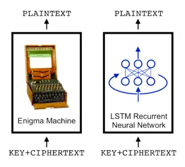

Figure 1: Our LSTM-based model can learn the decryption function of the
Enigma from a series of ciphertext and plaintext examples.

Our approach is to frame the decryption process as a
sequence-to-sequence translation task and use a Recurrent Neural Network
(RNN) -based model to learn the translation function. Unlike previous
works, our model can be applied to any polyalphabetic cipher. We
demonstrate its effectiveness by using the same model and
hyperparameters (except for memory size) to learn three different
ciphers: the Vigenere, Autokey, and Enigma. Once trained, our model
performs well on 1) unseen keys and 2) ciphertext sequences much longer
than those of the training set. All code is available online¹¹ 1
https://github.com/greydanus/crypto-rnn.

By visualizing the activations of our model’s memory vector, we argue
that it can learn efficient internal representations of ciphers. To
confirm this theory, we show that the amount of memory our model needs
to master each cipher scales with the cipher’s degree of
time-dependence. Finally, we train our model to perform known-plaintext
attacks on the Vigenere and Autokey ciphers, demonstrating that these
internal representations are useful tools for cryptanalysis.

To be clear, our objective was not to crack the Enigma. The Enigma was
cracked nearly a century ago using fewer computations than that of a
single forward pass through our model. The best techniques for cracking
ciphers are hand-crafted approaches that capitalize on weaknesses of
specific ciphers. This project is meant to showcase the impressive
ability of RNNs to uncover information about unknown ciphers in a fully
automated way.

In summary, our key contribution is that RNNs can learn algorithmic
representations of complex polyalphabetic ciphers and that these
representations are useful for cryptanalysis.

## Related work

Recurrent models, in particular those that use Long Short-Term Memory
(LSTM), are a powerful tool for manipulating sequential data. Notable
applications include state-of-the art results in handwriting recognition
and generation \[\citeauthoryearGraves2014\], speech recognition
\[\citeauthoryearGraves, Mohamed, and Hinton2013\], machine translation
\[\citeauthoryearSutskever, Vinyals, and Le2014\], deep reinforcement
learning \[\citeauthoryearMnih et al.2016\], and image captioning
\[\citeauthoryearKarpathy and Fei-Fei2015\]. Like these works, we frame
our application of RNNs as a sequence-to-sequence translation task.
Unlike these works, our translation task requires 1) a keyphrase and 2)
reconstructing a deterministic algorithm. Fortunately, a wealth of
previous work has focused on using RNNs to learn algorithms.

Past work has shown that RNNs can find general solutions to algorithmic
tasks. Zaremba and Sutskever \[\citeauthoryearZaremba and
Sutskever2015\] trained LSTMs to add 9-digit numbers with 99% accuracy
using a variant of curriculum learning. Graves et. al.
\[\citeauthoryearGraves, Wayne, and Danihelka2014\] compared the
performance of LSTMs to Neural Turing Machines (NTMs) on a range of
algorithmic tasks including sort and repeat-copy. More recently, Graves
et al. \[\citeauthoryearGraves et al.2016\] introduced the
Differentiable Neural Computer (DNC) and used it to solve more
challenging tasks such as relational reasoning over graphs. As with
these works, our work shows that RNNs can master simple algorithmic
tasks. However, unlike tasks such as long addition and repeat-copy,
learning the Enigma is a task that humans once found difficult.

In the 1930s, Allied nations had not yet captured a physical Enigma
machine. Cryptographers such as the Polish Marian Rejewski were forced
to compare plaintext, keyphrase, and ciphertext messages with each other
to infer the mechanics of the machine. After several years of carefully
analyzing these messages, Rejewski and the Polish Cipher Bureau were
able to construct ’Enigma doubles’ without ever having seen an actual
Enigma machine \[\citeauthoryearRejewski1981\]. This is the same problem
we trained our model to solve. Like Rejewski, our model uncovers the
logic of the Enigma by looking for statistical patterns in a large
number of plaintext, keyphrase, and ciphertext examples. We should note,
however, that Rejewski needed far less data to make the same
generalizations. Later in World War II, British cryptographers led by
Alan Turing helped to actually crack the Enigma. As Turing’s approach
capitalized on operator error and expert knowledge about the Enigma, we
consider it beyond the scope of this work
\[\citeauthoryearSebag-Montefiore2000\].

Characterizing unknown ciphers is a central problem in cryptography. The
comprehensive Applied Cryptography \[\citeauthoryearSchneier1996\] lists
a wealth of methods, from frequency analysis to chosen-plaintext
attacks. Papers such as \[\citeauthoryearDawson, Gustafson, and
Davies1991\] offer additional methods. While these methods can be
effective under the right conditions, they do not generalize well
outside certain classes of ciphers. This has led researchers to propose
several machine learning-based approaches. One work
\[\citeauthoryearSpillman et al.2017\] used genetic algorithms to
recover the secret key of a simple substitution cipher. A review paper
by Prajapat et al. \[\citeauthoryearPrajapat and Thankur2015\] proposes
cipher classification with machine learning.

Alallayah et al. \[\citeauthoryearAlallayah et al.2010\] succeeded in
using a small feedforward neural network to decode the Vigenere cipher.
Unfortunately, they phrased the task in a cipher-specific manner that
dramatically simplified the learning objective. For example, at each
step, they gave the model the single keyphrase character that was
necessary to perform decryption. One of the things that makes learning
the Vigenere cipher difficult is choosing that keyphrase character for a
particular time step. We avoid this pitfall by using an approach that
generalizes well across several ciphers.

There are other interesting connections between machine learning and
cryptography. Abadi and Andersen trained two convolutional neural
networks (CNNs) to communicate with each other while hiding information
from from a third. The authors argue that the two CNNs learned to use a
simple form of encryption to selectively protect information from the
eavesdropper. Another work by Ramamurthy et al.
\[\citeauthoryearRamamurthy et al.2017\] embedded images directly into
the trainable parameters of a neural network. These messages could be
recovered using a second neural network. Like our work, these two works
use neural networks to encrypt information. Unlike our work, the models
were neither recurrent nor were they trained on existing ciphers.

## Problem setup

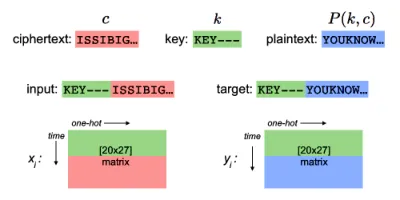

(a) Data

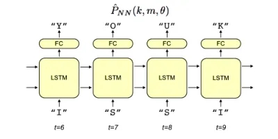

(b) Model

Figure 2: (a) Expressing the decryption process as a
sequence-to-sequence translation task. (b) Our Recurrent Neural Network
(RNN) -based model unrolled for time steps 6 to 9 (FC: fully-connected
layer).

We consider the decryption function $`m=P(k,c)`$ of a generic
polyalphabetic cipher where $`c`$ is the ciphertext, $`k`$ is a key, and
$`m`$ is the plaintext message. Here, $`m`$, $`k`$, and $`c`$ are
sequences of symbols $`a`$ drawn from alphabet $`A^{l}`$ (which has
length $`l`$). Our objective is to train a neural network with
parameters $`\theta`$ to make the approximation
$`\hat{P}_{NN}(k,m,\theta)\approx P(k,m)`$ such that

```math
\hat{\theta}=\arg\min_{\mathbf{\theta}}\mathcal{L}(\hat{P}_{NN}(k,m,\theta)-P(k,c)) \tag{1}
```

where $`\mathcal{L}`$ is L2 loss. We chose this loss function because it
penalizes outliers more severely than other loss functions such as L1.
Minimizing outliers is important as the model converges to high
accuracies (e.g. 95⁺%) and errors become infrequent. In this equation,
$`P(k,c)`$ is a one-hot vector and $`\hat{P}_{NN}`$ is a real-valued
softmax distribution over the same space.

Representing ciphers. In this work, we chose $`A^{27}`$ as the uppercase
Roman alphabet plus the null symbol, ’-’. We encode each symbol
$`a_{i}`$ as a one-hot vector. The sequences $`m`$, $`k`$, and $`c`$
then become matrices with a time dimension and a one-hot dimension (see
Figure 2(a)). We allow the key length to vary between 1 and 6 but choose
a standard length of 6 for $`k`$ and pad extra indices with the null
symbol. If $`N`$ is the number of time steps to unroll the LSTM during
training, then $`m`$ and $`c`$ are $`N-6\times 27`$ matrices and $`k`$
is a $`6\times 27`$ matrix. To construct training example
$`(x_{i},y_{i})`$, we concatenate the key, plaintext, and ciphertext
matrices according to Equations 2 and 3.

```math
\displaystyle x_{i}=(k,c) \tag{2}
```

```math
\displaystyle y_{i}=(k,m) \tag{3}
```

Concretely, for the Autokey cipher, we might obtain the following
sequences:

We could also have fed the model the entire key at each time step.
However, this would have increased the size of the input layer (and, as
a result, total size of $`\theta`$) introducing an unnecessary
computational cost. We found that the LSTM could store the keyphrase in
its memory cell without difficulty so we chose the simple concatenation
method of Equations 2 and 3 instead. We found empirical benefit in
appending the keyphrase to the target sequence; loss decreased more
rapidly early in training.

## Our model

Recurrent neural networks (RNNs). The simplest RNN cell takes as input
two hidden state vectors: one from the previous time step and one from
the previous layer of the network. Using indices $`t=1\dots T`$ for time
and $`l=1\dots L`$ for depth, we label them $`h^{l}_{t-1}`$ and
$`h^{l-1}_{t}`$ respectively. Using the notation of Karpathy et al.
\[\citeauthoryearKarpathy, Johnson, and Fei-Fei2016\], the RNN update
rule is

```math
\displaystyle h^{l}_{t}=\tanh W^{l}\begin{pmatrix}h^{l-1}_{t}\\
h^{l}_{t-1}\end{pmatrix}
```

where $`h\in\mathbb{R}^{n}`$, $`W^{l}`$ is a $`n\times 2n`$ parameter
matrix, and the $`\tanh`$ is applied elementwise.

The Long Short-Term Memory (LSTM) cell is a variation of the RNN cell
which is easier to train in practice \[\citeauthoryearHochreiter and
Schmidhuber1997\]. In addition to the hidden state vector, LSTMs
maintain a memory vector, $`c_{t}^{l}`$. At each time step, the LSTM can
choose to read from, write to, or reset the cell using three gating
mechanisms. The LSTM update takes the form:

```math
\displaystyle\begin{pmatrix}i\\
f\\
o\\
g\end{pmatrix}=\begin{pmatrix}\mathrm{sigm}\\
\mathrm{sigm}\\
\mathrm{sigm}\\
\tanh\end{pmatrix}W^{l}\begin{pmatrix}h^{l-1}_{t}\\
h^{l}_{t-1}\end{pmatrix}
```

```math
\displaystyle c^{l}_{t}=f\odot c^{l}_{t-1}+i\odot g
```

```math
\displaystyle h^{l}_{t}=o\odot\tanh(c^{l}_{t})
```

The sigmoid ($`\mathrm{sigm}`$) and $`\tanh`$ functions are applied
element-wise, and $`W^{l}`$ is a $`4n\times 2n`$ matrix. The three gate
vectors $`i,f,o\in\mathbb{R}^{n}`$ control whether the memory is
updated, reset to zero, or its local state is revealed in the hidden
vector, respectively. The entire cell is differentiable, and the three
gating functions reduce the problem of vanishing gradients
\[\citeauthoryearBengio, Simard, and Frasconi1994\]
\[\citeauthoryearHochreiter and Schmidhuber1997\].

We used a single LSTM cell capped with a fully-connected softmax layer
for all experiments (Figure 2(b)). We also experimented with two and
three stacked LSTM layers and additional fully connected layers between
the input and LSTM layers, but these architectures learned too slowly or
not at all. In our experience, the simplest architecture worked best.

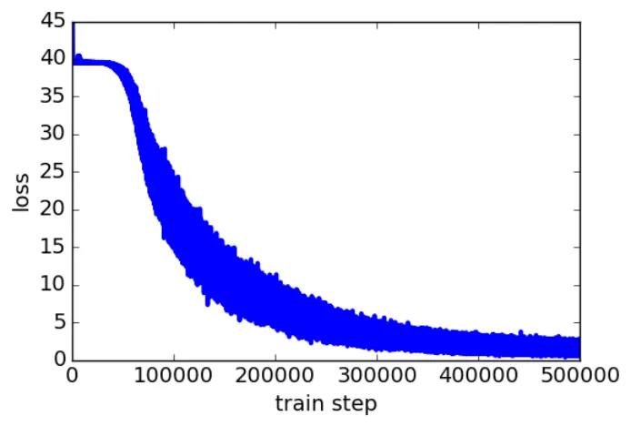

(a) Train loss

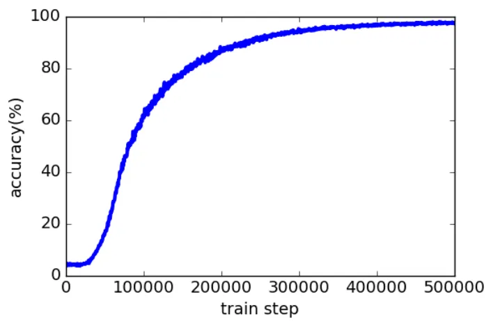

(b) Test accuracy

Figure 3: Loss decreases rapidly at first, around 5000 train steps, as
the network learns to capture simple statistical distributions. Later,
around 100000 train steps, model learns the Enigma cipher itself and
accuracy spikes. A significant portion of training, starting around
350000 train steps, is spent gaining the last $`5\%`$ accuracy.

## Experiments

We considered three types of polyalphabetic substitution ciphers: the
Vigenere, Autokey, and Enigma. Each of these ciphers is composed of
various rotations of $`A`$, called Caesar shifts. A one-unit Caesar
shift would perform the rotation $`A[i]\mapsto A[(i+1)\mod N]`$.

The Vigenere cipher performs Caesar shifts with distances that
correspond to the indices of a repeated keyphrase. For a keyphrase $`k`$
of length $`z`$, the Vigenere cipher decrypts a plaintext message $`m`$
according to:

```math
P(k^{i}_{t},m^{j}_{t})=A[(j+(i\mod z))\mod l] \tag{4}
```

where the lower indices of $`k`$ and $`m`$ correspond to time and the
upper indices correspond to the index of the symbol in alphabet
$`A^{l}`$.

The Autokey cipher is a variant of this idea. Instead of repeating the
key, it concatenates the plaintext message to the end of the key,
effectively creating a new and non-repetitive key:

```math
i\quad\textrm{as in}\quad\begin{cases}k^{i}_{t},&\text{if }t\leq z\\
m^{i}_{t-z},&\text{otherwise}\end{cases} \tag{5}
```

The Enigma also performs rotations over $`A^{l}`$, but with a function
$`P`$ that is far more complex. The version used in World War II
contained 3 wheels (each with 26 ring settings), up to 10 plugs, and a
reflector, giving it over $`1.07\times 10^{23}`$ possible configurations
\[\citeauthoryearMiller2017\]. We selected a constant rotor
configuration of A-I-II-III, ring configuration of 2, 14, 8 and no
plugs. For an explanation of these settings, see
\[\citeauthoryearRejewski1981\]. We set the rotors randomly according to
a 3-character key, giving a subspace of settings that contained
$`26^{3}`$ possible mappings. With these settings, our model required
several days of compute time on a Tesla k80 GPU. The rotor and ring
configurations could also be allowed to vary by appending them to the
keyphrase. We tried this, but convergence was too slow given our limited
computational resources.

Synthesizing data. The runtime of $`P(k,m)`$ was small for all ciphers
so we chose to synthesize training data on-the-fly, eliminating the need
to synthesize and store large datasets. This also reduced the likelihood
of overfitting. We implemented our own Vigenere and Autokey ciphers and
used the historically accurate crypto-enigma²² 2
http://pypi.python.org/pypi/crypto-enigma Python package as our Enigma
simulator.

The symbols of the input sequences $`k`$ and $`m`$ were drawn randomly
(with uniform probability) from the Roman alphabet, $`A^{26}`$. We chose
characters with uniform distribution to make the task more difficult.
Had we used grammatical (e.g. English) text, our model could have
improved its performance on the task simply by memorizing common
n-grams. Differentiating between gains in accuracy due to learning the
Enigma versus those due to learning the statistical distributions of
English would have been difficult.

Optimization. Following previous work by Xavier et al.
\[\citeauthoryearGlorot and Bengio2010\], we use the ’Xavier’
initialization for all parameters. We use mini-batch stochastic gradient
descent with batch size 50 and select parameter-wise learning rates
using Adam \[\citeauthoryearKingma and Ba2014\] set to a base learning
rate of $`5\times 10^{-4}`$ and $`\beta=(0.9,0.999)`$. We trained on
ciphertext sequences of length 14 and keyphrase sequences of length 6
for all tasks. As our Enigma configuration accepted only 3-character
keys, we padded the last three entries with the null character, ’-’.

On the Enigma task, we found that our model’s LSTM required a memory
size of at least 2048 units. The model converged too slowly or not at
all for smaller memory sizes and multi-cell architectures. We performed
experiments on a model with 3000 hidden units because it converged
approximately twice as quickly as the model with 2048 units. For the
Vigenere and and Autokey ciphers, we explored hidden memory sizes of 32,
64, 128, 256, and 512. For each cipher, we halted training after our
model achieved $`99^{+}\%`$ accuracy; this occurred around
$`5\times 10^{5}`$ train steps on the Enigma task and $`1\times 10^{5}`$
train steps on the others.

The number of possible training examples, $`\approx 10^{19}`$, far
exceeded the total number of examples the model encountered during
training, $`\approx 10^{7}`$ (each of these examples were generated
on-the-fly). We were, however, concerned with another type of
overfitting. On the Enigma task, our model contained over thirty million
learnable parameters and encountered each three-letter key hundreds of
times during training. Hence, it was possible that the model might
memorize the mappings from ciphertext to plaintext for all possible
($`26^{3}`$) keys. To check for this sort of overfitting, we withheld a
single key, KEY, from training and inspected our trained model’s
performance on a message encrypted with this key.

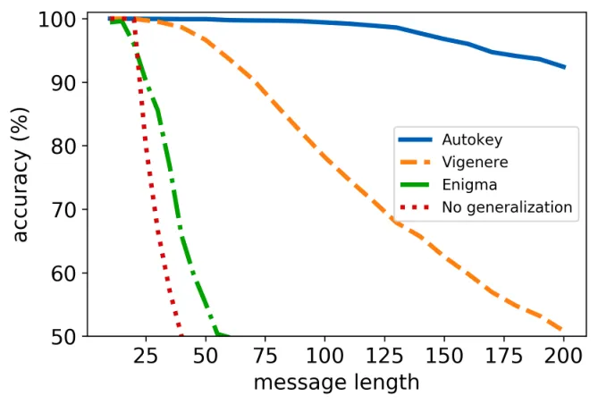

Figure 4: The model, trained on messages of 20 characters, generalizes
well to messages of over 100 characters for the Vigenere and Autokey
ciphers. Generalization occurs on the Enigma, but to a lesser degree, as
the task is far more complex.

Generalization. We evaluated out model on two metrics for
generalization. First, we tested its ability to decrypt 20
randomly-generated test messages using an unseen keyphrase (’KEY’). It
passed this test on all three ciphers. Second, we measured its ability
to decrypt messages longer than those of the training set. On this test,
our model exhibited some generalization for all three ciphers but
performed particularly well on the Vigenere task, decoding sequences an
order of magnitude longer than those of the trainign set (see Figure 4).
We observed that the norm of our model’s memory vector increased
linearly with the number of time steps, leading us to hypothesize that
the magnitudes of some hidden activations increase linearly over time.
This phenomenon is probably responsible for reduced decryption accuracy
on very long sequences.

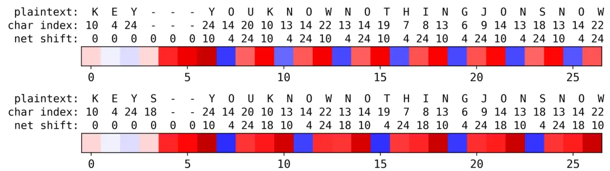

(a) Vigenere (hidden unit 252)

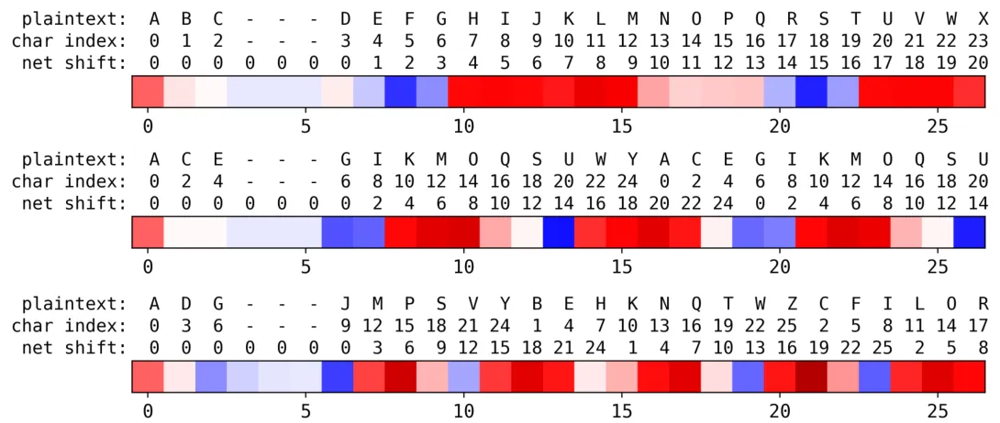

(b) Autokey (hidden unit 30)

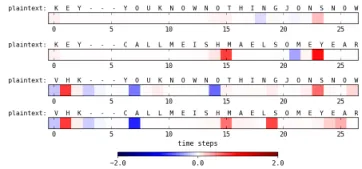

(c) Enigma (hidden unit 1914)

Figure 5: Shown above are examples of plaintext messages decrypted by
our model. The red and blue heat maps correspond to the activations of
indicated hidden units taken from the LSTM’s memory vector $`c`$. The
char index label corresponds to the index of the plaintext character in
alphabet $`A`$. The net shift label corresponds to the number of Caesar
shifts between the ciphertext and the plaintext.

(a) Hidden unit 252 of the Vigenere model has a negative activation once
every $`n`$ steps where $`n`$ is the length of the keyphrase (examples
for $`n=3,4`$ are shown). We hypothesize that this is a timing unit
which allows the model to index into the keyphrase as a function of the
encryption step.

(b) The 30th hidden unit of the Autokey model has negative activations
for specific character indices (e.g. 2 and 14) and positive activations
for others (e.g. 6 and 18). We hypothesize that this shift unit helps
the model compute the magnitude of the Caesar shift between the
ciphertext and plaintext.

(c) The hidden activations of the Enigma model were generally sparse.
Hidden unit 1914 is no exception. For different messages, only its
activation magnitude changes. For different keyphrases, its entire
activation pattern (signs and magnitudes) change. We hypothesize that it
is a switch unit which activates only when the Enigma enters a
particular rotor configuration.

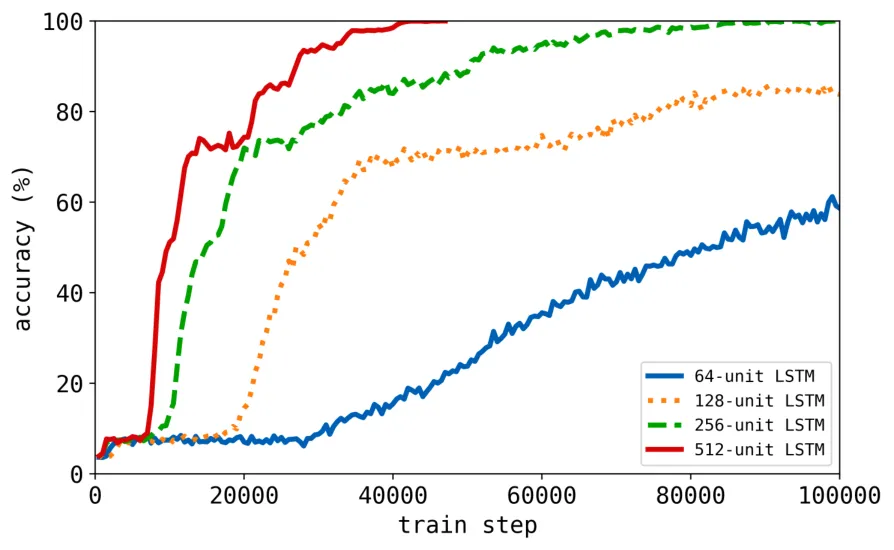

(a) Vigenere task

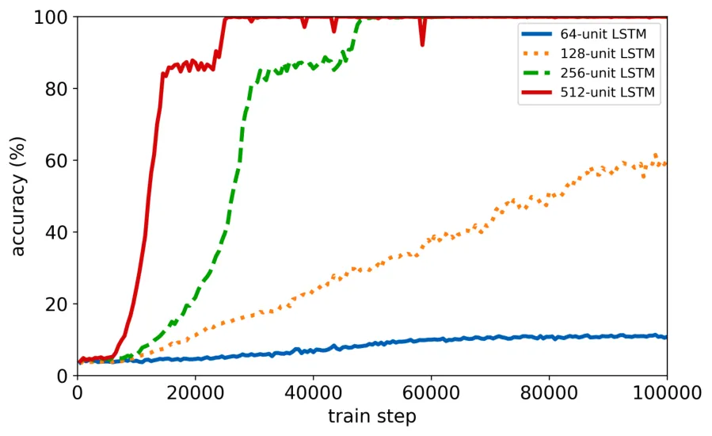

(b) Autokey task

Figure 6: Shown above are test accuracies of our model on the Vigenere
and Autokey cipher tasks. Notice that for small RNN memory sizes (64 and
128 hidden units), the model achieves better performance on the Vigenere
task. Meanwhile, for large memory sizes (256 and 512 hidden units), the
model converges to 99$`{}^{+}\%`$ accuracy more rapidly on the Autokey
task. Evidently, the model’s test accuracy is more sensitive to memory
size on the Autokey task than on the Vigenere task.

Memory usage. Based on our model’s ability to generalize over unseen
keyphrases and message lengths, we hypothesized that it learns an
efficient internal representation of each cipher. To explore this idea,
we first examined how activations of various units in the LSTM’s memory
vector changed over time. We found, as shown in Figure 5, that 1) these
activations mirrored qualitative properties of the ciphers and 2) they
varied considerably between the three ciphers.

We were also interested in how much memory our model required to learn
each cipher. Early in this work, we observed that the model required a
very large memory vector (at least 2048 hidden units) to master the
Enigma task. In subsequent experiments (Figure 6), we found that the
size of the LSTM’s memory vector was more important when training on the
Autokey task than the Vigenere task. We hypothesize that this is because
the model must continually update its internal representation of the
keyphrase during the Autokey task, whereas on the Vigenere task it needs
only store a static representation of the keyphrase. The Enigma, of
course, requires dramatically more memory because it must store the
configurations of three 26-character wheels, each of which may rotate at
a given time step.

Based on these observations, we claim that the amount of memory our
model requires to learn a given cipher can serve as an informal measure
of how much each encryption step depends on previous encryption steps.
When characterizing a black box cipher, this information may be of
interest.

Reconstructing keyphrases. Having verified that our model learned
internal representations of the three ciphers, we decided to take this
property one step further. We trained our model to predict keyphrases as
a function of plaintext and ciphertext inputs. We used the same model
architecture as described earlier, but the input at each timestep became
two concatenated one-hot vectors (one corresponding to the plaintext and
one to the ciphertext). Reconstructing the keyphrase for a Vigenere
cipher with known keylength is trivial: the task reduces to measuring
the shifts between the plaintext and ciphertext characters. We made this
task more difficult by training the model on target keyphrases of
unknown length (1-6 characters long). In most real-world cryptanalysis
applications, the length of the keyphrase is unknown which also
motivated our choice. Our model obtained $`99^{+}\%`$ accuracy on the
task.

Reconstructing the keyphrase of the Autokey was a more difficult task,
as the keyphrase is used only once. This happens during the first 1-6
steps of encryption. On this task, accuracy exceeded 95%. In future
work, we hope to reconstruct the keyphrase of the Engima from plaintext
and ciphertext inputs.

Limitations. Our model is data inefficient; it requires at least a
million training examples to learn a cipher. If we were interested in
characterizing an unknown cipher in the real world, we would not
generally have access to unlimited examples of plaintext and ciphertext
pairs.

Most modern encryption techniques rely on public-key algorithms such as
RSA. Learning these functions requires multiplying and taking the
modulus of large numbers. These algorithmic capabilities are well beyond
the scope of our model. Better machine learning models may be able to
learn simplified versions of RSA, but even these would probably be data-
and computation-inefficient.

## Conclusions

This work proposes a fully-differentiable RNN model for learning the
decoding functions of polyalphabetic ciphers. We show that the model can
achieve high accuracy on several ciphers, including the the challenging
3-wheel Enigma cipher. Furthermore, we show that it learns a general
algorithmic representation of these ciphers and can perform well on 1)
unseen keyphrases and 2) messages of variable length.

Our work represents the first general method for reconstructing the
functions of polyalphabetic ciphers. The process is fully automated and
an inspection of trained models offers a wealth of information about the
unknown cipher. Our findings are generally applicable to analyzing any
black box sequence-to-sequence translation task where the translation
function is a deterministic algorithm. Finally, decoding Enigma messages
is a complicated algorithmic task, and thus we suspect learning this
task with an RNN will be of general interest to the machine learning
community.

## Acknowledgements

We are grateful to Dartmouth College for providing access to its cluster
of Tesla K80 GPUs. We thank Jason Yosinski and Alan Fern for insightful
feedback on preliminary drafts.

## References

- \[\citeauthoryearAlallayah et al.2010\] Alallayah, K.; Amin, M.;
  El-Wahed, W. A.; and Alhamami, A. 2010. Attack and Construction of
  Simulator for Some of Cipher Systems Using Neuro-Identifier. The
  International Arab Journal of Information Technology 7(4):365–371.
- \[\citeauthoryearBengio, Simard, and Frasconi1994\] Bengio, Y.;
  Simard, P.; and Frasconi, P. 1994. Learning long-term dependencies
  with gradient descent is difficult. Neural Networks, IEEE Transactions
  5(2):157–166.
- \[\citeauthoryearDawson, Gustafson, and Davies1991\] Dawson, E.;
  Gustafson, N.; and Davies, N. 1991. Black Box Analysis of Stream
  Ciphers. Australasian Journal of Combinatorics 4:59–70.
- \[\citeauthoryearGlorot and Bengio2010\] Glorot, X., and Bengio, Y. 2010. Understanding the difficulty of training deep feedforward
  neural networks. Proceedings of the Thirteenth International
  Conference on Artificial Intelligence and Statistics 9.
- \[\citeauthoryearGraves et al.2016\] Graves, A.; Wayne, G.; Reynolds,
  M.; Harley, T.; Danihelka, I.; Grabska-Barwinska, A.; Colmenarejo,
  S. G.; Grefenstette, E.; Ramalho, T.; Agapiou, J.; Badia, A. P.;
  Hermann, K. M.; Zwols, Y.; Ostrovski, G.; Cain, A.; King, H.;
  Summerfield, C.; Blunsom, P.; Kavukcuoglu, K.; and Hassabis, D. 2016.
  Hybrid computing using a neural network with dynamic external memory.
  Nature 538(7626):471–476.
- \[\citeauthoryearGraves, Mohamed, and Hinton2013\] Graves, A.;
  Mohamed, A.-R.; and Hinton, G. 2013. Speech recognition with deep
  recurrent neural networks. Acoustics, Speech and Signal Processing
  (ICASSP), IEEE International Conference 6645–6649.
- \[\citeauthoryearGraves, Wayne, and Danihelka2014\] Graves, A.; Wayne,
  G.; and Danihelka, I. 2014. Neural Turing Machines. ArXiv Preprint
  (1410.5401v2 ).
- \[\citeauthoryearGraves2014\] Graves, A. 2014. Generating Sequences
  With Recurrent Neural Networks. ArXiv Preprint (1308.0850v5 ).
- \[\citeauthoryearHochreiter and Schmidhuber1997\] Hochreiter, S., and
  Schmidhuber, J. 1997. Long Short-Term Memory. Neural Computation
  9(8):1735–1780.
- \[\citeauthoryearKarpathy and Fei-Fei2015\] Karpathy, A., and
  Fei-Fei, L. 2015. Deep Visual-Semantic Alignments for Generating
  Image Descriptions. CVPR.
- \[\citeauthoryearKarpathy, Johnson, and Fei-Fei2016\] Karpathy, A.;
  Johnson, J.; and Fei-Fei, L. 2016. Visualizing and Understanding
  Recurrent Networks. International Conference on Learning
  Representations.
- \[\citeauthoryearKearns and Valiant1994\] Kearns, M., and Valiant, L. 1994. Cryptographic Limitations on Learning Boolean Formulae and
  Finite Automata. Journal of the ACM (JACM) 41(1):67–95.
- \[\citeauthoryearKingma and Ba2014\] Kingma, D. P., and Ba, J. L. 2014. Adam: A Method for Stochastic Optimization. ArXiv Preprint
  (1412.6980 ).
- \[\citeauthoryearMiller2017\] Miller, R. 2017. The Cryptographic
  Mathematics of Enigma. Cryptologia 19(1):65–80.
- \[\citeauthoryearMnih et al.2016\] Mnih, V.; Puigdomènech Badia, A.;
  Mirza, M.; Graves, A.; Harley, T.; Lillicrap, T. P.; Silver, D.; and
  Kavukcuoglu, K. 2016. Asynchronous Methods for Deep Reinforcement
  Learning. International Conference on Machine Learning 1928–1937.
- \[\citeauthoryearPrajapat and Thankur2015\] Prajapat, S., and
  Thankur, R. 2015. Various approaches towards cryptanalysis.
  International Journal of Computer Applications 127(14).
- \[\citeauthoryearRamamurthy et al.2017\] Ramamurthy, R.; Bauckhage,
  C.; Buza, K.; and Wrobel, S. 2017. Using Echo State Networks for
  Cryptography.
- \[\citeauthoryearRejewski1981\] Rejewski, M. 1981. How Polish
  Mathematicians Broke the Enigma Cipher. IEEE Annals of the History of
  Computing 3(3):213–234.
- \[\citeauthoryearSchneier1996\] Schneier, B. 1996. Applied
  cryptography : protocols, algorithms, and source code in C. Wiley.
- \[\citeauthoryearSebag-Montefiore2000\] Sebag-Montefiore, H. 2000.
  Enigma : the battle for the code. J. Wiley.
- \[\citeauthoryearSpillman et al.2017\] Spillman, R.; Janssen, M.;
  Nelson, B.; and Kepner, M. 2017. Use of a Genetic Algorithm in the
  Cryptanalysis of Simple Substitution Ciphers. Cryptologia 17(1):31–44.
- \[\citeauthoryearSutskever, Vinyals, and Le2014\] Sutskever, I.;
  Vinyals, O.; and Le, Q. V. 2014. Sequence to Sequence Learning with
  Neural Networks. Advances in Neural Information Processing Systems
  3104–3112.
- \[\citeauthoryearZaremba and Sutskever2015\] Zaremba, W., and
  Sutskever, I. 2015. Learning to Execute. Conference paper at ICLR 2015.
