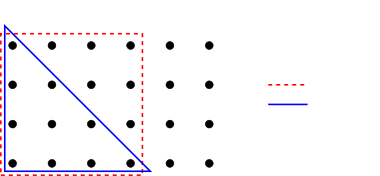

# Gaussian Quadrature for Kernel Features

Tri Dao^(†)    Christopher De Sa^(‡)    Christopher Ré^(†)
Affiliation: $`\dagger`$ Stanford University, $`\ddagger`$ Cornell
University Affiliation: trid@stanford.edu, cdesa@cs.cornell.edu,
chrismre@cs.stanford.edu

###### Abstract

Kernel methods have recently attracted resurgent interest, showing
performance competitive with deep neural networks in tasks such as
speech recognition. The random Fourier features map is a technique
commonly used to scale up kernel machines, but employing the randomized
feature map means that $`O(\epsilon^{-2})`$ samples are required to
achieve an approximation error of at most $`\epsilon`$. We investigate
some alternative schemes for constructing feature maps that are
deterministic, rather than random, by approximating the kernel in the
frequency domain using Gaussian quadrature. We show that deterministic
feature maps can be constructed, for any $`\gamma>0`$, to achieve error
$`\epsilon`$ with $`O(e^{e^{\gamma}}+\epsilon^{-1/\gamma})`$ samples as
$`\epsilon`$ goes to 0. Our method works particularly well with sparse
ANOVA kernels, which are inspired by the convolutional layer of CNNs. We
validate our methods on datasets in different domains, such as MNIST and
TIMIT, showing that deterministic features are faster to generate and
achieve accuracy comparable to the state-of-the-art kernel methods based
on random Fourier features.

## 1 Introduction

Kernel machines are frequently used to solve a wide variety of problems
in machine learning \[26\]. They have gained resurgent interest and have
recently been shown \[13, 18, 21, 19, 22\] to be competitive with deep
neural networks in some tasks such as speech recognition on large
datasets. A kernel machine is one that handles input
$`x_{1},\dots,x_{n}`$, represented as vectors in $`\mathbb{R}^{d}`$,
only in terms of some _kernel function_
$`k:\mathbb{R}^{d}\times\mathbb{R}^{d}\rightarrow\mathbb{R}`$ of pairs
of data points $`k(x_{i},x_{j})`$. This representation is attractive for
classification problems because one can learn non-linear decision
boundaries directly on the input without having to extract features
before training a linear classifier.

One well-known downside of kernel machines is the fact that they scale
poorly to large datasets. Naive kernel methods, which operate on the
_Gram matrix_ $`G_{i,j}=k(x_{i},x_{j})`$ of the data, can take a very
long time to run because the Gram matrix itself requires $`O(n^{2})`$
space and many operations on it (e.g., the singular value decomposition)
take up to $`O(n^{3})`$ time. Rahimi and Recht \[23\] proposed a
solution to this problem: approximating the kernel with an inner product
in a higher-dimensional space. Specifically, they suggest constructing a
feature map $`z:\mathbb{R}^{d}\rightarrow\mathbb{R}^{D}`$ such that
$`k(x,y)\approx\langle z(x),z(y)\rangle`$. This approximation enables
kernel machines to use scalable linear methods for solving
classification problems and to avoid the pitfalls of naive kernel
methods by not materializing the Gram matrix.

In the case of shift-invariant kernels, one technique that was proposed
for constructing the function $`z`$ is _random Fourier features_ \[23\].
This data-independent method approximates the Fourier transform
integral (1) of the kernel by averaging Monte-Carlo samples, which
allows for arbitrarily-good estimates of the kernel function $`k`$.
Rahimi and Recht \[23\] proved that if the feature map has dimension
$`D=\tilde{\Omega}\left(\frac{d}{\epsilon^{2}}\right)`$ then, with
constant probability, the approximation $`\langle z(x),z(y)\rangle`$ is
uniformly $`\epsilon`$-close to the true kernel on a bounded set. While
the random Fourier features method has proven to be effective in solving
practical problems, it comes with some caveats. Most importantly, the
accuracy guarantees are only probabilistic and there is no way to easily
compute, for a particular random sample, whether the desired accuracy is
achieved.

Our aim is to understand to what extent randomness is necessary to
approximate a kernel. We thus propose a fundamentally different scheme
for constructing the feature map $`z`$. While still approximating the
kernel’s Fourier transform integral (1) with a discrete sum, we select
the sample points and weights _deterministically_. This gets around the
issue of probabilistic-only guarantees by removing the randomness from
the algorithm. For small dimension, deterministic maps yield
significantly lower error. As the dimension increases, some random
sampling may become necessary, and our theoretical insights provide a
new approach to sampling. Moreover, for a particular class of kernels
called sparse ANOVA kernels (also known as convolutional kernels as they
are similar to the convolutional layer in CNNs) which have shown
state-of-the-art performance in speech recognition \[22\], deterministic
maps require fewer samples than random Fourier features, both in terms
of the desired error and the kernel size. We make the following
contributions:

- •
  In Section 3, we describe how to deterministically construct a feature
  map $`z`$ for the class of subgaussian kernels (which can approximate
  any kernel well) that has exponentially small (in $`D`$) approximation
  error.
- •
  In Section 4, for sparse ANOVA kernels, we show that our method
  produces good estimates using only $`O(d)`$ samples, whereas random
  Fourier features requires $`O(d^{3})`$ samples.
- •
  In Section 5, we validate our results experimentally. We demonstrate
  that, for real classification problems on MNIST and TIMIT datasets,
  our method combined with random sampling yields up to 3 times lower
  kernel approximation error. With sparse ANOVA kernels, our method
  slightly improves classification accuracy compared to the
  state-of-the-art kernel methods based on random Fourier features
  (which are already shown to match the performance of deep neural
  networks), all while speeding up the feature generation process.

## 2 Related Work

Much work has been done on extracting features for kernel methods. The
random Fourier features method has been analyzed in the context of
several learning algorithms, and its generalization error has been
characterized and compared to that of other kernel-based
algorithms \[24\]. It has also been compared to the Nyström
method \[35\], which is data-dependent and thus can sometimes outperform
random Fourier features. Other recent work has analyzed the
generalization performance of the random Fourier features
algorithm \[17\], and improved the bounds on its maximum error \[29,
31\].

While we focus here on deterministic approximations to the Fourier
transform integral and compare them to Monte Carlo estimates, these are
not the only two methods available to us. A possible middle-ground
method is _quasi-Monte Carlo_ estimation, in which low-discrepancy
sequences, rather than the fully-random samples of Monte Carlo
estimation, are used to approximate the integral. This approach was
analyzed in Yang et al. \[34\] and shown to achieves an asymptotic error
of $`\epsilon=O\left(D^{-1}\left(\log(D)\right)^{d}\right)`$. While this
is asymptotically better than the random Fourier features method, the
complexity of the quasi-Monte Carlo method coupled with its larger
constant factors prevents it from being strictly better than its
predecessor. Our method still requires asymptotically fewer samples as
$`\epsilon`$ goes to 0.

Our deterministic approach here takes advantage of a long line of work
on numerical quadrature for estimating integrals. Bach \[1\] analyzed in
detail the connection between quadrature and random feature expansions,
thus deriving bounds for the number of samples required to achieve a
given average approximation error (though they did not present
complexity results regarding maximum error nor suggested new feature
maps). This connection allows us to leverage longstanding deterministic
numerical integration methods such as Gaussian quadrature \[6, 33\] and
sparse grids \[2\].

Unlike many other kernels used in machine learning, such as the Gaussian
kernel, the sparse ANOVA kernel allows us to encode prior information
about the relationships among the input variables into the kernel
itself. Sparse ANOVA kernels have been shown \[30\] to work well for
many classification tasks, especially in structural modeling problems
that benefit from both the good generalization of a kernel machine and
the representational advantage of a sparse model \[9\].

## 3 Kernels and Quadrature

We start with a brief overview of kernels. A kernel function
$`k\colon\mathbb{R}^{d}\times\mathbb{R}^{d}\to\mathbb{R}`$ encodes the
_similarity_ between pairs of examples. In this paper, we focus on shift
invariant kernels (those which satisfy $`k(x,y)=k(x-y)`$, where we
overload the definition of $`k`$ to also refer to a function
$`k:\mathbb{R}^{d}\rightarrow\mathbb{R}`$) that are positive definite
and properly scaled. A kernel is positive definite if its Gram matrix is
always positive definite for all non-trivial inputs, and it is
properly-scaled if $`k(x,x)=1`$ for all $`x`$. In this setting, our
results make use of a theorem \[25\] that also provides the “key
insight” behind the random Fourier features method.

###### Theorem 1 (Bochner’s theorem).

A continuous shift-invariant properly-scaled kernel
$`k:\mathbb{R}^{d}\times\mathbb{R}^{d}\rightarrow\mathbb{R}`$ is
positive definite if and only if $`k`$ is the Fourier transform of a
proper probability distribution.

We can then write $`k`$ in terms of its Fourier transform $`\Lambda`$
(which is a proper probability distribution):

```math
k(x-y)=\int_{\mathbb{R}^{d}}\Lambda(\omega)\exp(j\omega^{\top}(x-y))\,d\omega. \tag{1}
```

For $`\omega`$ distributed according to $`\Lambda`$, this is equivalent
to writing

```math
k(x-y)=\mathbf{E}\left[\exp(j\omega^{\top}(x-y))\right]=\mathbf{E}\left[\langle\exp(j\omega^{\top}x),\exp(j\omega^{\top}y)\rangle\right],
```

where we use the usual Hermitian inner product
$`\langle x,y\rangle=\sum_{i}x_{i}\overline{y_{i}}`$. The random Fourier
features method proceeds by estimating this expected value using Monte
Carlo sampling averaged across $`D`$ random selections of $`\omega`$.
Equivalently, we can think of this as approximating (1) with a discrete
sum at randomly selected sample points.

Our objective is to choose some points $`\omega_{i}`$ and weights
$`a_{i}`$ to uniformly approximate the integral (1) with
$`\tilde{k}(x-y)=\sum_{i=1}^{D}a_{i}\exp(j\omega_{j}^{\top}(x-y))`$. To
obtain a _feature map_ $`z:\mathbb{R}^{d}\rightarrow\mathbb{C}^{D}`$
where $`\tilde{k}(x-y)=\sum_{i=1}^{D}a_{i}z_{i}(x)\overline{z_{i}(y)}`$,
we can define

```math
z(x)=\begin{bmatrix}\sqrt{a_{1}}\exp(j\omega_{1}^{\top}x)&\dots&\sqrt{a_{D}}\exp(j\omega_{D}^{\top}x)\end{bmatrix}^{\top}.
```

We aim to bound the maximum error for $`x,y`$ in a region
$`\mathcal{M}`$ with diameter
$`M=\sup_{x,y\in\mathcal{M}}\left\|x-y\right\|`$:

```math
\epsilon=\sup_{(x,y)\in\mathcal{M}}\left|k(x-y)-\tilde{k}(x-y)\right|=\sup_{\left\|u\right\|\leq M}\left|\int_{\mathbb{R}^{d}}\Lambda(\omega)e^{j\omega^{\top}u}\,d\omega-\sum_{i=1}^{D}a_{i}e^{j\omega_{i}^{\top}u}\right|. \tag{2}
```

A _quadrature rule_ is a choice of $`\omega_{i}`$ and $`a_{i}`$ to
minimize this maximum error. To evaluate a quadrature rule, we are
concerned with the _sample complexity_ (for a fixed diameter $`M`$).

###### Definition 1.

For any $`\epsilon>0`$, a quadrature rule has sample complexity
$`D_{\mathrm{SC}}(\epsilon)=D`$, where $`D`$ is the smallest value such
that the rule, when instantiated with $`D`$ samples, has maximum error
at most $`\epsilon`$.

We will now examine ways to construct deterministic quadrature rules and
their sample complexities.

### 3.1 Gaussian Quadrature

Gaussian quadrature is one of the most popular techniques in
one-dimensional numerical integration. The main idea is to approximate
integrals of the form
$`\int\Lambda(\omega)f(\omega)\,d\omega\approx\sum_{i=1}^{D}a_{i}f(\omega_{i})`$
such that the approximation is exact for all polynomials below a certain
degree; $`D`$ points are sufficient for polynomials of degree up to
$`2D-1`$. While the points and weights used by Gaussian quadrature
depend both on the distribution $`\Lambda`$ and the parameter $`D`$,
they can be computed efficiently using orthogonal polynomials \[10,
32\]. Gaussian quadrature produces accurate results when integrating
functions that are well-approximated by polynomials, which include all
subgaussian densities.

###### Definition 2 (Subgaussian Distribution).

We say that a distribution
$`\Lambda:\mathbb{R}^{d}\rightarrow\mathbb{R}`$ is _subgaussian_ with
parameter $`b`$ if for $`X\sim\Lambda`$ and for all
$`t\in\mathbb{R}^{d}`$,
$`\mathbf{E}\left[\exp(\langle t,X\rangle)\right]\leq\exp\left(\frac{1}{2}b^{2}\left\|t\right\|^{2}\right)`$.

We subsequently assume that the distribution $`\Lambda`$ is subgaussian,
which is a technical restriction compared to random Fourier features.
Many of the kernels encountered in practice have subgaussian spectra,
including the ubiquitous Gaussian kernel. More importantly, we can
approximate any kernel by convolving it with the Gaussian kernel,
resulting in a subgaussian kernel. The approximation error can be made
much smaller than the inherent noise in the data generation process.

### 3.2 Polynomially-Exact Rules

Since Gaussian quadrature is so successful in one dimension, as commonly
done in the numerical analysis literature \[14\], we might consider
using quadrature rules that are multidimensional analogues of Gaussian
quadrature — rules that are accurate for all polynomials up to a certain
degree $`R`$. In higher dimensions, this is equivalent to saying that
our quadrature rule satisfies

```math
\int_{\mathbb{R}^{d}}\Lambda(\omega)\prod_{l=1}^{d}(e_{l}^{\top}\omega)^{r_{l}}\,d\omega=\sum_{i=1}^{D}a_{i}\prod_{l=1}^{d}(e_{l}^{\top}\omega_{i})^{r_{l}}\quad\text{for all }r\in\mathbb{N}^{d}\text{ such that }\sum_{l}r_{l}\leq R, \tag{3}
```

where $`e_{l}`$ are the standard basis vectors.

To test the accuracy of polynomially-exact quadrature, we constructed a
feature map for a Gaussian kernel,
$`\Lambda(\omega)=(2\pi)^{-\frac{d}{2}}\exp\left(-\frac{1}{2}\left\|\omega\right\|^{2}\right)`$,
in $`d=25`$ dimensions with $`D=1000`$ and accurate for all polynomials
up to degree $`R=2`$. In Figure 1(a), we compared this to a random
Fourier features rule with the same number of samples, over a range of
region diameters $`M`$ that captures most of the data points in practice
(as the kernel is properly scaled). For small regions in particular, a
polynomially-exact scheme can have a significantly lower error than a
random Fourier feature map.


(a) Polynomially-exact


(b) Sparse grid


(c) Subsampled dense grid

Figure 1: Error comparison (empirical maximum over $`10^{6}`$
uniformly-distributed samples) of different quadrature schemes and the
random Fourier features method.

This experiment motivates us to investigate theoretical bounds on the
behavior of this method. For subgaussian kernels, it is straightforward
to bound the maximum error of a polynomially-exact feature map using the
Taylor series approximation of the exponential function in (2).

###### Theorem 2.

Let $`k`$ be a kernel with $`b`$-subgaussian spectrum, and let
$`\tilde{k}`$ be its estimation under some quadrature rule with
non-negative weights that is exact up to some even degree $`R`$. Let
$`\mathcal{M}\subset\mathbb{R}^{d}`$ be some region of diameter $`M`$.
Then, for all $`x,y\in\mathcal{M}`$, the error of the quadrature
features approximation is bounded by

```math
\left|k(x-y)-\tilde{k}(x-y)\right|\leq 3\left(\frac{eb^{2}M^{2}}{R}\right)^{\frac{R}{2}}.
```

All the proofs are found in the Appendix.

To bound the sample complexity of polynomially-exact quadrature, we need
to determine how many quadrature samples we will need to satisfy the
conditions of Theorem 2. There are $`\binom{d+R}{d}`$ constraints
in (3), so a series of polynomially-exact quadrature rules that use only
about this many sample points can yield a bound on the sample complexity
of this quadrature rule.

###### Corollary 1.

Assume that we are given a class of feature maps that satisfy the
conditions of Theorem 2, and that all have a number of samples
$`D\leq\beta{d+R\choose d}`$ for some fixed constant $`\beta`$. Then,
for any $`\gamma>0`$, the sample complexity of features maps in this
class can be bounded by

```math
D(\epsilon)\leq\beta 2^{d}\max\left(\exp\left(e^{2\gamma+1}b^{2}M^{2}\right),\left(\frac{3}{\epsilon}\right)^{\frac{1}{\gamma}}\right).
```

In particular, for a fixed dimension $`d`$, this means that for any
$`\gamma`$, $`D(\epsilon)=O\left(\epsilon^{-\frac{1}{\gamma}}\right)`$.

The result of this corollary implies that, in terms of the desired error
$`\epsilon`$, the sample complexity increases asymptotically slower than
any negative power of $`\epsilon`$. Compared to the result for random
Fourier features which had $`D(\epsilon)=O(\epsilon^{-2})`$, this has a
much weaker dependence on $`\epsilon`$. While this weaker dependence
does come at the cost of an additional factor of $`2^{d}`$, it is a
constant cost of operating in dimension $`d`$, and is not dependent on
the error $`\epsilon`$.

The more pressing issue, when comparing polynomially-exact features to
random Fourier features, is the fact that we have no way of efficiently
constructing quadrature rules that satisfy the conditions of Theorem 2.
One possible construction involves selecting random sample points
$`\omega_{i}`$, and then solving (3) for the values of $`a_{i}`$ using a
non-negative least squares (NNLS) algorithm. While this construction
works in low dimensions — it is the method we used for the experiment in
Figure 1(a) — it rapidly becomes infeasible to solve for higher values
of $`d`$ and $`R`$.

We will now show how to overcome this issue by introducing quadrature
rules that can be rapidly constructed using grid-based quadrature rules.
These rules are constructed directly from products of a one-dimensional
quadrature rule, such as Gaussian quadrature, and so avoid the
construction-difficulty problems encountered in this section. Although
grid-based quadrature rules can be constructed for any kernel
function \[2\], they are easier to conceptualize when the kernel $`k`$
factors along the dimensions, as $`k(u)=\prod_{i=1}^{d}k_{i}(u_{i})`$.
For simplicity we will focus on this factorizable case.

### 3.3 Dense Grid Quadrature

The simplest way to do this is with a _dense grid_ (also known as tensor
product) construction. A dense grid construction starts by factoring the
integral (1) into
$`k(u)=\prod_{i=1}^{d}\left(\int_{-\infty}^{\infty}\Lambda_{i}(\omega)\exp(j\omega e_{i}^{\top}u)\,d\omega\right)`$,
where $`e_{i}`$ are the standard basis vectors. Since each of the
factors is an integral over a single dimension, we can approximate them
all with a one-dimensional quadrature rule. In this paper, we focus on
Gaussian quadrature, although we could also use other methods such as
Clenshaw-Curtis \[3\]. Taking tensor products of the points and weights
results in the dense grid quadrature. The detailed construction is given
in Appendix A.

The individual Gaussian quadrature rules are exact for all polynomials
up to degree $`2L-1`$, so the dense grid is also accurate for all such
polynomials. Theorem 2 then yields a bound on its sample complexity.

###### Corollary 2.

Let $`k`$ be a kernel with a spectrum that is subgaussian with parameter
$`b`$. Then, for any $`\gamma>0`$, the sample complexity of dense grid
features can be bounded by

```math
D(\epsilon)\leq\max\left(\exp\left(de^{\gamma d}\frac{eb^{2}M^{2}}{2}\right),\left(\frac{3}{\epsilon}\right)^{\frac{1}{\gamma}}\right).
```

In particular, as was the case with polynomially-exact features, for a
fixed $`d`$, $`D(\epsilon)=O\left(\epsilon^{-\frac{1}{\gamma}}\right)`$.

Unfortunately, this scheme suffers heavily from the curse of
dimensionality, since the sample complexity is doubly-exponential in
$`d`$. This means that, even though they are easy to compute, the dense
grid method does not represent a useful solution to the issue posed in
Section 3.2.

### 3.4 Sparse Grid Quadrature

The curse of dimensionality for quadrature in high dimensions has been
studied in the numerical integration setting for decades. One of the
more popular existing techniques for getting around the curse is called
_sparse grid_ or Smolyak quadrature \[28\], originally developed to
solve partial differential equations. Instead of taking the tensor
product of the one-dimensional quadrature rule, we only include points
up to some fixed total level $`A`$, thus constructing a linear
combination of dense grid quadrature rules that achieves a similar error
with exponentially fewer points than a single larger quadrature rule.
The detailed construction is given in Appendix B. Compared to
polynomially-exact rules, sparse grid quadrature can be computed quickly
and easily (see Algorithm 4.1 from Holtz \[12\]).

To measure the performance of sparse grid quadrature, we constructed a
feature map for the same Gaussian kernel analyzed in the previous
section, with $`d=25`$ dimensions and up to level $`A=2`$. We compared
this to a random Fourier features rule with the same number of samples,
$`D=1351`$, and plot the results in Figure 1(b). As was the case with
polynomially-exact quadrature, this sparse grid scheme has tiny error
for small-diameter regions, but this error unfortunately increases to be
even larger than that of random Fourier features as the region diameter
increases.

The sparse grid construction yields a bound on the sample count:
$`D\leq 3^{A}\binom{d+A}{A}`$, where $`A`$ is the bound on the total
level. By extending known bounds on the error of Gaussian quadrature, we
can similarly bound the error of the sparse grid feature method.

###### Theorem 3.

Let $`k`$ be a kernel with a spectrum that is subgaussian with parameter
$`b`$, and let $`\tilde{k}`$ be its estimation under the sparse grid
quadrature rule up to level $`A`$. Let
$`\mathcal{M}\subset\mathbb{R}^{d}`$ be some region of diameter $`M`$,
and assume that $`A\geq 24eb^{2}M^{2}`$. Then, for all
$`x,y\in\mathcal{M}`$, the error of the quadrature features
approximation is bounded by

```math
\left|k(x-y)-\tilde{k}(x-y)\right|\leq 2^{d}\left(\frac{12eb^{2}M^{2}}{A}\right)^{A}.
```

This, along with our above upper bound on the sample count, yields a
bound on the sample complexity.

###### Corollary 3.

Let $`k`$ be a kernel with a spectrum that is subgaussian with parameter
$`b`$. Then, for any $`\gamma>0`$, the sample complexity of sparse grid
features can be bounded by

```math
D(\epsilon)\leq 2^{d}\max\left(\exp\left(24e^{2\gamma+1}b^{2}M^{2}\right),2^{\frac{d}{\gamma}}\epsilon^{-\frac{1}{\gamma}}\right).
```

As was the case with all our previous deterministic features maps, for a
fixed $`d`$, $`D(\epsilon)=O\left(\epsilon^{-\frac{1}{\gamma}}\right)`$.

##### Subsampled grids

One of the downsides of the dense/sparse grids analyzed above is the
difficulty of tuning the number of samples extracted in the feature map.
As the only parameter we can typically set is the degree of polynomial
exactness, even a small change in this (e.g., from 2 to 4) can produce a
significant increase in the number of features. However, we can always
subsample the grid points according to the distribution determined by
their weights to both tame the curse of dimensionality and to have
fine-grained control over the number of samples. For simplicity, we
focus on subsampling the dense grid. In Figure 1(c), we compare the
empirical errors of subsampled dense grid and random Fourier features,
noting that they are essentially the same across all diameters.

### 3.5 Reweighted Grid Quadrature

Both random Fourier features and dense/sparse grid quadratures are
data-independent. We now describe a data-adaptive method to choose a
quadrature for a pre-specified number of samples: reweighting the grid
points to minimize the difference between the approximate and the exact
kernel on a small subset of data. Adjusting the grid to the data
distribution yields better kernel approximation.

We approximate the kernel $`k(x-y)`$ with

```math
\tilde{k}(x-y)=\sum_{i=1}^{D}a_{i}\exp(j\omega_{i}^{\top}(x-y))=\sum_{i=1}^{D}a_{i}\cos(\omega_{i}^{\top}(x-y)),
```

where $`a_{i}\geq 0`$, as $`k`$ is real-valued. We first choose the set
of potential grid points $`\omega_{1},\dots,\omega_{D}`$ by sampling
from a dense grid of Gaussian quadrature points. To solve for the
weights $`a_{1},\dots,a_{D}`$, we independently sample $`n`$ pairs
$`(x_{1},y_{1}),\dots,(x_{n},y_{n})`$ from the dataset, then minimize
the empirical mean squared error (with variable $`a_{1},\dots,a_{D}`$):

```math
\begin{array}[]{ll}\mbox{minimize}&\displaystyle\frac{1}{n}\sum_{l=1}^{n}\left(k(x_{l}-y_{l})-\tilde{k}(x_{l}-y_{l})\right)^{2}\\
\mbox{subject to}&a_{i}\geq 0,\text{ for }i=1,\dots,D.\end{array}
```

For appropriately defined matrix $`M`$ and vector $`b`$, this is an NNLS
problem of minimizing $`\frac{1}{n}\left\|Ma-b\right\|^{2}`$ subject to
$`a\geq 0`$, with variable $`a\in\mathbb{R}^{D}`$. The solution is often
sparse, due to the active elementwise constraints $`a\geq 0`$. Hence we
can pick a larger set of potential grid points
$`\omega_{1},\dots,\omega_{D^{\prime}}`$ (with $`D^{\prime}>D`$) and
solve the above problem to obtain a smaller set of grid points (those
with $`a_{j}>0`$). To get even sparser solution, we add an
$`\ell_{1}`$-penalty term with parameter $`\lambda\geq 0`$:

```math
\begin{array}[]{ll}\mbox{minimize}&\frac{1}{n}\left\|Ma-b\right\|^{2}+\lambda\1^{\top}a\\
\mbox{subject to}&a_{i}\geq 0,\text{ for }i=1,\dots,D^{\prime}.\end{array}
```

Bisecting on $`\lambda`$ yields the desired number of grid points.

As this is a data-dependent quadrature, we empirically evaluate its
performance on the TIMIT dataset, which we will describe in more details
in Section 5. In Figure 2(b), we compare the estimated root mean squared
error on the dev set of different feature generation schemes against the
number of features $`D`$ (mean and standard deviation over 10 runs).
Random Fourier features, Quasi-Monte Carlo (QMC) with Halton sequence,
and subsampled dense grid have very similar approximation error, while
reweighted quadrature has much lower approximation error. Reweighted
quadrature achieves 2–3 times lower error for the same number of
features and requiring 3–5 times fewer features for a fixed threshold of
approximation error compared to random Fourier features. Moreover,
reweighted features have extremely low variance, even though the weights
are adjusted based only on a very small fraction of the dataset (500
samples out of 1 million data points).

##### Faster feature generation

Not only does grid-based quadrature yield better statistical performance
to random Fourier features, it also has some notable systems benefits.
Generating quadrature features requires a much smaller number of
multiplies, as the grid points only take on a finite set of values for
all dimensions (assuming an isotropic kernel). For example, a Gaussian
quadrature that is exact up to polynomials of degree 21 only requires 11
grid points for each dimension. To generate the features, we multiply
the input with these 11 numbers before adding the results to form the
deterministic features. The save in multiples may be particularly
significant in architectures such as application-specific integrated
circuits (ASICs). In our experiment on the TIMIT dataset in Section 5,
this specialized matrix multiplication procedure (on CPU) reduces the
feature generation time in half.

## 4 Sparse ANOVA Kernels

One type of kernel that is commonly used in machine learning, for
example in structural modeling, is the *sparse ANOVA kernels* \[11, 8\].
They are also called _convolutional kernels_, as they operate similarly
to the convolutional layer in CNNs. These kernels have achieved
state-of-the-art performance on large real-world datasets \[18, 22\], as
we will see in Section 5. A kernel of this type can be written as

```math
k(x,y)=\sum_{S\in\mathcal{S}}\prod_{i\in S}k_{1}(x_{i}-y_{i}),
```

where $`\mathcal{S}`$ is a set of subsets of the variables in
$`\{1,\ldots,d\}`$, and $`k_{1}`$ is a one-dimensional kernel.
(Straightforward extensions, which we will not discuss here, include
using different one-dimensional kernels for each element of the
products, and weighting the sum.) Sparse ANOVA kernels are used to
encode sparse dependencies among the variables: two variables are
related if they appear together in some $`S\in\mathcal{S}`$. These
sparse dependencies are typically problem-specific: each $`S`$ could
correspond to a factor in the graph if we are analyzing a distribution
modeled with a factor graph. Equivalently, we can think of the set
$`\mathcal{S}`$ as a hypergraph, where each $`S\in\mathcal{S}`$
corresponds to a hyperedge. Using this notion, we define the _rank_ of
an ANOVA kernel to be $`r=\max_{S\in\mathcal{S}}\left|S\right|`$, the
_degree_ as
$`\Delta=\max_{i\in\{1,\ldots,d\}}\left|\left\{S\in\mathcal{S}\middle|i\in S\right\}\right|`$,
and the _size_ of the kernel to be the number of hyperedges
$`m=\left|\mathcal{S}\right|`$. For sparse models, it is common for both
the rank and the degree to be small, even as the number of dimensions
$`d`$ becomes large, so $`m=O(d)`$. This is the case we focus on in this
section.

It is straightforward to apply the random Fourier features method to
construct feature maps for ANOVA kernels: construct feature maps for
each of the (at most $`r`$-dimensional) sub-kernels
$`k_{S}(x-y)=\prod_{i\in S}k_{1}(x_{i}-y_{i})`$ individually, and then
combine the results. To achieve overall error $`\epsilon`$, it suffices
for each of the sub-kernel feature maps to have error $`\epsilon/m`$;
this can be achieved by random Fourier features using
$`D_{S}=\tilde{\Omega}\left(r(\epsilon m^{-1})^{-2}\right)=\tilde{\Omega}\left(rm^{2}\epsilon^{-2}\right)`$
samples each, where the notation $`\tilde{\Omega}`$ hides the
$`\log 1/\epsilon`$ factor. Summed across all the $`m`$ sub-kernels,
this means that the random Fourier features map can achieve error
$`\epsilon`$ with constant probability with a sample complexity of
$`D(\epsilon)=\tilde{\Omega}\left(rm^{3}\epsilon^{-2}\right)`$ samples.
While it is nice to be able to tackle this problem using random
features, the cubic dependence on $`m`$ in this expression is
undesirable: it is significantly larger than the
$`D=\tilde{\Omega}(d\epsilon^{-2})`$ we get in the non-ANOVA case.

Can we construct a deterministic feature map that has a better error
bound? It turns out that we can.

###### Theorem 4.

Assume that we use polynomially-exact quadrature to construct features
for each of the sub-kernels $`k_{S}`$, under the conditions of
Theorem 2, and then combine the resulting feature maps to produce a
feature map for the full ANOVA kernel. For any $`\gamma>0`$, the sample
complexity of this method is

```math
D(\epsilon)\leq\beta m2^{r}\max\left(\exp\left(e^{2\gamma+1}b^{2}M^{2}\right),(3\Delta)^{\frac{1}{\gamma}}\epsilon^{-\frac{1}{\gamma}}\right).
```

Compared to the random Fourier features, this rate depends only linearly
on $`m`$. For fixed parameters $`\beta`$, $`b`$, $`M`$, $`\Delta`$,
$`r`$, and for any $`\gamma>0`$, we can bound the sample complexity
$`D(\epsilon)=O(m\epsilon^{-\frac{1}{\gamma}})`$, which is better than
random Fourier features _both_ in terms of the kernel size $`m`$ and the
desired error $`\epsilon`$.

## 5 Experiments

To evaluate the performance of deterministic feature maps, we analyzed
the accuracy of a sparse ANOVA kernel on the MNIST digit classification
task \[16\] and the TIMIT speech recognition task \[5\].

##### Digit classification on MNIST

This task consists of $`70,000`$ examples ($`60,000`$ in the training
dataset and $`10,000`$ in the test dataset) of hand-written digits which
need to be classified. Each example is a $`28\times 28`$ gray-scale
image. Clever kernel-based SVM techniques are known to achieve very low
error rates (e.g., $`0.79\%`$) on this problem \[20\]. We do not attempt
to compare ourselves with these rates; rather, we compare random Fourier
features and subsampled dense grid features that both approximate the
same ANOVA kernel. The ANOVA kernel we construct is designed to have a
similar structure to the first layer of a convolutional neural
network \[27\]. Just as a filter is run on each $`5\times 5`$ square of
the image, for our ANOVA kernel, each of the sub-kernels is chosen to
run on a $`5\times 5`$ square of the original image (note that there are
many, $`(28-5+1)^{2}=576`$, such squares). We choose the simple Gaussian
kernel as our one-dimensional kernel.

Figure 2(a) compares the dense grid subsampling method to random Fourier
features across a range of feature counts. The deterministic feature map
with subsampling performs better than the random Fourier feature map
across most large feature counts, although its performance degrades for
very small feature counts. The deterministic feature map is also
somewhat faster to compute, taking—for the $`28800`$-features—320
seconds vs. 384 seconds for the random Fourier features, a savings of
$`17\%`$.

##### Speech recognition on TIMIT

This task requires producing accurate transcripts from raw audio
recordings of conversations in English, involving 630 speakers, for a
total of 5.4 hours of speech. We use the kernel features in the acoustic
modeling step of speech recognition. Each data point corresponds to a
frame (10ms) of audio data, preprocessed using the standard feature
space Maximum Likelihood Linear Regression (fMMLR) \[4\]. The input
$`x`$ has dimension 40. After generating kernel features $`z(x)`$ from
this input, we model the corresponding phonemes $`y`$ by a multinomial
logistic regression model. Again, we use a sparse ANOVA kernel, which is
a sum of 50 sub-kernels of the form
$`\exp(-\gamma\left\|x_{S}-y_{S}\right\|^{2})`$, each acting on a subset
$`S`$ of 5 indices. These subsets are randomly chosen a priori. To
reweight the quadrature features, we sample 500 data points out of 1
million.

We plot the phone error rates (PER) of a speech recognizer trained based
on different feature generation schemes against the number of features
$`D`$ in Figure 2(c) (mean and standard deviation over 10 runs). Again,
subsampled dense grid performs similarly to random Fourier features, QMC
yields slightly higher error, while reweighted features achieve slightly
lower phone error rates. All four methods have relatively high
variability in their phone error rates due to the stochastic nature of
the training and decoding steps in the speech recognition pipeline. The
quadrature-based features (subsampled dense grids and reweighted
quadrature) are about twice as fast to generate, compared to random
Fourier features, due to the small number of multiplies required. We use
the same setup as May et al. \[22\], and the performance here matches
both that of random Fourier features and deep neural networks in May
et al. \[22\].


(a) Test accuracy on MNIST


(b) Kernel approx. error on TIMIT


(c) Phone error rate on TIMIT

Figure 2: Performance of different feature generation schemes on MNIST
and TIMIT.

## 6 Conclusion

We presented deterministic feature maps for kernel machines. We showed
that we can achieve better scaling in the desired accuracy $`\epsilon`$
compared to the state-of-the-art method, random Fourier features. We
described several ways to construct these feature maps, including
polynomially-exact quadrature, dense grid construction, sparse grid
construction, and reweighted grid construction. Our results apply well
to the case of sparse ANOVA kernels, achieving significant improvements
(in the dependency on the dimension $`d`$) over random Fourier features.
Finally, we evaluated our results experimentally, and showed that ANOVA
kernels with deterministic feature maps can produce comparable accuracy
to the state-of-the-art methods based on random Fourier features on real
datasets.

ANOVA kernels are an example of how structure can be used to define
better kernels. Resembling the convolutional layers of convolutional
neural networks, they induce the necessary inductive bias in the
learning process. Given CNNs’ recent success in other domains beside
images, such as sentence classification \[15\] and machine
translation \[7\], we hope that our work on deterministic feature maps
will enable kernel methods such as ANOVA kernels to find new areas of
application.

#### Acknowledgments

This material is based on research sponsored by Defense Advanced
Research Projects Agency (DARPA) under agreement number
FA8750-17-2-0095. We gratefully acknowledge the support of the DARPA
SIMPLEX program under No. N66001-15-C-4043, DARPA FA8750-12-2-0335 and
FA8750-13-2-0039, DOE 108845, National Institute of Health (NIH)
U54EB020405, the National Science Foundation (NSF) under award No.
CCF-1563078, the Office of Naval Research (ONR) under awards No.
N000141210041 and No. N000141310129, the Moore Foundation, the Okawa
Research Grant, American Family Insurance, Accenture, Toshiba, and
Intel. This research was supported in part by affiliate members and
other supporters of the Stanford DAWN project: Intel, Microsoft,
Teradata, and VMware. The U.S. Government is authorized to reproduce and
distribute reprints for Governmental purposes notwithstanding any
copyright notation thereon. The views and conclusions contained herein
are those of the authors and should not be interpreted as necessarily
representing the official policies or endorsements, either expressed or
implied, of DARPA or the U.S. Government. Any opinions, findings, and
conclusions or recommendations expressed in this material are those of
the authors and do not necessarily reflect the views of DARPA, AFRL,
NSF, NIH, ONR, or the U.S. government.

## References

- \[1\] Francis Bach. On the equivalence between quadrature rules and
  random features. _arXiv preprint arXiv:1502.06800_, 2015.
- \[2\] Hans-Joachim Bungartz and Michael Griebel. Sparse grids. _Acta
  numerica_, 13:147–269, 2004.
- \[3\] Charles W Clenshaw and Alan R Curtis. A method for numerical
  integration on an automatic computer. _Numerische Mathematik_,
  2(1):197–205, 1960.
- \[4\] Mark JF Gales. Maximum likelihood linear transformations for
  HMM-based speech recognition. _Computer speech & language_,
  12(2):75–98, 1998.
- \[5\] J. S. Garofolo, L. F. Lamel, W. M. Fisher, J. G. Fiscus, D. S.
  Pallett, and N. L. Dahlgren. DARPA TIMIT acoustic phonetic continuous
  speech corpus CDROM, 1993. URL
  [http://www.ldc.upenn.edu/Catalog/LDC93S1.html](http://www.ldc.upenn.edu/Catalog/LDC93S1.html).
- \[6\] Carl Friedrich Gauss. _Methodus nova integralium valores per
  approximationem inveniendi_. apvd Henricvm Dieterich, 1815.
- \[7\] Jonas Gehring, Michael Auli, David Grangier, Denis Yarats, and
  Yann N Dauphin. Convolutional sequence to sequence learning. _arXiv
  preprint arXiv:1705.03122_, 2017.
- \[8\] S. R. Gunn and J. S. Kandola. Structural Modelling with Sparse
  Kernels. _Machine Learning_, 48(1-3):137–163, July 2002a. ISSN
  0885-6125, 1573-0565. doi: 10.1023/A:1013903804720. URL
  [https://link.springer.com/article/10.1023/A:1013903804720](https://link.springer.com/article/10.1023/A:1013903804720).
- \[9\] Steve R. Gunn and Jaz S. Kandola. Structural modelling with
  sparse kernels. _Machine learning_, 48(1-3):137–163, 2002b.
- \[10\] Nicholas Hale and Alex Townsend. Fast and accurate computation
  of Gauss–Legendre and Gauss–Jacobi quadrature nodes and weights. _SIAM
  Journal on Scientific Computing_, 35(2):A652–A674, 2013.
- \[11\] Thomas Hofmann, Bernhard Schölkopf, and Alexander J Smola.
  Kernel methods in machine learning. _The annals of statistics_, pages
  1171–1220, 2008.
- \[12\] Markus Holtz. _Sparse grid quadrature in high dimensions with
  applications in finance and insurance_, volume 77. Springer Science &
  Business Media, 2010.
- \[13\] Po-Sen Huang, Haim Avron, Tara N Sainath, Vikas Sindhwani, and
  Bhuvana Ramabhadran. Kernel methods match deep neural networks on
  TIMIT. In _Acoustics, Speech and Signal Processing (ICASSP), 2014 IEEE
  International Conference on_, pages 205–209. IEEE, 2014.
- \[14\] Eugene Isaacson and Herbert Bishop Keller. _Analysis of
  numerical methods_. Courier Corporation, 1994.
- \[15\] Yoon Kim. Convolutional neural networks for sentence
  classification. In _Proceedings of the 2014 Conference on Empirical
  Methods in Natural Language Processing (EMNLP)_, pages 1746–1751.
- \[16\] Yann LeCun, Léon Bottou, Yoshua Bengio, and Patrick Haffner.
  Gradient-based learning applied to document recognition. _Proceedings
  of the IEEE_, 86(11):2278–2324, 1998.
- \[17\] Ming Lin, Shifeng Weng, and Changshui Zhang. On the sample
  complexity of random Fourier features for online learning: How many
  random Fourier features do we need? _ACM Trans. Knowl. Discov.
  Data_, 2014.
- \[18\] Zhiyun Lu, Avner May, Kuan Liu, Alireza Bagheri Garakani, Dong
  Guo, Aurélien Bellet, Linxi Fan, Michael Collins, Brian Kingsbury,
  Michael Picheny, and Fei Sha. How to scale up kernel methods to be as
  good as deep neural nets. _arXiv:1411.4000 \[cs, stat\]_,
  November 2014. URL
  [http://arxiv.org/abs/1411.4000](http://arxiv.org/abs/1411.4000).
  arXiv: 1411.4000.
- \[19\] Zhiyun Lu, Dong Quo, Alireza Bagheri Garakani, Kuan Liu, Avner
  May, Aurélien Bellet, Linxi Fan, Michael Collins, Brian Kingsbury,
  Michael Picheny, et al. A comparison between deep neural nets and
  kernel acoustic models for speech recognition. In _Acoustics, Speech
  and Signal Processing (ICASSP), 2016 IEEE International Conference
  on_, pages 5070–5074. IEEE, 2016.
- \[20\] Subhransu Maji and Jitendra Malik. Fast and accurate digit
  classification. _EECS Department, University of California, Berkeley,
  Tech. Rep. UCB/EECS-2009-159_, 2009.
- \[21\] Avner May, Michael Collins, Daniel Hsu, and Brian Kingsbury.
  Compact kernel models for acoustic modeling via random feature
  selection. In _Acoustics, Speech and Signal Processing (ICASSP), 2016
  IEEE International Conference on_, pages 2424–2428. IEEE, 2016.
- \[22\] Avner May, Alireza Bagheri Garakani, Zhiyun Lu, Dong Guo, Kuan
  Liu, Aurélien Bellet, Linxi Fan, Michael Collins, Daniel Hsu, Brian
  Kingsbury, et al. Kernel approximation methods for speech recognition.
  _arXiv preprint arXiv:1701.03577_, 2017.
- \[23\] Ali Rahimi and Benjamin Recht. Random features for large-scale
  kernel machines. In _Advances in neural information processing
  systems_, pages 1177–1184, 2007.
- \[24\] Ali Rahimi and Benjamin Recht. Weighted sums of random kitchen
  sinks: Replacing minimization with randomization in learning. In
  _Advances in neural information processing systems_, pages
  1313–1320, 2009.
- \[25\] Walter Rudin. _Fourier analysis on groups_. Number 12. John
  Wiley & Sons, 1990.
- \[26\] Bernhard Schölkopf and Alexander J Smola. _Learning with
  kernels: Support vector machines, regularization, optimization, and
  beyond_. MIT press, 2002.
- \[27\] Patrice Y Simard, Dave Steinkraus, and John C Platt. Best
  practices for convolutional neural networks applied to visual document
  analysis. In _ICDAR_, page 958. IEEE, 2003.
- \[28\] S. A. Smolyak. Quadrature and interpolation formulas for tensor
  products of certain class of functions. _Dokl. Akad. Nauk SSSR_,
  148(5):1042–1053, 1963. Transl.: Soviet Math. Dokl. 4:240-243, 1963.
- \[29\] Bharath Sriperumbudur and Zoltan Szabo. Optimal rates for
  random Fourier features. In C. Cortes, N.D. Lawrence, D.D. Lee,
  M. Sugiyama, and R. Garnett, editors, _Advances in Neural Information
  Processing Systems 28_, pages 1144–1152. Curran Associates,
  Inc., 2015.
- \[30\] M Stitson, Alex Gammerman, Vladimir Vapnik, Volodya Vovk, Chris
  Watkins, and Jason Weston. Support vector regression with anova
  decomposition kernels. _Advances in kernel methods—Support vector
  learning_, pages 285–292, 1999.
- \[31\] Dougal J. Sutherland and Jeff Schneider. On the error of random
  Fourier features. In _Proceedings of the 31th Annual Conference on
  Uncertainty in Artificial Intelligence (UAI-15)_. AUAI Press, 2015.
- \[32\] Alex Townsend, Thomas Trogdon, and Sheehan Olver. Fast
  computation of Gauss quadrature nodes and weights on the whole real
  line. _IMA Journal of Numerical Analysis_, page drv002, 2015.
- \[33\] Lloyd N Trefethen. Is Gauss quadrature better than
  Clenshaw–Curtis? _SIAM review_, 50(1):67–87, 2008.
- \[34\] Jiyan Yang, Vikas Sindhwani, Haim Avron, and Michael Mahoney.
  Quasi-Monte Carlo feature maps for shift-invariant kernels. In
  _Proceedings of The 31st International Conference on Machine Learning
  (ICML-14)_, pages 485–493, 2014.
- \[35\] Tianbao Yang, Yu-Feng Li, Mehrdad Mahdavi, Rong Jin, and
  Zhi-Hua Zhou. Nyström method vs random Fourier features: A theoretical
  and empirical comparison. In _Advances in neural information
  processing systems_, pages 476–484, 2012.

## Appendix A Dense grid construction

If we let
$`\int_{-\infty}^{\infty}\Lambda_{i}(\omega)f(\omega)\,d\omega\approx\sum_{l=1}^{L_{i}}a_{i,l}f(\omega_{i,l})`$
be the Gaussian quadrature rule for each integral, then we can
approximate $`k`$ with

```math
\displaystyle\tilde{k}(u) \displaystyle=\prod_{i=1}^{d}\sum_{l=1}^{L_{k}}a_{i,l}\exp(j\omega_{i,l}e_{i}^{\top}u).
```

If we define $`a_{\mathbf{l}}=\prod_{i=1}^{d}a_{i,l_{i}}`$ and
$`\omega_{\mathbf{l}}=\sum_{i=1}^{d}\omega_{i,l_{i}}e_{i}`$ then we are
left with the tensor product quadrature rule

```math
\tilde{k}(u)=\sum_{\mathbf{l}\in\prod_{i=1}^{d}\{1\ldots L_{i}\}}a_{\mathbf{l}}\exp\left(j\omega_{\mathbf{l}}^{\top}u\right) \tag{4}
```

over $`D=\prod L_{i}`$ points — we can simplify this to $`L^{d}`$ in the
case where every $`L_{i}=L`$.

## Appendix B Sparse grid construction

Here, we briefly describe the sparse grid construction. We start by
letting let $`G_{i}^{L}(u_{i})`$ be the approximation of
$`k_{i}(u_{i})`$ that results from applying the one-dimensional Gaussian
quadrature rule with $`L`$ points: for the appropriate sample points and
weights,

```math
G_{i}^{L}(u_{i})=\sum_{l=1}^{L}a_{l}\exp(ju_{i}\omega_{l}).
```

One of the properties of Gaussian quadrature is that it is exact in the
limit of large $`L`$. In particular, this limit means that we can
decompose $`k_{i}(u_{i})`$ as the infinite sum

```math
k_{i}(u_{i})=G_{i}^{1}(u_{i})+\sum_{m=1}^{\infty}\left(G_{i}^{2^{m}}(u_{i})-G_{i}^{2^{m-1}}(u_{i})\right)=\sum_{m=0}^{\infty}\Delta_{i,m}(u_{i}),
```

where
$`\Delta_{i,m}(u_{i})=G_{i}^{2^{m}}(u_{i})-G_{i}^{2^{m-1}}(u_{i})`$. To
represent $`k(u)`$, it suffices to use the product

```math
k(u)=\sum_{\mathbf{m}\in\mathbb{N}^{d}}\prod_{i=1}^{d}\Delta_{i,m_{i}}(u_{i})=\sum_{\mathbf{m}\in\mathbb{N}^{d}}\Delta_{\mathbf{m}}(u)
```

where $`\Delta_{\mathbf{m}}(u)=\prod_{i=1}^{d}\Delta_{i,m_{i}}(u_{i})`$.
We can think of these $`\Delta_{\mathbf{m}}`$ forming a “grid” of terms
in $`\mathbb{N}^{d}`$. We plot this grid for $`d=2`$ in Figure 3. The
dense grid approximation is equivalent to summing up a hypercube of
these terms, which we illustrate as a square in the figure.



Figure 3: Grid of approximation terms $`\Delta_{\mathbf{m}}`$.

Smolyak’s sparse grid approximation approximates this sum by using only
those $`\Delta_{\mathbf{m}}`$ that can be computed with a “small” number
of samples. Specifically, the sparse grid up to level $`A`$ is defined
as,

```math
\tilde{k}(u)=\sum_{\mathbf{m}\in\mathbb{N}^{d},\,\mathbf{1}^{\top}\mathbf{m}\leq A}\Delta_{\mathbf{m}}(u).
```

In Figure 3, this is illustrated by the blue triangle — the efficiency
of sparse grids comes from the fact that in higher dimensions, the
simplex of terms used by the sparse grid contains exponentially (in
$`d`$) fewer quadrature points than the hypercube of terms used by a
dense grid.

Now, for any $`u`$, each $`\Delta_{\mathbf{m}}(u)`$ can be computed
using the tensor product quadrature rule from (4); the number of samples
required is no greater than $`3^{\mathbf{1}^{\top}\mathbf{m}}`$.
Combining this with the previous equation gives us a rough upper bound
on the sample count of the sparse grid construction

```math
D\leq\sum_{\mathbf{m}\in\mathbb{N}^{d},\,\mathbf{1}^{\top}\mathbf{m}\leq A}3^{\mathbf{1}^{\top}\mathbf{m}}\leq 3^{A}{d+A\choose A}.
```

## Appendix C Proofs

### C.1 Proof of Theorem 2

In order to prove this theorem, we will need a couple of lemmas.

###### Lemma 1 (Stirling’s Approximation).

For any positive integer $`n`$,

```math
\left(n+\frac{1}{2}\right)\log n-n+\frac{1}{2}\log(2\pi)+\frac{1}{12n+1}\leq\log n!\leq\left(n+\frac{1}{2}\right)\log n-n+\frac{1}{2}\log(2\pi)+\frac{1}{12n}.
```

###### Lemma 2 (Subgaussian Moment Bound).

If a random variable $`X`$ is $`b`$-subgaussian, then its $`p`$-th
moment is bounded by

```math
\mathbf{E}\left[\left\|X\right\|^{p}\right]\leq p2^{\frac{p}{2}}b^{p}\Gamma\left(\frac{p}{2}\right).
```

We now prove the theorem.

###### Proof of Theorem 2.

For any $`x`$, define $`\epsilon(x)`$, the error function, as

```math
\epsilon(x)=\left|k(x)-\sum_{i=1}^{D}a_{i}\exp(jx^{\top}\omega_{i})\right|.
```

By Taylor’s theorem, there exists a function $`\beta(z)`$ such that

```math
\exp(jz)=\sum_{k=0}^{R-1}\frac{(jz)^{k}}{k!}+\frac{(jz)^{R}}{R!}\exp(j\beta(z)).
```

This is the mean value theorem form for the Taylor series remainder.
Therefore we can write $`\epsilon(x)`$ as

```math
\displaystyle\hskip-18.49988pt\left|k(x)-\sum_{i=1}^{D}a_{i}\exp(jx^{\top}\omega_{i})\right|
```

```math
\displaystyle= \displaystyle\left|\int\Lambda(\omega)\exp(jx^{\top}\omega)d\omega-\sum_{i=1}^{D}a_{i}\exp(jx^{\top}\omega_{i})\right|
```

```math
\displaystyle= \displaystyle\left|\int\Lambda(\omega)\left(\sum_{l=0}^{R-1}\frac{(jx^{\top}\omega)^{l}}{l!}+\frac{(jx^{\top}\omega)^{R}}{R!}e^{j\beta(x^{\top}\omega)}\right)d\omega-\sum_{i=1}^{D}a_{i}\left(\sum_{l=0}^{R-1}\frac{(jx^{\top}\omega_{i})^{l}}{l!}+\frac{(jx^{\top}\omega_{i})^{R}}{R!}e^{j\beta(x^{\top}\omega_{i})}\right)\right|
```

```math
\displaystyle= \displaystyle\left|\sum_{l=0}^{R-1}\frac{j^{l}}{l!}\left(\int\Lambda(\omega)(x^{\top}\omega)^{l}d\omega-\sum_{i=1}^{D}a_{i}(x^{\top}\omega_{i})^{l}\right)+\frac{j^{R}}{R!}\left(\int\Lambda(\omega)(x^{\top}\omega)^{R}e^{j\beta(x^{\top}\omega)}d\omega-\sum_{i=1}^{D}a_{i}(x^{\top}\omega_{i})^{R}e^{j\beta(x^{\top}\omega_{i})}\right)\right|.
```

Now, since our quadrature is exact up to degree $`R`$, by the condition
from (3), the first term is zero:

```math
\displaystyle\epsilon(x) \displaystyle=\left|\frac{j^{R}}{R!}\left(\int\Lambda(\omega)(x^{\top}\omega)^{R}\exp(j\beta(x^{\top}\omega))d\omega-\sum_{i=1}^{D}a_{i}(x^{\top}\omega_{i})^{R}\exp(j\beta(x^{\top}\omega_{i}))\right)\right|
```

```math
\displaystyle\leq\frac{1}{R!}\left(\int\left|\Lambda(\omega)(x^{\top}\omega)^{R}\exp(j\beta(x^{\top}\omega))\right|d\omega+\sum_{i=1}^{D}\left|a_{i}(x^{\top}\omega_{i})^{R}\exp(j\beta(x^{\top}\omega_{i}))\right|\right)
```

```math
\displaystyle\leq\frac{1}{R!}\left(\int\left|\Lambda(\omega)(x^{\top}\omega)^{R}\right|d\omega+\sum_{i=1}^{D}\left|a_{i}(x^{\top}\omega_{i})^{R}\right|\right).
```

Since $`R`$ is even, $`a_{i}\geq 0`$, and $`\Lambda(\omega)\geq 0`$,

```math
\epsilon(x)\leq\frac{1}{R!}\left(\int\Lambda(\omega)(x^{\top}\omega)^{R}d\omega+\sum_{i=1}^{D}a_{i}(x^{\top}\omega_{i})^{R}\right).
```

Again applying our condition from (3),

```math
\epsilon(x)\leq\frac{2}{R!}\int\Lambda(\omega)(x^{\top}\omega)^{R}d\omega.
```

Finally, by Cauchy-Schwarz,

```math
\epsilon(x)\leq\frac{2\left\|x\right\|^{R}}{R!}\int\Lambda(\omega)\left\|\omega\right\|^{R}d\omega\leq\frac{2\left\|x\right\|^{R}}{R!}\mathbf{E}_{\Lambda}\left[\left\|\omega\right\|^{R}\right].
```

Now, since we assumed that $`\Lambda`$ was $`b`$-subgaussian, we can
apply Lemma 2 to bound this expected value with

```math
\epsilon(x)\leq\frac{2\left\|x\right\|^{R}}{R!}\int\Lambda(\omega)\left\|\omega\right\|^{R}d\omega\leq\frac{2\left\|x\right\|^{R}}{R!}R2^{\frac{R}{2}}b^{R}\Gamma\left(\frac{R}{2}\right)=4b^{R}\left\|x\right\|^{R}\frac{2^{R/2}(R/2)!}{R!}.
```

Now we need to bound $`\frac{2^{R/2}(R/2)!}{R!}`$ using Stirling’s
approximation (Lemma 1):

```math
\displaystyle-\log(R!)+\frac{R}{2}\log 2+\log\left((R/2)!\right)
```

```math
\displaystyle\leq \displaystyle-\left(\left(R+\frac{1}{2}\right)\log R-R+\frac{1}{2}\log(2\pi)+\frac{1}{12R+1}\right)+\frac{R}{2}\log 2+\left(\frac{R}{2}+\frac{1}{2}\right)\log\left(\frac{R}{2}\right)-\frac{R}{2}+\frac{1}{2}\log(2\pi)+\frac{1}{6R}
```

```math
\displaystyle= \displaystyle-R\log R-\frac{1}{2}\log R+\frac{R}{2}-\frac{1}{12R+1}+\frac{R}{2}\log 2+\frac{R}{2}\log R+\frac{1}{2}\log R-\frac{R}{2}\log 2-\frac{1}{2}\log 2+\frac{1}{6R}
```

```math
\displaystyle= \displaystyle\ \frac{R}{2}-\frac{1}{2}\log 2-\frac{R}{2}\log R+\frac{1}{6R}-\frac{1}{12R+1}
```

```math
\displaystyle\leq \displaystyle\ -\frac{1}{2}\log 2+\frac{1}{12}-\frac{1}{25}+\frac{R}{2}\left(1-\log R\right),
```

where we have used the fact that $`R\geq 2`$ since $`R`$ is even. Taking
the exponential results in

```math
\epsilon(x)\leq 4b^{R}\left\|x\right\|^{R}\frac{e^{1/12-1/25}}{\sqrt{2}}\left(\frac{e}{R}\right)^{R/2}\leq 3\left(\frac{eb^{2}\left\|x\right\|^{2}}{R}\right)^{\frac{R}{2}}.
```

Therefore, for any $`x,y\in\mathcal{M}`$,

```math
\displaystyle\left|k(x-y)-\tilde{k}(x-y)\right| \displaystyle=\left|k(x-y)-\sum_{i=1}^{D}a_{i}\exp(j(x-y)^{\top}\omega_{i})\right|
```

```math
\displaystyle=\epsilon(x-y)
```

```math
\displaystyle\leq 3\left(\frac{eb^{2}\left\|x-y\right\|^{2}}{R}\right)^{\frac{R}{2}}.
```

Finally, since $`\mathcal{M}`$ has diameter $`M`$, we know that
$`\left\|x-y\right\|\leq M`$, so we can conclude that

```math
\left|k(x,y)-\tilde{k}(x-y)\right|\leq 3\left(\frac{eb^{2}M^{2}}{R}\right)^{\frac{R}{2}},
```

which is the desired expression.

∎

Using this, we can directly prove Corollary 1.

###### Proof of Corollary 1.

By assumption, the number of samples required is

```math
D\leq\beta{d+R\choose d}\leq\beta 2^{d}\cdot 2^{R}\leq\beta 2^{d}\exp(R).
```

In order to ensure

```math
\sup_{\left\|u\right\|\leq M}\left|k(u)-\tilde{k}(u)\right|\leq\epsilon,
```

it suffices by the result of Theorem 2 to have $`R`$ large enough that

```math
3\left(\frac{eb^{2}M^{2}}{R}\right)^{R/2}\leq\epsilon\qquad\text{and}\qquad\frac{eb^{2}M^{2}}{R}<1.
```

Suppose that we set $`R`$ such that

```math
\frac{eb^{2}M^{2}}{R}\leq\exp(-2\gamma).
```

If $`\gamma>0`$, then the second condition will be trivially satisfied.
The first condition will also be satisfied when we set $`R`$ large
enough that

```math
3\exp(-\gamma R)\leq\epsilon.
```

This occurs when

```math
\exp(R)\geq\left(\frac{3}{\epsilon}\right)^{1/\gamma}.
```

For this condition to hold, as $`D\leq\beta 2^{d}\exp(R)`$, it suffices
to have

```math
D\geq\beta 2^{d}\left(\frac{3}{\epsilon}\right)^{1/\gamma}
```

samples. On the other hand, for $`R`$ to satisfy our original condition,
we also need

```math
R\geq eb^{2}M^{2}\exp(2\gamma).
```

This can be achieved when

```math
D\geq\beta 2^{d}\exp(e^{2\gamma+1}b^{2}M^{2}).
```

Combining these two conditions using a maximum proves the corollary. ∎

We can similarly prove Corollary 2.

###### Proof of Corollary 2.

For the quadrature rule to be exact for polynomials of degrees up to
(even) $`R`$, it suffices for each one-dimensional rule to have
$`L=R/2+1`$ points. The total number of points used is then
$`D=L^{d}=\exp(d\log(R/2+1))`$. Since $`R\geq 2`$ as it is even,
$`\log(R/2+1)\leq R/2`$, so $`D\leq\exp(Rd/2)`$.

As in the proof of Corollary 1, to ensure
$`\sup_{\left\|u\right\|\leq M}\left|k(u)-\tilde{k}(u)\right|\leq\epsilon`$,
it suffices by the result of Theorem 2 to have $`R`$ large enough that

```math
3\left(\frac{eb^{2}M^{2}}{R}\right)^{R/2}\leq\epsilon\qquad\text{and }\qquad\frac{eb^{2}M^{2}}{R}<1.
```

Suppose that we set $`R`$ such that

```math
\frac{eb^{2}M^{2}}{R}\leq\exp(-d\gamma).
```

If $`\gamma>0`$, then the second condition will be trivially satisfied.
The first condition will also be satisfied when we set $`R`$ large
enough that

```math
3\exp(-\gamma Rd/2)\leq\epsilon.
```

This occurs when

```math
\exp(Rd/2)\geq\left(\frac{3}{\epsilon}\right)^{1/\gamma}.
```

For this condition to hold, as $`D\leq\exp(Rd/2)`$, it suffices to have

```math
D\geq\left(\frac{3}{\epsilon}\right)^{1/\gamma}
```

samples. On the other hand, for $`R`$ to satisfy our original condition,
we also need

```math
R\geq eb^{2}M^{2}\exp(d\gamma).
```

This can be achieved when

```math
D\geq\exp(de^{d\gamma}eb^{2}M^{2}/2).
```

Combining these two conditions using a maximum proves the corollary. ∎

### C.2 Proof of Theorem 3

###### Proof of Theorem 3.

Based on the construction of the sparse grid in Section B, $`k`$ and
$`\tilde{k}`$ differ in the terms
$`\sum_{\mathbf{m}\in\mathbb{N}^{d},\1^{\top}\mathbf{m}>A}\Delta_{\mathbf{m}}(u)`$.
Thus we need to bound the error

```math
\sup_{\left\|u\right\|\leq M}\left|k(u)-\tilde{k}(u)\right|=\sup_{\left\|u\right\|\leq M}\left|\sum_{\mathbf{m}\in\mathbb{N}^{d},\1^{\top}\mathbf{m}>A}\Delta_{\mathbf{m}}(u)\right|\leq\sum_{\mathbf{m}\in\mathbb{N}^{d},\1^{\top}\mathbf{m}>A}\sup_{\left\|u\right\|\leq M}\left|\Delta_{\mathbf{m}}(u)\right|.
```

But $`\Delta_{\mathbf{m}}(u)`$ is just a product of one-dimensional
rules, and we can apply Theorem 2 for each dimension. Indeed, the
Gaussian quadrature rule with $`L`$ points $`G_{i}^{L}`$ is exact for
polynomials of degree up to $`2L-1`$, so the bound from Theorem 2 with
$`R=2(L-1)`$ becomes
$`3\left(\frac{eb^{2}u_{i}^{2}}{2(L-1)}\right)^{L-1}\leq 3\left(\frac{eb^{2}u_{i}^{2}}{L}\right)^{L-1}`$
(since $`2(L-1)\geq L`$). As
$`\Delta_{i,m_{i}}(u_{i})=G_{i}^{2^{m}_{i}}(u_{i})-G_{i}^{2^{m_{i}-1}}(u_{i})`$,
we have

```math
\displaystyle\left|\Delta_{i,m_{i}}(u_{i})\right| \displaystyle=\left|G_{i}^{2^{m}_{i}}(u_{i})-G_{i}^{2^{m_{i}-1}}(u_{i})\right|
```

```math
\displaystyle\leq\left|G_{i}^{2^{m}_{i}}(u_{i})-k_{i}(u_{i})\right|+\left|k_{i}(u_{i})-G_{i}^{2^{m_{i}-1}}(u_{i})\right|
```

```math
\displaystyle\leq 3\left(eb^{2}u_{i}^{2}\right)^{2^{m_{i}}-1}2^{-m_{i}(2^{m_{i}}-1)}+3\left(eb^{2}u_{i}^{2}\right)^{2^{m_{i}-1}-1}2^{-(m_{i}-1)(2^{m_{i}-1}-1)}
```

```math
\displaystyle\leq 6\left(eb^{2}u_{i}^{2}\right)^{2^{m_{i}}-1}2^{-(m_{i}-1)(2^{m_{i}-1}-1)}
```

```math
\displaystyle=6(\sqrt{e}bu_{i})^{2^{m_{i}}}2^{-(m_{i}-1)2^{m_{i}-1}}2^{m_{i}-1}.
```

If we let $`c_{i}=2^{m_{i}-1}`$ (and $`c_{i}=0`$ if $`m_{i}=0`$), then
we can rewrite this as

```math
\left|\Delta_{i,m_{i}}(u_{i})\right|\leq\frac{6(\sqrt{e}b)^{2c_{i}}c_{i}}{c_{i}^{c_{i}}}u_{i}^{2c_{i}}.
```

Thus

```math
\left|\Delta_{\mathbf{m}}(u)\right|\leq\prod_{i\in\{1\ldots d\},m_{i}>0}\frac{6(\sqrt{e}b)^{2c_{i}}c_{i}}{c_{i}^{c_{i}}}u_{i}^{2c_{i}}.
```

As $`6c_{i}\leq 6^{c_{i}}`$, we have
$`\left|\Delta_{\mathbf{m}}(u)\right|\leq\prod_{i\in\{1\ldots d\},m_{i}>0}\frac{(\sqrt{6e}b)^{2c_{i}}}{c_{i}^{c_{i}}}u_{i}^{2c_{i}}`$.
Next, applying Lemma 3 gives

```math
\displaystyle\left|\Delta_{\mathbf{m}}(u)\right| \displaystyle\leq\left(\prod_{i\in\{1\ldots d\},m_{i}>0}\frac{(\sqrt{6e}b)^{2c_{i}}}{c_{i}^{c_{i}}}\right)\left(M^{2\left\|c\right\|_{1}}\left\|c\right\|_{1}^{-\left\|c\right\|_{1}}\prod_{i\in\{1\ldots d\},m_{i}>0}c_{i}^{c_{i}}\right)
```

```math
\displaystyle=(\sqrt{6e}b)^{2\left\|c\right\|_{1}}M^{2\left\|c\right\|_{1}}\left\|c\right\|_{1}^{-\left\|c\right\|_{1}}
```

```math
\displaystyle=(6eb^{2}M^{2})^{\left\|c\right\|_{1}}\left\|c\right\|_{1}^{-\left\|c\right\|_{1}}.
```

Since $`\left\|c\right\|_{1}\geq\left\|m\right\|_{1}\geq A`$, we can
bound the error term with

```math
\displaystyle\sup_{\left\|u\right\|\leq M}\left|k(u)-\tilde{k}(u)\right| \displaystyle\leq\sum_{\mathbf{m}\in\mathbb{N}^{d},\1^{\top}\mathbf{m}>A}\sup_{\left\|u\right\|\leq M}\left|\Delta_{\mathbf{m}}(u)\right|
```

```math
\displaystyle\leq\sum_{\mathbf{m}:\left\|\mathbf{m}\right\|_{1}>A}(6eb^{2}M^{2})^{\left\|c\right\|_{1}}\left\|c\right\|_{1}^{-\left\|c\right\|_{1}}
```

```math
\displaystyle\leq\sum_{\mathbf{m}:\left\|\mathbf{m}\right\|_{1}>A}\left(\frac{6eb^{2}M^{2}}{A}\right)^{\left\|c\right\|_{1}}.
```

Now, since by assumption $`A\geq 24eb^{2}M^{2}`$ and
$`\left\|c\right\|_{1}\geq\left\|m\right\|_{1}`$, it follows that
$`6eb^{2}M^{2}/A\leq 1`$ and so we can upper-bound this sum with

```math
\displaystyle\sup_{\left\|u\right\|\leq M}\left|k(u)-\tilde{k}(u)\right| \displaystyle\leq\sum_{\mathbf{m}:\left\|\mathbf{m}\right\|_{1}>A}\left(\frac{6eb^{2}M^{2}}{A}\right)^{\left\|\mathbf{m}\right\|_{1}}
```

```math
\displaystyle=\sum_{l=A+1}^{\infty}\sum_{\mathbf{m}:\left\|\mathbf{m}\right\|_{1}=l}\left(\frac{6eb^{2}M^{2}}{A}\right)^{l}
```

```math
\displaystyle=\sum_{l=A+1}^{\infty}{d+l-1\choose l}\left(\frac{6eb^{2}M^{2}}{A}\right)^{l}
```

```math
\displaystyle\leq\sum_{l=A+1}^{\infty}2^{d+l-1}\left(\frac{6eb^{2}M^{2}}{A}\right)^{l}
```

```math
\displaystyle=2^{d-1}\sum_{l=A+1}^{\infty}\left(\frac{12eb^{2}M^{2}}{A}\right)^{l}.
```

Summing this geometric series results in

```math
\displaystyle\sup_{\left\|u\right\|\leq M}\left|k(u)-\tilde{k}(u)\right| \displaystyle\leq 2^{d-1}\left(\frac{12eb^{2}M^{2}}{A}\right)^{A+1}\left(1-\frac{12eb^{2}M^{2}}{A}\right)^{-1}
```

```math
\displaystyle\leq 2^{d-1}\left(\frac{12eb^{2}M^{2}}{A}\right)^{A}\left(1-\frac{1}{2}\right)^{-1}
```

```math
\displaystyle=2^{d}\left(\frac{12eb^{2}M^{2}}{A}\right)^{A}.
```

This is what we wanted to show. ∎

Using this, we can directly prove Corollary 3.

###### Proof of Corollary 3.

Recall that the number of samples required for a sparse grid rule up to
order $`A`$ is

```math
D\leq 3^{A}{d+A\choose A}\leq 2^{d}\cdot 6^{A}\leq 2^{d}\exp(2A).
```

In order to ensure

```math
\sup_{\left\|u\right\|\leq M}\left|k(u)-\tilde{k}(u)\right|\leq\epsilon,
```

it suffices by the result of Theorem 3 to have $`A`$ large enough that

```math
2^{d}\left(\frac{12eb^{2}M^{2}}{A}\right)^{A}\leq\epsilon
```

and

```math
\frac{12eb^{2}M^{2}}{A}<1.
```

Suppose that we set $`A`$ such that

```math
\frac{12eb^{2}M^{2}}{A}\leq\exp(-2\gamma).
```

If $`\gamma>0`$, then the second condition will be trivially satisfied.
The first condition will also be satisfied when we set $`A`$ large
enough that

```math
2^{d}\exp(-2\gamma A)\leq\epsilon.
```

This occurs when

```math
\exp(2A)\geq 2^{d/\gamma}\cdot\epsilon^{-1/\gamma}.
```

For this condition to hold, as $`D\leq 2^{d}\exp(2A)`$, it suffices to
have

```math
D\geq 2^{d}\cdot 2^{d/\gamma}\cdot\epsilon^{-1/\gamma}
```

samples. On the other hand, for $`A`$ to satisfy our original condition,
we also need

```math
A\geq 12eb^{2}M^{2}\exp(2\gamma).
```

This can be achieved when

```math
D\geq 2^{d}\exp(24eb^{2}M^{2}\exp(2\gamma)).
```

Combining these two conditions using a maximum proves the corollary. ∎

We now prove the technical lemma that we have used.

###### Lemma 3.

For any $`u\in\mathbb{R}^{d}`$ that satisfies
$`\left\|u\right\|\leq M`$, and any $`c\in\mathbb{R}^{d}`$ with
$`c_{i}>0`$,

```math
\prod_{i=1}^{d}u_{i}^{2c_{i}}\leq M^{2\left\|c\right\|_{1}}\left\|c\right\|_{1}^{-\left\|c\right\|_{1}}\prod_{i=1}^{d}c_{i}^{c_{i}}.
```

###### Proof.

We produce this result by optimizing over $`u_{i}`$. First, we let
$`x_{i}=u_{i}^{2}`$, and note that an upper bound is

```math
\prod u_{i}^{2c_{i}}\leq\max_{\sum x_{i}=M^{2}}\prod_{i=1}^{d}x_{i}^{c_{i}}.
```

Taking the logarithm and using the method of Lagrange multipliers to
handle the constraint, we get Lagrangian

```math
J(x,u)=\sum_{i=1}^{d}c_{i}\log(x_{i})+u\left(M^{2}-\sum_{i=1}^{d}x_{i}\right).
```

Differentiating to minimize gets us, for all $`i`$,

```math
0=\frac{c_{i}}{x_{i}}-u.
```

which results in

```math
x_{i}=\frac{c_{i}}{u}.
```

In order to satisfy the constraint, we must set $`u`$ such that

```math
x_{i}=\frac{c_{i}M^{2}}{\sum_{j=1}^{d}c_{i}}=\frac{c_{i}M^{2}}{\left\|c\right\|_{1}}.
```

With this assignment, we have

```math
\prod u_{i}^{2c_{i}}\leq\prod_{i=1}^{d}\left(\frac{c_{i}M^{2}}{\left\|c\right\|_{1}}\right)^{c_{i}},
```

and simplification produces the desired result. ∎

### C.3 Proof of Theorem 4

###### Proof.

We first bound the approximation error of each sub-kernel acting on a
subset $`S`$ of indices. Let $`x_{S},y_{S}`$ be the vector $`x`$, $`y`$
restricted to these indices and let $`k_{S}(x_{S}-y_{S})`$ be the
sub-kernel acting on indices in $`S`$. As shown at the end of the proof
of Theorem 2,

```math
\left|k_{S}(x_{S}-y_{S})-\tilde{k}_{S}(x_{S}-y_{S})\right|\leq 3\left(\frac{eb^{2}\left\|x_{S}-y_{S}\right\|^{2}}{R}\right)^{\frac{R}{2}}=3\left(\frac{eb^{2}}{R}\right)^{\frac{R}{2}}\left\|x_{S}-y_{S}\right\|^{R}.
```

As $`\mathcal{M}`$ has diameter $`M`$,
$`\left\|x_{S}-y_{S}\right\|\leq M`$. Noting that $`R\geq 2`$ since it
is even, we can bound
$`\left\|x_{S}-y_{S}\right\|^{R}\leq\frac{\left\|x_{S}-y_{S}\right\|^{2}}{M^{2}}M^{R}`$,
and so

```math
\left|k_{S}(x_{S}-y_{S})-\tilde{k}_{S}(x_{S}-y_{S})\right|\leq 3\frac{\left\|x_{S}-y_{S}\right\|^{2}}{M^{2}}\left(\frac{eb^{2}M^{2}}{R}\right)^{\frac{R}{2}}.
```

Summing over all $`m`$ sub-kernels, noting that each index only appears
in at most $`\Delta`$ sets $`S`$, we have that
$`\sum_{S\in\mathcal{S}}\left\|x_{S}-y_{S}\right\|^{2}\leq\Delta\left\|x-y\right\|^{2}\leq\Delta M^{2}`$.
Therefore

```math
\epsilon=\left|k(x-y)-\tilde{k}(x-y)\right|\leq 3\Delta\left(\frac{eb^{2}M^{2}}{R}\right)^{R/2}.
```

The number of points we will use in total is
$`D\leq m\beta{r+R\choose r}`$. By a similar argument as in Corollary 1,
for any $`\gamma>0`$, we obtain

```math
D(\epsilon)\leq\beta m2^{r}\max\left(\exp(e^{2\gamma+1}b^{2}M^{2}),(3\Delta)^{1/\gamma}\epsilon^{-1/\gamma}\right).
```

∎

## Appendix D Details of experiments

For the MNIST dataset, we use a 60k/10k split of train and test set. We
use linear SVM on top of the features generated by random Fourier
features or subsampled dense grid. The kernel bandwidth and the SVM
hyper-parameters are chosen by cross validation.

For the task of acoustic modeling on the TIMIT dataset, the input
features correspond to a frame of 10ms of speech, preprocessed using the
standard feature pace Maximum Likelihood Linear Regression (fMMLR). The
input dimension is 40. We use multinomial logistic regression on top of
the features generated by random Fourier features, QMC, subsampled dense
grid, or reweighted dense grid. The output of the multinomial logistic
regressions is a probability distribution over 1917 groups of
tri-phonemes. We constrain the weight matrix of the logistic regression
to have rank at most 500, similar to \[22\]. The kernel bandwidth is
chosen by performance on the validation set.
