# Analysis of Dropout in Online Learning

Kazuyuki Hara

August 24, 2026

abstract  
Deep learning is the state-of-the-art in fields such as visual object
recognition and speech recognition. This learning uses a large number of
layers and a huge number of units and connections. Therefore,
overfitting is a serious problem with it, and the dropout which is a
kind of regularization tool is used. However, in online learning, the
effect of dropout is not well known. This paper presents our
investigation on the effect of dropout in online learning. We analyzed
the effect of dropout on convergence speed near the singular point. Our
results indicated that dropout is effective in online learning. Dropout
tends to avoid the singular point for convergence speed near that point.

## 1 Introduction

Deep learning \[1, 2\] is attracting much attention in the fields of
visual object recognition, speech recognition, object detection, among
many others. It provides automatic feature extraction, and it can
achieve outstanding performance \[3, 4\].

Deep learning uses a deep layered network and a huge number of data, so
overfitting is a serious problem with it. Regularization is used to
avoid overfitting. Hinton et al. proposed a regularization method called
“dropout” \[5\] for this purpose. Dropout follows two processes. During
learning, some hidden units are randomly removed from a pool of hidden
units with a probability $`q`$, thereby reducing the network size.
During evaluation, the output of the learned hidden units and the output
of those not learned are summed up and multiplied by $`p=1-q`$. Hinton
pointed out that dropout has some effect on ensemble learning. Baldi et
al. theoretically analyzed dropout as ensemble learning\[11\]. Warger et
al. also theoretically analyzed dropout as an adaptive L2
regularizer\[10\]. However, their analysis method is very different.

This paper presents our analysis of the dropout in online learning,
which is not well studied. Online learning may be useful in deep
networks, where a huge amount of data and a very large number of network
parameters are required. However, how the dropout is effective in online
learning is not known. In this paper, we utilized a multilayer
perceptron because a simple network is suitable for precisely
investigating the effect of dropout\[7, 8\]. We investigated two points:
the behavior of the network using dropout and the behavior near the
singular point \[6\]. We determined the effect of dropout in on-line
learning using computer simulations.

## 2 Model

### 2.1 Network Structure

In this paper, we use a teacher-student formulation and assume the
existence of a teacher network (teacher) that produces the desired
output for the student network (student). By introducing the teacher, we
can directly measure the similarity of the student input-to-hidden
weight vector to that of the teacher. First, we formulate a teacher and
a student and then introduce the gradient descent algorithm.

The teacher and student are a three-layer perceptron (MLP) with $`N`$
input units, some hidden units, and an output, as shown in Fig. 1. The
teacher consists of $`M`$ hidden units, and the student consists of
$`K`$ hidden units. Each hidden unit is a perceptron. The $`n`$th
input-to-hidden weight vector of the teacher is
$`\bm{B}_{n}=(B_{n1},\ldots,B_{nN})`$, and the $`i`$th input-to-hidden
weight vector of the student is
$`\bm{J}_{i}^{(m)}=(J_{i1}^{(m)},\ldots,J_{iN}^{(m)})`$, where $`m`$
denotes the learning iterations. In the MLP, all hidden-to-output
weights for teacher $`\bm{v}`$ are fixed some values, and those for
student $`\bm{w}`$ are learnable\[9\].

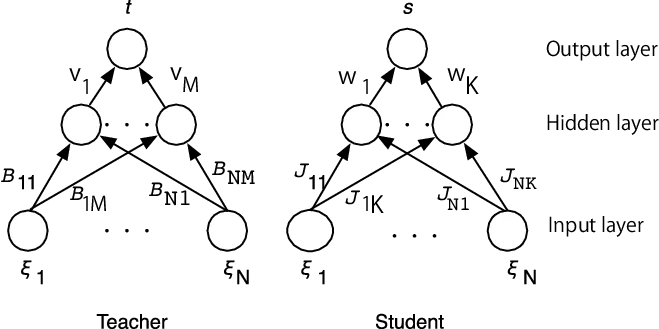

Figure 1: Network structures of teacher and student

We assume that the $`k`$th elements $`\xi_{k}^{(m)}`$ of the
independently drawn input
$`\bm{\xi}^{(m)}=(\xi_{1}^{(m)},\ldots,\xi_{N}^{(m)})`$ are uncorrelated
random variables with zero mean and unit variance; that is, the $`k`$th
element of the input is drawn from a probability distribution
$`\mbox{P}(\xi_{k})`$. The thermodynamic limit of $`N\rightarrow\infty`$
is also assumed. The statistics of the inputs in the thermodynamic limit
are $`\left<\xi_{k}^{(m)}\right>=0`$,
$`\left<(\xi_{k}^{(m)})^{2}\right>\equiv\sigma_{\xi}^{2}=1`$, and
$`\left<\|\bm{\xi}^{(m)}\|\right>=\sqrt{N}`$, where
$`\left<\cdots\right>`$ denotes the average and where $`\|\cdot\|`$
denotes the norm of a vector.

We assume that both the teacher and the student receive
$`N`$-dimensional input $`\bm{\xi}^{(m)}`$, so the teacher output
$`t^{(m)}`$ and the student output $`s^{(m)}`$ are

```math
\displaystyle t^{(m)}= \displaystyle\sum_{n=1}^{M}v_{n}t_{n}^{(m)}=\sum_{n=1}^{M}v_{n}g(d_{n}^{(m)}), \tag{1}
```

```math
\displaystyle s^{(m)}= \displaystyle\sum_{i=1}^{K}w_{i}s_{i}^{(m)}=\sum_{i=1}^{K}w_{i}g(y_{i}^{(m)}). \tag{2}
```

Here, $`v_{n}`$ and $`w_{i}`$ are the hidden-to-output weight of the
teacher and the student, respectively. $`g(\cdot)`$ is the activate
function of a hidden unit, and $`d_{n}^{(m)}`$ is the inner potential of
the $`n`$th hidden unit of the teacher calculated using

```math
d_{n}^{(m)}=\sum_{k=1}^{N}B_{nk}\xi_{k}^{(m)}. \tag{3}
```

$`y_{i}^{(m)}`$ is the inner potential of the $`k^{\prime}`$th hidden
unit of the student calculated using

```math
y_{i}^{(m)}=\sum_{k=1}^{N}J_{ik}^{(m)}\xi_{k}^{(m)}. \tag{4}
```

Next, we show the teacher network weight settings. The hidden-to-output
weight $`v_{n}`$ is set to 0.5. Each element of input-to-hidden weight
$`B_{nk},\ n=1\sim K`$ is drawn from a probability distribution with
zero mean and $`1/N`$ variance. With the assumption of the thermodynamic
limit, the statistics of the teacher input-to-hidden weight vector are
$`\left<B_{nk}\right>=0,\left<(B_{nk})^{2}\right>\equiv\sigma_{B}^{2}=1/N`$,
and $`\left<\|\bm{B_{n}}\|\right>=1`$. This means that any combination
of $`\bm{B}_{n}\cdot\bm{B}_{m}=0`$. The distribution of inner potential
$`d_{n}^{(m)}`$ follows a Gaussian distribution with zero mean and unit
variance in the thermodynamic limit.

After that, we show the student network weight settings. The initial
value of the hidden-to-output weight $`w_{i}^{(0)}`$ is set to zero mean
and to 0.1 variance. For the sake of analysis, we assume that each
element of the input-to-hidden weight $`J_{ik}^{(0)}`$, which is the
initial value of the student vector $`\bm{J}_{i}^{(0)}`$, is drawn from
a probability distribution with zero mean and with $`1/N`$ variance. The
statistics of the $`i`$th input-to-hidden weight vector of the student
are
$`\left<J_{ik}^{(0)}\right>=0,\left<(J_{ik}^{(0)})^{2}\right>\equiv\sigma_{J}^{2}=1/N`$,
and $`\left<\|\bm{J}_{i}^{(0)}\|\right>=1`$ in the thermodynamic limit.
This means that any combination of
$`\bm{J}_{i}^{(0)}\cdot\bm{J}_{j}^{(0)}=0`$. The activate function of
the hidden units of the student $`g(\cdot)`$ is the same as that of the
teacher. The statistics of the student input-to-hidden weight vector at
the $`m`$th iteration are $`\left<J_{ik}^{(m)}\right>=0`$,
$`\left<(J_{ik}^{(m)})^{2}\right>=Q_{ii}^{(m)}/N`$, and
$`\left<\|\bm{J}_{i}^{(m)}\|\right>=\sqrt{Q_{ii}^{(m)}}`$. Here,
$`Q_{ij}^{(m)}=\bm{J}_{i}^{(m)}\cdot\bm{J}_{j}^{(m)}`$. The distribution
of the inner potential $`y_{i}^{(m)}`$ follows a Gaussian distribution
with zero mean and $`Q_{ij}^{(m)}`$ variance in the thermodynamic limit.

### 2.2 Learning algorithm

Next, we introduce the stochastic gradient descent (SGD) algorithm for
the soft committee machine. The generalization error ($`\epsilon_{g}`$)
is defined as the squared error $`\varepsilon`$ averaged over possible
inputs that are independent of learning data\[9\]:

```math
\displaystyle\epsilon_{g}^{(m)} \displaystyle=\left<\epsilon^{(m)}\right>=\frac{1}{2}\left<(t^{(m)}-s^{(m)})^{2}\right>
```

```math
\displaystyle=\frac{1}{2}\left<\left(\sum_{n=1}^{K}v_{n}g(d_{n}^{(m)})-\sum_{i=1}^{K}w_{i}^{(m)}g(y_{i}^{(m)})\right)^{2}\right> \tag{5}
```

```math
\displaystyle=\frac{1}{\pi}\left[\sum_{n=1}^{M}v_{n}^{2}\arcsin\left(\frac{1}{2}\right)+\sum_{i=1}^{K}(w_{i}^{(m)})^{2}\arcsin\left(\frac{Q_{ii}^{(m)}}{1+Q_{ii}^{(m)}}\right)\right.
```

```math
\displaystyle+2\sum_{i=1}^{K}\sum_{j>i}^{K}w_{j}^{(m)}w_{j}^{(m)}\arcsin\left(\frac{Q_{ij}^{(m)}}{\sqrt{1+Q_{ii}^{(m)}}\sqrt{1+Q_{jj}^{(m)}}}\right)-2\left\{\sum_{i=1}^{M}w_{i}^{(m)}v_{i}\arcsin\left(\frac{R_{ii}^{(m)}}{\sqrt{2(1+Q_{ii}^{(m))}}}\right)\right.
```

```math
\displaystyle+\left.\left.\sum_{n=1}^{M}\sum_{i\neq n}^{K}w_{i}^{(m)}v_{n}\arcsin\left(\frac{R_{in}^{(m)}}{\sqrt{2(1+Q_{ii}^{(m)}})}\right)\right\}\right]. \tag{6}
```

Here, we assume that $`T_{nn}=1`$ and $`T_{nm}=0`$, where $`n\neq m`$.
This equation shows that if $`M`$ of $`Q_{ii}`$s and $`R_{ii}`$s
converge into 1, the rest of $`Q_{ii}`$s, $`R_{ii}`$s, $`Q_{ij}`$s, and
$`R_{in}`$s vanish, and $`M`$ of $`w_{i}`$ is equal to $`v_{n}`$ at
$`t\rightarrow\infty`$; then, the generalization error becomes zero.
Here, we denote that $`Q_{ii}=\bm{J}_{i}\cdot\bm{J}_{i}`$,
$`R_{ii}=\bm{B}_{i}\cdot\bm{J}_{i}`$,
$`Q_{ij}=\bm{J}_{i}\cdot\bm{J}_{j}`$, and
$`R_{in}=\bm{B}_{n}\cdot\bm{J}_{i}`$.

As already described, when the teacher consists of $`M`$ hidden units
and the student consists of $`K`$ hidden units, three cases emerge for
setting the number of hidden units in the students: (1) $`M>K`$, (2)
$`M=K`$, and (3) $`M<K`$. The case of $`M>K`$ is unlearnable and
insufficient because the degree of complexity of the students is less
than that of the teacher. The case of $`M=K`$ is learnable because the
degree of complexity of the students is the same as that of the teacher.
The case of $`M<K`$ is learnable and redundant because the degree of
complexity of the students is higher than that of the teacher \[12\].

Next, we show the learning equations\[7, 9\]. At each learning step
$`m`$, a new uncorrelated input, $`\bm{\xi}^{(m)}`$, is presented, and
the current hidden-to-output weight $`w_{i}^{(m)}`$ and that of the
input-to-hidden weight of the student $`\bm{J}_{i}^{(m)}`$ are updated
using

```math
\displaystyle\bm{J}_{i}^{(m+1)} \displaystyle=\bm{J}_{i}^{(m)}+\frac{\eta}{N}\delta_{i}^{(m)}w_{i}g^{\prime}(y_{i}^{(m)})\bm{\xi}^{(m)}, \tag{7}
```

```math
\displaystyle\bm{w}_{i}^{(m+1)} \displaystyle=\bm{w}_{i}^{(m)}+\frac{\eta}{N}\delta_{i}^{(m)}y_{i}, \tag{8}
```

```math
\displaystyle\delta_{i}^{(m)} \displaystyle=\sum_{n=1}^{M}v_{n}g(d_{n}^{(m)})-\sum_{j=1}^{K}w_{j}g(y_{j}^{(m)}), \tag{9}
```

where $`\eta`$ is the learning step size and where $`g^{\prime}(x)`$ is
the derivative of the activate function of the hidden unit $`g(x)`$.

Next, we show the typical behavior of learning using SGD in computer
simulations. The teacher is set as described in the previous subsection.
The student is initialized as described in the previous subsection. We
use two settings of (1)$`M=2`$ and $`K=2`$ (Fig. 2), and (2) $`M=2`$ and
$`K=4`$ (Fig. 3). (1) is a learnable setting and (2) is a redundant
setting. The activate function $`g(x)`$ is the sigmoid function,
$`\mbox{erf}(x/\sqrt{2})`$. The number of input units $`N`$ is set to
$`1000`$, and the learning step size is set to $`\eta=0.005`$. In these
figures, the horizontal axis is time $`t=m/N`$. In Fig. 2(a), we show
the time course of the mean squared error (MSE), Fig.2(b) show that of
$`\bm{w}`$, and Fig.2(c) show that of $`Q_{ii}`$ and $`Q_{ij}`$
(referred to as $`Q`$s) and $`R_{ii}`$ and $`R_{in}`$ (referred to as
$`R`$s).

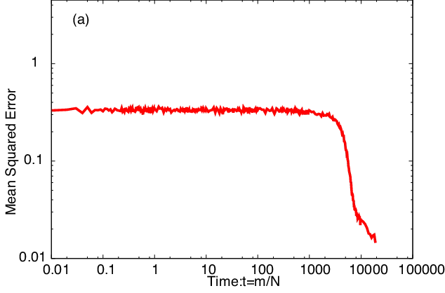

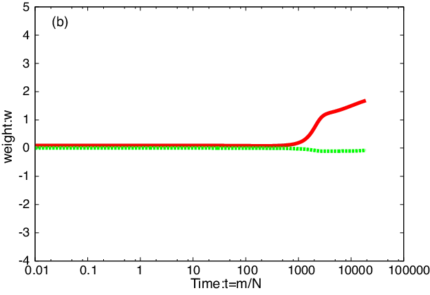

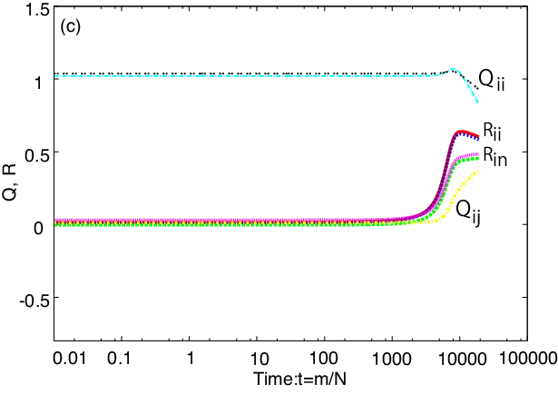

Figure 2: Dynamic behavior of SGD with $`M=K=2`$. (a) shows MSE, (b)
shows $`\bm{w}`$, and (c) shows $`Q`$ and $`R`$.

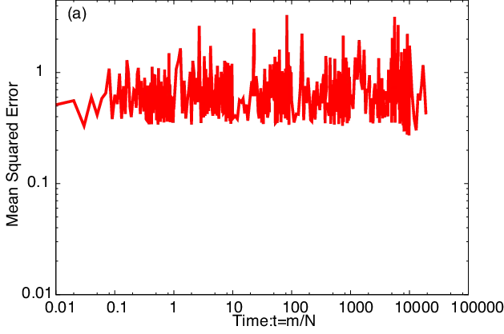

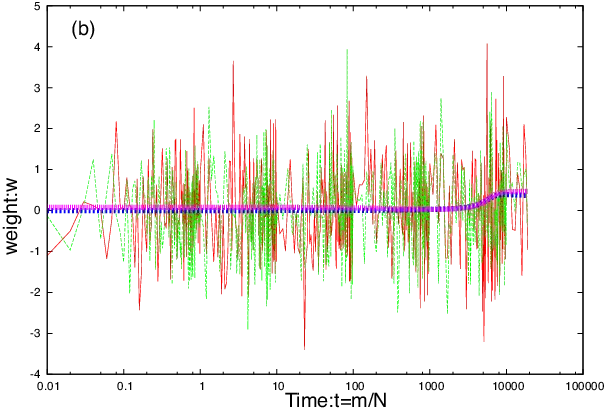

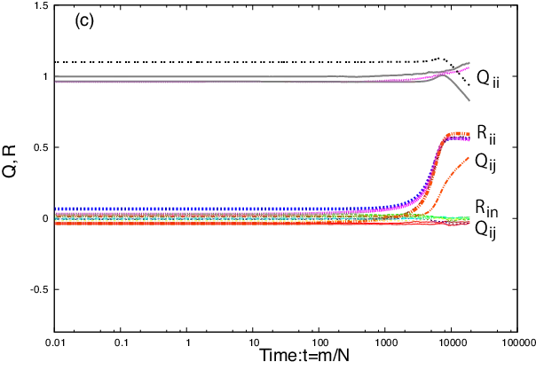

Figure 3: Dynamic behavior of SGD with $`M=2`$ and $`K=4`$. Top shows
MSE, middle shows $`\bm{w}`$, and bottom shows $`Q`$ and $`R`$.

Figure 2 shows the results for learnable case (case (1)). Figure 2(a)
shows two states in the learning process: one is a plateau, and the
other is symmetry breaking of the weights. The plateau is a phenomenon
where the MSE decreases very slowly for a long interval in the learning
process. Symmetry breaking of the weights is a phenomenon involving a
sudden decrease in MSE because of the success of credit assignment of
the hidden units. To achieve $`\epsilon_{g}\rightarrow 0`$ in case (1),
as we showed in Eq. 6, $`R_{ii}s\rightarrow 1`$,
$`Q_{ii}s\rightarrow 1`$, $`R_{in}s\rightarrow 0`$, and
$`Q_{ij}s\rightarrow 0`$ at the limit of $`t\rightarrow\infty`$. From
Fig. 2, MSE decreases properly, and $`\bm{w}`$ converges into
$`\bm{w}=(2,0)`$ while $`\bm{v}=(0.5,0.5)`$. For $`R`$s,
$`R_{ii}s>R_{in}s`$ and is more than 0.5, and $`R_{in}`$ does not
vanish. $`Q_{ii}s\sim 1`$, and $`Q_{ij}s\rightarrow 0.5`$; thus,
$`Q_{ij}s`$ also does not vanish. These results show that the teacher
and student converge at different parameters. Note that in this case,
the dynamics of $`\bm{w}`$ are stable.

Figure 3 shows the results for case (2). As aforementioned, the teacher
is $`M=2`$, and the students are $`K=4`$. Then, two elements of
$`\bm{w}`$ and two of $`\bm{J}_{i}`$ are redundant. To achieve
$`\epsilon_{g}\rightarrow 0`$ in this case, the same conditions are
required as those in case (1), and in addition, $`K-M`$ of the elements
of $`\bm{w}`$ and $`K-M`$ of $`Q_{ii}`$s must vanish. This means that
$`K-M`$ of $`\bm{J}_{i}`$ and $`K-M`$ elements of $`\bm{w}`$ must
vanish. From Fig. 3(a), MSE becomes bumpy, and it does not decrease
properly. We cannot see clearly plateau and symmetry breaking of the
weights. Figure 3(b) shows the time course of $`\bm{w}`$. In the figure,
two thick lines in the middle are shown to converge properly into
(0,5,0.5), while the rest are bumped (shown by thin lines). This
phenomenon occurs because two of $`\bm{w}`$ are redundant, and no
constraint is used to eliminate redundant weights. Figure 3(c) shows the
time course of $`Q`$s and $`R`$s. This figure shows that $`R_{in}s`$ and
$`Q_{ij}s`$ almost vanish. Two of $`Q_{ii}s`$ stay at $`Q_{ii}=1`$, and
the rest seems to decrease properly to $`Q_{ii}<1`$. However, two of
$`R_{ii}`$ and one of $`R_{in}s`$ converge into 0.6, while two of
$`R_{ii}s`$ should converge into 1.0, and $`R_{ins}`$ must vanish. Also,
one of $`Q_{ij}s`$ becomes a larger value at $`t=20,000`$; however, it
should vanish. These will cause a large MSE. Note that the MSE does not
decrease properly, but Rs and Qs are updated properly. This fact shows
that the MSE is not a good enough index of the learning performance and
that the teacher-student formulation gives additional information.

## 3 Dropout

In this section, we introduce dropout \[5\] and its behavior in online
learning\[6\]. Dropout is used in deep learning to prevent overfitting.
A small number of data compared with the number of units and weights of
a network may cause overfitting \[12\]. In the state of overfitting, the
learning error (the error for learning data) and the test error (the
error given by cross-validation) become different. This means that the
error for learning data is small; however, the error for overall data is
large. In this paper, we assume dropout is carried out in online
learning.

The learning equation of dropout or a MLP can be written as
follows\[6\].

```math
\displaystyle\bm{J}_{i}^{(m+1)}= \displaystyle\bm{J}_{k^{\prime}}^{(m)}+\frac{\eta}{N}\delta_{i}^{D}w_{i}^{(m)}g^{\prime}(y_{i}^{(m)})\bm{\xi}^{(m)}, \tag{10}
```

```math
\displaystyle\delta_{i}^{D}= \displaystyle\sum_{n=1}^{M}v_{n}g(d_{n}^{(m)})-\sum_{j\in D^{(m)}}^{pK}w_{j}g(y_{j}^{(m)}). \tag{11}
```

Here, $`D^{(m)}`$ shows a set of the hidden units that are randomly
selected with respect to the probability $`p`$ from all the hidden units
at the $`m`$th iteration. Note that the second term of the right hand
side in Eq. (11) is the MLP output composed of selected hidden units.
The hidden units in $`D^{(m)}`$ are subject to learning, and the size of
the student decreases due to dropout. After the learning, the student’s
output $`s^{(m)}`$ is calculated using the sum of learned hidden outputs
and hidden outputs that have not been learned multiplied by $`p`$\[6\].

```math
s^{(m)}=p*\left\{\sum_{i\in{D}^{(m)}}^{pK}w_{i}g(y_{i}^{(m)})+\sum_{j\notin D^{(m)}}^{(1-p)K}w_{j}g(y_{j}^{(m-1)})\right\} \tag{12}
```

This equation is regarded as the ensemble of a learned network (written
by $`y_{i}^{(m)}`$) and that of a not learned network (written by
$`y_{j}^{(m-1)}`$) when the probability is $`p=0.5`$. However, in deep
learning, selected hidden units in $`D^{(m)}`$ are changed at every
iteration, where the same set of hidden units are used in the ensemble
learning. Therefore, dropout is regarded as ensemble learning using a
different set of hidden units at every iteration\[6\].

### 3.1 Analytical Results

We show the results of analysis of the dropout in on-line learning
through computer simulations. Figure 4 shows the time course of the MSE,
that of the hidden-output weight $`\bm{w}`$, and that of $`R`$s and
$`Q`$s. Dropout with SGD is referred to as dropout in this paper. The
computer simulation conditions are as the same as those in Fig. 2. In
figure 4, the horizontal axis is time $`t=m/N`$.

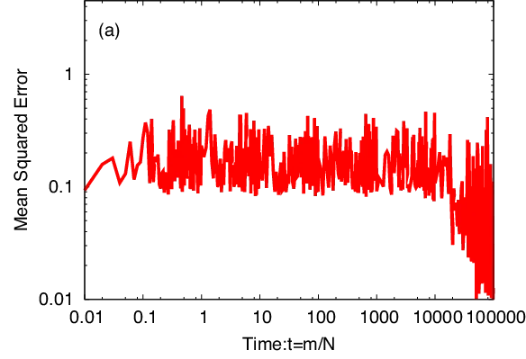

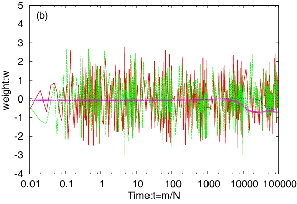

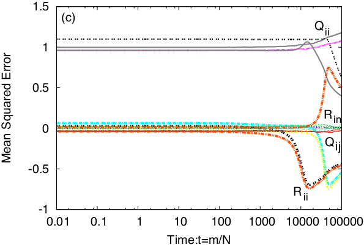

Figure 4: Dynamic behavior of dropout with $`M=2`$ and $`K=4`$. (a)
shows MSE, (b) shows $`\bm{w}`$, and (c) shows $`Qs`$ and $`Rs`$.

In Fig. 4(a), the MSE is as bumpy as the one in Fig. 3(a), but the
baseline of MSE decreased to 0.1. Symmetry breaking of the weights is
also observed when $`t>20,000`$. From Fig. 4(b), the time course of two
of $`\bm{w}`$, shown by thick lines, properly converged to (-1,-1) . The
rest of $`\bm{w}`$, shown by thin lines, behaves as bumpy as shown in
the figure. The student has four $`Q_{ii}`$s and six $`Q_{ij}`$s. Fig.
4(c) shows that two of $`Q_{ii}s`$ stayed at $`Q_{ii}=1`$, and the other
two decreased to about 0.5 at $`t=100,000`$. This mean that two weights
in the student have the same norm as that of the teacher, and the
remaining two weights will vanish. This phenomenon may cause symmetry
breaking of the weights. These results show that dropout tends to
decrease the MSE when the student is redundant by eliminating the
redundant weights.

### 3.2 Singular Teacher

H. Park pointed out that for a singular case, slow dynamics are
observed\[9\]. Thus, we investigated the effect of dropout when the
teacher is singular. We set the teacher ($`M=2`$) as follows. The
input-to-output weights were set to $`\bm{B}_{1}=\bm{B}_{2}`$, and the
hidden-to-output weights were set to $`v_{1}=v_{2}=0.5`$. H. Park also
pointed out that a quasi plateau is caused by the singular subspace
($`w_{1}+w_{2}=1`$ for $`K=2`$), which does not exist in the
soft-committee machine\[9\]. Thus, $`v_{1}=v_{2}=0.5`$ will induce the
student to fall into this singular subspace.

Figure 5(a) shows the time course of the MSE, Fig. 5(b) shows that of
the hidden-output weight $`\bm{w}`$, and Fig. 5(c) shows that of $`Q`$s
and $`R`$s for SGD. The simulation conditions are the same as those in
Fig. 2. The teacher is $`M=2`$, and the student is $`K=4`$. From Fig.
5(a), the baseline of the MSE is a little bit larger than that in Fig.
2(a) using the normal teacher. In Fig. 5(c), we can observe the slow
dynamics of $`R_{ii}`$ shown by the broken circle. These slow dynamics
are significant when $`R_{ii}`$ approaches $`R_{ii}=1`$, which is the
singular point.

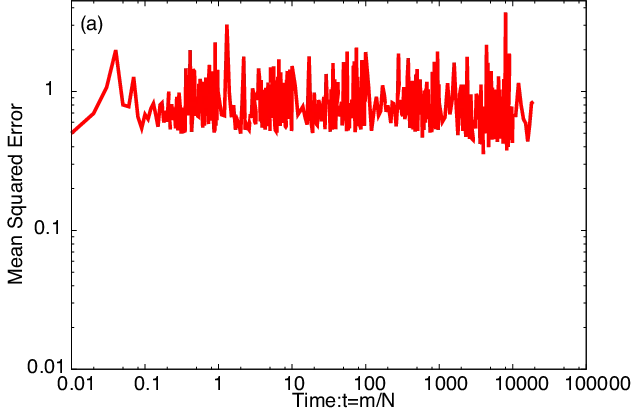

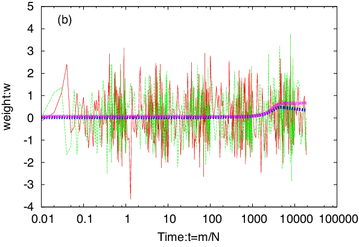

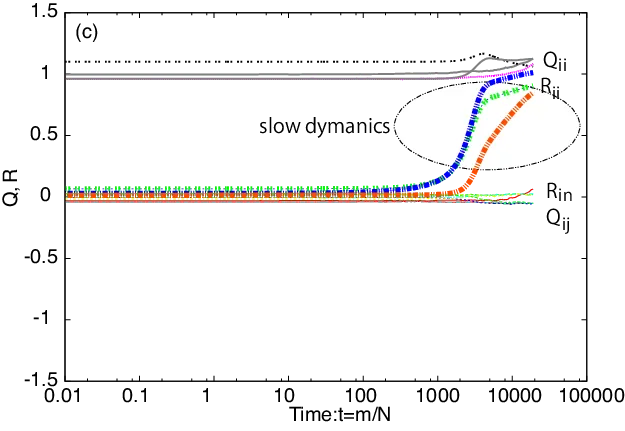

Figure 5: Dynamic behavior of SGD when teacher is singular. Network
structures are $`M=2`$ and $`K=4`$. (a) shows MSE, (b) shows $`\bm{w}`$,
and (c) shows $`Q`$s and $`R`$s.

Figure 6(a) shows the time course of the MSE, Fig.6(b) shows that of the
hidden-to-output weight $`\bm{w}`$, and Fig. 6(c) shows that of $`Q`$s
and $`R`$s for dropout. The simulation conditions are the same as those
in Fig. 2. The teacher is $`M=2`$, and the student is $`K=4`$. From Fig.
6(a), the baseline of MSE is small compared to that of Fig. 5(a). We can
also observe the symmetry break of weights near $`t=10,000`$. From Fig.
6(c), $`R_{ii}`$ converged into $`R_{ii}=1`$ or $`R_{ii}=-1`$ rapidly
near $`t=10,000`$, and we cannot observe slow dynamics around the
singular point, that is $`R_{ii}=1`$.

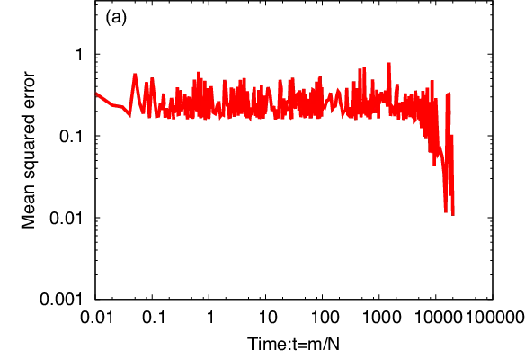

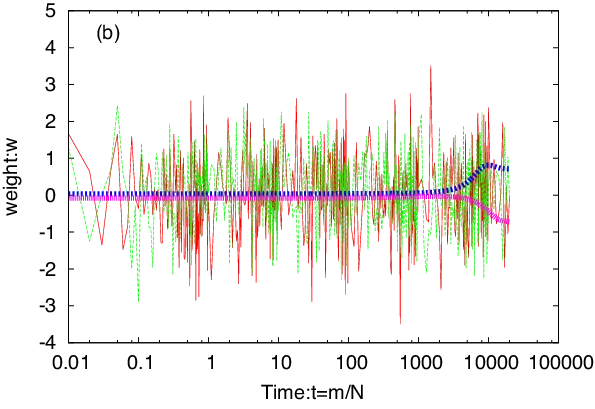

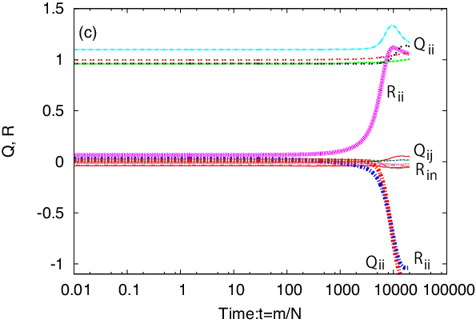

Figure 6: Dynamic behavior of dropout when teacher is singular. Network
structures are $`M=2`$ and $`K=4`$. (a) shows MSE, (b) shows $`\bm{w}`$,
and (c) shows $`Q`$s and $`R`$s.

These results enable us to claim that by using dropout, the slow
dynamics of $`R`$s may not be affected by the singular point.

## 4 Conclusion

This paper presented our analysis of the behavior of dropout in online
learning. In online learning, overfitting does not occur. Thus, we
analyzed the dropout from other aspects: the learning behavior of
students having redundant units and the learning behavior of students
when the teacher is a singular. For redundant students, SGD cannot
eliminate the redundant weights, and this causes large MSE baselines.
However, dropout can eliminate the redundant weights properly and can
achieve a small MSE baseline and also the occurrence of symmetry
breaking of weights. For a singular teacher, SGD shows the slow dynamics
of $`R_{ii}`$ near the singular point, that is, $`R_{ii}=1`$. However,
dropout has not shown slow dynamics near the singular point, and it
converges into a singular point rapidly. We have analyzed dropout in
online learning through computer simulations. Our next step is the
analysis of dropout using theoretical methods.

## References

- \[1\] G. E. Hinton, S. Osindero, and Y. Teh, “A fast learning
  algorithm for deep belief nets”, Neural Computation, 18, pp. 1527–1554
  (2006).
- \[2\] Y. LeCun, Y. Bengio, and G. Hinton, “Deep learning”, NATURE,
  vol. 521, pp. 436–444 (2015).
- \[3\] A. Krizhevsky, I. Sutskever, and G. E. Hinton, “ImageNet
  Classification with Deep Convolutional Neural Networks”, Advances in
  Neural Information Processing Systems, vol. 25, pp. 1–9 (2012).
- \[4\] L. Deng, J. Li, et al., “Recent advances in deep learning for
  speech research at Microsoft”, ICASSP (2013).
- \[5\] G. E. Hinton, N. Srivastava, A. Krizhevsky, I. Sutskever,
  and R. R. Salakhutdinov, “Improving neural networks by preventing
  co-adaptation of feature detectors”, The Computing Research Repository
  (CoRR), vol. abs/ 1207.0580 (2012).
- \[6\] K. Hara, D. Saitoh, et al, “Analysis of Conventional Dropout
  and its Application to Group Dropout”, IPSJ Transactions on
  Mathematical Modeling and Its Applications, vol. 10, no. 2, pp. 25–32
  (2017).
- \[7\] M. Biehl and H. Schwarze, “Learning by on-line gradient
  descent”, Journal of Physics A: Mathematical and General Physics, 28,
  pp. 643–656 (1995).
- \[8\] D. Saad and S. A. Solla, “On-line learning in soft-committee
  machines”, Physical Review E, 52, pp. 4225–4243 (1995).
- \[9\] H. Park, M. Inoue, and M. Okada, “Slow Dynamics Due to
  Singularities of Hierarchical Learning Machines”, Progress of
  Theoretical Physics Supplement, No. 157, pp. 275–279 (2005).
- \[10\] S. Wager, Sida Wang, and Percy Liang, “Dropout Training as
  Adaptive Regularization”, Advances in Neural Information Processing
  Systems, vol. 26, pp. 351–359 (2013).
- \[11\] P. Baldi and P. Sadowski, “Understanding Dropout”, Advances in
  Neural Information Processing Systems, vol. 26, pp. 2814–2822 (2013).
- \[12\] C. M. Bishop, Pattern Recognition and Machine learning,
  Springer (2006).
