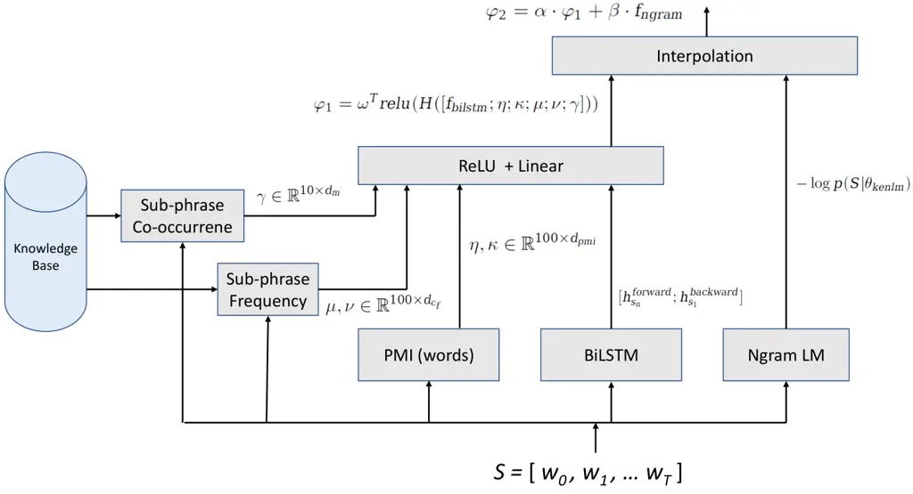

# Entity-Aware Language Model as an Unsupervised Reranker

###### Abstract

In language modeling, it is difficult to incorporate entity
relationships from a knowledge-base. One solution is to use a reranker
trained with global features, in which global features are derived from
n-best lists. However, training such a reranker requires manually
annotated n-best lists, which is expensive to obtain. We propose a
method based on the contrastive estimation method that alleviates the
need for such data. Experiments in the music domain demonstrate that
global features, as well as features extracted from an external
knowledge-base, can be incorporated into our reranker. Our final model,
a simple ensemble of a language model and reranker, achieves a 0.44%
absolute word error rate improvement over an LSTM language model on the
blind test data.

Mohammad Sadegh Rasooli¹, Sarangarajan Parthasarathy²

¹Department of Computer Science, Columbia University, New York, NY,
10027  
²Artificial Intelligence and Research, Microsoft Corporation, USA

rasooli@cs.columbia.edu, sarangp@microsoft.com

## 1 Introduction

Voice assistant systems rely heavily on complex language models. These
language models are used as a second-pass reranking step for hypotheses
generated by a first-pass speech recognizer \[1, 2, 3, 4\]. While a
significant fraction of queries in voice assistant systems relate to
entities in the real world (such as names of places, products, arts,
people, etc.), language models do not explicitly model them. The problem
of recognizing entities becomes more critical when some entities are not
adequately represented in the training data. For example, Figure 1 shows
two possible outputs from a first-pass speech recognition system. The
correct output is about playing a song by a specific singer. The singer
and the song have not been seen in the training data together, but by
incorporating the cross-entity relationship from a relevant
knowledge-base, we can capture the correct output of the speech
recognition system.

Unlike previous work \[5, 6\] that have considered modeling entities
directly in a language model, this paper proposes a dynamic reranking
approach without the need for any transcribed training data. Our model
makes use of raw text and a knowledge-base consisting of entities in the
world. In order to train a reranker, we create artificial n-best lists
for each training sentence. This enables us to train a reranking model
on the artificial n-best list. We use the contrastive estimation
method \[7\]¹¹ 1 This method is different from the noise contrastive
estimation method \[8\]. to maximize the likelihood of each sentence in
the training data in contrast to artificial sentences in the n-best
list. One main strength of our method is that we are not bound to local
word-based features anymore, thereby facilitating the possibility of
embedding global features such as phrase-based interactions between
entities (such as the “played-by” relationship in Figure 1).

![](data:image/svg+xml;base64,PHN2ZyBpZD0iUzEuRjEucGljMSIgY2xhc3M9Imx0eF9waWN0dXJlIiBoZWlnaHQ9Ijk1LjI4IiBvdmVyZmxvdz0idmlzaWJsZSIgdmVyc2lvbj0iMS4xIiB2aWV3Ym94PSIwIDAgMzU3Ljk5IDk1LjI4IiB3aWR0aD0iMzU3Ljk5Ij48ZyBzdHlsZT0iLS1sdHgtc3Ryb2tlLWNvbG9yOiMwMDAwMDA7LS1sdHgtZmlsbC1jb2xvcjojMDAwMDAwOyIgZmlsbD0iIzAwMDAwMCIgc3Ryb2tlPSIjMDAwMDAwIiBzdHJva2Utd2lkdGg9IjAuNHB0IiB0cmFuc2Zvcm09InRyYW5zbGF0ZSgwLDk1LjI4KSBtYXRyaXgoMSAwIDAgLTEgMCAwKSB0cmFuc2xhdGUoMTc4LjcyLDApIHRyYW5zbGF0ZSgwLDYxLjY0KSI+PGcgc3R5bGU9Ii0tbHR4LXN0cm9rZS1jb2xvcjojRkZGRjAwOy0tbHR4LWZpbGwtY29sb3I6I0ZGRkZCMzsiIGZpbGw9IiNGRkZGQjMiIHN0cm9rZT0iI0ZGRkYwMCIgc3Ryb2tlLWRhc2hhcnJheT0ibm9uZSIgc3Ryb2tlLWRhc2hvZmZzZXQ9IjAuMHB0Ij48cGF0aCBkPSJNIC04NS4zNiAyNS44NyBMIC0xNDMuMTMgMjUuODcgQyAtMTQ0LjY2IDI1Ljg3IC0xNDUuOSAyNC42NCAtMTQ1LjkgMjMuMTEgTCAtMTQ1LjkgNS4wNCBDIC0xNDUuOSAzLjUxIC0xNDQuNjYgMi4yNyAtMTQzLjEzIDIuMjcgTCAtODUuMzYgMi4yNyBDIC04My44MyAyLjI3IC04Mi41OSAzLjUxIC04Mi41OSA1LjA0IEwgLTgyLjU5IDIzLjExIEMgLTgyLjU5IDI0LjY0IC04My44MyAyNS44NyAtODUuMzYgMjUuODcgWiBNIC0xNDUuOSAyLjI3IiAvPjwvZz48ZyBzdHlsZT0iLS1sdHgtc3Ryb2tlLWNvbG9yOiMwMDAwMDA7LS1sdHgtZmlsbC1jb2xvcjojMDAwMDAwOyIgZmlsbD0iIzAwMDAwMCIgc3Ryb2tlPSIjMDAwMDAwIiBzdHJva2UtZGFzaGFycmF5PSJub25lIiBzdHJva2UtZGFzaG9mZnNldD0iMC4wcHQiIHRyYW5zZm9ybT0ibWF0cml4KDEuMCAwLjAgMC4wIDEuMCAtMTQxLjc1IDE0LjA3KSI+PGZvcmVpZ25vYmplY3Qgc3R5bGU9Ii0tbHR4LWZvLXdpZHRoOjQuM2VtOy0tbHR4LWZvLWhlaWdodDowZW07LS1sdHgtZm8tZGVwdGg6MGVtO2ZvbnQtc2l6ZTo5cHQ7IiBoZWlnaHQ9IjAiIG92ZXJmbG93PSJ2aXNpYmxlIiB0cmFuc2Zvcm09Im1hdHJpeCgxIDAgMCAtMSAwIDApIiB3aWR0aD0iNTMuNTUiPjxzcGFuIGNsYXNzPSJsdHhfZm9yZWlnbm9iamVjdF9jb250YWluZXIiPjxzcGFuIGNsYXNzPSJsdHhfZm9yZWlnbm9iamVjdF9jb250ZW50Ij4KPHNwYW4gaWQ9IlMxLkYxLnBpYzEuMSIgY2xhc3M9Imx0eF9pbmxpbmUtYmxvY2sgbHR4X21pbmlwYWdlIGx0eF9hbGlnbl90b3AiIHN0eWxlPSJ3aWR0aDo0LjNlbTsiPgo8c3BhbiBpZD0iUzEuRjEucGljMS4xLjEiIGNsYXNzPSJsdHhfcCI+PC9zcGFuPgo8L3NwYW4+PC9zcGFuPjwvc3Bhbj48L2ZvcmVpZ25vYmplY3Q+PC9nPjxnIHN0eWxlPSItLWx0eC1zdHJva2UtY29sb3I6I0ZGMDAwMDstLWx0eC1maWxsLWNvbG9yOiNGRkIzQjM7IiBmaWxsPSIjRkZCM0IzIiBzdHJva2U9IiNGRjAwMDAiIHN0cm9rZS1kYXNoYXJyYXk9Im5vbmUiIHN0cm9rZS1kYXNob2Zmc2V0PSIwLjBwdCI+PHBhdGggZD0iTSA4My41MSAyNS44NyBMIC0xMi41MyAyNS44NyBDIC0xNC4wNiAyNS44NyAtMTUuMyAyNC42NCAtMTUuMyAyMy4xMSBMIC0xNS4zIDUuMDQgQyAtMTUuMyAzLjUxIC0xNC4wNiAyLjI3IC0xMi41MyAyLjI3IEwgODMuNTEgMi4yNyBDIDg1LjA0IDIuMjcgODYuMjggMy41MSA4Ni4yOCA1LjA0IEwgODYuMjggMjMuMTEgQyA4Ni4yOCAyNC42NCA4NS4wNCAyNS44NyA4My41MSAyNS44NyBaIE0gLTE1LjMgMi4yNyIgLz48L2c+PGcgc3R5bGU9Ii0tbHR4LXN0cm9rZS1jb2xvcjojMDAwMDAwOy0tbHR4LWZpbGwtY29sb3I6IzAwMDAwMDsiIGZpbGw9IiMwMDAwMDAiIHN0cm9rZT0iIzAwMDAwMCIgc3Ryb2tlLWRhc2hhcnJheT0ibm9uZSIgc3Ryb2tlLWRhc2hvZmZzZXQ9IjAuMHB0IiB0cmFuc2Zvcm09Im1hdHJpeCgxLjAgMC4wIDAuMCAxLjAgLTExLjE1IDE0LjA3KSI+PGZvcmVpZ25vYmplY3Qgc3R5bGU9Ii0tbHR4LWZvLXdpZHRoOjcuMjllbTstLWx0eC1mby1oZWlnaHQ6MGVtOy0tbHR4LWZvLWRlcHRoOjBlbTtmb250LXNpemU6OXB0OyIgaGVpZ2h0PSIwIiBvdmVyZmxvdz0idmlzaWJsZSIgdHJhbnNmb3JtPSJtYXRyaXgoMSAwIDAgLTEgMCAwKSIgd2lkdGg9IjkwLjc5Ij48c3BhbiBjbGFzcz0ibHR4X2ZvcmVpZ25vYmplY3RfY29udGFpbmVyIj48c3BhbiBjbGFzcz0ibHR4X2ZvcmVpZ25vYmplY3RfY29udGVudCI+CjxzcGFuIGlkPSJTMS5GMS5waWMxLjIiIGNsYXNzPSJsdHhfaW5saW5lLWJsb2NrIGx0eF9taW5pcGFnZSBsdHhfYWxpZ25fdG9wIiBzdHlsZT0id2lkdGg6Ny4yOWVtOyI+CjxzcGFuIGlkPSJTMS5GMS5waWMxLjIuMSIgY2xhc3M9Imx0eF9wIj48L3NwYW4+Cjwvc3Bhbj48L3NwYW4+PC9zcGFuPjwvZm9yZWlnbm9iamVjdD48L2c+PGcgc3R5bGU9Ii0tbHR4LXN0cm9rZS1jb2xvcjojMDBGRjAwOy0tbHR4LWZpbGwtY29sb3I6I0IzRkZCMzsiIGZpbGw9IiNCM0ZGQjMiIHN0cm9rZT0iIzAwRkYwMCIgc3Ryb2tlLWRhc2hhcnJheT0ibm9uZSIgc3Ryb2tlLWRhc2hvZmZzZXQ9IjAuMHB0Ij48cGF0aCBkPSJNIC05LjIxIC0xMC4zMiBMIC0xMzYuNCAtMTAuMzIgQyAtMTM3LjkyIC0xMC4zMiAtMTM5LjE2IC0xMS41NiAtMTM5LjE2IC0xMy4wOCBMIC0xMzkuMTYgLTMxLjE1IEMgLTEzOS4xNiAtMzIuNjggLTEzNy45MiAtMzMuOTIgLTEzNi40IC0zMy45MiBMIC05LjIxIC0zMy45MiBDIC03LjY4IC0zMy45MiAtNi40NCAtMzIuNjggLTYuNDQgLTMxLjE1IEwgLTYuNDQgLTEzLjA4IEMgLTYuNDQgLTExLjU2IC03LjY4IC0xMC4zMiAtOS4yMSAtMTAuMzIgWiBNIC0xMzkuMTYgLTMzLjkyIiAvPjwvZz48ZyBzdHlsZT0iLS1sdHgtc3Ryb2tlLWNvbG9yOiMwMDAwMDA7LS1sdHgtZmlsbC1jb2xvcjojMDAwMDAwOyIgZmlsbD0iIzAwMDAwMCIgc3Ryb2tlPSIjMDAwMDAwIiBzdHJva2UtZGFzaGFycmF5PSJub25lIiBzdHJva2UtZGFzaG9mZnNldD0iMC4wcHQiIHRyYW5zZm9ybT0ibWF0cml4KDEuMCAwLjAgMC4wIDEuMCAtMTM1LjAxIC0yMi4xMikiPjxmb3JlaWdub2JqZWN0IHN0eWxlPSItLWx0eC1mby13aWR0aDo5LjcyZW07LS1sdHgtZm8taGVpZ2h0OjBlbTstLWx0eC1mby1kZXB0aDowZW07Zm9udC1zaXplOjlwdDsiIGhlaWdodD0iMCIgb3ZlcmZsb3c9InZpc2libGUiIHRyYW5zZm9ybT0ibWF0cml4KDEgMCAwIC0xIDAgMCkiIHdpZHRoPSIxMjEuMDUiPjxzcGFuIGNsYXNzPSJsdHhfZm9yZWlnbm9iamVjdF9jb250YWluZXIiPjxzcGFuIGNsYXNzPSJsdHhfZm9yZWlnbm9iamVjdF9jb250ZW50Ij4KPHNwYW4gaWQ9IlMxLkYxLnBpYzEuMyIgY2xhc3M9Imx0eF9pbmxpbmUtYmxvY2sgbHR4X21pbmlwYWdlIGx0eF9hbGlnbl90b3AiIHN0eWxlPSJ3aWR0aDo5LjcyZW07Ij4KPHNwYW4gaWQ9IlMxLkYxLnBpYzEuMy4xIiBjbGFzcz0ibHR4X3AiPjwvc3Bhbj4KPC9zcGFuPjwvc3Bhbj48L3NwYW4+PC9mb3JlaWdub2JqZWN0PjwvZz48ZyBzdHlsZT0iLS1sdHgtc3Ryb2tlLWNvbG9yOiNGRjAwMDA7LS1sdHgtZmlsbC1jb2xvcjojRkZCM0IzOyIgZmlsbD0iI0ZGQjNCMyIgc3Ryb2tlPSIjRkYwMDAwIiBzdHJva2UtZGFzaGFycmF5PSJub25lIiBzdHJva2UtZGFzaG9mZnNldD0iMC4wcHQiPjxwYXRoIGQ9Ik0gMTc2LjIzIC0xMC4zMiBMIDgwLjE5IC0xMC4zMiBDIDc4LjY2IC0xMC4zMiA3Ny40MiAtMTEuNTYgNzcuNDIgLTEzLjA4IEwgNzcuNDIgLTMxLjE1IEMgNzcuNDIgLTMyLjY4IDc4LjY2IC0zMy45MiA4MC4xOSAtMzMuOTIgTCAxNzYuMjMgLTMzLjkyIEMgMTc3Ljc2IC0zMy45MiAxNzkgLTMyLjY4IDE3OSAtMzEuMTUgTCAxNzkgLTEzLjA4IEMgMTc5IC0xMS41NiAxNzcuNzYgLTEwLjMyIDE3Ni4yMyAtMTAuMzIgWiBNIDc3LjQyIC0zMy45MiIgLz48L2c+PGcgc3R5bGU9Ii0tbHR4LXN0cm9rZS1jb2xvcjojMDAwMDAwOy0tbHR4LWZpbGwtY29sb3I6IzAwMDAwMDsiIGZpbGw9IiMwMDAwMDAiIHN0cm9rZT0iIzAwMDAwMCIgc3Ryb2tlLWRhc2hhcnJheT0ibm9uZSIgc3Ryb2tlLWRhc2hvZmZzZXQ9IjAuMHB0IiB0cmFuc2Zvcm09Im1hdHJpeCgxLjAgMC4wIDAuMCAxLjAgODEuNTcgLTIyLjEyKSI+PGZvcmVpZ25vYmplY3Qgc3R5bGU9Ii0tbHR4LWZvLXdpZHRoOjcuMjllbTstLWx0eC1mby1oZWlnaHQ6MGVtOy0tbHR4LWZvLWRlcHRoOjBlbTtmb250LXNpemU6OXB0OyIgaGVpZ2h0PSIwIiBvdmVyZmxvdz0idmlzaWJsZSIgdHJhbnNmb3JtPSJtYXRyaXgoMSAwIDAgLTEgMCAwKSIgd2lkdGg9IjkwLjc5Ij48c3BhbiBjbGFzcz0ibHR4X2ZvcmVpZ25vYmplY3RfY29udGFpbmVyIj48c3BhbiBjbGFzcz0ibHR4X2ZvcmVpZ25vYmplY3RfY29udGVudCI+CjxzcGFuIGlkPSJTMS5GMS5waWMxLjQiIGNsYXNzPSJsdHhfaW5saW5lLWJsb2NrIGx0eF9taW5pcGFnZSBsdHhfYWxpZ25fdG9wIiBzdHlsZT0id2lkdGg6Ny4yOWVtOyI+CjxzcGFuIGlkPSJTMS5GMS5waWMxLjQuMSIgY2xhc3M9Imx0eF9wIj48L3NwYW4+Cjwvc3Bhbj48L3NwYW4+PC9zcGFuPjwvZm9yZWlnbm9iamVjdD48L2c+PGcgdHJhbnNmb3JtPSJtYXRyaXgoMS4wIDAuMCAwLjAgMS4wIC0xNzQuNTcgLTI1LjQ3KSI+PGcgY2xhc3M9Imx0eF90aWt6bWF0cml4IiB0cmFuc2Zvcm09Im1hdHJpeCgxIDAgMCAtMSAwIDU4Ljk4KSI+PGcgY2xhc3M9Imx0eF90aWt6bWF0cml4X3JvdyIgdHJhbnNmb3JtPSJtYXRyaXgoMSAwIDAgMSAwIDEwLjcyKSI+PGcgc3R5bGU9Ii0tbHR4LXN0cm9rZS1jb2xvcjojMDAwMDAwOy0tbHR4LWZpbGwtY29sb3I6IzAwMDAwMDstLWx0eC1mZy1jb2xvcjojMDAwMDAwOyIgY2xhc3M9Imx0eF90aWt6bWF0cml4X2NvbCBsdHhfbm9wYWRfbCBsdHhfbm9wYWRfciIgY29sb3I9IiMwMDAwMDAiIGZpbGw9IiMwMDAwMDAiIHN0cm9rZT0iIzAwMDAwMCIgdHJhbnNmb3JtPSJtYXRyaXgoMSAwIDAgLTEgMCAwKSB0cmFuc2xhdGUoMTYuNTUsMCkgbWF0cml4KDEuMCAwLjAgMC4wIDEuMCAtMTMuODcgMCkiPjxmb3JlaWdub2JqZWN0IHN0eWxlPSItLWx0eC1mZy1jb2xvcjojMDAwMDAwOy0tbHR4LWZvLXdpZHRoOjIuMTllbTstLWx0eC1mby1oZWlnaHQ6MC42OGVtOy0tbHR4LWZvLWRlcHRoOjAuMTllbTtmb250LXNpemU6OS4yNXB0OyIgY29sb3I9IiMwMDAwMDAiIGhlaWdodD0iMTEuMDciIG92ZXJmbG93PSJ2aXNpYmxlIiB0cmFuc2Zvcm09Im1hdHJpeCgxIDAgMCAtMSAwIDguNjUpIiB3aWR0aD0iMjguMDkiPjxzcGFuIGNsYXNzPSJsdHhfZm9yZWlnbm9iamVjdF9jb250YWluZXIiPjxzcGFuIGNsYXNzPSJsdHhfZm9yZWlnbm9iamVjdF9jb250ZW50Ij48c3BhbiBpZD0iUzEuRjEucGljMS41IiBjbGFzcz0ibHR4X3RleHQiIHN0eWxlPSJmb250LXNpemU6OTAlOy0tbHR4LWZnLWNvbG9yOiMwMDAwMDA7Ij5wbGF5IDwvc3Bhbj48L3NwYW4+PC9zcGFuPjwvZm9yZWlnbm9iamVjdD48L2c+PGcgc3R5bGU9Ii0tbHR4LXN0cm9rZS1jb2xvcjojMDAwMDAwOy0tbHR4LWZpbGwtY29sb3I6IzAwMDAwMDstLWx0eC1mZy1jb2xvcjojMDAwMDAwOyIgY2xhc3M9Imx0eF90aWt6bWF0cml4X2NvbCBsdHhfbm9wYWRfbCBsdHhfbm9wYWRfciIgY29sb3I9IiMwMDAwMDAiIGZpbGw9IiMwMDAwMDAiIHN0cm9rZT0iIzAwMDAwMCIgdHJhbnNmb3JtPSJtYXRyaXgoMSAwIDAgLTEgMzMuMDkgMCkgdHJhbnNsYXRlKDI3LjIzLDApIG1hdHJpeCgxLjAgMC4wIDAuMCAxLjAgLTI0LjU1IDApIj48Zm9yZWlnbm9iamVjdCBzdHlsZT0iLS1sdHgtZmctY29sb3I6IzAwMDAwMDstLWx0eC1mby13aWR0aDozLjkyZW07LS1sdHgtZm8taGVpZ2h0OjAuNjhlbTstLWx0eC1mby1kZXB0aDowZW07Zm9udC1zaXplOjkuMjVwdDsiIGNvbG9yPSIjMDAwMDAwIiBoZWlnaHQ9IjguNjUiIG92ZXJmbG93PSJ2aXNpYmxlIiB0cmFuc2Zvcm09Im1hdHJpeCgxIDAgMCAtMSAwIDguNjUpIiB3aWR0aD0iNTAuMTYiPjxzcGFuIGNsYXNzPSJsdHhfZm9yZWlnbm9iamVjdF9jb250YWluZXIiPjxzcGFuIGNsYXNzPSJsdHhfZm9yZWlnbm9iamVjdF9jb250ZW50Ij48c3BhbiBpZD0iUzEuRjEucGljMS42IiBjbGFzcz0ibHR4X3RleHQiIHN0eWxlPSJmb250LXNpemU6OTAlOy0tbHR4LWZnLWNvbG9yOiMwMDAwMDA7Ij5rYXJpYW11IDwvc3Bhbj48L3NwYW4+PC9zcGFuPjwvZm9yZWlnbm9iamVjdD48L2c+PGcgc3R5bGU9Ii0tbHR4LXN0cm9rZS1jb2xvcjojMDAwMDAwOy0tbHR4LWZpbGwtY29sb3I6IzAwMDAwMDstLWx0eC1mZy1jb2xvcjojMDAwMDAwOyIgY2xhc3M9Imx0eF90aWt6bWF0cml4X2NvbCBsdHhfbm9wYWRfbCBsdHhfbm9wYWRfciIgY29sb3I9IiMwMDAwMDAiIGZpbGw9IiMwMDAwMDAiIHN0cm9rZT0iIzAwMDAwMCIgdHJhbnNmb3JtPSJtYXRyaXgoMSAwIDAgLTEgODcuNTUgMCkgdHJhbnNsYXRlKDE3LjYyLDApIG1hdHJpeCgxLjAgMC4wIDAuMCAxLjAgLTE0LjkzIDApIj48Zm9yZWlnbm9iamVjdCBzdHlsZT0iLS1sdHgtZmctY29sb3I6IzAwMDAwMDstLWx0eC1mby13aWR0aDoyLjM2ZW07LS1sdHgtZm8taGVpZ2h0OjAuNjhlbTstLWx0eC1mby1kZXB0aDowZW07Zm9udC1zaXplOjkuMjVwdDsiIGNvbG9yPSIjMDAwMDAwIiBoZWlnaHQ9IjguNjUiIG92ZXJmbG93PSJ2aXNpYmxlIiB0cmFuc2Zvcm09Im1hdHJpeCgxIDAgMCAtMSAwIDguNjUpIiB3aWR0aD0iMzAuMjMiPjxzcGFuIGNsYXNzPSJsdHhfZm9yZWlnbm9iamVjdF9jb250YWluZXIiPjxzcGFuIGNsYXNzPSJsdHhfZm9yZWlnbm9iamVjdF9jb250ZW50Ij48c3BhbiBpZD0iUzEuRjEucGljMS43IiBjbGFzcz0ibHR4X3RleHQiIHN0eWxlPSJmb250LXNpemU6OTAlOy0tbHR4LWZnLWNvbG9yOiMwMDAwMDA7Ij5hbGl2ZSA8L3NwYW4+PC9zcGFuPjwvc3Bhbj48L2ZvcmVpZ25vYmplY3Q+PC9nPjxnIHN0eWxlPSItLWx0eC1zdHJva2UtY29sb3I6IzAwMDAwMDstLWx0eC1maWxsLWNvbG9yOiMwMDAwMDA7LS1sdHgtZmctY29sb3I6IzAwMDAwMDsiIGNsYXNzPSJsdHhfdGlrem1hdHJpeF9jb2wgbHR4X25vcGFkX2wgbHR4X25vcGFkX3IiIGNvbG9yPSIjMDAwMDAwIiBmaWxsPSIjMDAwMDAwIiBzdHJva2U9IiMwMDAwMDAiIHRyYW5zZm9ybT0ibWF0cml4KDEgMCAwIC0xIDEzMS42NyAwKSB0cmFuc2xhdGUoMTEuNTcsMCkgbWF0cml4KDEuMCAwLjAgMC4wIDEuMCAtOC44OSAwKSI+PGZvcmVpZ25vYmplY3Qgc3R5bGU9Ii0tbHR4LWZnLWNvbG9yOiMwMDAwMDA7LS1sdHgtZm8td2lkdGg6MS40MmVtOy0tbHR4LWZvLWhlaWdodDowLjY4ZW07LS1sdHgtZm8tZGVwdGg6MC4xOWVtO2ZvbnQtc2l6ZTo5LjI1cHQ7IiBjb2xvcj0iIzAwMDAwMCIgaGVpZ2h0PSIxMS4wNyIgb3ZlcmZsb3c9InZpc2libGUiIHRyYW5zZm9ybT0ibWF0cml4KDEgMCAwIC0xIDAgOC42NSkiIHdpZHRoPSIxOC4xMyI+PHNwYW4gY2xhc3M9Imx0eF9mb3JlaWdub2JqZWN0X2NvbnRhaW5lciI+PHNwYW4gY2xhc3M9Imx0eF9mb3JlaWdub2JqZWN0X2NvbnRlbnQiPjxzcGFuIGlkPSJTMS5GMS5waWMxLjgiIGNsYXNzPSJsdHhfdGV4dCIgc3R5bGU9ImZvbnQtc2l6ZTo5MCU7LS1sdHgtZmctY29sb3I6IzAwMDAwMDsiPmJ5IDwvc3Bhbj48L3NwYW4+PC9zcGFuPjwvZm9yZWlnbm9iamVjdD48L2c+PGcgc3R5bGU9Ii0tbHR4LXN0cm9rZS1jb2xvcjojMDAwMDAwOy0tbHR4LWZpbGwtY29sb3I6IzAwMDAwMDstLWx0eC1mZy1jb2xvcjojMDAwMDAwOyIgY2xhc3M9Imx0eF90aWt6bWF0cml4X2NvbCBsdHhfbm9wYWRfbCBsdHhfbm9wYWRfciIgY29sb3I9IiMwMDAwMDAiIGZpbGw9IiMwMDAwMDAiIHN0cm9rZT0iIzAwMDAwMCIgdHJhbnNmb3JtPSJtYXRyaXgoMSAwIDAgLTEgMTYzLjcgMCkgdHJhbnNsYXRlKDIxLjU2LDApIG1hdHJpeCgxLjAgMC4wIDAuMCAxLjAgLTE4Ljg4IDApIj48Zm9yZWlnbm9iamVjdCBzdHlsZT0iLS1sdHgtZmctY29sb3I6IzAwMDAwMDstLWx0eC1mby13aWR0aDoyLjk1ZW07LS1sdHgtZm8taGVpZ2h0OjAuNjhlbTstLWx0eC1mby1kZXB0aDowLjE5ZW07Zm9udC1zaXplOjkuMjVwdDsiIGNvbG9yPSIjMDAwMDAwIiBoZWlnaHQ9IjExLjA3IiBvdmVyZmxvdz0idmlzaWJsZSIgdHJhbnNmb3JtPSJtYXRyaXgoMSAwIDAgLTEgMCA4LjY1KSIgd2lkdGg9IjM3Ljc2Ij48c3BhbiBjbGFzcz0ibHR4X2ZvcmVpZ25vYmplY3RfY29udGFpbmVyIj48c3BhbiBjbGFzcz0ibHR4X2ZvcmVpZ25vYmplY3RfY29udGVudCI+PHNwYW4gaWQ9IlMxLkYxLnBpYzEuOSIgY2xhc3M9Imx0eF90ZXh0IiBzdHlsZT0iZm9udC1zaXplOjkwJTstLWx0eC1mZy1jb2xvcjojMDAwMDAwOyI+c3VmamFuIDwvc3Bhbj48L3NwYW4+PC9zcGFuPjwvZm9yZWlnbm9iamVjdD48L2c+PGcgc3R5bGU9Ii0tbHR4LXN0cm9rZS1jb2xvcjojMDAwMDAwOy0tbHR4LWZpbGwtY29sb3I6IzAwMDAwMDstLWx0eC1mZy1jb2xvcjojMDAwMDAwOyIgY2xhc3M9Imx0eF90aWt6bWF0cml4X2NvbCBsdHhfbm9wYWRfbCBsdHhfbm9wYWRfciIgY29sb3I9IiMwMDAwMDAiIGZpbGw9IiMwMDAwMDAiIHN0cm9rZT0iIzAwMDAwMCIgdHJhbnNmb3JtPSJtYXRyaXgoMSAwIDAgLTEgMjA2LjgyIDApIHRyYW5zbGF0ZSgyNC44LDApIG1hdHJpeCgxLjAgMC4wIDAuMCAxLjAgLTIyLjEyIDApIj48Zm9yZWlnbm9iamVjdCBzdHlsZT0iLS1sdHgtZmctY29sb3I6IzAwMDAwMDstLWx0eC1mby13aWR0aDozLjQ4ZW07LS1sdHgtZm8taGVpZ2h0OjAuNmVtOy0tbHR4LWZvLWRlcHRoOjBlbTtmb250LXNpemU6OS4yNXB0OyIgY29sb3I9IiMwMDAwMDAiIGhlaWdodD0iNy42NiIgb3ZlcmZsb3c9InZpc2libGUiIHRyYW5zZm9ybT0ibWF0cml4KDEgMCAwIC0xIDAgNy42NikiIHdpZHRoPSI0NC41OSI+PHNwYW4gY2xhc3M9Imx0eF9mb3JlaWdub2JqZWN0X2NvbnRhaW5lciI+PHNwYW4gY2xhc3M9Imx0eF9mb3JlaWdub2JqZWN0X2NvbnRlbnQiPjxzcGFuIGlkPSJTMS5GMS5waWMxLjEwIiBjbGFzcz0ibHR4X3RleHQiIHN0eWxlPSJmb250LXNpemU6OTAlOy0tbHR4LWZnLWNvbG9yOiMwMDAwMDA7Ij5zdGV2ZW5zIDwvc3Bhbj48L3NwYW4+PC9zcGFuPjwvZm9yZWlnbm9iamVjdD48L2c+PC9nPjxnIGNsYXNzPSJsdHhfdGlrem1hdHJpeF9yb3ciIHRyYW5zZm9ybT0ibWF0cml4KDEgMCAwIDEgMCA1NC45NikiPjxnIHN0eWxlPSItLWx0eC1zdHJva2UtY29sb3I6IzAwMDAwMDstLWx0eC1maWxsLWNvbG9yOiMwMDAwMDA7LS1sdHgtZmctY29sb3I6IzAwMDAwMDsiIGNsYXNzPSJsdHhfdGlrem1hdHJpeF9jb2wgbHR4X25vcGFkX2wgbHR4X25vcGFkX3IiIGNvbG9yPSIjMDAwMDAwIiBmaWxsPSIjMDAwMDAwIiBzdHJva2U9IiMwMDAwMDAiIHRyYW5zZm9ybT0ibWF0cml4KDEgMCAwIC0xIDAgMCkgdHJhbnNsYXRlKDE2LjU1LDApIG1hdHJpeCgxLjAgMC4wIDAuMCAxLjAgLTEzLjg3IDApIj48Zm9yZWlnbm9iamVjdCBzdHlsZT0iLS1sdHgtZmctY29sb3I6IzAwMDAwMDstLWx0eC1mby13aWR0aDoyLjE5ZW07LS1sdHgtZm8taGVpZ2h0OjAuNjhlbTstLWx0eC1mby1kZXB0aDowLjE5ZW07Zm9udC1zaXplOjkuMjVwdDsiIGNvbG9yPSIjMDAwMDAwIiBoZWlnaHQ9IjExLjA3IiBvdmVyZmxvdz0idmlzaWJsZSIgdHJhbnNmb3JtPSJtYXRyaXgoMSAwIDAgLTEgMCA4LjY1KSIgd2lkdGg9IjI4LjA5Ij48c3BhbiBjbGFzcz0ibHR4X2ZvcmVpZ25vYmplY3RfY29udGFpbmVyIj48c3BhbiBjbGFzcz0ibHR4X2ZvcmVpZ25vYmplY3RfY29udGVudCI+PHNwYW4gaWQ9IlMxLkYxLnBpYzEuMTEiIGNsYXNzPSJsdHhfdGV4dCIgc3R5bGU9ImZvbnQtc2l6ZTo5MCU7LS1sdHgtZmctY29sb3I6IzAwMDAwMDsiPnBsYXkgPC9zcGFuPjwvc3Bhbj48L3NwYW4+PC9mb3JlaWdub2JqZWN0PjwvZz48ZyBzdHlsZT0iLS1sdHgtc3Ryb2tlLWNvbG9yOiMwMDAwMDA7LS1sdHgtZmlsbC1jb2xvcjojMDAwMDAwOy0tbHR4LWZnLWNvbG9yOiMwMDAwMDA7IiBjbGFzcz0ibHR4X3Rpa3ptYXRyaXhfY29sIGx0eF9ub3BhZF9sIGx0eF9ub3BhZF9yIiBjb2xvcj0iIzAwMDAwMCIgZmlsbD0iIzAwMDAwMCIgc3Ryb2tlPSIjMDAwMDAwIiB0cmFuc2Zvcm09Im1hdHJpeCgxIDAgMCAtMSAzOS44MyAwKSB0cmFuc2xhdGUoMjAuNDksMCkgbWF0cml4KDEuMCAwLjAgMC4wIDEuMCAtMTcuODEgMCkiPjxmb3JlaWdub2JqZWN0IHN0eWxlPSItLWx0eC1mZy1jb2xvcjojMDAwMDAwOy0tbHR4LWZvLXdpZHRoOjIuNzhlbTstLWx0eC1mby1oZWlnaHQ6MC42NWVtOy0tbHR4LWZvLWRlcHRoOjBlbTtmb250LXNpemU6OS4yNXB0OyIgY29sb3I9IiMwMDAwMDAiIGhlaWdodD0iOC4zMyIgb3ZlcmZsb3c9InZpc2libGUiIHRyYW5zZm9ybT0ibWF0cml4KDEgMCAwIC0xIDAgOC4zMykiIHdpZHRoPSIzNS42MiI+PHNwYW4gY2xhc3M9Imx0eF9mb3JlaWdub2JqZWN0X2NvbnRhaW5lciI+PHNwYW4gY2xhc3M9Imx0eF9mb3JlaWdub2JqZWN0X2NvbnRlbnQiPjxzcGFuIGlkPSJTMS5GMS5waWMxLjEyIiBjbGFzcz0ibHR4X3RleHQiIHN0eWxlPSJmb250LXNpemU6OTAlOy0tbHR4LWZnLWNvbG9yOiMwMDAwMDA7Ij5jYXJyaWUgPC9zcGFuPjwvc3Bhbj48L3NwYW4+PC9mb3JlaWdub2JqZWN0PjwvZz48ZyBzdHlsZT0iLS1sdHgtc3Ryb2tlLWNvbG9yOiMwMDAwMDA7LS1sdHgtZmlsbC1jb2xvcjojMDAwMDAwOy0tbHR4LWZnLWNvbG9yOiMwMDAwMDA7IiBjbGFzcz0ibHR4X3Rpa3ptYXRyaXhfY29sIGx0eF9ub3BhZF9sIGx0eF9ub3BhZF9yIiBjb2xvcj0iIzAwMDAwMCIgZmlsbD0iIzAwMDAwMCIgc3Ryb2tlPSIjMDAwMDAwIiB0cmFuc2Zvcm09Im1hdHJpeCgxIDAgMCAtMSA5MC4wNCAwKSB0cmFuc2xhdGUoMTUuMTIsMCkgbWF0cml4KDEuMCAwLjAgMC4wIDEuMCAtMTIuNDQgMCkiPjxmb3JlaWdub2JqZWN0IHN0eWxlPSItLWx0eC1mZy1jb2xvcjojMDAwMDAwOy0tbHR4LWZvLXdpZHRoOjEuOTRlbTstLWx0eC1mby1oZWlnaHQ6MC42OGVtOy0tbHR4LWZvLWRlcHRoOjBlbTtmb250LXNpemU6OS4yNXB0OyIgY29sb3I9IiMwMDAwMDAiIGhlaWdodD0iOC42NSIgb3ZlcmZsb3c9InZpc2libGUiIHRyYW5zZm9ybT0ibWF0cml4KDEgMCAwIC0xIDAgOC42NSkiIHdpZHRoPSIyNC44OSI+PHNwYW4gY2xhc3M9Imx0eF9mb3JlaWdub2JqZWN0X2NvbnRhaW5lciI+PHNwYW4gY2xhc3M9Imx0eF9mb3JlaWdub2JqZWN0X2NvbnRlbnQiPjxzcGFuIGlkPSJTMS5GMS5waWMxLjEzIiBjbGFzcz0ibHR4X3RleHQiIHN0eWxlPSJmb250LXNpemU6OTAlOy0tbHR4LWZnLWNvbG9yOiMwMDAwMDA7Ij5hbmQgPC9zcGFuPjwvc3Bhbj48L3NwYW4+PC9mb3JlaWdub2JqZWN0PjwvZz48ZyBzdHlsZT0iLS1sdHgtc3Ryb2tlLWNvbG9yOiMwMDAwMDA7LS1sdHgtZmlsbC1jb2xvcjojMDAwMDAwOy0tbHR4LWZnLWNvbG9yOiMwMDAwMDA7IiBjbGFzcz0ibHR4X3Rpa3ptYXRyaXhfY29sIGx0eF9ub3BhZF9sIGx0eF9ub3BhZF9yIiBjb2xvcj0iIzAwMDAwMCIgZmlsbD0iIzAwMDAwMCIgc3Ryb2tlPSIjMDAwMDAwIiB0cmFuc2Zvcm09Im1hdHJpeCgxIDAgMCAtMSAxMjIuNzggMCkgdHJhbnNsYXRlKDIwLjQ2LDApIG1hdHJpeCgxLjAgMC4wIDAuMCAxLjAgLTE3Ljc4IDApIj48Zm9yZWlnbm9iamVjdCBzdHlsZT0iLS1sdHgtZmctY29sb3I6IzAwMDAwMDstLWx0eC1mby13aWR0aDoyLjgzZW07LS1sdHgtZm8taGVpZ2h0OjAuNjhlbTstLWx0eC1mby1kZXB0aDowZW07Zm9udC1zaXplOjkuMjVwdDsiIGNvbG9yPSIjMDAwMDAwIiBoZWlnaHQ9IjguNjUiIG92ZXJmbG93PSJ2aXNpYmxlIiB0cmFuc2Zvcm09Im1hdHJpeCgxIDAgMCAtMSAwIDguNjUpIiB3aWR0aD0iMzYuMjciPjxzcGFuIGNsYXNzPSJsdHhfZm9yZWlnbm9iamVjdF9jb250YWluZXIiPjxzcGFuIGNsYXNzPSJsdHhfZm9yZWlnbm9iamVjdF9jb250ZW50Ij48c3BhbiBpZD0iUzEuRjEucGljMS4xNCIgY2xhc3M9Imx0eF90ZXh0IiBzdHlsZT0iZm9udC1zaXplOjkwJTstLWx0eC1mZy1jb2xvcjojMDAwMDAwOyI+bG93ZWxsIDwvc3Bhbj48L3NwYW4+PC9zcGFuPjwvZm9yZWlnbm9iamVjdD48L2c+PGcgc3R5bGU9Ii0tbHR4LXN0cm9rZS1jb2xvcjojMDAwMDAwOy0tbHR4LWZpbGwtY29sb3I6IzAwMDAwMDstLWx0eC1mZy1jb2xvcjojMDAwMDAwOyIgY2xhc3M9Imx0eF90aWt6bWF0cml4X2NvbCBsdHhfbm9wYWRfbCBsdHhfbm9wYWRfciIgY29sb3I9IiMwMDAwMDAiIGZpbGw9IiMwMDAwMDAiIHN0cm9rZT0iIzAwMDAwMCIgdHJhbnNmb3JtPSJtYXRyaXgoMSAwIDAgLTEgMTcwLjg0IDApIHRyYW5zbGF0ZSgxNC40MiwwKSBtYXRyaXgoMS4wIDAuMCAwLjAgMS4wIC0xMS43MyAwKSI+PGZvcmVpZ25vYmplY3Qgc3R5bGU9Ii0tbHR4LWZnLWNvbG9yOiMwMDAwMDA7LS1sdHgtZm8td2lkdGg6MS44NmVtOy0tbHR4LWZvLWhlaWdodDowLjY4ZW07LS1sdHgtZm8tZGVwdGg6MGVtO2ZvbnQtc2l6ZTo5LjI1cHQ7IiBjb2xvcj0iIzAwMDAwMCIgaGVpZ2h0PSI4LjY1IiBvdmVyZmxvdz0idmlzaWJsZSIgdHJhbnNmb3JtPSJtYXRyaXgoMSAwIDAgLTEgMCA4LjY1KSIgd2lkdGg9IjIzLjgzIj48c3BhbiBjbGFzcz0ibHR4X2ZvcmVpZ25vYmplY3RfY29udGFpbmVyIj48c3BhbiBjbGFzcz0ibHR4X2ZvcmVpZ25vYmplY3RfY29udGVudCI+PHNwYW4gaWQ9IlMxLkYxLnBpYzEuMTUiIGNsYXNzPSJsdHhfdGV4dCIgc3R5bGU9ImZvbnQtc2l6ZTo5MCU7LS1sdHgtZmctY29sb3I6IzAwMDAwMDsiPmxpdmUgPC9zcGFuPjwvc3Bhbj48L3NwYW4+PC9mb3JlaWdub2JqZWN0PjwvZz48ZyBzdHlsZT0iLS1sdHgtc3Ryb2tlLWNvbG9yOiMwMDAwMDA7LS1sdHgtZmlsbC1jb2xvcjojMDAwMDAwOy0tbHR4LWZnLWNvbG9yOiMwMDAwMDA7IiBjbGFzcz0ibHR4X3Rpa3ptYXRyaXhfY29sIGx0eF9ub3BhZF9sIGx0eF9ub3BhZF9yIiBjb2xvcj0iIzAwMDAwMCIgZmlsbD0iIzAwMDAwMCIgc3Ryb2tlPSIjMDAwMDAwIiB0cmFuc2Zvcm09Im1hdHJpeCgxIDAgMCAtMSAyMjAuMDUgMCkgdHJhbnNsYXRlKDExLjU3LDApIG1hdHJpeCgxLjAgMC4wIDAuMCAxLjAgLTguODkgMCkiPjxmb3JlaWdub2JqZWN0IHN0eWxlPSItLWx0eC1mZy1jb2xvcjojMDAwMDAwOy0tbHR4LWZvLXdpZHRoOjEuNDJlbTstLWx0eC1mby1oZWlnaHQ6MC42OGVtOy0tbHR4LWZvLWRlcHRoOjAuMTllbTtmb250LXNpemU6OS4yNXB0OyIgY29sb3I9IiMwMDAwMDAiIGhlaWdodD0iMTEuMDciIG92ZXJmbG93PSJ2aXNpYmxlIiB0cmFuc2Zvcm09Im1hdHJpeCgxIDAgMCAtMSAwIDguNjUpIiB3aWR0aD0iMTguMTMiPjxzcGFuIGNsYXNzPSJsdHhfZm9yZWlnbm9iamVjdF9jb250YWluZXIiPjxzcGFuIGNsYXNzPSJsdHhfZm9yZWlnbm9iamVjdF9jb250ZW50Ij48c3BhbiBpZD0iUzEuRjEucGljMS4xNiIgY2xhc3M9Imx0eF90ZXh0IiBzdHlsZT0iZm9udC1zaXplOjkwJTstLWx0eC1mZy1jb2xvcjojMDAwMDAwOyI+YnkgPC9zcGFuPjwvc3Bhbj48L3NwYW4+PC9mb3JlaWdub2JqZWN0PjwvZz48ZyBzdHlsZT0iLS1sdHgtc3Ryb2tlLWNvbG9yOiMwMDAwMDA7LS1sdHgtZmlsbC1jb2xvcjojMDAwMDAwOy0tbHR4LWZnLWNvbG9yOiMwMDAwMDA7IiBjbGFzcz0ibHR4X3Rpa3ptYXRyaXhfY29sIGx0eF9ub3BhZF9sIGx0eF9ub3BhZF9yIiBjb2xvcj0iIzAwMDAwMCIgZmlsbD0iIzAwMDAwMCIgc3Ryb2tlPSIjMDAwMDAwIiB0cmFuc2Zvcm09Im1hdHJpeCgxIDAgMCAtMSAyNTYuNDIgMCkgdHJhbnNsYXRlKDIxLjU2LDApIG1hdHJpeCgxLjAgMC4wIDAuMCAxLjAgLTE4Ljg4IDApIj48Zm9yZWlnbm9iamVjdCBzdHlsZT0iLS1sdHgtZmctY29sb3I6IzAwMDAwMDstLWx0eC1mby13aWR0aDoyLjk1ZW07LS1sdHgtZm8taGVpZ2h0OjAuNjhlbTstLWx0eC1mby1kZXB0aDowLjE5ZW07Zm9udC1zaXplOjkuMjVwdDsiIGNvbG9yPSIjMDAwMDAwIiBoZWlnaHQ9IjExLjA3IiBvdmVyZmxvdz0idmlzaWJsZSIgdHJhbnNmb3JtPSJtYXRyaXgoMSAwIDAgLTEgMCA4LjY1KSIgd2lkdGg9IjM3Ljc2Ij48c3BhbiBjbGFzcz0ibHR4X2ZvcmVpZ25vYmplY3RfY29udGFpbmVyIj48c3BhbiBjbGFzcz0ibHR4X2ZvcmVpZ25vYmplY3RfY29udGVudCI+PHNwYW4gaWQ9IlMxLkYxLnBpYzEuMTciIGNsYXNzPSJsdHhfdGV4dCIgc3R5bGU9ImZvbnQtc2l6ZTo5MCU7LS1sdHgtZmctY29sb3I6IzAwMDAwMDsiPnN1ZmphbiA8L3NwYW4+PC9zcGFuPjwvc3Bhbj48L2ZvcmVpZ25vYmplY3Q+PC9nPjxnIHN0eWxlPSItLWx0eC1zdHJva2UtY29sb3I6IzAwMDAwMDstLWx0eC1maWxsLWNvbG9yOiMwMDAwMDA7LS1sdHgtZmctY29sb3I6IzAwMDAwMDsiIGNsYXNzPSJsdHhfdGlrem1hdHJpeF9jb2wgbHR4X25vcGFkX2wgbHR4X25vcGFkX3IiIGNvbG9yPSIjMDAwMDAwIiBmaWxsPSIjMDAwMDAwIiBzdHJva2U9IiMwMDAwMDAiIHRyYW5zZm9ybT0ibWF0cml4KDEgMCAwIC0xIDI5OS41NCAwKSB0cmFuc2xhdGUoMjQuOCwwKSBtYXRyaXgoMS4wIDAuMCAwLjAgMS4wIC0yMi4xMiAwKSI+PGZvcmVpZ25vYmplY3Qgc3R5bGU9Ii0tbHR4LWZnLWNvbG9yOiMwMDAwMDA7LS1sdHgtZm8td2lkdGg6My40OGVtOy0tbHR4LWZvLWhlaWdodDowLjZlbTstLWx0eC1mby1kZXB0aDowZW07Zm9udC1zaXplOjkuMjVwdDsiIGNvbG9yPSIjMDAwMDAwIiBoZWlnaHQ9IjcuNjYiIG92ZXJmbG93PSJ2aXNpYmxlIiB0cmFuc2Zvcm09Im1hdHJpeCgxIDAgMCAtMSAwIDcuNjYpIiB3aWR0aD0iNDQuNTkiPjxzcGFuIGNsYXNzPSJsdHhfZm9yZWlnbm9iamVjdF9jb250YWluZXIiPjxzcGFuIGNsYXNzPSJsdHhfZm9yZWlnbm9iamVjdF9jb250ZW50Ij48c3BhbiBpZD0iUzEuRjEucGljMS4xOCIgY2xhc3M9Imx0eF90ZXh0IiBzdHlsZT0iZm9udC1zaXplOjkwJTstLWx0eC1mZy1jb2xvcjojMDAwMDAwOyI+c3RldmVucyA8L3NwYW4+PC9zcGFuPjwvc3Bhbj48L2ZvcmVpZ25vYmplY3Q+PC9nPjwvZz48L2c+PC9nPjxnIHN0cm9rZS1kYXNoYXJyYXk9Im5vbmUiIHN0cm9rZS1kYXNob2Zmc2V0PSIwLjBwdCIgc3Ryb2tlLWxpbmVjYXA9InJvdW5kIiBzdHJva2Utd2lkdGg9IjAuNHB0Ij48cGF0aCBzdHlsZT0iZmlsbDpub25lIiBkPSJNIC02Ny4yNyAtMzQuMTkgTCAtNjMuOTMgLTUxLjQzIEMgLTYzLjQ4IC01My43NiAtNjEuMiAtNTUuNjQgLTU4LjgzIC01NS42NCBMIDExOS43NyAtNTUuNjQgQyAxMjIuMTQgLTU1LjY0IDEyNC40MiAtNTMuNzYgMTI0Ljg3IC01MS40MyBMIDEyOC4yMSAtMzQuMTkiIC8+PC9nPjxnIHN0eWxlPSItLWx0eC1zdHJva2UtY29sb3I6IzAwMDAwMDstLWx0eC1maWxsLWNvbG9yOiNGRkZGRkY7IiBmaWxsPSIjRkZGRkZGIiBzdHJva2U9IiMwMDAwMDAiIHN0cm9rZS1kYXNoYXJyYXk9Im5vbmUiIHN0cm9rZS1kYXNob2Zmc2V0PSIwLjBwdCI+PHBhdGggZD0iTSA0OS40IC00OC45OCBMIDExLjU0IC00OC45OCBDIDEwLjAxIC00OC45OCA4Ljc3IC01MC4yMiA4Ljc3IC01MS43NSBMIDguNzcgLTU4LjU5IEMgOC43NyAtNjAuMTIgMTAuMDEgLTYxLjM2IDExLjU0IC02MS4zNiBMIDQ5LjQgLTYxLjM2IEMgNTAuOTMgLTYxLjM2IDUyLjE3IC02MC4xMiA1Mi4xNyAtNTguNTkgTCA1Mi4xNyAtNTEuNzUgQyA1Mi4xNyAtNTAuMjIgNTAuOTMgLTQ4Ljk4IDQ5LjQgLTQ4Ljk4IFogTSA4Ljc3IC02MS4zNiIgLz48L2c+PGcgc3R5bGU9Ii0tbHR4LXN0cm9rZS1jb2xvcjojMDAwMDAwOy0tbHR4LWZpbGwtY29sb3I6IzAwMDAwMDsiIGZpbGw9IiMwMDAwMDAiIHN0cm9rZT0iIzAwMDAwMCIgc3Ryb2tlLWRhc2hhcnJheT0ibm9uZSIgc3Ryb2tlLWRhc2hvZmZzZXQ9IjAuMHB0IiB0cmFuc2Zvcm09Im1hdHJpeCgwLjcgMC4wIDAuMCAwLjcgMTEuNjggLTU3LjUyKSI+PGZvcmVpZ25vYmplY3Qgc3R5bGU9Ii0tbHR4LWZvLXdpZHRoOjQuMjhlbTstLWx0eC1mby1oZWlnaHQ6MC42OGVtOy0tbHR4LWZvLWRlcHRoOjAuMTllbTtmb250LXNpemU6OS4yNXB0OyIgaGVpZ2h0PSIxMS4wNyIgb3ZlcmZsb3c9InZpc2libGUiIHRyYW5zZm9ybT0ibWF0cml4KDEgMCAwIC0xIDAgOC42NSkiIHdpZHRoPSI1NC43NiI+PHNwYW4gY2xhc3M9Imx0eF9mb3JlaWdub2JqZWN0X2NvbnRhaW5lciI+PHNwYW4gY2xhc3M9Imx0eF9mb3JlaWdub2JqZWN0X2NvbnRlbnQiPjxzcGFuIGlkPSJTMS5GMS5waWMxLjE5IiBjbGFzcz0ibHR4X3RleHQiIHN0eWxlPSJmb250LXNpemU6OTAlOy0tbHR4LWZnLWNvbG9yOiMwMDAwMDA7Ij5wbGF5ZWQtYnk8L3NwYW4+PC9zcGFuPjwvc3Bhbj48L2ZvcmVpZ25vYmplY3Q+PC9nPjwvZz48L3N2Zz4=)

Figure 1: An example of two possible outputs by the speech recognition
system. The LSTM-based language model predicts the first option while
our model prefers the correct output.

This paper considers using language modeling as a global reranking
approach in which the reranker makes use of many features including the
bidirectional LSTM-based representations of sentences, n-gram language
model probability, cross-entity relationships and frequency of entities
in the knowledge-base. In other words, we maximize the probability of
the whole sentence given its artificial negative examples. By employing
this approach, we are able to improve the word error rate of our
in-house speech recognition system by $`0.44~\%`$ absolute difference.
This reduction is in particular very interesting to us, because we only
target one aspect of the language modeling problem.

In summary, the main contributions of this paper are as following:

- •
  Designing a reranker, based on global features, to incorporate
  entities in the language model.
- •
  Proposing an effective approach for generating artificial n-best lists
  for training a reranker. By applying this idea, we do not need to have
  transcribed training data.
- •
  Introducing features from a knowledge-base and showing their
  effectiveness in the performance of our speech recognition system.

The remainder of this paper is as following: §2 briefly describes the
background on language modeling. §3 describes our approach and §4 shows
the experimental results. Finally, we conclude in §5.

## 2 Background

A recurrent language model uses a recurrent function $`RNN`$ and derives
the intermediate representation
$`h_{i}=RNN(h_{i-1};\theta)\in\mathbb{R}^{H}`$ for every word $`x_{i}`$
in sentence $`X`$. $`\theta`$ is a set of parameters in the recurrent
model.

```math
p(X;\theta)=\prod_{i=1}^{n}p(x_{i}|h_{i-1};\theta)=\prod_{i=1}^{n}\sigma_{x_{i}}(Wh_{i-1}+b) \tag{1}
```

In Eq. 1, $`\sigma`$ is the softmax function.
$`W\in\mathbb{R}^{V\times H}`$ and $`b\in\mathbb{R}^{V}`$ are the output
layer and bias term, and $`V`$ is the vocabulary size.

Recent studies \[3, 9, 10\] have shown that recurrent neural network
(RNN) language models perform significantly better than n-gram language
models. Long short-term memories (LSTM) \[11\] are the most popular RNN
functions used in the language modeling problem. Besides all the
benefits in using recurrent models, they can only compute sentence
probabilities in word space; this is an important problem especially for
multi-word entities.

Representing entities in language models has been considered in previous
work. For example, entities are modeled by \[5, 12\] as additional
information in an ngram language model. Ahn et al. \[6\] uses a
fact-based model to incorporate information available in a knowledge
base. In contrast to their word-based model, our model can capture
global information beyond words. Ji et al. \[13\] uses a dynamic model
to incorporate multiple entities while processing the data. Their model
achieves a slight improvement in perplexity, but it is not clear if
their model can improve the error rate on big datasets. The recent work
by Biadsy et al. \[4\] shows the effectiveness of log-linear models with
global features using transcribed data. We instead use the contrastive
estimation method \[7\] to maximize the probability of a correct
sentence given its implicit negative examples. This enables us to use
global features in our model, as well as word-based features, without
using any transcribed data.

## 3 Approach

This section describes our approach based on the contrastive estimation
method \[7\]. We list the features and describe the neural network
architecture that we use in our model.

![](data:image/svg+xml;base64,PHN2ZyBpZD0iUzMuRjIucGljMSIgY2xhc3M9Imx0eF9waWN0dXJlIiBoZWlnaHQ9IjE0MS41NiIgb3ZlcmZsb3c9InZpc2libGUiIHZlcnNpb249IjEuMSIgdmlld2JveD0iMCAwIDI3My4zOCAxNDEuNTYiIHdpZHRoPSIyNzMuMzgiPjxnIHN0eWxlPSItLWx0eC1zdHJva2UtY29sb3I6IzAwMDAwMDstLWx0eC1maWxsLWNvbG9yOiMwMDAwMDA7IiBmaWxsPSIjMDAwMDAwIiBzdHJva2U9IiMwMDAwMDAiIHN0cm9rZS13aWR0aD0iMC40cHQiIHRyYW5zZm9ybT0idHJhbnNsYXRlKDAsMTQxLjU2KSBtYXRyaXgoMSAwIDAgLTEgMCAwKSB0cmFuc2xhdGUoMTM2Ljk3LDApIHRyYW5zbGF0ZSgwLDcxLjA2KSI+PGcgc3R5bGU9Ii0tbHR4LXN0cm9rZS1jb2xvcjojRkZGRkZGOy0tbHR4LWZpbGwtY29sb3I6I0IzRkZCMzsiIGZpbGw9IiNCM0ZGQjMiIHN0cm9rZT0iI0ZGRkZGRiIgc3Ryb2tlLWRhc2hhcnJheT0ibm9uZSIgc3Ryb2tlLWRhc2hvZmZzZXQ9IjAuMHB0Ij48cGF0aCBkPSJNIC00NC40MyA0OS4zMyBMIC0xMzEuMDggNDkuMzMgQyAtMTMyLjYxIDQ5LjMzIC0xMzMuODQgNDguMDkgLTEzMy44NCA0Ni41NyBMIC0xMzMuODQgMjguNSBDIC0xMzMuODQgMjYuOTcgLTEzMi42MSAyNS43MyAtMTMxLjA4IDI1LjczIEwgLTQ0LjQzIDI1LjczIEMgLTQyLjkxIDI1LjczIC00MS42NyAyNi45NyAtNDEuNjcgMjguNSBMIC00MS42NyA0Ni41NyBDIC00MS42NyA0OC4wOSAtNDIuOTEgNDkuMzMgLTQ0LjQzIDQ5LjMzIFogTSAtMTMzLjg0IDI1LjczIiAvPjwvZz48ZyBzdHlsZT0iLS1sdHgtc3Ryb2tlLWNvbG9yOiMwMDAwMDA7LS1sdHgtZmlsbC1jb2xvcjojMDAwMDAwOyIgZmlsbD0iIzAwMDAwMCIgc3Ryb2tlPSIjMDAwMDAwIiBzdHJva2UtZGFzaGFycmF5PSJub25lIiBzdHJva2UtZGFzaG9mZnNldD0iMC4wcHQiIHRyYW5zZm9ybT0ibWF0cml4KDEuMCAwLjAgMC4wIDEuMCAtMTI5LjY5IDM3LjUzKSI+PGZvcmVpZ25vYmplY3Qgc3R5bGU9Ii0tbHR4LWZvLXdpZHRoOjYuNTVlbTstLWx0eC1mby1oZWlnaHQ6MGVtOy0tbHR4LWZvLWRlcHRoOjBlbTtmb250LXNpemU6OXB0OyIgaGVpZ2h0PSIwIiBvdmVyZmxvdz0idmlzaWJsZSIgdHJhbnNmb3JtPSJtYXRyaXgoMSAwIDAgLTEgMCAwKSIgd2lkdGg9IjgxLjU3Ij48c3BhbiBjbGFzcz0ibHR4X2ZvcmVpZ25vYmplY3RfY29udGFpbmVyIj48c3BhbiBjbGFzcz0ibHR4X2ZvcmVpZ25vYmplY3RfY29udGVudCI+CjxzcGFuIGlkPSJTMy5GMi5waWMxLjEiIGNsYXNzPSJsdHhfaW5saW5lLWJsb2NrIGx0eF9taW5pcGFnZSBsdHhfYWxpZ25fdG9wIiBzdHlsZT0id2lkdGg6Ni41NWVtOyI+CjxzcGFuIGlkPSJTMy5GMi5waWMxLjEuMSIgY2xhc3M9Imx0eF9wIj48L3NwYW4+Cjwvc3Bhbj48L3NwYW4+PC9zcGFuPjwvZm9yZWlnbm9iamVjdD48L2c+PGcgc3R5bGU9Ii0tbHR4LXN0cm9rZS1jb2xvcjojRkZGRkZGOy0tbHR4LWZpbGwtY29sb3I6I0ZGQjNCMzsiIGZpbGw9IiNGRkIzQjMiIHN0cm9rZT0iI0ZGRkZGRiIgc3Ryb2tlLWRhc2hhcnJheT0ibm9uZSIgc3Ryb2tlLWRhc2hvZmZzZXQ9IjAuMHB0Ij48cGF0aCBkPSJNIC00NC45NyAyNS4yIEwgLTEzMy45MiAyNS4yIEMgLTEzNS40NSAyNS4yIC0xMzYuNjkgMjMuOTcgLTEzNi42OSAyMi40NCBMIC0xMzYuNjkgNC4zNyBDIC0xMzYuNjkgMi44NCAtMTM1LjQ1IDEuNiAtMTMzLjkyIDEuNiBMIC00NC45NyAxLjYgQyAtNDMuNDQgMS42IC00Mi4yIDIuODQgLTQyLjIgNC4zNyBMIC00Mi4yIDIyLjQ0IEMgLTQyLjIgMjMuOTcgLTQzLjQ0IDI1LjIgLTQ0Ljk3IDI1LjIgWiBNIC0xMzYuNjkgMS42IiAvPjwvZz48ZyBzdHlsZT0iLS1sdHgtc3Ryb2tlLWNvbG9yOiMwMDAwMDA7LS1sdHgtZmlsbC1jb2xvcjojMDAwMDAwOyIgZmlsbD0iIzAwMDAwMCIgc3Ryb2tlPSIjMDAwMDAwIiBzdHJva2UtZGFzaGFycmF5PSJub25lIiBzdHJva2UtZGFzaG9mZnNldD0iMC4wcHQiIHRyYW5zZm9ybT0ibWF0cml4KDEuMCAwLjAgMC4wIDEuMCAtMTMyLjU0IDEzLjQpIj48Zm9yZWlnbm9iamVjdCBzdHlsZT0iLS1sdHgtZm8td2lkdGg6Ni43NGVtOy0tbHR4LWZvLWhlaWdodDowZW07LS1sdHgtZm8tZGVwdGg6MGVtO2ZvbnQtc2l6ZTo5cHQ7IiBoZWlnaHQ9IjAiIG92ZXJmbG93PSJ2aXNpYmxlIiB0cmFuc2Zvcm09Im1hdHJpeCgxIDAgMCAtMSAwIDApIiB3aWR0aD0iODMuOTQiPjxzcGFuIGNsYXNzPSJsdHhfZm9yZWlnbm9iamVjdF9jb250YWluZXIiPjxzcGFuIGNsYXNzPSJsdHhfZm9yZWlnbm9iamVjdF9jb250ZW50Ij4KPHNwYW4gaWQ9IlMzLkYyLnBpYzEuMiIgY2xhc3M9Imx0eF9pbmxpbmUtYmxvY2sgbHR4X21pbmlwYWdlIGx0eF9hbGlnbl90b3AiIHN0eWxlPSJ3aWR0aDo2Ljc0ZW07Ij4KPHNwYW4gaWQ9IlMzLkYyLnBpYzEuMi4xIiBjbGFzcz0ibHR4X3AiPjwvc3Bhbj4KPC9zcGFuPjwvc3Bhbj48L3NwYW4+PC9mb3JlaWdub2JqZWN0PjwvZz48ZyBzdHlsZT0iLS1sdHgtc3Ryb2tlLWNvbG9yOiNGRkZGRkY7LS1sdHgtZmlsbC1jb2xvcjojRkZCM0IzOyIgZmlsbD0iI0ZGQjNCMyIgc3Ryb2tlPSIjRkZGRkZGIiBzdHJva2UtZGFzaGFycmF5PSJub25lIiBzdHJva2UtZGFzaG9mZnNldD0iMC4wcHQiPjxwYXRoIGQ9Ik0gLTQ2LjIxIDEuMDggTCAtOTguNyAxLjA4IEMgLTEwMC4yMiAxLjA4IC0xMDEuNDYgLTAuMTYgLTEwMS40NiAtMS42OSBMIC0xMDEuNDYgLTE5Ljc2IEMgLTEwMS40NiAtMjEuMjggLTEwMC4yMiAtMjIuNTIgLTk4LjcgLTIyLjUyIEwgLTQ2LjIxIC0yMi41MiBDIC00NC42OCAtMjIuNTIgLTQzLjQ0IC0yMS4yOCAtNDMuNDQgLTE5Ljc2IEwgLTQzLjQ0IC0xLjY5IEMgLTQzLjQ0IC0wLjE2IC00NC42OCAxLjA4IC00Ni4yMSAxLjA4IFogTSAtMTAxLjQ2IC0yMi41MiIgLz48L2c+PGcgc3R5bGU9Ii0tbHR4LXN0cm9rZS1jb2xvcjojMDAwMDAwOy0tbHR4LWZpbGwtY29sb3I6IzAwMDAwMDsiIGZpbGw9IiMwMDAwMDAiIHN0cm9rZT0iIzAwMDAwMCIgc3Ryb2tlLWRhc2hhcnJheT0ibm9uZSIgc3Ryb2tlLWRhc2hvZmZzZXQ9IjAuMHB0IiB0cmFuc2Zvcm09Im1hdHJpeCgxLjAgMC4wIDAuMCAxLjAgLTk3LjMxIC0xMC43MikiPjxmb3JlaWdub2JqZWN0IHN0eWxlPSItLWx0eC1mby13aWR0aDozLjg4ZW07LS1sdHgtZm8taGVpZ2h0OjBlbTstLWx0eC1mby1kZXB0aDowZW07Zm9udC1zaXplOjlwdDsiIGhlaWdodD0iMCIgb3ZlcmZsb3c9InZpc2libGUiIHRyYW5zZm9ybT0ibWF0cml4KDEgMCAwIC0xIDAgMCkiIHdpZHRoPSI0OC4zMiI+PHNwYW4gY2xhc3M9Imx0eF9mb3JlaWdub2JqZWN0X2NvbnRhaW5lciI+PHNwYW4gY2xhc3M9Imx0eF9mb3JlaWdub2JqZWN0X2NvbnRlbnQiPgo8c3BhbiBpZD0iUzMuRjIucGljMS4zIiBjbGFzcz0ibHR4X2lubGluZS1ibG9jayBsdHhfbWluaXBhZ2UgbHR4X2FsaWduX3RvcCIgc3R5bGU9IndpZHRoOjMuODhlbTsiPgo8c3BhbiBpZD0iUzMuRjIucGljMS4zLjEiIGNsYXNzPSJsdHhfcCI+PC9zcGFuPgo8L3NwYW4+PC9zcGFuPjwvc3Bhbj48L2ZvcmVpZ25vYmplY3Q+PC9nPjxnIHN0eWxlPSItLWx0eC1zdHJva2UtY29sb3I6I0ZGRkZGRjstLWx0eC1maWxsLWNvbG9yOiNGRkIzQjM7IiBmaWxsPSIjRkZCM0IzIiBzdHJva2U9IiNGRkZGRkYiIHN0cm9rZS1kYXNoYXJyYXk9Im5vbmUiIHN0cm9rZS1kYXNob2Zmc2V0PSIwLjBwdCI+PHBhdGggZD0iTSAtNDYuNzQgLTIzLjA1IEwgLTk4LjE2IC0yMy4wNSBDIC05OS42OSAtMjMuMDUgLTEwMC45MyAtMjQuMjkgLTEwMC45MyAtMjUuODIgTCAtMTAwLjkzIC00My44OCBDIC0xMDAuOTMgLTQ1LjQxIC05OS42OSAtNDYuNjUgLTk4LjE2IC00Ni42NSBMIC00Ni43NCAtNDYuNjUgQyAtNDUuMjEgLTQ2LjY1IC00My45OCAtNDUuNDEgLTQzLjk4IC00My44OCBMIC00My45OCAtMjUuODIgQyAtNDMuOTggLTI0LjI5IC00NS4yMSAtMjMuMDUgLTQ2Ljc0IC0yMy4wNSBaIE0gLTEwMC45MyAtNDYuNjUiIC8+PC9nPjxnIHN0eWxlPSItLWx0eC1zdHJva2UtY29sb3I6IzAwMDAwMDstLWx0eC1maWxsLWNvbG9yOiMwMDAwMDA7IiBmaWxsPSIjMDAwMDAwIiBzdHJva2U9IiMwMDAwMDAiIHN0cm9rZS1kYXNoYXJyYXk9Im5vbmUiIHN0cm9rZS1kYXNob2Zmc2V0PSIwLjBwdCIgdHJhbnNmb3JtPSJtYXRyaXgoMS4wIDAuMCAwLjAgMS4wIC05Ni43OCAtMzQuODUpIj48Zm9yZWlnbm9iamVjdCBzdHlsZT0iLS1sdHgtZm8td2lkdGg6My44MWVtOy0tbHR4LWZvLWhlaWdodDowZW07LS1sdHgtZm8tZGVwdGg6MGVtO2ZvbnQtc2l6ZTo5cHQ7IiBoZWlnaHQ9IjAiIG92ZXJmbG93PSJ2aXNpYmxlIiB0cmFuc2Zvcm09Im1hdHJpeCgxIDAgMCAtMSAwIDApIiB3aWR0aD0iNDcuNDUiPjxzcGFuIGNsYXNzPSJsdHhfZm9yZWlnbm9iamVjdF9jb250YWluZXIiPjxzcGFuIGNsYXNzPSJsdHhfZm9yZWlnbm9iamVjdF9jb250ZW50Ij4KPHNwYW4gaWQ9IlMzLkYyLnBpYzEuNCIgY2xhc3M9Imx0eF9pbmxpbmUtYmxvY2sgbHR4X21pbmlwYWdlIGx0eF9hbGlnbl90b3AiIHN0eWxlPSJ3aWR0aDozLjgxZW07Ij4KPHNwYW4gaWQ9IlMzLkYyLnBpYzEuNC4xIiBjbGFzcz0ibHR4X3AiPjwvc3Bhbj4KPC9zcGFuPjwvc3Bhbj48L3NwYW4+PC9mb3JlaWdub2JqZWN0PjwvZz48ZyBzdHlsZT0iLS1sdHgtc3Ryb2tlLWNvbG9yOiNGRkZGRkY7LS1sdHgtZmlsbC1jb2xvcjojRkZCM0IzOyIgZmlsbD0iI0ZGQjNCMyIgc3Ryb2tlPSIjRkZGRkZGIiBzdHJva2UtZGFzaGFycmF5PSJub25lIiBzdHJva2UtZGFzaG9mZnNldD0iMC4wcHQiPjxwYXRoIGQ9Ik0gLTQ0Ljk3IC00Ny4xOCBMIC05OS45NCAtNDcuMTggQyAtMTAxLjQ3IC00Ny4xOCAtMTAyLjcxIC00OC40MiAtMTAyLjcxIC00OS45NSBMIC0xMDIuNzEgLTY4LjAxIEMgLTEwMi43MSAtNjkuNTQgLTEwMS40NyAtNzAuNzggLTk5Ljk0IC03MC43OCBMIC00NC45NyAtNzAuNzggQyAtNDMuNDQgLTcwLjc4IC00Mi4yIC02OS41NCAtNDIuMiAtNjguMDEgTCAtNDIuMiAtNDkuOTUgQyAtNDIuMiAtNDguNDIgLTQzLjQ0IC00Ny4xOCAtNDQuOTcgLTQ3LjE4IFogTSAtMTAyLjcxIC03MC43OCIgLz48L2c+PGcgc3R5bGU9Ii0tbHR4LXN0cm9rZS1jb2xvcjojMDAwMDAwOy0tbHR4LWZpbGwtY29sb3I6IzAwMDAwMDsiIGZpbGw9IiMwMDAwMDAiIHN0cm9rZT0iIzAwMDAwMCIgc3Ryb2tlLWRhc2hhcnJheT0ibm9uZSIgc3Ryb2tlLWRhc2hvZmZzZXQ9IjAuMHB0IiB0cmFuc2Zvcm09Im1hdHJpeCgxLjAgMC4wIDAuMCAxLjAgLTk4LjU2IC01OC45OCkiPjxmb3JlaWdub2JqZWN0IHN0eWxlPSItLWx0eC1mby13aWR0aDo0LjA4ZW07LS1sdHgtZm8taGVpZ2h0OjBlbTstLWx0eC1mby1kZXB0aDowZW07Zm9udC1zaXplOjlwdDsiIGhlaWdodD0iMCIgb3ZlcmZsb3c9InZpc2libGUiIHRyYW5zZm9ybT0ibWF0cml4KDEgMCAwIC0xIDAgMCkiIHdpZHRoPSI1MC44MSI+PHNwYW4gY2xhc3M9Imx0eF9mb3JlaWdub2JqZWN0X2NvbnRhaW5lciI+PHNwYW4gY2xhc3M9Imx0eF9mb3JlaWdub2JqZWN0X2NvbnRlbnQiPgo8c3BhbiBpZD0iUzMuRjIucGljMS41IiBjbGFzcz0ibHR4X2lubGluZS1ibG9jayBsdHhfbWluaXBhZ2UgbHR4X2FsaWduX3RvcCIgc3R5bGU9IndpZHRoOjQuMDhlbTsiPgo8c3BhbiBpZD0iUzMuRjIucGljMS41LjEiIGNsYXNzPSJsdHhfcCI+PC9zcGFuPgo8L3NwYW4+PC9zcGFuPjwvc3Bhbj48L2ZvcmVpZ25vYmplY3Q+PC9nPjxnIHRyYW5zZm9ybT0ibWF0cml4KDEuMCAwLjAgMC4wIDEuMCAtMTMyLjI2IC02Mi4zMykiPjxnIGNsYXNzPSJsdHhfdGlrem1hdHJpeCIgdHJhbnNmb3JtPSJtYXRyaXgoMSAwIDAgLTEgMCAxMzIuNykiPjxnIGNsYXNzPSJsdHhfdGlrem1hdHJpeF9yb3ciIHRyYW5zZm9ybT0ibWF0cml4KDEgMCAwIDEgMCAxMC43MikiPjxnIHN0eWxlPSItLWx0eC1zdHJva2UtY29sb3I6IzAwMDAwMDstLWx0eC1maWxsLWNvbG9yOiMwMDAwMDA7LS1sdHgtZmctY29sb3I6IzAwMDAwMDsiIGNsYXNzPSJsdHhfdGlrem1hdHJpeF9jb2wgbHR4X25vcGFkX2wgbHR4X25vcGFkX3IiIGNvbG9yPSIjMDAwMDAwIiBmaWxsPSIjMDAwMDAwIiBzdHJva2U9IiMwMDAwMDAiIHRyYW5zZm9ybT0ibWF0cml4KDEgMCAwIC0xIDIuODQgMCkgdHJhbnNsYXRlKDEzLjg4LDApIG1hdHJpeCgxLjAgMC4wIDAuMCAxLjAgLTExLjIgMCkiPjxmb3JlaWdub2JqZWN0IHN0eWxlPSItLWx0eC1mZy1jb2xvcjojMDAwMDAwOy0tbHR4LWZvLXdpZHRoOjEuNzVlbTstLWx0eC1mby1oZWlnaHQ6MC42NWVtOy0tbHR4LWZvLWRlcHRoOjAuMTllbTtmb250LXNpemU6OS4yNXB0OyIgY29sb3I9IiMwMDAwMDAiIGhlaWdodD0iMTAuNzUiIG92ZXJmbG93PSJ2aXNpYmxlIiB0cmFuc2Zvcm09Im1hdHJpeCgxIDAgMCAtMSAwIDguMzMpIiB3aWR0aD0iMjIuNCI+PHNwYW4gY2xhc3M9Imx0eF9mb3JlaWdub2JqZWN0X2NvbnRhaW5lciI+PHNwYW4gY2xhc3M9Imx0eF9mb3JlaWdub2JqZWN0X2NvbnRlbnQiPjxzcGFuIGlkPSJTMy5GMi5waWMxLjYiIGNsYXNzPSJsdHhfdGV4dCIgc3R5bGU9ImZvbnQtc2l6ZTo5MCU7LS1sdHgtZmctY29sb3I6IzAwMDAwMDsiPmppbSA8L3NwYW4+PC9zcGFuPjwvc3Bhbj48L2ZvcmVpZ25vYmplY3Q+PC9nPjxnIHN0eWxlPSItLWx0eC1zdHJva2UtY29sb3I6IzAwMDAwMDstLWx0eC1maWxsLWNvbG9yOiMwMDAwMDA7LS1sdHgtZmctY29sb3I6IzAwMDAwMDsiIGNsYXNzPSJsdHhfdGlrem1hdHJpeF9jb2wgbHR4X25vcGFkX2wgbHR4X25vcGFkX3IiIGNvbG9yPSIjMDAwMDAwIiBmaWxsPSIjMDAwMDAwIiBzdHJva2U9IiMwMDAwMDAiIHRyYW5zZm9ybT0ibWF0cml4KDEgMCAwIC0xIDMzLjQ1IDApIHRyYW5zbGF0ZSgyNi4zNiwwKSBtYXRyaXgoMS4wIDAuMCAwLjAgMS4wIC0yMy42OCAwKSI+PGZvcmVpZ25vYmplY3Qgc3R5bGU9Ii0tbHR4LWZnLWNvbG9yOiMwMDAwMDA7LS1sdHgtZm8td2lkdGg6My43ZW07LS1sdHgtZm8taGVpZ2h0OjAuNjhlbTstLWx0eC1mby1kZXB0aDowLjE5ZW07Zm9udC1zaXplOjkuMjVwdDsiIGNvbG9yPSIjMDAwMDAwIiBoZWlnaHQ9IjExLjA3IiBvdmVyZmxvdz0idmlzaWJsZSIgdHJhbnNmb3JtPSJtYXRyaXgoMSAwIDAgLTEgMCA4LjY1KSIgd2lkdGg9IjQ3LjM2Ij48c3BhbiBjbGFzcz0ibHR4X2ZvcmVpZ25vYmplY3RfY29udGFpbmVyIj48c3BhbiBjbGFzcz0ibHR4X2ZvcmVpZ25vYmplY3RfY29udGVudCI+PHNwYW4gaWQ9IlMzLkYyLnBpYzEuNyIgY2xhc3M9Imx0eF90ZXh0IiBzdHlsZT0iZm9udC1zaXplOjkwJTstLWx0eC1mZy1jb2xvcjojMDAwMDAwOyI+ZGFuZHnigJlzIDwvc3Bhbj48L3NwYW4+PC9zcGFuPjwvZm9yZWlnbm9iamVjdD48L2c+PGcgc3R5bGU9Ii0tbHR4LXN0cm9rZS1jb2xvcjojMDAwMDAwOy0tbHR4LWZpbGwtY29sb3I6IzAwMDAwMDstLWx0eC1mZy1jb2xvcjojMDAwMDAwOyIgY2xhc3M9Imx0eF90aWt6bWF0cml4X2NvbCBsdHhfbm9wYWRfbCBsdHhfbm9wYWRfciIgY29sb3I9IiMwMDAwMDAiIGZpbGw9IiMwMDAwMDAiIHN0cm9rZT0iIzAwMDAwMCIgdHJhbnNmb3JtPSJtYXRyaXgoMSAwIDAgLTEgODYuMTcgMCkgdHJhbnNsYXRlKDE2LjkyLDApIG1hdHJpeCgxLjAgMC4wIDAuMCAxLjAgLTE0LjI0IDApIj48Zm9yZWlnbm9iamVjdCBzdHlsZT0iLS1sdHgtZmctY29sb3I6IzAwMDAwMDstLWx0eC1mby13aWR0aDoyLjIyZW07LS1sdHgtZm8taGVpZ2h0OjAuNDJlbTstLWx0eC1mby1kZXB0aDowZW07Zm9udC1zaXplOjkuMjVwdDsiIGNvbG9yPSIjMDAwMDAwIiBoZWlnaHQ9IjUuMzYiIG92ZXJmbG93PSJ2aXNpYmxlIiB0cmFuc2Zvcm09Im1hdHJpeCgxIDAgMCAtMSAwIDUuMzYpIiB3aWR0aD0iMjguNDgiPjxzcGFuIGNsYXNzPSJsdHhfZm9yZWlnbm9iamVjdF9jb250YWluZXIiPjxzcGFuIGNsYXNzPSJsdHhfZm9yZWlnbm9iamVjdF9jb250ZW50Ij48c3BhbiBpZD0iUzMuRjIucGljMS44IiBjbGFzcz0ibHR4X3RleHQiIHN0eWxlPSJmb250LXNpemU6OTAlOy0tbHR4LWZnLWNvbG9yOiMwMDAwMDA7Ij5uZWFyIDwvc3Bhbj48L3NwYW4+PC9zcGFuPjwvZm9yZWlnbm9iamVjdD48L2c+PGcgc3R5bGU9Ii0tbHR4LXN0cm9rZS1jb2xvcjojMDAwMDAwOy0tbHR4LWZpbGwtY29sb3I6IzAwMDAwMDstLWx0eC1mZy1jb2xvcjojMDAwMDAwOyIgY2xhc3M9Imx0eF90aWt6bWF0cml4X2NvbCBsdHhfbm9wYWRfbCBsdHhfbm9wYWRfciIgY29sb3I9IiMwMDAwMDAiIGZpbGw9IiMwMDAwMDAiIHN0cm9rZT0iIzAwMDAwMCIgdHJhbnNmb3JtPSJtYXRyaXgoMSAwIDAgLTEgMTIyLjE0IDApIHRyYW5zbGF0ZSgxMC44NiwwKSBtYXRyaXgoMS4wIDAuMCAwLjAgMS4wIC04LjE4IDApIj48Zm9yZWlnbm9iamVjdCBzdHlsZT0iLS1sdHgtZmctY29sb3I6IzAwMDAwMDstLWx0eC1mby13aWR0aDoxLjI4ZW07LS1sdHgtZm8taGVpZ2h0OjAuNDJlbTstLWx0eC1mby1kZXB0aDowZW07Zm9udC1zaXplOjkuMjVwdDsiIGNvbG9yPSIjMDAwMDAwIiBoZWlnaHQ9IjUuMzYiIG92ZXJmbG93PSJ2aXNpYmxlIiB0cmFuc2Zvcm09Im1hdHJpeCgxIDAgMCAtMSAwIDUuMzYpIiB3aWR0aD0iMTYuMzYiPjxzcGFuIGNsYXNzPSJsdHhfZm9yZWlnbm9iamVjdF9jb250YWluZXIiPjxzcGFuIGNsYXNzPSJsdHhfZm9yZWlnbm9iamVjdF9jb250ZW50Ij48c3BhbiBpZD0iUzMuRjIucGljMS45IiBjbGFzcz0ibHR4X3RleHQiIHN0eWxlPSJmb250LXNpemU6OTAlOy0tbHR4LWZnLWNvbG9yOiMwMDAwMDA7Ij5tZTwvc3Bhbj48L3NwYW4+PC9zcGFuPjwvZm9yZWlnbm9iamVjdD48L2c+PGcgc3R5bGU9Ii0tbHR4LXN0cm9rZS1jb2xvcjojMDAwMDAwOy0tbHR4LWZpbGwtY29sb3I6IzAwMDAwMDstLWx0eC1mZy1jb2xvcjojMDAwMDAwOyIgY2xhc3M9Imx0eF90aWt6bWF0cml4X2NvbCBsdHhfbm9wYWRfbCBsdHhfbm9wYWRfciIgY29sb3I9IiMwMDAwMDAiIGZpbGw9IiMwMDAwMDAiIHN0cm9rZT0iIzAwMDAwMCIgdHJhbnNmb3JtPSJtYXRyaXgoMSAwIDAgLTEgMTQ1Ljk5IDApIHRyYW5zbGF0ZSgzMy44MywwKSBtYXRyaXgoMS4wIDAuMCAwLjAgMS4wIC0zMS4xNSAwKSI+PGZvcmVpZ25vYmplY3Qgc3R5bGU9Ii0tbHR4LWZnLWNvbG9yOiMwMDAwMDA7LS1sdHgtZm8td2lkdGg6NC44N2VtOy0tbHR4LWZvLWhlaWdodDowLjY4ZW07LS1sdHgtZm8tZGVwdGg6MGVtO2ZvbnQtc2l6ZTo5LjI1cHQ7IiBjb2xvcj0iIzAwMDAwMCIgaGVpZ2h0PSI4LjY1IiBvdmVyZmxvdz0idmlzaWJsZSIgdHJhbnNmb3JtPSJtYXRyaXgoMSAwIDAgLTEgMCA4LjY1KSIgd2lkdGg9IjYyLjMiPjxzcGFuIGNsYXNzPSJsdHhfZm9yZWlnbm9iamVjdF9jb250YWluZXIiPjxzcGFuIGNsYXNzPSJsdHhfZm9yZWlnbm9iamVjdF9jb250ZW50Ij48c3BhbiBpZD0iUzMuRjIucGljMS4xMCIgY2xhc3M9Imx0eF90ZXh0IiBzdHlsZT0iZm9udC1zaXplOjkwJTstLWx0eC1mZy1jb2xvcjojMDAwMDAwOyI+bm9ibGVzdmlsbGUgPC9zcGFuPjwvc3Bhbj48L3NwYW4+PC9mb3JlaWdub2JqZWN0PjwvZz48ZyBzdHlsZT0iLS1sdHgtc3Ryb2tlLWNvbG9yOiMwMDAwMDA7LS1sdHgtZmlsbC1jb2xvcjojMDAwMDAwOy0tbHR4LWZnLWNvbG9yOiMwMDAwMDA7IiBjbGFzcz0ibHR4X3Rpa3ptYXRyaXhfY29sIGx0eF9ub3BhZF9sIGx0eF9ub3BhZF9yIiBjb2xvcj0iIzAwMDAwMCIgZmlsbD0iIzAwMDAwMCIgc3Ryb2tlPSIjMDAwMDAwIiB0cmFuc2Zvcm09Im1hdHJpeCgxIDAgMCAtMSAyMTMuNjYgMCkgdHJhbnNsYXRlKDI1LjQ0LDApIG1hdHJpeCgxLjAgMC4wIDAuMCAxLjAgLTIyLjc1IDApIj48Zm9yZWlnbm9iamVjdCBzdHlsZT0iLS1sdHgtZmctY29sb3I6IzAwMDAwMDstLWx0eC1mby13aWR0aDozLjU2ZW07LS1sdHgtZm8taGVpZ2h0OjAuNjhlbTstLWx0eC1mby1kZXB0aDowZW07Zm9udC1zaXplOjkuMjVwdDsiIGNvbG9yPSIjMDAwMDAwIiBoZWlnaHQ9IjguNjUiIG92ZXJmbG93PSJ2aXNpYmxlIiB0cmFuc2Zvcm09Im1hdHJpeCgxIDAgMCAtMSAwIDguNjUpIiB3aWR0aD0iNDUuNTEiPjxzcGFuIGNsYXNzPSJsdHhfZm9yZWlnbm9iamVjdF9jb250YWluZXIiPjxzcGFuIGNsYXNzPSJsdHhfZm9yZWlnbm9iamVjdF9jb250ZW50Ij48c3BhbiBpZD0iUzMuRjIucGljMS4xMSIgY2xhc3M9Imx0eF90ZXh0IiBzdHlsZT0iZm9udC1zaXplOjkwJTstLWx0eC1mZy1jb2xvcjojMDAwMDAwOyI+aW5kaWFuYSA8L3NwYW4+PC9zcGFuPjwvc3Bhbj48L2ZvcmVpZ25vYmplY3Q+PC9nPjwvZz48ZyBjbGFzcz0ibHR4X3Rpa3ptYXRyaXhfcm93IiB0cmFuc2Zvcm09Im1hdHJpeCgxIDAgMCAxIDAgNDAuMjEpIj48ZyBzdHlsZT0iLS1sdHgtc3Ryb2tlLWNvbG9yOiMwMDAwMDA7LS1sdHgtZmlsbC1jb2xvcjojMDAwMDAwOy0tbHR4LWZnLWNvbG9yOiMwMDAwMDA7IiBjbGFzcz0ibHR4X3Rpa3ptYXRyaXhfY29sIGx0eF9ub3BhZF9sIGx0eF9ub3BhZF9yIiBjb2xvcj0iIzAwMDAwMCIgZmlsbD0iIzAwMDAwMCIgc3Ryb2tlPSIjMDAwMDAwIiB0cmFuc2Zvcm09Im1hdHJpeCgxIDAgMCAtMSAwIDApIHRyYW5zbGF0ZSgxNi43MiwwKSBtYXRyaXgoMS4wIDAuMCAwLjAgMS4wIC0xNC4wNCAwKSI+PGZvcmVpZ25vYmplY3Qgc3R5bGU9Ii0tbHR4LWZnLWNvbG9yOiMwMDAwMDA7LS1sdHgtZm8td2lkdGg6Mi4xOWVtOy0tbHR4LWZvLWhlaWdodDowLjQyZW07LS1sdHgtZm8tZGVwdGg6MC4xOWVtO2ZvbnQtc2l6ZTo5LjI1cHQ7IiBjb2xvcj0iIzAwMDAwMCIgaGVpZ2h0PSI3Ljc4IiBvdmVyZmxvdz0idmlzaWJsZSIgdHJhbnNmb3JtPSJtYXRyaXgoMSAwIDAgLTEgMCA1LjM2KSIgd2lkdGg9IjI4LjA5Ij48c3BhbiBjbGFzcz0ibHR4X2ZvcmVpZ25vYmplY3RfY29udGFpbmVyIj48c3BhbiBjbGFzcz0ibHR4X2ZvcmVpZ25vYmplY3RfY29udGVudCI+PHNwYW4gaWQ9IlMzLkYyLnBpYzEuMTIiIGNsYXNzPSJsdHhfdGV4dCIgc3R5bGU9ImZvbnQtc2l6ZTo5MCU7LS1sdHgtZmctY29sb3I6IzAwMDAwMDsiPmd5bSA8L3NwYW4+PC9zcGFuPjwvc3Bhbj48L2ZvcmVpZ25vYmplY3Q+PC9nPjxnIHN0eWxlPSItLWx0eC1zdHJva2UtY29sb3I6IzAwMDAwMDstLWx0eC1maWxsLWNvbG9yOiMwMDAwMDA7LS1sdHgtZmctY29sb3I6IzAwMDAwMDsiIGNsYXNzPSJsdHhfdGlrem1hdHJpeF9jb2wgbHR4X25vcGFkX2wgbHR4X25vcGFkX3IiIGNvbG9yPSIjMDAwMDAwIiBmaWxsPSIjMDAwMDAwIiBzdHJva2U9IiMwMDAwMDAiIHRyYW5zZm9ybT0ibWF0cml4KDEgMCAwIC0xIDMzLjk4IDApIHRyYW5zbGF0ZSgyNS44MywwKSBtYXRyaXgoMS4wIDAuMCAwLjAgMS4wIC0yMy4xNSAwKSI+PGZvcmVpZ25vYmplY3Qgc3R5bGU9Ii0tbHR4LWZnLWNvbG9yOiMwMDAwMDA7LS1sdHgtZm8td2lkdGg6My42MmVtOy0tbHR4LWZvLWhlaWdodDowLjY4ZW07LS1sdHgtZm8tZGVwdGg6MGVtO2ZvbnQtc2l6ZTo5LjI1cHQ7IiBjb2xvcj0iIzAwMDAwMCIgaGVpZ2h0PSI4LjY1IiBvdmVyZmxvdz0idmlzaWJsZSIgdHJhbnNmb3JtPSJtYXRyaXgoMSAwIDAgLTEgMCA4LjY1KSIgd2lkdGg9IjQ2LjMiPjxzcGFuIGNsYXNzPSJsdHhfZm9yZWlnbm9iamVjdF9jb250YWluZXIiPjxzcGFuIGNsYXNzPSJsdHhfZm9yZWlnbm9iamVjdF9jb250ZW50Ij48c3BhbiBpZD0iUzMuRjIucGljMS4xMyIgY2xhc3M9Imx0eF90ZXh0IiBzdHlsZT0iZm9udC1zaXplOjkwJTstLWx0eC1mZy1jb2xvcjojMDAwMDAwOyI+ZGFuZGllcyA8L3NwYW4+PC9zcGFuPjwvc3Bhbj48L2ZvcmVpZ25vYmplY3Q+PC9nPjxnIHN0eWxlPSItLWx0eC1zdHJva2UtY29sb3I6IzAwMDAwMDstLWx0eC1maWxsLWNvbG9yOiMwMDAwMDA7LS1sdHgtZmctY29sb3I6IzAwMDAwMDsiIGNsYXNzPSJsdHhfdGlrem1hdHJpeF9jb2wgbHR4X25vcGFkX2wgbHR4X25vcGFkX3IiIGNvbG9yPSIjMDAwMDAwIiBmaWxsPSIjMDAwMDAwIiBzdHJva2U9IiMwMDAwMDAiIHRyYW5zZm9ybT0ibWF0cml4KDEgMCAwIC0xIDg2LjE3IDApIHRyYW5zbGF0ZSgxNi45MiwwKSBtYXRyaXgoMS4wIDAuMCAwLjAgMS4wIC0xNC4yNCAwKSI+PGZvcmVpZ25vYmplY3Qgc3R5bGU9Ii0tbHR4LWZnLWNvbG9yOiMwMDAwMDA7LS1sdHgtZm8td2lkdGg6Mi4yMmVtOy0tbHR4LWZvLWhlaWdodDowLjQyZW07LS1sdHgtZm8tZGVwdGg6MGVtO2ZvbnQtc2l6ZTo5LjI1cHQ7IiBjb2xvcj0iIzAwMDAwMCIgaGVpZ2h0PSI1LjM2IiBvdmVyZmxvdz0idmlzaWJsZSIgdHJhbnNmb3JtPSJtYXRyaXgoMSAwIDAgLTEgMCA1LjM2KSIgd2lkdGg9IjI4LjQ4Ij48c3BhbiBjbGFzcz0ibHR4X2ZvcmVpZ25vYmplY3RfY29udGFpbmVyIj48c3BhbiBjbGFzcz0ibHR4X2ZvcmVpZ25vYmplY3RfY29udGVudCI+PHNwYW4gaWQ9IlMzLkYyLnBpYzEuMTQiIGNsYXNzPSJsdHhfdGV4dCIgc3R5bGU9ImZvbnQtc2l6ZTo5MCU7LS1sdHgtZmctY29sb3I6IzAwMDAwMDsiPm5lYXIgPC9zcGFuPjwvc3Bhbj48L3NwYW4+PC9mb3JlaWdub2JqZWN0PjwvZz48ZyBzdHlsZT0iLS1sdHgtc3Ryb2tlLWNvbG9yOiMwMDAwMDA7LS1sdHgtZmlsbC1jb2xvcjojMDAwMDAwOy0tbHR4LWZnLWNvbG9yOiMwMDAwMDA7IiBjbGFzcz0ibHR4X3Rpa3ptYXRyaXhfY29sIGx0eF9ub3BhZF9sIGx0eF9ub3BhZF9yIiBjb2xvcj0iIzAwMDAwMCIgZmlsbD0iIzAwMDAwMCIgc3Ryb2tlPSIjMDAwMDAwIiB0cmFuc2Zvcm09Im1hdHJpeCgxIDAgMCAtMSAxMjAuMDEgMCkgdHJhbnNsYXRlKDEyLjk5LDApIG1hdHJpeCgxLjAgMC4wIDAuMCAxLjAgLTEwLjMxIDApIj48Zm9yZWlnbm9iamVjdCBzdHlsZT0iLS1sdHgtZmctY29sb3I6IzAwMDAwMDstLWx0eC1mby13aWR0aDoxLjYxZW07LS1sdHgtZm8taGVpZ2h0OjAuNDJlbTstLWx0eC1mby1kZXB0aDowZW07Zm9udC1zaXplOjkuMjVwdDsiIGNvbG9yPSIjMDAwMDAwIiBoZWlnaHQ9IjUuMzYiIG92ZXJmbG93PSJ2aXNpYmxlIiB0cmFuc2Zvcm09Im1hdHJpeCgxIDAgMCAtMSAwIDUuMzYpIiB3aWR0aD0iMjAuNjMiPjxzcGFuIGNsYXNzPSJsdHhfZm9yZWlnbm9iamVjdF9jb250YWluZXIiPjxzcGFuIGNsYXNzPSJsdHhfZm9yZWlnbm9iamVjdF9jb250ZW50Ij48c3BhbiBpZD0iUzMuRjIucGljMS4xNSIgY2xhc3M9Imx0eF90ZXh0IiBzdHlsZT0iZm9udC1zaXplOjkwJTstLWx0eC1mZy1jb2xvcjojMDAwMDAwOyI+bWUgPC9zcGFuPjwvc3Bhbj48L3NwYW4+PC9mb3JlaWdub2JqZWN0PjwvZz48ZyBzdHlsZT0iLS1sdHgtc3Ryb2tlLWNvbG9yOiMwMDAwMDA7LS1sdHgtZmlsbC1jb2xvcjojMDAwMDAwOy0tbHR4LWZnLWNvbG9yOiMwMDAwMDA7IiBjbGFzcz0ibHR4X3Rpa3ptYXRyaXhfY29sIGx0eF9ub3BhZF9sIGx0eF9ub3BhZF9yIiBjb2xvcj0iIzAwMDAwMCIgZmlsbD0iIzAwMDAwMCIgc3Ryb2tlPSIjMDAwMDAwIiB0cmFuc2Zvcm09Im1hdHJpeCgxIDAgMCAtMSAxNDUuOTkgMCkgdHJhbnNsYXRlKDMzLjgzLDApIG1hdHJpeCgxLjAgMC4wIDAuMCAxLjAgLTMxLjE1IDApIj48Zm9yZWlnbm9iamVjdCBzdHlsZT0iLS1sdHgtZmctY29sb3I6IzAwMDAwMDstLWx0eC1mby13aWR0aDo0Ljg3ZW07LS1sdHgtZm8taGVpZ2h0OjAuNjhlbTstLWx0eC1mby1kZXB0aDowZW07Zm9udC1zaXplOjkuMjVwdDsiIGNvbG9yPSIjMDAwMDAwIiBoZWlnaHQ9IjguNjUiIG92ZXJmbG93PSJ2aXNpYmxlIiB0cmFuc2Zvcm09Im1hdHJpeCgxIDAgMCAtMSAwIDguNjUpIiB3aWR0aD0iNjIuMyI+PHNwYW4gY2xhc3M9Imx0eF9mb3JlaWdub2JqZWN0X2NvbnRhaW5lciI+PHNwYW4gY2xhc3M9Imx0eF9mb3JlaWdub2JqZWN0X2NvbnRlbnQiPjxzcGFuIGlkPSJTMy5GMi5waWMxLjE2IiBjbGFzcz0ibHR4X3RleHQiIHN0eWxlPSJmb250LXNpemU6OTAlOy0tbHR4LWZnLWNvbG9yOiMwMDAwMDA7Ij5ub2JsZXN2aWxsZSA8L3NwYW4+PC9zcGFuPjwvc3Bhbj48L2ZvcmVpZ25vYmplY3Q+PC9nPjxnIHN0eWxlPSItLWx0eC1zdHJva2UtY29sb3I6IzAwMDAwMDstLWx0eC1maWxsLWNvbG9yOiMwMDAwMDA7LS1sdHgtZmctY29sb3I6IzAwMDAwMDsiIGNsYXNzPSJsdHhfdGlrem1hdHJpeF9jb2wgbHR4X25vcGFkX2wgbHR4X25vcGFkX3IiIGNvbG9yPSIjMDAwMDAwIiBmaWxsPSIjMDAwMDAwIiBzdHJva2U9IiMwMDAwMDAiIHRyYW5zZm9ybT0ibWF0cml4KDEgMCAwIC0xIDIxMy42NiAwKSB0cmFuc2xhdGUoMjUuNDQsMCkgbWF0cml4KDEuMCAwLjAgMC4wIDEuMCAtMjIuNzUgMCkiPjxmb3JlaWdub2JqZWN0IHN0eWxlPSItLWx0eC1mZy1jb2xvcjojMDAwMDAwOy0tbHR4LWZvLXdpZHRoOjMuNTZlbTstLWx0eC1mby1oZWlnaHQ6MC42OGVtOy0tbHR4LWZvLWRlcHRoOjBlbTtmb250LXNpemU6OS4yNXB0OyIgY29sb3I9IiMwMDAwMDAiIGhlaWdodD0iOC42NSIgb3ZlcmZsb3c9InZpc2libGUiIHRyYW5zZm9ybT0ibWF0cml4KDEgMCAwIC0xIDAgOC42NSkiIHdpZHRoPSI0NS41MSI+PHNwYW4gY2xhc3M9Imx0eF9mb3JlaWdub2JqZWN0X2NvbnRhaW5lciI+PHNwYW4gY2xhc3M9Imx0eF9mb3JlaWdub2JqZWN0X2NvbnRlbnQiPjxzcGFuIGlkPSJTMy5GMi5waWMxLjE3IiBjbGFzcz0ibHR4X3RleHQiIHN0eWxlPSJmb250LXNpemU6OTAlOy0tbHR4LWZnLWNvbG9yOiMwMDAwMDA7Ij5pbmRpYW5hIDwvc3Bhbj48L3NwYW4+PC9zcGFuPjwvZm9yZWlnbm9iamVjdD48L2c+PC9nPjxnIGNsYXNzPSJsdHhfdGlrem1hdHJpeF9yb3ciIHRyYW5zZm9ybT0ibWF0cml4KDEgMCAwIDEgMCA2OS43KSI+PGcgc3R5bGU9Ii0tbHR4LXN0cm9rZS1jb2xvcjojMDAwMDAwOy0tbHR4LWZpbGwtY29sb3I6IzAwMDAwMDstLWx0eC1mZy1jb2xvcjojMDAwMDAwOyIgY2xhc3M9Imx0eF90aWt6bWF0cml4X2NvbCBsdHhfbm9wYWRfbCBsdHhfbm9wYWRfciIgY29sb3I9IiMwMDAwMDAiIGZpbGw9IiMwMDAwMDAiIHN0cm9rZT0iIzAwMDAwMCIgdHJhbnNmb3JtPSJtYXRyaXgoMSAwIDAgLTEgMi44NCAwKSB0cmFuc2xhdGUoMTMuODgsMCkgbWF0cml4KDEuMCAwLjAgMC4wIDEuMCAtMTEuMiAwKSI+PGZvcmVpZ25vYmplY3Qgc3R5bGU9Ii0tbHR4LWZnLWNvbG9yOiMwMDAwMDA7LS1sdHgtZm8td2lkdGg6MS43NWVtOy0tbHR4LWZvLWhlaWdodDowLjY1ZW07LS1sdHgtZm8tZGVwdGg6MC4xOWVtO2ZvbnQtc2l6ZTo5LjI1cHQ7IiBjb2xvcj0iIzAwMDAwMCIgaGVpZ2h0PSIxMC43NSIgb3ZlcmZsb3c9InZpc2libGUiIHRyYW5zZm9ybT0ibWF0cml4KDEgMCAwIC0xIDAgOC4zMykiIHdpZHRoPSIyMi40Ij48c3BhbiBjbGFzcz0ibHR4X2ZvcmVpZ25vYmplY3RfY29udGFpbmVyIj48c3BhbiBjbGFzcz0ibHR4X2ZvcmVpZ25vYmplY3RfY29udGVudCI+PHNwYW4gaWQ9IlMzLkYyLnBpYzEuMTgiIGNsYXNzPSJsdHhfdGV4dCIgc3R5bGU9ImZvbnQtc2l6ZTo5MCU7LS1sdHgtZmctY29sb3I6IzAwMDAwMDsiPmppbSA8L3NwYW4+PC9zcGFuPjwvc3Bhbj48L2ZvcmVpZ25vYmplY3Q+PC9nPjxnIHN0eWxlPSItLWx0eC1zdHJva2UtY29sb3I6IzAwMDAwMDstLWx0eC1maWxsLWNvbG9yOiMwMDAwMDA7LS1sdHgtZmctY29sb3I6IzAwMDAwMDsiIGNsYXNzPSJsdHhfdGlrem1hdHJpeF9jb2wgbHR4X25vcGFkX2wgbHR4X25vcGFkX3IiIGNvbG9yPSIjMDAwMDAwIiBmaWxsPSIjMDAwMDAwIiBzdHJva2U9IiMwMDAwMDAiIHRyYW5zZm9ybT0ibWF0cml4KDEgMCAwIC0xIDM1LjIzIDApIHRyYW5zbGF0ZSgyNC41OCwwKSBtYXRyaXgoMS4wIDAuMCAwLjAgMS4wIC0yMS45IDApIj48Zm9yZWlnbm9iamVjdCBzdHlsZT0iLS1sdHgtZmctY29sb3I6IzAwMDAwMDstLWx0eC1mby13aWR0aDozLjQyZW07LS1sdHgtZm8taGVpZ2h0OjAuNjhlbTstLWx0eC1mby1kZXB0aDowLjE5ZW07Zm9udC1zaXplOjkuMjVwdDsiIGNvbG9yPSIjMDAwMDAwIiBoZWlnaHQ9IjExLjA3IiBvdmVyZmxvdz0idmlzaWJsZSIgdHJhbnNmb3JtPSJtYXRyaXgoMSAwIDAgLTEgMCA4LjY1KSIgd2lkdGg9IjQzLjgiPjxzcGFuIGNsYXNzPSJsdHhfZm9yZWlnbm9iamVjdF9jb250YWluZXIiPjxzcGFuIGNsYXNzPSJsdHhfZm9yZWlnbm9iamVjdF9jb250ZW50Ij48c3BhbiBpZD0iUzMuRjIucGljMS4xOSIgY2xhc3M9Imx0eF90ZXh0IiBzdHlsZT0iZm9udC1zaXplOjkwJTstLWx0eC1mZy1jb2xvcjojMDAwMDAwOyI+ZGFuZHlzIDwvc3Bhbj48L3NwYW4+PC9zcGFuPjwvZm9yZWlnbm9iamVjdD48L2c+PGcgc3R5bGU9Ii0tbHR4LXN0cm9rZS1jb2xvcjojMDAwMDAwOy0tbHR4LWZpbGwtY29sb3I6IzAwMDAwMDstLWx0eC1mZy1jb2xvcjojMDAwMDAwOyIgY2xhc3M9Imx0eF90aWt6bWF0cml4X2NvbCBsdHhfbm9wYWRfbCBsdHhfbm9wYWRfciIgY29sb3I9IiMwMDAwMDAiIGZpbGw9IiMwMDAwMDAiIHN0cm9rZT0iIzAwMDAwMCIgdHJhbnNmb3JtPSJtYXRyaXgoMSAwIDAgLTEgODguMyAwKSB0cmFuc2xhdGUoMTQuNzksMCkgbWF0cml4KDEuMCAwLjAgMC4wIDEuMCAtMTIuMSAwKSI+PGZvcmVpZ25vYmplY3Qgc3R5bGU9Ii0tbHR4LWZnLWNvbG9yOiMwMDAwMDA7LS1sdHgtZm8td2lkdGg6MS44OWVtOy0tbHR4LWZvLWhlaWdodDowLjQyZW07LS1sdHgtZm8tZGVwdGg6MGVtO2ZvbnQtc2l6ZTo5LjI1cHQ7IiBjb2xvcj0iIzAwMDAwMCIgaGVpZ2h0PSI1LjM2IiBvdmVyZmxvdz0idmlzaWJsZSIgdHJhbnNmb3JtPSJtYXRyaXgoMSAwIDAgLTEgMCA1LjM2KSIgd2lkdGg9IjI0LjIxIj48c3BhbiBjbGFzcz0ibHR4X2ZvcmVpZ25vYmplY3RfY29udGFpbmVyIj48c3BhbiBjbGFzcz0ibHR4X2ZvcmVpZ25vYmplY3RfY29udGVudCI+PHNwYW4gaWQ9IlMzLkYyLnBpYzEuMjAiIGNsYXNzPSJsdHhfdGV4dCIgc3R5bGU9ImZvbnQtc2l6ZTo5MCU7LS1sdHgtZmctY29sb3I6IzAwMDAwMDsiPm5lYXI8L3NwYW4+PC9zcGFuPjwvc3Bhbj48L2ZvcmVpZ25vYmplY3Q+PC9nPjxnIHN0eWxlPSItLWx0eC1zdHJva2UtY29sb3I6IzAwMDAwMDstLWx0eC1maWxsLWNvbG9yOiMwMDAwMDA7LS1sdHgtZmctY29sb3I6IzAwMDAwMDsiIGNsYXNzPSJsdHhfdGlrem1hdHJpeF9jb2wgbHR4X25vcGFkX2wgbHR4X25vcGFkX3IiIGNvbG9yPSIjMDAwMDAwIiBmaWxsPSIjMDAwMDAwIiBzdHJva2U9IiMwMDAwMDAiIHRyYW5zZm9ybT0ibWF0cml4KDEgMCAwIC0xIDEyMC4wMSAwKSB0cmFuc2xhdGUoMTIuOTksMCkgbWF0cml4KDEuMCAwLjAgMC4wIDEuMCAtMTAuMzEgMCkiPjxmb3JlaWdub2JqZWN0IHN0eWxlPSItLWx0eC1mZy1jb2xvcjojMDAwMDAwOy0tbHR4LWZvLXdpZHRoOjEuNjFlbTstLWx0eC1mby1oZWlnaHQ6MC40MmVtOy0tbHR4LWZvLWRlcHRoOjBlbTtmb250LXNpemU6OS4yNXB0OyIgY29sb3I9IiMwMDAwMDAiIGhlaWdodD0iNS4zNiIgb3ZlcmZsb3c9InZpc2libGUiIHRyYW5zZm9ybT0ibWF0cml4KDEgMCAwIC0xIDAgNS4zNikiIHdpZHRoPSIyMC42MyI+PHNwYW4gY2xhc3M9Imx0eF9mb3JlaWdub2JqZWN0X2NvbnRhaW5lciI+PHNwYW4gY2xhc3M9Imx0eF9mb3JlaWdub2JqZWN0X2NvbnRlbnQiPjxzcGFuIGlkPSJTMy5GMi5waWMxLjIxIiBjbGFzcz0ibHR4X3RleHQiIHN0eWxlPSJmb250LXNpemU6OTAlOy0tbHR4LWZnLWNvbG9yOiMwMDAwMDA7Ij5tZSA8L3NwYW4+PC9zcGFuPjwvc3Bhbj48L2ZvcmVpZ25vYmplY3Q+PC9nPjxnIHN0eWxlPSItLWx0eC1zdHJva2UtY29sb3I6IzAwMDAwMDstLWx0eC1maWxsLWNvbG9yOiMwMDAwMDA7LS1sdHgtZmctY29sb3I6IzAwMDAwMDsiIGNsYXNzPSJsdHhfdGlrem1hdHJpeF9jb2wgbHR4X25vcGFkX2wgbHR4X25vcGFkX3IiIGNvbG9yPSIjMDAwMDAwIiBmaWxsPSIjMDAwMDAwIiBzdHJva2U9IiMwMDAwMDAiIHRyYW5zZm9ybT0ibWF0cml4KDEgMCAwIC0xIDE0NS45OSAwKSB0cmFuc2xhdGUoMzMuODMsMCkgbWF0cml4KDEuMCAwLjAgMC4wIDEuMCAtMzEuMTUgMCkiPjxmb3JlaWdub2JqZWN0IHN0eWxlPSItLWx0eC1mZy1jb2xvcjojMDAwMDAwOy0tbHR4LWZvLXdpZHRoOjQuODdlbTstLWx0eC1mby1oZWlnaHQ6MC42OGVtOy0tbHR4LWZvLWRlcHRoOjBlbTtmb250LXNpemU6OS4yNXB0OyIgY29sb3I9IiMwMDAwMDAiIGhlaWdodD0iOC42NSIgb3ZlcmZsb3c9InZpc2libGUiIHRyYW5zZm9ybT0ibWF0cml4KDEgMCAwIC0xIDAgOC42NSkiIHdpZHRoPSI2Mi4zIj48c3BhbiBjbGFzcz0ibHR4X2ZvcmVpZ25vYmplY3RfY29udGFpbmVyIj48c3BhbiBjbGFzcz0ibHR4X2ZvcmVpZ25vYmplY3RfY29udGVudCI+PHNwYW4gaWQ9IlMzLkYyLnBpYzEuMjIiIGNsYXNzPSJsdHhfdGV4dCIgc3R5bGU9ImZvbnQtc2l6ZTo5MCU7LS1sdHgtZmctY29sb3I6IzAwMDAwMDsiPm5vYmxlc3ZpbGxlIDwvc3Bhbj48L3NwYW4+PC9zcGFuPjwvZm9yZWlnbm9iamVjdD48L2c+PGcgc3R5bGU9Ii0tbHR4LXN0cm9rZS1jb2xvcjojMDAwMDAwOy0tbHR4LWZpbGwtY29sb3I6IzAwMDAwMDstLWx0eC1mZy1jb2xvcjojMDAwMDAwOyIgY2xhc3M9Imx0eF90aWt6bWF0cml4X2NvbCBsdHhfbm9wYWRfbCBsdHhfbm9wYWRfciIgY29sb3I9IiMwMDAwMDAiIGZpbGw9IiMwMDAwMDAiIHN0cm9rZT0iIzAwMDAwMCIgdHJhbnNmb3JtPSJtYXRyaXgoMSAwIDAgLTEgMjEzLjY2IDApIHRyYW5zbGF0ZSgyNS40NCwwKSBtYXRyaXgoMS4wIDAuMCAwLjAgMS4wIC0yMi43NSAwKSI+PGZvcmVpZ25vYmplY3Qgc3R5bGU9Ii0tbHR4LWZnLWNvbG9yOiMwMDAwMDA7LS1sdHgtZm8td2lkdGg6My41NmVtOy0tbHR4LWZvLWhlaWdodDowLjY4ZW07LS1sdHgtZm8tZGVwdGg6MGVtO2ZvbnQtc2l6ZTo5LjI1cHQ7IiBjb2xvcj0iIzAwMDAwMCIgaGVpZ2h0PSI4LjY1IiBvdmVyZmxvdz0idmlzaWJsZSIgdHJhbnNmb3JtPSJtYXRyaXgoMSAwIDAgLTEgMCA4LjY1KSIgd2lkdGg9IjQ1LjUxIj48c3BhbiBjbGFzcz0ibHR4X2ZvcmVpZ25vYmplY3RfY29udGFpbmVyIj48c3BhbiBjbGFzcz0ibHR4X2ZvcmVpZ25vYmplY3RfY29udGVudCI+PHNwYW4gaWQ9IlMzLkYyLnBpYzEuMjMiIGNsYXNzPSJsdHhfdGV4dCIgc3R5bGU9ImZvbnQtc2l6ZTo5MCU7LS1sdHgtZmctY29sb3I6IzAwMDAwMDsiPmluZGlhbmEgPC9zcGFuPjwvc3Bhbj48L3NwYW4+PC9mb3JlaWdub2JqZWN0PjwvZz48L2c+PGcgY2xhc3M9Imx0eF90aWt6bWF0cml4X3JvdyIgdHJhbnNmb3JtPSJtYXRyaXgoMSAwIDAgMSAwIDk5LjE5KSI+PGcgc3R5bGU9Ii0tbHR4LXN0cm9rZS1jb2xvcjojMDAwMDAwOy0tbHR4LWZpbGwtY29sb3I6IzAwMDAwMDstLWx0eC1mZy1jb2xvcjojMDAwMDAwOyIgY2xhc3M9Imx0eF90aWt6bWF0cml4X2NvbCBsdHhfbm9wYWRfbCBsdHhfbm9wYWRfciIgY29sb3I9IiMwMDAwMDAiIGZpbGw9IiMwMDAwMDAiIHN0cm9rZT0iIzAwMDAwMCIgdHJhbnNmb3JtPSJtYXRyaXgoMSAwIDAgLTEgMi44NCAwKSB0cmFuc2xhdGUoMTMuODgsMCkgbWF0cml4KDEuMCAwLjAgMC4wIDEuMCAtMTEuMiAwKSI+PGZvcmVpZ25vYmplY3Qgc3R5bGU9Ii0tbHR4LWZnLWNvbG9yOiMwMDAwMDA7LS1sdHgtZm8td2lkdGg6MS43NWVtOy0tbHR4LWZvLWhlaWdodDowLjY1ZW07LS1sdHgtZm8tZGVwdGg6MC4xOWVtO2ZvbnQtc2l6ZTo5LjI1cHQ7IiBjb2xvcj0iIzAwMDAwMCIgaGVpZ2h0PSIxMC43NSIgb3ZlcmZsb3c9InZpc2libGUiIHRyYW5zZm9ybT0ibWF0cml4KDEgMCAwIC0xIDAgOC4zMykiIHdpZHRoPSIyMi40Ij48c3BhbiBjbGFzcz0ibHR4X2ZvcmVpZ25vYmplY3RfY29udGFpbmVyIj48c3BhbiBjbGFzcz0ibHR4X2ZvcmVpZ25vYmplY3RfY29udGVudCI+PHNwYW4gaWQ9IlMzLkYyLnBpYzEuMjQiIGNsYXNzPSJsdHhfdGV4dCIgc3R5bGU9ImZvbnQtc2l6ZTo5MCU7LS1sdHgtZmctY29sb3I6IzAwMDAwMDsiPmppbSA8L3NwYW4+PC9zcGFuPjwvc3Bhbj48L2ZvcmVpZ25vYmplY3Q+PC9nPjxnIHN0eWxlPSItLWx0eC1zdHJva2UtY29sb3I6IzAwMDAwMDstLWx0eC1maWxsLWNvbG9yOiMwMDAwMDA7LS1sdHgtZmctY29sb3I6IzAwMDAwMDsiIGNsYXNzPSJsdHhfdGlrem1hdHJpeF9jb2wgbHR4X25vcGFkX2wgbHR4X25vcGFkX3IiIGNvbG9yPSIjMDAwMDAwIiBmaWxsPSIjMDAwMDAwIiBzdHJva2U9IiMwMDAwMDAiIHRyYW5zZm9ybT0ibWF0cml4KDEgMCAwIC0xIDM1Ljc2IDApIHRyYW5zbGF0ZSgyNC4wNSwwKSBtYXRyaXgoMS4wIDAuMCAwLjAgMS4wIC0yMS4zNyAwKSI+PGZvcmVpZ25vYmplY3Qgc3R5bGU9Ii0tbHR4LWZnLWNvbG9yOiMwMDAwMDA7LS1sdHgtZm8td2lkdGg6My4zNGVtOy0tbHR4LWZvLWhlaWdodDowLjY4ZW07LS1sdHgtZm8tZGVwdGg6MGVtO2ZvbnQtc2l6ZTo5LjI1cHQ7IiBjb2xvcj0iIzAwMDAwMCIgaGVpZ2h0PSI4LjY1IiBvdmVyZmxvdz0idmlzaWJsZSIgdHJhbnNmb3JtPSJtYXRyaXgoMSAwIDAgLTEgMCA4LjY1KSIgd2lkdGg9IjQyLjc0Ij48c3BhbiBjbGFzcz0ibHR4X2ZvcmVpZ25vYmplY3RfY29udGFpbmVyIj48c3BhbiBjbGFzcz0ibHR4X2ZvcmVpZ25vYmplY3RfY29udGVudCI+PHNwYW4gaWQ9IlMzLkYyLnBpYzEuMjUiIGNsYXNzPSJsdHhfdGV4dCIgc3R5bGU9ImZvbnQtc2l6ZTo5MCU7LS1sdHgtZmctY29sb3I6IzAwMDAwMDsiPmRhbmRlcyA8L3NwYW4+PC9zcGFuPjwvc3Bhbj48L2ZvcmVpZ25vYmplY3Q+PC9nPjxnIHN0eWxlPSItLWx0eC1zdHJva2UtY29sb3I6IzAwMDAwMDstLWx0eC1maWxsLWNvbG9yOiMwMDAwMDA7LS1sdHgtZmctY29sb3I6IzAwMDAwMDsiIGNsYXNzPSJsdHhfdGlrem1hdHJpeF9jb2wgbHR4X25vcGFkX2wgbHR4X25vcGFkX3IiIGNvbG9yPSIjMDAwMDAwIiBmaWxsPSIjMDAwMDAwIiBzdHJva2U9IiMwMDAwMDAiIHRyYW5zZm9ybT0ibWF0cml4KDEgMCAwIC0xIDg4LjMgMCkgdHJhbnNsYXRlKDE0Ljc5LDApIG1hdHJpeCgxLjAgMC4wIDAuMCAxLjAgLTEyLjEgMCkiPjxmb3JlaWdub2JqZWN0IHN0eWxlPSItLWx0eC1mZy1jb2xvcjojMDAwMDAwOy0tbHR4LWZvLXdpZHRoOjEuODllbTstLWx0eC1mby1oZWlnaHQ6MC40MmVtOy0tbHR4LWZvLWRlcHRoOjBlbTtmb250LXNpemU6OS4yNXB0OyIgY29sb3I9IiMwMDAwMDAiIGhlaWdodD0iNS4zNiIgb3ZlcmZsb3c9InZpc2libGUiIHRyYW5zZm9ybT0ibWF0cml4KDEgMCAwIC0xIDAgNS4zNikiIHdpZHRoPSIyNC4yMSI+PHNwYW4gY2xhc3M9Imx0eF9mb3JlaWdub2JqZWN0X2NvbnRhaW5lciI+PHNwYW4gY2xhc3M9Imx0eF9mb3JlaWdub2JqZWN0X2NvbnRlbnQiPjxzcGFuIGlkPSJTMy5GMi5waWMxLjI2IiBjbGFzcz0ibHR4X3RleHQiIHN0eWxlPSJmb250LXNpemU6OTAlOy0tbHR4LWZnLWNvbG9yOiMwMDAwMDA7Ij5uZWFyPC9zcGFuPjwvc3Bhbj48L3NwYW4+PC9mb3JlaWdub2JqZWN0PjwvZz48ZyBzdHlsZT0iLS1sdHgtc3Ryb2tlLWNvbG9yOiMwMDAwMDA7LS1sdHgtZmlsbC1jb2xvcjojMDAwMDAwOy0tbHR4LWZnLWNvbG9yOiMwMDAwMDA7IiBjbGFzcz0ibHR4X3Rpa3ptYXRyaXhfY29sIGx0eF9ub3BhZF9sIGx0eF9ub3BhZF9yIiBjb2xvcj0iIzAwMDAwMCIgZmlsbD0iIzAwMDAwMCIgc3Ryb2tlPSIjMDAwMDAwIiB0cmFuc2Zvcm09Im1hdHJpeCgxIDAgMCAtMSAxMjAuMDEgMCkgdHJhbnNsYXRlKDEyLjk5LDApIG1hdHJpeCgxLjAgMC4wIDAuMCAxLjAgLTEwLjMxIDApIj48Zm9yZWlnbm9iamVjdCBzdHlsZT0iLS1sdHgtZmctY29sb3I6IzAwMDAwMDstLWx0eC1mby13aWR0aDoxLjYxZW07LS1sdHgtZm8taGVpZ2h0OjAuNDJlbTstLWx0eC1mby1kZXB0aDowZW07Zm9udC1zaXplOjkuMjVwdDsiIGNvbG9yPSIjMDAwMDAwIiBoZWlnaHQ9IjUuMzYiIG92ZXJmbG93PSJ2aXNpYmxlIiB0cmFuc2Zvcm09Im1hdHJpeCgxIDAgMCAtMSAwIDUuMzYpIiB3aWR0aD0iMjAuNjMiPjxzcGFuIGNsYXNzPSJsdHhfZm9yZWlnbm9iamVjdF9jb250YWluZXIiPjxzcGFuIGNsYXNzPSJsdHhfZm9yZWlnbm9iamVjdF9jb250ZW50Ij48c3BhbiBpZD0iUzMuRjIucGljMS4yNyIgY2xhc3M9Imx0eF90ZXh0IiBzdHlsZT0iZm9udC1zaXplOjkwJTstLWx0eC1mZy1jb2xvcjojMDAwMDAwOyI+bWUgPC9zcGFuPjwvc3Bhbj48L3NwYW4+PC9mb3JlaWdub2JqZWN0PjwvZz48ZyBzdHlsZT0iLS1sdHgtc3Ryb2tlLWNvbG9yOiMwMDAwMDA7LS1sdHgtZmlsbC1jb2xvcjojMDAwMDAwOy0tbHR4LWZnLWNvbG9yOiMwMDAwMDA7IiBjbGFzcz0ibHR4X3Rpa3ptYXRyaXhfY29sIGx0eF9ub3BhZF9sIGx0eF9ub3BhZF9yIiBjb2xvcj0iIzAwMDAwMCIgZmlsbD0iIzAwMDAwMCIgc3Ryb2tlPSIjMDAwMDAwIiB0cmFuc2Zvcm09Im1hdHJpeCgxIDAgMCAtMSAxNDUuOTkgMCkgdHJhbnNsYXRlKDMzLjgzLDApIG1hdHJpeCgxLjAgMC4wIDAuMCAxLjAgLTMxLjE1IDApIj48Zm9yZWlnbm9iamVjdCBzdHlsZT0iLS1sdHgtZmctY29sb3I6IzAwMDAwMDstLWx0eC1mby13aWR0aDo0Ljg3ZW07LS1sdHgtZm8taGVpZ2h0OjAuNjhlbTstLWx0eC1mby1kZXB0aDowZW07Zm9udC1zaXplOjkuMjVwdDsiIGNvbG9yPSIjMDAwMDAwIiBoZWlnaHQ9IjguNjUiIG92ZXJmbG93PSJ2aXNpYmxlIiB0cmFuc2Zvcm09Im1hdHJpeCgxIDAgMCAtMSAwIDguNjUpIiB3aWR0aD0iNjIuMyI+PHNwYW4gY2xhc3M9Imx0eF9mb3JlaWdub2JqZWN0X2NvbnRhaW5lciI+PHNwYW4gY2xhc3M9Imx0eF9mb3JlaWdub2JqZWN0X2NvbnRlbnQiPjxzcGFuIGlkPSJTMy5GMi5waWMxLjI4IiBjbGFzcz0ibHR4X3RleHQiIHN0eWxlPSJmb250LXNpemU6OTAlOy0tbHR4LWZnLWNvbG9yOiMwMDAwMDA7Ij5ub2JsZXN2aWxsZSA8L3NwYW4+PC9zcGFuPjwvc3Bhbj48L2ZvcmVpZ25vYmplY3Q+PC9nPjxnIHN0eWxlPSItLWx0eC1zdHJva2UtY29sb3I6IzAwMDAwMDstLWx0eC1maWxsLWNvbG9yOiMwMDAwMDA7LS1sdHgtZmctY29sb3I6IzAwMDAwMDsiIGNsYXNzPSJsdHhfdGlrem1hdHJpeF9jb2wgbHR4X25vcGFkX2wgbHR4X25vcGFkX3IiIGNvbG9yPSIjMDAwMDAwIiBmaWxsPSIjMDAwMDAwIiBzdHJva2U9IiMwMDAwMDAiIHRyYW5zZm9ybT0ibWF0cml4KDEgMCAwIC0xIDIxMy42NiAwKSB0cmFuc2xhdGUoMjUuNDQsMCkgbWF0cml4KDEuMCAwLjAgMC4wIDEuMCAtMjIuNzUgMCkiPjxmb3JlaWdub2JqZWN0IHN0eWxlPSItLWx0eC1mZy1jb2xvcjojMDAwMDAwOy0tbHR4LWZvLXdpZHRoOjMuNTZlbTstLWx0eC1mby1oZWlnaHQ6MC42OGVtOy0tbHR4LWZvLWRlcHRoOjBlbTtmb250LXNpemU6OS4yNXB0OyIgY29sb3I9IiMwMDAwMDAiIGhlaWdodD0iOC42NSIgb3ZlcmZsb3c9InZpc2libGUiIHRyYW5zZm9ybT0ibWF0cml4KDEgMCAwIC0xIDAgOC42NSkiIHdpZHRoPSI0NS41MSI+PHNwYW4gY2xhc3M9Imx0eF9mb3JlaWdub2JqZWN0X2NvbnRhaW5lciI+PHNwYW4gY2xhc3M9Imx0eF9mb3JlaWdub2JqZWN0X2NvbnRlbnQiPjxzcGFuIGlkPSJTMy5GMi5waWMxLjI5IiBjbGFzcz0ibHR4X3RleHQiIHN0eWxlPSJmb250LXNpemU6OTAlOy0tbHR4LWZnLWNvbG9yOiMwMDAwMDA7Ij5pbmRpYW5hIDwvc3Bhbj48L3NwYW4+PC9zcGFuPjwvZm9yZWlnbm9iamVjdD48L2c+PC9nPjxnIGNsYXNzPSJsdHhfdGlrem1hdHJpeF9yb3ciIHRyYW5zZm9ybT0ibWF0cml4KDEgMCAwIDEgMCAxMjguNjgpIj48ZyBzdHlsZT0iLS1sdHgtc3Ryb2tlLWNvbG9yOiMwMDAwMDA7LS1sdHgtZmlsbC1jb2xvcjojMDAwMDAwOy0tbHR4LWZnLWNvbG9yOiMwMDAwMDA7IiBjbGFzcz0ibHR4X3Rpa3ptYXRyaXhfY29sIGx0eF9ub3BhZF9sIGx0eF9ub3BhZF9yIiBjb2xvcj0iIzAwMDAwMCIgZmlsbD0iIzAwMDAwMCIgc3Ryb2tlPSIjMDAwMDAwIiB0cmFuc2Zvcm09Im1hdHJpeCgxIDAgMCAtMSAyLjg0IDApIHRyYW5zbGF0ZSgxMy44OCwwKSBtYXRyaXgoMS4wIDAuMCAwLjAgMS4wIC0xMS4yIDApIj48Zm9yZWlnbm9iamVjdCBzdHlsZT0iLS1sdHgtZmctY29sb3I6IzAwMDAwMDstLWx0eC1mby13aWR0aDoxLjc1ZW07LS1sdHgtZm8taGVpZ2h0OjAuNjVlbTstLWx0eC1mby1kZXB0aDowLjE5ZW07Zm9udC1zaXplOjkuMjVwdDsiIGNvbG9yPSIjMDAwMDAwIiBoZWlnaHQ9IjEwLjc1IiBvdmVyZmxvdz0idmlzaWJsZSIgdHJhbnNmb3JtPSJtYXRyaXgoMSAwIDAgLTEgMCA4LjMzKSIgd2lkdGg9IjIyLjQiPjxzcGFuIGNsYXNzPSJsdHhfZm9yZWlnbm9iamVjdF9jb250YWluZXIiPjxzcGFuIGNsYXNzPSJsdHhfZm9yZWlnbm9iamVjdF9jb250ZW50Ij48c3BhbiBpZD0iUzMuRjIucGljMS4zMCIgY2xhc3M9Imx0eF90ZXh0IiBzdHlsZT0iZm9udC1zaXplOjkwJTstLWx0eC1mZy1jb2xvcjojMDAwMDAwOyI+amltIDwvc3Bhbj48L3NwYW4+PC9zcGFuPjwvZm9yZWlnbm9iamVjdD48L2c+PGcgc3R5bGU9Ii0tbHR4LXN0cm9rZS1jb2xvcjojMDAwMDAwOy0tbHR4LWZpbGwtY29sb3I6IzAwMDAwMDstLWx0eC1mZy1jb2xvcjojMDAwMDAwOyIgY2xhc3M9Imx0eF90aWt6bWF0cml4X2NvbCBsdHhfbm9wYWRfbCBsdHhfbm9wYWRfciIgY29sb3I9IiMwMDAwMDAiIGZpbGw9IiMwMDAwMDAiIHN0cm9rZT0iIzAwMDAwMCIgdHJhbnNmb3JtPSJtYXRyaXgoMSAwIDAgLTEgMzMuOTggMCkgdHJhbnNsYXRlKDI1LjgzLDApIG1hdHJpeCgxLjAgMC4wIDAuMCAxLjAgLTIzLjE1IDApIj48Zm9yZWlnbm9iamVjdCBzdHlsZT0iLS1sdHgtZmctY29sb3I6IzAwMDAwMDstLWx0eC1mby13aWR0aDozLjYyZW07LS1sdHgtZm8taGVpZ2h0OjAuNjhlbTstLWx0eC1mby1kZXB0aDowZW07Zm9udC1zaXplOjkuMjVwdDsiIGNvbG9yPSIjMDAwMDAwIiBoZWlnaHQ9IjguNjUiIG92ZXJmbG93PSJ2aXNpYmxlIiB0cmFuc2Zvcm09Im1hdHJpeCgxIDAgMCAtMSAwIDguNjUpIiB3aWR0aD0iNDYuMyI+PHNwYW4gY2xhc3M9Imx0eF9mb3JlaWdub2JqZWN0X2NvbnRhaW5lciI+PHNwYW4gY2xhc3M9Imx0eF9mb3JlaWdub2JqZWN0X2NvbnRlbnQiPjxzcGFuIGlkPSJTMy5GMi5waWMxLjMxIiBjbGFzcz0ibHR4X3RleHQiIHN0eWxlPSJmb250LXNpemU6OTAlOy0tbHR4LWZnLWNvbG9yOiMwMDAwMDA7Ij5kYW5kaWVzIDwvc3Bhbj48L3NwYW4+PC9zcGFuPjwvZm9yZWlnbm9iamVjdD48L2c+PGcgc3R5bGU9Ii0tbHR4LXN0cm9rZS1jb2xvcjojMDAwMDAwOy0tbHR4LWZpbGwtY29sb3I6IzAwMDAwMDstLWx0eC1mZy1jb2xvcjojMDAwMDAwOyIgY2xhc3M9Imx0eF90aWt6bWF0cml4X2NvbCBsdHhfbm9wYWRfbCBsdHhfbm9wYWRfciIgY29sb3I9IiMwMDAwMDAiIGZpbGw9IiMwMDAwMDAiIHN0cm9rZT0iIzAwMDAwMCIgdHJhbnNmb3JtPSJtYXRyaXgoMSAwIDAgLTEgODguMyAwKSB0cmFuc2xhdGUoMTQuNzksMCkgbWF0cml4KDEuMCAwLjAgMC4wIDEuMCAtMTIuMSAwKSI+PGZvcmVpZ25vYmplY3Qgc3R5bGU9Ii0tbHR4LWZnLWNvbG9yOiMwMDAwMDA7LS1sdHgtZm8td2lkdGg6MS44OWVtOy0tbHR4LWZvLWhlaWdodDowLjQyZW07LS1sdHgtZm8tZGVwdGg6MGVtO2ZvbnQtc2l6ZTo5LjI1cHQ7IiBjb2xvcj0iIzAwMDAwMCIgaGVpZ2h0PSI1LjM2IiBvdmVyZmxvdz0idmlzaWJsZSIgdHJhbnNmb3JtPSJtYXRyaXgoMSAwIDAgLTEgMCA1LjM2KSIgd2lkdGg9IjI0LjIxIj48c3BhbiBjbGFzcz0ibHR4X2ZvcmVpZ25vYmplY3RfY29udGFpbmVyIj48c3BhbiBjbGFzcz0ibHR4X2ZvcmVpZ25vYmplY3RfY29udGVudCI+PHNwYW4gaWQ9IlMzLkYyLnBpYzEuMzIiIGNsYXNzPSJsdHhfdGV4dCIgc3R5bGU9ImZvbnQtc2l6ZTo5MCU7LS1sdHgtZmctY29sb3I6IzAwMDAwMDsiPm5lYXI8L3NwYW4+PC9zcGFuPjwvc3Bhbj48L2ZvcmVpZ25vYmplY3Q+PC9nPjxnIHN0eWxlPSItLWx0eC1zdHJva2UtY29sb3I6IzAwMDAwMDstLWx0eC1maWxsLWNvbG9yOiMwMDAwMDA7LS1sdHgtZmctY29sb3I6IzAwMDAwMDsiIGNsYXNzPSJsdHhfdGlrem1hdHJpeF9jb2wgbHR4X25vcGFkX2wgbHR4X25vcGFkX3IiIGNvbG9yPSIjMDAwMDAwIiBmaWxsPSIjMDAwMDAwIiBzdHJva2U9IiMwMDAwMDAiIHRyYW5zZm9ybT0ibWF0cml4KDEgMCAwIC0xIDEyMC4wMSAwKSB0cmFuc2xhdGUoMTIuOTksMCkgbWF0cml4KDEuMCAwLjAgMC4wIDEuMCAtMTAuMzEgMCkiPjxmb3JlaWdub2JqZWN0IHN0eWxlPSItLWx0eC1mZy1jb2xvcjojMDAwMDAwOy0tbHR4LWZvLXdpZHRoOjEuNjFlbTstLWx0eC1mby1oZWlnaHQ6MC40MmVtOy0tbHR4LWZvLWRlcHRoOjBlbTtmb250LXNpemU6OS4yNXB0OyIgY29sb3I9IiMwMDAwMDAiIGhlaWdodD0iNS4zNiIgb3ZlcmZsb3c9InZpc2libGUiIHRyYW5zZm9ybT0ibWF0cml4KDEgMCAwIC0xIDAgNS4zNikiIHdpZHRoPSIyMC42MyI+PHNwYW4gY2xhc3M9Imx0eF9mb3JlaWdub2JqZWN0X2NvbnRhaW5lciI+PHNwYW4gY2xhc3M9Imx0eF9mb3JlaWdub2JqZWN0X2NvbnRlbnQiPjxzcGFuIGlkPSJTMy5GMi5waWMxLjMzIiBjbGFzcz0ibHR4X3RleHQiIHN0eWxlPSJmb250LXNpemU6OTAlOy0tbHR4LWZnLWNvbG9yOiMwMDAwMDA7Ij5tZSA8L3NwYW4+PC9zcGFuPjwvc3Bhbj48L2ZvcmVpZ25vYmplY3Q+PC9nPjxnIHN0eWxlPSItLWx0eC1zdHJva2UtY29sb3I6IzAwMDAwMDstLWx0eC1maWxsLWNvbG9yOiMwMDAwMDA7LS1sdHgtZmctY29sb3I6IzAwMDAwMDsiIGNsYXNzPSJsdHhfdGlrem1hdHJpeF9jb2wgbHR4X25vcGFkX2wgbHR4X25vcGFkX3IiIGNvbG9yPSIjMDAwMDAwIiBmaWxsPSIjMDAwMDAwIiBzdHJva2U9IiMwMDAwMDAiIHRyYW5zZm9ybT0ibWF0cml4KDEgMCAwIC0xIDE0NS45OSAwKSB0cmFuc2xhdGUoMzMuODMsMCkgbWF0cml4KDEuMCAwLjAgMC4wIDEuMCAtMzEuMTUgMCkiPjxmb3JlaWdub2JqZWN0IHN0eWxlPSItLWx0eC1mZy1jb2xvcjojMDAwMDAwOy0tbHR4LWZvLXdpZHRoOjQuODdlbTstLWx0eC1mby1oZWlnaHQ6MC42OGVtOy0tbHR4LWZvLWRlcHRoOjBlbTtmb250LXNpemU6OS4yNXB0OyIgY29sb3I9IiMwMDAwMDAiIGhlaWdodD0iOC42NSIgb3ZlcmZsb3c9InZpc2libGUiIHRyYW5zZm9ybT0ibWF0cml4KDEgMCAwIC0xIDAgOC42NSkiIHdpZHRoPSI2Mi4zIj48c3BhbiBjbGFzcz0ibHR4X2ZvcmVpZ25vYmplY3RfY29udGFpbmVyIj48c3BhbiBjbGFzcz0ibHR4X2ZvcmVpZ25vYmplY3RfY29udGVudCI+PHNwYW4gaWQ9IlMzLkYyLnBpYzEuMzQiIGNsYXNzPSJsdHhfdGV4dCIgc3R5bGU9ImZvbnQtc2l6ZTo5MCU7LS1sdHgtZmctY29sb3I6IzAwMDAwMDsiPm5vYmxlc3ZpbGxlIDwvc3Bhbj48L3NwYW4+PC9zcGFuPjwvZm9yZWlnbm9iamVjdD48L2c+PGcgc3R5bGU9Ii0tbHR4LXN0cm9rZS1jb2xvcjojMDAwMDAwOy0tbHR4LWZpbGwtY29sb3I6IzAwMDAwMDstLWx0eC1mZy1jb2xvcjojMDAwMDAwOyIgY2xhc3M9Imx0eF90aWt6bWF0cml4X2NvbCBsdHhfbm9wYWRfbCBsdHhfbm9wYWRfciIgY29sb3I9IiMwMDAwMDAiIGZpbGw9IiMwMDAwMDAiIHN0cm9rZT0iIzAwMDAwMCIgdHJhbnNmb3JtPSJtYXRyaXgoMSAwIDAgLTEgMjEzLjY2IDApIHRyYW5zbGF0ZSgyNS40NCwwKSBtYXRyaXgoMS4wIDAuMCAwLjAgMS4wIC0yMi43NSAwKSI+PGZvcmVpZ25vYmplY3Qgc3R5bGU9Ii0tbHR4LWZnLWNvbG9yOiMwMDAwMDA7LS1sdHgtZm8td2lkdGg6My41NmVtOy0tbHR4LWZvLWhlaWdodDowLjY4ZW07LS1sdHgtZm8tZGVwdGg6MGVtO2ZvbnQtc2l6ZTo5LjI1cHQ7IiBjb2xvcj0iIzAwMDAwMCIgaGVpZ2h0PSI4LjY1IiBvdmVyZmxvdz0idmlzaWJsZSIgdHJhbnNmb3JtPSJtYXRyaXgoMSAwIDAgLTEgMCA4LjY1KSIgd2lkdGg9IjQ1LjUxIj48c3BhbiBjbGFzcz0ibHR4X2ZvcmVpZ25vYmplY3RfY29udGFpbmVyIj48c3BhbiBjbGFzcz0ibHR4X2ZvcmVpZ25vYmplY3RfY29udGVudCI+PHNwYW4gaWQ9IlMzLkYyLnBpYzEuMzUiIGNsYXNzPSJsdHhfdGV4dCIgc3R5bGU9ImZvbnQtc2l6ZTo5MCU7LS1sdHgtZmctY29sb3I6IzAwMDAwMDsiPmluZGlhbmEgPC9zcGFuPjwvc3Bhbj48L3NwYW4+PC9mb3JlaWdub2JqZWN0PjwvZz48L2c+PC9nPjwvZz48L2c+PC9zdmc+)

Figure 2: An example of a correct sentence on top and its implicit
negative examples. The words highlighted in red are randomly replaced
based on their phonetic similarity.

### 3.1 Data Assumption

We assume availability of the following sources for training the
entity-aware language model:

Raw text: A large amount of raw text
$`{\cal X}=\{x^{(1)},\ldots,x^{(m)}\}`$ where $`x^{(j)}`$ is the $`j`$th
sentence in the dataset. Each sentence $`x^{(j)}`$ consists of $`l_{j}`$
words: $`\{x^{(j)}_{1},\cdots,x^{(j)}_{l_{j}}\}`$. In this paper, we
train our model on music queries. These queries are usually about asking
a voice system to play or download some particular music.

Knowledge-base: A database $`{\cal K}=\{k^{1},\cdots,k^{n}\}`$ such that
each entry $`k^{j}`$ in the knowledge-base consists of $`m`$ fields
$`k^{j}=\{k_{1}^{j},\cdots,k_{m}^{j}\}`$. In this paper, we use a
knowledge-base that consists of music information. We use three fields:
artist name, song title, and the frequency of usage of the song in our
in-house application.

### 3.2 Contrastive Estimation

Contrastive estimation \[7\] requires creation of _implicit_ negative
examples for each training sample. This is done by injecting artificial
noise to the correct example. Therefore, for every sentence
$`x^{(j)}\in{\cal X}`$ in the training data, we approximate its
probability with respect to the negative examples $`{\cal N}(x^{(j)})`$
and model parameter $`\theta`$.

```math
\begin{split}P(x^{(j)};\theta)&\approx P(x^{(j)}|{\cal N}(x^{(j)});\theta)\\
&=\frac{e^{u(x^{(j)};\theta)}}{\sum\limits_{x^{\prime}\in\{{\cal N}(x^{(j)})\cup x^{(j)}\}}e^{u(x^{\prime};\theta)}}\end{split} \tag{2}
```

where $`u(x^{(j)};\theta)`$ is the scoring function of the sentence
$`x^{(j)}`$ given the model parameter $`\theta`$. The objective function
for the training data $`{\cal X}`$ is the following:

```math
L({\cal X};\theta)=-\sum_{j=1}^{m}\log P(x^{(j)};\theta)+\lambda\left\lVert\theta\right\rVert_{2} \tag{3}
```

where $`\lambda`$ is a constant coefficient for L2 regularization.

#### 3.2.1 Creating Negative Examples

The definition of the negative example function depends on the task.
Since we target outputs from a voice system, our observation shows that
most of the real errors come from a confusion by the model between two
phonetically similar words or phrases. We use a simple phonetic
similarity function to randomly pick words in a training sentence and
replace them with one of their phonetically similar words. We rerank the
negative samples based on their n-gram language model probability and
pick the five highest scoring ones. This is mainly because the real
n-best lists usually consist of relatively fluent sentences while so
many of the negative samples are not fluent sentences. By applying this
reranking step, we avoid totally irrelevant negative samples. Figure 2
shows a real example of the negative examples created by our method.

#### 3.2.2 Comparison to Noise Contrastive Estimation (NCE)

Noise contrastive estimation \[8\] is a popular method in language
modeling. In this method, the probability of a word is maximized given
its negative samples. The negative samples come from a probability
distribution aside from the current model. Then the method is defined as
a binary classification problem in which the label for the correct word
is one and for the negative examples is zero. NCE has interesting
properties such as being self-normalized. One challenge in NCE is that
one should be able to define a well-formed probability distribution for
negative examples. This is very straightforward for word-level language
modeling; for example, we can define the noise distribution as the
categorical distribution derived from the word counts in the training
data. In our case, we are interested in changing more than one word in a
sentence to create negative examples. That makes it hard for us to
define a well-formed probability distribution for negative examples. On
the other hand, although contrastive estimation is not as principled as
NCE, we do not have a strict limitation on defining the negative
examples using contrastive estimation.

### 3.3 Features

For a sentence $`x`$ with $`l`$ words, the following features are used:

- •
  Recurrent representation: We use a bidirectional LSTM (BiLSTM)
  $`\beta`$ to compute the sentence-level representation for each
  sentence. In other words, we have two independent LSTMs, one for the
  forward pass that sweeps a sentence from left to right and the other
  for the backward pass that does a reverse sweep of the sentence. The
  forward and backward LSTMs give the following outputs:

  ```math
  \begin{split}[E[x_{1}],\ldots,E[x_{l}]]\xrightarrow{f-LSTM}[h^{f}_{1},\cdots,h^{f}_{l}]\\
  [E[x_{l}],\cdots,E[x_{1}]]\xrightarrow{b-LSTM}[h^{b}_{l},\cdots,h^{b}_{1}]\end{split} \tag{4}
  ```

  where $`E[x_{i}]`$ is the word embedding vector for word $`x_{i}`$.

  We use the concatenation of the final representations as the recurrent
  representation of the sentence. The LSTM parameters are updated during
  training with backpropagation:

  ```math
  \phi^{rnn}(x;\beta,E)=[h^{f}_{l};h^{b}_{1}] \tag{5}
  ```

- •
  N-gram LM probability: This score is fixed during training:

  ```math
  \phi^{ngram}(x;\theta_{ngram})=-\log P(x;\theta_{ngram}) \tag{6}
  ```

  The ngram language model feature is obtained with 10-way jack-knifing
  in order to avoid overfitting to the training data.

- •
  Phrase pair co-occurrence: For every pair of non-overlapping phrases
  in sentence $`x`$, we count the number of entries in the
  knowledge-base that has the first subphrase as an _artist_ and the
  second as a _song name_ (or vice versa). Finally, we quantize this
  value into a bin of size $`10`$ (based on the maximum possible
  co-occurrence count in the knowledge-base) and embed that to a
  embedding dictionary $`\gamma\in\mathbb{R}^{10\times d_{m}}`$. Thus
  the cross-entity phrase co-occurrence feature
  $`\phi^{co}(x;\gamma,{\cal K})`$ is a $`d_{m}`$-dimensional vector.
- •
  Subsentence knowledge-base frequency: We compute the sum of _frequency
  field_ of each phrase in a sentence $`x`$ for the artist and song
  fields.

  ```math
  \begin{split}f^{1}(x;{\cal K})&=\log\sum^{l}_{i=1}\sum^{l}_{j=i}freq^{\cal K}_{artist}x[i:j]\\
  f^{2}(x;{\cal K})&=\log\sum^{l}_{i=1}\sum^{l}_{j=i}freq^{\cal K}_{song}x[i:j]\end{split} \tag{7}
  ```

  We quantize these values into the integer range $`[0,100)`$ and
  represent them as embedding vectors
  $`\mu,\nu\in\mathbb{R}^{100\times d_{c_{f}}}`$:

  ```math
  \begin{split}c_{f}^{1}(x;{\cal K})&=\left\lfloor min(50\times f^{artist}(x),99)\right\rfloor\\
  c_{f}^{2}(x;{\cal K})&=\left\lfloor min(50\times f^{song}(x),99)\right\rfloor\end{split} \tag{8}
  ```

  The final features are $`\phi^{1}(x;\mu,{\cal K})`$ and
  $`\phi^{2}(x;\nu,{\cal K})`$ as two $`d_{f}`$ dimensional vectors.

- •
  Cross-entity and Intra-entity word-based mutual information: We
  observed that many phrasal entities have different forms (such as
  using abbreviations for first names). Therefore, it can be useful to
  incorporate word-level features for words in entities. This is done by
  enumerating the mutual information between words across the artist and
  song fields. We use the average of normalized pointwise mutual
  information \[14\] between words.

  ```math
  \begin{split}&in(x;{\cal K})=\\
  &\frac{\sum_{i=1}^{l-1}\sum_{j=i+1}^{l}-\log\frac{p^{\cal K}(x_{i},x_{j})}{p^{\cal K}(x_{i})p^{\cal K}(x_{j})}/\log p^{\cal K}(x_{i},x_{j})}{l\cdot(l-1)/2}\end{split} \tag{9}
  ```

  where the probabilities $`p^{\cal K}`$ are calculated based on the
  frequency information in the knowledge-base. We scale the value
  $`in(x,k)`$ to be in $`[0,1]`$ and then quantize it into 100 bins:

  ```math
  f_{in}(x;{\cal K})=\left\lfloor 100\cdot\frac{in(x)+1}{2}\right\rfloor \tag{10}
  ```

  Finally, we embed this to an embedding parameter
  $`\eta\in\mathbb{R}^{100\times d_{xp}}`$.
  $`\phi^{xp}(x;\eta,{\cal K})\in\mathbb{R}^{d_{xp}}`$ is the embedding
  feature for representing the cross-entity word-based mutual
  information. Similarly, we use an embedding dictionary
  $`\kappa\in\mathbb{R}^{100\times d_{ip}}`$ and
  $`\phi^{ip}(x;\kappa,{\cal K})\in\mathbb{R}^{d_{ip}}`$ for the feature
  representing intra-entity word-based mutual information.



Figure 3: A graphical depiction of the scoring function for the reranker
model. Here, we assume that the knowledge base and the ngram model
$`\theta_{ngram}`$ is already given to us, and the model will learn the
embedding and dense parameters using the negative examples during
training. The parameters $`E,\gamma,\nu,\mu,\eta,\kappa`$ are embedding
parameters, $`\beta`$ is the set of BiLSTM parameters; and $`H`$ and
$`\omega`$ are dense layers. The scores from the ngram model is
interpolated with the final score from the deep model. In training,
there is a softmax layer on top that defines the contrastive estimation
loss with respect to the correct output in contrast to the negative
examples in the n-best list.

### 3.4 Network Architecture

All the features, except the ngram probability, are concatenated as
$`\phi(x;\theta,{\cal K})`$ and fed to a hidden layer with a rectified
linear unit (RELU) \[15\] activation. The output from the hidden layer
is multiplied by a vector $`\omega`$:

```math
s(x;\theta,{\cal K})=\omega^{T}relu(H^{T}\phi(x;\theta,{\cal K})) \tag{11}
```

Finally, we use a linear interpolation between $`h(x,\theta)`$ and the
n-gram feature $`\phi^{ngram}(x;\theta)`$. All parameters in this model,
except the ngram probabilities, are tuned during backpropagation:

```math
u(x;\theta,{\cal K},\theta_{ngram})=\alpha_{1}\cdot s(x;\theta,{\cal K})+\alpha_{2}\cdot\phi^{ngram}(x;\theta_{ngram}) \tag{12}
```

where during training, we use the parameter $`u`$ in the above equation
(Eq. 12) to calculate the approximate probability of $`x`$ with respect
to negative examples as in Eq. 2.

Figure 3 shows a graphical depiction of the network structure.

## 4 Experiments

### 4.1 Data and Setting

Our pipeline uses a domain classifier to classify queries in a query
stream. We select queries tagged as belonging to the music domain. We
mapped words with frequency less than one in the training data to the
_unknown_ symbol. Our heldout data is a small set of transcribed queries
($`3941`$ sentences) from a mobile phone application and our blind test
set is from a distant microphone with relatively poor quality speech
signals ($`4970`$ sentences). Both the heldout and test data have five
hypotheses per sentence. The knowledge-base consists of 13 million
entries. For each entry, we select the title of the song, artist name,
and the frequency of requests. The training data has $`5.2`$ million
sentences consisting of 24 million words. The vocabulary size after
converting infrequent words to the unknown symbol is $`129935`$.

### 4.2 Negative examples

We first train the KenLM ngram language model \[16\] with 10-way
jackknifing on the training data. We sample 30 random negative examples
for each sentence in the training data and use the probabilities from
the language model to get the 5 best examples. Our observation shows
that the quality of some of the negative examples are still not
promising. Therefore, we just kept the top one million training examples
where the average ngram probability of their negative examples are
highest. We train the same ngram model on the training data to calculate
probabilities on the heldout and test data.

### 4.3 LSTM language model and reranker

Since our reranker just uses a portion of the training data, we might
lose some performance from having a smaller training data. Therefore,
the final score of each sentence in decoding is summed with the score
from an LSTM model trained on the whole training data. To train the
standard language model with LSTM, we use noise contrastive
estimation \[8\] with $`100`$ fixed samples per each minibatch of $`64`$
sentences to train our model. The bias term is initialized as
$`-\log N`$ where $`N`$ is the vocabulary size. We use L2-regularization
with coefficient $`10^{-6}`$. Stochastic gradient descent with
momentum \[17\] and learning rate of $`1.0`$ with momentum $`0.9`$ and
decay $`0.5`$ is used to train the model parameters. We apply
dropout \[18\] with probability $`0.2`$ in training. Word embedding
vectors are initialized randomly with dimension $`200`$ and the LSTM
dimension is $`1000`$.

We use a similar LSTM model in both directions inside the reranker but
with a smaller dimension for the LSTM representation ($`500`$). Early
stopping is applied based on word error rate improvement on the heldout
data. We use dimension of $`50`$ for $`d_{f}`$, $`d_{xp}`$ and
$`d_{ip}`$ and $`10`$ for $`d_{m}`$. We use the Dynet library \[19\] for
implementing all of our models.

### 4.4 Results

Table 1 shows the experimental results on the heldout and test data. As
shown in the table, the reranker, with only one-fifth of the real
training data, perform better than both the LSTM and ngram language
models. When the reranker is merged with the LSTM language model, the
performance improves further. We believe that is due to the bigger size
of the training data for the LSTM model. The final ensemble result
achieves an absolute $`0.44\%`$ improvement compared to the LSTM
language model on the test data. Another observation is that LSTM LM is
more effective than ngram LM for reranking on the heldout set but not on
the test set (rows 2 and 3 in Table 1). A possible explanation of this
result is the difference in quality of the n-best hypotheses between
heldout and test sets. Recall that the speech for heldout set is
collected from mobile phones whereas the test set data is collected from
a distant device.

| Model                    | heldout | Test  |
| ------------------------ | ------- | ----- |
| First-pass (no reranker) | 11.52   | 12.52 |
| Ngram LM                 | 11.17   | 11.56 |
| LSTM LM                  | 10.16   | 11.56 |
| Reranker                 | 10.03   | 11.35 |
| Reranker + LSTM          | 9.82    | 11.12 |
| Oracle                   | 6.55    | 7.32  |

Table 1: Experimental results based on word error rate (WER) on the
heldout and test data. First-pass shows the model accuracy by just
applying the first-pass language model from the speech recognition
system. The other rows show the effect of interpolating it with
different types of language models or reranker. Oracle shows the WER
when we pick the sentence in the n-best list with the lowest WER with
respect to the gold-standard output.

## 5 Conclusion

In this paper, we have shown an effective method to encode real-world
entities into a language model. We designed a simple but effective
approach to create artificial n-best lists, thus obviating the need for
annotated data. Our experiments show an improvement on the heldout and
test datasets. One interesting direction to pursue is to incorporate a
small amount of transcribed data and use our approach on a combined set
of transcribed dataset and artificial training data. There are certain
challenges facing this approach when dealing with a mixture of real
n-best lists and artificial n-best lists such as deciding about the
proportion of real n-best lists compared to the artificial ones. Future
work should consider studying this problem.

## 6 Acknowledgement

We thank the anonymous reviewers for their valuable feedback. This
research was conducted while the first author was an intern in the
language modeling group at Microsoft in Sunnyvale, California. We would
like to thank the researchers in the group for helpful discussions and
assistance on different aspects of the problem.

## References

- \[1\] Y. Bengio, R. Ducharme, P. Vincent, and C. Jauvin, “A neural
  probabilistic language model,” _Journal of machine learning research_,
  vol. 3, no. Feb, pp. 1137–1155, 2003.
- \[2\] M. Sundermeyer, R. Schlüter, and H. Ney, “LSTM neural networks
  for language modeling,” in _Thirteenth Annual Conference of the
  International Speech Communication Association_, 2012.
- \[3\] G. Melis, C. Dyer, and P. Blunsom, “On the state of the art of
  evaluation in neural language models,” _arXiv preprint
  arXiv:1707.05589_, 2017.
- \[4\] F. Biadsy, M. Ghodsi, and D. Caseiro, “Effectively building tera
  scale maxent language models incorporating non-linguistic signals,”
  _Interpspeech 2017_, 2017.
- \[5\] M. Levit, A. Stolcke, S. Chang, and S. Parthasarathy,
  “Token-level interpolation for class-based language models,” in
  _Acoustics, Speech and Signal Processing (ICASSP), 2015 IEEE
  International Conference on_. IEEE, 2015, pp. 5426–5430.
- \[6\] S. Ahn, H. Choi, T. Pärnamaa, and Y. Bengio, “A neural knowledge
  language model,” _arXiv preprint arXiv:1608.00318_, 2016.
- \[7\] N. A. Smith and J. Eisner, “Contrastive estimation: Training
  log-linear models on unlabeled data,” in _Proceedings of the 43rd
  Annual Meeting on Association for Computational
  Linguistics_. Association for Computational Linguistics, 2005, pp.
  354–362.
- \[8\] M. Gutmann and A. Hyvärinen, “Noise-contrastive estimation: A
  new estimation principle for unnormalized statistical models,” in
  _Proceedings of the Thirteenth International Conference on Artificial
  Intelligence and Statistics_, ser. Proceedings of Machine Learning
  Research, Y. W. Teh and M. Titterington, Eds., vol. 9. Chia Laguna
  Resort, Sardinia, Italy: PMLR, 13–15 May 2010, pp. 297–304.
  \[Online\]. Available: http://proceedings.mlr.press/v9/gutmann10a.html
- \[9\] T. Mikolov, S. Kombrink, L. Burget, J. Černockỳ, and
  S. Khudanpur, “Extensions of recurrent neural network language model,”
  in _Acoustics, Speech and Signal Processing (ICASSP), 2011 IEEE
  International Conference on_. IEEE, 2011, pp. 5528–5531.
- \[10\] T. Mikolov and G. Zweig, “Context dependent recurrent neural
  network language model.” _SLT_, vol. 12, pp. 234–239, 2012.
- \[11\] S. Hochreiter and J. Schmidhuber, “Long short-term memory,”
  _Neural computation_, vol. 9, no. 8, pp. 1735–1780, 1997.
- \[12\] M. Levit, A. Stolcke, R. Subba, S. Parthasarathy, S. Chang,
  S. Xie, T. Anastasakos, and B. Dumoulin, “Personalization of
  word-phrase-entity language models,” in _Sixteenth Annual Conference
  of the International Speech Communication Association_, 2015.
- \[13\] Y. Ji, C. Tan, S. Martschat, Y. Choi, and N. A. Smith, “Dynamic
  entity representations in neural language models,” in _Proceedings of
  the 2017 Conference on Empirical Methods in Natural Language
  Processing_. Association for Computational Linguistics, 2017, pp.
  1831–1840. \[Online\]. Available:
  http://www.aclweb.org/anthology/D17-1195
- \[14\] G. Bouma, “Normalized (pointwise) mutual information in
  collocation extraction,” _Proceedings of GSCL_, pp. 31–40, 2009.
- \[15\] V. Nair and G. E. Hinton, “Rectified linear units improve
  restricted Boltzmann machines,” in _Proceedings of the 27th
  international conference on machine learning (ICML-10)_, 2010, pp.
  807–814.
- \[16\] K. Heafield, “KenLM: faster and smaller language model
  queries,” in _Proceedings of the EMNLP 2011 Sixth Workshop on
  Statistical Machine Translation_, Edinburgh, Scotland, United Kingdom,
  July 2011, pp. 187–197. \[Online\]. Available:
  https://kheafield.com/papers/avenue/kenlm.pdf
- \[17\] G. E. Hinton, _A Practical Guide to Training Restricted
  Boltzmann Machines_. Berlin, Heidelberg: Springer Berlin Heidelberg,
  2012, pp. 599–619. \[Online\]. Available:
  https://doi.org/10.1007/978-3-642-35289-8_32
- \[18\] N. Srivastava, G. E. Hinton, A. Krizhevsky, I. Sutskever, and
  R. Salakhutdinov, “Dropout: a simple way to prevent neural networks
  from overfitting.” _Journal of machine learning research_, vol. 15,
  no. 1, pp. 1929–1958, 2014.
- \[19\] G. Neubig, C. Dyer, Y. Goldberg, A. Matthews, W. Ammar,
  A. Anastasopoulos, M. Ballesteros, D. Chiang, D. Clothiaux, T. Cohn
  _et al._, “Dynet: The dynamic neural network toolkit,” _arXiv preprint
  arXiv:1701.03980_, 2017.
