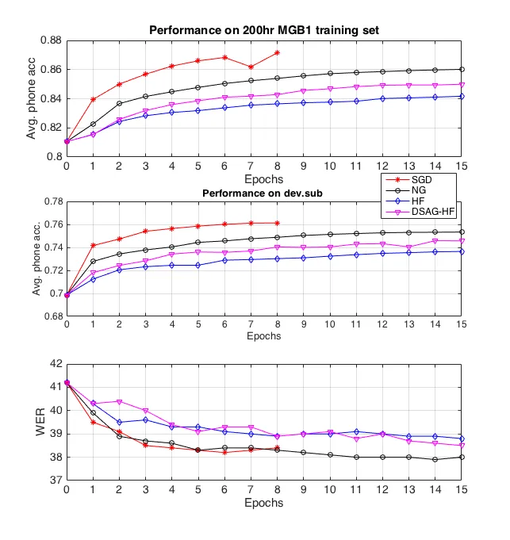

# Sequence Training of DNN Acoustic Models With Natural Gradient

Adnan Haider & Philip C. Woodland ^(†)^(†)thanks: Adnan Haider has been
funded by the IDB Cambridge International Scholarship and partly
supported by the EPSRC Programme Grant EP/I031022/1 (Natural Speech
Technology).

###### Abstract

Deep Neural Network (DNN) acoustic models often use discriminative
sequence training that optimises an objective function that better
approximates the word error rate (WER) than frame-based training.
Sequence training is normally implemented using Stochastic Gradient
Descent (SGD) or Hessian Free (HF) training. This paper proposes an
alternative batch style optimisation framework that employs a Natural
Gradient (NG) approach to traverse through the parameter space. By
correcting the gradient according to the local curvature of the
KL-divergence, the NG optimisation process converges more quickly than
HF. Furthermore, the proposed NG approach can be applied to any sequence
discriminative training criterion. The efficacy of the NG method is
shown using experiments on a Multi-Genre Broadcast (MGB) transcription
task that demonstrates both the computational efficiency and the
accuracy of the resulting DNN models.

###### Index Terms: 

Deep neural networks, sequence training, natural gradient, Hessian Free

^(†)^(†)address: Cambridge University Engineering Dept., Trumpington
St., Cambridge, CB2 1PZ U.K.  
Email: {mah90, pcw}@eng.cam.ac.uk

## 1 Introduction

With the advent of GPU computing and careful network initialisation
\[1\], a hybrid of Deep Neural Networks (DNNs) combined with Hidden
Markov models (HMMs) have been shown to outperform traditional Gaussian
Mixture Model (GMM) HMMs on a wide range of speech recognition tasks
\[2\]. DNNs, due to their deep and complex structure, are better
equipped to model the underlying nonlinear data manifold in contrast to
GMMs. However, the existence of such structures also creates complex
dependencies between the model parameters which can make such models
difficult to train with standard Stochastic Gradient Descent (SGD).

The task of finding the best procedure to train DNNs is an active area
of research that has been rendered more challenging by the availability
of ever larger datasets. It is therefore necessary to develop techniques
that lead to rapid convergence and are also stable in training. For
example, second order optimisation methods can help to alleviate the
problems of vanishing and exploding gradients by rescaling the gradient
direction to adjust for the high non-linearity and ill-conditioning of
the objective function. For convex optimisation problems \[3\], such
methods have been shown to improve the convergence of both batch and
stochastic methods. Martens \[4\] was one of the first researchers to
successfully apply second order methods to train DNNs. Instead of
rescaling the gradients with a ‘local’ curvature matrix directly, the
author advocated using a ‘Hessian-Free’ (HF) approach which generates an
approximate update by the iterative Conjugate Gradient (CG) algorithm.
Such a method has been shown to be effective for lattice-based
discriminative sequence training \[5\] when applied with large batch
sizes. When training on speech data, it is advantageous to randomly
select the frames in each mini-batch when using SGD training with the
frame-based Cross Entropy (CE) objective function. However, for
lattice-based discriminative sequence training, information from a
forward-backward pass through the complete lattice of individual
utterances is required to be calculated. Hence, data randomisation can
only be effectively performed at the utterance level. In this context,
\[6\] found that second order methods like HF that accumulate gradients
over large batches, perform better than utterance-based mini-batch SGD.

However, as an optimiser, the HF method is slow and suffers from
drawbacks. In a stochastic HF approach, where we employ only a single
batch to compute the gradient estimate, the optimisation process has
been seen to often converge to a sub-optimal solution. To address these
drawbacks, in \[7\], the authors proposed combining the HF optimiser
with the Stochastic Average Gradient (SAG), where at each iteration, the
CG algorithm is initialised with a weighted sum of the current and
previous gradient estimates. On a large amount of data, the proposed
modification was shown to improve both the speed and convergence of HF.
However, when faced with moderate sized training sets, we have found
that such an approach can suffer from over-fitting due to the mismatch
of training criteria between the DNN sequence discriminative objective
function and the true objective which is to reduce the Word Error Rate
(WER).

In this work, we propose an alternative optimisation framework for
sequence training that is more effective with large batch sizes than HF.
Instead of minimising a local second order model, it is shown that
substantial improvements in both training speed and convergence can
result from using CG to derive an approximation to the Natural Gradient
(NG) direction. In NG, the update direction chosen at each iteration is
the product of the inverse of the empirical Fisher Information (FI)
matrix with the gradient estimate. Essentially this amounts to
performing gradient descent on the space of densities
$`p_{\bm{\theta}}(\mathcal{H},\mathcal{O})`$, captured by different
parameterisations of $`\bm{\theta}`$. In Automatic Speech Recognition
(ASR), this approach has previously been applied for frame-based
classification under a different optimisation framework. In \[8\], the
authors assume a block diagonal structure for the FI matrix and computes
a stochastic estimate of the NG direction directly. In contrast, this
paper makes no such assumptions about the structure of the empirical FI
matrix and computes an approximation to the NG direction by running a
few iterations of CG. Unlike the framework described in \[8\], our
optimisation framework has the flexibility that it can be used to train
DNNs with respect to any sequence classification criterion.

This paper is organised as follows. Sec. 2 provides a brief review of
HMM-DNN systems in ASR. Sec. 3 introduces NG and provides a derivation
of the empirical FI matrix for use in sequence training. In Sec. 4, a
slight detour is taken to discuss 2nd order methods and discuss the
model that is minimised at each iteration. In Sec. 5, NG is formulated
for sequence training within the same framework as HF. Sec. 6 discusses
CG while in Sec. 7, it is shown how NG improves MBR training. The
experimental setup for ASR experiments on Multi Genre Broadcast (MGB)
data is presented in Sec. 8, results in Sec. 9, followed by conclusions.

## 2 Background

Large Vocabulary Continuous Speech Recognition (LVCSR) is an application
of sequence to sequence modelling, where given a continuous acoustic
waveform
$`\mathcal{O}^{r}=\{\bm{o}^{r}_{1},\bm{o}^{r}_{2}\cdots\bm{o}^{r}_{T}\}`$,
the objective is to generate its most likely word sequence,
$`\mathcal{H}=\{\bm{w}^{r}_{1},\bm{w}^{r}_{2}\cdots\bm{w}^{r}_{L}\}`$.
The problem can be essentially cast as a general problem of supervised
learning where given some seen examples
$`\{\mathcal{O}^{r},\mathcal{H}^{i}\}_{r=1}^{N}`$, the goal is to learn
the relationship between the input space $`\mathcal{X}`$ and the output
space $`\mathcal{Y}`$ from the training data. In parametric inference,
we model this relationship by a statistical model
$`P_{\bm{\theta}}(\mathcal{H}|\mathcal{O})`$. For speech processing and
a range of other sequential modelling tasks, this currently normally
corresponds to using HMMs \[9\] with output scaled likelihoods computed
using DNNs. HMMs belong to the class of generative discrete latent
variable graphical models that aim to model
$`P(\mathcal{H}|\mathcal{O})`$ by modelling the joint distribution
$`P(\mathcal{O},\mathcal{H})`$ instead. Using bayes theorem, the
posterior probabilities can then computed as
$`P(\mathcal{H}|\mathcal{O})=p(\mathcal{O},\mathcal{H})/{p(\mathcal{O})}`$.
Note that any of the quantities in this expression can be obtained by
either marginalising or conditioning with respect to the appropriate
variables in the joint distribution.

In ASR, the training of DNNs is normally conducted in two phases:
frame-based training followed by sequence training. The first phase
trains the DNN model parameters w.r.t the CE criterion, an objective
function that is particularly suited for frame-level classification. In
contrast, the second phase, employs a sequence discriminative criterion
to further train the model. Since ASR is a sequence to sequence
modelling task, having this pipeline has been found to achieve
reductions in the WER \[10\]. At present, for sequence discriminative
training, two popular classes of objective functions are used:

1.  1.  Maximum Mutual Information (MMI) \[11\] which maximises the mutual
        information between the word sequence and the information extracted
        by the recogniser from the given observation sequence.

    ```math
    \displaystyle F_{\rm{MMI}}(\bm{\theta})=\frac{1}{R}\sum_{r=1}^{R}\mbox{ log }P_{\bm{\theta}}(\mathcal{H}^{r}|\mathcal{O}^{r}) \tag{1}
    ```

    This also includes the popular ‘boosted’ variant \[12\] which is
    inspired by margin-based objective functions.

2.  2.  Minimum Bayes’ Risk (MBR) \[13\] corresponds to a family of methods
        which minimises the average expected loss computed over the
        hypothesis space for a given observation sequence when the posterior
        distribution $`P(\mathcal{H}|\mathcal{O})`$ is modelled by
        $`P_{\bm{\theta}}(\mathcal{H}|\mathcal{O})`$. This corresponds to
        the following objective function:

    ```math
    \displaystyle F_{\rm{MBR}}(\bm{\theta})=\frac{1}{R}\sum_{r=1}^{R}\sum_{\mathcal{H}^{\prime}},P_{\bm{\theta}}(\mathcal{H}^{\prime}|\mathcal{O}^{r})L(\mathcal{H}^{\prime},\mathcal{H}^{r}) \tag{2}
    ```

Here $`L(\mathcal{H}^{\prime},\mathcal{H}^{r})`$ denotes the mismatch
between the proposed hypothesis and the correct hypothesis. To assist
generalisation, this is often computed at a finer level of granularity
such as at the phone or ‘physical’ context-dependent state level. For
string sequences of arbitrary length, the Levenshtein distance \[14\] is
the usual metric of measuring the mismatch between them. However, the
cost of employing such a metric increases with the length of the
sequences. Due to this computational overhead, in practice, we annotate
arcs that we follow in the recognition trellis with a local loss. When
this local loss assignment is done at the phone level, this corresponds
to the Minimum Phone Error (MPE) objective function \[15\]¹¹ 1 In
practice, in MPE training, the objective function is actually maximised.
This is because instead of assigning a local loss to each phone arc
$`q`$, the local $`phoneAcc(q)`$ is used. However, by negating this
accuracy we can cast this method as an MBR risk function.. While, when
the loss assignment is done at the physical state level, this is the
state-level MBR (sMBR) objective function.

## 3 Natural Gradient

One particular approach for training DNNs that has recently experienced
renewed popularity is the method of NG\[16, 17, 18\]. This method was
first proposed by Amari \[19\], as an effective optimisation method for
training parametric density models. Instead of formulating gradient
descent in the Euclidean parameter space, we establish a geometry on the
space of density functions and perform steepest descent on that space.
Amari showed \[20\], that by inherently doing optimisation on the space
of density models, these models can be trained in a more effective way
than with standard gradient descent. This work extends its application
to the domain of sequence training. In this section, the geometry is
developed that is needed to traverse through the functional manifold of
distributions $`P_{\bm{\theta}}(\mathcal{H}|\mathcal{O})`$.

### 3.1 Fisher Information Matrix for sequence to sequence modelling

Let $`\mathcal{F}`$ be the family of densities
$`p_{\bm{\theta}}(\mathcal{H}|\mathcal{O})`$ that can be captured by
different parameterisations of $`\bm{\theta}`$. To formulate gradient
descent on the functional manifold $`\mathcal{F}`$, it is necessary to
quantify how the density $`p_{\bm{\theta}}(\mathcal{H}|\mathcal{O})`$
changes when one adds a small quantity $`\Delta\bm{\theta}`$ to
$`\bm{\theta}`$. For probability distributions, such changes in
behaviour can be captured by the KL-divergence,
$`{\rm KL}\left(p_{\bm{\theta}}(\mathcal{H}|\mathcal{O})\|p_{\bm{\theta}+\Delta\bm{\theta}}(\mathcal{H}|\mathcal{O})\right)`$.
The KL-divergence is a functional that maps the space of distributions
$`\mathcal{F}`$ to $`\mathbb{R}`$. Since each distribution itself is a
function of $`\bm{\theta}`$, the KL-divergence can also be expressed as
a smooth function of $`\bm{\theta}`$ through compositionality. Using a
Taylor approximation, within a convex neighbourhood of any given point
$`\bm{\theta}_{k}`$, its behaviour can be bounded as follows:

```math
\displaystyle{\rm KL}\left(p_{\bm{\theta}}(\mathcal{H}|\mathcal{O})\|p_{\bm{\theta}+\Delta\bm{\theta}}(\mathcal{H}|\mathcal{O})\right)
```

```math
\displaystyle\approx \displaystyle-\Delta\bm{\theta}^{T}E_{p_{\bm{\theta}}(\mathcal{H}|\mathcal{O})}\left[\nabla\mbox{ log }p_{\bm{\theta}}(\mathcal{H}|\mathcal{O})\right]
```

```math
\displaystyle-\frac{1}{2}\Delta\bm{\theta}^{T}E_{p_{\bm{\theta}}(\mathcal{H}|\mathcal{O})}\left[\nabla^{2}\mbox{ log }p_{\bm{\theta}}(\mathcal{H}|\mathcal{O})\right]\Delta\bm{\theta} \tag{3}
```

Using the fact that each candidate
$`p_{\bm{\theta}}(\mathcal{H}|\mathcal{O})`$ is a valid probability
distribution, it can be shown that the first term in the quadratic
approximation
$`E_{p_{\bm{\theta}}(\mathcal{H}|\mathcal{O})}\left[\nabla\mbox{ log }p_{\bm{\theta}}(\mathcal{H}|\mathcal{O})\right]`$
equates to zero. This allows the KL divergence to be locally
approximated by the bilinear form:

```math
\displaystyle{\rm KL}\left(p_{\bm{\theta}}(\mathcal{H}|\mathcal{O})\|p_{\bm{\theta}+\Delta\bm{\theta}}(\mathcal{H}|\mathcal{O})\right)
```

```math
\displaystyle\approx-\frac{1}{2}\Delta\bm{\theta}^{T}E_{p_{\bm{\theta}}(\mathcal{H}|\mathcal{O})}\left[\nabla^{2}\mbox{ log }p_{\bm{\theta}}(\mathcal{H}|\mathcal{O})\right]\Delta\bm{\theta} \tag{4}
```

For inference models $`P_{\bm{\theta}}(\mathcal{H}|\mathcal{O})`$, the
Fisher Information $`I_{\bm{\theta}}`$, for the random variable
$`\bm{\theta}`$ is the expected outer product of the likelihood score:

```math
\displaystyle I_{\bm{\theta}} \displaystyle=E_{p_{\bm{\theta}}(\mathcal{H}|\mathcal{O})}\left[\left(\nabla\mbox{ log }P_{\bm{\theta}}(\mathcal{H}|\mathcal{O})\right)\left(\nabla\mbox{ log }P_{\bm{\theta}}(\mathcal{H}|\mathcal{O})\right)^{T}\right] \tag{5}
```

In scenarios where (4) holds, $`I_{\bm{\theta}}`$ can be shown to be
equal to the negative of the expectation of the Hessian w.r.t the
distribution $`p_{\bm{\theta}}(\mathcal{H}|\mathcal{O})`$. Thus by
substituting (5) into (4), we can now locally approximate the KL
divergence by the inner product:

```math
\displaystyle{\rm KL}\left(p_{\bm{\theta}}(\mathcal{H}|\mathcal{O})\|p_{\bm{\theta}+\Delta\bm{\theta}}(\mathcal{H}|\mathcal{O})\right)\approx\frac{1}{2}\Delta\bm{\theta}^{T}I_{\bm{\theta}}\Delta\bm{\theta} \tag{6}
```

Instead of computing the expectation of (5) directly, in this work we
approximate $`I_{\bm{\theta}}`$ with the following Monte-Carlo estimate:

```math
\displaystyle\hat{I}_{\bm{\theta}}=\frac{1}{R}\sum_{r=1}^{R}\left[\left(\nabla\mbox{ log }P_{\bm{\theta}}(\mathcal{H}^{r}|\mathcal{O}^{r})\right)\left(\nabla\mbox{ log }P_{\bm{\theta}}(\mathcal{H}^{r}|\mathcal{O}^{r})\right)^{T}\right] \tag{7}
```

The matrix $`\hat{I}_{\bm{\theta}}`$ is the empirical FI matrix and
corresponds to the outer product of the Jacobian of the MMI criteria. By
assigning an inner product of the form $`\hat{I}_{\bm{\theta}}`$ which
is dependent $`\bm{\theta}`$, we have assigned a Riemann metric on the
functional manifold $`\mathcal{F}`$. Such a formulation now allows us to
define a notion of a local ‘distance’ measure in the space of joint
distributions $`p_{\bm{\theta}}(\mathcal{H}|\mathcal{O})`$.

## 4 Second order optimisation

Before proceeding to formulate NG for sequence training, a slight detour
is taken to discuss how methods like HF minimise a given objective
criterion. Assuming that the objective criterion $`F(\bm{\theta})`$ is
sufficiently smooth, for a given point $`\bm{\theta}_{k}`$ in the
parameter space, there exists an open convex neighbourhood where its
behaviour can be locally approximated as:

```math
\displaystyle F(\bm{\theta}_{k}+\Delta\bm{\theta})\approx F(\bm{\theta}_{k})+\nabla F(\bm{\theta}_{k})\Delta\bm{\theta}+\frac{1}{2}\Delta\bm{\theta}^{T}H\Delta\bm{\theta} \tag{8}
```

Instead of minimising $`F(\bm{\theta})`$, second order methods aim to
minimise this approximate quadratic at each iteration.

### 4.1 Approximating the Hessian with the Gauss-Newton matrix

Within the convex neighbourhood of $`\,thecbm{\theta}_{k}`$ritical point
$`\Delta\bm{\theta}=H^{-1}\nabla F(\bm{\theta}_{k})`$ corresponds to a
unique minimiser only when the Hessian $`H`$ is positive definite.
However, when we restrict our choice of predictive functions
$`\mathcal{F}`$ to DNN models, the optimisation problem is no longer
guaranteed to be convex. This means that within a convex neighbourhood
of $`\bm{\theta}_{k}`$, the Hessian associated with the 2nd order Taylor
model is no longer guaranteed to be positive definite. In such a
scenario, minimisation of (8) no longer guarantees a decrement in the
true objective function. To overcome this issue, the general practice is
to replace the 2nd order model with an approximate model in which the
Hessian is replaced by a positive definite matrix $`B`$.

```math
\displaystyle\hat{F}(\bm{\theta}_{k}+\Delta\bm{\theta})\approx F(\bm{\theta}_{k})+\nabla F(\bm{\theta}_{k})\Delta\bm{\theta}+\frac{1}{2}\Delta\bm{\theta}^{T}B\Delta\bm{\theta} \tag{9}
```

In the work by Sainath and Kingsbury \[6\], the authors have claimed to
achieve reductions in WER on large datasets when they employ a Gauss
Newton (GN) approximation of the Hessian matrix. For convex loss
functions defined on DNN output activations, this approximation always
yields a positive semi definite matrix. In neighbourhoods where the
neural network objective $`F(\bm{\theta})`$ can be locally modelled by
its first order approximation, it can be shown that the GN matrix
represents the Hessian exactly.

The GN matrix takes the form $`J_{t}^{T}\nabla^{2}L_{t}J_{t}`$ where
$`J_{t}`$ is the Jacobian of the linear output activations w.r.t
$`\bm{\theta}`$ and $`\nabla^{2}L_{t}`$ is the Hessian of the loss with
respect to the DNN linear output activations at time $`t`$. For MBR loss
functions, $`\nabla^{2}L_{t}`$ takes the following form:

```math
\displaystyle\nabla^{2}L_{t} \displaystyle=\frac{\kappa^{2}}{R}\left[\mbox{diag}(\hat{\bm{\gamma}}^{r}_{t})-\hat{\bm{\gamma}}^{r}_{t}(\bm{\gamma}^{r}_{t})^{T}\right] \tag{10}
```

with
$`\hat{\bm{\gamma}}^{r}_{t}=\bm{\gamma}^{r}_{t}\odot\bm{L}(\bm{s})`$.
Here,

- •
  $`\bm{L}(\bm{s})`$ is a vector whose $`i`$th entry corresponds to the
  difference between $`\check{L}(i)`$, the posterior weighted sum of the
  local losses computed over all the lattice paths that pass through
  arcs containing the state $`i`$, and $`c_{\rm{avg}}^{L}`$, the
  posterior weighted sum of the loss computed over all the lattice
  paths.
- •
  $`\bm{\gamma}^{r}_{t}`$ is a vector whose entries correspond to the
  posterior probability associated with the states (DNN output nodes) at
  time $`t`$ within the consolidated lattice.
- •
  $`\kappa`$ is the acoustic scaling factor. To assist generalisation,
  when propagating through the trellis, acoustic probabilities are often
  raised to a power less than unity to allow less likely sentences to
  become more important during discriminative sequence training.

In the next section, we show that we can formulate NG in a similar way
where at each iteration we minimise a function of the form of (9).

## 5 Formulating Natural Gradient for Sequence Training

Having established a notion of a local distance on the space of
discriminative distributions $`\mathcal{F}`$ yielded by a hybrid HMM-DNN
models, an algorithm is required that minimises a functional
$`L:p_{\bm{\theta}}(\mathcal{H}|\mathcal{O})\in\mathcal{F}\rightarrow\mathbb{R}`$.
In Sec. 2, it has been suggested that this can be achieved by either
using one of the MBR loss functions or the negation of the MMI
criterion. Each iteration of a typical iterative optimisation algorithm
computes an iterate $`p_{\bm{\theta}_{k+1}}(\mathcal{H}|\mathcal{O})`$
on the basis of information pertaining to the current iterate
$`p_{\bm{\theta}_{k}}(\mathcal{H}|\mathcal{O})`$. Since the Riemannian
geometry describes only the local behaviour around
$`p_{\bm{\theta}_{k}}(\mathcal{H}|\mathcal{O})`$, to generate a
candidate function, the following greedy strategy is formulated:

```math
\displaystyle\hat{p}_{\bm{\theta}_{k+1}}(\mathcal{H},\mathcal{O})=\arg\min_{p_{\bm{\theta}_{k+1}}\in\mathcal{F}}F(p_{\bm{\theta}_{k+1}}) \displaystyle\mbox{ s.t }{\rm KL}\left(p_{\bm{\theta}}\|p_{\bm{\theta}+\Delta\bm{\theta}}\right)\leq\epsilon_{k} \tag{11}
```

where we use $`F`$ to represent the chosen sequence classification
criterion.

Using (6) and (7), this can be reformulated as an optimisation problem
in the parameter space:

```math
\displaystyle\bm{\theta}_{k+1}=\arg\min_{\bm{\theta}}F(\bm{\theta})\mbox{ s.t }\frac{1}{2}(\bm{\theta}-\bm{\theta}_{k})^{T}\hat{I}_{\bm{\theta}_{k}}(\bm{\theta}-\bm{\theta}_{k})\leq\epsilon_{k} \tag{12}
```

In this work, the probing of the parameter space is restricted to within
a convex neighbourhood of $`\bm{\theta}_{k}`$ where a first order
approximation to $`F(\bm{\theta})`$ can be used:
$`F(\bm{\theta})\approx F(\bm{\theta}_{k})+\nabla F(\bm{\theta}_{k})^{T}\Delta\bm{\theta}`$.
In doing so, the optimisation problem can now be cast as a first order
minimisation problem with in a trust region. Since the minimum of the
first order approximation is at infinity, the optimisation dynamics will
always jump to the border of the trust region. Thus, at each iteration
the following constrained optimisation problem is solved:

```math
\displaystyle F(\bm{\theta}_{k}+\Delta\bm{\theta})\approx F(\bm{\theta}_{k})+\nabla F(\bm{\theta}_{k})\Delta\bm{\theta}+\frac{\lambda}{2}\Delta\bm{\theta}^{T}\hat{I}_{\bm{\theta}_{k}}\Delta\bm{\theta} \tag{13}
```

Hence it can be seen that under such a formulation, at each iteration of
NG, a function of the form of (9) is minimised.

## 6 Conjugate Gradient

Differentiating (9) and setting it to zero yields the Newton direction
$`\Delta\bm{\theta}=B^{-1}\nabla F(\bm{\theta})`$, where $`B`$ now
corresponds to either GN or $`\hat{I}_{\bm{\theta}_{k}}`$. However, the
Newton direction does not scale well with the dimension $`D`$ of the
optimisation problem. Computing this direction directly is expensive in
terms of both computation and storage as storing $`B`$ requires
$`\mathcal{O}(D^{2})`$ storage and inverting it incurs a cost of
$`\mathcal{O}(D^{3})`$. These obstacles however, can be overcome if we
employ inexact Newton methods. In particular, rather than computing the
Newton direction exactly through matrix factorisation techniques, we
solve the system $`B\Delta\bm{\theta}=\nabla F(\bm{\theta})`$ using the
iterative linear Conjugate Gradient(CG) algorithm \[21\]. When B
represents the GN matrix, such a method is called Hessian-Free.

Like many iterative linear system techniques, CG applied to (11) does
not require access to $`B`$ itself but only its vector products.
Pearlmutter \[22\] has shown that such matrix-vector products can be
computed efficiently through appropriate modifications of the forward
and backward pass. By iteratively solving the linear system, the CG
algorithm minimises the local quadratic of (9) by continuously improving
the search direction it initially starts with. In our implementation, CG
is initialised with an estimate of the gradient. It can be shown that if
this estimate is accurate then CG in its initial iterations will be able
to find updates that immediately improves upon this direction. This
proves to be quite an advantage, especially when there is hard limit of
the maximum number of allowed iterations.

Within this framework, using only a small number of CG iterations is
also desirable for computational reasons. Within each iteration of CG,
the computation of each matrix-vector product is as expensive as a
gradient evaluation. This means that as the size of the dataset
increases, the cost of running a single CG iteration also increases
linearly. To address this issue, in practice, a subsampled approximation
to the candidate $`B`$ is used when (9) is minimised. It was found that
this approach is actually quite reasonable, as the training iterations
were found to be more tolerant to noise in the $`B`$’s estimate than it
to the noise in the gradient estimate. Following Kingsbury’s approach
\[5\], our default recipe consists of sampling 1% of the training set to
do matrix-vector products for each run of CG. Effectively, by using such
a setup, an optimisation algorithm has been framed where the CG
iterations contribute only a small percentage of the total cost and the
gradient computations are inherently data parallel.

## 7 How Natural Gradient improves MBR training

In ASR, the true evaluation criteria is WER, a function which is not
differentiable. In MBR training, a differentiable loss function that is
a smoothed approximation of the WER is minimised (eg. MPE \[15\] or sMBR
\[13\] ). Since such loss functions are only approximations of the WER,
during training, over-fitting can also occur due to the mismatch in
training criterion. In this section, it is shown how rescaling the MBR
gradients with the inverse of the empirical FI matrix can ensure that
minimising an MBR criterion correlates well with achieving reductions in
the WER.

In Sec. 2, it was highlighted that to achieve better generalisation, the
mismatch between $`(\mathcal{H}^{\prime},\mathcal{H}^{r})`$ is often
computed at a finer level of granularity, such as at phone or ‘physical’
state level. The mismatch between string sequences of arbitrary length
is usually computed by the Levenshtein distance \[14\]. However, the
cost of employing such a metric increases with the length of the
sequences. Due to this computational overhead, in practice, arcs in the
recognition trellis are annotated with a local loss²² 2 In MPE training,
this is done at the level of a phone while in sMBR training, this is
done at the level of ‘physical’ states.. Then during training, a
weighted sum of these individual local losses is minimised, where the
weights correspond to the posterior probability of being on an
individual arc.

```math
\displaystyle F_{\rm{MBR}}(\bm{\theta}) \displaystyle=\sum_{r=1}^{R}\frac{1}{Z}\sum_{q}\alpha_{q}\beta_{q}L(q,q^{r}) \tag{14}
```

where

- •
  $`\alpha_{q}`$ represents the forward probability traversing through
  arc $`q`$ in the recognition lattice. This in turn can be un-rolled in
  a recursive fashion:

  $`\alpha_{q}=\sum_{r\mbox{ preceding }q}\alpha_{r}t_{rq}^{\kappa}p({O}^{r,q}|M_{q},\bm{\theta})^{\kappa}`$

  $`p(O^{r,q}|M_{q})`$ here represents the arc likelihood and
  $`O^{r,q}`$ corresponds to the frames observed between the start and
  end times of the arc $`q`$.

- •
  $`\beta_{q}`$ represents the backward probability of traversing from
  the arc $`q`$ to the end of the recognition trellis. Like the forward
  probability, this too can be recursively defined as:

  $`\beta_{q}=\sum_{s\mbox{ following }q}t_{qs}^{\kappa}p({O}^{r,s}|M_{s},\bm{\theta})^{\kappa}\beta_{s}`$

- •
  the partition function $`Z`$ represents the sum of joint probabilities
  of transversing through all paths through the lattice.

In a lattice-based framework, the individual local losses are initially
computed using a CE trained model and do not change during the course of
training. What does change are the weights we assign to them. For arcs
where $`L(q,q^{r})`$ is high, at each iteration, we adapt the model
parameters to decrease $`p({O}^{r,q}|M_{q},\bm{\theta})`$ which in (16)
can be seen to reduce the weights associated with these arcs. Under both
HF and NG, at each iteration, an update is generated by re-scaling the
gradient direction:

```math
\Delta\bm{\theta}=B^{-1}\nabla F_{\rm{MBR}}(\bm{\theta})
```

Since by definition $`B`$ is real and symmetric, under a change of
basis, the above expression reduces to:

```math
\displaystyle\Delta{\bm{\theta}}=\sum_{i}\frac{1}{\hat{\mu}_{i}}\left(\bm{v}_{i}^{T}\nabla F_{\rm{MBR}}\right)\bm{v}_{i} \tag{15}
```

Here the basis vectors $`\{\bm{v}_{i}\}_{i}`$ correspond to the eigen
vectors of the matrix. Under this formulation, it can be seen how the
choice of the matrix B impacts the steps taken by the optimiser in the
parameter space. In HF, the eigen values $`\hat{\mu}_{i}`$ encode the
curvature of the loss function w.r.t the DNN output activations. The HF
optimizer uses this information to rescale the steps it takes in each
eigen direction. However, since GN does not encode the curvature w.r.t
the model parameters (whose optimisation is the main objective), it is
not always guaranteed for such scalings to be always optimal.

In contrast, when $`B`$ corresponds to $`\lambda\hat{I}_{\bm{\theta}}`$,
the scaling factor is $`\hat{\mu_{i}}=\lambda\mu_{i}`$, where
$`\mu_{i}`$ is the respective eigenvalue associated with direction
$`\bm{v}_{i}`$. Under such rescaling, the optimisation process will now
move more cautiously along directions which have a significant impact on
$`P_{\bm{\theta}}(\mathcal{H}^{r}|\mathcal{O}^{r})`$ of each utterance
$`r`$. With respect to MBR training, this tries to ensure that the
probability $`p({O}^{r,q^{r}}|M_{q^{r}},\bm{\theta})`$ associated with
the reference arcs does not change while the model parameters are
adapted to reduce $`p({O}^{r,q}|M_{q},\bm{\theta})`$ of the hypotheses
arcs. The Lagrange multiplier $`\lambda`$ controls the leverage between
minimising the objective and enforcing this constraint. Through suitably
adjusting $`\lambda`$, the optimisation process will follow a path where
minimising the MBR criterion correlates well with achieving reductions
in WER.

## 8 Experimental Setup

The DNN training techniques were evaluated on data from the 2015
Multi-Genre Broadcast ASRU challenge task (MGB1) \[23\]. The full audio
data consists of seven weeks of BBC TV programmes covering a wide range
of genres, e.g. news, comedy, drama, sports, etc.. Systems were trained
using a 200hr training set and a smaller 50hr subset. The data were
collected by randomly sampling audio from 2,180 broadcast episodes. All
utterances collected had a phone matched error rate of $`<`$ 20% between
the sub-titles and the distributed MGB1 lightly supervised output. The
official dev.sub set was employed as a validation set and consists of
5.5 hours of audio data from across 12 episodes. A separate evaluation
set was used to estimate the generalisation performance of each
candidate model. For our experiments we took the remaining 35 shows from
the MGB1 dev.full and denote this set as dev.sub2 for evaluation
purposes. The segmentations used for all experiments were taken from the
reference transcriptions. Further details of the data preparation are in
\[24\].

All experiments were conducted using the HTK 3.5 toolkit \[25, 26\] with
supports DNN and HMM training including discriminative sequence
training. This work focuses on training hybrid DNN HMMs using
traditional fully-connected feed-forward layers. The input to the DNN
was produced by splicing together 40 dimensional log-Mel filter bank
(FBK) features extended with their delta coefficients across 9 frames to
give a 720 dimensional input per frame. These features were normalised
at the utterance level for mean and at the show-segment level for
variance \[24\]. The DNN used an architecture of 5 hidden layers each
with 1000 nodes with sigmoid activation functions. The output softmax
layer had context dependent phone targets formed by conventional
decision tree context dependent state tying. The output layer contained
4k/6k nodes for the 50h/200h training sets.

To make fair comparisons between different optimisation frameworks all
models were trained using lattice-based MPE training. Prior to sequence
training, the DNN model parameters were initialised using frame-level CE
training. To check the efficacy of each optimisation method, decoding
was performed on the validation set at intermediate stages of training
using the same weak pruned biased LM that we initially used to create
the initial MPE lattices. Having such a framework is advantageous as it
also allows us to investigate over-fitting due to training criterion
mismatch between the MPE criterion and the WER.

### 8.1 Training configuration for SGD

From initial experimental runs, it was found that the best learning rate
was $`1\times 10^{-4}`$. As an optimiser, SGD on its own can be fairly
unstable with network topologies where the gradient has to propagate
through many layers. To stabilise training, sequence training with SGD
was accompanied by layer dependent gradient clipping to prevent network
saturation and ensure smooth propagation of gradients during the
training process.

### 8.2 Training configuration for NG & HF-variants

From preliminary experiments it was found that using batch sizes of
roughly 25 hrs gave a good balance between the number of updates and
using good gradient estimate. When the number of CG iterations is
limited, initialising CG with a good estimate of the gradient is
desirable, as within a few iterations a good descent direction can be
found. However this comes at the cost of fewer HF/NG updates per epoch
as larger batch sizes are needed to reduce the variance associated with
the gradient estimates. In preliminary tests, it was found that
increasing the batch sizes beyond 25hrs yielded no significant
improvements. To make up the NG/HF minibatch, we followed Kingsbury’s
approach \[5\] and sampled only 1% of the training set.

## 9 Experiments

### 9.1 Experiments on 50hr MGB1 dataset

On the 50hr setup, we investigated the efficacy of the proposed
optimisation framework and compared to both SGD and HF. Table 1
summarises the results.

| method | \#epochs | \#updates              | phone acc. |         | WER     |
| ------ | -------- | ---------------------- | ---------- | ------- | ------- |
|        |          |                        | train      | dev.sub | dev.sub |
| CE     | N/A      | N/A                    | 0.7988     | 0.6549  | 45.2    |
| SGD    | 8        | 2.62 $`\times 10^{5}`$ | 0.8476     | 0.7044  | 42.0    |
| HF     | 40       | 80                     | 0.8461     | 0.6967  | 42.2    |
| NG     | 30       | 60                     | 0.8677     | 0.7089  | 41.6    |

Table 1: Sequence training and dev.sub MPE phone accuracy/WER for the
50hr training set. The WERs shown at the last column were computed using
the weak pruned biased LM used in MPE training.

It can be seen from Table 1 that of the sequence training approaches the
NG method produces the highest training and validation (dev.sub) MPE
phone accuracies and the lowest WER using the MPE small biased LM. The
NG approach replaces the ‘Hessian’ component of the HF optimiser with
the empirical FI (FI) matrix and this leads to both faster and improved
convergence which makes the proposed optimisation framework more
effective where only a relatively few updates are performed with large
batch sizes. The NG optimiser requires just 60 updates to both better
model the training data and improve the WER on the validation set³³ 3
These gains were found to be consistent when we re-ran training with
different sampling schemes.. In comparison to SGD baseline, both HF and
NG training were observed to be highly stable and did not require any
form of additional update clipping. This is attributed to the fact that
at each iteration, the direction explored is a modified gradient
estimate that has been appropriately rescaled using the local KL
curvature information.

While both the HF and NG optimisers use more training epochs than SGD,
each epoch has fewer updates and is somewhat more efficient in
constructing a geodesic in the parameter space. Furthermore since the
batch gradient computations are inherently data parallel, a batch style
optimisation framework such as HF/NG becomes time efficient in a
distributed setting where the gradient calculations can be easily
parallelised and still yield identical updates. The relative
contribution to the total computational cost by the CG iterations were
15% for HF and 18% NG⁴⁴ 4 The extra CG cost associated with NG is
attributed to doing more CG iterations. With HF, in our preliminary
runs, running CG beyond 5 iterations was not found to yield any
significant improvement in the quality of the updates. Since NG is
effectively a first order method, we found that in its case we needed to
do slightly more iterations at each run..

To investigate whether the WER reductions still hold with a with
stronger LMs, additional decoding passes on the dev.sub validation set
were run with 158k vocabulary bigram and trigram LMs used in \[24\]:

LM  SGD   HF   NG 158k Bigram 39.2 39.4 39.0 158k Trigram 32.8 33.0 32.6

Table 2: %WER differences between different optimisers on dev.sub with
158k vocabulary bigram/trigram LMs on dev.sub (50hr)

From Table 2, it can be seen that the same trends on dev.sub continue
with NG giving greater reductions in WER than models trained with either
SGD or HF.

### 9.2 Experiments on 200 hr MGB1 dataset

The experiments on the 200 hr training set were performed to ensure that
the sequence training techniques generalise to a somewhat larger
training set (and output layer size) and also to present more detailed
comparisons of how training proceeds. The use of the proposed NG method
was also compared to the Dynamic Stochastic Average Gradient HF variant
(DSAG-HF), presented in \[7\]. Table 3 provides a summary of the results
while Fig. 1 compares the performance at intermediate stages of
training.

| method  | \#epochs | \#updates              | phone acc. |         | WER     |
| ------- | -------- | ---------------------- | ---------- | ------- | ------- |
|         |          |                        | train      | dev.sub | dev.sub |
| CE      | N/A      | N/A                    | 0.8106     | 0.6986  | 41.2    |
| SGD     | 8        | 9.27 $`\times 10^{5}`$ | 0.8684     | 0.7601  | 38.2    |
| HF      | 15       | 120                    | 0.8417     | 0.7365  | 38.8    |
| DSAG-HF | 15       | 120                    | 0.8499     | 0.7456  | 38.5    |
| NG      | 15       | 120                    | 0.8601     | 0.7534  | 37.9    |

Table 3: Performance achieved with different optimisers on the 200 hr
setup.

Table 3 shows that as for the 50 hr case, sequence training produces
increases in MPE phone accuracy and reductions in validation set WER for
all optimisers. In this case a total of 8 epochs were performed with SGD
and 15 epochs (120 updates) with HF, DSAG-HF and NG. In DSAG-HF, the HF
optimiser is equipped with a ‘momentum’ component which essentially
contributes to initialising CG with a weighted sum of the current and
previous gradient directions. In Fig. 1, it can be observed that
although such a modification improves optimisation of the MPE criterion,
improvements achieved in the MPE criterion do not necessarily correlate
with the model’s ability to achieve lower WERs. In contrast, replacing
the GN with the empirical FI matrix leads to progressively better
updates at each epoch. In Fig. 1, the reductions in validation set WER
are very similar over the first 8 epochs between NG and SGD, but NG only
requires eight updates per epoch. Furthermore, through following a path
where the MPE training criterion remains a good approximation to the
WER, the NG method allows training to converge to a better solution than
either SGD or any of the HF variants.

|    LM        |   SGD |    HF | DSAG-HF |    NG |
| ------------ | ----- | ----- | ------- | ----- |
| 158k Bigram  | 35.0  | 35.3  | 35.2    | 34.7  |
| 158k Trigram | 29.3  | 29.3  | 29.2    | 29.0  |

Table 4: %WER differences between different optimisers on dev.sub with
158k vocabulary bigram/trigram LMs on dev.sub (200 hr).

The resulting DNN acoustic models were tested with stronger LMs as for
the 50hr setup setup and the results are shown in Table 4. It can be
seen again that the NG method results in lower WERs than SGD or the HF
variants.

|              |      |       |       |         |       |
| ------------ | ---- | ----- | ----- | ------- | ----- |
| LM           |   CE |   SGD |    HF | DSAG-HF |    NG |
| 158k Trigram | 33.1 | 30.8  | 31.0  | 30.8    | 30.5  |

Table 5: %WER differences between different optimisers on dev.sub2 with
158k trigram (200 hr)

Finally, these DNNs were tested on the dev.sub2 set as an evaluation set
that was not used for setting training hyper-parameters to ensure that
the trends observed above generalise. Table 5 shows the WER results
using the 158k trigram model and shows that again that the model trained
with NG achieves the largest reductions in the WER due to sequence
training. Furthermore these improvements have been fairly consistent
between the validation dev.sub and evaluation dev.sub2 test sets. On
average the NG method can be seen to provide approximately a 1% relative
reduction in WER over both the SGD baseline and the DSAG-HF variant.
While this improvement it fairly small, it is consistent and a
statistical significance test (sign test of the word error rates at the
episode level) showed that the improvement due to NG over each of the
other methods is highly statistically significant ($`p<0.001`$).



Figure 1: The evolution of the MPE phone accuracy criterion on the
training and validation (dev.sub) sets (top 2 graphs). Also (lower
graph) WER with MPE LM on dev.sub as training proceeds (200 hr).

## 10 Conclusions

This paper has described a discriminative sequence training method based
on the NG approach and has shown that it can improve the optimisation
performance of the discriminative sequence training objective functions
used in speech recognition systems. This novel technique provides the
same advantages as large batch HF methods in terms of stability and and
being inherently data parallel. However it converges more quickly and
finds better performing final models. It was evaluated using training
and test data from the MGB1 transcription task where it was shown that
as well as being effective in optimising the MPE objective function, it
tends to generalise better and leads to reduced WERs on independent test
data. Future work will involve extending the proposed framework to
sequence training of DNN architectures with recurrent topologies.

## References

- \[1\] Y. Bengio, P. Lamblin, D. Popovici & H. Larochelle, “Greedy
  Layer-Wise Training of Deep Networks,” Proc. Advances in Neural
  Information Processing Systems (NIPS), 2007, pp. 153–160.
- \[2\] G. Hinton, L. Deng, D. Yu, G. Dahl, A. Mohamed, N. Jaitly,
  A. Senior, V. Vanhoucke, P. Nguyen, T.N. Sainath & B Kingsbury, “Deep
  Neural Networks for Acoustic Modeling in Speech Recognition: The
  Shared Views of Four Research Groups,” IEEE Signal Processing
  Magazine, vol. 29, no. 6, pp. 82–97, 2012.
- \[3\] L. Bottou, F. Curtis & J. Nocedal, Optimization Methods for
  Large-Scale Machine Learning, arXiv preprint arXiv:1606.04838, 2016.
- \[4\] J. Martens, “Deep Learning via Hessian-free Optimization,” Proc.
  International Conference on Machine Learning (ICML), 2010.
- \[5\] B. Kingsbury, T.N. Sainath & H. Soltau, “Scalable Minimum Bayes
  Risk Training of Deep Neural Network Acoustic Models Using Distributed
  Hessian-free Optimization,” Proc. Interspeech, 2012.
- \[6\] T.N. Sainath, B. Kingsbury & H. Soltau, “Optimization Techniques
  to Improve Training Speed of Deep Neural Networks for Large Speech
  Tasks,” IEEE Trans. on Audio, Speech, and Language Processing, vol.
  21, no. 11, pp. 2267–2276, 2013.
- \[7\] P. Dognin & V. Goel, “Combining Stochastic Average Gradient and
  Hessian-free Optimization for Sequence Training of Deep Neural
  Networks,” Proc. IEEE Workshop on Automatic Speech Recognition and
  Understanding (ASRU), Dec. 2013, pp. 321–325.
- \[8\] D. Povey, X. Zhang & S. Khudanpur, Parallel Training of DNNs
  with Natural Gradient and Parameter Averaging, arXiv preprint
  arXiv:1410.7455, oct 2014.
- \[9\] M.J.F. Gales & S.J. Young, “The Application of Hidden Markov
  Models in Speech Recognition,” Foundations and Trends in Signal
  Processing., vol. 1, no. 3, pp. 195–304, 2008.
- \[10\] B. Kingsbury, “Lattice-based Optimization of Sequence
  Classification Criteria for Neural-Network Acoustic Modeling,” Proc.
  ICASSP, 2009.
- \[11\] P.C. Woodland & D. Povey, “Large Scale Discriminative Training
  of Hidden Markov Models for Speech Recognition,” Computer Speech and
  Language, vol. 16. pp. 25-47, 2002.
- \[12\] D. Povey, D. Kanevsky, B. Kingsbury & B. Ramabhadran, “Boosted
  MMI for Feature and Model Space Discriminative Training,” Proc.
  ICASSP, 2008.
- \[13\] M. Gibson & T. Hain, “Hypothesis Spaces for Minimum Bayes’ Risk
  Training in Large Vocabulary Speech Recognition,” Proc.
  Interspeech, 2006.
- \[14\] VI Levenshtein, “Binary Codes Capable of Correcting Deletions,
  Insertions, and Reversals,” Soviet Physics Doklady, vol. 10, no.
  8, 1966.
- \[15\] D. Povey & P.C. Woodland, “Minimum Phone Error and I-smoothing
  for Improved Discriminative Training,” Proc. ICASSP, 2002.
- \[16\] R. Pascanu &Y. Bengio, Revisiting Natural Gradient for Deep
  Networks, arXiv preprint arXiv:1301.3584, jan 2013.
- \[17\] G. Desjardins, K. Simonyan & R. Pascanu, “Natural Neural
  Networks,” Proc. Advances in Neural Information Processing Systems
  (NIPS), 2015.
- \[18\] J. Martens, New Insights and Perspectives on the Natural
  Gradient Method, arXiv preprint arXiv:1301.3584, Dec. 2014.
- \[19\] S. Amari, “Natural Gradient Works Efficiently in Learning,”
  Proc. Neural Information Processing Systems (NIPS), 1998.
- \[20\] S. Amari, “Neural learning in Structured Parameter
  Spaces–Natural Riemannian Gradient,” Proc. Advances in Neural
  Information Processing Systems (NIPS), 1997, pp. 127–133.
- \[21\] J.R. Shewchuk, “An Introduction to the Conjugate Gradient
  Method Without the Agonizing Pain,” 1994.
- \[22\] B.A. Pearlmutter, “Fast Exact Multiplication by the Hessian,”
  Proc. Neural Information Processing Systems (NIPS), 1994, pp. 147–160.
- \[23\] P. Bell, M. Gales, T. Hain, J Kilgour, P. Lanchantin, X Liu,
  A McParland, S. Renals, S. Saz, N Wester & P.C. Woodland, “The MGB
  Challenge: Evaluating Multi-Genre Broadcast Media Recognition,” Proc.
  IEEE Workshop on Automatic Speech Recognition and Understanding
  (ASRU), 2015.
- \[24\] P.C. Woodland, X. Lui, Y. Qian, C. Zhang, M.J.F. Gales,
  P. Karanasou, P. Lanchantin & L. Wang, “Cambridge University
  Transcription Systems for the Multi-Genre Broadcast Challenge,” Proc.
  IEEE Workshop on Automatic Speech Recognition and Understanding
  (ASRU), , 2015.
- \[25\] C. Zhang & P.C. Woodland, “A General Artificial Neural Network
  Extension for HTK,” Proc. Interspeech, 2015.
- \[26\] S.J. Young, G. Evermann, M.J.F. Gales, T. Hain, D. Kershaw,
  X. Liu, G. Moore, J.J. Odell, J. Ollason, D. Povey, A. Ragni,
  V. Valtchev, P.C. Woodland & C. Zhang, The HTK Book (for HTK 3.5),
  Cambridge University Engineering Department, 2015.
