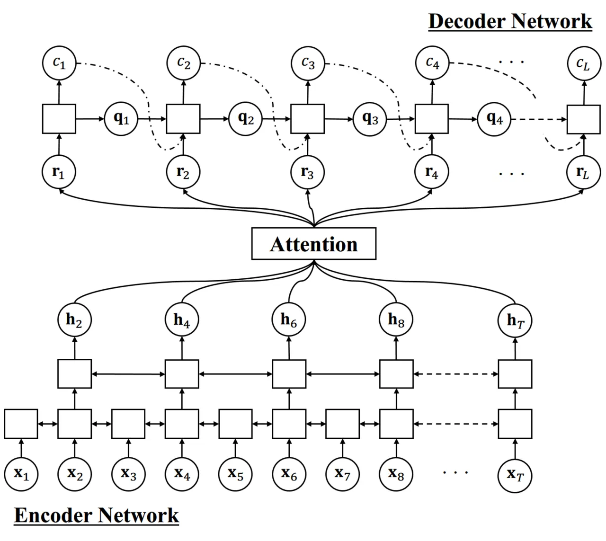
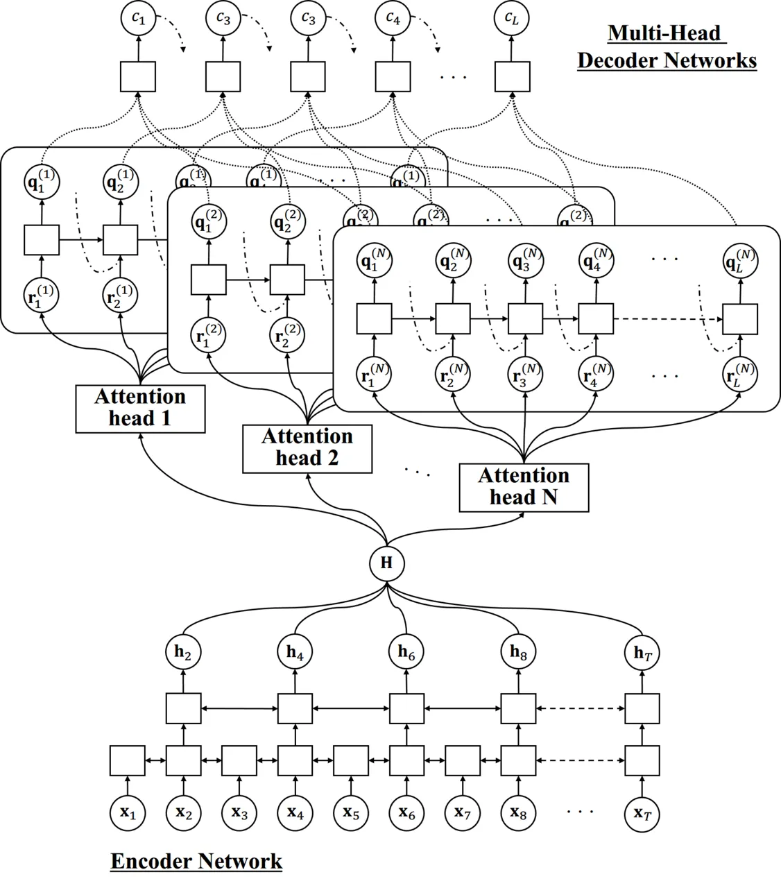
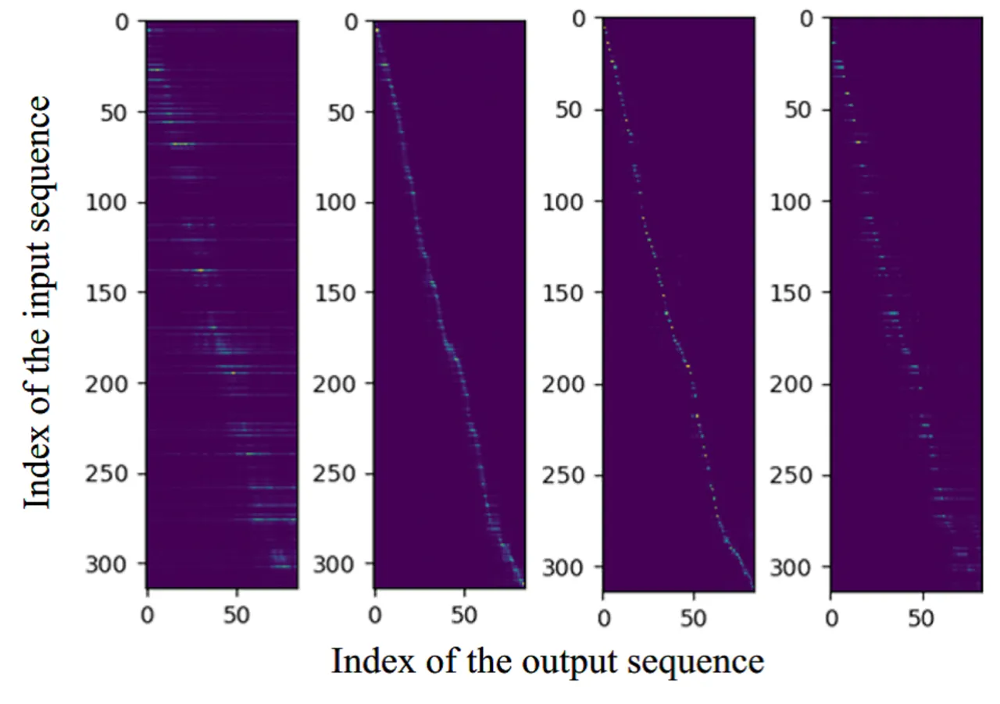

# Multi-Head Decoder for End-to-End Speech Recognition

###### Abstract

This paper presents a new network architecture called multi-head decoder
for end-to-end speech recognition as an extension of a multi-head
attention model. In the multi-head attention model, multiple attentions
are calculated, and then, they are integrated into a single attention.
On the other hand, instead of the integration in the attention level,
our proposed method uses multiple decoders for each attention and
integrates their outputs to generate a final output. Furthermore, in
order to make each head to capture the different modalities, different
attention functions are used for each head, leading to the improvement
of the recognition performance with an ensemble effect. To evaluate the
effectiveness of our proposed method, we conduct an experimental
evaluation using Corpus of Spontaneous Japanese. Experimental results
demonstrate that our proposed method outperforms the conventional
methods such as location-based and multi-head attention models, and that
it can capture different speech/linguistic contexts within the
attention-based encoder-decoder framework.

Tomoki Hayashi¹, Shinji Watanabe², Tomoki Toda¹, Kazuya Takeda¹

¹Nagoya University, ²Johns Hopkins University

hayashi.tomoki@g.sp.m.is.nagoya-u.ac.jp, shinjiw@jhu.edu,  
tomoki@icts.nagoya-u.ac.jp, kazuya.takeda@nagoya-u.ac.jp

Index Terms: speech recognition, end-to-end, attention, dynamical neural
network

## 1 Introduction

Automatic speech recognition (ASR) is the task to convert a continuous
speech signal into a sequence of discrete characters, and it is a key
technology to realize the interaction between human and machine. ASR has
a great potential for various applications such as voice search and
voice input, making our lives more rich. Typical ASR systems \[1\]
consist of many modules such as an acoustic model, a lexicon model, and
a language model. Factorizing the ASR system into these modules makes it
possible to deal with each module as a separate problem. Over the past
decades, this factorization has been the basis of the ASR system,
however, it makes the system much more complex.

With the improvement of deep learning techniques, end-to-end approaches
have been proposed \[2\]. In the end-to-end approach, a continuous
acoustic signal or a sequence of acoustic features is directly converted
into a sequence of characters with a single neural network. Therefore,
the end-to-end approach does not require the factorization into several
modules, as described above, making it easy to optimize the whole
system. Furthermore, it does not require lexicon information, which is
handcrafted by human experts in general.

The end-to-end approach is classified into two types. One approach is
based on connectionist temporal classification (CTC) \[3, 4, 2\], which
makes it possible to handle the difference in the length of input and
output sequences with dynamic programming. The CTC-based approach can
efficiently solve the sequential problem, however, CTC uses Markov
assumptions to perform dynamic programming and predicts output symbols
such as characters or phonemes for each frame independently.
Consequently, except in the case of huge training data \[5, 6\], it
requires the language model and graph-based decoding \[7\].

The other approach utilizes attention-based method \[8\]. In this
approach, encoder-decoder architecture \[9, 10\] is used to perform a
direct mapping from a sequence of input features into text. The encoder
network converts the sequence of input features to that of
discriminative hidden states, and the decoder network uses attention
mechanism to get an alignment between each element of the output
sequence and the encoder hidden states. And then it estimates the output
symbol using weighted averaged hidden states, which is based on the
alignment, as the inputs of the decoder network. Compared with the
CTC-based approach, the attention-based method does not require any
conditional independence assumptions including the Markov assumption,
language models, and complex decoding. However, non-causal alignment
problem is caused by a too flexible alignment of the attention
mechanism \[11\]. To address this issue, the study \[11\] combines the
objective function of the attention-based model with that of CTC to
constrain flexible alignments of the attention. Another study \[12\]
uses a multi-head attention (MHA) to get more suitable alignments. In
MHA, multiple attentions are calculated, and then, they are integrated
into a single attention. Using MHA enables the model to jointly focus on
information from different representation subspaces at different
positions \[13\], leading to the improvement of the recognition
performance.

Inspired by the idea of MHA, in this study we present a new network
architecture called multi-head decoder for end-to-end speech recognition
as an extension of a multi-head attention model. Instead of the
integration in the attention level, our proposed method uses multiple
decoders for each attention and integrates their outputs to generate a
final output. Furthermore, in order to make each head to capture the
different modalities, different attention functions are used for each
head, leading to the improvement of the recognition performance with an
ensemble effect. To evaluate the effectiveness of our proposed method,
we conduct an experimental evaluation using Corpus of Spontaneous
Japanese. Experimental results demonstrate that our proposed method
outperforms the conventional methods such as location-based and
multi-head attention models, and that it can capture different
speech/linguistic contexts within the attention-based encoder-decoder
framework.

## 2 Attention-Based End-to-End ASR

The overview of attention-based network architecture is shown in Fig. 1.



Figure 1: Overview of attention-based network architecture.

The attention-based method directly estimates a posterior
$`p(\mathbf{C}|\mathbf{X})`$, where
$`\mathbf{X}=\{\mathbf{x}_{1},\mathbf{x}_{2},\dots,\mathbf{x}_{T}\}`$
represents a sequence of input features,
$`\mathbf{C}=\{c_{1},c_{2},\dots,c_{L}\}`$ represents a sequence of
output characters. The posterior $`p(\mathbf{C}|\mathbf{X})`$ is
factorized with a probabilistic chain rule as follows:

```math
p(\mathbf{C}|\mathbf{X})=\displaystyle\prod_{l=1}^{L}p(c_{l}|c_{1:l-1},\mathbf{X}), \tag{1}
```

where $`c_{1:l-1}`$ represents a subsequence
$`\{c_{1},c_{2},\dots\,c_{l-1}\}`$, and
$`p(c_{l}|c_{1:l-1},\mathbf{X})`$ is calculated as follows:

```math
\displaystyle\mathbf{h}_{t}=\mathrm{Encoder}(\mathbf{X}),\vskip-8.53581pt \tag{2}
```

```math
\displaystyle a_{lt}=\begin{cases}&\mathrm{DotProductAttention}(\mathbf{q}_{l-1},\mathbf{h}_{t}),\\
&\mathrm{AdditiveAttention}(\mathbf{q}_{l-1},\mathbf{h}_{t}),\\
&\mathrm{LocationAttention}(\mathbf{q}_{l-1},\mathbf{h}_{t},\mathbf{a}_{l-1}),\\
&\mathrm{CoverageAttention}(\mathbf{q}_{l-1},\mathbf{h}_{t},\mathbf{a}_{1:l-1}),\\
\end{cases}\vskip-8.53581pt \tag{3}
```

```math
\displaystyle\mathbf{r}_{l}=\displaystyle\sum_{t=1}^{T}a_{lt}\mathbf{h}_{t}, \tag{4}
```

```math
\displaystyle p(c_{l}|c_{1:l-1},\mathbf{X})=\mathrm{Decoder}(\mathbf{r}_{l},\mathbf{q}_{l-1},c_{l-1}), \tag{5}
```

where Eq. (2) and Eq. (5) represent encoder and decoder networks,
respectively, $`a_{lt}`$ represents an attention weight,
$`\mathbf{a}_{l}`$ represents an attention weight vector, which is a
sequence of attention weights $`\{a_{l0},a_{l1},\dots,a_{lT}\}`$,
$`\mathbf{a}_{1:l-1}`$ represents a subsequence of attention vectors
$`\{\mathbf{a}_{1},\mathbf{a}_{2},\dots,\mathbf{a}_{l-1}\}`$,
$`\mathbf{h}_{t}`$ and $`\mathbf{q}_{l}`$ represent hidden states of
encoder and decoder networks, respectively, and $`\mathbf{r}_{l}`$
represents the letter-wise hidden vector, which is a weighted
summarization of hidden vectors with the attention weight vector
$`\mathbf{a}_{l}`$.

The encoder network in Eq. (2) converts a sequence of input features
$`\mathbf{X}`$ into frame-wise discriminative hidden states
$`\mathbf{h}_{t}`$, and it is typically modeled by a bidirectional long
short-term memory recurrent neural network (BLSTM):

```math
\mathrm{Encoder}(\mathbf{X})=\mathrm{BLSTM}(\mathbf{X}). \tag{6}
```

In the case of ASR, the length of the input sequence is significantly
different from the length of the output sequence. Hence, basically
outputs of BLSTM are often subsampled to reduce the computational
cost \[8, 14\].

The attention weight $`a_{lt}`$ in Eq. (3) represents a soft alignment
between each element of the output sequence $`c_{l}`$ and the encoder
hidden states $`\mathbf{h}_{t}`$.

- •
  $`\mathrm{DotProductAttention}(\cdot)`$ in Eq. (3), which is the most
  simplest attention \[15\], is calculated as follows:

  ```math
  \displaystyle e_{lt}=\mathbf{q}_{l-1}^{\mathrm{T}}\mathbf{W}_{a}\mathbf{h}_{t}, \tag{7}
  ```

  ```math
  \displaystyle\mathbf{a}_{l}=\mathrm{Softmax}(\mathbf{e}_{l}), \tag{8}
  ```

  where $`\mathbf{W}_{a}`$ represents trainable matrix parameters, and
  $`\mathbf{e}_{l}`$ represent a sequence of energies
  $`\{e_{l1},e_{l2},\dots,e_{lT}\}`$

- •
  $`\mathrm{AdditiveAttention}(\cdot)`$ in Eq. (3) is additive
  attention \[16\], and the calculation of the energy in Eq. (7) is
  replaced with following equation:

  ```math
  e_{lt}=\mathbf{g}^{\mathrm{T}}\tanh(\mathbf{W}_{q}\mathbf{q}_{l-1}+\mathbf{W}_{h}\mathbf{h}_{t}+\mathbf{b}), \tag{9}
  ```

  where $`\mathbf{W}_{*}`$ represents trainable matrix parameters,
  $`\mathbf{g}`$ and $`\mathbf{b}`$ represent trainable vector
  parameters.

- •
  $`\mathrm{LocationAttention}(\cdot)`$ in Eq. (3) is location-based
  attention \[8\], and the calculation of the energy in Eq. (7) is
  replaced with following equations:

  ```math
  \mathbf{F}_{l}=\mathbf{K}*\mathbf{a}_{l-1}, \tag{10}
  ```

  ```math
  e_{lt}=\mathbf{g}^{\mathrm{T}}\tanh(\mathbf{W}_{q}\mathbf{q}_{l-1}+\mathbf{W}_{h}\mathbf{h}_{t}+\mathbf{W}_{f}\mathbf{f}_{lt}+\mathbf{b}),\vskip 5.69054pt \tag{11}
  ```

  where $`\mathbf{F}_{l}`$ consists of the vectors
  $`\{\mathbf{f}_{l1},\mathbf{f\hskip 2.84526pt}_{l2},\dots,\mathbf{f}_{lT}\}`$,
  and $`\mathbf{K}`$ represents trainable one-dimensional convolution
  filters.

- •
  $`\mathrm{CoverageAttention}(\cdot)`$ in Eq. (3) is coverage
  mechanism \[17\], and the calculation of the energy in Eq. (7) is
  replaced with following equations:

  ```math
  \mathbf{v}_{l}=\displaystyle\sum_{l^{\prime}=1}^{l-1}\mathbf{a}_{l^{\prime}}, \tag{12}
  ```

  ```math
  e_{lt}=\mathbf{g}^{\mathrm{T}}\tanh(\mathbf{W}_{q}\mathbf{q}_{l-1}+\mathbf{W}_{h}\mathbf{h}_{t}+\mathbf{w}_{v}v_{lt}+\mathbf{b}),\vskip 5.69054pt \tag{13}
  ```

  where $`\mathbf{w}`$ represents trainable vector parameters.

The decoder network in Eq. (5) estimates the next character $`c_{l}`$
from the previous character $`c_{l-1}`$, hidden state vector of itself
$`\mathbf{q}_{l-1}`$ and the letter-wise hidden state vector
$`\mathbf{r}_{l}`$, similar to RNN language model (RNNLM) \[18\]. It is
typically modeled using LSTM as follows:

```math
\displaystyle\mathbf{q}_{l}=\mathrm{LSTM}(c_{l-1},\mathbf{q}_{l-1},\mathbf{r}_{l}), \tag{14}
```

```math
\displaystyle\mathrm{Decoder}(\cdot)=\mathrm{Softmax}(\mathbf{W}\mathbf{q}_{l}+\mathbf{b}), \tag{15}
```

where $`\mathbf{W}`$ and $`\mathbf{b}`$ represent trainable matrix and
vector parameters, respectively.

Finally, the whole of above networks are optimized using
back-propagation through time (BPTT) \[19\] to minimize the following
objective function:

```math
\begin{split}\mathcal{L}&=-\log p(\mathbf{C}|\mathbf{X})\\
&=-\log\left(\sum_{l=1}^{L}p(c_{l}|c_{1:l-1}^{*},\mathbf{X})\right),\end{split} \tag{16}
```

where $`c_{1:l-1}^{*}=\{c_{1}^{*},c_{2}^{*},\dots,c_{l-1}^{*}\}`$
represents the ground truth of the previous characters.

## 3 Multi-Head Decoder



Figure 2: Overview of multi-head decoder architecture.

The overview of our proposed multi-head decoder (MHD) architecture is
shown in Fig. 2. In MHD architecture, multiple attentions are calculated
with the same manner in the conventional multi-head attention
(MHA) \[13\]. We first describe the conventional MHA, and extend it to
our proposed multi-head decoder (MHD).

### 3.1 Multi-head attention (MHA)

The layer-wise hidden vector at the head $`n`$ is calculated as follows:

```math
\displaystyle a_{lt}^{(n)}=\mathrm{Attention}(\mathbf{W}_{Q}^{(n)}\mathbf{q}_{l-1},\mathbf{W}_{K}^{(n)}\mathbf{h}_{t},\dots), \tag{17}
```

```math
\displaystyle\mathbf{r}_{l}^{(n)}=\displaystyle\sum_{t=1}^{T}a_{lt}^{(n)}\mathbf{W}_{V}^{(n)}\mathbf{h}_{t}, \tag{18}
```

where $`\mathbf{W}_{Q}^{(n)}`$, $`\mathbf{W}_{K}^{(n)}`$, and
$`\mathbf{W}_{V}^{(n)}`$ represent trainable matrix parameters, and any
types of attention in Eq. (3) can be used for
$`\mathrm{Attention}(\cdot)`$ in Eq. (17).

In the case of MHA, the layer-wise hidden vectors of each head are
integrated into a single vector with a trainable linear transformation:

```math
\mathbf{r}_{l}=\mathbf{W}_{O}\left[{\mathbf{r}^{(1)}_{l}}^{\top},{\mathbf{r}^{(2)}_{l}}^{\top},\dots,{\mathbf{r}^{(N)}_{l}}^{\top}\right]^{\top}, \tag{19}
```

where $`\mathbf{W}_{O}`$ is a trainable matrix parameter, $`N`$
represents the number of heads.

### 3.2 Multi-head decoder (MHD)

On the other hand, in the case of MHD, instead of the integration at
attention level, we assign multiple decoders for each head and then
integrate their outputs to get a final output. Since each attention
decoder captures different modalities, it is expected to improve the
recognition performance with an ensemble effect. The calculation of the
attention weight at the head $`n`$ in Eq. (17) is replaced with
following equation:

```math
a_{lt}^{(n)}=\mathrm{Attention}(\mathbf{W}_{Q}^{(n)}\mathbf{q}^{(n)}_{l-1},\mathbf{W}_{K}^{(n)}\mathbf{h}_{t},\dots). \tag{20}
```

Instead of the integration of the letter-wise hidden vectors
$`\{\mathbf{r}_{l}^{(1)},\mathbf{r}_{l}^{(2)},\dots,\mathbf{r}_{l}^{(N)}\}`$
with linear transformation, each letter-wise hidden vector
$`\mathbf{r}_{l}^{(n)}`$ is fed to $`n`$-th decoder LSTM:

```math
\mathbf{q}_{l}^{(n)}=\mathrm{LSTM}^{(n)}(c_{l-1},\mathbf{q}_{l-1}^{(n)},\mathbf{r}_{l}^{(n)}). \tag{21}
```

Note that each LSTM has its own hidden state $`\mathbf{q}_{l}^{(n)}`$
which is used for the calculation of the attention weight
$`a_{lt}^{(n)}`$, while the input character $`c_{l}`$ is the same among
all of the LSTMs. Finally, all of the outputs are integrated as follows:

```math
\displaystyle p(c_{l}|c_{1:l-1},\mathbf{X})=\mathrm{Softmax}\left(\displaystyle\sum_{n=1}^{N}\mathbf{W}^{(n)}\mathbf{q}_{l}^{(n)}+\mathbf{b}\right), \tag{22}
```

where $`\mathbf{W}^{(n)}`$ represents a trainable matrix parameter, and
$`\mathbf{b}`$ represents a trainable vector parameter.

### 3.3 Heterogeneous multi-head decoder (HMHD)

As a further extension, we propose heterogeneous multi-head decoder
(HMHD). Original MHA methods \[13, 12\] use the same attention function
such as dot-product or additive attention for each head. On the other
hand, HMHD uses different attention functions for each head. We expect
that this extension enables to capture the further different context in
speech within the attention-based encoder-decoder framework.

## 4 Experimental Evaluation

|                                  |                                |
| -------------------------------- | ------------------------------ |
| \# training                      | 445,068 utterances (581 hours) |
| \# evaluation (task 1)           | 1,288 utterances (1.9 hours)   |
| \# evaluation (task 2)           | 1,305 utterances (2.0 hours)   |
| \# evaluation (task 3)           | 1,389 utterances (1.3 hours)   |
| Sampling rate                    | 16,000 Hz                      |
| Window size                      | 25 ms                          |
| Shift size                       | 10 ms                          |
| Encoder type                     | BLSTMP                         |
| \# encoder layers                | 6                              |
| \# encoder units                 | 320                            |
| \# projection units              | 320                            |
| Decoder type                     | LSTM                           |
| \# decoder layers                | 1                              |
| \# decoder units                 | 320                            |
| \# heads in MHA                  | 4                              |
| \# filter in location att.       | 10                             |
| Filter size in location att.     | 100                            |
| Learning rate                    | 1.0                            |
| Initialization                   | Uniform $`[-0.1,0.1]`$         |
| Gradient clipping norm           | 5                              |
| Batch size                       | 30                             |
| Maximum epoch                    | 15                             |
| Optimization method              | AdaDelta \[20\]                |
| AdaDelta $`\rho`$                | 0.95                           |
| AdaDelta $`\epsilon`$            | $`10^{-8}`$                    |
| AdaDelta $`\epsilon`$ decay rate | $`10^{-2}`$                    |
| Beam size                        | 20                             |
| Maximum length                   | 0.5                            |
| Minimum length                   | 0.1                            |

Table 1: Experimental conditions.

To evaluate the performance of our proposed method, we conducted
experimental evaluation using Corpus of Spontaneous Japanese
(CSJ) \[21\], including 581 hours of training data, and three types of
evaluation data. To compare the performance, we used following dot,
additive, location, and three variants of multi-head attention methods:

- •
  Dot-product attention-based model (Dot),
- •
  Additive attention-based model (Add),
- •
  Location-aware attention-based model (Loc),
- •
  Multi-head dot-product attention model (MHA-Dot),
- •
  Multi-head additive attention model (MHA-Add),
- •
  Multi-head location attention model (MHA-Loc).

We used the input feature vector consisting of 80 dimensional log Mel
filter bank and three dimensional pitch feature, which is extracted
using open-source speech recognition toolkit Kaldi \[22\]. Encoder and
decoder networks were six-layered BLSTM with projection layer \[23\]
(BLSTMP) and one-layered LSTM, respectively. In the second and third
bottom layers in the encoder, subsampling was performed to reduce the
length of utterance, yielding the length $`T/4`$. For MHA/MHD, we set
the number of heads to four. For HMHD, we used two kind of settings: (1)
dot-product attention + additive attention + location-based attention +
coverage mechanism attention (Dot+Add+Loc+Cov), and (2) two
location-based attentions + two coverage mechanism attentions
(2$`\times`$Loc+2$`\times`$Cov). The number of distinct output
characters was 3,315 including Kanji, Hiragana, Katakana, alphabets,
Arabic number and sos/eos symbols. In decoding, we used beam search
algorithm \[10\] with beam size 20. We manually set maximum and minimum
lengths of the output sequence to 0.1 and 0.5 times the length of the
subsampled input sequence, respectively, and the length penalty to 0.1
times the length of the output sequence. All of the networks were
trained using end-to-end speech processing toolkit ESPnet \[24\] with a
single GPU (Titan X pascal). Character error rate (CER) was used as a
metric. The detail of experimental condition is shown in Table 1.

Experimental results are shown in Table 2.

|                                      |           |        |        |
| ------------------------------------ | --------- | ------ | ------ |
|                                      | CER \[%\] |        |        |
|                                      | Task 1    | Task 2 | Task 3 |
| Dot                                  | 12.7      | 9.8    | 10.7   |
| Add                                  | 11.1      | 8.4    | 9.0    |
| Loc                                  | 11.7      | 8.8    | 10.2   |
| MHA-Dot                              | 11.6      | 8.5    | 9.3    |
| MHA-Add                              | 10.7      | 8.2    | 9.1    |
| MHA-Loc                              | 11.5      | 8.6    | 9.0    |
| MHD-Loc                              | 11.0      | 8.4    | 9.5    |
| HMHD (Dot+Add+Loc+Cov)               | 11.0      | 8.3    | 9.0    |
| HMHD (2$`\times`$Loc+2$`\times`$Cov) | 10.4      | 7.7    | 8.9    |

Table 2: Experimental results.

First, we focus on the results of the conventional methods. Basically,
it is known that location-based attention yields better performance than
additive attention \[11\]. However, in the case of Japanese sentence,
its length is much shorter than that of English sentence, which makes
the use of location-based attention less effective. In most of the
cases, the use of MHA brings the improvement of the recognition
performance. Next, we focus on the effectiveness of our proposed MHD
architecture. By comparing with the MHA-Loc, MHD-Loc (proposed method)
improved the performance in Tasks 1 and 2, while we observed the
degradation in Task 3. However, the heterogeneous extension (HMHD), as
introduced in Section 3.3, brings the further improvement for the
performance of MHD, achieving the best performance among all of the
methods for all test sets.

Finally, Figure 3 shows the alignment information of each head of HMHD
(2$`\times`$Loc+2$`\times`$Cov), which was obtained by visualizing the
attention weights.



Figure 3: Attention weights of each head. Two left figures represent the
attention weights of the location-based attention, and the remaining
figures represent that of the coverage mechanism attention.

Interestingly, the alignments of the right and left ends seem to capture
more abstracted dynamics of speech, while the rest of two alignments
behave like normal alignments obtained by a standard attention
mechanism. Thus, we can see that the attention weights of each head have
a different tendency, and it supports our hypothesis that HMHD can
capture different speech/linguistic contexts within its framework.

## 5 Conclusions

In this paper, we proposed a new network architecture called multi-head
decoder for end-to-end speech recognition as an extension of a
multi-head attention model. Instead of the integration in the attention
level, our proposed method utilized multiple decoders for each attention
and integrated their outputs to generate a final output. Furthermore, in
order to make each head to capture the different modalities, we used
different attention functions for each head. To evaluate the
effectiveness of our proposed method, we conducted an experimental
evaluation using Corpus of Spontaneous Japanese. Experimental results
demonstrated that our proposed methods outperformed the conventional
methods such as location-based and multi-head attention models, and that
it could capture different speech/linguistic contexts within the
attention-based encoder-decoder framework.

In the future work, we will combine the multi-head decoder architecture
with Joint CTC/Attention architecture \[11\], and evaluate the
performance using other databases.

## References

- \[1\] F. Jelinek, “Continuous speech recognition by statistical
  methods,” _Proceedings of the IEEE_, vol. 64, no. 4, pp.
  532–556, 1976.
- \[2\] J. Chorowski, D. Bahdanau, K. Cho, and Y. Bengio, “End-to-end
  continuous speech recognition using attention-based recurrent nn:
  First results,” _arXiv preprint arXiv:1412.1602_, 2014.
- \[3\] A. Graves, S. Fernández, F. Gomez, and J. Schmidhuber,
  “Connectionist temporal classification: labelling unsegmented sequence
  data with recurrent neural networks,” in _Proceedings of the 23rd
  international conference on Machine learning_. ACM, 2006, pp. 369–376.
- \[4\] A. Graves and N. Jaitly, “Towards end-to-end speech recognition
  with recurrent neural networks,” in _International Conference on
  Machine Learning_, 2014, pp. 1764–1772.
- \[5\] D. Amodei, S. Ananthanarayanan, R. Anubhai, J. Bai,
  E. Battenberg, C. Case, J. Casper, B. Catanzaro, Q. Cheng, G. Chen
  _et al._, “Deep speech 2: End-to-end speech recognition in english and
  mandarin,” in _International Conference on Machine Learning_, 2016,
  pp. 173–182.
- \[6\] H. Soltau, H. Liao, and H. Sak, “Neural speech recognizer:
  Acoustic-to-word lstm model for large vocabulary speech recognition,”
  _arXiv preprint arXiv:1610.09975_, 2016.
- \[7\] Y. Miao, M. Gowayyed, and F. Metze, “Eesen: End-to-end speech
  recognition using deep rnn models and wfst-based decoding,” in _IEEE
  Workshop on Automatic Speech Recognition and Understanding
  (ASRU)_. IEEE, 2015, pp. 167–174.
- \[8\] J. K. Chorowski, D. Bahdanau, D. Serdyuk, K. Cho, and Y. Bengio,
  “Attention-based models for speech recognition,” in _Advances in
  neural information processing systems_, 2015, pp. 577–585.
- \[9\] K. Cho, B. Van Merriënboer, C. Gulcehre, D. Bahdanau,
  F. Bougares, H. Schwenk, and Y. Bengio, “Learning phrase
  representations using rnn encoder-decoder for statistical machine
  translation,” _arXiv preprint arXiv:1406.1078_, 2014.
- \[10\] I. Sutskever, O. Vinyals, and Q. V. Le, “Sequence to sequence
  learning with neural networks,” in _Advances in neural information
  processing systems_, 2014, pp. 3104–3112.
- \[11\] S. Watanabe, T. Hori, S. Kim, J. R. Hershey, and T. Hayashi,
  “Hybrid ctc/attention architecture for end-to-end speech recognition,”
  _IEEE Journal of Selected Topics in Signal Processing_, vol. 11,
  no. 8, pp. 1240–1253, 2017.
- \[12\] C.-C. Chiu, T. N. Sainath, Y. Wu, R. Prabhavalkar, P. Nguyen,
  Z. Chen, A. Kannan, R. J. Weiss, K. Rao, K. Gonina _et al._,
  “State-of-the-art speech recognition with sequence-to-sequence
  models,” _arXiv preprint arXiv:1712.01769_, 2017.
- \[13\] A. Vaswani, N. Shazeer, N. Parmar, J. Uszkoreit, L. Jones,
  A. N. Gomez, Ł. Kaiser, and I. Polosukhin, “Attention is all you
  need,” in _Advances in Neural Information Processing Systems_, 2017,
  pp. 6000–6010.
- \[14\] W. Chan, N. Jaitly, Q. Le, and O. Vinyals, “Listen, attend and
  spell: A neural network for large vocabulary conversational speech
  recognition,” in _IEEE International Conference on Acoustics, Speech
  and Signal Processing (ICASSP)_. IEEE, 2016, pp. 4960–4964.
- \[15\] M.-T. Luong, H. Pham, and C. D. Manning, “Effective approaches
  to attention-based neural machine translation,” _arXiv preprint
  arXiv:1508.04025_, 2015.
- \[16\] D. Bahdanau, K. Cho, and Y. Bengio, “Neural machine translation
  by jointly learning to align and translate,” _arXiv preprint
  arXiv:1409.0473_, 2014.
- \[17\] A. See, P. J. Liu, and C. D. Manning, “Get to the point:
  Summarization with pointer-generator networks,” _arXiv preprint
  arXiv:1704.04368_, 2017.
- \[18\] T. Mikolov, M. Karafiát, L. Burget, J. Černockỳ, and
  S. Khudanpur, “Recurrent neural network based language model,” in
  _Eleventh Annual Conference of the International Speech Communication
  Association_, 2010.
- \[19\] P. J. Werbos, “Backpropagation through time: what it does and
  how to do it,” _Proceedings of the IEEE_, vol. 78, no. 10, pp.
  1550–1560, 1990.
- \[20\] M. D. Zeiler, “Adadelta: an adaptive learning rate method,”
  _arXiv preprint arXiv:1212.5701_, 2012.
- \[21\] K. Maekawa, H. Koiso, S. Furui, and H. Isahara, “Spontaneous
  speech corpus of japanese.” in _LREC_. Citeseer, 2000.
- \[22\] D. Povey, A. Ghoshal, G. Boulianne, L. Burget, O. Glembek,
  N. Goel, M. Hannemann, P. Motlicek, Y. Qian, P. Schwarz _et al._, “The
  kaldi speech recognition toolkit,” in _IEEE 2011 workshop on automatic
  speech recognition and understanding_, no. EPFL-CONF-192584. IEEE
  Signal Processing Society, 2011.
- \[23\] H. Sak, A. Senior, and F. Beaufays, “Long short-term memory
  recurrent neural network architectures for large scale acoustic
  modeling,” in _Fifteenth annual conference of the international speech
  communication association_, 2014.
- \[24\] “ESPnet,” https://github.com/espnet/espnet.
