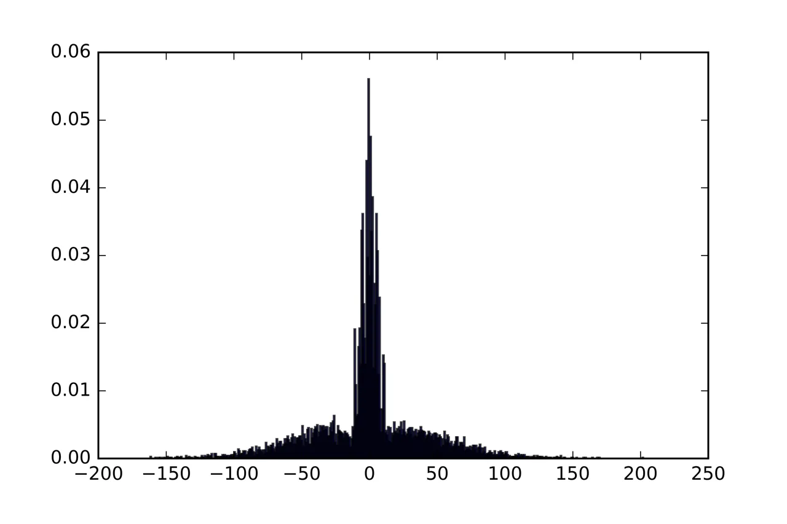
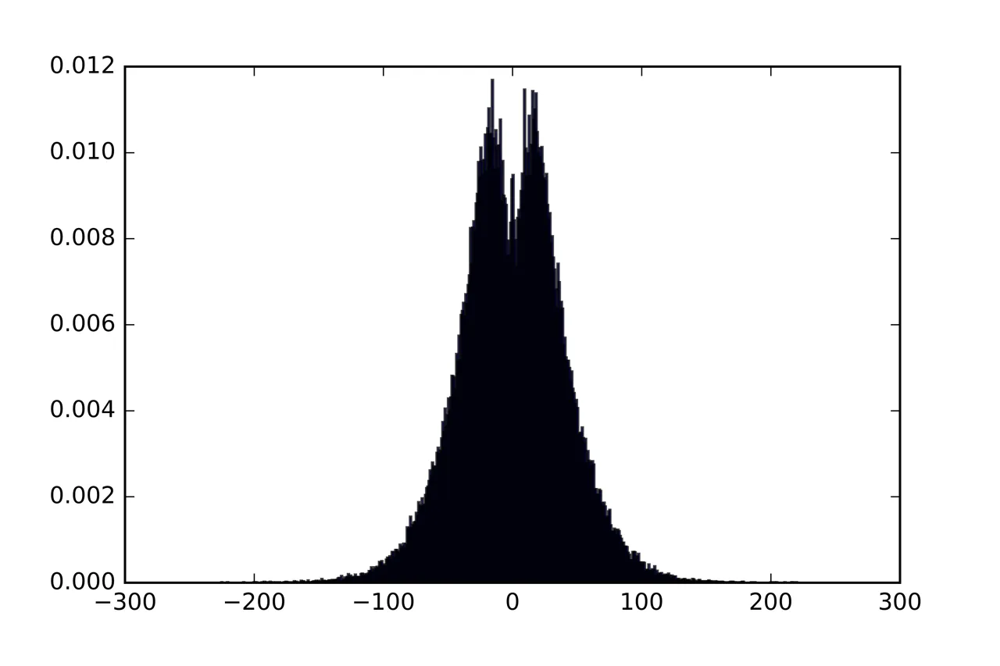
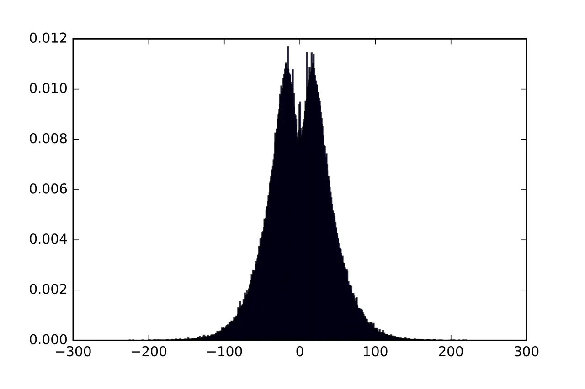
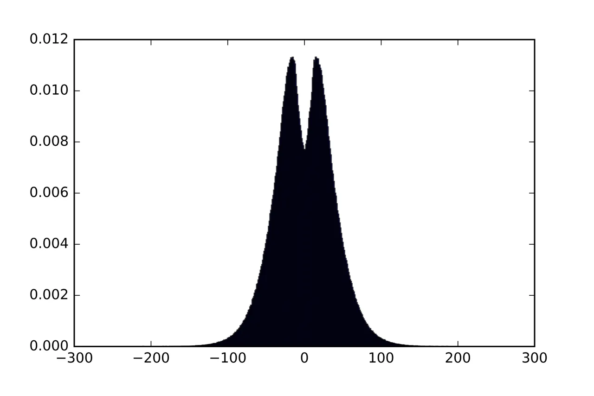

# Mean Field Analysis of Neural Networks: A Law of Large Numbers

Justin Sirignano . Note: Department of Industrial & Systems Engineering,
University of Illinois at Urbana Champaign, Urbana, E-mail:
jasirign@illinois.edu    Konstantinos Spiliopoulos ^(†)^(†)thanks: K.S.
was partially supported by the National Science Foundation (DMS 1550918)
Note: Department of Mathematics and Statistics, Boston University,
Boston, E-mail: kspiliop@math.bu.edu

August 24, 2026

###### Abstract

Machine learning, and in particular neural network models, have
revolutionized fields such as image, text, and speech recognition.
Today, many important real-world applications in these areas are driven
by neural networks. There are also growing applications in engineering,
robotics, medicine, and finance. Despite their immense success in
practice, there is limited mathematical understanding of neural
networks. This paper illustrates how neural networks can be studied via
stochastic analysis, and develops approaches for addressing some of the
technical challenges which arise. We analyze one-layer neural networks
in the asymptotic regime of simultaneously (A) large network sizes and
(B) large numbers of stochastic gradient descent training iterations. We
rigorously prove that the empirical distribution of the neural network
parameters converges to the solution of a nonlinear partial differential
equation. This result can be considered a law of large numbers for
neural networks. In addition, a consequence of our analysis is that the
trained parameters of the neural network asymptotically become
independent, a property which is commonly called “propagation of chaos”.

## 1 Introduction

Neural networks have achieved immense practical success over the past
decade. Neural networks are nonlinear statistical models whose
parameters are estimated from data using stochastic gradient descent.
They have been employed as critical components of many important
technologies in a variety of industries. This practical success has
sparked significant interest in their mathematical analysis. Currently,
there is limited mathematical understanding of neural networks. This
paper analyzes the asymptotic behavior of neural networks, rigorously
proving that the empirical distribution of their parameters converges to
the solution of a nonlinear partial differential equation (PDE).

Neural network models have revolutionized fields such as image, text,
and speech recognition. They are actively used in a variety of
applications. In image recognition, neural networks are able to
accurately identify and recognize objects in images using only the raw
pixels. Neural networks are used for image recognition in applications
such as self-driving cars, image searches on search engines such as
Google, and facial recognition for security systems (see \[32\], \[22\],
\[9\], and \[54\]). In speech recognition, neural networks are used to
develop computer systems that automatically understand human speech (see
\[32\], \[4\], \[34\], and \[57\]). Applications include voice control
of certain systems in vehicles, transcription (automatically converting
human speech to written text), interactive voice response for customer
service, and spoken commands for smartphones. In text recognition,
neural networks are used to automatically translate text from one
language (e.g., English) to another language (e.g., Italian); see \[56\]
and \[51\]. They have also been used for automatically generating
summaries of long documents; see \[40\] and \[10\].

In addition, there is growing interest in applying neural networks to
engineering, robotics, medicine, and finance. Neural networks are being
used in reduced-form models of the Navier-Stokes equation in turbulent
conditions (see \[35\] and \[36\]). \[52\], \[23\], and \[41\] describe
applications in robotics. Neural networks have been used to identify
cancer \[18\] and to model protein folding \[2\]. In finance, neural
networks have been used to model loan default and prepayment risk \[44\]
and to model high frequency financial data \[45\]. Neural networks have
also been used to solve high-dimensional PDEs in financial applications
\[46\].

Due to the impact that neural networks have had on practical
applications, there is a significant interest in better understanding
their mathematical properties. However, the existing literature is
relatively limited, with only a few recent papers such as \[6\], \[37\],
and \[53\]. There also exist classical results regarding the
approximation power of neural networks \[5\], \[25\], and \[26\].

Our result characterizes neural networks with a single hidden layer in
the asymptotic regime of large network sizes and large numbers of
stochastic gradient descent iterations. We rigorously prove that the
empirical distribution of the neural network parameters will weakly
converge to a distribution. This distribution satisfies a nonlinear
partial differential equation. The proof relies upon weak convergence
analysis for interacting particle systems. The result can be considered
a “law of large numbers” for neural networks when both the network size
and the number of stochastic gradient descent steps grow to infinity.

Recently, \[55\] rigorously established a weak convergence result for a
class of machine learning algorithms. Weak convergence analysis has been
widely used in other fields (for example, see \[19\], \[20\], \[13\],
\[14\], \[15\], \[7\], and \[24\] for a non-exhaustive list). In fact,
mean field analysis has been actively used for many years to study
biological neural networks and physical systems of interacting
particles; see for example \[16\], \[28\], \[38\], \[49\], and the
references therein.

Upon completion of this work, we became aware of the very recent work of
\[39\] where a related PDE limit result for neural networks is derived;
see also the recent work \[42\]. Our convergence analysis, setup, and
assumptions are different. In \[39\], it is assumed that the gradient of
the neural network is a priori globally Lipschitz and bounded and under
this assumption a similar PDE result as well as certain rates of
convergence are established. In our work, we do not assume that the
gradient of the neural network is a priori globally Lipschitz or
bounded. Often, neural network models (and their gradients) are not
globally Lipschitz and not bounded. In this paper, we assume that the
data come from a distribution that has its first moments bounded and
that the initialization is done according to distributions with certain
moment bounds. Based on this assumption, we rigorously prove relative
compactness of the pre-limit measure valued process, identification of
its limit, and uniqueness of the limit point in the appropriate space.
Our method of proof leverages on weak convergence analysis in an
appropriate Skorokhod space for measure-valued processes (similar to the
approaches in \[55\] and \[19\]). In particular, the relative
compactness and uniqueness proof addresses the challenge of neural
networks not being a priori globally Lipschitz nor globally bounded
using the structure of the stochastic gradient descent algorithm.

Consider the one-layer neural network

```math
\displaystyle g_{\theta}^{N}(x)=\frac{1}{N}\sum_{i=1}^{N}c^{i}\sigma(w^{i}\cdot x), \tag{1.1}
```

where for every $`i\in\{1,\cdots,N\}`$, $`c^{i}\in\mathbb{R}`$ and
$`x,w^{i}\in\mathbb{R}^{d}`$. For notational convenience we shall
interpret $`w^{i}\cdot x=\sum_{j=1}^{d}w^{i,j}x^{j}`$ as the standard
scalar inner product. The neural network model has parameters
$`\theta=(c^{1},\ldots,c^{N},w^{1},\ldots,w^{N})\in\mathbb{R}^{(1+d)N}`$,
which must be estimated from data.

The neural network (1.1) takes a linear function of the original data,
applies an element-wise nonlinearity using the function
$`\sigma:\mathbb{R}\rightarrow\mathbb{R}`$, and then takes another
linear function to produce the output. The activation function
$`\sigma(\cdot)`$ is a nonlinear function such as a sigmoid or tanh
function. The quantity $`\sigma(w^{i}\cdot x)`$ is referred to as the
$`i`$-th “hidden unit”, and the vector
$`\big(\sigma(w^{1}\cdot x),\ldots,\sigma(w^{N}\cdot x)\big)`$ is called
the “hidden layer”. The number of units in the hidden layer is $`N`$.

The objective function is

```math
\displaystyle L^{N}(\theta)=\frac{1}{2}\mathbb{E}_{Y,X}[(Y-g_{\theta}^{N}(X))^{2}], \tag{1.2}
```

where the data $`(Y,X)`$ is assumed to have a joint distribution
$`\pi(dx,dy)`$. We shall write $`\mathcal{X},\mathcal{Y}`$ for the state
spaces of $`X`$ and $`Y`$, respectively. The parameters
$`\theta=(c^{1},\ldots,c^{N},w^{1},\ldots,w^{N})`$ are estimated using
stochastic gradient descent:

```math
\displaystyle c_{k+1}^{i} \displaystyle= \displaystyle c^{i}_{k}+\frac{\alpha}{N}(y_{k}-g_{\theta_{k}}^{N}(x_{k}))\sigma(w^{i}_{k}\cdot x_{k}),
```

```math
\displaystyle w^{i,j}_{k+1} \displaystyle= \displaystyle w^{i,j}_{k}+\frac{\alpha}{N}(y_{k}-g_{\theta_{k}}^{N}(x_{k}))c^{i}_{k}\sigma^{\prime}(w^{i}_{k}\cdot x_{k})x^{j}_{k},\quad j=1,\cdots,d, \tag{1.3}
```

where $`\alpha`$ is the learning rate and
$`(x_{k},y_{k})\sim\pi(dx,dy)`$. Stochastic gradient descent minimizes
(1.2) using a sequence of noisy (but unbiased) gradient descent steps
$`\nabla_{\theta}[(y_{k}-g_{\theta_{k}}^{N}(x_{k}))^{2}]`$. Note that
typically $`\nabla_{\theta}[(y-g_{\theta}^{N}(x))^{2}]`$ is not a priori
globally Lipschitz nor globally bounded as a function of $`\theta`$.
Stochastic gradient descent typically converges more rapidly than
gradient descent for large datasets. For this reason, stochastic
gradient descent is widely used in machine learning.

Define the empirical measure

```math
\displaystyle\nu^{N}_{k}(dc,dw)=\frac{1}{N}\sum_{i=1}^{N}\delta_{c_{k}^{i},w_{k}^{i}}(dc,dw). \tag{1.4}
```

The neural network’s output can be re-written in terms of the empirical
measure:

```math
\displaystyle g_{\theta_{k}}^{N}(x)=\left\langle c\sigma(w\cdot x),\nu^{N}_{k}\right\rangle. \tag{1.5}
```

$`\left\langle f,h\right\rangle`$ denotes the inner product of $`f`$ and
$`h`$. For example,
$`\left\langle c\sigma(w\cdot x),\nu^{N}_{k}\right\rangle=\int c\sigma(w\cdot x)\nu^{N}_{k}(dc,dw)`$.

The scaled empirical measure is

```math
\displaystyle\mu^{N}_{t}=\nu^{N}_{\left\lfloor Nt\right\rfloor}. \tag{1.6}
```

At any time $`t`$, the scaled empirical measure $`\mu^{N}_{t}`$ is a
random element of $`D_{E}([0,T])=D([0,T];E)`$¹¹ 1 $`D_{S}([0,T])`$ is
the set of maps from $`[0,T]`$ into $`S`$ which are right-continuous and
which have left-hand limits. with $`E=\mathcal{M}(\mathbb{R}^{1+d})`$.
We study the convergence in distribution of $`\mu^{N}_{t}`$ in the
Skorokhod space $`D_{E}([0,T])`$.

Our main results are stated below. Theorem 1.2 (and the associated
Remark 1.3) is a law of large numbers describing the distribution of the
trained parameters when $`N`$ is large. Theorem 1.6 describes the
behavior of individual parameters when $`N`$ is large. Theorem 1.6 is a
“propagation of chaos” result. Section 1.1 presents several insights
provided by these asymptotic results.

We shall work on a filtered probability space
$`(\Omega,\mathcal{F},\mathbb{P})`$ on which all the random variables
are defined. The probability space is equipped with a filtration
$`\mathfrak{F}_{t}`$ that is right continuous and $`\mathfrak{F}_{0}`$
contains all $`\mathbb{P}`$-negligible sets.

At this point, let us recall the definition of chaoticity. Let $`q`$ be
a probability measure on a Polish space $`\mathcal{Z}`$ and, for
$`N\in\mathbb{N}`$, let $`\mathbb{Q}^{N}`$ be a symmetric probability
measure on the product space $`\mathcal{Z}^{N}`$. Then
$`(\mathbb{Q}^{N})_{N\in\mathbb{N}}`$ is called $`q-`$chaotic if, for
every $`k\in\mathbb{N}`$, the joint distribution law of the first $`k`$
marginals of $`\mathbb{Q}^{N}`$ converge weakly to the product measure
$`\otimes^{k}q`$.

We impose the following assumption.

###### Assumption 1.1.

We have that

- •
  The activation function $`\sigma\in C^{2}_{b}(\mathbb{R})`$, i.e.
  $`\sigma`$ is twice continuously differentiable and bounded.
- •
  The sequence of data samples $`(x_{k},y_{k})`$ is i.i.d. from a
  probability distributed $`\pi(dx,dy)`$ such that
  $`\mathbb{E}\parallel x_{k}\parallel^{4}+\mathbb{E}|y_{k}|^{4}`$ is
  bounded.
- •
  The randomly initialized parameters $`(c_{0}^{i},w_{0}^{i})`$ are
  i.i.d. with a distribution $`\bar{\mu}_{0}`$ such that
  $`\mathbb{E}[\exp\big(q|c_{0}^{i}|\big)]<C`$ for some $`0<q<\infty`$
  and $`\mathbb{E}[\parallel w_{0}^{i}\parallel^{4}]<C`$.

Notice that initial distributions on $`c^{i}`$ with compact support or
exponential tails satisfy the condition on the moment generating
function of $`|c_{0}^{i}|`$ in the assumption above. Under Assumption
1.1, the initial empirical measure satisfies
$`\mu_{0}^{N}\overset{d}{\rightarrow}\bar{\mu}_{0}`$ as
$`N\rightarrow\infty`$. In addition, due to our assumption on the
distribution of the $`(x_{k},y_{k})`$ data and of the initialization
$`(c_{0}^{i},w_{0}^{i})_{i=1}^{N}`$, the joint distribution of
$`(c^{i}_{k},w^{i}_{k})_{i=1}^{N}\in(\mathbb{R}^{1+d})^{\otimes N}`$ is
exchangeable and, consequently, $`\nu_{k}^{N}`$ is a Markov chain in the
space of probability measures on $`E`$.

###### Theorem 1.2.

Assume Assumption 1.1. The scaled empirical measure $`\mu^{N}_{t}`$
converges in distribution to a limit measure $`\bar{\mu}_{t}`$ with
values in $`D_{E}([0,T])`$ as $`N\rightarrow\infty`$. For every
$`f\in C^{2}_{b}(\mathbb{R}^{1+d})`$, $`\bar{\mu}`$ is the unique
deterministic solution of the measure evolution equation

```math
\displaystyle\left\langle f,\bar{\mu}_{t}\right\rangle \displaystyle= \displaystyle\left\langle f,\bar{\mu}_{0}\right\rangle+\int_{0}^{t}\bigg(\int_{\mathcal{X}\times\mathcal{Y}}\alpha\big(y-\left\langle c^{\prime}\sigma(w^{\prime}\cdot x),\bar{\mu}_{s}\right\rangle\big)\left\langle\sigma(w\cdot x)\partial_{c}f,\bar{\mu}_{s}\right\rangle\pi(dx,dy)\bigg)ds \tag{1.7}
```

```math
\displaystyle+\int_{0}^{t}\bigg(\int_{\mathcal{X}\times\mathcal{Y}}\alpha\big(y-\left\langle c^{\prime}\sigma(w^{\prime}\cdot x),\bar{\mu}_{s}\right\rangle\big)\left\langle c\sigma^{\prime}(w\cdot x)x\cdot\nabla_{w}f,\bar{\mu}_{s}\right\rangle\pi(dx,dy)\bigg)ds
```

```math
\displaystyle= \displaystyle\left\langle f,\bar{\mu}_{0}\right\rangle+\int_{0}^{t}\bigg(\int_{\mathcal{X}\times\mathcal{Y}}\alpha\big(y-\left\langle c^{\prime}\sigma(w^{\prime}\cdot x),\bar{\mu}_{s}\right\rangle\big)\left\langle\nabla(c\sigma(w\cdot x))\cdot\nabla f,\bar{\mu}_{s}\right\rangle\pi(dx,dy)\bigg)ds,
```

where $`\nabla f=(\partial_{c}f,\nabla_{w}f)`$.

###### Remark 1.3.

Since weak convergence to a constant implies convergence in probability,
Theorem 1.2 leads to the stronger result of convergence in probability

```math
\lim_{N\to\infty}\mathbb{P}\left\{d_{E}(\mu^{N},\bar{\mu})\geq\delta\right\}=0
```

for every $`\delta>0`$ and where $`d_{E}`$ is the metric for
$`D_{E}([0,T])`$.

###### Corollary 1.4.

Assume Assumption 1.1. Suppose that $`\bar{\mu}_{0}`$ admits a density
$`p_{0}(c,w)`$ and there exists a unique solution to the nonlinear
partial differential equation

```math
\displaystyle\frac{\partial p(t,c,w)}{\partial t} \displaystyle= \displaystyle-\alpha\int_{\mathcal{X}\times\mathcal{Y}}\bigg(\big(y-\left\langle c^{\prime}\sigma(w^{\prime}\cdot x),p(t,c^{\prime},w^{\prime})\right\rangle\big)\frac{\partial}{\partial c}\big[\sigma(w\cdot x)p(t,c,w)\big]\bigg)\pi(dx,dy)
```

```math
\displaystyle- \displaystyle\alpha\int_{\mathcal{X}\times\mathcal{Y}}\bigg(\big(y-\left\langle c^{\prime}\sigma(w^{\prime}\cdot x),p(t,c^{\prime},w^{\prime})\right\rangle\big)x\cdot\nabla_{w}\big[c\sigma^{\prime}(w\cdot x)p(t,c,w)\big]\bigg)\pi(dx,dy),
```

```math
\displaystyle p(0,c,w) \displaystyle= \displaystyle p_{0}(c,w),
```

such that $`p(t,c,w)`$ vanishes as
$`|c|,\parallel w\parallel\rightarrow\infty`$. Then, we have that the
solution to the measure evolution equation (1.7) is such that

```math
\displaystyle\bar{\mu}_{t}(dc,dw)=p(t,c,w)dcdw.
```

###### Remark 1.5.

Notice that by setting $`\theta=(c,w)`$, the partial differential
equation for $`p(t,\theta)`$ in Corollary 1.4 can be written as

```math
\displaystyle\frac{\partial p(t,\theta)}{\partial t} \displaystyle=-\alpha\textrm{div}_{\theta}\left(p(t,\theta)\nabla_{\theta}v(\theta,p(t,\cdot))\right)
```

```math
\displaystyle p(0,\theta) \displaystyle=p_{0}(\theta), \tag{1.8}
```

where $`\textrm{div}_{\theta}`$ is the divergence operator with respect
to the variable $`\theta`$ and $`v(\theta,p(t,\cdot))`$ is defined as

```math
\displaystyle v(\theta,p(t,\cdot)) \displaystyle=\int_{\mathcal{X}\times\mathcal{Y}}\left(\left(y-\int_{\mathbb{R}^{1+d}}c^{\prime}\sigma(w^{\prime}\cdot x)p(t,c^{\prime},w^{\prime})dc^{\prime}dw^{\prime}\right)c\sigma(w\cdot x)\right)\pi(dx,dy).
```

In addition, Theorem 1.2 and Corollary 1.4 imply that the objective
function $`L^{N}(\theta)`$ from (1.2) satisfies

```math
\displaystyle\lim_{N\rightarrow\infty}L^{N}(\theta_{\left\lfloor Nt\right\rfloor}) \displaystyle=\bar{L}(p(t,\cdot))=\frac{1}{2}\int_{\mathcal{X}\times\mathcal{Y}}\left(y-\bar{g}(x,p(t,\cdot))\right)^{2}\pi(dx,dy),\quad\textrm{where,} \tag{1.9}
```

```math
\displaystyle\bar{g}(x,p(t,\cdot)) \displaystyle=\int_{\mathbb{R}^{1+d}}c\sigma(w\cdot x)p(t,c,w)dcdw.
```

As it is well known in the literature, see for example \[3, 11, 29\],
the PDE (1.8) is a gradient flow for the limiting objective function
(1.9) in the space of probability measures on $`\mathbb{R}^{1+d}`$
endowed with the Wasserstein metric. As it is also extensively discussed
in \[3\], but also pointed out in the recent works by \[12, 39, 27\],
this means that the trajectory’s $`t\mapsto p(t,\cdot)`$ goal is to
minimize the limit objective function $`\bar{L}(p)`$ as defined by
(1.9). For more details on the related optimal transportation theory we
refer the interested reader to Lemma 10.3.16 in \[3\] for general
results, and to Proposition 4.2 in \[12\] and to Corollary 3.3 in \[27\]
for a more specialized discussion in the special case of limiting
problems of the type (1.8)-(1.9).

In Theorem 1.6 we prove that the neural network has the “propagation of
chaos” property.

###### Theorem 1.6.

Assume Assumption 1.1. Consider $`T<\infty`$ and let $`t\in(0,T]`$.
Define the probability measure
$`\rho^{N}_{t}\in\mathcal{M}(\mathbb{R}^{(1+d)N})`$ where

```math
\displaystyle\rho^{N}_{t}(dx^{1},\ldots,dx^{N})=\mathbb{P}[(c_{\left\lfloor Nt\right\rfloor}^{1},w_{\left\lfloor Nt\right\rfloor}^{1})\in dx^{1},\ldots,(c_{\left\lfloor Nt\right\rfloor}^{N},w_{\left\lfloor Nt\right\rfloor}^{N})\in dx^{N}].
```

Then, the sequence of probability measures $`\rho^{N}_{\cdot}`$ is
$`\bar{\mu}_{\cdot}`$-chaotic. That is, for $`k\in\mathbb{N}`$

```math
\displaystyle\lim_{N\rightarrow\infty}\left\langle f_{1}(x^{1})\times\cdots\times f_{k}(x^{k}),\rho_{\cdot}^{N}(dx^{1},\ldots,dx^{N})\right\rangle=\prod_{i=1}^{k}\left\langle f_{i},\bar{\mu}_{\cdot}\right\rangle,\phantom{....}\forall f_{1},\ldots,f_{k}\in C^{2}_{b}(\mathbb{R}^{1+d}). \tag{1.10}
```

### 1.1 Insights from Law of Large Numbers and Numerical Studies

The law of large numbers (1.7) suggests several interesting
characteristics of trained neural networks (at least in the setting
studied in this paper).

- •
  As $`N\rightarrow\infty`$, the neural network converges (in
  probability) to a deterministic model. This is despite the fact that
  the neural network is randomly initialized and it is trained on a
  random sequence of data samples via stochastic gradient descent.
- •
  The learning rate $`\alpha`$ was assumed to be constant and to not
  decay with time. However, notice that the hidden layer has been
  normalized by $`1/N`$ and it is this normalization by $`1/N`$ in the
  hidden layer that replaces the role of the learning rate decay,
  enabling convergence.
- •
  As it also discussed in Remark 1.5, the PDE (1.8) is a gradient flow
  for the limiting objective function (1.9) in the space of probability
  measures on $`\mathbb{R}^{1+d}`$ endowed with the Wasserstein metric.
  Hence, the limiting law of large numbers goal is to minimize the limit
  objective function $`\bar{L}(p)`$ as defined by (1.9).
- •
  The propagation of chaos result (1.10) indicates that, as
  $`N\rightarrow\infty`$, the dynamics of the weights
  $`(c^{i}_{k},w^{i}_{k})`$ will become independent of the dynamics of
  the weights $`(c^{j}_{k},w^{j}_{k})`$ for any $`i\neq j`$. Note that
  the dynamics $`(c^{i}_{k},w^{i}_{k})`$ are still random due to the
  random initialization. However, the dynamics of the $`i`$-th set of
  weights will be uncorrelated with the dynamics of the $`j`$-th set of
  weights in the limit as $`N\rightarrow\infty`$.

In order to illustrate some aspects of the theoretical results of this
paper, we performed the following numerical study.

Figure 1 displays the convergence of the distribution of the parameters
in a trained neural network as the number of hidden units
$`N\rightarrow\infty`$. The neural network has a single hidden layer
followed by a softmax function. Figure 1 reports the distribution of the
parameters connecting the hidden layer to the softmax function. The
distributions are presented as histograms. The neural network is trained
on the MNIST dataset, which is a standard image dataset in machine
learning \[33\]. The dataset includes $`60,000`$ images of handwritten
numbers $`\{0,1,2,\ldots,9\}`$. The neural network is trained to
identify the handwritten numbers using only the image pixels as an input
(i.e., it learns to recognize images as a human would). In the MNIST
dataset, each image has $`784`$ pixels. A pixel takes values in
$`\{0,1,\ldots,255\}`$.²² 2 The pixel values are normalized to $`[0,1]`$
for the purposes of training the neural network. Neural networks can
achieve 98-99% out-of-sample accuracy on the MNIST dataset.

Figure 1 shows that the distribution of parameters converges to a fixed
distribution as $`N\rightarrow\infty`$. This can be seen by the fact
that the distributions for $`N=10,000`$, $`N=100,000`$, and
$`N=250,000`$ are nearly identical. A priori it is unclear if the
distribution of neural network parameters should converge as
$`N\rightarrow\infty`$. Our theory and numerical results confirm that
this is indeed the case. Indeed, as $`N`$ gets large, we see that the
empirical distribution of the parameters connecting the hidden layer to
the softmax function converges to a specific deterministic distribution.









Figure 1: Distribution of parameters for a neural network trained on
MNIST dataset. Clockwise: $`N=1,000`$, $`N=10,000`$, $`N=100,000`$, and
$`N=250,000`$ hidden units.

### 1.2 Overview of the Proof

The rest of the paper is organized as follows. Section 2 proves relative
compactness of the family $`\{\mu^{N}\}_{N\in\mathbb{N}}`$. Section 3
identifies the limit point of any convergent subsequence. The limit
point must satisfy the measure evolution equation (1.7). Section 4
proves uniqueness of the evolution equation (1.7) via a fixed point
argument. Then, by Prokhorov’s Theorem, these results prove that the
sequence of probability measures $`\pi^{N}`$ of the processes
$`\mu^{N}`$ weakly converge to $`\pi`$, the probability measure of the
process $`\bar{\mu}`$ satisfying equation (1.7). These results are
collected together in Section 5 to prove Theorem 1.2, Corollary 1.4, and
Theorem 1.6. We conclude with a discussion of our results in Section 6.

## 2 Relative Compactness

We now prove relative compactness of the family
$`\{\mu^{N}\}_{N\in\mathbb{N}}`$ in $`D_{E}([0,T])`$ where
$`E=\mathcal{M}(\mathbb{R}^{1+d})`$. It is sufficient to show compact
containment and regularity of the $`\mu^{N}`$’s (see for example Chapter
3 of \[17\]). We start with a crucial a-priori bound for the SGD
iterates as given by (1.3), Lemma 2.1.

###### Lemma 2.1.

Consider the system (1.3). Then, for $`k\leq TN`$ and uniformly in
$`i\in\mathbb{N}`$, there exists a constant $`C<\infty`$ such that

```math
\displaystyle\mathbb{E}\left[|c^{i}_{k}|+\parallel w^{i}_{k}\parallel\right]\leq C.
```

In particular, we have

```math
\displaystyle\sup_{N\in\mathbb{N},k/N\leq T}\frac{1}{N}\sum_{i=1}^{N}\mathbb{E}\left[|c^{i}_{k}|+\parallel w^{i}_{k}\parallel\right]\leq C.
```

For the purposes of presentation, the proof of Lemma 2.1 will be given
at the end of this section. First, we prove compact containment for the
measure-valued process $`\{\mu_{t}^{N},t\in[0,T]\}_{N\in\mathbb{N}}`$.

###### Lemma 2.2.

For each $`\eta>0`$, there is a compact subset $`\mathcal{K}`$ of E such
that

```math
\displaystyle\sup_{N\in\mathbb{N},0\leq t\leq T}\mathbb{P}[\mu_{t}^{N}\notin\mathcal{K}]<\eta.
```

###### Proof.

For each $`L>0`$, define $`K_{L}=[0,L]^{1+d}`$. Then, we have that
$`K_{L}`$ is a compact subset of $`\mathbb{R}^{1+d}`$, and for each
$`t\geq 0`$ and $`N\in\mathbb{N}`$,

```math
\mathbb{E}\left[\mu^{N}_{t}(\mathbb{R}^{1+d}\setminus K_{L})\right]=\frac{1}{N}\sum_{i=1}^{N}\mathbb{P}\left[|c^{i}_{\left\lfloor Nt\right\rfloor}|+\parallel w^{i}_{\left\lfloor Nt\right\rfloor}\parallel\geq L\right]\leq\frac{C}{L}.
```

where the constant $`C<\infty`$ is from Lemma 2.1. The rest of the proof
is standard now (see for example Lemma 6.1 of \[19\]). We define the
compact subsets of $`E=\mathcal{M}(\mathbb{R}^{1+d})`$

```math
\hat{K}_{L}=\overline{\left\{\nu:\,\nu(\mathbb{R}^{1+d}\setminus K_{(L+j)^{2}})<\frac{1}{\sqrt{L+j}}\textrm{ for all }j\in\mathbb{N}\right\}}
```

and we observe that

```math
\displaystyle\mathbb{P}\left\{\mu^{N}_{t}\not\in\hat{K}_{L}\right] \displaystyle\leq\sum_{j=1}^{\infty}\mathbb{P}\left[\mu^{N}_{t}(\mathbb{R}^{1+d}\setminus K_{(L+j)^{2}})>\frac{1}{\sqrt{L+j}}\right]\leq\sum_{j=1}^{\infty}\frac{\mathbb{E}[\mu^{N}_{t}(\mathbb{R}^{1+d}\setminus K_{(L+j)^{2}})]}{1/\sqrt{L+j}}
```

```math
\displaystyle\leq\sum_{j=1}^{\infty}\frac{C}{(L+j)^{2}/\sqrt{L+j}}\leq\sum_{j=1}^{\infty}\frac{C}{(L+j)^{3/2}}.
```

Given now that
$`\lim_{L\to\infty}\sum_{j=1}^{\infty}\frac{C}{(L+j)^{3/2}}=0`$, the
proof of the lemma is concluded. ∎

We now establish regularity of the $`\mu^{N}`$’s. Define the function
$`q(z_{1},z_{2})=\min\{|z_{1}-z_{2}|,1\}`$ where
$`z_{1},z_{2}\in\mathbb{R}`$.

###### Lemma 2.3.

Let $`f\in C^{2}_{b}(\mathbb{R}^{1+d})`$. For any $`p\in(0,1)`$, there
is a constant $`C<\infty`$ such that for $`0\leq u\leq\delta`$,
$`0\leq v\leq\delta\wedge t`$, $`t\in[0,T]`$,

```math
\mathbb{E}\left[q(\left<f,\mu^{N}_{t+u}\right>,\left<f,\mu^{N}_{t}\right>)q(\left<f,\mu^{N}_{t}\right>,\left<f,\mu^{N}_{t-v}\right>)\big|\mathcal{F}^{N}_{t}\right]\leq C\delta^{p}+\frac{C}{N}.
```

###### Proof.

We start by noticing that a Taylor expansion gives for
$`0\leq s\leq t\leq T`$

```math
\displaystyle|\left\langle f,\mu^{N}_{t}\right\rangle-\left\langle f,\mu^{N}_{s}\right\rangle| \displaystyle= \displaystyle|\left\langle f,\mu^{N}_{t}\right\rangle-\left\langle f,\mu^{N}_{s}\right\rangle|=|\left\langle f,\nu^{N}_{\left\lfloor Nt\right\rfloor}\right\rangle-\left\langle f,\nu^{N}_{\left\lfloor Ns\right\rfloor}\right\rangle| \tag{2.1}
```

```math
\displaystyle\leq \displaystyle\frac{1}{N}\sum_{i=1}^{N}|f(c^{i}_{\left\lfloor Nt\right\rfloor},w^{i}_{\left\lfloor Nt\right\rfloor})-f(c^{i}_{\left\lfloor Ns\right\rfloor},w^{i}_{\left\lfloor Ns\right\rfloor})|
```

```math
\displaystyle\leq \displaystyle\frac{1}{N}\sum_{i=1}^{N}|\partial_{c}f(\bar{c}^{i}_{\left\lfloor Nt\right\rfloor},\bar{w}^{i}_{\left\lfloor Nt\right\rfloor})||c^{i}_{\left\lfloor Nt\right\rfloor}-c^{i}_{\left\lfloor Ns\right\rfloor}|
```

```math
\displaystyle+ \displaystyle\frac{1}{N}\sum_{i=1}^{N}\parallel\nabla_{w}f(\bar{c}^{i}_{\left\lfloor Nt\right\rfloor},\bar{w}^{i}_{\left\lfloor Nt\right\rfloor})\parallel\parallel w^{i}_{\left\lfloor Nt\right\rfloor}-w^{i}_{\left\lfloor Ns\right\rfloor}\parallel,
```

for points $`\bar{c}^{i},\bar{w}^{i}`$ in the segments connecting
$`c^{i}_{\left\lfloor Ns\right\rfloor}`$ with
$`c^{i}_{\left\lfloor Nt\right\rfloor}`$ and
$`w^{i}_{\left\lfloor Ns\right\rfloor}`$ with
$`w^{i}_{\left\lfloor Nt\right\rfloor}`$, respectively.

Let’s now establish a bound on
$`|c^{i}_{\left\lfloor Nt\right\rfloor}-c^{i}_{\left\lfloor Ns\right\rfloor}|`$
for $`s<t\leq T`$. Let $`0<p<1`$.

```math
\displaystyle\mathbb{E}|c^{i}_{\left\lfloor Nt\right\rfloor}-c^{i}_{\left\lfloor Ns\right\rfloor}| \displaystyle= \displaystyle\mathbb{E}|\sum_{k=\left\lfloor Ns\right\rfloor}^{\left\lfloor Nt\right\rfloor-1}(c_{k+1}-c_{k})|
```

```math
\displaystyle\leq \displaystyle\mathbb{E}\sum_{k=\left\lfloor Ns\right\rfloor}^{\left\lfloor Nt\right\rfloor-1}|\alpha(y_{k}-g_{\theta_{k}}^{N}(x_{k}))\frac{1}{N}\sigma(w^{i}_{k}\cdot x_{k})|
```

```math
\displaystyle\leq \displaystyle\frac{1}{N}\sum_{k=\left\lfloor Ns\right\rfloor}^{\left\lfloor Nt\right\rfloor-1}C\leq C(t-s)+\frac{C}{N}
```

```math
\displaystyle\leq \displaystyle C(t-s)^{p}\mathbf{1}_{t-s<1}+C(t-s)^{p}T^{1/p}\mathbf{1}_{t-s\geq 1}+\frac{C}{N}
```

```math
\displaystyle\leq \displaystyle C(t-s)^{p}+\frac{C}{N},
```

where Assumption 1.1 was used. Let’s now establish a bound on
$`\parallel w^{i}_{\left\lfloor Nt\right\rfloor}-w^{i}_{\left\lfloor Ns\right\rfloor}\parallel`$
for $`s<t\leq T`$. Making use of the uniform bounds established in Lemma
2.1, we obtain similarly to the previous bound

```math
\displaystyle\mathbb{E}\parallel w^{i}_{\left\lfloor Nt\right\rfloor}-w^{i}_{\left\lfloor Ns\right\rfloor}\parallel \displaystyle= \displaystyle\mathbb{E}\parallel\sum_{k=\left\lfloor Ns\right\rfloor}^{\left\lfloor Nt\right\rfloor-1}(w_{k+1}-w_{k})\parallel
```

```math
\displaystyle\leq \displaystyle\mathbb{E}\sum_{k=\left\lfloor Ns\right\rfloor}^{\left\lfloor Nt\right\rfloor-1}\parallel\alpha(y_{k}-g_{\theta_{k}}^{N}(x_{k}))\frac{1}{N}c^{i}_{k}\sigma^{\prime}(w^{i}_{k}\cdot x_{k})x_{k}\parallel
```

```math
\displaystyle\leq \displaystyle\frac{1}{N}\sum_{k=\left\lfloor Ns\right\rfloor}^{\left\lfloor Nt\right\rfloor-1}C
```

```math
\displaystyle\leq \displaystyle C(t-s)+\frac{C}{N}\leq C(t-s)^{p}+\frac{C}{N}.
```

Now, we return to equation (2.1). By Lemma 2.1, the quantities
$`(\bar{c}^{i}_{\left\lfloor Nt\right\rfloor},\bar{w}^{i}_{\left\lfloor Nt\right\rfloor})`$
are bounded in expectation for $`0<s<t\leq T`$. Therefore, for
$`0<s<t\leq T`$,

```math
\displaystyle\mathbb{E}\left[|\left\langle f,\mu^{N}_{t}\right\rangle-\left\langle f,\mu^{N}_{s}\right\rangle|\big|\mathcal{F}^{N}_{s}\right]\leq C(t-s)^{p}+\frac{C}{N}.
```

where $`C<\infty`$ is some unimportant constant. Then, the statement of
the Lemma follows. ∎

We can now prove the required relative compactness of the sequence
$`\{\mu^{N}\}_{N\in\mathbb{N}}`$. This implies that every subsequence
$`\mu^{N}`$’s has a convergent sub-subsequence.

###### Lemma 2.4.

The sequence of probability measures $`\{\mu^{N}\}_{N\in\mathbb{N}}`$ is
relatively compact in $`D_{E}([0,T])`$.

###### Proof.

Given Lemmas 2.2 and 2.3, Theorem 8.6 of Chapter 3 of \[17\], gives the
statement of the lemma. (See also Remark 8.7 B of Chapter 3 of \[17\]
regarding replacing $`\sup_{N}`$ with $`\lim_{N}`$ in the regularity
condition B of Theorem 8.6.) ∎

We conclude this section with the proof of the a-priori bound of Lemma
2.1.

###### Proof of Lemma 2.1.

We start by establishing some useful a-priori bounds on $`c_{k}^{i}`$
and $`w_{k}^{i}`$. The unimportant finite constant $`C<\infty`$ may
change from line to line. We first observe that

```math
\displaystyle|c_{k+1}^{i}| \displaystyle\leq \displaystyle|c_{k}^{i}|+\alpha\left|y_{k}-g_{\theta_{k}}^{N}(x_{k})\right|\frac{1}{N}|\sigma(w^{i}_{k}\cdot x_{k})|
```

```math
\displaystyle\leq \displaystyle|c_{k}^{i}|+\frac{\alpha C|y_{k}|}{N}+\frac{C}{N^{2}}\sum_{i=1}^{N}|c_{k}^{i}|,
```

where to derive the last line we used the definition of
$`g_{\theta_{k}}^{N}(x)`$ via (1.1) and the uniform boundedness
assumption on $`\sigma`$. Then, we subsequently obtain that

```math
\displaystyle|c_{k}^{i}| \displaystyle= \displaystyle|c_{0}^{i}|+\sum_{j=1}^{k}[|c_{j}^{i}|-|c_{j-1}^{i}|]
```

```math
\displaystyle\leq \displaystyle|c_{0}^{i}|+\sum_{j=1}^{k}\frac{\alpha C|y_{j-1}|}{N}+\frac{C}{N^{2}}\sum_{j=1}^{k}\sum_{i=1}^{N}|c_{j-1}^{i}|.
```

This implies that

```math
\displaystyle\frac{1}{N}\sum_{i=1}^{N}|c_{k}^{i}| \displaystyle\leq \displaystyle\frac{1}{N}\sum_{i=1}^{N}|c_{0}^{i}|+\sum_{j=1}^{k}\frac{\alpha C|y_{j-1}|}{N}+\frac{C}{N^{2}}\sum_{j=1}^{k}\sum_{i=1}^{N}|c_{j-1}^{i}|,
```

Let us now define $`m_{k}^{N}=\frac{1}{N}\sum_{i=1}^{N}|c_{k}^{i}|`$ and
$`b_{k}^{N}=\frac{1}{N}\sum_{i=1}^{N}|c_{0}^{i}|+\sum_{j=1}^{k}\frac{\alpha C|y_{j-1}|}{N}`$.
Then we have

```math
\displaystyle m_{k}^{N} \displaystyle\leq \displaystyle b_{k}^{N}+\frac{C}{N}\sum_{j=1}^{k}m_{j}^{N},
```

which by the discrete Gronwall lemma gives the bound

```math
\displaystyle m_{k}^{N} \displaystyle\leq \displaystyle b_{k}^{N}+\frac{C}{N}\sum_{j=1}^{k}b_{j}^{N}e^{C\frac{j-i}{N}}\leq b_{k}^{N}+\frac{C}{N}\sum_{j=1}^{k}b_{j}^{N}
```

for a possibly different constant that may depend on $`T`$, where the
relation $`k/N\leq T`$ was used in the last step. Going back now to the
bound for $`c_{k}^{i}`$ we obtain

```math
\displaystyle|c_{k}^{i}| \displaystyle\leq \displaystyle|c_{0}^{i}|+b_{k}^{N}+\frac{C}{N}\sum_{j=1}^{k}m_{j}^{N}.
```

Raising this to power $`1\leq p\leq 4`$, we have for a constant
$`C_{p}`$ that may depend on $`p`$

```math
\displaystyle|c_{k}^{i}|^{p} \displaystyle\leq \displaystyle C_{p}\left[|c_{0}^{i}|^{p}+|b_{k}^{N}|^{p}+\frac{1}{N^{p}}\left|\sum_{j=1}^{k}b_{j}^{N}\right|^{p}+\frac{1}{N^{2p}}\left|\sum_{j=1}^{k}\sum_{i=1}^{j}b_{i}^{N}\right|^{p}\right].
```

Let us bound now each of the terms on the right hand side of the last
display. We have for some constant $`C_{p}<\infty`$ that may change from
line to line

```math
\displaystyle|b_{k}^{N}|^{p} \displaystyle\leq C_{p}\left[\frac{1}{N}\sum_{i=1}^{N}|c_{0}^{i}|^{p}+\frac{k^{p-1}}{N^{p}}\sum_{j=1}^{k}|y_{j-1}|^{p}\right]
```

```math
\displaystyle\frac{1}{N^{p}}\left|\sum_{j=1}^{k}b_{j}^{N}\right|^{p} \displaystyle\leq\frac{k^{p-1}}{N^{p}}\sum_{j=1}^{k}\left|b_{j}^{N}\right|^{p}\leq C_{p}\frac{k^{p-1}}{N^{p}}\sum_{j=1}^{k}\left[\frac{1}{N}\sum_{i=1}^{N}|c_{0}^{i}|^{p}+\frac{j^{p-1}}{N^{p}}\sum_{i=1}^{j}|y_{i-1}|^{p}\right]
```

```math
\displaystyle\frac{1}{N^{2p}}\left|\sum_{j=1}^{k}\sum_{i=1}^{j}b_{i}^{N}\right|^{p} \displaystyle\leq\frac{k^{p-1}}{N^{p}}\sum_{j=1}^{k}\frac{j^{p-1}}{N^{p}}\sum_{i=1}^{j}\left|b_{i}^{N}\right|^{p}\leq C_{p}\frac{k^{p-1}}{N^{p}}\sum_{j=1}^{k}\frac{j^{p-1}}{N^{p}}\sum_{i=1}^{j}\left[\frac{1}{N}\sum_{i=1}^{N}|c_{0}^{i}|^{p}+\frac{i^{p-1}}{N^{p}}\sum_{\lambda=1}^{i}|y_{\lambda-1}|^{p}\right]
```

Plugging those bounds now in the previous bound for $`|c_{k}^{i}|^{p}`$,
using the assumption $`E|y_{i}|^{p}\leq C<\infty`$ for all $`i`$ and all
$`p\in[1,4]`$ and that $`k/N\leq T`$, we obtain that for all
$`i\in\mathbb{N}`$ and all $`k`$ such that $`k/N\leq T`$, the bound

```math
\displaystyle\mathbb{E}|c_{k}^{i}|^{p}\leq C<\infty \tag{2.2}
```

for some constant $`C`$ that may depend on $`p,T`$, and the bound on the
activation function $`\sigma`$. We have also used the fact that
$`\mathbb{E}[|c_{0}^{i}|^{p}]<K_{1}`$ due to $`E[\exp(q|c_{0}|)]<K_{2}`$
for some $`0<q<\infty`$ in Assumption 1.1. Now, we turn to the bound for
$`\parallel w^{i}_{k}\parallel`$. We start with the bound (using Young’s
inequality)

```math
\displaystyle\parallel w^{i}_{k+1}\parallel \displaystyle\leq\parallel w^{i}_{k}\parallel+\frac{C}{N}\left(|y_{k}|+\frac{1}{N}\sum_{i=1}^{N}|c^{i}_{k}|\right)|c^{i}_{k}||\sigma^{\prime}(w^{i}_{k}\cdot x_{k})|\parallel x_{k}\parallel
```

```math
\displaystyle\leq\parallel w^{i}_{k}\parallel+C\left(\frac{1}{N}|y_{k}|^{2}+\frac{1}{N^{2}}\sum_{i=1}^{N}|c^{i}_{k}|^{2}+\frac{1}{N}|c^{i}_{k}|^{2}\parallel x_{k}\parallel^{2}\right)
```

```math
\displaystyle\leq\parallel w^{i}_{k}\parallel+C\left(\frac{1}{N}|y_{k}|^{2}+\frac{1}{N^{2}}\sum_{i=1}^{N}|c^{i}_{k}|^{2}+\frac{1}{N}|c^{i}_{k}|^{4}+\frac{1}{N}\parallel x_{k}\parallel^{4}\right),
```

for a constant $`C<\infty`$ that may change from line to line. Taking
now expectation, using Assumption 1.1, the a-priori bound (2.2) and the
fact that $`k/N\leq T`$ we obtain

```math
\displaystyle\mathbb{E}\parallel w^{i}_{k}\parallel\leq C<\infty,
```

for all $`i\in\mathbb{N}`$ and all $`k`$ such that $`k/N\leq T`$,
concluding the proof of the lemma. ∎

## 3 Identification of the Limit

We consider the evolution of the empirical measure $`\nu^{N}_{k}`$ via
test functions $`f\in C^{2}_{b}(\mathbb{R}^{1+d})`$. A Taylor expansion
yields

```math
\displaystyle\left\langle f,\nu^{N}_{k+1}\right\rangle-\left\langle f,\nu^{N}_{k}\right\rangle \displaystyle= \displaystyle\frac{1}{N}\sum_{i=1}^{N}\bigg(f(c^{i}_{k+1},w^{i}_{k+1})-f(c^{i}_{k},w^{i}_{k})\bigg)
```

```math
\displaystyle= \displaystyle\frac{1}{N}\sum_{i=1}^{N}\partial_{c}f(c^{i}_{k},w^{i}_{k})(c^{i}_{k+1}-c^{i}_{k})+\frac{1}{N}\sum_{i=1}^{N}\nabla_{w}f(c^{i}_{k},w^{i}_{k})(w^{i}_{k+1}-w^{i}_{k})
```

```math
\displaystyle+ \displaystyle\frac{1}{N}\sum_{i=1}^{N}\partial^{2}_{c}f(\bar{c}^{i}_{k},\bar{w}^{i}_{k})(c^{i}_{k+1}-c^{i}_{k})^{2}+\frac{1}{N}\sum_{i=1}^{N}(c^{i}_{k+1}-c^{i}_{k})\nabla_{cw}f(\bar{c}^{i}_{k},\bar{w}^{i}_{k})(w^{i}_{k+1}-w^{i}_{k})
```

```math
\displaystyle+ \displaystyle\frac{1}{N}\sum_{i=1}^{N}(w^{i}_{k+1}-w^{i}_{k})^{\top}\nabla^{2}_{w}f(\bar{c}^{i}_{k},\bar{w}^{i}_{k})(w^{i}_{k+1}-w^{i}_{k}),
```

for points $`\bar{c}^{i}_{k},\bar{w}^{i}_{k}`$ in the segments
connecting $`c^{i}_{k+1}`$ with $`c^{i}_{k}`$ and $`w^{i}_{k+1}`$ with
$`w^{i}_{k}`$, respectively. Notice now that the uniform bounds of Lemma
2.1 and the relation (1.3) imply that as $`N`$ gets large

```math
\displaystyle\left\langle f,\nu^{N}_{k+1}\right\rangle-\left\langle f,\nu^{N}_{k}\right\rangle \displaystyle= \displaystyle\frac{1}{N^{2}}\sum_{i=1}^{N}\partial_{c}f(c^{i}_{k},w^{i}_{k})\alpha(y_{k}-g_{\theta_{k}}^{N}(x_{k}))\sigma(w^{i}_{k}\cdot x_{k})
```

```math
\displaystyle+ \displaystyle\frac{1}{N^{2}}\sum_{i=1}^{N}\alpha(y_{k}-g_{\theta_{k}}^{N}(x_{k}))c^{i}_{k}\sigma^{\prime}(w^{i}_{k}\cdot x_{k})\nabla_{w}f(c^{i}_{k},w^{i}_{k})\cdot x_{k}+O_{p}\left(N^{-2}\right).
```

The term $`O_{p}\left(N^{-2}\right)`$³³ 3 Recall that when we write
$`Z=O_{p}(b)`$ we mean that $`Z/b`$ is stochastically bounded. is a
result of $`f\in C^{2}_{b}`$, the bounds from Lemma 2.1 as well as the
moment bounds on $`(x_{k},y_{k})`$ from Assumption 1.1. We next define
the drift and martingale components:

```math
\displaystyle D^{1,N}_{k} \displaystyle= \displaystyle\frac{1}{N}\int_{\mathcal{X}\times\mathcal{Y}}\alpha\big(y-\left\langle c\sigma(w\cdot x),\nu^{N}_{k}\right\rangle\big)\left\langle\sigma(w\cdot x)\partial_{c}f,\nu_{k}^{N}\right\rangle\pi(dx,dy),
```

```math
\displaystyle D^{2,N}_{k} \displaystyle= \displaystyle\frac{1}{N}\int_{\mathcal{X}\times\mathcal{Y}}\alpha\big(y-\left\langle c\sigma(w\cdot x),\nu^{N}_{k}\right\rangle\big)\left\langle c\sigma^{\prime}(w\cdot x)x\cdot\nabla_{w}f,\nu_{k}^{N}\right\rangle\pi(dx,dy),
```

```math
\displaystyle M^{1,N}_{k} \displaystyle= \displaystyle\frac{1}{N}\alpha\big(y_{k}-\left\langle c\sigma(w\cdot x_{k}),\nu^{N}_{k}\right\rangle\big)\left\langle\sigma(w\cdot x_{k})\nabla_{c}f,\nu_{k}^{N}\right\rangle-D^{1,N}_{k},
```

```math
\displaystyle M^{2,N}_{k} \displaystyle= \displaystyle\frac{1}{N}\alpha\big(y_{k}-\left\langle c\sigma(w\cdot x_{k}),\nu^{N}_{k}\right\rangle\big)\left\langle c\sigma^{\prime}(w\cdot x_{k})x\cdot\nabla_{w}f,\nu_{k}^{N}\right\rangle-D^{2,N}_{k}.
```

Combining the different terms together, we then obtain

```math
\displaystyle\left\langle f,\nu^{N}_{k+1}\right\rangle-\left\langle f,\nu^{N}_{k}\right\rangle \displaystyle= \displaystyle D^{1,N}_{k}+D^{2,N}_{k}+M^{1,N}_{k}+M^{2,N}_{k}+O_{p}\left(N^{-2}\right).
```

Next, we define the scaled versions of $`D^{1,N},D^{2,N},M^{1,N}`$ and
$`M^{2,N}`$:

```math
\displaystyle D^{1,N}(t) \displaystyle= \displaystyle\sum_{k=0}^{\left\lfloor Nt\right\rfloor-1}D^{1,N}_{k},\qquad D^{2,N}(t)=\sum_{k=0}^{\left\lfloor Nt\right\rfloor-1}D^{2,N}_{k},
```

```math
\displaystyle M^{1,N}(t) \displaystyle= \displaystyle\sum_{k=0}^{\left\lfloor Nt\right\rfloor-1}M^{1,N}_{k},\qquad M^{2,N}(t)=\sum_{k=0}^{\left\lfloor Nt\right\rfloor-1}M^{2,N}_{k}.
```

The scaled empirical measure satisfies, as $`N`$ grows,

```math
\displaystyle\left\langle f,\mu^{N}_{t}\right\rangle-\left\langle f,\mu^{N}_{0}\right\rangle \displaystyle= \displaystyle\int_{0}^{t}\bigg(\int_{\mathcal{X}\times\mathcal{Y}}\alpha\big(y-\left\langle c\sigma(w\cdot x),\mu^{N}_{s}\right\rangle\big)\left\langle\sigma(w\cdot x)\nabla_{c}f,\mu^{N}_{s}\right\rangle\pi(dx,dy)\bigg)ds
```

```math
\displaystyle+ \displaystyle\int_{0}^{t}\bigg(\int_{\mathcal{X}\times\mathcal{Y}}\alpha\big(y-\left\langle c\sigma(w\cdot x),\mu^{N}_{s}\right\rangle\big)\left\langle c\sigma^{\prime}(w\cdot x)x\cdot\nabla_{w}f,\mu^{N}_{s}\right\rangle\pi(dx,dy)\bigg)ds
```

```math
\displaystyle+ \displaystyle M^{1,N}(t)+M^{2,N}(t)+O_{p}\left(N^{-1}\right).
```

In fact as we show below $`M^{1,N}(t)`$ and $`M^{2,N}(t)`$ converge to
$`0`$ in $`L^{2}`$ as $`N\rightarrow\infty`$.

###### Lemma 3.1.

We have that

```math
\displaystyle\lim_{N\rightarrow\infty}\mathbb{E}\bigg[\bigg(M^{1,N}(t)\bigg)^{2}\bigg] \displaystyle= \displaystyle 0,
```

```math
\displaystyle\lim_{N\rightarrow\infty}\mathbb{E}\bigg[\bigg(M^{2,N}(t)\bigg)^{2}\bigg] \displaystyle= \displaystyle 0.
```

###### Proof.

First, notice that

```math
\displaystyle\mathbb{E}\bigg[\bigg(\sum_{k=0}^{\left\lfloor Nt\right\rfloor-1}\frac{1}{N}\alpha\big(y_{k}-\left\langle c\sigma(w\cdot x_{k}),\nu^{N}_{k}\right\rangle\big)\left\langle\sigma(w\cdot x_{k})\partial_{c}f,\nu_{k}^{N}\right\rangle-D^{1,N}_{k}\bigg)^{2}\bigg] \tag{3.1}
```

```math
\displaystyle= \displaystyle\sum_{j,k=0}^{\left\lfloor Nt\right\rfloor-1}\mathbb{E}\bigg[\bigg(\frac{1}{N}\alpha\big(y_{k}-\left\langle c\sigma(w\cdot x_{k}),\nu^{N}_{k}\right\rangle\big)\left\langle\sigma(w\cdot x_{k})\partial_{c}f,\nu_{k}^{N}\right\rangle-D^{1,N}_{k}\bigg)
```

```math
\displaystyle\times \displaystyle\bigg(\frac{1}{N}\alpha\big(y_{j}-\left\langle c\sigma(w\cdot x_{j}),\nu^{N}_{j}\right\rangle\big)\left\langle\sigma(w\cdot x_{j})\partial_{c}f,\nu_{j}^{N}\right\rangle-D^{1,N}_{j}\bigg)\bigg]
```

Let $`\mathcal{F}_{k}^{N}`$ be the $`\sigma-`$algebra generated by
$`(c^{i}_{0},w^{i}_{0})_{i=1}^{N}`$ and $`(x_{j},y_{j})_{j=0}^{k-1}`$.
If $`j>k`$, then

```math
\displaystyle\mathbb{E}\bigg[\bigg(\frac{1}{N}\alpha\big(y_{k}-\left\langle c\sigma(w\cdot x_{k}),\nu^{N}_{k}\right\rangle\big)\left\langle\sigma(w\cdot x_{k})\partial_{c}f,\nu_{k}^{N}\right\rangle-D^{1,N}_{k}\bigg)
```

```math
\displaystyle\times \displaystyle\bigg(\frac{1}{N}\alpha\big(y_{j}-\left\langle c\sigma(w\cdot x_{j}),\nu^{N}_{j}\right\rangle\big)\left\langle\sigma(w\cdot x_{j})\partial_{c}f,\nu_{j}^{N}\right\rangle-D^{1,N}_{j}\bigg)\bigg]
```

```math
\displaystyle= \displaystyle\mathbb{E}\bigg[\bigg(\frac{1}{N}\alpha\big(y_{k}-\left\langle c\sigma(w\cdot x_{k}),\nu^{N}_{k}\right\rangle\big)\left\langle\sigma(w\cdot x_{k})\partial_{c}f,\nu_{k}^{N}\right\rangle-D^{1,N}_{k}\bigg)
```

```math
\displaystyle\times \displaystyle\mathbb{E}\bigg[\bigg(\frac{1}{N}\alpha\big(y_{j}-\left\langle c\sigma(w\cdot x_{j}),\nu^{N}_{j}\right\rangle\big)\left\langle\sigma(w\cdot x_{j})\partial_{c}f,\nu_{j}^{N}\right\rangle-D^{1,N}_{j}\bigg)\bigg|\mathcal{F}_{j-1}^{N}\bigg]\bigg]
```

```math
\displaystyle= \displaystyle\mathbb{E}\bigg[\bigg(\frac{1}{N}\alpha\big(y_{k}-\left\langle c\sigma(w\cdot x_{k}),\nu^{N}_{k}\right\rangle\big)\left\langle\sigma(w\cdot x_{k})\partial_{c}f,\nu_{k}^{N}\right\rangle-D^{1,N}_{k}\bigg)\times 0\bigg]
```

```math
\displaystyle= \displaystyle 0.
```

Therefore, (3.1) reduces to

```math
\displaystyle\mathbb{E}\bigg[\bigg(\sum_{k=0}^{\left\lfloor Nt\right\rfloor-1}\frac{1}{N}\alpha\big(y_{k}-\left\langle c\sigma(w\cdot x_{k}),\nu^{N}_{k}\right\rangle\big)\left\langle\sigma(w\cdot x_{k})\partial_{c}f,\nu_{k}^{N}\right\rangle-D^{1,N}_{k}\bigg)^{2}\bigg] \tag{3.2}
```

```math
\displaystyle= \displaystyle\sum_{k=0}^{\left\lfloor Nt\right\rfloor-1}\mathbb{E}\bigg[\bigg(\frac{1}{N}\alpha\big(y_{k}-\left\langle c\sigma(w\cdot x_{k}),\nu^{N}_{k}\right\rangle\big)\left\langle\sigma(w\cdot x_{k})\partial_{c}f,\nu_{k}^{N}\right\rangle-D^{1,N}_{k}\bigg)^{2}\bigg].
```

Using (3.2), we have that

```math
\displaystyle\mathbb{E}\bigg[\bigg(M^{1,N}(t)\bigg)^{2}\bigg] \displaystyle= \displaystyle\mathbb{E}\bigg[\bigg(\sum_{k=0}^{\left\lfloor Nt\right\rfloor-1}\frac{1}{N}\alpha\big(y_{k}-\left\langle c\sigma(w\cdot x_{k}),\nu^{N}_{k}\right\rangle\big)\left\langle\sigma(w\cdot x_{k})\partial_{c}f,\nu_{k}^{N}\right\rangle-D^{1,N}_{k}\bigg)^{2}\bigg]
```

```math
\displaystyle= \displaystyle\sum_{k=0}^{\left\lfloor Nt\right\rfloor-1}\mathbb{E}\bigg[\bigg(\frac{1}{N}\alpha\big(y_{k}-\left\langle c\sigma(w\cdot x_{k}),\nu^{N}_{k}\right\rangle\big)\left\langle\sigma(w\cdot x_{k})\partial_{c}f,\nu_{k}^{N}\right\rangle-D^{1,N}_{k}\bigg)^{2}\bigg]
```

```math
\displaystyle\leq \displaystyle\frac{2}{N^{2}}\sum_{k=0}^{\left\lfloor Nt\right\rfloor-1}\mathbb{E}\bigg[\bigg(\alpha\big(y_{k}-\left\langle c\sigma(w\cdot x_{k}),\nu^{N}_{k}\right\rangle\big)\left\langle\sigma(w\cdot x_{k})\partial_{c}f,\nu_{k}^{N}\right\rangle\bigg)^{2}\bigg]
```

```math
\displaystyle+ \displaystyle\frac{2}{N^{2}}\sum_{k=0}^{\left\lfloor Nt\right\rfloor-1}\mathbb{E}\bigg[\bigg(\int_{\mathcal{X}\times\mathcal{Y}}\alpha\big(y-\left\langle c\sigma(w\cdot x),\nu^{N}_{k}\right\rangle\big)\left\langle\sigma(w\cdot x)\partial_{c}f,\nu_{k}^{N}\right\rangle\pi(dx,dy)\bigg)^{2}\bigg]
```

```math
\displaystyle\leq \displaystyle\frac{C}{N^{2}}\left\lfloor Nt\right\rfloor.
```

The final inequality comes from the bounds proven in Section 2 and
Assumption 1.1. A similar bound can be also established for
$`\mathbb{E}\bigg[\bigg(M^{2,N}(t)\bigg)^{2}\bigg]`$. The result
directly follows. ∎

Let $`\pi^{N}`$ be the probability measure of a convergent subsequence
of $`\left(\mu^{N}\right)_{0\leq t\leq T}`$. Each $`\pi^{N}`$ takes
values in the set of probability measures
$`\mathcal{M}\big(D_{E}([0,T])\big)`$. Relative compactness, proven in
Section 2, implies that there is a subsequence $`\pi^{N_{k}}`$ which
weakly converges. We must prove that any limit point $`\pi`$ of a
convergent subsequence $`\pi^{N_{k}}`$ will satisfy the evolution
equation (1.7).

###### Lemma 3.2.

Let $`\pi^{N_{k}}`$ be a convergent subsequence with a limit point
$`\pi`$. Then $`\pi`$ is a Dirac measure concentrated on
$`\bar{\mu}\in D_{E}([0,T])`$ and $`\bar{\mu}`$ satisfies the measure
evolution equation (1.7).

###### Proof.

We define a map $`F(\mu):D_{E}([0,T])\rightarrow\mathbb{R}_{+}`$ for
each $`t\in[0,T]`$, $`f\in C^{2}_{b}(\mathbb{R}^{1+d})`$,
$`g_{1},\cdots,g_{p}\in C_{b}(\mathbb{R}^{1+d})`$ and
$`0\leq s_{1}<\cdots<s_{p}\leq t`$.

```math
\displaystyle F(\mu) \displaystyle= \displaystyle\bigg|\left(\left\langle f,\mu_{t}\right\rangle-\left\langle f,\mu_{0}\right\rangle-\int_{0}^{t}\bigg(\int_{\mathcal{X}\times\mathcal{Y}}\alpha\big(y-\left\langle c^{\prime}\sigma(w^{\prime}\cdot x),\mu_{s}\right\rangle\big)\left\langle\sigma(w\cdot x)\partial_{c}f,\mu_{s}\right\rangle\pi(dx,dy)\bigg)ds\right.
```

```math
\displaystyle+ \displaystyle\left.\int_{0}^{t}\bigg(\int_{\mathcal{X}\times\mathcal{Y}}\alpha\big(y-\left\langle c^{\prime}\sigma(w^{\prime}\cdot x),\mu_{s}\right\rangle\big)\left\langle c\sigma^{\prime}(w\cdot x)x\cdot\nabla_{w}f,\mu_{s}\right\rangle\pi(dx,dy)\bigg)ds\right)\times
```

```math
\displaystyle\qquad\times\left\langle g_{1},\mu_{s_{1}}\right\rangle\times\cdots\times\left\langle g_{p},\mu_{s_{p}}\right\rangle\bigg|.
```

Then, by the proof of Lemma 3.1, we obtain for large $`N`$

```math
\displaystyle\mathbb{E}_{\pi^{N}}[F(\mu)] \displaystyle= \displaystyle\mathbb{E}[F(\mu^{N})]
```

```math
\displaystyle= \displaystyle\mathbb{E}\left|\left(M^{1,N}(t)+M^{2,N}(t)+O(N^{-1})\right)\prod_{i=1}^{p}\left\langle g_{i},\mu^{N}_{s_{i}}\right\rangle\right|
```

```math
\displaystyle\leq \displaystyle\mathbb{E}[|M^{1,N}(t)|]+\mathbb{E}[|M^{2,N}(t)|]+O(N^{-1})
```

```math
\displaystyle\leq \displaystyle\mathbb{E}[(M^{1,N}(t))^{2}]^{1/2}+\mathbb{E}[(M^{2,N}(t))^{2}]^{1/2}+O(N^{-1})
```

```math
\displaystyle\leq \displaystyle C\left(\frac{1}{\sqrt{N}}+\frac{1}{N}\right).
```

Therefore,

```math
\displaystyle\lim_{N\rightarrow\infty}\mathbb{E}_{\pi^{N}}[F(\mu)]=0.
```

Since $`F(\cdot)`$ is continuous and $`F(\mu^{N})`$ is uniformly bounded
(due to the uniform boundedness results of Section 2),

```math
\displaystyle\mathbb{E}_{\pi}[F(\mu)]=0.
```

Since this holds for each $`t\in[0,T]`$,
$`f\in C^{2}_{b}(\mathbb{R}^{1+d})`$ and
$`g_{1},\cdots,g_{p}\in C_{b}(\mathbb{R}^{1+d})`$, $`\bar{\mu}`$
satisfies the evolution equation (1.7). ∎

It remains to prove that the evolution equation (1.7) has a unique
solution. This is the content of Section 4.

## 4 Uniqueness

We prove uniqueness of a solution to the evolution equation (1.7). We
will set up a Picard type of iteration and prove that it has a unique
fixed point through a contraction mapping. We start by noticing that we
can write

```math
\displaystyle\left\langle f,\bar{\mu}_{t}\right\rangle \displaystyle=\left\langle f,\bar{\mu}_{0}\right\rangle+\int_{0}^{t}\bigg(\int_{\mathcal{X}\times\mathcal{Y}}\alpha\big(y-\left\langle c^{\prime}\sigma(w^{\prime}\cdot x),\bar{\mu}_{s}\right\rangle\big)\left\langle\sigma(w\cdot x)\partial_{c}f,\bar{\mu}_{s}\right\rangle\pi(dx,dy)\bigg)ds
```

```math
\displaystyle+\int_{0}^{t}\bigg(\int_{\mathcal{X}\times\mathcal{Y}}\alpha\big(y-\left\langle c^{\prime}\sigma(w^{\prime}\cdot x),\bar{\mu}_{s}\right\rangle\big)\left\langle c\sigma^{\prime}(w\cdot x)x\nabla_{w}f,\bar{\mu}_{s}\right\rangle\pi(dx,dy)\bigg)ds.
```

```math
\displaystyle=\left\langle f,\bar{\mu}_{0}\right\rangle+\int_{0}^{t}\left\langle G(z,Q(\bar{\mu}_{s},\cdot))\cdot\nabla f,\bar{\mu}_{s}\right\rangle ds, \tag{4.1}
```

where for $`z=(c,w_{1},\cdots,w_{d})\in\mathbb{R}^{1+d}`$,
$`Q(\bar{\mu},x)=\left\langle c\sigma(w\cdot x),\bar{\mu}\right\rangle`$
we have

```math
G(z,Q(\bar{\mu},\cdot))=(G_{1}(z,Q(\bar{\mu},\cdot)),G_{2}(z,Q(\bar{\mu},\cdot)))\in\mathbb{R}^{1+d}
```

with

```math
\displaystyle G_{1}(z,Q(\bar{\mu},\cdot)) \displaystyle=\int_{\mathcal{X}\times\mathcal{Y}}\alpha(y-Q(\bar{\mu},x))\sigma(w\cdot x)\pi(dx,dy)\in\mathbb{R}
```

```math
\displaystyle G_{2}(z,Q(\bar{\mu},\cdot)) \displaystyle=\int_{\mathcal{X}\times\mathcal{Y}}\alpha(y-Q(\bar{\mu},x))c\sigma^{\prime}(w\cdot x)x\pi(dx,dy)\in\mathbb{R}^{d}.
```

We remark here that a solution to (4.1), $`\bar{\mu}_{\cdot}`$, is
associated to the nonlinear random process $`Z_{t}`$ (see for example
\[30\]) satisfying the random ordinary differential equation (ODE)

```math
\displaystyle Z_{t} \displaystyle=Z_{0}+\int_{0}^{t}G(Z_{s},Q(\bar{\mu}_{s},\cdot))ds
```

```math
\displaystyle Z_{0} \displaystyle\sim\bar{\mu}(0,c,w)
```

```math
\displaystyle\bar{\mu}_{t} \displaystyle=\text{Law}(Z_{t}) \tag{4.2}
```

This ODE is random due to the random initial data.

Let us now define the following mappings. Let
$`F:D([0,T];\mathbb{R})\mapsto D([0,T];M(\mathbb{R}^{1+d}))`$ be such
that for a path $`(R_{t})_{t\in[0,T]}\in D([0,T];\mathbb{R})`$, we have
that $`F(R_{\cdot})=\text{Law}(Y_{\cdot})`$ where $`Y_{\cdot}`$ is given
by

```math
\displaystyle Y_{t} \displaystyle=Y_{0}+\int_{0}^{t}G(Y_{s},R_{s})ds
```

```math
\displaystyle Y_{0} \displaystyle\sim\bar{\mu}(0,c,w).
```

Now, let us also define the map
$`L:D([0,T];M(\mathbb{R}^{1+d}))\mapsto D([0,T];\mathbb{R})`$ taking a
measure valued process $`\mu_{t}`$ and mapping it to
$`Q(\mu_{t},x)=L(\mu)`$ where

```math
Q(\mu_{t},x)=\left\langle c\sigma(w\cdot x),\mu_{t}\right\rangle.
```

Then, we consider the mapping
$`H:D([0,T];M(\mathbb{R}^{1+d}))\mapsto D([0,T];M(\mathbb{R}^{1+d}))`$
defined via the composition of the mappings $`F`$ and $`L`$, we set
$`H=F\circ L`$. Sometimes, in order to emphasize the dependence on
$`T`$, we may write $`H_{T}`$ for $`H`$.

It is clear that if $`(\mu_{t})_{t\in[0,T]}`$ is a fixed point of $`H`$,
then $`\text{Law}(Z_{t})=H_{t}(\mu_{\cdot})`$ is a solution to (4.1).
Conversely, if $`(Z_{t})_{t\in[0,T]}`$ is a solution to (4.2) then its
law will be a fixed point of $`H`$, implying that
$`\text{Law}(Z_{t})=H_{t}(\mu)`$. In addition, if $`\mu`$ is a weak
measure valued solution to (4.1), then it must be a fixed point of $`H`$
and thus satisfy (4.2), proving our result.

Now, we need to show that $`H`$ is a contraction mapping for
$`t\in[0,T]`$. The first step is to show that in studying the fixed
point of $`H`$, we can in fact consider
$`H:C([0,T];M(\mathbb{R}^{1+d}))\mapsto C([0,T];M(\mathbb{R}^{1+d}))`$.
This will allow us to work in $`C([0,T];M(\mathbb{R}^{1+d}))`$ instead
of working in the larger space $`D([0,T];M(\mathbb{R}^{1+d}))`$
streamlining some elements of the proof.

For this reason we first derive some a-priori bounds and study
regularity for $`Z_{t}`$ satisfying the random ODE given by (4.2) where
$`\bar{\mu}_{t}`$ is the probability measure of the parameters at time
$`t`$. Denoting by $`\mathbb{E}`$ the expectation operator taken with
respect to this measure (notice that here $`(x,y)`$ are considered to be
integration variables) we essentially consider the following system of
random ODE’s.

```math
\displaystyle c_{t} \displaystyle= \displaystyle c_{0}+\int_{0}^{t}\alpha\int_{\mathcal{X}\times\mathcal{Y}}(y-\mathbb{E}[c_{s}\sigma(w_{s}\cdot x)])\sigma(w_{s}\cdot x)\pi(dx,dy)ds,
```

```math
\displaystyle w_{t} \displaystyle= \displaystyle w_{0}+\int_{0}^{t}\alpha\int_{\mathcal{X}\times\mathcal{Y}}(y-\mathbb{E}[c_{s}\sigma(w_{s}\cdot x)])c_{s}\sigma^{\prime}(w_{s}\cdot x)x\pi(dx,dy)ds.
```

```math
\displaystyle(c_{0},w_{0}) \displaystyle\sim \displaystyle\bar{\mu}(0,c,w). \tag{4.3}
```

Lemma 4.1 shows that there is regularity in time and it also provides us
with some useful a-priori uniform bounds.

###### Lemma 4.1.

Let $`1\leq p\leq 4`$ and $`T<\infty`$ be given. Then, there are
constants $`C_{1},C_{2},C_{3}<\infty`$, depending on $`p`$, such that

```math
\sup_{t\in[0,T]}|c_{t}|^{p}\leq C_{1}\left(|c_{0}|^{p}+1+T^{p}C_{2}\right),\quad\mathbb{E}\sup_{t\in[0,T]}\parallel w_{t}\parallel^{p}\leq C_{1}\left(\mathbb{E}|c_{0}|^{p}+\mathbb{E}\parallel w_{0}\parallel^{p}+T^{p}C_{2}\right)
```

and for every $`0\leq s\leq t\leq T`$ we have that

```math
|c_{t}-c_{s}|^{p}\leq C|t-s|^{p},\quad\mathbb{E}\parallel w_{t}-w_{s}\parallel^{p}\leq C\left(\mathbb{E}|c_{0}|^{p}+1\right)|t-s|^{p}.
```

###### Proof.

Let’s examine $`c_{t}`$ first and establish a bound on its growth. The
constant $`C`$ may change from line to line and it may also depend upon
the final time $`T`$ and on $`p`$.

```math
\displaystyle c_{t} \displaystyle= \displaystyle c_{0}+\int_{0}^{t}\alpha\int_{\mathcal{X}\times\mathcal{Y}}(y-\mathbb{E}[c_{s}\sigma(w_{s}\cdot x)])\sigma(w_{s}\cdot x)\pi(dx,dy)ds.
```

```math
\displaystyle c_{t}\sigma(w_{t}\cdot x) \displaystyle= \displaystyle\sigma(w_{t}\cdot x)c_{0}+\sigma(w_{t}\cdot x)\int_{0}^{t}\alpha\int_{\mathcal{X}\times\mathcal{Y}}(y-\mathbb{E}[c_{s}\sigma(w_{s}\cdot x)])\sigma(w_{s}\cdot x)\pi(dx,dy)ds.
```

```math
\displaystyle|c_{t}\sigma(w_{t}\cdot x)| \displaystyle\leq \displaystyle C|c_{0}|+C\int_{0}^{t}\int_{\mathcal{X}\times\mathcal{Y}}|(y-\mathbb{E}[c_{s}\sigma(w_{s}\cdot x)])|\pi(dx,dy)ds. \tag{4.4}
```

We have used the fact that $`\sigma(\cdot)`$ is bounded. Now, we will
use the facts that $`\mathbb{E}[|c_{0}|^{p}]<C`$ and $`x,y`$ have finite
moments when integrated against $`\pi(dx,dy)`$ via Assumption 1.1. For a
potentially different constant $`C<\infty`$

```math
\displaystyle\mathbb{E}[|c_{t}\sigma(w_{t}\cdot x)|^{p}] \displaystyle\leq \displaystyle C+C\int_{0}^{t}\int_{\mathcal{X}\times\mathcal{Y}}\mathbb{E}[|c_{s}\sigma(w_{s}\cdot x)|^{p}]\pi(dx,dy)ds.
```

```math
\displaystyle\int_{\mathcal{X}\times\mathcal{Y}}\mathbb{E}[|c_{t}\sigma(w_{t}\cdot x)|^{p}]\pi(dx,dy) \displaystyle\leq \displaystyle C+C\int_{0}^{t}\int_{\mathcal{X}\times\mathcal{Y}}\mathbb{E}[|c_{s}\sigma(w_{s}\cdot x)|^{p}]\pi(dx,dy)ds.
```

Therefore, by Gronwall’s inequality, there exists a constant
$`C_{2}<\infty`$ such that

```math
\displaystyle\int_{\mathcal{X}\times\mathcal{Y}}\mathbb{E}[|c_{s}\sigma(w_{s}\cdot x)|^{p}]\pi(dx,dy)\leq C_{2},
```

for $`0\leq s\leq T`$. Therefore, returning to (4.4) and recalling
Assumption 1.1 we get that uniformly in $`t\in[0,T]`$, there exist
constants $`C_{1},C_{2}<\infty`$ such that

```math
\displaystyle\sup_{t\in[0,T]}|c_{t}|^{p}\leq C_{1}\left(|c_{0}|^{p}+1+T^{p}C_{2}\right).
```

Let us now obtain the claimed bound on
$`\mathbb{E}\sup_{t\in[0,T]}\parallel w_{t}\parallel^{p}`$. We obtain
from (4.3) and Assumption 1.1 that

```math
\displaystyle\parallel w_{t}\parallel^{p} \displaystyle\leq\parallel w_{0}\parallel^{p}+t^{p-1}\int_{0}^{t}\alpha^{p}\left(\int_{\mathcal{X}\times\mathcal{Y}}(y-\mathbb{E}[c_{s}\sigma(w_{s}\cdot x)])c_{s}\sigma^{\prime}(w_{s}\cdot x)x\pi(dx,dy)\right)^{p}ds
```

```math
\displaystyle\leq\parallel w_{0}\parallel^{p}+Ct^{p-1}\int_{0}^{t}\left(\int_{\mathcal{X}\times\mathcal{Y}}|y-\mathbb{E}[c_{s}\sigma(w_{s}\cdot x)]|^{2}\pi(dx,dy)\right)^{p/2}\left(\int_{\mathcal{X}\times\mathcal{Y}}|c_{s}|^{2}\parallel x\parallel^{2}\pi(dx,dy)\right)^{p/2}ds
```

```math
\displaystyle\leq\parallel w_{0}\parallel^{p}+Ct^{p-1}\int_{0}^{t}|c_{s}|^{p}\left(\int_{\mathcal{X}\times\mathcal{Y}}(|y|^{2}+\mathbb{E}[|c_{s}\sigma(w_{s}\cdot x)|^{2}]\pi(dx,dy)\right)^{p/2}\left(\int_{\mathcal{X}\times\mathcal{Y}}\parallel x\parallel^{2}\pi(dx,dy)\right)^{p/2}ds
```

and the claimed bound follows by taking supremum over all $`t\in[0,T]`$,
expectation and using the previously derived uniform bound for
$`c_{t}`$. Let us now prove the second statement of the lemma. Similarly
to the calculations above and using the uniform moment bounds on
$`c_{t}`$ and $`w_{t}`$ together with Assumption 1.1, we have

```math
\displaystyle|c_{t}-c_{s}|^{p} \displaystyle\leq C|t-s|^{p-1}\int_{s}^{t}\int_{\mathcal{X}\times\mathcal{Y}}|y-\mathbb{E}[c_{u}\sigma(w_{u}\cdot x)]|^{p}\pi(dx,dy)du
```

```math
\displaystyle\leq C_{3}|t-s|^{p},
```

for some unimportant constant $`C_{3}<\infty`$. Using an analysis almost
identical to the one that led to the bound for
$`\mathbb{E}\sup_{t\in[0,T]}\parallel w_{t}\parallel^{p}`$ gives us the
desired bound for $`\mathbb{E}\parallel w_{t}-w_{s}\parallel^{p}`$. This
concludes the proof of the lemma. ∎

As a consequence of the regularity result in Lemma 4.1, (4.3) is a
continuous process. Therefore, we can prove a contraction in
$`C([0,T];M(\mathbb{R}^{1+d}))`$ (instead of studying the process in the
larger space $`D([0,T];M(\mathbb{R}^{1+d}))`$).

Let us define for notational convenience
$`C_{T}=C([0,T],\mathbb{R}^{1+d})`$ and let $`M_{T}`$ be the set of
probability measures on $`C_{T}`$. Consider an element $`m\in M_{T}`$.
Motivated by the discussion before Lemma 4.1 let us set
$`\text{Law}(Y)=H(m_{\cdot})`$, where, slightly abusing notation,
$`Y=(c,w)`$ with

```math
\displaystyle c_{t} \displaystyle= \displaystyle c_{0}+\int_{0}^{t}\int_{\mathcal{X}\times\mathcal{Y}}\alpha\bigg(y-\left\langle G_{s,x},m\right\rangle\bigg)\sigma(w_{s}\cdot x)\pi(dx,dy)ds,
```

```math
\displaystyle w_{t} \displaystyle= \displaystyle w_{0}+\int_{0}^{t}\int_{\mathcal{X}\times\mathcal{Y}}\alpha\bigg(y-\left\langle G_{s,x},m\right\rangle\bigg)c_{s}\sigma^{\prime}(w_{s}\cdot x)x\pi(dx,dy)ds,
```

```math
\displaystyle G_{s,x} \displaystyle= \displaystyle c^{\prime}_{s}\sigma(w^{\prime}_{s}\cdot x),
```

```math
\displaystyle(c_{0},w_{0}) \displaystyle\sim \displaystyle\bar{\mu}(0,c,w). \tag{4.5}
```

For $`m,m^{\prime}\in M_{T}`$ and $`p\geq 1`$ define the metric

```math
\displaystyle D_{T,p}(m,m^{\prime})=\inf\bigg\{\bigg(\int_{C_{T}\times C_{T}}\sup_{s\leq T}\left\lVert x_{s}-y_{s}\right\rVert_{p}^{p}\wedge 1d\nu(x,y)\bigg)^{1/p},\nu\in P(m,m^{\prime})\bigg\},
```

where $`P(m,m^{\prime})`$ is the set of probability measures on
$`C_{T}\times C_{T}`$ such that the marginal distributions are $`m`$ and
$`m^{\prime}`$, respectively.

Now we show existence and uniqueness of a fixed point
$`\text{Law}(c_{t},w_{t})`$ for the mapping $`H`$, as defined via (4.5).
If a solution to (4.2) exists, then it must be a fixed point of $`H`$
(defined via equation (4.5)). This is an immediate consequence of Lemma
4.1. Therefore, if $`H`$ has a unique solution, there can be at most one
solution to (4.2). If (4.2) has at most one solution, (4.1) has at most
one solution. Therefore, if $`H`$ has a unique fixed point, this proves
uniqueness for (4.1).

Due to Lemma 4.1 we need only to consider the space of measures
$`M_{T}`$ that have bounded moments up to order $`p=4`$. By known
results, see for example \[8\], the space of measures with $`p=4`$
finite moments endowed with the $`D_{T,4}`$ metric is complete and
separable. Due to closedness, the space of measures with bounded moments
of order four is a complete and separable metric space when endowed with
the Wasserstein metric $`D_{T,4}`$. Therefore, in the arguments below we
work with the space of measures that have bounded the first four moments
and we consider the metric $`D_{T,4}`$. We will show that there is a
unique fixed point by proving a contraction.

Lemma 4.2 shows that for a large enough bound, $`H(m)`$ maps from a
subspace of bounded moments to the same subspace of bounded moments.

###### Lemma 4.2.

Consider $`(c_{t},w_{t})`$ solving (4.5). There is a $`K_{0}`$ such that
for any $`K>K_{0}`$, we can find $`T_{1}=T_{1}(K)<T`$ such that
$`\left\langle\sup_{0\leq t\leq T_{1}}(|c_{t}|^{4}+\left\lVert w_{t}\right\rVert^{4}),m\right\rangle<K`$
implies
$`\mathbb{E}[\sup_{0\leq t\leq T_{1}}(|c_{t}|^{4}+\left\lVert w_{t}\right\rVert^{4})]<K`$.

###### Proof.

Assume that the measure $`m`$ is such that
$`\left\langle\sup_{0\leq t\leq T}(|c_{t}|^{4}+\left\lVert w_{t}\right\rVert^{4}),m\right\rangle<K`$
(where $`K<\infty`$ will be chosen below). Using the same steps as in
Lemma 4.1, we can show that for some $`T_{1}<T`$ (to be chosen later),

```math
\displaystyle\mathbb{E}[\sup_{0\leq t\leq T_{1}}|c_{t}|^{4}] \displaystyle\leq C_{1}\big(1+T_{1}^{4}K\big),
```

```math
\displaystyle\mathbb{E}[\sup_{0\leq t\leq T_{1}}\left\lVert w_{t}\right\rVert^{4}] \displaystyle\leq C_{1}\big(1+T_{1}^{4}K\mathbb{E}[\sup_{0\leq t\leq T_{1}}|c_{t}|^{4}]\big).
```

Let $`K_{0}>2C_{1}`$ and let $`K>K_{0}`$. Then, if
$`T_{1}\leq\left(\frac{K-2C_{1}}{2C_{1}K}\right)^{1/4}`$,
$`\mathbb{E}[\sup_{0\leq t\leq T_{1}}|c_{t}|^{4}]\leq\frac{K}{2}`$. If,
in addition, we have
$`T_{1}\leq\left(\frac{K-2C_{1}}{2C_{1}K^{2}}\right)^{1/4}`$, then we
get
$`\mathbb{E}[\sup_{0\leq t\leq T_{1}}\left\lVert w_{t}\right\rVert^{4}]\leq\frac{K_{1}}{2}`$.
Therefore, if

```math
\displaystyle T_{1}\leq\min\left\{\left(\frac{K-2C_{1}}{2C_{1}K}\right)^{1/4},\left(\frac{K-2C_{1}}{2C_{1}K^{2}}\right)^{1/4}\right\},
```

we have that
$`\mathbb{E}[\sup_{0\leq t\leq T_{1}}(|c_{t}|^{4}+\left\lVert w_{t}\right\rVert^{4})]<K`$,
concluding the proof of the lemma.

∎

We can now prove a contraction and then apply the Banach fixed-point
theorem to prove that there is a unique fixed point.

For two elements $`m^{1},m^{2}\in M_{T}`$, let us set
$`\text{Law}(Y^{i}_{\cdot})=\text{Law}((c^{i}_{\cdot},w^{i}_{\cdot}))=H(m^{i}_{\cdot})`$
for $`t\in[0,T]`$ with $`i=1,2`$. So, let $`(c_{t}^{1},w_{t}^{1})`$
satisfying (4.5) with $`m=m^{1}`$ and $`(c_{t}^{2},w_{t}^{2})`$
satisfying (4.5) with $`m=m^{2}`$. The processes
$`(c_{t}^{1},w_{t}^{1})`$ and $`(c_{t}^{2},w_{t}^{2})`$ have the same
initial conditions. That is,

```math
\displaystyle(c_{0}^{1},w_{0}^{1}) \displaystyle= \displaystyle(c_{0}^{2},w_{0}^{2})=(c_{0},w_{0}),
```

```math
\displaystyle(c_{0},w_{0}) \displaystyle\sim \displaystyle\bar{\mu}(0,dc,dw).
```

We now prove a contraction for the mapping $`H`$ for some $`0<T_{0}<T`$.
By definition, $`(c_{t}^{1},w_{t}^{1})`$ and $`(c_{t}^{2},w_{t}^{2})`$
have marginal distributions $`H(m^{1})`$ and $`H(m^{2})`$, respectively,
on the time interval $`[0,T_{0}]`$. Once this is proven, we can extend
this to the entire interval $`[0,T]`$ since $`T_{0}`$ is not affected by
the input measures $`m^{1},m^{2}`$ or by which subinterval of $`[0,T]`$
we are considering. We have the following lemma.

###### Lemma 4.3.

Let $`m^{1},m^{2}\in M_{T}`$ and $`T<\infty`$. Then, there exist
constants $`C_{1},C_{2}<\infty`$ that may depend on $`T`$ such that

```math
D_{t,4}^{4}(H(m^{1}),H(m^{2}))\leq C_{2}t^{4}D_{t,4}^{4}(m^{1},m^{2})\bigg(\mathbb{E}e^{C_{1}t|c_{0}|}\bigg)^{1/2},
```

for any $`0<t<T`$. In addition, if $`\bar{\mu}(0,dc,dw)`$ has compact
support, there exists a constant $`C<\infty`$ that may depend on $`T`$
such that

```math
D_{t,4}^{4}(H(m^{1}),H(m^{2}))\leq Ct^{4}D_{t,4}^{4}(m^{1},m^{2}).
```

###### Proof.

Using the formula (4.5) we obtain

```math
\displaystyle c_{t}^{1}-c_{t}^{2} \displaystyle=\int_{0}^{t}\int_{\mathcal{X}\times\mathcal{Y}}\alpha\bigg(y-\left\langle G_{s,x},m^{1}\right\rangle\bigg)\sigma(w_{s}^{1}\cdot x)\pi(dx,dy)ds
```

```math
\displaystyle\quad-\int_{0}^{t}\int_{\mathcal{X}\times\mathcal{Y}}\alpha\bigg(y-\left\langle G_{s,x},m^{2}\right\rangle\bigg)\sigma(w_{s}^{2}\cdot x)\pi(dx,dy)ds,
```

```math
\displaystyle=\int_{0}^{t}\int_{\mathcal{X}\times\mathcal{Y}}\alpha y\bigg(\sigma(w_{s}^{1}\cdot x)-\sigma(w_{s}^{2}\cdot x)\bigg)\pi(dx,dy)ds
```

```math
\displaystyle\quad+\int_{0}^{t}\int_{\mathcal{X}\times\mathcal{Y}}\alpha\left\langle G_{s,x},m^{2}\right\rangle\left(\sigma(w_{s}^{2}\cdot x)-\sigma(w_{s}^{1}\cdot x)\right)\pi(dx,dy)ds
```

```math
\displaystyle\quad+\int_{0}^{t}\int_{\mathcal{X}\times\mathcal{Y}}\alpha\left\langle G_{s,x},m^{2}-m^{1}\right\rangle\sigma(w_{s}^{1}\cdot x)\pi(dx,dy)ds
```

First, let’s address the mean-field term. Recall that
$`\sigma^{\prime}(\cdot)`$ is bounded and that $`\pi(dx,dy)`$ has
bounded marginal moments via Assumption 1.1. Therefore, for
$`0\leq t\leq T`$,

```math
\displaystyle\bigg|\int_{0}^{t}\int_{\mathcal{X}\times\mathcal{Y}}\left\langle c^{\prime}_{s}\sigma(w^{\prime}_{s}x),m^{2}\right\rangle\bigg(\sigma(w_{s}^{2}\cdot x)-\sigma(w_{s}^{1}\cdot x)\bigg)\pi(dx,dy)ds\bigg|
```

```math
\displaystyle\leq \displaystyle C\int_{0}^{t}\int_{\mathcal{X}\times\mathcal{Y}}\big|\left\langle c^{\prime}_{s}\sigma(w^{\prime}_{s}x),m^{2}\right\rangle\big|\parallel x\parallel\pi(dx,dy)\parallel w_{s}^{2}-w_{s}^{1}\parallel ds
```

```math
\displaystyle\leq \displaystyle C\int_{0}^{t}\left\langle|c^{\prime}_{s}|,m^{2}\right\rangle\parallel w_{s}^{2}-w_{s}^{1}\parallel\left(\int_{\mathcal{X}\times\mathcal{Y}}\parallel x\parallel\pi(dx,dy)\right)ds\leq C\int_{0}^{t}\parallel w_{s}^{2}-w_{s}^{1}\parallel ds.
```

We next bound the term
$`\bigg|\int_{0}^{t}\int_{\mathcal{X}\times\mathcal{Y}}\left\langle c^{\prime}_{s}\sigma(w^{\prime}_{s}x),m^{2}-m^{1}\right\rangle\sigma(w_{s}^{1}\cdot x)\pi(dx,dy)ds\bigg|.`$
We have that

```math
\displaystyle|c^{2}\sigma(w^{2}\cdot x)-c^{1}\sigma(w^{1}\cdot x)| \displaystyle= \displaystyle\big|(c^{2}-c^{1})\sigma(w^{2}\cdot x)+c^{1}\big(\sigma(w^{2}\cdot x)-\sigma(w^{1}\cdot x)\big)\big|
```

```math
\displaystyle\leq \displaystyle C_{1}|c^{2}-c^{1}|+C_{2}\parallel x\parallel|c^{1}|\parallel w^{2}-w^{1}\parallel.
```

Let the random variables $`(c_{s}^{2,^{\prime}},w_{s}^{2,^{\prime}})`$
have marginal distribution $`m^{2}`$ and
$`(c_{s}^{1,^{\prime}},w_{s}^{1,^{\prime}})`$ have marginal distribution
$`m^{1}`$. Then, for $`0\leq s\leq T`$,

```math
\displaystyle\bigg|\int_{0}^{t}\int_{\mathcal{X}\times\mathcal{Y}}\left\langle c^{\prime}_{s}\sigma(w^{\prime}_{s}x),m^{2}-m^{1}\right\rangle\sigma(w_{s}^{1}\cdot x)\pi(dx,dy)ds\bigg| \tag{4.6}
```

```math
\displaystyle\leq \displaystyle C\int_{0}^{t}\int_{\mathcal{X}\times\mathcal{Y}}\mathbb{E}\bigg[\bigg|c_{s}^{2,^{\prime}}\sigma(w_{s}^{2,^{\prime}}\cdot x)-c_{s}^{1,^{\prime}}\sigma(w_{s}^{1,^{\prime}}\cdot x)\bigg|\bigg]\pi(dx,dy)ds
```

```math
\displaystyle\leq \displaystyle C\int_{0}^{t}\int_{\mathcal{X}\times\mathcal{Y}}\mathbb{E}\bigg[|c_{s}^{2,^{\prime}}-c_{s}^{1,^{\prime}}|+\parallel x\parallel|c^{1,^{\prime}}_{s}|\parallel w^{2,^{\prime}}_{s}-w^{1,^{\prime}}_{s}\parallel\bigg]\pi(dx,dy)ds,
```

```math
\displaystyle\leq \displaystyle C\int_{0}^{t}\mathbb{E}\bigg[|c_{s}^{2,^{\prime}}-c_{s}^{1,^{\prime}}|+|c^{1,^{\prime}}_{s}|\parallel w^{2,^{\prime}}_{s}-w^{1,^{\prime}}_{s}\parallel\bigg]ds,
```

```math
\displaystyle\leq \displaystyle C\int_{0}^{t}\mathbb{E}\bigg[(1+|c^{1,^{\prime}}_{s}|)\big(|c_{s}^{2,^{\prime}}-c_{s}^{1,^{\prime}}|+\parallel w^{2,^{\prime}}_{s}-w^{1,^{\prime}}_{s}\parallel\big)\bigg]ds,
```

where again Assumption 1.1 was used for the moment bounds of
$`\pi(dx,dy)`$. The inequality holds for any joint distribution
$`\gamma(m^{1},m^{2})`$ of $`m^{1}`$ and $`m^{2}`$. Then, the auxiliary
calculations provided in Appendix A show that (4.6) can be bounded in
terms of $`D_{s,4}(m^{1},m^{2})`$:

```math
\displaystyle\bigg|\int_{0}^{t}\int_{\mathcal{X}\times\mathcal{Y}}\left\langle c^{\prime}_{s}\sigma(w^{\prime}_{s}x),m^{2}-m^{1}\right\rangle\sigma(w_{s}^{1}\cdot x)\pi(dx,dy)ds\bigg|\leq C\int_{0}^{t}D_{s,4}(m^{1},m^{2})ds. \tag{4.7}
```

Thus, we overall get that there is a constant $`C<\infty`$ such that

```math
\displaystyle|c_{t}^{2}-c_{t}^{1}|\leq C\int_{0}^{t}\bigg[\parallel w_{s}^{2}-w_{s}^{1}\parallel+D_{s,4}(m^{1},m^{2})\bigg]ds.
```

Similar calculations also give the necessary bound for
$`\parallel w^{1}_{t}-w^{2}_{t}\parallel`$. For completeness, the
details are provided in Appendix B.

```math
\displaystyle\parallel w_{t}^{2}-w_{t}^{1}\parallel\leq C\int_{0}^{t}\bigg[\big|c_{s}^{2}-c_{s}^{1}\big|+|c_{s}^{1}|\parallel w_{s}^{2}-w_{s}^{1}\parallel+D_{s,4}(m^{1},m^{2})|c_{s}^{2}|\bigg]ds. \tag{4.8}
```

Hence, for $`0\leq s\leq T`$, we have the bound

```math
\displaystyle|c_{s}^{2}-c_{s}^{1}|+\parallel w_{s}^{2}-w_{s}^{1}\parallel \displaystyle\leq C_{1}\int_{0}^{s}(1+|c_{u}^{1}|)\bigg[|c_{u}^{2}-c_{u}^{1}|+\parallel w_{u}^{2}-w_{u}^{1}\parallel\bigg]du+C_{2}\int_{0}^{s}(1+|c_{u}^{2}|)D_{u,2}(m^{1},m^{2})du.
```

Setting for notational convenience
$`Z_{s}=|c_{s}^{2}-c_{s}^{1}|+\parallel w_{s}^{2}-w_{s}^{1}\parallel`$,
the latter relation gives

```math
\displaystyle\sup_{s\leq t}Z_{s} \displaystyle\leq C_{1}\int_{0}^{t}(1+|c_{u}^{1}|)\sup_{r\leq u}Z_{r}du+C_{2}\int_{0}^{t}(1+|c_{u}^{2}|)D_{u,4}(m^{1},m^{2})du,
```

which by Gronwall lemma gives

```math
\displaystyle\sup_{s\leq t}Z_{s} \displaystyle\leq C_{2}\bigg(\int_{0}^{t}(1+|c_{u}^{2}|)D_{u,4}(m^{1},m^{2})du\bigg)\exp\bigg(C_{1}\int_{0}^{t}(1+|c_{u}^{1}|)du\bigg)
```

```math
\displaystyle\leq C_{2}D_{t,4}(m^{1},m^{2})\bigg(\int_{0}^{t}(1+|c_{u}^{2}|)du\bigg)\exp\bigg(C_{1}\int_{0}^{t}(1+|c_{u}^{1}|)du\bigg)
```

where we used the fact that $`u\mapsto D_{u,2}(m^{1},m^{2})`$ is
monotonically increasing.

Now, note that $`|c_{s}^{1}|`$ can be bounded in terms of
$`|c_{0}^{1}|`$, the initial condition. In particular, using the
boundedness of $`\sigma(\cdot)`$, the bound on
$`|\left\langle G_{s,x},m^{1}\right\rangle|`$, the moments bounds for
the distribution $`\pi(dx,dy)`$, and the fact that
$`0\leq t\leq T<\infty`$, we get for some constant $`C<\infty`$ that
changes from line to line

```math
\displaystyle|c_{t}^{1}| \displaystyle\leq \displaystyle|c_{0}^{1}|+C\int_{0}^{t}\int_{\mathcal{X}\times\mathcal{Y}}\left|y-\left\langle G_{s,x},m^{1}\right\rangle\right|\left|\sigma(w_{s}^{1}\cdot x)\right|\pi(dx,dy)ds
```

```math
\displaystyle\leq \displaystyle|c_{0}^{1}|+C.
```

This bound holds for any $`0\leq t\leq T`$. Then,

```math
\displaystyle\sup_{s\leq t}Z_{s} \displaystyle\leq C_{2}D_{t,4}(m^{1},m^{2})t(1+|c_{0}^{2}|)e^{tC_{1}(1+|c_{0}^{1}|)}
```

Raising this to the power four gives for some constants
$`C_{1},C_{2}<\infty`$ different than before

```math
\displaystyle\sup_{s\leq t}Z_{s}^{4} \displaystyle\leq C_{2}D^{4}_{t,4}(m^{1},m^{2})t^{4}(1+|c_{0}^{2}|^{4})e^{tC_{1}(1+|c_{0}^{1}|)}
```

Now notice that

```math
\displaystyle\sup_{s\leq t}\big[|c_{s}^{1}-c_{s}^{2}|^{4}+\parallel w_{s}^{1}-w_{s}^{2}\parallel_{4}^{4}\big]\wedge 1 \displaystyle\leq\sup_{s\leq t}\big[|c_{s}^{1}-c_{s}^{2}|^{4}+\parallel w_{s}^{1}-w_{s}^{2}\parallel_{4}^{4}\big]
```

```math
\displaystyle\leq\sup_{s\leq t}\big[|c_{s}^{1}-c_{s}^{2}|^{4}+\parallel w_{s}^{1}-w_{s}^{2}\parallel_{1}^{4}\big]
```

```math
\displaystyle\leq\sup_{s\leq t}Z_{s}^{4}.
```

Combining the last two displays yields

```math
\displaystyle\sup_{s\leq t}\big[|c_{s}^{1}-c_{s}^{2}|^{4}+\parallel w_{s}^{1}-w_{s}^{2}\parallel_{4}^{4}\big]\wedge 1 \displaystyle\leq C_{2}D^{4}_{t,4}(m^{1},m^{2})t^{4}(1+|c_{0}^{2}|^{4})e^{tC_{1}(1+|c_{0}^{1}|)}
```

Next, we take expectation and apply the Cauchy-Schwartz inequality on
the right hand side. We obtain

```math
\displaystyle\mathbb{E}\sup_{s\leq t}\big[|c_{s}^{1}-c_{s}^{2}|^{4}+\parallel w_{s}^{1}-w_{s}^{2}\parallel_{4}^{4}\big]\wedge 1 \displaystyle\leq C_{2}D^{4}_{t,4}(m^{1},m^{2})t^{4}\mathbb{E}\left[(1+|c_{0}^{2}|^{4})e^{tC_{1}(1+|c_{0}^{1}|)}\right]
```

```math
\displaystyle\leq C_{2}D^{4}_{t,4}(m^{1},m^{2})t^{4}\left(\mathbb{E}(1+|c_{0}^{2}|^{8})\right)^{1/2}\left(\mathbb{E}e^{t2C_{1}(1+|c_{0}^{1}|)}\right)^{1/2}.
```

The latter concludes the proof due to Assumption 1.1.

∎

By Assumption 1.1 we have that there exists a $`0<q<\infty`$ such that
the moment generating function exists, i.e.

```math
\displaystyle M_{C}(q)\vcentcolon=\mathbb{E}\bigg[\exp\bigg(q|c_{0}|\bigg)\bigg]<C_{M}.
```

Lemma 4.3 immediately proves there is a contraction on the interval
$`[0,T_{0}]`$. Indeed,

```math
\displaystyle D_{t,4}^{4}(H(m^{1}),H(m^{2})) \displaystyle\leq \displaystyle C_{2}t^{4}D_{t,4}^{4}(m^{1},m^{2})\bigg[\mathbb{E}\exp\bigg(C_{1}t|c_{0}^{1}|\bigg)\bigg]^{1/2}.
```

Therefore,

```math
\displaystyle D_{t,4}(H(m^{1}),H(m^{2}))\leq C_{2}^{1/4}tD_{t,4}(m^{1},m^{2})\bigg[\mathbb{E}\exp\bigg(C_{1}t|c_{0}^{1}|\bigg)\bigg]^{1/8}.
```

Then, choose $`T_{0}`$ such that $`C_{2}^{1/4}C_{M}^{1/8}T_{0}<1`$,
$`C_{1}T_{0}<q`$,and $`T_{0}\leq T_{1}`$, where $`T_{1}`$ is from Lemma
4.2. That is, we choose
$`T_{0}<\min\left\{\frac{1}{C_{2}^{1/4}C_{M}^{1/8}},\frac{q}{C_{1}},T_{1}\right\}.`$

If
$`T_{0}<\min\left\{\frac{1}{C_{2}^{1/4}C_{M}^{1/8}},\frac{q}{C_{1}},T_{1}\right\}`$,
then $`D_{T_{0},4}(H(m^{1}),H(m^{2}))\leq kD_{T_{0},4}(m^{1},m^{2})`$
for $`k<1`$ and we have proven uniqueness on the sub-interval
$`[0,T_{0}]`$ (via the Banach fixed-point theorem).

In fact, this directly proves our next Lemma 4.4 regarding uniqueness of
the limit point over the entire interval $`[0,T]`$.

###### Lemma 4.4.

Let $`T<\infty`$. The mapping $`H_{T}=(F\circ F)_{T}`$ has a unique
fixed point.

###### Proof.

By Lemmas 4.2, 4.3 and the Banach fixed-point theorem we readily obtain
that there is $`0<T_{0}<\infty`$ such that $`H_{T_{0}}(m)`$ will be a
contraction map leading to (4.5) having a unique solution on
$`[0,T_{0}]`$. We then extend this construction to the whole interval
$`[0,T]`$ by dividing the interval $`[0,T]`$ into sub-intervals
$`[0,T_{0}],[T_{0},2T_{0}],\ldots,[T-T_{0},T]`$. In each sub-interval,
it can be shown that the solution is unique by proving a contraction as
was done in Lemma 4.3, which can be done as $`T_{0}`$ can be always
taken to be of the same magnitude, i.e. it does not depend on which
sub-interval is being examined. This concludes the proof. ∎

## 5 Proof of the Main Results

We now collect the results to prove Theorem 1.2, Corollary 1.4, and
Theorem 1.6.

###### Proof of Theorem 1.2.

Let $`\pi^{N}`$ be the probability measure corresponding to $`\mu^{N}`$.
Each $`\pi^{N}`$ takes values in the set of probability measures
$`\mathcal{M}\big(D_{E}([0,T])\big)`$. Relative compactness, proven in
Section 2, implies that every subsequence $`\pi^{N_{k}}`$ has a further
sub-sequence $`\pi^{N_{k_{m}}}`$ which weakly converges. Section 3
proves that any limit point $`\pi`$ of $`\pi^{N_{k_{m}}}`$ will satisfy
the evolution equation (1.7). Section 4 proves that the solution of the
evolution equation (1.7) is unique. Therefore, by Prokhorov’s Theorem,
$`\pi^{N}`$ weakly converges to $`\pi`$, where $`\pi`$ is the
distribution of $`\bar{\mu}`$, the unique solution of (1.7). That is,
$`\mu^{N}`$ converges in distribution to $`\bar{\mu}`$. ∎

###### Proof of Corollary 1.4.

The result follows from applying integration by parts to (1.7) using the
assumption that $`p(t,c,w)\rightarrow 0`$ as
$`|c|,\parallel w\parallel\rightarrow\infty`$. We also note that if a
solution exists to (1.4), then it is unique due to the uniqueness of
(1.7). ∎

###### Proof of Theorem 1.6.

By Theorem 1.2 we have that the scaled empirical measure
$`\mu^{N}_{\cdot}`$ converges in distribution in $`D_{E}([0,T])`$
towards a deterministic limit $`\bar{\mu}_{\cdot}`$ with the joint
distribution of the weights
$`(c^{i}_{k},w^{i}_{k})_{i=1}^{N}\in(\mathbb{R}^{1+d})^{\otimes N}`$
being exchangeable. Then, by the Tanaka-Sznitman theorem (see for
example Theorem 3.2 in \[21\] or \[50\]) we get that $`\rho^{N}`$ will
be $`\bar{\mu}`$-chaotic. ∎

## 6 Conclusion

In this paper we develop a law of large numbers result for neural
networks with a single hidden layer as the number of hidden units and
stochastic gradient descent iterations grow. The limiting distribution
of the parameters is rigorously shown to satisfy an explicitly stated
first-order nonlinear deterministic PDE, in the form of a measure
evolution equation. The limiting PDE is a function of the inputs to the
model, such as the learning rate, activation function, and distribution
of the observed data. A numerical study on the well-known MNIST dataset
illustrates the theoretical results of this paper. In related work which
builds upon the results in this paper, a central limit theorem has been
proven for single-layer neural networks in \[47\] and a law of large
numbers has been proven for deep neural networks in \[48\].

## Appendix A Proof of (4.7)

We will show that (4.6) can be bounded in terms of
$`D_{s,4}(m^{1},m^{2})`$. For notational convenience, define
$`Z_{s}\vcentcolon=|c_{s}^{2,^{\prime}}-c_{s}^{1,^{\prime}}|+\parallel w^{2,^{\prime}}_{s}-w^{1,^{\prime}}_{s}\parallel`$.

```math
\displaystyle\mathbb{E}\big[(1+|c^{1,^{\prime}}_{s}|)Z_{s}\big] \displaystyle= \displaystyle\mathbb{E}\big[(1+|c^{1,^{\prime}}_{s}|)Z_{s}(\mathbf{1}_{Z_{s}\leq 1}+\mathbf{1}_{Z>1})\big]
```

```math
\displaystyle= \displaystyle\mathbb{E}\bigg[(1+|c^{1,^{\prime}}_{s}|)\big((Z_{s}\wedge 1)\mathbf{1}_{Z_{s}\leq 1}+Z_{s}(Z_{s}\wedge 1)\mathbf{1}_{Z_{s}>1}\big)\bigg]
```

```math
\displaystyle= \displaystyle\mathbb{E}\bigg[(1+|c^{1,^{\prime}}_{s}|)\big(\mathbf{1}_{Z_{s}\leq 1}+Z_{s}\mathbf{1}_{Z_{s}>1}\big)(Z_{s}\wedge 1)\bigg]
```

```math
\displaystyle\leq \displaystyle\mathbb{E}\bigg[(1+|c^{1,^{\prime}}_{s}|)(1+Z_{s})(Z_{s}\wedge 1)\bigg]
```

```math
\displaystyle\leq \displaystyle\mathbb{E}\bigg[(1+|c^{1,^{\prime}}_{s}|)(1+|c_{s}^{2,^{\prime}}|+|c_{s}^{1,^{\prime}}|+\parallel w^{1,^{\prime}}_{s}\parallel+\parallel w^{2,^{\prime}}_{s}\parallel)(Z_{s}\wedge 1)\bigg]
```

```math
\displaystyle\leq \displaystyle C\bigg[\mathbb{E}(1+|c^{1,^{\prime}}_{s}|^{4}+|c_{s}^{2,^{\prime}}|^{4}+\parallel w^{1,^{\prime}}_{s}\parallel^{4}+\parallel w^{2,^{\prime}}_{s}\parallel^{4})\bigg]^{1/2}\bigg[\mathbb{E}(Z_{s}\wedge 1)^{2}\bigg]^{1/2}
```

```math
\displaystyle\leq \displaystyle C\bigg[\mathbb{E}\left(Z_{s}^{4}\wedge 1\right)\bigg]^{1/4}
```

```math
\displaystyle\leq \displaystyle C\bigg[\mathbb{E}\left(\big(|c_{s}^{2,^{\prime}}-c_{s}^{1,^{\prime}}|^{4}+\parallel w^{2,^{\prime}}_{s}-w^{1,^{\prime}}_{s}\parallel^{4}_{4}\big)\wedge 1\right)\bigg]^{1/4}.
```

The sixth line uses the Cauchy-Schwartz inequality and Young’s
inequality. The seventh line uses the facts that $`m^{1}`$ and $`m^{2}`$
have bounded fourth order moments. The eighth line uses Young’s
inequality. We have also used the facts that
$`(z\wedge 1)^{4}=z^{4}\wedge 1`$ and $`(Kz)\wedge 1\leq K(z\wedge 1)`$
when $`z\geq 0`$ and $`K\geq 1`$.

Therefore,

```math
\displaystyle\bigg|\int_{0}^{t}\int_{\mathcal{X}\times\mathcal{Y}}\left\langle c^{\prime}_{s}\sigma(w^{\prime}_{s}x),m^{2}-m^{1}\right\rangle\sigma(w_{s}^{1}\cdot x)\pi(dx,dy)ds\bigg|
```

```math
\displaystyle\leq \displaystyle C\int_{0}^{t}\bigg[\mathbb{E}\left(\big(|c_{s}^{2,^{\prime}}-c_{s}^{1,^{\prime}}|^{4}+\parallel w^{2,^{\prime}}_{s}-w^{1,^{\prime}}_{s}\parallel^{4}_{4}\big)\wedge 1\right)\bigg]^{1/4}ds
```

```math
\displaystyle\leq \displaystyle C\int_{0}^{t}\bigg[\mathbb{E}\left(\sup_{u\leq s}\big(|c_{u}^{2,^{\prime}}-c_{u}^{1,^{\prime}}|^{4}+\parallel w^{2,^{\prime}}_{u}-w^{1,^{\prime}}_{u}\parallel^{4}_{4}\big)\wedge 1\right)\bigg]^{1/4}ds.
```

Since this inequality holds for any joint distribution
$`\gamma(m^{1},m^{2})`$, we have that (4.7) holds.

## Appendix B Proof of (4.8)

By definition, we have

```math
\displaystyle w_{t}^{1}-w_{t}^{2} \displaystyle=\int_{0}^{t}\int_{\mathcal{X}\times\mathcal{Y}}\alpha\bigg(y-\left\langle G_{s,x},m^{1}\right\rangle\bigg)c_{s}^{1}\sigma^{\prime}(w_{s}^{1}\cdot x)x\pi(dx,dy)ds
```

```math
\displaystyle\quad-\int_{0}^{t}\int_{\mathcal{X}\times\mathcal{Y}}\alpha\bigg(y-\left\langle G_{s,x},m^{2}\right\rangle\bigg)c_{s}^{2}\sigma^{\prime}(w_{s}^{2}\cdot x)x\pi(dx,dy)ds
```

```math
\displaystyle=\alpha\int_{0}^{t}\int_{\mathcal{X}\times\mathcal{Y}}x\bigg[y\big(c_{s}^{1}\sigma^{\prime}(w_{s}^{1}\cdot x)-c_{s}^{2}\sigma^{\prime}(w_{s}^{2}\cdot x)\big)+\big(\left\langle G_{s,x},m^{2}\right\rangle-\left\langle G_{s,x},m^{1}\right\rangle\big)c_{s}^{2}\sigma^{\prime}(w_{s}^{2}\cdot x)
```

```math
\displaystyle\quad+\left\langle G_{s,x},m^{1}\right\rangle\big(c_{s}^{2}\sigma^{\prime}(w_{s}^{2}\cdot x)-c_{s}^{1}\sigma^{\prime}(w_{s}^{1}\cdot x)\big)\bigg]\pi(dx,dy)ds
```

```math
\displaystyle=\alpha\int_{0}^{t}\int_{\mathcal{X}\times\mathcal{Y}}x\bigg[y\big(c_{s}^{1}-c_{s}^{2}\big)\sigma^{\prime}(w_{s}^{2}\cdot x)+yc_{s}^{1}\big(\sigma^{\prime}(w_{s}^{1}\cdot x)-\sigma^{\prime}(w_{s}^{2}\cdot x)\big)
```

```math
\displaystyle\quad+\big(\left\langle G_{s,x},m^{2}\right\rangle-\left\langle G_{s,x},m^{1}\right\rangle\big)c_{s}^{2}\sigma^{\prime}(w_{s}^{2}\cdot x)+\left\langle G_{s,x},m^{1}\right\rangle\big(c_{s}^{2}\sigma^{\prime}(w_{s}^{2}\cdot x)-c_{s}^{1}\sigma^{\prime}(w_{s}^{1}\cdot x)\big)\bigg]\pi(dx,dy)ds
```

```math
\displaystyle=\alpha\int_{0}^{t}\int_{\mathcal{X}\times\mathcal{Y}}x\bigg[y\big(c_{s}^{1}-c_{s}^{2}\big)\sigma^{\prime}(w_{s}^{2}\cdot x)+yc_{s}^{1}\big(\sigma^{\prime}(w_{s}^{1}\cdot x)-\sigma^{\prime}(w_{s}^{2}\cdot x)\big)
```

```math
\displaystyle\quad+\big(\left\langle G_{s,x},m^{2}\right\rangle-\left\langle G_{s,x},m^{1}\right\rangle\big)c_{s}^{2}\sigma^{\prime}(w_{s}^{2}\cdot x)
```

```math
\displaystyle\quad+\left\langle G_{s,x},m^{1}\right\rangle\big(c_{s}^{2}-c_{s}^{1}\big)\sigma^{\prime}(w_{s}^{2}\cdot x)+\left\langle G_{s,x},m^{1}\right\rangle c_{s}^{1}\big(\sigma^{\prime}(w_{s}^{2}\cdot x)-\sigma^{\prime}(w_{s}^{1}\cdot x)\big)\bigg]\pi(dx,dy)ds.
```

Therefore, we have the bound

```math
\displaystyle\parallel w_{t}^{2}-w_{t}^{1}\parallel \displaystyle\leq C\int_{0}^{t}\int_{\mathcal{X}\times\mathcal{Y}}\parallel x\parallel\bigg[|y|\big|c_{s}^{2}-c_{s}^{1}\big|+|y||c_{s}^{1}|\big|\sigma^{\prime}(w_{s}^{2}\cdot x)-\sigma^{\prime}(w_{s}^{1}\cdot x)\big|
```

```math
\displaystyle\quad+\big|\left\langle G_{s,x},m^{2}\right\rangle-\left\langle G_{s,x},m^{1}\right\rangle\big||c_{s}^{2}|
```

```math
\displaystyle\quad+|\left\langle G_{s,x},m^{1}\right\rangle|\big|c_{s}^{2}-c_{s}^{1}\big|+|\left\langle G_{s,x},m^{1}\right\rangle||c_{s}^{1}|\big|\sigma^{\prime}(w_{s}^{2}\cdot x)-\sigma^{\prime}(w_{s}^{1}\cdot x)\big|\bigg]\pi(dx,dy)ds.
```

Due to $`m^{1}`$ having bounded moments,
$`|\left\langle G_{s,x},m^{1}\right\rangle|<C`$ (see Section 4 for
similar calculations). Due to Assumption 1.1 on $`\sigma`$,

```math
\displaystyle\big|\sigma^{\prime}(w_{s}^{2}\cdot x)-\sigma^{\prime}(w_{s}^{1}\cdot x)\big| \displaystyle\leq C|w_{s}^{2}\cdot x-w_{s}^{1}\cdot x|=C\big|\sum_{i=1}^{d}(w_{s}^{2,i}x_{i}-w_{s}^{1,i}x_{i})\big|
```

```math
\displaystyle\leq C\sum_{i=1}^{d}|x_{i}|\big|w_{s}^{2,i}-w_{s}^{1,i}\big|\leq C\sum_{i=1}^{d}\left\lVert x\right\rVert\big|w_{s}^{2,i}-w_{s}^{1,i}\big|=C\left\lVert x\right\rVert\parallel w_{s}^{2}-w_{s}^{1}\parallel.
```

Using these inequalities and the bounded moments of $`\pi(dx,dy)`$, we
can calculate the upper bound

```math
\displaystyle\parallel w_{t}^{2}-w_{t}^{1}\parallel \displaystyle\leq C\int_{0}^{t}\bigg[\big|c_{s}^{2}-c_{s}^{1}\big|+|c_{s}^{1}|\parallel w_{s}^{2}-w_{s}^{1}\parallel+\big|\left\langle G_{s,x},m^{2}\right\rangle-\left\langle G_{s,x},m^{1}\right\rangle\big||c_{s}^{2}|\bigg]ds.
```

Using the same approach as in the bound for (4.6), see Appendix A, we
have the bound

```math
\displaystyle\big|\left\langle G_{s,x},m^{2}\right\rangle-\left\langle G_{s,x},m^{1}\right\rangle\big||c_{s}^{2}|\leq CD_{s,4}(m^{1},m^{2})|c_{s}^{2}|.
```

Therefore, we have obtained (4.8).

## References

- \[2\] B. Alipanahi, A. Delong, M. Weirauch, and B. Frey. Predicting
  the sequence specificities of DNA-and RNA-binding proteins by deep
  learning. Nature Biotechnology, 33(8), (2015), pp.831–-838.
- \[3\] L. Ambrosio, N. Gigli, and G. Savaré. Gradient flows: in metric
  spaces and in the space of probability measures. Springer Science &
  Business Media, 2008.
- \[4\] S. Arik, M. Chrzanowski, A. Coates, G. Diamos, A. Gibiansky, Y.
  Kang, X. Li, J. Miller, A. Ng, J. Raiman, S. Sengputa. Deep voice:
  Real-time neural text-to-speech. arXiv:1702.07825, 2017.
- \[5\] A. Barron. Approximation and estimation bounds for artificial
  neural networks. Machine Learning, 14(1), (1994), pp. 115-133.
- \[6\] P. Bartlett, D. Foster, and M. Telgarsky. Spectrally-normalized
  margin bounds for neural networks. Advances in Neural Information
  Processing Systems, (2017), pp. 6241–6250.
- \[7\] L. Bo and A. Capponi. Systemic risk in interbanking networks.
  SIAM Journal on Financial Mathematics. 6(1), (2015), pp.386-424.
- \[8\] F. Bolley F Separability and completeness for the Wasserstein
  distance. In: Donati-Martin C., Émery M., Rouault A., Stricker C.
  (eds) Séminaire de Probabilités XLI. Lecture Notes in Mathematics
  (Séminaire de Probabilités), vol 1934. (2008), Springer, Berlin,
  Heidelberg
- \[9\] M. Bojarski, D. Del Test, D. Dworakowski, B. Firnier, B.
  Flepp, P. Goyal, L. Jackel, M. Monfort, U. Muller, J. Zhang, and X.
  Zhang. End to end learning for self-driving cars, arXiv:1604.07316, 2016.
- \[10\] Z. Cao, W. Li, S. Li, and F. Wei. Improving Multi-Document
  Summarization via Text Classification. Proceedings of the AAAI
  Conference on Artificial Intelligence, (2017), pp. 3053-3059.
- \[11\] J. A Carrillo, R. J McCann, and C. Villani. Kinetic
  equilibration rates for granular media and related equations: entropy
  dissipation and mass transportation estimates. Revista Matematica
  Iberoamericana, 19(3), (2003), pp. 971–-1018.
- \[12\] L. Chizat, and F. Bach. On the global convergence of gradient
  descent for over-parameterized models using optimal transport.
  Advances in Neural Information Processing Systems (NeurIPS), 2018.
- \[13\] P. Dai Pra, W. Runggaldier, E. Sartori, and M. Tolotti. Large
  portfolio losses: A dynamic contagion model. The Annals of Applied
  Probability. 19(1), (2009), pp. 347-394.
- \[14\] P. Dai Pra and F. Hollander. McKean-Vlasov limit for
  interacting random processes in random media. Journal of Statistical
  Physics. 84(3-4), (1996), pp. 735-772.
- \[15\] P. Dai Pra and M. Tolotti. Heterogeneous credit portfolios and
  the dynamics of the aggregate losses. Stochastic Processes and their
  Applications. 119(9), (2009), pp. 2913-2944.
- \[16\] F. Delarue, J. Inglis, S. Rubenthaler, and E. Tanre Particle
  systems with a singular mean-field self-excitation. Application to
  neuronal networks. Stochastic Processes and their Applications,
  125(6), (2015), pp. 2451-2492.
- \[17\] S. Ethier and T. Kurtz. Markov Processes: Characterization and
  Convergence. 1986, Wiley, New York, MR0838085.
- \[18\] A. Esteva, B. Kuprel, R. Novoa, J. Ko, S. Swetter, H. Blau,
  and S. Thrun. Dermatologist-level classification of skin cancer with
  deep neural networks. Nature, 542(7639), (2017), pp. 115-118.
- \[19\] K. Giesecke, K. Spiliopoulos, and R. Sowers. Default
  clustering in large portfolios: Typical events. The Annals of Applied
  Probability. 23(1), (2013), 348-385.
- \[20\] K. Giesecke, K. Spiliopoulos, R. Sowers, and J. Sirignano.
  Large portfolio asymptotics for loss from default. Mathematical
  Finance. 25(1), (2015), pp. 77-114.
- \[21\] A.D. Gottlieb. Markov transitions and the propagation of chaos.
  In: ProQuest LLC, Ann Arbor, MI. PhD Thesis, University of California,
  Berkeley. 1998.
- \[22\] I. Goodfellow, Y. Bengio, and A. Courville. Deep Learning.
  Cambridge: MIT Press, 2016.
- \[23\] S. Gu, E. Holly, T. Lillicrap, and S. Levine. Deep
  reinforcement learning for robotic manipulation with asynchronous
  off-policy updates. IEEE Conference on Robotics and Automation,
  (2017), pp. 3389-3396.
- \[24\] B. Hambly and S. Ledger. A stochastic McKean-Vlasov equation
  for absorbing diffusions on the half-line. The Annals of Applied
  Probability. 27(5), (2017), pp. 2698-2752.
- \[25\] K. Hornik, M. Stinchcombe, and H. White. Multilayer
  feedforward networks are universal approximators. Neural Networks,
  2(5), (1989), pp. 359-366.
- \[26\] K. Hornik. Approximation capabilities of multilayer
  feedforward networks. Neural Networks, 4(2), (1991), pp. 251-257.
- \[27\] K. Hu, Z. Ren, D. Šiška, and L. Szpruch. Mean-Field Langevin
  Dynamics and Energy Landscape of Neural Networks arXiv preprint:
  1905.07769.
- \[28\] J. Inglis and D. Talay. Mean-field limit of a stochastic
  particle system smoothly interacting through threshold hitting-times
  and applications to neural networks with dendritic component. SIAM
  Journal on Mathematical Analysis, 47(5), (2015), pp. 3884-3916.
- \[29\] R. Jordan, D. Kinderlehrer, and F. Otto. The variational
  formulation of the fokker–planck equation. SIAM journal on
  mathematical analysis, 29(1), (1998), pp. 1–-17.
- \[30\] V.N. Kolokoltsov. Nonlinear Markov processes and kinetic
  equations Vol. 182, Cambridge University Press, 2010.
- \[31\] C. Kuan and K. Hornik. Convergence of learning algorithms with
  constant learning rates. IEEE Transactions on Neural Networks, 2(5),
  (1991), pp. 484-489.
- \[32\] Y. LeCun, Y. Bengio, and G. Hinton. Deep Learning. Nature,
  521(7553), (2015), 436.
- \[33\] Y. LeCun, L. Bottou, Y. Bengio, and P. Haffner. Gradient-based
  learning applied to document recognition. Proceedings of the IEEE,
  86(11), (1998), pp. 2278-2324.
- \[34\] Y. Leviathan and Y. Matias. Google Duplex: An AI System for
  Accomplishing Real-World Tasks Over the Phone. Google, 2018.
- \[35\] J. Ling, A. Kurzawski, and J. Templeton. Reynolds averaged
  turbulence modelling using deep neural networks with embedded
  invariance. Journal of Fluid Mechanics, 807, (2016), pp. 155-166.
- \[36\] J. Ling, R. Jones, and J. Templeton. Machine learning
  strategies for systems with invariance properties. Journal of
  Computational Physics, 318, (2016), pp. 22-35
- \[37\] S. Mallat. Understanding deep convolutional neural networks.
  Philosophical Transactions of the Royal Society A. 374.2065,
  (2016), 20150203.
- \[38\] O. Moynot and M. Samuelides. Large deviations and mean-field
  theory for asymmetric random recurrent neural networks. Probability
  Theory and Related Fields, 123(1), (2002), pp. 41–75.
- \[39\] S. Mei, A. Montanari, and P. Nguyen A mean field view of the
  landscape of two-layer neural networks. PNAS, Vol. 115 (33), (2018),
  pp. 7665–7671.
- \[40\] R. Nallapati, B. Zhou, C. Gulcehre, and B. Xiang. Abstractive
  text summarization using sequence-to-sequence RNNs and beyond.
  arXiv:1602.06023, 2016.
- \[41\] H. Pierson and M. Gashler. Deep learning in robotics: a review
  of recent research. Advanced Robotics, 31(16), (2017), pp. 821-835.
- \[42\] G. M. Rotskoff and E. Vanden-Eijnden Neural Networks as
  Interacting Particle Systems: Asymptotic Convexity of the Loss
  Landscape and Universal Scaling of the Approximation Error. 2018,
  arXiv:1805.00915.
- \[43\] D. Silver et al. Mastering the game of Go with deep networks
  and tree search. Nature, 529(7587), (2016), pp. 484-489.
- \[44\] J. Sirignano, A. Sadhwani, and K. Giesecke. Deep Learning for
  Mortgage Risk. arXiv:1607.02470, 2016.
- \[45\] J. Sirignano and R. Cont. Universal features of price
  formation in financial markets: perspectives from Deep Learning.
  arXiv:1803.06917, 2018.
- \[46\] J. Sirignano and K. Spiliopoulos. DGM: A deep learning
  algorithm for solving partial differential equations. Journal of
  Computational Physics, Vol. 375, (2018), pp. 1339–1364.
- \[47\] J. Sirignano and K. Spiliopoulos. Mean field analysis of
  neural networks: A central limit theorem. Stochastic Processes and
  their Applications, In Press, 2019.
- \[48\] J. Sirignano and K. Spiliopoulos. Mean field analysis of deep
  neural networks. arXiv:1903.04440, 2019.
- \[49\] H. Sompolinsky, A. Crisanti, and H. Sommers. Chaos in random
  neural networks. Physical Review Letters, 61(3), (1988), 259.
- \[50\] A-S. Sznitman. Topics in propagation of chaos. in Ecole d’Eté
  de Probabilitiés de Saint-Flour XIX - 1989. series, Lecture Notes in
  Mathematics, P.-L. Hennequin, Ed. Springer, Berlin Heidelberg. 1464,
  (1991), pp. 165-251.
- \[51\] I. Sutskever, O. Vinyals, and Q. Le. Sequence to sequence
  learning with neural networks. In Advances in Neural Information
  Processing Systems, (2014), pp. 3104-3112.
- \[52\] N. Sunderhauf, O. Brock, W. Cheirer, R. Hadsell, D. Fox, J.
  Leitner, B. Upcroft, P. Abbeel, W. Burgard, M. Milford, and P. Corke.
  The limits and potentials of deep learning for robotics. The
  International Journal of Robotics Research, 37(4), (2018), pp.
  405-420.
- \[53\] M. Telgarsky. Benefits of depth in neural networks.
  arXiv:1602.04485, 2016.
- \[54\] Y. Taigman, M. Yang, M. Ranzato, L. Wolf. Deepface: Closing
  the gap to human-level performance in face verification. In
  Proceedings of the IEEE conference on computer vision and pattern
  recognition, (2014), pp. 1701-1708.
- \[55\] C. Wang, J. Mattingly, and Y. Lu Scaling limit: Exact and
  tractable analysis of online learning algorithms with applications to
  regularized regression and PCA. 2017, arXiv:1712.04332.
- \[56\] Y. Wu, M. Schuster, Z. Chen, Q. Le, M. Norouzi, W.
  Macherey, M. Krikun, Y. Cao, Q. Gao, K. Macherey, and J. Klingner.
  Google’s neural machine translation system: Bridging the gap between
  human and machine translation. arXiv:1609.08144, 2016.
- \[57\] Y. Zhang, W. Chan, and N. Jaitly. Very deep convolutional
  networks for end-to-end speech recognition. In IEEE International
  Conference on Acoustics, Speech, and Signal Processing. (2017), pp.
  4845-4849.
