# Geometric Understanding of Deep Learning

Na Lei ^(†)^(†)thanks: Dalian University of Technology, Dalian, China.
Email: nalei@dlut.edu.cn    Zhongxuan Luo ^(†)^(†)thanks: Dalian
University of Technology, Dalian, China. Email: zxluo@dlut.edu.cn   
Shing-Tung Yau ^(†)^(†)thanks: Harvard University, Boston, US. Email:
yau@math.harvard.edu    David Xianfeng Gu ^(†)^(†)thanks: Harvard
University, Boston, US. Email: gu@cmsa.fas.harvard.edu.

###### Abstract

Deep learning is the mainstream technique for many machine learning
tasks, including image recognition, machine translation, speech
recognition, and so on. It has outperformed conventional methods in
various fields and achieved great successes. Unfortunately, the
understanding on how it works remains unclear. It has the central
importance to lay down the theoretic foundation for deep learning.

In this work, we give a geometric view to understand deep learning: we
show that the fundamental principle attributing to the success is the
manifold structure in data, namely natural high dimensional data
concentrates close to a low-dimensional manifold, deep learning learns
the manifold and the probability distribution on it.

We further introduce the concepts of rectified linear complexity for
deep neural network measuring its learning capability, rectified linear
complexity of an embedding manifold describing the difficulty to be
learned. Then we show for any deep neural network with fixed
architecture, there exists a manifold that cannot be learned by the
network. Finally, we propose to apply optimal mass transportation theory
to control the probability distribution in the latent space.

## 1 Introduction

Deep learning is the mainstream technique for many machine learning
tasks, including image recognition, machine translation, speech
recognition, and so on \[12\]. It has outperformed conventional methods
in various fields and achieved great successes. Unfortunately, the
understanding on how it works remains unclear. It has the central
importance to lay down the theoretic foundation for deep learning.

We believe that the main fundamental principle to explain the success of
deep learning is the manifold structure in the data, there exists a well
accepted manifold assumption: _natural high dimensional data
concentrates close to a non-linear low-dimensional manifold._

#### Manifold Representation

The main focus of various deep learn methods is to learn the manifold
structure from the real data and obtain a parametric representation of
the manifold. In general, there is a probability distribution $`\mu`$ in
the ambient space $`\mathcal{X}`$, the support of $`\mu`$ is a low
dimensional manifold $`\Sigma\subset\mathcal{X}`$. For example, an
autoencoder learns the encoding map
$`\varphi_{\theta}:\mathcal{X}\to\mathcal{F}`$ and the decoding map
$`\psi_{\theta}:\mathcal{F}\to\mathcal{X}`$, where $`\mathcal{F}`$ is
the latent space. The parametric representation of the input manifold
$`\Sigma`$ is given by the decoding map $`\psi_{\theta}`$. The
reconstructed manifold
$`\tilde{\Sigma}=\psi_{\theta}\circ\varphi_{\theta}(\Sigma)`$
approximates input manifold. Furthermore, the DNN also learns and
controls the distribution induced by the encoder
$`(\varphi_{\theta})_{*}\mu`$ defined on the latent space. Once the
parametric manifold structure is obtained, it can be applied for various
application, such as randomly generating a sample on $`\tilde{\Sigma}`$
as a generative model. Image denoising can be reinterpreted
geometrically as projecting a noisy sample onto $`\tilde{\Sigma}`$
representing the clean image manifold, the closest point on
$`\tilde{\Sigma}`$ gives the denoised image.

#### Learning Capability

An autoencoder implemented by a ReLU DNN offers a piecewise functional
space, the manifold structure can be learned by optimizing special loss
functions. We introduce the concept of _Rectified Linear Complexity_ of
a DNN, which represents the upper bound of the number of pieces of all
the functions representable by the DNN, and gives a measurement for the
learning capability of the DNN. On the other hand, the piecewise linear
encoding map $`\varphi_{\theta}`$ defined on the ambient space is
required to be homemorphic from $`\Sigma`$ to a domain on
$`\mathcal{F}`$. This requirement induces strong topological constraints
of the input manifold $`\Sigma`$. We introduce another concept
_Rectified linear Complexity_ of an embedded manifold
$`(\Sigma,\mathcal{X})`$, which describes the minimal number of pieces
for a PL encoding map, and measures the difficulty to be encoded by a
DNN. By comparing the complexities of the DNN and the manifold, we can
verify if the DNN can learn the manifold in principle. Furthermore, we
show for any DNN with fixed architecture, there exists an embedding
manifold that can not be encoded by the DNN.

#### Latent Probability Distribution Control

The distribution $`(\varphi_{\theta})_{*}\mu`$ induced by the encoding
map can be controlled by designing special loss functions to modify the
encoding map $`\varphi_{\theta}`$. We also propose to use optimal mass
transportation theory to find the optimal transportation map defined on
the latent space, which transforms simple distributions, such as
Gaussian or uniform, to $`(\varphi_{\theta})_{*}\mu`$. Comparing to the
conventional WGAN model, this method replaces the blackbox by explicit
mathematical construction, and avoids the competition between the
generator and the discriminator.

### 1.1 Contributions

This work proposes a geometric framework to understand autoencoder and
general deep neural networks and explains the main theoretic reason for
the great success of deep learning - the manifold structure hidden in
data. The work introduces the concept of rectified linear complexity of
a ReLU DNN to measure the learning capability, and rectified linear
complexity of an embedded manifold to describe the encoding difficulty.
By applying the concept of complexities, it is shown that for any DNN
with fixed architecture, there is a manifold too complicated to be
encoded by the DNN. Finally, the work proposes to apply optimal mass
transportation map to control the distribution on the latent space.

### 1.2 Organization

The current work is organized in the following way: section 2 briefly
reviews the literature of autoencoders; section 3 explains the manifold
representation; section 4 quantifies the learning capability of a DNN
and the learning difficulty for a manifold; section 5 proposes to
control the probability measure induced by the encoder using optimal
mass transportation theory. Experimental results are demonstrated in the
appendix Appendix.

## 2 Previous Works

The literature of autoencoders is vast, in the following we only briefly
review the most related ones as representatives.

#### Traditional Autoencoders (AE)

The _traditional autoencoder (AE)_ framework first appeared in \[2\],
which was initially proposed to achieve dimensionality reduction. \[2\]
use linear autoencoder to compare with PCA. With the same purpose,
\[14\] proposed a _deep autoencoder_ architecture, where the encoder and
the decoder are multi-layer deep networks. Due to non-convexity of deep
networks, they are easy to converge to poor local optima with random
initialized weights. To solve this problem, \[14\] used restricted
Boltzmann machines (RBMs) to pre-train the model layer by layer before
fine-tuning. Later \[4\] used traditional AEs to pre-train each layer
and got similar results.

#### Sparse Encoders

The traditional AE uses bottleneck structure, the width of the middle
later is less than that of the input layer. The _sparse autoencoder
(SAE)_ was introduced in \[10\], which uses over-complete latent space,
that is the middle layer is wider than the input layer. Sparse
autoencoders \[19, 21, 20\] were proposed.

Extra regularizations for sparsity was added in the object function,
such as the KL divergence between the bottle neck layer output
distribution and the desired distribution \[18\]. SAEs are used in a lot
of classification tasks \[31, 26\], and feature tranfer learning \[8\].

#### Denoising Autoencoder (DAE)

\[30, 29\] proposed _denoising autoencoder (DAE)_ in order to improve
the robustness from the corrupted input. DAEs add regularizations on
inputs to reconstruct a “repaired” input from a corrupted version.
_Stacked denoising autoencoders (SDAEs)_ is constructed by stacking
multiple layers of DAEs, where each layer is pre-trained by DAEs. The
DAE/SDAE is suitable for denosing purposes, such as speech recognition
\[9, 9\], and removing musics from speeches \[33\], medical image
denoising \[11\] and super-resolutions \[7\].

#### Contractive Autoencoders (CAEs)

\[24\] proposed _contractive autoencoders (CAEs)_ to achieve robustness
by minimizing the first order variation, the Jacobian. The concept of
contraction ratio is introduced, which is similar to the Lipschitz
constants. In order to learn the low-dimensional structure of the input
data, the panelty of construction error encourages the contraction
ratios on the tangential directions of the manifold to be close to
$`1`$, and on the orthogonal directions to the manifold close to $`0`$.
Their experiments showed that the learned representations performed as
good as DAEs on classification problems and showed that their
contraction properties are similar. Following this work, \[23\] proposed
_the higher-order CAE_ which adds an additional penalty on all higher
derivatives.

#### Generative Model

Autoencoders can be transformed into a generative model by sampling in
the latent space and then decode the samples to obtain new data. \[30\]
used Bernoulli sampling to AEs and DAEs to first implement this idea.
\[5\] used Gibbs sampling to alternatively sample between the input
space and the latent space, and transfered DAEs into generative models.
They also proved that the generated distribution is consistent with the
distribution of the dataset. \[22\] proposed a generative model by
sampling from CADs. They used the information of the Jacobian to sample
around the latent space.

The _Variational autoencoder (VAE)_ \[15\] use probability perspective
to interprete autoencoders. Suppose the real data distribution is
$`\mu`$ in $`\mathcal{X}`$, the encoding map
$`\varphi_{\theta}:\mathcal{X}\to\mathcal{F}`$ pushes $`\mu`$ forward to
a distribution in the latent space $`(\varphi_{\theta})_{*}\mu`$. VAE
optimizes $`\varphi_{\theta}`$, such that $`(\varphi_{\theta})_{*}\mu`$
is normal distributed $`(\varphi_{\theta})_{*}\mu\sim\mathcal{N}(0,1)`$
in the latent space.

Followed by the big success of GANs, \[17\] proposed _adversarial
autoencoders (AAEs)_, which use GANs to minimize the discrepancy between
the push forward distribution $`(\varphi_{\theta})_{*}\mu`$ and the
desired distribution in the latent space.

## 3 Manifold Structure

Deep learning is the mainstream technique for many machine learning
tasks, including image recognition, machine translation, speech
recognition, and so on \[12\]. It has outperformed conventional methods
in various fields and achieved great successes. Unfortunately, the
understanding on how it works remains unclear. It has the central
importance to lay down the theoretic foundation for deep learning.

We believe that the main fundamental principle to explain the success of
deep learning is the manifold structure in the data, namely _natural
high dimensional data concentrates close to a non-linear low-dimensional
manifold._

The goal of deep learning is to learn the manifold structure in data and
the probability distribution associated with the manifold.

### 3.1 Concepts and Notations

The concepts related to manifold are from differential geometry, and
have been translated to the machine learning language.

|     |
| --- |
|     |

Figure 1: A manifold structure in the data.

###### Definition 3.1 (Manifold).

An $`n`$-dimensional manifold $`\Sigma`$ is a topological space, covered
by a set of open sets $`\Sigma\subset\bigcup_{\alpha}U_{\alpha}`$. For
each open set $`U_{\alpha}`$, there is a homeomorphism
$`\varphi_{\alpha}:U_{\alpha}\to\mathbb{R}^{n}`$, the pair
$`(U_{\alpha},\varphi_{\alpha})`$ form a chart. The union of charts form
an atlas $`\mathcal{A}=\{(U_{\alpha},\varphi_{\alpha})\}`$. If
$`U_{\alpha}\cap U_{\beta}\neq\emptyset`$, then the chart transition map
is given by
$`\varphi_{\alpha\beta}:\varphi_{\alpha}(U_{\alpha}\cap U_{\beta})\to\varphi_{\beta}(U_{\alpha}\cap U_{\beta})`$,

```math
\varphi_{\alpha\beta}:=\varphi_{\beta}\circ\varphi_{\alpha}^{-1}.
```

|                                                           |                                                           |                                                           |
| --------------------------------------------------------- | --------------------------------------------------------- | --------------------------------------------------------- |
| 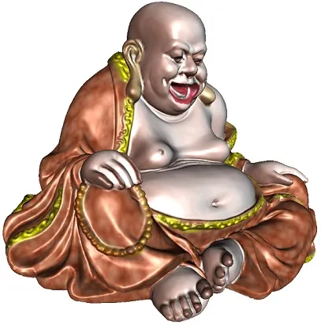 | 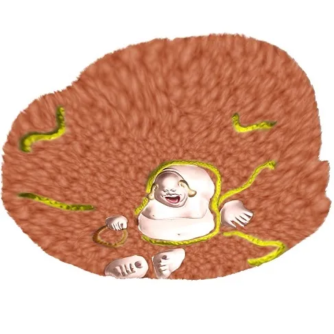 | 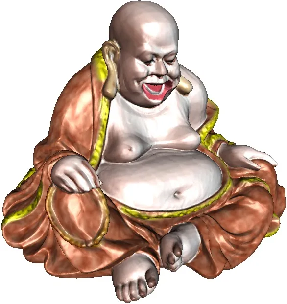 |
| a\. Input manifold                                        | b\. latent representation                                 | c\. reconstructed manifold                                |
| $`M\subset\mathcal{X}`$                                   | $`D=\varphi_{\theta}(M)`$                                 | $`\tilde{M}=\psi_{\theta}(D)`$                            |

Figure 2: Auto-encoder pipeline.

As shown in Fig. 1, suppose $`\mathcal{X}`$ is the _ambient space_,
$`\mu`$ is a probability distribution defined on $`\mathcal{X}`$,
represented as a density function
$`\mu:\mathcal{X}\to\mathbb{R}_{\geq 0}`$. The _support_ of $`\mu`$,

```math
\Sigma(\mu):=\{\mathbf{x}\in\mathcal{X}|\mu(x)>0\}
```

is a low-dimensional manifold. $`(U_{\alpha},\varphi_{\beta})`$ is a
local chart, $`\varphi_{\alpha}:U_{\alpha}\to\mathcal{F}`$ is called an
_encoding map_, the parameter domain $`\mathcal{F}`$ is called the
_latent space_ or _feature space_. A point $`\mathbf{x}\in\Sigma`$ is
called a _sample_, its parameter $`\varphi_{\alpha}(\mathbf{x})`$ is
called the _code_ or _feature_ of $`\mathbf{x}`$. The inverse map
$`\psi_{\alpha}:=\varphi_{\alpha}^{-1}:\mathcal{F}\to\Sigma`$ is called
the _decoding map_. Locally, $`\psi_{\alpha}:\mathcal{F}\to\Sigma`$
gives a local _parametric representation_ of the manifold.

Furthermore, the encoding map
$`\varphi_{\alpha}:U_{\alpha}\to\mathcal{F}`$ induces a _push-forward_
probability measure $`(\varphi_{\alpha})_{*}\mu`$ defined on the latent
space $`\mathcal{F}`$: for any measurable set $`B\subset\mathcal{F}`$,

```math
(\varphi_{\alpha})_{*}\mu(B):=\mu(\varphi_{\alpha}(B)).
```

The goal for deep learning is to learn the encoding map
$`\varphi_{\alpha}`$, decoding map $`\psi_{\alpha}`$, the parametric
representation of the manifold $`\psi_{\alpha}:\mathcal{F}\to\Sigma`$,
furthermore the push-forward probability $`(\varphi_{\alpha})_{*}\mu`$
and so on. In the following, we explain how an autoencoder learns the
manifold and the distribution.

### 3.2 Manifold Learned by an Autoencoder

Autoencoders are commonly used for unsupervised learning \[3\], they
have been applied for compression, denoising, pre-training and so on. In
abstract level, autoencoder learns the low-dimensional structure of data
and represent it as a parametric polyhedral manifold, namely a piecewise
linear (PL) map from latent space (parameter domain) to the ambient
space, the image of the PL mapping is a manifold. Then autoencoder
utilizes the polyhedral manifold as the approximation of the manifold in
data for various applications. In implementation level, an autoencoder
partition the manifold into pieces (by decomposing the ambient space
into cells) and approximate each piece by a hyperplane as shown in
Fig. 2.

Architecturally, an autoencoder is a feedforward, non-recurrent neural
network with the output layer having the same number of nodes as the
input layer, and with the purpose of reconstructing its own inputs. In
general, a bottleneck layer is added for the purpose of dimensionality
reduction. The input space $`\mathcal{X}`$ is the ambient space, the
output space is also the ambient space. The output space of the bottle
neck layer $`\mathcal{F}`$ is the latent space. {diagram} An autoencoder
always consists of two parts, the encoder and the decoder. The encoder
takes a sample $`\mathbf{x}\in\mathcal{X}`$ and maps it to
$`\mathbf{z}\in\mathcal{F}`$, $`\mathbf{z}=\varphi(\mathbf{x})`$, the
image $`\mathbf{z}`$ is usually referred to as _latent representation_
of $`\mathbf{x}`$. The encoder
$`\varphi:\mathcal{X}\rightarrow\mathcal{F}`$ maps $`\Sigma`$ to its
latent representation $`D=\varphi(\Sigma)`$ homemorphically. After that,
the decoder $`\psi:\mathcal{F}\rightarrow\mathcal{X}`$ maps
$`\mathbf{z}`$ to the reconstruction $`\mathbf{\tilde{x}}`$ of the same
shape as $`\mathbf{x}`$,
$`\mathbf{\tilde{x}}=\psi(\mathbf{z})=\psi\circ\varphi(\mathbf{x})`$.
Autoencoders are also trained to minimise reconstruction errors:

```math
\varphi,\psi=\text{argmin}_{\varphi,\psi}\int_{\mathcal{X}}\mathcal{L}(\mathbf{x},\psi\circ\varphi(\mathbf{x}))d\mu(\mathbf{x}),
```

where $`\mathcal{L}(\cdot,\cdot)`$ is the loss function, such as squared
errors. The reconstructed manifold
$`\tilde{\Sigma}=\psi\circ\varphi(\Sigma)`$ is used as an approximation
of $`\Sigma`$.

In practice, both encoder and decoder are implemented as ReLU DNNs,
parameterized by $`\theta`$. Let
$`X=\{\mathbf{x}^{(1)},\mathbf{x}^{(2)},\dots,\mathbf{x}^{k}\}`$ be the
training data set, $`X\subset\Sigma`$, the autoencoder optimizes the
following loss function:

```math
\min_{\theta}\mathcal{L}(\theta)=\min_{\theta}\frac{1}{k}\sum_{i=1}^{k}\|\mathbf{x}^{(i)}-\psi_{\theta}\circ\varphi_{\theta}(\mathbf{x}^{(i)})\|^{2}.
```

Both the encoder $`\varphi_{\theta}`$ and the decoder $`\psi_{\theta}`$
are piecewise linear mappings. The encoder $`\varphi_{\theta}`$ induces
a cell decomposition $`\mathcal{D}(\varphi_{\theta})`$ of the ambient
space

```math
\mathcal{D}(\varphi_{\theta}):\mathcal{X}=\bigcup_{\alpha}U_{\theta}^{\alpha},
```

where $`U_{\theta}^{\alpha}`$ is a convex polyhedron, the restriction of
$`\varphi_{\theta}`$ on it is an affine map. Similarly, the piecewise
linear map $`\psi_{\theta}\circ\varphi_{\theta}`$ induces a polyhedral
cell decomposition $`\mathcal{D}(\psi_{\theta},\varphi_{\theta})`$,
which is a refinement (subdivision) of
$`\mathcal{D}(\varphi_{\theta})`$. The reconstructed polyhedral manifold
has a parametric representation
$`\psi_{\theta}:\mathcal{F}\to\mathcal{X}`$, which approximates the
manifold $`M`$ in the data.

Fig. 2 shows an example to demonstrate the learning results of an
autoencoder. The ambient space $`\mathcal{X}`$ is $`\mathbb{R}^{3}`$,
the manifold $`\Sigma`$ is the buddha surface as shown in frame (a). The
latent space is $`\mathbb{R}^{2}`$, the encoding map
$`\varphi_{\theta}:\mathcal{X}\to D`$ parameterizes the input manifold
to a domain on $`D\subset\mathcal{F}`$ as shown in frame (b). The
decoding map $`\psi_{\theta}:D\to\mathcal{X}`$ reconstructs the surface
into a piecewise linear surface
$`\tilde{\Sigma}=\psi_{\theta}\circ\varphi_{\theta}(\Sigma)`$, as shown
in frame (c). In ideal situation, the composition of the encoder and
decoder $`\psi_{\theta}\circ\varphi_{\theta}\sim id`$ should equal to
the identity map, the reconstruction $`\tilde{\Sigma}`$ should coincide
with the input $`\Sigma`$. In reality, the reconstruction
$`\tilde{\Sigma}`$ is only a piecewise linear approximation of
$`\Sigma`$.

|                                                           |                                                           |                                                           |     |
| --------------------------------------------------------- | --------------------------------------------------------- | --------------------------------------------------------- | --- |
| 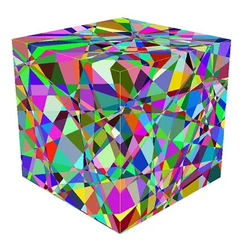 | 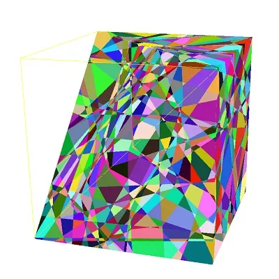 | 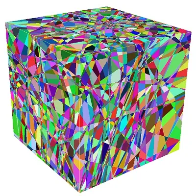 |     |
| d\. cell decomposition                                    | e\. cut view of                                           | f\. cell decomposition                                    |     |
| $`\mathcal{D}(\varphi_{\theta})`$                         | $`\mathcal{D}(\varphi_{\theta})`$                         | $`\mathcal{D}(\psi_{\theta}\circ\varphi_{\theta})`$       |     |

Figure 3: Cell decomposition induced by the encoding, decoding maps.

Fig. 3 shows the cell decompositions induced by the encoding map
$`\mathcal{D}(\varphi_{\theta})`$ and that by the reconstruction map
$`\mathcal{D}(\psi_{\theta}\circ\varphi_{\theta})`$ for another
autoencoder. It is obvious that
$`\mathcal{D}(\psi_{\theta}\circ\varphi_{\theta})`$ subdivides
$`\mathcal{D}(\varphi_{\theta})`$.

### 3.3 Direct Applications

Once the neural network has learned a manifold $`\Sigma`$, it can be
utilized for many applications.

#### Generative Model

Suppose $`\mathcal{X}`$ is the space of all $`n\times n`$ color images,
where each point represents an image. We can define a probability
measure $`\mu`$, which represents the probability for an image to
represent a human face. The shape of a human face is determined by a
finite number of genes. The facial photo is determined by the geometry
of the face, the lightings, the camera parameters and so on. Therefore,
it is sensible to assume all the human facial photos are concentrated
around a finite dimensional manifold, we call it as human facial photo
manifold $`\Sigma`$.

By using many real human facial photos, we can train an autoendoer to
learn the human facial photo manifold. The learning process produces a
decoding map $`\psi_{\theta}:\mathcal{F}\to\tilde{\Sigma}`$, namely a
parametric representation of the reconstructed manifold. We randomly
generate a parameter $`z\in\mathcal{F}`$ (white noise),
$`\varphi_{\theta}(z)\in\tilde{\Sigma}`$ gives a human facial image.
This can be applied as a generative model for generating human facial
photos.

#### Denoising

Tradition image denoising performs Fourier transformation of the input
noisy image, then filtering out the high frequency components, inverse
Fourier transformation to get the denoised image. This method is general
and independent of the content of the image.

|     |
| --- |
|     |

Figure 4: Geometric interpretation of image denoising.

In deep learning, image denoising can be re-interpreted as geometric
projection as shown in Fig. 4. Suppose we perform human facial image
denoising. The clean human facial photo manifold is $`\Sigma`$, the
noisy facial image $`\tilde{p}`$ is not in $`\Sigma`$ but close to
$`\Sigma`$. We project $`\tilde{p}`$ to $`\Sigma`$, the closest point to
$`\tilde{p}`$ on $`\Sigma`$ is $`p`$, then $`p`$ is the denoised image.

|                                                           |                                                           |
| --------------------------------------------------------- | --------------------------------------------------------- |
| 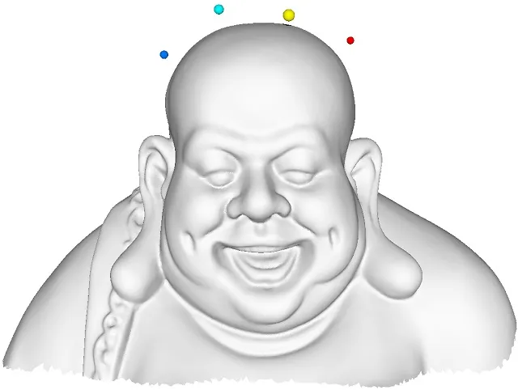 | 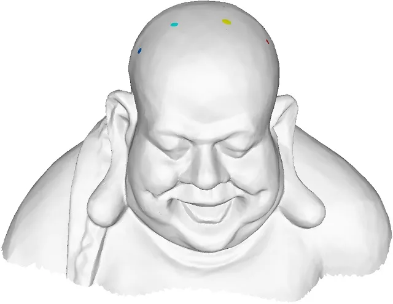 |
| a\. input manifold                                        | b\. reconstructed manifold                                |

Figure 5: Geometric projection.

In practice, suppose an noisy facial image is given $`\mathbf{x}`$, we
train an autoencoder to obtain a manifold of clean facial images
represented as $`\psi_{\theta}:\mathcal{F}\to\mathcal{X}`$ and an
encoding map $`\varphi_{\theta}:\mathcal{X}\to\mathcal{F}`$, then we
encode the noisy image $`\mathbf{z}=\varphi(\mathbf{x})`$, then maps
$`\mathbf{z}`$ to the reconstructed manifold
$`\mathbf{\tilde{x}}=\psi_{\theta}(\mathbf{z})`$. The result
$`\mathbf{\tilde{x}}`$ is the denoised image. Fig. 5 shows the
projection of several outliers onto the buddha surface using an
autoencoder.

|                                                           |                                                            |
| --------------------------------------------------------- | ---------------------------------------------------------- |
| 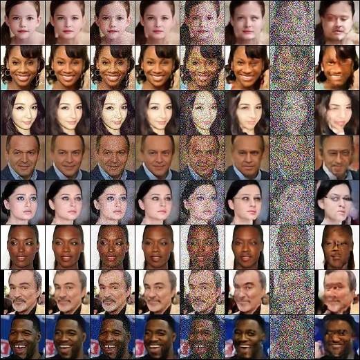 | 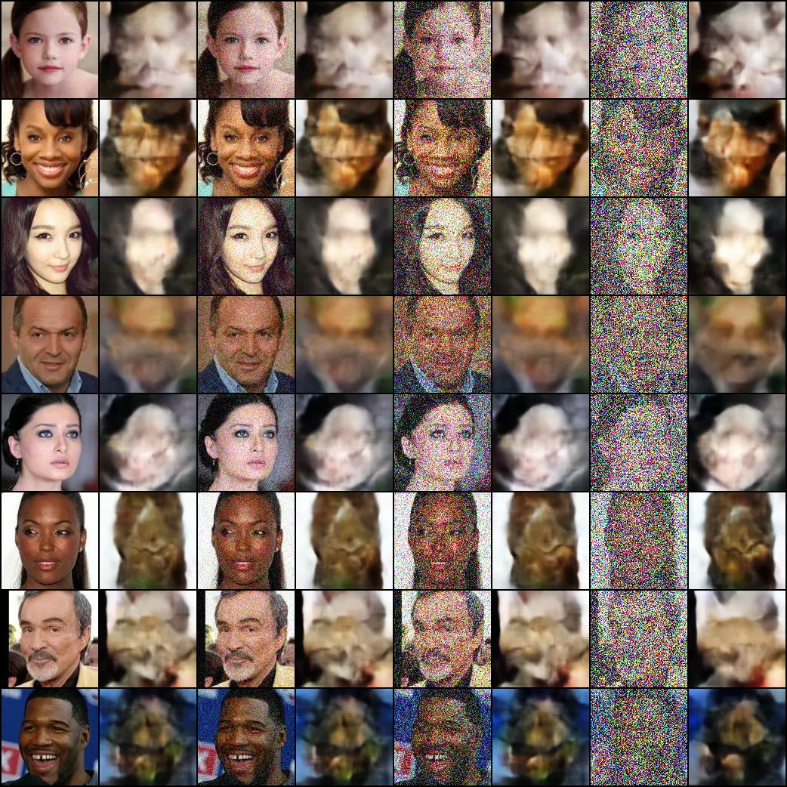 |
| \(a\) project to the human facial                         | \(b\) project to the cat facial                            |
| image manifold                                            | image manifold                                             |

Figure 6: Image denoising.

We apply this method for human facial image denoising as shown in
Fig. 6, in frame (a) we project the noisy image to the human facial
image manifold and obtain good denoising result; in frame (b) we use the
cat facial image manifold, the results are meaningless. This shows deep
learning method heavily depends on the underlying manifold, which is
specific to the problem. Hence the deep learning based method is not as
universal as the conventional ones.

## 4 Learning Capability

|                                                            |                                                            |                                                            |
| ---------------------------------------------------------- | ---------------------------------------------------------- | ---------------------------------------------------------- |
| 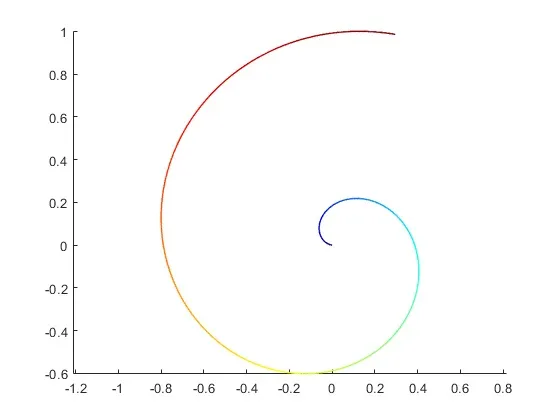 | 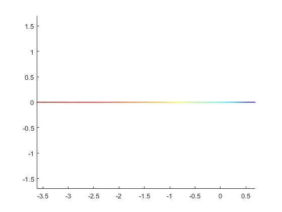 | 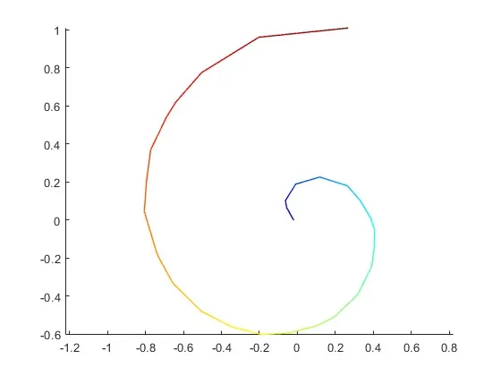 |
| a\. Input manifold                                         | b\. latent representation                                  | c\. reconstructed manifold                                 |
| $`M\subset\mathcal{X}`$                                    | $`D=\varphi_{\theta}(M)`$                                  | $`\tilde{M}=\psi_{\theta}(D)`$                             |
| 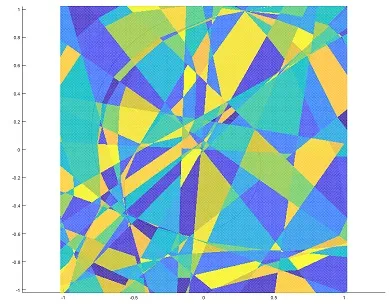 | 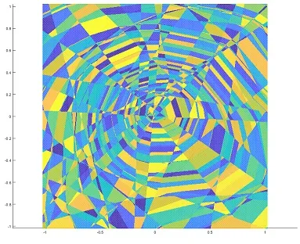 | 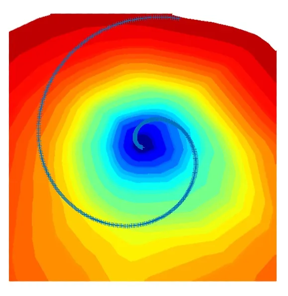 |
| d\. cell decomposition                                     | e\. cell decomposition                                     | f\. level set                                              |
| $`\mathcal{D}(\varphi_{\theta})`$                          | $`\mathcal{D}(\psi_{\theta}\circ\varphi_{\theta})`$        |                                                            |

Figure 7: Encode/decode a spiral curve.

### 4.1 Main Ideas

Fig. 7 shows another example, an Archimedean spiral curve embedded in
$`\mathbb{R}^{2}`$, the curve equation is given by
$`\rho(\theta)=(a+b\theta)e^{iw\theta}`$, $`a,b,w>0`$ are constants,
$`\theta\in(0,T]`$. For relatively small range $`T`$, the encoder
successfully maps it onto a straight line segment, and the decoder
reconstructs a piecewise linear curve with good approximation quality.
When we extend the spiral curve by enlarging $`T`$, then at some
threshold, the autoencoder with the same architecture fails to encode
it.

The central problems we want to answer are as follows:

1.  1.  How to decide the bound of the encoding or representation capability
        for an autoencoder with a fixed ReLU DNN architecture?
2.  2.  How to describe and compute the complexity of a manifold embedded in
        the ambient space to be encoded ?
3.  3.  How to verify whether a embedded manifold can be encoded by a ReLU
        DNN autoencoder?

For the first problem, our solutions are based on the geometric
intuition of the piecewise linear nature of encoder/decoder maps. By
examining fig. 3 and fig. 7, we can see the mapping $`\varphi_{\theta}`$
and $`\psi_{\theta}`$ induces polyhedral cell decompositions of the
ambient space $`\mathcal{X}`$, $`\mathcal{D}(\varphi_{\theta})`$ and
$`\mathcal{D}(\psi_{\theta}\circ\varphi_{\theta})`$ respectively. The
number of cells offers a measurement to describing the representation
capabilities of these maps, the upper bound of the number of cells
$`\max_{\theta}|\mathcal{D}(\varphi_{\theta})|`$ describes the limit of
the encoding capability of $`\varphi_{\theta}`$. We call this upper
bound as the _rectified linear complexity_ of the autoencoder. The
rectified linear complexity can be deduced from the architecture of the
encoder network, as claimed in our theorem 3.

For the second problem, we introduce the similar concept to the embedded
manifold. The encoder map $`\varphi_{\theta}`$ has a very strong
geometric requirement: suppose $`U_{k}`$ is a cell in
$`\mathcal{D}(\varphi_{\theta})`$, then
$`\varphi_{\theta}:U_{k}\to\mathcal{F}`$ is an affine map to the latent
space, its restriction on $`U_{k}\cap\Sigma`$ is a homeomorphism
$`\varphi_{\theta}:U_{k}\cap\Sigma\to\varphi_{\theta}(U_{k}\cap\Sigma)`$.
In order to satisfy the two stringent requirements for the encoding map:
the piecewise ambient linearity and the local homeomorphism, the number
of cells of the decomposition of $`\Sigma`$ (and of $`\mathcal{X}`$)
must be greater than a lower bound. Similarly, we call this lower bound
the _rectified linear complexity_ of the pair of the manifold and the
ambient space $`(\mathcal{X},\Sigma)`$. The rectified linear complexity
can be derived from the geometry of $`\Sigma`$ and its embedding in
$`\mathcal{X}`$. Our theorem 4.12 gives a criteria to verify if a
manifold can be rectified by a linear map.

For the third problem, we can compare the rectified linear complexity of
the manifold and the autoencoder. If the RL complexity of the
autoencoder is less than that of the manifold, then the autoencoder can
not encode the manifold. Specifically, we show that for any autoencoder
with a fixed architecture, there exists an embedded manifold, which can
not be encoded by it.

### 4.2 ReLU Deep Neuron Networks

We extend the ReLU activation function to vectors
$`\mathbf{x}\in\mathbb{R}^{n}`$ through entry-wise operation:

```math
\sigma(x)=(\max\{0,x_{1}\},\max\{0,x_{2}\},\dots,\max\{0,x_{n}\}).
```

For any $`(m,n)\in\mathbb{N}`$, let $`\mathcal{A}_{m}^{n}`$ and
$`\mathcal{L}_{m}^{n}`$ denote the class of affine and linear
transformations from $`\mathbb{R}^{m}\to\mathbb{R}^{n}`$, respectively.

###### Definition 4.1 (ReLU DNN).

For any number of hidden layers $`k\in\mathbb{N}`$, input and output
dimensions $`w_{0},w_{k+1}\in\mathbb{N}`$, a
$`\mathbb{R}^{w_{0}}\to\mathbb{R}^{w_{k+1}}`$ ReLU DNN is given by
specifying a sequence of $`k`$ natural numbers
$`w_{1},w_{2},\dots,w_{k}`$ representing widths of the hidden layers, a
set of $`k`$ affine transformations
$`T_{i}:\mathbb{R}^{w_{i-1}}\to\mathbb{R}^{w_{i}}`$ for $`i=1,\dots,k`$
and a linear transformation
$`T_{k+1}:\mathbb{R}^{w_{k}}\to\mathbb{R}^{w_{k+1}}`$ corresponding to
weights of hidden layers. Such a ReLU DNN is called a $`(k+1)`$-layer
ReLU DNN, and is said to have $`k`$ hidden layers, denoted as
$`N(w_{0},w_{1},\dots,w_{k},w_{k+1})`$.

The mapping
$`\varphi_{\theta}:\mathbb{R}^{w_{0}}\to\mathbb{R}^{w_{k+1}}`$
represented by this ReLU DNN is

```math
\varphi_{\theta}=T_{k+1}\circ\sigma\circ T_{k}\circ\cdots\circ T_{2}\circ\sigma\circ T_{1}, \tag{1}
```

where $`\circ`$ denotes mapping composition, $`\theta`$ represent all
the weight and bias parameters. The depth of the ReLU DNN is $`k+1`$,
the width is $`\max\{w_{1},\dots,w_{k}\}`$, the size
$`w_{1}+w_{2}+\dots+w_{k}`$.

###### Definition 4.2 (PL Mapping).

A mapping $`\varphi:\mathbb{R}^{n}\to\mathbb{R}^{m}`$ is a piecewise
linear mapping if there exists a finite set of polyhedra whose union is
$`\mathbb{R}^{n}`$, and $`\varphi`$ is affine linear over each
polyhedron. The number of pieces of $`\varphi`$ is the number of maximal
connected subsets of $`\mathbb{R}^{n}`$ over which $`\varphi`$ is affine
linear, denoted as $`\mathcal{N}(\varphi)`$. We call
$`\mathcal{N}(\varphi)`$ as the _rectified linear complexity_ of
$`\varphi`$.

###### Definition 4.3 (Rectified Linear Complexity of a ReLU DNN).

Given a ReLU DNN $`N(w_{0},\dots,w_{k+1})`$, its rectified linear
complexity is the upper bound of the rectified linear complexities of
all PL functions $`\varphi_{\theta}`$ represented by $`N`$,

```math
\mathcal{N}(N):=\max_{\theta}\mathcal{N}(\varphi_{\theta}).
```

###### Lemma 4.4.

The maximum number of parts one can get when cutting $`d`$-dimensional
space $`\mathbb{R}^{d}`$ with $`n`$ hyperplanes is denoted as
$`\mathcal{C}(d,n)`$, then

```math
\mathcal{C}(d,n)=\left(\begin{array}[]{c}n\\
0\end{array}\right)+\left(\begin{array}[]{c}n\\
1\end{array}\right)+\left(\begin{array}[]{c}n\\
2\end{array}\right)+\cdots+\left(\begin{array}[]{c}n\\
d\end{array}\right). \tag{2}
```

###### Proof.

Suppose $`n`$ hyperplanes cut $`\mathbb{R}^{d}`$ into
$`\mathcal{C}(d,n)`$ cells, each cell is a convex polyhedron. The
$`(n+1)`$-th hyperplane is $`\pi`$, then the first $`n`$ hyperplanes
intersection $`\pi`$ and partition $`\pi`$ into $`\mathcal{C}(d-1,n)`$
cells, each cell on $`\pi`$ partitions a polyhedron in
$`\mathbb{R}^{d}`$ into $`2`$ cells, hence we get the formula

```math
\mathcal{C}(d,n+1)=\mathcal{C}(d,n)+\mathcal{C}(d-1,n).
```

It is obvious that $`\mathcal{C}(2,1)=2`$, the formula (2) can be easily
obtained by induction. ∎

###### Theorem 4.5 (Rectified Linear Complexity of a ReLU DNN).

Given a ReLU DNN $`N(w_{0},\dots,w_{k+1})`$, representing PL mappings
$`\varphi_{\theta}:\mathbb{R}^{w_{0}}\to\mathbb{R}^{w_{k+1}}`$ with
$`k`$ hidden layers of widths $`\{w_{i}\}_{i=1}^{k}`$, then the linear
rectified complexity of $`N`$ has an upper bound,

```math
\mathcal{N}(N)\leq\Pi_{i=1}^{k+1}\mathcal{C}(w_{i-1},w_{i}). \tag{3}
```

###### Proof.

The $`i`$-th hidden layer computes the mapping
$`T_{i}:\mathbb{R}^{w_{i-1}}\to\mathbb{R}^{w_{i}}`$. Each neuron
represents a hyperplane in $`\mathbb{R}^{w_{i-1}}`$, the $`w_{i}`$
hyperplanes partition the whole space into
$`\mathcal{C}(w_{i-1},w_{i})`$ polyhedra.

The first layer partitions $`\mathbb{R}^{w_{0}}`$ into at most
$`\mathcal{C}(w_{0},w_{1})`$ cells; the second layer further subdivides
the cell decomposition, each cell is at most subdivides into
$`\mathcal{C}(w_{1},w_{2})`$ polyhedra, hence two layers partition the
source space into at most
$`\mathcal{C}(w_{0},w_{1})\mathcal{C}(w_{1},w_{2})`$. By induction, one
can obtain the upper bound of $`\mathcal{N}(N)`$ as described by the
inequality (2). ∎

### 4.3 Cell Decomposition

The PL mappings induces cell decompositions of both the ambient space
$`\mathcal{X}`$ and the latent space $`\mathcal{F}`$. The number of
cells is closely related to the rectified linear complexity.

Fix the encoding map $`\varphi_{\theta}`$ , let the set of all neurons
in the network is denoted as $`\mathcal{S}`$, all the subsets is denoted
as $`2^{\mathcal{S}}`$.

###### Definition 4.6 (Activated Path).

Given a point $`\mathbf{x}\in\mathcal{X}`$, the _activated path_ of
$`\mathbf{x}`$ consists all the activated neurons when
$`\varphi_{\theta}(\mathbf{x})`$ is evaluated, and denoted as
$`\rho(\mathbf{x})`$. Then the activated path defines a set-valued
function $`\rho:\mathcal{X}\to 2^{\mathcal{S}}`$.

###### Definition 4.7 (Cell Decomposition).

Fix an encoding map $`\varphi_{\theta}`$ represented by a ReLU RNN, two
data points $`\mathbf{x}_{1},\mathbf{x}_{2}\in\mathcal{X}`$ are
_equivalent_, denoted as $`\mathbf{x}_{1}\sim\mathbf{x}_{2}`$, if they
share the same activated path,
$`\rho(\mathbf{x}_{1})=\rho(\mathbf{x}_{2})`$. Then each equivalence
relation partitions the ambient space $`\mathcal{X}`$ into cells,

```math
\mathcal{D}(\varphi_{\theta}):\mathcal{X}=\bigcup_{\alpha}U_{\alpha},
```

each equivalence class corresponds to a cell:
$`\mathbf{x}_{1},\mathbf{x}_{2}\in U_{\alpha}`$ if and only if
$`\mathbf{x}_{1}\sim\mathbf{x}_{2}`$. $`\mathcal{D}(\varphi_{\theta})`$
is called the cell decomposition induced by the encoding map
$`\varphi_{\theta}`$.

Furthermore, $`\varphi_{\theta}`$ maps the cell decomposition in the
ambient space $`\mathcal{D}(\varphi_{\theta})`$ to a cell decomposition
in the latent space. Similarly, the composition of the encoding and
decoding maps also produces a cell decomposition, denoted as
$`\mathcal{D}(\psi_{\theta}\circ\varphi_{\theta})`$, which subdivises
$`\mathcal{D}(\varphi_{\theta})`$. Fig. 2 bottom row shows these cell
decompositions.

### 4.4 Learning Difficulty

###### Definition 4.8 (Linear Rectifiable Manifold).

Suppose $`\Sigma`$ is a $`m`$-dimensional manifold, embedded in
$`\mathbb{R}^{n}`$, we say $`\Sigma`$ is linear rectifiable, if there
exists an affine map $`\varphi:\mathbb{R}^{n}\to\mathbb{R}^{m}`$, such
that the restriction of $`\varphi`$ on $`\Sigma`$,
$`\varphi|_{\Sigma}:\Sigma\to\varphi(\Sigma)\subset\mathbb{R}^{m}`$, is
homeomorphic. $`\varphi`$ is called the corresponding rectified linear
map of $`M`$.

###### Definition 4.9 (Linear Rectifiable Atlas).

Suppose $`\Sigma`$ is a $`m`$-dimensional manifold, embedded in
$`\mathbb{R}^{n}`$, $`\mathcal{A}=\{(U_{\alpha},\varphi_{\alpha}\}`$ is
an atlas of $`M`$. If each chart $`(U_{\alpha},\varphi_{\alpha})`$ is
linear rectifiable, $`\varphi_{\alpha}:U_{\alpha}\to\mathbb{R}^{m}`$ is
the rectified linear map of $`U_{\alpha}`$, then the atlas is called a
linear rectifiable atlas of $`\Sigma`$.

Given a compact manifold $`\Sigma`$ and its atlas $`\mathcal{A}`$, one
can select a finite number of local charts
$`\mathcal{\tilde{A}}=\{(U_{i},\varphi_{i})\}_{i=1}^{n}`$,
$`\mathcal{\tilde{A}}`$ still covers $`\Sigma`$. The number of charts of
an atlas $`\mathcal{A}`$ is denoted as $`|\mathcal{A}|`$.

###### Definition 4.10 (Rectified Linear Complexity of a Manifold).

Suppose $`\Sigma`$ is a $`m`$-dimensional manifold embedded in
$`\mathbb{R}^{n}`$, the rectified linear complexity of $`\Sigma`$ is
denoted as $`\mathcal{N}(\mathbb{R}^{n},\Sigma)`$ and defined as,

```math
\mathcal{N}(\mathbb{R}^{n},\Sigma):=\min\left\{|\mathcal{A}|~~|\mathcal{A}~\text{is a linear rectifiable~altas~of~}\Sigma\right\}. \tag{4}
```

### 4.5 Learnable Condition

###### Definition 4.11 (Encoding Map).

Suppose $`M`$ is a $`m`$-dimensional manifold, embedded in
$`\mathbb{R}^{n}`$, a continuous mapping
$`\varphi:\mathbb{R}^{n}\to\mathbb{R}^{m}`$ is called an encoding map of
$`(\mathbb{R}^{n},\Sigma)`$, if restricted on $`\Sigma`$,
$`\varphi|_{\Sigma}:\Sigma\to\varphi(\Sigma)\subset\mathbb{R}^{m}`$ is
homeomorphic.

###### Theorem 4.12.

Suppose a ReLU DNN $`N(w_{0},\dots,w_{k+1})`$ represents a PL mapping
$`\varphi_{\theta}:\mathbb{R}^{n}\to\mathbb{R}^{m}`$, $`\Sigma`$ is a
$`m`$-dimensional manifold embedded in $`\mathbb{R}^{n}`$. If
$`\varphi_{\theta}`$ is an encoding mapping of
$`(\mathbb{R}^{n},\Sigma)`$, then the rectified linear complexity of
$`N`$ is no less that the rectified linear complexity of
$`(\mathbb{R}^{n},\Sigma)`$,

```math
\mathcal{N}(\mathbb{R}^{n},\Sigma)\leq\mathcal{N}(\varphi_{\theta})\leq\mathcal{N}(N).
```

###### Proof.

The ReLU DNN computes the PL mapping $`\varphi_{\theta}`$, suppose the
corresponding cell decomposition of $`\mathbb{R}^{n}`$ is

```math
\mathcal{D}(\varphi_{\theta}):\mathbb{R}^{n}=\bigcup_{i=1}^{k}U_{i},
```

where each $`U_{i}`$ is a convex polyhedron,
$`k\leq\mathcal{N}(\varphi_{\theta})`$. If $`\varphi_{\theta}`$ is an
encoding map of $`\Sigma`$, then

```math
\mathcal{A}:=\{(D_{i},\varphi_{\theta}|_{D_{i}})|D_{i}\cap\Sigma\neq\emptyset\}
```

form a linear rectifiable atlas of $`\Sigma`$. Hence from the definition
of rectified linear complexity of an ReLU DNN and the manifold, we
obtain

```math
\mathcal{N}(\mathbb{R}^{n},\Sigma)\leq\mathcal{N}(\varphi_{\theta})\leq\mathcal{N}(\varphi).
```

∎

The encoding map $`\varphi_{\theta}:\mathcal{X}\to\mathcal{F}`$ is
required to be homeomorphic, this adds strong topological constraints to
the manifold $`\Sigma`$. For example, if $`\Sigma`$ is a surface,
$`\mathcal{F}`$ is $`\mathbb{R}^{2}`$, then $`\Sigma`$ must be a genus
zero surface with boundaries. In general, assume
$`\varphi_{\theta}(\Sigma)`$ is a simply connected domain in
$`\mathcal{F}=\mathbb{R}^{m}`$, then $`\Sigma`$ must be a
$`m`$-dimensional topological disk. The topological constraint implies
that autoencoder can only learn manifolds with simple topologies, or a
local chart of the whole manifold.

On the other hand, the geometry and the embedding of $`\Sigma`$
determines the linear rectifiability of $`(\Sigma,\mathbb{R}^{n})`$.

###### Lemma 4.13.

Suppose a $`n`$ dimensional manifold $`\Sigma`$ is embedded in
$`\mathbb{R}^{n+1}`$, {diagram} where $`G:\Sigma\to\mathbb{S}^{n}`$ is
the Gauss map, $`\mathbb{RP}^{n}`$ is the real projective space, the
projection $`p:\mathbb{S}^{n}\to\mathbb{RP}^{n}`$ maps antipodal points
to the same point, if $`p\circ G(\Sigma)`$ covers the whole
$`\mathbb{RP}^{n}`$, then $`\Sigma`$ is not linear rectifiable.

###### Proof.

Given any unit vector $`\mathbf{v}\in\mathbb{R}^{n+1}`$, all the unit
vectors orthogonal to $`\mathbf{v}`$ form a sphere
$`\mathbb{S}^{n-2}(\mathbf{v})`$, then
$`p(\mathbb{S}^{n-2}(\mathbf{v}))\cap\mathbb{RP}^{n}\neq\emptyset`$,
therefore there is a point $`q\in\Sigma`$, $`\mathbf{v}`$ is in the
tangent space at $`q`$. Line $`q+t\mathbf{v}`$ is tangent to $`\Sigma`$,
by shifting the line by an infinitesimal amount, the line intersects
$`\Sigma`$ at two points. This shows there is no linear mapping, which
projects $`\Sigma`$ onto $`\mathbb{R}^{n}`$ along $`\mathbf{v}`$.
Because $`\mathbf{v}`$ is arbitrary, $`\Sigma`$ is not linear
rectifiable. ∎

|                        |                            |                           |                           |
| ---------------------- | -------------------------- | ------------------------- | ------------------------- |
|                        |                            |                           |                           |
| a\. linear rectifiable | b\. non-linear-rectifiable | c\. $`C_{1}`$ Peano curve | d\. $`C_{2}`$ Peano curve |

Figure 8: Linear rectifiable and non-linear-rectifiable curves.

###### Theorem 4.14.

Given any ReLU deep neural network
$`N(w_{0},w_{1},\dots,w_{k},w_{k+1})`$, there is a manifold $`\Sigma`$
embedded in $`\mathbb{R}^{w_{0}}`$, such that $`\Sigma`$ can not be
encoded by $`N`$.

###### Proof.

First, we prove the simplest case. When $`(w_{0},w_{k+1})=(2,1)`$, we
can construct space filling Peano curves, as shown in Fig. 8. Suppose
$`C_{1}`$ is shown in the left frame, we make $`4`$ copies of $`C_{1}`$,
by translation, rotation, reconnection and scaling to construct
$`C_{2}`$, as shown in the right frame. Similarly, we can construct all
$`C_{k}`$’s. The red square shows one unit, $`C_{1}`$ has $`16`$ units,
$`C_{n}`$ has $`4^{n+1}`$ units. Each unit is not rectifiable, therefore

```math
\mathcal{N}(\mathbb{R}^{2},C_{n})\geq 4^{n+1}.
```

We can choose $`n`$ big enough, such that $`4^{n+1}>\mathcal{N}(N)`$,
then $`C_{n}`$ can not be encoded by $`N`$.

Similarly, for any $`w_{0}`$ and $`w_{k+1}=1`$, we can construct Peano
curves to fill $`\mathbb{R}^{w_{0}}`$, which can not be encoded by
$`N`$. The Peano curve construction can be generalized to higher
dimensional manifolds by direct product with unit intervals. ∎

## 5 Control Induced Measure

|                                                            |                                                            |
| ---------------------------------------------------------- | ---------------------------------------------------------- |
| 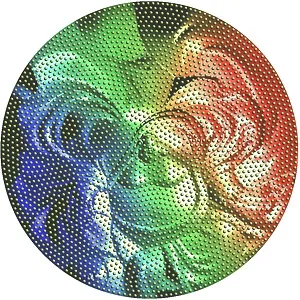 | 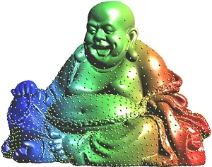 |
| 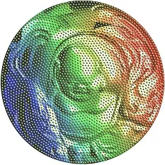 | 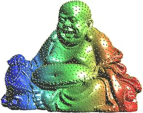 |

Figure 9: Control distributions by optimal mass transportation.

In generative models, such as VAE \[15\] or GAN \[1\], the probability
measure in the latent space induced by the encoding mapping
$`(\varphi_{\theta})_{*}\mu`$ is controlled to be simple distributions,
such as Gaussian or uniform, then in the generating process, we can
sample from the simple distribution in the latent space, and use the
decoding map to produce a sample in the ambient space.

The buddha surface $`\Sigma`$ is conformally mapped onto the planar unit
disk $`\varphi:\Sigma\to\mathbb{D}`$ using the Ricci flow method \[32\],
the uniform distribution on the parameter domain induces a non-uniform
distribution on the surface, as shown in the top row of Fig. 9. Then by
composing with an optimal mass transportation map
$`\psi:\mathbb{D}\to\mathbb{D}`$ using the algorithm in \[25\], one
obtain an area-preserving mapping
$`\psi\circ\varphi:\Sigma\to\mathbb{D}`$, the image is shown in the
bottom row of Fig. 9 left frame. Then we uniformly sample the planar
disk to get the samples
$`\mathbf{Z}=\{\mathbf{z}_{1},\dots,\mathbf{z}_{k}\}`$, then pull them
back on to $`\Sigma`$ by $`\psi\circ\varphi`$,
$`\mathbf{X}=\{\mathbf{x}_{1},\dots,\mathbf{x}_{k}\}`$,
$`x_{i}=(\psi\circ\varphi)^{-1}(z_{i})`$. Because $`\psi\circ\varphi`$
is area-preserving, $`\mathbf{Z}`$ is uniformly distributed on the disk,
$`\mathbf{X}`$ is uniformly distributed on $`\Sigma`$ as shown in the
bottom row of Fig. 9 right frame.

#### Optimal Mass Transportation

The optimal transportation theory can be found in Villani’s classical
books \[27\]\[28\]. Suppose $`\nu=(\varphi_{\theta})_{*}\mu`$ is the
induced probability in the latent space with a convex support
$`\Omega\subset\mathcal{F}`$, $`\zeta`$ is the simple distribution, e.g.
the uniform distribution on $`\Omega`$. A mapping $`T:\Omega\to\Omega`$
is measure-preserving if $`T_{*}\nu=\zeta`$. Given the transportation
cost between two points $`c:\Omega\times\Omega\to\mathbb{R}`$, the
transportation cost of $`T`$ is defined as

```math
\mathcal{E}(T):=\int_{\Omega}c(\mathbf{x},T(\mathbf{x}))d\nu(\mathbf{x}).
```

The _Wasserstein distance_ between $`\nu`$ and $`\zeta`$ is defined as

```math
\mathcal{W}(\nu,\zeta):=\inf_{T_{*}\nu=\zeta}\mathcal{E}(T).
```

The measure-preserving map $`T`$ that minimizes the transportation cost
is called the _optimal mass transportation map_.

Kantorovich proved that the Wasserstein distance can be represented as

```math
\mathcal{W}(\nu,\zeta):=\max_{f}\int_{\Omega}fd\nu+\int_{\Omega}f^{c}d\zeta
```

where $`f:\Omega\to\mathbb{R}`$ is called the Kontarovhich potential,
its c-transform

```math
f^{c}(\mathbf{y}):=\inf_{\mathbf{x}\in\Omega}{c(\mathbf{x},\mathbf{y})-f(\mathbf{x})}.
```

In WGAN, the discriminator computes the generator computes the decoding
map $`\psi_{\theta}:\mathcal{F}\to\mathcal{X}`$, the discriminator
computes the Wasserstein distance between $`(\psi_{\theta})_{*}\zeta`$
and $`\mu`$. If the cost function is chosen to be the $`L^{1}`$ norm,
$`c(\mathbf{x},\mathbf{y})=|\mathbf{x}-\mathbf{y}|`$, $`f`$ is
1-Lipsitz, then $`f^{c}=-f`$, the discriminator computes the Kontarovich
potential, the generator computes the optimal mass transportation map,
hence WGAN can be modeled as an optimization

```math
\min_{\theta}\max_{f}\int_{\Omega}f\circ\psi_{\theta}(\mathbf{z})d\zeta(\mathbf{z})-\int_{\mathcal{X}}f(x)d\mu(x).
```

The competition between the discriminator and the generator leads to the
solution.

If we choose the cost function to be the $`L^{2}`$ norm,
$`c(\mathbf{x},\mathbf{y})=\frac{1}{2}|\mathbf{x}-\mathbf{y}|^{2}`$,
then the computation can be greatly simplified. Briener’s theorem \[6\]
claims that there exists a convex function $`u:\Omega\to\mathbb{R}`$,
the so-called Brenier’s potential, such that its gradient map
$`\nabla u:\Omega\to\Omega`$ gives the optimal mass transportation map.
The Brenier’s potential satisfies the Monge-Ampere equation

```math
\text{det}\left(\frac{\partial^{2}u}{\partial x_{i}\partial x_{j}}\right)=\frac{\nu(\mathbf{x})}{\zeta(\nabla u(\mathbf{x}))}.
```

Geometrically, the Monge-Ampere equation can be understood as solving
Alexandroff problem: finding a convex surface with prescribed Gaussian
curvature. A practical algorithm based on variational principle can be
found in \[13\]. The Brenier’s potential and the Kontarovich’s potential
are related by the closed form

```math
u(\mathbf{x})=\frac{1}{2}|\mathbf{x}|^{2}-f(\mathbf{x}). \tag{5}
```

Eqn.(5) shows that: the generator computes the optimal transportation
map $`\nabla u`$, the discriminator computes the Wasserstein distance by
finding Kontarovich’s potential $`f`$; $`u`$ and $`f`$ can be converted
to each other, hence the competition between the generator and the
discriminator is unnecessary, the two deep neural networks for the
generator and the discriminator are redundant.

#### Autoencoder-OMT model

|     |
| --- |
|     |

Figure 10: Autoencoder combined with a optimal transportation map.

As shown in Fig. 10, we can use autoencoder to realize encoder
$`\varphi_{\theta}:\mathcal{X}\to\mathcal{F}`$ and decoder
$`\psi_{\theta}:\mathcal{F}\to\mathcal{X}`$, use OMT in the latent space
to realize probability transformation $`T:\mathcal{F}\to\mathcal{F}`$,
such that

```math
T_{*}\zeta=(\varphi_{\theta})_{*}\mu.
```

We call this model as OMT-autoencoder.

|                                                                               |                                                                               |
| ----------------------------------------------------------------------------- | ----------------------------------------------------------------------------- |
| ![[Uncaptioned image]](arxiv-1805-10451--bd4a0497e6da.figures/figure-21.webp) | ![[Uncaptioned image]](arxiv-1805-10451--bd4a0497e6da.figures/figure-22.webp) |
| \(a\) real digits                                                             | \(b\) VAE                                                                     |
| ![[Uncaptioned image]](arxiv-1805-10451--bd4a0497e6da.figures/figure-23.webp) | ![[Uncaptioned image]](arxiv-1805-10451--bd4a0497e6da.figures/figure-24.webp) |
| \(c\) WGAN                                                                    | \(d\) AE-OMT                                                                  |

Fig. 5 shows the experiments on the MNIST data set. The digits generates
by OMT-AE have better qualities than those generated by VAE and WGAN.
Fig.(5) shows the human facial images on CelebA data set. The images
generated by OMT-AE look better than those produced by VAE.

|                                                                               |                                                                               |
| ----------------------------------------------------------------------------- | ----------------------------------------------------------------------------- |
| ![[Uncaptioned image]](arxiv-1805-10451--bd4a0497e6da.figures/figure-25.webp) | ![[Uncaptioned image]](arxiv-1805-10451--bd4a0497e6da.figures/figure-26.webp) |
| \(a\) VAE                                                                     | \(d\) AE-OMT                                                                  |

## 6 Conclusion

This work gives a geometric understanding of autoencoders and general
deep neural networks. The underlying principle is the manifold structure
hidden in data, which attributes to the great success of deep learning.
The autoencoders learn the manifold structure and construct a parametric
representation. The concepts of rectified linear complexities are
introduced to both DNN and manifold, which describes the fundamental
learning limitation of the DNN and the difficulty to be learned of the
manifold. By applying the concept of complexities, it is shown that for
any DNN with fixed architecture, there is a manifold too complicated to
be encoded by the DNN. Experiments on surfaces show the approximation
accuracy can be improved. By applying $`L^{2}`$ optimal mass
transportation theory, the probability distribution in the latent space
can be fully controlled in a more understandable and more efficient way.

In the future, we will develop refiner estimates for the complexities of
the deep neural networks and the embedding manifolds, generalize the
geometric framework to other deep learning models.

## Appendix

Here we illustrate some examples and explain the implementation details.

|                                                            |                                                            |                                                            |                                                            |
| ---------------------------------------------------------- | ---------------------------------------------------------- | ---------------------------------------------------------- | ---------------------------------------------------------- |
| 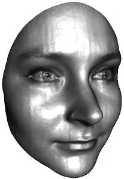 | 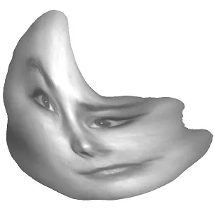 | 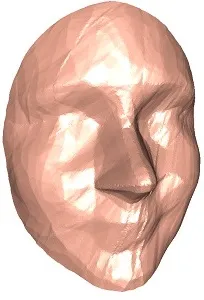 | 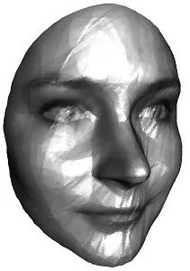 |
| input manifold                                             | latent representation                                      | reconstructed manifold                                     | reconstructed manifold                                     |

Figure 11: A human facial surface is encoded/decoded by an autoencoder.

#### Facial Surface

Fig. 11 shows a human facial surface $`\Sigma`$ is encoded/decoded by an
autoencoder. From the image, it can be seen that the encoding/decoding
maps are homeomorphic. The Hausdorff distance between the input surface
and the reconstructed surface is relatively small, but the normal
deviation is big. The geometric details around the mouth area are lost
during the process. There are a lot of local curvature fluctuations.
Furthermore, the shape of the encoding image (parameter image) in the
latent space is highly irregular, this creates difficulty for generating
random samples on the reconstructed manifold.

|                                                            |                                                            |                                                            |
| ---------------------------------------------------------- | ---------------------------------------------------------- | ---------------------------------------------------------- |
| 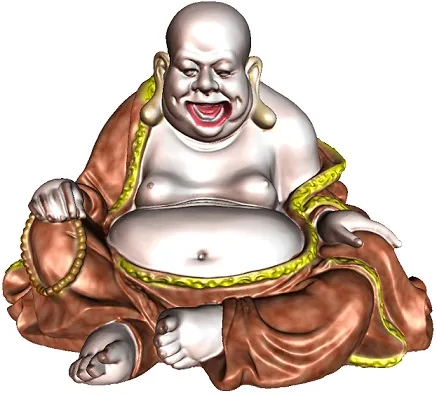 | 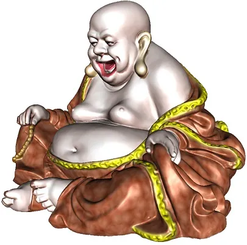 | 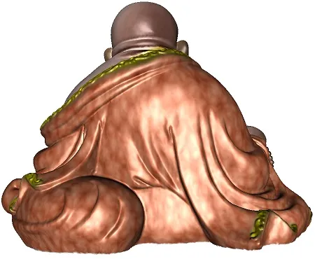 |
| a\. front view                                             | b\. left view                                              | c\. back view                                              |
| 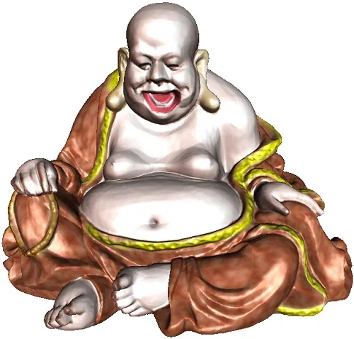 | 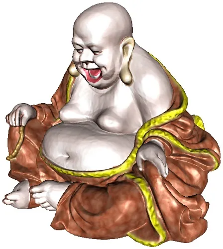 | 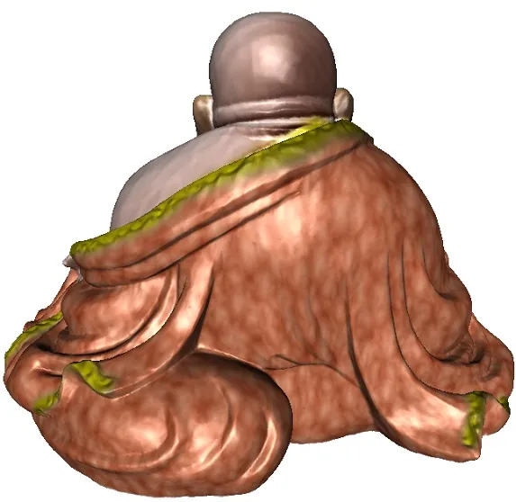 |
| d\. right view                                             | e\. front view                                             | f\. back view                                              |

Figure 12: top row: input manifold;bottom row, reconstructed manifold.

#### Buddha Model

Fig. 12 shows the buddha model, the top row shows the three views of the
input surface, the bottom row shows the reconstructed surface. The
encoder network architecture is $`\{3,768,384,192,96,48,2\}`$, the
decoder network is $`\{2,48,96,192,384,768,3\}`$. The input and output
spaces are $`\mathbb{R}^{3}`$, the latent space is $`\mathbb{R}^{2}`$.
We use ReLU as the activation function in hidden layers except the
latent space layer. The loss function is the mean squared error between
the input and the target. Adam optimizer is used in this autoencoder and
the weight decay is set to $`0`$ in the optimizer. From the figure, we
can see the reconstruction approximates the original surface with high
accuracy, all the subtle geometric features are well preserved. We
uniformly sample the surface, there are $`235,771`$ samples in total.
The number of cells in the cell decomposition induced by the
reconstruction map is $`230051`$. We see that the autoencoder produces a
highly refined cell decomposition to capture all the geometric details
of the input surface. The source code and the data set can be found in
\[34\]. If we reduce the number of neurons and add regularize the output
surface, then the reconstructed surface loses geometric details, and
preserves the major shape as shown in Fig. 13. Furthermore, the mapping
is not homeomorphic either, near the mouth and finger areas, the mapping
is degenerated.

|                                                            |                                                            |                                                            |
| ---------------------------------------------------------- | ---------------------------------------------------------- | ---------------------------------------------------------- |
| 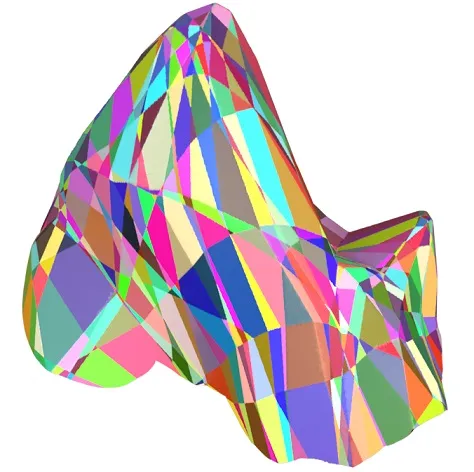 | 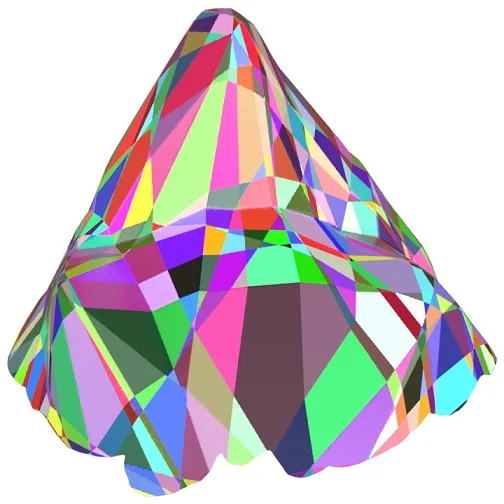 | 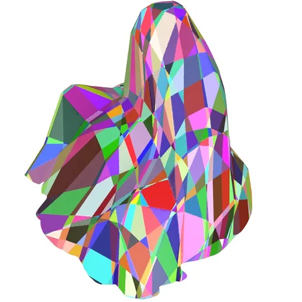 |
| a\. right view                                             | b\. front view                                             | back view                                                  |

Figure 13: Reconstructed manifold with cell decomposition produced by an
autoencoder with half of the neurons.

## Acknowledgement

The authors thank our students: Yang Guo, Dongsheng An, Jingyao Ke,
Huidong Liu for all the experimental results, also thank our
collaborators: Feng Luo, Kefeng Liu, Dimitris Samaras for the helpful
discussions.

## References

- \[1\] Martin Arjovsky, Soumith Chintala, and Léon Bottou. Wasserstein
  generative adversarial networks. International Conference on Machine
  Learning, pages 214–223, 2017.
- \[2\] P. Baldi and K. Hornik. Neural networks and principal component
  analysis: Learning from examples without local minima. Neural Netw.,
  2(1):53–58, January 1989.
- \[3\] Yoshua Bengio, Aaron Courville, and Pascal Vincent.
  Representation learning: A review and new perspectives. IEEE Trans.
  Pattern Anal. Mach. Intell., 35(8):1798–1828, August 2013.
- \[4\] Yoshua Bengio and Yann LeCun. Scaling learning algorithms
  towards AI. In Leon Bottou, Olivier Chapelle, D. DeCoste, and
  J. Weston, editors, Large Scale Kernel Machines. MIT Press, 2007.
- \[5\] Yoshua Bengio, Li Yao, Guillaume Alain, and Pascal Vincent.
  Generalized denoising auto-encoders as generative models. In
  Proceedings of the 26th International Conference on Neural Information
  Processing Systems - Volume 1, NIPS’13, pages 899–907, USA, 2013.
  Curran Associates Inc.
- \[6\] Yann Brenier. Polar factorization and monotone rearrangement of
  vector-valued functions. Comm. Pure Appl. Math., 44(4):375–417, 1991.
- \[7\] Chakravarty R. Alla Chaitanya, Anton S. Kaplanyan, Christoph
  Schied, Marco Salvi, Aaron Lefohn, Derek Nowrouzezahrai, and Timo
  Aila. Interactive reconstruction of monte carlo image sequences using
  a recurrent denoising autoencoder. ACM Trans. Graph.,
  36(4):98:1–98:12, July 2017.
- \[8\] J. Deng, Z. Zhang, E. Marchi, and B. Schuller. Sparse
  autoencoder-based feature transfer learning for speech emotion
  recognition. In 2013 Humaine Association Conference on Affective
  Computing and Intelligent Interaction, pages 511–516, Sept 2013.
- \[9\] X. Feng, Y. Zhang, and J. Glass. Speech feature denoising and
  dereverberation via deep autoencoders for noisy reverberant speech
  recognition. In 2014 IEEE International Conference on Acoustics,
  Speech and Signal Processing (ICASSP), pages 1759–1763, May 2014.
- \[10\] Peter Földiák and Malcolm P. Young. The handbook of brain
  theory and neural networks. chapter Sparse Coding in the Primate
  Cortex, pages 895–898. MIT Press, Cambridge, MA, USA, 1998.
- \[11\] L. Gondara. Medical image denoising using convolutional
  denoising autoencoders. In 2016 IEEE 16th International Conference on
  Data Mining Workshops (ICDMW), pages 241–246, Dec 2016.
- \[12\] Ian Goodfellow, Yoshua Bengio, and Aaron Courville. Deep
  Learning. MIT Press, 2016.
- \[13\] Xianfeng Gu, Feng Luo, Jian Sun, and Shing-Tung Yau.
  Variational principles for minkowski type problems, discrete optimal
  transport, and discrete monge-ampere equations. Asian Journal of
  Mathematics (AJM), 20(2):383 ¨C 398, 2016.
- \[14\] Geoffrey Hinton and Ruslan Salakhutdinov. Reducing the
  dimensionality of data with neural networks. Science, 313(5786):504 –
  507, 2006.
- \[15\] Diederik P. Kingma and Max Welling. Auto-encoding variational
  bayes. CoRR, abs/1312.6114, 2013.
- \[16\] B. Lévy, S. Petitjean, N. Ray, and J. Maillot. Least squares
  conformal maps for automatic texture generation. ACM Trans. on
  Graphics (SIGGRAPH), 21(2):362–371, 2002.
- \[17\] Alireza Makhzani, Jonathon Shlens, Navdeep Jaitly, and Ian
  Goodfellow. Adversarial autoencoders. In International Conference on
  Learning Representations, 2016.
- \[18\] Andrew Ng. Sparse autoencoder. CS294A Lecture Notes,
  December 2011.
- \[19\] Bruno A. Olshausen and David J. Field. Sparse coding with an
  overcomplete basis set: A strategy employed by v1? Vision Research,
  37(23):3311 – 3325, 1997.
- \[20\] Marc’ Aurelio Ranzato, Y-Lan Boureau, and Yann LeCun. Sparse
  feature learning for deep belief networks. In Proceedings of the 20th
  International Conference on Neural Information Processing Systems,
  NIPS’07, pages 1185–1192, USA, 2007. Curran Associates Inc.
- \[21\] Marc’Aurelio Ranzato, Christopher Poultney, Sumit Chopra, and
  Yann LeCun. Efficient learning of sparse representations with an
  energy-based model. In Proceedings of the 19th International
  Conference on Neural Information Processing Systems, NIPS’06, pages
  1137–1144, Cambridge, MA, USA, 2006. MIT Press.
- \[22\] Salah Rifai, Yoshua Bengio, Yann N. Dauphin, and Pascal
  Vincent. A generative process for sampling contractive auto-encoders.
  In Proceedings of the 29th International Coference on International
  Conference on Machine Learning, ICML’12, pages 1811–1818, USA, 2012.
  Omnipress.
- \[23\] Salah Rifai, Grégoire Mesnil, Pascal Vincent, Xavier Muller,
  Yoshua Bengio, Yann Dauphin, and Xavier Glorot. Higher order
  contractive auto-encoder. In Proceedings of the 2011 European
  Conference on Machine Learning and Knowledge Discovery in Databases -
  Volume Part II, ECML PKDD’11, pages 645–660, Berlin, Heidelberg, 2011.
  Springer-Verlag.
- \[24\] Salah Rifai, Pascal Vincent, Xavier Muller, Xavier Glorot, and
  Yoshua Bengio. Contractive auto-encoders: Explicit invariance during
  feature extraction. In Proceedings of the 28th International
  Conference on International Conference on Machine Learning, ICML’11,
  pages 833–840, USA, 2011. Omnipress.
- \[25\] Zhengyu Su, Yalin Wang, Rui Shi, Wei Zeng, Jian Sun, Feng Luo,
  and Xianfeng Gu. Optimal mass transport for shape matching and
  comparison. IEEE Trans. Pattern Anal. Mach. Intell.,
  37(11):2246–2259, 2015.
- \[26\] C. Tao, H. Pan, Y. Li, and Z. Zou. Unsupervised spectral
  spatial feature learning with stacked sparse autoencoder for
  hyperspectral imagery classification. IEEE Geoscience and Remote
  Sensing Letters, 12(12):2438–2442, Dec 2015.
- \[27\] Cédric Villani. Topics in optimal transportation. Number 58 in
  Graduate Studies in Mathematics. American Mathematical Society,
  Providence, RI, 2003.
- \[28\] Cédric Villani. Optimal transport: old and new, volume 338.
  Springer Science & Business Media, 2008.
- \[29\] Pascal Vincent, Hugo Larochelle, Yoshua Bengio, and
  Pierre-Antoine Manzagol. Extracting and composing robust features with
  denoising autoencoders. In Proceedings of the 25th International
  Conference on Machine Learning, ICML ’08, pages 1096–1103, New York,
  NY, USA, 2008. ACM.
- \[30\] Pascal Vincent, Hugo Larochelle, Isabelle Lajoie, Yoshua
  Bengio, and Pierre-Antoine Manzagol. Stacked denoising autoencoders:
  Learning useful representations in a deep network with a local
  denoising criterion. J. Mach. Learn. Res., 11:3371–3408,
  December 2010.
- \[31\] Jun Xu, Lei Xiang, Qingshan Liu, Hannah Gilmore, Jianzhong Wu,
  Jinghai Tang, and Anant Madabhushi. Stacked sparse autoencoder (ssae)
  for nuclei detection on breast cancer histopathology images. IEEE
  Transactions on Medical Imaging, 35(1):119–130, 1 2016.
- \[32\] Wei Zeng, Dimitris Samaras, and Xianfeng David Gu. Ricci flow
  for 3d shape analysis. IEEE Trans. Pattern Anal. Mach. Intell.,
  32(4):662–677, 2010.
- \[33\] M. Zhao, D. Wang, Z. Zhang, and X. Zhang. Music removal by
  convolutional denoising autoencoder in speech recognition. In 2015
  Asia-Pacific Signal and Information Processing Association Annual
  Summit and Conference (APSIPA), pages 338–341, Dec 2015.
- \[34\] https://github.com/sskqgfnnh/reconstruct_pointcloud_ae
