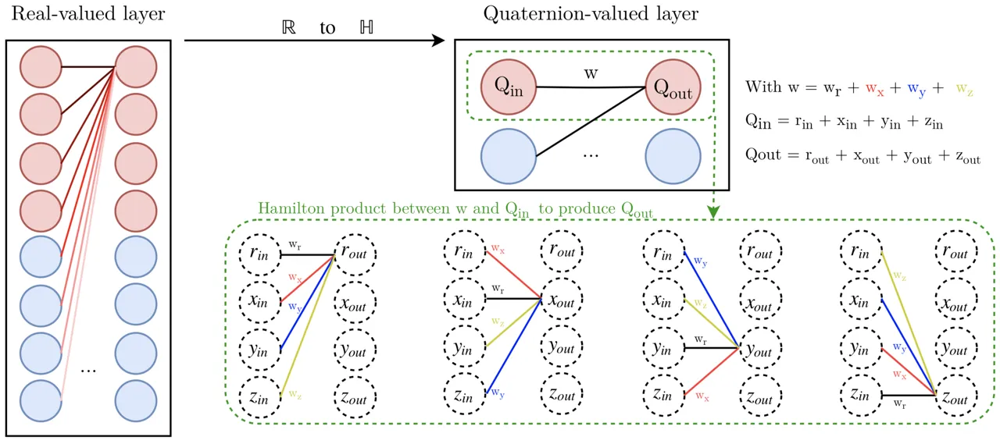

# Quaternion Recurrent Neural Networks

Titouan Parcollet Affiliation: LIA, Université d’Avignon, France
Affiliation: Orkis, Aix-en-provence, France
Email: <titouan.parcollet@alumni.univ-avignon.fr>    Mirco Ravanelli
Affiliation: MILA, Université de Montréal, Québec, Canada
Email: <mirco.ravanelli@gmail.com>    Mohamed Morchid Affiliation: LIA,
Université d’Avignon, France Email: <firstname.lastname@univ-avignon.fr>
   Georges Linarès Affiliation: LIA, Université d’Avignon, France
Email: <chiheb.trabelsi@polymtl.ca>    Chiheb Trabelsi,    Renato De
Mori,   Yoshua Bengio ^(†)^(†)thanks: CIFAR Senior Fellow
Affiliation: LIA, Université d’Avignon, France Affiliation: MILA,
Université de Montréal, Québec, Canada Affiliation: McGill University,
Québec, Canada Affiliation: Element AI, Montréal, Québec, Canada
Email: <rdemori@cs.mcgill.ca>

###### Abstract

Recurrent neural networks (RNNs) are powerful architectures to model
sequential data, due to their capability to learn short and long-term
dependencies between the basic elements of a sequence. Nonetheless,
popular tasks such as speech or images recognition, involve
multi-dimensional input features that are characterized by strong
internal dependencies between the dimensions of the input vector. We
propose a novel quaternion recurrent neural network (QRNN), alongside
with a quaternion long-short term memory neural network (QLSTM), that
take into account both the external relations and these internal
structural dependencies with the quaternion algebra. Similarly to
capsules, quaternions allow the QRNN to code internal dependencies by
composing and processing multidimensional features as single entities,
while the recurrent operation reveals correlations between the elements
composing the sequence. We show that both QRNN and QLSTM achieve better
performances than RNN and LSTM in a realistic application of automatic
speech recognition. Finally, we show that QRNN and QLSTM reduce by a
maximum factor of $`3.3`$x the number of free parameters needed,
compared to real-valued RNNs and LSTMs to reach better results, leading
to a more compact representation of the relevant information.

|     |
| --- |
|     |

## 1 Introduction

In the last few years, deep neural networks (DNN) have encountered a
wide success in different domains due to their capability to learn
highly complex input to output mapping. Among the different DNN-based
models, the recurrent neural network (RNN) is well adapted to process
sequential data. Indeed, RNNs build a vector of activations at each
timestep to code latent relations between input vectors. Deep RNNs have
been recently used to obtain hidden representations of speech unit
sequences (Ravanelli et al., 2018a) or text word sequences (Conneau
et al., 2018), and to achieve state-of-the-art performances in many
speech recognition tasks (Graves et al., 2013a; Graves et al., 2013b;
Amodei et al., 2016; Povey et al., 2016; Chiu et al., 2018). However,
many recent tasks based on multi-dimensional input features, such as
pixels of an image, acoustic features, or orientations of $`3`$D models,
require to represent both external dependencies between different
entities, and internal relations between the features that compose each
entity. Moreover, RNN-based algorithms commonly require a huge number of
parameters to represent sequential data in the hidden space.

Quaternions are hypercomplex numbers that contain a real and three
separate imaginary components, perfectly fitting to $`3`$ and $`4`$
dimensional feature vectors, such as for image processing and robot
kinematics (Sangwine, 1996; Pei & Cheng, 1999; Aspragathos & Dimitros,
1998). The idea of bundling groups of numbers into separate entities is
also exploited by the recent manifold and capsule networks (Chakraborty
et al., 2018; Sabour et al., 2017). Contrary to traditional homogeneous
representations, capsule and quaternion networks bundle sets of features
together. Thereby, quaternion numbers allow neural network based models
to code latent inter-dependencies between groups of input features
during the learning process with fewer parameters than RNNs, by taking
advantage of the Hamilton product as the equivalent of the ordinary
product, but between quaternions. Early applications of
quaternion-valued backpropagation algorithms (Arena et al., 1994; Arena
et al., 1997) have efficiently solved quaternion functions approximation
tasks. More recently, neural networks of complex and hypercomplex
numbers have received an increasing attention (Hirose & Yoshida, 2012;
Tygert et al., 2016; Danihelka et al., 2016; Wisdom et al., 2016), and
some efforts have shown promising results in different applications. In
particular, a deep quaternion network (Parcollet et al., 2016; Parcollet
et al., 2017a; Parcollet et al., 2017b), a deep quaternion convolutional
network (Gaudet & Maida, 2018; Parcollet et al., 2018), or a deep
complex convolutional network (Trabelsi et al., 2017) have been employed
for challenging tasks such as images and language processing. However,
these applications do not include recurrent neural networks with
operations defined by the quaternion algebra.

This paper proposes to integrate local spectral features in a novel
model called quaternion recurrent neural network¹¹ 1
[https://github.com/Orkis-Research/Pytorch-Quaternion-Neural-Networks](https://github.com/Orkis-Research/Pytorch-Quaternion-Neural-Networks)
(QRNN), and its gated extension called quaternion long-short term memory
neural network (QLSTM). The model is proposed along with a well-adapted
parameters initialization and turned out to learn both inter- and
intra-dependencies between multidimensional input features and the basic
elements of a sequence with drastically fewer parameters (Section 3),
making the approach more suitable for low-resource applications. The
effectiveness of the proposed QRNN and QLSTM is evaluated on the
realistic TIMIT phoneme recognition task (Section 4.2) that shows that
both QRNN and QLSTM obtain better performances than RNNs and LSTMs with
a best observed phoneme error rate (PER) of $`18.5\%`$ and $`15.1\%`$
for QRNN and QLSTM, compared to $`19.0\%`$ and $`15.3\%`$ for RNN and
LSTM. Moreover, these results are obtained alongside with a reduction of
$`3.3`$ times of the number of free parameters. Similar results are
observed with the larger Wall Street Journal (WSJ) dataset, whose
detailed performances are reported in the Appendix 6.1.1.

## 2 Motivations

A major challenge of current machine learning models is to
well-represent in the latent space the astonishing amount of data
available for recent tasks. For this purpose, a good model has to
efficiently encode local relations within the input features, such as
between the Red, Green, and Blue (R,G,B) channels of a single image
pixel, as well as structural relations, such as those describing edges
or shapes composed by groups of pixels. Moreover, in order to learn an
adequate representation with the available set of training data and to
avoid overfitting, it is convenient to conceive a neural architecture
with the smallest number of parameters to be estimated. In the
following, we detail the motivations to employ a quaternion-valued RNN
instead of a real-valued one to code inter and intra features
dependencies with fewer parameters.

As a first step, a better representation of multidimensional data has to
be explored to naturally capture internal relations within the input
features. For example, an efficient way to represent the information
composing an image is to consider each pixel as being a whole entity of
three strongly related elements, instead of a group of uni-dimensional
elements that could be related to each other, as in traditional
real-valued neural networks. Indeed, with a real-valued RNN, the latent
relations between the RGB components of a given pixel are hardly coded
in the latent space since the weight has to find out these relations
among all the pixels composing the image. This problem is effectively
solved by replacing real numbers with quaternion numbers. Indeed,
quaternions are fourth dimensional and allow one to build and process
entities made of up to four related features. The quaternion algebra and
more precisely the Hamilton product allows quaternion neural network to
capture these internal latent relations within the features encoded in a
quaternion. It has been shown that QNNs are able to restore the spatial
relations within $`3`$D coordinates (Matsui et al., 2004), and within
color pixels (Isokawa et al., 2003), while real-valued NN failed. This
is easily explained by the fact that the quaternion-weight components
are shared through multiple quaternion-input parts during the Hamilton
product , creating relations within the elements. Indeed, Figure 1 shows
that the multiple weights required to code latent relations within a
feature are considered at the same level as for learning global
relations between different features, while the quaternion weight $`w`$
codes these internal relations within a unique quaternion $`Q_{out}`$
during the Hamilton product (right).

Then, while bigger neural networks allow better performances, quaternion
neural networks make it possible to deal with the same signal dimension
but with four times less neural parameters. Indeed, a $`4`$-number
quaternion weight linking two 4-number quaternion units only has $`4`$
degrees of freedom, whereas a standard neural net parametrization has
$`4\times 4=16`$, i.e., a 4-fold saving in memory. Therefore, the
natural multidimensional representation of quaternions alongside with
their ability to drastically reduce the number of parameters indicate
that hyper-complex numbers are a better fit than real numbers to create
more efficient models in multidimensional spaces. Based on the success
of previous deep quaternion convolutional neural networks and smaller
quaternion feed-forward architectures (Kusamichi et al., 2004; Isokawa
et al., 2009; Parcollet et al., 2017a), this work proposes to adapt the
representation of hyper-complex numbers to the capability of recurrent
neural networks in a natural and efficient framework to multidimensional
sequential tasks such as speech recognition.

Modern automatic speech recognition systems usually employ input
sequences composed of multidimensional acoustic features, such as log
Mel features, that are often enriched with their first, second and third
time derivatives (Davis & Mermelstein, 1990; Furui, 1986), to integrate
contextual information. In standard RNNs, static features are simply
concatenated with their derivatives to form a large input vector,
without effectively considering that signal derivatives represent
different views of the same input. Nonetheless, it is crucial to
consider that time derivatives of the spectral energy in a given
frequency band at a specific time frame represent a special state of a
time-frame, and are linearly correlated (Tokuda et al., 2003). Based on
the above motivations and the results observed on previous works about
quaternion neural networks, we hypothesize that quaternion RNNs
naturally provide a more suitable representation of the input sequence,
since these multiple views can be directly embedded in the multiple
dimensions space of the quaternion, leading to better generalization.



Figure 1: Illustration of the input features ($`Q_{in}`$) latent
relations learning ability of a quaternion-valued layer (right) due to
the quaternion weight sharing of the Hamilton product (Eq. 5), compared
to a standard real-valued layer (left).

## 3 Quaternion recurrent neural networks

This Section describes the quaternion algebra (Section 3.1), the
internal quaternion representation (Section 3.2), the backpropagation
through time (BPTT) for quaternions (Section 3.3.2), and proposes an
adapted weight initialization to quaternion-valued neurons (Section
3.4).

### 3.1 Quaternion algebra

The quaternion algebra $`\mathbb{H}`$ defines operations between
quaternion numbers. A quaternion Q is an extension of a complex number
defined in a four dimensional space as:

```math
\displaystyle Q=r1+x\textbf{i}+y\textbf{j}+z\textbf{k}, \tag{1}
```

where $`r`$, $`x`$, $`y`$, and $`z`$ are real numbers, and $`1`$, i, j,
and k are the quaternion unit basis. In a quaternion, $`r`$ is the real
part, while $`x\textbf{i}+y\textbf{j}+z\textbf{k}`$ with
$`\textbf{i}^{2}=\textbf{j}^{2}=\textbf{k}^{2}=\textbf{i}\textbf{j}\textbf{k}=-1`$
is the imaginary part, or the vector part. Such a definition can be used
to describe spatial rotations. The information embedded in the quaterion
$`Q`$ can be summarized into the following matrix of real numbers:

```math
\displaystyle Q_{mat}=\begin{bmatrix}r&-x&-y&-z\\
x&r&-z&y\\
y&z&r&-x\\
z&-y&x&r\end{bmatrix}. \tag{2}
```

The conjugate $`Q^{*}`$ of $`Q`$ is defined as:

```math
\displaystyle Q^{*}=r1-x\textbf{i}-y\textbf{j}-z\textbf{k}. \tag{3}
```

Then, a normalized or unit quaternion $`Q^{\triangleleft}`$ is expressed
as:

```math
\displaystyle Q^{\triangleleft}=\frac{Q}{\sqrt{r^{2}+x^{2}+y^{2}+z^{2}}}. \tag{4}
```

Finally, the Hamilton product $`\otimes`$ between two quaternions
$`Q_{1}`$ and $`Q_{2}`$ is computed as follows:

```math
\displaystyle Q_{1}\otimes Q_{2}= \displaystyle(r_{1}r_{2}-x_{1}x_{2}-y_{1}y_{2}-z_{1}z_{2})+(r_{1}x_{2}+x_{1}r_{2}+y_{1}z_{2}-z_{1}y_{2})\boldsymbol{i}+
```

```math
\displaystyle(r_{1}y_{2}-x_{1}z_{2}+y_{1}r_{2}+z_{1}x_{2})\boldsymbol{j}+(r_{1}z_{2}+x_{1}y_{2}-y_{1}x_{2}+z_{1}r_{2})\boldsymbol{k}. \tag{5}
```

The Hamilton product (a graphical view is depicted in Figure 1) is used
in QRNNs to perform transformations of vectors representing quaternions,
as well as scaling and interpolation between two rotations following a
geodesic over a sphere in the $`\mathbb{R}^{3}`$ space as shown
in (Minemoto et al., 2017).

### 3.2 Quaternion representation

The QRNN is an extension of the real-valued (Medsker & Jain, 2001) and
complex-valued (Hu & Wang, 2012; Song & Yam, 1998) recurrent neural
networks to hypercomplex numbers. In a quaternion dense layer, all
parameters are quaternions, including inputs, outputs, weights, and
biases. The quaternion algebra is ensured by manipulating matrices of
real numbers (Gaudet & Maida, 2018). Consequently, for each input vector
of size $`N`$, output vector of size $`M`$, dimensions are split into
four parts: the first one equals to $`r`$, the second is
$`x\textbf{i}`$, the third one equals to $`y\textbf{j}`$, and the last
one to $`z\textbf{k}`$ to compose a quaternion
$`Q=r1+x\textbf{i}+y\textbf{j}+z\textbf{k}`$. The inference process of a
fully-connected layer is defined in the real-valued space by the dot
product between an input vector and a real-valued $`M\times N`$ weight
matrix. In a QRNN, this operation is replaced with the Hamilton product
(Eq. 5) with quaternion-valued matrices (i.e. each entry in the weight
matrix is a quaternion). The computational complexity of
quaternion-valued models is discussed in Appendix 6.1.2

### 3.3 Learning algorithm

The QRNN differs from the real-valued RNN in each learning
sub-processes. Therefore, let $`x_{t}`$ be the input vector at timestep
$`t`$, $`h_{t}`$ the hidden state, $`W_{hx}`$, $`W_{hy}`$ and $`W_{hh}`$
the input, output and hidden states weight matrices respectively. The
vector $`b_{h}`$ is the bias of the hidden state and $`p_{t}`$,
$`y_{t}`$ are the output and the expected target vectors. More details
of the learning process and the parametrization are available on
Appendix 6.2.

#### 3.3.1 Forward phase

Based on the forward propagation of the real-valued RNN (Medsker & Jain,
2001), the QRNN forward equations are extended as follows:

```math
h_{t}=\alpha(W_{hh}\otimes h_{t-1}+W_{hx}\otimes x_{t}+b_{h}), \tag{6}
```

where $`\alpha`$ is a quaternion split activation function (Xu et al.,
2017; Tripathi, 2016) defined as:

```math
\alpha(Q)=f(r)+f(x)\textbf{i}+f(y)\textbf{j}+f(z)\textbf{k}, \tag{7}
```

with $`f`$ corresponding to any standard activation function. The split
approach is preferred in this work due to better prior investigations,
better stability (i.e. pure quaternion activation functions contain
singularities), and simpler computations. The output vector $`p_{t}`$ is
computed as:

```math
\displaystyle p_{t}=\beta(W_{hy}\otimes h_{t}), \tag{8}
```

where $`\beta`$ is any split activation function. Finally, the objective
function is a classical loss applied component-wise (e.g., mean squared
error, negative log-likelihood).

#### 3.3.2 Quaternion Backpropagation Through Time

The backpropagation through time (BPTT) for quaternion numbers (QBPTT)
is an extension of the standard quaternion backpropagation (Nitta,
1995), and its full derivation is available in Appendix 6.3. The
gradient with respect to the loss $`E_{t}`$ is expressed for each weight
matrix as $`\Delta^{t}_{hy}=\frac{\partial E_{t}}{\partial W_{hy}}`$,
$`\Delta^{t}_{hh}=\frac{\partial E_{t}}{\partial W_{hh}}`$,
$`\Delta^{t}_{hx}=\frac{\partial E_{t}}{\partial W_{hx}}`$, for the bias
vector as $`\Delta^{t}_{b}=\frac{\partial E_{t}}{\partial B_{h}}`$, and
is generalized to $`\Delta^{t}=\frac{\partial E_{t}}{\partial W}`$ with:

```math
\displaystyle\centering\frac{{\partial}E_{t}}{{\partial}W}=\frac{{\partial}E_{t}}{{\partial}W^{r}}+\textbf{i}\frac{{\partial}E_{t}}{{\partial}W^{i}}+\textbf{j}\frac{{\partial}E_{t}}{{\partial}W^{j}}+\textbf{k}\frac{{\partial}E_{t}}{{\partial}W^{k}}.\@add@centering \tag{9}
```

Each term of the above relation is then computed by applying the chain
rule. Indeed, and conversaly to real-valued backpropagation, QBPTT must
defines the dynamic of the loss w.r.t to each component of the
quaternion neural parameters. As a use-case for the equations, the mean
squared error at a timestep $`t`$ and named $`E_{t}`$ is used as the
loss function. Moreover, let $`\lambda`$ be a fixed learning rate.
First, the weight matrix $`W_{hy}`$ is only seen in the equations of
$`p_{t}`$. It is therefore straightforward to update each weight of
$`W_{hy}`$ at timestep $`t`$ following:

```math
\displaystyle W_{hy}=W_{hy}-\lambda\Delta^{t}_{hy}\otimes h^{*}_{t},\ \text{with}\ \Delta_{hy}^{t}=\frac{\partial E_{t}}{\partial W_{hy}}=(p_{t}-y_{t}), \tag{10}
```

where $`h^{*}_{t}`$ is the conjugate of $`h_{t}`$. Then, the weight
matrices $`W_{hh}`$, $`W_{hx}`$ and biases $`b_{h}`$ are arguments of
$`h_{t}`$ with $`h_{t-1}`$ involved, and the update equations are
derived as:

```math
\displaystyle W_{hh}=W_{hh}-\lambda\Delta^{t}_{hh},\quad W_{hx}=W_{hx}-\lambda\Delta^{t}_{hx},\quad b_{h}=b_{h}-\lambda\Delta^{t}_{b}, \tag{11}
```

with,

```math
\displaystyle\Delta_{hh}^{t}=\sum\limits_{m=0}^{t}(\prod_{n=m}^{t}\delta_{n})\otimes h_{m-1}^{*},\quad\Delta_{hx}^{t}=\sum\limits_{m=0}^{t}(\prod_{n=m}^{t}\delta_{n})\otimes x_{m}^{*},\quad\Delta_{b}^{t}=\sum\limits_{m=0}^{t}(\prod_{n=m}^{t}\delta_{n}), \tag{12}
```

and,

```math
\begin{split}\delta_{n}=\left\{\begin{array}[]{ll}W_{hh}^{*}\otimes\delta_{n+1}\times\alpha{{}^{\prime}}(h_{n}^{preact})&\mbox{if }n\neq t\\
W_{hy}^{*}\otimes(p_{n}-y_{n})\times\beta^{{}^{\prime}}(p_{n}^{preact})&\mbox{otherwise,}\end{array}\right.\end{split} \tag{13}
```

with $`h_{n}^{preact}`$ and $`p_{n}^{preact}`$ the pre-activation values
of $`h_{n}`$ and $`p_{n}`$ respectively.

### 3.4 Parameter initialization

A well-designed parameter initialization scheme strongly impacts the
efficiency of a DNN. An appropriate initialization, in fact, improves
DNN convergence, reduces the risk of exploding or vanishing gradient,
and often leads to a substantial performance improvement (Glorot &
Bengio, 2010). It has been shown that the backpropagation through time
algorithm of RNNs is degraded by an inappropriated parameter
initialization (Sutskever et al., 2013). Moreover, an hyper-complex
parameter cannot be simply initialized randomly and component-wise, due
to the interactions between components. Therefore, this Section proposes
a procedure reported in Algorithm 1 to initialize a matrix $`W`$ of
quaternion-valued weights. The proposed initialization equations are
derived from the polar form of a weight $`w`$ of $`W`$:

```math
\displaystyle\centering w=|w|e^{q_{imag}^{\triangleleft}\theta}=|w|(cos(\theta)+q_{imag}^{\triangleleft}sin(\theta)),\@add@centering \tag{14}
```

and,

```math
\begin{gathered}w_{\textbf{r}}=\varphi\,cos(\theta),\quad w_{\textbf{i}}=\varphi\,q^{\triangleleft}_{imag\textbf{i}}\,sin(\theta),\quad w_{\textbf{j}}=\varphi\,q^{\triangleleft}_{imag\textbf{j}}\,sin(\theta),\quad w_{\textbf{k}}=\varphi\,q^{\triangleleft}_{imag\textbf{k}}\,sin(\theta).\end{gathered} \tag{15}
```

The angle $`\theta`$ is randomly generated in the interval
$`[-\pi,\pi]`$. The quaternion $`q_{imag}^{\triangleleft}`$ is defined
as purely normalized imaginary, and is expressed as
$`q_{imag}^{\triangleleft}=0+x\textbf{i}+y\textbf{j}+z\textbf{k}`$. The
imaginary components xi, yj, and zk are sampled from an uniform
distribution in $`[0,1]`$ to obtain $`q_{imag}`$, which is then
normalized (following Eq. 4) to obtain $`q_{imag}^{\triangleleft}`$. The
parameter $`\varphi`$ is a random number generated with respect to
well-known initialization criterions (such as Glorot or He algorithms)
(Glorot & Bengio, 2010; He et al., 2015). However, the equations derived
in (Glorot & Bengio, 2010; He et al., 2015) are defined for real-valued
weight matrices. Therefore, the variance of $`W`$ has to be investigated
in the quaternion space to obtain $`\varphi`$ (the full demonstration is
provided in Appendix 6.2). The variance of $`W`$ is:

```math
\displaystyle Var(W)=\mathbb{E}(|W|^{2})-[\mathbb{E}(|W|)]^{2},\ \text{with}\ [\mathbb{E}(|W|)]^{2}=0. \tag{16}
```

Indeed, the weight distribution is normalized. The value of
$`Var(W)=\mathbb{E}(|W|^{2})`$, instead, is not trivial in the case of
quaternion-valued matrices. Indeed, $`W`$ follows a Chi-distribution
with four degrees of freedom (DOFs). Consequently, $`Var(W)`$ is
expressed and computed as follows:

```math
\displaystyle Var(W)=\mathbb{E}(|W|^{2})=\int_{0}^{\infty}x^{2}f(x)\,\mathrm{d}x=4\sigma^{2}. \tag{17}
```

The Glorot (Glorot & Bengio, 2010) and He (He et al., 2015) criterions
are extended to quaternion as:

```math
\displaystyle\sigma=\frac{1}{\sqrt{2(n_{in}+n_{out})}},\ \text{and}\ \sigma=\frac{1}{\sqrt{2n_{in}}}, \tag{18}
```

with $`n_{in}`$ and $`n_{out}`$ the number of neurons of the input and
output layers respectively. Finally, $`\varphi`$ can be sampled from
$`[-\sigma,\sigma]`$ to complete the weight initialization of Eq. 15.

1: procedure Qinit($`W,n_{in},n_{out}`$)

2:   $`\sigma\leftarrow\frac{1}{\sqrt{2(n_{in}+n_{out})}}`$
$`\triangleright`$ w.r.t to Glorot criterion and Eq. 18

3:   for $`w`$ in $`W`$ do

4:    $`\theta\leftarrow rand(-\pi,\pi)`$

5:    $`\varphi\leftarrow rand(-\sigma,\sigma)`$

6:    $`x,y,z\leftarrow rand(0,1)`$

7:    $`q_{imag}\leftarrow Quaternion(0,x,y,z)`$

8:
   $`q_{imag}^{\triangleleft}\leftarrow\frac{q_{imag}}{\sqrt{x^{2}+y^{2}+z^{2}}}`$

9:    $`w_{r}\leftarrow\varphi\times cos(\theta)`$ $`\triangleright`$
See Eq. 15

10:
   $`w_{i}\leftarrow\varphi\times q_{imag_{i}}^{\triangleleft}\times sin(\theta)`$

11:
   $`w_{j}\leftarrow\varphi\times q_{imag_{j}}^{\triangleleft}\times sin(\theta)`$

12:
   $`w_{k}\leftarrow\varphi\times q_{imag_{k}}^{\triangleleft}\times sin(\theta)`$

13:    $`w\leftarrow Quaternion(w_{r},w_{i},w_{j},w_{k})`$   

Algorithm 1 Quaternion-valued weight initialization

## 4 Experiments

This Section details the acoustic features extraction (Section 4.1), the
experimental setups and the results obtained with QRNNs, QLSTMs, RNNs
and LSTMs on the TIMIT speech recognition tasks (Section 4.2). The
results reported in bold on tables are obtained with the best
configurations of the neural networks observed with the validation set.

### 4.1 Quaternion acoustic features

The raw audio is first splitted every $`10`$ms with a window of
$`25`$ms. Then $`40`$-dimensional log Mel-filter-bank coefficients with
first, second, and third order derivatives are extracted using the
pytorch-kaldi²² 2 pytorch-kaldi is available at
[https://github.com/mravanelli/pytorch-kaldi](https://github.com/mravanelli/pytorch-kaldi)
(Ravanelli et al., 2018b) toolkit and the Kaldi s5 recipes (Povey
et al., 2011). An acoustic quaternion $`Q(f,t)`$ associated with a
frequency $`f`$ and a time-frame $`t`$ is formed as follows:

```math
\displaystyle Q(f,t)=e(f,t)+\frac{\partial e(f,t)}{\partial t}\textbf{i}+\frac{\partial^{2}e(f,t)}{\partial^{2}t}\textbf{j}+\frac{\partial^{3}e(f,t)}{\partial^{3}t}\textbf{k}. \tag{19}
```

$`Q(f,t)`$ represents multiple views of a frequency $`f`$ at time frame
$`t`$, consisting of the energy $`e(f,t)`$ in the filter band at
frequency $`f`$, its first time derivative describing a slope view, its
second time derivative describing a concavity view, and the third
derivative describing the rate of change of the second derivative.
Quaternions are used to learn the spatial relations that exist between
the $`3`$ described different views that characterize a same frequency
(Tokuda et al., 2003). Thus, the quaternion input vector length is
$`160/4=40`$. Decoding is based on Kaldi (Povey et al., 2011) and
weighted finite state transducers (WFST) (Mohri et al., 2002) that
integrate acoustic, lexicon and language model probabilities into a
single HMM-based search graph.

### 4.2 The TIMIT corpus

The training process is based on the standard $`3,696`$ sentences
uttered by $`462`$ speakers, while testing is conducted on $`192`$
sentences uttered by $`24`$ speakers of the TIMIT (Garofolo et al., 1993) dataset. A validation set composed of $`400`$ sentences uttered by
$`50`$ speakers is used for hyper-parameter tuning. The models are
compared on a fixed number of layers $`M=4`$ and by varying the number
of neurons $`N`$ from $`256`$ to $`2,048`$, and $`64`$ to $`512`$ for
the RNN and QRNN respectively. Indeed, it is worth underlying that the
number of hidden neurons in the quaternion and real spaces do not handle
the same amount of real-number values. Indeed, $`256`$ quaternion
neurons output are $`256\times 4=1024`$ real values. Tanh activations
are used across all the layers except for the output layer that is based
on a softmax function. Models are optimized with RMSPROP with vanilla
hyper-parameters and an initial learning rate of $`8\cdot 10^{-4}`$. The
learning rate is progressively annealed using a halving factor of
$`0.5`$ that is applied when no performance improvement on the
validation set is observed. The models are trained during $`25`$ epochs.
All the models converged to a minimum loss, due to the annealed learning
rate. A dropout rate of $`0.2`$ is applied over all the hidden layers
(Srivastava et al., 2014) except the output one. The negative
log-likelihood loss function is used as an objective function. All the
experiments are repeated $`5`$ times (5-folds) with different seeds and
are averaged to limit any variation due to the random initialization.

| Models | Neurons | Dev. | Test | Params |
| ------ | ------- | ---- | ---- | ------ |
| RNN    | 256     | 22.4 | 23.4 | 1M     |
|        | 512     | 19.6 | 20.4 | 2.8M   |
|        | 1,024   | 17.9 | 19.0 | 9.4M   |
|        | 2,048   | 20.0 | 20.7 | 33.4M  |
| QRNN   | 64      | 23.6 | 23.9 | 0.6M   |
|        | 128     | 19.2 | 20.1 | 1.4M   |
|        | 256     | 17.4 | 18.5 | 3.8M   |
|        | 512     | 17.5 | 18.7 | 11.2M  |

Table 1: Phoneme error rate (PER%) of QRNN and RNN models on the
development and test sets of the TIMIT dataset. “Params" stands for the
total number of trainable parameters.

The results on the TIMIT task are reported in Table 1. The best PER in
realistic conditions (w.r.t to the best validation PER) is $`18.5\%`$
and $`19.0\%`$ on the test set for QRNN and RNN models respectively,
highlighting an absolute improvement of $`0.5\%`$ obtained with QRNN.
These results compare favorably with the best results obtained so far
with architectures that do not integrate access control in multiple
memory layers (Ravanelli et al., 2018a). In the latter, a PER of
$`18.3`$% is reported on the TIMIT test set with batch-normalized RNNs .
Moreover, a remarkable advantage of QRNNs is a drastic reduction (with a
factor of $`2.5\times`$) of the parameters needed to achieve these
results. Indeed, such PERs are obtained with models that employ the same
internal dimensionality corresponding to $`1,024`$ real-valued neurons
and $`256`$ quaternion-valued ones, resulting in a number of parameters
of $`3.8`$M for QRNN against the $`9.4`$M used in the real-valued RNN.
It is also worth noting that QRNNs consistently need fewer parameters
than equivalently sized RNNs, with an average reduction factor of
$`2.26`$ times. This is easily explained by considering the content of
the quaternion algebra. Indeed, for a fully-connected layer with
$`2,048`$ input values and $`2,048`$ hidden units, a real-valued RNN has
$`2,048^{2}\approx 4.2`$M parameters, while to maintain equal input and
output dimensions the quaternion equivalent has $`512`$ quaternions
inputs and $`512`$ quaternion hidden units. Therefore, the number of
parameters for the quaternion-valued model is
$`512^{2}\times 4\approx 1`$M. Such a complexity reduction turns out to
produce better results and has other advantages such as a smaller memory
footprint while saving models on budget memory systems. This
characteristic makes our QRNN model particularly suitable for speech
recognition conducted on low computational power devices like
smartphones (Chen et al., 2014). QRNNs and RNNs accuracies vary
accordingly to the architecture with better PER on bigger and wider
topologies. Therefore, while good PER are observed with a higher number
of parameters, smaller architectures performed at $`23.9\%`$ and
$`23.4\%`$, with $`1`$M and $`0.6`$M parameters for the RNN and the QRNN
respectively. Such PER are due to a too small number of parameters to
solve the task.

### 4.3 Quaternion long-short term memory neural networks

We propose to extend the QRNN to state-of-the-art models such as
long-short term memory neural networks (LSTM), to support and improve
the results already observed with the QRNN compared to the RNN in more
realistic conditions. LSTM (Hochreiter & Schmidhuber, 1997) neural
networks were introduced to solve the problems of long-term dependencies
learning and vanishing or exploding gradient observed with long
sequences. Based on the equations of the forward propagation and back
propagation through time of QRNN described in Section 3.3.1, and Section
3.3.2, one can easily derive the equations of a quaternion-valued LSTM.
Gates are defined with quaternion numbers following the proposal of
Danihelka et al. (2016). Therefore, the gate action is characterized by
an independent modification of each component of the quaternion-valued
signal following a component-wise product with the quaternion-valued
gate potential. Let $`f_{t}`$,$`i_{t}`$, $`o_{t}`$, $`c_{t}`$, and
$`h_{t}`$ be the forget, input, output gates, cell states and the hidden
state of a LSTM cell at time-step $`t`$:

```math
\displaystyle f_{t}= \displaystyle\alpha(W_{f}\otimes x_{t}+R_{f}\otimes h_{t-1}+b_{f}), \tag{20}
```

```math
\displaystyle i_{t}= \displaystyle\alpha(W_{i}\otimes x_{t}+R_{i}\otimes h_{t-1}+b_{i}), \tag{21}
```

```math
\displaystyle c_{t}= \displaystyle f_{t}\times c_{t-1}+i_{t}\times tanh(W_{c}x_{t}+R_{c}h_{t-1}+b_{c}), \tag{22}
```

```math
\displaystyle o_{t}= \displaystyle\alpha(W_{o}\otimes x_{t}+R_{o}\otimes h_{t-1}+b_{o}), \tag{23}
```

```math
\displaystyle h_{t}= \displaystyle o_{t}\times tanh(c_{t}), \tag{24}
```

where $`W`$ are rectangular input weight matrices, $`R`$ are square
recurrent weight matrices, and $`b`$ are bias vectors. $`\alpha`$ is the
split activation function and $`\times`$ denotes a component-wise
product between two quaternions. Both QLSTM and LSTM are bidirectional
and trained on the same conditions than for the QRNN and RNN
experiments.

| Models | Neurons | Dev. | Test | Params |
| ------ | ------- | ---- | ---- | ------ |
| LSTM   | 256     | 14.9 | 16.5 | 3.6M   |
|        | 512     | 14.2 | 16.1 | 12.6M  |
|        | 1,024   | 14.4 | 15.3 | 46.2M  |
|        | 2,048   | 14.0 | 15.9 | 176.3M |
| QLSTM  | 64      | 15.5 | 17.0 | 1.6M   |
|        | 128     | 14.1 | 16.0 | 4.6M   |
|        | 256     | 14.0 | 15.1 | 14.4M  |
|        | 512     | 14.2 | 15.1 | 49.9M  |

Table 2: Phoneme error rate (PER%) of QLSTM and LSTM models on the
development and test sets of the TIMIT dataset. “Params" stands for the
total number of trainable parameters.

The results on the TIMIT corpus reported on Table 2 support the initial
intuitions and the previously established trends. We first point out
that the best PER observed is $`15.1\%`$ and $`15.3\%`$ on the test set
for QLSTMs and LSTM models respectively with an absolute improvement of
$`0.2\%`$ obtained with QLSTM using $`3.3`$ times fewer parameters
compared to LSTM. These results are among the top of the line results
(Graves et al., 2013b; Ravanelli et al., 2018a) and prove that the
proposed quaternion approach can be used in state-of-the-art models. A
deeper investigation of QLSTMs performances with the larger Wall Street
Journal (WSJ) dataset can be found in Appendix 6.1.1.

## 5 Conclusion

Summary. This paper proposes to process sequences of multidimensional
features (such as acoustic data) with a novel quaternion recurrent
neural network (QRNN) and quaternion long-short term memory neural
network (QLSTM). The experiments conducted on the TIMIT phoneme
recognition task show that QRNNs and QLSTMs are more effective to learn
a compact representation of multidimensional information by
outperforming RNNs and LSTMs with $`2`$ to $`3`$ times less free
parameters. Therefore, our initial intuition that the quaternion algebra
offers a better and more compact representation for multidimensional
features, alongside with a better learning capability of feature
internal dependencies through the Hamilton product, have been
demonstrated.

Future Work. Future investigations will develop other multi-view
features that contribute to decrease ambiguities in representing
phonemes in the quaternion space. In this extent, a recent approach
based on a quaternion Fourier transform to create quaternion-valued
signal has to be investigated. Finally, other high-dimensional neural
networks such as manifold and Clifford networks remain mostly unexplored
and can benefit from further research.

## References

- Amodei et al. (2016) Dario Amodei, Sundaram Ananthanarayanan, Rishita
  Anubhai, Jingliang Bai, Eric Battenberg, Carl Case, Jared Casper,
  Bryan Catanzaro, Qiang Cheng, Guoliang Chen, et al. Deep speech 2:
  End-to-end speech recognition in english and mandarin. In
  _International Conference on Machine Learning_, pp. 173–182, 2016.
- Arena et al. (1994) Paolo Arena, Luigi Fortuna, Luigi Occhipinti, and
  Maria Gabriella Xibilia. Neural networks for quaternion-valued
  function approximation. In _Circuits and Systems, ISCAS’94., IEEE
  International Symposium on_, volume 6, pp. 307–310. IEEE, 1994.
- Arena et al. (1997) Paolo Arena, Luigi Fortuna, Giovanni Muscato, and
  Maria Gabriella Xibilia. Multilayer perceptrons to approximate
  quaternion valued functions. _Neural Networks_, 10(2):335–342, 1997.
- Aspragathos & Dimitros (1998) Nicholas A Aspragathos and John K
  Dimitros. A comparative study of three methods for robot kinematics.
  _Systems, Man, and Cybernetics, Part B: Cybernetics, IEEE Transactions
  on_, 28(2):135–145, 1998.
- Chakraborty et al. (2018) Rudrasis Chakraborty, Jose Bouza, Jonathan
  Manton, and Baba C. Vemuri. Manifoldnet: A deep network framework for
  manifold-valued data. _arXiv preprint arXiv:1809.06211_, 2018.
- Chan & Lane (2015) William Chan and Ian Lane. Deep recurrent neural
  networks for acoustic modelling. _arXiv preprint
  arXiv:1504.01482_, 2015.
- Chen et al. (2014) G. Chen, C. Parada, and G. Heigold. Small-footprint
  keyword spotting using deep neural networks. In _2014 IEEE
  International Conference on Acoustics, Speech and Signal Processing
  (ICASSP)_, pp. 4087–4091, May 2014. doi: 10.1109/ICASSP.2014.6854370.
- Chiu et al. (2018) Chung-Cheng Chiu, Tara N Sainath, Yonghui Wu, Rohit
  Prabhavalkar, Patrick Nguyen, Zhifeng Chen, Anjuli Kannan, Ron J
  Weiss, Kanishka Rao, Ekaterina Gonina, et al. State-of-the-art speech
  recognition with sequence-to-sequence models. In _2018 IEEE
  International Conference on Acoustics, Speech and Signal Processing
  (ICASSP)_, pp. 4774–4778. IEEE, 2018.
- Conneau et al. (2018) Alexis Conneau, German Kruszewski, Guillaume
  Lample, Loïc Barrault, and Marco Baroni. What you can cram into a
  single vector: Probing sentence embeddings for linguistic
  properties, 2018.
- Danihelka et al. (2016) Ivo Danihelka, Greg Wayne, Benigno Uria, Nal
  Kalchbrenner, and Alex Graves. Associative long short-term memory.
  _arXiv preprint arXiv:1602.03032_, 2016.
- Davis & Mermelstein (1990) Steven B Davis and Paul Mermelstein.
  Comparison of parametric representations for monosyllabic word
  recognition in continuously spoken sentences. In _Readings in speech
  recognition_, pp. 65–74. Elsevier, 1990.
- Furui (1986) Sadaoki Furui. Speaker-independent isolated word
  recognition based on emphasized spectral dynamics. In _Acoustics,
  Speech, and Signal Processing, IEEE International Conference on
  ICASSP’86._, volume 11, pp. 1991–1994. IEEE, 1986.
- Garofolo et al. (1993) John S Garofolo, Lori F Lamel, William M
  Fisher, Jonathan G Fiscus, and David S Pallett. Darpa timit
  acoustic-phonetic continous speech corpus cd-rom. nist speech disc
  1-1.1. _NASA STI/Recon technical report n_, 93, 1993.
- Gaudet & Maida (2018) Chase J Gaudet and Anthony S Maida. Deep
  quaternion networks. In _2018 International Joint Conference on Neural
  Networks (IJCNN)_, pp. 1–8. IEEE, 2018.
- Glorot & Bengio (2010) Xavier Glorot and Yoshua Bengio. Understanding
  the difficulty of training deep feedforward neural networks. In
  _International conference on artificial intelligence and statistics_,
  pp. 249–256, 2010.
- Graves et al. (2013a) Alex Graves, Navdeep Jaitly, and Abdel-rahman
  Mohamed. Hybrid speech recognition with deep bidirectional lstm. In
  _Automatic Speech Recognition and Understanding (ASRU), 2013 IEEE
  Workshop on_, pp. 273–278. IEEE, 2013a.
- Graves et al. (2013b) Alex Graves, Abdel-rahman Mohamed, and Geoffrey
  Hinton. Speech recognition with deep recurrent neural networks. In
  _Acoustics, speech and signal processing (icassp), 2013 ieee
  international conference on_, pp. 6645–6649. IEEE, 2013b.
- He et al. (2015) Kaiming He, Xiangyu Zhang, Shaoqing Ren, and Jian
  Sun. Delving deep into rectifiers: Surpassing human-level performance
  on imagenet classification. In _Proceedings of the IEEE international
  conference on computer vision_, pp. 1026–1034, 2015.
- Hirose & Yoshida (2012) Akira Hirose and Shotaro Yoshida.
  Generalization characteristics of complex-valued feedforward neural
  networks in relation to signal coherence. _IEEE Transactions on Neural
  Networks and learning systems_, 23(4):541–551, 2012.
- Hochreiter & Schmidhuber (1997) Sepp Hochreiter and Jürgen
  Schmidhuber. Long short-term memory. _Neural computation_,
  9(8):1735–1780, 1997.
- Hu & Wang (2012) Jin Hu and Jun Wang. Global stability of
  complex-valued recurrent neural networks with time-delays. _IEEE
  Transactions on Neural Networks and Learning Systems_,
  23(6):853–865, 2012.
- Isokawa et al. (2003) Teijiro Isokawa, Tomoaki Kusakabe, Nobuyuki
  Matsui, and Ferdinand Peper. Quaternion neural network and its
  application. In _International Conference on Knowledge-Based and
  Intelligent Information and Engineering Systems_, pp. 318–324.
  Springer, 2003.
- Isokawa et al. (2009) Teijiro Isokawa, Nobuyuki Matsui, and Haruhiko
  Nishimura. Quaternionic neural networks: Fundamental properties and
  applications. _Complex-Valued Neural Networks: Utilizing
  High-Dimensional Parameters_, pp. 411–439, 2009.
- Kingma & Ba (2014) Diederik Kingma and Jimmy Ba. Adam: A method for
  stochastic optimization. _arXiv preprint arXiv:1412.6980_, 2014.
- Kusamichi et al. (2004) Hiromi Kusamichi, Teijiro Isokawa, Nobuyuki
  Matsui, Yuzo Ogawa, and Kazuaki Maeda. A new scheme for color night
  vision by quaternion neural network. In _Proceedings of the 2nd
  International Conference on Autonomous Robots and Agents_, volume
  1315, 2004.
- Matsui et al. (2004) Nobuyuki Matsui, Teijiro Isokawa, Hiromi
  Kusamichi, Ferdinand Peper, and Haruhiko Nishimura. Quaternion neural
  network with geometrical operators. _Journal of Intelligent & Fuzzy
  Systems_, 15(3, 4):149–164, 2004.
- Medsker & Jain (2001) Larry R. Medsker and Lakhmi J. Jain. Recurrent
  neural networks. _Design and Applications_, 5, 2001.
- Minemoto et al. (2017) Toshifumi Minemoto, Teijiro Isokawa, Haruhiko
  Nishimura, and Nobuyuki Matsui. Feed forward neural network with
  random quaternionic neurons. _Signal Processing_, 136:59–68, 2017.
- Mohri et al. (2002) Mehryar Mohri, Fernando Pereira, and Michael
  Riley. Weighted finite-state transducers in speech recognition.
  _Computer Speech and Language_, 16(1):69 – 88, 2002. ISSN 0885-2308.
  doi: https://doi.org/10.1006/csla.2001.0184. URL
  [http://www.sciencedirect.com/science/article/pii/S0885230801901846](http://www.sciencedirect.com/science/article/pii/S0885230801901846).
- Morchid (2018) Mohamed Morchid. Parsimonious memory unit for recurrent
  neural networks with application to natural language processing.
  _Neurocomputing_, 314:48–64, 2018.
- Nitta (1995) Tohru Nitta. A quaternary version of the back-propagation
  algorithm. In _Neural Networks, 1995. Proceedings., IEEE International
  Conference on_, volume 5, pp. 2753–2756. IEEE, 1995.
- Parcollet et al. (2016) Titouan Parcollet, Mohamed Morchid,
  Pierre-Michel Bousquet, Richard Dufour, Georges Linarès, and Renato
  De Mori. Quaternion neural networks for spoken language understanding.
  In _Spoken Language Technology Workshop (SLT), 2016 IEEE_, pp.
  362–368. IEEE, 2016.
- Parcollet et al. (2017a) Titouan Parcollet, Morchid Mohamed, and
  Georges Linarès. Quaternion denoising encoder-decoder for theme
  identification of telephone conversations. _Proc. Interspeech 2017_,
  pp. 3325–3328, 2017a.
- Parcollet et al. (2017b) Titouan Parcollet, Mohamed Morchid, and
  Georges Linares. Deep quaternion neural networks for spoken language
  understanding. In _Automatic Speech Recognition and Understanding
  Workshop (ASRU), 2017 IEEE_, pp. 504–511. IEEE, 2017b.
- Parcollet et al. (2018) Titouan Parcollet, Ying Zhang, Mohamed
  Morchid, Chiheb Trabelsi, Georges Linarès, Renato de Mori, and Yoshua
  Bengio. Quaternion convolutional neural networks for end-to-end
  automatic speech recognition. In _Interspeech 2018, 19th Annual
  Conference of the International Speech Communication Association,
  Hyderabad, India, 2-6 September 2018._, pp. 22–26, 2018. doi:
  10.21437/Interspeech.2018-1898. URL
  [https://doi.org/10.21437/Interspeech.2018-1898](https://doi.org/10.21437/Interspeech.2018-1898).
- Pei & Cheng (1999) Soo-Chang Pei and Ching-Min Cheng. Color image
  processing by using binary quaternion-moment-preserving thresholding
  technique. _IEEE Transactions on Image Processing_,
  8(5):614–628, 1999.
- Povey et al. (2011) Daniel Povey, Arnab Ghoshal, Gilles Boulianne,
  Lukas Burget, Ondrej Glembek, Nagendra Goel, Mirko Hannemann, Petr
  Motlicek, Yanmin Qian, Petr Schwarz, Jan Silovsky, Georg Stemmer, and
  Karel Vesely. The kaldi speech recognition toolkit. In _IEEE 2011
  Workshop on Automatic Speech Recognition and Understanding_. IEEE
  Signal Processing Society, December 2011. IEEE Catalog No.:
  CFP11SRW-USB.
- Povey et al. (2016) Daniel Povey, Vijayaditya Peddinti, Daniel Galvez,
  Pegah Ghahremani, Vimal Manohar, Xingyu Na, Yiming Wang, and Sanjeev
  Khudanpur. Purely sequence-trained neural networks for asr based on
  lattice-free mmi. In _Interspeech_, pp. 2751–2755, 2016.
- Ravanelli et al. (2018a) Mirco Ravanelli, Philemon Brakel, Maurizio
  Omologo, and Yoshua Bengio. Light gated recurrent units for speech
  recognition. _IEEE Transactions on Emerging Topics in Computational
  Intelligence_, 2(2):92–102, 2018a.
- Ravanelli et al. (2018b) Mirco Ravanelli, Titouan Parcollet, and
  Yoshua Bengio. The pytorch-kaldi speech recognition toolkit. _arXiv
  preprint arXiv:1811.07453_, 2018b.
- Sabour et al. (2017) Sara Sabour, Nicholas Frosst, and Geoffrey E
  Hinton. Dynamic routing between capsules. _arXiv preprint
  arXiv:1710.09829v2_, 2017.
- Sangwine (1996) Stephen John Sangwine. Fourier transforms of colour
  images using quaternion or hypercomplex, numbers. _Electronics
  letters_, 32(21):1979–1980, 1996.
- Song & Yam (1998) Jingyan Song and Yeung Yam. Complex recurrent neural
  network for computing the inverse and pseudo-inverse of the complex
  matrix. _Applied mathematics and computation_, 93(2-3):195–205, 1998.
- Srivastava et al. (2014) Nitish Srivastava, Geoffrey Hinton, Alex
  Krizhevsky, Ilya Sutskever, and Ruslan Salakhutdinov. Dropout: A
  simple way to prevent neural networks from overfitting. _The Journal
  of Machine Learning Research_, 15(1):1929–1958, 2014.
- Sutskever et al. (2013) Ilya Sutskever, James Martens, George Dahl,
  and Geoffrey Hinton. On the importance of initialization and momentum
  in deep learning. In _International conference on machine learning_,
  pp. 1139–1147, 2013.
- Tokuda et al. (2003) Keiichi Tokuda, Heiga Zen, and Tadashi Kitamura.
  Trajectory modeling based on hmms with the explicit relationship
  between static and dynamic features. In _Eighth European Conference on
  Speech Communication and Technology_, 2003.
- Trabelsi et al. (2017) Chiheb Trabelsi, Olexa Bilaniuk, Dmitriy
  Serdyuk, Sandeep Subramanian, João Felipe Santos, Soroush Mehri, Negar
  Rostamzadeh, Yoshua Bengio, and Christopher J Pal. Deep complex
  networks. _arXiv preprint arXiv:1705.09792_, 2017.
- Tripathi (2016) Bipin Kumar Tripathi. _High Dimensional
  Neurocomputing_. Springer, 2016.
- Tygert et al. (2016) Mark Tygert, Joan Bruna, Soumith Chintala, Yann
  LeCun, Serkan Piantino, and Arthur Szlam. A mathematical motivation
  for complex-valued convolutional networks. _Neural computation_,
  28(5):815–825, 2016.
- Wisdom et al. (2016) Scott Wisdom, Thomas Powers, John Hershey,
  Jonathan Le Roux, and Les Atlas. Full-capacity unitary recurrent
  neural networks. In _Advances in Neural Information Processing
  Systems_, pp. 4880–4888, 2016.
- Xu et al. (2017) D Xu, L Zhang, and H Zhang. Learning alogrithms in
  quaternion neural networks using ghr calculus. _Neural Network World_,
  27(3):271, 2017.

## 6 Appendix

### 6.1 Wall Street Journal experiments and computational complexity

This Section proposes to validate the scaling of the proposed QLSTMs to
a bigger and more realistic corpus, with a speech recognition task on
the Wall Street Journal (WSJ) dataset. Finally, it discuses the impact
of the quaternion algebra in term of computational compexity.

#### 6.1.1 Speech recognition with the Wall Street Journal corpus

We propose to evaluate both QLSTMs and LSTMs with a larger and more
realistic corpus to validate the scaling of the observed TIMIT results
(Section 4.2). Acoustic input features are described in Section 4.1, and
extracted on both the $`14`$ hour subset ‘train-si84’, and the full
$`81`$ hour dataset ’train-si284’ of the Wall Street Journal (WSJ)
corpus. The ‘test-dev93’ development set is employed for validation,
while ’test-eval92’ composes the testing set. Models architectures are
fixed with respect to the best results observed with the TIMIT corpus
(Section 4.2). Therefore, both QLSTMs and LSTMs contain four
bidirectional layers of internal dimension of size $`1,024`$. Then, an
additional layer of internal size $`1,024`$ is added before the output
layer. The only change on the training procedure compared to the TIMIT
experiments concerns the model optimizer, which is set to Adam (Kingma &
Ba, 2014) instead of RMSPROP. Results are from a $`3`$-folds average.

| Models | WSJ14 Dev. | WSJ14 Test | WSJ81 Dev. | WSJ81 Test | Params |
| ------ | ---------- | ---------- | ---------- | ---------- | ------ |
| LSTM   | 11.2       | 7.2        | 7.4        | 4.5        | 53.7M  |
| QLSTM  | 10.9       | 6.9        | 7.2        | 4.3        | 18.7M  |

Table 3: Word error rates (WER %) obtained with both training set
(WSJ14h and WSJ81h) of the Wall Street Journal corpus. ’test-dev93’ and
’test-eval92’ are used as validation and testing set respectively. $`L`$
expresses the number of recurrent layers.

It is important to notice that reported results on Table 3 compare
favorably with equivalent architectures (Graves et al., 2013a) (WER of
$`11.7\%`$ on ’test-dev93’), and are competitive with state-of-the-art
and much more complex models based on better engineered features (Chan &
Lane, 2015)(WER of $`3.8\%`$ with the 81 hours of training data, and on
’test-eval92’). According to Table 3, QLSTMs outperform LSTM in all the
training conditions ($`14`$ hours and $`81`$ hours) and with respect to
both the validation and testing sets. Moreover, QLSTMs still need
$`2.9`$ times less neural parameters than LSTMs to achieve such
performances. This experiment demonstrates that QLSTMs scale well to
larger and more realistic speech datasets and are still more efficient
than real-valued LSTMs.

#### 6.1.2 Notes on computational complexity

A computational complexity of $`O(n^{2})`$ with $`n`$ the number of
hidden states has been reported by Morchid (2018) for real-valued LSTMs.
QLSTMs just involve $`4`$ times larger matrices during computations.
Therefore, the computational complexity remains unchanged and equals to
$`O(n^{2})`$. Nonetheless, and due to the Hamilton product, a single
forward propagation between two quaternion neurons uses $`28`$
operations, compared to a single one for two real-valued neurons,
implying a longer training time (up to $`3`$ times slower). However,
such worst speed performances could easily be alleviated with a proper
engineered cuDNN kernel for the Hamilton product, that would helps QNNs
to be more efficient than real-valued ones. A well-adapted CUDA kernel
would allow QNNs to perform more computations, with fewer parameters,
and therefore less memory copy operations from the CPU to the GPU.

### 6.2 Parameters initialization

Let us recall that a generated quaternion weight $`w`$ from a weight
matrix $`W`$ has a polar form defined as:

```math
\displaystyle\centering w=|w|e^{q_{imag}^{\triangleleft}\theta}=|w|(cos(\theta)+q_{imag}^{\triangleleft}sin(\theta)),\@add@centering \tag{25}
```

with $`q_{imag}^{\triangleleft}=0+x\textbf{i}+y\textbf{j}+z\textbf{k}`$
a purely imaginary and normalized quaternion. Therefore, $`w`$ can be
computed following:

```math
\begin{gathered}w_{\textbf{r}}=\varphi\,cos(\theta),\\
w_{\textbf{i}}=\varphi\,q^{\triangleleft}_{imag\textbf{i}}\,sin(\theta),\\
w_{\textbf{j}}=\varphi\,q^{\triangleleft}_{imag\textbf{j}}\,sin(\theta),\\
w_{\textbf{k}}=\varphi\,q^{\triangleleft}_{imag\textbf{k}}\,sin(\theta).\end{gathered} \tag{26}
```

However, $`\varphi`$ represents a randomly generated variable with
respect to the variance of the quaternion weight and the selected
initialization criterion. The initialization process follows (Glorot &
Bengio, 2010) and (He et al., 2015) to derive the variance of the
quaternion-valued weight parameters. Indeed, the variance of W has to be
investigated:

```math
\displaystyle Var(W)=\mathbb{E}(|W|^{2})-[\mathbb{E}(|W|)]^{2}. \tag{27}
```

$`[\mathbb{E}(|W|)]^{2}`$ is equals to $`0`$ since the weight
distribution is symmetric around $`0`$. Nonetheless, the value of
$`Var(W)=\mathbb{E}(|W|^{2})`$ is not trivial in the case of
quaternion-valued matrices. Indeed, $`W`$ follows a Chi-distribution
with four degrees of freedom (DOFs) and $`\mathbb{E}(|W|^{2})`$ is
expressed and computed as follows:

```math
\displaystyle\mathbb{E}(|W|^{2})=\int_{0}^{\infty}x^{2}f(x)\,\mathrm{d}x, \tag{28}
```

With $`f(x)`$ is the probability density function with four DOFs. A
four-dimensional vector $`X=\{A,B,C,D\}`$ is considered to evaluate the
density function $`f(x)`$. $`X`$ has components that are normally
distributed, centered at zero, and independent. Then, $`A`$, $`B`$,
$`C`$ and $`D`$ have density functions:

```math
\displaystyle f_{A}(x;\sigma)=f_{B}(x;\sigma)=f_{C}(x;\sigma)=f_{D}(x;\sigma)=\frac{e^{-x^{2}/2\sigma^{2}}}{\sqrt{2\pi\sigma^{2}}}. \tag{29}
```

The four-dimensional vector $`X`$ has a length $`L`$ defined as
$`L=\sqrt{A^{2}+B^{2}+C^{2}+D^{2}}`$ with a cumulative distribution
function $`F_{L}(x;\sigma)`$ in the 4-sphere (n-sphere with $`n=4`$)
$`S_{x}`$:

```math
\displaystyle F_{L}(x;\sigma)=\int\int\int\int_{S_{x}}f_{A}(x;\sigma)f_{B}(x;\sigma)f_{C}(x;\sigma)f_{D}(x;\sigma)\,\mathrm{d}S_{x} \tag{30}
```

where $`S_{x}=\{(a,b,c,d):\sqrt{a^{2}+b^{2}+c^{2}+d^{2}}<x\}`$ and
$`\,\mathrm{d}S_{x}=\,\mathrm{d}a\,\mathrm{d}b\,\mathrm{d}c\,\mathrm{d}d`$.
The polar representations of the coordinates of $`X`$ in a 4-dimensional
space are defined to compute $`\,\mathrm{d}S_{x}`$:

```math
\displaystyle a \displaystyle=\rho\cos\theta,
```

```math
\displaystyle b \displaystyle=\rho\sin\theta\cos\phi,
```

```math
\displaystyle c \displaystyle=\rho\sin\theta\sin\phi\cos\psi,
```

```math
\displaystyle d \displaystyle=\rho\sin\theta\sin\phi\sin\psi,
```

where $`\rho`$ is the magnitude
($`\rho=\sqrt{a^{2}+b^{2}+c^{2}+d^{2}}`$) and $`\theta`$, $`\phi`$, and
$`\psi`$ are the phases with $`0\leq\theta\leq\pi`$,
$`0\leq\phi\leq\pi`$ and $`0\leq\psi\leq 2\pi`$. Then,
$`\,\mathrm{d}S_{x}`$ is evaluated with the Jacobian $`J_{f}`$ of $`f`$
defined as:

```math
\displaystyle J_{f} \displaystyle=\frac{\partial(a,b,c,d)}{\partial(\rho,\theta,\phi,\psi)}=\frac{\,\mathrm{d}a\,\mathrm{d}b\,\mathrm{d}c\,\mathrm{d}d}{\,\mathrm{d}\rho\,\mathrm{d}\theta\,\mathrm{d}\phi\,\mathrm{d}\psi}=\begin{vmatrix}\frac{\mathrm{d}a}{\mathrm{d}\rho}&\frac{\mathrm{d}a}{\mathrm{d}\theta}&\frac{\mathrm{d}a}{\mathrm{d}\phi}&\frac{\mathrm{d}a}{\mathrm{d}\psi}\\
\frac{\mathrm{d}b}{\mathrm{d}\rho}&\frac{\mathrm{d}b}{\mathrm{d}\theta}&\frac{\mathrm{d}b}{\mathrm{d}\phi}&\frac{\mathrm{d}b}{\mathrm{d}\psi}\\
\frac{\mathrm{d}c}{\mathrm{d}\rho}&\frac{\mathrm{d}c}{\mathrm{d}\theta}&\frac{\mathrm{d}c}{\mathrm{d}\phi}&\frac{\mathrm{d}c}{\mathrm{d}\psi}\\
\frac{\mathrm{d}d}{\mathrm{d}\rho}&\frac{\mathrm{d}d}{\mathrm{d}\theta}&\frac{\mathrm{d}d}{\mathrm{d}\phi}&\frac{\mathrm{d}d}{\mathrm{d}\psi}\end{vmatrix}
```

```math
\displaystyle\hskip-8.53581pt=\begin{vmatrix}\cos\theta&-\rho\sin\theta&0&0\\
\sin\theta\cos\phi&\rho\sin\theta\cos\phi&-\rho\sin\theta\sin\phi&0\\
\sin\theta\sin\phi\cos\psi&\rho\cos\theta\sin\phi\cos\psi&\rho\sin\theta\cos\phi\cos\psi&-\rho\sin\theta\sin\phi\sin\psi\\
\sin\theta\sin\phi\sin\psi&\rho\cos\theta\sin\phi\sin\psi&\rho\sin\theta\cos\phi\sin\psi&\rho\sin\theta\sin\phi\cos\psi\end{vmatrix}.
```

And,

```math
\displaystyle J_{f} \displaystyle=\rho^{3}\sin^{2}\theta\sin\phi. \tag{31}
```

Therefore, by the Jacobian $`J_{f}`$, we have the polar form:

```math
\displaystyle\mathrm{d}a\,\mathrm{d}b\,\mathrm{d}c\,\mathrm{d}d \displaystyle=\rho^{3}\sin^{2}\theta\sin\phi\,\mathrm{d}\rho\,\mathrm{d}\theta\,\mathrm{d}\phi\,\mathrm{d}\psi. \tag{32}
```

Then, writing Eq.(30) in polar coordinates, we obtain:

```math
\displaystyle F_{L}(x,\sigma) \displaystyle=\left(\frac{1}{\sqrt{2\pi\sigma^{2}}}\right)^{4}\int\int\int\int_{0}^{x}e^{-a^{2}/2\sigma^{2}}e^{-b^{2}/2\sigma^{2}}e^{-c^{2}/2\sigma^{2}}e^{-d^{2}/2\sigma^{2}}\,\mathrm{d}S_{x}
```

```math
\displaystyle=\frac{1}{4\pi^{2}\sigma^{4}}\int_{0}^{2\pi}\int_{0}^{\pi}\int_{0}^{\pi}\int_{0}^{x}e^{-\rho^{2}/2\sigma^{2}}\rho^{3}\sin^{2}\theta\sin\phi\,\mathrm{d}\rho\,\mathrm{d}\theta\,\mathrm{d}\phi\,\mathrm{d}\psi
```

```math
\displaystyle=\frac{1}{4\pi^{2}\sigma^{4}}\int_{0}^{2\pi}\,\mathrm{d}\psi\int_{0}^{\pi}\sin\phi\,\mathrm{d}\phi\int_{0}^{\pi}\sin^{2}\theta\,\mathrm{d}\theta\int_{0}^{x}\rho^{3}e^{-\rho^{2}/2\sigma^{2}}\,\mathrm{d}\rho
```

```math
\displaystyle=\frac{1}{4\pi^{2}\sigma^{4}}2\pi 2\left[\frac{\theta}{2}-\frac{\sin 2\theta}{4}\right]_{0}^{\pi}\int_{0}^{x}\rho^{3}e^{-\rho^{2}/2\sigma^{2}}\,\mathrm{d}\rho
```

```math
\displaystyle=\frac{1}{4\pi^{2}\sigma^{4}}4\pi\frac{\pi}{2}\int_{0}^{x}\rho^{3}e^{-\rho^{2}/2\sigma^{2}}\,\mathrm{d}\rho,
```

Then,

```math
\displaystyle F_{L}(x,\sigma) \displaystyle=\frac{1}{2\sigma^{4}}\int_{0}^{x}\rho^{3}e^{-\rho^{2}/2\sigma^{2}}\,\mathrm{d}\rho. \tag{33}
```

The probability density function for $`X`$ is the derivative of its
cumulative distribution function, which by the fundamental theorem of
calculus is:

```math
\displaystyle f_{L}(x,\sigma) \displaystyle=\frac{\,\mathrm{d}}{\,\mathrm{d}x}F_{L}(x,\sigma)
```

```math
\displaystyle=\frac{1}{2\sigma^{4}}x^{3}e^{-x^{2}/2\sigma^{2}}. \tag{34}
```

The expectation of the squared magnitude becomes:

```math
\displaystyle\mathbb{E}(|W|^{2}) \displaystyle=\int_{0}^{\infty}x^{2}f(x)\,\mathrm{d}x
```

```math
\displaystyle=\int_{0}^{\infty}x^{2}\frac{1}{2\sigma^{4}}x^{3}e^{-x^{2}/2\sigma^{2}}\,\mathrm{d}x
```

```math
\displaystyle=\frac{1}{2\sigma^{4}}\int_{0}^{\infty}x^{5}e^{-x^{2}/2\sigma^{2}}\,\mathrm{d}x.
```

With integration by parts we obtain:

```math
\displaystyle\mathbb{E}(|W|^{2}) \displaystyle=\frac{1}{2\sigma^{4}}\left(\left.-x^{4}\sigma^{2}e^{-x^{2}/2\sigma^{2}}\right|_{0}^{\infty}+\int_{0}^{\infty}\sigma^{2}4x^{3}e^{-x^{2}/2\sigma^{2}}\,\mathrm{d}x\right)
```

```math
\displaystyle=\frac{1}{2\sigma^{2}}\left(\left.-x^{4}e^{-x^{2}/2\sigma^{2}}\right|_{0}^{\infty}+\int_{0}^{\infty}4x^{3}e^{-x^{2}/2\sigma^{2}}\,\mathrm{d}x\right). \tag{35}
```

The expectation $`\mathbb{E}(|W|^{2})`$ is the sum of two terms. The
first one:

```math
\displaystyle\left.-x^{4}e^{-x^{2}/2\sigma^{2}}\right|_{0}^{\infty} \displaystyle=\lim\limits_{x\rightarrow+\infty}-x^{4}e^{-x^{2}/2\sigma^{2}}-\lim\limits_{x\rightarrow+0}x^{4}e^{-x^{2}/2\sigma^{2}}
```

```math
\displaystyle=\lim\limits_{x\rightarrow+\infty}-x^{4}e^{-x^{2}/2\sigma^{2}},
```

Based on the L’Hôpital’s rule, the undetermined limit becomes:

```math
\displaystyle\lim\limits_{x\rightarrow+\infty}-x^{4}e^{-x^{2}/2\sigma^{2}} \displaystyle=-\lim\limits_{x\rightarrow+\infty}\frac{x^{4}}{e^{x^{2}/2\sigma^{2}}}
```

```math
\displaystyle=\dots
```

```math
\displaystyle=-\lim\limits_{x\rightarrow+\infty}\frac{24}{(1/\sigma^{2})(P(x)e^{x^{2}/2\sigma^{2}})} \tag{36}
```

```math
\displaystyle=0.
```

With $`P(x)`$ is polynomial and has a limit to $`+\infty`$. The second
term is calculated in a same way (integration by parts) and
$`\mathbb{E}(|W|^{2})`$ becomes from Eq.(35):

```math
\displaystyle\mathbb{E}(|W|^{2}) \displaystyle=\frac{1}{2\sigma^{2}}\int_{0}^{\infty}4x^{3}e^{-x^{2}/2\sigma^{2}}\,\mathrm{d}x
```

```math
\displaystyle=\frac{2}{\sigma^{2}}\left(\left.x^{2}\sigma^{2}e^{-x^{2}/2\sigma^{2}}\right|_{0}^{\infty}+\int_{0}^{\infty}\sigma^{2}2xe^{-x^{2}/2\sigma^{2}}\,\mathrm{d}x\right).
```

The limit of first term is equals to $`0`$ with the same method than in
Eq.(36). Therefore, the expectation is:

```math
\displaystyle\mathbb{E}(|W|^{2}) \displaystyle=4\left(\int_{0}^{\infty}xe^{-x^{2}/2\sigma^{2}}\,\mathrm{d}x\right)
```

```math
\displaystyle=4\sigma^{2}. \tag{38}
```

And finally the variance is:

```math
\displaystyle Var(|W|) \displaystyle=4\sigma^{2}. \tag{39}
```

### 6.3 Quaternion backpropagation through time

Let us recall the forward equations and parameters needed to derive the
complete quaternion backpropagation through time (QBPTT) algorithm.

#### 6.3.1 Recall of the forward phase

Let $`x_{t}`$ be the input vector at timestep $`t`$, $`h_{t}`$ the
hidden state, $`W_{hh}`$, $`W_{xh}`$ and $`W_{hy}`$ the hidden state,
input and output weight matrices respectively. Finally $`b_{h}`$ is the
biases vector of the hidden states and $`p_{t}`$, $`y_{t}`$ are the
output and the expected target vector.

```math
h_{t}=\alpha(h_{t}^{preact}), \tag{40}
```

with,

```math
h_{t}^{preact}=W_{hh}\otimes h_{t-1}+W_{xh}\otimes x_{t}+b_{h}, \tag{41}
```

and $`\alpha`$ is the quaternion split activation function (Xu et al., 2017) of a quaternion $`Q`$ defined as:

```math
\alpha(Q)=f(r)+if(x)+jf(y)+kf(z), \tag{42}
```

and $`f`$ corresponding to any standard activation function. The output
vector $`p_{t}`$ can be computed as:

```math
\displaystyle p_{t}=\beta(p_{t}^{preact}), \tag{43}
```

with

```math
\displaystyle p_{t}^{preact}=W_{hy}\otimes h_{t}, \tag{44}
```

and $`\beta`$ any split activation function. Finally, the objective
function is a real-valued loss function applied component-wise. The
gradient with respect to the MSE loss is expressed for each weight
matrix as $`\frac{\partial E_{t}}{\partial W_{hy}}`$,
$`\frac{\partial E_{t}}{\partial W_{hh}}`$,
$`\frac{\partial E_{t}}{\partial W_{hx}}`$, and for the bias vector as
$`\frac{\partial E_{t}}{\partial B_{h}}`$. In the real-valued space, the
dynamic of the loss is only investigated based on all previously
connected neurons. In this extent, the QBPTT differs from BPTT due to
the fact that the loss must also be derived with respect to each
component of a quaternion neural parameter, making it bi-level. This
could act as a regularizer during the training process.

#### 6.3.2 Output weight matrix

The weight matrix $`W_{hy}`$ is used only in the computation of
$`p_{t}`$. It is therefore straightforward to compute
$`\frac{\partial E_{t}}{\partial W_{hy}}`$:

```math
\displaystyle\centering\frac{{\partial}E_{t}}{{\partial}W_{hy}}=\frac{{\partial}E_{t}}{{\partial}W_{hy}^{r}}+i\frac{{\partial}E_{t}}{{\partial}W_{hy}^{i}}+j\frac{{\partial}E_{t}}{{\partial}W_{hy}^{j}}+k\frac{{\partial}E_{t}}{{\partial}W_{hy}^{k}}.\@add@centering \tag{45}
```

Each quaternion component is then derived following the chain rule:

```math
\begin{split}\frac{{\partial}E_{t}}{{\partial}W_{hy}^{r}}&=\frac{{\partial}E_{t}}{{\partial}p_{t}^{r}}\frac{{\partial}p_{t}^{r}}{{\partial}W_{hy}^{r}}+\frac{{\partial}E_{t}}{{\partial}p_{t}^{i}}\frac{{\partial}p_{t}^{i}}{{\partial}W_{hy}^{r}}+\frac{{\partial}E_{t}}{{\partial}p_{t}^{j}}\frac{{\partial}p_{t}^{j}}{{\partial}W_{hy}^{r}}+\frac{{\partial}E_{t}}{{\partial}p_{t}^{k}}\frac{{\partial}p_{t}^{k}}{{\partial}W_{hy}^{r}}\\
&=(p_{t}^{r}-y^{r}_{t})\times h_{t}^{r}+(p_{t}^{i}-y^{i}_{t})\times h_{t}^{i}+(p_{t}^{j}-y^{j}_{t})\times h_{t}^{j}+(p_{t}^{k}-y^{k}_{t})\times h_{t}^{k}.\end{split} \tag{46}
```

```math
\begin{split}\frac{{\partial}E_{t}}{{\partial}W_{hy}^{i}}&=\frac{{\partial}E_{t}}{{\partial}p_{t}^{r}}\frac{{\partial}p_{t}^{r}}{{\partial}W_{hy}^{i}}+\frac{{\partial}E_{t}}{{\partial}p_{t}^{i}}\frac{{\partial}p_{t}^{i}}{{\partial}W_{hy}^{i}}+\frac{{\partial}E_{t}}{{\partial}p_{t}^{j}}\frac{{\partial}p_{t}^{j}}{{\partial}W_{hy}^{i}}+\frac{{\partial}E_{t}}{{\partial}p_{t}^{k}}\frac{{\partial}p_{t}^{k}}{{\partial}W_{hy}^{i}}\\
&=(p_{t}^{r}-y^{r}_{t})\times-h_{t}^{i}+(p_{t}^{i}-y^{i}_{t})\times h_{t}^{r}+(p_{t}^{j}-y^{j}_{t})\times h_{t}^{k}+(p_{t}^{k}-y^{k}_{t})\times-h_{t}^{j}.\end{split} \tag{47}
```

```math
\begin{split}\frac{{\partial}E_{t}}{{\partial}W_{hy}^{j}}&=\frac{{\partial}E_{t}}{{\partial}p_{t}^{r}}\frac{{\partial}p_{t}^{r}}{{\partial}W_{hy}^{j}}+\frac{{\partial}E_{t}}{{\partial}p_{t}^{i}}\frac{{\partial}p_{t}^{i}}{{\partial}W_{hy}^{j}}+\frac{{\partial}E_{t}}{{\partial}p_{t}^{j}}\frac{{\partial}p_{t}^{j}}{{\partial}W_{hy}^{j}}+\frac{{\partial}E_{t}}{{\partial}p_{t}^{k}}\frac{{\partial}p_{t}^{k}}{{\partial}W_{hy}^{j}}\\
&=(p_{t}^{r}-y^{r}_{t})\times-h_{t}^{j}+(p_{t}^{i}-y^{i}_{t})\times-h_{t}^{k}+(p_{t}^{j}-y^{j}_{t})\times h_{t}^{r}+(p_{t}^{k}-y^{k}_{t})\times h_{t}^{i}.\end{split} \tag{48}
```

```math
\begin{split}\frac{{\partial}E_{t}}{{\partial}W_{hy}^{k}}&=\frac{{\partial}E_{t}}{{\partial}p_{t}^{r}}\frac{{\partial}p_{t}^{r}}{{\partial}W_{hy}^{k}}+\frac{{\partial}E_{t}}{{\partial}p_{t}^{i}}\frac{{\partial}p_{t}^{i}}{{\partial}W_{hy}^{k}}+\frac{{\partial}E_{t}}{{\partial}p_{t}^{j}}\frac{{\partial}p_{t}^{j}}{{\partial}W_{hy}^{k}}+\frac{{\partial}E_{t}}{{\partial}p_{t}^{k}}\frac{{\partial}p_{t}^{k}}{{\partial}W_{hy}^{k}}\\
&=(p_{t}^{r}-y^{r}_{t})\times-h_{t}^{k}+(p_{t}^{i}-y^{i}_{t})\times h_{t}^{j}+(p_{t}^{j}-y^{j}_{t})\times-h_{t}^{i}+(p_{t}^{k}-y^{k}_{t})\times h_{t}^{r}.\end{split} \tag{49}
```

By regrouping in a matrix form the $`h_{t}`$ components from these
equations, one can define:

```math
\displaystyle\begin{bmatrix}h_{t}^{r}&h_{t}^{i}&h_{t}^{j}&h_{t}^{k}\\
-h_{t}^{i}&h_{t}^{r}&h_{t}^{k}&-h_{t}^{j}\\
-h_{t}^{j}&-h_{t}^{k}&h_{t}^{r}&h_{t}^{i}\\
-h_{t}^{k}&h_{t}^{j}&-h_{t}^{i}&h_{t}^{r}\end{bmatrix}=h_{t}^{*}. \tag{50}
```

Therefore,

```math
\displaystyle\centering\frac{{\partial}E_{t}}{{\partial}W_{hy}}=(p_{t}-y_{t})\otimes h_{t}^{*}.\@add@centering \tag{51}
```

#### 6.3.3 Hidden weight matrix

Conversely to $`W_{hy}`$ the weight matrix $`W_{hh}`$ is an argument of
$`h_{t}`$ with $`h_{t-1}`$ involved. The recursive backpropagation can
thus be derived as:

```math
\begin{split}\frac{{\partial}E}{{\partial}W_{hh}}=\sum_{t=0}^{N}\frac{{\partial}E_{t}}{{\partial}W_{hh}}.\end{split} \tag{52}
```

And,

```math
\begin{split}\frac{{\partial}E_{t}}{{\partial}W_{hh}}=\sum\limits_{m=0}^{t}\frac{{\partial}E_{m}}{{\partial}W_{hh}^{r}}+i\frac{{\partial}E_{m}}{{\partial}W_{hh}^{r}}+j\frac{{\partial}E_{m}}{{\partial}W_{hh}^{i}}+k\frac{{\partial}E_{m}}{{\partial}W_{hh}^{k}},\end{split} \tag{53}
```

with $`N`$ the number of timesteps that compose the sequence. As for
$`W_{hy}`$ we start with
$`\frac{{\partial}E_{k}}{{\partial}W_{hh}^{r}}`$:

```math
\begin{split}\sum\limits_{m=0}^{t}\frac{{\partial}E_{m}}{{\partial}W_{hh}^{r}}=\sum\limits_{m=0}^{t}\frac{{\partial}E_{t}}{{\partial}h_{t}^{r}}\frac{{\partial}h_{t}^{r}}{{\partial}h_{m}^{r}}\frac{{\partial}h_{m}^{r}}{{\partial}W_{hh}^{r}}+\frac{{\partial}E_{t}}{{\partial}h_{t}^{i}}\frac{{\partial}h_{t}^{i}}{{\partial}h_{m}^{i}}\frac{{\partial}h_{m}^{i}}{{\partial}W_{hh}^{r}}&\\
+\frac{{\partial}E_{t}}{{\partial}h_{t}^{j}}\frac{{\partial}h_{t}^{j}}{{\partial}h_{m}^{j}}\frac{{\partial}h_{m}^{j}}{{\partial}W_{hh}^{r}}+\frac{{\partial}E_{t}}{{\partial}h_{t}^{k}}\frac{{\partial}h_{t}^{i}}{{\partial}h_{m}^{k}}\frac{{\partial}h_{m}^{k}}{{\partial}W_{hh}^{r}}.\end{split} \tag{54}
```

Non-recursive elements are derived w.r.t r, i,j, k:

```math
\begin{split}\frac{{\partial}E_{t}}{{\partial}h_{t}^{r}}&=\frac{{\partial}E_{t}}{{\partial}p_{t}^{r}}\frac{{\partial}p_{t}^{r}}{{\partial}h_{t}^{r}}+\frac{{\partial}E_{t}}{{\partial}p_{t}^{i}}\frac{{\partial}p_{t}^{i}}{{\partial}h_{t}^{r}}+\frac{{\partial}E_{t}}{{\partial}p_{t}^{j}}\frac{{\partial}p_{t}^{j}}{{\partial}h_{t}^{r}}+\frac{{\partial}E_{t}}{{\partial}p_{t}^{k}}\frac{{\partial}p_{t}^{k}}{{\partial}h_{t}^{r}}\\
&=(p_{t}^{r}-y_{t}^{r})\times f^{{}^{\prime}}(p_{t}^{r})\times W_{hy}^{r}+(p_{t}^{i}-y_{t}^{i})\times f^{{}^{\prime}}(p_{t}^{i})\times W_{hy}^{i}\\
&+(p_{t}^{j}-y_{t}^{j})\times f^{{}^{\prime}}(p_{t}^{j})\times W_{hy}^{j}+(p_{t}^{k}-y_{t}^{k})\times f^{{}^{\prime}}(p_{t}^{k})\times W_{hy}^{k}.\end{split} \tag{55}
```

```math
\begin{split}\frac{{\partial}E_{t}}{{\partial}h_{t}^{i}}&=\frac{{\partial}E_{t}}{{\partial}p_{t}^{r}}\frac{{\partial}p_{t}^{r}}{{\partial}h_{t}^{i}}+\frac{{\partial}E_{t}}{{\partial}p_{t}^{i}}\frac{{\partial}p_{t}^{i}}{{\partial}h_{t}^{i}}+\frac{{\partial}E_{t}}{{\partial}p_{t}^{j}}\frac{{\partial}p_{t}^{j}}{{\partial}h_{t}^{i}}+\frac{{\partial}E_{t}}{{\partial}p_{t}^{k}}\frac{{\partial}p_{t}^{k}}{{\partial}h_{t}^{i}}\\
&=(p_{t}^{r}-y_{t}^{r})\times f^{{}^{\prime}}(p_{t}^{r})\times-W_{hy}^{i}+(p_{t}^{i}-y_{t}^{i})\times f^{{}^{\prime}}(p_{t}^{i})\times W_{hy}^{r}\\
&+(p_{t}^{j}-y_{t}^{j})\times f^{{}^{\prime}}(p_{t}^{j})\times W_{hy}^{k}+(p_{t}^{k}-y_{t}^{k})\times f^{{}^{\prime}}(p_{t}^{k})\times-W_{hy}^{j}.\end{split} \tag{56}
```

```math
\begin{split}\frac{{\partial}E_{t}}{{\partial}h_{t}^{j}}&=\frac{{\partial}E_{t}}{{\partial}p_{t}^{r}}\frac{{\partial}p_{t}^{r}}{{\partial}h_{t}^{j}}+\frac{{\partial}E_{t}}{{\partial}p_{t}^{i}}\frac{{\partial}p_{t}^{i}}{{\partial}h_{t}^{j}}+\frac{{\partial}E_{t}}{{\partial}p_{t}^{j}}\frac{{\partial}p_{t}^{j}}{{\partial}h_{t}^{j}}+\frac{{\partial}E_{t}}{{\partial}p_{t}^{k}}\frac{{\partial}p_{t}^{k}}{{\partial}h_{t}^{j}}\\
&=(p_{t}^{r}-y_{t}^{r})\times f^{{}^{\prime}}(p_{t}^{r})\times-W_{hy}^{j}+(p_{t}^{i}-y_{t}^{i})\times f^{{}^{\prime}}(p_{t}^{i})\times-W_{hy}^{k}\\
&+(p_{t}^{j}-y_{t}^{j})\times f^{{}^{\prime}}(p_{t}^{j})\times W_{hy}^{r}+(p_{t}^{k}-y_{t}^{k})\times f^{{}^{\prime}}(p_{t}^{k})\times W_{hy}^{i}.\end{split} \tag{57}
```

```math
\begin{split}\frac{{\partial}E_{t}}{{\partial}h_{t}^{k}}&=\frac{{\partial}E_{t}}{{\partial}p_{t}^{r}}\frac{{\partial}p_{t}^{r}}{{\partial}h_{t}^{k}}+\frac{{\partial}E_{t}}{{\partial}p_{t}^{i}}\frac{{\partial}p_{t}^{i}}{{\partial}h_{t}^{k}}+\frac{{\partial}E_{t}}{{\partial}p_{t}^{j}}\frac{{\partial}p_{t}^{j}}{{\partial}h_{t}^{k}}+\frac{{\partial}E_{t}}{{\partial}p_{t}^{k}}\frac{{\partial}p_{t}^{k}}{{\partial}h_{t}^{k}}\\
&=(p_{t}^{r}-y_{t}^{r})\times f^{{}^{\prime}}(p_{t}^{r})\times-W_{hy}^{k}+(p_{t}^{i}-y_{t}^{i})\times f^{{}^{\prime}}(p_{t}^{i})\times W_{hy}^{j}\\
&+(p_{t}^{j}-y_{t}^{j})\times f^{{}^{\prime}}(p_{t}^{j})\times-W_{hy}^{i}+(p_{t}^{k}-y_{t}^{k})\times f^{{}^{\prime}}(p_{t}^{k})\times W_{hy}^{r}.\end{split} \tag{58}
```

Then,

```math
\displaystyle\begin{bmatrix}\frac{{\partial}h_{r,m}}{{\partial}W_{hh}^{r}}=h_{r,t-1}&\frac{{\partial}h_{i,m}}{{\partial}W_{hh}^{r}}=h_{i,t-1}&\frac{{\partial}h_{j,m}}{{\partial}W_{hh}^{r}}=h_{j,t-1}&\frac{{\partial}h_{k,m}}{{\partial}W_{hh}^{r}}=h_{k,t-1}\\
\frac{{\partial}h_{r,m}}{{\partial}W_{hh}^{i}}=-h_{i,t-1}&\frac{{\partial}h_{i,m}}{{\partial}W_{hh}^{r}}=h_{i,t-1}&\frac{{\partial}h_{j,m}}{{\partial}W_{hh}^{r}}=h_{j,t-1}&\frac{{\partial}h_{k,m}}{{\partial}W_{hh}^{r}}=h_{k,t-1}\\
\frac{{\partial}h_{r,m}}{{\partial}W_{hh}^{j}}=-h_{j,t-1}&\frac{{\partial}h_{i,m}}{{\partial}W_{hh}^{j}}=-h_{k,t-1}&\frac{{\partial}h_{j,m}}{{\partial}W_{hh}^{j}}=h_{r,t-1}&\frac{{\partial}h_{k,m}}{{\partial}W_{hh}^{j}}=h_{i,t-1}\\
\frac{{\partial}h_{r,m}}{{\partial}W_{hh}^{k}}=-h_{k,t-1}&\frac{{\partial}h_{i,m}}{{\partial}W_{hh}^{k}}=h_{j,t-1}&\frac{{\partial}h_{j,m}}{{\partial}W_{hh}^{k}}=-h_{i,t-1}&\frac{{\partial}h_{k,m}}{{\partial}W_{hh}^{k}}=h_{r,t-1}\end{bmatrix}=h_{t}^{*}. \tag{59}
```

The remaining terms
$`\frac{{\partial}h_{t}^{r}}{{\partial}h_{m}^{r}}`$,$`\frac{{\partial}h_{t}^{i}}{{\partial}h_{m}^{i}}`$,$`\frac{{\partial}h_{t}^{j}}{{\partial}h_{m}^{j}}`$
and $`\frac{{\partial}h_{t}^{k}}{{\partial}h_{m}^{k}}`$ are recursive
and are written as:

```math
\begin{split}\frac{{\partial}h_{r,t}}{{\partial}h_{r,m}}=\prod_{n=m+1}^{t}\frac{{\partial}h_{r,n}}{{\partial}h^{preact}_{r,n}}\frac{{\partial}h_{r,n}^{preact}}{{\partial}h_{r,n-1}}+\frac{{\partial}h_{r,n}}{{\partial}h_{i,n}^{preact}}\frac{{\partial}h_{i,n}^{preact}}{{\partial}h_{r,n-1}}&\\
+\frac{{\partial}h_{r,n}}{{\partial}h_{j,n}^{preact}}\frac{{\partial}h_{j,n}^{preact}}{{\partial}h_{r,n-1}}+\frac{{\partial}h_{r,n}}{{\partial}h_{k,n}^{preact}}\frac{{\partial}h_{k,n}^{preact}}{{\partial}h_{r,n-1}},\end{split} \tag{60}
```

simplified with,

```math
\begin{split}\frac{{\partial}h_{r,t}}{{\partial}h_{r,m}}=\prod_{n=m+1}^{t}\frac{{\partial}h_{r,n}}{{\partial}h_{r,n}^{preact}}\times W_{hh}^{r}+\frac{{\partial}h_{r,n}}{{\partial}h_{i,n}^{preact}}\times W_{hh}^{i}&\\
+\frac{{\partial}h_{r,n}}{{\partial}h_{j,n}^{preact}}\times W_{hh}^{j}+\frac{{\partial}h_{r,n}}{{\partial}h_{k,n}^{preact}}\times W_{hh}^{k}.\end{split} \tag{61}
```

Consequently,

```math
\begin{split}\frac{{\partial}h_{i,t}}{{\partial}h_{i,m}}=\prod_{n=m+1}^{t}\frac{{\partial}h_{i,n}}{{\partial}h_{r,n}^{preact}}\times-W_{hh}^{i}+\frac{{\partial}h_{i,n}}{{\partial}h_{i,n}^{preact}}\times W_{hh}^{r}&\\
+\frac{{\partial}h_{j,n}}{{\partial}h_{j,n}^{preact}}\times W_{hh}^{k}+\frac{{\partial}h_{i,n}}{{\partial}h_{k,n}^{preact}}\times-W_{hh}^{j}.\end{split} \tag{62}
```

```math
\begin{split}\frac{{\partial}h_{j,t}}{{\partial}h_{j,m}}=\prod_{n=m+1}^{t}\frac{{\partial}h_{j,n}}{{\partial}h_{r,n}^{preact}}\times-W_{hh}^{j}+\frac{{\partial}h_{j,n}}{{\partial}h_{i,n}^{preact}}\times-W_{hh}^{k}&\\
+\frac{{\partial}h_{j,n}}{{\partial}h_{j,n}^{preact}}\times W_{hh}^{r}+\frac{{\partial}h_{j,n}}{{\partial}h_{k,n}^{preact}}\times W_{hh}^{i}.\end{split} \tag{63}
```

```math
\begin{split}\frac{{\partial}h_{k,t}}{{\partial}h_{k,m}}=\prod_{n=m+1}^{t}\frac{{\partial}h_{k,n}}{{\partial}h_{r,n}^{preact}}\times-W_{hh}^{k}+\frac{{\partial}h_{k,n}}{{\partial}h_{i,n}^{preact}}\times W_{hh}^{j}&\\
+\frac{{\partial}h_{k,n}}{{\partial}h_{j,n}^{preact}}\times-W_{hh}^{i}+\frac{{\partial}h_{k,n}}{{\partial}h_{k,n}^{preact}}\times W_{hh}^{r}.\end{split} \tag{64}
```

The same operations are performed for i,j,k in Eq. 68 and
$`\frac{\partial E_{t}}{\partial W_{hh}}`$ can finally be expressed as:

```math
\displaystyle\frac{\partial E_{t}}{\partial W_{hh}}=\sum\limits_{m=0}^{t}(\prod_{n=m+1}^{t}\delta_{n})\otimes h_{t-1}^{*}, \tag{65}
```

with,

```math
\begin{split}\delta_{n}=\left\{\begin{array}[]{ll}W_{hh}^{*}\otimes\delta_{n+1}\times\alpha{{}^{\prime}}(h_{n}^{preact})&\mbox{if }n\neq t\\
W_{hy}^{*}\otimes(p_{n}-y_{n})\times\beta^{{}^{\prime}}(p_{n}^{preact})&\mbox{else.}\end{array}\right.\end{split} \tag{66}
```

#### 6.3.4 Input weight matrix

$`\frac{\partial E_{t}}{\partial W_{hx}}`$ is computed in the exact same
manner as $`\frac{\partial E_{t}}{\partial W_{hh}}`$.

```math
\begin{split}\frac{{\partial}E}{{\partial}W_{hx}}=\sum_{t=0}^{N}\frac{{\partial}E_{t}}{{\partial}W_{hx}}.\end{split} \tag{67}
```

And,

```math
\begin{split}\frac{{\partial}E_{t}}{{\partial}W_{hx}}=\sum\limits_{m=0}^{t}\frac{{\partial}E_{m}}{{\partial}W_{hx}^{r}}+i\frac{{\partial}E_{m}}{{\partial}W_{hx}^{r}}+j\frac{{\partial}E_{m}}{{\partial}W_{hx}^{i}}+k\frac{{\partial}E_{m}}{{\partial}W_{hx}^{k}}.\end{split} \tag{68}
```

Therefore $`\frac{\partial E_{t}}{\partial W_{hx}}`$ is easily extent
as:

```math
\displaystyle\frac{\partial E_{t}}{\partial W_{hx}}=\sum\limits_{m=0}^{t}(\prod_{n=m+1}^{t}\delta_{n})\otimes x_{t}^{*}. \tag{69}
```

#### 6.3.5 Hidden biases

$`\frac{\partial E_{t}}{\partial B_{h}}`$ can easily be extended to:

```math
\begin{split}\frac{{\partial}E}{{\partial}B_{h}}=\sum_{t=0}^{N}\frac{{\partial}E_{t}}{{\partial}B_{h}}.\end{split} \tag{70}
```

And,

```math
\begin{split}\frac{{\partial}E_{t}}{{\partial}B_{h}}=\sum\limits_{m=0}^{t}\frac{{\partial}E_{m}}{{\partial}B_{h}^{r}}+i\frac{{\partial}E_{m}}{{\partial}B_{h}^{r}}+j\frac{{\partial}E_{m}}{{\partial}B_{h}^{i}}+k\frac{{\partial}E_{m}}{{\partial}B_{h}^{k}}.\end{split} \tag{71}
```

Nonetheless, since biases are not connected to any inputs or hidden
states, the matrix of derivatives defined in Eq. 59 becomes a matrix of
$`1`$. Consequently $`\frac{\partial E_{t}}{\partial B_{h}}`$ can be
summarized as:

```math
\displaystyle\frac{\partial E_{t}}{\partial B_{h}}=\sum\limits_{m=0}^{t}(\prod_{n=m+1}^{t}\delta_{n}). \tag{72}
```
