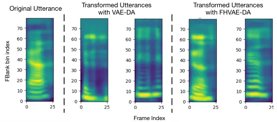

# Unsupervised Adaptation with Interpretable Disentangled Representations for Distant Conversational Speech Recognition

###### Abstract

The current trend in automatic speech recognition is to leverage large
amounts of labeled data to train supervised neural network models.
Unfortunately, obtaining data for a wide range of domains to train
robust models can be costly. However, it is relatively inexpensive to
collect large amounts of unlabeled data from domains that we want the
models to generalize to. In this paper, we propose a novel unsupervised
adaptation method that learns to synthesize labeled data for the target
domain from unlabeled in-domain data and labeled out-of-domain data. We
first learn without supervision an interpretable latent representation
of speech that encodes linguistic and nuisance factors (e.g., speaker
and channel) using different latent variables. To transform a labeled
out-of-domain utterance without altering its transcript, we transform
the latent nuisance variables while maintaining the linguistic
variables. To demonstrate our approach, we focus on a channel mismatch
setting, where the domain of interest is distant conversational speech,
and labels are only available for close-talking speech. Our proposed
method is evaluated on the AMI dataset, outperforming all baselines and
bridging the gap between unadapted and in-domain models by over 77%
without using any parallel data.

Wei-Ning Hsu, Hao Tang, James Glass

Computer Science and Artificial Intelligence Laboratory  
Massachusetts Institute of Technology  
Cambridge, MA 02139, USA

{wnhsu,haotang,glass}@mit.edu

Index Terms: unsupervised adaptation, distant speech recognition,
unsupervised data augmentation, variational autoencoder

## 1 Introduction

Distant speech recognition has greatly improved due to the recent
advance in neural network-based acoustic models, which facilitates
integration of automatic speech recognition (ASR) systems into
hands-free human-machine interaction scenarios \[1\]. To build a robust
acoustic model, previous work primarily focused on collecting labeled
in-domain data for fully supervised training \[2, 3, 4\]. However, in
practice, it is expensive and laborious to collect labeled data for all
possible testing conditions. In contrast, collecting large amount of
unlabeled in-domain data and labeled out-of-domain data can be fast and
economical. Hence, an important question arises for this scenario: how
can we do unsupervised adaptation for acoustic models by utilizing
labeled out-of-domain data and unlabeled in-domain data, in order to
achieve good performance on in-domain data?

Research on unsupervised adaptation for acoustic models can be roughly
divided into three categories: (1) constrained model adaptation \[5, 6,
7\], (2) domain-invariant feature extraction \[8, 9, 10\], and (3)
labeled in-domain data augmentation by synthesis \[11, 12, 13\]. Among
these approaches, data augmentation-based adaptation is favorable,
because it does not require extra hyperparameter tuning for acoustic
model training, and can utilize full model capacity by training a model
with as much and as diverse a dataset as possible. Another benefit of
this approach is that data in their original domain are more intuitive
to humans. In other words, it is easier for us to inspect and manipulate
the data. Furthermore, with the recent progress on domain
translation \[13, 14, 15\], conditional synthesis of in-domain data
without parallel data has become achievable, which makes data
augmentation-based adaptation a more promising direction to investigate.

Variational autoencoder-based data augmentation (VAE-DA) is a domain
adaptation method proposed in \[13\], which pools in-domain and
out-domain to train a VAE that learns factorized latent representations
of speech segments. To disentangle linguistic factors from nuisance ones
in the latent space, statistics of the latent representations for each
utterance are computed. By altering the latent representations of the
segments from a labeled out-of-domain utterance properly according to
the computed statistics, one can synthesize an in-domain utterance
without changing the linguistic content using the trained VAE decoder.
This approach shows promising results on synthesizing noisy read speech
from clean speech. However, it is non-trivial to apply this approach to
conversational speech, because utterances tend to be shorter, which
makes estimating the statistics of a disentangled representation
difficult.

In this paper, we extend VAE-DA and address the issue by learning
interpretable and disentangled representations using a variant of VAEs
that is designed for sequential data, named factorized hierarchical
variational autoencoders (FHVAEs) \[15\]. Instead of estimating the
latent representation statistics on short utterances, we use a loss that
considers the statistics across utterances in the entire corpus.
Therefore, we can safely alter the latent part that models
non-linguistic factors in order to synthesize in-domain data from
out-of-domain data. Our proposed methods are evaluated on the AMI \[16\]
dataset, which contains close-talking and distant-talking recordings in
a conference room meeting scenario. We treat close-talking data as
out-of-domain data and distant-talking data as in-domain data. In
addition to outperforming all baseline methods, our proposed methods
successfully close the gap between an unadapted model and a
fully-supervised model by more than 77% in terms of word error rate
without the presence of any parallel data.

## 2 Limitations of Previous Work

In this section, we briefly review VAE-based data augmentation and its
limitations.

### 2.1 VAE-Based Data Augmentation

Generation of speech data often involves many independent factors, such
as linguistic content, speaker identity, and room acoustics, that are
often unobserved, or only partially observed. One can describe such a
generative process using a latent variable model, where a vector
$`\bm{z}\in\mathcal{Z}`$ describing generating factors is first drawn
from a prior distribution, and a speech segment $`\bm{x}\in\mathcal{X}`$
is then drawn from a distribution conditioned on $`\bm{z}`$. VAEs \[17,
18\] are among the most successful latent variable models, which
parameterize a conditional distribution, $`p(\bm{x}|\bm{z})`$, with a
decoder neural network, and introduce an encoder neural network,
$`q(\bm{z}|\bm{x})`$, to approximate the true posterior,
$`p(\bm{z}|\bm{x})`$.

In \[19\], a VAE is proposed to model a generative process of speech
segments. A latent vector in the latent space is assumed to be a linear
combination of orthogonal vectors corresponding to the independent
factors, such as phonetic content and speaker identity. In other words,
we assume that $`\bm{z}=\bm{z}_{\ell}+\bm{z}_{n}`$ where
$`\bm{z}_{\ell}`$ encodes the linguistic/phonetic content and
$`\bm{z}_{n}`$ encodes the nuisance factors, and
$`\bm{z}_{\ell}\perp\bm{z}_{n}`$. To augment the data set while reusing
the labels, for any pair of utterance and its corresponding label
sequence $`(\bm{X},y)`$ in the data set, we generate
$`(\hat{\bm{X}},y)`$ by altering the nuisance part of $`\bm{X}`$ in the
latent space.

### 2.2 Estimating Latent Nuisance Vectors

A key observation made in \[13\] is that nuisance factors, such as
speaker identity and room acoustics, are generally constant over
segments within an utterance, while linguistic content changes from
segment to segment. In other words, latent nuisance vectors
$`\bm{z}_{n}`$ are relatively consistent within an utterance, while the
distribution of $`\bm{z}_{\ell}`$ conditioned on an utterance can be
assumed to have the same distribution as the prior. Therefore, suppose
the prior is a diagonal Gaussian with zero mean. Given an utterance
$`\bm{X}=\{\bm{x}^{(n)}\}_{n=1}^{N}`$ of $`N`$ segments, we have:

```math
\displaystyle\dfrac{1}{N}\sum_{n=1}^{N}\bm{z}^{(n)} \displaystyle=\dfrac{1}{N}\sum_{n=1}^{N}\bm{z}_{n}^{(n)}+\dfrac{1}{N}\sum_{n=1}^{N}\bm{z}_{\ell}^{(n)} \tag{1}
```

```math
\displaystyle\approx\dfrac{1}{N}\sum_{n=1}^{N}\bm{z}_{n}+\mathbb{E}_{p(z)}[\bm{z}_{\ell}]=\bm{z}_{n}+0. \tag{2}
```

That is to say, the latent nuisance vector would stand out, and the rest
would cancel out, when we take the average of latent vectors over
segments within an utterance.

This approach shows great success in transforming clean read speech into
noisy read speech. However, in a conversational scenario, the portion of
short utterances are much larger than that in a reading scenario. For
instance, in the Wall Street Journal corpus \[20\], a read speech
corpus, the average duration on the training set is 7.6s ($`\pm`$2.9s),
with no utterance shorter than 1s. On the other hand, in the AMI
corpus \[16\], the distant conversational speech meeting corpus, the
average duration on the training set is 2.6s ($`\pm`$2.7s), with over
35% of the utterances being shorter than 1s. The small number of
segments in a conversational scenario can lead to unreliable estimation
of latent nuisance vectors, because the sampled mean of latent
linguistic vectors would exhibit large variance from the population
mean. The estimation under such a condition can contain information
about not only nuisance factors, but also linguistic factors. Indeed, we
illustrate in Figure 1 that modifying the estimated latent nuisance
vector of a short utterance can result in undesirable changes to its
linguistic content.



Figure 1: Comparison between VAE-DA and proposed FHVAE-DA applied to a
short utterance using nuisance factor replacement. The same source and
two target utterances are used for both methods. Our proposed FHVAE-DA
can successfully transform only nuisance factors, while VAE-DA cannot.

## 3 Methods

In this section, we describe the formulation of FHVAEs and explain how
it can overcome the limitations of vanilla VAEs.

### 3.1 Learning Interpretable Disentangled Representations

To avoid estimating nuisance vectors on short segments, one can leverage
the statistics at the corpus level, instead of at the utterance level,
to disentangle generating factors. An FHVAE \[15\] is a variant of VAEs
that models a generative process of sequential data with a hierarchical
graphical model. Specifically, an FHVAE imposes sequence-independent
priors and sequence-dependent priors to two sets of latent variables,
$`\bm{z}_{1}`$ and $`\bm{z}_{2}`$, respectively. We now formulate the
process of generating a sequence $`\bm{X}=\{\bm{x}^{(n)}\}_{n=1}^{N}`$
composed of $`N`$ sub-sequences:

1.  1.  an s-vector $`{\bm{\mu}}_{2}`$ is drawn from
        $`p({\bm{\mu}}_{2})=\mathcal{N}({\bm{\mu}}_{2}|\bm{0},\sigma^{2}_{{\bm{\mu}}_{2}}\bm{I})`$.
2.  2.  $`N`$ i.i.d. latent segment variables
        $`\bm{Z}_{1}=\{\bm{z}_{1}^{(n)}\}_{n=1}^{N}`$ are drawn from a
        global prior
        $`p(\bm{z}_{1})=\mathcal{N}(\bm{z}_{1}|\bm{0},\sigma^{2}_{\bm{z}_{1}}\bm{I})`$.
3.  3.  $`N`$ i.i.d. latent sequence variables
        $`\bm{Z}_{2}=\{\bm{z}_{2}^{(n)}\}_{n=1}^{N}`$ are drawn from a
        sequence-dependent prior
        $`p(\bm{z}_{2}|{\bm{\mu}}_{2})=\mathcal{N}(\bm{z}_{2}|{\bm{\mu}}_{2},\sigma^{2}_{\bm{z}_{2}}\bm{I})`$.
4.  4.  $`N`$ i.i.d. sub-sequences $`\bm{X}=\{\bm{x}^{(n)}\}_{n=1}^{N}`$ are
        drawn from
        $`p(\bm{x}|\bm{z}_{1},\bm{z}_{2})=\mathcal{N}(\bm{x}|f_{\mu_{x}}(\bm{z}_{1},\bm{z}_{2}),diag(f_{\sigma^{2}_{x}}(\bm{z}_{1},\bm{z}_{2})))`$,
        where $`f_{\mu_{x}}(\cdot,\cdot)`$ and
        $`f_{\sigma^{2}_{x}}(\cdot,\cdot)`$ are parameterized by a decoder
        neural network.

The joint probability for a sequence is formulated as follows:

```math
p({\bm{\mu}}_{2})\prod_{n=1}^{N}p(\bm{x}^{(n)}|\bm{z}_{1}^{(n)},\bm{z}_{2}^{(n)})p(\bm{z}_{1}^{(n)})p(\bm{z}_{2}^{(n)}|{\bm{\mu}}_{2}). \tag{3}
```

With such a formulation, $`\bm{z}_{2}`$ is encouraged to capture
generating factors that are relatively consistent within a sequence, and
$`\bm{z}_{1}`$ will then capture the residual generating factors.
Therefore, when we apply an FHVAE to model speech sequence generation,
it is clear that $`\bm{z}_{2}`$ will capture the nuisance generating
factors that are in general consistent within an utterance.

Since the exact posterior inference is intractable, FHVAEs introduce an
inference model $`q(\bm{Z}_{1},\bm{Z}_{2},{\bm{\mu}}_{2}|\bm{X})`$ to
approximate the true posterior, which is factorized as follows:

```math
q({\bm{\mu}}_{2})\prod_{n=1}^{N}q(\bm{z}_{1}^{(n)}|\bm{x}^{(n)},\bm{z}_{2}^{(n)})q(\bm{z}_{2}^{(n)}|\bm{x}^{(n)}), \tag{4}
```

where $`q({\bm{\mu}}_{2})`$, $`q(\bm{z}_{1}|\bm{x},\bm{z}_{2})`$, and
$`q(\bm{z}_{2}|\bm{x})`$ are all diagonal Gaussian distributions. Two
encoder networks are introduced in FHVAEs to parameterize mean and
variance values of $`q(\bm{z}_{1}|\bm{x},\bm{z}_{2})`$ and
$`q(\bm{z}_{2}|\bm{x})`$ respectively. As for $`q({\bm{\mu}}_{2})`$, for
testing utterances we parameterize its mean with an approximated maximum
a posterior (MAP) estimation
$`\sum_{n=1}^{N}\hat{\bm{z}}_{2}^{(n)}/(N+\sigma^{2}_{\bm{z}_{2}}/\sigma^{2}_{{\bm{\mu}}_{2}})`$,
where $`\hat{\bm{z}}_{2}^{(n)}`$ is the inferred posterior mean of
$`q(\bm{z}_{2}^{(n)}|\bm{x}^{(n)})`$; during training, we initialize a
lookup table of posterior mean of $`{\bm{\mu}}_{2}`$ for each training
utterance with the approximated MAP estimation, and treat the lookup
table as trainable parameters. This can avoid computing the MAP
estimation of each segment for each mini-batch, and utilize the
discriminative loss proposed in \[15\] to encourage disentanglement.

### 3.2 FHVAE-Based Data Augmentation

With a trained FHVAE, we are able to infer disentangled latent
representations that capture linguistic factors $`\bm{z}_{1}`$ and
nuisance factors $`\bm{z}_{2}`$. To transform nuisance factors of an
utterance $`\bm{X}`$ without changing the corresponding transcript, one
only needs to perturb $`\bm{Z}_{2}`$. Furthermore, since each
$`\bm{z}_{2}`$ within an utterance is generated conditioned on a
Gaussian whose mean is $`{\bm{\mu}}_{2}`$, we can regard
$`{\bm{\mu}}_{2}`$ as the representation of nuisance factors of an
utterance. We now derive two data augmentation methods similar to those
proposed in \[13\], named nuisance factor replacement and nuisance
factor perturbation.

#### 3.2.1 Nuisance Factor Replacement

Given a labeled out-of-domain utterance $`(\bm{X}_{out},y_{out})`$ and
an unlabeled in-domain utterance $`\bm{X}_{in}`$, we want to transform
$`\bm{X}_{out}`$ to $`\hat{\bm{X}}_{out}`$ such that it exhibits the
same nuisance factors as $`\bm{X}_{in}`$, while maintaining the original
linguistic content. We can then add the synthesized labeled in-domain
data $`(\hat{\bm{X}}_{out},y_{out})`$ to the ASR training set. From the
generative modeling perspective, this implies that $`\bm{z}_{2}`$ of
$`\bm{X}_{in}`$ and $`\hat{\bm{X}}_{out}`$ are drawn from the same
distribution. We carry out the same modification for the latent sequence
variable of each segment of $`\bm{X}_{out}`$ as follows:
$`\hat{\bm{z}}_{2,out}=\bm{z}_{2,out}-\bm{\mu}_{2,out}+\bm{\mu}_{2,in}`$,
where $`{\bm{\mu}}_{2,out}`$ and $`{\bm{\mu}}_{2,in}`$ are the
approximate MAP estimations of $`{\bm{\mu}}_{2}`$.

#### 3.2.2 Nuisance Factor Perturbation

Alternatively, we are also interested in synthesizing an utterance
conditioned on unseen nuisance factors, for example, the interpolation
of nuisance factors between two utterances. We propose to draw a random
perturbation vector $`\bm{p}`$ and compute
$`\hat{\bm{z}}_{2,out}=\bm{z}_{2,out}+\bm{p}`$ for each segment in an
utterance, in order to synthesize an utterance with perturbed nuisance
factors. Naively, we may want to sample $`\bm{p}`$ from a centered
isotropic Gaussian. However, in practice, VAE-type of models suffer from
an over-pruning issue \[21\] in that some latent variables become
inactive, which we do not want to perturb. Instead, we only want to
perturb the linear subspace which models the variation of nuisance
factors between utterances. Therefore, we adopt a similar soft
perturbation scheme as in \[13\]. First,
$`\{{\bm{\mu}}_{2}\}_{i=1}^{M}`$ for all $`M`$ utterances are estimated
with the approximated MAP. Principle component analysis is performed to
obtain $`D`$ pairs of eigenvalue $`\sigma_{d}`$ and eigenvectors
$`\bm{e}_{d}`$, where $`D`$ is the dimension of $`{\bm{\mu}}_{2}`$.
Lastly, one random perturbation vector $`\bm{p}`$ is drawn for each
utterance to perturb as follows:

```math
\bm{p}=\gamma\sum_{d=1}^{D}\psi_{d}\sigma_{d}\bm{e}_{d},\hskip 9.24994pt\psi_{d}\sim\mathcal{N}(0,1), \tag{5}
```

where $`\gamma`$ is used to control the perturbation scale.

## 4 Experimental Setup

We evaluate our proposed method on the AMI meeting corpus \[16\]. The
AMI corpus consists of 100 hours of meeting recordings in English,
recorded in three different meeting rooms with different acoustic
properties, and with three to five participants for each meeting that
are mostly non-native speakers. Multiple microphones are used for
recording, including individual headset microphones (IHM), and far-field
microphone arrays. In this paper, we regard IHM recordings as
out-of-domain data, whose transcripts are available, and single distant
microphone (SDM) recordings as in-domain data, whose transcripts are not
available, but on which we will evaluate our model. The recommended
partition of the corpus is used, which contains an 80 hours training
set, and 9 hours for a development and a test set respectively. FHVAE
and VAE models are trained using both IHM and SDM training sets, which
do not require transcripts. ASR acoustic models are trained using
augmented data and transcripts based on only the IHM training set. The
performance of all ASR systems are evaluated on the SDM development set.
The NIST asclite tool \[22\] is used for scoring.

### 4.1 VAE and FHVAE Configurations

Speech segments of 20 frames, represented with 80 dimensional log Mel
filterbank coefficients (FBank) are used as inputs. We configure VAE and
FHVAE models such that they have comparable modeling capacity. The VAE
latent variable dimension is 64, whereas the dimensions of
$`\bm{z}_{1}`$ and $`\bm{z}_{2}`$ in FHVAEs are both 32. Both models
have a two-layer LSTM decoder with 256 memory cells that predicts one
frame of $`\bm{x}`$ at a time. Since a FHVAE model has two encoders,
while a VAE model only has one, we use a two-layer LSTM encoder with 256
memory cells for the former, and with 512 memory cells for the latter.
All the LSTM encoders take one frame as input at each step, and the
output from the last step is passed to an affine transformation layer
that predicts the mean and the log variance of latent variables. The VAE
model is trained to maximize the variational lower bound, and the FHVAE
model is trained to maximize the discriminative segment variational
lower bound proposed in \[15\] with a discriminative weight
$`\alpha=10`$. In addition, the original FHVAE training \[15\] is not
scalable to hundreds of thousands of utterances; we therefore use the
hierarchical sampling-based training algorithm proposed in \[23\] with
batches of 5,000 utterances. Adam \[24\] with $`\beta_{1}=0.95`$ and
$`\beta_{2}=0.999`$ is used to optimize all models. Tensorflow \[25\] is
used for implementation.

### 4.2 ASR Configuration

Kaldi \[26\] is used for feature extraction, forced alignment, decoding,
and training of initial HMM-GMM models on the IHM training set. The
Microsoft Cognitive Toolkit \[27\] is used for neural network acoustic
model training. For all experiments, the same 3-layer LSTM acoustic
model \[28\] with the architecture proposed in \[2\] is adopted, which
has 1024 memory cells and a 512-node linear projection layer for each
LSTM layer. Following the setup in \[29\], LSTM acoustic models are
trained with cross entropy loss, truncated back-propagation through
time \[30\], and mini-batches of 40 parallel utterances and 20 frames. A
momentum of 0.9 is used starting from the second epoch \[2\]. Ten
percent of training data is held out for validation, and the learning
rate is halved if no improvement is observed on the validation set after
an epoch.

## 5 Results and Discussion

|                                         |              |              |
| --------------------------------------- | ------------ | ------------ |
|                                         | WER (%)      |              |
| ASR Training Set                        | SDM-dev      | IHM-dev      |
| IHM                                     | 70.8         | 27.0         |
| SDM                                     | 46.8 (-24.0) | 42.5 (+15.5) |
| IHM, FHVAE-DI, ($`\bm{z}_{1}`$) \[10\]  | 64.8 (-6.0)  | 29.0 (+2.0)  |
| IHM, VAE-DA, (repl) \[13\]              | 62.2 (-8.0)  | 31.8 (+4.8)  |
| IHM, VAE-DA, (p, $`\gamma=1.0`$) \[13\] | 61.1 (-9.7)  | 30.0 (+3.0)  |
| IHM, VAE-DA, (p, $`\gamma=1.5`$) \[13\] | 61.9 (-8.9)  | 31.4 (+4.4)  |

Table 1: Baseline WERs for the AMI IHM/SDM task.

We first establish baseline results and report the SDM (in-domain) and
IHM (out-of-domain) development set word error rates (WERs) in Table 1.
To avoid constantly querying the test set results, we only report WERs
on the development set. If not otherwise mentioned, the data
augmentation-based systems are evaluated on reconstructed features, and
trained on a transformed IHM set, where each utterance is only
transformed once, without the original copy of data.

The first two rows of results show that the WER gap between the
unadapted model and the model trained on in-domain data is 24%. The
third row reports the results of training with domain invariant feature,
$`\bm{z}_{1}`$, extracted with a FHVAE as is done in \[10\]. It improves
over the baseline by 6% absolute. VAE-DA \[13\] results with nuisance
factor replacement (repl) and latent nuisance perturbation (p) are shown
in the last three rows.

|                                        |              |             |
| -------------------------------------- | ------------ | ----------- |
|                                        | WER (%)      |             |
| ASR Training Set                       | SDM-dev      | IHM-dev     |
| IHM                                    | 70.8         | 27.0        |
| IHM, FHVAE-DA, (repl)                  | 59.0 (-11.8) | 31.3 (+4.3) |
| IHM, FHVAE-DA, (p, $`\gamma=1.0`$)     | 58.6 (-12.2) | 30.1 (+3.1) |
| IHM, FHVAE-DA, (p, $`\gamma=1.5`$)     | 58.7 (-12.1) | 31.4 (+4.4) |
| IHM, FHVAE-DA, (rev-p, $`\gamma=1.0`$) | 70.9 (+0.1)  | 30.2 (+3.2) |
| IHM, FHVAE-DA, (uni-p, $`\gamma=1.0`$) | 66.6 (-4.2)  | 30.9 (+3.9) |

Table 2: WERs of the proposed and the alternative methods.

We then examine the effectiveness of our proposed method and show the
results in the second, third, and fourth rows in Table 2. We observe
about 12% WER reduction on the in-domain development set for both
nuisance factor perturbation (p) and nuisance factor replacement (repl),
with little degradation on the out-of-domain development set. Both
augmentation methods outperform their VAE counterparts and the domain
invariant feature baseline using the same FHVAE model. We attribute the
improvement to the better quality of the transformed IHM data, which
covers the nuisance factors of the SDM data, without altering the
original linguistic content.

To verify the superiority of the proposed method of drawing random
perturbation vectors, we compare two alternative sampling methods: rev-p
and uni-p, similar to \[13\], with the same expected squared Euclidean
norm as the proposed method. The rev-p replaces $`\sigma_{d}`$ in Eq. 5
with $`\sigma_{D-d}`$, where $`[\sigma_{1},\cdots,\sigma_{D}]`$ is
sorted, while the uni-p replaces it with
$`\sqrt{\sum_{d=1}^{D}\sigma_{d}^{2}/D}`$. Results shown in the last two
rows in Table 2 confirm that the proposed sampling method is more
effective under the same perturbation scale $`\gamma=1.0`$ compared to
the alternative methods as expected.

|                   |                 |      |                 |      |
| ----------------- | --------------- | ---- | --------------- | ---- |
|                   | SDM-dev WER (%) |      | IHM-dev WER (%) |      |
| ASR Training Set  | recon.          | ori. | recon.          | ori. |
| reconstruction    | 73.8            | 79.5 | 30.1            | 32.1 |
| repl              | 59.0            | 71.4 | 31.3            | 34.4 |
| +ori. IHM         | 59.4            | 61.4 | 30.5            | 26.2 |
| p, $`\gamma=1.0`$ | 58.6            | 71.8 | 30.1            | 31.5 |
| +ori. IHM         | 58.0            | 66.2 | 29.0            | 25.9 |

Table 3: WERs on reconstructed data and original data.

Due to imperfect reconstruction using FHVAE models, some linguistic
information may be lost in this process. Furthermore, since VAE models
tend to have overly-smoothed outputs, one can easily tell an original
utterance from a reconstructed one. In other words, there is another
layer of domain mismatch between original data and reconstructed data.
In Table 3, we investigate the performance of models trained with
different data on both original data and reconstructed data. The first
row, a model trained on the reconstructed IHM data serves as the
baseline, from which we observe a 3.0%/3.1% WER increase on SDM/IHM when
tested on the reconstructed data, and a further 5.7%/2.0% WER increase
when tested on the original data.

Compared to the reconstruction baseline, the proposed perturbation and
replacement method both show about 15% improvement on the reconstructed
SDM data, and 8% on the original SDM data. Results on the reconstructed
or original IHM data are comparable to the baseline. The performance
difference between the original and reconstructed SDM shows that FHVAEs
are able to transform the IHM acoustic features closer to the
reconstructed SDM data. We then explore adding the original IHM training
data to the two transformed sets (+ori. IHM). This significantly
improves the performance on the original data for both SDM and IHM data
sets. We even see an improvement from 27.0% to 25.9% on the IHM
development set compared to the model trained on original IHM data.

|                                         |              |              |
| --------------------------------------- | ------------ | ------------ |
|                                         | WER (%)      |              |
| ASR Training Set                        | SDM-dev      | IHM-dev      |
| IHM-a                                   | 86.5         | 31.8         |
| SDM-b                                   | 55.4 (-31.1) | 51.0 (+19.2) |
| IHM-a, FHVAE-DA, (pert, $`\gamma=1.0`$) | 62.4 (-24.1) | 33.4 (+1.6)  |

Table 4: Models trained on disjoint partition of IHM/SDM data.

Finally, to demonstrate that FHVAEs are not exploiting the parallel
connection between the IHM and SDM data sets, we create two disjoint
sets of recordings of roughly the same size, such that IHM-a and SDM-b
only contain one set of recordings each. Results are shown in 4, where
the FHVAE models is trained without any parallel utterances. In this
setting, we observe an even more significant 24.1% absolute WER
improvement from the baseline IHM-a model, which bridges the gap by over
77% to the fully supervised model.

## 6 Conclusions and Future Work

In this paper, we marry the VAE-based data augmentation method with
interpretable disentangled representations learned from FHVAE models for
transforming data from one domain to another. The proposed method
outperforms both baselines, and demonstrates the ability to reduce the
gap between an unadapted model and a fully supervised model by over 77%
without the presence of any parallel data. For future work, we plan to
investigate the unsupervised data augmentation techniques for a wider
range of tasks. In addition, data augmentation is inherently inefficient
because the training time grows linearly in the amount of data we have.
We plan to explore model-space unsupervised adaptation to combat this
limitation.

## References

- \[1\] B. Li, T. Sainath, A. Narayanan, J. Caroselli, M. Bacchiani,
  A. Misra, I. Shafran, H. Sak, G. Pundak, K. Chin _et al._, “Acoustic
  modeling for Google Home,” in _Interspeech_, 2017.
- \[2\] Y. Zhang, G. Chen, D. Yu, K. Yaco, S. Khudanpur, and J. Glass,
  “Highway long short-term memory RNNs for distant speech recognition,”
  in _International Conference on Acoustics, Speech and Signal
  Processing (ICASSP)_, 2016.
- \[3\] W.-N. Hsu, Y. Zhang, and J. Glass, “A prioritized grid long
  short-term memory rnn for speech recognition,” in _IEEE Workshop on
  Spoken Language Technology (SLT), 2016 IEEE_, 2016.
- \[4\] J. Kim, M. El-Khamy, and J. Lee, “Residual LSTM: Design of a
  deep recurrent architecture for distant speech recognition,”
  _arXiv:1701.03360_, 2017.
- \[5\] M. J. Gales, “Maximum likelihood linear transformations for
  HMM-based speech recognition,” _Computer speech & language_, vol. 12,
  no. 2, 1998.
- \[6\] P. Swietojanski and S. Renals, “Learning hidden unit
  contributions for unsupervised speaker adaptation of neural network
  acoustic models,” in _IEEE Workshop on Spoken Language Technology
  (SLT)_. IEEE, 2014.
- \[7\] P. Swietojanski, J. Li, and S. Renals, “Learning hidden unit
  contributions for unsupervised acoustic model adaptation,” _IEEE
  Transactions on Audio, Speech, and Language Processing_, vol. 24,
  no. 8, 2016.
- \[8\] S. Sun, B. Zhang, L. Xie, and Y. Zhang, “An unsupervised deep
  domain adaptation approach for robust speech recognition,”
  _Neurocomputing_, 2017.
- \[9\] Z. Meng, Z. Chen, V. Mazalov, J. Li, and Y. Gong, “Unsupervised
  adaptation with domain separation networks for robust speech
  recognition,” _arXiv:1711.08010_, 2017.
- \[10\] W.-N. Hsu and J. Glass, “Extracting domain invariant features
  by unsupervised learning for robust automatic speech recognition,” in
  _International Conference on Acoustics, Speech and Signal Processing
  (ICASSP)_, 2018.
- \[11\] N. Jaitly and G. E. Hinton, “Vocal tract length perturbation
  (VTLP) improves speech recognition,” in _ICML workshop on Deep
  Learning for Audio, Speech, and Language Processing_, 2013.
- \[12\] T. Ko, V. Peddinti, D. Povey, and S. Khudanpur, “Audio
  augmentation for speech recognition,” in _Interspeech_, 2015.
- \[13\] W.-N. Hsu, Y. Zhang, and J. Glass, “Unsupervised domain
  adaptation for robust speech recognition via variational
  autoencoder-based data augmentation,” in _IEEE Workshop on Automatic
  Speech Recognition and Understanding (ASRU)_, 2017.
- \[14\] J.-Y. Zhu, T. Park, P. Isola, and A. A. Efros, “Unpaired
  image-to-image translation using cycle-consistent adversarial
  networks,” _arXiv:1703.10593_, 2017.
- \[15\] W.-N. Hsu, Y. Zhang, and J. Glass, “Unsupervised learning of
  disentangled and interpretable representations from sequential data,”
  in _Advances in Neural Information Processing Systems (NIPS)_, 2017.
- \[16\] J. Carletta, “Unleashing the killer corpus: experiences in
  creating the multi-everything AMI meeting corpus,” _Language Resources
  and Evaluation_, vol. 41, no. 2, 2007.
- \[17\] D. P. Kingma and M. Welling, “Auto-encoding variational bayes,”
  _arXiv:1312.6114_, 2013.
- \[18\] D. J. Rezende, S. Mohamed, and D. Wierstra, “Stochastic
  backpropagation and approximate inference in deep generative models,”
  _arXiv:1401.4082_, 2014.
- \[19\] W.-N. Hsu, Y. Zhang, and J. Glass, “Learning latent
  representations for speech generation and transformation,” in
  _Interspeech_, 2017.
- \[20\] J. Garofalo, D. Graff, D. Paul, and D. Pallett, “CSR-I (WSJ0)
  complete,” _Linguistic Data Consortium_, 2007.
- \[21\] S. Yeung, A. Kannan, Y. Dauphin, and L. Fei-Fei, “Tackling
  over-pruning in variational autoencoders,” _arXiv:1706.03643_, 2017.
- \[22\] J. G. Fiscus, J. Ajot, N. Radde, and C. Laprun, “Multiple
  dimension Levenshtein edit distance calculations for evaluating
  automatic speech recognition systems during simultaneous speech,” in
  _International Conference on language Resources and Evaluation
  (LERC)_, 2006.
- \[23\] W.-N. Hsu and J. Glass, “Scalable factorized hierarchical
  variational autoencoder training,” _arXiv preprint
  arXiv:1804.03201_, 2018.
- \[24\] D. Kingma and J. Ba, “Adam: A method for stochastic
  optimization,” _arXiv:1412.6980_, 2014.
- \[25\] M. Abadi, P. Barham, J. Chen, Z. Chen, A. Davis, J. Dean,
  M. Devin, S. Ghemawat, G. Irving, M. Isard _et al._, “Tensorflow: A
  system for large-scale machine learning.” in _OSDI_, vol. 16, 2016.
- \[26\] D. Povey, A. Ghoshal, G. Boulianne, L. Burget, O. Glembek,
  N. Goel, M. Hannemann, P. Motlicek, Y. Qian, P. Schwarz _et al._, “The
  Kaldi speech recognition toolkit,” in _IEEE Workshop on Automatic
  Speech Recognition and Understanding (ASRU)_, 2011.
- \[27\] D. Yu, A. Eversole, M. Seltzer, K. Yao, Z. Huang, B. Guenter,
  O. Kuchaiev, Y. Zhang, F. Seide, H. Wang _et al._, “An introduction to
  computational networks and the computational network toolkit,”
  Microsoft Research, Tech. Rep., 2014.
- \[28\] H. Sak, A. W. Senior, and F. Beaufays, “Long short-term memory
  recurrent neural network architectures for large scale acoustic
  modeling.” in _Interspeech_, 2014.
- \[29\] W.-N. Hsu, Y. Zhang, A. Lee, and J. R. Glass, “Exploiting depth
  and highway connections in convolutional recurrent deep neural
  networks for speech recognition.” in _Interspeech_, 2016.
- \[30\] R. J. Williams and J. Peng, “An efficient gradient-based
  algorithm for on-line training of recurrent network trajectories,”
  _Neural computation_, vol. 2, no. 4, 1990.
