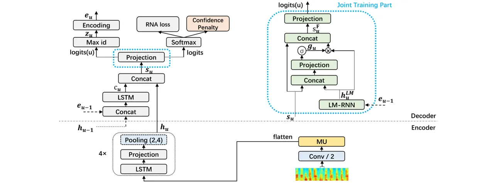

# Extending Recurrent Neural Aligner for Streaming End-to-End Speech Recognition in Mandarin

###### Abstract

End-to-end models have been showing superiority in Automatic Speech
Recognition (ASR). At the same time, the capacity of streaming
recognition has become a growing requirement for end-to-end models.
Following these trends, an encoder-decoder recurrent neural network
called Recurrent Neural Aligner (RNA) has been freshly proposed and
shown its competitiveness on two English ASR tasks. However, it is not
clear if RNA can be further improved and applied to other spoken
language. In this work, we explore the applicability of RNA in Mandarin
Chinese and present four effective extensions: In the encoder, we
redesign the temporal down-sampling and introduce a powerful
convolutional structure. In the decoder, we utilize a regularizer to
smooth the output distribution and conduct joint training with a
language model. On two Mandarin Chinese conversational telephone speech
recognition (MTS) datasets, our Extended-RNA obtains promising
performance. Particularly, it achieves 27.7% character error rate (CER),
which is superior to current state-of-the-art result on the popular
HKUST task.

Linhao Dong^(1,2), Shiyu Zhou^(1,2), Wei Chen¹, Bo Xu¹

¹Institute of Automation, Chinese Academy of Sciences, China  
²University of Chinese Academy of Sciences, China

{donglinhao2015, zhoushiyu2013, w.chen, xubo}@ia.ac.cn

Index Terms: speech recognition, recurrent neural aligner, mandarin,
end-to-end

## 1 Introduction

Recently, a considerable amount of works have demonstrated the
simplification and effectiveness of end-to-end models in the ASR field
\[1, 2, 3, 4, 5\]. These models eschew the needs of finite state
transducers (FST), pronouncing lexicons or any expert knowledge in the
conventional ASR systems and directly recognize speech utterance by a
single neural network.

Among these models, Listen, Attend and Spell (LAS) \[2\] is a very
popular attention-based model, which achieves delightful improvements
over the state-of-the-art conventional ASR systems \[6\]. However, the
limitation that the input sequence must be entirely encoded before
conducting attention hampers LAS in supporting streaming recognition.
Neural Transducer (NT) \[3\] and Monotonic Alignments \[4\] are
therefore proposed to revise the LAS model with online attention
mechanisms, and form one branch of streaming end-to-end models.

Besides above attention-based models, Recurrent Neural Network
Transducer (RNN-T) \[1\] and Recurrent Neural Aligner (RNA) \[5\] are
also end-to-end models within the encoder-decoder framework. They extend
the CTC \[7\] approach and produce strictly monotonic alignments between
the input sequence and target sequence. Unlike the CTC model, they don’t
make a conditional independence assumption between predictions at
different steps. Specifically, RNN-T keeps alternating between updating
the transcription and the prediction network based on if the predicted
label is a blank or not. RNA is simpler than RNN-T and encodes the
predicted label as a input to the decoder no matter what the label is.
These two models form another branch of end-to-end models offer
streaming decoding.

Comparing with other streaming end-to-end models, RNA has following
advantages: (1) RNA produces left-to-right alignments naturally, which
has less building complexity than online attention-based models; (2) RNA
predicts one output label at each time step in input, rather than
multiple labels by RNN-T, thus simplifying the beam search decoding and
making training more efficient. However, RNA has only been evaluated its
effectiveness on English ASR task, and it is not clear if RNA can be
successfully applied to other spoken language.

In this work, we introduce the RNA model to Mandarin Chinese, which has
some noteworthy distinctions from English: (1) Mandarin has a lower
temporal entropy density and less number of characters per second \[8\],
thus may suitable for different temporal down-sampling mechanisms from
English; (2) Each character of Mandarin has it own tonal pronunciation,
which needs to be carefully distinguished during recognizing; (3)
Mandarin has a larger alphabet set (commonly several thousands) than
English, and most of characters have many homonyms, which are easy to be
wrongly written. Based on above analyses, we extend RNA in following
aspects:

- •
  We explore various temporal down-sampling mechanisms for Mandarin. The
  results show that 1/8 down-sampling rate performs best, and suitable
  combination of different down-sampling methods also matters.
- •
  In order to capture more distinguishable acoustic details, we
  introduce Multiplicative Unit (MU) \[9\] to the encoder of RNA. And
  find it offers consistent CER reduction in Mandarin recognition.
- •
  Since Mandarin has a large character set where most characters have
  various homonyms, we encourage more smooth output distribution by
  conducting Confidence Penalty\[10\], which helps RNA to explore more
  sensible alternatives and obtain better generalization.
- •
  For alleviating the wrongly written phenomenon of homonyms in
  Mandarin, we propose a joint training mechanism of RNA and Recurrent
  Neural Network Language Model (RNN-LM). The mechanism is designed for
  sidestepping the disturbance of blank label in RNA and could
  facilitate better recognition results.

Our Extended-RNA model obtains competitive performance on both of two
Mandarin Chinese ASR datasets. Especially, it establishes a new
state-of-the-art CER performance of 27.7% on the Mandarin Chinese ASR
benchmark (HKUST) \[11\].

## 2 Recurrent Neural Aligner

Recurrent Neural Aligner (RNA) utilizes an encoder-decoder framework.
Let $`\mathbb{x}`$ = ($`x_{1},x_{2},...,x_{T}`$) be the input sequence
of audio frame features and $`\mathbb{y}`$ = ($`y_{1},y_{2},...,y_{N}`$)
be the target sequence of labels. The encoder, which could be any neural
network, transforms the original input sequence $`\mathbb{x}`$ into a
high level representation $`\mathbb{h}`$ = ($`h_{1},h_{2},...,h_{U}`$)
with length $`U\leq T`$:

```math
\mathbb{h}=\text{encoder}(\mathbb{x}) \tag{1}
```

The decoder is a recurrent neural network with a softmax output layer
containing $`L+1`$ units, where $`L`$ is the number of real labels and
the additional one is the blank label. We simplify the original RNA
decoder in \[5\] for lighter training and computation consistency
between training and inference. Specifically, at step $`u`$, the input
to decoder is the concatenation of encoder output $`h_{u}`$ and encoded
vector $`e_{u-1}`$ of label $`z_{u-1}`$, which is the predicted label
with the maximum probability among the softmax outputs at step $`u-1`$.
So, the calculation of label $`z_{u}`$ can be formulated as:

```math
z_{u}=\mathop{\arg\max}_{l\in[1,L+1]}(\text{decoder}(h_{u},e_{u-1})) \tag{2}
```

RNA defines a conditional distribution $`p(\mathbb{z}|\mathbb{x})`$,
where $`\mathbb{z}`$ = ($`z_{1},z_{2},...,z_{U}`$) is a label sequence
of length $`U`$ possibly with blank labels which are removed to give the
corresponding output sequence. In other words, $`\mathbb{z}`$ represents
one of the possible alignments between input sequence $`\mathbb{x}`$ and
target sequence $`\mathbb{y}`$. Therefore, the distribution over target
label sequence $`\mathbb{y}`$ can be estimated by marginalizing all
possible alignments:

```math
p(\mathbb{y}|\mathbb{x})=\sum_{\mathbb{z}}p(\mathbb{z}|\mathbb{x}) \tag{3}
```

In above formulation, the conditional distribution
$`p(\mathbb{z}|\mathbb{x})=\prod_{u}p`$($`z_{u}|z_{1}^{u-1},\mathbb{x}`$)
differs from the distribution of the CTC model:
$`p(\mathbb{z}|\mathbb{x})=\prod_{u}p`$($`z_{u}|\mathbb{x}`$) which
makes a conditional independence assumption between predictions at
different steps. Besides, RNA obtains the predicted output sequence by
simply removing the blanks from alignment $`\mathbb{z}`$, while the CTC
model needs to remove first the repeated labels and then the blanks.

The entire network of RNA is optimized by minimizing the negative
log-likelihood
$`\sum_{(\mathbb{x},\mathbb{y})}`$-log($`p`$($`\mathbb{y}|\mathbb{x}`$))
for all training pairs ($`\mathbb{x},\mathbb{y}`$). Since marginalizing
over all possible alignments $`\mathbb{z}`$ corresponding to
$`\mathbb{y}`$ consumes expensive calculations, RNA estimates the
negative log-likelihood by an approximate dynamic programming method
which introduces the forward and backward variables. The calculation is
detailed in \[5\].

There are two decoding strategies in inference: greedy search and beam
search. Specifically, greedy search picks the most probable label at
each step and uses that label as a input for the next prediction. Beam
search uses the probability distribution at each step and updates the
top hypotheses by choosing the most probable alignments extended from
previous top hypotheses in search.

## 3 Extended Recurrent Neural Aligner

We improve RNA on following four extensions, and the architecture of our
Extended-RNA is illustrated in Figure 1.



Figure 1: The architecture of our Extended-RNA. The temporal
down-sampling is applied by one convolutional layer with stride 2 and
pooling after LSTM layer 2, 4 both with width 2. Multiplicative Unit
(MU) is placed after the convolutional layer. Confidence Penalty is
conducted on the outputs of softmax layer together with the RNA loss
(the negative log-likelihood). When combining RNN-LM, we replace the
projection layer in the smaller blue dashed rectangle with the Joint
Training Part in the bigger one.

### 3.1 Temporal down-sampling

In ASR task, the sequence length $`U`$ of hidden representation
$`\mathbb{h}`$ is normally less than the input length $`T`$, which helps
to extract more useful information and promote faster calculation. In
\[5\], it is implemented by down-sampling the stacked input frames.
Here, we extend its mechanism and introduce two other temporal
down-sampling methods:

#### 3.1.1 Pooling between LSTMs

In the encoder, we utilize long short-term memory (LSTM) \[12\] to
conduct the recurrent modelling and introduce a linear projecting layer
after each of LSTM layers. Pooling layer is optionally placed after the
projection layer and performs max-pooling operation with width $`w`$ on
the projected outputs $`\mathbb{r}`$ = ($`r_{1},r_{2},...,r_{T}`$) to
produce the corresponding down-sampled result $`\mathbb{p}`$ =
($`p_{1},p_{2},...,p_{T/w}`$). In this paper, $`\mathbb{r}`$ is
zero-padded when it’s not pooled exactly.

#### 3.1.2 Strided convolutional layers

The speech inputs can be depicted as 2-dimensional spectrograms with
time and frequency axes. Therefore, we could place convolutional layers
\[13\] before the recurrent part to exploit the structure locality of
spectrograms \[14\]. In this case, we apply striding ($`s_{t}`$,
$`s_{f}`$) when calculating the convolutional layers to get the
down-sampled feature map with size ($`T/s_{t}`$, $`F/s_{f}`$) where
$`T`$, $`F`$ represent the number of frames and frequency bins of the
input feature map, respectively. Note that the input feature maps are
also zero-padded when encountering inexact convolutions.

### 3.2 Multiplicative Units

Since convolutional layers provide translational invariance in acoustic
modelling, we believe introducing powerful convolutional structures
could further capture distinguishable acoustic details (like tone).
Multiplicative Unit (MU) \[9\] is one type of such structures and is
constructed by incorporating LSTM-like gates into convolutional neural
networks.

Given an input $`\mathbb{I}`$ of size $`T\times F\times c`$, where c
corresponds to the number of channels, $`\mathbb{I}`$ is first passed
through four convolutional layers to create three gates
$`\mathbb{g_{1-3}}`$ and an update $`\mathbb{u}`$. The input, gates and
update of MU are then combined as follows:

```math
\displaystyle\mathbb{g_{1}} \displaystyle=\sigma(\mathbb{W_{1}}*\mathbb{I}+\mathbb{b_{1}}) \tag{4}
```

```math
\displaystyle\mathbb{g_{2}} \displaystyle=\sigma(\mathbb{W_{2}}*\mathbb{I}+\mathbb{b_{2}}) \tag{5}
```

```math
\displaystyle\mathbb{g_{3}} \displaystyle=\sigma(\mathbb{W_{3}}*\mathbb{I}+\mathbb{b_{3}}) \tag{6}
```

```math
\displaystyle\mathbb{u} \displaystyle=\text{tanh}(\mathbb{W_{4}}*\mathbb{I}+\mathbb{b_{4}}) \tag{7}
```

```math
\displaystyle\text{MU}(\mathbb{I};\mathbb{W}) \displaystyle=\mathbb{g_{1}}\odot\text{tanh}(\mathbb{g_{2}}\odot\mathbb{I}+\mathbb{g_{3}}\odot\mathbb{u}+\mathbb{b_{5}}) \tag{8}
```

where $`\sigma`$ is the sigmoid non-linearity, $`*`$ represents the
convolutional operation, $`\odot`$ represents component-wise
multiplication, $`\mathbb{W_{1-4}}`$ and $`\mathbb{b_{1-5}}`$ are the
convolutional weights and biases, respectively. In this paper, we add
layer normalization \[15\] before the non-linearity in (4)-(7) as \[16\]
and use a kernel of size 3$`\times`$3 for $`\mathbb{W_{1-4}}`$.

### 3.3 Confidence Penalty

Confidence Penalty \[10\] is a regularizer on the outputs to penalize
over-confident distributions, which place all probability on a single
class and have very low entropy. Therefore, it helps the model to
explore more sensible alternatives and obtain better generalization.
Comparing with Label Smoothing \[17\], it needn’t specify a presupposed
distribution which is usually hard to estimate, especially for RNA that
contains the blank label.

Given an input sequence $`\mathbb{x}`$, the RNA produces a conditional
distribution $`p_{\theta}(\mathbb{z}|\mathbb{x})`$ over the alignment
$`\mathbb{z}`$ = ($`z_{1},z_{2},...,z_{U}`$) with length $`U`$. The
entropy of this conditional distribution is:

```math
H(p_{\theta}(\mathbb{z}|\mathbb{x}))=-\sum_{u\in[1,U]}\sum_{z_{u}\in[1,L+1]}p_{\theta}(z_{u}|\mathbb{x})\text{log}(p_{\theta}(z_{u}|\mathbb{x})) \tag{9}
```

Then, in order to penalize over-confident distributions that have very
low entropy, we add the negative entropy of
$`p_{\theta}(\mathbb{z}|\mathbb{x})`$ to the negative log-likelihood and
get the final loss $`L(\theta)`$:

```math
L(\theta)=\sum_{(\mathbb{x},\mathbb{y})}-\text{log}(p_{\theta}(\mathbb{y}|\mathbb{x}))-\lambda\sum_{\mathbb{x}}H(p_{\theta}(\mathbb{z}|\mathbb{x})) \tag{10}
```

where $`\lambda`$ is a tunable parameter for balancing the negative
log-likelihood and the regularization of Confidence Penalty.

### 3.4 Joint training with RNN-LM

Incorporating a character-based language model (LM) into the
attention-based models has shown great effectiveness \[18, 19\].
However, the blank label is contained in the output space of RNA and
brings following problems: (1) If we use the shallow fusion in \[19\],
it’s hard to obtain accurate alignments containing blank for training
the LM. (2) If we use the mechanism of joint training with RNN-LM in
\[18\], the blank label hampers the synchronism between the outputs of
RNA and the RNN-LM.

Based on above analysis, we present a joint training mechanism designed
for RNA and RNN-LM. At step $`u`$, let $`\mathbb{s_{u}}`$ represents the
RNA state, which is the concatenation of decoder LSTM output
$`\mathbb{c_{u}}`$ and encoder output $`\mathbb{h_{u}}`$. Let
$`\mathbb{h_{u}^{LM}}`$ represents the LM state, which uses the current
output of LM-RNN if $`z_{u-1}`$ is non-blank, and uses the previous
output of LM-RNN if $`z_{u-1}`$ is blank. Then, the processing of our
joint training is as follows:

```math
\displaystyle\mathbb{g_{u}} \displaystyle=\sigma(\mathbb{W_{1}}\cdot[\mathbb{s_{u}};\mathbb{h_{u}^{LM}}]+\mathbb{b_{1}}) \tag{11}
```

```math
\displaystyle\mathbb{s_{u}^{F}} \displaystyle=[\mathbb{s_{u}};\mathbb{g_{u}}\odot\mathbb{h_{u}^{LM}}] \tag{12}
```

```math
\displaystyle p(z_{u}|z_{1}^{u-1},\mathbb{x}) \displaystyle=\text{softmax}(\mathbb{W_{2}}\cdot\mathbb{s_{u}^{F}}+\mathbb{b_{2}}) \tag{13}
```

where \[ ; \] represents the concatenation operation.
$`\mathbb{W_{1-2}}`$ and $`\mathbb{b_{1-2}}`$ are the weight matrices
and bias vectors, respectively. $`\mathbb{g_{u}}`$ is the gate vector on
the $`\mathbb{h_{u}^{LM}}`$, and $`\mathbb{s_{u}^{F}}`$ is the final
fused state used to generate the output. It is worthy mentioning that we
use the concatenation of $`\mathbb{s_{u}}`$ and $`\mathbb{h_{u}^{LM}}`$
as inputs to the gate computation because it could allow the projection
layer to select different reliance on the RNA and LM states.

## 4 Experiments

### 4.1 Experimental setups

We conduct investigation on two Mandarin Chinese conversational
telephone speech recognition (MTS) datasets. At first, we experiment
with the Mandarin Chinese ASR benchmark (HKUST) \[11\] to investigate
our four extensions in order. Then, we apply the Extended-RNA to our MTS
task (CasiaMTS) for verifying its applicability to larger-scale
datasets.

The HKUST has 5413 utterances ($`\sim`$5 hours) for evalution, we
extract 6017 utterances ($`\sim`$5 hours) as our development set from
the original training set with 197387 utterances ($`\sim`$173 hours) and
use the left as our training set. All experiments use 40-dimensional
filterbanks extracted with a 25ms window and shifted every 10ms,
extended with delta and delta-delta, then with the per-speaker and
global normalization. The encoder network consists of 4 LSTM layers and
we explore both bidirectional and unidirectional LSTMs, where the
bidirectional LSTM (BLSTM) \[20\] has 320 cells in each direction as
(640 per layer) and the unidirectional LSTM has 480 cells. We introduce
a projection layer which has the same hidden units as the LSTM and is
followed a ReLU activation. Particularly, we extend the projection layer
to a row convolutional layer \[8\] which uses 4 future contexts in our
unidirectional encoder. Unless otherwise state, experiments are reported
with bidirectional encoders. In convolutional layers, the channel number
of first layer is set to 64 and doubled layer by layer. Besides, Layer
Normalization \[15\] is applied to projection and convolutional layers
for faster convergence. The decoder network contains a 1-layer LSTM with
320 cells and a output layer with 3673 classes. We also build a 1-layer
LSTM with 640 cells as the RNN-LM, which is trained separately only on
the transcription of our training set.

The CasiaMTS has four representative test sets which contain 1315, 967,
2280, 17793 utterances, respectively. The development set contains 20000
utterances and the train set has 1109696 utterances ($`\sim`$745 hours).
We directly utilize the same model as HKUST except the output layer
becomes to 4622 units. Therefore, it is hopeful to obtain further
improvements if we use more suitable model setting.

### 4.2 Results

We perform beam search with a beam size of 10 for HKUST and greedy
search for CasiaMTS. All the CER results in following experiments are
averaged over at least two runs:

#### 4.2.1 Temporal down-sampling

We first compare the down-sampling rates of 1/4, 1/6, 1/8, 1/12, 1/16 by
changing the number and width of pooling layers. As can be seen in the
middle part of Table 1, the CER results fluctuate greatly with the
changing of down-sampling rate and 1/8 achieves the best CER
performance, which address the importance of suitable down-sampling rate
for a specific language.

|                                          |      |       |
| ---------------------------------------- | ---- | ----- |
| Down-sampling mechanism                  | Rate | CER   |
| frame stacking and sub-sampling \[5\]    | 1/3  | 43.19 |
| pooling{2,4}-width{2,2}                  | 1/4  | 39.80 |
| pooling{2,4}-width{3,2}                  | 1/6  | 34.07 |
| pooling{1,2,4}-width{2,2,2}              | 1/8  | 31.94 |
| pooling{1,2,4}-width{3,2,2}              | 1/12 | 33.53 |
| pooling{1,2,3,4}-width{2,2,2,2}          | 1/16 | 36.63 |
| conv-stride{2,2,2}                       | 1/8  | 34.78 |
| conv-stride{2,2} + pooling{2}-width{2}   | 1/8  | 32.62 |
| conv-stride{2} + pooling{2,4}-width{2,2} | 1/8  | 30.86 |

Table 1: Results of different down-sampling mechanisms. The numbers in
pooling{} describes which LSTM layers follow a pooling layer and the
numbers in width{} describes the corresponding pooling width in order.
The amount of numbers in conv-stride{} represents the amount of
convolutional layers and they stride with the numbers in {},
respectively. For instance, pooling{2,4}-width{3,2} represents placing a
pooling layer with width 3 after LSTM layer 2 and a pooling layer with
width 2 after LSTM layer 4, conv-stride{2,2} means adding 2
convolutional layers and each of them stride 2 in time axis.

Then, we explore different mechanisms which achieve the best 1/8
down-sampling rate, and find the best performance is obtained by placing
one convolutional layer with stride 2 together with conducting pooling
after two LSTM layers. This indicates the down-sampling in convolutional
and recurrent modules complements each other, and conducting effective
modelling at each temporal resolution also matters.

#### 4.2.2 Further extensions on RNA

In this section, we investigate the impacts of our remaining three
extensions on the model $`M1`$ which applies our best down-sampling
mechanism. All of the results can be seen in Table 2.

At first, we place different powerful structures to the encoder, and
find MU shows consistent superiority to other structures such as
ConvLSTM \[21\] and GLU \[22\]. We suspect this is because MU captures
more distinguishable acoustic details.

Then, we conduct Confidence Penalty with $`\lambda`$ = 0.2 and find it
achieves 0.81% absolute CER reduction. Moreover, the greedy decoding
results also decrease from 30.45% to 29.81%, which indicates that
Confidence Penalty may help RNA to explore more sensible alternatives
during training and facilitate better generalization. We denote current
model as model M3.

At last, we jointly train a character-based RNN-LM with the model M3.
During training, we freeze the parameters of pre-trained RNN-LM and
model M3, and only optimize the parameters of fusion part. It leads to
efficient training and could bring 0.74% absolute CER reduction.

| Model-ID | Model                                           | CER   |
| -------- | ----------------------------------------------- | ----- |
| $`M1`$   | RNA with the best down-sampling                 | 30.86 |
| $`M2`$   | $`M1`$ + 1 \* MU                                | 29.89 |
| -        | $`M1`$ + 1 \* ConvLSTM                          | 30.55 |
| -        | $`M1`$ + 1 \* GLU                               | 30.36 |
| $`M3`$   | $`M2`$ + Confidence Penalty ($`\lambda`$ = 0.2) | 29.06 |
| $`M4`$   | $`M3`$ + Joint training with RNN-LM             | 28.32 |

Table 2: Results of applying further extensions on RNA.

#### 4.2.3 Comparison with published results

We gather the published HKUST results in Table 3. For fair comparison,
we augment the training data by using the same speed perturb method in
\[23\]. Finally, our extended RNA model trained on the augmented data
achieves 27.67% CER, which is superior to the state-of-the-art result
28.0% in \[23\]. Besides, we also experiment with the unidirectional,
forward-only model and it obtains 29.39% CER, which can be further
improved by using wider window of row-convolutional layer.

| Model                                                 | CER  |
| ----------------------------------------------------- | ---- |
| LSTM-hybrid (speed perturb.)                          | 33.5 |
| CTC with language model \[24\]                        | 34.8 |
| TDNN-hybrid, lattice-free MMI (speed perturb.) \[25\] | 28.2 |
| Joint CTC-attention model (speed perturb.) \[23\]     | 28.0 |
| Extended-RNA (speed perturb.)                         | 27.7 |
| Forward-only Extended-RNA (speed perturb.)            | 29.4 |

Table 3: Comparison with published systems for HKUST.

#### 4.2.4 Exploration on larger dataset

On CasiaMTS task, we have two baselines from pervious experiments: One
is our best hybrid HMM-based model, which has 19463 tied CD-states and
uses 3-layers BLSTM as the acoustic model. Another is our best
character-based CTC model which also uses 3-layers BLSTM and conducts
beam search with extra language model. As can be seen in Table 4, our
Extended-RNA model achieves competitive performance on all test sets and
outperforms the best Hybrid-system on three test sets.

|               |       |       |       |       |
| ------------- | ----- | ----- | ----- | ----- |
| Model         | Test1 | Test2 | Test3 | Test4 |
| Hybrid system | 21.54 | 17.20 | 17.97 | 29.04 |
| CTC-Char      | 23.90 | 19.48 | 21.23 | 33.13 |
| Extended-RNA  | 21.20 | 16.63 | 18.10 | 28.81 |

Table 4: The CER results of our Extended-RNA, and comparison with two
baselines on the four test sets of CasiaMTS.

## 5 Conclusions

In this work, we extend the RNA model for streaming end-to-end speech
recognition in Mandarin, and find 1/8 down-sampling rate implemented by
suitable combination of different down-sampling methods performs best
for Mandarin. In addition, we find MU provides consistent CER reduction,
and applying Confidence Penalty and Joint training with RNN-LM
alleviates the problem of wrongly written in Mandarin. However, the
wrongly written words are still commonly existed and reduce the
understandability of results. In the future, we will introduce the
information of larger output units, like Chinese words to further
alleviate this problem.

## References

- \[1\] A. Graves, “Sequence transduction with recurrent neural
  networks,” _Computer Science_, vol. 58, no. 3, pp. 235–242, 2012.
- \[2\] W. Chan, N. Jaitly, Q. Le, and O. Vinyals, “Listen, attend and
  spell: A neural network for large vocabulary conversational speech
  recognition,” in _IEEE International Conference on Acoustics, Speech
  and Signal Processing_, 2016, pp. 4960–4964.
- \[3\] N. Jaitly, Q. V. Le, O. Vinyals, I. Sutskever, D. Sussillo, and
  S. Bengio, “An online sequence-to-sequence model using partial
  conditioning,” in _Advances in Neural Information Processing Systems_,
  2016, pp. 5067–5075.
- \[4\] C. Raffel, M. Luong, P. J. Liu, R. J. Weiss, and D. Eck, “Online
  and linear-time attention by enforcing monotonic alignments,” in
  _Proceedings of the 34th International Conference on Machine Learning,
  ICML 2017, Sydney, NSW, Australia, 6-11 August 2017_, 2017, pp.
  2837–2846.
- \[5\] H. Sak, M. Shannon, K. Rao, and F. Beaufays, “Recurrent neural
  aligner: An encoder-decoder neural network model for sequence to
  sequence mapping,” in _Proc. of Interspeech_, 2017.
- \[6\] C.-C. Chiu, T. N. Sainath, Y. Wu, R. Prabhavalkar, P. Nguyen,
  Z. Chen, A. Kannan, R. J. Weiss, K. Rao, K. Gonina _et al._,
  “State-of-the-art speech recognition with sequence-to-sequence
  models,” _arXiv preprint arXiv:1712.01769_, 2017.
- \[7\] A. Graves, S. Fernández, F. Gomez, and J. Schmidhuber,
  “Connectionist temporal classification: labelling unsegmented sequence
  data with recurrent neural networks,” in _Proceedings of the 23rd
  international conference on Machine learning_. ACM, 2006, pp. 369–376.
- \[8\] D. Amodei, S. Ananthanarayanan, R. Anubhai, J. Bai,
  E. Battenberg, C. Case, J. Casper, B. Catanzaro, Q. Cheng, G. Chen
  _et al._, “Deep speech 2: End-to-end speech recognition in english and
  mandarin,” in _International Conference on Machine Learning_, 2016,
  pp. 173–182.
- \[9\] N. Kalchbrenner, A. v. d. Oord, K. Simonyan, I. Danihelka,
  O. Vinyals, A. Graves, and K. Kavukcuoglu, “Video pixel networks,”
  _arXiv preprint arXiv:1610.00527_, 2016.
- \[10\] G. Pereyra, G. Tucker, J. Chorowski, Ł. Kaiser, and G. Hinton,
  “Regularizing neural networks by penalizing confident output
  distributions,” _arXiv preprint arXiv:1701.06548_, 2017.
- \[11\] Y. Liu, P. Fung, Y. Yang, C. Cieri, S. Huang, and D. Graff,
  “Hkust/mts: A very large scale mandarin telephone speech corpus,” in
  _Chinese Spoken Language Processing_. Springer, 2006, pp. 724–735.
- \[12\] S. Hochreiter and J. Schmidhuber, “Long short-term memory,”
  _Neural Computation_, vol. 9, no. 8, pp. 1735–1780, 1997.
- \[13\] Y. Lecun, L. Bottou, Y. Bengio, and P. Haffner, “Gradient-based
  learning applied to document recognition,” _Proceedings of the IEEE_,
  vol. 86, no. 11, pp. 2278–2324, 1998.
- \[14\] Y. Zhang, W. Chan, and N. Jaitly, “Very deep convolutional
  networks for end-to-end speech recognition,” in _Acoustics, Speech and
  Signal Processing (ICASSP), 2017 IEEE International Conference
  on_. IEEE, 2017, pp. 4845–4849.
- \[15\] J. L. Ba, J. R. Kiros, and G. E. Hinton, “Layer normalization,”
  _arXiv preprint arXiv:1607.06450_, 2016.
- \[16\] N. Kalchbrenner, L. Espeholt, K. Simonyan, A. v. d. Oord,
  A. Graves, and K. Kavukcuoglu, “Neural machine translation in linear
  time,” _arXiv preprint arXiv:1610.10099_, 2016.
- \[17\] J. Chorowski and N. Jaitly, “Towards better decoding and
  language model integration in sequence to sequence models,” _arXiv
  preprint arXiv:1612.02695_, 2016.
- \[18\] A. Sriram, H. Jun, S. Satheesh, and A. Coates, “Cold fusion:
  Training seq2seq models together with language models,” _arXiv
  preprint arXiv:1708.06426_, 2017.
- \[19\] A. Kannan, Y. Wu, P. Nguyen, T. N. Sainath, Z. Chen, and
  R. Prabhavalkar, “An analysis of incorporating an external language
  model into a sequence-to-sequence model,” _arXiv preprint
  arXiv:1712.01996_, 2017.
- \[20\] M. Schuster and K. K. Paliwal, _Bidirectional recurrent neural
  networks_. IEEE Press, 1997.
- \[21\] S. Xingjian, Z. Chen, H. Wang, D.-Y. Yeung, W.-K. Wong, and
  W.-c. Woo, “Convolutional lstm network: A machine learning approach
  for precipitation nowcasting,” in _Advances in neural information
  processing systems_, 2015, pp. 802–810.
- \[22\] Y. N. Dauphin, A. Fan, M. Auli, and D. Grangier, “Language
  modeling with gated convolutional networks,” _arXiv preprint
  arXiv:1612.08083_, 2016.
- \[23\] T. Hori, S. Watanabe, Y. Zhang, and W. Chan, “Advances in joint
  ctc-attention based end-to-end speech recognition with a deep cnn
  encoder and rnn-lm,” _arXiv preprint arXiv:1706.02737_, 2017.
- \[24\] Y. Miao, M. Gowayyed, X. Na, T. Ko, F. Metze, and A. Waibel,
  “An empirical exploration of ctc acoustic models,” in _Acoustics,
  Speech and Signal Processing (ICASSP), 2016 IEEE International
  Conference on_. IEEE, 2016, pp. 2623–2627.
- \[25\] D. Povey, V. Peddinti, D. Galvez, P. Ghahremani, V. Manohar,
  X. Na, Y. Wang, and S. Khudanpur, “Purely sequence-trained neural
  networks for asr based on lattice-free mmi.” in _Interspeech_, 2016,
  pp. 2751–2755.
