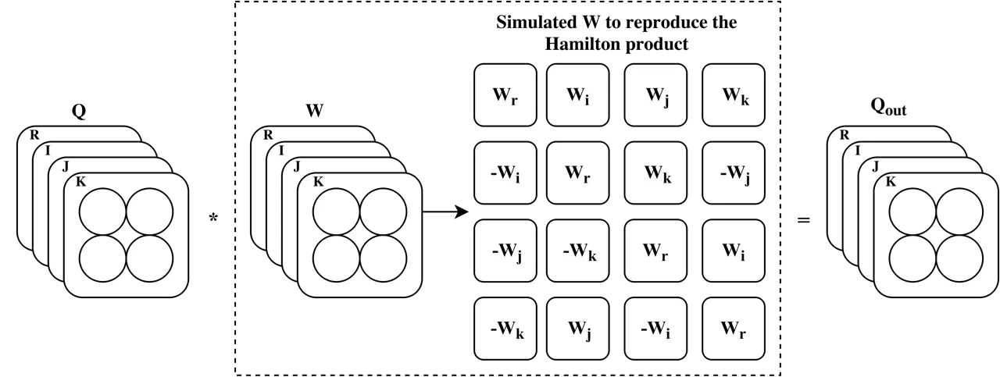

# Quaternion Convolutional Neural Networks for End-to-End Automatic Speech Recognition

^(†) CIFAR Senior Fellow

###### Abstract

Recently, the connectionist temporal classification (CTC) model coupled
with recurrent (RNN) or convolutional neural networks (CNN), made it
easier to train speech recognition systems in an end-to-end fashion.
However in real-valued models, time frame components such as
mel-filter-bank energies and the cepstral coefficients obtained from
them, together with their first and second order derivatives, are
processed as individual elements, while a natural alternative is to
process such components as composed entities. We propose to group such
elements in the form of quaternions and to process these quaternions
using the established quaternion algebra. Quaternion numbers and
quaternion neural networks have shown their efficiency to process
multidimensional inputs as entities, to encode internal dependencies,
and to solve many tasks with less learning parameters than real-valued
models. This paper proposes to integrate multiple feature views in
quaternion-valued convolutional neural network (QCNN), to be used for
sequence-to-sequence mapping with the CTC model. Promising results are
reported using simple QCNNs in phoneme recognition experiments with the
TIMIT corpus. More precisely, QCNNs obtain a lower phoneme error rate
(PER) with less learning parameters than a competing model based on
real-valued CNNs.

Titouan Parcollet^(1,2,4), Ying Zhang ^(2,5), Mohamed Morchid¹, Chiheb
Trabelsi², Georges Linarès¹,  
Renato De Mori^(1,3) and Yoshua Bengio$`{{}^{2,}}^{\dagger}`$

¹Université d’Avignon, LIA, France  
²Université de Montréal, MILA, Canada  
³McGill University, Montréal, Canada  
⁴Orkis, Aix en provence, France  
⁵Element AI, Montréal, Canada

titouan.parcollet@alumni.univ-avignon.fr, ying.zhlisa@gmail.com,
mohamed.morchid@univ-avignon.fr, chiheb.trabelsi@polymtl.ca,
georges.linares@univ-avignon.fr, rdemori@cs.mcgill.ca

Index Terms: quaternion convolutional neural networks, automatic speech
recognition, deep learning

## 1 Introduction

Recurrent (RNN) and convolutional (CNN) neural networks have improved
the performance over hidden Markov models (HMM) combined with gaussian
mixtures models (GMMs) in automatic speech recognition (ASR) systems
\[1, 2, 3, 4, 5\] during the last decade. More recently, end-to-end
approaches received a growing interest due to the promising results
obtained with connectionist temporal classification (CTC) \[6\] combined
with RNNs \[1\] or CNNs \[7\].  
However, despite such evolution of models and paradigms, the acoustic
features remain almost the same. The main motivation is that filters
spaced linearly at low frequencies and logarithmically at high
frequencies make it possible to capture phonetically important acoustic
correlates. Early evidence was provided in \[8\] showing that mel
frequency scaled cepstral coefficients (MFCCs) are effective in
capturing the acoustic information required to recognize syllables in
continuous speech. Motivated by these analysis, a small number of MFCCs
(usually $`13`$) with their first and second time-derivatives, as
proposed in \[9\], have been found suited for statistical and neural ASR
systems. In most systems, a time frame of the speech signal is
represented by a vector with real-valued elements that express sequences
of MFCCs, or filter energies, and their temporal context features. A
concern addressed in this paper, is the fact that the relations between
different views of the features associated with a frequency are not
explicitly represented in the feature vectors used so far. Therefore,
this paper proposes to:

- •
  Introduce a new quaternion representation (Section 2) to encode
  multiple views of a time-frame frequency in which different views are
  encoded as values of imaginary parts of a hyper-complex number. Thus,
  vectors of quaternions are embedded using operations defined by a
  specific quaternion algebra to preserve a distinction between features
  of each frequency representation.
- •
  Merge a quaternion convolutional neural network (QCNN, Section 3) with
  the CTC in a unified and easily reusable framework^(†)^(†) The full
  code is available at https://git.io/vx8so.
- •
  Compare and evaluate the effectiveness of the proposed QCNN to an
  equivalent real-valued model on the TIMIT \[10\] phonemes recognition
  task (Section 4).

There are advantages which could derive from bundling groups of numbers
into a quaternion. Like capsule networks \[11\], quaternion networks
create a tighter association between small groups of numbers rather than
having one homogeneous representation. In addition, this kind of
structure reduces the number of required parameters considerably,
because only one weight is necessary between two quaternion units,
instead of 4$`\times 4=16`$. The hypothesis tested here is whether these
advantages lead to better generalization. The conducted experiments on
the TIMIT dataset yielded a phoneme error rate (PER) of $`19.64`$% for
QCNNs which is significantly lower than the PER obtained with
real-valued CNNs ($`20.57`$%), with the same input features. Moreover,
from a practical point of view, the resulting networks have a
considerably smaller memory footprint due to a smaller set of
parameters.

## 2 Quaternion algebra

The quaternions algebra $`\mathbb{H}`$ defines operations between
quaternion numbers. A quaternion Q is an extension of a complex number
defined in a four dimensional space.
$`Q=r1+x\textbf{i}+y\textbf{j}+z\textbf{k}`$, with, r, x, y, and z four
real numbers, and $`1`$, i, j, and k are the quaternion unit basis. Such
a definition can be used for describing spatial rotations that can also
be represented by the following matrix of real numbers:

```math
\displaystyle Q=\begin{bmatrix}r&x&y&z\\
-x&r&-z&y\\
-y&z&r&-x\\
-z&-y&x&r\end{bmatrix}. \tag{1}
```

In a quaternion, $`r`$ is the real part while
$`x\textbf{i}+y\textbf{j}+z\textbf{k}`$ is the imaginary part ($`I`$) or
the vector part. Basic quaternion definitions are

- $`\bullet`$
  all products of $`\textbf{i},\textbf{j}`$,k are:
  $`\textbf{i}^{2}=\textbf{j}^{2}=\textbf{k}^{2}=\textbf{i}\textbf{j}\textbf{k}=-1`$,
- $`\bullet`$
  conjugate $`Q^{*}`$ of $`Q`$ is:
  $`Q^{*}=r1-x\textbf{i}-y\textbf{j}-z\textbf{k}`$,
- $`\bullet`$
  unit quaternion
  $`Q^{\triangleleft}=\frac{Q}{\sqrt{r^{2}+x^{2}+y^{2}+z^{2}}}`$,
- $`\bullet`$
  the Hamilton product $`\otimes`$ between $`Q_{1}`$ and $`Q_{2}`$ is
  defined as follows:

  ```math
  \displaystyle Q_{1}\otimes Q_{2}= \displaystyle(r_{1}r_{2}-x_{1}x_{2}-y_{1}y_{2}-z_{1}z_{2})+
  ```

  ```math
  \displaystyle(r_{1}x_{2}+x_{1}r_{2}+y_{1}z_{2}-z_{1}y_{2})\textbf{i}+
  ```

  ```math
  \displaystyle(r_{1}y_{2}-x_{1}z_{2}+y_{1}r_{2}+z_{1}x_{2})\textbf{j}+
  ```

  ```math
  \displaystyle(r_{1}z_{2}+x_{1}y_{2}-y_{1}x_{2}+z_{1}r_{2})\textbf{k}.
  ```

The Hamilton product is used in QCNNs to perform transformations of
vectors representing quaternions, as well as scaling and interpolation
between two rotations following a geodesic over a sphere in the
$`\mathbb{R}^{3}`$ space as shown in \[12\].

## 3 Quaternion convolutional neural networks

This section defines the internal quaternion representation (Section
3.1), the quaternion convolution (Section 3.2), a proper parameter
initialization (Section 3.3), and the connectionist temporal
classification (Section 3.4).

### 3.1 Quaternion internal representation

The QCNN is a quaternion extension of well-known real-valued and
complex-valued deep convolutional networks (CNN) \[13, 14\]. The
quaternion algebra is ensured by manipulating matrices of real numbers.
Consequently, a traditional $`2D`$ convolutional layer, with a kernel
that contains $`N`$ feature maps, is split into 4 parts: the first part
equal to $`r`$, the second one to $`x\textbf{i}`$, the third one to
$`y\textbf{j}`$ and the last one to $`z\textbf{k}`$ of a quaternion
$`Q=r1+x\textbf{i}+y\textbf{j}+z\textbf{k}`$. Nonetheless, an important
condition to perform backpropagation in either real, complex or
quaternion neural networks is to have cost and activation functions that
are differentiable with respect to each part of the real, complex or
quaternion number. Many activation functions for quaternion have been
investigated \[15\] and a quaternion backpropagation algorithm have been
proposed in \[16\]. Consequently, the split activation \[17, 18\]
function is applied to every layer and is defined as follows:

```math
\alpha(Q)=\alpha(r)+\alpha(x)\textbf{i}+\alpha(y)\textbf{j}+\alpha(z)\textbf{k}, \tag{2}
```

with $`\alpha`$ corresponding to any standard activation function.

### 3.2 Quaternion-valued convolution

Following a recent proposition for convolution of complex numbers\[14\]
and quaternions \[19\], this paper presents basic neural networks
convolution operations using quaternion algebra. The convolution process
is defined in the real-valued space by convolving a filter matrix with a
vector. In a QCNN, the convolution of a quaternion filter matrix with a
quaternion vector is performed. For this computation, the Hamilton
product is computed using the real-valued matrices representation of
quaternions. Let $`W=R+X\textbf{i}+Y\textbf{j}+Z\textbf{k}`$ be a
quaternion weight filter matrix, and
$`X_{p}=r+x\textbf{i}+y\textbf{j}+z\textbf{k}`$ the quaternion input
vector. The quaternion convolution w.r.t the Hamilton product
$`W\otimes X_{p}`$ is defined as follows:

```math
\displaystyle W\otimes X_{p}= \displaystyle(Rr-Xx-Yy-Zz)+
```

```math
\displaystyle(Rx+Xr+Yz-Zy)\textbf{i}+
```

```math
\displaystyle(Ry-Xz+Yr+Zx)\textbf{j}+
```

```math
\displaystyle(Rz+Xy-Yx+Zr)\textbf{k}, \tag{3}
```

and can thus be expressed in a matrix form:

```math
W\otimes X_{p}=\begin{bmatrix}R&-X&-Y&-Z\\
X&R&-Z&Y\\
Y&Z&R&-X\\
Z&-Y&X&R\end{bmatrix}*\begin{bmatrix}r\\
x\\
y\\
z\end{bmatrix}=\begin{bmatrix}r^{\prime}\\
x^{\prime}\textbf{i}\\
y^{\prime}\textbf{j}\\
z^{\prime}\textbf{k}\end{bmatrix}, \tag{4}
```

An illustration of such operation is depicted in Figure 1.



Figure 1: Illustration of the quaternion convolution

### 3.3 Weight initialization

Weight initialization is crucial to efficiently train neural networks.
An appropriate initialization improves training speed and reduces the
risk of exploding or vanishing gradient. A quaternion initialization is
composed of two steps. First, for each weight to be initialized, a
purely imaginary quaternion $`q_{imag}`$ is generated following an
uniform distribution in the interval $`[0,1]`$. The imaginary unit is
then normalized to obtain $`q_{imag}^{\triangleleft}`$ following the
quaternion normalization equation. The later is used alongside to other
well known initializing criterion such as \[20\] or \[21\] to complete
the initialization process of a given quaternion weight named $`w`$.
Moreover, the generated weight has a polar form defined by :

```math
\displaystyle\centering w=|w|e^{\textbf{n}\theta}=|w|(cos(\theta)+\textbf{n}sin(\theta)),\@add@centering \tag{5}
```

with

```math
\displaystyle\textbf{n}=\dfrac{x\textbf{i}+y\textbf{j}+z\textbf{k}}{|w|sin(\theta)}. \tag{6}
```

Therefore, $`w`$ is generated as follows:

- •
  $`w_{\textbf{r}}=\phi*q^{\triangleleft}_{imag\textbf{r}}*cos(\theta)`$,
- •
  $`w_{\textbf{i}}=\phi*q^{\triangleleft}_{imag\textbf{i}}*sin(\theta)`$,
- •
  $`w_{\textbf{j}}=\phi*q^{\triangleleft}_{imag\textbf{j}}*sin(\theta)`$,
- •
  $`w_{\textbf{k}}=\phi*q^{\triangleleft}_{imag\textbf{k}}*sin(\theta)`$.

However, $`\phi`$ represents a randomly generated variable with respect
to the variance of the quaternion weight and the selected initialization
criterion. The initialization process follows \[20\] and \[21\] to
derive the variance of the quaternion-valued weight parameters.
Therefore, the variance of W has to be investigated:

```math
\displaystyle Var(\textbf{W})=\mathbb{E}(|\textbf{W}|^{2})-[\mathbb{E}(|\textbf{W}|)]^{2}. \tag{7}
```

$`[\mathbb{E}(|\textbf{W}|)]^{2}`$ is equals to $`0`$ since the weight
distribution is symmetric around $`0`$. Nonetheless, the value of
$`Var(\textbf{W})=\mathbb{E}(|\textbf{W}|^{2})`$ is not trivial in the
case of quaternion-valued matrices. Indeed, $`W`$ follows a
Chi-distributed with four degrees of freedom (DOFs) and
$`Var(\textbf{W})=\mathbb{E}(|\textbf{W}|^{2})`$ is expressed and
computed as follows:

```math
\displaystyle Var(\textbf{W})=\mathbb{E}(|\textbf{W}|^{2})=\int_{0}^{\infty}x^{2}f(x)\,\mathrm{d}x=4\sigma^{2}. \tag{8}
```

Therefore, in order to respect the He Criterion \[21\], the variance
would be equal to:

```math
\displaystyle\sigma=\frac{1}{\sqrt{2(n_{in})}}. \tag{9}
```

### 3.4 Connectionist Temporal Classification

In the acoustic modeling part of ASR systems, the task of
sequence-to-sequence mapping from an input acoustic signal
$`X=[x_{1},...,x_{n}]`$ to a sequence of symbols $`T=[t_{1},...,t_{m}]`$
is complex due to:

- •
  $`X`$ and $`T`$ could be in arbitrary length.
- •
  The alignment between $`X`$ and $`T`$ is unknown in most cases.

Specially, $`T`$ is usually shorter than $`X`$ in terms of phoneme
symbols.

To alleviate these problems, connectionist temporal classification (CTC)
has been proposed \[6\]. First, a softmax is applied at each timestep,
or frame, providing a probability of emitting each symbol $`X`$ at that
timestep. This probability results in a symbol sequences representation
$`P(O|X)`$, with $`O=[o_{1},...,o_{n}]`$ in the latent space $`O`$. A
blank symbol $`{}^{\prime}-^{\prime}`$ is introduced as an extra label
to allow the classifier to deal with the unknown alignment. Then, $`O`$
is transformed to the final output sequence with a many-to-one function
$`g(O)`$ defined as follows:

```math
\displaystyle\left.\begin{array}[]{ll}g(z_{1},z_{2},-,z_{3},-)\\
g(z_{1},z_{2},z_{3},z_{3},-)\\
g(z_{1},-,z_{2},z_{3},z_{3})\\
\end{array}\right\}=(z_{1},z_{2},z_{3}).
```

Consequently, the output sequence is a summation over the probability of
all possible alignments between $`X`$ and $`T`$ after applying the
function $`g(O)`$. Accordingly to \[6\] the parameters of the models are
learned based on the cross entropy loss function:

```math
\displaystyle\sum\nolimits_{X,T\in train}-\log(P(O|X)). \tag{13}
```

During the inference, a best path decoding algorithm is performed.
Therefore, the latent sequence with the highest probability is obtained
by performing argmax of the softmax output at each timestep. The final
sequence is obtained by applying the function $`g(.)`$ to the latent
sequence.

## 4 Experiments

The performance and efficiency of the proposed QCNNs is evaluated on a
phoneme recognition task. This section provides details on the dataset
and the quaternion features representation (Section 4.1), the models
configurations (Section 4.2), and finally a discussion of the observed
results (Section 4.3).

### 4.1 TIMIT dataset and acoustic features of quaternions

The TIMIT \[10\] dataset is composed of a standard 462-speaker training
dataset, a 50-speakers development dataset and a core test dataset of
$`192`$ sentences. During the experiments, the SA records of the
training set are removed and the development set is used for early
stopping. The raw audio is transformed into $`40`$-dimensional log
mel-filter-bank coefficients with deltas, delta-deltas, and energy
terms, resulting in a one dimensional vector of length $`123`$. An
acoustic quaternion $`Q(f,t)`$ associated with a frequency $`f`$ and a
time frame $`t`$ is defined as follows:

```math
\displaystyle Q(f,t)=0+e(f,t)\textbf{i}+\frac{\partial e(f,t)}{\partial t}\textbf{j}+\frac{\partial^{2}e(f,t)}{\partial^{2}t}\textbf{k}. \tag{14}
```

It represents multiple views of a frequency $`f`$ at time frame $`t`$,
consisting of the energy $`e(f,t)`$ in the filter band corresponding to
$`f`$, its first time derivative describing a slope view, and its second
time derivative describing a concavity view. Finally, a unique
quaternion is composed with the three corresponding energy terms. Thus,
the quaternion input vector length is $`41`$ ($`\frac{123}{3}`$).

### 4.2 Models architectures

The architectures of both CNN and QCNN models are inspired by \[7\]. A
first $`2`$D convolutional layer is followed by a maxpooling layer along
the frequency axis. Then, $`n`$ $`2`$D convolutional layers are
included, together with $`3`$ dense layers of sizes $`1024`$ and $`256`$
respectively for real- and quaternion-valued models (with
$`n\in[6,10]`$). Indeed, the output of a dense quaternion-valued layer
has $`256\times 4=1024`$ nodes and is $`4`$ times larger than the number
of units. The filter size is rectangular $`(3,5)`$, and a padding is
applied to keep the sequence and signal sizes unaltered. The number of
feature maps varies from $`32`$ to $`256`$ for the real-valued models
and from $`8`$ to $`64`$ for quaternion-valued models. Indeed, the
number of output feature maps is $`4`$ times larger in the QCNN due to
the quaternion convolution, meaning $`32`$ quaternion-valued feature
maps correspond to $`128`$ real-valued ones. The PReLU activation
function is employed for both models \[21\]. A dropout of $`0.3`$ and a
$`L_{2}`$ regularization of $`1e^{-5}`$ are used across all the layers,
except the input and output ones. CNNs and QCNNs are trained with the
Adam learning rate optimizer and vanilla hyperparameters \[22\] during
$`100`$ epochs. Then, a fine-tuning process of $`50`$ epochs is
performed with a standard $`sgd`$ and a learning rate of $`1e^{-5}`$.
Finally, the standard CTC loss function defined in \[6\] and implemented
in \[23\] is applied. Experiments are performed on Tesla P100 and
Geforce Titan X GPUs.

### 4.3 Results and discussion

Results on the phoneme recognition task of the TIMIT dataset are
reported in Table 1. It is worth noticing the important difference in
terms of the number of learning parameters between real and quaternion
valued CNNs. It is easily explained by the quaternion algebra. In the
case of a dense layer with $`1,024`$ input values and $`1,024`$ hidden
units, a real-valued model will have $`1,024^{2}\approx 1`$M parameters,
while to maintain equal input and output nodes ($`1,024`$) the
quaternion equivalent has $`256`$ quaternions inputs and $`256`$
quaternion-valued hidden units. Therefore the number of parameters for
the quaternion model is $`256^{2}\times 4\approx 0.26`$M. Such a
complexity reduction turns out to produce better results and may have
other advantages such as a smallest memory footprint while saving NN
models. Moreover, the reduction of the number of parameters does not
result in poor performance in the QCNN. Indeed, the best PER reported is
$`19.64`$% from a QCNN with $`256`$ feature maps and $`10`$ layers,
compared to a PER of $`20.57`$% for a real-valued CNN with $`64`$
feature maps and $`10`$ layers. It is worth underlying that both model
accuracies are increasing with the size and the depth of the neural
network. However, bigger real-valued feature maps leads to overfitting.
In fact, as shown in Table 1, the best PER for a real-valued model is
reached with $`64`$ ($`20.57`$) feature maps and decreasing at $`128`$
($`20.62`$%) and $`256`$ ($`21.23`$). The QCNN does not suffer from such
weaknesses due to the smaller density of the neural network and achieved
a constant PER improvement alongside with the increasing number of
feature maps. Furthermore, QCNNs always performed better than CNNs
independently of the model topologies.

| Models                        | Dev PER % | Test PER % | Params |
| ----------------------------- | --------- | ---------- | ------ |
| $`\mathbb{R}`$-CNN-6L-32FM    | 22.18     | 23.54      | 3.3M   |
| $`\mathbb{H}`$-QCNN-6L-32FM   | 22.16     | 23.20      | 0.87M  |
| $`\mathbb{R}`$-CNN-10L-32FM   | 21.77     | 23.43      | 3.4M   |
| $`\mathbb{H}`$-QCNN-10L-32FM  | 22.25     | 23.23      | 0.9M   |
| $`\mathbb{R}`$-CNN-6L-64FM    | 21.19     | 22.12      | 4.8M   |
| $`\mathbb{H}`$-QCNN-6L-64FM   | 21.44     | 21.99      | 1.2M   |
| $`\mathbb{R}`$-CNN-10L-64FM   | 19.53     | 20,57      | 5.4M   |
| $`\mathbb{H}`$-QCNN-10L-64FM  | 19.78     | 20.44      | 1.4M   |
| $`\mathbb{R}`$-CNN-6L-128FM   | 20.33     | 22.14      | 9M     |
| $`\mathbb{H}`$-QCNN-6L-128FM  | 20.12     | 21.33      | 2.3M   |
| $`\mathbb{R}`$-CNN-10L-128FM  | 19.37     | 20.62      | 11.5M  |
| $`\mathbb{H}`$-QCNN-10L-128FM | 19.02     | 19.87      | 2.9M   |
| $`\mathbb{R}`$-CNN-6L-256FM   | 20.43     | 22.25      | 22.3M  |
| $`\mathbb{H}`$-QCNN-6L-256FM  | 19.94     | 20.54      | 5.6M   |
| $`\mathbb{R}`$-CNN-10L-256FM  | 18.89     | 21.23      | 32.1M  |
| $`\mathbb{H}`$-QCNN-10L-256FM | 18.33     | 19.64      | 8.1M   |

Table 1: Experiment results expressed in term of phoneme error rate
(PER) percentage of both QCNN and CNN based models on the TIMIT phoneme
recognition task. The results are from a $`3`$ folds average. ’L’ stands
for number of Layers, ’FM’ for number of feature maps, and ’Params’ for
number of learning parameters. The latter is expressed in order to be
equivalent for both models. Therefore, $`32`$FM is equal to $`32`$FM for
real numbers and $`8`$ quaternion-valued FM

With much fewer learning parameters for a given architecture, the QCNN
performs always better than the real-valued one on the reported task. In
terms of PER, an average relative gain of $`3.25`$% (w.r.t CNNs result)
is obtained on the testing set. It is also worth recalling that the best
PER of $`19.64`$% is obtained with just a QCNN without HMMs, RNNs,
attention mechanisms, batch normalization, phoneme language model,
acoustic data normalization or adaptation. Further improvements can be
obtained with exactly the same QCNN by just introducing a new acoustic
feature in the real part of the quaternions.

## 5 Related work

Early attempts to perform phoneme and phonetic feature recognition with
multilayer perceptrons (MLP) were proposed in \[24, 25, 26\]. A PER of
$`26.1`$% is reported in \[25\] using RNNs. More recently, in \[27\] a
Mean-Covariance Restricted Boltzmann Machine (RBM) is used for
recognizing phonemes in the TIMIT corpus using RBM for feature
extraction. Along this line of research, in \[6\] an approach called the
Connectionist Temporal Classification (CTC) has been developed and can
be used without an explicit input-output alignment. Bidirectional RNNs
(BRNNs) are used in \[28\] for processing input data in both directions
with two separate hidden layers, which are then composed in an output
layer. With standard mel frequency energies, first and second time
derivatives a PER of $`17.7`$% was obtained. Other recent results with
real-valued vectors of similar features are reported in \[29, 4, 30,
31\]. Other types of quaternion valued neural networks (QNNs) were
introduced for encoding RGB color relations in image pixels \[32, 33,
34\], and for classifying human/human conversation topics \[35, 36,
18\]. A quaternion deep convolutional and residual neural network
proposed in \[19\] have shown impressive results on the CIFAR images
classification task. However, a specific quaternion is used for each RGB
color value as in \[14\] rather than integrating pixel multiple views as
in \[37\], and suggested in this paper for an ASR task.

## 6 Conclusions

Summary. This paper proposes to integrate multiple acoustic feature
views with quaternion hyper complex numbers, and to process these
features with a convolutional neural network of quaternions. The phoneme
recognition experiments have shown that: 1) Given an equivalent
architecture, QCNNs always outperform CNNs with significantly less
parameters; 2) QCNNs obtain better results than CNNs with a similar
number of learning parameters; 3) The best result obtained with QCNNs is
better than the one observed with the real-valued counterpart. This
demonstrates the initial intuition that the capability of the Hamilton
product to learn internal latent relations helps quaternions-valued
neural networks to achieve better results .  
Limitations and Future Work. So far, traditional acoustic features, such
as mel filter bank energies, first and second derivatives have shown
that significantly good results can be obtained with a relative small
set of input features for a speech time frame. Nevertheless, speech
science has shown that other multi-view context-dependent acoustic
relations characterize signals of phonemes in context. Future work will
attempt to characterize those multi-view features that mostly contribute
to reduce ambiguities in representing phoneme events. Furthermore,
quaternions-valued RNNs will also be investigated to see if they can
contribute to the improvement of recently achieved top of the line
results with real number RNNs.

## 7 Acknowledgements

The experiments were conducted using Keras \[23\]. The authors would
like to acknowledge the computing support of Compute Canada and the
founding support of Orkis, NSERC, Samsung, IBM and CHIST-ERA/FRQ. The
authors would like to thank Kyle Kastner and Mirco Ravanelli for their
helpful comments.

## References

- \[1\] H. Sak, A. Senior, and F. Beaufays, “Long short-term memory
  recurrent neural network architectures for large scale acoustic
  modeling,” in _Fifteenth annual conference of the international speech
  communication association_, 2014.
- \[2\] G. Hinton, L. Deng, D. Yu, G. E. Dahl, A.-r. Mohamed, N. Jaitly,
  A. Senior, V. Vanhoucke, P. Nguyen, T. N. Sainath _et al._, “Deep
  neural networks for acoustic modeling in speech recognition: The
  shared views of four research groups,” _Signal Processing Magazine,
  IEEE_, vol. 29, no. 6, pp. 82–97, 2012.
- \[3\] O. Abdel-Hamid, A.-r. Mohamed, H. Jiang, and G. Penn, “Applying
  convolutional neural networks concepts to hybrid nn-hmm model for
  speech recognition,” in _Acoustics, Speech and Signal Processing
  (ICASSP), 2012 IEEE International Conference on_. IEEE, 2012, pp.
  4277–4280.
- \[4\] M. Ravanelli, P. Brakel, M. Omologo, and Y. Bengio, “Improving
  speech recognition by revising gated recurrent units,” _Proc.
  Interspeech 2017_, 2017.
- \[5\] K. Greff, R. K. Srivastava, J. Koutník, B. R. Steunebrink, and
  J. Schmidhuber, “Lstm: A search space odyssey,” _IEEE transactions on
  neural networks and learning systems_, vol. 28, no. 10, pp.
  2222–2232, 2017.
- \[6\] A. Graves, S. Fernández, F. Gomez, and J. Schmidhuber,
  “Connectionist temporal classification: labelling unsegmented sequence
  data with recurrent neural networks,” in _Proceedings of the 23rd
  international conference on Machine learning_. ACM, 2006, pp. 369–376.
- \[7\] Y. Zhang, M. Pezeshki, P. Brakel, S. Zhang, C. L. Y. Bengio, and
  A. Courville, “Towards end-to-end speech recognition with deep
  convolutional neural networks,” _arXiv preprint
  arXiv:1701.02720_, 2017.
- \[8\] S. B. Davis and P. Mermelstein, “Comparison of parametric
  representations for monosyllabic word recognition in continuously
  spoken sentences,” in _Readings in speech recognition_. Elsevier,
  1990, pp. 65–74.
- \[9\] S. Furui, “Speaker-independent isolated word recognition based
  on emphasized spectral dynamics,” in _Acoustics, Speech, and Signal
  Processing, IEEE International Conference on ICASSP’86._,
  vol. 11. IEEE, 1986, pp. 1991–1994.
- \[10\] J. S. Garofolo, L. F. Lamel, W. M. Fisher, J. G. Fiscus, and
  D. S. Pallett, “Darpa timit acoustic-phonetic continous speech corpus
  cd-rom. nist speech disc 1-1.1,” _NASA STI/Recon technical report n_,
  vol. 93, 1993.
- \[11\] S. Sabour, N. Frosst, and G. E. Hinton, “Dynamic routing
  between capsules,” _arXiv preprint arXiv:1710.09829v2_, 2017.
- \[12\] T. Minemoto, T. Isokawa, H. Nishimura, and N. Matsui, “Feed
  forward neural network with random quaternionic neurons,” _Signal
  Processing_, vol. 136, pp. 59–68, 2017.
- \[13\] K. He, X. Zhang, S. Ren, and J. Sun, “Deep residual learning
  for image recognition,” in _Proceedings of the IEEE conference on
  computer vision and pattern recognition_, 2016, pp. 770–778.
- \[14\] C. Trabelsi, O. Bilaniuk, D. Serdyuk, S. Subramanian, J. F.
  Santos, S. Mehri, N. Rostamzadeh, Y. Bengio, and C. J. Pal, “Deep
  complex networks,” _arXiv preprint arXiv:1705.09792_, 2017.
- \[15\] D. Xu, L. Zhang, and H. Zhang, “Learning algorithms in
  quaternion neural networks using ghr calculus,” _Neural Network
  World_, vol. 27, no. 3, p. 271, 2017.
- \[16\] T. Nitta, “A quaternary version of the back-propagation
  algorithm,” in _Neural Networks, 1995. Proceedings., IEEE
  International Conference on_, vol. 5. IEEE, 1995, pp. 2753–2756.
- \[17\] P. Arena, L. Fortuna, L. Occhipinti, and M. G. Xibilia, “Neural
  networks for quaternion-valued function approximation,” in _Circuits
  and Systems, 1994. ISCAS’94., 1994 IEEE International Symposium on_,
  vol. 6. IEEE, 1994, pp. 307–310.
- \[18\] T. Parcollet, M. Morchid, P.-M. Bousquet, R. Dufour,
  G. Linarès, and R. De Mori, “Quaternion neural networks for spoken
  language understanding,” in _Spoken Language Technology Workshop
  (SLT), 2016 IEEE_. IEEE, 2016, pp. 362–368.
- \[19\] A. M. Chase Gaudet, “Deep quaternion networks,” _arXiv preprint
  arXiv:1712.04604v2_, 2017.
- \[20\] X. Glorot and Y. Bengio, “Understanding the difficulty of
  training deep feedforward neural networks,” in _International
  conference on artificial intelligence and statistics_, 2010, pp.
  249–256.
- \[21\] K. He, X. Zhang, S. Ren, and J. Sun, “Delving deep into
  rectifiers: Surpassing human-level performance on imagenet
  classification,” in _Proceedings of the IEEE international conference
  on computer vision_, 2015, pp. 1026–1034.
- \[22\] D. Kingma and J. Ba, “Adam: A method for stochastic
  optimization,” _arXiv preprint arXiv:1412.6980_, 2014.
- \[23\] F. Chollet _et al._, “Keras,”
  https://github.com/keras-team/keras, 2015.
- \[24\] H. Bourlard and S. Dupont, “A mew asr approach based on
  independent processing and recombination of partial frequency bands,”
  in _Spoken Language, 1996. ICSLP 96. Proceedings., Fourth
  International Conference on_, vol. 1. IEEE, 1996, pp. 426–429.
- \[25\] A. J. Robinson, “An application of recurrent nets to phone
  probability estimation,” _IEEE transactions on Neural Networks_,
  vol. 5, no. 2, pp. 298–305, 1994.
- \[26\] Y. Bengio, R. De Mori, G. Flammia, and R. Kompe, “Global
  optimization of a neural network-hidden markov model hybrid,” _IEEE
  transactions on Neural Networks_, vol. 3, no. 2, pp. 252–259, 1992.
- \[27\] G. Dahl, A.-r. Mohamed, G. E. Hinton _et al._, “Phone
  recognition with the mean-covariance restricted boltzmann machine,” in
  _Advances in neural information processing systems_, 2010, pp.
  469–477.
- \[28\] A. Graves, A.-r. Mohamed, and G. Hinton, “Speech recognition
  with deep recurrent neural networks,” in _Acoustics, speech and signal
  processing (icassp), 2013 ieee international conference on_. IEEE,
  2013, pp. 6645–6649.
- \[29\] J. Chorowski, D. Bahdanau, K. Cho, and Y. Bengio, “End-to-end
  continuous speech recognition using attention-based recurrent nn:
  First results,” _arXiv preprint arXiv:1412.1602_, 2014.
- \[30\] L. Lu, L. Kong, C. Dyer, N. A. Smith, and S. Renals, “Segmental
  recurrent neural networks for end-to-end speech recognition,” _arXiv
  preprint arXiv:1603.00223_, 2016.
- \[31\] L. Lu, L. Kong, C. Dyer, and N. A. Smith, “Multi-task learning
  with ctc and segmental crf for speech recognition,” _arXiv preprint
  arXiv:1702.06378_, 2017.
- \[32\] Y.-Z. Hsiao and S.-C. Pei, “Edge detection, color quantization,
  segmentation, texture removal, and noise reduction of color image
  using quaternion iterative filtering,” _Journal of Electronic
  Imaging_, vol. 23, no. 4, p. 043001, 2014.
- \[33\] B. Chen, H. Shu, G. Coatrieux, G. Chen, X. Sun, and J. L.
  Coatrieux, “Color image analysis by quaternion-type moments,” _Journal
  of mathematical imaging and vision_, vol. 51, no. 1, pp.
  124–144, 2015.
- \[34\] M. A. Garg and M. S. Goyal, “Vector sparse representation of
  color image using quaternion matrix analysis based on genetic
  algorithm,” _Imperial Journal of Interdisciplinary Research_, vol. 3,
  no. 7, 2017.
- \[35\] T. Parcollet, M. Morchid, and G. Linares, “Deep quaternion
  neural networks for spoken language understanding,” in _Automatic
  Speech Recognition and Understanding Workshop (ASRU), 2017
  IEEE_. IEEE, 2017, pp. 504–511.
- \[36\] P. Titouan, M. Morchid, and G. Linares, “Quaternion denoising
  encoder-decoder for theme identification of telephone conversations,”
  _Proc. Interspeech 2017_, pp. 3325–3328, 2017.
- \[37\] H. Kusamichi, T. Isokawa, N. Matsui, Y. Ogawa, and K. Maeda, “A
  new scheme for color night vision by quaternion neural network,” in
  _Proceedings of the 2nd International Conference on Autonomous Robots
  and Agents_, vol. 1315, 2004.
