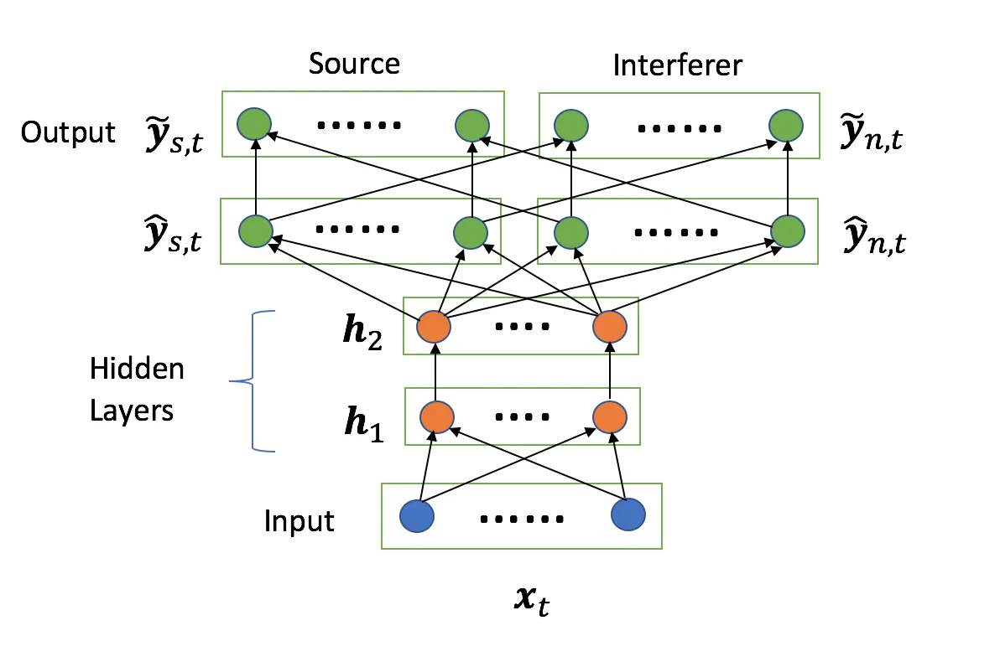
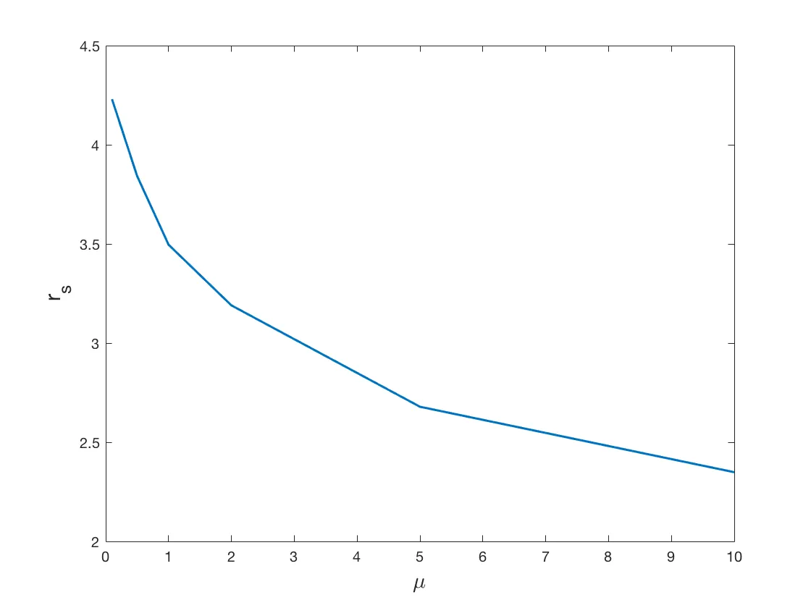
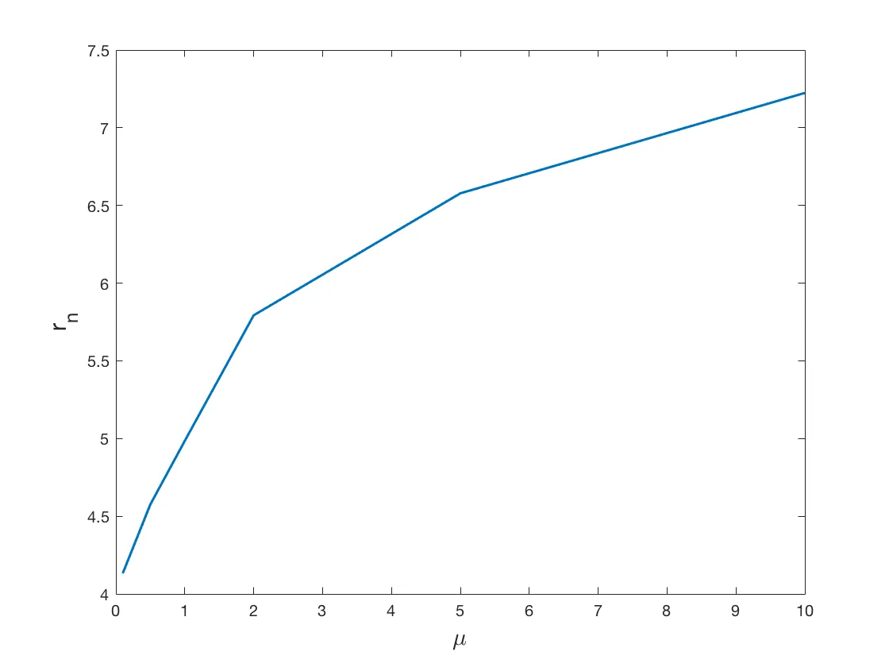

# Towards Automated Single Channel Source Separation using Neural Networks

###### Abstract

Many applications of single channel source separation (SCSS) including
automatic speech recognition (ASR), hearing aids etc. require an
estimation of only one source from a mixture of many sources. Treating
this special case as a regular SCSS problem where in all constituent
sources are given equal priority in terms of reconstruction may result
in a suboptimal separation performance. In this paper, we tackle the one
source separation problem by suitably modifying the orthodox SCSS
framework and focus only on one source at a time. The proposed approach
is a generic framework that can be applied to any existing SCSS
algorithm, improves performance, and scales well when there are more
than two sources in the mixture unlike most existing SCSS methods.
Additionally, existing SCSS algorithms rely on fine hyper-parameter
tuning hence making them difficult to use in practice. Our framework
takes a step towards automatic tuning of the hyper-parameters thereby
making our method better suited for the mixture to be separated and thus
practically more useful. We test our framework on a neural network based
algorithm and the results show an improved performance in terms of SDR
and SAR.

Arpita Gang¹, Pravesh Biyani ¹, Akshay Soni ²

¹IIIT Delhi, India  
²Oath Research, USA

{arpita1478, praveshb}@iiitd.ac.in, akshaysoni@oath.com

Index Terms: Single Channel Source separation, Hyper-parameter, Neural
Network, Speech Recognition

## 1 Introduction

Single Channel Source Separation (SCSS) is an extraction of two or more
underlying source components from a single observation of their mixture.
The SCSS problem arises in many scenarios including speech-denoising in
telephony (e.g in call centers), for automatic speech recognition (ASR),
sound separation as a preprocessing for hearing aids specially in
non-stationary environments, and even sound event detection like
fire-alarm, scream detection in security related applications.

Recent research works \[1, 2, 3, 4, 5\] on supervised SCSS problem have
improved the more traditional techniques of unsupervised blind source
separation (BSS) by incorporating the source training data to generate
models, both linear and non-linear, resulting in effective separation of
sources. In particular, models based on Deep Neural Networks (DNN) have
had a tremendous success in the source separation tasks and pushed the
performance to a place where now source separation may act as a
practically useful pre-processing task.

Most of the above mentioned applications require separation of one
dominant source from the mixture containing audio signal from multiple
sources. For instance, in the hearing aid scenario, generally one speech
signal needs to be separated from the mixture containing one or more
‘noise’ sources. Similar observation holds when source separation is
applied as a preprocessing task in ASR.

While many SCSS setups require one main source to be separated, most
existing model based source separation methods aim at simultaneous
extraction of all the sources. Here each individual source model is
required to not only mitigate interference by other sources but also
provide reasonable reconstruction performance. Effectively, a single
optimization formulation when burdened with providing equal priority to
all sources, results in a suboptimal performance for every source. This
issue becomes more grave as the number of sources increase.

### 1.1 Contributions

Motivated by relevant applications and issues with joint separation
paradigm, we introduced a ‘one source at a time’ separation framework in
\[6\] for two sources when non-negative matrix factorization (NMF) based
models for each source is used. The first contribution of this paper is
the extension of this strategy to any number of sources when the sources
are modeled using DNN. We combine all the sources other than the
concerned one into a single source, which we term as ’interferer’. This
converts the multi-source separation problem into a two-source
separation problem where we concentrate on effective separation of only
one source at the cost of other interfering sources. One key step is the
inclusion of a term in the objective function that increases the
distance between the source estimate and interferer signal in its
orthogonal component thereby effectively increasing the source energy to
artifact energy ratio (SAR) while maintaining the a good source to
interference ratio (SIR). Finally, our approach, which we call
Discriminative Framework for DNN (DF-DNN), is generic enough and can be
applied to many source separation setups.

Breaking a multiple source separation problem into two source separation
problem for each source also assists in hyperparameter tuning,
especially when DNNs are used. Generally, hyper parameters are tuned by
employing a hit and trial on many parameter values using the development
data set, at times even using manual intervention. In this paper, we
attempt to make the parameter tuning systematic by defining few
meta-parameters that act as a proxy for the key separation performance
indices. By observing these parameters during the training, we can
arrive at the appropriate parameter values and achieve training models
that have a higher likelihood of providing good separation performance.
Note that our meta-parameters–like our framework–is generic in nature
and can be utilised over many discriminative source separation
frameworks.

### 1.2 Related Work

Most recent works in SCSS have employed methods that learn
discriminative models that utilize the training data to represent
individual sources such that a source model represents itself well while
simultaneously acts as a poor fit for other sources. \[5, 7\]. The work
in \[8\] proposed an regularized formulation that jointly trains the NMF
dictionaries penalizing the coherence between trained models. Methods
proposed in \[9\] and \[10\] aim at directly optimizing the SNR while
training NMF dictionaries and recurrent neural networks respectively.
The work proposed in \[5\] trains a deep recurrent neural network that
optimizes the estimated masks of the sources, while \[7\]
discriminatively enhances the separated sources. To the best of our
knowledge researchers have not focused on automated hyper-parameter
tuning in their works.

## 2 Problem Description

Single channel source separation requires the estimation of $`L`$
sources from a single observation of their mixture

```math
x(t)=\sum_{i=1}^{L}y_{i}(t), \tag{1}
```

where $`y_{i}(t),~i=1\dots L`$ is the $`i^{th}`$ source to be estimated
and $`x(t)`$ is the observed mixture. Assuming that sources belong to
subspaces in the ambient vector space, the difficulty of separation
increases when the sources share basis of subspaces they belong to. On
the other hand, when the sources are represented by orthogonal
subspaces, increasing $`L`$ does not have any impact, while if the
subspaces have large overlap, the separation performance decreases with
an increase in number of sources. This is a limitation of traditional
source separation methods like \[5, 7, 8, 10\] that focus on
simultaneous reconstruction of all the $`L`$ sources.

On the other hand, the proposed _one source at a time_ approach
decomposes the $`L`$-source separation problem into $`L`$ different
source separation problems each focusing on the estimation of just one
source and treating all the other sources as interference. Concretely,
for the estimation of first source, i.e., $`y_{1}(t)`$ we consider all
the other sources, $`y_{i}(t),~i=2\dots L`$, as interference.
Effectively, we have $`L`$ source separation problems, one for each
source. This leads to high quality estimation of each source as
empirically demonstrated later. Without loss of generality, we will look
at the problem of estimating the first source from the mixture. To that
end, we unfold (1) as

```math
x(t)=\underbrace{y_{1}(t)}_{\text{source}}+\underbrace{(y_{2}(t)+...+y_{L}(t))}_{\text{interferers}}, \tag{2}
```

where above we emphasize that all the sources other than $`y_{1}(t)`$
combined together act as interferer effectively reducing the multiple
source separation problem into a two source problem. The aim of source
separation is to estimate the underlying sources in a way that each
source is reconstructed with little deformity and has minimal traces of
other sources. The errors in an estimated source is defined are \[11\].
Let $`\mathbb{P}[y_{1},y_{2},\dots,y_{k}]`$ be the orthogonal projector
onto the space spanned by the vectors $`y_{1},y_{2},\dots,y_{k}`$, then
the interference and artifacts introduced in the estimate of
$`j^{\rm{th}}`$ source, denoted by $`\hat{y}_{j}`$, are given by

```math
\displaystyle E_{I}(j) \displaystyle= \displaystyle[\mathbb{P}_{I}-\mathbb{P}_{S}(j)]\hat{y}_{j} \tag{3}
```

```math
\displaystyle E_{A}(j) \displaystyle= \displaystyle\hat{y}_{j}-\mathbb{P}_{I}\hat{y}_{j} \tag{4}
```

where

```math
\mathbb{P}_{I}=\mathbb{P}[(y_{j^{\prime}})_{1\leq j^{\prime}\leq L}]
```

and

```math
\mathbb{P}_{S}(j)=\mathbb{P}[y_{j}].
```

The SIR and SAR of estimated source $`\hat{y}_{j}`$ are defined by

```math
\displaystyle\text{SIR}=10\log_{10}\frac{\|\mathbb{P}_{S}(j)\hat{y}_{j}\|^{2}}{\|E_{I}(j)\|^{2}} \tag{5}
```

```math
\displaystyle\text{SAR}=10\log_{10}\frac{\|\mathbb{P}_{I}\hat{y}_{j}\|^{2}}{\|E_{A}(j)\|^{2}} \tag{6}
```

It is evident from (3) that the interference $`E_{I}`$ is the component
of the source estimate that lies in the space orthogonal to
$`\mathbb{P}_{S}`$. The lesser the energy in $`E_{I}`$, better is the
SIR. On the other hand we are not concerned to remove the part of
interferer that lies in the subspace $`\mathbb{P}_{S}(j)`$ of the source
while separating it. Therefore our strategy gives us the freedom to
focus on the reconstruction of the source at the cost of interferer by
subsuming overlapping subspace of interferer and source to
$`\mathbb{P}_{S}(j)`$. This means that the source can use the
overlapping part of the interferer for its reconstruction that can
increase the SAR (6) of the estimated source.

The above insight is incorporated in our objective function (in Section 3) by adding a corresponding fit term for the component of interferer
orthogonal to source. The generality of our approach makes it applicable
to all kinds of supervised discriminative methods. In this paper, we
apply our framework on a neural network based model described in \[5\].



Figure 1: Separation using DF-DNN

## 3 Our Approach

We now discuss how to effectively solve a two-source separation problem
using the proposed DF-DNN technique.

### 3.1 Joint Masking \[5\]

The features used to train the networks in this work are the magnitude
of the Short Time Fourier Transform (STFT). Each signal is divided into
$`T`$ frames and a $`N`$ point FFT is taken for each frame resulting in
a $`N\times T`$ STFT matrix representing the signal. If the input to the
network is the magnitude spectra of the mixture represented by
$`\bm{x}_{t}`$ for time frame $`t`$ and the output predictions for a two
source case are denoted by $`\hat{\bm{y}}_{1,t}`$ and
$`\hat{\bm{y}}_{2,t}`$, then the masks are denoted by

```math
\hat{\bm{m}}_{i,t}=\frac{|\hat{\bm{y}}_{i,t}|}{|\hat{\bm{y}}_{1,t}|+|\hat{\bm{y}}_{2,t}|}. \tag{7}
```

Here, the multiplications and divisions are done element-wise. The
method used in \[5\] optimizes the masks along with the deep neural
network parameters; see Fig. 1. For this purpose, another layer is added
at the output which corresponds to the masked predictions given by

```math
\tilde{\bm{y}}_{i,t}=\frac{|\hat{\bm{y}}_{i,t}|}{|\hat{\bm{y}}_{1,t}|+|\hat{\bm{y}}_{2,t}|}\odot\bm{x}_{t}. \tag{8}
```

This output layer is only dependent on the outputs of the previous layer
$`\hat{\bm{y}}_{i,t}`$ and no weights are required to optimize for it.
Given the output predictions $`\tilde{\bm{y}}_{1}`$ and
$`\tilde{\bm{y}}_{2}`$, the network is trained to minimize the error
between the predicted sources from the original sources. Also, for an
effective separation, each predicted source should have maximum distance
from the other source, that is, the network should be discriminative. To
ensure the above conditions, the network is trained to optimize the
following objective function

```math
J=\frac{1}{2}(\|\bm{y}_{1}-\tilde{\bm{y}}_{1}\|_{F}^{2}+\|\bm{y}_{2}-\tilde{\bm{y}}_{2}\|_{F}^{2}-\gamma\|\bm{y}_{1}-\tilde{\bm{y}}_{2}\|_{F}^{2}-\gamma\|\bm{y}_{2}-\tilde{\bm{y}}_{1}\|_{F}^{2}), \tag{9}
```

where $`\gamma`$ controls the amount of discrimination the network can
provide between the two sources. The predicted magnitude spectra
$`\tilde{\bm{y}}_{1},\tilde{\bm{y}}_{2}`$ and the phase of the mixture
spectrum are used to create the STFT features of the separated sources.
An inverse STFT operation results gives the corresponding time domain
signals estimates $`\hat{y}_{i},~i=1,2`$.

### 3.2 Our Framework (DF-DNN)

We denote the source signal by $`\bm{y}_{s}`$ and the (combined)
interferer by $`\bm{y}_{n}`$. We are not concerned about the
interference that can be introduced in estimated interferer from the
source. Another hyper parameter $`\mu`$ is used here that controls the
relative reconstruction of the source and the interferer. Further, since
we are only concerned with the orthogonal component of the interferer
not affecting the source, the modified formulation used in our framework
is

```math
J=\frac{1}{2}(\|\bm{y}_{s}-\tilde{\bm{y}}_{s}\|_{F}^{2}+\mu\|\bm{y}_{n}-\tilde{\bm{y}}_{n}\|_{F}^{2}-\gamma\|\tilde{\bm{y}}_{s}-\bm{y}_{n,o}\|_{F}^{2}). \tag{10}
```

Here $`\bm{y}_{n,o}`$ denotes the component of $`\bm{y}_{n}`$ orthogonal
to the source subspace. Since the exact subspace of source is unknown to
us, we can at best approximate it using the source training data
$`\bm{y}_{s}`$. Hence, $`\bm{y}_{n,o}`$ is also an approximation of the
orthogonal component of the interferer. Algorithm 1 elaborates the
computation of $`\bm{y}_{n,o}`$.

1:  Input: $`\bm{y}_{s}`$, $`\bm{y}_{n}`$

2:  $`\bm{y}_{s}=\bm{y}_{s}-\rm{mean}(\bm{y}_{s})`$;

3:  $`\bm{U},\bm{\Sigma},\bm{V}=\rm{SVD}(\bm{y}_{s})`$;

4:  $`\rm{total}\_\rm{energy}=\|\Sigma\|_{F}^{2}`$

5:  $`d=`$ no. of columns containing $`0.95*\rm{total}\_\rm{energy}`$

6:  $`\bm{S}=\bm{U}(:,1:d)`$

7:  $`\bm{y}_{n,o}=\bm{y}_{n}-P_{\bm{S}}\bm{y}_{n}`$

8:  Output: $`\bm{y}_{n,o}`$

Algorithm 1 find_orth

### 3.3 Automatic Parameter Tuning

Another modification that we propose is that the hyper-parameters
$`\gamma`$ and $`\mu`$, which are fixed in joint separation, are
automatically searched in our formulation (10) using the ratios
$`r_{e},r_{s},r_{n}`$, we first defined in \[6\]. The error ratio is
defined as:

```math
r_{e}=\frac{\|\bm{y}_{n}-\tilde{\bm{y}}_{ns}\|_{F}}{\|\bm{y}_{s}-\tilde{\bm{y}}_{ss}\|_{F}}, \tag{11}
```

where $`\tilde{\bm{y}}_{ns}`$ and $`\tilde{\bm{y}}_{ss}`$ are the
estimates of $`\bm{y}_{s}`$ when the input to the network is
$`\bm{y}_{n}`$ and $`\bm{y}_{s}`$ respectively. $`r_{e}`$ is a measure
of the interference that can be introduced in the source and a higher
value of $`r_{e}`$ implies lesser interference. Hence, that value of
$`\gamma`$ that gives the maximum $`r_{e}`$ is taken. The full procedure
is described in Algorithm 3. The energy ratios $`r_{s}`$ and $`r_{n}`$
are the ratios between energies in the source and interferer predictions
when only only $`\bm{y}_{s}`$ and $`\bm{y}_{n}`$ respectively are given
as inputs to the network, that is

```math
\displaystyle r_{s}=\frac{\|\tilde{\bm{y}}_{ss}\|_{F}}{\|\tilde{\bm{y}}_{sn}\|_{F}} \displaystyle r_{n}=\frac{\|\tilde{\bm{y}}_{nn}\|_{F}}{\|\tilde{\bm{y}}_{ns}\|_{F}}. \tag{12}
```

Algorithm 2 describes the usage of $`r_{s}`$ and $`r_{n}`$ to find the
hyper-parameter $`\mu`$. For a fixed value of $`\gamma`$, the network is
trained for successively increasing values of $`\mu`$. It is observed
experimentally that the energy ratio $`r_{s}`$ monotonically decreases
and $`r_{n}`$ increases with increasing values of $`\mu`$ as depicted in
Figure 3. The search is continued until $`r_{s}`$ is greater than
$`r_{n}`$ and it remains more than a certain pre-decided threshold. The
complete algorithm is described in Algorithm 3. The steps involved in
training of the auto-tuned network are shown in Figure 2. Once the
search for hyper-parameters is complete, the network is trained so that
it minimizes the objective function (10). The magnitude spectra of the
test mixture $`\bm{x}_{test}`$ is then given as input to the trained
network to get the predicted source output.

Figure 2: Block diagram for training DF-DNN





Figure 3: Change in ratios with $`\mu`$

1:  Input: $`\bm{y}_{s},\bm{y}_{n},\bm{y}_{n,o}`$, $`\gamma`$

2:  $`\mu_{\rm{set}}`$ = set of possible values;

3:  $`\rm{flag}=0;k=1;`$

4:  $`l=\rm{length}(\mu_{set})`$

5:  while flag == 0 do

6:   $`\mu=\mu_{\rm{set}}(k)`$

7:   Train network with objective (10) with $`\bm{x}`$ as input
features.

8:   Find $`r_{s},r_{n}`$ as in (12)

9:   if
$`(L-1)r_{s}\leq r_{n}~\textbf{or}~r_{s}\leq r_{s,\rm{min}}~\textbf{or}~k==l`$
then

10:    flag = 1

11:   end if

12:   $`k=k+1`$

13:  end while

14:  Output: $`\mu`$

Algorithm 2 find_mu

1:  Input: $`\bm{y}_{s}`$, $`\bm{y}_{n}`$, $`\bm{y}_{n,o}`$,
$`\bm{x}_{test}`$

2:  $`\mu`$ = 0;

3:  $`\gamma`$ = $`\gamma_{\rm{min}}`$;

4:  while $`\gamma_{\rm{min}}\leq\gamma\leq\gamma_{\rm{max}}`$ do

5:   Train the network with $`\bm{y}_{s}`$ as input features.

6:   Find $`r_{e}`$ as in (11)

7:   $`\gamma=\gamma+0.1`$

8:  end while

9:  $`\gamma`$ = $`\gamma`$ corresponding to max($`r_{e}`$)

10:  $`\mu`$ =
$`\rm{find}\_\rm{mu}`$($`\bm{y}_{s},\bm{y}_{n},\bm{y}_{n,o},\gamma`$)

11:  Train a network with objective (10)

12:  Input $`\bm{x}_{test}`$ into the network to get estimated source
output $`\tilde{\bm{y}}_{s}`$

Algorithm 3 DF-DNN

## 4 Results

### 4.1 Data

The proposed source separation strategy was tested to separate mixtures
of 2, 3, and 4 speech signals. Two different datasets namely TIMIT
\[12\] and TSP \[13\] were used to create the mixtures, the signal to
signal being 0 dB in each case. 8 male and 8 female speakers were taken
from the TIMIT 16k dataset, which consists of 10 sentences per speaker.
Nine sentences, which adds up to around 20 secs, were used up for
training the networks and the remaining one was used as test case. The
TSP dataset, sampled at 44.1k, consists of 60 sentences per speaker out
of which 54 (about 125 secs) were used for training and remaining 6 were
used as test cases. A total of 3 female and 3 male speakers were used
from TSP dataset.

### 4.2 Parameters

For the TIMIT dataset, framing of the signals was done using a Hamming
window of length 512 with 50% overlap and a 512 point FFT was taken for
each frame. A two hidden layer network with 150 nodes per layer is used
for this data. For the TSP dataset, 1024 length frames with 50% overlap
and then a 1024 point FFT for each frame was used to create the required
features. The two layer networks used for this dataset had 300 nodes in
each layer. For training of the networks, a batch size of 10000 frames
were used. Each hidden unit used RELU as the activation function.

Algorithm 2 uses a threshold $`r_{s,\rm{min}}`$ for the ratio based
parameters to search for appropriate $`\mu`$. This threshold was set to
be 8 for both the datasets. The $`\mu_{set}`$ used in Algorithm 2 is
$`\{0.1,0.5,1,2,5,10\}`$. The limits for $`\gamma`$ in Algorithm 3 are
taken to be $`\gamma_{\rm{min}}=0.1`$ and $`\gamma_{\rm{max}}=0.5`$.

### 4.3 Performance

The performance of the proposed framework is evaluated on the basis of
SDR, SIR and SAR metric calculated using the BSS evaluation toolbox
\[11\]. Our experiments show that training a network using DF-DNN, which
separates one component at a time out of the mixture while targeting the
orthogonal component of the combined interferer using (10) as the
objective function and performing a search for the suitable
hyper-parameters, results in better SDR and SAR while keeping the SIR
nearly similar as compared to training the network for joint separation
of all the sources underlying the mixture using a single network trained
with (9) as the objective function. SAR indicates the amount of
artifacts introduced in the separated source. Since DF-DNN framework
focuses on proper separation of only one source at a time, it is
evidently better than joint separation in terms of reconstruction. Also
as apparent from the numbers in the tables 1 and 2, SIR is nearly same
or slightly lower for all separation cases. This is attributed to the
imperfection in computing the orthogonal component of interferer
$`\bm{y}_{n,o}`$ as a result of which some interference may be
introduced in the recovered source. The overall distortion, accounted
for in SDR, is however improved.

|           |     | DF-DNN | Joint  |
| --------- | --- | ------ | ------ |
| 2 sources | SDR | 6.39   | 5.36   |
|           | SIR | 9.72   | 9.226  |
|           | SAR | 9.89   | 8.57   |
| 3 sources | SDR | 2.62   | 2.29   |
|           | SIR | 5.77   | 5.87   |
|           | SAR | 6.97   | 6.1    |
| 4 sources | SDR | 0.07   | -1.107 |
|           | SIR | 3.19   | 2.54   |
|           | SAR | 5.08   | 3.84   |

Table 1: Average performance for TIMIT dataset

|           |     | DF-DNN | Joint  |
| --------- | --- | ------ | ------ |
| 2 sources | SDR | 7.19   | 6.65   |
|           | SIR | 12.02  | 12.26  |
|           | SAR | 9.34   | 8.44   |
| 3 sources | SDR | 2.19   | 1.06   |
|           | SIR | 6.4    | 6.61   |
|           | SAR | 5.47   | 3.58   |
| 4 sources | SDR | 0.42   | -0.422 |
|           | SIR | 4.57   | 5.22   |
|           | SAR | 4.14   | 2.4    |

Table 2: Average performance for TSP dataset

## 5 Conclusion

We present a discriminative neural network based framework for the SCSS
problem where we target an automated training system that can tune its
parameters according to the mixture it wants to separate. The framework
also focuses on only one source at a time thereby improving its
reconstruction. We applied our framework on a two layer network and
through experiments show that our method improves the separation
performance compared to joint separation strategy.

## References

- \[1\] P. Smaragdis, “Non-negative matrix factor deconvolution;
  extraction of multiple sound sources from monophonic inputs,” in
  _Independent Component Analysis and Blind Signal
  Separation_. Springer, 2004, pp. 494–499.
- \[2\] M. N. Schmidt and R. K. Olsson, “Single-channel speech
  separation using sparse non-negative matrix factorization,” in _in
  International Conference on Spoken Language Processing
  (INTERSPEECH)_, 2006.
- \[3\] B. Gao, W. L. Woo, and S. S. Dlay, “Adaptive sparsity
  non-negative matrix factorization for single-channel source
  separation,” _IEEE Journal of Selected Topics in Signal Processing_,
  vol. 5, no. 5, pp. 989–1001, Sept 2011.
- \[4\] E. M. Grais, M. U. Sen, and H. Erdogan, “Deep neural networks
  for single channel source separation,” in _2014 IEEE International
  Conference on Acoustics, Speech and Signal Processing (ICASSP)_, May
  2014, pp. 3734–3738.
- \[5\] P. S. Huang, M. Kim, M. Hasegawa-Johnson, and P. Smaragdis,
  “Joint optimization of masks and deep recurrent neural networks for
  monaural source separation,” _IEEE/ACM Transactions on Audio, Speech,
  and Language Processing_, vol. 23, no. 12, pp. 2136–2147, Dec 2015.
- \[6\] A. Gang and P. Biyani, “On discriminative framework for single
  channel audio source separation,” in _Interspeech 2016_, 2016, pp.
  565–569. \[Online\]. Available:
  http://dx.doi.org/10.21437/Interspeech.2016-701
- \[7\] E. M. Grais, G. Roma, A. J. Simpson, and M. D. Plumbley,
  “Discriminative enhancement for single channel audio source separation
  using deep neural networks,” in _13th International Conference on
  Latent Variable Analysis and Signal Separation (LVA/ICA 2017)_, 2016.
- \[8\] E. M. Grais and H. Erdogan, “Discriminative nonnegative
  dictionary learning using cross-coherence penalties for single channel
  source separation.” in _INTERSPEECH_, 2013, pp. 808–812.
- \[9\] F. Weninger, J. Le Roux, J. R. Hershey, and S. Watanabe,
  “Discriminative NMF and its application to single-channel source
  separation,” in _Proc. of ISCA Interspeech_, Sep. 2014.
- \[10\] F. Weninger, J. R. Hershey, J. L. Roux, and B. Schuller,
  “Discriminatively trained recurrent neural networks for single-channel
  speech separation,” in _2014 IEEE Global Conference on Signal and
  Information Processing (GlobalSIP)_, Dec 2014, pp. 577–581.
- \[11\] E. Vincent, R. Gribonval, and C. Fevotte, “Performance
  measurement in blind audio source separation,” _IEEE Transactions on
  Audio, Speech, and Language Processing_, vol. 14, no. 4, pp.
  1462–1469, July 2006.
- \[12\] V. Zue, S. Seneff, and J. Glass, “Speech database development
  at mit: Timit and beyond,” _Speech Communication_, vol. 9, no. 4, pp.
  351 – 356, 1990. \[Online\]. Available:
  http://www.sciencedirect.com/science/article/pii/0167639390900107
- \[13\] P. Kabal, “Tsp speech database,” Tech. Rep., 2002.
