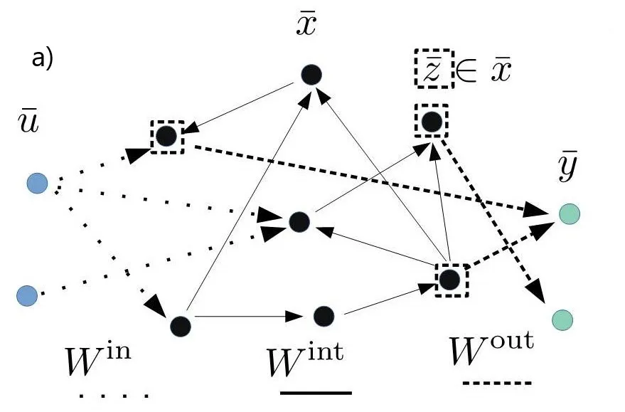
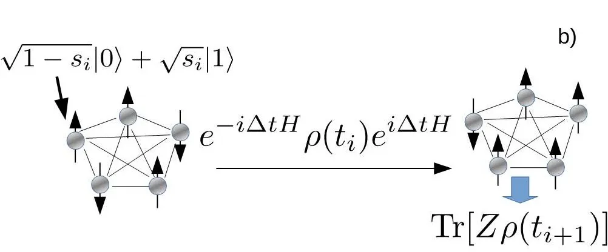
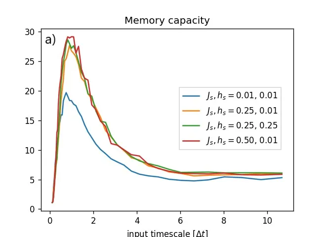
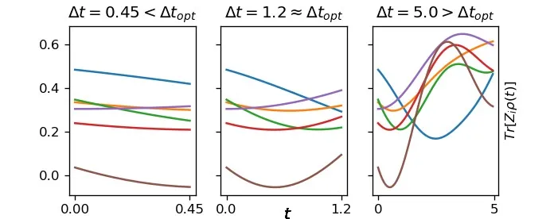
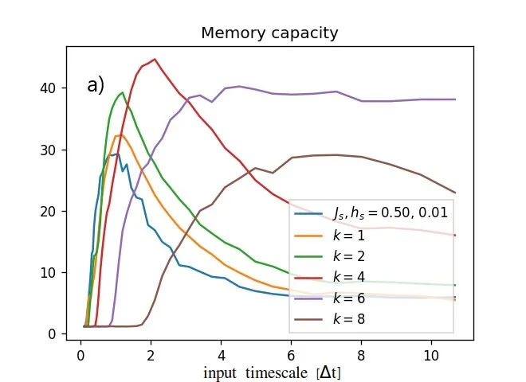
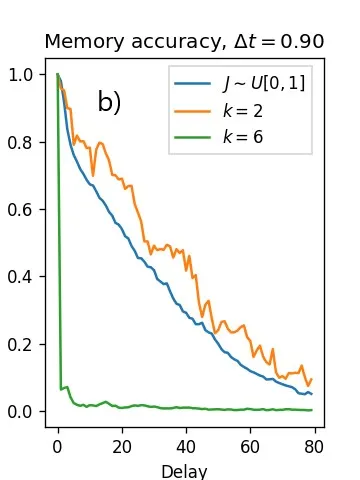
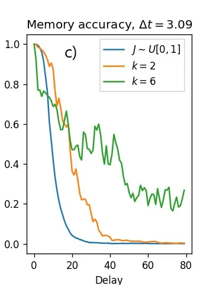
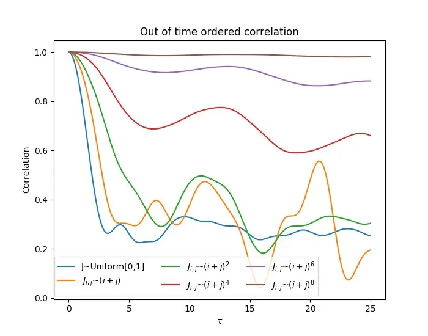
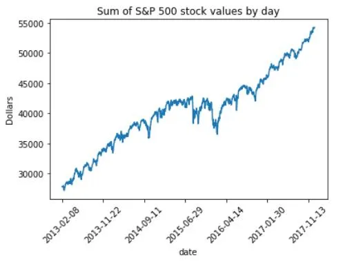
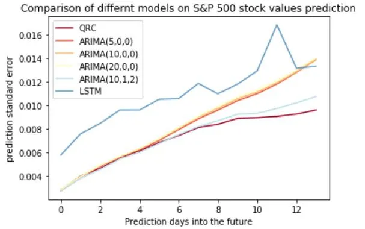

# Optimizing a quantum reservoir computer for time series prediction

Aki Kutvonen Affiliation: Department of Applied Physics, The University
of Tokyo, 7-3-1 Hongo, Bunkyo-ku, Tokyo 113-8656, Japan Affiliation:
COMP Center of Excellence, Department of Applied Physics, Aalto
University School of Science, P.O. Box 11000, FI-00076 Aalto, Espoo,
Finland Affiliation: aki.kutvonen@gmail.com    Keisuke Fujii
Affiliation: Graduate School of Science, Kyoto University, Sakyo-ku,
Kyoto, 606-8502, Japan Affiliation: these authors contributed equally to
this work    Takahiro Sagawa Affiliation: Department of Applied Physics,
The University of Tokyo, 7-3-1 Hongo, Bunkyo-ku, Tokyo 113-8656, Japan
Affiliation: these authors contributed equally to this work

###### Abstract

Quantum computing and neural networks show great promise for the future
of information processing. In this paper we study a quantum reservoir
computer (QRC), a framework harnessing quantum dynamics and designed for
fast and efficient solving of temporal machine learning tasks such as
speech recognition, time series prediction and natural language
processing. Specifically, we study memory capacity and accuracy of a
quantum reservoir computer based on the fully connected transverse field
Ising model by investigating different forms of inter-spin interactions
and computing timescales. We show that variation in inter-spin
interactions leads to a better memory capacity in general, by
engineering the type of interactions the capacity can be greatly
enhanced and there exists an optimal timescale at which the capacity is
maximized. To connect computational capabilities to physical properties
of the underlaying system, we also study the out-of-time-ordered
correlator and find that its faster decay implies a more accurate
memory. Furthermore, as an example application on real world data, we
use QRC to predict stock values.

###### keywords

neural networks, quantum computing, reservoir computing

## Introduction

Partly due to the increase in available data and computational speed,
machine learning models based on neural and deep neural network
architectures have recently been remarkably successful\[1, 2, 3, 4\].
Recurrent neural networks, which are designed for modeling problems with
temporal aspects, have been successful in various end-to-end systems
such as machine translation, speech interpretation/generation and time
series prediction \[5, 6, 7\]. Traditionally the neural networks have
been trained using back propagation through time algorithm, in which the
network is trained against loss function by gradient descent in
parameter space \[8\].

In this paper we consider an alternative way of utilizing recurrent
neural networks, the framework of reservoir computing \[9, 10, 11, 12\].
Unlike in the common back propagation approach, in reservoir computing
the recurrent part of the network (reservoir) is fixed during the
training and only the readout weights are optimized. The reservoir
networks can be directly implemented to physical systems allowing
extremely fast state-of-the-art information processing \[13, 14, 15, 16,
17, 18\]. Here we consider a quantum reservoir computer, where the
network dynamics are governed by rich quantum mechanical dynamics.
Specifically, we consider a model based on fully connected transverse
Ising model, introduced in Ref. \[19\]. While quantum reservoir
computing has demonstrated its computational capability in principle, it
is still unknown how to enhance its computational power by engineering
the underlying physical properties. Here we focus on engineering the
variation of magnetic coupling, inter-spin interaction and input
intervals. The results provide useful information in how future networks
should be configured for use in reservoir computing applications. In
this work, we engineer quantum reservoirs which allow up to 50$`\%`$
memory performance boost compared to the previous setups. We note that
the aim is not to build an universal quantum computer and run algorithms
on it, rather we are interested in a solver for recurrent neural
networks which takes the advantage of rich quantum mechanical dynamics
and exponentially scaling Hilbert spaces.

One of key attributes of recurrent neural networks is the memory
performance which determines the applicability of the network for
various tasks \[20\]. We measure the memory performance with the long
short term memory test and show that the memory accuracy and length of a
quantum reservoir computer can be optimized by choosing an optimal
timescale for the process or altering the inter-spin interactions. In
addition, to better understand the underlying dynamics and its relation
to the memory performance, we investigate the speed of information
encoding from the inputs to the internal state of the quantum reservoir
computer by using the out-of-time-ordered correlator (OTOC)\[21\].

## Setup

We start by describing the standard protocol of recurrent neural
networks and reservoir computing. Given the discrete splitting of time
$`\{t_{i}\}`$, values of the input nodes
$`\bar{u}(t_{i})=\{u_{j}(t_{i})\}_{j=0}^{n_{u}}`$, the network nodes
$`\bar{x}(t_{i})=\{x_{j}(t_{i})\}_{j=0}^{n_{x}}`$ and the output nodes
$`\bar{y}(_{i}t)=\{y_{j}(t_{i})\}_{j=0}^{n_{y}}`$, the update equation
for a simple recurrent neural network is given by

```math
x_{i}(t_{i+1})=f[\sum_{j}^{n_{u}}W^{\textbf{in}}_{x_{i},u_{j}}u_{j}(t_{i+1})+\sum_{j}^{n_{x}}W^{\textbf{int}}_{x_{i},x_{j}}x_{j}(t_{i})], \tag{1}
```

where $`f`$ is some nonlinear differentiable function such as sigmoid
function, $`W^{\textbf{in}}`$, $`W^{\textbf{int}}`$ are the transition
weights from the input nodes and hidden nodes, and $`n_{u}`$, $`n_{x}`$
and $`n_{y}`$ are the number of input, hidden and output nodes,
respectively. A simple recurrent neural network is depicted in Fig. 1
(a). The network outputs are given by

```math
y_{i}(t_{i+1})=\sum_{j}^{n_{out}}W^{\textbf{out}}_{y_{i},z_{j}}z_{j}(t_{i}), \tag{2}
```

where we assume that the readout signals are gathered from a subset
$`\{z_{i}\}\in\{x_{i}\}`$ of size $`n_{out}<n_{x}`$ from hidden nodes.
In general the output $`y_{i}(t_{i+1})`$ could have contribution from
last inputs $`\bar{u}(t_{i})`$ and outputs $`\bar{y}(t_{i})`$ or the
nodes itself could have more complex design \[22\].

Given the values of input nodes $`\bar{u}(t_{i})`$ (input sequence), the
training goal is to find a set of weights $`W^{\textbf{out}}`$, which
minimize the error
$`\mathcal{E}=\sum_{i}\|\bar{y}^{\textbf{targ}}(t_{i})-\bar{y}(t_{i})\|`$,
where $`y^{\textbf{targ}}(t)`$ is the target sequence and $`\|\dot{\|}`$
denotes a differentiable distance function, such as the mean square
distance or cross entropy between distributions. The standard method of
back propagation for optimizing typically millions of parameters is to
evaluate and numerically descend along the gradients $`d\mathcal{E}/dW`$
for all elements in $`W^{\textbf{in}}`$ and $`W^{\textbf{int}}`$.
Reservoir computing seeks to optimize the task with less computational
power by training the output weights $`W^{\textbf{out}}`$ alone. In the
case of the mean square error the task reduces to the standard linear
regression task, and the optimal configuration of weights,
$`W^{\textbf{out}}_{opt}=\arg\min_{W^{\textbf{out}}}\sum_{i}(\bar{y}^{\textbf{targ}}(t_{i})-\bar{y}(t_{i}))^{2}`$,
is given by

```math
W^{\textbf{out}}_{opt}=\mathcal{Z}^{-1}\mathcal{Y}, \tag{3}
```

where $`\mathcal{Y}_{i,j}=y^{\textbf{targ}}_{j}(t_{i})`$ and
$`\mathcal{Z}^{-1}`$ denotes the Moore–Penrose pseudo inverse of matrix
$`\mathcal{Z}_{i,j}=z_{j}(t_{i})`$. Since in reservoir computing the
inter network optimization is not necessary during the training, a
physical system can drive the network dynamics directly.

The memory of the network is measured by the short term memory (STM)
task defined as a task to remember the input $`d`$ steps ago:

```math
y^{\textbf{targ}}_{d}(t_{i})=s_{i-d}. \tag{4}
```

The memory accuracy is defined as the correlation between the prediction
and the target function:

```math
\mathcal{R}(d)=\text{cov}^{2}(y,y^{\textbf{targ}}_{d})/\sigma^{2}(y)\sigma^{2}(y^{\textbf{targ}}_{d}), \tag{5}
```

where cov denotes covariance and $`\sigma^{2}`$ variance. The memory
capacity $`\mathcal{C}`$ is defined as
$`\mathcal{C}=\sum_{d=1}^{d_{c}}\mathcal{R}(d)`$, where $`d_{c}`$ is a
cut off distance, which we set to 100.





Figure 1: a) In reservoir computing the input data is fed from the input
nodes $`\bar{u}`$ with weights $`W^{\textbf{in}}`$ to the network hidden
nodes $`\bar{x}`$. The internal immutable dynamics are governed by
$`W^{\textbf{in}}`$. Outputs are obtained by weighting the readout nodes
$`\bar{z}`$, corresponding to
$`\langle Z_{i}\rangle=\text{Tr}[Z_{i}\rho]`$ in our setup, with the
readout weights $`W^{\textbf{out}}`$. b) In quantum reservoir computing
an input $`s_{i}`$ is fed to a spin by setting its state to
$`|\Psi_{s_{i}}\rangle=\sqrt{1-s_{i}}|0\rangle+\sqrt{s_{i}}|1\rangle`$.
After free time evolution the readout node values are obtained as the
ensemble averages of the spins $`\langle Z\rangle`$.

For efficient usage, reservoir computing requires complex dynamics,
large network sizes and bounded dynamics. These requirements are
naturally met by interacting quantum mechanical spin systems, whose
state space scales exponentially with respect to the number of spins and
the dynamics are governed by complex unitary dynamics. The notation here
follows the standard quantum mechanics notation. The state of a spin is
a two-dimensional complex vector spanned by the eigenstates of the Pauli
$`Z`$ operator, $`\{|0\rangle,|1\rangle\}`$. The total state space of
$`\it N`$ qubits is a tensor product space of the two-dimensional
individual spin spaces. The total (pure) state of the system is
represented by a $`2^{N}`$-dimensional vector $`|\Psi\rangle`$. A
statistical mixture of pure states can be described by
$`2^{N}\times 2^{N}`$-dimensional density matrix $`\rho`$. For a closed
quantum system, the time evolution is governed by the time independent
Schrödinger equation, which for the density matrix can be written as

```math
\rho(t+\Delta t)=e^{-i\Delta tH}\rho(t)e^{i\Delta tH}, \tag{6}
```

where $`H`$ is a $`2^{N}\times 2^{N}`$-dimensional hermitian matrix, the
Hamiltonian of the system, which defines the system dynamics. Here we
consider an extensively studied model, the fully connected transverse
field Ising model, whose Hamiltonian is given by

```math
H=\sum_{i,j}J_{i,j}X_{i}X_{j}+h_{i}Z_{i}, \tag{7}
```

, where $`X_{i}`$ and $`Z_{i}`$ are the Pauli $`X`$ and $`Z`$ operators
at site $`i`$. In this model all the spins interact with each other in
$`x`$-direction and are coupled to an external magnetic field in
z-direction.

We consider one-dimensional inputs $`\bar{s}(t_{i})=s_{i}`$ and outputs
$`\bar{y}(t_{i})=y_{i}`$. At time $`t_{i}`$ the input $`s_{i}`$ is fed
to the system by setting the state of the first spin to
$`\ket{ \Psi_{s_i} }=\sqrt{1-s_{i}}\ket{0}+\sqrt{s_{i}}\ket{1}`$. The
density matrix of the system then becomes
$`\rho\mapsto\ket{ \Psi_{s_i}}\bra{ \Psi_{s_i} }\bigotimes\text{Tr}_{1}[\rho]`$,
where $`\text{Tr}_{1}`$ denotes the trace over the first spin degree of
freedom.

After the input is set, the system continues evolving itself for time
$`\Delta t`$. During this time the dynamics are governed by Eq. (6) and
the information encoded in the first spin will spread through the
system. During $`[t_{i},t_{i+1}]`$ we measure the average spin values in
the $`z`$-direction, $`\langle Z_{i}\rangle=\text{Tr}[Z_{i}\rho]`$,
which corresponds to the readout nodes in our setup. After gathering a
sufficient amount of input-output signal pairs, the readout weights
$`W^{\textbf{out}}`$ are trained according to Eq. (3) and the
corresponding outputs and the future predicted outputs are obtained from
Eq. (2). The input-readout loop is illustrated in Fig. 1 (b).

Since the number of spins in our setup, $`N_{s}`$, is fairly small, we
also gather the readout signals from intermediate times between
$`[t,t+\Delta t]`$. The input timescale $`\Delta t`$ is divided into
$`N_{v}`$ time steps and thus the intermediate times are given by
$`t_{i}^{k}=t_{i}+k\Delta t/N_{v}`$, where $`k=1,..,N_{v}`$. The readout
signals are gathered as $`\text{Tr}[Z_{j}\rho(t_{i}^{k})]`$ for all the
spins $`j=1,..,N_{s}`$ and the intermediate times $`t_{i}^{k}`$. Thus
the total number of the output signals is $`N_{spins}N_{v}`$.

We note that an experimental realization of the setup requires multiple
copies of the same system in order to make the effect of measurement
back-action irrelevant. This is feasible by using nuclear magnetic
resonance systems, where a huge ensemble of identical molecules can be
utilized. Further details on the input-readout loop with practical
implementation considerations are available in Ref. \[19\].

## Results

We set the number of spins and intermediate times to $`N_{s}=6`$ and
$`N_{v}=10`$, respectively, which gives a relatively good performance at
reasonable computational cost \[19\]. The input sequences were random
binary inputs, $`s_{i}=\{0,1\}`$, sampled for each simulation
separately. Initial state was set to the maximally entangled state,
where all the possible states $`|\Psi\rangle`$ appear with the same
probability $`1/2^{N_{s}}`$. All of the simulations consisted of an
initial equilibration phase of 2000 time steps during which the inputs
were injected but no training was done. During following 3000 time steps
the input and readout signals were gathered and the output weights were
trained according to Eq. (3). The testing was done by generating a new
set of 1000 data points. The network output prediction of Eq. (2) was
then compared to the target output of Eq. (4).

We considered various values of magnetic coupling $`h`$, inter-spin
interactions $`J`$ (Eq. (7)) and input intervals $`\Delta t`$. Values
for both $`h`$ and $`J`$ were sampled from 0.5 centered uniform
distribution $`\mathcal{U}[0.5-h_{s}/J_{s},0.5+h_{s}/J_{s}]`$. The scale
parameters $`h_{s}`$ and $`J_{s}`$ simulated were
$`h_{s},J_{s}\in\{0.01,0.1,0.25,0.50,2,3\}`$ and the number of
simulations for each setup was 25. We also sampled $`J`$ from
Beta-distribution with values
$`(\alpha,\beta)=\{(0.1,0.1),(0.7,0.7),(0.9,0.9),(1.1),(2,2),(9,9),(100,100)\}`$
while keeping the value of $`h=0.5`$ fixed (see Supplementary Fig. S1
online). Figure 2 shows the memory capacity as a function of the input
timescale $`\Delta t`$ for selected scale parameters $`h_{s}`$ and
$`J_{s}`$. For all the parameters tested, larger deviation in $`J`$,
corresponding to larger scale values of $`J_{s}`$ and smaller values of
$`(\alpha,\beta)`$, resulted in larger maximum capacity. However, the
given boost in performance saturated around $`J_{s}=0.5`$ and
$`(\alpha,\beta)=(1,1)`$, corresponding to uniform $`[0,1]`$ sampling.
Within the parameters sampled, the values of $`h`$ did not have
considerable effect on the memory capacity.

In all setups there existed an optimal input timescale
$`\Delta t_{\text{opt}}`$ at which the memory capacity is maximized as
shown in Fig. 2. The STM task measures how well the past input signals
can be decoded from readout signals
$`\{\langle Z_{i}\rangle\}_{i=1}^{6}`$ during time window
$`[t_{i},t_{i+1}]=[t_{i},t_{i}+\Delta t]`$, using the simple linear map
of Eq. (2). On too short timescales the dynamics are almost linear at
$`t\in[t_{i},t_{i+1}]`$ and thus there is no prediction power outside
the linear signal regime. On too long timescales the signals are too
chaotic during $`t\in[t_{i},t_{i+1}]`$ giving rise to sub-optimal
performance. Thus at optimal timescales the dynamics are not completely
linear but not yet too chaotic either. Signals at different timescales
are illustrated in the lower panel of Fig. 2.





Figure 2: a) Memory capacity shown as a function of the input timescale
$`\Delta t`$. The values for $`h`$ and $`J`$ are sampled from
$`\mathcal{U}[0.5-h_{s},0.5+h_{s}]`$ and
$`\mathcal{U}[0.5-J_{s},0.5+J_{s}]`$, respectively. Deviation in $`J`$
leads to better performance but the deviation in $`h`$ is less
important. Furthermore, for all parameters simulated, there exists an
optimal timescale for $`\Delta t`$, which maximizes the capacity. b)
Readout signals Tr$`[Z_{i}\rho(t)]`$ for three different time windows
$`[t_{i},t_{i}+\Delta t]`$ for parameters $`h_{s}=0.01`$, $`J_{s}=0.5`$.
The leftmost, center and the rightmost panels corresponds to timescales
shorter, equal and longer than the optimal timescale
$`\Delta t_{\text{opt}}`$, respectively.

Instead of sampling $`J`$ and $`h`$ from a distribution, we considered
engineered forms of $`J`$ while keeping the value of $`h`$ fixed to 0.5.
The coupling between the spins was set to

```math
J^{k}_{i,j}=(i+j)^{k}/c_{k}, \tag{8}
```

where $`i`$ and $`j`$ are the spin indexes, $`k`$ is a scaling parameter
and $`c_{k}=\sum_{i,j}2N_{s}^{2}(i+j)^{k}`$ is a $`k`$-dependent
constant which ensures comparable energy scales between setups with the
mean interaction $`\textbf{E}[J^{k}]=0.5`$. In addition to the fixed
mean, the form of $`J^{k}`$ above has the benefit of inducing deviation
in $`J`$ with simple parametrization $`k`$ without additional noise
induced by random sampling. Furthermore, all the spins have different
average couplings to the other spins,
$`\sum_{j}J^{k}_{i,j}<\sum_{j}J^{k}_{i+1,j}`$, $`i\in{1,2,..,5}`$. We
expect that this in general results into more rich and divergent signals
increasing the prediction power of Eq. (2). In fact, compared to the
random sampled $`J`$, the memory capacity can be increased up to 50% by
using $`J^{k}`$, as shown in Fig. 3. Maximum memory capacity has a
non-monotonic dependence on $`k`$ and the best performance is obtained
with $`k=4`$. Furthermore, the larger the $`k`$, the larger the optimal
input interval $`\Delta t_{\text{opt}}`$. The number of simulations was
10 for each of the value $`k\in\{1,2,4,6,8\}`$.

For practical purposes, the memory accuracy $`\mathcal{R}(d)`$ (Eq. (5))
may be more important than the overall capacity. Figure 3 shows the
memory accuracy as a function of the delay $`d`$ for selected values of
$`k`$ and input intervals $`\Delta t`$. On short $`\Delta t`$ the memory
extends up to delays 100 but is inaccurate throughout the delay range.
On the contrary at long intervals $`\Delta t`$ the memory is shorter but
more accurate. As the capacity $`\mathcal{C}=\sum_{d}\mathcal{R}(d)`$
measures the sum of accuracies over memory length, the largest
$`\mathcal{C}`$ is obtained somewhere in the intermediate timescales
where the correlation is relatively good over all the delays up to the
cutoff delay.

It is also interesting to compare the memory type to the signals given
in the lower panel of Fig 2. On longer intervals $`\Delta t`$ the time
window seems to give a good view of the last couple of time windows but
the prediction power cannot extend far due to the chaotic nature of the
signals, corresponding to the short but accurate memory in the STM test.
Vice versa, at shorter intervals $`\Delta t`$ the linear prediction
extends longer in the past but it is never quite accurate.

When comparing the different $`J^{k}`$ at the same input intervals, the
larger $`k`$ exhibits the longer but less accurate memory and smaller
$`k`$ values are associated with the shorter but more accurate memory.
Thus, like in the case of the input interval $`\Delta t`$, also the
intermediate $`k`$ value results in the highest memory capacity (Fig.
3). We note that the short but accurate type of memory associated with
timescales $`\Delta t>\Delta t_{\text{opt}}`$ and and lower values of
$`k`$ might be preferred for practical applications where a high enough
accuracy is needed.







Figure 3: a) Memory capacity for different inter-spin couplings
$`J^{k}_{i,j}=(i+j)^{k}/c_{k}`$. The maximum capacity has a
non-monotonic behaviour in $`k`$, while the location of the maximum
shifts towards larger $`\Delta t`$ in increasing $`k`$. b) Memory
accuracy at the short time interval. The interval $`\Delta`$ is too
short for $`k=6`$ while the other setups exhibit the long but inaccurate
memory. c) At long time intervals the setups exhibit the short but
accurate memory. Higher $`k`$ values result into a longer but inaccurate
of memory.

In order to investigate the information spreading from the input spin to
the other spins, we studied the out-of-time-ordered correlator (OTOC)
defined as:

```math
O(t)=\frac{1}{N_{s}}\sum_{j=2}^{N_{s}}\text{Tr}[Z_{1}(t_{0})Z_{j}(t_{0}+t)Z_{1}(t_{0})Z_{j}(t_{0}+t)]. \tag{9}
```

The OTOC measures delocalization of information and is previously used
in the context of fast scrambling of black hole and thermalization of
closed quantum systems \[21, 23\]. We ran 60 simulations, each
consisting of an initial washout phase of 20000 time steps with time
step $`\Delta\tau=0.05`$. Figure 4 shows the OTOC for different
$`J^{k}`$ couplings and the case that $`J`$ is sampled from
$`\mathcal{U}[0,1]`$. The larger the value of $`k`$ is, the slower the
OTOC decays, signaling slower decay of information from the first spin
to the other spins. This is in agreement with the notion that the
average interaction of spin 1 to the others,
$`\sum_{j}J_{1,j}/N_{s}=\sum(1+j)^{k}/(c_{k}N_{s})`$, is a decreasing
function in $`k`$. Larger values of $`k`$ means that the first spin is
more weakly coupled to the other spins resulting into a slower decay of
information.

Comparison of the memory capacity and the OTOC, Figs. 3 and 4, shows
that the slower decay of OTOC implies a larger optimal timescale for the
STM task. Thus the system needs more time for effective distribution of
information (encoding) to the other spins. These systems exhibit the
long but inaccurate type of memory. The encoding takes time and the
encoded information can be decoded back after a long time, but the
decoding is never particularly efficient. In contrary, the random
sampled and low $`k`$ setups are able to encode the information to the
other spins fast and the decoding is efficient, but the memory does not
extend as far. We can further synthesize desired memory properties by
spatially multiplexing distinct quantum reservoirs \[24\].



Figure 4: The OTOC between the input spin (site $`i=1`$) and the other
spins for different couplings $`J^{k}_{i,j}=(i+j)^{k}/c_{k}`$. The
larger the $`k`$, the slower the information decays from the input spin.
This is in agreement with the notion that the input spin is more weakly
coupled to the other spins with higher values of $`k`$.

In order to demonstrate the real world applicability of the quantum
reservoir computer, we used future stock value prediction as an example
task. As an example dataset we used the Standard & Poor’s (S&P) 500
companies stock values from February 8th 2013 to December 29th 2017
\[25\]. We took the the sum of daily closing values of the 500 companies
as our daily time series data of 1232 data points shown in Fig. 5.

The task was to predict the time series 14 days ahead using the past
data, i.e. to predict $`[x_{i},..,x_{i+13}]`$ given
$`[x_{1},..,x_{i-1}]`$. We measured the accuracy for each future day
ahead using mean squared error. Since the data is noisy and the accuracy
highly depends on the starting date (time index $`i`$), we repeated the
task for 100 different starting days $`i\in[1100,..,1199]`$. We compared
the QRC’s performance with other widely used time series forecasting
methods, namely an auto regressive integrated moving average (ARIMA)
model and a recurrent neural network based long short term memory (LSTM)
model \[26, 22\]. The results shown in Fig. 5 indicate that the QRC
performs well compared to the other models within the selected
parameters.

We did not perform an exhaustive parameter search, rather the focus was
on demonstrating that the QRC can be applied to real world data. In the
initial washout phase we fed the training data through the QRC once
without collecting any signals. At the training phase we fed the data,
collected the readout node values and trained the output matrix
$`W^{\textbf{out}}`$ against the target output according to the Eq. (4).
We set the number of qubits to 6, inter spin interactions to Eq. (8)
with $`k=2`$ and the magnetic field was sampled from random uniform
(0,1) distribution. The number of virtual nodes $`N_{v}`$ was set to 2
and we also accumulated the node values from the last 4 data injection
points to our readout node values. That is to say, prediction for data
points $`[x_{i},..,x_{i+13}]`$ was done using readout node values
$`\text{Tr}[Z_{j}\rho(t_{i-k}-l\Delta t/2)]`$, where $`j\in[1,..,6]`$,
$`k\in[0,..,4]`$ and $`l\in[0,1]`$. The data input timescale was set to
$`\Delta t=0.6`$, corresponding to the time scale 0.3 between the
virtual nodes. This timescale corresponds to $`\Delta t=3`$ with 10
virtual nodes, a time scale which resulted into an accurate memory on
shorter delays as shown in the right panel of Fig. 3.

The parameters $`p`$, $`q`$ and $`d`$ in ARIMA$`(p,d,q)`$ correspond to
the number of lagged time series points used for predictions, the number
of differencing operations on the data and the number of lagged forecast
errors used for the predictions, respectively. The model was implemented
using the Python statsmodels package \[27\]. The LSTM model consisted of
64 LSTM units, which were trained for 30 epochs using ”Adam” optimizer
with learning rate of 0.001, and implemented using Keras framework
\[28\]. Furthermore, due to computational limitations, the LSTM model
was not trained for each prediction starting point $`x_{i}`$ using data
up to $`x_{i-1}`$. Instead the LSTM model was only trained once on data
$`[x_{1},...,x_{1099}]`$ using delay of 30 timesteps, which partly
explains the lower accuracy.





Figure 5: a) The time series data of daily closing values of S&P 500
stocks by date. b) Mean absolute error for different prediction models
as a function of how many days ahead the prediction date is. The results
are averages over 100 different starting dates.

## Summary

We studied the memory capacity and accuracy of a quantum reservoir
computer based on the fully connected transverse field Ising model. We
observed that the input data interval $`\Delta t`$ has a system
dependent optimal value $`\Delta t_{\text{opt}}`$ which leads to the
maximum capacity. Furthermore, our results suggest that the deviation in
inter-spin interaction strengths leads to improved memory capacity up to
some limit. While the maximum capacity is a sign of performance, in
practical applications we may be interested in the memory accuracy,
which is in general improved by using a slightly longer input time
interval than $`\Delta t_{\text{opt}}`$. In addition, our results
suggest that the fast decay of the OTOC is a sign of fast encoding of
information from the input spins to the others. These setups exhibit the
accurate memory at the cost of memory length. Furthermore, as a real
world example application, we predicted stock prices using the quantum
reservoir computer. Possible future research directions include more
advanced data input-output strategies, which could implement e.g.,
multi-dimensional inputs and outputs, mixture of multiple readout
timescales and efficient strategies for determining optimal timescales
for given tasks.

## References

- \[1\] William, C., Navdeep, J., Quoc, V. & Oriol, V. Listen, attend
  and spell: A neural network for large vocabulary conversational speech
  recognition. In _ICASSP_ (2016).
- \[2\] Hirschberg, J. & Manning, C. Advances in natural language
  processing. _Science_ 349, 261–266 (2015).
- \[3\] LeCun, Y., Bengio, Y. & Hinton, G. Deep learning. _Nature_ 521,
  436 (2015).
- \[4\] Mnih, V. e. a. Human-level control through deep reinforcement
  learning. _Nature_ 518, 529 (2015).
- \[5\] Chung, J. e. a. A recurrent latent variable model for sequential
  data. In _NIPS_, vol. 28, 2980–2988 (2015).
- \[6\] Mikolov, T. e. a. Recurrent neural network based language model.
  In _Proceedings of the 11th Annual Conference of the International
  Speech Communication Association, INTERSPEECH 2010_, vol. 2, 1045–1048
  (2010).
- \[7\] Sutskever, I., Vinyals, O. & V.L., Q. Sequence to sequence
  learning with neural networks. In _NIPS_, vol. 27, 3104–3112 (2014).
- \[8\] Rumelhart, D., Hinton, G. & R.J., W. Learning representations by
  back-propagating errors. _Nature_ 323, 533 (1986).
- \[9\] Jaeger, H. & Haas, H. Harnessing nonlinearity: predicting
  chaotic systems and saving energy in wireless communication. _Science_
  304, 78 (2004).
- \[10\] Maass, W., Natschlanger, T. & Markram, H. Real-time computing
  without stable states: a new framework for neural computation based on
  perturbations. _Neural Comput._ 14, 2531 (2002).
- \[11\] Verstraeten, D., Schrauwen, B. & D’Haene, M. . S. D. An
  experimental unification of reservoir computing methods. _Neural
  Netw._ 20, 391 (2007).
- \[12\] Lukoševičius, M. & Jaeger, H. Reservoir computing approaches to
  recurrent neural network training. _Computer Science Review_ 3, 127 –
  149 (2009).
- \[13\] Laurent, L. e. a. High-speed photonic reservoir computing using
  a time-delay-based architecture: Million words per second
  classification. _Phys. Rev. X_ 7, 011015 (2017).
- \[14\] Dambre, J. e. a. Information processing capacity of dynamical
  systems. _Sci. Rep._ 2, 514 (2012).
- \[15\] Woods, D. & Naughton, T. Photonic neural networks. _Nat. Phys._
  8, 257 (2012).
- \[16\] Brunner, D. e. a. Parallel photonic information processing at
  gigabyte per second data rates using transient states. _Nat. Commun._
  4, 1364 (2013).
- \[17\] Vandoorne, K. e. a. Experimental demonstration of reservoir
  computing on a silicon photonics chip. _Nat. Commun._ 5, 3541 (2014).
- \[18\] Chao, D. e. a. Reservoir computing using dynamic memristors for
  temporal information processing. _Nat. Commun._ 8, 2204 (2017).
- \[19\] Fujii, K. & Nakajima, K. Harnessing disordered-ensemble quantum
  dynamics for machine learning. _Phys. Rev. Applied_ 8, 024030 (2017).
- \[20\] Nakajima, K. e. a. Exploiting short-term memory in soft body
  dynamics as a computational resource. _J. R. Soc. Interface_ 11,
  20140437 (2014).
- \[21\] Ruihua, F., Pengfei, Z., Huitao, S. & Hui, Z. Out-of-time-order
  correlation for many-body localization. _Science Bulletin_ 62, 707 –
  711 (2017).
- \[22\] Hochreiter, S. & Schmidhuber, J. Long short-term memory.
  _Neural computation_ 9, 1735–80 (1997).
- \[23\] Maldacena, J., Shenker, S. H. & Stanford, D. A bound on chaos.
  _Journal of High Energy Physics_ 2016, 106 (2016).
- \[24\] Nakajima, K., Fujii, K., Negoro, M., Mitarai, K. & Kitagawa, M.
  Boosting computational power through spatial multiplexing in quantum
  reservoir computing. _Phys. Rev. Applied_ 11, 034021 (2019).
- \[25\] S&p 500 stock data (2020). URL
  [https://www.kaggle.com/camnugent/sandp500](https://www.kaggle.com/camnugent/sandp500).
- \[26\] Ho, S. & Xie, M. The use of arima models for reliability
  forecasting and analysis. _Computers & Industrial Engineering_ 35, 213
  – 216 (1998).
- \[27\] Introduction - statsmodels (2020). URL
  [https://www.statsmodels.org/stable/index.html](https://www.statsmodels.org/stable/index.html).
- \[28\] Keras: the python deep learning api (2020). URL
  [https://keras.io/](https://keras.io/).

## Acknowledgements

A.K. is supported by Jenny and Antti Wihuri Foundation through Council
of Finnish Foundations’ Post Doc Pool, T.S. by JSPS KAKENHI Grant Number
JP16H02211 and K.F. by JST PRESTO Grant Number JPMJPR1668, JST ERATO
Grant Number JPMJER1601, and JST CREST Grant Number JPMJCR1673. We thank
Eiki Iyoda for useful discussions.

## Author contributions statement

A.K. conducted the simulations and wrote the first draft of the
manuscript. A.K., T.S. and K.F. analyzed the results and reviewed the
manuscript.

## Additional information

The authors declare no competing interests.
