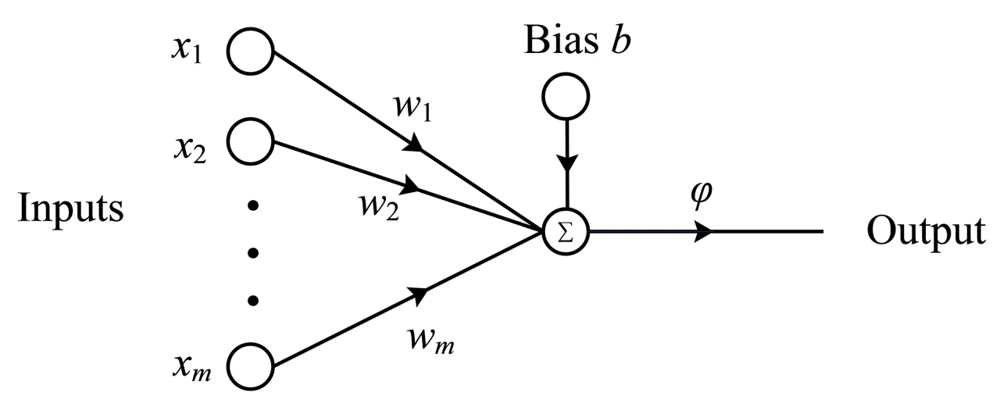
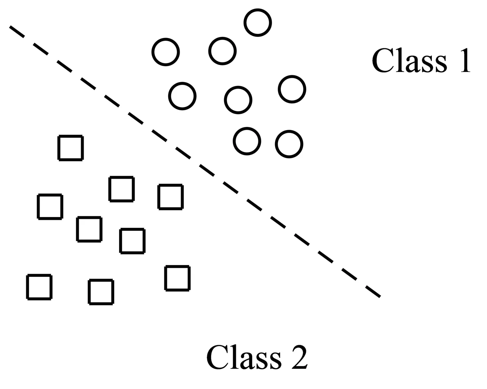
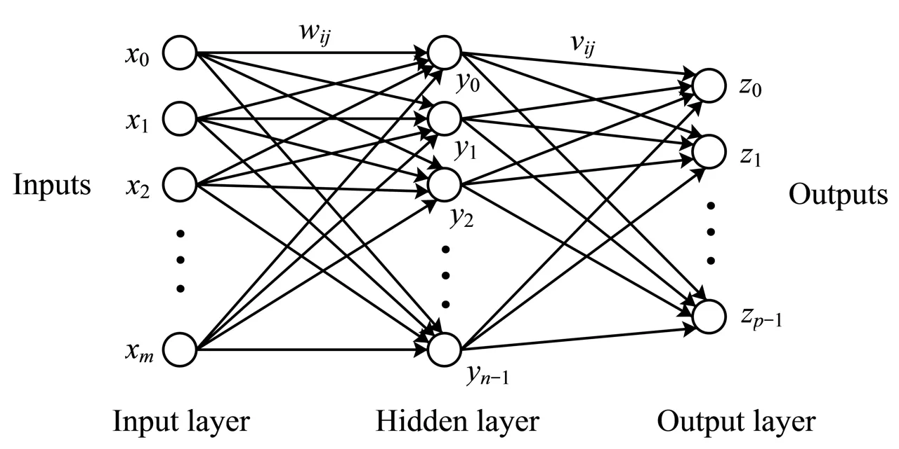

# A Quantum Model for Multilayer Perceptron

Changpeng Shao Affiliation: Academy of Mathematics and Systems Science,
Chinese Academy of Sciences, Beijing 100190, China
Email: <cpshao@amss.ac.cn>

###### Abstract

Multilayer perceptron is the most common used class of feed-forward
artificial neural network. It contains many applications in diverse
fields such as speech recognition, image recognition, and machine
translation software. To cater for the fast development of quantum
machine learning, in this paper, we propose a new model to study
multilayer perceptron in quantum computer. This contains the tasks to
prepare the quantum state of the output signal in each layer and to
establish the quantum version of learning algorithm about the weights in
each layer. We will show that the corresponding quantum versions can
achieve at least quadratic speedup or even exponential speedup over the
classical algorithms. This provide us an efficient method to study
multilayer perceptron and its applications in machine learning in
quantum computer. Finally, as an inspiration, an exponential fast
learning algorithm (based on Hebb’s learning rule) of Hopfield network
will be proposed.

Keywords: Artificial neural networks, multilayer perceptron, Hopfield
neural network, quantum computing, quantum algorithm, quantum machine
learning.

## 1 Introduction

Inspired by biological neural networks, artificial neural networks
(ANNs) are massively parallel computing models consisting of an
extremely large number of simple processors with many interconnections.
ANNs are highly successful methods to study machine learning.
Researchers from different scientific disciplines are designing
different ANN models to solve various problems in pattern recognition,
clustering, approximation, prediction, optimization, control and so on
\[6, 11, 17, 18, 19, 28, 36\]. Hence ANNs are of great interest for
quantum adaptation. Quantum neural networks (QNNs) are models combining
the powerful features of quantum computing (such as superposition and
entanglement) and ANNs (such as parallel computing). However, the
nonlinear dynamics of ANNs are very different from unitary operations
(which are linear) of quantum computing. To find a meaningful QNN model
that integrates both fields is a highly nontrivial task \[29\]. Many
attempts of QNN models are obtained \[2, 3, 4, 20, 25, 29, 30, 34, 35,
37\].

In \[2\], Altaisky introduced a quantum perceptron which is modelled by
the following quantum updating function
$`|y(t)\rangle=\hat{F}\sum_{i}\hat{w}_{iy}(t)|x_{i}\rangle`$, where
$`\hat{F}`$ is an arbitrary unitary operator and $`\hat{w}_{iy}(t)`$ is
an operator representing the weights. The training rule is
$`\hat{w}_{iy}(t+1)=\hat{w}_{iy}(t)+\eta(|d\rangle-|y(t)\rangle)\langle x_{i}|`$,
where $`|d\rangle`$ in the quantum state of the target vector,
$`|y(t)\rangle`$ is the output state of the quantum perceptron and
$`\eta`$ is some pramteter. The author notes that this training rule is
by no means unitary regarding the components of the weight matrix. So it
would fail to preserve the unitary property and so the total probability
of the system.

A large class of ANNs uses binary McCulloch-Pitts neurons \[22\] in
which the neural cells are assumed to be active or resting. The value of
inputs and outputs are $`\{-1,1\}`$. So there is a natural connection
between the the inputs $`\{-1,1\}`$ and qubits $`|0\rangle,|1\rangle`$.
All possible inputs $`x_{1},\ldots,x_{n}\in\{-1,1\}`$ naturally
corresponds to a quantum state
$`\sum_{x_{1},\ldots,x_{n}\in\{-1,1\}}\alpha_{x_{1},\ldots,x_{n}}|x_{1},\ldots,x_{n}\rangle`$,
where $`\alpha_{x_{1},\ldots,x_{n}}`$ refers to the amplitude of
$`|x_{1},\ldots,x_{n}\rangle`$. In \[30\], Schuld et al. considered the
simulation of a perceptron in quantum computer in this model. They put
the signals $`x_{1},\ldots,x_{n}\in\{-1,1\}`$ into qubits
$`|x_{1},\ldots,x_{n}\rangle`$, so that the output of a perceptron under
the threshold function can be computed to some precision by applying
quantum phase estimation on a unitary operator, which is generated by
the weights. This model uses $`n`$ qubits, so the complexity of the
method given in \[30\] is linear at $`n`$. For the introduction of other
QNN models, we refer to \[29\].

In this paper, we give a try to study multilayer perceptron (MLP) in
quantum computer from a different idea, that is setting $`x_{i}`$ as the
amplitude of qubits to generate the quantum state
$`|x\rangle=\frac{1}{\|{\bf x}\|}\sum x_{i}|i\rangle`$, where
$`{\bf x}=(x_{1},\ldots,x_{n})`$ is the vector of input signals. This
idea has been applied in \[23\] to study quantum Hopfield neural
network. One apparent advantage is that it only uses $`O(\log n)`$
qubits. So it may have a better performance than the model used in \[30,
31\]. Also in the quantum state $`|x\rangle`$, the input signal
$`x_{i}`$ can be any value. So it contains a more general form than the
model considered in \[30\]. Similarly, we can generate the quantum state
$`|w\rangle`$ of the weight vector $`{\bf w}=(w_{1},\ldots,w_{n})`$. The
output of MLP can be any nonlinear function of
$`{\bf x}\cdot{\bf w}:=\sum_{i}x_{i}w_{i}`$. However, computing
$`{\bf x}\cdot{\bf w}`$ (or $`\langle x|w\rangle`$ when we only
interested in the sign) is not difficult in a quantum computer due to
swap test \[8\]. Moreover, any function of this value can be obtained by
adding an ancilla qubit, just like HHL algorithm did \[12\]. This shows
another advantage of the representation $`|x\rangle`$ of the input
signal vector $`{\bf x}`$.

However, reading the output is just the initial step of studying quantum
MLP. A big challenge of the quantum MLP is the learning algorithm
because of the nonlinear structure of MLP. Learning (or self-learning)
ability is one of the most significant features of MLP. Many
applications of MLP can be achieved by suitably constructing the network
first. Then let MLP to achieve the desired results from learning. So
establish the learning algorithm of MLP in quantum computer is necessary
and important. In this paper, we will provide a method to integrate the
nonlinear structure of MLP into quantum computer. At the same time, the
good features of MLP (e.g., parallelism) and quantum computer (e.g.,
superposition) can be satisfied simultaneously. This provide us a new
model to study MLP and its applications in quantum machine learning.

The integration is achieved by a new technique called parallel swap test
proposed in a previous paper \[32\] to study matrix multiplication. It
is a generalization of swap test \[8\], but in a parallel form. Simply
speaking, parallel swap test can output the quantum information in
parallel, which is required in the construction of quantum MLP. With
this technique, we will show that the computation of the output signals
and the learning algorithm (online and batch) of weights in quantum MLP
can be achieved much faster (at least quadratic or even exponential
faster) than the classical versions. Finally, as an inspiration, we will
study the learning (Hebb’s learning rule) of Hopfield network. This also
achieves an exponential speedup at the number of input neurons over the
classical learning algorithm.

The structure of this paper is as follows: In section 2, we extend the
swap test technique into a parallel form, which will play a central role
in the simulation of quantum MLP. In section 3, we propose a technique
to prepare quantum states, which is exponential fast than previous
quantum algorithms. Although this cannot prepare the quantum states of
all vectors efficiently, one can believe that it can solve many
practical problems as fast as desired. In section 4, we focus on the
simulation of a perceptron. The simulation, which include the reading of
output data and the back-propagation learning algorithm, of MLP in
quantum computer will be studied in section 5. Finally, in section 6, we
study the learning algorithm of Hopfield neural network in a quantum
computer.

Notation. We will use bold letters $`{\bf x},{\bf y},{\bf z},\ldots`$ to
denote vectors and italic letters
$`|x\rangle,|y\rangle,|z\rangle,\ldots`$ to denote their quantum states.
The norm $`\|\cdot\|`$ always refers to the 2-norm of vectors.

## 2 Swap test in parallel

Swap test was first proposed in \[8\] as an application of quantum phase
estimation algorithm and Grover searching, which can be used to estimate
the probabilities or amplitudes of certain desired quantum states. It
plays an important role in many quantum machine learning algorithms to
estimate the inner product of two quantum states. In the following, we
first briefly review the underlying problem swap test considers and the
basic procedures to solve it. Then, we review the generalized form of
swap test considered in a previous work \[32\] to study matrix
multiplication in quantum computer. This will play a central role in our
construction of the model of multilayer perceptron in a quantum
computer.

Let

```math
|\phi\rangle=\sin\theta|0\rangle|u\rangle+\cos\theta|1\rangle|v\rangle \tag{1}
```

be a unknown quantum state that can be prepared in time
$`O(T_{\rm in})`$, where $`|u\rangle,|v\rangle`$ are normalized quantum
states and $`\theta`$ is a unknown angle parameter. The problem is how
to estimate $`\theta`$ in quantum computer to precision $`\epsilon`$
with a high success probability.

Suppose that $`|\phi\rangle`$ comes from some other quantum algorithms,
which means there is a given unitary $`U`$, which can be implemented in
time $`O(T_{\rm in})`$, such that $`|\phi\rangle=U|0\rangle`$. Let $`Z`$
be the 2-dimensional unitary transformation that maps $`|0\rangle`$ to
$`-|0\rangle`$ and $`|1\rangle`$ to $`|1\rangle`$, which is usually
called Pauli-Z matrix. Denote
$`G=(2|\phi\rangle\langle\phi|-I)(Z\otimes I)=U(2|0\rangle\langle 0|-I)U^{\dagger}(Z\otimes I)`$,
which is a rotation similar to the one used in Grover’s algorithm. Then

```math
G=\left(\begin{array}[]{rr}\vskip 5.69046pt\cos 2\theta&~~\sin 2\theta\\
-\sin 2\theta&~~\cos 2\theta\\
\end{array}\right)
```

under the basis $`\{|0\rangle|u\rangle,|1\rangle|v\rangle\}`$. The
eigenvalues of $`G`$ are $`e^{\pm{\bf i}2\theta}`$ and the corresponding
eigenvectors are
$`|w_{\pm}\rangle=\frac{1}{\sqrt{2}}(|0\rangle|u\rangle\pm{\bf i}|1\rangle|v\rangle)`$.
Note that
$`|\phi\rangle=-\frac{{\bf i}}{\sqrt{2}}(e^{{\bf i}\theta}|w_{+}\rangle-e^{-{\bf i}\theta}|w_{-}\rangle).`$
So performing quantum phase estimation algorithm on $`G`$ with initial
state $`|0\rangle^{n}|\phi\rangle`$ for some $`n=O(\log 1/\delta)`$. We
will get an good approximate of the following state

```math
-\frac{{\bf i}}{\sqrt{2}}\Big[e^{{\bf i}\theta}|y\rangle|w_{+}\rangle-e^{-{\bf i}\theta}|-y\rangle|w_{-}\rangle\Big], \tag{2}
```

where $`y\in\mathbb{Z}_{2^{n}}`$ satisfies
$`|\theta-y\pi/2^{n}|\leq\epsilon`$. The time complexity of the above
procedure is $`O(T_{\rm in}/\epsilon)`$. Perform a measurement on (2),
we will get an $`\epsilon`$ approximate of $`\theta`$.

Now let $`|x\rangle,|y\rangle`$ be two real quantum states that can be
prepared in time $`O(T_{\rm in})`$. The requirement of quantum states to
be real can be removed. Then the above method provides us an quantum
algorithm to estimate $`\langle x|y\rangle`$ to accuracy $`\epsilon`$ in
time $`O(T_{\rm in}/\epsilon)`$. Actually, we just need to consider the
state

```math
|\phi\rangle=\frac{1}{\sqrt{2}}(|+\rangle|x\rangle+|-\rangle|y\rangle)=\frac{1}{2}(|0\rangle(|x\rangle+|y\rangle)+|1\rangle(|x\rangle+|y\rangle)). \tag{3}
```

The probability of $`|0\rangle`$ (resp. $`|1\rangle`$) is
$`(1+\langle x|y\rangle)/2`$ (resp. $`(1-\langle x|y\rangle)/2`$). So we
can set $`\sin\theta=\sqrt{(1+\langle x|y\rangle)/2}`$ and
$`\cos\theta=\sqrt{(1-\langle x|y\rangle)/2}`$. The quantum state
$`|\phi\rangle`$ can be rewritten in the form (1) with
$`|u\rangle,|v\rangle`$ correspond to the normalization of
$`|x\rangle+|y\rangle,|x\rangle-|y\rangle`$. Therefore, the inner
product $`\langle x|y\rangle`$ can be evaluated in time
$`O(T_{\rm in}/\epsilon)`$ to precision $`\epsilon`$. Note that if
$`|x\rangle,|y\rangle`$ are complex quantum states, then the probability
of $`|0\rangle`$ (resp. $`|1\rangle`$) is
$`(1+\textmd{Re}\langle x|y\rangle)/2`$ (resp.
$`(1-\textmd{Re}\langle x|y\rangle)/2`$). So we can only get the value
$`\textmd{Re}\langle x|y\rangle`$ by the above method. However, the
image part of $`\langle x|y\rangle`$ can be computed by considering the
inner product of $`|x\rangle`$ with $`{\bf i}|y\rangle`$. Concluding
this, we get the following result, which is known as swap test \[8\]

###### Proposition 1.

Let $`|x\rangle,|y\rangle`$ be two quantum states, which can be prepared
in time $`O(T_{\rm in})`$, then $`\langle x|y\rangle`$ can be estimated
to precision $`\epsilon`$ in time $`O(T_{\rm in}/\epsilon)`$.

As one can see swap test only returns the result about the inner
product. One problem is that if there are $`N`$ such inner products we
want to estimate, then we should apply swap test at least $`O(N)`$ many
times. This will inevitably increase the whole complexity. In the
following, we will extend swap test into a parallel form that can help
us estimate all the inner products in parallel.

Let $`f(y)`$ be some functions such that $`f(y)=f(-y)`$ (i.e., $`f`$ is
an even function), then from (2), we can get

```math
|f(\theta)\rangle|\phi\rangle, \tag{4}
```

by adding a register to store $`f(\theta)`$ and undoing the quantum
phase estimation. This is a quantum state that we want to further make
use of the quantum information about $`\theta`$ instead of outputting.
Moreover, from (3) and (4), we actually can obtain the following quantum
state

```math
\frac{1}{\sqrt{2}}\Big(|0\rangle|x\rangle+|1\rangle|y\rangle\Big)\Big|f(\langle x|y\rangle)\Big\rangle,
```

for any function $`f`$ in that cosine function is even. The case for
complex quantum states can be solved similarly by considering
$`\langle x|y\rangle`$ and $`\langle x|{\bf i}|y\rangle`$ in parallel.
Concluding the above analysis, we have

###### Proposition 2.

Let $`|x\rangle,|y\rangle`$ be two quantum states, which can be prepared
in time $`O(T_{{\rm in}})`$. Let $`f`$ be any function. Then there is a
quantum algorithm runs in time $`O(T_{{\rm in}}/\epsilon)`$ to achieve

```math
\frac{1}{\sqrt{2}}(|0\rangle|x\rangle+|1\rangle|y\rangle)\mapsto\frac{1}{\sqrt{2}}(|0\rangle|x\rangle+|1\rangle|y\rangle)|f(s)\rangle, \tag{5}
```

where $`|\langle x|y\rangle-s|\leq\epsilon`$.

From proposition 2, it is easy to get the following results

###### Theorem 1 (Parallel Swap Test).

Given $`2N`$ quantum states
$`|u_{0}\rangle,|v_{0}\rangle,\ldots,|u_{N-1}\rangle,|v_{N-1}\rangle`$
which can be prepared in time $`O(T_{\rm in})`$ and $`N`$ functions
$`f_{0},\ldots,f_{N-1}`$. Then there is a quantum algorithm with runtime
$`O(T_{\rm in}/\epsilon)`$ to get the following quantum state

```math
\frac{1}{\sqrt{N}}\sum_{j=0}^{N-1}|j\rangle|f_{j}(s_{j})\rangle, \tag{6}
```

where $`|s_{j}-\langle u_{j}|v_{j}\rangle|\leq\epsilon`$.

###### Proof.

The result (6) can be obtained by operating (5) in parallel because of
the control qubit. More precisely, construct the quantum state
$`\frac{1}{\sqrt{N}}\sum_{j=0}^{N-1}|j\rangle`$ first. Then view
$`|j\rangle`$ as a control qubit to prepare
$`|\phi_{j}\rangle:=\frac{1}{\sqrt{2}}(|u_{j}\rangle|0\rangle+|v_{j}\rangle|1\rangle)`$.
So we can efficiently get a quantum state in the form
$`\frac{1}{\sqrt{N}}\sum_{j=0}^{N-1}|j\rangle|\phi_{j}\rangle`$. For
each $`|\phi_{j}\rangle`$, perform the transformation (5) to get the
information of $`f_{j}(\langle u_{j}|v_{j}\rangle)`$. So we have
$`\frac{1}{\sqrt{N}}\sum_{j=0}^{N-1}|j\rangle|\phi_{j}\rangle|f_{j}(\langle u_{j}|v_{j}\rangle)\rangle`$.
As discussed above, this is achieved by performing quantum phase
estimation on a unitary operator $`G_{j}`$, which depends on
$`|\phi_{j}\rangle`$. So the quantum state
$`\frac{1}{\sqrt{N}}\sum_{j=0}^{N-1}|j\rangle|\phi_{j}\rangle|f_{j}(\langle u_{j}|v_{j}\rangle)\rangle`$
is obtained by performing the quantum phase estimation on
$`\sum_{j}|j\rangle\langle j|\otimes G_{j}`$. Finally, we will get the
desired state (6) by undoing the preparation of $`|\phi_{j}\rangle`$. ∎

###### Corollary 1.

For any given quantum state $`\sum_{j}\alpha_{j}|j\rangle`$, which can
be prepared in time $`O(T_{{\rm in}})`$ and any function $`f`$, we can
obtain $`\sum_{j}\alpha_{j}|j\rangle|f(\tilde{\alpha}_{j})\rangle`$ in
time $`O(T_{\rm in}/\epsilon),`$ where
$`|\alpha_{j}-\tilde{\alpha}_{j}|\leq\epsilon`$.

###### Proof.

Denote $`|\phi\rangle=\sum_{j}\alpha_{j}|j\rangle`$ as the given quantum
state, then $`\alpha_{j}=\langle j|\phi\rangle`$. The desired result can
be obtained in a similar way as the proof of Theorem 1. ∎

## 3 Preparation of quantum states

For further application in the quantum model of multilayer perceptron,
we discuss one method in this section to achieve quantum state
preparation. Let $`{\bf x}=(x_{0},\ldots,x_{m-1})`$ be any complex
vector, then its quantum state
$`|x\rangle=\frac{1}{\|{\bf x}\|}\sum_{j=0}^{m-1}x_{j}|j\rangle`$ can be
prepared by the following simple procedure (the idea comes from Clader
et al. \[10\]):

Step 1, prepare $`\frac{1}{\sqrt{m}}\sum_{j=0}^{m-1}|j\rangle`$.

Step 2, apply control operator to get the component of $`{\bf x}`$, that
is to prepare

```math
\frac{1}{\sqrt{m}}\sum_{j=0}^{m-1}|j\rangle\left[tx_{j}|0\rangle+\sqrt{1-t^{2}|x_{j}|^{2}}|1\rangle\right], \tag{7}
```

where $`t=1/\max_{j}|x_{j}|`$. The first part contains the information
of $`|x\rangle`$, and $`|0\rangle`$ serves as a distinguish qubit. The
complexity to get $`|x\rangle`$ is
$`O(\sqrt{n}\max_{j}|x_{j}|(\log m)/\|{\bf x}\|)=O((\log n)\max_{j}|x_{j}|/\min_{j}|x_{j}|)`$
when all components of $`{\bf x}`$ are nonzero. We can overcome the case
when $`\min_{j}|x_{j}|=0`$ by only considering the nonzero components of
$`{\bf x}`$. However, before performing any measurement, the complexity
to get (7) is $`O(\log m)`$. Sometimes the quantum state (7) that
contains the information of $`|x\rangle`$ and the norm $`\|{\bf x}\|`$
is enough to solve certain problems.

A more efficient quantum algorithm is based on the linear combinations
of unitaries technique (LCU for short), which was first proposed in
\[32\] (also see \[33\] for more details). The LCU problem can be stated
as: given $`m`$ complex numbers $`\alpha_{j}`$ and $`m`$ quantum states
$`|v_{j}\rangle`$, which can be prepared efficiently in time
$`O(T_{\rm in})`$, where $`j=0,1,\ldots,m-1`$. Then how to prepare the
quantum state $`|y\rangle`$ proportional to
$`{\bf y}=\sum_{j=0}^{m-1}\alpha_{j}|v_{j}\rangle`$? And what is the
corresponding complexity? The following LCU idea was used to simulate
Hamiltonian \[5\] and solve linear systems \[9\].

Set $`\alpha_{j}=r_{j}e^{{\bf i}\theta_{j}}`$, where $`r_{j}>0`$ is the
norm of $`\alpha_{j}`$. Denote $`s=\sum_{j=0}^{m-1}r_{j}`$. Define the
unitary operator $`S`$ as
$`S|0\rangle=\frac{1}{\sqrt{s}}\sum_{j=0}^{m-1}\sqrt{r_{j}}|j\rangle`$.
Then $`|y\rangle`$ can be obtained from the following procedure: Prepare
the initial state
$`\frac{1}{\sqrt{s}}\sum_{j=0}^{m-1}\sqrt{r_{j}}|j\rangle|0\rangle`$ by
$`S`$. Then conditionally to prepare $`|v_{j}\rangle`$ according to the
qubit $`|j\rangle`$, so we get
$`\frac{1}{\sqrt{s}}\sum_{j=0}^{m-1}\sqrt{r_{j}}e^{{\bf i}\theta_{j}}|j\rangle|v_{j}\rangle`$.
Finally, apply $`S^{\dagger}`$ on $`|j\rangle`$, which yields
$`\frac{1}{s}|0\rangle\sum_{j=0}^{m-1}\alpha_{j}|v_{j}\rangle+\textmd{orthogonal parts}`$.
It is easy to see that the complexity to obtain $`|y\rangle`$ equals
$`O((T_{{\rm in}}+\log m)s/\|{\bf y}\|)`$. A direct corollary of this
LCU is

###### Proposition 3.

For any vector $`{\bf x}=(x_{0},\ldots,x_{m-1})`$, its quantum state can
be prepared in time $`O(\kappa({\bf x})\log m)`$, where
$`\kappa({\bf x})=\max_{k}|x_{k}|/\min_{k,x_{k}\neq 0}|x_{k}|`$.

###### Proof.

Assume that all entries of $`{\bf x}`$ are nonzero, otherwise it
suffices to focus on the nonzero entries of $`{\bf x}`$. Then to prepare
$`|x\rangle`$, one just need to choose $`|v_{j}\rangle=|j\rangle`$. At
this time $`O(T_{\rm in})=O(1)`$. So the complexity is
$`O((T_{{\rm in}}+\log m)\sum_{j}|\alpha_{j}|/\|{\bf y}\|)=O(\kappa({\bf x})\log m)`$
since $`\|{\bf y}\|\geq m\min_{j}|x_{j}|`$ and
$`s\leq m\max_{j}|x_{j}|`$. ∎

The above result is the same as the result given by Clader et al.
\[10\]. Actually, based on the LCU given above, the quantum state can be
prepared more efficiently.

###### Proposition 4.

Let $`{\bf x}=(x_{0},\ldots,x_{m-1})`$ be a given vector, then the
quantum state of $`{\bf x}`$ can be prepared in time
$`O(\sqrt{\log\kappa({\bf x})}\log m)`$, where
$`\kappa({\bf x})=\max_{k}|x_{k}|/\min_{k,x_{k}\neq 0}|x_{k}|`$.

###### Proof.

For simplicity, we assume that $`|x_{0}|=\min_{k,x_{k}\neq 0}|x_{k}|`$.
Find the minimal $`q`$ such that $`\kappa({\bf x})\leq 2^{q}`$, so
$`q\approx\log\kappa({\bf x})`$. For any $`1\leq j\leq q`$, there are
several entries of $`{\bf x}`$ such that their absolute values lie in
the interval $`[2^{j-1}|x_{0}|,2^{j}|x_{0}|)`$. Define $`y_{j}`$ as the
$`m`$ dimensional vector by filling these entries into the corresponding
positions as them in $`{\bf x}`$ and zero into other positions. Then
$`{\bf x}={\bf y}_{1}+\cdots+{\bf y}_{q}`$. For any $`j`$, we have
$`\kappa({\bf y}_{j})\leq 2`$, so the quantum state $`|y_{j}\rangle`$ of
vector $`y_{j}`$ can be prepared efficiently in time $`O(\log m)`$ by
proposition 3. We also have
$`|x\rangle=\lambda_{1}|y_{1}\rangle+\cdots+\lambda_{q}|y_{q}\rangle`$,
where $`\lambda_{j}=\|{\bf y}_{j}\|/\|{\bf x}\|`$. From the LCU method
given above, the complexity to achieve such a linear combination to get
$`|x\rangle`$ equals
$`O((\log m)\sum_{j=1}^{q}{\|{\bf y}_{j}\|}/{\|{\bf x}\|})=O(\sqrt{q}\log m)=O(\sqrt{\log\kappa({\bf x})}\log m),`$
where the first identity is because of the relation between 1-norm and
2-norm of vectors, more precisely, it is a result of
$`\sum_{j=1}^{q}\|{\bf y}_{j}\|\leq\sqrt{q}\sqrt{\sum_{j=1}^{q}\|{\bf y}_{j}\|^{2}}=\sqrt{q}\|{\bf x}\|`$.
∎

Compared with LCU, parallel swap test achieves a similar task except
that the coefficients $`\alpha_{j}`$ are not given directly. One main
idea about parallel swap test we will frequently use in the following
simulation of multilayer perceptron in quantum computer is that: given
$`2l`$ quantum states $`|v_{j}^{\pm}\rangle`$, then we can compute the
inner product $`\langle v_{j}^{+}|v_{j}^{-}\rangle`$ in parallel. More
precisely, prepare the following quantum state first

```math
\frac{1}{\sqrt{l}}\sum_{j=0}^{l-1}|j\rangle\otimes\frac{1}{\sqrt{2}}(|v_{j}^{+}\rangle|0\rangle+|v_{j}^{-}\rangle|1\rangle). \tag{8}
```

For each
$`\frac{1}{\sqrt{2}}(|v_{j}^{+}\rangle|0\rangle+|v_{j}^{-}\rangle|1\rangle)`$,
there is a unitary operator $`G_{j}`$ whose eigenvalues contain the
information about $`\langle v_{j}^{+}|v_{j}^{-}\rangle`$. So apply
quantum phase estimation on $`\sum_{j}|j\rangle\langle j|\otimes G_{j}`$
with the initial state (8), we can get

```math
\frac{1}{\sqrt{l}}\sum_{j=0}^{l-1}|j\rangle\otimes\frac{1}{\sqrt{2}}(|v_{j}^{+}\rangle|0\rangle+|v_{j}^{-}\rangle|1\rangle)|\langle v_{j}^{+}|v_{j}^{-}\rangle\rangle.
```

With this quantum state, we can perform any other desired operations we
want about $`\langle v_{j}^{+}|v_{j}^{-}\rangle`$, such as apply control
operation to put $`\langle v_{j}^{+}|v_{j}^{-}\rangle`$ into the
coefficients as HHL algorithm did

```math
\hskip-42.67912pt\frac{1}{\sqrt{l}}\sum_{j=0}^{l-1}|j\rangle\otimes\frac{1}{\sqrt{2}}(|v_{j}^{+}\rangle|0\rangle+|v_{j}^{-}\rangle|1\rangle)|\langle v_{j}^{+}|v_{j}^{-}\rangle\rangle\Big[\langle v_{j}^{+}|v_{j}^{-}\rangle|0\rangle+\sqrt{1-\langle v_{j}^{+}|v_{j}^{-}\rangle^{2}}|1\rangle\Big].
```

Undo the quantum phase estimation to remove
$`|\langle v_{j}^{+}|v_{j}^{-}\rangle\rangle`$, then one will obtain

```math
\frac{1}{\sqrt{l}}\sum_{j=0}^{l-1}\langle v_{j}^{+}|v_{j}^{-}\rangle|j\rangle|0\rangle+\frac{1}{\sqrt{l}}\sum_{j=0}^{l-1}\sqrt{1-\langle v_{j}^{+}|v_{j}^{-}\rangle^{2}}|j\rangle|1\rangle. \tag{9}
```

The above simple idea can help us manage
$`\langle v_{j}^{+}|v_{j}^{-}\rangle`$ in parallel. More complicate
procedures can also be obtained similarly. The complexity to get (9) is
$`O((\log l)/\epsilon)`$. If we apply swap test to compute all
$`\langle v_{j}^{+}|v_{j}^{-}\rangle`$ separately, then apply LCU to get
(9), the complexity will be $`O(l/\epsilon)`$. So in this problem,
parallel swap test performs much better.

## 4 Quantum simulation of Rosenblatt’s perceptron

### 4.1 Rosenblatt’s perceptron

The perceptron was first invented by Rosenblatt at 1958 \[26\], which
was the first algorithmically described neural network. The perceptron
is also the simplest form of a neural network used for the (supervised)
classification of patterns that are promised to be linearly separable.
The structure of a perceptron is very simple. It consists of $`m`$ input
neurons with adjustable (synaptic) weights, a bias and an output neuron
(see figure 1 below).



Figure 1: The graph of a perceptron: $`x_{1},\ldots,x_{m}`$ are input
signals, $`w_{1},\ldots,w_{m}`$ are the weights, $`b`$ is the bias. The
output is $`\varphi(\sum_{i}x_{i}w_{i}+b)`$, where $`\varphi`$ is a
threshold function.

Denote the input and the weight as $`m+1`$ dimensional vectors
$`{\bf x}=(x_{0},x_{1},\ldots,x_{m})`$ and
$`{\bf w}=(w_{0},w_{1},\ldots,w_{m})`$, where $`x_{0}=1,w_{0}=b`$. The
output is defined by a threshold function

```math
y=\varphi({\bf x}\cdot{\bf w})=\left\{\begin{array}[]{rl}\vskip 5.69046pt1,&\hbox{~~~~if ${\bf w}\cdot{\bf x}>0$;}\\
-1,&\hbox{~~~~if ${\bf w}\cdot{\bf x}\leq 0$.}\end{array}\right. \tag{10}
```

For classification problem, it means $`y=1`$ if $`{\bf x}`$ belongs to
the first class; $`y=-1`$ if $`{\bf x}`$ belongs to the second class.
The hyperplane $`{\bf w}\cdot{\bf x}=0`$ defines the boundary of the
classification (see figure 2).



Figure 2: Linear separable training samples. There is a hyperplane to
divide the two classes.

Rosenblatt also defines a learning algorithm (or updating rule) to
adjust the weight of the perceptron when it makes wrong decisions. More
precisely, given a set of training samples
$`\{({\bf x}^{t},r^{t}):t=0,1,\ldots,d-1\}`$, where $`r^{t}`$ is the
desired output of $`{\bf x}^{t}`$, that is

```math
r^{t}=\left\{\begin{array}[]{rl}\vskip 5.69046pt1,&\hbox{~~~~if ${\bf x}$ belongs to the first class;}\\
-1,&\hbox{~~~~if ${\bf x}$ belongs to the second class.}\end{array}\right. \tag{11}
```

Then the updating rule is defined as

```math
{\bf w}^{\rm new}={\bf w}^{\rm old}+\eta(r^{t}-y^{t}){\bf x}^{t} \tag{12}
```

by randomly choosing a sample $`({\bf x}^{t},r^{t})`$, where
$`\eta\in[0,1]`$ is called the learning factor and
$`y^{t}=\varphi({\bf x}\cdot{\bf w}^{\rm old})`$.

Rosenblatt proved that this learning rule converges after a finite
number iterations, which is currently known as perceptron convergence
theorem. Simply, from the updating rule (12), if $`r^{t}=y^{t}`$, then
there is no updating. If $`r^{t}>y^{t}`$, that is $`r^{t}=1,y^{t}=-1`$,
then $`{\bf w}^{\rm new}={\bf w}^{\rm old}+2\eta{\bf x}^{t}`$. Since
$`r^{t}=1`$, we know that $`{\bf x}^{t}`$ belongs to the first class.
However, $`y^{t}=-1`$ implies that we make the wrong decision to put
$`{\bf x}^{t}`$ into the second class. So we should increase the value
of $`y^{t}`$. From the updated weight $`{\bf w}^{\rm new}`$, the new
output of $`{\bf x}^{t}`$ equals
$`\varphi({\bf x}^{t}\cdot{\bf w}^{\rm old}+2\eta{\bf x}^{t}\cdot{\bf x}^{t})`$,
which is larger than the old output
$`\varphi({\bf x}^{t}\cdot{\bf w}^{\rm old})`$. Similar analysis also
holds if $`r^{t}<y^{t}`$. More details about perceptron convergence
theorem can be found in \[13, Chapter 1\]. Such a learning algorithm is
also called online learning \[1\] in that the training only requires one
sample at each step. There are a lot of advantages of online learning,
such as it saves the cost to store the training sample, it is easy to
implement and so on \[1, Chapter 11\], \[13, Chapter 4\].

### 4.2 Simulation in quantum computer

In this subsection, we study the corresponding quantum model of a
perceptron, which include the reading of the output signal and the
learning algorithm. Due to the simple structure of a perceptron, the
quantum model is also not complicate. In \[30\], Schuld et al. proposed
a quantum algorithm to read the output signal by quantum phase
estimation. Actually, get the output of a perceptron is not so difficult
in a quantum computer, since it only needs to estimate the inner product
of two vectors. And swap test can achieve such a goal efficiently as
described in section 2. In the following, we will mainly focus on the
Rosenblatt’s learning algorithm of a perceptron.

From the equation (10), the output $`y`$ only depends on the sign of
$`{\bf w}\cdot{\bf x}`$. So we only need to focus on the normalized
vectors of $`{\bf x}`$ and $`{\bf w}`$, that is the quantum states of
$`{\bf x}`$ and $`{\bf w}`$. Define

```math
|x\rangle=\frac{1}{\|{\bf x}\|}\sum_{j=0}^{m}x_{j}|j\rangle,\hskip 14.22636pt|w\rangle=\frac{1}{\|{\bf w}\|}\sum_{j=0}^{m}w_{j}|j\rangle.
```

These two quantum states can be prepared efficiently in quantum computer
by the quantum algorithms given in section 3. By swap test, the output
$`y=\varphi(\langle x|w\rangle)`$ can be estimated to precision
$`\epsilon`$ in time $`O((\log m)/\epsilon)`$. For the updating rule
(12), it can be achieved in the following way in a quantum computer:

Algorithm 1: Training a perceptron in quantum computer

Step 1  
Randomly choose a sample $`({\bf x}^{t},r^{t})`$.

Step 2  
Compute $`y^{t}=\varphi({\bf x}\cdot{\bf w}^{\rm old})`$ by swap test.
If $`r^{t}=y^{t}`$ then go to Step 1, else go to Step 3.

Step 3  
Prepare the quantum state $`|w^{\rm new}\rangle`$ of
$`{\bf w}^{\rm new}`$ by the following procedure

Step 3.1  
Prepare the quantum state
$`\frac{1}{\sqrt{2}}(|x^{t}\rangle|0\rangle+|w^{\rm old}\rangle|1\rangle)`$.

Step 3.2  
Apply control operator on it to prepare

```math
\begin{array}[]{lll}&&\displaystyle\frac{1}{\sqrt{2}}|x^{t}\rangle|0\rangle\Big[s\eta(r^{t}-y^{t})\|{\bf x}\||0\rangle+\sqrt{1-s^{2}\eta^{2}(r^{t}-y^{t})^{2}\|{\bf x}\|^{2}}|1\rangle\Big]\\
&+&\displaystyle\frac{1}{\sqrt{2}}|w^{\rm old}\rangle|1\rangle\Big[s\|{\bf w}^{\rm old}\||0\rangle+\sqrt{1-s^{2}\|{\bf w}^{\rm old}\|^{2}}|1\rangle\Big],\end{array}
```

where
$`s=1/\max\{\eta|r^{t}-y^{t}|\|{\bf x}^{t}\|,\|{\bf w}^{\rm old}\|\}=1/\max\{2\eta\|{\bf x}\|,\|{\bf w}^{\rm old}\|\}`$.

Step 3.3  
Apply Hadamard transformation on the second register to get
$`\frac{s}{2}\|{\bf w}^{\rm new}\||w^{\rm new}\rangle|0,0\rangle+{\rm orthogonal~part}`$.

Step 4  
Go to Step 1 until converges.

In Step 3.3, we do not need to perform measurements to get
$`|w^{\rm new}\rangle`$ exactly. There are several advantages to perform
no measurements in this step:

(1). Perform measurements will increase the complexity of the whole
learning algorithm. Since the complexity to get $`|w^{\rm new}\rangle`$
is
$`O(\max\{2\eta\|{\bf x}^{t}\|,\|{\bf w}^{\rm old}\|\}(\log m)/\|{\bf w}^{\rm new}\|)`$,
which can be very large. If we do not perform measurements, the
complexity to get the quantum state in Step 3.3 is just $`O(\log m)`$.

(2). The updating formula (12) also needs the information of
$`\|{\bf w}^{\rm old}\|`$, which is already contained in the quantum
state obtained in Step 3.3.

(3). We can normalize $`{\bf x}^{t}`$ and $`{\bf w}^{\rm old}`$ in the
initial step, so that $`s=\max\{2\eta,1\}`$ is small. This will cause no
influences in the following iterations. The reasons is that to compute
$`y^{t}`$ based on the new weight, we can apply swap test to estimate
the inner product between $`|x^{t}\rangle`$ and the quantum state in
Step 3.3. The only influence is the factor $`s/2`$, which is a small
constant lie between 1 and 2. It will not affect the output.

(4). Moreover, denote the quantum state in Step 3.3 as
$`|W^{\rm new}\rangle`$. Then in the next step of iteration, we do not
need to implement Step 3.1-3.3, instead we can implement

Step 3.1’  
Prepare the quantum state
$`\frac{1}{\sqrt{1+s^{2}\eta^{2}}}(s\eta(r^{t}-y^{t})/2|x^{t}\rangle|0,0\rangle|0\rangle+|W^{\rm new}\rangle|1\rangle)`$.

Step 3.2’  
Apply Hadamard operator on the last qubit, then we have

```math
\hskip-28.45274pt\frac{s}{2\sqrt{1+s^{2}\eta^{2}}}\Big[\eta(r^{t}-y^{t})|x^{t}\rangle+\|{\bf w}^{\rm new}\||w^{\rm new}\rangle\Big]|0,0\rangle+{\rm orthogonal~part}.
```

As we can see, the coefficient is changed into
$`\lambda_{2}=\lambda_{1}/{\sqrt{1+4\lambda_{1}^{2}\eta^{2}}}`$ from
$`\lambda_{1}=s/2`$ after another step of iteration. It is not hard to
show that after $`n`$ steps of iteration, the coefficient becomes
$`\lambda_{n}=1/\sqrt{4s^{-2}+4(n-1)\eta^{2}}`$. By the perceptron
convergence theorem, assume that the learning algorithm stops after
$`n`$ steps of iteration, then the final quantum state has the form
$`\lambda_{n}\|{\bf w}^{\rm final}\||w^{\rm final}\rangle|0\rangle+{\rm orthogonal~part}.`$
The complexity to get this state contains two parts:

(1). Prepare the quantum state in Step 3: At the $`j`$-th step of
iteration, the complexity is $`O(j(\log m))`$, since we perform no
measurements.

(2). Estimating the value of $`y^{t}`$ by swap test: At the $`j`$-th
step of iteration, the coefficient is $`\lambda_{j}`$. So to make the
error of estimating $`y^{t}`$ is small in size $`\epsilon`$, the error
chosen in swap test is $`\epsilon/\lambda_{j}`$. Then the complexity to
estimate $`y^{t}`$ is $`O(j^{3/2}\eta(\log m)/\epsilon)`$ since the
quantum state preparation costs $`O(j(\log m))`$ as discussed in (1).

Therefore, the final complexity of the learning algorithm of a
perceptron in a quantum computer equals

```math
O(n^{3/2}(\log m)\eta/\epsilon+n(\log m)). \tag{13}
```

In a classical computer, estimating the inner product of $`{\bf x}`$ and
$`{\bf w}`$ costs $`O(m)`$. So the complexity of the learning algorithm
of a perceptron after $`n`$ steps of iteration in a classical computer
is $`O(mn)`$. Compared to classical learning algorithm, the quantum
algorithm achieves an exponential speedup at $`m`$. As a compensation,
its dependence on $`n`$ is worse than classical algorithm.

## 5 Quantum simulation of multilayer perceptron

### 5.1 Multilayer perceptron

Multilayer perceptron refers to a neural network with one or more hidden
layers (see figure 3). It contains Rosenblatt’s perceptron as a special
case. Perceptron can only used to perform the classification task with
linear linearly separable patterns. However, multilayer perceptron can
accomplish much more complicate tasks, such as nonlinear classification,
function approximation, speech recognition, image recognition and so on
\[13, 19\]. Instead of applying threshold function, multilayer
perceptron often uses a nonlinear differentiable activation function.
Multilayer perceptron exhibits a high degree of interconnections, which
makes its structure more complicate than perceptrons. And this is one
reason why it can achieve more complicate tasks than a perceptron.



Figure 3: Graph of a multilayer perceptron with one hidden layer.

The most commonly used activation function in multilayer perceptron is
the sigmoid function defined as follows

```math
{\rm sigmoid}(a,\beta)=\frac{1}{1+\exp(-a\beta)}. \tag{14}
```

For any fixed $`\beta`$, the sigmoid function $`{\rm sigmoid}(a,\beta)`$
increases from 0 to 1 as $`a`$ grows from $`-\infty`$ to $`+\infty`$.
When $`\beta`$ goes into $`+\infty`$, the sigmoid function becomes
closing to the threshold function. In the following, we only focus on
the activation function $`{\rm sigmoid}(a):={\rm sigmoid}(a,1)`$ with
$`\beta=1`$.

If the input vector is $`{\bf x}\in\mathbb{R}^{m}`$, the weight vectors
in the hidden layer are
$`{\bf w}_{0},\ldots,{\bf w}_{n-1}\in\mathbb{R}^{m}`$, then the $`n`$
outputs in the hidden layer are
$`y_{i}={\rm sigmoid}({\bf x}\cdot{\bf w}_{i})`$, where
$`i=0,1,\ldots,n-1`$. Denote $`{\bf y}=(y_{0},\ldots,y_{n-1})`$. Assume
that the weight vectors in the hidden layer are
$`{\bf v}_{0},\ldots,{\bf v}_{p-1}\in\mathbb{R}^{n}`$, then the outputs
are $`z_{j}={\rm sigmoid}({\bf y}\cdot{\bf v}_{j})`$, where
$`j=0,1,\ldots,p-1`$. Obviously, if $`p<m`$, then the multilayer
perceptron performs a dimensionality reduction. It has been shown in
\[7\] that a multilayer perceptron with one hidden layer can implement
principal components analysis, except that the hidden weights are not
the eigenvectors sorted in importance but span the same space as the
principal eigenvectors.

Training a multilayer perceptron is the same as training a perceptron;
the only difference is that now each output is a nonlinear function of
the inputs. This makes the learning algorithm of a multilayer perceptron
more complicate than a perceptron. The learning algorithm in multilayer
perceptron is called back-propagation, which was first discovered by
Rumelhart, Hinton and Williams \[27\] at 1986. The development of the
back-propagation algorithm represented a landmark in neural networks in
that it provided a computationally efficient method for the training of
multilayer perceptrons. The reasoning of back-propagation learning
algorithm is based on chain rule of calculus to compute the derivatives
of composite functions. Usually, the learning algorithm for the weights
in the output layer is simple than the weights in the hidden layers.

Assume that there is only one hidden layer. Given a set of training
samples $`\{({\bf x}^{t},{\bf r}^{t}):t=0,1,\ldots,d-1\}`$, where
$`{\bf r}^{t}\in\mathbb{R}^{p}`$ refers to the desired output of
$`{\bf x}^{t}`$ in the output layer. The error (called error energy
averaged over the training sample, or the empirical risk) of this
network is defined by
$`E=\frac{1}{2}\sum_{i,t}({\bf r}_{i}^{t}-{\bf z}_{i}^{t})^{2}`$, where
$`{\bf z}^{t}`$ is the vector generated by
$`{\bf z}^{t}_{i}={\rm sigmoid}({\bf y}^{t}\cdot{\bf v}_{i})`$ for all
$`i`$ and $`{\bf y}^{t}`$ is the vector generated by
$`{\bf y}^{t}_{j}={\rm sigmoid}({\bf x}^{t}\cdot{\bf w}_{j})`$ for all
$`j`$. The back-propagation learning algorithm is obtained by gradient
descent method \[1, 13\] as follows: In the gradient descent method, we
need to compute the gradient of the error function with respect to
$`{\bf w}_{i}`$ and $`{\bf v}_{j}`$. First, we see the computation of
the gradient of $`E`$ with respect to $`{\bf v}_{j}`$. Direct
calculation shows that

```math
\begin{array}[]{lllll}\displaystyle\frac{\partial E}{\partial{\bf v}_{jl}}&=&-\sum_{t}({\bf r}_{j}^{t}-{\bf z}_{j}^{t})\displaystyle\frac{\partial{\bf z}_{j}^{t}}{\partial{\bf v}_{jl}}&=&-\sum_{t}({\bf r}_{j}^{t}-{\bf z}_{j}^{t}){\bf z}^{t}_{j}(1-{\bf z}^{t}_{j}){\bf y}^{t}_{l}.\end{array}
```

So the updating rule of $`{\bf v}_{j}`$ is

```math
\begin{array}[]{lll}{\bf v}^{\rm new}_{j}={\bf v}^{\rm old}_{j}+\eta\sum_{t}\left[({\bf r}_{j}^{t}-{\bf z}_{j}^{t}){\bf z}^{t}_{j}(1-{\bf z}^{t}_{j})\right]{\bf y}^{t}.\end{array} \tag{15}
```

As for the gradient of $`E`$ with respect to $`{\bf w}_{i}`$, by chain
rule, we have

```math
\begin{array}[]{lllll}\hskip-51.21504pt\displaystyle\frac{\partial E}{\partial{\bf w}_{jk}}&=&-\sum_{i,t}({\bf r}_{i}^{t}-{\bf z}_{i}^{t})\displaystyle\frac{\partial{\bf z}_{i}^{t}}{\partial{\bf y}^{t}_{j}}\frac{\partial{\bf y}^{t}_{j}}{\partial{\bf w}_{jk}}&=&-\sum_{i,t}({\bf r}_{i}^{t}-{\bf z}_{i}^{t}){\bf z}^{t}_{i}(1-{\bf z}^{t}_{i}){\bf v}_{ij}{\bf y}^{t}_{j}(1-{\bf y}^{t}_{j}){\bf x}^{t}_{k}.\end{array}
```

So the updating rule of $`{\bf w}_{j}`$ is

```math
\begin{array}[]{lll}{\bf w}^{\rm new}_{j}={\bf w}^{\rm old}_{j}+\eta\sum_{t}\left[\sum_{i}({\bf r}_{i}^{t}-{\bf z}_{i}^{t}){\bf z}^{t}_{i}(1-{\bf z}^{t}_{i}){\bf v}_{ij}{\bf y}^{t}_{j}(1-{\bf y}^{t}_{j})\right]{\bf x}^{t}.\end{array} \tag{16}
```

Different choices of the activation function will lead to different
updating rules of $`{\bf v}_{j}`$ and $`{\bf w}_{j}`$. In this paper, we
only focus on the above two updating rules. All other choices can be
studied similarly. The learning algorithm based on (15) and (16) is
called batch learning, which uses all the sample at an epoch. However,
anther type of learning called online learning only uses on sample at
one step. In online learning, arbitrary choose a sample
$`({\bf x}^{t},r^{t})`$, then the error (called total instantaneous
error energy) is defined by
$`E^{t}=\frac{1}{2}\sum_{i}({\bf r}_{i}^{t}-{\bf z}_{i}^{t})^{2}`$.
Similarly analysis shows that the updating rule of online learning are

```math
\begin{array}[]{lll}\vskip 5.69046pt{\bf v}^{\rm new}_{j}&=&{\bf v}^{\rm old}_{j}+\eta\left[({\bf r}_{j}^{t}-{\bf z}_{j}^{t}){\bf z}^{t}_{j}(1-{\bf z}^{t}_{j})\right]{\bf y}^{t},\\
{\bf w}^{\rm new}_{j}&=&{\bf w}^{\rm old}_{j}+\eta\left[\sum_{i}({\bf r}_{i}^{t}-{\bf z}_{i}^{t}){\bf z}^{t}_{i}(1-{\bf z}^{t}_{i}){\bf v}_{ij}{\bf y}^{t}_{j}(1-{\bf y}^{t}_{j})\right]{\bf x}^{t}.\end{array} \tag{17}
```

### 5.2 Simulation in quantum computer: reading the output data of each layer

Different from a preceptron, the outputs of each layer and the learning
algorithms of a multilayer perceptron depict strong nonlinear features.
While quantum computer only allows unitary operations, which are linear
operations. This is one reason why it is so hard to integrate the good
features of multilayer perceptron and quantum computing to generate a
useful model in quantum computer. However, we will show in this and the
next subsection that it is not so “difficult” as it looks to integrate
the nonlinear structure of multilayer perceptrons into a quantum
computer.

In this subsection, we concentrate on the outputs reading of each layer.
First, we show how to get the output vector $`{\bf y}`$ of the first
layer. Note that its $`i`$-th component equals
$`y_{i}={\rm sigmoid}({\bf x}\cdot{\bf w}_{i})`$, where
$`i=0,1,\ldots,n-1`$. If we compute all the components by swap test,
then the complexity is at least $`O(n)`$. In the following, we give
another method to construct the quantum data of $`{\bf y}`$. We will use
$`\varphi`$ to denote the sigmoid function for simplicity in this
subsection, although it has been used to denote the threshold function
in Rosenblatt’s perceptron. The procedure of preparing the quantum state
of $`{\bf y}`$ can be stated as follows:

Algorithm 2:  
Reading the output of the hidden layer in quantum computer

Step 1  
Prepare $`\frac{1}{\sqrt{n}}\sum_{i=0}^{n-1}|i\rangle.`$

Step 2  
Apply control operator to prepare the following quantum state in
parallel

```math
\frac{1}{\sqrt{n}}\sum_{i=0}^{n-1}|i\rangle\otimes\frac{1}{\sqrt{\|{\bf x}\|^{2}+\|{\bf w}_{i}\|^{2}}}\Big[\|{\bf x}\||x\rangle|0\rangle+\|{\bf w}_{i}\||w_{i}\rangle|1\rangle\Big].
```

Step 3  
Apply parallel swap test on the above quantum state to generate

```math
\frac{1}{\sqrt{n}}\sum_{i=0}^{n-1}|i\rangle\otimes\frac{1}{\sqrt{\|{\bf x}\|^{2}+\|{\bf w}_{i}\|^{2}}}\Big[\|{\bf x}\||x\rangle|0\rangle+\|{\bf w}_{i}\||w_{i}\rangle|1\rangle\Big]|{\bf x}\cdot{\bf w}_{i}\rangle. \tag{18}
```

Step 4  
Apply control rotation on the above quantum state and undo Step 2-3

```math
\begin{array}[]{lll}&&\displaystyle\frac{1}{\sqrt{n}}\sum_{i=0}^{n-1}|i\rangle\Big[\varphi({\bf x}\cdot{\bf w}_{i})|0\rangle+\sqrt{1-\varphi({\bf x}\cdot{\bf w}_{i})^{2}}|1\rangle\Big]\\
&=&\displaystyle\frac{1}{\sqrt{n}}\sum_{i=0}^{n-1}\varphi({\bf x}\cdot{\bf w}_{i})|i\rangle|0\rangle+\frac{1}{\sqrt{n}}\sum_{i=0}^{n-1}\sqrt{1-\varphi({\bf x}\cdot{\bf w}_{i})^{2}}|i\rangle|1\rangle.\end{array} \tag{19}
```

The explanation of the control operator in Step 2: First prepare the
quantum state
$`|i\rangle\otimes\frac{1}{\sqrt{\|{\bf x}\|^{2}+\|{\bf w}_{i}\|^{2}}}[\|{\bf x}\||0\rangle+\|{\bf w}_{i}\||1\rangle]`$.
Then conditionally preparing $`|x\rangle`$ and $`|w_{i}\rangle`$ based
on the control qubit $`|0\rangle`$ and $`|1\rangle`$. Because of the
control register $`|i\rangle`$, these quantum states can be prepared in
parallel in Step 2.

In Step 3, swap test returns a value $`T_{i}`$ such that
$`|T_{i}-{{\bf x}\cdot{\bf w}_{i}}/{\sqrt{\|{\bf x}\|^{2}+\|{\bf w}_{i}\|^{2}}}|\leq\epsilon`$,
which lead to a good approximate of $`{\bf x}\cdot{\bf w}_{i}`$ with a
small relative error. The first part of (19) is the desired quantum
state $`|y\rangle`$ of $`{\bf y}`$. Similar to the discussion in the
quantum simulation of a perceptron in section 4, we do not need to
perform measurement to get $`|y\rangle`$ exactly. Therefore, the final
complexity of the four steps is

```math
O((\log mn)/\epsilon). \tag{20}
```

This achieves an exponential speedup over the classical method, whose
complexity is $`O(mn)`$.

###### Remark 1.

In the following, any quantum state similar to (19) will be abbreviated
written in the form
$`\frac{1}{\sqrt{n}}\sum_{i=0}^{n-1}\varphi({\bf x}\cdot{\bf w}_{i})|i\rangle|0\rangle+|0\rangle^{\bot}`$.
That is we only show the part we are interested in. Here
$`|0\rangle^{\bot}`$ contains two meanings: it means the hidden quantum
state is orthogonal to the first part; it also means there exists a
qubit that can help us distinguish the desired and undesired quantum
states. Sometimes, there may exist many qubits in $`|0\rangle`$ (such as
$`|0,0\rangle`$), but we will still use $`|0\rangle`$ to denote it when
the number of qubits is not important.

The preparation of the quantum state of the vector $`{\bf z}`$ in the
output layer is similar to above procedure. In this case, it will show
the advantage of performing no measurements in (19). Denote the quantum
state in (19) as $`|Y\rangle`$, then the preparation of the quantum
state of $`{\bf z}`$ can be obtained in the following way:

Algorithm 3:  
Reading the output of the output layer in quantum computer

Step 1  
Prepare $`\frac{1}{\sqrt{p}}\sum_{i=0}^{p-1}|i\rangle.`$

Step 2  
Apply control operator to prepare

```math
\frac{1}{\sqrt{p}}\sum_{i=0}^{p-1}|i\rangle\otimes\frac{1}{\sqrt{1+\|{\bf v}_{i}\|^{2}}}\Big[|Y\rangle|0\rangle+\|{\bf v}_{i}\||v_{i}\rangle|0\rangle|1\rangle\Big].
```

Step 3  
Apply parallel swap test on the above quantum state, which yields

```math
\frac{1}{\sqrt{p}}\sum_{i=0}^{p-1}|i\rangle\otimes\frac{1}{\sqrt{1+\|{\bf v}_{i}\|^{2}}}\Big[|Y\rangle|0\rangle+\|{\bf v}_{i}\||v_{i}\rangle|0\rangle|1\rangle\Big]|{\bf y}\cdot{\bf v}_{i}\rangle. \tag{21}
```

Step 4  
Apply control rotation on the above quantum state and undo Step 2-3

```math
\frac{1}{\sqrt{p}}\sum_{i=0}^{p-1}\varphi({\bf y}\cdot{\bf v}_{i})|i\rangle|0\rangle+|0\rangle^{\bot}. \tag{22}
```

The whole procedure is the same as the preparation of the quantum
information of $`{\bf y}`$. The only difference is Step 2, now it
becomes $`|Y\rangle`$ an $`|v_{i}\rangle`$. Similarly, in Step 3, we
obtain a value $`R_{i}`$ such that

```math
\left|R_{i}-\frac{1}{\sqrt{n}}\frac{{\bf y}\cdot{\bf v}_{i}}{\sqrt{1+\|{\bf v}_{i}\|^{2}}}\right|\leq\epsilon^{\prime} \tag{23}
```

in time $`O((\log mnp)/\epsilon\epsilon^{\prime})`$. So to make
$`R_{i}\sqrt{n}`$ an good approximate of $`{\bf y}\cdot{\bf v}_{i}`$
with small relative error $`\epsilon`$, we choose $`\epsilon^{\prime}`$
such that $`\epsilon^{\prime}\sqrt{n}=\epsilon`$. Therefore, the final
complexity of the above procedure is

```math
O((\log mnp)\sqrt{n}/\epsilon^{2}). \tag{24}
```

Note that the classical algorithm to get the output has complexity
$`O(n(m+p))`$. So the quantum algorithm achieves an quadratic speedup at
$`n`$ and exponential speedup at $`m,p`$. The quantum information of
$`{\bf z}`$ lies in the first part of the quantum state (22).

###### Remark 2.

In the above construction, if we change the sigmoid function into the
general form, then the complexity can be better. More precisely, in the
preparation of the quantum state of $`{\bf z}`$, if we change the
function $`{\rm sigmoid}({\bf y}\cdot{\bf v}_{i})`$ into
$`{\rm sigmoid}({\bf x}\cdot{\bf w}_{i},1/\sqrt{n})`$, then the
complexity to prepare the quantum state (22) can be simply written as
$`O((\log mnp)/\epsilon^{2}).`$ This really achieves an exponential
speedup over the classical method.

### 5.3 Simulation in quantum computer: online learning algorithm

Since online learning is simple than batch learning, so we first discuss
the simulation of online learning (17) in a quantum computer. The
updating rule (17) for $`{\bf v}_{j}`$ needs the information of
$`{\bf z}^{t}_{j}=\varphi({\bf y}^{t}\cdot{\bf v}_{j})`$ and
$`{\bf y}^{t}`$. Denote the quantum state in (19) by changing
$`{\bf x}`$ into $`{\bf x}^{t}`$ as $`|Y^{t}\rangle`$, then the quantum
information of $`{\bf y}^{t}`$ is stored in $`|Y^{t}\rangle`$. The
calculation of $`{\bf z}^{t}_{j}`$ depends on swap test, which is
similar to (21). Now we can describe the online learning algorithm of
$`{\bf v}_{j}`$ as follows (the procedure is similar to the training of
a perceptron):

Algorithm 4:  
Online training of the weights in the output layer in quantum computer

Step 1  
Randomly choose a sample $`({\bf x}^{t},r^{t})`$.

Step 2  
Prepare $`|Y^{t}\rangle`$ similar to (19). Then compute
$`{\bf z}^{t}_{j}=\varphi({\bf y}^{t}\cdot{\bf v}_{j}^{\rm old})`$ by
applying swap test on
$`\frac{1}{\sqrt{1+\|{\bf v}_{j}^{\rm old}\|^{2}}}[|Y\rangle|0\rangle+\|{\bf v}_{j}^{\rm old}\||v_{j}^{\rm old}\rangle|0\rangle|1\rangle]`$.
If $`{\bf r}^{t}_{j}\approx{\bf z}^{t}_{j}`$ or
$`{\bf z}^{t}_{j}\approx 0`$ or 1, then go to Step 1, else go to Step 3.

Step 3  
Prepare the quantum state $`|v_{j}^{\rm new}\rangle`$ of
$`{\bf v}_{j}^{\rm new}`$ by the following procedure

Step 3.1  
Prepare the quantum state
$`\frac{1}{\sqrt{2}}(|Y^{t}\rangle|0\rangle+|v_{j}^{\rm old}\rangle|1\rangle)`$.

Step 3.2  
Apply control operator on it to prepare

```math
\begin{array}[]{lll}&&\displaystyle\frac{1}{\sqrt{2}}|Y^{t}\rangle|0\rangle\Big[s\eta({\bf r}_{j}^{t}-{\bf z}_{j}^{t}){\bf z}^{t}_{j}(1-{\bf z}^{t}_{j})|0\rangle+\sqrt{1-s^{2}\eta^{2}[({\bf r}_{j}^{t}-{\bf z}_{j}^{t}){\bf z}^{t}_{j}(1-{\bf z}^{t}_{j})]^{2}}|1\rangle\Big]\\
&+&\displaystyle\frac{1}{\sqrt{2}}|v_{j}^{\rm old}\rangle|1\rangle\left[\frac{s\|{\bf v}_{j}^{\rm old}\|}{\sqrt{n}}|0\rangle+\sqrt{1-\frac{s^{2}\|{\bf v}_{j}^{\rm old}\|^{2}}{n}}|1\rangle\right],\end{array}
```

where
$`s=1/\max\{\eta|{\bf r}_{j}^{t}-{\bf z}_{j}^{t}|{\bf z}^{t}_{j}(1-{\bf z}^{t}_{j}),\|{\bf w}_{j}^{\rm old}\|\}\leq 1/\max\{\eta/2,\|{\bf v}_{j}^{\rm old}\|/\sqrt{n}\}`$.

Step 3.3  
Apply Hadamard transformation on the second register to get
$`\frac{s}{2\sqrt{n}}\|{\bf v}_{j}^{\rm new}\||v_{j}^{\rm new}\rangle|0\rangle+|0\rangle^{\bot}`$.

Step 4  
Go to Step 1 until converges.

The complexity of one step of iteration is the same as (24), except the
factor $`\log p`$. Because of the appearance of $`{s}/{2\sqrt{n}}`$ in
the result of Step 3.3 and note that $`s`$ is small, the iteration of
the next step will be much easier as follows: Denote the quantum state
in Step 3.3 as $`|V_{j}^{\rm new}\rangle`$.

Step 3.1’  
Prepare the quantum state

```math
\hskip-28.45274pt\frac{2}{\sqrt{4+[\eta({\bf r}_{j}^{t}-{\bf z}_{j}^{t}){\bf z}^{t}_{j}(1-{\bf z}^{t}_{j})]^{2}}}\left[\frac{s\eta({\bf r}_{j}^{t}-{\bf z}_{j}^{t}){\bf z}^{t}_{j}(1-{\bf z}^{t}_{j})}{2}|Y^{t}\rangle|0\rangle+|V_{j}^{\rm new}\rangle|1\rangle\right],
```

Step 3.2’  
Apply Hadamard transformation on the second register, then we have

```math
\hskip-96.73918pt\frac{s/\sqrt{n}}{\sqrt{4+[s\eta({\bf r}_{j}^{t}-{\bf z}_{j}^{t}){\bf z}^{t}_{j}(1-{\bf z}^{t}_{j})]^{2}}}\Big[\|{\bf v}^{\rm new}_{j}\||v^{\rm new}_{j}\rangle+\eta\left[({\bf r}_{j}^{t}-{\bf z}_{j}^{t}){\bf z}^{t}_{j}(1-{\bf z}^{t}_{j})\right]\|{\bf y}^{t}\||y^{t}\rangle\Big]|0\rangle+|0\rangle^{\bot}.
```

The main costs of the above learning algorithm of $`{\bf v}_{j}`$ relies
in the computation of $`{\bf z}^{t}_{j}`$, so after $`N`$ steps of
iteration, the complexity is

```math
O(N^{3/2}(\log mn)\sqrt{n}/\epsilon^{2}). \tag{25}
```

The reason of $`N^{3/2}`$ is the same as (13). The classical online
learning algorithm of $`{\bf v}_{j}`$ has complexity $`O(Nmn)`$.
Compared to the classical algorithm, the quantum online learning
algorithm achieves an quadratic speedup at $`n`$ and exponential speedup
at $`m`$, however, the dependence on the number of iterations is worse.
If we apply the sigmoid function given in remark 2, then the
corresponding quantum online learning algorithm can also achieve
exponential speedup at $`n`$ over the classical online learning
algorithm.

The online learning rule (17) about $`{\bf w}^{\rm new}_{j}`$ needs the
information of the summation
$`\sum_{i}({\bf r}_{i}^{t}-{\bf z}_{i}^{t}){\bf z}^{t}_{i}(1-{\bf z}^{t}_{i}){\bf v}_{ij}`$.
At this time, we need to calculate $`{\bf z}^{t}_{i}`$ in parallel. From
(21), where we change $`|Y\rangle`$ into $`|Y^{t}\rangle`$, we can get

```math
\hskip-56.9055pt\frac{1}{\sqrt{p}}\sum_{i=0}^{p-1}|i\rangle\otimes\left[\sqrt{\tilde{s}({\bf r}_{i}^{t}-{\bf z}_{i}^{t}){\bf z}^{t}_{i}(1-{\bf z}^{t}_{i}){\bf v}_{ij}}|0\rangle+\sqrt{1-\tilde{s}({\bf r}_{i}^{t}-{\bf z}_{i}^{t}){\bf z}^{t}_{i}(1-{\bf z}^{t}_{i}){\bf v}_{ij}}|1\rangle\right], \tag{26}
```

where
$`\tilde{s}=1/\max_{i}\{({\bf r}_{i}^{t}-{\bf z}_{i}^{t}){\bf z}^{t}_{i}(1-{\bf z}^{t}_{i}){\bf v}_{ij}\}`$.
In the above, we assume that
$`({\bf r}_{i}^{t}-{\bf z}_{i}^{t}){\bf z}^{t}_{i}(1-{\bf z}^{t}_{i}){\bf v}_{ij}>0`$,
otherwise we can add another qubit to deal with the negative parts. In
the first part, the probability of $`|0\rangle`$ equals
$`\tilde{s}p^{-1}\sum_{i}({\bf r}_{i}^{t}-{\bf z}_{i}^{t}){\bf z}^{t}_{i}(1-{\bf z}^{t}_{i}){\bf v}_{ij}`$.
By swap test, this summation
$`\sum_{i}({\bf r}_{i}^{t}-{\bf z}_{i}^{t}){\bf z}^{t}_{i}(1-{\bf z}^{t}_{i}){\bf v}_{ij}`$
can be estimated in time

```math
O((\log mnp)\sqrt{np}/\epsilon^{2}) \tag{27}
```

to precision $`\epsilon`$. Similar to the learning algorithm of
$`{\bf v}_{j}`$, except now $`|Y^{t}\rangle`$ is changed into
$`|x^{t}\rangle`$, the online learning algorithm of $`{\bf w}_{j}`$ can
be implemented in quantum computer in time

```math
O(N^{3/2}(\log mnp)\sqrt{np}/\epsilon^{2}) \tag{28}
```

where $`N`$ is the number of iterations. The classical online learning
algorithm about $`{\bf w}_{j}`$ has complexity $`O(n(m+p))`$. Therefore,
the corresponding quantum learning algorithm achieves an exponential at
$`m`$ and quadratic speedup at $`n`$ and $`p`$. The exponential speedup
at $`n,p`$ can be achieved by choosing suitable sigmoid function as
discussed in remark 2.

### 5.4 Simulation in quantum computer: batch learning algorithm

In this subsection, we focus on the modelling of batch learning
algorithm in quantum computer. The whole idea is the same as the data
reading of $`{\bf y}`$ and $`{\bf z}`$. Due to the complicate expression
of (15), (16), the corresponding quantum procedures are complicate too.
However, the procedure is very easy to understand.

First, we see how to achieve the updating rule (15) of $`{\bf v}_{j}`$
in quantum computer. It contains a summation over $`t=0,1,\ldots,d-1`$,
which can be achieved by considering (19) and (22) in parallel. The
required quantum information in the updating rule include: (1). Quantum
state of
$`{\bf y}^{t}=(\varphi({\bf x}^{t}\cdot{\bf w}_{0}),\ldots,\varphi({\bf x}^{t}\cdot{\bf w}_{n-1}))`$,
which is contained in (19). The quantum state in (19) will be denoted as
$`|Y^{t}\rangle`$. (2). The inner product
$`{\bf z}^{t}_{j}=\varphi({\bf y}^{t}\cdot{\bf v}_{j})`$, which can be
obtained by applying swap test between $`|Y^{t}\rangle`$ and
$`|v_{j}\rangle`$, see equation (21). Now we can describe the basic idea
of the updating rule of $`{\bf v}_{j}`$ in a quantum computer:

Algorithm 5:  
Batch training of the weights in the output layer in quantum computer

Step 1  
Prepare $`\frac{1}{\sqrt{d}}\sum_{t=0}^{d-1}|t\rangle`$.

Step 2  
Prepare $`{\bf y}^{t}`$ in parallel
$`\frac{1}{\sqrt{d}}\sum_{t=0}^{d-1}|t\rangle|Y^{t}\rangle`$, where
$`|Y^{t}\rangle`$ is the result obtained in (19) by changing $`{\bf x}`$
into $`{\bf x}^{t}`$.

Step 3  
Apply control operator to prepare

```math
\frac{1}{\sqrt{d}}\sum_{t=0}^{d-1}|t\rangle|Y^{t}\rangle\otimes\frac{1}{\sqrt{1+\|{\bf v}_{j}\|^{2}}}\Big[|Y^{t}\rangle|0\rangle+\|{\bf v}_{j}\||v_{j}\rangle|0\rangle|1\rangle\Big].
```

Step 4  
Apply parallel swap test to obtain the information of
$`{\bf z}^{t}_{j}`$, that is to prepare

```math
\frac{1}{\sqrt{d}}\sum_{t=0}^{d-1}|t\rangle|Y^{t}\rangle\otimes\frac{1}{\sqrt{1+\|{\bf v}_{j}\|^{2}}}\Big[|Y^{t}\rangle|0\rangle+\|{\bf v}_{j}\||v_{j}\rangle|0\rangle|1\rangle\Big]|{\bf y}^{t}\cdot{\bf v}_{j}\rangle.
```

Step 5  
Apply control rotation and undo the parallel swap test to prepare

```math
\hskip-42.67912pt\frac{1}{\sqrt{d}}\sum_{t=0}^{d-1}|t\rangle|Y^{t}\rangle\Big[s\eta({\bf r}_{j}^{t}-{\bf z}_{j}^{t}){\bf z}^{t}_{j}(1-{\bf z}^{t}_{j})|0\rangle+\sqrt{1-(s\eta({\bf r}_{j}^{t}-{\bf z}_{j}^{t}){\bf z}^{t}_{j}(1-{\bf z}^{t}_{j}))^{2}}|1\rangle\Big]
```

where
$`s=1/\max_{t}\eta({\bf r}_{j}^{t}-{\bf z}_{j}^{t}){\bf z}^{t}_{j}(1-{\bf z}^{t}_{j})\approx 1/4\eta`$.

Step 6  
Apply Hadamard transformation on the first register $`|t\rangle`$

```math
\frac{s}{\sqrt{d^{2}n}}\sum_{t=0}^{d-1}\eta({\bf r}_{j}^{t}-{\bf z}_{j}^{t}){\bf z}^{t}_{j}(1-{\bf z}^{t}_{j})\|{\bf y}^{t}\||y^{t}\rangle|0\rangle+|0\rangle^{\bot}.
```

Denote this state of $`|V_{j}\rangle`$.

Step 7  
Prepare

```math
\begin{array}[]{lll}&&\displaystyle\frac{1}{\sqrt{d^{2}n/s^{2}+\|{\bf v}^{\rm old}_{j}\|^{2}}}\left[\|{\bf v}^{\rm old}_{j}\||v^{\rm old}_{j}\rangle|0\rangle|+\rangle+\frac{\sqrt{d^{2}n}}{s}|V_{j}\rangle|-\rangle\right]\\
&=&\displaystyle\frac{1}{\sqrt{d^{2}n/s^{2}+\|{\bf v}^{\rm old}_{j}\|^{2}}}\|{\bf v}^{\rm new}_{j}\||v^{\rm new}_{j}\rangle|0\rangle+|0\rangle^{\bot}.\end{array} \tag{29}
```

Similar to the complexity analysis of (24), the whole complexity to get
the quantum state (29) is

```math
O((\log dmn)\sqrt{n}/\epsilon^{2}). \tag{30}
```

Next, we see the simulation of the updating rule (16) of $`{\bf w}_{j}`$
in quantum computer. This requires more information than updating
$`{\bf v}_{j}`$: (1). All quantum states of $`{\bf x}^{t}`$, which can
be prepared in advance. (2). The summation
$`\sum_{i}({\bf r}_{i}^{t}-{\bf z}_{i}^{t}){\bf z}^{t}_{i}(1-{\bf z}^{t}_{i}){\bf v}_{ij}`$.
The underlying idea is similar, however, the description now is a little
complicate than above because of the summation

Algorithm 6:  
Batch training of the weights in the hidden layer in quantum computer

Step 1  
Prepare
$`\frac{1}{\sqrt{d}}\sum_{t=0}^{d-1}|t\rangle\otimes\frac{1}{\sqrt{p}}\sum_{i=0}^{p-1}|i\rangle`$.

Step 2  
Apply control operator to prepare

```math
\begin{array}[]{lll}&&\displaystyle\frac{1}{\sqrt{d}}\sum_{t=0}^{d-1}|t\rangle|x^{t}\rangle\otimes\frac{1}{\sqrt{\|{\bf x}^{t}\|^{2}+\|{\bf w}_{i}\|^{2}}}\Big[\|{\bf x}^{t}\||x^{t}\rangle|0\rangle+\|{\bf w}_{j}\||w_{j}\rangle|1\rangle\Big]\\
&&\displaystyle\otimes\frac{1}{\sqrt{p}}\sum_{i=0}^{p-1}|i\rangle\otimes\frac{1}{\sqrt{1+\|{\bf v}_{i}\|}}\Big[|Y^{t}\rangle|0\rangle+\|{\bf v}_{i}\||v_{i}\rangle|0\rangle|1\rangle\Big].\end{array}
```

Step 3  
Apply parallel swap test and undo it to prepare

```math
\hskip-56.9055pt\frac{1}{\sqrt{d}}\sum_{t=0}^{d-1}|t\rangle|x^{t}\rangle|{\bf y}^{t}_{j}\rangle\otimes\frac{1}{\sqrt{p}}\sum_{i=0}^{p-1}|i\rangle\otimes\frac{1}{\sqrt{1+\|{\bf v}_{i}\|^{2}}}\Big[|Y^{t}\rangle|0\rangle+\|{\bf v}_{i}\||v_{i}\rangle|0\rangle|1\rangle\Big]|{\bf z}^{t}_{i}\rangle \tag{31}
```

Step 4  
Apply control rotation to prepare

```math
\begin{array}[]{lll}&&\hskip-56.9055pt\displaystyle\frac{1}{\sqrt{d}}\sum_{t=0}^{d-1}|t\rangle|x^{t}\rangle|{\bf y}^{t}_{j}\rangle\otimes\frac{1}{\sqrt{p}}\sum_{i=0}^{p-1}|i\rangle\Bigg[\sqrt{\tilde{s}({\bf r}_{i}^{t}-{\bf z}_{i}^{t}){\bf z}^{t}_{i}(1-{\bf z}^{t}_{i}){\bf v}_{ij}}|0\rangle\\
&&\hskip 113.81102pt\displaystyle+\sqrt{1-\tilde{s}({\bf r}_{i}^{t}-{\bf z}_{i}^{t}){\bf z}^{t}_{i}(1-{\bf z}^{t}_{i}){\bf v}_{ij}}|1\rangle\Bigg],\end{array}
```

where
$`\tilde{s}=1/\max_{i}({\bf r}_{i}^{t}-{\bf z}_{i}^{t}){\bf z}^{t}_{i}(1-{\bf z}^{t}_{i}){\bf v}_{ij}\approx 1/4\max_{i}{\bf v}_{ij}`$
and we assumed that
$`({\bf r}_{i}^{t}-{\bf z}_{i}^{t}){\bf z}^{t}_{i}(1-{\bf z}^{t}_{i}){\bf v}_{ij}\geq 0`$,
otherwise we can give another copy to deal with the negative parts. The
probability of $`|0\rangle`$ equals
$`p^{-1}\tilde{s}\sum_{i=0}^{p-1}({\bf r}_{i}^{t}-{\bf z}_{i}^{t}){\bf z}^{t}_{i}(1-{\bf z}^{t}_{i}){\bf v}_{ij}`$.

Step 5  
Apply parallel swap test to prepare

```math
\begin{array}[]{lll}&&\hskip-56.9055pt\displaystyle\frac{1}{\sqrt{d}}\sum_{t=0}^{d-1}|t\rangle|x^{t}\rangle|{\bf y}^{t}_{j}\rangle\otimes\frac{1}{\sqrt{p}}\sum_{i=0}^{p-1}|i\rangle\Bigg[\sqrt{\tilde{s}({\bf r}_{i}^{t}-{\bf z}_{i}^{t}){\bf z}^{t}_{i}(1-{\bf z}^{t}_{i}){\bf v}_{ij}}|0\rangle\\
&&\hskip-14.22636pt\displaystyle+\sqrt{1-\tilde{s}({\bf r}_{i}^{t}-{\bf z}_{i}^{t}){\bf z}^{t}_{i}(1-{\bf z}^{t}_{i}){\bf v}_{ij}}|1\rangle\Bigg]\otimes\Big|\sum_{i=0}^{p-1}({\bf r}_{i}^{t}-{\bf z}_{i}^{t}){\bf z}^{t}_{i}(1-{\bf z}^{t}_{i}){\bf v}_{ij}\Big\rangle,\end{array}
```

Step 6  
Undo Step 2-5 to prepare

```math
\begin{array}[]{lll}&&\hskip-85.35826pt\displaystyle\frac{1}{\sqrt{d}}\sum_{t=0}^{d-1}|t\rangle|x^{t}\rangle\otimes\Bigg[\hat{s}\sum_{i=0}^{p-1}({\bf r}_{i}^{t}-{\bf z}_{i}^{t}){\bf z}^{t}_{i}(1-{\bf z}^{t}_{i}){\bf v}_{ij}{\bf y}^{t}_{j}(1-{\bf y}^{t}_{j})\|{\bf x}^{t}\||0\rangle\\
&&\hskip 28.45274pt\displaystyle+\sqrt{1-\Big(\hat{s}\sum_{i=0}^{p-1}({\bf r}_{i}^{t}-{\bf z}_{i}^{t}){\bf z}^{t}_{i}(1-{\bf z}^{t}_{i}){\bf v}_{ij}{\bf y}^{t}_{j}(1-{\bf y}^{t}_{j})\|{\bf x}^{t}\|\Big)^{2}}|1\rangle\Bigg],\end{array}
```

where
$`\hat{s}=1/\max_{t}\{\sum_{i=0}^{p-1}({\bf r}_{i}^{t}-{\bf z}_{i}^{t}){\bf z}^{t}_{i}(1-{\bf z}^{t}_{i}){\bf v}_{ij}{\bf y}^{t}_{j}(1-{\bf y}^{t}_{j})\|{\bf x}^{t}\|\}\approx 1/4p\max_{t}\|{\bf x}^{t}\|\max_{i}{\bf v}_{ij}`$.

Step 7  
Apply Hadamard transformation on the first register $`|t\rangle`$, which
yields

```math
\frac{\hat{s}}{d}\sum_{t=0}^{d-1}\sum_{i=0}^{p-1}({\bf r}_{i}^{t}-{\bf z}_{i}^{t}){\bf z}^{t}_{i}(1-{\bf z}^{t}_{i}){\bf v}_{ij}{\bf y}^{t}_{j}(1-{\bf y}^{t}_{j})\|{\bf x}^{t}\||x^{t}\rangle|0\rangle+|0\rangle^{\bot}
```

Denote this state of $`|W_{j}\rangle`$.

Step 8  
Prepare

```math
\begin{array}[]{lll}&&\displaystyle\frac{1}{\sqrt{d^{2}/\hat{s}^{2}+\|{\bf w}^{\rm old}_{j}\|^{2}}}\left[\|{\bf w}^{\rm old}_{j}\||w^{\rm old}_{j}\rangle|0\rangle|+\rangle+\frac{d}{\hat{s}}|W_{j}\rangle|-\rangle\right]\\
&=&\displaystyle\frac{1}{\sqrt{d^{2}/\hat{s}^{2}+\|{\bf w}^{\rm old}_{j}\|^{2}}}\|{\bf w}^{\rm new}_{j}\||w^{\rm new}_{j}\rangle|0\rangle+|0\rangle^{\bot}.\end{array} \tag{32}
```

Next, we give a complexity analysis of the above procedures: The first
step costs $`O(\log dp)`$. The costs in the second step is the
preparation of $`|Y^{t}\rangle`$, which equals $`O((\log mn)/\epsilon)`$
by (20). The third step needs to apply swap test to estimate
$`{\bf z}^{t}_{i}`$. However, $`|Y^{t}\rangle`$ contains a coefficient
$`1/\sqrt{n}`$ in (31). So the costs in this step is
$`O((\log dmnp)\sqrt{n}/\epsilon^{2})`$. The fourth step costs $`O(1)`$.
Because of the factor $`1/\sqrt{p}`$, the fifth step costs
$`O((\log dmnp)\sqrt{np}/\epsilon^{2})`$. The sixth step costs $`O(1)`$
and the seventh and eighth step cost $`O(\log d)`$. Therefore, the total
cost of the eight steps is

```math
O((\log dmnp)\sqrt{np}/\epsilon^{2}). \tag{33}
```

Further updating of $`{\bf v}_{j}`$ and $`{\bf w}_{j}`$ are similar as
above two algorithms. The difference is that in the following updating,
we should apply the weight vectors (29) and (32) instead of
$`|v_{j}\rangle,|w_{j}\rangle`$ anymore. Assume that the learning
algorithm stops at $`N`$ steps of iteration, then the complexities of
updating $`{\bf v}_{j}`$ and $`{\bf w}_{j}`$ are

```math
O((\log dmn)\sqrt{n}/\epsilon^{N})~{\rm and}~O((\log dmnp)\sqrt{np}/\epsilon^{N}) \tag{34}
```

respectively. Similarly analysis as remark 2, the complexity (34) can be
improved into $`O((\log dmn)/\epsilon^{N})`$ and
$`O((\log dmnp)/\epsilon^{N})`$ by choosing suitable sigmoid functions
in each layer. If the number $`N`$ of iterations is not large, then this
achieves an exponential speedup over the classical birch learning
algorithm, whose complexity is $`O(Ndmn)`$ and $`O(Ndn(m+p))`$
respectively.

The complexity of batch learning algorithm (34) is exponential at the
number $`N`$ of iterations. Just like online learning, we can compute
all the desired coefficients in advance. This can reduce the dependence
of $`N`$ into polynomial, however, the dependence on $`d`$, $`m`$,
$`n`$, $`p`$ will be worse than (34).

## 6 Learning algorithm of Hopfield neural network in a quantum computer

Hopfield neural network (HNN) is one model of recurrent neural network
\[15\] with Hebb’s learning rule \[14\]. HNN serve as associative memory
systems with binary threshold neurons. A variant form of HNN with
continuous input range was proposed in \[16\]. The method introduced in
this paper cannot directly applied to learn HNN in quantum computer.
However, an amendatory version still exists. In this section, we will
not focus too much on the details of learning algorithm of HNN in
quantum computer. Also the reader can find more introductions about HNN
in \[13, 24, Chapter 13\]. A brief introduction about HNN can be found
in \[29\]. The idea about quantum HNN model applied here is different
from \[23\], where they study HNN from density matrix and some related
techniques (such as quantum principal component analysis and HHL
algorithm).

Assume that $`X=(x_{ij})_{P\times N}`$ is a $`P\times N`$ matrices whose
rows store the firing patterns of HNN. Denote the $`i`$-th row of $`X`$
as $`{\bf u}_{i}`$, the $`j`$-th column of $`X`$ as $`{\bf v}_{j}`$. The
weight matrix $`W=(w_{ij})_{N\times N}`$ of HNN satisfies
$`w_{ij}=w_{ji}`$ and $`w_{ii}=0`$. Denote the $`j`$-th column of $`W`$
as $`{\bf w}_{j}`$. The Hebb’s learning rule of HNN is defined as

```math
w_{ij}=\frac{1}{P}{\bf v}_{i}\cdot{\bf v}_{j}. \tag{35}
```

And the update rule of $`X`$ is defined by

```math
x_{ij}=\varphi({\bf u}_{i}\cdot{\bf w}_{j}), \tag{36}
```

where $`\varphi`$ is the threshold function (10) if all $`x_{ij}`$ take
discrete values in $`\{-1,1\}`$ or the sigmoid function (14) if all
$`x_{ij}`$ have continuous ranges.

Since the input of HNN is the matrix $`X`$, it is better to consider the
following quantum state

```math
\begin{array}[]{lllll}|X\rangle&=&\displaystyle\frac{1}{\|X\|_{F}}\sum_{i=0}^{P-1}\sum_{j=0}^{N-1}x_{ij}|i,j\rangle&=&\displaystyle\frac{1}{\|X\|_{F}}\sum_{i=0}^{P-1}\|{\bf u}_{i}\||i,u_{i}\rangle\\
&&&=&\displaystyle\frac{1}{\|X\|_{F}}\sum_{j=0}^{N-1}\|{\bf v}_{j}\||v_{j},j\rangle,\end{array} \tag{37}
```

where $`\|X\|_{F}=\sqrt{\sum_{i,j}|x_{ij}|^{2}}`$ is the Frobenius norm
of $`X`$. Similarly, one can define $`|W\rangle`$. We consider the
problem to get the quantum state $`|W\rangle`$ by only giving
$`|X\rangle`$. Consider the quantum state

```math
\frac{1}{N}\sum_{i,j=0}^{N-1}|i,j\rangle|+\rangle|X\rangle=\frac{1}{N\|X\|_{F}}\sum_{i,j,k=0}^{N-1}\|{\bf v}_{k}\||i,j\rangle|+\rangle|v_{k},k\rangle. \tag{38}
```

For any $`i,j`$, define

```math
\delta^{(0)}_{i,j}=\left\{\begin{array}[]{ll}1,&\hbox{if $i=j$;}\\
0,&\hbox{if $i\neq j$.}\end{array}\right.\hskip 28.45274pt\delta^{(1)}_{i,j}=\left\{\begin{array}[]{ll}1,&\hbox{if $i=j$;}\\
2,&\hbox{if $i\neq j$.}\end{array}\right.
```

As for $`|i,j\rangle|0\rangle|v_{k},k\rangle`$, we change it into
$`|i,j\rangle|0\rangle|v_{k},k\rangle|\delta^{(0)}_{i,k}\rangle`$. When
$`i=k`$, we produce a copy of $`|j\rangle`$ to get
$`|i,j\rangle|0\rangle|v_{i},i,j\rangle|1\rangle`$. Similarly, as for
$`|i,j\rangle|1\rangle|v_{k},k\rangle`$, we change it into
$`|i,j\rangle|1\rangle|v_{k},k\rangle|\delta^{(1)}_{j,k}\rangle`$. And
when $`j=k`$, we produce a copy of $`|i\rangle`$ to get
$`|i,j\rangle|1\rangle|v_{j},i,j\rangle|1\rangle`$. Perform these
operations on (38), we obtain

```math
\hskip-71.13188pt\frac{1}{\sqrt{2}N\|X\|_{F}}\sum_{i,j=0}^{N-1}|i,j\rangle\Big[|0\rangle(\|{\bf v}_{i}\||v_{i},i,j\rangle|1\rangle+|\phi_{0}\rangle|0\rangle)+|1\rangle(\|{\bf v}_{j}\||v_{j},i,j\rangle|1\rangle+|\phi_{2}\rangle|2\rangle)\Big], \tag{39}
```

where $`|\phi_{0}\rangle,|\phi_{2}\rangle`$ are some undesired quantum
states. Note that the inner product of
$`\|{\bf v}_{i}\||v_{i},i,j\rangle|1\rangle+|\phi_{0}\rangle|0\rangle`$
and
$`\|{\bf v}_{j}\||v_{j},i,j\rangle|1\rangle+|\phi_{2}\rangle|2\rangle`$
equals
$`\|{\bf v}_{i}\|\|{\bf v}_{j}\|\langle v_{i}|v_{j}\rangle=Pw_{ij}`$. By
proposition 2 and undo the above procedure, we will obtain

```math
\hskip-28.45274pt\frac{P}{N\|X\|_{F}}\sum_{i,j=0}^{N-1}|i,j\rangle\Big[sw_{ij}|0\rangle+\sqrt{1-s^{2}w_{ij}^{2}}|1\rangle\Big]=\frac{Ps\|W\|_{F}}{N\|X\|_{F}}|W\rangle|0\rangle+|0\rangle^{\bot}. \tag{40}
```

where $`s=1/\max_{i,j}|w_{ij}|`$. The whole costs to get (40) is
$`O((\log(PN))/\epsilon)`$. The update rule (36) can be considered
similarly by considering
$`\frac{1}{\sqrt{2}}(|0\rangle|X\rangle+|1\rangle|W\rangle)`$ instead of
$`|+\rangle|X\rangle`$ in (38). When the number of iterations is not
large, this algorithm achieves an exponential speedup over the classical
Hebb’s learning rule of HNN. The above idea has been applied in \[32\]
to study matrix multiplication by parallel swap test, which achieves
much better performance than SVE \[21\] or HHL algorithm \[12\]. Here,
we also see that a similar idea also plays an important role in the
learning of HNN in quantum computer.

## 7 Conclusions

In this paper, we establish a model of multilayer perceptron and a
learning algorithm of Hopfield network in quantum computer based on
parallel swap test technique. The performance is much better than the
classical algorithms when the number of layers or the number of
iterations in not large. On one hand, as for the parallel swap test
technique, it play an important role in the design of the quantum model
of multilayer perceptron and Hopfield network. So as a research problem,
it deserves to find more applications of parallel swap test. Actually,
we already found one such application in the Tikhonov regularization
problem, which is used to deal with ill-posed inverse problem. On the
other hand, with this quantum model of multilayer perceptron and
Hopfield network, it remains a problem to find its applications in
quantum machine learning. However, the learning algorithm in multilayer
perceptron is based on gradient descent algorithm, which contains a low
convergence rate. So it may deserve to consider the learning algorithm
based on Newton’s method or quasi-Newton’s method, where quantum
computer can also achieve certain speedups under certain conditions.
Finally, it reserves as a problem to generalize this model to study the
multilayer perceptron with more than two layers.

This work is supported by the NSFC Project 11671388 and the CAS Frontier
Key Project QYZDJ-SSW-SYS022.

## References

## References

- \[1\] Alpaydin E 2015 Introduction to Machine Learning (3rd edition,
  MIT press)
- \[2\] Altaisky M V 2001 Quantum neural network
  arXiv:quant-ph/0107012v2
- \[3\] Andrecut M, Ali M K 2002 Int. J. Mod. Phys. C 13 75
- \[4\] Behrman E C, Nash L, Steck J E, Chandrashekar V, Skinner S R
  2002 Inf. Sci. 128 257
- \[5\] Berry D W, Childs A M, Cleve R, Kothari R, Somma R D 2015 _Phys.
  Rev. Lett._ 114 090502
- \[6\] Bishop C M 1996 Neural Networks for Pattern Recognition (1st
  edition, Clarendon Press, Oxford)
- \[7\] Bourlard H, Kamp Y 1988 Biological Cybernetics 59 291
- \[8\] Buhrman H, Cleve R, Watrous J, Wolf R de 2001 Phys. Rev. Lett.
  87 167902
- \[9\] Childs A M, Kothari R, Somma R D 2017 SIAM J. Comput. 46 1920
- \[10\] Clader B D, Jacobs B C, Sprouse C R 2013 Phys. Rev. Lett. 110
  250504
- \[11\] Fukunaga K 1990 Statistical Pattern Recognition (2nd edition,
  Academic Press, New York)
- \[12\] Harrow A W, Hassidim A, Lloyd S 2009 Physical review letters
  103 150502
- \[13\] Haykin S 2009 Neural Networks and Learning Machines (3rd
  edition, Pearson)
- \[14\] Hebb D O 2002 The organization of behavior: A
  neuropsychological theory (Lawrence Erlbaum)
- \[15\] Hopfield J J 1982 Proc. Nat. Acad. Sci. 79 2554
- \[16\] Hopfield J J 1984 Proc. Nat. Acad. Sci. 81 3088
- \[17\] Hornik K, Stinchcombe M, White H 1989 Neural Networks 2 359
- \[18\] Hui C-L 2011 Artificial Neural Networks-Application (InTech)
- \[19\] Jain A K, Mao J C, Mohiuddin K M 1996 Computer 29 31
- \[20\] Kak C S 1995 Adv. Imaging Electron Phys. 94 259
- \[21\] Kerenidis I, Prakash A 2017 ITCS 49 1
- \[22\] McCulloch W S, Pitts W 1943 Bull. Math. Biol. 5 115
- \[23\] Rebentrost P, Bromley T R, Weedbrook C, Lloyd S 2017 A Quantum
  Hopfield Neural Network arXiv:1710.03599v2
- \[24\] Rojas R 1996 Neural Networks: A Systematic Introduction
  (Springer)
- \[25\] Ricks B, Ventura D 2003 Advances in Neural Information
  Processing Systems: Proceedings of the 2003 Conference vol 16 (A
  Bradford Book) p 1
- \[26\] Rosenblatt F 1958 Psychological Review 65 386
- \[27\] Rumelhart D E, Hinton G E, Williams R J 1986 Nature 323 533
- \[28\] Schiffman W H, Geffers H W 1993 Neural Networks 6 517
- \[29\] Schuld M, Sinayskiy I, Petruccione F 2014 Quantum Inf. Process
  13 2567
- \[30\] Schuld M, Sinayskiy I, Petruccione F 2015 Phys. Lett. A 379 660
- \[31\] Schuld M, Petruccione F 2018 Supervised Learning with Quantum
  Computers (Springer)
- \[32\] Shao C P 2018 Quantum Algorithms to Matrix Multiplication
  arXiv:1803.01601v2
- \[33\] Shao C P 2018 From linear combination of quantum states to
  Grover’s searching algorithm arXiv:1807.09693v2
- \[34\] Silva A J da, Ludermir T B, Oliveira W R de 2016 Neural
  Networks 76 55
- \[35\] Siomau M 2014 Quantum Inf. Processing 13 1211
- \[36\] Suykens J A K, Vandewalle J P L, DeMoor B L R 1996 Artificial
  Neural Networks for Modeling and Control of Non-Linear Systems
  (Kluwer, Dordrecht)
- \[37\] Wan K H, Dahlsten O, Kristjánsson H, Gardner R, Kim M S 2017
  npj Quantum Inf. 3 36
