# Scene Text Recognition from Two-Dimensional PerspectiveThanks: Authors contribute equally.Thanks: Corresponding author.

Affiliation: Minghui Liao Affiliation: Jian Zhang^(†)^(†)footnotemark:
Affiliation: Zhaoyi Wan^(†)^(†)footnotemark: Affiliation: Fengming Xie
Affiliation: Jiajun Liang Affiliation: Pengyuan Lyu Affiliation: Cong
Yao Affiliation: Xiang Bai Affiliation: Huazhong University of Science
and Technology Affiliation: Megvii (Face++)

###### Abstract

Inspired by speech recognition, recent state-of-the-art algorithms
mostly consider scene text recognition as a sequence prediction problem.
Though achieving excellent performance, these methods usually neglect an
important fact that text in images are actually distributed in
two-dimensional space. It is a nature quite different from that of
speech, which is essentially a one-dimensional signal. In principle,
directly compressing features of text into a one-dimensional form may
lose useful information and introduce extra noise. In this paper, we
approach scene text recognition from a two-dimensional perspective. A
simple yet effective model, called Character Attention Fully
Convolutional Network (CA-FCN), is devised for recognizing the text of
arbitrary shapes. Scene text recognition is realized with a semantic
segmentation network, where an attention mechanism for characters is
adopted. Combined with a word formation module, CA-FCN can
simultaneously recognize the script and predict the position of each
character. Experiments demonstrate that the proposed algorithm
outperforms previous methods on both regular and irregular text
datasets. Moreover, it is proven to be more robust to imprecise
localizations in the text detection phase, which are very common in
practice.

## Introduction

Scene text recognition has been an active research field in computer
vision because it is a critical element of a lot of real-world
applications, such as street sign reading in the driverless vehicle,
human computer interaction, assistive technologies for the blind and
guide board recognition \[\citeauthoryearRong, Yi, and Tian2016,
\citeauthoryearZhu et al.2018\]. As compared to the maturity of document
recognition, scene text recognition is still a challenging task due to
large variations in text shapes, fonts, colors, backgrounds, etc.

Most of the recent works \[\citeauthoryearShi, Bai, and Yao2017,
\citeauthoryearShi et al.2016, \citeauthoryearZhu, Yao, and Bai2016\]
convert scene text recognition into sequence recognition, which hugely
simplifies the problem and leads to great performance on regular text.
As shown in Fig. 1a, they firstly encode the input image into a feature
sequence and then apply decoders such as RNN \[\citeauthoryearHochreiter
and Schmidhuber1997\] and CTC \[\citeauthoryearGraves et al.2006\] to
decode the target sequence. These methods produce good results when the
text in the image is horizontal or nearly horizontal. However, different
from speech, text in scene images is essentially distributed in a
two-dimensional space. For example, the distribution of the characters
can be scattered, in arbitrary orientations, and even in curve shapes,
as shown in Fig. 1. In these cases, roughly encoding the images into
one-dimensional sequences may lose key information or bring undesired
noises. \[\citeauthoryearShi et al.2016\] tried to alleviate this
problem by adopting a Spatial Transform Network
(STN) \[\citeauthoryearJaderberg et al.2015b\] to rectify the shape of
the text. Nevertheless, \[\citeauthoryearShi et al.2016\] still used a
sequence-based model, so the effect of the rectification is limited.

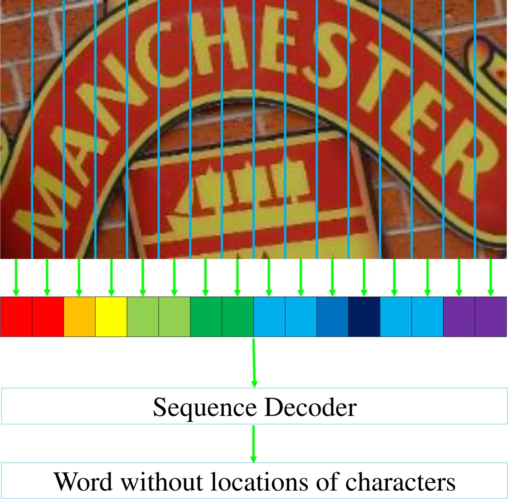

(a)

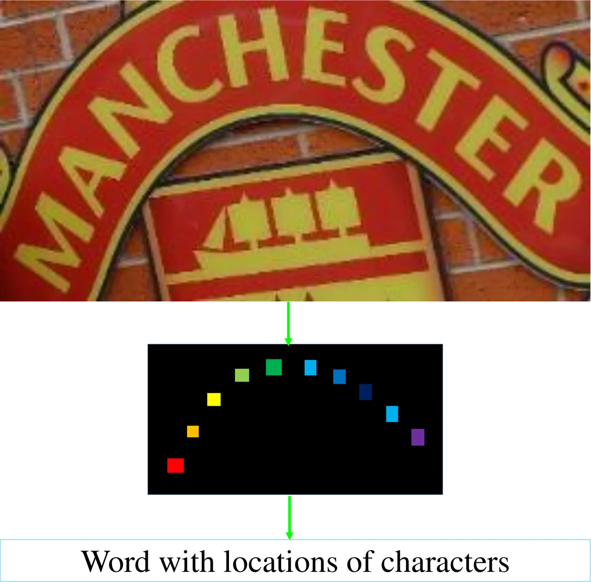

(b)

Figure 1: Illustration of text recognition in one-dimensional and
two-dimensional spaces. (a) shows the recognition procedures of
sequence-based methods. (b) presents the proposed segmentation-based
method. Different colors mean different character classes.

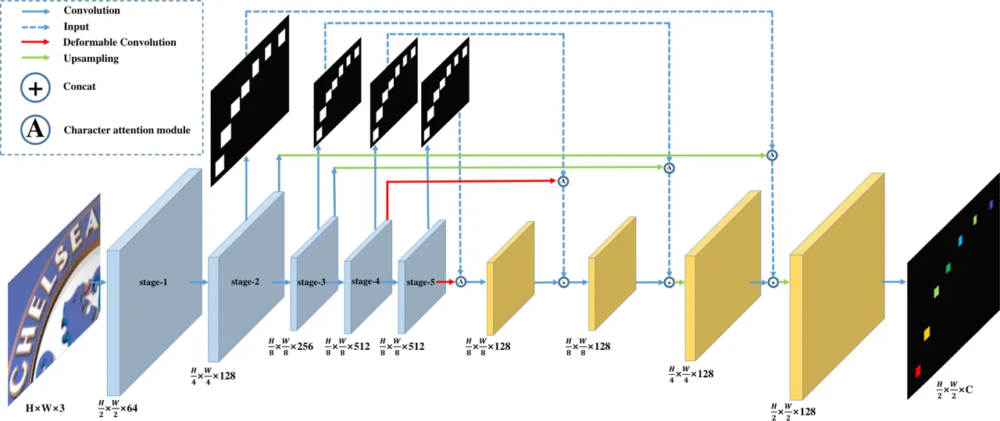

Figure 2: Illustration of the CA-FCN. The blue feature maps in the left
are inherited from the VGG-16 backbone; The yellow feature maps in the
right are extra layers. H, W mean the height and width of the input
image; C is the number of classes.

As discussed above, the limitations of sequence-based methods are mainly
caused by the difference between the one-dimensional distribution of
feature sequences and the two-dimensional distribution of text in scene
images. To overcome these limitations, we tackle the scene text
recognition problem in a new and natural perspective. We propose to
directly predict the text in a two-dimensional space instead of a
one-dimensional sequence. Inspired by FCN \[\citeauthoryearLong,
Shelhamer, and Darrell2015\], a Character Attention Fully Convolutional
Network (CA-FCN) is proposed to predict the characters at pixel level.
Then the word, as well as the location of each character, can be
obtained by a word formation module, as shown in Fig. 1b. In this way,
the procedures of compressing and slicing the features, which are widely
used in the sequence-based methods, are avoided. Profiting from the
higher dimensional perspective, the proposed method is much more robust
than the previous sequence-based methods in terms of text shapes,
background noises, and imprecise localizations from the detection
stage \[\citeauthoryearLiao et al.2017, \citeauthoryearLiao, Shi, and
Bai2018, \citeauthoryearLiao et al.2018\]. Character-level annotations
are needed in our proposed method. However, the character annotations
are free of labor because only public synthetic data is used in the
training period, where the annotations are easy to obtain.

The contributions of this paper can be summarized as follows: (1) A
totally different perspective for recognizing scene text is proposed.
Different from the recent works which treat the text recognition problem
as a sequence recognition problem in one-dimensional space, we propose
to solve the problem in two-dimensional space. (2) We devise character
attention FCN for scene text recognition. To the best of our knowledge,
which can deal with images of arbitrary height and width, as well as
naturally recognize text in various shapes, including but not limited to
oriented and curve shapes. (3) The proposed method achieves
state-of-the-art performance on regular datasets and outperforms the
existing methods with a large margin on irregular datasets. (4) We
investigate the network’s robustness to imprecise localization in the
text detection phase for the first time. This problem is important in
real-world applications but was previously ignored. Experiments show
that the proposed method is more robust to imprecise localization (see .
Ablation study).

## Related Work

Traditionally, scene text recognition systems firstly detect each
character, using binarization or sliding-window operation, then
recognize these characters as a word. Binarization-based methods, such
as Extremal Regions \[\citeauthoryearNovikova et al.2012\] and Niblack’s
adaptive binarization \[\citeauthoryearBissacco et al.2013\], find
character pixels after binarization. However, text in the natural scene
image may have varying backgrounds, fonts, colors or uneven illumination
and so on, which binarization based methods can hardly handle. Sliding
window methods use multi-scale sliding window strategy to localize
characters from the text image directly, such as Random
Ferns \[\citeauthoryearWang, Babenko, and Belongie2011\], Integer
Programming \[\citeauthoryearSmith, Feild, and Learned-Miller2011\] and
Convolutional Neural Network (CNN) \[\citeauthoryearJaderberg, Vedaldi,
and Zisserman2014\]. For the word recognition stage, common methods are
integrating contextual information with character classification scores,
such as Pictorial Structure models, Bayesian inference, and Conditional
Random Field (CRF), which are employed in \[\citeauthoryearWang,
Babenko, and Belongie2011, \citeauthoryearWeinman, Learned-Miller, and
Hanson2009, \citeauthoryearMishra, Alahari, and Jawahar2012a,
\citeauthoryearMishra, Alahari, and Jawahar2012b, \citeauthoryearShi et
al.2013\].

Inspired by speech recognition, recent works designed an encoder-decoder
framework, where text in images are encoded into feature sequences and
then decoded as characters. With the development of the deep neural
network, convolutional features are extracted at encoder stage, and then
RNN or CNN network is applied to decode these features, then CTC is used
to form the final word. This framework was proposed by
\[\citeauthoryearShi, Bai, and Yao2017\]. Later they also developed an
attention-based STN for rectifying text distortion, which is useful to
recognize curved scene text \[\citeauthoryearShi et al.2016\]. Based on
this framework, subsequent works \[\citeauthoryearHe et al.2016,
\citeauthoryearWu et al.2016, \citeauthoryearLiu, Chen, and Wong2018\]
also focus on irregular scene text.

The encoder-decoder framework has dominated current text recognition
works. Many systems based on this framework have achieved
state-of-the-art performance. However, text in scene images are
distributed in a two-dimensional space, which is different from speech.
The encoder-decoder framework just considers them as one-dimensional
sequences, bringing some problems. For example, compressing a text image
into a feature sequence may lose key information and add extra noise,
especially when the text is curved or seriously distorted.

There are some works that tried to improve some disadvantages of the
encoder-decoder framework. \[\citeauthoryearBai et al.2018\] found that
when considering the scene text recognition problem under the
attention-based encoder-decoder framework, the misalignment between the
ground truth strings and the attention’s output sequences of the
probability distribution, which is caused by missing or superfluous
characters, will confuse and mislead the training process. To handle
this problem, they propose a method called edit probability which
considered losses including not only the probability distribution but
also the possible occurrences of missing/superfluous characters.
\[\citeauthoryearCheng et al.2018\] aimed to handle oriented text and
realized that it is hard for the current encoder-decoder framework to
capture the deep features of the oriented text. To solve this problem,
they encode the input image to four feature sequences of four directions
to extract scene text features in those directions. \[\citeauthoryearLyu
et al.2018\] proposed an instance segmentation model for word spotting,
which uses an FCN-based method in its recognition part. However, it
focused on the end-to-end word spotting task and no discussion is
applied to verify the recognition part.

In this paper, we consider text recognition from the two-dimensional
perspective and design a character attention FCN to deal with text
recognition problem, which can naturally avoid those disadvantages of
the encoder-decoder frameworks. For example, compressing a text image
into a feature sequence may lose key information and add extra noise,
especially when the text is curved or seriously distorted. The proposed
method obtains high accuracy on both regular and irregular text,
Meanwhile, it is also robust to imprecise localization in the text
detection phase.

## Methodology

### Overview

The whole architecture of our proposed method consists of two parts. The
first part is a Character Attention FCN (CA-FCN) which predicts the
characters at pixel level. Another part is a word formation module which
groups and arranges the pixels to form the final word result.

### Character attention FCN

The architecture of CA-FCN is basically a fully convolutional network,
as shown in Fig. 2. We use VGG-16 as the backbone while dropping the
fully connected layers and removing its pooling layers of stage-4 and
stage-5. Besides, a pyramid-like structure \[\citeauthoryearLin et
al.2017\] is adopted to handle varying scales of characters. The final
output is of shape $`\frac{H}{2}\times\frac{W}{2}\times C`$, where
$`H`$, $`W`$ are the height and width of the input image and $`C`$ is
the number of classes including character categories and background. It
can handle text of various shapes by predicting characters in a
two-dimensional space.

#### Character attention module

Attention module plays an important role in our network. Natural scene
text recognition suffers from complex backgrounds, shadow, irrelevant
symbols and so on. Moreover, characters in natural images are usually
crowded, which can hardly be separated. To deal with those problems,
inspired by \[\citeauthoryearWang et al.2017\], we propose a character
attention module to highlight the foreground characters and weaken the
background, as well as separate adjacent characters, as illustrated in
Fig. 2. Attention module is appended to each output layer of VGG16. The
low-level attention models mainly focus on the appearance, such as edge,
color, and texture. And the high-level modules can extract more semantic
information. The character attention module can be expressed as follows:

```math
F_{o}=F_{i}\otimes(1+A) \tag{1}
```

where $`F_{i}`$ and $`F_{o}`$ are the input and output feature map
respectively; $`A`$ indicates the attention map; $`\otimes`$ means
element-wise multiplication. The attention map is generated by two
convolutional layers and a two-class (characters and background)
soft-max function where $`0`$ represents background and $`1`$ indicates
characters. The attention map $`A`$ is broadcast to the same shape as
$`F_{i}`$ to achieve element-wise multiplication. Compared with
\[\citeauthoryearWang et al.2017\], our character attention module uses
a simpler network structure, profiting from the character supervision.
The effectiveness of the character attention module is discussed in Sec.
Ablation study.

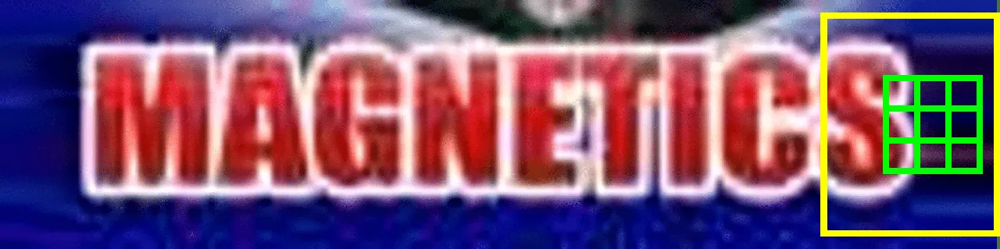

(a)

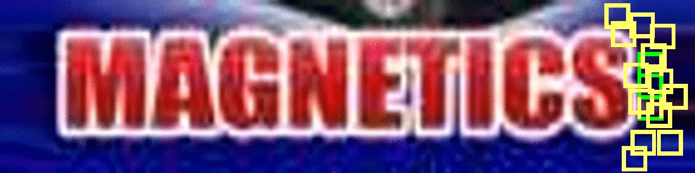

(b)

Figure 3: Illustration of our deformable convolution. (a) normal
convolution; (b) deformable convolution with $`3*1`$ convolution. The
green boxes indicate convolutional kernels. The yellow boxes mean the
regions covered by receptive fields. The receptive fields out of the
image are clipped.

#### Deformable convolution

As shown in Fig. 2, deformable convolution \[\citeauthoryearDai et
al.2017\] is applied in stage-4 and stage-5. The deformable convolution
learns offsets of the convolution kernel, which provides more flexible
receptive fields for the character prediction. The kernel size of
deformable convolution is set to $`3\times 3`$ as default. The kernel
size of the convolution after the deformable convolution is set to
$`3\times 1`$. In Fig. 3, there is a toy description of normal
convolution, the deformable convolution with $`3\times 1`$ convolutional
kernel, as well as their receptive fields. The image in Fig. 3 is an
expanded text image where more background is included in the image.
Since most of the training images are cropped with tight bounding boxes,
and the normal convolution contains a lot of character information due
to the fixed receptive field, it tends to predict the extra background
as a character. However, if deformable convolution and $`3\times 1`$
convolution kernel are applied, with better and more flexible receptive
field, the extra background can be predicted correctly. Note that the
extra background is very common in real-world applications as the
detection results may be inaccurate. Thus, the robustness on expanded
text images is significant. The effectiveness of the deformable
convolution is discussed in Sec. Ablation study by experiments.

### Training

##### Label generation

Let $`b=(x_{min},y_{min},x_{max},y_{max})`$ be the original bounding
boxes of characters, which can be expressed as the minimum axis-aligned
rectangle boxes that covers the characters. The ground truth character
regions $`g=(x_{min}^{g},y_{min}^{g},x_{max}^{g},y_{max}^{g})`$ can be
calculated as follows:

```math
\begin{split}w&=x_{max}-x_{min}\\
h&=y_{max}-y_{min}\\
x_{min}^{g}&=(x_{min}+x_{max}-w\times r)/2\\
y_{min}^{g}&=(y_{min}+y_{max}-h\times r)/2\\
x_{max}^{g}&=(x_{min}+x_{max}+w\times r)/2\\
y_{max}^{g}&=(y_{min}+y_{max}+h\times r)/2\end{split} \tag{2}
```

where $`r`$ is the shrink ratio of the character regions. We shrink the
character regions because the adjacent characters tend to be overlapped
without shrinking. The shrink process can reduce the difficulty of the
word formation. Specifically, we set $`r`$ to $`0.5`$ and $`0.25`$ for
the attention supervision and the final output supervision respectively.

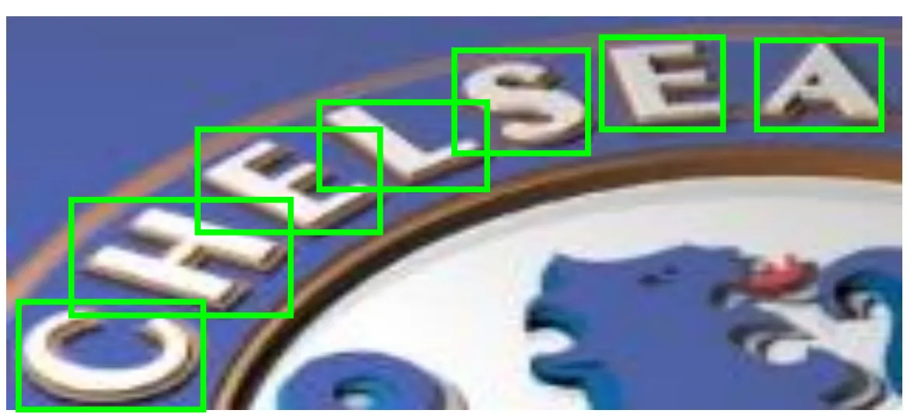

(a)

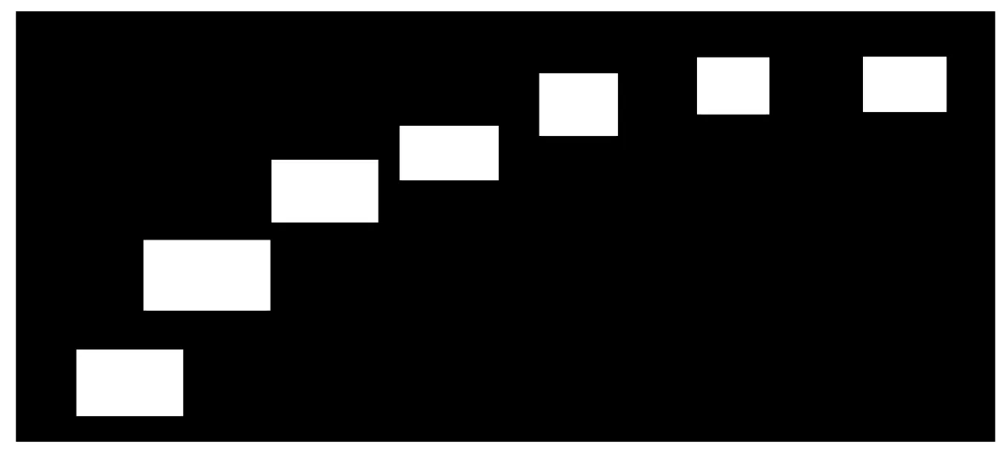

(b)

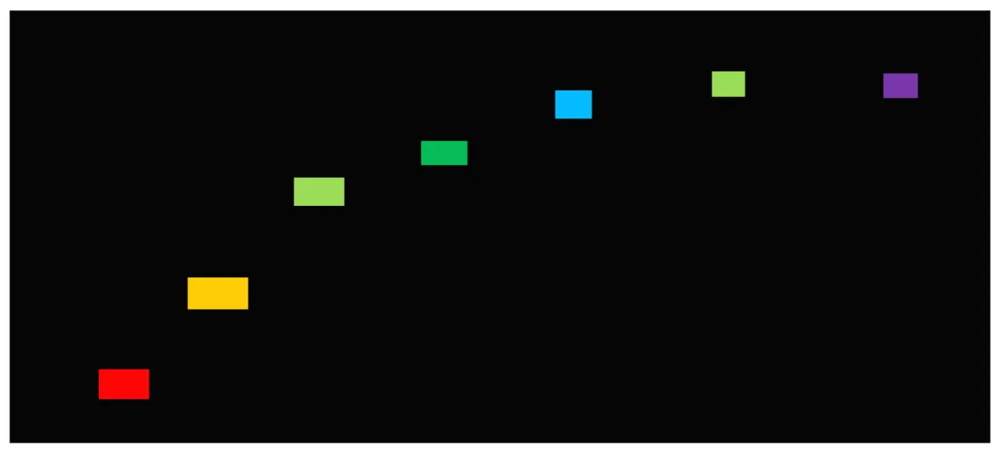

(c)

Figure 4: Illustration of ground truth generation. (a) Original bounding
boxes; (b) Ground truth for character attention; (c) Ground truth for
character prediction, where different colors represent different
character classes.

##### Loss function

The loss function is a weighted sum of the character prediction loss
function $`L_{p}`$ and the character attention loss function $`L_{a}`$:

```math
L=L_{p}+\alpha\sum_{s=2}^{5}L_{a}^{s} \tag{3}
```

where $`s`$ indicates the index of the stages, as shown in Fig. 2;
$`\alpha`$ is empirically set to $`1.0`$.

The final output of the CA-FCN is of shape
$`\frac{H}{2}\times\frac{W}{2}\times C`$, where $`H`$, $`W`$ are the
height and width of an input image respectively. $`C`$ is the number of
classes including character classes and background. Assume that
$`X_{i,j,c}`$ is one of the element of the output map, where
$`i\in\{1,...,\frac{H}{2}\}`$, $`j\in\{1,...,\frac{W}{2}\}`$, and
$`c\in\{0,1,...,C-1\}`$; $`Y_{i,j}\in\{0,1,...,C-1\}`$ indicates the
corresponding class label. The prediction loss can be calculated as
follows:

```math
\displaystyle L_{p}= \displaystyle-\frac{4}{H\times W}\sum_{i=1}^{H/2}\sum_{j=1}^{W/2}W_{i,j}( \tag{4}
```

```math
\displaystyle\sum_{c=0}^{C-1}(Y_{i,j}==c)log(\frac{e^{X_{i,j,c}}}{\sum_{k=0}^{C-1}e^{X_{i,j,k}}})),
```

where $`W_{i,j}`$ is the corresponding weight of each pixel. Assume that
$`N=\frac{H}{2}\times\frac{W}{2}`$ and $`N_{neg}`$ is the number of
background pixels. The weight can be calculated as follows:

```math
W_{i,j}=\begin{cases}N_{neg}/(N-N_{neg})&\text{if }Y_{i,j}>0,\\
1&\text{otherwise}\end{cases} \tag{5}
```

The character attention loss function is a binary cross entropy loss
function which take all characters labels as $`1`$, background label as
$`0`$:

```math
\displaystyle L_{a}^{s}= \displaystyle-\frac{4}{H_{s}\times W_{s}}\sum_{i=1}^{H_{s}/2}\sum_{j=1}^{W_{s}/2}( \tag{6}
```

```math
\displaystyle\sum_{c=0}^{1}(Y_{i,j}==c)log(\frac{e^{X_{i,j,c}}}{\sum_{k=0}^{1}e^{X_{i,j,k}}}),
```

where $`H_{s}`$ and $`W_{s}`$ are the height and width of the feature
map in the corresponding stage $`s`$ respectively.

### Word formation module

The word formation module converts the accurate, two-dimensional
character maps predicted by CA-FCN into character sequence. As shown in
Fig. 5, we firstly transform the character prediction map into a binary
map with a threshold to extract the corresponding character regions;
then, we calculate the average values of each region for $`C`$ classes
and assign the class with the largest average value to the corresponding
region; finally, the word is formed by sorting the regions from left to
right. In this way, both the word and location of each character are
produced. The word formation module assumes that words are roughly
sorted from left to right, which may not work in certain scenarios.
However, if necessary, a learnable component can be plugged into CA-FCN.
The word formation module is simple yet effective, with only one
hyper-parameter (the threshold to form binary map), which is set to
$`240/255`$ for all experiments.

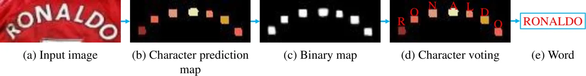

Figure 5: Illustration of the word formation module.

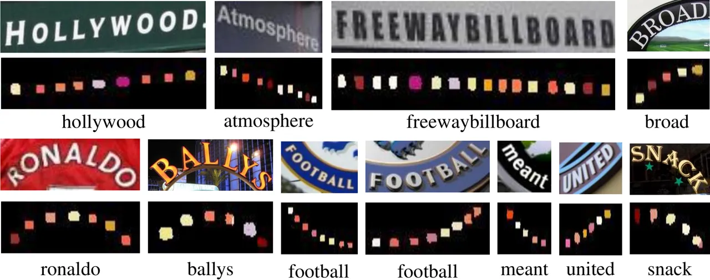

Figure 6: Visualization of character prediction maps on IIIT and CUTE.
The character prediction map generated by the CA-FCN is visualized with
colors.

## Experiments

### Datasets

Our proposed CA-FCN is purely trained on the synthetic datasets without
real-world images. The trained model, without further fine-tuning, was
evaluated on 4 benchmarks including regular and irregular text datasets.

SynthText is a synthetic text dataset proposed in
\[\citeauthoryearGupta, Vedaldi, and Zisserman2016\]. It contains
800,000 training images which are aimed at text detection. We crop them
based on their word bounding boxes. It generates about 7 million images
for text recognition. These images are with character-level annotations.

IIIT5k-Words (IIIT) \[\citeauthoryearMishra, Alahari, and Jawahar2012b\]
consists of 3000 test images collected from the web. It provides two
lexicons for each image in the dataset, which contains 50 words and 1000
words respectively.

Street View Text (SVT) \[\citeauthoryearWang, Babenko, and
Belongie2011\] comes from the Google Street View. The test set consists
of 647 images. It is challenging due to its low resolution and noises. A
50-word lexicon is given for each image.

ICDAR 2013 (IC13) \[\citeauthoryearKaratzas et al.2013\] contains 1015
images and no lexicon is provided. We remove images that contain
non-alphanumeric characters or have less than three characters,
following previous works.

CUTE \[\citeauthoryearRisnumawan et al.2014\] is a dataset consists of
288 images with a lot of curved text. It is challenging because the
shapes vary hugely. No lexicon is provided.

### Implementation details

#### Training

Since our network is fully convolutional, there is no restriction on the
size of input images. We adopt multi-scale training to make our model
more robust. The input images are randomly resized to $`32\times 128`$,
$`48\times 192`$, and $`64\times 256`$. Besides, data augmentation is
also applied in the training period, including random rotation, hue,
brightness, contrast, and blur. Specifically, we randomly rotate the
image with an angle in the range of $`[-15^{\circ},15^{\circ}]`$. We use
Adam \[\citeauthoryearKingma and Ba2014\] to optimize our training with
the initial learning rate $`10^{-4}`$. The learning rate is decreased to
$`10^{-5}`$ and $`10^{-6}`$ at epoch 3 and epoch 4. The model is totally
trained for about 5 epochs. The number of character classes is set to
$`38`$, including $`26`$ alphabet, $`10`$ digitals, $`1`$ special
character which represents those characters out of alphabet and
digitals, and $`1`$ background.

#### Testing

At runtime, images are resized to $`H_{t}\times W_{t}`$, where $`H_{t}`$
is fixed to $`64`$ and $`W_{t}`$ is calculated as follows:

```math
W_{t}=\begin{cases}W*H_{t}/H&\text{if }W/H>4,\\
256&\text{otherwise}\end{cases} \tag{7}
```

where $`H`$ and $`W`$ are the height and width of the origin images.

The speed is about $`45`$ FPS on IC13 dataset with a batch size of 1,
where the CA-FCN costs $`0.018`$ second per image and word formation
module costs $`0.004`$ second per image on average. Higher speed can be
achieved if the batch size increases. We test our method with a single
Titan Xp GPU.

|                                                                |      |      |      |      |      |      |      |
| -------------------------------------------------------------- | ---- | ---- | ---- | ---- | ---- | ---- | ---- |
| Methods                                                        | IIIT |      |      | SVT  |      | IC13 | CUTE |
|                                                                | 50   | 1k   | 0    | 50   | 0    | 0    | 0    |
| \[\citeauthoryearWang, Babenko, and Belongie2011\]             | \-   | \-   | \-   | 57.0 | \-   | \-   | \-   |
| \[\citeauthoryearMishra, Alahari, and Jawahar2012a\]           | 64.1 | 57.5 | \-   | 73.2 | \-   | \-   | \-   |
| \[\citeauthoryearWang et al.2012\]                             | \-   | \-   | \-   | 70.0 | \-   | \-   | \-   |
| \[\citeauthoryearAlmazán et al.2014\]                          | 91.2 | 82.1 | \-   | 89.2 | \-   | \-   | \-   |
| \[\citeauthoryearYao et al.2014\]                              | 80.2 | 69.3 | \-   | 75.9 | \-   | \-   | \-   |
| \[\citeauthoryearRodríguez-Serrano, Gordo, and Perronnin2015\] | 76.1 | 57.4 | \-   | 70.0 | \-   | \-   | \-   |
| \[\citeauthoryearJaderberg, Vedaldi, and Zisserman2014\]       | \-   | \-   | \-   | 86.1 | \-   | \-   | \-   |
| \[\citeauthoryearSu and Lu2014\]                               | \-   | \-   | \-   | 83.0 | \-   | \-   | \-   |
| \[\citeauthoryearGordo2015\]                                   | 93.3 | 86.6 | \-   | 91.8 | \-   | \-   | \-   |
| \[\citeauthoryearJaderberg et al.2016\]                        | 97.1 | 92.7 | \-   | 95.4 | 80.7 | 90.8 | \-   |
| \[\citeauthoryearJaderberg et al.2015a\]                       | 95.5 | 89.6 | \-   | 93.2 | 71.7 | 81.8 | \-   |
| \[\citeauthoryearShi, Bai, and Yao2017\]                       | 97.8 | 95.0 | 81.2 | 97.5 | 82.7 | 89.6 | \-   |
| \[\citeauthoryearShi et al.2016\]                              | 96.2 | 93.8 | 81.9 | 95.5 | 81.9 | 88.6 | 59.2 |
| \[\citeauthoryearLee and Osindero2016\]                        | 96.8 | 94.4 | 78.4 | 96.3 | 80.7 | 90.0 | \-   |
| \[\citeauthoryearWang and Hu2017\]                             | 98.0 | 95.6 | 80.8 | 96.3 | 81.5 | \-   | \-   |
| \[\citeauthoryearYang et al.2017\]                             | 97.8 | 96.1 | \-   | 95.2 | \-   | \-   | 69.3 |
| \[\citeauthoryearCheng et al.2017\]                            | 99.3 | 97.5 | 87.4 | 97.1 | 85.9 | 93.3 | \-   |
| \[\citeauthoryearCheng et al.2018\]                            | 99.6 | 98.1 | 87.0 | 96.0 | 82.8 | \-   | 76.8 |
| \[\citeauthoryearBai et al.2018\]                              | 99.5 | 97.9 | 88.3 | 96.6 | 87.5 | 94.4 | \-   |
| Ours                                                           | 99.8 | 98.9 | 92.0 | 98.5 | 82.1 | 91.4 | 78.1 |
| Ours+data                                                      | 99.8 | 98.8 | 91.9 | 98.8 | 86.4 | 91.5 | 79.9 |

Table 1: Results across different methods and datasets. “50” and “1k”
indicate the sizes of the lexicons. “0” means no lexicon. “data”
indicates using extra synthetic data to fine-tune the model.

### Performances on benchmarks

We evaluate our method on several benchmarks to indicate the superiority
of the proposed method. Some results of IIIT and CUTE are visualized in
Fig. 6. As can be seen, our proposed method can handle various shapes of
text.

Quantitative results are listed in Tab. 1. Compared to previous methods,
our proposed method achieves state-of-the-art performance on most of
those benchmarks. More specifically, “Ours” outperforms the previous
state-of-the-art by $`3.7`$ percents on IIIT without lexicons. On
irregular text dataset CUTE, $`3.1`$ percents improvement is achieved by
“Ours”. Note that no extra training data for curved text is included to
achieve this performance. Comparable results are also performed on other
datasets, including SVT, IC13.

The training data of \[\citeauthoryearCheng et al.2017\] consist of two
synthetic datasets including Synth90k \[\citeauthoryearJaderberg et
al.2014\] and SynthText \[\citeauthoryearGupta, Vedaldi, and
Zisserman2016\]. The former is generated according to a large lexicon
which contains the lexicon of SVT and ICDAR, while the latter uses a
normal corpus, where the distribution of words are not balanced. To
fairly compared with \[\citeauthoryearCheng et al.2017\], we also
generate extra 4 million synthetic images using the algorithm of
SynthText with the lexicon used in Synth90k. As shown in Tab. 1, after
fine-tuning with the extra data, “Ours+data” also outperforms
\[\citeauthoryearCheng et al.2017\] on SVT.

\[\citeauthoryearBai et al.2018\] improves  \[\citeauthoryearCheng et
al.2017, \citeauthoryearShi et al.2016\] by solving their misalignment
problem and achieves excellent results in regular text recognition.
However, it may fail in irregular text benchmarks such as CUTE due to
its one-dimensional perspective. Moreover, we argue that our method can
be further improved if the idea of \[\citeauthoryearBai et al.2018\] is
well adapted to our word formulation module. Nevertheless, our method
outperforms \[\citeauthoryearBai et al.2018\] on most of the benchmarks
in Tab. 1, especially on IIIT and CUTE.

\[\citeauthoryearCheng et al.2018\] focuses on dealing with
arbitrary-oriented text by introducing four one-dimensional feature
sequences with different directions adaptively. Our method is more
superior in recognizing the text of irregular shapes such as curve
shape. As shown in Tab. 1, our method outperforms \[\citeauthoryearCheng
et al.2018\] on all benchmarks.

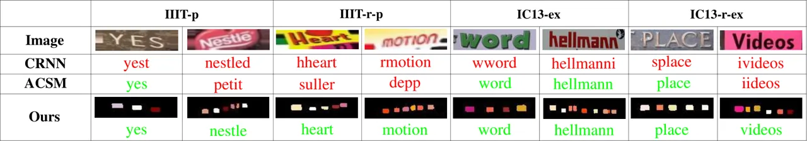

Figure 7: Visualization of the character prediction maps on expanded
datasets. Red: wrong results; Green: correct results.

|                               |      |        |      |       |          |       |       |      |         |      |       |           |       |       |
| ----------------------------- | ---- | ------ | ---- | ----- | -------- | ----- | ----- | ---- | ------- | ---- | ----- | --------- | ----- | ----- |
| Methods                       | IIIT | IIIT-p |      |       | IIIT-r-p |       |       | IC13 | IC13-ex |      |       | IC13-r-ex |       |       |
|                               | ac   | ac     | gap  | ratio | ac       | gap   | ratio | ac   | ac      | gap  | ratio | ac        | gap   | ratio |
| CRNN                          | 81.2 | 76.0   | -5.2 | 6.4%  | 72.4     | -8.8  | 10.8% | 89.6 | 81.9    | -7.7 | 8.6%  | 76.7      | -12.9 | 14.4% |
| ACSM                          | 85.4 | 79.1   | -6.3 | 7.4%  | 74.9     | -10.5 | 12.3% | 88.0 | 81.2    | -6.8 | 7.7%  | 70.0      | -18.0 | 20.5% |
| baseline                      | 90.5 | 87.0   | -3.5 | 3.9%  | 85.7     | -4.8  | 5.3%  | 90.5 | 83.2    | -7.3 | 8.1%  | 82.3      | -8.2  | 9.1%  |
| baseline + attention          | 91.0 | 86.7   | -4.3 | 4.7%  | 85.7     | -5.3  | 5.8%  | 90.1 | 85.6    | -4.5 | 5.0%  | 83.0      | -7.1  | 7.9%  |
| baseline + deform             | 91.4 | 87.6   | -3.8 | 4.2%  | 86.7     | -4.7  | 5.1%  | 91.1 | 87.4    | -3.7 | 4.1%  | 84.2      | -6.9  | 7.6%  |
| baseline + attention + deform | 92.0 | 89.3   | -2.7 | 2.9%  | 87.6     | -4.4  | 4.8%  | 91.4 | 87.2    | -4.2 | 4.6%  | 83.8      | -7.6  | 8.3%  |

Table 2: Experimental results on expanded datasets. “ac”: accuracy;
“gap”: the gap between the original dataset; “ratio” indicates the
decreasing ratio compared to the accuracy on the original dataset.

### Ablation study

Scene text recognition is usually a following step of scene text
detection, whose results may be not as accurate as expected. Thus,
performances of text spotting systems in real-world applications are
significantly affected by the robustness of text recognition algorithms
on expanded images. We conduct experiments with expanded datasets to
show the effect of text bounding box variance on recognition and prove
the robustness of our method.

For the datasets which have the original background, such as IC13, we
expand their bounding boxes and then crop them from the original images.
If no extra background is provided like IIIT, padding by repeating the
border pixels is applied to these images. The expanded datasets are
described below:

IIIT-p Padding the images in IIIT with extra $`10\%`$ height vertically
and $`10\%`$ width horizontally by repeating the border pixels.

IIIT-r-p Separately stretching the four vertexes of the images in IIIT
with a random scale up to $`20\%`$ of height and width respectively;
border pixels are repeated to fill the quadrilateral images; images are
transformed back to axis-aligned rectangles.

IC13-ex Expanding the bounding boxes of the images in IC13 to expanded
rectangles with extra $`10\%`$ height and width before cropping.

IC13-r-ex Expanding the bounding boxes of the images in IC13 randomly
with a maximum $`20\%`$ of width and height to form expanded
quadrilaterals; The pixels in axis-aligned circumscribed rectangles of
those images are cropped.

We compare our method with two representative sequence-based models
including CRNN \[\citeauthoryearShi, Bai, and Yao2017\] and Attention
Convolutional Sequence Model (ACSM) \[\citeauthoryearGao et al.2017\].
The model of CRNN is provided by its authors and the model of
\[\citeauthoryearGao et al.2017\] is re-implemented by ourself with the
same training data as ours. Qualitative results of the three methods are
visualized in Fig. 7. As can be observed, the sequence-based models
usually predict extra characters if the images are expanded while CA-FCN
is stable and robust.

The quantitative results are listed in Tab. 2. Compared to the
sequence-based models, our proposed method is more robust among these
expanding datasets. For example, on IIIT-p dataset, the gap ratio of
CRNN is $`6.4\%`$ while ours is only $`2.6\%`$. Note that even though
our performances on the standard datasets are higher, the gaps of ours
are still much smaller than CRNN. As shown in Tab. 2, both the
deformable module and the attention module can improve the performance
and the former also contributes to the robustness of the model. It
indicates the effectiveness of the deformable convolution and the
character attention module.

The possible reasons that our method is more robust than previous
sequence-based models on expanded images could be: Sequence-based models
are in one-dimensional perspective, which are hard to endure extra
background because the background noises are easy to encode into the
feature sequence. In contrast, our method predicts the characters in a
two-dimensional space, where both the characters and the background are
the targeted predicting objects. The extra background is less likely to
mislead the prediction of the characters.

## Conclusion

In this paper, we have presented a method called Character Attention FCN
(CA-FCN) for scene text recognition, which models the problem in a
two-dimensional fashion. By performing character classification at each
pixel location, the algorithm can effectively recognize irregular as
well as regular text instances. Experiments show that the proposed model
outperforms existing methods on datasets with regular and irregular
text. We also analyzed the impact of imprecise text localization to the
performances of text recognition algorithms and proved that our method
is much more robust. For future research, we will make the word
formation module learnable and build an end-to-end text spotting system.

#### Acknowledgments

This work was supported by National Key R&D Program of China No.
2018YFB1004600, NSFC 61733007, to Dr. Xiang Bai by the National Program
for Support of Top-notch Young Professionals and the Program for HUST
Academic Frontier Youth Team.

## References

- \[\citeauthoryearAlmazán et al.2014\] Almazán, J.; Gordo, A.; Fornés,
  A.; and Valveny, E. 2014. Word spotting and recognition with embedded
  attributes. IEEE Trans. Pattern Anal. Mach. Intell. 36(12):2552–2566.
- \[\citeauthoryearBai et al.2018\] Bai, F.; Cheng, Z.; Niu, Y.; Pu, S.;
  and Zhou, S. 2018. Edit probability for scene text recognition. In
  Proc. CVPR.
- \[\citeauthoryearBissacco et al.2013\] Bissacco, A.; Cummins, M.;
  Netzer, Y.; and Neven, H. 2013. Photoocr: Reading text in
  uncontrolled conditions. In Proc. ICCV, 785–792.
- \[\citeauthoryearCheng et al.2017\] Cheng, Z.; Bai, F.; Xu, Y.; Zheng,
  G.; Pu, S.; and Zhou, S. 2017. Focusing attention: Towards accurate
  text recognition in natural images. In Proc. ICCV, 5086–5094.
- \[\citeauthoryearCheng et al.2018\] Cheng, Z.; Xu, Y.; Bai, F.; Niu,
  Y.; Pu, S.; and Zhou, S. 2018. Aon: Towards arbitrarily-oriented text
  recognition. In Proc. CVPR, 5571–5579.
- \[\citeauthoryearDai et al.2017\] Dai, J.; Qi, H.; Xiong, Y.; Li, Y.;
  Zhang, G.; Hu, H.; and Wei, Y. 2017. Deformable convolutional
  networks. In Proc. ICCV, 764–773.
- \[\citeauthoryearGao et al.2017\] Gao, Y.; Chen, Y.; Wang, J.; and
  Lu, H. 2017. Reading scene text with attention convolutional sequence
  modeling. CoRR abs/1709.04303.
- \[\citeauthoryearGordo2015\] Gordo, A. 2015. Supervised mid-level
  features for word image representation. In CVPR, 2956–2964.
- \[\citeauthoryearGraves et al.2006\] Graves, A.; Fernández, S.; Gomez,
  F. J.; and Schmidhuber, J. 2006. Connectionist temporal
  classification: labelling unsegmented sequence data with recurrent
  neural networks. In Proc. ICML, 369–376.
- \[\citeauthoryearGupta, Vedaldi, and Zisserman2016\] Gupta, A.;
  Vedaldi, A.; and Zisserman, A. 2016. Synthetic data for text
  localisation in natural images. In Proc. CVPR, 2315–2324.
- \[\citeauthoryearHe et al.2016\] He, P.; Huang, W.; Qiao, Y.; Loy,
  C. C.; and Tang, X. 2016. Reading scene text in deep convolutional
  sequences. In Proc. AAAI, volume 16, 3501–3508.
- \[\citeauthoryearHochreiter and Schmidhuber1997\] Hochreiter, S., and
  Schmidhuber, J. 1997. Long short-term memory. Neural computation
  9(8):1735–1780.
- \[\citeauthoryearJaderberg et al.2014\] Jaderberg, M.; Simonyan, K.;
  Vedaldi, A.; and Zisserman, A. 2014. Synthetic data and artificial
  neural networks for natural scene text recognition. CoRR
  abs/1406.2227.
- \[\citeauthoryearJaderberg et al.2015a\] Jaderberg, M.; Simonyan, K.;
  Vedaldi, A.; and Zisserman, A. 2015a. Deep structured output learning
  for unconstrained text recognition. In Proc. ICLR.
- \[\citeauthoryearJaderberg et al.2015b\] Jaderberg, M.; Simonyan, K.;
  Zisserman, A.; et al. 2015b. Spatial transformer networks. In Proc.
  NIPS, 2017–2025.
- \[\citeauthoryearJaderberg et al.2016\] Jaderberg, M.; Simonyan, K.;
  Vedaldi, A.; and Zisserman, A. 2016. Reading text in the wild with
  convolutional neural networks. IJCV 116(1):1–20.
- \[\citeauthoryearJaderberg, Vedaldi, and Zisserman2014\] Jaderberg,
  M.; Vedaldi, A.; and Zisserman, A. 2014. Deep features for text
  spotting. In Proc. ECCV, 512–528.
- \[\citeauthoryearKaratzas et al.2013\] Karatzas, D.; Shafait, F.;
  Uchida, S.; Iwamura, M.; i Bigorda, L. G.; Mestre, S. R.; Mas, J.;
  Mota, D. F.; Almazan, J. A.; and de las Heras, L. P. 2013. Icdar 2013
  robust reading competition. In Proc. ICDAR, 1484–1493.
- \[\citeauthoryearKingma and Ba2014\] Kingma, D. P., and Ba, J. 2014.
  Adam: A method for stochastic optimization. CoRR abs/1412.6980.
- \[\citeauthoryearLee and Osindero2016\] Lee, C., and Osindero, S. 2016. Recursive recurrent nets with attention modeling for OCR in the
  wild. In Proc. CVPR, 2231–2239.
- \[\citeauthoryearLiao et al.2017\] Liao, M.; Shi, B.; Bai, X.; Wang,
  X.; and Liu, W. 2017. Textboxes: A fast text detector with a single
  deep neural network. In Proc. AAAI, 4161–4167.
- \[\citeauthoryearLiao et al.2018\] Liao, M.; Zhu, Z.; Shi, B.; Xia,
  G.-s.; and Bai, X. 2018. Rotation-sensitive regression for oriented
  scene text detection. In Proc. CVPR, 5909–5918.
- \[\citeauthoryearLiao, Shi, and Bai2018\] Liao, M.; Shi, B.; and
  Bai, X. 2018. Textboxes++: A single-shot oriented scene text
  detector. IEEE Trans. Image Processing 27(8):3676–3690.
- \[\citeauthoryearLin et al.2017\] Lin, T.; Dollár, P.; Girshick,
  R. B.; He, K.; Hariharan, B.; and Belongie, S. J. 2017. Feature
  pyramid networks for object detection. In Proc. CVPR, 936–944.
- \[\citeauthoryearLiu, Chen, and Wong2018\] Liu, W.; Chen, C.; and
  Wong, K. K. 2018. Char-net: A character-aware neural network for
  distorted scene text recognition. In Proc. AAAI, 7154–7161.
- \[\citeauthoryearLong, Shelhamer, and Darrell2015\] Long, J.;
  Shelhamer, E.; and Darrell, T. 2015. Fully convolutional networks for
  semantic segmentation. In Proc. CVPR, 3431–3440.
- \[\citeauthoryearLyu et al.2018\] Lyu, P.; Liao, M.; Yao, C.; Wu, W.;
  and Bai, X. 2018. Mask textspotter: An end-to-end trainable neural
  network for spotting text with arbitrary shapes. In Proc. ECCV, 71–88.
- \[\citeauthoryearMishra, Alahari, and Jawahar2012a\] Mishra, A.;
  Alahari, K.; and Jawahar, C. V. 2012a. Scene text recognition using
  higher order language priors. In Proc. BMVC, 1–11.
- \[\citeauthoryearMishra, Alahari, and Jawahar2012b\] Mishra, A.;
  Alahari, K.; and Jawahar, C. V. 2012b. Top-down and bottom-up cues for
  scene text recognition. In Proc. CVPR, 2687–2694.
- \[\citeauthoryearNovikova et al.2012\] Novikova, T.; Barinova, O.;
  Kohli, P.; and Lempitsky, V. S. 2012. Large-lexicon
  attribute-consistent text recognition in natural images. In Proc.
  ECCV, 752–765.
- \[\citeauthoryearRisnumawan et al.2014\] Risnumawan, A.; Shivakumara,
  P.; Chan, C. S.; and Tan, C. L. 2014. A robust arbitrary text
  detection system for natural scene images. Expert Syst. Appl.
  41(18):8027–8048.
- \[\citeauthoryearRodríguez-Serrano, Gordo, and Perronnin2015\]
  Rodríguez-Serrano, J. A.; Gordo, A.; and Perronnin, F. 2015. Label
  embedding: A frugal baseline for text recognition. Int. J. Comput.
  Vision 113(3):193–207.
- \[\citeauthoryearRong, Yi, and Tian2016\] Rong, X.; Yi, C.; and
  Tian, Y. 2016. Recognizing text-based traffic guide panels with
  cascaded localization network. In Proc. ECCV Workshops, 109–121.
- \[\citeauthoryearShi, Bai, and Yao2017\] Shi, B.; Bai, X.; and Yao, C. 2017. An end-to-end trainable neural network for image-based sequence
  recognition and its application to scene text recognition. IEEE Trans.
  Pattern Anal. Mach. Intell. 39(11):2298–2304.
- \[\citeauthoryearShi et al.2013\] Shi, C.; Wang, C.; Xiao, B.; Zhang,
  Y.; Gao, S.; and Zhang, Z. 2013. Scene text recognition using
  part-based tree-structured character detection. In Proc. CVPR,
  2961–2968.
- \[\citeauthoryearShi et al.2016\] Shi, B.; Wang, X.; Lyu, P.; Yao, C.;
  and Bai, X. 2016. Robust scene text recognition with automatic
  rectification. In Proc. CVPR, 4168–4176.
- \[\citeauthoryearSmith, Feild, and Learned-Miller2011\] Smith, D. L.;
  Feild, J. L.; and Learned-Miller, E. G. 2011. Enforcing similarity
  constraints with integer programming for better scene text
  recognition. In Proc. CVPR, 73–80.
- \[\citeauthoryearSu and Lu2014\] Su, B., and Lu, S. 2014. Accurate
  scene text recognition based on recurrent neural network. In Proc.
  ACCV, 35–48.
- \[\citeauthoryearWang and Hu2017\] Wang, J., and Hu, X. 2017. Gated
  recurrent convolution neural network for OCR. In Proc. NIPS, 334–343.
- \[\citeauthoryearWang, Babenko, and Belongie2011\] Wang, K.; Babenko,
  B.; and Belongie, S. J. 2011. End-to-end scene text recognition. In
  Proc. ICCV, 1457–1464.
- \[\citeauthoryearWang et al.2012\] Wang, T.; Wu, D. J.; Coates, A.;
  and Ng, A. Y. 2012. End-to-end text recognition with convolutional
  neural networks. In Proc. ICPR, 3304–3308.
- \[\citeauthoryearWang et al.2017\] Wang, F.; Jiang, M.; Qian, C.;
  Yang, S.; Li, C.; Zhang, H.; Wang, X.; and Tang, X. 2017. Residual
  attention network for image classification. In Proc. CVPR, 6450–6458.
- \[\citeauthoryearWeinman, Learned-Miller, and Hanson2009\] Weinman,
  J. J.; Learned-Miller, E. G.; and Hanson, A. R. 2009. Scene text
  recognition using similarity and a lexicon with sparse belief
  propagation. IEEE Trans. Pattern Anal. Mach. Intell. 31(10):1733–1746.
- \[\citeauthoryearWu et al.2016\] Wu, R.; Yang, S.; Leng, D.; Luo, Z.;
  and Wang, Y. 2016. Random projected convolutional feature for scene
  text recognition. In Proc. ICFHR, 132–137.
- \[\citeauthoryearYang et al.2017\] Yang, X.; He, D.; Zhou, Z.; Kifer,
  D.; and Giles, C. L. 2017. Learning to read irregular text with
  attention mechanisms. In Proc. IJCAI, 3280–3286.
- \[\citeauthoryearYao et al.2014\] Yao, C.; Bai, X.; Shi, B.; and
  Liu, W. 2014. Strokelets: A learned multi-scale representation for
  scene text recognition. In Proc. CVPR, 4042–4049.
- \[\citeauthoryearZhu et al.2018\] Zhu, Y.; Liao, M.; Yang, M.; and
  Liu, W. 2018. Cascaded segmentation-detection networks for text-based
  traffic sign detection. IEEE Trans. Intelligent Transportation Systems
  19(1):209–219.
- \[\citeauthoryearZhu, Yao, and Bai2016\] Zhu, Y.; Yao, C.; and Bai, X. 2016. Scene text detection and recognition: Recent advances and
  future trends. Frontiers of Computer Science 10(1):19–36.
