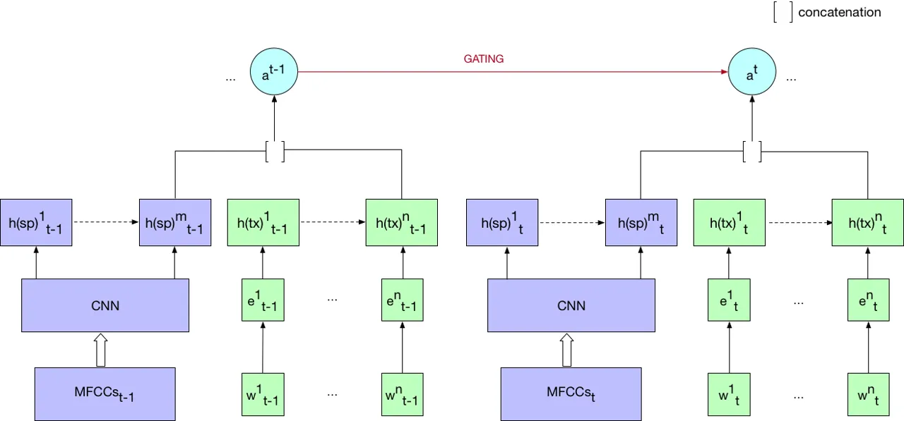
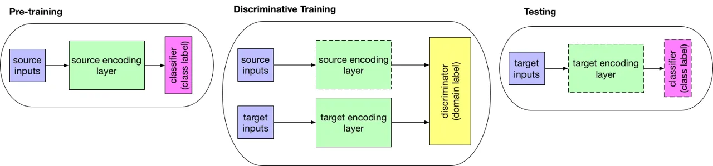

# Exploring Textual and Speech information in Dialogue Act Classification with Speaker Domain Adaptation

Xuanli He^(\*) Quan Hung Tran^(\*) William Havard Monash University
Monash University Univ. Grenoble Alpes xuanli.he1@monash.edu
hung.tran@monash.edu william.havard@gmail.com Laurent Besacier Ingrid
Zukerman Gholamreza Haffari Univ. Grenoble Alpes Monash University
Monash University laurent.besacier@imag.fr ingrid.zukerman@monash.edu
gholamreza.haffari@monash.edu

###### Abstract

In spite of the recent success of Dialogue Act (DA) classification, the
majority of prior works focus on text-based classification with oracle
transcriptions, i.e. human transcriptions, instead of Automatic Speech
Recognition (ASR)’s transcriptions. In spoken dialog systems, however,
the agent would only have access to noisy ASR transcriptions, which may
further suffer performance degradation due to domain shift. In this
paper, we explore the effectiveness of using both acoustic and textual
signals, either oracle or ASR transcriptions, and investigate speaker
domain adaptation for DA classification. Our multimodal model proves to
be superior to the unimodal models, particularly when the oracle
transcriptions are not available. We also propose an effective method
for speaker domain adaptation, which achieves competitive results.

^(†)^(†) ^(∗)equal contribution

## 1 Introduction

Dialogue Act (DA) classification is a sequence-labelling task, mapping a
sequence of utterances to their corresponding DAs. Since DA
classification plays an important role in understanding spontaneous
dialogue Stolcke et al. (2000), numerous techniques have been proposed
to capture the semantic correlation between utterances and DAs.

Earlier on, statistical techniques such as Hidden Markov Models (HMMs)
were widely used to recognise DAs Stolcke et al. (2000); Julia et al.
(2010). Recently, due to the enormous success of neural networks in
sequence labeling/transduction tasks Sutskever et al. (2014); Bahdanau
et al. (2014); Nallapati et al. (2016); Popov (2016), several recurrent
neural network (RNN) based architectures have been proposed to conduct
DA classification, resulting in promising outcomes Ji et al. (2016);
Shen and Lee (2016); Tran et al. (2017a).

Despite the success of previous work in DA classification, there are
still several fundamental issues. Firstly, most of the previous works
rely on transcriptions Ji et al. (2016); Shen and Lee (2016); Tran
et al. (2017a). Fewer of these focus on combining speech and textual
signals Julia et al. (2010), and even then, the textual signals in these
works come from the oracle transcriptions. We argue that in the context
of a spoken dialog system, oracle transcriptions of utterances are
usually not available, i.e. the agent does not have access to the human
transcriptions to produce answers. Speech and textual data complement
each other, especially when textual data is from ASR systems rather than
oracle transcripts. Furthermore, domain adaptation in text or
speech-based DA classification is relatively under-investigated. As
shown in our experiments, DA classification models perform much worse
when they are applied to new speakers.

In this paper, we explore the effectiveness of using both acoustic and
textual signals, and investigate speaker domain adaptation for DA
classification. We present a multimodal model to combine text and speech
signals, which proves to be superior to the unimodal models,
particularly when the oracle transcriptions are not available. Our
experiments are conducted on Switchboard Godfrey et al. (1992); Jurafsky
et al. (1997) and Maptask Anderson et al. (1991). Moreover, we propose
an effective method for speaker domain adaptation, which learns a
suitable encoder for the new domain giving rise to representations
similar to those in the source domain. Our domain adaptation does not
need any labeled data from the target domain, and significantly
outperforms the unadapted model.



Figure 1: The multimodal model. For the utterance $`t`$, the left and
right sides are encoding speech and text, respectively.

## 2 Model Description

In this section, we describe the basic structure of our model, which
combines the textual and speech modalities. We also introduce a
representation learning approach using adversarial ideas to tackle the
domain adaptation problem.

### 2.1 Our Multimodal Model

A conversation is comprised of a sequence of utterances
$`\boldsymbol{u}_{1},...,\boldsymbol{u}_{T}`$, and each utterance
$`\boldsymbol{u}_{t}`$ is labeled with a DA $`a_{t}`$. An utterance
could include text, speech or both. We focus on online DA
classification, and our classification model attempts to directly model
the conditional probability
$`p(\boldsymbol{a}_{1:T}|\boldsymbol{u}_{1:T})`$ decomposed as follows:

```math
\displaystyle p(\boldsymbol{a}_{1:T}|\boldsymbol{u}_{1:T}) \displaystyle=\prod_{t=1}^{T}{p(a_{t}|a_{t-1},\boldsymbol{u}_{t})}. \tag{1}
```

To incorporate the previous DA information and tackle the label-bias
problem, we adopt the uncertainty propagation architecture Tran et al.
(2017b). The conditional probability term in Eqn. 1 is computed as
follows:

```math
\displaystyle\begin{split}&a_{t}|a_{t-1},\boldsymbol{u}_{t}\sim\boldsymbol{q}_{t}\\
&\boldsymbol{q}_{t}=softmax(\overline{\boldsymbol{W}}\cdot\boldsymbol{c}(\boldsymbol{u}_{t})+\overline{\bf b})\\
&\overline{\boldsymbol{W}}=\sum_{a}\boldsymbol{q}_{t-1}(a)\boldsymbol{W}^{a}\ \ ,\ \ \overline{\boldsymbol{b}}=\sum_{a}\boldsymbol{q}_{t-1}(a)\boldsymbol{b}^{a}\end{split}
```

where $`\boldsymbol{W}^{a}`$ and $`\boldsymbol{b}^{a}`$ are DA-specific
parameters gated on the DA $`a`$, $`\boldsymbol{c}(\boldsymbol{u}_{t})`$
is the encoding of the utterance $`\boldsymbol{u}_{t}`$, and
$`\boldsymbol{q}_{t-1}`$ represents the uncertainty distribution over
the DAs at the time step $`t-1`$.

Text Utterance. An utterance $`\boldsymbol{u}_{t}`$ includes a list of
words $`w_{t}^{1},...,w_{t}^{n}`$. The word $`w_{t}^{i}`$ is embedded by
$`\boldsymbol{x}_{t}^{i}=\boldsymbol{e}(w_{t}^{i})`$ where
$`\boldsymbol{e}`$ is the embedding table.

Speech Utterance. We apply a frequency-based transformation on raw
speech signals to acquire Mel-frequency cepstral coefficients (MFCCs),
which have been very effective in speech recognition Mohamed et al.
(2012). To learn the context-specific features of the speech signal, a
convolutional neural network (CNN) is employed over MFCCs:

```math
\displaystyle\boldsymbol{x^{\prime}}_{t}^{1},...,\boldsymbol{x^{\prime}}_{t}^{m}=CNN(\boldsymbol{s}_{t}^{1},...,\boldsymbol{s}_{t}^{k})
```

where $`\boldsymbol{s}_{t}^{i}`$ is a MFCC feature vector at the
position $`i`$ for the $`t`$-th utterance.

Encoding of Text+Speech. We employ two RNNs with LSTM units to encode
the text and speech sequences an utterance $`\boldsymbol{u}_{t}`$:

```math
\displaystyle\boldsymbol{c}(\boldsymbol{u}_{t})^{tx}=RNN_{\boldsymbol{\theta}}(\boldsymbol{x}_{t}^{1},...,\boldsymbol{x}_{t}^{n})
```

```math
\displaystyle\boldsymbol{c}(\boldsymbol{u}_{t})^{sp}=RNN_{\boldsymbol{\theta}^{\prime}}(\boldsymbol{x^{\prime}}_{t}^{1},...,\boldsymbol{x^{\prime}}_{t}^{m}).
```

where the encoding of the text
$`\boldsymbol{c}(\boldsymbol{u}_{t})^{tx}`$ and speech
$`\boldsymbol{c}(\boldsymbol{u}_{t})^{sp}`$ are the last hidden states
of the corresponding RNNs whose parameters are denoted by
$`\boldsymbol{\theta}`$ and $`\boldsymbol{\theta}^{\prime}`$. The
distributed representation $`\boldsymbol{c}(\boldsymbol{u}_{t})`$ of the
utterance $`\boldsymbol{u}_{t}`$ is then the concatenation of
$`\boldsymbol{c}(\boldsymbol{u}_{t})^{tx}`$ and
$`\boldsymbol{c}(\boldsymbol{u}_{t})^{sp}`$.

### 2.2 Speaker Domain Adaptation

Different people tend to speak differently. This creates a problem for
DA classification systems, as unfamiliar speech signals might not be
recognised properly. In our preliminary experiments, the performance of
DA classification on speakers that appear in the training set is found
to be significantly higher than that of unknown speakers in the test
set. This motivates to explore the problem of speaker domain adaptation
in DA classification.



Figure 2: Overview of discriminative model. Dashed lines indicate frozen
parts

We assume we have a large amount of labelled source data pair
$`\{X_{src},Y_{src}\}`$, and a small amount of unlabelled target data
$`X_{trg}`$, where an utterance $`\boldsymbol{u}\in X`$ includes both
speech and text parts. Inspired by Tzeng et al. (2017), our goal is to
learn a target domain encoder which can fool a domain classifier
$`C_{\phi}`$ in distinguishing whether the utterance belongs to the
source or target domain. Once the target encoder is trained to produce
representations which look like those coming from the source domain, the
target encoder can be used together with other components of the source
DA prediction model to predict DAs for the target domain (see Figure 2).

We use a 1-layer feed-forward network as the domain classifier:

```math
C_{\boldsymbol{\phi}}(\boldsymbol{r})=\sigma(\boldsymbol{W}_{C}\cdot\boldsymbol{r}+{b}_{C})
```

where the classifier produces the probability of the input
representation $`\boldsymbol{r}`$ belonging to the source domain, and
$`\boldsymbol{\phi}`$ denotes the classifier parameters
$`\{\boldsymbol{W}_{C},{b}_{C}\}`$. Let the target and source domain
encoders are denoted by $`\boldsymbol{c}_{trg}(\boldsymbol{u}_{trg})`$
and $`\boldsymbol{c}_{src}(\boldsymbol{u}_{trg})`$, respectively. The
training objective of the domain classifier is:

```math
\displaystyle\mathop{min}_{\boldsymbol{\phi}}\quad\mathcal{L}_{1}(X_{src},X_{trg},C_{\boldsymbol{\phi}})=
```

```math
\displaystyle\qquad\qquad-\mathbb{E}_{\boldsymbol{u}\sim X_{src}}[\log C_{\boldsymbol{\phi}}(\boldsymbol{c}_{src}(\boldsymbol{u}))]
```

```math
\displaystyle\qquad\qquad-\mathbb{E}_{\boldsymbol{u}\sim X_{trg}}[1-\log C_{\boldsymbol{\phi}}(\boldsymbol{c}_{trg}(\boldsymbol{u}))].
```

As mentioned before, we keep the source encoder fixed and train the
parameters of the target domain encoder. The training objective of the
target domain encoder is

```math
\displaystyle\mathop{min}_{\boldsymbol{\theta}^{\prime}_{trg}}\quad\mathcal{L}_{2}(X_{trg},C_{\boldsymbol{\phi}})=
```

```math
\displaystyle\qquad\qquad-\mathbb{E}_{\boldsymbol{u}\sim X_{trg}}[\log C_{\boldsymbol{\phi}}(\boldsymbol{c}_{trg}(\boldsymbol{u}))]
```

where the optimisation is performed over the speech RNN parameters
$`\boldsymbol{\theta}^{\prime}_{trg}`$ of the target encoder. We also
tried to optimise other parameters (i.e. CNN parameters, word embeddings
and text RNN parameters), but the performance is similar to the speech
RNN only. This is possibly because the major difference between source
and target domain data is due to the speech signals. We alternate
between optimising $`\mathcal{L}_{1}`$ and $`\mathcal{L}_{2}`$ using
Adam Kingma and Ba (2014) until a training condition is met.

## 3 Experiments

### 3.1 Datasets

We test our models on two datasets: the MapTask Dialog Act data Anderson
et al. (1991) and the Switchboard Dialogue Act data Jurafsky et al.
(1997).

MapTask dataset This dataset consist of 128 conversations labelled with
13 DAs. We randomly partition this data into 80% training, 10%
development and 10% test sets, having 103, 12 and 13 conversations
respectively.

Switchboard dataset There are 1155 transcriptions of telephone
conversations in this dataset, and each utterance falls into one of 42
DAs. We follow the setup proposed by Stolcke et al. (2000): 1115
conversations for training, 21 for development and 19 for testing. Since
we do not have access to the original recordings of Switchboard dataset,
we use synthetic speeches generated by a text-to-speech (TTS) system.

### 3.2 Results

#### In-Domain Evaluation.

Unlike most prior work Ji et al. (2016); Shen and Lee (2016); Tran
et al. (2017a), we use ASR transcripts, produced by the CMUSphinx ASR
system, rather than the oracle text. We argue that most dialogues in the
real world are in the speech format, thus our setup is closer to the
real-life scenario.

As shown in Tables 1 and 2, our multimodal model outperforms strong
baselines on Switchboard and MapTask datasets, when using the ASR
transcriptions. When using the oracle text, the information from the
speech signal does not lead to further improvement though, possibly due
to the existence of acoustic features (such as tones, question markers
etc) in the high quality transcriptions. On MapTask, there is a large
gap between oracle-based and ASR-based models. This degradation is
mainly caused by the poor quality acoustic signals in MapTask, making
ASR ineffective compared to directly predicting DAs from the speech
signal.

|                          |          |
| ------------------------ | -------- |
|    Models                | Accuracy |
| Oracle text              |          |
|    Stolcke et al. (2000) | 71.00%   |
|    Shen and Lee (2016)   | 72.60%   |
|    Tran et al. (2017a)   | 74.50%   |
|    Text only (ours)      | 74.97%   |
|    Text+Speech (ours)    | 74.98%   |
| Speech and ASR           |          |
|    Speech only           | 59.71%   |
|    Text only (ASR)       | 66.39%   |
|    Text+Speech (ASR)     | 68.25%   |

Table 1: Results of different models on Switchboard data.

|                        |          |
| ---------------------- | -------- |
|    Models              | Accuracy |
| Oracle text            |          |
|    Julia et al. (2010) | 55.40%   |
|    Tran et al. (2017a) | 61.60%   |
|    Text only (ours)    | 61.73%   |
|    Text+Speech (ours)  | 61.67%   |
| Speech and ASR         |          |
|    Speech only         | 39.32%   |
|    Text only (ASR)     | 38.10%   |
|    Text+Speech (ASR)   | 39.39%   |

Table 2: Results of different models on MapTask data.

#### Out-of-Domain Evaluation.

We evaluate our domain adaptation model on the out of domain data on
Switchboard. Our training data comprises of five known speakers, whereas
development and test sets include data from three new speakers. The
speeches for these 8 speakers are generated by a TTS system from the
oracle transcriptions.

As described in Section 2.2, we pre-train our speech models on the
labeled training data from the 5 known speakers, then train speech
encoders for the new speakers using speeches from both known and new
speakers. During domain adaptation, the five known speakers are marked
as the source domain, while the three new speakers are treated as the
target domains. For domain adaptation with unlabelled data, the DA tags
of both the source and target domains are removed. We test the
source-only model and the domain adaptation models merely on the three
new speakers in test data. As shown in Table 3, compared with the
source-only model, the domain adaptation strategy improves the
performance of speech-only and text+speech models, consistently and
substantially.

| Methods             | Speech  | Text+Speech |
| ------------------- | ------- | ----------- |
| Unadapted           | 48.73%  | 63.57%      |
| Domain Adapted      | 54.37%  | 67.21%      |
| Supervised Learning | 56.19 % | 68.04%      |

Table 3: Experimental results of the unadapted (i.e. source-only) and
domain adapted models using unlabeled data on Switchboard, as well as
the supervised learning upperbound.

To assess the effectiveness of our domain adaptation architecture, we
compare it with the supervised learning scenario where the model has
access to labeled data from all speakers during training. To do this, we
randomly add two thirds of labelled development data of new speakers to
the training set, and apply the trained model to the test set. The
supervised learning scenario is an upper-bound to our domain adaptation
approach, as it makes use of labeled data; see the results in the last
row of Table 3. However, the gap between supervised learning and domain
adaptation is not big compared to that between the adapted and unadapted
models, showing that our domain adaption technique has been effective.

## 4 Conclusion

In this paper, we have proposed a multimodal model to combine textual
and acoustic signals for DA prediction. We have demonstrated that the
our model exceeds unimodal models, especially when oracle transcriptions
do not exist. In addition, we have proposed an effective domain
adaptation technique in order to adapt our multimodal DA prediction
model to new speakers.

## References

- Anderson et al. (1991) Anne H Anderson, Miles Bader, Ellen Gurman
  Bard, Elizabeth Boyle, Gwyneth Doherty, Simon Garrod, Stephen Isard,
  Jacqueline Kowtko, Jan McAllister, Jim Miller, et al. 1991. The hcrc
  map task corpus. Language and speech 34(4):351–366.
- Bahdanau et al. (2014) Dzmitry Bahdanau, Kyunghyun Cho, and Yoshua
  Bengio. 2014. Neural machine translation by jointly learning to align
  and translate. CoRR abs/1409.0473.
- Godfrey et al. (1992) John J Godfrey, Edward C Holliman, and Jane
  McDaniel. 1992. Switchboard: Telephone speech corpus for research and
  development. In Acoustics, Speech, and Signal Processing, 1992.
  ICASSP-92., 1992 IEEE International Conference on. IEEE, volume 1,
  pages 517–520.
- Ji et al. (2016) Yangfeng Ji, Gholamreza Haffari, and Jacob
  Eisenstein. 2016. A latent variable recurrent neural network for
  discourse relation language models. CoRR abs/1603.01913.
- Julia et al. (2010) Fatema N. Julia, Khan M. Iftekharuddin, and
  Atiq U. Islam. 2010. Dialog act classification using acoustic and
  discourse information of maptask data. International Journal of
  Computational Intelligence and Applications 09(04):289–311.
- Jurafsky et al. (1997) D. Jurafsky, E. Shriberg, and D. Biasca. 1997.
  Switchboard SWBD-DAMSL shallow-discourse-function annotation coders
  manual. Technical Report Draft 13, University of Colorado, Institute
  of Cognitive Science.
- Kingma and Ba (2014) Diederik P. Kingma and Jimmy Ba. 2014. [Adam: A
  method for stochastic optimization](http://arxiv.org/abs/1412.6980).
  CoRR abs/1412.6980.
  [http://arxiv.org/abs/1412.6980](http://arxiv.org/abs/1412.6980).
- Mohamed et al. (2012) Abdel-rahman Mohamed, Geoffrey Hinton, and
  Gerald Penn. 2012. Understanding how deep belief networks perform
  acoustic modelling. In Acoustics, Speech and Signal Processing
  (ICASSP), 2012 IEEE International Conference on. IEEE, pages
  4273–4276.
- Nallapati et al. (2016) Ramesh Nallapati, Bing Xiang, and Bowen
  Zhou. 2016. Sequence-to-sequence rnns for text summarization. CoRR
  abs/1602.06023.
- Popov (2016) Alexander Popov. 2016. Deep Learning Architecture for
  Part-of-Speech Tagging with Word and Suffix Embeddings, Springer
  International Publishing, Cham, pages 68–77.
- Shen and Lee (2016) Sheng-syun Shen and Hung-yi Lee. 2016. Neural
  attention models for sequence classification: Analysis and application
  to key term extraction and dialogue act detection. CoRR
  abs/1604.00077.
- Stolcke et al. (2000) Andreas Stolcke, Klaus Ries, Noah Coccaro,
  Elizabeth Shriberg, Rebecca A. Bates, Daniel Jurafsky, Paul Taylor,
  Rachel Martin, Carol Van Ess-Dykema, and Marie Meteer. 2000. Dialogue
  act modeling for automatic tagging and recognition of conversational
  speech. CoRR cs.CL/0006023.
- Sutskever et al. (2014) Ilya Sutskever, Oriol Vinyals, and Quoc V.
  Le. 2014. Sequence to sequence learning with neural networks. CoRR
  abs/1409.3215.
- Tran et al. (2017a) Quan Hung Tran, Ingrid Zukerman, and Gholamreza
  Haffari. 2017a. A hierarchical neural model for learning sequences of
  dialogue acts. In Proceedings of the 15th Conference of the European
  Chapter of the Association for Computational Linguistics: Volume 1,
  Long Papers. volume 1, pages 428–437.
- Tran et al. (2017b) Quan Hung Tran, Ingrid Zukerman, and Gholamreza
  Haffari. 2017b. Preserving distributional information in dialogue act
  classification. In Proceedings of the 2017 Conference on Empirical
  Methods in Natural Language Processing. pages 2141–2146.
- Tzeng et al. (2017) Eric Tzeng, Judy Hoffman, Kate Saenko, and Trevor
  Darrell. 2017. Adversarial discriminative domain adaptation. CoRR
  abs/1702.05464.
