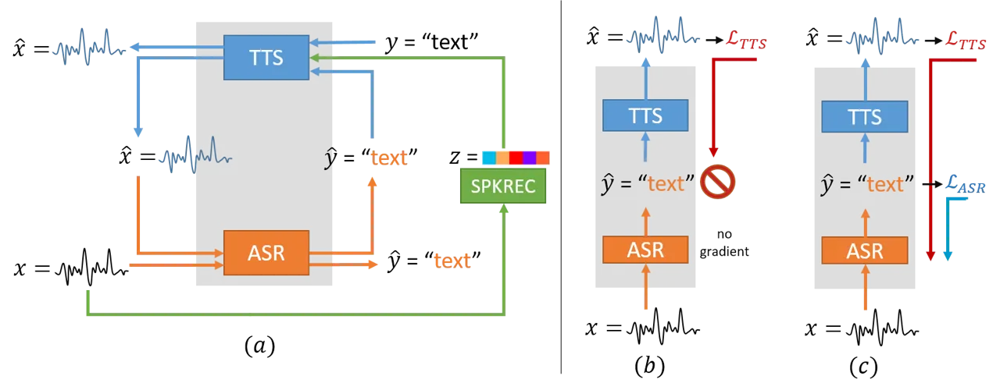
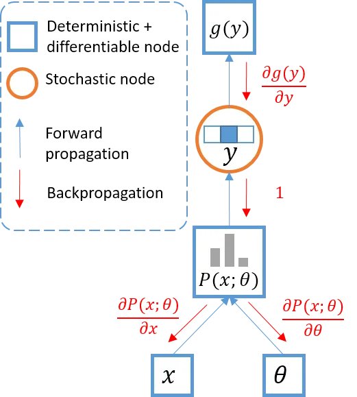
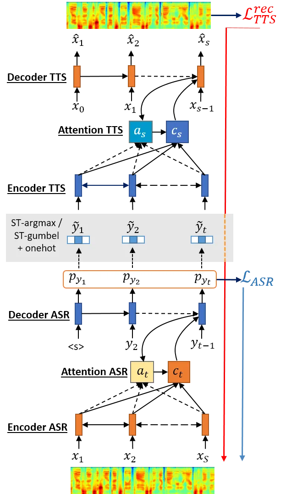

# END-TO-END FEEDBACK LOSS IN SPEECH CHAIN FRAMEWORK VIA STRAIGHT-THROUGH ESTIMATOR

Andros Tjandra Affiliation: Nara Institute of Science and Technology,
Japan Affiliation: RIKEN, Center for Advanced Intelligence Project AIP,
Japan Email: [andros.tjandra.ai6@is.naist.jp](mailto:)    Sakriani Sakti
Affiliation: Nara Institute of Science and Technology, Japan
Affiliation: RIKEN, Center for Advanced Intelligence Project AIP, Japan
Email: [ssakti@is.naist.jp](mailto:)    Satoshi Nakamura
Affiliation: Nara Institute of Science and Technology, Japan
Affiliation: RIKEN, Center for Advanced Intelligence Project AIP, Japan
Email: [s-nakamura@is.naist.jp](mailto:)

###### Abstract

The speech chain mechanism integrates automatic speech recognition (ASR)
and text-to-speech synthesis (TTS) modules into a single cycle during
training. In our previous work, we applied a speech chain mechanism as a
semi-supervised learning. It provides the ability for ASR and TTS to
assist each other when they receive unpaired data and let them infer the
missing pair and optimize the model with reconstruction loss. If we only
have speech without transcription, ASR generates the most likely
transcription from the speech data, and then TTS uses the generated
transcription to reconstruct the original speech features. However, in
previous papers, we just limited our back-propagation to the closest
module, which is the TTS part. One reason is that back-propagating the
error through the ASR is challenging due to the output of the ASR are
discrete tokens, creating non-differentiability between the TTS and ASR.
In this paper, we address this problem and describe how to thoroughly
train a speech chain end-to-end for reconstruction loss using a
straight-through estimator (ST). Experimental results revealed that,
with sampling from ST-Gumbel-Softmax, we were able to update ASR
parameters and improve the ASR performances by 11% relative CER
reduction compared to the baseline.

## 1 Introduction

A speech chain \[1\] is a viewpoint that describes the speech
communication process in which the speaker produces words and generates
speech sound waves, transmits the speech waveform through a medium
(i.e., air), and creates a speech perception process in a listeners
auditory system to perceive what was said. The hearing process is
critical, not only for the listener but also for the speaker herself. By
simultaneously listening and speaking, the speaker can monitor her
volume, articulation, and the general comprehensibility of her speech.
Based on those observations, we simulated the speech chain mechanism by
coupling ASR and TTS and formed a machine speech chain \[2, 3\], so that
the machine can learn, not only to listen (by way of ASR) or speak (by
way of TTS) but also listen while speaking.

In our previous paper \[2\], we utilized the speech chain idea for
semi-supervised learning using paired and unpaired data. First, we
pretrained both ASR and TTS with a small amount of paired speech and
text data. Then, we subsequently used both the pretrained modules to
complete the missing pair from the unpaired data. For example, if we
only have speech without transcription, ASR generates the most likely
transcription from the speech data with greedy or beam-search decoding,
and TTS uses the generated transcription to reconstruct the original
speech features. In this case, we trained the TTS module with the
reconstruction loss. For the reverse case, if we only have text without
any corresponding speech, TTS generates speech, whose features ASR uses
to reconstruct the original text. In this case, we updated the ASR
module with the reconstruction loss. In Fig. 1(a), we illustrate a
multispeaker speech chain loop between the ASR and TTS modules.



Figure 1: a) Multispeaker machine speech chain mechanism; b) Baseline
(\[3\]): feedback loss from TTS is only backpropagated through the TTS
module, and the ASR module is not updated because variable $`\hat{y}`$
is non-differentiable; c) Proposal: feedback loss from TTS is
backpropagated through discrete variable $`\hat{y}`$, and ASR modules
are updated based on the estimated gradient from the TTS module by a
straight-through estimator.

However, the auditory feedback in a human speech chain happens almost
constantly, not only during semi-supervised learning. Furthermore, the
close-loop feedback is also done end-to-end. But, to simulate our speech
chain mechanism to provide the ability to help each other even during
the supervised learning and perform a completely end-to-end feedback
reconstruction loss, the main challenge is to utilize TTS to improve our
ASR module. One reason is that back-propagating the error from the
reconstruction loss through the ASR module is challenging due to the
output of the ASR discrete tokens (grapheme or phoneme), creating
non-differentiability between the TTS and ASR modules (Fig. 1(b)).

We address this problem using a straight-through estimator \[4, 5\] to
predict the gradient through discrete variables (Fig. 1(c)). We mainly
focus on describing how to thoroughly train a speech chain end-to-end by
adding a reconstruction term from the TTS module and backpropagated the
gradient through the ASR. Experimental results revealed that, with
teacher-forcing and sampling from Gumbel-Softmax, we were now able to
updated ASR parameters and improved the ASR performances significantly
by 11% relative CER reduction compared to the baseline.

## 2 Speech Chain and End-to-end Feedback Loss

In the speech chain mechanism, given speech features
$`\mathbf{x}=[x_{1},..,x_{S}]`$ (e.g., Mel-spectrogram) and
$`\mathbf{y}=[y_{1},..,y_{T}]`$, we feed the speech to the ASR module,
and the ASR decoder generates continuous vector $`h^{d}_{t}`$
step-by-step. To calculate probability vector
$`\mathbf{p}_{y}=[p_{y_{1}},..,p_{y_{T}}]`$, we apply the softmax
function $`p_{y_{t}}=\texttt{softmax}(h^{d}_{t})`$ to decoder output
$`h^{e}_{t}`$. For each class probability mass in $`p_{y_{t}}`$,
$`p_{y_{t}}[c]`$ was defined as:

```math
p_{y_{t}}[c]=\frac{\exp(h^{d}_{t}[c]/\tau)}{\sum_{i=1}^{C}\exp(h^{d}_{t}[i]/\tau)},\quad\forall c\in[1..C]. \tag{1}
```

Here $`C`$ is the total number of classes,
$`h_{t}^{d}\in\mathbb{R}^{C}`$ are the logits produced by the last
decoder layer, and $`\tau`$ is the temperature parameters. Setting
temperature $`\tau`$ using a larger value $`(\tau>1)`$ produces a
smoother probability mass over classes \[6\].

For the generation process, we generally have two different methods:

1.  1.  Conditional generation given ground-truth (teacher-forcing):  
        If we have paired speech and text $`(\mathbf{x},\mathbf{y})`$, we
        can generate $`p_{y_{t}}`$ from autoregressive ASR decoder
        $`Dec_{ASR}`$, conditioned to ground-truth text $`y_{t-1}`$ in the
        current time-step and encoded speech feature $`\mathbf{h}^{e}`$. At
        the end, the length of probability vector $`\mathbf{p}_{y}`$ is
        fixed to $`T`$ time-steps.
2.  2.  Conditional generation given previous step model prediction:  
        Another generation process to decode ASR transcription uses its own
        prediction to generate probability vector $`p_{y_{t}}`$. There are
        many different generation methods, such as greedy decoding (1-best
        beam-search)
        ($`\tilde{y_{t}}=\mathop{\mathrm{argmax}}\limits_{c}p_{y_{t}}[c]`$),
        beam-search, or stochastic sampling
        ($`\tilde{y}_{t}\sim Cat(p_{y_{t}})`$).

After the generation process, we obtained probability vector
$`\mathbf{p}_{y}`$ and applied discretization from continuous
probability vector $`p_{y_{t}}`$ to $`\tilde{y}_{t}`$ either by taking
the class with the highest probability or sampling from a categorical
random variable. After getting a single class to represent the
probability vector, we encode it into vector $`[0,0,..,1,..,0]`$ with
one-hot encoding representation and give it to the TTS as the encoder
input. The TTS reconstructs Mel-spectrogram $`\hat{\mathbf{x}}`$ with
the teacher-forcing approach. The reconstruction loss is calculated:

```math
\displaystyle\mathcal{L}^{rec}_{TTS}=\frac{1}{S}\sum_{s=1}^{S}(x_{s}-\hat{x}_{s})^{2}, \tag{2}
```

where $`\hat{x}_{s}`$ is the predicted (or reconstructed)
Mel-spectrogram and $`x_{s}`$ is the ground-truth spectrogram at
$`s`$-th time-step.

We directly calculated the gradient from the reconstruction loss w.r.t
TTS parameters ($`\partial{\cal L}_{TTS}^{rec}/\partial\theta_{TTS}`$)
because all the operations inside the TTS module are continuous and
differentiable. However, we could not calculate the gradient from the
reconstruction loss w.r.t ASR parameters
($`\partial{\cal L}_{TTS}^{rec}/\partial\theta_{ASR}`$) because we have
a discretization operation from
$`p_{y_{t}}\rightarrow\texttt{onehot}(\tilde{y}_{t})`$. Therefore, we
applied a straight-through estimator to enable the loss from
$`{\cal L}_{TTS}^{rec}`$ to pass through discrete variable
$`\tilde{y}_{t}`$.

### 2.1 Straight-through Argmax

The straight-through estimator \[4, 5\] is a method for estimating or
propagating gradients through stochastic discrete variables. Its main
idea is to backpropagate through discrete operations (e.g.,
$`\mathop{\mathrm{argmax}}\limits_{c}p_{y_{t}}[c]`$ or sampling
$`\tilde{y}_{t}\sim Cat(p_{y_{t}})`$) like an identity function. We
describe the forward process and the gradient calculation with a
straight-through estimator in Fig. 2.



Figure 2: Straight-through estimator on $`\arg max`$ function. Given
input $`x`$ and model parameters $`\theta`$, we calculate categorical
probability mass $`P(x;\theta)`$ and apply discrete operation
$`\argmax`$. In the backward pass, the gradient from stochastic node
$`y`$ to $`P(x;\theta)`$,
$`\partial y/\partial P(x;\theta)\approx\mathbbm{1}`$ is approximated by
identity.

In the implementation, we created a function with different forward and
backward operations. For $`\argmax`$ one-hot encoding function, we
formulated the forward operation:

```math
\displaystyle\tilde{z}_{t}=\mathop{\mathrm{argmax}}\limits_{c}p_{y_{t}}[c] \tag{3}
```

```math
\displaystyle\tilde{y}_{t}=\texttt{onehot}(\tilde{z}_{t}). \tag{4}
```

Here we describe $`\tilde{y}_{t}`$ as a one-hot encoding vector with the
same length as the $`p_{y_{t}}`$ vector. When the loss is calculated and
the gradients are backpropagated from loss $`\mathcal{L}_{TTS}^{rec}`$,
we formulate the backward operation:

```math
\frac{\partial\tilde{y}_{t}}{\partial p_{y_{t}}}\approx\mathbbm{1}. \tag{5}
```

Therefore, when we back-propagate the loss from Eq. 2 with the
straight-through estimator approach, we calculate the TTS reconstruction
loss gradient w.r.t $`\theta_{ASR}`$:

```math
\displaystyle\frac{\partial\mathcal{L}_{TTS}^{rec}}{\partial\theta_{ASR}} \displaystyle=\sum_{t=1}^{T}\frac{\partial\mathcal{L}_{TTS}^{rec}}{\partial\tilde{y_{t}}}\cdot\frac{\partial{\tilde{y_{t}}}}{\partial p_{y_{t}}}\cdot\frac{\partial p_{y_{t}}}{\partial\theta_{ASR}} \tag{6}
```

```math
\displaystyle\approx\sum_{t=1}^{T}\frac{\partial\mathcal{L}_{TTS}^{rec}}{\partial\tilde{y_{t}}}\cdot\mathbbm{1}\cdot\frac{\partial p_{y_{t}}}{\partial\theta_{ASR}}. \tag{7}
```

### 2.2 Straight-through Gumbel Softmax

Besides taking $`\argmax`$ class from probability vector $`p_{y_{t}}`$,
we also generated a one-hot encoding by sampling with the Gumbel-Softmax
distribution \[7, 8\]. Gumbel-Softmax is a continuous distribution that
approximates categorical samples, and the gradients can be calculated
with a reparameterization trick. For Gumbel-Softmax, we replaced the
softmax formula for calculating $`p_{y_{t}}`$ (Eq. 1):

```math
p_{y_{t}}[c]=\frac{\exp((h^{d}_{t}[c]+g_{c})/\tau)}{\sum_{i=1}^{C}\exp((h^{d}_{t}[i]+g_{i})/\tau)},\quad\forall c\in[1..C]. \tag{8}
```

where $`g_{1},..,g_{C}`$ are i.i.d samples drawn from Gumbel(0, 1) and
$`\tau`$ is the temperature. We sample $`g_{i}`$ by drawing samples from
the uniform distribution:

```math
\displaystyle u_{c}\sim\texttt{Uniform}(0,1) \tag{9}
```

```math
\displaystyle g_{c}=-\log(-\log(u_{c})),\quad\forall c\in[1..C]. \tag{10}
```

To generate a one-hot encoding, we define our forward operation:

```math
\displaystyle\tilde{z}_{t}\sim Categorical(p_{y_{t}}[1],p_{y_{t}}[2],...,p_{y_{t}}[C]) \tag{11}
```

```math
\displaystyle\tilde{y}_{t}=\texttt{onehot}(\tilde{z}_{t}). \tag{12}
```

At the backpropagation time, we use the same straight-through estimator
(Eq. 5) to allow the gradients to flow through the discrete sampling
operation from Eq. 11.

### 2.3 Combined Loss for ASR

Our final loss function for ASR is a combination from negative
likelihood (Eq. 16) and TTS reconstruction loss (Eq. 2) by sum
operation:

```math
{\cal L}_{ASR}^{F}={\cal L}_{ASR}+{\cal L}_{TTS}^{rec}. \tag{13}
```

To summarize our explanation in this section, we provide an illustration
in Fig. 3 that explains how sub-losses $`{\cal L}_{ASR}`$ and
$`{\cal L}_{TTS}^{rec}`$ are backpropagated to the rest of the ASR and
TTS modules.



Figure 3: Given speech feature $`\mathbf{x}`$, ASR generates a sequence
of probability $`\mathbf{p}_{y}=[p_{y_{1}},p_{y_{2}},...,p_{y_{T}}]`$.
If we have a ground-truth transcription, we can calculate
$`{\cal L}_{ASR}`$ (Eq. 16). TTS module generates speech features, and
we calculate reconstruction loss $`{\cal L}_{TTS}^{rec}`$ (Eq. 2). After
that, the gradients based on $`{\cal L}_{ASR}`$ are propagated through
the ASR module, and the gradients based on $`{\cal L}_{TTS}^{rec}`$ are
propagated through the TTS and ASR modules by a straight-through
estimator.

## 3 Sequence-to-Sequence Model for ASR

A sequence-to-sequence model is a neural network that directly models
conditional probability $`p({y}|{x})`$, where
$`\mathbf{x}=[x_{1},...,x_{S}]`$ is the sequence of the (framed) speech
features with length $`S`$ and $`\mathbf{y}=[y_{1},...,y_{T}]`$ is the
label’s sequence with length $`T`$.

The encoder task processes input sequence $`{x}`$ and generating
representative information $`{h^{e}}=[h^{e}_{1},...,h^{e}_{S}]`$ for the
decoder. The attention module is an extension scheme that assists the
decoder to find relevant information on the encoder side based on the
current decoder hidden states \[9, 10\]. Attention modules produce
context information $`c_{t}`$ at time $`t`$ based on the encoder and
decoder hidden states:

```math
\displaystyle c_{t} \displaystyle=\sum_{s=1}^{S}a_{t}(s)*h^{e}_{s} \tag{14}
```

```math
\displaystyle a_{t}(s) \displaystyle=\text{Align}({h^{e}_{s}},h^{d}_{t})
```

```math
\displaystyle=\frac{\exp(\text{Score}(h^{e}_{s},h^{d}_{t}))}{\sum_{s=1}^{S}\exp(\text{Score}(h^{e}_{s},h^{d}_{t}))}. \tag{15}
```

There are several variations for score functions \[11\] such as
$`Score(h_{s}^{e},h_{t}^{d})`$: dot product
($`\langle h_{s}^{e},h_{t}^{d}\rangle`$), bilinear
($`h_{s}^{e\intercal}W_{s}h_{t}^{d}`$), where
$`\text{score}:(\mathbb{R}^{M}\times\mathbb{R}^{N})\rightarrow\mathbb{R}`$,
$`M`$ is the number of hidden units for the encoder and $`N`$ is the
number of hidden units for the decoder. Finally, the decoder task
predicts target sequence probability $`p_{y_{t}}`$ at time $`t`$ based
on previous output and context information $`c_{t}`$. The loss function
for ASR can be formulated:

```math
{\cal L}_{ASR}=-\frac{1}{T}\sum_{t=1}^{T}\sum_{c=1}^{C}\mathbbm{1}(y_{t}=c)*\log{p_{y_{t}}}[c], \tag{16}
```

where $`C`$ is the number of output classes. Input $`{x}`$ for the
speech recognition tasks is a sequence of feature vectors like a log
Mel-scale spectrogram. Therefore, $`{x}\in\mathbb{R}^{S\times D}`$,
where D is the number of features and S is the total frame length for an
utterance. Output $`{y}`$, which is a speech transcription sequence, can
be either a phoneme or a grapheme (character) sequence.

## 4 Sequence-to-Sequence Model for TTS

Speech synthesis can be viewed as a sequence-to-sequence task where a
model generates speech given a sentence. We directly model the
conditional probability $`p(x|y)`$ with a sequence-to-sequence model,
where $`y=[y_{1},...,y_{T}]`$ is the sequence of characters with length
$`T`$ and $`x=[x_{1},...,x_{S}]`$ is the sequence of (framed) speech
features with length $`S`$. From the sequence-to-sequence ASR model
perspective, TTS is the reverse case where the model reconstructs the
original speech given the text.

In this work, our core architecture is based on Tacotron \[12\] with
several structural modifications \[3\]. The main difference between our
modified Tacotron and the default Tacotron is that we added an
additional speaker embedding projection layer into our decoder to enable
multispeaker training and generation. We also have an additional output
layer to generate binary prediction $`b_{s}\in[0,1]`$ (1 if the $`s`$-th
frame is the end of speech, otherwise 0).

For training the TTS model, we used the following loss function:

```math
\begin{split}{\cal L}_{TTS}=&\frac{1}{S}\sum_{s=1}^{S}(x_{s}^{M}-\hat{x}_{s}^{M})^{2}+(x_{s}^{R}-\hat{x}_{s}^{R})^{2}\\
&-(b_{s}\log(\hat{b}_{s})+(1-b_{s})\log(1-\hat{b}_{s})),\end{split} \tag{17}
```

where $`\hat{x}^{M},\hat{x}^{R},and\hat{b}`$ are the predicted log
Mel-scale spectrogram, the log magnitude spectrogram, and the
end-of-frame probability, and $`x^{M},x^{R},b`$ is the ground-truth. In
the decoding process, we use the Griffin-Lim algorithm \[13\] to
iteratively estimate the phase spectrogram and reconstruct the signal
with inverse STFT.

## 5 Experiment

### 5.1 Dataset

We evaluated the performance of our proposed method on the Wall Street
Journal dataset \[14\]. Our settings for the training, development, and
test sets are the same as the Kaldi s5 recipe \[15\]. We trained our
model with WSJ-SI284 data. Our validation set was dev_93, and our test
set was eval_92.

We used the character sequence as our decoder target and followed the
preprocessing steps proposed by a previous work \[16\]. The text from
all the utterances was mapped into a 32-character set: 26 (a-z) letters
of the alphabet, apostrophes, periods, dashes, space, noise, and “eos.”
In all the experiments, we extracted the 40 dims + $`\Delta`$ +
$`\Delta\Delta`$ (total 120 dimensions) log Mel-spectrogram features
from our speech and normalized every dimension into zero mean and unit
variance.

### 5.2 Model Details

For the ASR model, we used a standard sequence-to-sequence model with an
attention module (Section 3). On the encoder sides, the input log
Mel-spectrogram features were processed by three bidirectional LSTMs
(Bi-LSTM) with 256 hidden units for each LSTM: a total of 512 hidden
units for the Bi-LSTM. To reduce the memory consumption and processing
time, we used hierarchical sub-sampling \[17, 18\] on all three Bi-LSTM
layers and reduced the sequence length by a factor of eight. On the
decoder sides, we projected one-hot encoding from the previous character
into a 256-dims continuous vector with an embedding matrix, followed by
one unidirectional LSTM with 512 hidden units. For the attention module,
we used the content-based attention + multiscale alignment (denoted as
“Att MLP-MA”) \[19\] with a 1-history size. In the decoding phase, the
transcription was generated by beam-search decoding (size=5), and we
normalized the log-likelihood score by dividing it with its own length
to prevent the decoder from favoring shorter transcriptions. We did not
use any language model or lexicon dictionary in this work. In the
training stage, we tried ST-argmax (Section 2.1) and ST-gumbel softmax
(Section 2.2). We also tried both teacher-forcing and greedy decoding to
generate ASR probability vectors $`\mathbf{p}_{y}`$. For each scenario,
we treated temperature $`\tau=[0.25,0.5,1,2]`$ as our hyperparameter and
searched for the best temperature based on the CER (character error
rate) on the development set.

For the TTS model, we used the TTS explained in Section 4. The
hyperparameters for the basic structure are generally the same as those
for the original Tacotron, except we replaced ReLU with the LReLU
function. For the CBHG module, we used $`K=8`$ filter banks instead of
16 to reduce the GPU memory consumption. For the decoder sides, we
deployed two LSTMs instead of a GRU with 256 hidden units. For each
time-step, our model generated four consecutive frames to reduce the
number of steps in the decoding process.

### 5.3 Experiment Result

|                                                    |                 |        |         |
| -------------------------------------------------- | --------------- | ------ | ------- |
| Baseline ($`{\cal L}_{ASR}`$)                      |                 |        |         |
| Model                                              |                 |        | CER (%) |
| Att MLP \[20\]                                     |                 |        | 11.08   |
| Att MLP + Location \[20\]                          |                 |        | 8.17    |
| Att MLP \[21\]                                     |                 |        | 7.12    |
| Att MLP-MA (ours) \[19\]                           |                 |        | 6.43    |
| Proposed ($`{\cal L}_{ASR}+{\cal L}_{TTS}^{rec}`$) |                 |        |         |
| Model                                              | Generation      | ST     | CER (%) |
| Att MLP-MA                                         |                 | argmax | 5.75    |
| Att MLP-MA                                         | Teacher-forcing | gumbel | 5.7     |
| Att MLP-MA                                         |                 | argmax | 5.84    |
| Att MLP-MA                                         | Greedy          | gumbel | 5.88    |

Table 1: ASR experiment result on WSJ dataset test_eval92.

For our baseline, we trained an encoder-decoder with MLP + multiscale
alignment with a 1-history size \[19\]. We also added several published
results to our baseline. All of the baseline models were trained by
minimizing negative log-likelihood $`{\cal L}_{ASR}`$ (Eq. 16).

All the models in the proposed section were trained with a combination
from two losses: $`{\cal L}_{ASR}+{\cal L}_{TTS}^{rec}`$, and the ASR
parameters were updated based on the gradient from the sum of the two
losses. We have four different scenarios, most of which provide
significant improvement compared to the baseline model that is only
trained on $`{\cal L}_{ASR}`$ loss. With teacher-forcing and sampling
from Gumbel-softmax, we obtained 11% relative improvement compared to
our best baseline Att MLP-MA.

## 6 Related Works

Approaches that utilize end-to-end feedback learning from
source-to-target and vice-versa remain scant. Senrich et al. \[22\]
improved the NMT performance by back-translation on a monolingual
dataset. Semi-supervised learning for NMT called dual learning \[23\]
was also proposed by combining reconstruction loss and language model
reward. However, the feedback gradient provided by the reconstruction
loss only limited the closest module to the loss. One primary reason is
that the nature of text modalities is represented by discrete variables.
Our previous speech chain paper \[2, 3\] focused on utilizing the
closed-loop between ASR and TTS as a semi-supervised learning method. If
one of the modalities of data is missing, we can generate a pseudo-pair
and train one of the models by reconstruction loss. But, as we described
earlier, the study also limit the back-propagation to the closest module
due to similar reason that the output of the ASR is discrete tokens. In
contrast, in this paper, we successfully address the problem using a
straight-through estimator to predict the gradient through discrete
variables.

## 7 Conclusions

We introduced a different perspective from a speech chain mechanism. We
trained our ASR module by adding feedback from the TTS reconstruction
loss. However, the ASR output is not differentiable because of the
transcription generated by the discretization process. To address this
problem, we used a straight-through estimator to enable the gradient
from the TTS module to flow through discrete variables . We tried
various scenarios with different decoding and discretization processes.
From our experimental results, with teacher-forcing and sampling from
Gumbel-Softmax, we improved the ASR performances by 11% relative CER
reduction compared to our baseline.

## 8 Acknowledgment

Part of this work was supported by JSPS KAKENHI Grant Numbers JP17H06101
and JP17K00237.

## References

- \[1\] P. Denes and E. Pinson, The Speech Chain. Anchor books, Worth
  Publishers, 1993.
- \[2\] A. Tjandra, S. Sakti, and S. Nakamura, “Listening while
  speaking: Speech chain by deep learning,” in 2017 IEEE Automatic
  Speech Recognition and Understanding Workshop (ASRU), pp. 301–308,
  Dec 2017.
- \[3\] A. Tjandra, S. Sakti, and S. Nakamura, “Machine speech chain
  with one-shot speaker adaptation,” in Interspeech 2018, 19th Annual
  Conference of the International Speech Communication Association,
  Hyderabad, India, 2-6 September 2018., pp. 887–891, 2018.
- \[4\] Y. Bengio, N. Léonard, and A. Courville, “Estimating or
  propagating gradients through stochastic neurons for conditional
  computation,” arXiv preprint arXiv:1308.3432, 2013.
- \[5\] G. Hinton, “Neural networks for machine learning, Coursera video
  lectures,” 2012.
- \[6\] G. Hinton, O. Vinyals, and J. Dean, “Distilling the knowledge in
  a neural network,” arXiv preprint arXiv:1503.02531, 2015.
- \[7\] E. Jang, S. Gu, and B. Poole, “Categorical reparameterization
  with gumbel-softmax,” 2017.
- \[8\] C. J. Maddison, A. Mnih, and Y. W. Teh, “The concrete
  distribution: A continuous relaxation of discrete random variables,”
  arXiv preprint arXiv:1611.00712, 2016.
- \[9\] D. Bahdanau, K. Cho, and Y. Bengio, “Neural machine translation
  by jointly learning to align and translate,” arXiv preprint
  arXiv:1409.0473, 2014.
- \[10\] W. Chan, N. Jaitly, Q. Le, and O. Vinyals, “Listen, attend and
  spell: A neural network for large vocabulary conversational speech
  recognition,” in Acoustics, Speech and Signal Processing (ICASSP),
  2016 IEEE International Conference on, pp. 4960–4964, IEEE, 2016.
- \[11\] M.-T. Luong, H. Pham, and C. D. Manning, “Effective approaches
  to attention-based neural machine translation,” arXiv preprint
  arXiv:1508.04025, 2015.
- \[12\] Y. Wang, R. Skerry-Ryan, D. Stanton, Y. Wu, R. J. Weiss,
  N. Jaitly, Z. Yang, Y. Xiao, Z. Chen, S. Bengio, et al., “Tacotron: A
  fully end-to-end text-to-speech synthesis model,” arXiv preprint
  arXiv:1703.10135, 2017.
- \[13\] D. Griffin and J. Lim, “Signal estimation from modified
  short-time fourier transform,” IEEE Transactions on Acoustics, Speech,
  and Signal Processing, vol. 32, no. 2, pp. 236–243, 1984.
- \[14\] D. B. Paul and J. M. Baker, “The design for the wall street
  journal-based csr corpus,” in Proceedings of the workshop on Speech
  and Natural Language, pp. 357–362, Association for Computational
  Linguistics, 1992.
- \[15\] D. Povey, A. Ghoshal, G. Boulianne, L. Burget, O. Glembek,
  N. Goel, M. Hannemann, P. Motlicek, Y. Qian, P. Schwarz, J. Silovsky,
  G. Stemmer, and K. Vesely, “The Kaldi speech recognition toolkit,” in
  IEEE 2011 Workshop on Automatic Speech Recognition and Understanding,
  IEEE Signal Processing Society, Dec. 2011. IEEE Catalog No.:
  CFP11SRW-USB.
- \[16\] A. Y. Hannun, A. L. Maas, D. Jurafsky, and A. Y. Ng,
  “First-pass large vocabulary continuous speech recognition using
  bi-directional recurrent DNNs,” arXiv preprint arXiv:1408.2873, 2014.
- \[17\] A. Graves, “Supervised sequence labelling,” in Supervised
  Sequence Labelling with Recurrent Neural Networks, pp. 5–13,
  Springer, 2012.
- \[18\] D. Bahdanau, J. Chorowski, D. Serdyuk, P. Brakel, and
  Y. Bengio, “End-to-end attention-based large vocabulary speech
  recognition,” in Acoustics, Speech and Signal Processing (ICASSP),
  2016 IEEE International Conference on, pp. 4945–4949, IEEE, 2016.
- \[19\] A. Tjandra, S. Sakti, and S. Nakamura, “Multi-scale alignment
  and contextual history for attention mechanism in sequence-to-sequence
  model,” To appear in IEEE SLT 2018, 2018.
- \[20\] S. Kim, T. Hori, and S. Watanabe, “Joint ctc-attention based
  end-to-end speech recognition using multi-task learning,” in
  Acoustics, Speech and Signal Processing (ICASSP), 2017 IEEE
  International Conference on, pp. 4835–4839, IEEE, 2017.
- \[21\] A. Tjandra, S. Sakti, and S. Nakamura, “Attention-based
  wav2text with feature transfer learning,” in 2017 IEEE Automatic
  Speech Recognition and Understanding Workshop, ASRU 2017, Okinawa,
  Japan, December 16-20, 2017, pp. 309–315, 2017.
- \[22\] R. Sennrich, B. Haddow, and A. Birch, “Improving neural machine
  translation models with monolingual data,” in Proceedings of the 54th
  Annual Meeting of the Association for Computational Linguistics
  (Volume 1: Long Papers), vol. 1, pp. 86–96, 2016.
- \[23\] D. He, Y. Xia, T. Qin, L. Wang, N. Yu, T. Liu, and W.-Y. Ma,
  “Dual learning for machine translation,” in Advances in Neural
  Information Processing Systems, pp. 820–828, 2016.
