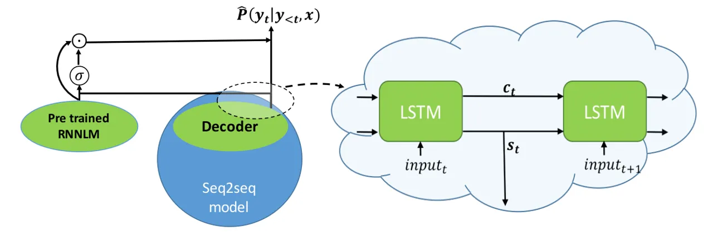
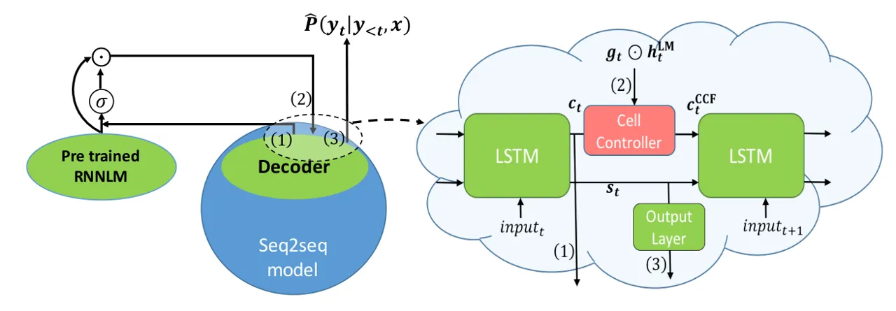
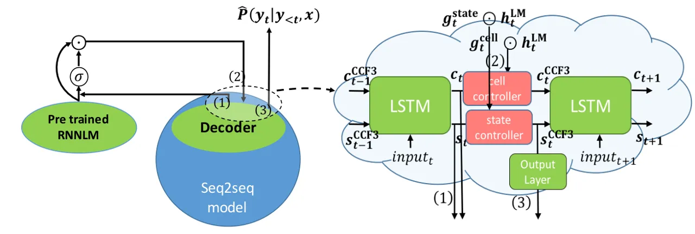

# Language Model Integration based on Memory Control for Sequence to sequence Speech Recognition

Jaejin Cho, Shinji Watanabe, Takaaki Hori, Murali Karthick Baskar,
Hirofumi Inaguma, Jesus Villalba, Najim Dehak ^(†)^(†)thanks: \* The
affiliations of the authors may differ from their current affiliations.

###### Abstract

In this paper, we explore several new schemes to train a seq2seq model
to integrate a pre-trained LM. Our proposed fusion methods focus on the
memory cell state and the hidden state in the seq2seq decoder long
short-term memory (LSTM), and the memory cell state is updated by the LM
unlike the prior studies. This means the memory retained by the main
seq2seq would be adjusted by the external LM. These fusion methods have
several variants depending on the architecture of this memory cell
update and the use of memory cell and hidden states which directly
affects the final label inference. We performed the experiments to show
the effectiveness of the proposed methods in a mono-lingual ASR setup on
the Librispeech corpus and in a transfer learning setup from a
multilingual ASR (MLASR) base model to a low-resourced language. In
Librispeech, our best model improved WER by 3.7%, 2.4% for test clean,
test other relatively to the shallow fusion baseline, with multi-level
decoding. In transfer learning from an MLASR base model to the IARPA
Babel Swahili model, the best scheme improved the transferred model on
eval set by 9.9%, 9.8% in CER, WER relatively to the 2-stage transfer
baseline.

^(†)^(†)address: ¹Johns Hopkins University, ²Mitsubishi Electric
Research Laboratories (MERL),  
³Brno University of Technology, ⁴Kyoto University  
youjojo8478@gmail.com

Index Terms: Automatic speech recognition (ASR), sequence to sequence,
language model, shallow fusion, deep fusion, cold fusion

## 1 introduction

As deep learning prospers in most research fields, systems based on it
keep improving, and become the state-of-the-art in most of the
scenarios. The sequence to sequence (seq2seq) model is one of the kind
that heavily depends on deep learning techniques, and it is used in many
sequence mapping problems such as automatic speech recognition
(ASR) \[1, 2, 3, 4\] and machine translation \[5, 6, 7\]. In \[4\], a
seq2seq model with attention mechanism is introduced in ASR. Though the
performance lagged behind highly-optimized conventional systems, e.g.
CLDNN HMM system \[8\], it enabled to map a sequence of feature vectors
to a sequence of characters, with a single neural network, in an
end-to-end manner. In \[9\], the authors apply a multi-task learning
scheme to train an attentional seq2seq model with connectionist temporal
classification (CTC) objective function \[1, 10\] as auxiliary loss.
Adding the CTC loss to train the model reduces the burden of the
attention model to learn monotonic attention.

In the seq2seq ASR setup, the language model (LM) takes an important
role as it is already shown in hybrid ASR systems \[11, 12\]. However,
compared to the conventional ASR, there have been only a few studies on
ways to integrate an LM into seq2seq ASR \[13, 14, 15\]. In this
direction, the authors in \[5\] introduce two methods integrating an LM
into a decoder of the end-to-end neural machine translation (NMT)
system. First method was shallow fusion where the model decodes based on
a simple weighted sum of NMT model and recurrent neural network
LM \[16\] (RNNLM) scores. The next one was called deep fusion where they
combine a mono-lingual RNNLM with a NMT model by learning parameters
that connect hidden states of a separately trained NMT model and RNNLM.
While the parameters connecting the hidden states are trained,
parameters in NMT and RNNLM are frozen. Recently in ASR research, a
scheme called cold fusion was introduced, which trains a seq2seq model
from scratch in assistance with a pre-trained RNNLM \[17\]. In contrast
to the previous methods, the parameters of the seq2seq model are not
frozen during training although pre-trained RNNLM parameters are still
kept frozen. The results showed the model trained this way outperforms
deep fusion in decoding as well as reducing the amount of data in domain
adaptation. Later, more experiments were done comparing all three
methods \[18\]. In the paper, they observe that cold fusion works best
among all three methods in the second pass re-scoring with a large and
production-scale LM. The previous research has shown the potential of
training a seq2seq model utilizing a pre-trained LM. However, it seems
only effective to limited scenarios such as domain adaptation and
second-pass re-scoring. Thus, studies on better ways of integrating both
models need to be explored.

In this paper, we explored several new fusion schemes to train a seq2seq
model jointly with a pre-trained LM. Among them, we found one method
that works consistently better than other fusion methods over more
general scenarios. The proposed methods focus on updating the memory
cell state as well as the hidden state of the seq2seq decoder long
short-term memory (LSTM) \[19\], given the LM logit or hidden state.
This means that the memory retained by the main seq2seq model will be
adjusted by the external LM for better prediction. The fusion methods
have several variants according to the architecture of this memory cell
update and the use of memory cell and hidden states, which directly
affects the final label inference. Note that we used LSTM networks for
RNNs throughout whole explanations and experiments. The proposed
methods, however, can be applied to different variant RNNs such as gated
recurrent unit (GRU) \[20\] only with minimal modification.

The organization of this paper is as follows. First, we describe
previous fusion methods as a background in Section 2. Then, in
Section 3, we explain our proposed methods in detail. Experiments with
previous and proposed methods are presented in Section 4. Lastly, we
conclude the paper in Section 5.

## 2 Background: Shallow fusion, Deep fusion, and Cold fusion in ASR

### 2.1 Shallow fusion

In this paper, we denotes as shallow fusion a decoding method based on
the following convex score combination of a seq2seq model and LM during
beam search,

```math
\hat{y}=\underset{y}{\operatorname{argmax}}\,(\log p(y|x)+\gamma\log p(y)) \tag{1}
```

where $`x`$ is an input acoustic frame sequence while $`\hat{y}`$ is the
predicted label sequence selected among all possible $`y`$. The
predicted label sequence can be a sequence of characters, sub-words, or
words, and this paper deals with character-level sequences.
$`\log p(y|x)`$ is calculated from the seq2seq model and $`\log p(y)`$
is calculated from the RNNLM. Both models are separately trained but
their scores are combined in a decoding phase. $`\gamma`$ is a scaling
factor between 0 and 1 that needs to be tuned manually.

### 2.2 Deep fusion

In deep fusion, the seq2seq model and RNNLM are combined with learnable
parameters. Two models are first trained separately as in shallow
fusion, and then both are frozen while the connecting linear
transformation parameters, i.e. $`\bm{v}`$, $`b`$, $`\bm{W}`$, and
$`\bm{b}`$ below, are trained.

```math
g_{t}=\sigma(\bm{v}^{\text{T}}\bm{s}_{t}^{\text{LM}}+b) \tag{2a}
```

```math
\bm{s}_{t}^{\text{DF}}=[\bm{s}_{t};g_{t}\bm{s}_{t}^{\text{LM}}] \tag{2b}
```

```math
\hat{p}(y_{t}|y_{<t},x)=\text{softmax}(\bm{W}\bm{s}_{t}^{\text{DF}}+\bm{b}) \tag{2c}
```

$`\bm{s}_{t}^{\text{LM}}`$ and $`\bm{s}_{t}`$ are hidden states at time
$`t`$ from an RNNLM and a decoder of the seq2seq model, respectively.
$`\sigma(\cdot)`$ in Eq. (2a) is the sigmoid function to generate
$`g_{t}`$, which acts as a scalar gating function in Eq. (2b) to control
the contribution of $`\bm{s}_{t}^{\text{LM}}`$ to the final inference.

### 2.3 Cold fusion

In contrast to the two previous methods, cold fusion uses the RNNLM in a
seq2seq model training phase. The seq2seq model is trained from scratch
with the pre-trained RNNLM model whose parameters are frozen and
learnable parameters $`\bm{W}_{k}`$ and $`\bm{b}_{k}`$, where
$`k=1,2,3`$. The equation follows

```math
\bm{h}_{t}^{\text{LM}}=\bm{W}_{1}\bm{l}_{t}^{\text{LM}}+\bm{b}_{1} \tag{3a}
```

```math
\bm{g}_{t}=\sigma(\bm{W}_{2}[\bm{s}_{t};\bm{h}_{t}^{\text{LM}}]+\bm{b}_{2}) \tag{3b}
```

```math
\bm{s}_{t}^{\text{CF}}=[\bm{s}_{t};\bm{g}_{t}\odot\bm{h}_{t}^{\text{LM}}] \tag{3c}
```

```math
\hat{p}(y_{t}|y_{<t},x)=\text{softmax}(\text{ReLU}(\bm{W}_{3}\bm{s}_{t}^{\text{CF}}+\bm{b}_{3})) \tag{3d}
```

where $`\bm{l}_{t}^{\text{LM}}`$ is the logit at time step $`t`$ from
the RNNLM. As opposed to a scalar $`g_{t}`$ in Eq. (2b) of deep fusion,
it is now a vector $`\bm{g}_{t}`$ in cold fusion, meaning the gating
function is applied element-wise, where $`\odot`$ means element-wise
multiplication. $`\text{ReLU}(\cdot)`$ is a rectified linear function
applied element-wise. Applying it before $`\text{softmax}(\cdot)`$ was
shown to be helpful empirically in \[17\].



(a) cold fusion



(b) cell update



(c) cell and state update + cold fusion

Figure 1: High-level illustration of fusion methods in training. (b) and
(c) correspond to  cell control fusion 1 and  cell control fusion 3
respectively among our proposed methods. Output layer here is a linear
transformation, with non-linearity only when having it benefits
empirically

## 3 Proposed methods

In this paper, we propose several fusion schemes to train a seq2seq
model well integrated with a pre-trained RNNLM. We mainly focus on
updating hidden/memory cell states in the seq2seq LSTM decoder given the
LM logit/hidden state. The first proposed method uses the LM information
to adjust the memory cell state of the seq2seq decoder. Then, the
updated cell state replaces the original input cell state of the LSTM
decoder to calculate states at the next time step. This fusion scheme is
inspired by cold fusion, but they differ in that the new method directly
affects the memory cell maintaining mechanism in the LSTM decoder to
consider the linguistic context obtained from the LM. Then, we further
extend this idea with multiple schemes that use the LM information not
only for updating the memory cell states but also hidden states in the
seq2seq LSTM decoder, which further affect the final inference and
attention calculation directly. Figure 1 visualizes the schemes in
high-level to help understanding.

### 3.1 LM fusion by controlling memory cell state

In Eq. (3c) at cold fusion, the gated RNNLM information,
$`\bm{g}_{t}\odot\bm{h}_{t}^{\text{LM}}`$, is concatenated with the
decoder hidden state, $`\bm{s}_{t}`$. Then, the fused state,
$`\bm{s}_{t}^{\text{CF}}`$ is used to predict the distribution of the
next character. However, the gated RNNLM information can be used in a
different way to update the cell state in the seq2seq decoder, as in Eq.
(4c).

```math
\bm{h}_{t}^{\text{LM}}=\tanh(\bm{W}_{1}\bm{l}_{t}^{\text{LM}}+\bm{b}_{1}) \tag{4a}
```

```math
\bm{g}_{t}=\sigma(\bm{W}_{2}[\bm{c}_{t};\bm{h}_{t}^{\text{LM}}]+\bm{b}_{2}) \tag{4b}
```

```math
\bm{c}_{t}^{\text{CCF}}=\bm{c}_{t}+\bm{g}_{t}\odot\bm{h}_{t}^{\text{LM}} \tag{4c}
```

```math
\bm{s}_{t+1},\bm{c}_{t+1}=\text{LSTM}(\text{input},\bm{s}_{t},\bm{c}_{t}^{\text{CCF}}) \tag{4d}
```

```math
\hat{p}(y_{t}|y_{<t},x)=\text{softmax}(\bm{W}_{3}\bm{s}_{t}+\bm{b}_{3})\;. \tag{4e}
```

In this method, we add the gated RNNLM information to the original cell
state, $`\bm{c}_{t}`$. $`\text{LSTM}(\cdot)`$ in Eq. (4d) is the
standard LSTM function, which takes previous cell and hidden states and
an input came from an attention context vector, and updates the cell and
hidden states for the next time step. In our case, when the LSTM decoder
updates its cell state, it uses $`\bm{c}_{t}^{\text{CCF}}`$ instead of
$`\bm{c}_{t}`$, which contains additional linguistic context obtained
from an external LM. We call this fusion as cell control fusion 1
throughout the paper. Here, this method does not include
$`\text{ReLU}(\cdot)`$ before $`\text{softmax}(\cdot)`$ in Eq. (4e)
since it did not show any benefit empirically unlike in other methods.

### 3.2 LM fusion by updating both hidden and memory cell states

In cold fusion, the update of the hidden state output from the LSTM
decoder in Eq. (3c) directly affects the final inference unlike _cell
control fusion 1_. Therefore, this section combines the concepts of the
cold fusion and _cell control fusion 1_ and further proposes variants of
novel fusion methods by extending the cell control fusion 1 with the
above hidden state consideration.

First, we simply combine cell control fusion 1 in Section 3.1 with cold
fusion. We call this scheme as cell control fusion 2. The detailed
equations are

```math
\bm{h}_{t}^{\text{LM}}=\bm{W}_{1}\bm{l}_{t}^{\text{LM}}+\bm{b}_{1} \tag{5a}
```

```math
\bm{g}_{t}^{\text{cell}}=\sigma(\bm{W}_{2}[\bm{c}_{t};\bm{h}_{t}^{\text{LM}}]+\bm{b}_{2}) \tag{5b}
```

```math
\bm{c}_{t}^{\text{CCF2}}=\bm{c}_{t}+\bm{g}_{t}^{\text{cell}}\odot\bm{h}_{t}^{\text{LM}} \tag{5c}
```

```math
\bm{s}_{t+1},\bm{c}_{t+1}=\text{LSTM}(\text{input},\bm{s}_{t},\bm{c}_{t}^{\text{CCF2}}) \tag{5d}
```

```math
\bm{g}_{t}^{\text{state}}=\sigma(\bm{W}_{3}[\bm{s}_{t};\bm{h}_{t}^{\text{LM}}]+\bm{b}_{3}) \tag{5e}
```

```math
\bm{s}_{t}^{\text{CCF2}}=[{{\bm{s}_{t}}};\bm{g}_{t}^{\text{state}}\odot\bm{h}_{t}^{\text{LM}}] \tag{5f}
```

```math
\hat{p}(y_{t}|y_{<t},x)=\text{softmax}(\text{ReLU}(\bm{W}_{4}\bm{s}_{t}^{\text{CCF2}}+\bm{b}_{4}))\;. \tag{5g}
```

Note the calculations of Eq. (5a), (5e)-(5g) are exactly same as of
Eq. (3), and calculations of Eq. (5a)-(5d) are same as of Eq. (4a)-(4d)
other than $`\text{tanh}(\cdot)`$ used in Eq. (4a), which shows some
effectiveness on our preliminary investigation. However, this
straightforward extension does not outperform both cell control fusion 1
and cold fusion.

As a next variant, we apply a similar cell control update mechanism
(Eq. (5d)) to the seq2seq decoder hidden state $`\bm{s}_{t}`$ as well.
That is, the original hidden state, $`\bm{s}_{t}`$, is replaced by
$`\bm{s}_{t}^{\text{CCF3}}`$ in the LSTM update Eq. (6f), which is
transformed from the fused state in cold fusion to match dimension.
$`\bm{s}_{t}^{\text{CCF3}}`$ is expected to have more information since
it contains additional linguistic context obtained from an external LM.
The Eq. (6) explains this fusion method more in detail. We call this
type of fusion cell control fusion 3 in this paper.

```math
\bm{h}_{t}^{\text{LM}}=\tanh(\bm{W}_{1}\bm{l}_{t}^{\text{LM}}+\bm{b}_{1}) \tag{6a}
```

```math
\bm{g}_{t}^{\text{state}}=\sigma(\bm{W}_{2}[\bm{s}_{t};\bm{h}_{t}^{\text{LM}}]+\bm{b}_{2}) \tag{6b}
```

```math
\bm{g}_{t}^{\text{cell}}=\sigma(\bm{W}_{3}[\bm{c}_{t};\bm{h}_{t}^{\text{LM}}]+b_{3}) \tag{6c}
```

```math
\bm{s}_{t}^{\text{CCF3}}=\bm{W}_{4}[\bm{s}_{t};\bm{g}_{t}^{\text{state}}\odot\bm{h}_{t}^{\text{LM}}]+\bm{b}_{4} \tag{6d}
```

```math
\bm{c}_{t}^{\text{CCF3}}=\text{CellUpdate}(\bm{c}_{t},\bm{g}_{t}^{\text{cell}}\odot\bm{h}_{t}^{\text{LM}}) \tag{6e}
```

```math
\bm{s}_{t+1},\bm{c}_{t+1}=\text{LSTM}(\text{input},\bm{s}_{t}^{\text{CCF3}},\bm{c}_{t}^{\text{CCF3}}) \tag{6f}
```

```math
\hat{p}(y_{t}|x,y_{<t})=\text{softmax}(\text{ReLU}(\bm{W}_{5}\bm{s}_{t}^{\text{CCF3}}+\bm{b}_{5})) \tag{6g}
```

For CellUpdate function in Eq. (6e), we compared two different
calculations:

```math
\bm{c}_{t}+\bm{g}_{t}^{\text{cell}}\odot\bm{h}_{t}^{\text{LM}} \tag{7}
```

```math
\bm{W}_{0}[\bm{c}_{t};\bm{g}_{t}^{\text{cell}}\odot\bm{h}_{t}^{\text{LM}}]+\bm{b}_{0} \tag{8}
```

In the case of Eq. (8), the affine transformation of
$`[\bm{c}_{t};\bm{g}_{t}^{\text{cell}}\odot\bm{h}_{t}^{\text{LM}}]`$
would cause gradient vanishing problem in theory. However, we found that
in practice, the method works best among all proposed methods.

## 4 Experiments

We first compared all our proposed methods described in Section 3 with
shallow fusion, deep fusion, and cold fusion on the 100hrs subset of the
Librispeech corpus \[21\] as a preliminary experiment. Then, we further
investigate some selected methods with two other experiments:
mono-lingual ASR setup on the Librispeech 960hrs corpus and a transfer
learning setup from a multilingual ASR (MLASR) base model to a
low-resourced language, Swahili in IARPA Babel \[22\].

We used shallow fusion all the time in decoding phase for every trained
model. For example, we can additionally use shallow fusion decoding for
the seq2seq model trained with a cold/cell-control fusion scheme. We
refer to \[18\] to justify the comparison between the baseline seq2seq
model with shallow/deep fusion decoding and the seq2seq model trained
using cold/cell-control fusion with shallow fusion decoding. The
baseline seq2seq model above means a seq2seq model trained without any
fusion method.

All models are trained with joint CTC-attention objective as proposed
in \[9\],

```math
L_{\text{MTL}}=\alpha L_{\text{CTC}}+(1-\alpha)L_{\text{Attention}} \tag{9}
```

where $`L_{\text{CTC}}`$ and $`L_{\text{Attention}}`$ are the losses for
CTC and attention repectively, and $`\alpha`$ ranges between 0 and 1
inclusively. In decoding, we did attention/CTC joint decoding with
RNNLM \[23\]. In all the experiments, we represented each frame of 25ms
windowed audio having 10ms shift by a vector of 83 dimensions, which
consists of 80 Mel-filter bank coefficients and 3 pitch features. The
features were normalized by the mean and the variance of the whole
training set. All experiments were done based on ESPnet toolkit \[24\].

For Librispeech, training and decoding configurations of the seq2seq
model are shown in Table 1. We trained both character-level and
word-level RNNLMs on 10% of the text publicly available for
Librispeech¹¹ 1 http://www.openslr.org/11/, which is roughly 10 times
the 960 hours of the transcriptions in terms of the data size.

In the MLASR transfer learning scenario, the base MLASR model was
trained exactly same as in  \[25\]. The base model was trained using 10
selected Babel languages, which are roughly 640 hours of data:
Cantonese, Bengali, Pashto, Turkish, Vietnamese, Haitian, Tamil,
Kurmanji, Tokpisin, and Georgian. The model parameters were then
fine-tuned using all Swahili corpus in Babel, which is about 40 hours.
During the transfer process, we used the same MLASR base model with
three different ways: 2-stage transfer (see  \[25\] for more details),
cold fusion, and cell control fusion 3 (affine). We included cold fusion
in this comparison since cold fusion showed its effectiveness in domain
adaptation in \[17\]. The character-level RNNLM was trained on all
transcriptions available for Swahili in IARPA Babel.

|                                 |                 |
| ------------------------------- | --------------- |
| Model Configuration             |                 |
| Encoder                         | Bi-LSTM         |
| \# encoder layers               | 8               |
| \# encoder units                | 320             |
| \# projection units             | 320             |
| Decoder                         | Bi-LSTM         |
| \# decoder layers               | 1               |
| \# decoder units                | 300             |
| Attention                       | Location-aware  |
| Training Configuration          |                 |
| Optimizer                       | AdaDelta \[26\] |
| Initial learning rate           | 1.0             |
| AdaDelta $`\epsilon`$           | $`1e^{-8}`$     |
| AdaDelta $`\epsilon`$ decay     | $`1e^{-2}`$     |
| Batch size                      | 36              |
| ctc-loss weight ($`\alpha`$)    | $`0.5`$         |
| Decoding Configuration          |                 |
| Beam size                       | 20              |
| ctc-weight ($`\lambda`$ \[23\]) | $`0.3`$         |

Table 1: Experiment details

### 4.1 Preliminary experiments: Librispeech 100hrs

Table 2 compares the proposed cell control fusion methods to the
conventional fusion methods. Both cold fusion and cell control fusion 1
show similar performance, but the performance of cell control fusion 2
was degraded. This implies that simply combining cold fusion and cell
control fusion 1 does not have any benefit. Then, The cell control
fusion 3 methods, which extended cell control fusion 2 by applying cell
control update mechanism (Eq. (5d)) to the seq2seq decoder hidden state
(Eq. (6f)), outperformed all the previous fusion methods in most cases.
This suggests that applying the cell control update mechanism for both
cell and hidden states consistently, further improves the performance.
Among the two cell control fusion 3 methods, cell control fusion 3
(affine) outperformed all the other methods in every case. During the
decoding, the shallow fusion parameter $`\gamma`$ in Eq. (1) was set to
0.3.

|                                |       |       |       |       |
| ------------------------------ | ----- | ----- | ----- | ----- |
| Fusion                         | dev   | test  | dev   | test  |
| method                         | clean | clean | other | other |
| Shallow fusion                 | 16.9  | 16.7  | 45.6  | 47.9  |
| Deep fusion                    | 17.1  | 17.0  | 45.9  | 48.3  |
| Cold fusion                    | 16.7  | 16.4  | 45.5  | 47.8  |
| Cell control fusion 1          | 16.4  | 16.5  | 45.4  | 47.7  |
| Cell control fusion 2          | 17.4  | 16.8  | 45.9  | 48.4  |
| Cell control fusion 3 (sum)    | 16.7  | 16.3  | 45.3  | 47.2  |
| Cell control fusion 3 (affine) | 16.0  | 16.0  | 44.7  | 46.6  |

Table 2: Comparison of previous and cell control fusion methods on
Librispeech 100 hours: Character-level decoding (%WER)

### 4.2 Librispeech 960 hrs

In this setting, we decoded in two ways: character-level decoding and
multi-level (character and word) decoding \[23\]. The word-level RNNLM
used for the multi-level decoding has 20,000 as its vocabulary size. The
results are shown in Table 3 and 4 respectively. For both cases, cell
control fusion 3 (affine), performed the best followed by shallow
fusion, and cold fusion. Also, we observed that the gap in the WER
between cell control fusion 3 (affine) and shallow fusion is larger when
we use multi-level decoding. This suggests that with the advanced
decoding algorithm, the  cell control fusion 3 benefits more in
performance. Note that $`\gamma`$ was set to 0.3 for character-level
decoding and 0.5 for multi-level decoding.

|                                |       |       |       |       |
| ------------------------------ | ----- | ----- | ----- | ----- |
| Fusion                         | dev   | dev   | test  | test  |
| method                         | clean | other | clean | other |
| Shallow fusion                 | 6.1   | 17.6  | 6.1   | 18.1  |
| Cold fusion                    | 6.1   | 18.1  | 6.3   | 18.7  |
| Cell control fusion 3 (affine) | 6.0   | 17.1  | 6.1   | 17.9  |

Table 3: LibriSpeech 960 hours: Character-level decoding (%WER)

|                                |       |       |       |       |
| ------------------------------ | ----- | ----- | ----- | ----- |
| Fusion                         | dev   | dev   | test  | test  |
| method                         | clean | other | clean | other |
| Shallow fusion                 | 5.4   | 15.8  | 5.4   | 16.6  |
| Cold fusion                    | 5.4   | 16.2  | 5.6   | 17.1  |
| Cell control fusion 3 (affine) | 5.2   | 15.5  | 5.2   | 16.2  |

Table 4: LibriSpeech 960 hours: Multi-level decoding (%WER)

### 4.3 Transfer learning to low-resourced language

Finally, Table 5 shows the result of the transfer learning to a
low-resourced language (Swahili). The cold fusion transfer improved the
performance from simple 2-stage, showing its effectiveness in this
scenario but cell control fusion 3 (affine) improved the performance
further. cell control fusion 3 (affine) outperforms cold fusion not only
in this MLASR transfer learning setup but also in the previous
mono-lingual ASR setup. In decoding, $`\gamma`$ was set to 0.4.

| Fusion                                   | eval set | eval set |
| ---------------------------------------- | -------- | -------- |
| method                                   | %CER     | %WER     |
| Shallow fusion (2-stage transfer) \[25\] | 27.2     | 56.2     |
| Cold fusion                              | 25.8     | 52.9     |
| cell control fusion 3 (affine)           | 24.5     | 50.7     |

Table 5: Transfer learning from an MLASR base model to Swahili:
Character-level decoding (%CER, %WER)

## 5 Conclusion

In this paper, several methods were proposed to integrate a pre-trained
RNNLM during a seq2seq model training. First, we used information from
the LM output to update the memory cell in the seq2seq model decoder,
which performed similar to cold fusion. Then, we extended this model to
additionally update the seq2seq model hidden state given the LM output.
For the scheme, Several formulas were compared. Among the proposed
methods, cell control fusion 3 (affine) showed the best performance
consistently on all experiments. In Librispeech, our best model improved
WER by 3.7%, 2.4% for test clean, test other relatively to the shallow
fusion baseline, with multi-level decoding. For the transfer learning
setup from a MLASR base model to the IARPA Babel Swahili model, the best
scheme improved the transferred model performance on eval set by 9.9%,
9.8% in CER, WER relatively to the 2-stage transfer baseline. In the
future, we will explore how the best method performs by the amount of
additional text data used for RNNLM training.

## References

- \[1\] Alex Graves and Navdeep Jaitly, “Towards end-to-end speech
  recognition with recurrent neural networks,” in International
  Conference on Machine Learning, 2014, pp. 1764–1772.
- \[2\] Jan Chorowski, Dzmitry Bahdanau, Kyunghyun Cho, and Yoshua
  Bengio, “End-to-end continuous speech recognition using
  attention-based recurrent nn: first results,” arXiv preprint
  arXiv:1412.1602, 2014.
- \[3\] Dzmitry Bahdanau, Jan Chorowski, Dmitriy Serdyuk, Philemon
  Brakel, and Yoshua Bengio, “End-to-end attention-based large
  vocabulary speech recognition,” in Acoustics, Speech and Signal
  Processing (ICASSP), 2016 IEEE International Conference on. IEEE,
  2016, pp. 4945–4949.
- \[4\] William Chan, Navdeep Jaitly, Quoc Le, and Oriol Vinyals,
  “Listen, attend and spell: A neural network for large vocabulary
  conversational speech recognition,” in IEEE International Conference
  on Acoustics, Speech and Signal Processing (ICASSP). IEEE, 2016, pp.
  4960–4964.
- \[5\] Caglar Gulcehre, Orhan Firat, Kelvin Xu, Kyunghyun Cho, Loic
  Barrault, Huei-Chi Lin, Fethi Bougares, Holger Schwenk, and Yoshua
  Bengio, “On using monolingual corpora in neural machine translation,”
  arXiv preprint arXiv:1503.03535, 2015.
- \[6\] Minh-Thang Luong, Hieu Pham, and Christopher D Manning,
  “Effective approaches to attention-based neural machine translation,”
  arXiv preprint arXiv:1508.04025, 2015.
- \[7\] Dzmitry Bahdanau, Kyunghyun Cho, and Yoshua Bengio, “Neural
  machine translation by jointly learning to align and translate,” arXiv
  preprint arXiv:1409.0473, 2014.
- \[8\] Tara N Sainath, Oriol Vinyals, Andrew Senior, and Haşim Sak,
  “Convolutional, long short-term memory, fully connected deep neural
  networks,” in Acoustics, Speech and Signal Processing (ICASSP), 2015
  IEEE International Conference on. IEEE, 2015, pp. 4580–4584.
- \[9\] Shinji Watanabe, Takaaki Hori, Suyoun Kim, John R Hershey, and
  Tomoki Hayashi, “Hybrid CTC/attention architecture for end-to-end
  speech recognition,” IEEE Journal of Selected Topics in Signal
  Processing, vol. 11, no. 8, pp. 1240–1253, 2017.
- \[10\] Alex Graves, Santiago Fernández, Faustino Gomez, and Jürgen
  Schmidhuber, “Connectionist temporal classification: labelling
  unsegmented sequence data with recurrent neural networks,” in
  Proceedings of the 23rd international conference on Machine learning.
  ACM, 2006, pp. 369–376.
- \[11\] George E Dahl, Dong Yu, Li Deng, and Alex Acero,
  “Context-dependent pre-trained deep neural networks for
  large-vocabulary speech recognition,” IEEE Transactions on audio,
  speech, and language processing, vol. 20, no. 1, pp. 30–42, 2012.
- \[12\] Lalit R Bahl, Peter F Brown, Peter V de Souza, and Robert L
  Mercer, “A tree-based statistical language model for natural language
  speech recognition,” IEEE Transactions on Acoustics, Speech, and
  Signal Processing, vol. 37, no. 7, pp. 1001–1008, 1989.
- \[13\] Takaaki Hori, Shinji Watanabe, Yu Zhang, and William Chan,
  “Advances in joint CTC-attention based end-to-end speech recognition
  with a deep CNN encoder and RNN-LM,” in INTERSPEECH, 2017.
- \[14\] Alex Graves, “Sequence transduction with recurrent neural
  networks,” arXiv preprint arXiv:1211.3711, 2012.
- \[15\] Yajie Miao, Mohammad Gowayyed, and Florian Metze, “Eesen:
  End-to-end speech recognition using deep rnn models and wfst-based
  decoding,” in Automatic Speech Recognition and Understanding (ASRU),
  2015 IEEE Workshop on. IEEE, 2015, pp. 167–174.
- \[16\] Tomáš Mikolov, Martin Karafiát, Lukáš Burget, Jan Černockỳ, and
  Sanjeev Khudanpur, “Recurrent neural network based language model,” in
  Eleventh Annual Conference of the International Speech Communication
  Association, 2010.
- \[17\] Anuroop Sriram, Heewoo Jun, Sanjeev Satheesh, and Adam Coates,
  “Cold fusion: Training seq2seq models together with language models,”
  arXiv preprint arXiv:1708.06426, 2017.
- \[18\] Shubham Toshniwal, Anjuli Kannan, Chung-Cheng Chiu, Yonghui Wu,
  Tara N Sainath, and Karen Livescu, “A comparison of techniques for
  language model integration in encoder-decoder speech recognition,”
  arXiv preprint arXiv:1807.10857, 2018.
- \[19\] Sepp Hochreiter and Jürgen Schmidhuber, “Long short-term
  memory,” Neural computation, vol. 9, no. 8, pp. 1735–1780, 1997.
- \[20\] Junyoung Chung, Caglar Gulcehre, KyungHyun Cho, and Yoshua
  Bengio, “Empirical evaluation of gated recurrent neural networks on
  sequence modeling,” arXiv preprint arXiv:1412.3555, 2014.
- \[21\] Vassil Panayotov, Guoguo Chen, Daniel Povey, and Sanjeev
  Khudanpur, “Librispeech: an asr corpus based on public domain audio
  books,” in Acoustics, Speech and Signal Processing (ICASSP), 2015 IEEE
  International Conference on. IEEE, 2015, pp. 5206–5210.
- \[22\] Martin Karafiát, Murali Karthick Baskar, Pavel Matějka, Karel
  Veselỳ, František Grézl, and Jan Černocky, “Multilingual blstm and
  speaker-specific vector adaptation in 2016 but babel system,” in
  Spoken Language Technology Workshop (SLT), 2016 IEEE. IEEE, 2016, pp.
  637–643.
- \[23\] Takaaki Hori, Shinji Watanabe, and John R Hershey, “Multi-level
  language modeling and decoding for open vocabulary end-to-end speech
  recognition,” in Automatic Speech Recognition and Understanding
  Workshop (ASRU), 2017 IEEE. IEEE, 2017, pp. 287–293.
- \[24\] Shinji Watanabe, Takaaki Hori, Shigeki Karita, Tomoki Hayashi,
  Jiro Nishitoba, Yuya Unno, Nelson Enrique Yalta Soplin, Jahn Heymann,
  Matthew Wiesner, Nanxin Chen, et al., “Espnet: End-to-end speech
  processing toolkit,” arXiv preprint arXiv:1804.00015, 2018.
- \[25\] Jaejin Cho, Murali Karthick Baskar, Ruizhi Li, Matthew Wiesner,
  Sri Harish Mallidi, Nelson Yalta, Martin Karafiat, Shinji Watanabe,
  and Takaaki Hori, “Multilingual sequence-to-sequence speech
  recognition: architecture, transfer learning, and language modeling,”
  arXiv preprint arXiv:1810.03459, 2018.
- \[26\] Matthew D Zeiler, “Adadelta: an adaptive learning rate method,”
  arXiv preprint arXiv:1212.5701, 2012.

## Important Notice

Dear Readers,  
Please be advised that the minor differences observed in the comparative
performance reported in this paper may be attributed to variations in
GPU specifications. The compute server used in the experiments included
both Tesla K80 and GTX 1080 Ti GPUs, and jobs were randomly assigned to
nodes without any deliberate selection based on GPU type. When I became
aware of this issue, I attempted to withdraw the paper; however, the
publication process had already been finalized. I had planned to address
the matter by re-running the experiments using a fixed GPU
configuration; however, I was unable to directly implement this plan.
Unfortunately, due to significant changes in the computing environment
and the elapsed time since the original experiments, replicating the
exact conditions is no longer feasible.  
I sincerely apologize for any confusion this may have caused. Please
consider this information when interpreting our results, and feel free
to cite the paper at your discretion.  
For clarity, the first author, Jaejin Cho, takes full responsibility for
the matters described above. This statement is made in the spirit of
academic integrity and transparency, and does not imply legal
liability.  
Thank you for your understanding.  
Sincerely,  
Jaejin Cho
