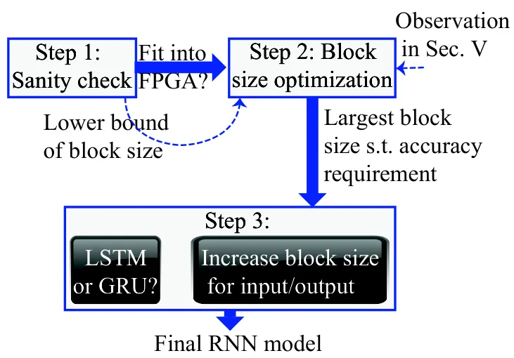
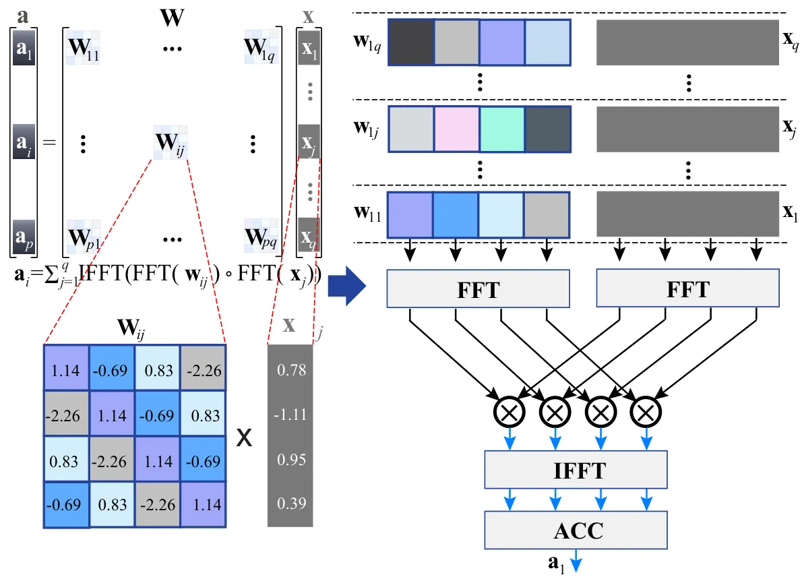
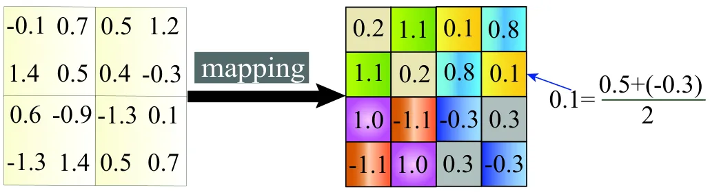
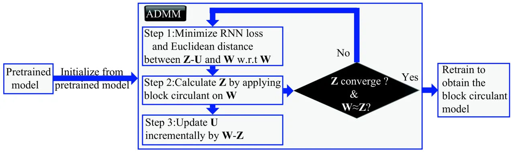
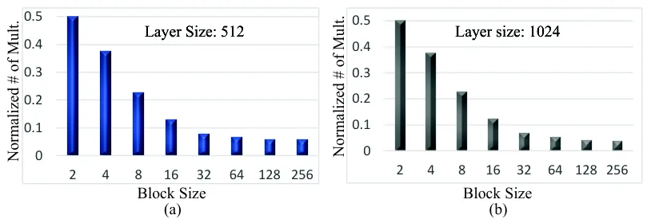
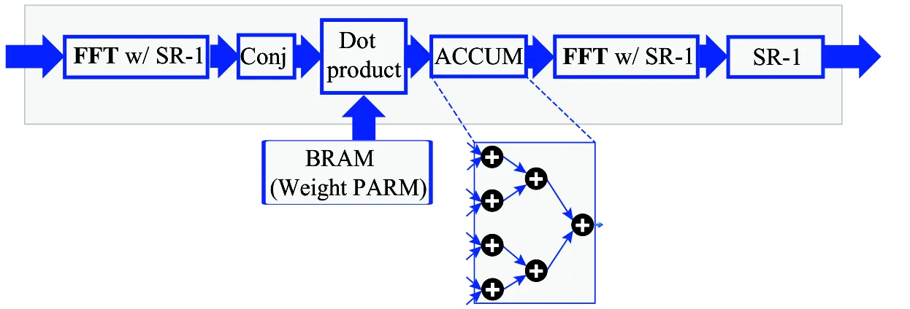
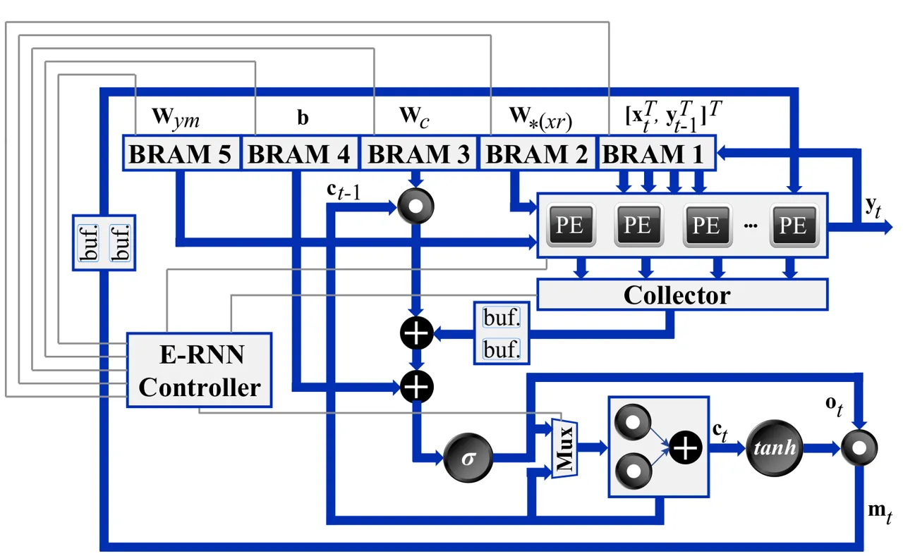
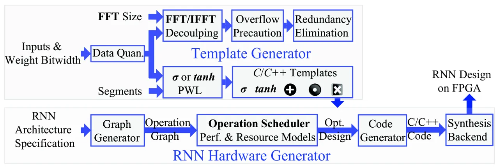

# E-RNN: Design Optimization for Efficient Recurrent Neural Networks in FPGAs

Zhe Li^(1∗), Caiwen Ding^(2∗), Siyue Wang², Wujie Wen³, Youwei Zhuo⁴,
Chang Liu⁵,  
Qinru Qiu¹, Wenyao Xu⁶, Xue Lin², Xuehai Qian⁴, and Yanzhi Wang²  
^(∗)These authors contributed equally Affiliation: ¹Syracuse University,
²Northeastern University, ³Florida International University,  
⁴University of Southern California, ⁵Carnegie Mellon University, ⁶ SUNY
University at Buffalo.  
¹{zli89, qiqiu}@syr.edu, ²{ding.ca, wang.siy}@husky.neu.edu, ²{xue.lin,
yanz.wang}@northeastern.edu,  
³wwen@fiu.edu, ⁴{youweizh,xuehai.qian}@usc.edu,
⁵cliu5@andrew.cmu.edu,⁶wenyaoxu@buffalo.edu.

###### Abstract

Recurrent Neural Networks (RNNs) are becoming increasingly important for
time series-related applications which require efficient and real-time
implementations. The two major types are Long Short-Term Memory (LSTM)
and Gated Recurrent Unit (GRU) networks. It is a challenging task to
have real-time, efficient, and accurate hardware RNN implementations
because of the high sensitivity to imprecision accumulation and the
requirement of special activation function implementations. Recently two
works have focused on FPGA implementation of inference phase of LSTM
RNNs with model compression. First, ESE uses a weight pruning based
compressed RNN model but suffers from irregular network structure after
pruning. The second work C-LSTM mitigates the irregular network
limitation by incorporating block-circulant matrices for weight matrix
representation in RNNs, thereby achieving simultaneous model compression
and acceleration.

A key limitation of the prior works is the lack of a systematic design
optimization framework of RNN model and hardware implementations,
especially when the block size (or compression ratio) should be jointly
optimized with RNN type, layer size, etc. In this paper, we adopt the
block-circulant matrix-based framework, and present the Efficient RNN
(E-RNN) framework for FPGA implementations of the Automatic Speech
Recognition (ASR) application. The overall goal is to improve
performance/energy efficiency under accuracy requirement. We use the
alternating direction method of multipliers (ADMM) technique for more
accurate block-circulant training, and present two design explorations
providing guidance on block size and reducing RNN training trials. Based
on the two observations, we decompose E-RNN in two phases: Phase I on
determining RNN model to reduce computation and storage subject to
accuracy requirement, and Phase II on hardware implementations given RNN
model, including processing element design/optimization, quantization,
activation implementation, etc. ¹¹ 1 The code is available in
https://github.com/lz1313/BlockCIrculantRNN. Experimental results on
actual FPGA deployments show that E-RNN achieves a maximum energy
efficiency improvement of 37.4$`\times`$ compared with ESE, and more
than 2$`\times`$ compared with C-LSTM, under the same accuracy.

###### Index Terms: 

RNN; design optimization; FPGAs; block-circulant matrix;

## I Introduction

Recurrent Neural Networks (RNNs) represent an important class of machine
learning techniques that are specialized for processing sequential data
\[1\]. RNNs have wide applications in speech recognition, natural
language processing, scene and semantic understanding, time series
analysis, etc. Many of these applications require efficient and
real-time implementations. The two major types of RNNs with the broadest
applications and highest performance are the _Long Short-Term Memory_
(LSTM) unit \[2\] and the _Gated Recurrent unit_ (GRU) \[3\]. LSTM and
GRU RNNs are computationally intensive but can effectively overcome
_vanishing_ and _exploding_ gradient problems \[4\] of traditional RNNs.

As RNNs are related to time series analysis and used for making temporal
decisions, the real-time, high-efficiency hardware implementations of
RNNs are becoming imperative. Recently, there have been extensive
investigations in industry and academia \[5, 6, 7, 8, 9, 10, 11, 12, 13,
14, 15\] on hardware acceleration of (the inference phase of)
feedforward _Deep Neural Networks_ (DNNs)²² 2 We differentiate between
feedforward DNNs used mainly for image classification and cycle-based
RNNs used mainly for sequential data processing., in both FPGA and ASIC
accelerations. Model compression and algorithm-level acceleration of
DNNs have also been investigated, including weight quantization \[16,
17\], connection pruning \[18, 19\], and low rank approximation \[20,
21\]. Despite all this effort, there have been limited contributions in
prior work on the subject of efficient RNN implementations, at least the
inference phase which requires real-time performance in power-budgeted
systems. In fact, hardware implementations and model compression of RNNs
exhibit unique challenges. First, RNNs are very sensitive to
accumulation of imprecisions, due to both model compression and bit
quantization. Additionally, for LSTM/GRU RNNs, there are special
operations like point-wise multiplications and special activation
functions like tanh (hyperbolic tangent) \[2, 3, 22\], which require
accurate and efficient hardware implementations.

As a representative work on implementing LSTMs on FPGAs, the ESE \[23\]
implements the inference phase of sparse LSTM model obtained by the
parameter pruning method \[18, 19\]. The ESE achieves higher energy
efficiency than GPU, but its performance is lower. This is due to (i)
the limited compression ratio for LSTMs (4-6$`\times`$ when indices are
accounted for), (ii) the irregular network structure after pruning, and
(iii) the inefficient implementation of activations and indices.

In order to exploit the full computing power of FPGAs and overcome the
irregularity issue, the recent work C-LSTM \[24\] has adopted
block-circulant matrices \[25, 26\] for weight matrix representations in
LSTM RNNs, thereby achieving simultaneous model compression and
acceleration. Fig. 1 shows an illustrative example. A block-circulant
matrix consists of a set of square circulant submatrices (blocks). In a
circulant matrix, each row (or column) vector is a circulant reformat of
the other row (column) vectors. Therefore, each submatrix can be
represented by a vector. The first obvious benefit is storage size
reduction from O($`n^{2}`$) to O($`n`$). In LSTM RNN, the major
computation is Wx of weight matrix W and vector x, where W is now
block-circulant. The _Fast Fourier Transform_ (FFT) method could be
utilized for acceleration, and the computational complexity is reduced
from O($`n^{2}`$) to O($`n\log n`$). In addition to the computational
and storage complexity reductions, the block-circulant matrix-based
compression generates regular, structured weight matrices, which is
amenable to efficient hardware accelerations.

Fig. 1: An illustrative example of block-circulant matrices for RNN
weight representation.

Overall speaking, the block-circulant matrix-based framework allows us
to achieve a fine-grained trade-off between _accuracy_ and
_compression/acceleration ratio_. A larger block size should be selected
to achieve a higher compression ratio, however, it may degrade the
accuracy. The smaller block sizes provide higher accuracy, but less
compression ratio.

The prior work focus on the efficient implementation of RNN inference
phase given a pre-computed RNN model. They did not provide a systematic
method to perform design optimization. When the block size (or degree of
model compression) needs to be optimized together with the network
type/size and different block sizes can be utilized for different parts
of a network, a significant increase in the number of RNN training
trials will be needed for design optimization. Moreover, the design
optimization needs to be judiciously performed based on the overall
accuracy and performance requirements, as well as the computation and
storage resources of the hardware platform (e.g., FPGA). An
algorithm-hardware crosslayer framework is desirable.

In this work, we focus on block-circulant matrix-based RNN
implementations and aim to mitigate these limitations. We propose fast
and effective design optimizations for RNN implementation, in which the
term _fast_ refers to reducing the number of RNN training trials to
arrive at a close-to-optimal solution, and _effectiveness_ is defined in
terms of performance and energy efficiency in (FPGA) hardware
implementation under overall accuracy requirements. The target
application is Automatic Speech Recognition (ASR), which is a
representative and computation-intensive application of (LSTM and GRU)
RNNs and is also the focus of \[23\]. Different from prior works, we
applied ADMM \[27\] to train the block circulant based RNN models to
achieve better accuracy. ADMM is a powerful method for solving
non-convex optimization problems with combinatorial constraints.

To provide some high-level guidelines, we first perform two design
explorations on the RNN model: The first one is top-down from the
algorithm level, and clearly demonstrates that block size optimization
should be prioritized over layer size optimization under the overall
accuracy constraint. The second one is a bottom-up framework focusing on
computation reductions, and effectively sets a proper range of block
size optimization. These two observations can effectively reduce the
number of training trials in design optimization.



Fig. 2: The Phase-I algorithm of E-RNN.

Based on these two observations, we propose the E-RNN design
optimization framework of RNN implementation on FPGAs. The proposed
framework is also applicable to ASICs. The optimization objectives are
performance and energy efficiency under the overall accuracy
requirement. The optimization variables include model type (LSTM, GRU,
etc.) selection, block size and layer size optimization, hardware
implementation structure and parallelism degree, quantization and
activation functions, etc. We divide the overall design optimization
into two phases. _Phase I_ lies at the interface between algorithm and
hardware and determines RNN model specifications, including model type,
layer size, and block size, under the overall accuracy constraint as
shown in Fig. 2. The number of training trials is effectively reduced by
leveraging the above observations. The RNN model can be fully
accommodated using on-chip BRAM of FPGA through this phase. _Phase II_
focuses on hardware-oriented optimization given the RNN model, and
determines the hardware implementation structure, the number of
_processing elements_ (PEs), quantization scheme and activation function
implementations, etc. We conclude the contribution of E-RNN in two-fold:
(i) At software level, we use ADMM-based training for deriving
block-circulant matrix-based RNN representation. ADMM-based training is
compatible with recent progress in stochastic gradient descent (e.g.,
ADAM), which is not supported in the training method of C-LSTM \[24\].
ADMM-based training provides an effective means to deal with the
structure requirement in weight matrices, thereby enhancing accuracy and
training speed. (ii) At hardware level, we propose a systematic design
framework and hardware optimization using HLS, to achieve alternative
designs (LSTM vs. GRU) for RNNs, and to limit the design range and
accelerate the design exploration. The systematic framework also works
for other DNN designs targeted at FPGAs due to the regularity of
block-circulant matrix. Experimental results on actual FPGA deployments
shows that the proposed E-RNN framework achieves a significant energy
efficiency improvement of 37.4$`\times`$ compared with ESE \[23\] under
the same accuracy degradation, and energy efficiency improvement of over
2$`\times`$ compared with C-LSTM \[24\].

## II Background on RNN Cells

### II-A Long short-term memory (LSTM)

Modern large scale Automatic Speech Recognition (ASR) systems take
advantage of LSTM-based RNNs as their acoustic models. An LSTM model
consists of large matrices which is the most computational intensive
part among all the steps of the ASR procedure. We focus on a
representative LSTM model presented in \[22\] whose architecture is
shown in Fig. 3 (a).

Fig. 3: (a) An LSTM based and (b) a GRU based RNN architecture.

An LSTM-based RNN accepts an input vector sequence
$`\mathbb{X}=(\mathbf{x}_{1};\mathbf{x}_{2};\mathbf{x}_{3};...;\mathbf{x}_{T})`$
(each of $`\mathbf{x}_{t}`$ is a vector corresponding to time $`t`$)
with the output sequence from last step
$`\mathbb{Y}^{T-1}=(\mathbf{y}_{0};\mathbf{y}_{1};\mathbf{y}_{2};...;\mathbf{y}_{T-1})`$
(each of $`\mathbf{y}_{t}`$ is a vector). It computes an output sequence
$`\mathbb{Y}=(\mathbf{y}_{1};\mathbf{y}_{2};\mathbf{y}_{3};...;\mathbf{y}_{T})`$
by using the following equations iteratively from $`t=1`$ to $`T`$:

```math
\displaystyle\mathbf{i}_{t} \displaystyle=\sigma(\mathbf{W}_{ix}\mathbf{x}_{t}+\mathbf{W}_{ir}\mathbf{y}_{t-1}+\mathbf{W}_{ic}\mathbf{c}_{t-1}+\mathbf{b}_{i}), \tag{1a}
```

```math
\displaystyle\mathbf{f}_{t} \displaystyle=\sigma(\mathbf{W}_{fx}\mathbf{x}_{t}+\mathbf{W}_{fr}\mathbf{y}_{t-1}+\mathbf{W}_{fc}\mathbf{c}_{t-1}+\mathbf{b}_{f}), \tag{1b}
```

```math
\displaystyle\mathbf{g}_{t} \displaystyle=\sigma(\mathbf{W}_{cx}\mathbf{x}_{t}+\mathbf{W}_{cr}\mathbf{y}_{t-1}+\mathbf{b}_{c}), \tag{1c}
```

```math
\displaystyle\mathbf{c}_{t} \displaystyle=\mathbf{f}_{t}\odot\mathbf{c}_{t-1}+\mathbf{g}_{t}\odot\mathbf{i}_{t}, \tag{1d}
```

```math
\displaystyle\mathbf{o}_{t} \displaystyle=\sigma(\mathbf{W}_{ox}\mathbf{x}_{t}+\mathbf{W}_{or}\mathbf{y}_{t-1}+\mathbf{W}_{oc}\mathbf{c}_{t}+\mathbf{b}_{o}), \tag{1e}
```

```math
\displaystyle\mathbf{m}_{t} \displaystyle=\mathbf{o}_{t}\odot\mathbf{h}(\mathbf{c}_{t}), \tag{1f}
```

```math
\displaystyle\mathbf{y}_{t} \displaystyle=\mathbf{W}_{ym}\mathbf{m}_{t}, \tag{1g}
```

where symbols $`\mathbf{i}`$, $`\mathbf{f}`$, $`\mathbf{o}`$,
$`\mathbf{c}`$, $`\mathbf{m}`$, and $`\mathbf{y}`$ are respectively the
input gate, forget gate, output gate, cell state, cell output, and
projected output \[22\]; the $`\odot`$ operation denotes the point-wise
multiplication, and the $`+`$ operation denotes the point-wise addition.
The $`\mathbf{W}`$ terms denote weight matrices (e.g.
$`\mathbf{W}_{ix}`$ is the matrix of weights from the input vector
$`\mathbf{x}_{t}`$ to the input gate), and the $`\mathbf{b}`$ terms
denote bias vectors. Please note $`\mathbf{W}_{ic}`$,
$`\mathbf{W}_{fc}`$, and $`\mathbf{W}_{oc}`$ are diagonal matrices for
peephole connections \[28\], thus they are essentially a vector. As a
result, the matrix-vector multiplication like
$`\mathbf{W}_{ic}\mathbf{c}_{t-1}`$ can be calculated by the $`\odot`$
operation. $`\sigma`$ is the logistic activation function and
$`\mathbf{h}`$ is a user defined activation function. Here we use
hyperpolic tangent (tanh) activation function as $`\mathbf{h}`$.

In the above equations, we have nine matrix-vector multiplications
(excluding peephole connections which can be calculated by $`\odot`$).
In one gate/cell,
$`\mathbf{W}_{\ast x}\mathbf{x}_{t}+\mathbf{W}_{\ast r}\mathbf{y}_{t-1}`$
can be combined in one matrix-vector multiplication by concatenating the
matrix and vector as
$`\mathbf{W}_{\ast(xr)}[{\mathbf{x}_{t}^{T},\mathbf{y}_{t-1}^{T}}]^{T}`$.
The four gate/cell matrices can be concatenated and calculated through
one matrix-vector multiplication as
$`\textbf{W}_{(ifco)(xr)}[\textbf{x}_{t}^{T},\textbf{y}_{t-1}^{T}]^{T}`$.
Thus, we can compute the above equations with two matrix-vector
multiplications, i.e.
$`\textbf{W}_{(ifco)(xr)}`$$`[\textbf{x}_{t}^{T},\textbf{y}_{t-1}^{T}]^{T}`$
and $`\textbf{W}_{ym}\textbf{m}_{t}`$.

### II-B Gated recurrent units (GRU)

The GRU is a variation of the LSTM as introduced in \[29\]. It combines
the forget and input gates into a single “update gate”. It also merges
the cell state and hidden state, and makes some other changes. The
architecture is shown in Fig. 3 (b). Similarly, it follows equations
iteratively from $`t=1`$ to $`T`$:

```math
\displaystyle\mathbf{z}_{t} \displaystyle=\sigma(\mathbf{W}_{zx}\mathbf{x}_{t}+\mathbf{W}_{zc}\mathbf{c}_{t-1}+\mathbf{b}_{z}), \tag{2a}
```

```math
\displaystyle\mathbf{r}_{t} \displaystyle=\sigma(\mathbf{W}_{rx}\mathbf{x}_{t}+\mathbf{W}_{rc}\mathbf{c}_{t-1}+\mathbf{b}_{r}), \tag{2b}
```

```math
\displaystyle\mathbf{\tilde{c}}_{t} \displaystyle=\mathbf{h}(\mathbf{W}_{\tilde{c}x}\mathbf{x}_{t}+\mathbf{W}_{\tilde{c}c}(\mathbf{r}_{t}\odot\mathbf{c}_{t-1})+\mathbf{b}_{\tilde{c}}), \tag{2c}
```

```math
\displaystyle\mathbf{c}_{t} \displaystyle=(1-\mathbf{z}_{t})\odot\mathbf{c}_{t-1}+\mathbf{z}_{t}\odot\mathbf{\tilde{c}}_{t} \tag{2d}
```

where symbols $`\mathbf{z}`$, $`\mathbf{r}`$, $`\mathbf{\tilde{c}}`$,
$`\mathbf{c}`$ are respectively the update gate, reset gate, reset
state, and cell state; the $`\odot`$ operation denotes the point-wise
multiplication, and the $`+`$ operation denotes the point-wise addition.
The $`\mathbf{W}`$ terms denote weight matrices (e.g.
$`\mathbf{W}_{zx}`$ is the matrix of weights from the input vector
$`\mathbf{x}_{t}`$ to the reset gate). $`\sigma`$ is the logistic
activation function and $`\mathbf{h}`$ is a user defined activation
function. Here we use tanh activation function as $`\mathbf{h}`$. Note
that a GRU has two gates (update and reset), while an LSTM has three
gates (input, forget, output). GRUs do not have the output gate that is
present in LSTMs. Instead, the cell state is taken as the output. The
input and forget gates are coupled by an update gate $`\mathbf{z}`$, and
the reset gate $`\mathbf{r}`$ is applied directly to the previous cell
state.

In the above set of equations, we have six matrix-vector
multiplications. In the reset and update gates,
$`\mathbf{W}_{\ast x}\mathbf{x}_{t}+\mathbf{W}_{\ast c}\mathbf{c}_{t-1}`$
can be combined/fused in one matrix-vector multiplication by
concatenating the matrix and vector as
$`\mathbf{W}_{\ast(xc)}[{\mathbf{x}_{t}^{T},\mathbf{c}_{t-1}^{T}}]^{T}`$.
Furthermore, the reset and update gate matrices can also be concatenated
and calculated through one matrix-vector multiplication as
$`\textbf{W}_{(rz)(xc)}[\mathbf{x}_{t}^{T},\textbf{c}_{t-1}^{T}]^{T}`$.
In this way, we compute the above equations with three matrix-vector
multiplications, i.e.
$`\mathbf{W}_{(rz)(xc)}[\mathbf{x}_{t}^{T},\mathbf{c}_{t-1}^{T}]^{T}`$,
$`\mathbf{W}_{\tilde{c}x}\mathbf{x}_{t}`$, and
$`\mathbf{W}_{\tilde{c}c}(\mathbf{r}_{t}\odot\mathbf{c}_{t-1})`$.

## III Block-Circulant Matrices for RNN Models

Overall, it is possible to simultaneously achieve significant reductions
in both computational and storage complexity, for both inference and
training. This is especially crucial for hardware implementations.

We are not forcing the block-circulant format onto a trained RNN weight
matrix. Indeed, the ADMM training to be discussed in Sec. III-B will
directly result in RNN weight matrices in the block-circulant format.
From the perspective of matrix theory, the block-circulant matrices has
shown the same “effectiveness” as the full matrices in representing RNNs
as discussed in \[30\]. In practice, the block size represents a
trade-off between accuracy and storage/computation complexity. There is
an upper bound on the block size with minor accuracy loss.

### III-A Block-Circulant Matrices-Based Inference

The primary idea of block-circulant matrix-based LSTM is to represent
the original arbitrary weight matrix
$`\textbf{W}\in\mathbb{R}^{m\times n}`$ with an array of equal-size
square sub-matrices (i.e., _blocks_), where each sub-matrix is a
_circulant_ matrix. Assume there are $`p\times q`$ blocks after
partitioning the matrix $`\mathbf{W}`$, where $`p=\frac{m}{L_{b}}`$ and
$`q=\frac{n}{L_{b}}`$. Here $`L_{b}`$ is the _block size_. Then
$`\mathbf{W}=[\mathbf{W}_{ij}]`$, $`i\in\{1\dots p\}`$,
$`j\in\{1\dots q\}`$.

Each circulant matrix $`\mathbf{W}_{ij}`$ can be defined by a vector
$`\mathbf{w}_{ij}`$. More specifically, $`\mathbf{w}_{ij}`$ is the first
row vector of $`\mathbf{W}_{ij}`$; the second row vector of
$`\mathbf{W}_{ij}`$ is a circulation of the first row vector, and so on.
Fig. 4 provides an example of circulant matrix $`\mathbf{W}_{ij}`$. The
storage complexity of a block-circulant weight matrix is significantly
reduced since we only need to store one vector $`\mathbf{w}_{ij}`$ for
each circulant matrix $`\mathbf{W}_{ij}`$. As a result, we have the
ability to store all the weights matrices (i.e.,
$`{\mathbf{W}}_{*(xr)}`$) and the projection matrix
$`{\mathbf{W}}_{ym}`$ in block RAM (BRAM), thereby significantly
improving the FPGA performance. Additionally, the input feature
$`\mathbf{x}`$, bias $`\mathbf{b}`$ ($`\mathbf{b}_{i}`$,
$`\mathbf{b}_{f}`$, and $`\mathbf{b}_{o}`$), and diagonal matrices
$`\mathbf{W}_{c}`$ ($`\mathbf{W}_{ic}`$, $`\mathbf{W}_{fc}`$, and
$`\mathbf{W}_{oc}`$) can also be stored in BRAM due to a small quantity
of corresponding parameters.



Fig. 4: An illustration of FFT-based calculation in block-circulant
matrix multiplication.

Since a weight matrix $`\mathbf{W}`$ is now partitioned into
$`p\times q`$ blocks, correspondingly, the input $`\mathbf{x}`$ is also
partitioned as
$`\mathbf{x}=[\mathbf{x}^{T}_{1},\mathbf{x}^{T}_{2},\dots,\mathbf{x}^{T}_{q}]^{T}`$,
$`\mathbf{x}_{j}\in\mathbb{R}^{L_{b}}`$. Then, the _forward propagation_
process in the inference phase is given by (with bias and activation
function omitted):

```math
\small\mathbf{a}=\mathbf{Wx}=\begin{bmatrix}\sum_{j=1}^{q}\mathbf{W}_{1j}\mathbf{x}_{j}\\
\sum_{j=1}^{q}\mathbf{W}_{2j}\mathbf{x}_{j}\\
\dots\\
\sum_{j=1}^{q}\mathbf{W}_{pj}\mathbf{x}_{j}\end{bmatrix}=\begin{bmatrix}\mathbf{a}_{1}\\
\mathbf{a}_{2}\\
\dots\\
\mathbf{a}_{p}\end{bmatrix}, \tag{3}
```

where $`\mathbf{a}_{i}\in\mathbb{R}^{L_{b}}`$ is a column vector. We can
see the calculation of $`\mathbf{Wx}`$ is reduced to the calculation of
$`\mathbf{W}_{ij}\mathbf{x}_{j}`$’s. Then according to the _circulant
convolution theorem_ \[31, 32\], the calculation of
$`\mathbf{W}_{ij}\mathbf{x}_{j}`$ can be performed as

```math
\small\mathbf{W}_{ij}\mathbf{x}_{j}=\text{IFFT}\big(\text{FFT}(\mathbf{w}_{ij})\odot\text{FFT}(\mathbf{x}_{j})\big), \tag{4}
```

where $`\odot`$ denotes element-wise multiplications, and FFT and IFFT
denote Fast Fourier Transform (FFT) and inverse FFT, respectively. The
computational complexity of $`\mathbf{Wx}`$ is reduced from $`O(n^{2})`$
by direct matrix-vector multiplication to $`O(pqL_{b}\log L_{b})`$ by
the “FFT$`\rightarrow`$element-wise multiplication$`\rightarrow`$IFFT”
procedure in Eqn. (4), which is equivalent to $`O(n\log n)`$ for small
$`p`$, $`q`$ values. As a result, the simultaneous acceleration and
model compression compared with the original LSTM can be achieved for
the inference process.

The _backward propagation_ process in the training phase can also be
implemented using block-circulant matrices, which is similar to the
procedure in \[33\]. It is important to understand that during training,
the block-circulant matrix-based approach directly trains weight
matrices in the block-circulant format by training only one vector for
each block (i.e., circulant matrix).

### III-B ADMM-Based Training

Consider an optimization problem $`\min_{{\bf{x}}}f(\bf{x})`$ with
combinatorial constraints. This problem is difficult to solve directly
using optimization tools \[34\]. Through the application of ADMM \[35,
36\], the original optimization problem is decomposed into two
subproblems, and will be iteratively solved until convergence. The first
subproblem is $`\min_{{\bf{x}}}f({\bf{x}})+q_{1}(\bf{x})`$ where
$`q_{1}(\bf{x})`$ is a differentiable, quadratic term. This subproblem
does not have combinatorial constraints and can be solved using
traditional optimization method, e.g., SGD for RNN training. The second
subproblem is $`\min_{{\bf{x}}}g({\bf{x}})+q_{2}(\bf{x})`$, where
$`g({\bf{x}})`$ corresponds to the original combinatorial constraints
and $`q_{2}(\bf{x})`$ is also quadratic. For special types of
combinatorial constraints, including structured matrices, quantization,
etc., the second subproblem can be optimally and analytically solved, as
shown in the following discussions.

Consider an RNN model with $`N`$ layers. The collection of weights in
layer $`l`$ is denoted by $`{\bf{W}}_{l}`$. The loss function is denoted
by $`f\big(\{{\bf{W}}_{l}\}_{l=1}^{N}\big)`$. Let
$`({\bf{W}}_{l})_{ij}`$ with dimension $`L_{b}\times L_{b}`$ denote the
$`ij^{th}`$ block in the structured matrix that $`{\bf{W}}_{l}`$ should
be mapped to.

We introduce auxiliary variables $`{\bf{Z}}_{l}`$ and $`{\bf{U}}_{l}`$,
which have the same dimensionality as $`{\bf{W}}_{l}`$. Through the
application of ADMM³³ 3 The details of the ADMM algorithm are discussed
in \[35, 34\]. We omit the details because of space limitation., the
original structured training problem can be decomposed into two
subproblems, which are iteratively solved until convergence. In each
iteration $`k`$, the first subproblem is

```math
{\underset{\{{\bf{W}}_{l}\}}{\text{minimize}}\ \ \ f\big(\{{\bf{W}}_{l}\}_{l=1}^{N}\big)+\sum_{l=1}^{N}\frac{\rho_{l}}{2}\|{\bf{W}}_{l}-{\bf{Z}}_{l}^{k}+{\bf{U}}_{l}^{k}\|_{F}^{2},}\\
 \tag{5}
```

where $`{\bf{U}}_{l}^{k}`$ is the dual variable updated in each
iteration,
$`{\bf{U}}_{l}^{k}:={\bf{U}}_{l}^{k-1}+{\bf{W}}_{l}^{k}-{\bf{Z}}_{l}^{k}`$.
In the objective function of (5), the first term is the differentiable
loss function of RNN, and the second quadratic term is differentiable
and convex. As a result, this subproblem can be solved by stochastic
gradient descent and the complexity is the same as training the original
RNN. A large number of contraints are avoided here. The result of the
first subproblem is denoted by $`{\bf{W}}_{l}^{k+1}`$.Proven in \[37\],
the global optimal solution of the second subproblem is to find a
Euclidean mapping of $`{\bf{W}}_{l}^{k+1}+{\bf{U}}_{l}^{k}`$ to the
closest structured (circulant) matrix format. The result of the second
subproblem is denoted by $`{\bf{Z}}_{l}^{k+1}`$.

For better illustration, let $`({\bf{W}}_{l}^{k+1}+{\bf{U}}_{l}^{k})`$
denote a specific matrix to be mapped, and let $`({\bf{Z}}_{l}^{k+1})`$
denote the corresponding structured format. For the $`ij^{th}`$ block,
the elements $`(1,1)`$, $`(2,2)`$,…, $`(L_{b},L_{b})`$ of
$`({\bf{Z}}_{l}^{k+1})_{ij}`$ should be equal. For Euclidean mapping, we
have:

```math
\displaystyle{\displaystyle({\bf{Z}}_{l}^{k+1})_{ij,(1,1)}=({\bf{Z}}_{l}^{k+1})_{ij,(2,2)}=...=({\bf{Z}}_{l}^{k+1})_{ij,(L_{b},L_{b})}} \tag{6}
```

```math
\displaystyle{\displaystyle=\frac{({\bf{W}}_{l}^{k+1}+{\bf{U}}_{l}^{k})_{ij,(1,1)}+...+({\bf{W}}_{l}^{k+1}+{\bf{U}}_{l}^{k})_{ij,(L_{b},L_{b})}}{L_{b}}}
```

Similarly the other entries in $`({\bf{Z}}_{l}^{k+1})_{ij}`$ can be
calculated. We have proved that this is the optimal analytical solution
of the second subproblem. Fig. 5 illustrates an example of the Euclidean
mapping by applying Eqn. (6).



Fig. 5: Euclidean mapping for a 4 $`\times`$ 4 matrix with block size of 2.

The overall procedure of ADMM-based structured matrix training is shown
in Fig. 6. Essentially speaking, it iteratively (i) map
$`{\bf{Z}}_{l}^{k+1}`$ to the structured format in the optimal manner,
and (ii) use the mapped $`{\bf{Z}}_{l}^{k+1}`$ as a dynamic
regularization target for weight training. Upon convergence the RNN
weights will converge to the structured format. The proposed method
effectively overcomes the limitation of combinatorial constraints and
achieves higher training accuracy compared with the prior work, as shall
be seen in experimental results.



Fig. 6: The overall procedure of ADMM-based structured matrix training.

## IV RNN Model Design Exploration: A Top-Down View

In this section, we perform RNN model design exploration at the
algorithm level, in order to shed some light on RNN training trial
reductions. More specifically, we provide an analysis of the effect of
model type (LSTM or GRU), layer size, and block size on the overall
accuracy. The design variable with the least impact on the overall
accuracy should be given priority in design optimization. We focus on
TIMIT benchmark, the most widely utilized benchmark for ASR
applications. In the following, we will provide a detailed discussion on
the data set, RNN models, and results and observations.

Dataset. The TIMIT dataset \[38\] contains broadband recordings of
$`630`$ speakers of eight major dialects of American English, each
reading ten phonetically rich sentences, totally $`6,300`$ utterances.
The TIMIT corpus includes time-aligned orthographic, phonetic and word
transcriptions as well as a 16-bit, 16kHz speech waveform file for each
utterance.

RNN Models. The RNN models utilized in the design exploration are
summarized in Table I and Table II. We stack multiple RNN layers to
build our network. The number of layers and layer sizes (dimensionality
of $`\mathbf{c}_{t}`$) are listed in the tables. For an LSTM cell,
$`256-256-256`$ means that the network has three layers of LSTM cells
with $`256`$ hidden neurons in $`\mathbf{c}_{t}`$. The block sizes (as a
power of 2) are listed in the same format as layer sizes
correspondingly. “$`-`$” means that we do not apply (block-)circulant
matrix on the network, which is the baseline model for that specific
network structure. The baseline model with layer size 1,024 is the same
as the baseline in ESE \[23\]. We also list the configuration options
like “peephole” and “projection”. The performance is evaluated by _phone
error rate_ (PER) or _word error rate_ (WER) and degradations compared
to the corresponding baseline model. The smaller the PER or WER, the
better of the corresponding RNN model.

|     |                 |           |            |            |              |            |
| --- | --------------- | --------- | ---------- | ---------- | ------------ | ---------- |
| ID  | Layer           | Block     | Peep-      | Projection | Phone Error  | PER degra- |
|     | Size            | Size      | hole       | ($`512`$)  | Rate (PER) % | dation (%) |
| 1   | $`256-256-256`$ | $`-`$     | $`\times`$ | $`\times`$ | 20.83        | $`-`$      |
| 2   | $`256-256-256`$ | $`2-2-2`$ | $`\times`$ | $`\times`$ | 20.75        | $`-0.08`$  |
| 3   | $`256-256-256`$ | $`4-4-4`$ | $`\times`$ | $`\times`$ | 20.85        | $`0.02`$   |
| 4   | $`512-512`$     | $`-`$     | $`\surd`$  | $`\times`$ | 20.53        | $`-`$      |
| 5   | $`512-512`$     | $`4-4`$   | $`\surd`$  | $`\times`$ | 20.57        | $`0.04`$   |
| 6   | $`512-512`$     | $`4-8`$   | $`\surd`$  | $`\times`$ | 20.85        | $`0.28`$   |
| 7   | $`512-512`$     | $`8-4`$   | $`\surd`$  | $`\times`$ | 20.98        | $`0.41`$   |
| 8   | $`512-512`$     | $`8-8`$   | $`\surd`$  | $`\times`$ | 21.01        | $`0.48`$   |
| 9   | $`1024-1024`$   | $`-`$     | $`\surd`$  | $`\surd`$  | 20.01        | $`-`$      |
| 10  | $`1024-1024`$   | $`4-4`$   | $`\surd`$  | $`\surd`$  | 20.01        | $`0.00`$   |
| 11  | $`1024-1024`$   | $`4-8`$   | $`\surd`$  | $`\surd`$  | 20.05        | $`0.04`$   |
| 12  | $`1024-1024`$   | $`8-4`$   | $`\surd`$  | $`\surd`$  | 20.10        | $`0.09`$   |
| 13  | $`1024-1024`$   | $`8-8`$   | $`\surd`$  | $`\surd`$  | 20.14        | $`0.13`$   |
| 14  | $`1024-1024`$   | $`8-16`$  | $`\surd`$  | $`\surd`$  | 20.22        | $`0.21`$   |
| 15  | $`1024-1024`$   | $`16-8`$  | $`\surd`$  | $`\surd`$  | 20.29        | $`0.28`$   |
| 16  | $`1024-1024`$   | $`16-16`$ | $`\surd`$  | $`\surd`$  | 20.32        | $`0.31`$   |

TABLE I: Comparison among LSTM based RNN models

|     |                 |           |              |                 |
| --- | --------------- | --------- | ------------ | --------------- |
| ID  | Layer           | Block     | Phone Error  | PER             |
|     | Size            | Size      | Rate (PER) % | degradation (%) |
| 1   | $`256-256-256`$ | $`-`$     | 20.72        | $`-`$           |
| 2   | $`256-256-256`$ | $`4-4-4`$ | 20.81        | 0.09            |
| 3   | $`256-256-256`$ | $`8-8-8`$ | 20.88        | 0.16            |
| 4   | $`512-512`$     | $`-`$     | 20.51        | $`-`$           |
| 5   | $`512-512`$     | $`4-4`$   | 20.55        | 0.04            |
| 6   | $`512-512`$     | $`4-8`$   | 20.73        | 0.22            |
| 7   | $`512-512`$     | $`8-4`$   | 20.89        | 0.38            |
| 8   | $`512-512`$     | $`8-8`$   | 20.95        | 0.44            |
| 9   | $`1024-1024`$   | $`-`$     | 20.02        | $`-`$           |
| 10  | $`1024-1024`$   | $`4-4`$   | 20.03        | 0.01            |
| 11  | $`1024-1024`$   | $`4-8`$   | 20.08        | 0.06            |
| 12  | $`1024-1024`$   | $`8-4`$   | 20.13        | 0.11            |
| 13  | $`1024-1024`$   | $`8-8`$   | 20.20        | 0.18            |
| 14  | $`1024-1024`$   | $`8-16`$  | 20.25        | 0.23            |
| 15  | $`1024-1024`$   | $`16-8`$  | 20.31        | 0.29            |
| 16  | $`1024-1024`$   | $`16-16`$ | 20.36        | 0.33            |

TABLE II: Comparison among GRU based RNN models

Results Discussion and Observations. From Table I and Table II, we can
observe that the block-circulant matrix-based framework results in very
small accuracy degradation compared with the baseline model. More
specifically, when the block size is 4 (4 $`\times`$ parameter
reduction) or smaller, there is in general no accuracy degradation
compared with the corresponding baseline. When the block size is 8 (8
$`\times`$ parameter reduction), the accuracy degradation is negligible,
around 0.1%-0.15%. When the block size is 16, the accuracy degradation
is still only around 0.3%. As discussed before, the baseline model with
layer size 1,024 is the same as the baseline in ESE \[23\]. Then we can
conclude that the block-circulant matrix-based framework outperforms ESE
in terms of model compression. This is because ESE achieves 9$`\times`$
parameter reduction with 0.3% accuracy degradation. This parameter
reduction even does not account for the indices, which are needed at
least one for each parameter in the network structure after pruning. We
will observe in the hardware experimental results that the performance
and energy efficiency gains are even more significant compared with ESE,
thanks to the regularity in this framework.

Moreover, the above design exploration procedure provides observations
on the RNN model selection and optimization, which could shed some
lights on training trial reductions. We can observe that changing from
LSTM to GRU or using a block size of 4 or smaller will not result in
accuracy degradation. Therefore, if the accuracy requirement is very
tight for the target application, we can in general change to GRU and/or
using a block size of 4. In this way the amounts of computation and
storage are reduced, which is directly related to the performance and
energy consumption in hardware implementations, with zero accuracy
degradation. If a small amount of accuracy degradation is allowed, then
the top priority is using a block size of 8 or 16 compared with a
smaller LSTM/GRU RNN model (i.e., a smaller layer size). This is because
that the block-circulant matrix based framework, as shown in the two
tables, results in smaller amount of accuracy loss and greater
computation/storage reduction compared with a smaller LSTM/GRU RNN
model. For ASR applications, a block size of 8 or 16 will make the whole
RNN model easily accommodated by the on-chip BRAM of FPGAs. This
observation validates the effectiveness of the block-circulant
framework, and becomes the basis for reducing RNN training trials in the
overall design optimization procedure to be discussed in Section VI.

### IV-A The Underlying Principle of Observation

A natural question to ask is: what is the underlying reason that using a
larger block size (or more generally, reducing weights) results in
smaller accuracy degradation compared with reducing the layer size? The
reason is that the number of weights exhibits a higher degree of
redundancy compared with the number of hidden neurons (the former is in
the order of O($`n^{2}`$) whereas the latter is in the order of
O($`n`$)). Therefore, reducing the number of weights typically results
in very minor accuracy degradation, or no degradation at all, compared
with reducing layer size. This observation is also discovered in \[18,
39\]. Besides, the overfitting issue can be partially mitigated and the
generality of RNN can be improved through weight reductions.

## V RNN Model Design Exploration: A Bottom-Up View

In this section, we perform the second RNN model design exploration
focusing on computation reductions. More specifically, we analyze the
amount of computation in each layer as a function of block size,
accounting for various techniques for computation reductions. It can
effectively set a proper range of block size optimization, thereby
facilitating the overall design optimization.

### V-A Techniques for Computation Reduction in the Block-Circulant Framework

#### V-A1 FFT-IFFT Decoupling

We can pre-calculate FFT$`\mathbf{(w}_{ij})`$ vectors and store them in
BRAM before the inference phase since all the weights are fixed after
the training process. From Eqn. (4), we observe that the calculations of
FFT$`\mathbf{(x}_{j})`$ and IFFT are always executed in pairs. There are
$`N`$ multipliers between FFT and IFFT, which calculate the dot product
of the intermediate results of FFT$`\mathbf{(x}_{j})`$ and weight values
FFT$`\mathbf{(w}_{ij})`$ pre-stored in BRAM.

To further achieve a higher degree of parallelism, we adopt the
_FFT/IFFT decoupling_ technique concentrating on reducing the number of
FFT/IFFT computations. We give a demonstration with weight matrix size
$`3\times 3`$ blocks shown in Fig. 7, in which each input has 3 blocks
(segments). The intermediate results FFT$`\mathbf{(x}_{1})`$ need to be
utilized 3 times to finish the calculation process for 3 output
segments. We propose to pre-calculate FFT$`\mathbf{(x}_{1})`$, and store
the intermediate results in BRAM. Thus, for each $`\mathbf{a}_{i}`$, we
can effectively re-use the pre-calculated FFT$`\mathbf{(x}_{1})`$
vector. Additionally, according to \[40\], FFT/IFFT are linear
functions. Thus, FFT/IFFT can be decoupled and IFFT will be executed
after the accumulation. For a weight matrix with $`p\times q`$ blocks,
the FFT$`(\mathbf{x}_{j})`$ pre-calculation could reduce the number of
FFT calculations from $`p\cdot q`$ to $`q`$, and the FFT/IFFT decoupling
could also reduce the number of IFFT from $`p\cdot q`$ to $`p`$.

Fig. 7: A demonstration of matrix-vector multiplication (matrix size 3
$`\times`$ 3 blocks) (top); and the calculation process using decoupling
techniques (bottom). FFT$`\mathbf{}(\mathbf{w}_{ij})`$’s are
pre-calculated and stored in BRAM.

#### V-A2 Leveraging Special Property of Real-Valued FFTs

We perform further computation reduction making use of the following
observation: The inputs/outputs of each layer are _real values_ without
imaginary parts in actual RNN applications. We focus especially on
multiplications since they are more expensive to implement than
additions in hardware. For example, both $`\mathbf{x}_{j}`$ and
$`\mathbf{w}_{ij}`$ are real-valued vectors. Computation reductions are
achieved in three aspects. First, FFT/IFFT can be simplified because the
result of FFT with real-value inputs will be symmetric in real and
imaginary parts except for the base component \[41, 42\]. As a result
the last level of butterfly plot \[43\] in FFT computation and the first
level of IFFT can be reduced by half. Second, the multiplication
computation of FFT$`\mathbf{(x}_{j})\odot`$FFT$`\mathbf{(w}_{ij})`$ (and
corresponding accumulations), along with storage of intermediate
results, are also reduced by half. This is also the result of the
symmetric property. The second aspect is even more important because
element-wise multiplications/additions will become the dominant
computing part.

Finally, further computation reduction is achieved in FFT/IFFT
leveraging the FFT/IFFT properties. Take the FFT as an example, the
first two levels in the butterfly plot of FFT do not need to perform
multiplication because the $`W`$ twiddle factors are 1, -1, $`i`$, or
$`-i`$ in these two levels. Only half of butterfly units in the third
level need to perform multiplication calculation; only $`1/4`$ in the
fourth level, $`1/8`$ in the fifth level, and so on. Reducing the number
of multiplications will be critical to the overall design optimization.

### V-B Observation and Discussions



Fig. 8: Normalized number of multiplications as a function of block size
with (a) layer size 512 and (b) layer size 2014.

Accounting for the above-mentioned computation reduction techniques, we
analyze the amount of computation in an RNN layer as a function of block
size. We consider layer sizes 512 and 1024 that are typical for ASR
applications. Fig. 8 illustrates the amount of multiplication
computation (which is more expensive in hardware than additions) as a
function of block size with these two layer sizes. The multiplications
are normalized by the initial amount with block size 1 (i.e., without
application of block-circulant matrices). Please note that the block
size is a power of 2 as mentioned above.

As can be observed, the computation reduction will converge when the
block size reaches 32 or 64, and the amount of computation can even
increase when we further increase the block size. The reason is because
the increase in computation in FFT/IFFT will compensate with the
decrease in element-wise multiplications. As the accuracy will also
degrade when block size reaches 32 or 64, we can set a upper bound of 64
(or 32) of block size, thereby facilitating the overall design
optimization.

## VI E-RNN Framework: Phase I

### VI-A Overview of the E-RNN Framework

Based on the above two design explorations and corresponding
observations, we present the E-RNN design optimization framework of RNN
implementations in FPGA. The optimization objectives are performance and
energy efficiency under the overall accuracy requirement. The
optimization variables include model type (LSTM, GRU, etc.), block size
and layer size optimization, hardware implementation structure and
parallelism degree, quantization and activation functions, etc.

To facilitate the design optimization procedure, we divide the overall
design optimization into two phases. _Phase I_ lies at the interface
between algorithm and hardware and determines RNN model specifications,
including model type, layer size, and block size, under the overall
accuracy constraint. The objective is to reduce the RNN model size and
computations. _Phase II_ focuses on hardware-oriented optimization given
the RNN model, and determines the hardware structure, the number of
_processing elements_ (PEs), quantization scheme and activation function
implementations, etc.

### VI-B E-RNN Phase I: Deriving the RNN Model

The Phase-I algorithm of E-RNN framework is illustrated in Fig. 2. It
consists of three major steps, _initial sanity check_, _block size
optimization_, and _fine tuning_. Clearly this algorithm has made use of
the first observation that block size optimization should be prioritized
over layer size. The second observation on block size range is
effectively utilized in the second step to reduce RNN training trials.
The objective of Phase I is to reduce the RNN model size storage and
computations (please note that computation will be the primary goal of
optimization as long as the whole RNN model fits into BRAM of FPGA), and
the overall accuracy constraint needs to be satisfied.

The _Step One_ performs a sanity check on whether it is possible to
accommodate the whole RNN model using on-chip BRAM. As the block size
should be the primary optimization variable, we start from the LSTM RNN
baseline model due to its high reliability, and estimate the block size
required to fit into BRAM. For example, the FPGAs we test on (Xilinx
Kintex UltraScale or Virtex-7) have 4-8MB BRAM. For the ASR application
and LSTM/GRU model, a block size of 4 or 8 will fit the whole RNN model
into BRAM. A block size 8 will be safer in order to allocate certain
portion of BRAM for inputs/outputs. The required block size serves as a
lower bound for the subsequent step.

As long as the whole RNN model fits into the on-chip BRAM of FPGA, the
primary goal of optimization in Phase I should be computation reduction
rather than storage, because the former is directly correlated with
performance/energy efficiency of hardware implementation. As a result,
computation reduction becomes the primary goal of _Step Two_ (block size
optimization). Remind that we have derived the lower bound of block size
from Step One and the upper bound from Section V. In Step Two, we find
the largest block size within these bounds that satisfy the overall
accuracy constraint. With both bounds and the fact that the block size
should be a power of 2, the number of RNN training trials can be
significantly reduced. For example, if the lower bound is 8 and the
upper bound is 32 (or 64), there are at most 3 or 4 training trials
needed for block size optimization.

Up till now we are using LSTM RNN model and have derived a desirable
block size. In _Step Three_ (fine tuning), we determine the model type
(LSTM or GRU) and perform fine tuning of block size (allowing for a
larger block size for relatively unimportant weight matrices).
Determining the model type is straightforward. We simply change from
LSTM to GRU with block size fixed (the GRU model will be fitted into
BRAM because it is smaller than LSTM), and perform a single RNN
training. If the accuracy requirement can still be satisfied, it is
desirable to shift from LSTM to GRU because of less computation and
storage. In the ASR applications, we can switch safely from LSTM to GRU
without accuracy loss.

In this step, we will also increase the block size for relatively
unimportant weight matrices, which will not cause a significant accuracy
degradation. Those weight matrices include the input and output matrices
that will not propagate from each time $`t`$ to the subsequent time
step. As indicated in \[33\], supporting multiple block sizes is
achieved thanks to the recursive property of FFTs \[41, 42\] with proper
control mechanism. In order to limit the number of additional RNN
training trials and simplify the control mechanism, we limit the maximum
type of block sizes to be 2. In other words, we will only use a single
larger block size for the input and output matrices. The number of
additional trainings will be 1 or 2 accounting for the upper limit of
block size from Section V. In our actual experiments, if the block size
is 8 (or 16), there is only need for a single test of block size 16 (or 32) for input/output matrices, since a larger block size will result in
accuracy degradation.

In summary, the total number of training trials is limited to around 5
thanks to the two observations in Section IV and Section V. This number
becomes affordable for ASR and many other applications.

## VII E-RNN Framework: Phase II

Given the RNN model generated by Phase I, _Phase II_ focuses on
hardware-oriented optimization, and determines the hardware
implementation structure, _processing elements_ (PEs) design,
quantization scheme and activation function implementations, etc.

### VII-A E-RNN Hardware Architecture

Fig. 9 demonstrates the E-RNN hardware architecture. A CPU and a host
memory communicate with the FPGA chip through PCI-Express (PCIE) bus.
They can transmit the input voice vector to the FPGA and receive the
computation results from the accelerator on FPGA. The host memory
initially stores all the parameters (weight matrices and biases) and
input voice vectors, which will be further loaded into on-chip memories
(BRAM) of FPGA for online inference.

Fig. 9: The overall E-RNN hardware architecture.

In the FPGA chip, we implement the E-RNN controller, E-RNN accelerator,
PCIE controller, and input/output buffer. The E-RNN accelerator
comprises a group of _processing elements_ (PEs). PEs are the basic
computation block for one set of input voice vectors with the
corresponding weights and are primarily responsible for the computing
tasks in LSTM and GRU. A handful of PEs and their peripheral components
are bundled as a _compute unit_ (CU). Each CU implements the LSTM/GRU
model and computes one input voice vector sequence independently. The
E-RNN controller takes charge of the process of data fetching of the
PCIE controller. Most importantly, it determines the computation
pipeline flow of the whole LSTM/GRU network. The on-chip input buffer
and output buffer have the data ready for PEs and collect the output
results from the accelerator. The E-RNN accelerator fetches parameters
and input voice vectors from on-chip BRAM and collects the results and
writes back to BRAM.

### VII-B PE Design



Fig. 10: The PE design in FPGA implementation.

As shown in Fig. 10, a PE consists of two FFT operators, $`M`$
multipliers, a conjugation operator, $`\log_{2}N`$ right shifting
registers, and an accumulator. The accumulator is an adder tree with
$`N`$ inputs (same as the FFT size). Due to the resource limitation on
FPGAs, we need to let PEs operate using time-division multiplexing (TDM)
for different blocks. Suppose the DSP and LUT usage of one PE are
$`\Delta DSP`$ and $`\Delta LUT`$, respectively. The number of PEs can
be expressed as:
$`\#PE=min\{\lfloor\frac{DSP}{\Delta DSP}\rfloor,\lfloor\frac{LUT}{\Delta LUT}\rfloor\}`$,
where $`DSP`$, $`LUT`$ are the total resources of DSP and LUT,
respectively.

### VII-C Compute Unit (CU) Implementation



Fig. 11: One compute unit (CU) with multiple processing elements (PEs)
of LSTM.

#### VII-C1 CU implementation of LSTM

The proposed CU architecture for LSTM model described in Eqn. (1) can be
implemented using above designs, shown in Fig. 11. The architecture
consists of multiple PEs, sigmoid/tanh, double buffers, and
multiplier-adder block. There are five BRAM blocks. BRAM 1 stores input
features. The weights matrices ($`\mathbf{W}_{*(xr)}`$ and
$`\mathbf{W}_{c}`$) are stored in BRAM 2, 3. BRAM 4 stores bias vectors
$`\mathbf{b}`$ and the projection matrix $`{\mathbf{W}}_{ym}`$ is stored
in BRAM 5. Of course these weight matrices are stored with compression
in the block-circulant framework.

Based on data dependency of the LSTM model, we propose to adopt
_multi-stage coarse-grained pipelining_ (abbreviated as CGPipe)
techniques, to achieve maximum performance under the resource
constraints. The first CGPipe stage is responsible for multiplication of
weights matrices (i.e.,$`\mathbf{W}_{*(xr)}`$) and input vectors
$`[\mathbf{x}_{t}^{T},\mathbf{y}_{t-1}^{T}]^{T}`$. The second CGPipe
stage is in charge of non-matrix vector multiplications such as diagonal
matrix-vector multiplication, bias addition, and activation functions.
The third CGPipe stage processes the matrix-vector multiplication for
projection matrix $`\mathbf{W}_{ym}`$ and projected output
$`\mathbf{y}_{t}`$. A double buffer is inserted among each CGPipe stage
to shorten the idle time. Fine-grained pipelining (abbreviated as
FGPipe) methodology is utilized to schedule the associated
sub-operations for each CGPipe stage. In our designs, double buffers are
only used between each pair of concatenated coarse-grained pipelining
stages and only 3 coarse-grained stages are used. Double buffers are not
used for weights. Because the inputs/intermediate results of LSTM/GRU do
not have high dimension (with dimension of 1,024, as example), the
double buffers only account for a very small portion of BRAM resource.

The intermediate results ($`\mathbf{c}_{t}`$ and $`\mathbf{m}_{t}`$) are
initialized to zero. To explain the mechanism of the architecture, we
take the computation of forget gate $`\mathbf{f}_{t}`$ as a
demonstration. As shown in Fig. 11, input feature vectors
$`[\mathbf{x}_{t}^{T},\mathbf{y}_{t-1}^{T}]^{T}`$ fetched from BRAM 1
and weight matrices $`\mathbf{W}_{f(xr)}`$ fetched from BRAM 2 are
prepared for PEs for the purpose of calculating
$`\mathbf{W}_{fx}\mathbf{x}_{t}`$ and
$`\mathbf{W}_{fr}\mathbf{y}_{t-1}`$ in CGPipe stage 1.
$`\mathbf{W}_{fc}\mathbf{c}_{t-1}`$ is generated by point-wise
multiplication (a group of multipliers) in the first phase of CGPipe
stage 2. Adder trees accumulate $`\mathbf{W}_{fx}\mathbf{x}_{t}`$,
$`\mathbf{W}_{fr}\mathbf{y}_{t-1}`$,
$`\mathbf{W}_{fc}\mathbf{c}_{t-1}`$, and bias $`\mathbf{b}_{f}`$ in the
second phase of CGPipe stage 2. After passing the intermediate data
through the activation function $`\sigma`$, E-RNN produces the result
$`\mathbf{f}_{t}`$. The computations of other gates are implemented
similarly. In the third phase of CGPipe stage 2, the computed gate
outputs ($`\mathbf{i}_{t}`$, $`\mathbf{g}_{t}`$, and $`\mathbf{f}_{t}`$)
are then fed into the multiplier-adder block. By multiplying
$`\mathbf{o}_{t}`$ with the intermediate result from $`tanh`$
activation, E-RNN produces the projected output $`\mathbf{m}_{t}`$.
Output $`\mathbf{y}_{t}`$ will be written back to BRAM 1 and replace
$`\mathbf{y}_{t}`$ for the next recurrent process
($`\mathbf{y}_{t-1}\leftarrow\mathbf{y}_{t}`$) after CGPipe stage 3.

#### VII-C2 CU Implementation of GRU

Fig. 12: A compute unit (CU) with multiple processing elements (PEs) of
GRU.

The CU of GRU model described in Eqn. (2) can also be implemented using
above design. The proposed architecture for GRU is shown in Fig. 12,
which contains multiple PEs, double buffer, sigmoid/tanh, adder tree,
and element-wise multiplier. GRU architecture has four BRAM blocks, in
which input feature vectors
$`[\mathbf{x}_{t}^{T},\mathbf{c}_{t-1}^{T}]^{T}`$ are stored in BRAM 1.
Weight matrix $`\mathbf{W}_{\ast(xc)}`$ is stored in BRAM 2. Bias values
(including $`\mathbf{b}_{z}`$, $`\mathbf{b}_{r}`$, and
$`\mathbf{b}_{\tilde{c}}`$) are stored in BRAM 3, and weight matrix
$`\mathbf{W}_{\tilde{c}x}`$ is stored in BRAM 4.

Multi-stage CGPipe techniques are utilized based on data dependency of
the GRU model, to separate the timing and resource-consuming
matrix-vector operations. In GRU, the first CGPipe stage takes charge of
multiplication of
$`\mathbf{W}_{*(xc)}[\mathbf{x}_{t}^{T},\mathbf{c}_{t-1}^{T}]^{T}`$. The
second CGPipe stage computes the multiplication of
$`\mathbf{W}_{\tilde{c}c}(\mathbf{r}_{t}\odot\mathbf{c}_{t-1})`$
($`\mathbf{r}_{t}`$ calculated in the first CGPipe stage) and
$`\mathbf{W}_{\tilde{c}x}\mathbf{x}_{t}`$. The third CGPipe stage is
responsible for the point-wise multiplication, activation functions, and
summation operations. In the proposed GRU architecture, CGPipe stage 1
and CGPipe stage 2 can be implemented using the same hardware resource
of FPGA with TDM method.

### VII-D Input and Weight Quantization.

To achieve significant reduction in memory bandwidth and footprint
compared to long floating-point numbers, in E-RNN, we adopt fixed-point
arithmetic units instead of floating-point units. However, shorter bit
width may result in dramatic accuracy degradation. Therefore, we need to
carefully select the total number of the bits for fixed-point number
representation, such that the LSTM/GRU model can be compressed with
small accuracy degradation. In the inputs and weights quantization
phase, we first analyze the numerical range of inputs and trained
weights in LSTM/GRU, and then initialize the integer and fractional
part. The quantization levels are determined by the (i) range of FFT
results, and (ii) the predefined number of quantization levels. Each
layer has an additional static scaling factor, which will not increase
hardware implementation complexity because the scaling factor will be
stored along with the FFT results after quantization.

The accuracy degradation from input/weight quantization is very small
(i.e., \<0.1%) and will not affect the accuracy of the design. 12-bit
weight quantization is in general a safe design (it is also used in
ESE).

## VIII Evaluation and Results

|                                    |                                        |                                    |                            |         |                              |         |                            |         |                              |         |
| ---------------------------------- | -------------------------------------- | ---------------------------------- | -------------------------- | ------- | ---------------------------- | ------- | -------------------------- | ------- | ---------------------------- | ------- |
|                                    | ESE \[23\]                             | C-LSTM FFT8 \[24\] (Block size: 8) | E-RNN FFT8 (Block size: 8) |         | E-RNN FFT16 (Block size: 16) |         | E-RNN FFT8 (Block size: 8) |         | E-RNN FFT16 (Block size: 16) |         |
| RNN Cell                           | LSTM-1024 w/ projection-512 \[22, 23\] |                                    |                            |         |                              |         | GRU-1024                   |         |                              |         |
| Matrix Size (#Params of top layer) | 0.73M                                  | 0.41M                              |                            |         | 0.20M                        |         | 0.45M                      |         | 0.23M                        |         |
| Quantization                       | 12bit fixed                            | 16bit fixed                        | 12bit fixed                |         |                              |         |                            |         |                              |         |
| Matrix Compression Ratio           | 4.5 : 1^(a)                            | 7.9 : 1^(c)                        |                            |         | 15.9 : 1                     |         | 8.0 : 1                    |         | 15.9 : 1                     |         |
| Platform                           | KU060                                  | 7V3                                | KU060                      | 7V3     | KU060                        | 7V3     | KU060                      | 7V3     | KU060                        | 7V3     |
| DSP (%)                            | 54.5                                   | 74.3                               | 95.4                       | 85.6    | 96.4                         | 79.6    | 79.0                       | 62.1    | 79.5                         | 64.3    |
| BRAM (%)                           | 87.7                                   | 65.7                               | 88.1                       | 78.5    | 90.3                         | 65.2    | 90.8                       | 88.2    | 81.2                         | 79.5    |
| LUT (%)                            | 88.6                                   | 58.7                               | 77.6                       | 74.0    | 76.5                         | 59.4    | 81.2                       | 78.8    | 72.5                         | 67.4    |
| FF (%)                             | 68.3                                   | 46.5                               | 61.2                       | 52.3    | 65.1                         | 55.3    | 72.4                       | 73.2    | 65.2                         | 60.3    |
| Frequency (MHz)                    | 200                                    |                                    |                            |         |                              |         |                            |         |                              |         |
| PER Degradation                    | 0.30%                                  | 0.32%                              | 0.14%                      |         | 0.31%                        |         | 0.18%                      |         | 0.33%                        |         |
| Latency ($`\mu`$s)                 | 57.0                                   | 16.7                               | 13.7                       | 12.9    | 7.4                          | 8.3     | 10.5                       | 10.5    | 6.7                          | 6.5     |
| Frames per Second (FPS)            | 17,544^(b)                             | 179,687                            | 231,514                    | 240,389 | 429,327                      | 382,510 | 284,540                    | 284,463 | 445,167                      | 464,582 |
| Power (W)                          | 41                                     | 22                                 | \-                         | 24      | \-                           | 25      | \-                         | 22      | \-                           | 29      |
| Energy Efficiency (FPS/W)          | 428                                    | 8,168                              | \-                         | 10,016  | \-                           | 15,300  | \-                         | 12,930  | \-                           | 16,020  |

- a
  This estimation considers both weights and indices (there is at least
  one index per weight after compression in ESE). However, this is a
  pessimistic estimation for ESE because indices can use fewer bits for
  representation than weights.
- b
  We use ESE’s theoretical computation time to calculate FPS, the real
  computation time is larger than theoretical one which leads to smaller
  FPS.
- c
  We measure the compression ratio by the number of parameters in
  matrices. As the network architectures are identical in C-LSTM and
  E-RNN, their matrix compression ratios are the same.

TABLE III: Detailed comparisons for different (LSTM and GRU) RNN designs
on FPGAs (ours, ESE, and C-LSTM).

### VIII-A Evaluation Platform and Exploration

#### VIII-A1 Experimental Platform

We use two FPGA platforms for evaluating the proposed E-RNN framework
for LSTM and GRU RNNs: Alpha Data’s ADM-PCIE-7V3 and Xilinx KU060. The
ADM-PCIE-7V3 board, comprising a Xilinx Virtex-7 (690t) FPGA and a 16GB
DDR3 memory, is connected to the host machine through PCIE Gen3
$`\times`$ 8 I/O Interface. Xilinx KU 060 is a Kintex UltraScale serial
FPGA with two 4GB DDR3 memory. The host machine adopted in our
experiments is a server configured with multiple Intel Core i7-4790
processors. The detailed comparison of on-chip resources of the two FPGA
platforms is presented in Table IV. We use Xilinx SDX 2017.1 as the
commercial high-level synthesis backend to synthesize the high-level
(C/C++) based RNN designs on the selected FPGAs. The E-RNN framework of
FPGA implementation of (LSTM and GRU) RNNs are operating at 200MHz on
both platforms, which is configured to be the same as the prior works
ESE \[23\] and C-LSTM \[24\] for fair comparisons.

|               |       |       |         |         |         |
| ------------- | ----- | ----- | ------- | ------- | ------- |
| FPGA Platform | DSP   | BRAM  | LUT     | FF      | Process |
| ADM-PCIE-7V3  | 3,600 | 1,470 | 859,200 | 429,600 | 28nm    |
| XCKU060       | 2,760 | 1,080 | 331,680 | 663,360 | 20nm    |

TABLE IV: Comparison of two selected FPGA platforms

#### VIII-A2 High-Level Synthesis (HLS) Exploration



Fig. 13: Overview of high level synthesis framework.

We have developed an HLS framework for automatically converting
high-level descriptions of RNNs into FPGA implementations, with the
framework overview shown in Fig. 13. This is a template-based framework
for design automation of RNN implementations, based on the above
described optimizations. The HLS framework consists of two parts which
are the _primitive operation templates generator_ and the _RNN hardware
design generator_. More details are provided as follows:

_Template Generator:_ We develop the C/C++ based template for each of
the primitive operations in RNNs, e.g., $`tanh`$, sigmoid $`\sigma`$,
point-wise vector addition, point-wise multiplication, and
“FFT$`\rightarrow`$element-wise multiplication $`\rightarrow`$IFFT”
procedure.

_Graph Generator:_ In order to extract the complicated interactions
among primitive operations in an RNN model, we design a graph generator
that produces a directed acyclic data dependency and operation graph
unrolling the computations in RNNs. We deliberately remove the feedback
edges of $`\mathbf{c}_{t}`$ and $`\mathbf{y}_{t}`$, which are taken care
of by the _double-buffer mechanism_, and therefore do not harm the
correctness and efficiency of the RNN.

_Operation Scheduler:_ The computational complexities of the primitive
operations in RNN exhibit a highly skewed distribution. For example, the
complexity of matrix-vector multiplication
$`[\mathbf{W}_{\ast x}\ \ \mathbf{W}_{\ast r}][\mathbf{x}_{t}^{T},\mathbf{y}_{t-1}^{T}]^{T}`$
is 128$`\times`$ as that of point-wise multiplication
$`\mathbf{W}_{ic}\odot\mathbf{c}_{t-1}`$. Therefore, we develop an
automatic operation scheduler to generate a pipeline scheme given the
data dependency and operation graph from the graph generator. The
objective is to maximize throughput under hardware resource constraints.

_Code Generator and Synthesis Backend:_ The code generator takes the
operation scheduling result as input and generates the final C/C++ code
automatically by integrating the involved primitive operations. The
generated C/C++ code for RNN is then fed to an off-the-shelf commercial
synthesis backend to generate the FPGA implementation.

### VIII-B Experimental Results and Discussions

We evaluate the performance on both FPGA platforms for LSTM and GRU RNNs
using the same TIMIT dataset, which is the same dataset utilized in the
prior works ESE and C-LSTM. The latencies of E-RNN framework
implementation are measured by the total number of clock cycles
($`N_{CC}`$) multiplied by the clock period $`T`$ (5 $`n`$s) from the
Xilinx SDx tools, and power/energy consumptions are from actual power
measurements. For platform KU060, since we do not have the physical
platform for power measurement, we leave the power and energy efficiency
values to be blank in Table III.

As shown in Table III with detailed comparison results, we explore on
both LSTM and GRU, with two different block sizes 8 and 16, on both
selected FPGA platforms. The bit length is optimized to be 12 bits,
which is validated to result in no additional accuracy degradation due
to quantization. We use the same baseline LSTM model with ESE/C-LSTM.
(i) We present a comparison between E-RNN with block size 8 and ESE, in
which case the compression ratio will be similar. The comparison aims to
demonstrate the lower accuracy degradation and higher performance
achieved by E-RNN; (ii) we present a comparison between E-RNN with block
size 16 and ESE, in which case the accuracy degradation will be similar.
The comparison aims to demonstrate that E-RNN achieves better
performance and energy efficiency under the same accuracy degradation;
(iii) we compare the performance and energy efficiency between E-RNN and
C-LSTM using the same block size (both are based on the block-circulant
matrix-based framework), to illustrate the effectiveness of the design
optimization framework; (iv) we provide the results of E-RNN based on
GRU model, for further enhancement on performance and energy efficiency.

#### VIII-B1 Comparison with ESE

When the block size is 8, the compression ratio of E-RNN is similar
compared with ESE. The comparison results, as shown in the first and
third columns of Table III, are both on the KU060 FPGA platform. We
could observe that the E-RNN achieves lower accuracy degradation
compared with ESE (0.14% vs. 0.30%), demonstrating the effectiveness of
the block-circulant framework in terms of accuracy. We can also observe
that E-RNN achieves 13.2$`\times`$ performance improvement, with an
energy efficiency improvement of 23.4$`\times`$ using actual measurement
results on the ADM-PCIE-7V3 board. It is necessary to note that as shown
in Table IV, the manufacturing process of XCKU060 FPGA is 20nm while the
process of Virtex-7 is 28nm, which means the energy efficiency gain
reported here is even conservative.

Although the compression ratios are similar, the significant efficiency
improvement is because of the following two reasons. First, the
block-circulant framework results in a regular network structure, and
therefore a significantly higher degree of parallelism. As an
illustrative example, we can implement in parallel 16 FFTs, each with 16
inputs, in parallel in FPGA. In contrast, it will be especially
difficult for ESE to operate in parallel $`16\times 16=256`$ inputs when
the network is stored in the irregular structure (one weight indexing
another). The second reason is the efficient implementations of tanh and
sigmoid activation functions. Our piecewise linear approximation method
can support activation implementation only using on-chip resources. In
contrast, the ESE implements activations in look-up tables, and
therefore requires off-chip DDR storage if enough parallelism is
required (although it is possible to store all weight parameters of ESE
on-chip). The latter reason accounts for more than 2$`\times`$ energy
efficiency gain and the majority is attributed to the regularity
benefit. As a side evidence, the LUT and FF utilizations of E-RNN are
lower than ESE, which shows that E-RNN has less boolean and numeric
nodes due to the regularity.

With block size 16, the accuracy degradation of E-RNN (using LSTM model)
is similar as ESE. As shown in the first and fifth column of Table III,
the E-RNN achieves 24.47 $`\times`$ performance improvement, with a
energy efficiency improvement of 35.75 $`\times`$ using ADM-7V3 platform
compared with ESE. The results are at least 50% higher than results of
E-RNN with block size 8.

#### VIII-B2 Comparison with C-LSTM

We applied ADMM to well trained RNN models to train the block circulant
matrices. As ADMM does not hurt the original model performance
theoretically, but only convert the matrices to block circulant format,
the accuracy degradation is smaller than C-LSTM. As a result, E-RNN
achieves lower PER degradation than C-LSTM when given the same block
size (0.14% vs. 0.32% with block size of 8). We compare the performance
and energy efficiency between E-RNN and C-LSTM using the same block size
8 (both are based on the block-circulant matrix-based framework). We can
observe that E-RNN achieves 1.33$`\times`$ performance improvement with
a block size of 8, with an energy efficiency improvement of
1.22$`\times`$ using the same ADM-PCIE-7V3 board. The similar
observation is also obtained from comparison using block size of 16:
E-RNN (using LSTM) achieves 1.32$`\times`$ performance and
1.06$`\times`$ energy efficiency improvement compared with C-LSTM. These
improvements are attributed to the design optimization framework,
including hardware system design, PE optimization, and quantization.

Among the three, the first two components are more effective compared to
quantization: reducing from 16 bit to 12 bit only accounts for less than
10% performance improvement. Compared to C-LSTM, E-RNN has a systematic
architecture including PE and CU for both LSTM and GRU. In addition, the
optimization target of E-RNN is in the bottom level, i.e., PE level. The
seemingly counterintuitive observation is because the same number of DSP
blocks are utilized in FPGA (on the other hand, BRAM does not account
for a large portion of energy consumption in FPGA).

#### VIII-B3 Experimental Results on GRU

As shown in the right four columns of Table III, compared with ESE,
C-LSTM, and E-RNN with LSTM, we can observe that the E-RNN with GRU
model achieves 26.48$`\times`$, 2.59$`\times`$, and 1.21$`\times`$
performance improvement under the same accuracy degradation,
respectively. For the perspective of energy efficiency, the E-RNN with
GRU model can achieve 37.4$`\times`$, 2.0$`\times`$, and 1.05$`\times`$
improvement, respectively. Experimental results show that the design
optimization framework E-RNN with GRU model can have the best
performance and energy efficiency. We verify that if the accuracy
requirement can be satisfied, it is desirable to shift from LSTM to GRU
because of less computation and storage.

## IX Conclusion

In this paper, we use ADMM-based training for deriving block-circulant
matrice-based RNN representation. We present the E-RNN framework for
FPGA implementations of the ASR application. The overall goal is to
improve performance/energy efficiency under accuracy requirement. We
start from two design explorations providing guidance on block size and
reducing RNN training trials. Based on the two observations, we
decompose E-RNN in two phases: Phase I on determining RNN model to
reduce computation and storage subject to accuracy requirement, and
Phase II on hardware implementations given RNN model. We explore on both
LSTM and GRU using the proposed E-RNN and we provide comprehensive
comparisons with ESE and C-LSTM. Experimental results demonstrate the
effectiveness of the proposed framework E-RNN compared with the prior
works ESE and C-LSTM.

## Acknowledgments

This research is supported by the National Science Foundation grants
NSF-CCF-1733701, NSF-CNS-1704662, NSF-CNS-1739748, NSF-CCF-1657333,
NSF-CCF-1717754, NSF-CNS-1717984, and NSF-CCF-1750656. We thank all the
anonymous reviewers for their feedback.

## References

- \[1\] I. Goodfellow, Y. Bengio, and A. Courville, Deep Learning. MIT
  Press, 2016. http://www.deeplearningbook.org.
- \[2\] S. Hochreiter and J. Schmidhuber, “Long short-term memory,”
  Neural computation, vol. 9, no. 8, pp. 1735–1780, 1997.
- \[3\] K. Cho, B. Van Merriënboer, D. Bahdanau, and Y. Bengio, “On the
  properties of neural machine translation: Encoder-decoder approaches,”
  arXiv preprint arXiv:1409.1259, 2014.
- \[4\] R. Pascanu, T. Mikolov, and Y. Bengio, “On the difficulty of
  training recurrent neural networks,” in International Conference on
  Machine Learning, pp. 1310–1318, 2013.
- \[5\] M. Alwani, H. Chen, M. Ferdman, and P. Milder, “Fused-layer cnn
  accelerators,” in Microarchitecture (MICRO), 2016 49th Annual IEEE/ACM
  International Symposium on, pp. 1–12, IEEE, 2016.
- \[6\] Y. Shen, M. Ferdman, and P. Milder, “Maximizing cnn accelerator
  efficiency through resource partitioning,” in Proceedings of the 44th
  Annual International Symposium on Computer Architecture, pp. 535–547,
  ACM, 2017.
- \[7\] T. Chen, Z. Du, N. Sun, J. Wang, C. Wu, Y. Chen, and O. Temam,
  “Diannao: A small-footprint high-throughput accelerator for ubiquitous
  machine-learning,” in ACM Sigplan Notices, vol. 49, pp. 269–284,
  ACM, 2014.
- \[8\] Google supercharges machine learning tasks with TPU custom chip,
  https://cloudplatform.googleblog.com/2016/05/Google-supercharges-machine-learning-tasks-with-custom-chip.html.
- \[9\] A. Ren, Z. Li, C. Ding, Q. Qiu, Y. Wang, J. Li, X. Qian, and
  B. Yuan, “Sc-dcnn: Highly-scalable deep convolutional neural network
  using stochastic computing,” in Proceedings of the Twenty-Second
  International Conference on Architectural Support for Programming
  Languages and Operating Systems, pp. 405–418, ACM, 2017.
- \[10\] P. A. Merolla, J. V. Arthur, R. Alvarez-Icaza, A. S. Cassidy,
  J. Sawada, F. Akopyan, B. L. Jackson, N. Imam, C. Guo, Y. Nakamura,
  B. Brezzo, I. Vo, S. K. Esser, R. Appuswamy, B. Taba, A. Amir, M. D.
  Flickner, W. P. Risk, R. Manohar, and D. S. Modha, “A million
  spiking-neuron integrated circuit with a scalable communication
  network and interface,” Science, vol. 345, no. 6197,
  pp. 668–673, 2014.
- \[11\] H. Sharma, J. Park, D. Mahajan, E. Amaro, J. K. Kim, C. Shao,
  A. Mishra, and H. Esmaeilzadeh, “From high-level deep neural models to
  fpgas,” in Microarchitecture (MICRO), 2016 49th Annual IEEE/ACM
  International Symposium on, pp. 1–12, IEEE, 2016.
- \[12\] Y. Shen, M. Ferdman, and P. Milder, “Escher: A cnn accelerator
  with flexible buffering to minimize off-chip transfer,” in Proceedings
  of the 25th IEEE International Symposium on Field-Programmable Custom
  Computing Machines (FCCM17). IEEE Computer Society, Los Alamitos, CA,
  USA, 2017.
- \[13\] K. Ovtcharov, O. Ruwase, J.-Y. Kim, J. Fowers, K. Strauss, and
  E. S. Chung, “Toward accelerating deep learning at scale using
  specialized hardware in the datacenter,” in Hot Chips 27 Symposium
  (HCS), 2015 IEEE, pp. 1–38, IEEE, 2015.
- \[14\] K. Ovtcharov, O. Ruwase, J.-Y. Kim, J. Fowers, K. Strauss, and
  E. S. Chung, “Accelerating deep convolutional neural networks using
  specialized hardware,” Microsoft Research Whitepaper, vol. 2,
  no. 11, 2015.
- \[15\] H. Sharma, J. Park, E. Amaro, B. Thwaites, P. Kotha, A. Gupta,
  J. K. Kim, A. Mishra, and H. Esmaeilzadeh, “Dnnweaver: From high-level
  deep network models to fpga acceleration,” in the Workshop on
  Cognitive Architectures, 2016.
- \[16\] D. Lin, S. Talathi, and S. Annapureddy, “Fixed point
  quantization of deep convolutional networks,” in International
  Conference on Machine Learning, pp. 2849–2858, 2016.
- \[17\] J. Wu, C. Leng, Y. Wang, Q. Hu, and J. Chen, “Quantized
  convolutional neural networks for mobile devices,” in Computer Vision
  and Pattern Recognition, 2016. CVPR 2016. IEEE Conference on, 2016.
- \[18\] S. Han, H. Mao, and W. J. Dally, “Deep compression: Compressing
  deep neural networks with pruning, trained quantization and huffman
  coding,” arXiv preprint arXiv:1510.00149, 2015.
- \[19\] S. Han, J. Pool, J. Tran, and W. Dally, “Learning both weights
  and connections for efficient neural network,” in Advances in Neural
  Information Processing Systems, pp. 1135–1143, 2015.
- \[20\] M. Jaderberg, A. Vedaldi, and A. Zisserman, “Speeding up
  convolutional neural networks with low rank expansions,” arXiv
  preprint arXiv:1405.3866, 2014.
- \[21\] C. Tai, T. Xiao, Y. Zhang, and X. Wang, “Convolutional neural
  networks with low-rank regularization,” arXiv preprint
  arXiv:1511.06067, 2015.
- \[22\] H. Sak, A. Senior, and F. Beaufays, “Long short-term memory
  recurrent neural network architectures for large scale acoustic
  modeling,” in Fifteenth Annual Conference of the International Speech
  Communication Association, 2014.
- \[23\] S. Han, J. Kang, H. Mao, Y. Hu, X. Li, Y. Li, D. Xie, H. Luo,
  S. Yao, Y. Wang, et al., “Ese: Efficient speech recognition engine
  with sparse lstm on fpga,” in FPGA, pp. 75–84, ACM, 2017.
- \[24\] S. Wang, Z. Li, C. Ding, B. Yuan, Q. Qiu, Y. Wang, and
  Y. Liang, “C-lstm: Enabling efficient lstm using structured
  compression techniques on fpgas,” in Proceedings of the 2018 ACM/SIGDA
  International Symposium on Field-Programmable Gate Arrays, FPGA ’18,
  pp. 11–20, ACM, 2018.
- \[25\] C. Ding, S. Liao, Y. Wang, Z. Li, N. Liu, Y. Zhuo, C. Wang,
  X. Qian, Y. Bai, G. Yuan, X. Ma, Y. Zhang, J. Tang, Q. Qiu, X. Lin,
  and B. Yuan, “C ir cnn: accelerating and compressing deep neural
  networks using block-circulant weight matrices,” in Proceedings of the
  50th Annual IEEE/ACM International Symposium on Microarchitecture,
  pp. 395–408, ACM, 2017.
- \[26\] S. Liao, Z. Li, X. Lin, Q. Qiu, Y. Wang, and B. Yuan,
  “Energy-efficient, high-performance, highly-compressed deep neural
  network design using block-circulant matrices,” in Proceedings of the
  2017 IEEE/ACM International Conference on Computer-Aided Design, IEEE
  Press, 2017.
- \[27\] S. Boyd, “Alternating direction method of multipliers,” in Talk
  at NIPS workshop on optimization and machine learning, 2011.
- \[28\] F. A. Gers and J. Schmidhuber, “Recurrent nets that time and
  count,” in Proceedings of the IEEE-INNS-ENNS International Joint
  Conference on Neural Networks, 2000.
- \[29\] K. Cho, B. Van Merriënboer, C. Gulcehre, D. Bahdanau,
  F. Bougares, H. Schwenk, and Y. Bengio, “Learning phrase
  representations using rnn encoder-decoder for statistical machine
  translation,” arXiv preprint arXiv:1406.1078, 2014.
- \[30\] L. Zhao, S. Liao, Y. Wang, J. Tang, and B. Yuan, “Theoretical
  properties for neural networks with weight matrices of low
  displacement rank,” arXiv preprint arXiv:1703.00144, 2017.
- \[31\] V. Pan, Structured matrices and polynomials: unified superfast
  algorithms. Springer Science & Business Media, 2012.
- \[32\] D. Bini, V. Pan, and W. Eberly, “Polynomial and matrix
  computations volume 1: Fundamental algorithms,” SIAM Review, vol. 38,
  no. 1, pp. 161–164, 1996.
- \[33\] C. Ding, S. Liao, Y. Wang, Z. Li, N. Liu, Y. Zhuo, C. Wang,
  X. Qian, Y. Bai, G. Yuan, et al., “Circnn: accelerating and
  compressing deep neural networks using block-circulant weight
  matrices,” in Proceedings of the 50th Annual IEEE/ACM International
  Symposium on Microarchitecture (MICRO), pp. 395–408, ACM, 2017.
- \[34\] T. Zhang, S. Ye, K. Zhang, J. Tang, W. Wen, M. Fardad, and
  Y. Wang, “A systematic dnn weight pruning framework using alternating
  direction method of multipliers,” arXiv preprint
  arXiv:1804.03294, 2018.
- \[35\] S. Boyd, N. Parikh, E. Chu, B. Peleato, J. Eckstein, et al.,
  “Distributed optimization and statistical learning via the alternating
  direction method of multipliers,” Foundations and Trends® in Machine
  learning, vol. 3, no. 1, pp. 1–122, 2011.
- \[36\] R. Jin, “Deep learning at alibaba,” in Proceedings of the 26th
  International Joint Conference on Artificial Intelligence, pp. 11–16,
  AAAI Press, 2017.
- \[37\] S. Boyd, N. Parikh, E. Chu, B. Peleato, and J. Eckstein,
  “Distributed optimization and statistical learning via the alternating
  direction method of multipliers,” Foundations and Trends® in Machine
  Learning, vol. 3, no. 1, pp. 1–122, 2011.
- \[38\] J. S. Garofolo, L. F. Lamel, W. M. Fisher, J. G. Fiscus, and
  D. S. Pallett, “Darpa timit acoustic-phonetic continous speech corpus
  cd-rom. nist speech disc 1-1.1,” NASA STI/Recon technical report n,
  vol. 93, 1993.
- \[39\] S. Han, X. Liu, H. Mao, J. Pu, A. Pedram, M. A. Horowitz, and
  W. J. Dally, “Eie: efficient inference engine on compressed deep
  neural network,” in Proceedings of the 43rd International Symposium on
  Computer Architecture, pp. 243–254, IEEE Press, 2016.
- \[40\] A. V. Oppenheim, Discrete-time signal processing. Pearson
  Education India, 1999.
- \[41\] S. A. Salehi, R. Amirfattahi, and K. K. Parhi, “Pipelined
  architectures for real-valued fft and hermitian-symmetric ifft with
  real datapaths,” IEEE Transactions on Circuits and Systems II: Express
  Briefs, vol. 60, no. 8, pp. 507–511, 2013.
- \[42\] Y.-N. Chang and K. K. Parhi, “An efficient pipelined fft
  architecture,” IEEE Transactions on Circuits and Systems II: Analog
  and Digital Signal Processing, vol. 50, no. 6, pp. 322–325, 2003.
- \[43\] J. W. Cooley and J. W. Tukey, “An algorithm for the machine
  calculation of complex fourier series,” Mathematics of computation,
  vol. 19, no. 90, pp. 297–301, 1965.
