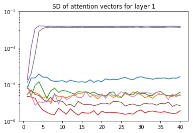
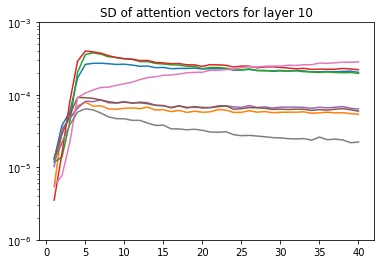
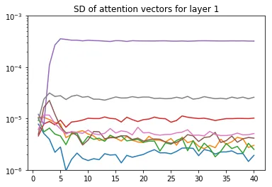
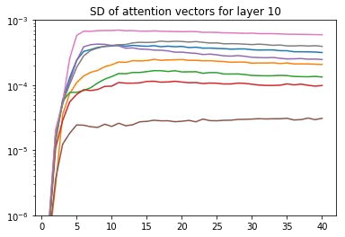
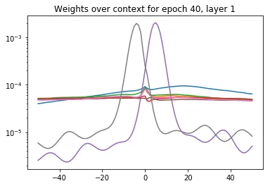
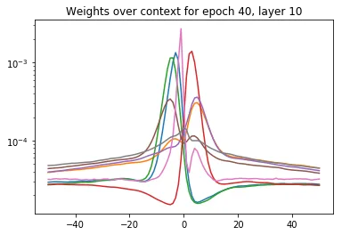
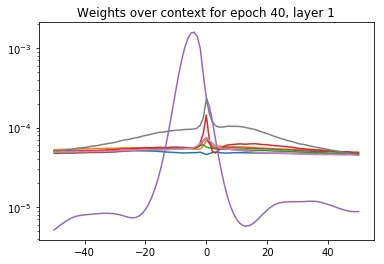
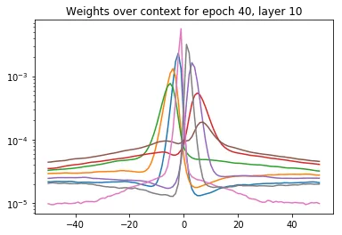

# Self-attention networks for connectionist temporal classification in speech recognition

Julian Salazar^(⋆)    Katrin Kirchhoff^(⋆†)    Zhiheng Huang^(⋆)

###### Abstract

The success of self-attention in NLP has led to recent applications in
end-to-end encoder-decoder architectures for speech recognition.
Separately, connectionist temporal classification (CTC) has matured as
an alignment-free, non-autoregressive approach to sequence transduction,
either by itself or in various multitask and decoding frameworks. We
propose _SAN-CTC_, a deep, fully self-attentional network for CTC, and
show it is tractable and competitive for end-to-end speech recognition.
SAN-CTC trains quickly and outperforms existing CTC models and most
encoder-decoder models, with character error rates (CERs) of 4.7% in 1
day on WSJ _eval92_ and 2.8% in 1 week on LibriSpeech _test-clean_, with
a fixed architecture and one GPU. Similar improvements hold for WERs
after LM decoding. We motivate the architecture for speech, evaluate
position and downsampling approaches, and explore how label alphabets
(character, phoneme, subword) affect attention heads and performance.

###### Index Terms: 

speech recognition, connectionist temporal classification,
self-attention, multi-head attention, end-to-end

^(†)^(†)address: ^(⋆)Amazon AI   ^(†)University of Washington  
{julsal,katrinki,zhiheng}@amazon.com^(†)^(†) Copyright 2019 IEEE.
Published in the IEEE 2019 International Conference on Acoustics,
Speech, and Signal Processing (ICASSP 2019), scheduled for 12-17 May,
2019, in Brighton, United Kingdom.  
Personal use of this material is permitted. However, permission to
reprint/republish this material for advertising or promotional purposes
or for creating new collective works for resale or redistribution to
servers or lists, or to reuse any copyrighted component of this work in
other works, must be obtained from the IEEE.  
_Contact:_ Manager, Copyrights and Permissions / IEEE Service Center /
445 Hoes Lane / P.O. Box 1331 / Piscataway, NJ 08855-1331, USA.
Telephone: + Intl. 908-562-3966.

## 1 Introduction

_Connectionist temporal classification_ (CTC) \[1\] has matured as a
scalable, end-to-end approach to _monotonic_ sequence transduction tasks
like handwriting recognition \[2\], action labeling \[3\], and automatic
speech recognition (ASR) \[1, 4, 5, 6, 7, 8, 9, 10, 11\], sidestepping
the label alignment procedure required by traditional hidden Markov
model plus neural network (HMM-NN) approaches \[12\]. However, the most
successful end-to-end approach to _general_ sequence transduction has
been the encoder-decoder \[13\] with attention \[14\]. Though first used
in machine translation, its generality makes it useful to ASR as well
\[15, 16, 17, 18, 19, 20\]. However, the lack of enforced monotonicity
makes encoder-decoder ASR models difficult to train, often necessitating
thousands of hours of data \[18\], careful learning rate schedules
\[19\], pretraining \[20\], or auxiliary CTC losses \[17, 21, 20\] to
approach state-of-the-art results. The decoders are also typically
autoregressive at prediction time \[13, 22\], restricting inference
speed.

Both approaches have conventionally used recurrent layers to model
temporal dependencies. As this hinders parallelization, later works
proposed partially- or purely-convolutional CTC models \[8, 9, 10, 11\]
and convolution-heavy encoder-decoder models \[16\] for ASR. However,
convolutional models must be significantly deeper to retrieve the same
temporal receptive field \[23\]. Recently, the mechanism of
_self-attention_ \[24, 22\] was proposed, which uses the whole sequence
at once to model feature interactions that are arbitrarily distant in
time. Its use in both encoder-decoder and feedforward contexts has led
to faster training and state-of-the-art results in translation (via the
Transformer \[22\]), sentiment analysis \[25\], and other tasks. These
successes have motivated preliminary work in self-attention for ASR.
Time-restricted self-attention was used as a drop-in replacement for
individual layers in the state-of-the-art lattice-free MMI model \[26\],
an HMM-NN system. Hybrid self-attention/LSTM encoders were studied in
the context of listen-attend-spell (LAS) \[27\], and the Transformer was
directly adapted to speech in \[19, 28, 29\]; both are encoder-decoder
systems.

In this work, we propose and evaluate fully self-attentional networks
for CTC (_SAN-CTC_). We are motivated by practicality: self-attention
could be used as a drop-in replacement in existing CTC-like systems,
where only attention has been evaluated in the past \[30, 31\]; unlike
encoder-decoder systems, SAN-CTC is able to predict tokens in parallel
at inference time; an analysis of SAN-CTC is useful for future
state-of-the-art ASR systems, which may equip self-attentive encoders
with auxiliary CTC losses \[17, 20\]. Unlike past works, we do not
require convolutional frontends \[19\] or interleaved recurrences \[27\]
to train self-attention for ASR. In Section 2, we motivate the model and
relevant design choices (position, downsampling) for ASR. In Section 3,
we validate SAN-CTC on the Wall Street Journal and LibriSpeech datasets
by outperforming existing CTC models and most encoder-decoder models in
character error rates (CERs), with fewer parameters or less training
time. Finally, we train our models with different label alphabets
(character, phoneme, subword), use WFST decoding to give word error
rates (WERs), and examine the learned attention heads for insights.

## 2 Model architectures for CTC and ASR

Consider an input sequence of $`T`$ feature vectors, viewed as a matrix
$`{\bm{X}}\in\mathbb{R}^{T\times d_{\text{fr}}}`$. Let $`{\mathbb{L}}`$
denote the (finite) label alphabet, and denote the output sequence as
$`{\bm{y}}=(y_{1},\dotsc,y_{U})\in{\mathbb{L}}^{U}`$. In ASR,
$`{\bm{X}}`$ is the sequence of acoustic frames, $`{\mathbb{L}}`$ is the
set of graphemes/phonemes/wordpieces, and $`{\bm{y}}`$ is the
corresponding ground-truth transcription over $`{\mathbb{L}}`$.

For CTC, one assumes $`U\leq T`$ and defines an intermediate alphabet
$`{\mathbb{L}}^{\prime}={\mathbb{L}}\cup\{-\}`$, where ‘$`-`$’ is called
the _blank symbol_. A _path_ is a $`T`$-length sequence of intermediate
labels
$`{\bm{\pi}}=(\pi_{1},\dotsc,\pi_{T})\in{\mathbb{L}}^{\prime T}`$. Paths
are related to output sequences by a many-to-one mapping that collapses
repeated labels then removes blank symbols:

```math
\mathcal{B}:{\mathbb{L}}^{\prime T}\to{\mathbb{L}}^{\leq T},\ \text{e.g., }(a,b,-,-,b,b,-,a)\mapsto(a,b,b,a). \tag{1}
```

In this way, paths are analogous to framewise alignments in the HMM-NN
framework. CTC models the distribution of sequences by marginalizing
over all paths corresponding to an output:

```math
\textstyle P({\mathbf{y}}\mid{\mathbf{X}})=\sum_{{\bm{\pi}}\in\mathcal{B}^{-1}({\mathbf{y}})}P({\bm{\pi}}\mid{\mathbf{X}}). \tag{2}
```

Finally, CTC models each $`P({\bm{\uppi}}\mid{\mathbf{X}})`$
non-autoregressively, as a sequence of conditionally-independent
outputs:

```math
\textstyle P({\bm{\uppi}}\mid{\mathbf{X}})=\prod_{t=1}^{T}P({\textnormal{\textpi}}_{t},t\mid{\mathbf{X}}). \tag{3}
```

This model assumption means each
$`P({\textnormal{\textpi}}_{t},t\mid{\mathbf{X}})`$ could be computed in
parallel, after which one can do prediction via beam search, or training
with gradient descent using the objective
$`\mathcal{L}_{\text{CTC}}({\bm{X}},{\bm{y}})=\textstyle-\log P({\bm{y}}\mid{\bm{X}})`$;
the order-monotonicity of $`\mathcal{B}`$ ensures
$`\mathcal{L}_{\text{CTC}}`$ can be efficiently evaluated with dynamic
programming \[1, 4\].

### 2.1 Recurrent and convolutional models

In practice, one models
$`P({\bm{\uppi}},{\textnormal{t}}\mid{\mathbf{X}})`$ with a neural
network. As inspired by HMMs, the model simplification of conditional
independence can be tempered by multiple layers of (recurrent)
bidirectional long short-term memory units (BLSTMs) \[1, 2, 4, 3\].
However, these are computationally expensive (Table 1), leading to
simplifications like gated recurrent units (GRUs) \[8, 32\];
furthermore, the success of the $`\text{ReLU}(x)=\max(0,x)`$
nonlinearity in preventing vanishing gradients enabled the use of
vanilla bidirectional recurrent deep neural networks (BRDNNs) \[5, 33,
6\] to further reduce operations per layer.

Convolutions over time and/or frequency were first used as initial
layers to recurrent neural models, beginning with HMM-NNs \[34\] and
later with CTC, where they are viewed as promoting invariance to
temporal and spectral translation in ASR \[8\], or image translation in
handwriting recognition \[35\]; they also serve as a form of
dimensionality reduction (Section 2.4). However, these networks were
still bottlenecked by the sequentiality of operations at the recurrent
layers, leading \[8\] to propose row convolutions for unidirectional
RNNs, which had finite lookaheads to enable online processing while
having some future context.

This led to convolution-only CTC models for long-range temporal
dependencies \[9, 10, 11\]. However, these models have to be very deep
(e.g., 17-19 convolutional layers on LibriSpeech \[23\]) to cover the
same context (Table 1). While in theory, a relatively local context
could suffices for ASR, this is complicated by alphabets
$`{\mathbb{L}}`$ which violate the conditional independence assumption
of CTC (e.g., English characters \[36\]). Wide contexts also enable
incorporation of noise/speaker contexts, as \[27\] suggest regarding the
broad-context attention heads in the first layer of their
self-attentional LAS model.

### 2.2 Motivating the self-attention layer

(a) SAN-CTC framework

(b) Self-attention layer

Figure 1: Self-attention and CTC

We now replace recurrent and convolutional layers for CTC with
self-attention \[24\]. Our proposed framework (Figure 1a) is built
around _self-attention layers_, as used in the Transformer encoder
\[22\], previous explorations of self-attention in ASR \[27, 19\], and
defined in Section 2.3. The other stages are _downsampling_, which
reduces input length $`T`$ via methods like those in Section 2.4;
_embedding_, which learns a $`d_{\text{h}}`$-dim. embedding that also
describes token position (Section 2.5); and _projection_, where each
final representation is mapped framewise to logits over the intermediate
alphabet $`{\mathbb{L}}^{\prime}`$.

A layer’s structure (Figure 1b) is composed of two _sublayers_. The
first implements _self-attention_, where the success of attention in CTC
and encoder-decoder models \[14, 31\] is parallelized by using each
position’s representation to attend to all others, giving a
contextualized representation for that position. Hence, the full
receptive field is immediately available at the cost of $`O(T^{2})`$
inner products (Table 1), enabling richer representations in fewer
layers.

| Model                                  | Operations per layer | Sequential operations | Maximum path length |
| -------------------------------------- | -------------------- | --------------------- | ------------------- |
| Recurrent                              | $`O(Td^{2})`$        | $`O(T)`$              | $`O(T)`$            |
| Convolutional                          | $`O(kTd^{2})`$       | $`O(1)`$              | $`O(T/k)`$          |
| Convolutional (strided/dilated/pooled) | $`O(kTd^{2})`$       | $`O(1)`$              | $`O(\log_{k}(T))`$  |
| Self-attention                         | $`O(T^{2}d)`$        | $`O(1)`$              | $`O(T)`$            |
| Self-attention (restricted)            | $`O(kTd)`$           | $`O(1)`$              | $`O(T/k)`$          |

Table 1: Operation complexity of each layer type, based on \[22\]. $`T`$
is input length, $`d`$ is no. of hidden units, and $`k`$ is
filter/context width.

We also see inspiration from convolutional blocks: residual connections,
layer normalization, and tied dense layers with ReLU for representation
learning. In particular, _multi-head_ attention is akin to having a
number of infinitely-wide filters whose weights adapt to the content
(allowing fewer “filters” to suffice). One can also assign
interpretations; for example, \[27\] argue their LAS self-attention
heads are differentiated phoneme detectors. Further inductive biases
like filter widths and causality could be expressed through
_time-restricted self-attention_ \[26\] and _directed self-attention_
\[25\], respectively.

### 2.3 Formulation

Let $`{\bm{H}}\in\mathbb{R}^{T\times d_{\text{h}}}`$ denote a sublayer’s
input. The first sublayer performs multi-head, _scaled dot-product_,
self-attention \[22\]. For each head $`i`$ of $`n_{\text{hds}}`$, we
learn linear maps
$`{\bm{W}}_{Q}^{(i)},{\bm{W}}_{K}^{(i)}\in\mathbb{R}^{d_{\text{h}}\times d_{\text{k}}}`$,
$`{\bm{W}}_{V}^{(i)}\in\mathbb{R}^{d_{\text{h}}\times d_{\text{h}}/n_{\text{hds}}}`$.
Left multiplication by $`{\bm{H}}`$ give the _queries_
$`{\bm{Q}}^{(i)}`$, _keys_ $`{\bm{K}}^{(i)}`$, and _values_
$`{\bm{V}}^{(i)}`$ of the $`i`$-th head, which combine to give

```math
\displaystyle\textbf{HdAtt}^{(i)}=\sigma\left({\bm{Q}}^{(i)}{\bm{K}}^{(i)\top}/\sqrt{d_{\text{h}}}\right){\bm{V}}^{(i)}, \tag{4}
```

where $`\sigma`$ is row-wise softmax. Heads are concatenated along the
$`d_{\text{h}}/n_{\text{hds}}`$ axis to give
$`\textbf{MltHdAtt}=[\textbf{HdAtt}^{(1)},\dotsc,\textbf{HdAtt}^{(n_{\text{hds}})}]`$.
The second sublayer is a _position-wise feed-forward network_ \[22\]
$`\textbf{FFN}({\bm{H}})=\text{ReLU}({\bm{H}}{\bm{W}}_{1}+{\bm{b}}_{1}){\bm{W}}_{2}+{\bm{b}}_{2}`$
where parameters
$`{\bm{W}}_{1}\in\mathbb{R}^{d_{\text{h}}\times d_{\text{ff}}}`$,
$`{\bm{b}}_{1}\in\mathbb{R}^{d_{\text{ff}}}`$,
$`{\bm{W}}_{2}\in\mathbb{R}^{d_{\text{ff}}\times d_{\text{h}}}`$,
$`{\bm{b}}_{2}\in\mathbb{R}^{d_{\text{h}}}`$ are learned, with the
biases $`{\bm{b}}_{1},{\bm{b}}_{2}`$ broadcasted over all $`T`$
positions. This sublayer aggregates the multiple heads at time $`t`$
into the attention layer’s final output at $`t`$. All together, the
layer is given by:

```math
\displaystyle\textbf{MidLyr}({\bm{H}}) \displaystyle=\text{LN}(\textbf{MltHdAtt}({\bm{H}})+{\bm{H}}), \tag{5}
```

```math
\displaystyle\textbf{SelfAttLyr}({\bm{H}}) \displaystyle=\text{LN}(\textbf{FFN}(\textbf{MidLyr}({\bm{H}}))+\textbf{MidLyr}({\bm{H}})). \tag{6}
```

### 2.4 Downsampling

In speech, the input length $`T`$ of frames can be many times larger
than the output length $`U`$, in contrast to the roughly word-to-word
setting of machine translation. This is especially prohibitive for
self-attention in terms of memory: recall that an attention matrix of
dimension $`{\bm{Q}}^{(i)}{\bm{K}}^{(i)\top}\in\mathbb{R}^{T\times T}`$
is created, giving the $`T^{2}`$ factor in Table 1. A convolutional
frontend is a typical downsampling strategy \[8, 19\]; however, we leave
integrating other layer types into SAN-CTC as future work. Instead, we
consider three fixed approaches, from least- to most-preserving of the
input data: _subsampling_, which only takes every $`k`$-th frame;
_pooling_, which aggregates every $`k`$ consecutive frames via a
statistic (average, maximum); _reshaping_, where one concatenates $`k`$
consecutive frames into one \[27\]. Note that CTC will still require
$`U\leq T/k`$, however.

### 2.5 Position

Self-attention is inherently content-based \[22\], and so one often
encodes position into the post-embedding vectors. We use standard
trigonometric embeddings, where for $`0\leq i\leq d_{\text{emb}}/2`$, we
define

```math
\displaystyle\textstyle\text{PE}(t,2i)=\sin\frac{t}{10000^{2i/d_{\text{emb}}}},\ \text{PE}(t,2i+1)=\cos\frac{t}{10000^{2i/d_{\text{emb}}}}.
```

for position $`t`$. We consider three approaches: _content-only_ \[21\],
which forgoes position encodings; _additive_ \[19\], which takes
$`d_{\text{emb}}=d_{\text{h}}`$ and adds the encoding to the embedding;
and _concatenative_, where one takes $`d_{\text{emb}}=40`$ and
concatenates it to the embedding. The latter was found necessary for
self-attentional LAS \[27\], as additive encodings did not give
convergence. However, the monotonicity of CTC is a further positional
inductive bias, which may enable the success of content-only and
additive encodings.

















Figure 2: Average attention weights over WSJ’s test set. The left half
is a character model; the right half is a phoneme model. Each curve
corresponds to a head, at layers 1 and 10, of representative SAN-CTC
models (reshape + additive embedding). The first row charts standard
deviation over time; the second row charts the attention magnitudes
relative to position, where 0 represents attending to the same position.

## 3 Experiments

We take
$`(n_{\text{layers}},d_{\text{h}},n_{\text{heads}},d_{\text{ff}})=`$
(10, 512, 8, 2048), giving $`\scriptstyle\sim`$30M parameters. This is
on par with models on WSJ (10-30M) \[4, 5, 9\] and an order of magnitude
below models on LibriSpeech (100-250M) \[8, 23\]. We use MXNet \[37\]
for modeling and Kaldi/EESEN \[38, 7\] for data preparation and
decoding. Our self-attention code is based on GluonNLP’s implementation.
At train time, utterances are sorted by length: we exclude those longer
than 1800 frames ($`\ll`$1% of each training set). We take a window of
25ms, a hop of 10ms, and concatenate cepstral mean-variance normalized
features with temporal first- and second-order differences.¹¹ 1
Rescaling so that these differences also have var. $`\approx 1`$ helped
WSJ training. We downsample by a factor of $`k=3`$ (this also gave an
ideal $`T/k\approx d_{\text{h}}`$ for our data; see Table 1).

We perform Nesterov-accelerated gradient descent on batches of 20
utterances. As self-attention architectures can be unstable in early
training, we clip gradients to a global norm of 1 and use the standard
linear warmup period before inverse square decay associated with these
architectures \[22, 19\]. Let $`n`$ denote the global step number of the
batch (across epochs); the learning rate is given by

```math
\textstyle\text{LR}(n)=\frac{\lambda}{\sqrt{d_{\text{h}}}}\min\left(\frac{n}{n_{\text{warmup}}^{1.5}},\frac{1}{\sqrt{n}}\right), \tag{7}
```

where we take $`\lambda=`$ 400 and $`n_{\text{warmup}}`$ as a
hyperparameter. However, such a decay led to early stagnation in
validation accuracy, so we later divide the learning rate by $`10`$ and
run at the decayed rate for 20 epochs. We do this twice, then take the
epoch with the best validation score. Xavier initialization gave
validation accuracies of zero for the first few epochs, suggesting room
for improvement. Like previous works on self-attention, we apply label
smoothing (see Tables 2, 3, 5; we also tried model averaging to no
gain). To compute word error rates (WERs), we use the dataset’s provided
language model (LM) as incorporated by WFST decoding \[7\] to bridge the
gap between CTC and encoder-decoder frameworks, allowing comparison with
known benchmarks and informing systems that incorporate expert knowledge
in this way (e.g., via a pronunciation lexicon).

### 3.1 Wall Street Journal (WSJ)

|                                     |       |     |        |     |
| ----------------------------------- | ----- | --- | ------ | --- |
| Model                               | dev93 |     | eval92 |     |
|                                     | CER   | WER | CER    | WER |
| CTC (BRDNN) \[5\]                   | —     | —   | 10.0   | —   |
| CTC (BLSTM) \[4\]                   | —     | —   | 9.2    | —   |
| CTC (BLSTM) \[17\]                  | 11.5  | —   | 9.0    | —   |
| Enc-Dec (4-1) \[17\]                | 12.0  | —   | 8.2    | —   |
| Enc-Dec+CTC (4-1) \[17\]            | 11.3  | —   | 7.4    | —   |
| Enc-Dec (4-1) \[39\]                | —     | —   | 6.4    | 9.3 |
| CTC/ASG (Gated CNN) \[40\]          | 6.9   | 9.5 | 4.9    | 6.6 |
| Enc-Dec (2,1,3-1) \[41\]            | —     | —   | 3.6    | —   |
| CTC (SAN), reshape, additive        | 7.1   | 9.3 | 5.1    | 6.1 |
| + label smoothing, $`\lambda=`$ 0.1 | 6.4   | 8.9 | 4.7    | 5.9 |

Table 2: End-to-end, MLE-based, open-vocab. models trained on WSJ. Only
WERs incorporating the extended 3-gram LM or a 4-gram LM (Gated CNN) are
listed.

We train both character- and phoneme-label systems on the 80-hour WSJ
training set to validate our architectural choices. Similar to \[17,
19\], we use 40-dim. mel-scale filter banks and hence 120-dim. features.
We warmup for 8000 steps, use a dropout of 0.2, and switch schedules at
epoch 40. For the WSJ dataset, we compare with similar MLE-trained,
end-to-end, open-vocabulary systems in Table 2. We get an _eval92_ CER
of 4.7%, outdoing all previous CTC-like results except 4.6% with a
trainable frontend \[40\]. We use the provided extended 3-gram LM to
retrieve WERs. For phoneme training, our labels come from the CMU
pronunciation lexicon (Table 3). These models train in one day (Tesla
V100), comparable to the Speech Transformer \[19\]; however, SAN-CTC
gives further benefits at inference time as token predictions are
generated in parallel.

|                                     |       |      |        |      |
| ----------------------------------- | ----- | ---- | ------ | ---- |
| Model                               | dev93 |      | eval92 |      |
|                                     | PER   | WER  | PER    | WER  |
| CTC (BRDNN) \[7\]                   | —     | —    | —      | 7.87 |
| CTC (BLSTM) \[11\]                  | —     | 9.12 | —      | 5.48 |
| CTC (ResCNN) \[11\]                 | —     | 9.99 | —      | 5.35 |
| Ensemble of 3 (voting) \[11\]       | —     | 7.65 | —      | 4.29 |
| CTC (SAN), reshape, additive        | 7.12  | 8.09 | 5.07   | 4.84 |
| + label smoothing, $`\lambda=`$ 0.1 | 6.86  | 8.16 | 4.73   | 5.23 |

Table 3: CTC phoneme models with WFST decoding on WSJ.

We also evaluate design choices in Table 4. Here, we consider the
effects of downsampling and position encoding on accuracy for our fixed
training regime. We see that unlike self-attentional LAS \[27\], SAN-CTC
works respectably even with no position encoding; in fact, the
contribution of position is relatively minor (compare with \[21\], where
location in an encoder-decoder system improved CER by 3% absolute).
Lossy downsampling appears to preserve performance in CER while
degrading WER (as information about frame transitions is lost). We
believe these observations align with the monotonicity and independence
assumptions of CTC.

|                   |                    |       |       |
| ----------------- | ------------------ | ----- | ----- |
| Downsampling      | Position embedding | dev93 |       |
|                   |                    | CER   | WER   |
| reshape           | content-only       | 7.62  | 9.57  |
| reshape           | additive           | 7.10  | 9.27  |
| reshape           | concatenative      | 7.10  | 9.97  |
| pooling (maximum) | additive           | 7.15  | 10.72 |
| pooling (average) | additive           | 6.82  | 9.41  |
| subsample         | additive           | none  | none  |

Table 4: SAN-CTC character model on WSJ with modifications.

Inspired by \[27\], we plot the standard deviation of attention weights
for each head as training progresses; see Figure 2 for details. In the
first layers, we similarly observe a differentiation of variances, along
with wide-context heads; in later layers, unlike \[27\] we still see
mild differentiation of variances. Inspired by \[26\], we further plot
the attention weights relative to the current time position (here, per
head). Character labels gave forward- and backward-attending heads
(incidentally, averaging these would retrieve the bimodal distribution
in \[26\]) at all layers. This suggests a gradual expansion of context
over depth, as is often engineered in convolutional CTC. This also
suggests possibly using fewer heads, directed self-attention \[25\], and
restricted contexts for faster training (Table 1). Phoneme labels gave a
sharp backward-attending head and more diffuse heads. We believe this to
be a symptom of English characters being more context-dependent than
phonemes (for example, emitting ‘tt’ requires looking ahead, as ‘–’ must
occur between two runs of ‘t’ tokens).

### 3.2 LibriSpeech

We give the first large-scale demonstration of a fully self-attentional
ASR model using the LibriSpeech ASR corpus \[42\], an English corpus
produced from audio books giving 960 hours of training data. We use
13-dim. mel-freq. cepstral coeffs. and hence 39-dim. features. We double
the warmup period, use a dropout of 0.1, and switch schedules at epoch 30. Using character labels, we attained a _test-clean_ CER of 2.8%,
outdoing all previous end-to-end results except OCD training \[41\]. We
use the provided 4-gram LM via WFST to compare WERs with
state-of-the-art, end-to-end, open-vocabulary systems in Table 5. At
this scale, even minor label smoothing was detrimental. We run 70 epochs
in slightly over a week (Tesla V100) then choose the epoch with the best
validation score for testing. For comparison, the best CTC-like
architecture \[23\] took 4-8 weeks on 4 GPUs for its results.²² 2
[https://github.com/facebookresearch/wav2letter/issues/11](https://github.com/facebookresearch/wav2letter/issues/11)
The Enc-Dec+CTC model is comparable, taking almost a week on an older
GPU (GTX 1080 Ti) to do its $`\sim`$12.5 full passes over the data.³³ 3
[https://github.com/rwth-i6/returnn-experiments/tree/master/2018-asr-attention/librispeech/full-setup-attention](https://github.com/rwth-i6/returnn-experiments/tree/master/2018-asr-attention/librispeech/full-setup-attention)

|                                      |      |            |     |            |      |
| ------------------------------------ | ---- | ---------- | --- | ---------- | ---- |
| Model                                | Tok. | test-clean |     | test-other |      |
|                                      |      | CER        | WER | CER        | WER  |
| CTC/ASG (Wav2Letter) \[9\]           | chr. | 6.9        | 7.2 | —          | —    |
| CTC (DS1-like) \[33, 43\]            | chr. | —          | 6.5 | —          | —    |
| Enc-Dec (4-4) \[44\]                 | chr. | 6.5        | —   | 18.1       | —    |
| Enc-Dec (6-1) \[45\]                 | chr. | 4.5        | —   | 11.6       | —    |
| CTC (DS2-like) \[8, 32\]             | chr. | —          | 5.7 | —          | 15.2 |
| Enc-Dec+CTC (6-1, pretr.) \[20\]     | 10k  | —          | 4.8 | —          | 15.3 |
| CTC/ASG (Gated CNN) \[23\]           | chr. | —          | 4.8 | —          | 14.5 |
| Enc-Dec (2,6-1) \[41\]               | 10k  | 2.9        | —   | 8.4        | —    |
| CTC (SAN), reshape, additive         | chr. | 3.2        | 5.2 | 9.9        | 13.9 |
| + label smoothing, $`\lambda=`$ 0.05 | chr. | 3.5        | 5.4 | 11.3       | 14.5 |
| CTC (SAN), reshape, concat.          | chr. | 2.8        | 4.8 | 9.2        | 13.1 |

Table 5: End-to-end, MLE-based, open-vocab. models trained on
LibriSpeech. Only WERs incorporating the 4-gram LM are listed.

Finally, we trained the same model with BPE subwords as CTC targets, to
get more context-independent units \[36\]. We did 300 merge operations
(10k was unstable) and attained a CER of 7.4%. This gave a WER of 8.7%
with no LM (compare with Table 5’s LM-based entries), and 5.2% with a
subword WFST of the LM. We still observed attention heads in both
directions in the first layer, suggesting our subwords were still more
context-dependent than phonemes.

## 4 Conclusion

We introduced SAN-CTC, a novel framework which integrates a fully
self-attentional network with a connectionist temporal classification
loss. We addressed the challenges of adapting self-attention to CTC and
to speech recognition, showing that SAN-CTC is competitive with or
outperforms existing end-to-end models on WSJ and LibriSpeech. Future
avenues of work include multitasking SAN-CTC with other decoders or
objectives, and streamlining network structure via directed or
restricted attention.

## References

- \[1\] A. Graves, S. Fernández, F. Gomez, and J. Schmidhuber,
  “Connectionist temporal classification: labelling unsegmented sequence
  data with recurrent neural networks,” in Proc. Int. Conf. Mach.
  Learning (ICML). ACM, 2006, pp. 369–376.
- \[2\] A. Graves and J. Schmidhuber, “Offline handwriting recognition
  with multidimensional recurrent neural networks,” in Proc. Adv. Neural
  Inform. Process. Syst. (NIPS), 2009, pp. 545–552.
- \[3\] D.-A. Huang, L. Fei-Fei, and J.C. Niebles, “Connectionist
  temporal modeling for weakly supervised action labeling,” in Proc.
  Eur. Conf. Comput. Vision (ECCV), 2016, pp. 137–153.
- \[4\] A. Graves and N. Jaitly, “Towards end-to-end speech recognition
  with recurrent neural networks,” in Proc. Int. Conf. Mach. Learning
  (ICML). ACM, 2014, pp. 1764–1772.
- \[5\] A.Y. Hannun, A.L. Maas, D. Jurafsky, and A.Y. Ng, “First-pass
  large vocabulary continuous speech recognition using bi-directional
  recurrent DNNs,” CoRR, vol. abs/1408.2873, 2014.
- \[6\] A.L. Maas, Z. Xie, D. Jurafsky, and A.Y. Ng, “Lexicon-free
  conversational speech recognition with neural networks,” in Proc.
  Conf. North Amer. Ch. Assoc. Comput. Linguistics Human Lang. Technol.
  (NAACL-HLT), 2015, pp. 345–354.
- \[7\] Y. Miao, M. Gowayyed, and F. Metze, “EESEN: End-to-end speech
  recognition using deep RNN models and WFST-based decoding,” in Proc.
  IEEE Autom. Speech Recognition Understanding Workshop (ASRU). IEEE,
  2015, pp. 167–174.
- \[8\] D. Amodei, S. Ananthanarayanan, R. Anubhai, J. Bai,
  E. Battenberg, C. Case, J. Casper, B. Catanzaro, Q. Cheng, G. Chen,
  et al., “Deep Speech 2: End-to-end speech recognition in English and
  Mandarin,” in Proc. Int. Conf. Mach. Learning (ICML). ACM, 2016, pp.
  173–182.
- \[9\] R. Collobert, C. Puhrsch, and G. Synnaeve, “Wav2Letter: an
  end-to-end ConvNet-based speech recognition system,” CoRR, vol.
  abs/1609.03193, 2016.
- \[10\] Y. Zhang, M. Pezeshki, P. Brakel, S. Zhang, C. Laurent,
  Y. Bengio, and A. C. Courville, “Towards end-to-end speech recognition
  with deep convolutional neural networks,” in Proc. Ann. Conf. Int.
  Speech Communication Assoc. (INTERSPEECH), 2016, pp. 410–414.
- \[11\] Y. Wang, X. Deng, S. Pu, and Z. Huang, “Residual convolutional
  CTC networks for automatic speech recognition,” CoRR, vol.
  abs/1702.07793, 2017.
- \[12\] A.J. Robinson, “An application of recurrent nets to phone
  probability estimation,” IEEE Trans. Neural Netw., vol. 5, no. 2, pp.
  298–305, 1994.
- \[13\] I. Sutskever, O. Vinyals, and Q.V. Le, “Sequence to sequence
  learning with neural networks,” in Proc. Adv. Neural Inform. Process.
  Syst. (NIPS), 2014, pp. 3104–3112.
- \[14\] D. Bahdanau, K. Cho, and Y. Bengio, “Neural machine translation
  by jointly learning to align and translate,” CoRR, vol.
  abs/1409.0473, 2014.
- \[15\] W. Chan, N. Jaitly, Q.V. Le, and O. Vinyals, “Listen, attend
  and spell: A neural network for large vocabulary conversational speech
  recognition,” in Proc. IEEE Int. Conf. Acoustics Speech Signal
  Process. (ICASSP). IEEE, 2016, pp. 4960–4964.
- \[16\] Y. Zhang, W. Chan, and N. Jaitly, “Very deep convolutional
  networks for end-to-end speech recognition,” in Proc. IEEE Int. Conf.
  Acoustics Speech Signal Process. (ICASSP). IEEE, 2017, pp. 4845–4849.
- \[17\] S. Kim, T. Hori, and S. Watanabe, “Joint CTC-attention based
  end-to-end speech recognition using multi-task learning,” in Proc.
  IEEE Int. Conf. Acoustics Speech Signal Process. (ICASSP). IEEE, 2017,
  pp. 4835–4839.
- \[18\] C.-C. Chiu, T.N. Sainath, Y. Wu, R. Prabhavalkar, P. Nguyen,
  Z. Chen, A. Kannan, R.J. Weiss, K. Rao, K. Gonina, et al.,
  “State-of-the-art speech recognition with sequence-to-sequence
  models,” in Proc. IEEE Int. Conf. Acoustics Speech Signal Process.
  (ICASSP). IEEE, 2018, pp. 4774–4778.
- \[19\] L. Dong, S. Xu, and B. Xu, “Speech-transformer: a no-recurrence
  sequence-to-sequence model for speech recognition,” in Proc. IEEE Int.
  Conf. Acoustics Speech Signal Process. (ICASSP). IEEE, 2018.
- \[20\] A. Zeyer, K. Irie, R. Schlüter, and H. Ney, “Improved training
  of end-to-end attention models for speech recognition,” in Proc. Ann.
  Conf. Int. Speech Communication Assoc. (INTERSPEECH), 2018.
- \[21\] T. Hori, S. Watanabe, Y. Zhang, and W. Chan, “Advances in joint
  CTC-attention based end-to-end speech recognition with a deep CNN
  encoder and RNN-LM,” in Proc. Ann. Conf. Int. Speech Communication
  Assoc. (INTERSPEECH), 2017.
- \[22\] A. Vaswani, N. Shazeer, N. Parmar, J. Uszkoreit, L. Jones, A.N.
  Gomez, Ł. Kaiser, and I. Polosukhin, “Attention is all you need,” in
  Proc. Adv. Neural Inform. Process. Syst. (NIPS), 2017, pp. 6000–6010.
- \[23\] V. Liptchinsky, G. Synnaeve, and R. Collobert, “Letter-based
  speech recognition with gated ConvNets,” CoRR, vol.
  abs/1712.09444, 2017.
- \[24\] J. Cheng, L. Dong, and M. Lapata, “Long short-term
  memory-networks for machine reading,” in Proc. Conf. Empirical Methods
  Natural Lang. Process. (EMNLP), 2016, pp. 551–561.
- \[25\] T. Shen, T. Zhou, G. Long, J. Jiang, S. Pan, and C. Zhang,
  “DiSAN: Directional self-attention network for RNN/CNN-free language
  understanding,” in Proc. AAAI Conf. Artificial Intell. (AAAI), 2018.
- \[26\] D. Povey, H. Hadian, P. Ghahremani, K. Li, and S. Khudanpur, “A
  time-restricted self-attention layer for ASR,” in Proc. IEEE Int.
  Conf. Acoustics Speech Signal Process. (ICASSP). IEEE, 2018.
- \[27\] M. Sperber, J. Niehues, G. Neubig, S. Stüker, and A. Waibel,
  “Self-attentional acoustic models,” in Proc. Ann. Conf. Int. Speech
  Communication Assoc. (INTERSPEECH), 2018.
- \[28\] S. Zhou, L. Dong, S. Xu, and B. Xu, “Syllable-based
  sequence-to-sequence speech recognition with the Transformer in
  Mandarin Chinese,” in Proc. Ann. Conf. Int. Speech Communication
  Assoc. (INTERSPEECH), 2018.
- \[29\] S. Zhou, S. Xu, and B. Xu, “Multilingual end-to-end speech
  recognition with a single Transformer on low-resource languages,”
  CoRR, vol. abs/1806.05059, 2018.
- \[30\] Rohit Prabhavalkar, Kanishka Rao, Tara N. Sainath, Bo Li, Leif
  Johnson, and Navdeep Jaitly, “A comparison of sequence-to-sequence
  models for speech recognition,” in Proc. Ann. Conf. Int. Speech
  Communication Assoc. (INTERSPEECH). 2017, pp. 939–943, ISCA.
- \[31\] Amit Das, Jinyu Li, Rui Zhao, and Yifan Gong, “Advancing
  connectionist temporal classification with attention modeling,” in
  Proc. IEEE Int. Conf. Acoustics Speech Signal Process. (ICASSP). 2018,
  pp. 4769–4773, IEEE.
- \[32\] Y. Zhou, C. Xiong, and R. Socher, “Improving end-to-end speech
  recognition with policy learning,” in Proc. IEEE Int. Conf. Acoustics
  Speech Signal Process. (ICASSP), 2018, pp. 5819–5823.
- \[33\] A.Y. Hannun, C. Case, J. Casper, B. Catanzaro, G. Diamos,
  E. Elsen, R. Prenger, S. Satheesh, S. Sengupta, A. Coates, et al.,
  “Deep Speech: Scaling up end-to-end speech recognition,” CoRR, vol.
  abs/1412.5567, 2014.
- \[34\] T.N. Sainath, O. Vinyals, A. Senior, and H. Sak,
  “Convolutional, long short-term memory, fully connected deep neural
  networks,” in Proc. IEEE Int. Conf. Acoustics Speech Signal Process.
  (ICASSP). IEEE, 2015, pp. 4580–4584.
- \[35\] Z. Xie, Z. Sun, L. Jin, Z. Feng, and S. Zhang, “Fully
  convolutional recurrent network for handwritten Chinese text
  recognition,” in Proc. Int. Conf. Pattern Recognition (ICPR). IEEE,
  2016, pp. 4011–4016.
- \[36\] T. Zenkel, R. Sanabria, F. Metze, and A. Waibel, “Subword and
  crossword units for CTC acoustic models,” in Proc. Ann. Conf. Int.
  Speech Communication Assoc. (INTERSPEECH), 2018, pp. 396–400.
- \[37\] T. Chen, M. Li, Y. Li, M. Lin, N. Wang, M. Wang, T. Xiao,
  B. Xu, C. Zhang, and Z. Zhang, “MXNet: A flexible and efficient
  machine learning library for heterogeneous distributed systems,” CoRR,
  vol. abs/1512.01274, 2015.
- \[38\] Daniel Povey, Arnab Ghoshal, Gilles Boulianne, Lukas Burget,
  Ondrej Glembek, Nagendra Goel, Mirko Hannemann, Petr Motlicek, Yanmin
  Qian, Petr Schwarz, et al., “The kaldi speech recognition toolkit,” in
  IEEE 2011 workshop on automatic speech recognition and understanding.
  IEEE Signal Processing Society, 2011, number EPFL-CONF-192584.
- \[39\] D. Bahdanau, J. Chorowski, D. Serdyuk, P. Brakel, and
  Y. Bengio, “End-to-end attention-based large vocabulary speech
  recognition,” in Proc. IEEE Int. Conf. Acoustics Speech Signal
  Process. (ICASSP), 2016, pp. 4945–4949.
- \[40\] N. Zeghidour, N. Usunier, G. Synnaeve, R. Collobert, and
  E. Dupoux, “End-to-end speech recognition from the raw waveform,” in
  Proc. Ann. Conf. Int. Speech Communication Assoc. (INTERSPEECH), 2018,
  pp. 781–785.
- \[41\] S. Sabour, W. Chan, and M. Norouzi, “Optimal completion
  distillation for sequence learning,” CoRR, vol. abs/1810.01398, 2018.
- \[42\] V. Panayotov, G. Chen, D. Povey, and S. Khudanpur,
  “LibriSpeech: an ASR corpus based on public domain audio books,” in
  Proc. IEEE Int. Conf. Acoustics Speech Signal Process. (ICASSP). IEEE,
  2015, pp. 5206–5210.
- \[43\] Mozilla Foundation, “A journey to \<10% word error rate,”
  https://hacks.mozilla.org/2017/11/a-journey-to-10-word-error-rate/, 2017.
- \[44\] D. Liang, Z. Huang, and Z.C. Lipton, “Learning noise-invariant
  representations for robust speech recognition,” in Proc. IEEE Spoken
  Language Technol. Workshop (SLT). IEEE, 2018.
- \[45\] A. Sriram, H. Jun, S. Satheesh, and A. Coates, “Cold Fusion:
  Training seq2seq models together with language models,” in Proc. Ann.
  Conf. Int. Speech Communication Assoc. (INTERSPEECH), 2018, pp.
  387–391.
