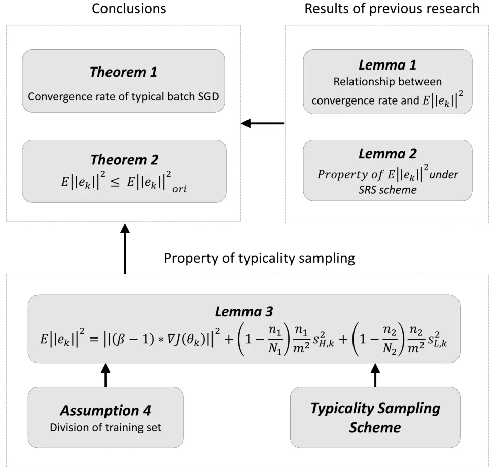

# Accelerating Minibatch Stochastic Gradient Descent using Typicality Sampling

Xinyu Peng    Li Li    and Fei-Yue Wang ^(†)^(†)thanks: Manuscript
received ; This work was supported in part by the National Natural
Science Foundation of China under Grant 61790565. _(Corresponding
author: Li Li.)_^(†)^(†)thanks: X. Peng is with the Department of
Automation, Tsinghua University, Beijing 100084, China (email:
xy-peng18@mails.tsinghua.edu.cn).^(†)^(†)thanks: L. Li is with the
Department of Automation, Tsinghua National Laboratory for Information
Science and Technology, Tsinghua University, Beijing 100084, China
(email: li-li@tsinghua.edu.cn).^(†)^(†)thanks: F.-Y. Wang is with the
State Key Laboratory of Management and Control for Complex Systems,
Institute of Automation, Chinese Academy of Sciences, Beijing 100080,
China (e-mail: feiyue.wang@ia.ac.cn).

###### Abstract

Machine learning, especially deep neural networks, has been rapidly
developed in fields including computer vision, speech recognition and
reinforcement learning. Although Minibatch SGD is one of the most
popular stochastic optimization method in training deep networks, it
shows a slow convergence rate due to the large noise in gradient
approximation. In this paper, we attempt to remedy this problem by
building more efficient batch selection method based on typicality
sampling, which reduces error of gradient estimation in conventional
Minibatch SGD. We analyze convergence rate of the resulting typical
batch SGD algorithm, and compare convergence properties between
Minibatch SGD and the algorithm. Experimental results demonstrate that
our batch selection scheme works well and more complex Minibatch SGD
variants can benefit from the proposed batch selection strategy.

###### Index Terms: 

Machine learning, minibatch stochastic gradient descent, batch
selection, speed of convergence.

## I Introduction

In machine learning, many proposed algorithms involve optimization of
objective function requiring minimization with respect to its
parameters. As an effective and popular method for large scale
optimization problems, Minibatch Stochastic Gradient Descent (Minibatch
SGD) exhibits the benefits from Stochastic Gradient Descent and Gradient
Descent: it uses relatively few data points to approximate true
gradient, which can reduce computation cost while keeping favorable
convergence rate \[1\]. But with rapid growth of data \[2, 3, 4, 5\] and
increasing model complexity \[6, 7, 8\] that lead to successful
industrial applications, the training time by using Minibatch SGD
becomes unmanageable and greatly impede research progress \[9, 10\].

Algorithms for accelerating Minibatch SGD have been extensively studied.
Many exciting works \[11, 12, 13, 14\] focus on the update rule of model
parameters, while another class of algorithms aim to increase the
convergence rate by computing adaptive hyper-parameters \[15, 16, 17,
18\]. However, all of them only consider the Simple Random Sampling
(SRS) scheme during the training process \[19\], which yields an
estimator of true gradient with high variance and slows down the
convergence.

To this end, we propose typicality sampling scheme for Minibatch SGD:
instead of selecting batch by SRS, we prioritize all training samples
according to typicality and encourage high representative samples to be
selected with greater probabilities through the whole optimization
process, which helps the resulting typical batch SGD obtain lower
gradient estimation error and guarantees faster convergence speed.

The key idea is that not all training samples are of same importance in
gradient estimation. On each iteration, it only needs parts of the
training set (we call them high representative samples, or typical
samples) to roughly guide the correct direction of the parameters
update. Increasing the chances of typical samples appearing in the
selected batch can prevents the algorithm from getting trapped by low
signal-to-noise ratio of gradient approximation as the iterates approach
a local minimum, which improves the convergence rate, especially at the
early stage of training. Our analysis shows that under certain
assumptions, the proposed typical batch SGD enjoys linear convergence
rate that considerably faster than Minibatch SGD. Further more, a
practical implementation based on density information of training set
samples and t-SNE embedding is given, which makes the proposed batch
selection method more efficient. The result of improvement is
empirically verified with experiments on both synthetic and natural
datasets.

The rest of this paper is organized as follows. In Section II, we review
the related literature and discuss the major drawback of existing works.
In Section III, we outline the conventional Mini-batch SGD scheme in the
context of Empirical Risk Minimization optimization, and state the basic
assumptions used in this paper. In Section IV, we introduce the details
of our typicality sampling, and show the difference against SRS. In
Section V, we theoretically prove the convergence rate of resulting
typical batch SGD, and compare it with conventional Mini-batch SGD.
Section VI gives a practical implementation and discusses the
experimental results on both synthetic and natural datasets. Our
conclusions are presented in Section VII.

## II Related Work

Plenty of works have been proposed to talk about the idea that using
non-uniform batch selection method for optimization process in machine
learning problems. The first remarkable attempt is curriculum learning
\[20\], which process the samples in an order of easiness and suggest
that easy data points should be provided to the network at early stage.
\[21\] propose self-paced learning that uses the loss on data to
quantifies the easiness, which make the algorithm more accessible when
dealing with real world dataset. However, the measurements of easiness
mentioned in these two works ignore the basic spatial distribution
information of training set samples, making it hard to be generalized to
broader learning scenarios.

The approaches described in \[22\] and \[23\] takes advantage of
importance sampling to accelerate training process. The first one
proposes an online batch selection strategy that evaluates the
importance by ranking all data points with respect to their latest loss
value, while the latter one exhibits unbiased estimate of gradient with
minimum variance by sampling proportional to the norm of the gradient.
In practice, calculating the gradient norm of each sample needs a
feed-forward process on all data at each iteration, which leads to quite
considerable computational cost. Importance sampling with loss value may
be able to alleviate this issue, but it is not a proper approximation of
gradient norm.

Instead of manually designing a batch selection scheme, researchers have
focused on training neural networks to select samples for the target
network. The authors in \[24\] construct a MentorNet to supervise the
training process of the base deep networks through building a dynamic
curriculum at each iteration. \[25\] propose a deep reinforcement
learning framework to develop an adaptive data selection method which
filters important data points automatically. Although these two
approaches show promising experimental results, both of them lack solid
theoretical analysis and guarantees for speedup. Moreover, the training
of extra neural network is quite computationally expensive when applied
to large scale dataset.

More closely related to our work, \[26\] resort to using stratified
sampling strategy for Minibatch SGD training. The authors first utilize
clustering algorithm to divide training set in several groups, and then
perform SRS in each group separately. This work is similar to ours, but
differs significantly in two aspects: i) instead of revealing training
set structure by dividing it into clusters with k-means, we apply t-SNE
embedding algorithm to convert training set into low-dimensional space,
which is better on capturing both local and global structure information
of high-dimensional data while keeping low computational cost. ii) we do
not need the corresponding label of each sample. For our approach, we
distinguish typicality of each training sample by its contribution to
the true gradient, which is then transformed into the form of density
information in practical implementation.

Compared to aforementioned works, our proposed typicality sampling
scheme has several potential advantages. First, by letting high
representative samples dominant the computation of search direction, our
algorithm enables more accurate estimation of the true gradient, which
leads to faster convergence speed. Second, our implementation is
straightforward with negligible additional computational requirement,
and based entirely on the density information of training set samples
without the use of expert knowledge. Third, our method has strong
extensibility and can be coupled with other variant Minibatch SGD
algorithms, improving the convergence performance while keeping the
advantages of original algorithms unchanged.

## III Problem Presentation

Let $`f(x_{i};\theta)`$ be the output predicted by the model with
parameters $`\theta`$ when data observation drawn from training set
$`\mathcal{X}`$ is $`x_{i}`$. Our goal is to find a approximate solution
of the Empirical Risk Minimization (ERM) problem, which is often
typified as the form

```math
\min_{\theta\in\Theta}J(\theta)=\frac{1}{N}\sum_{i=1}^{N}\ell(f(x_{i};\theta),y_{i}). \tag{1}
```

In general case, each term $`\ell(\cdot)`$ models the loss between
predicted result and corresponding label $`y_{i}`$. $`J(\theta)`$
measures the overall misfit across the whole training set. As a popular
method for minimizing (1), Minibatch SGD usually performs the following
update rule on iteration $`k`$

```math
\displaystyle\theta_{k+1} \displaystyle= \displaystyle\theta_{k}-\eta_{k}\nabla J_{\mathcal{B}}(\theta),
```

```math
\displaystyle\text{ where }\,\,\,\nabla J_{\mathcal{B}}(\theta) \displaystyle= \displaystyle\frac{1}{m}\sum_{i\in\mathcal{B}}\nabla\ell(f(x_{i};\theta),y_{i}), \tag{2}
```

and $`\mathcal{B}`$ is a mini-batch sampled from $`\mathcal{X}`$ using
SRS method, where $`m`$ is the Minibatch size and $`\eta_{k}`$ is the
learning rate. Based on (2), we can regard the stochastic gradient
$`\nabla J_{\mathcal{B}}(\theta)`$ constructed in Minibatch SGD as a
noisy estimation of true gradient $`\nabla J(\theta_{k})`$. Thus we
define the search direction on iteration $`k`$ as

```math
\nabla J_{\mathcal{B}}(\theta_{k}):=\nabla J(\theta_{k})+e_{k}, \tag{3}
```

where $`e_{k}`$ denotes the residual term. Although
$`\nabla J_{\mathcal{B}}(\theta)`$ is an unbiased estimator of
$`\nabla J(\theta_{k})`$, the inaccurate estimation, especially the
large value of $`\mathbb{E}\|e_{k}\|^{2}`$ bringing by SRS, still
affects the convergence rate of Minibatch SGD (See Section IV for
details).

For simplicity, we use the following notations throughout the remainder
of this paper. By $`\theta_{k}`$, we denote the value of parameter
$`\theta`$ on iteration $`k`$. By $`\theta_{*}`$, we denote a global
minimizer of $`J(\theta)`$. We use $`\nabla J_{i}(\theta)`$ to denote
$`\nabla\ell(f(x_{i};\theta),y_{i})`$. We also make the following three
common assumptions.

###### Assumption 1 (\[27\])

We assume that a minimizer $`\theta_{*}`$ always exists, that
$`J_{i}(\theta)`$ are differentiable, and that $`\nabla J(\theta)`$ is
Lipschitz continuous, i.e., for any $`x,y\in\Theta`$ and some positive
L:

```math
\|\nabla J(x)-\nabla J(y)\|\leq L\|x-y\|.
```

This is a standard smoothness assumption in the optimization literature
\[28, 29, 30\]. Note that as a consequence of Assumption 1, we have
following inequality holds:

```math
J(y)\leq J\left(x\right)+{{\left(y-x\right)}^{T}}\nabla J\left(x\right)+\frac{L}{2}{\|y-x\|}^{2} \tag{4}
```

###### Assumption 2 (\[31\])

We assume that the objective function $`J(\theta)`$ is strongly convex
with positive parameter $`\mu`$, i.e., for any $`x,y\in\Theta`$,
$`J(\theta)`$ satisfies:

```math
J(y)\geq J(x)+{(y-x)^{T}}\nabla J(x)+\frac{\mu}{2}{{\left|\left|y-x\right|\right|}^{2}}. \tag{5}
```

This is another assumption usually used in optimization theory \[32, 15,
33\]. Under this assumption, the ERM problem (1) becomes a strongly
convex programming problem.

###### Assumption 3 (\[34\])

We assume that for some constants $`\beta_{1}\geq 0`$ and
$`\beta_{2}\geq 1`$, the following inequality holds for any
$`\theta\in\Theta`$:

```math
{{\|\nabla{{J}_{i}}(\theta)\|}^{2}}\leq{{\beta}_{1}}+{{\beta}_{2}}{{\|\nabla J(\theta)\|}^{2}}\,\,\,\,\,\,\,\,\,i=1,...N.
```

This is a standard assumption in stochastic optimization theory \[29\],
which implies functions $`\nabla J_{i}(\theta)`$ are bounded by the true
gradient $`\nabla J(\theta)`$. Besides above three assumptions, our
analysis is also based on the following lemma, which explain the
relationship between batch selection scheme and convergence speed.

###### Lemma 1 (\[29\])

Given learning rate $`\eta\equiv 1/L`$, suppose Assumption 1 and
Assumption 2 hold. At each iteration $`k`$, we have the following bound
for those algorithms using updates of the form (2):

```math
E[J({{\theta}_{k+1}})-J({{\theta}_{*}})]\leq(1-\frac{\mu}{L})E[(J({{\theta}_{k}})-J({{\theta}_{*}}))]+\frac{1}{2L}E[{{\|{{e}_{k}}\|}^{2}}]. \tag{6}
```

Clearly, different algorithm in which an update rule of form (2) is
applied will convergences at a different rate that determined by
$`\mathbb{E}\|e_{k}\|^{2}`$. Smaller the expected term is, faster the
algorithm convergences. Therefore, batch selection method, as an
important part of the algorithms to determine the expected value of
gradient error, will directly affect the convergence speed.

## IV Two Batch Selection Method

### IV-A Simple Random Sampling

SRS is one of the most basic sampling scheme that often used in solving
finite sampling problem. It provides theoretical support for more
complicate form of probability sampling method. A sample of size $`m`$
drawn by SRS has $`m`$ distinct units so that every subset of $`m`$
unique samples has the same probability to be selected. It follows from
this definition that the probability of selecting any sample S of size
$`m`$ is $`P(S)={1}/{\binom{N}{m}}`$. So each unit is of same
probability $`\pi`$ to be selected in sample $`S`$

```math
\pi=\frac{m}{N} \tag{7}
```

Conventional Minibatch SGD usually chooses SRS as the method for
generating batch when computing search direction. In this case, a batch
$`\mathcal{B}\subset\mathcal{X}`$ of data is sampled uniformly at random
on each iteration, and the gradient estimate is then constructed based
on the samples in selected batch $`\mathcal{B}`$. The standard Minibatch
SGD can be summarized as Algorithm 1. As a consequence of this
algorithm, authors in \[19\] prove the following result of
$`E{{\|{{e}_{k}}\|}^{2}}`$.

###### Lemma 2

\[19\] Suppose we use SRS as batch selection method of Minibatch SGD,
then we have following result at each iteration $`k`$:

```math
E{{\|{{e}_{k}}\|}^{2}}=(1-\frac{m}{N})\frac{\mathcal{S}_{k}^{2}}{m}, \tag{8}
```

Where
$`\mathcal{S}_{k}^{2}=\frac{\sum_{i=1}^{N}{{\|\nabla{{J}_{i}}({{\theta}_{k}})-\nabla J({{\theta}_{k}})\|}^{2}}}{N-1}`$.

In conventional Minibatch SGD, all samples in the training set are
considered to be of same typicality when estimating stochastic gradient,
which leads to the result shown in Lemma 2: each data point contributes
to the calculation of gradient error in expectation with same weight,
and the optimization progresses inefficiently with large gradient error.

0:  Global learning rate $`\eta`$

0:  Batch size $`m`$

0:  Training set $`\mathcal{X}=\{x_{1},x_{2},......x_{n}\}`$

0:  Initial model parameter $`\theta_{0}`$

1:  while $`\theta_{k}`$ not converged do

2:   Update iteration: $`k\leftarrow k+1`$

3:   Get batch: select batch $`\mathcal{B}`$ of size $`m`$ from training
set $`\mathcal{X}`$ by SRS

4:   Compute gradient :
$`\nabla J_{\mathcal{B}}(\theta_{k})=\sum_{i\in\mathcal{B}}\nabla{{J}_{i}}(\theta)/m`$

5:   Apply update:
$`\theta_{k+1}=\theta_{k}-\eta*\nabla J_{\mathcal{B}}(\theta_{k})`$

6:  end while

Algorithm 1 Minibatch SGD

### IV-B Typicality Sampling

Drawing inspiration from the drawback of SRS, we design a more efficient
sampling scheme by using additional information, e.g., the typicality of
training set data. The idea behind is that: we should pay more attention
to the samples which can reflect the key pattern of the hypothesis space
employed for the given application, especially at the early stage of
training. Thus, training samples should be considered of different
importance. As the most important part of the training set in true
gradient estimation, the typical samples can generate more accurate
search direction by providing most informative gradient features. To
this end, we first make the following assumption.

###### Assumption 4

We assume that the overall gradients of high representative subset
$`\mathcal{H}`$, which consists of all typical samples in training set
$`\mathcal{X}`$, satisfy:

```math
\displaystyle\sum_{i\in\mathcal{H}}\nabla{{J}_{i}}\left(\theta\right)=\nabla J\left(\theta\right)\,\,\,\,\,\,\text{for any}\,\,\,\,\,\theta\in\Theta.
```

By this assumption, we show that the gradients on typical samples in
high representative subset $`\mathcal{H}`$ can reflect the correct
update direction of model parameters, which suggests that we should
assign higher weights to the typical samples to speed up the
convergence.

In our proposed typicality sampling scheme, we achieve this idea by
encouraging samples in subset $`\mathcal{H}`$ to be selected with
greater probabilities, which then make the high representative samples
achieve a dominant position in computing search direction, and reduce
error. A small part of batch $`\mathcal{B}`$ are selected from the rest
samples to consider the training set comprehensively. Specifically, the
typicality sampling scheme performs the following steps:

1.  1.  According to the conditions in Assumption 4, demarcate subset
        $`\mathcal{H}`$ with size $`N_{1}`$ from training set
        $`\mathcal{X}`$ and group the rest samples into subset
        $`\mathcal{L}`$ with size $`N_{2}`$.
2.  2.  To make typical samples be selected with greater probabilities, we
        choose a (positive integer) parameter $`n_{1}`$ large enough that

    ```math
    \frac{n_{1}}{N_{1}}\geq\frac{n_{2}}{N_{2}}, \tag{9}
    ```

    Where $`n_{1}\in(0,m)`$ and $`n_{2}=m-n_{1}`$. Then perform step 3
    at each iteration $`k`$.

3.  3.  Combine sub-batch $`H_{k}`$ and sub-batch $`\ell_{k}`$ to get batch
        $`\mathcal{B}`$, where $`H_{k}`$ with size $`n_{1}`$ and
        $`\ell_{k}`$ with size $`n_{2}`$ are sampled from subset
        $`\mathcal{H}`$ and subset $`\mathcal{L}`$ by SRS respectively.

Based on the above definition, the Minibatch SGD with typicality
sampling scheme, which we call typical batch SGD, can be summarized as
Algorithm 2. Similar with Lemma 2, we have following result of
$`E{{\|{{e}_{k}}\|}^{2}}`$ in the case of typical batch SGD.

###### Lemma 3

Let us define $`\beta=(n_{1}N)/(mN_{1})`$. Suppose training set
$`\mathcal{X}`$ satisfies Assumption 4, then we have following result of
the typical batch SGD:

```math
\displaystyle E{{\|{{e}_{k}}\|}^{2}} \displaystyle= \displaystyle{{\Big\|\big(\beta-1\big)\cdot\nabla J({{\theta}_{k}})\Big\|}^{2}}+(1-\frac{{n}_{1}}{{{N}_{1}}})\frac{n_{1}}{m^{2}}\mathcal{S}_{H,k}^{2} \tag{10}
```

```math
\displaystyle+(1-\frac{n_{2}}{{{N}_{2}}})\frac{n_{2}}{m^{2}}\mathcal{S}_{\ell,k}^{2},
```

Where
$`\mathcal{S}_{H,k}^{2}=\frac{\sum_{i\in\mathcal{H}}{{\|\nabla{{J}_{i}}({{\theta}_{k}})-\nabla J({{\theta}_{k}})\|}^{2}}}{{{N}_{1}}-1}`$
and
$`\mathcal{S}_{\ell,k}^{2}=\frac{\sum_{i\in\mathcal{L}}{{\|\nabla{{J}_{i}}({{\theta}_{k}})\|}^{2}}}{{{N}_{2}}-1}`$.

The proof is given in the appendix. In typical batch SGD, the
independence of subset $`\mathcal{H}`$ and subset $`\mathcal{L}`$ allow
us to treat data points unequally and perform non-uniform sampling
scheme respectively. Samples from high representative subset will
contribute to the calculation of $`E{{\|{{e}_{k}}\|}^{2}}`$ with higher
weight if (9) holds on each iteration k, which leads to the result in
above lemma. In the succeeding sections, we demonstrate the convergence
speedup of our proposed algorithm by both providing theoretical
guarantees and experimenting with synthetic and natural datasets.

0:  Global learning rate $`\eta`$

0:  Batch size $`m`$

0:  Training set $`\mathcal{X}=\{x_{1},x_{2},......x_{n}\}`$

0:  Initial model parameter $`\theta_{0}`$

0:  Batch selection rate $`\gamma\in(0,0.5)`$

1:  Build subset: demarcate subset $`\mathcal{H}`$ from training set
$`\mathcal{X}`$ and put the other samples in subset $`\mathcal{L}`$

2:  while $`\theta_{k}`$ not converged do

3:   Update iteration: $`k\leftarrow k+1`$

4:   Select sub-batch $`\mathcal{H}_{k}`$ of size $`n_{1}`$ from subset
$`\mathcal{H}`$ by SRS

5:   Select sub-batch $`\mathcal{L}_{k}`$ of size $`n_{2}`$ from subset
$`\mathcal{L}`$ by SRS

6:   Get batch: $`\mathcal{B}\leftarrow\mathcal{H}_{k}+\mathcal{L}_{k}`$

7:   Compute gradient :
$`\nabla J_{\mathcal{B}}(\theta_{k})=\sum_{i\in\mathcal{B}}\nabla{{J}_{i}}(\theta)/m`$

8:   Apply update:
$`\theta_{k+1}=\theta_{k}-\eta*\nabla J_{\mathcal{B}}(\theta_{k})`$

9:  end while

Algorithm 2 Typical batch SGD

## V Convergence Analysis

In this section, we give a convergence analysis of proposed algorithm
and compare it against conventional Minibatch SGD. Our main conclusion
is drawn in Theorem 1 and Theorem 2. The logic flow of the whole proof
is illustrated in Figure 1.



Fig. 1: Structure of the proof. The property of proposed typicality
sampling scheme, together with the results of previous research leads to
the conclusions.

Using Lemma 1 and Lemma 3, we now first provide convergence rate for
typical batch SGD.

###### Theorem 1

Suppose that Assumption 1, 2 and 3 hold, and training set satisfies
Assumption 4. Suppose further that $`n_{1}`$ is large enough so that (9)
holds on each iteration k, then we have following convergence rate for
the proposed typical batch SGD that uses update rule (2):

```math
\displaystyle\begin{split}E&[J({{\theta}_{k+1}})-J({{\theta}_{*}})]\leq\Big[1-\frac{\mu}{L}+(1-\frac{n_{1}}{{{N}_{1}}})\frac{2n_{1}(\beta_{2}+2)}{m^{2}}\\
&+(1-\frac{n_{2}}{{{N}_{2}}})\frac{n_{2}(\beta_{2}+1)}{2m^{2}}+{{(\beta-1)}^{2}}\Big]*E[(J({{\theta}_{k}})-J({{\theta}_{*}}))],\end{split} \tag{11}
```

Where $`\eta\equiv 1/L`$ and $`\beta=(n_{1}N)/(mN_{1})`$. Assume that
$`m`$ is sufficiently large so that

```math
\displaystyle\left[(1-\frac{n_{1}}{{{N}_{1}}})\frac{2n_{1}(\beta_{2}+2)}{m^{2}}+(1-\frac{n_{2}}{{{N}_{2}}})\frac{n_{2}(\beta_{2}+1)}{2m^{2}}+{{(\beta-1)}^{2}}\right]<\frac{\mu}{L}
```

then we have linear convergence rate in expectation for our typical
batch SGD.

The proof is in the appendix. Note that our Theorem 11 implies the batch
size $`m`$ affects the final convergence rate greatly. This observation
matches previous analysis, since typical batch SGD can expect more
benefits from the proposed sampling scheme with more typical samples
introduced to batch $`\mathcal{B}`$.

### V-A Comparison to Minibatch SGD

We now show that the proposed typical batch SGD exhibits faster
convergence rate against conventional Minibatch SGD. The theoretical
analysis is based on the observation of Lemma 1 that convergence rate is
determined by the expected value of gradient error, with smaller
expected term corresponding to faster convergence. Therefore, to see
effect of the new batch selection method, we should compare
$`{\mathbb{E}\|e_{k}\|^{2}}`$ in typical batch SGD with
$`{\mathbb{E}\|e_{k}\|^{2}}_{ori}`$ in Minibatch SGD. The following
result reveals the relationship between these two terms.

###### Theorem 2

Suppose that Assumption 3 holds and training set satisfies Assumption 4.
Suppose further that $`n_{1}`$ is large enough so that (9) holds on each
iteration k, then we get:

```math
E{{\|{{e}_{k}}\|}^{2}}\leq E{{\|{{e}_{k}}\|}^{2}}_{ori}. \tag{12}
```

Theorem 2 shows that the typicality sampling scheme is more efficient
than SRS by reducing error of gradient estimation, which then improves
the convergence of Minibatch SGD. The benefits are intuitive: the better
use of the typicality information of training set data compensate the
loss of unbiased estimator, and help the search direction becomes more
accurate as typical samples dominate batch $`\mathcal{B}`$. To quantify
the degree of improvement, we define parameter $`\alpha`$ according to:

```math
E{{\|{{e}_{k}}\|}^{2}}:=\alpha E{{\|{{e}_{k}}\|}^{2}}_{ori}
```

Clearly that smaller $`\alpha`$ implies greater improvement. Note that
in practice, to achieve minimal value of $`\alpha`$ which represents
that the proposed sampling scheme is most effective, we take
$`\beta={1}/(2{\sqrt[3]{\frac{m}{4}+\sqrt{\frac{{{m}^{3}}}{27}}}+\sqrt[3]{\frac{m}{4}-\sqrt{\frac{{{m}^{3}}}{27}}}})`$
and set $`n_{1}=0.8m`$.

## VI Practical Implementation and Experiments

### VI-A Practical Implementation with t-SNE

From algorithm 2, we see that the preprocessing step, in which high
representative subset $`\mathcal{H}`$ is demarcated from training set
accordingly, is of critical importance to the proposed algorithm. While
one can strictly follow the conditions in Assumption 4 to partition the
training set at each iteration, the purpose of typical batch SGD is to
enable us to train deep networks with high efficiency, while the above
method can be very time-consuming. In this section, we show that this
issue can be alleviated by a more feasible method that using the density
information of training set, and the resulting subsets approximately
satisfy the assumption.

It follows from the analysis of Assumption 4 that the gradient on
typical samples in subset $`\mathcal{H}`$ is almost the same of true
gradient. Basing on this observation, we compare high density data
points in density-based clustering algorithm and high representative
samples in typical batch SGD. Refer to the definition in \[35\], data
points can be classified as being in high dense regions (include core
points and border points) or in sparse regions (include noise points).
It only needs the high density samples to represent the whole dataset:
core points found clusters and border points fill them. To mimic the
effect on gradient estimation, we assume that the samples which
represent the whole training set can also roughly generate the true
gradient. Thus when the overall noise is gaussian white noise and large
datasets are used, we have

```math
\displaystyle\underset{i\in High\_d}{\mathop{\sum}}\nabla{{J}_{i}}\left(\theta\right)=\nabla J\left(\theta\right)-\underset{i\in Low\_d}{\mathop{\sum}}\nabla{{J}_{i}}\left(\theta\right)=\nabla J\left(\theta\right)
```

where $`High\_d`$ denotes the subset of all samples from highly dense
regions. The above results shows that in the proposed algorithm, high
density subset $`High\_d`$ is functional equivalent to high
representative subset $`\mathcal{H}`$. Dividing the training set
according to density information satisfies the conditions in Assumption 4.

In practice, we first apply t-SNE algorithm to embed high-dimensional
training set to 2 dimensions, and utilize gaussian kernel density
estimation algorithm to compute density values of all training samples
in the low dimensional space, which are then used to partition the
training set. On each iteration $`k`$, we fix subset size
$`n_{1}=0.8m,n_{2}=0.2m`$ to achieve the best improvement. We also set
$`N_{1}\leq N_{2}`$ to keep (9) holds. The complete details are listed
in Algorithm 3.

0:  Global learning rate $`\eta`$

0:  Batch size $`m`$

0:  Training set $`\mathcal{X}=\{x_{1},x_{2},......x_{n}\}`$

0:  Initial model parameter $`\theta_{0}`$

0:  Batch selection rate $`\gamma\in(0,0.8)`$

1:  Compute 2-dimensional data representation by t-SNE:
$`\mathcal{X}^{\prime}=\{x_{1}^{\prime},x_{2}^{\prime},......x_{n}^{\prime}\}`$

2:  Compute the density of each sample in $`\mathcal{X}^{\prime}`$:
$`\mathcal{D}=\{d_{x_{1}^{\prime}},d_{x_{2}^{\prime}},......d_{x_{n}^{\prime}}\}`$

3:  Build subset $`\mathcal{H}`$: select the top $`n*\gamma`$ samples
from $`\mathcal{D}`$

4:  Build subset $`\mathcal{L}`$: select the rest samples in
$`\mathcal{D}`$

5:  while $`\theta_{k}`$ not converged do

6:   Update iteration: $`k\leftarrow k+1`$

7:   Select sub-batch $`\mathcal{H}_{k}`$ of size $`0.8m`$ from subset
$`\mathcal{H}`$ by SRS

8:   Select sub-batch $`\mathcal{L}_{k}`$ of size $`0.2m`$ from subset
$`\mathcal{L}`$ by SRS

9:   Get batch: $`\mathcal{B}\leftarrow\mathcal{H}_{k}+\mathcal{L}_{k}`$

10:   Compute gradient :
$`\nabla J_{\mathcal{B}}(\theta_{k})=\sum_{i\in\mathcal{B}}\nabla{{J}_{i}}(\theta)/m`$

11:   Apply update:
$`\theta_{k+1}=\theta_{k}-\eta*\nabla J_{\mathcal{B}}(\theta_{k})`$

12:  end while

Algorithm 3 Typical batch SGD: t-SNE embedding

### VI-B Experiments on Synthetic Dataset

To evaluate the proposed sampling scheme, we start with experiments on
synthetic PWL-Curve dataset built in \[36\]. The dataset contains 50000
one-dimensional piece-wise linear curves and the problem we consider is
encoding the values of curve $`f`$ into key parameters (e.g. bias,
slope) so that we can rebuild $`f`$ from it. We compare the performance
of typical batch SGD using t-SNE (TBS+t-SNE) against conventional
Minibatch SGD by measuring average loss value on training set and
validation set. We also combine typicality sampling scheme with Adam
(Adam+TS) to test the versatility of the proposed batch selection
method. The model we use is a one layer Convolutional Neural Network
(CNN) with the kernel $`[1,-2,1]`$. Trainings are conducted using fixed
stepsize without any specific tuning skill.

Fig. 2: Experiments on synthetic dataset. The left and middle columns
present the curves of training loss and validation loss against
Minibatch SGD, the right column presents the curves of training cost
against Adam.

(a)   Example a

(b)   Example b

(c)   Example c

(d)   Example d

(e) Mini-Batch SGD

(f)   Example a

(g)   Example b

(h)   Example c

(i)   Example d

(j) Typical batch SGD

Fig. 4: Examples for rebuild curve from outputs of the experiment with
Minibatch SGD and Typical batch SGD. The original curves are in blue and
rebuilt curves are in red. The plot shows the outputs of four examples,
after 2000, 10000 and 50000 iterations, from left to right.

The result of this experiment is presented in Figure 2. In this
benchmark, we can see that typical batch SGD converges faster than
conventional Minibatch SGD in terms of both training loss and validation
loss. This implies that our proposed typicality sampling scheme is more
efficient than SRS and reduces error of gradient estimation while
improving generalization capacity. To show this result more explicit, we
also plot four curves rebuilt from the outputs after 2000, 10000 and
50000 iterations in Figure 4. Clearly, convergence to an accurate
solution is faster in typical batch SGD, especially at the early stage
of training. The result also demonstrates that Adam, as a complex
variant of Minibatch SGD, can also benefit from our special data-driven
design of batch selection scheme.

### VI-C Experiments on Natural Dataset

Fig. 5: Experiments on natural datasets. Top row presents the
experimental results for Movie Review dataset, middle row for MNIST
dataset and bottom row for Phalanges dataset. The left and middle
columns present the curves of training cost and validation cost against
Minibatch SGD, the right column present the curves of training cost
against Adam.

We then evaluate the proposed typicality sampling on natural datasets
with more complex models. Three high-dimensional datasets are used,
including MNIST dataset \[37\] , Movie Review dataset \[38\] and
Phalanges dataset \[39\]. The MNIST dataset consists of 60000 gray-scale
handwritten digits images, each has $`28*28=784`$ pixels. In practice,
we select last 5000 images as validation set and keep the rest images as
training set. The Movie Review dataset contains 10662 movie reviews with
vocabulary of size 20k. Each review is a sentence with average length of
20, which can be classified as positive or negative. The Phalanges
dataset is a time series dataset from UCR Archive with a standard
validation set. All 2738 time series data are of equal length and the
Euclidean distance is given.

We first train two different CNN models on MNIST dataset for image
recognization problem and MR dataset for sentence classification
problem. Our CNN architecture tested on MNIST has a 784-dimensional
input layer and a convolutional layer of $`5*5`$ filters of depth $`32`$
with $`2*2`$ max polling layers with stride of $`2`$, followed by two
fully connected layer consist of $`1024`$ and $`10`$ nodes respectively,
with a softmax layer on the top. For MR dataset, our CNN model is
composed of $`4`$ layers. The first layer embeds raw sentences into
vectors of length $`64`$ followed by a convolution layer with filter
sizes of $`3,4,5`$. The third layer performs max polling and the last
layer is fully connected with $`3*32=96`$ nodes followed by dropout and
softmax activation. We then train a Long Short-Term Memory (LSTM) model
on Phalanges dataset. The architecture used is a three-layer stacked
LSTM with 120 nodes at each layer, followed by a fully connected layer
generating outputs with softmax activation.

We train 40 epochs through training set with mini-batch size of 50 for
all three problems. The detailed experiment results are shown in Figure
5, from which we can see that across all problems, typical batch SGD
outperforms conventional Minibatch SGD on both training set and
validation set. We also note that Adam with typicality sampling is
superior to plain Adam by achieving faster convergence rate on training
set, although our convergence analysis does not apply to this case. All
results above support our theoretical intuition that by encouraging high
representative samples (in our case, it is the samples in high density
regions) to selected with greater probabilities, optimization algorithm
using minibatching can obtain faster convergence speed.

## VII Conclusion

This paper studies accelerating Minibatch SGD by using typicality
sampling scheme. We theoretically prove that the error of gradient
estimation can be reduced by the proposed method and thus the resulting
typical batch SGD achieves faster convergence. Our experiments on
synthetic dataset and natural dataset validate that typical batch SGD
converges consistently faster than conventional Minibatch SGD with
better generalization ability, and other variants algorithms can also
benefit from the new sampling scheme.

Our typicality sampling also opens several directions of future work.
The most important one is making similar idea works to cold start
problem in data-driven models. Since the typical samples we select can
roughly reflect the pattern of whole training set, we can greatly
improve the convergence rate by building more accurate search direction,
especially when only a few training samples are available.

## Appendix A Proof of Lemma 3

###### Proof:

Proceeding as the proof of Lemma 2 in \[19\], we begin by defining
random variable $`Z_{i}:=\left\{\begin{aligned} 1&~~~~i\in\mathcal{B}\\
0&~~~otherwise\end{aligned}\right.`$. By this definition, we can rewrite
the expectation of gradient estimation with new sampling scheme

```math
\displaystyle E\left[{\nabla J_{\mathcal{B}}(\theta_{k})}\right] \displaystyle=E\left[\underset{i\in\mathcal{H}}{\mathop{\sum}}\,{{Z}_{i}}\frac{\nabla{{J}_{i}}({{\theta}_{k}})}{m}+\underset{i\in\mathcal{L}}{\mathop{\sum}}\,{{Z}_{i}}\frac{\nabla{{J}_{i}}({{\theta}_{k}})}{m}\right]
```

```math
\displaystyle=\underset{i\in\mathcal{H}}{\mathop{\sum}}\,E[{{Z}_{i}}]\frac{\nabla{{J}_{i}}({{\theta}_{k}})}{m}+\underset{i\in\mathcal{L}}{\mathop{\sum}}\,E[{{Z}_{i}}]\frac{\nabla{{J}_{i}}({{\theta}_{k}})}{m}.
```

From above observation we can see that proposed batch selection method
can be regarded as performing SRS method on subset $`\mathcal{H}`$ and
subset $`\mathcal{L}`$ respectively, which is exactly the third step in
the framework of typical batch SGD. Notice that subset $`\mathcal{H}`$
is independent of subset $`\mathcal{L}`$, we obtain a similar result

```math
\displaystyle E\left[{\nabla J_{\mathcal{B}}(\theta_{k})}\right] \displaystyle=\underset{i\in\mathcal{H}}{\mathop{\sum}}\,\frac{{{n}_{1}}}{{{N}_{1}}}\frac{\nabla{{J}_{i}}({{\theta}_{k}})}{m}+\underset{i\in\mathcal{L}}{\mathop{\sum}}\,\frac{{{n}_{2}}}{{{N}_{2}}}\frac{\nabla{{J}_{i}}({{\theta}_{k}})}{m} \tag{13}
```

```math
\displaystyle=\underset{i\in\mathcal{H}}{\mathop{\sum}}\,\frac{{{n}_{1}}}{{{N}_{1}}}\frac{\nabla{{J}_{i}}({{\theta}_{k}})}{m}=\beta\nabla J({{\theta}_{k}}),
```

where the second equation follows from Assumption 4. Now we derive the
expression of sum of variance over all dimension of the gradient
estimation with typicality sampling scheme.

```math
\displaystyle V({\nabla J_{\mathcal{B}}(\theta_{k})})
```

```math
\displaystyle=\frac{1}{{{m}^{2}}}V\left(\underset{i\in\mathcal{H}}{\mathop{\sum}}\,{{Z}_{i}}\nabla{{J}_{i}}({{\theta}_{k}})+\underset{i\in\mathcal{L}}{\mathop{\sum}}\,{{Z}_{i}}\nabla{{J}_{i}}({{\theta}_{k}})\right)
```

```math
\displaystyle=\frac{1}{{{m}^{2}}}\Bigg\{Cov\left(\underset{i\in\mathcal{H}}{\mathop{\sum}}\,{{Z}_{i}}\nabla{{J}_{i}}({{\theta}_{k}}),\underset{i\in\mathcal{H}}{\mathop{\sum}}\,{{Z}_{i}}\nabla{{J}_{i}}({{\theta}_{k}})\right)
```

```math
\displaystyle~~~~~~~~+Cov\left(\underset{i\in\mathcal{L}}{\mathop{\sum}}\,{{Z}_{i}}\nabla{{J}_{i}}({{\theta}_{k}}),\underset{i\in\mathcal{L}}{\mathop{\sum}}\,{{Z}_{i}}\nabla{{J}_{i}}({{\theta}_{k}})\right)\Bigg\}
```

```math
\displaystyle=\frac{1}{{{m}^{2}}}\frac{{{n}_{1}}}{{{N}_{1}}\left({{N}_{1}}-1\right)}\left(1-\frac{{{n}_{1}}}{{{N}_{1}}}\right)
```

```math
\displaystyle~~~~~~~~~~~~~~~~~~~~*\left[{{N}_{1}}\underset{i\in\mathcal{H}}{\mathop{\sum}}\,{\|\nabla{{J}_{j}}{{({{\theta}_{k}})}\|}^{2}}-{\left\|\underset{i\in\mathcal{H}}{\mathop{\sum}}\,\nabla{{J}_{i}}({{\theta}_{k}})\right\|^{2}}\right]
```

```math
\displaystyle~~~~~~~+\frac{1}{{{m}^{2}}}\frac{{{n}_{2}}}{{{N}_{2}}\left({{N}_{2}}-1\right)}\left(1-\frac{{{n}_{2}}}{{{N}_{2}}}\right)
```

```math
\displaystyle~~~~~~~~~~~~~~~~~~~~*\left[{{N}_{2}}\underset{i\in\mathcal{L}}{\mathop{\sum}}\,{\|\nabla{{J}_{j}}{{\left({{\theta}_{k}}\right)}\|}^{2}}-{{\left\|\underset{i\in\mathcal{L}}{\mathop{\sum}}\,\nabla{{J}_{i}}({{\theta}_{k}})\right\|}^{2}}\right]
```

```math
\displaystyle=\left(1-\frac{{{n}_{1}}}{{{N}_{1}}}\right)\frac{{{n}_{1}}}{{{m}^{2}}}\frac{1}{{{N}_{1}}-1}\underset{i\in\mathcal{H}}{\mathop{\sum}}\,{{\left\|\nabla{{J}_{i}}({{\theta}_{k}})-\nabla J({{\theta}_{k}})\right\|}^{2}}
```

```math
\displaystyle~~~~~~~+\left(1-\frac{{{n}_{2}}}{{{N}_{2}}}\right)\frac{{{n}_{2}}}{{{m}^{2}}}\frac{1}{{{N}_{2}}-1}\underset{i\in\mathcal{L}}{\mathop{\sum}}\,{\|\nabla{{J}_{i}}{{({{\theta}_{k}})}\|}^{2}}
```

```math
\displaystyle=\left(1-\frac{{{n}_{1}}}{{{N}_{1}}}\right)\frac{{{n}_{1}}}{{{m}^{2}}}\mathcal{S}_{H,k}^{2}+\left(1-\frac{{{n}_{2}}}{{{N}_{2}}}\right)\frac{{{n}_{2}}}{{{m}^{2}}}\mathcal{S}_{\ell,k}^{2}, \tag{14}
```

where the first and second equations use the definition of variance, the
third equation performances the intermediate result of Lemma 2 on both
subset $`\mathcal{H}`$ and subset $`\mathcal{L}`$, and the forth
equation uses the conditions in Assumption 4. Combining (13) and (14)
with the fact
$`E{{\|{{e}_{k}}\|}^{2}}=E{{\|{\nabla J_{\mathcal{B}}(\theta_{k})}-\nabla J({{\theta}_{k}})\|}^{2}}=V({\nabla J_{\mathcal{B}}(\theta_{k})})+{{\left\|E[{\nabla J_{\mathcal{B}}(\theta_{k})}]-\nabla J({{\theta}_{k}})\right\|}^{2}}`$
yields

```math
\displaystyle E{{\|{{e}_{k}}\|}^{2}} \displaystyle= \displaystyle{{\Big\|\big(\beta-1\big)\cdot\nabla J({{\theta}_{k}})\Big\|}^{2}}+(1-\frac{{n}_{1}}{{{N}_{1}}})\frac{n_{1}}{m^{2}}\mathcal{S}_{H,k}^{2}
```

```math
\displaystyle+(1-\frac{n_{2}}{{{N}_{2}}})\frac{n_{2}}{m^{2}}\mathcal{S}_{\ell,k}^{2}
```

The result follows immediately. ∎

## Appendix B Proof of Theorem 1

###### Proof:

We begin by deriving an upper bound on expectation of gradient error.
From Lemma 2, we apply triangle inequality on the result

```math
\displaystyle E{{\|{{e}_{k}}\|}^{2}}\leq{{\Big\|\left(\beta-1\right)\cdot\nabla J({{\theta}_{k}})\Big\|}^{2}}
```

```math
\displaystyle~~~~~~~~~~~~~+\left(1-\frac{n_{1}}{{{N}_{1}}}\right)\frac{n_{1}}{m^{2}}\frac{{{N}_{1}}}{{{N}_{1}}-1}*\left(2{\|\nabla{{J}_{i}}{{({{\theta}_{k}})}\|}^{2}}+2{\|\nabla J{{({{\theta}_{k}})}\|}^{2}}\right)
```

```math
\displaystyle~~~~~~~~~~~~~+\left(1-\frac{n_{2}}{{{N}_{2}}}\right)\frac{n_{2}}{m^{2}}\frac{{{N}_{2}}}{{{N}_{2}}-1}{\|\nabla{{J}_{i}}{{({{\theta}_{k}})}}\|}^{2}.
```

Combine Assumption 3 to substitute
$`\|\nabla{{J}_{i}}{{({{\theta}_{k}})}\|}^{2}`$ in above inequality

```math
\displaystyle E{{\|{{e}_{k}}\|}^{2}}\leq{{\Big\|\left(\beta-1\right)\cdot\nabla J({{\theta}_{k}})\Big\|}^{2}} \tag{15}
```

```math
\displaystyle+\left(1-\frac{n_{1}}{{{N}_{1}}}\right)\frac{n_{1}}{m^{2}}\frac{{{N}_{1}}}{{{N}_{1}}-1}*\left(2{{\beta}_{2}}+4\right){\|\nabla J{{({{\theta}_{k}})}\|}^{2}}
```

```math
\displaystyle+\left(1-\frac{n_{2}}{{{N}_{2}}}\right)\frac{n_{2}}{m^{2}}\frac{{{N}_{2}}}{{{N}_{2}}-1}\left({{\beta}_{2}}+1\right){\|\nabla J{{({{\theta}_{k}})}\|}^{2}}.
```

We can also get following result from Assumption 1

```math
{{\|\nabla J({{\theta}_{k}})\|}^{2}}\leq 2L\left(J({{\theta}_{k}})-J({{\theta}_{*}})\right).
```

Thus the bound on $`E{{\|{{e}_{k}}\|}^{2}}`$ in (15) can be expressed in
terms of the distance to optimality $`J({{\theta}_{*}})`$

```math
\displaystyle\begin{split}E{{\|{{e}_{k}}\|}^{2}}&\leq\Bigg\{{{\left(\beta-1\right)}^{2}}+\left(1-\frac{n_{1}}{{{N}_{1}}}\right)\frac{n_{1}}{m^{2}}\frac{{{N}_{1}}}{{{N}_{1}}-1}\left(2{{\beta}_{2}}+4\right)\\
&~~~~+\left(1-\frac{n_{2}}{{{N}_{2}}}\right)\frac{n_{2}}{m^{2}}\frac{{{N}_{2}}}{{{N}_{2}}-1}\left({{\beta}_{2}}+1\right)\Bigg\}*2L\left(J({{\theta}_{k}})-J({{\theta}_{*}})\right)\end{split} \tag{16}
```

Using (16) to replace $`E{{\|{{e}_{k}}\|}^{2}}`$ in Lemma 1 can obtain

```math
\begin{split}E&[J({{\theta}_{k+1}})-J({{\theta}_{*}})]\leq\Big[1-\frac{\mu}{L}+(1-\frac{n_{1}}{{{N}_{1}}})\frac{2n_{1}(\beta_{2}+2)}{m^{2}}\\
&+(1-\frac{n_{2}}{{{N}_{2}}})\frac{n_{2}(\beta_{2}+1)}{2m^{2}}+{{(\beta-1)}^{2}}\Big]*E[(J({{\theta}_{k}})-J({{\theta}_{*}}))]\end{split}
```

∎

## Appendix C Proof of Theorem 2

###### Proof:

From Lemma 2 and Lemma 3 we have

```math
\displaystyle E{{\|{{e}_{k}}\|}^{2}}_{ori} \displaystyle-E{{\|{{e}_{k}}\|}^{2}}=\left(1-\frac{m}{N}\right)\frac{\mathcal{S}_{k}^{2}}{m}-{\|{{\left(\beta-1\right)}}\cdot\nabla J{{({{\theta}_{k}})}}\|}^{2}
```

```math
\displaystyle-\left(1-\frac{n_{1}}{{{N}_{1}}}\right)\frac{n_{1}}{m^{2}}\mathcal{S}_{H,k}^{2}-\left(1-\frac{n_{2}}{{{N}_{2}}}\right)\frac{n_{2}}{m^{2}}\mathcal{S}_{\ell,k}^{2}
```

Expand the right side of above equation and use Assumption 4 to
eliminate
$`\underset{i\in\mathcal{L}}{\mathop{\sum}}\,{\nabla{{J}_{i}}{{({{\theta}_{k}})}}}`$

```math
\displaystyle E{{\|{{e}_{k}}\|}^{2}}_{ori}-E{{\|{{e}_{k}}\|}^{2}}
```

```math
\displaystyle=\frac{1}{{{m}^{2}}}\left[\left(1-\frac{m}{N}\right)\frac{m}{N}-\left(1-\frac{n_{2}}{{{N}_{2}}}\right)\frac{n_{2}}{{{N}_{2}}}\right]\underset{i\in\mathcal{L}}{\mathop{\sum}}\,{\|\nabla{{J}_{i}}{({{\theta}_{k}})}\|}^{2}
```

```math
\displaystyle+\left[\left(1-\frac{m}{N}\right)\left(\frac{1}{m}\right)\left(\frac{{{N}_{2}}}{N}\right)-{{\left(\beta-1\right)}^{2}}\right]{\|\nabla J{\left({{\theta}_{k}}\right)}\|}^{2}
```

```math
\displaystyle+\frac{1}{{{m}^{2}}}\left[\left(1-\frac{m}{N}\right)\frac{m}{N}-\left(1-\frac{n_{1}}{{{N}_{1}}}\right)\frac{n_{1}}{{{N}_{1}}}\right]\underset{i\in\mathcal{H}}{\mathop{\sum}}\,{{\left\|\nabla{{J}_{i}}({{\theta}_{k}})-\nabla J({{\theta}_{k}}\right)\|}^{2}}
```

```math
\displaystyle=\frac{1}{{{m}^{2}}}\left[\left(1-\frac{m}{N}\right)\frac{m}{N}-\left(1-\frac{n_{1}}{{{N}_{1}}}\right)\frac{n_{1}}{{{N}_{1}}}\right]\underset{i\in\mathcal{H}}{\mathop{\sum}}\,\nabla{\|{{J}_{i}}{{({{\theta}_{k}})}\|}^{2}}
```

```math
\displaystyle+\left[\left(1-\frac{m}{N}\right)\left(\frac{1}{m}\right)\left(\frac{{{N}_{2}}}{N}\right)-{{\left(\beta-1\right)}^{2}}\right]{\|\nabla J{{({{\theta}_{k}})}\|}^{2}}
```

```math
\displaystyle+\frac{1}{{{m}^{2}}}\left[\left(1-\frac{m}{N}\right)\frac{m}{N}-\left(1-\frac{n_{2}}{{{N}_{2}}}\right)\frac{n_{2}}{{{N}_{2}}}\right]\underset{i\in\mathcal{L}}{\mathop{\sum}}\,{\|\nabla{{J}_{i}}{{({{\theta}_{k}})}\|}^{2}}
```

```math
\displaystyle+\frac{1}{{{m}^{2}}}\left[\left(1-\frac{n_{1}}{{{N}_{1}}}\right)\frac{n_{1}}{{{N}_{1}}}\underset{i\in\mathcal{H}}{\mathop{\sum}}\,{\|\nabla J{{({{\theta}_{k}})}\|}^{2}}\right]
```

```math
\displaystyle-\frac{1}{{{m}^{2}}}\left[\left(1-\frac{m}{N}\right)\frac{m}{N}\underset{i\in\mathcal{H}}{\mathop{\sum}}\,{\|\nabla J{{\left({{\theta}_{k}}\right)}\|}^{2}}\right]
```

Using (9) and Assumption 3 to substitute
$`\|\nabla{{J}_{i}}{{({{\theta}_{k}})}\|}^{2}`$, we can get

```math
\displaystyle E{{\|{{e}_{k}}\|}^{2}}_{ori}-E{{\|{{e}_{k}}\|}^{2}}
```

```math
\displaystyle\geq\frac{1}{{{m}^{2}}}\left[\left(1-\frac{m}{N}\right)\frac{m}{N}-\left(1-\frac{n_{2}}{{{N}_{2}}}\right)\frac{n_{2}}{{{N}_{2}}}\right]\underset{i\in\mathcal{L}}{\mathop{\sum}}\,{{\beta}_{2}}{\|\nabla J{{({{\theta}_{k}})}\|}^{2}}
```

```math
\displaystyle+\left[\left(1-\frac{m}{N}\right)\left(\frac{1}{m}\right)\left(\frac{{{N}_{2}}}{N}\right)-{{\left(\beta-1\right)}^{2}}\right]{\|\nabla J{{({{\theta}_{k}})}\|}^{2}}
```

```math
\displaystyle+\frac{1}{{{m}^{2}}}\left[\left(1-\frac{n_{1}}{{{N}_{1}}}\right)\frac{n_{1}}{{{N}_{1}}}\underset{i\in\mathcal{H}}{\mathop{\sum}}\,{\|\nabla J{{({{\theta}_{k}})}\|}^{2}}\right]
```

```math
\displaystyle-\frac{1}{{{m}^{2}}}\left[\left(1-\frac{m}{N}\right)\frac{m}{N}\underset{i\in\mathcal{H}}{\mathop{\sum}}\,{\|\nabla J{{({{\theta}_{k}})}\|}^{2}}\right]
```

```math
\displaystyle+\frac{1}{{{m}^{2}}}\left[\left(1-\frac{m}{N}\right)\frac{m}{N}-\left(1-\frac{n_{1}}{{{N}_{1}}}\right)\frac{n_{1}}{{{N}_{1}}}\right]\underset{i\in\mathcal{H}}{\mathop{\sum}}\,\left({{\beta}_{1}}+{{\beta}_{2}}{\|\nabla J{{({{\theta}_{k}})}\|}^{2}}\right)
```

In addition, it follows from Assumption 3 that
$`{\|\nabla J{{({{\theta}_{k}})}\|}^{2}}\geq\beta_{1}`$, thus

```math
\displaystyle E{{\|{{e}_{k}}\|}^{2}}_{ori}-E{{\|{{e}_{k}}\|}^{2}}
```

```math
\displaystyle\geq\frac{1}{{{m}^{2}}}\left[\left(1-\frac{m}{N}\right)\frac{m}{N}-\left(1-\frac{n_{2}}{{{N}_{2}}}\right)\frac{n_{2}}{{{N}_{2}}}\right]\underset{i\in\mathcal{L}}{\mathop{\sum}}\,{{\beta}_{2}}{\|\nabla J{{({{\theta}_{k}})}\|}^{2}}
```

```math
\displaystyle+\left[\left(1-\frac{m}{N}\right)\left(\frac{1}{m}\right)\left(\frac{{{N}_{2}}}{N}\right)-{{\left(\beta-1\right)}^{2}}\right]{\|\nabla J{{({{\theta}_{k}})}\|}^{2}}
```

```math
\displaystyle+\frac{1}{{{m}^{2}}}\left[\left(1-\frac{m}{N}\right)\frac{m}{N}-\left(1-\frac{n_{1}}{{{N}_{1}}}\right)\frac{n_{1}}{{{N}_{1}}}\right]\underset{i\in\mathcal{H}}{\mathop{\sum}}\,{{\beta}_{2}}{\|\nabla J{{({{\theta}_{k}})}\|}^{2}}
```

```math
\displaystyle=\frac{{\beta}_{2}{\|\nabla J{{({{\theta}_{k}})}\|}^{2}}}{{{m}^{2}}}\left[\left(1-\frac{m}{N}\right)m-\Big(1-\frac{n_{1}}{N_{1}}\Big)n_{1}-\Big(1-\frac{n_{2}}{N_{2}}\Big)n_{2}\right]
```

```math
\displaystyle+\left[\left(1-\frac{m}{N}\right)\Big(\frac{1}{m}\Big)\Big(\frac{{{N}_{2}}}{N}\Big)-{{\left(\beta-1\right)}^{2}}\right]{\|\nabla J{{({{\theta}_{k}})}\|}^{2}}
```

Rearranging above inequality can obtain, after simplifying

```math
\displaystyle E{{\|{{e}_{k}}\|}^{2}}_{ori}-E{{\|{{e}_{k}}\|}^{2}}
```

```math
\displaystyle\geq\frac{{\beta}_{2}{\|\nabla J{{({{\theta}_{k}})}\|}^{2}}}{{{m}^{2}}}\left[\frac{1}{N}\left(\sqrt{\frac{N_{2}}{N_{1}}n_{1}}-\sqrt{\frac{N_{1}}{N_{2}}n_{2}}\right)^{2}\right]
```

```math
\displaystyle+\left[\left(1-\frac{m}{N}\right)\Big(\frac{1}{m}\Big)\Big(\frac{{{N}_{2}}}{N}\Big)-{{\left(\beta-1\right)}^{2}}\right]{\|\nabla J{{({{\theta}_{k}})}\|}^{2}}
```

```math
\displaystyle\geq 0,
```

which proves the theorem. ∎

## References

- \[1\] H. Robbins and S. Monro, “A stochastic approximation method,”
  _Annals of Mathematical Statistics_, vol. 22, no. 3, pp.
  400–407, 1951.
- \[2\] A. Krizhevsky, I. Sutskever, and G. E. Hinton, “Imagenet
  classification with deep convolutional neural networks,” in
  _International Conference on Neural Information Processing
  Systems_, 2012.
- \[3\] M. D. Zeiler and R. Fergus, “Visualizing and understanding
  convolutional networks,” in _European conference on computer
  vision_. Springer, 2014, pp. 818–833.
- \[4\] G. Hinton, L. Deng, D. Yu, G. E. Dahl, A.-r. Mohamed, N. Jaitly,
  A. Senior, V. Vanhoucke, P. Nguyen, T. N. Sainath _et al._, “Deep
  neural networks for acoustic modeling in speech recognition: The
  shared views of four research groups,” _IEEE Signal processing
  magazine_, vol. 29, no. 6, pp. 82–97, 2012.
- \[5\] R. Collobert, J. Weston, L. Bottou, M. Karlen, K. Kavukcuoglu,
  and P. Kuksa, “Natural language processing (almost) from scratch,”
  _Journal of Machine Learning Research_, vol. 12, no. Aug, pp.
  2493–2537, 2011.
- \[6\] G. Huang, Z. Liu, L. Van Der Maaten, and K. Q. Weinberger,
  “Densely connected convolutional networks.” in _CVPR_, vol. 1, no. 2,
  2017, p. 3.
- \[7\] S. Ren, K. He, R. Girshick, and J. Sun, “Faster r-cnn: Towards
  real-time object detection with region proposal networks,” in
  _Advances in neural information processing systems_, 2015, pp. 91–99.
- \[8\] A. G. Howard, M. Zhu, B. Chen, D. Kalenichenko, W. Wang,
  T. Weyand, M. Andreetto, and H. Adam, “Mobilenets: Efficient
  convolutional neural networks for mobile vision applications,” _arXiv
  preprint arXiv:1704.04861_, 2017.
- \[9\] A. Van Den Oord, S. Dieleman, H. Zen, K. Simonyan, O. Vinyals,
  A. Graves, N. Kalchbrenner, A. Senior, and K. Kavukcuoglu, “Wavenet: A
  generative model for raw audio,” _CoRR abs/1609.03499_, 2016.
- \[10\] P. Goyal, P. Dollár, R. Girshick, P. Noordhuis, L. Wesolowski,
  A. Kyrola, A. Tulloch, Y. Jia, and K. He, “Accurate, large minibatch
  sgd: training imagenet in 1 hour,” _arXiv preprint
  arXiv:1706.02677_, 2017.
- \[11\] N. Qian, “On the momentum term in gradient descent learning
  algorithms,” _Neural Netw_, vol. 12, no. 1, pp. 145–151, 1999.
- \[12\] R. Johnson and T. Zhang, “Accelerating stochastic gradient
  descent using predictive variance reduction,” in _International
  Conference on Neural Information Processing Systems_, 2013.
- \[13\] N. L. Roux, M. Schmidt, and F. Bach, “A stochastic gradient
  method with an exponential convergence rate for finite training sets,”
  _Advances in Neural Information Processing Systems_, vol. 4, pp.
  2663–2671, 2012.
- \[14\] M. Li, T. Zhang, Y. Chen, and A. J. Smola, “Efficient
  mini-batch training for stochastic optimization,” in _Proceedings of
  the 20th ACM SIGKDD international conference on Knowledge discovery
  and data mining_. ACM, 2014, pp. 661–670.
- \[15\] J. Duchi, E. Hazan, and Y. Singer, “Adaptive subgradient
  methods for online learning and stochastic optimization,” _Journal of
  Machine Learning Research_, vol. 12, no. 7, pp. 257–269, 2011.
- \[16\] M. D. Zeiler, “Adadelta: An adaptive learning rate method,”
  _Computer Science_, 2012.
- \[17\] D. Kingma and J. Ba, “Adam: A method for stochastic
  optimization,” _Computer Science_, 2014.
- \[18\] T. Dozat, “Incorporating nesterov momentum into adam,” 2016.
- \[19\] S. Lohr, _Sampling: design and analysis_. Nelson
  Education, 2009.
- \[20\] Y. Bengio, J. Louradour, R. Collobert, and J. Weston,
  “Curriculum learning,” _Proc.int.conf.on Machine Learning_, vol. 60,
  no. 60, p. 6, 2009.
- \[21\] M. P. Kumar, B. Packer, and D. Koller, “Self-paced learning for
  latent variable models,” in _International Conference on Neural
  Information Processing Systems_, 2010.
- \[22\] I. Loshchilov and F. Hutter, “Online batch selection for faster
  training of neural networks,” _Mathematics_, 2015.
- \[23\] G. Alain, A. Lamb, C. Sankar, A. Courville, and Y. Bengio,
  “Variance reduction in sgd by distributed importance sampling,” _arXiv
  preprint arXiv:1511.06481_, 2015.
- \[24\] L. Jiang, Z. Zhou, T. Leung, L.-J. Li, and L. Fei-Fei,
  “Mentornet: Learning data-driven curriculum for very deep neural
  networks on corrupted labels,” _arXiv preprint
  arXiv:1712.05055_, 2017.
- \[25\] Y. Fan, F. Tian, T. Qin, J. Bian, and T.-Y. Liu, “Learning what
  data to learn,” _CoRR_, vol. abs/1702.08635, 2017.
- \[26\] P. Zhao and T. Zhang, “Accelerating minibatch stochastic
  gradient descent using stratified sampling,” _arXiv preprint
  arXiv:1405.3080_, 2014.
- \[27\] J. B. Hiriarturruty and C. Lemaréchal, _Convex analysis and
  minimization algorithms_, 1993.
- \[28\] J. Heinonen, “Lectures on lipschitz analysis,” _University of
  Jyvskyl Jyvskyl_, p. ii, 2005.
- \[29\] M. P. Friedlander and M. Schmidt, “Erratum: Hybrid
  deterministic-stochastic methods for data fitting.” _Siam Journal on
  Scientific Computing_, vol. 34, no. 3, pp. B950–B951, 2011.
- \[30\] D. Csiba and P. Richtárik, “Importance sampling for
  minibatches,” _Journal of Machine Learning Research_, vol. 19, 2016.
- \[31\] Y. Nesterov, “Introductory lectures on convex optimization a
  basic course,” _Applied Optimization_, vol. 87, no. 5, pp.
  xviii,236, 2004.
- \[32\] Boyd, Vandenberghe, and Faybusovich, “Convex optimization,”
  _IEEE Transactions on Automatic Control_, vol. 51, no. 11, pp.
  1859–1859, 2006.
- \[33\] S. De, A. Yadav, D. Jacobs, and T. Goldstein, “Big batch sgd:
  Automated inference using adaptive batch sizes,” 2016.
- \[34\] D. P. Bertsekas, _Neuro-Dynamic Programming_, 1996.
- \[35\] P.-N. Tan, M. Steinbach, and V. Kumar, “Data mining cluster
  analysis: basic concepts and algorithms,” _Introduction to data
  mining_, 2013.
- \[36\] S. Shalev-Shwartz and T. Zhang, “Stochastic dual coordinate
  ascent methods for regularized loss minimization,” _Journal of Machine
  Learning Research_, vol. 14, no. Feb, pp. 567–599, 2013.
- \[37\] Y. LeCun, L. Bottou, Y. Bengio, and P. Haffner, “Gradient-based
  learning applied to document recognition,” _Proceedings of the IEEE_,
  vol. 86, no. 11, pp. 2278–2324, 1998.
- \[38\] B. Pang and L. Lee, “Seeing stars: Exploiting class
  relationships for sentiment categorization with respect to rating
  scales,” in _Proceedings of the ACL_, 2005.
- \[39\] Y. Chen, E. Keogh, B. Hu, N. Begum, A. Bagnall, A. Mueen, and
  G. Batista, “The ucr time series classification archive,” July 2015,
  www.cs.ucr.edu/~eamonn/time_series_data/.
