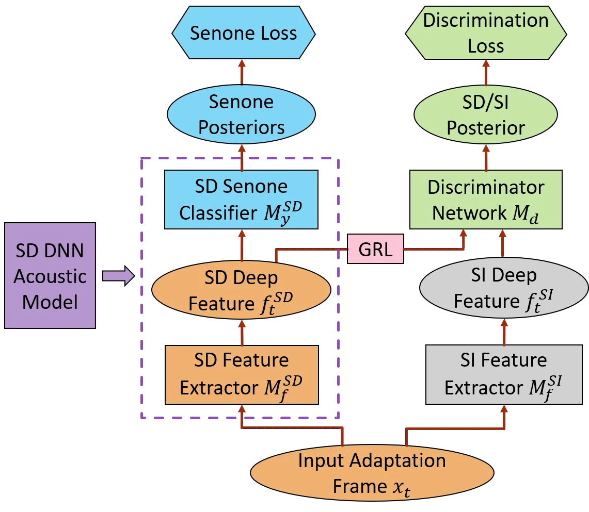
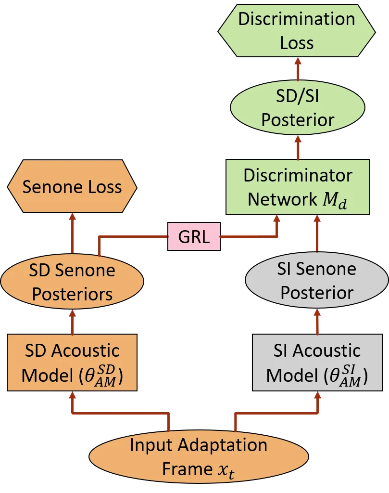

# Adversarial Speaker Adaptation

Zhong Meng    Jinyu Li    Yifan Gong

###### Abstract

We propose a novel adversarial speaker adaptation (ASA) scheme, in which
adversarial learning is applied to regularize the distribution of deep
hidden features in a speaker-dependent (SD) deep neural network (DNN)
acoustic model to be close to that of a _fixed_ speaker-independent (SI)
DNN acoustic model during adaptation. An additional discriminator
network is introduced to distinguish the deep features generated by the
SD model from those produced by the SI model. In ASA, with a fixed SI
model as the reference, an SD model is jointly optimized with the
discriminator network to minimize the senone classification loss, and
simultaneously to mini-maximize the SI/SD discrimination loss on the
adaptation data. With ASA, a senone-discriminative deep feature is
learned in the SD model with a similar distribution to that of the SI
model. With such a regularized and adapted deep feature, the SD model
can perform improved automatic speech recognition on the target
speaker’s speech. Evaluated on the Microsoft short message dictation
dataset, ASA achieves 14.4% and 7.9% relative word error rate
improvements for supervised and unsupervised adaptation, respectively,
over an SI model trained from 2600 hours data, with 200 adaptation
utterances per speaker.

###### Index Terms: 

adversarial learning, speaker adaptation, neural network, automatic
speech recognition

^(†)^(†)address: Microsoft Corporation, Redmond, WA, USA  
{zhme, jinyl, ygong}@microsoft.com

## 1 Introduction

With the advent of deep learning, the performance of automatic speech
recognition (ASR) has greatly improved \[1, 2\]. However, the ASR
performance is not optimal when acoustic mismatch exists between
training and testing \[3\]. Acoustic model adaptation is a natural
solution to compensate for this mismatch. For speaker adaptation, we are
given a speaker-independent (SI) acoustic model that performs reasonably
well on the speech of almost all speakers in general. Our goal is to
learn a personalized speaker-dependent (SD) acoustic model for each
target speaker that achieves optimal ASR performance on his/her own
speech. This is achieved by adapting the SI model to the speech of each
target speaker.

The speaker adaptation task is more challenging than the other types of
domain adaptation tasks in that it has only access to _very limited_
adaptation data from the target speaker and has no access to the source
domain data, e.g. speech from other general speakers. Moreover, a deep
neural network (DNN) based SI model, usually with a large number of
parameters, can easily get overfitted to the limited adaptation data. To
address this issue, transformation-based approaches are introduced in
\[4, 5\] to reduce the number of learnable parameters by inserting a
linear network to the input, output or hidden layers of the SI model. In
\[6, 7\], the trainable parameters are further reduced by singular value
decomposition (SVD) of weight matrices of a neural network and perform
adaptation on an inserted square matrix between the two low-rank
matrices. Moreover, i-vector \[8\] and speaker-code \[9, 10\] are widely
used as auxiliary features to a neural network for speaker adaptation.
Further, regularization-based approaches are proposed in \[11, 12, 13,
14\] to regularize the neuron output distributions or the model
parameters of the SD model such that it does not stray too far away from
the SI model.

In this work, we propose a novel regularization-based approach for
speaker adaptation, in which we use adversarial multi-task learning
(MTL) to regularize the distribution of the deep features (i.e., hidden
representations) in an SD DNN acoustic model such that it does not
deviate too much from the deep feature distribution in the SI DNN
acoustic model. We call this method _adversarial speaker adaptation
(ASA)_. Recently, adversarial training has achieved great success in
learning generative models \[15\]. In speech area, it has been applied
to acoustic model adaptation \[16, 17\], noise-robust \[18, 19, 20\],
speaker-invariant \[21, 22, 23\] ASR, speech enhancement \[24, 25, 26\]
and speaker verification \[27, 28\] using gradient reversal layer \[29\]
or domain separation network \[30\]. In these works, adversarial MTL
assists in learning a deep intermediate feature that is both
senone-discriminative and domain-invariant.

In ASA, we introduce an auxiliary discriminator network to classify
whether an input deep feature is generated by an SD or SI acoustic
model. By using a fixed SI acoustic model as the reference, the
discriminator network is jointly trained with the SD acoustic model to
simultaneously optimize the primary task of minimizing the senone
classification loss and the secondary task of mini-maximizing the SD/SI
discrimination loss on the adaptation data. Through this adversarial
MTL, senone-discriminative deep features are learned in the SD model
with a distribution that is similar to that of the SI model. With such a
regularized and adapted deep feature, the SD model is expected to
achieve improved ASR performance on the test speech from the target
speaker. As an extension, ASA can also be performed on the senone
posteriors (ASA-SP) to regularize the output distribution of the SD
model.

We perform speaker adaptation experiments on Microsoft short message
(SMD) dictation dataset with 2600 hours of live US English data for
training. ASA achieves up to 14.4% and 7.9% relative word error rate
(WER) improvements for supervised and unsupervised adaptation,
respectively, over an SI model trained on 2600 hours of speech.

## 2 Adversarial Speaker Adaptation

In speaker adaptation task, for a target speaker, we are given a
sequence of adaptation speech frames
$`\mathbf{X}=\{\mathbf{x}_{1},\ldots,\mathbf{x}_{T}\},\mathbf{x}_{t}\in\mathbbm{R}^{r_{x}},t=1,\ldots,T`$
from the target speaker and a sequence of senone labels
$`\mathbf{Y}=\{y_{1},\ldots,y_{T}\},y_{t}\in\mathbbm{R}`$ aligned with
$`\mathbf{X}`$. For supervised adaptation, $`\mathbf{Y}`$ is generated
by aligning the adaptation data against the transcription using SI
acoustic model while for unsupervised adaptation, the adaptation data is
first decoded using the SI acoustic model and the one-best path of the
decoding lattice is used as $`\mathbf{Y}`$.

As shown in Fig. 1, we view the first few layers of a well-trained SI
DNN acoustic model as an SI feature extractor network
$`M_{f}^{\text{SI}}`$ with parameters $`\theta_{f}^{\text{SI}}`$ and the
the upper layers of the SI model as an SI senone classifier network
$`M_{y}^{\text{SI}}`$ with parameters $`\theta_{y}^{\text{SI}}`$.
$`M_{f}^{\text{SI}}`$ maps input adaptation speech frames $`\mathbf{X}`$
to intermediate SI deep hidden features
$`\mathbf{F}^{\text{SI}}=\{\mathbf{f}_{1}^{\text{SI}},\ldots,\mathbf{f}_{T}^{\text{SI}}\},\mathbf{f}_{t}^{\text{SI}}\in\mathbbm{R}^{r_{f}}`$,
i.e.,

```math
\displaystyle\mathbf{f}_{t}^{\text{SI}}=M_{f}^{\text{SI}}(\mathbf{x}_{t}), \tag{1}
```

and $`M_{y}^{\text{SI}}`$ with parameters $`\theta_{y}^{\text{SI}}`$
maps $`\mathbf{F}^{\text{SI}}`$ to the posteriors
$`p(s|\mathbf{f}_{t}^{\text{SI}};\theta_{y}^{\text{SI}})`$ of a set of
senones in $`\mathbbm{S}`$ as follows:

```math
\displaystyle M_{y}^{\text{SI}}(\mathbf{f}_{t}^{\text{SI}})=p(s|\mathbf{x}_{t};\mathbf{\theta}^{\text{SI}}_{f},\mathbf{\theta}^{\text{SI}}_{y}). \tag{2}
```



Figure 1: The framework of ASA. Only the optimized SD acoustic model
consisting of $`M_{f}^{\text{SD}}`$ and $`M_{y}^{\text{SD}}`$ are used
for ASR on test data. $`M_{f}^{\text{SI}}`$ is fixed during ASA.
$`M_{f}^{\text{SI}}`$ and $`M_{d}`$ are discarded after ASA.

An SD DNN acoustic model to be trained using speech from the target
speaker is initialized from the SI acoustic model. Specifically,
$`M_{f}^{\text{SI}}`$ is used to initialize SD feature extractor
$`M_{f}^{\text{SD}}`$ with parameters $`\theta_{f}^{\text{SD}}`$ and
$`M_{y}^{\text{SI}}`$ is used to initialize SD senone classifier
$`M_{y}^{\text{SD}}`$ with parameters $`\theta_{y}^{\text{SD}}`$.
Similarly, in an SD model, $`M_{f}^{\text{SD}}`$ maps $`\mathbf{x}_{t}`$
to SD deep features $`\mathbf{f}_{t}^{\text{SD}}`$ and
$`M_{y}^{\text{SD}}`$ further transforms $`\mathbf{f}_{t}^{\text{SD}}`$
to the same set of senone posteriors
$`p(s|\mathbf{f}_{t}^{\text{SD}};\theta_{y}^{\text{SD}}),s\in\mathbbm{S}`$
as follows

```math
\displaystyle M_{y}^{\text{SD}}(\mathbf{f}_{t}^{\text{SD}})=M_{y}^{\text{SD}}(M_{f}^{\text{SD}}(\mathbf{x}_{t}))=p(s|\mathbf{x}_{t};\mathbf{\theta}^{\text{SD}}_{f},\mathbf{\theta}^{\text{SD}}_{y}). \tag{3}
```

To adapt the SI model to target speech $`\mathbf{X}`$, we re-train the
SD model by minimizing the cross-entropy senone classification loss
between the predicted senone posteriors and the senone labels
$`\mathbf{Y}`$ below

```math
\displaystyle\mathcal{L}_{\text{senone}}(\theta_{f}^{\text{SD}},\theta_{y}^{\text{SD}})=-\frac{1}{T}\sum_{t=1}^{T}\log p(y_{t}|\mathbf{x}_{t};\theta_{f}^{\text{SD}},\theta_{y}^{\text{SD}})
```

```math
\displaystyle\qquad\quad=-\frac{1}{T}\sum_{t=1}^{T}\sum_{s\in\mathbbm{S}}\mathbbm{1}[s=y_{t}]\log M_{y}(M_{f}^{\text{SD}}(\mathbf{x}_{t})), \tag{4}
```

where $`\mathbbm{1}[\cdot]`$ is the indicator function which equals to 1
if the condition in the squared bracket is satisfied and 0 otherwise.

However, the adaptation data $`\mathbf{X}`$ is usually very limited for
the target speaker and the SI model with a large number of parameters
can easily get overfitted to the adaptation data. Therefore, we need to
force the distribution of deep hidden features
$`\mathbf{F}^{\text{SD}}`$ in the SD model to be close to that of the
deep features $`\mathbf{F}^{\text{SI}}`$ in SI model while minimizing
$`\mathcal{L}_{\text{senone}}`$ as follows

```math
\displaystyle p({\mathbf{F}^{\text{SD}}}|\mathbf{X},\theta_{f}^{\text{SD}})\rightarrow p({\mathbf{F}^{\text{SI}}}|\mathbf{X},\theta_{f}^{\text{SI}}), \tag{5}
```

```math
\displaystyle\min_{\theta_{f}^{\text{SD}},\theta_{y}^{\text{SD}}}\mathcal{L}_{\text{senone}}(\theta_{f}^{\text{SD}},\theta_{y}^{\text{SD}}). \tag{6}
```

In KLD adaptation \[11\], the senone distribution estimated from the SD
model is forced to be close to that estimated from an SI model by adding
a KLD regularization to the adaptation criterion. However, KLD is a
distribution-wise _asymmetric_ measure which does not serve as a perfect
distance metric between distributions \[31\]. For example, in \[11\],
the minimization of $`\mathcal{KL}(p^{\text{SI}}||p^{\text{SD}})`$ does
not guarantee $`\mathcal{KL}(p^{\text{SD}}||p^{\text{SI}})`$ is also
minimized. In some cases, $`\mathcal{KL}(p^{\text{SD}}||p^{\text{SI}})`$
even increases as $`\mathcal{KL}(p^{\text{SI}}||p^{\text{SD}})`$ becomes
smaller \[32, 33\]. In ASA, we use adversarial MTL instead to push the
distribution of $`\mathbf{F}^{\text{SD}}`$ towards that of
$`\mathbf{F}^{\text{SI}}`$ while being adapted to the target speech
since the adversarial learning can guarantee that the global optimum is
achieved if and only if $`\mathbf{F}^{\text{SD}}`$ and
$`\mathbf{F}^{\text{SI}}`$ share exactly the same distribution \[15\].

To achieve Eq. (5), we introduce an additional discriminator network
$`M_{d}`$ with parameters $`\theta_{d}`$ which takes
$`\mathbf{F}^{\text{SD}}`$ and $`\mathbf{F}^{\text{SI}}`$ as the input
and outputs the posterior probability that an input deep feature is
generated by the SD model, i.e.,

```math
\displaystyle M_{d}(\mathbf{f}_{t}^{\text{SD}}) \displaystyle=p(\mathbf{f}_{t}^{\text{SD}}\in\mathbbm{D}_{\text{SD}}|\mathbf{x}_{t};\theta^{\text{SD}}_{f},\theta_{d}), \tag{7}
```

```math
\displaystyle M_{d}(\mathbf{f}_{t}^{\text{SI}}) \displaystyle=1-p(\mathbf{f}_{t}^{\text{SI}}\in\mathbbm{D}_{\text{SI}}|\mathbf{x}_{t};\theta^{\text{SI}}_{f},\theta_{d}), \tag{8}
```

where $`\mathbbm{D}_{\text{SD}}`$ and $`\mathbbm{D}_{\text{SI}}`$ denote
the sets of SD and SI deep features, respectively. The discrimination
loss $`\mathcal{L}_{\text{disc}}(\theta_{f},\theta_{d})`$ for $`M_{d}`$
is formulated below using cross-entropy:

```math
\displaystyle\mathcal{L}_{\text{disc}}(\theta^{\text{SD}}_{f},\theta^{\text{SI}}_{f},\theta_{d})=-\frac{1}{T}\sum_{t=1}^{T}\left[\log p(\mathbf{f}_{t}^{\text{SD}}\in\mathbbm{D}_{\text{SD}}|\mathbf{x}_{t};\theta^{\text{SD}}_{f},\theta_{d})\right.
```

```math
\displaystyle\qquad\qquad\qquad\qquad\qquad\quad\left.+\log p(\mathbf{f}_{t}^{\text{SI}}\in\mathbbm{D}_{\text{SI}}|\mathbf{x}_{t};\theta^{\text{SI}}_{f},\theta_{d})\right]
```

```math
\displaystyle=-\frac{1}{T}\sum_{t=1}^{T}\left\{\log M_{d}(M_{f}^{\text{SD}}(\mathbf{x}_{t}))+\log\left[1-M_{d}(M_{f}^{\text{SI}}(\mathbf{x}_{t}))\right]\right\} \tag{9}
```

To make the distribution of $`\mathbf{F}^{\text{SD}}`$ similar to that
of $`\mathbf{F}^{\text{SI}}`$, we perform adversarial training of
$`M_{f}^{\text{SD}}`$ and $`M_{d}`$, i.e, we minimize
$`\mathcal{L}_{\text{disc}}`$ with respect to $`\theta_{d}`$ and
maximize $`\mathcal{L}_{\text{disc}}`$ with respect to
$`\theta^{\text{SD}}_{f}`$. This minimax competition will first increase
the capability of $`M_{f}^{\text{SD}}`$ to generate
$`\mathbf{F}^{\text{SD}}`$ with a distribution similar to that of
$`\mathbf{F}^{\text{SI}}`$ and increase the discrimination capability of
$`M_{d}`$. It will eventually converge to the point where
$`M_{f}^{\text{SD}}`$ generates extremely confusing
$`\mathbf{F}^{\text{SD}}`$ that $`M_{d}`$ is unable to distinguish
whether it is generated by $`M_{f}^{\text{SD}}`$ or
$`M_{f}^{\text{SI}}`$. At this point, we have successfully regularized
the SD model such that it does not deviate too much from the SI model
and generalizes well to the test speech from target speaker.

With ASA, we want to learn a senone-discriminative SD deep feature with
a similar distribution to the SI deep features as in Eq. (5) and (6). To
achieve this, we perform adversarial MTL, in which the SD model and
$`M_{d}`$ are trained to jointly optimize the primary task of senone
classification and the secondary task of SD/SI discrimination with an
adversarial objective function as follows

```math
\displaystyle\hskip-4.0pt(\hat{\mathbf{\theta}}_{f}^{\text{SD}},\hat{\mathbf{\theta}}_{y}^{\text{SD}}) \displaystyle=\argmin_{\mathbf{\theta}_{f}^{\text{SD}},\mathbf{\theta}_{y}^{\text{SD}}}\mathcal{L}_{\text{senone}}(\mathbf{\theta}_{f}^{\text{SD}},\mathbf{\theta}_{y}^{\text{SD}})-\lambda\mathcal{L}_{\text{disc}}(\mathbf{\theta}_{f}^{\text{SD}},\mathbf{\theta}_{f}^{\text{SI}},\hat{\mathbf{\theta}}_{d}), \tag{10}
```

```math
\displaystyle(\hat{\mathbf{\theta}}_{d}) \displaystyle=\argmin_{\mathbf{\theta}_{d}}\mathcal{L}_{\text{disc}}(\hat{\mathbf{\theta}}_{f}^{\text{SD}},\mathbf{\theta}_{f}^{\text{SI}},\mathbf{\theta}_{d}), \tag{11}
```

where $`\lambda`$ controls the trade-off between
$`\mathcal{L}_{\text{senone}}`$ and $`\mathcal{L}_{\text{disc}}`$, and
$`\hat{\mathbf{\theta}}_{y}^{\text{SD}},\hat{\mathbf{\theta}}_{f}^{\text{SD}}`$
and $`\hat{\mathbf{\theta}}_{d}`$ are the optimized parameters. Note
that the SI model serves only as a reference in ASA and its parameters
$`\mathbf{\theta}_{y}^{\text{SI}},\mathbf{\theta}_{f}^{\text{SI}}`$ are
_fixed_ throughout the optimization procedure.

The parameters are updated as follows via back propagation with
stochastic gradient descent:

```math
\displaystyle\mathbf{\theta}_{f}^{\text{SD}}\leftarrow\mathbf{\theta}_{f}^{\text{SD}}-\mu\left[\frac{\partial\mathcal{L}_{\text{senone}}}{\partial\mathbf{\theta}_{f}^{\text{SD}}}-\lambda\frac{\partial\mathcal{L}_{\text{disc}}}{\partial\mathbf{\theta}_{f}^{\text{SD}}}\right], \tag{12}
```

```math
\displaystyle\mathbf{\theta}_{d}\leftarrow\mathbf{\theta}_{d}-\mu\frac{\partial\mathcal{L}_{\text{disc}}}{\partial\mathbf{\theta}_{d}}, \tag{13}
```

```math
\displaystyle\mathbf{\theta}_{y}^{\text{SD}}\leftarrow\mathbf{\theta}_{y}^{\text{SD}}-\mu\frac{\partial\mathcal{L}_{\text{senone}}}{\partial\mathbf{\theta}_{y}^{\text{SD}}}, \tag{14}
```

where $`\mu`$ is the learning rate. For easy implementation, gradient
reversal layer is introduced in \[29\], which acts as an identity
transform in the forward propagation and multiplies the gradient by
$`-\lambda`$ during the backward propagation. Note that only the
optimized SD DNN acoustic model consisting of $`M_{f}^{\text{SD}}`$ and
$`M_{y}^{\text{SD}}`$ is used for ASR on test data. $`M_{d}`$ and SI
model are discarded after ASA.

The procedure of ASA can be summarized in the steps below:

1.  1.  Divide a well-trained and _fixed_ SI model into a feature extractor
        $`M_{f}^{\text{SI}}`$ followed by a senone classifier
        $`M_{y}^{\text{SI}}`$.
2.  2.  Initialize the SD model with the SI model, i.e., clone
        $`M_{f}^{\text{SD}}`$ and $`M_{y}^{\text{SD}}`$ from
        $`M_{f}^{\text{SI}}`$ and $`M_{y}^{\text{SI}}`$, respectively.
3.  3.  Add an auxiliary discriminator network $`M_{d}`$ taking SD and SI
        deep features, $`\mathbf{F}^{\text{SD}}`$ and
        $`\mathbf{F}^{\text{SI}}`$, as the input and predict the posterior
        that the input is generated by $`M_{f}^{\text{SD}}`$.
4.  4.  Jointly optimize $`M_{f}^{\text{SD}}`$, $`M_{y}^{\text{SD}}`$ and
        $`M_{d}`$ with adaptation data of a target speaker via adversarial
        MTL as in Eq. (10) to (14).
5.  5.  Use the optimized SD model consisting of $`M_{f}^{\text{SD}}`$,
        $`M_{y}^{\text{SD}}`$ for ASR decoding on test data of this target
        speaker.

## 3 Adversarial Speaker Adaptation on Senone Posteriors

As shown in Fig. 2, in ASA-SP, adversarial learning is applied to
regularize the vectors of senone posteriors
$`\mathbf{y}^{\text{SD}}_{t}=\left[p(s|\mathbf{x}_{t};\mathbf{\theta}^{\text{SD}}_{\text{AM}})\right]_{s\in\mathbbm{S}}`$
predicted by the SD model to be close to that of a well-trained and
_fixed_ SI model, i.e.,
$`\mathbf{y}^{\text{SI}}_{t}=\left[p(s|\mathbf{x}_{t};\mathbf{\theta}^{\text{SI}}_{\text{AM}})\right]_{s\in\mathbbm{S}}`$
while simultaneously minimizing the senone loss
$`\mathcal{L}_{\text{senone}}(\mathbf{\theta}^{\text{SD}}_{\text{AM}})`$,
where
$`\mathbf{\theta}^{\text{SD}}_{\text{AM}}=\{\mathbf{\theta}^{\text{SD}}_{f},\mathbf{\theta}^{\text{SD}}_{y}\}`$
and
$`\mathbf{\theta}^{\text{SI}}_{\text{AM}}=\{\mathbf{\theta}^{\text{SI}}_{f},\mathbf{\theta}^{\text{SI}}_{y}\}`$
are SI and SD model parameters, respectively.



Figure 2: The framework of ASA-SP. The SI acoustic model is fixed during
ASA-SP. Only the SD acoustic model is used in ASR.

In this case, the discriminator $`M_{d}`$ takes
$`p(s|\mathbf{x}_{t};\mathbf{\theta}^{\text{SD}}_{\text{AM}})`$ and
$`p(s|\mathbf{x}_{t};\mathbf{\theta}^{\text{SI}}_{\text{AM}})`$ as the
input and predicts the posterior that the input is generated by the SD
model. The discrimination loss
$`\mathcal{L}_{\text{disc}}(\theta_{f},\theta_{d})`$ for $`M_{d}`$ is
formulated below using cross-entropy:

```math
\displaystyle\mathcal{L}_{\text{disc}}(\theta^{\text{SD}}_{\text{AM}},\theta_{d})=-\frac{1}{T}\sum_{t=1}^{T}\left[\log p(\mathbf{y}_{t}^{\text{SD}}\in\mathbbm{E}_{\text{SD}}|\mathbf{x}_{t};\theta^{\text{SD}}_{\text{AM}},\theta_{d})\right.
```

```math
\displaystyle\qquad\qquad\qquad\qquad\qquad\left.+\log p(\mathbf{y}_{t}^{\text{SI}}\in\mathbbm{E}_{\text{SI}}|\mathbf{x}_{t};\theta^{\text{SI}}_{\text{AM}},\theta_{d})\right], \tag{15}
```

where $`\mathbbm{E}_{\text{SD}}`$ and $`\mathbbm{E}_{\text{SI}}`$ denote
the sets of senone posterior vectors generated by SD and SI models,
respectively. Similar adversarial MTL is performed to make the
distributions of
$`\mathbf{Y}^{\text{SD}}=\{\mathbf{y}^{\text{SD}}_{1},\ldots,\mathbf{y}^{\text{SD}}_{T}\}`$
similar to that of
$`\mathbf{Y}^{\text{SI}}=\{\mathbf{y}^{\text{SI}}_{1},\ldots,\mathbf{y}^{\text{SI}}_{T}\}`$
below:

```math
\displaystyle(\hat{\mathbf{\theta}}_{\text{AM}}^{\text{SD}}) \displaystyle=\argmin_{\mathbf{\theta}_{\text{AM}}^{\text{SD}}}\mathcal{L}_{\text{senone}}(\mathbf{\theta}_{\text{AM}}^{\text{SD}})-\lambda\mathcal{L}_{\text{disc}}(\mathbf{\theta}_{\text{AM}}^{\text{SD}},\mathbf{\theta}_{\text{AM}}^{\text{SI}},\hat{\mathbf{\theta}}_{d}), \tag{16}
```

```math
\displaystyle(\hat{\mathbf{\theta}}_{d}) \displaystyle=\argmin_{\mathbf{\theta}_{d}}\mathcal{L}_{\text{disc}}(\hat{\mathbf{\theta}}_{\text{AM}}^{\text{SD}},\mathbf{\theta}_{\text{AM}}^{\text{SI}},\mathbf{\theta}_{d}). \tag{17}
```

$`\mathbf{\theta}_{\text{AM}}^{\text{SI}}`$ is optimized by back
propagation below, $`\mathbf{\theta}_{d}`$ is optimized via Eq. (13) and
$`\mathbf{\theta}_{\text{AM}}^{\text{SI}}`$ remain unchanged during the
optimization.

```math
\displaystyle\mathbf{\theta}_{\text{AM}}^{\text{SD}}\leftarrow\mathbf{\theta}_{\text{AM}}^{\text{SD}}-\mu\left[\frac{\partial\mathcal{L}_{\text{senone}}}{\partial\mathbf{\theta}_{f}^{\text{SD}}}-\lambda\frac{\partial\mathcal{L}_{\text{disc}}}{\partial\mathbf{\theta}_{\text{AM}}^{\text{SD}}}\right]. \tag{18}
```

ASA-SP is an extension of ASA where the deep hidden feature moves up to
the output layer and becomes the senone posteriors vector. In this case,
the senone classifier disappears and the feature extractor becomes the
entire acoustic model.

## 4 Experiments

We perform speaker adaptation on a Microsoft Windows Phone SMD task. The
training data consists of 2600 hours of Microsoft internal live US
English data collected through a number of deployed speech services
including voice search and SMD. The test set consists of 7 speakers with
a total number of 20,203 words. Four adaptation sets of 20, 50, 100 and
200 utterances per speaker are used for acoustic model adaptation,
respectively, to explore the impact of adaptation data duration. Any
adaptation set with smaller number of utterances is a subset of a larger
one.

### 4.1 Baseline System

We train an SI long short-term memory (LSTM)-hidden Markov model (HMM)
acoustic model \[34, 35, 36\] with 2600 hours of training data. This SI
model has 4 hidden layers with 1024 units in each layer and the output
size of each hidden layer is reduced to 512 by a linear projection.
80-dimensional log Mel filterbank features are extracted from training,
adaptation and test data. The output layer has a dimension of 5980. The
LSTM is trained to minimize the frame-level cross-entropy criterion.
There is no frame stacking, and the output HMM state label is delayed by
5 frames. A trigram LM is used for decoding with around 8M n-grams. This
SI LSTM acoustic model achieves 13.95% WER on the SMD test set.

We further perform KLD speaker adaptation \[11\] with different
regularization weights $`\rho`$. In Tables 1 and 2, KLD with
$`\rho=0.5`$ achieves 12.54% - 13.24% and 13.55% - 13.85% WERs for
supervised and unsupervised adaption, respectively with 20 - 200
adaptation utterances.

|                          |                                 |       |       |       |       |
| ------------------------ | ------------------------------- | ----- | ----- | ----- | ----- |
| System                   | Number of Adaptation Utterances |       |       |       |       |
|                          | 20                              | 50    | 100   | 200   | Avg.  |
| SI                       | 13.95                           |       |       |       |       |
| KLD ($`\rho=0.0`$)       | 13.68                           | 13.39 | 13.31 | 13.21 | 13.40 |
| KLD ($`\rho=0.2`$)       | 13.20                           | 13.00 | 12.71 | 12.61 | 12.88 |
| KLD ($`\rho=0.5`$)       | 13.24                           | 13.08 | 12.85 | 12.54 | 12.93 |
| KLD ($`\rho=0.8`$)       | 13.55                           | 13.50 | 13.46 | 13.17 | 13.42 |
| ASA ($`\lambda=1.0`$)    | 12.99                           | 12.86 | 12.56 | 12.05 | 12.62 |
| ASA ($`\lambda=3.0`$)    | 13.03                           | 12.72 | 12.35 | 11.94 | 12.56 |
| ASA ($`\lambda=5.0`$)    | 13.14                           | 12.71 | 12.50 | 12.06 | 12.60 |
| ASA-SP ($`\lambda=1.0`$) | 13.04                           | 12.88 | 12.66 | 12.17 | 12.69 |
| ASA-SP ($`\lambda=3.0`$) | 13.05                           | 12.89 | 12.67 | 12.18 | 12.70 |
| ASA-SP ($`\lambda=5.0`$) | 13.05                           | 12.89 | 12.69 | 12.18 | 12.70 |

Table 1: The WER (%) performance of supervised speaker adaptation using
KLD and ASA with different $`\lambda`$ on Microsoft SMD task.

|                          |                                 |       |       |       |       |
| ------------------------ | ------------------------------- | ----- | ----- | ----- | ----- |
| System                   | Number of Adaptation Utterances |       |       |       |       |
|                          | 20                              | 50    | 100   | 200   | Avg.  |
| SI                       | 13.95                           |       |       |       |       |
| KLD ($`\rho=0.0`$)       | 14.18                           | 14.01 | 13.81 | 13.73 | 13.93 |
| KLD ($`\rho=0.2`$)       | 13.86                           | 13.83 | 13.75 | 13.65 | 13.77 |
| KLD ($`\rho=0.5`$)       | 13.85                           | 13.80 | 13.73 | 13.55 | 13.73 |
| KLD ($`\rho=0.8`$)       | 13.89                           | 13.86 | 13.80 | 13.72 | 13.82 |
| ASA ($`\lambda=1.0`$)    | 13.74                           | 13.70 | 13.38 | 12.99 | 13.45 |
| ASA ($`\lambda=3.0`$)    | 13.66                           | 13.61 | 13.09 | 12.85 | 13.30 |
| ASA ($`\lambda=5.0`$)    | 13.85                           | 13.69 | 13.27 | 13.03 | 13.46 |
| ASA-SP ($`\lambda=1.0`$) | 13.83                           | 13.72 | 13.48 | 13.16 | 13.55 |
| ASA-SP ($`\lambda=3.0`$) | 13.84                           | 13.74 | 13.53 | 13.17 | 13.57 |
| ASA-SP ($`\lambda=5.0`$) | 13.85                           | 13.74 | 13.52 | 13.16 | 13.57 |

Table 2: The WER (%) performance of unsupervised speaker adaptation
using KLD and ASA with different $`\lambda`$ on Microsoft SMD task.

### 4.2 Adversarial Speaker Adaptation

We perform standard ASA as described in Section 4.2. The SI feature
extractor $`M_{f}^{\text{SI}}`$ is formed as the first $`N_{h}`$ layers
of the SI LSTM and the SI senone classifier $`M_{y}^{\text{SI}}`$ is the
rest $`(4-N_{h})`$ hidden layers plus the output layer. The SD feature
extractor $`M_{f}^{\text{SD}}`$ and SD senone classifier
$`M_{y}^{\text{SD}}`$ are cloned from $`M_{f}^{\text{SI}}`$ and
$`M_{y}^{\text{SI}}`$, respectively as an initialization. $`N_{h}`$
indicates the position of the deep hidden feature in the SD and SI
LSTMs. $`M_{d}`$ is a feedforward DNN with 2 hidden layers and 512
hidden units for each layer. The output layer of $`M_{d}`$ has 1 unit
predicting the posteriors of input deep feature generated by the
$`M_{f}^{\text{SD}}`$. $`M_{d}`$ has 512-dimensional input layer.
$`M_{f}^{\text{SD}}`$, $`M_{y}^{\text{SD}}`$ and $`M_{d}`$ are jointly
trained with an adversarial MTL objective. Due to space limitation, we
only show the results when $`N_{h}=4`$. ²² 2 It has been shown in \[17,
16\] that the ASR performance increases with the growth of $`N_{h}`$ for
adversarial domain adaptation. The same trend is observed for ASA
experiments.

For supervised ASA, the same alignment is used as in KLD. In Table 1,
the best ASA setups achieve 12.99%, 12.71%, 12.35% and 11.94% WERs for
20, 50, 100, 200 adaptation utterances which improve the WERs by 6.9%,
8.9%, 11.5%, 14.4% relatively over the SI LSTM, respectively. Supervised
ASA ($`\lambda=3.0`$) also achieves up to 5.3% relative WER reduction
over the best KLD setup ($`\rho=0.2`$).

For unsupervised ASA, the same decoded senone labels are used as in KLD.
In Table 2, the best ASA setups achieve 13.66%, 13.61%, 13.09% and
12.85% WERs for 20, 50, 100, 200 adaptation utterances which improves
the WERs by 2.1%, 2.4%, 6.2%, 7.9% relatively over the SI LSTM,
respectively. Unsupervised ASA ($`\lambda=3.0`$) also achieves up to and
5.2% relatively WER gains over the best KLD setup ($`\rho=0.5`$).
Compared with supervised ASA, the unsupervised one decreases the
relative WER gain over the SI LSTM by about half on the same number of
adaptation utterances.

For both supervised and unsupervised ASA, the WER first decreases as
$`\lambda`$ grows larger and then increases when $`\lambda`$ becomes too
large. ASA performs consistently better than SI LSTM and KLD with
different number of adaptation utterances for both supervised and
unsupervised adaptation.³³ 3 In this work, we only compare ASA with the
most popular regularization-based approach, i.e., KLD, because the other
approaches such as transformation, SVD, auxiliary feature, etc. are
orthogonal to ASA and can be used together with ASA to get additional
WER improvement. The relative gain increases as the number of adaptation
utterance grows.

### 4.3 Adversarial Speaker Adaptation on Senone Posteriors

We then perform ASA-SP as described in Section 4.2. The SD acoustic
model is cloned from the SI LSTM as the initialization. $`M_{d}`$ shares
the same architecture as the one in Section 4.2. In Table 1, for
supervised adaptation ASA-SP $`(\lambda=1.0)`$ achieves 6.5%, 7.7%,
9.2%, 12.8% relative WER gain over the SI LSTM, respectively and up to
3.5% relative WER reduction over the best KLD setup ($`\rho=0.2`$). In
Table 2, for unsupervised adaptation ASA-SP $`(\lambda=1.0)`$ achieves
0.9%, 1.6%, 3.4%, 5.7%, 2.9% relative WER gain over the SI LSTM,
respectively and up to 4.8% relative WER reduction over the best KLD
setup ($`\rho=0.5`$).

Although ASA-SP consistently improves over KLD on different number of
adaptation utterances for both supervised and unsupervised adaptation,
it performs worse than standard ASA where the regularization from SI
model is performed at the hidden layers. The reason is that the senone
posteriors vectors $`\mathbf{y}^{\text{SI}}_{t}`$,
$`\mathbf{y}^{\text{SD}}_{t}`$ lie in a much higher-dimensional space
than the deep features $`\mathbf{f}^{\text{SI}}_{t}`$,
$`\mathbf{f}^{\text{SD}}_{t}`$ so that the discriminator is much harder
to learn given much sparser-distributed samples. We also notice that
ASA-SP performance is much less sensitive to the variation of
$`\lambda`$ compared with standard ASA.

## 5 Conclusion

In this work, a novel adversarial speaker adaptation method is proposed,
in which the deep hidden features (ASA) or the output senone posteriors
(ASA-SP) of an SD DNN acoustic model are forced by the adversarial MTL
to conform to a similar distribution as those of a fixed reference SI
DNN acoustic model while being trained to be senone-discriminative with
the limited adaptation data.

We evaluate ASA on Microsoft SMD task with 2600 hours of training data.
ASA achieves up to 14.4% and 7.9% relative WER gain for supervised and
unsupervised adaptation, respectively, over the SI LSTM acoustic model.
ASA also improves consistently over the KLD regularization method. The
relative gain grows as the number of adaption utterances increases.
ASA-SP performs consistently better than KLD but worse than the standard
ASA.

## References

- \[1\] G. Hinton, L. Deng, D. Yu, et al., “Deep neural networks for
  acoustic modeling in speech recognition: The shared views of four
  research groups,” IEEE Signal Processing Magazine, vol. 29, no. 6, pp.
  82–97, 2012.
- \[2\] Dong Yu and Jinyu Li, “Recent progresses in deep learning based
  acoustic models,” IEEE/CAA Journal of Automatica Sinica, vol. 4, no.
  3, pp. 396–409, 2017.
- \[3\] J. Li, L. Deng, Y. Gong, and R. Haeb-Umbach, “An overview of
  noise-robust automatic speech recognition,” IEEE/ACM Transactions on
  Audio, Speech and Language Processing, vol. 22, no. 4, pp. 745–777,
  April 2014.
- \[4\] J. Neto, L. Almeida, M. Hochberg, et al., “Speaker-adaptation
  for hybrid hmm-ann continuous speech recognition system,” in Proc.
  Eurospeech, 1995.
- \[5\] R. Gemello, F. Mana, S. Scanzio, et al., “Linear hidden
  transformations for adaptation of hybrid ann/hmm models,” Speech
  Communication, vol. 49, no. 10, pp. 827 – 835, 2007.
- \[6\] Jian Xue, Jinyu Li, and Yifan Gong, “Restructuring of deep
  neural network acoustic models with singular value decomposition.,” in
  Interspeech, 2013, pp. 2365–2369.
- \[7\] Y. Zhao, J. Li, and Y. Gong, “Low-rank plus diagonal adaptation
  for deep neural networks,” in Proc. ICASSP, March 2016, pp. 5005–5009.
- \[8\] G. Saon, H. Soltau, D. Nahamoo, and M. Picheny, “Speaker
  adaptation of neural network acoustic models using i-vectors,” in
  Proc. ASRU, Dec 2013, pp. 55–59.
- \[9\] O. Abdel-Hamid and H. Jiang, “Fast speaker adaptation of hybrid
  nn/hmm model for speech recognition based on discriminative learning
  of speaker code,” in Proc. ICASSP, May 2013, pp. 7942–7946.
- \[10\] S. Xue, O. Abdel-Hamid, H. Jiang, L. Dai, and Q. Liu, “Fast
  adaptation of deep neural network based on discriminant codes for
  speech recognition,” in TASLP, vol. 22, no. 12, pp. 1713–1725,
  Dec 2014.
- \[11\] D. Yu, K. Yao, H. Su, G. Li, and F. Seide, “Kl-divergence
  regularized deep neural network adaptation for improved large
  vocabulary speech recognition,” in Proc. ICASSP, May 2013, pp.
  7893–7897.
- \[12\] Zhong Meng, Jinyu Li, Yong Zhao, and Yifan Gong, “Conditional
  teacher-student learning,” in Proc. ICASSP, 2019.
- \[13\] Z. Huang, S. Siniscalchi, I. Chen, et al., “Maximum a
  posteriori adaptation of network parameters in deep models,” in Proc.
  Interspeech, 2015.
- \[14\] Z. Huang, J. L, S. Siniscalchi., et al., “Rapid adaptation for
  deep neural networks through multi-task learning.,” in Interspeech,
  2015, pp. 3625–3629.
- \[15\] I. Goodfellow, J. Pouget-Adadie, et al., “Generative
  adversarial nets,” in Proc. NIPS, pp. 2672–2680. 2014.
- \[16\] S. Sun, B. Zhang, L. Xie, et al., “An unsupervised deep domain
  adaptation approach for robust speech recognition,” Neurocomputing,
  vol. 257, pp. 79 – 87, 2017.
- \[17\] Z. Meng, Z. Chen, V. Mazalov, J. Li, and Y. Gong, “Unsupervised
  adaptation with domain separation networks for robust speech
  recognition,” in Proc. ASRU, 2017.
- \[18\] Yusuke Shinohara, “Adversarial multi-task learning of deep
  neural networks for robust speech recognition.,” in INTERSPEECH, 2016,
  pp. 2369–2372.
- \[19\] D. Serdyuk, K. Audhkhasi, P. Brakel, B. Ramabhadran, et al.,
  “Invariant representations for noisy speech recognition,” in NIPS
  Workshop, 2016.
- \[20\] Zhong Meng, Jinyu Li, Yifan Gong, and Biing-Hwang Juang,
  “Adversarial teacher-student learning for unsupervised domain
  adaptation,” in Proc. ICASSP. IEEE, 2018, pp. 5949–5953.
- \[21\] Z. Meng, J. Li, Z. Chen, et al., “Speaker-invariant training
  via adversarial learning,” in Proc. ICASSP, 2018.
- \[22\] G. Saon, G. Kurata, T. Sercu, et al., “English conversational
  telephone speech recognition by humans and machines,” arXiv preprint
  arXiv:1703.02136, 2017.
- \[23\] Zhong Meng, Jinyu Li, and Yifan Gong, “Attentive adversarial
  learning for domain-invariant training,” in Proc. ICASSP, 2019.
- \[24\] Santiago Pascual, Antonio Bonafonte, and Joan Serrà, “Segan:
  Speech enhancement generative adversarial network,” in
  Interspeech, 2017.
- \[25\] Zhong Meng, Jinyu Li, and Yifan Gong, “Adversarial
  feature-mapping for speech enhancement,” Interspeech, 2018.
- \[26\] Zhong Meng, Jinyu Li, and Yifan Gong, “Cycle-consistent speech
  enhancement,” Interspeech, 2018.
- \[27\] Q. Wang, W. Rao, S. Sun, L. Xie, E. S. Chng, and H. Li,
  “Unsupervised domain adaptation via domain adversarial training for
  speaker recognition,” ICASSP 2018, 2018.
- \[28\] Zhong Meng, Yong Zhao, Jinyu Li, and Yifan Gong, “Adversarial
  speaker verification,” in Proc. ICASSP, 2019.
- \[29\] Yaroslav Ganin and Victor Lempitsky, “Unsupervised domain
  adaptation by backpropagation,” in Proc. ICML, Lille, France, 2015,
  vol. 37, pp. 1180–1189, PMLR.
- \[30\] K. Bousmalis, G. Trigeorgis, N. Silberman, et al., “Domain
  separation networks,” in Proc. NIPS, D. D. Lee, M. Sugiyama, U. V.
  Luxburg, I. Guyon, and R. Garnett, Eds., pp. 343–351. Curran
  Associates, Inc., 2016.
- \[31\] Solomon Kullback and Richard A Leibler, “On information and
  sufficiency,” The annals of mathematical statistics, vol. 22, no. 1,
  pp. 79–86, 1951.
- \[32\] Will Kurt, “Kullback-leibler divergence explained,”
  [https://www.countbayesie.com/blog/2017/5/9/kullback-leibler-divergence-explained](https://www.countbayesie.com/blog/2017/5/9/kullback-leibler-divergence-explained), 2017.
- \[33\] Ben Moran, “Kullback-leibler divergence asymmetry,”
  [https://benmoran.wordpress.com/2012/07/14/kullback-leibler-divergence-asymmetry/](https://benmoran.wordpress.com/2012/07/14/kullback-leibler-divergence-asymmetry/), 2012.
- \[34\] F. Beaufays H. Sak, A. Senior, “Long short-term memory
  recurrent neural network architectures for large scale acoustic
  modeling,” in Interspeech, 2014.
- \[35\] Z. Meng, S. Watanabe, J. R. Hershey, et al., “Deep long
  short-term memory adaptive beamforming networks for multichannel
  robust speech recognition,” in ICASSP. IEEE, 2017, pp. 271–275.
- \[36\] H. Erdogan, T. Hayashi, J. R. Hershey, et al., “Multi-channel
  speech recognition: Lstms all the way through,” in CHiME-4 workshop,
  2016, pp. 1–4.
