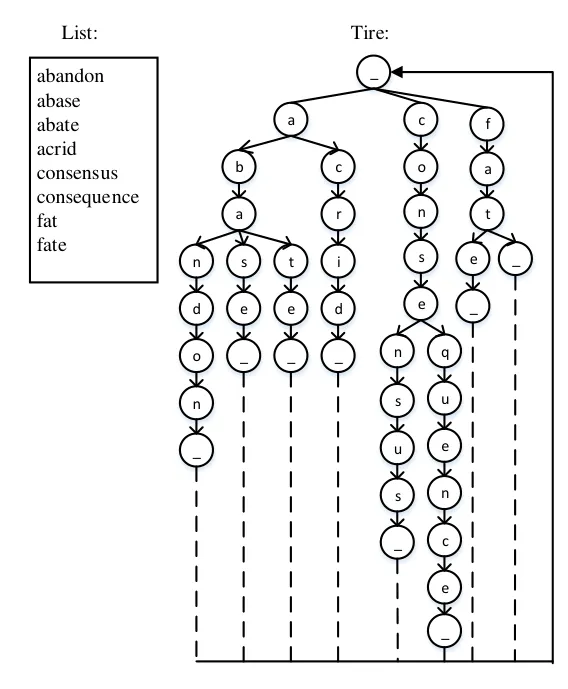
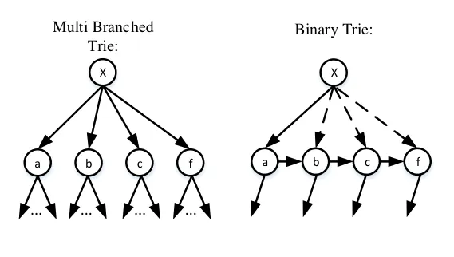
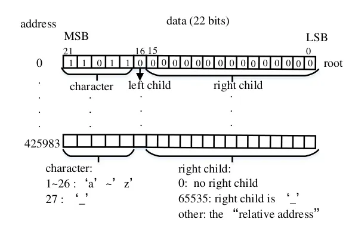
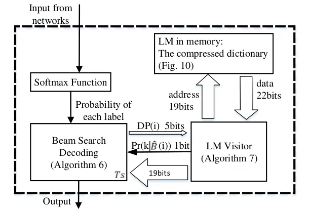

# A Hardware-Oriented and Memory-Efficient Method for CTC Decoding

Siyuan Lu    Jinming Lu    Jun Lin    and Zhongfeng Wang ^(†)^(†)thanks:
The authors are with the School of Electronic Science and Engineering,
Nanjing University, Nanjing 210008, China (e-mail:
sylu@smail.nju.edu.cn; jmlu@smail.nju.edu.cn; jlin@nju.edu.cn;
zfwang@nju.edu.cn).

###### Abstract

The Connectionist Temporal Classification (CTC) has achieved great
success in sequence to sequence analysis tasks such as automatic speech
recognition (ASR) and scene text recognition (STR). These applications
can use the CTC objective function to train the recurrent neural
networks (RNNs), and decode the outputs of RNNs during inference. While
hardware architectures for RNNs have been studied, hardware-based
CTC-decoders are desired for high-speed CTC-based inference systems.
This paper, for the first time, provides a low-complexity and
memory-efficient approach to build a CTC-decoder based on the beam
search decoding. Firstly, we improve the beam search decoding algorithm
to save the storage space. Secondly, we compress a dictionary (reduced
from 26.02MB to 1.12MB) and use it as the language model. Meanwhile
searching this dictionary is trivial. Finally, a fixed-point CTC-decoder
for an English ASR and an STR task using the proposed method is
implemented with C++ language. It is shown that the proposed method has
little precision loss compared with its floating-point counterpart. Our
experiments demonstrate the compression ratio of the storage required by
the proposed beam search decoding algorithm are 29.49 (ASR) and 17.95
(STR).

###### Index Terms: 

Connectionist Temporal Classification (CTC) decoding, beam search,
softmax, recurrent neural networks (RNNs), sequence to sequence.

## I Introduction

In most automatic speech recognition (ASR) tasks and some sequential
tasks, such as lipreading and scene text recognition, the lengths of
output sequences are not fixed. Furthermore, the alignment between input
and output is unknown\[5\]. To address this issue, Graves et al.\[6\]
provided the Connectionist Temporal Classification (CTC) objective
function to infer this alignment automatically. CTC is an output layer
for recurrent neural networks (RNNs), which allows RNNs to be trained
for sequence transcription tasks without requiring a prior alignment
between the input and target sequences\[7\].

In ASR tasks, the traditional approach is based on HMMs\[16\], while
recent works have shown great interest in building end-to-end models,
using CTC-based deep RNNs. By training networks with large amounts of
data, CTC-based models achieved great success\[7\],\[11\],\[4\],
\[12\],\[26\], \[18\]. CTC is also widely used in other learning tasks
such as handwriting recognition and scene text recognition, offering
superior performance\[8\],\[2\],\[19\].

In a learning task using CTC, models are always ended with a softmax
layer where the element represents the probability of emitting each
label at a specific time step. After being trained with the CTC loss
function, the output of the network needs a CTC-decoder during
inference. Since the probability of each label is temporally
independent, a language model (LM) can be integrated to improve the
accuracy of CTC decoding.

Fig. 1: A sequence processing system using the CTC-decoder designed in
this paper.

On one hand, compared with solutions based on CPUs and GPUs,
hardware-based sequence to sequence systems can have lower power
consumption and higher speed\[20\]\[24\]\[15\]. On the other hand,
CTC-decoder is an essential part of a system including CTC-trained
neural networks. The outputs of these neural networks cannot be combined
into the target output sequences directly without a CTC-decoder.
Considering that recent works on hardware-based RNNs have made great
progress\[9\]\[23\]\[22\], hardware-based CTC-decoders are desired for
high-speed CTC-based inference systems, which can make these systems
more efficient. In addition, the softmax function, which is also widely
used in various neural networks\[25\], involves expensive division and
exponentiation units. So a low-complexity hardware architecture design
of softmax is also in demand.

A sequence processing system using the CTC-decoder designed in this
paper is shown in Fig. 1. The system consists of two concatenated
stages: the neural network and the CTC-decoder, which can be run in
pipline. The network usually takes more cycles than the CTC-decoder to
process a set of data\[23\], so we do not need the decoder to run at
high throughput. Thus, this decoder is designed to be serial to consume
less computational resources.

There is no existing work on hardware-oriented algorithm nor hardware
architecture for CTC decoding based on the beam search. This paper,
for the first time, provides a hardware-oriented CTC decoding approach,
employing the CTC beam search decoding with a dictionary as its LM. Our
contributions can be summarized as follows:

- 1.  We improve the beam search decoding algorithm in \[7\]. We choose this
      decoding method as it can integrate all kinds of LMs. We reduce the
      memory size used in decoding as much as possible. The improvement is
      suitable for both software and hardware decoding, regardless of the
      kind of LM. We further point out that some components can be reused to
      reduce the hardware complexity.
- 2.  Several techniques are exploited to compress the size of a dictionary
      used as the LM in CTC decoding. By using these techniques, we compress
      the size of an English dictionary with 191,735 words from 26.05MB to
      1.12MB. Meanwhile, we propose a low-complexity algorithm for the LM
      visitor. Our work on how to compress a dictionary is also useful when
      more complex LMs are used, as most of these LMs are based on a
      dictionary.
- 3.  We use C++ language to implement a fixed-point CTC decoder applying
      the hardware-friendly approach for softmax and the improved beam
      search decoding algorithm. In our experiments, the fixed-point decoder
      achieved nearly identical accuracy to the floating-point decoder in
      ASR and scene text recognition(STR) tasks, with the compression ratio
      of the storage are 29.49 and 17.95, respectively.

The RNN+CTC model is widely used, and the CTC beam search decoding
algorithm is one of the most popular decoding methods\[26\]. However,
the original beam search algorithm consumes a lot of memory space,
making us believe that reducing storage consumption is very necessary.
The proposed CTC decoding method is useful in improving any CTC-based
inference systems, no matter whether it is software-based or
hardware-based. Although a complete hardware implementation for the
proposed CTC-decoder has not been finished yet (which will be conducted
in the future work), we have implemented quantized CTC-decoders in the
experiments to prove this.

The rest of this paper is organized as follows. Section II gives a brief
review of CTC, the beam search algorithm, and the CTC beam search
decoding algorithm. Several algorithmic strength reduction strategies
applied in designing a low-complexity architecture for softmax are also
introduced in Section II. Section III presents the improved beam search
decoding algorithm. Section IV shows the compression of a dictionary
used in the beam search decoding. In Section V, we implement the
fixed-point CTC-decoder. Section VI concludes this paper.

## II Background

### II-A Review of CTC

Assume that the output sequence and the target sequence of the system
shown in Fig. 1 have $`K`$ labels, and another blank label ø is covered
in the intermediate calculations. The ø means a null emission. Define
$`X=({X_{1}},...,{X_{T}})`$ as the input sequence of the network. Define
$`Y=({Y_{1}},...,{Y_{T}})`$ as the output sequence of the network. At
time $`t`$, we have $`{Y_{t}}=({Y_{t}^{1}},...,{Y_{t}^{K+1}})`$. So each
of the outputs of the softmax layer represents the probability of each
label:

```math
Pr(k,t|X)=\frac{exp({Y_{t}^{k}})}{\sum_{i=1}^{K+1}exp({Y_{t}^{i}})}. \tag{1}
```

A CTC path $`\pi`$ which is introduced in \[6\] as a sequence of labels
(including ø), can be expressed as $`\pi=({\pi_{1}},...,{\pi_{T}})`$.
Assuming that the probabilities of emitting a label at different times
are conditionally independent, the probability of a CTC path $`\pi`$ can
be calculated as follows:

```math
Pr(\pi|X)=\prod_{t=1}^{T}Pr({\pi_{t}},t|X). \tag{2}
```

The target sequence L is corresponding to a set of CTC paths, and the
mapping function $`\beta`$ is described in \[6\]. The function $`\beta`$
removes all repeated labels and blanks from the path
(e.g. $`\beta(c~\phi~\phi~a~\phi~t)=\beta(c~c~\phi~a~a~a~\phi~\phi~t~t)=cat`$).
We can evaluate the probability of the target sentence as the sum of the
probabilities of all the CTC paths in the set:

```math
Pr(L|X)=\sum_{\pi\in\beta^{-1}(L)}Pr(\pi|X). \tag{3}
```

However, it is virtually impossible to sum the probabilities of all the
paths in $`\beta^{-1}(L)`$. To calculate $`Pr(L|X)`$, the CTC
Forward-Backward Alogrithm was invented in \[6\]. Afterwards, the
network can be trained with the CTC objective function:

```math
CTC(X)=-logPr(L|X). \tag{4}
```

### II-B CTC Beam Search Decoding

Decoding a CTC network means finding the most probable output sequence
for a given input. The simplest way to decode it is the best path
decoding introduced in \[6\]: by picking the single most probable label
at every time step, the most probable sequence will correspond to the
most probable labelling. Some works use this decoding method to build
the CTC-layers in their hardware architectures of RNNs \[17\]. Although
this way can already provide useful transcriptions, its limited accuracy
is not sufficient to meet the demands of many sequence tasks\[26\].

The CTC beam search decoding searches for the most probable sequence in
all the sequences ($`length\leq T`$) combined with $`K`$ labels (ø will
not appear in output sequence). The number of all the sequences is
growing exponentially with the increase of T, but the number of the
sequences searched with the CTC beam search decoding is no larger than
$`K\cdot W\cdot T`$. The beam width $`W`$ determines the complexity and
accuracy of the algorthm. If $`W`$ is big enough, the probability will
be one so that the beam search is equal to the breadth first search
(BFS). However, the algorithm will be too complex. But if $`W`$ is too
small, the probability of using beam search to find the correct answer
will be too small. So there is a trade off between the size of $`W`$ and
the accuracy.

The probability of output sequence $`\boldsymbol{y}`$ (including ø) at
time $`t`$ is defined as $`Pr(\boldsymbol{y},t`$). All the paths in
$`\beta^{-1}(\boldsymbol{y})`$ can be classified into two sets,
$`\xi_{1}(\boldsymbol{y})`$ and $`\xi_{2}(\boldsymbol{y})`$. The last
label of any path in $`\xi_{1}(\boldsymbol{y})`$ must be ø, while the
last label of any path in $`\xi_{2}(\boldsymbol{y})`$ can be any label
except ø. Defining the sum of the probabilities of the paths in
$`\xi_{1}(\boldsymbol{y})`$ and $`\xi_{2}(\boldsymbol{y})`$ as
$`Pr^{-}(\boldsymbol{y},t)`$ and $`Pr^{+}(\boldsymbol{y},t)`$,
respectively, we have
$`Pr(\boldsymbol{y},t)=Pr^{-}(\boldsymbol{y},t)+Pr^{+}(\boldsymbol{y},t).`$
Define $`\theta`$ as the empty sequence ($`Pr^{+}(\theta,t)=0`$),
$`\boldsymbol{\hat{y}}`$ as the prefix of $`\boldsymbol{y}`$ with its
last label removed, and $`\boldsymbol{y^{e}}`$ as the last label of
$`\boldsymbol{y}`$. The CTC beam search decoding is described in
Algorithm 1.

1:  $`t=0`$

2:  $`B\leftarrow\{{\theta}\}`$, $`Pr^{-}(\theta,t)\leftarrow 1`$

3:  while $`t<T`$ do

4:   $`\hat{B}\leftarrow`$ the $`W`$ most probable sequences in B

5:   $`B\leftarrow\{\}`$

6:   for $`\boldsymbol{y}\in\hat{B}`$ do

7:
   $`Pr^{-}(\boldsymbol{y},t)\leftarrow Pr(\boldsymbol{y},t-1)Pr(\phi,t|X)`$

8:    if $`y\neq\theta`$ then

9:
    $`Pr^{+}(\boldsymbol{y},t)\leftarrow Pr^{+}(\boldsymbol{y},t-1)Pr(\boldsymbol{y^{e}},t|X)`$

10:     if $`\boldsymbol{\hat{y}}\in\hat{B}`$ then

11:
     $`Pr^{+}(\boldsymbol{y},t)\leftarrow Pr^{+}(\boldsymbol{y},t)+Pr(\boldsymbol{y^{e}},\boldsymbol{\hat{y}},t)`$

12:     end if

13:    end if

14:
   $`Pr(\boldsymbol{y},t)=Pr^{+}(\boldsymbol{y},t)+Pr^{-}(\boldsymbol{y},t)`$,
Add $`\boldsymbol{y}`$ to $`B`$

15:    for $`k=1...K`$ do

16:     $`Pr^{-}(\boldsymbol{y}+k,t)\leftarrow 0`$

17:     $`Pr^{+}(\boldsymbol{y}+k,t)\leftarrow Pr(k,\boldsymbol{y},t)`$

18:
    $`Pr(\boldsymbol{y}+k,t)=Pr^{-}(\boldsymbol{y}+k,t)+Pr^{+}(\boldsymbol{y}+k,t)`$

19:     Add $`\boldsymbol{y}+k`$ to $`B`$

20:    end for

21:   end for

22:   $`t\leftarrow t+1`$

23:  end while

24:  output the most probable sequence in $`\hat{B}`$

Algorithm 1 CTC Beam Search Decoding

$`Pr(k,t|X)`$ is defined in Equation (1). The extension probability
$`Pr(k,\boldsymbol{y},t)`$ is defined in Equation (5):

```math
Pr(k,\boldsymbol{y},t)=\begin{cases}Pr(k|\boldsymbol{y})Pr(k,t|X)Pr^{-}(\boldsymbol{y},t-1)&\text{${y^{e}}=k,$}\\
Pr(k|\boldsymbol{y})Pr(k,t|X)Pr(\boldsymbol{y},t-1)&\text{${y^{e}}\neq k.$}\end{cases} \tag{5}
```

The transition probability from $`\boldsymbol{y}`$ to
$`\boldsymbol{y}+k`$ is $`Pr(k|\boldsymbol{y})`$, allowing prior
linguistic information to be integrated. All $`Pr(k|\boldsymbol{y})`$
are set by the LM. If no LM is used, all $`Pr(k|\boldsymbol{y})`$ are
set to 1. If the LM is just a dictionary, $`Pr(k|\boldsymbol{y})`$ will
be set in accordance with Equation (6).

```math
Pr(k|\boldsymbol{y})=\begin{cases}1&\text{$(\boldsymbol{y}+k)$ is in the dictionary,}\\
0&\text{$(\boldsymbol{y}+k)$ is not in the dictionary.}\end{cases} \tag{6}
```

If a more complicated LM is used, $`Pr(k|\boldsymbol{y})`$ will be set
differently, which has been discussed in \[7\]. In this work we just
focus on the dictionary LM.

### II-C Low-Complexity Softmax Function

The softmax function is described in Equation (1), which is widely used
in various neural network systems. Our previous work \[21\] proposed a
high-speed and low-complexity architecture for softmax function. For
computational characteristics of CTC-decoder, a variant model for
softmax is used in this work.

#### II-C1 Log-Sum-Exp Trick

The log-sum-exp trick is adopted as Equation (7)\[25\]. After this
mathematical transformation, we not only replace the division operation
by a subtraction operation but also avoid numerical underflow.

```math
\begin{split}\begin{aligned} p_{k}&=\frac{y_{k}-y_{max}}{\sum_{i=1}^{K+1}exp(y_{i}-y_{max})}\\
&=exp(y_{k}-y_{max}-ln(\sum_{i=1}^{K+1}exp(y_{i}-y_{max})))\\
&(\forall k\in{1,2,...,K+1},y_{max}\geq y_{k}).\end{aligned}\end{split} \tag{7}
```

#### II-C2 The Transformation of Exponential Function

The exponential function is not so easy to calculate, but if we limit
its inputs within a specific range, the calculation will be much
simplified.

Transform $`e^{y_{i}}`$ with the following expression:

```math
\begin{split}\begin{aligned} e^{y_{i}}&=2^{y_{i}\cdot\log_{2}e}=2^{u_{i}+v_{i}}=(2^{u_{i}})\cdot(2^{v_{i}}).\\
u_{i}&=\left\lfloor y_{i}\cdot\log_{2}e\right\rfloor,~~~v_{i}=y_{i}-u_{i}.\end{aligned}\end{split} \tag{8}
```

Since $`u_{i}`$ is an integer, and $`v_{i}`$ is limitd in $`(0,1]`$, we
can replace the original exponential unit with the operation
$`f(v_{i})=2^{v_{i}}`$ and a simple shift operation. The operation
$`f(v_{i})=2^{v_{i}}`$ can be approximated as functions $`f(x)=x+d_{1}`$
or $`f(x)=x+d_{2}`$, where two bias values $`d_{1}`$ and $`d_{2}`$
correspond to the first and Second exponential operations, respectively.

#### II-C3 The Transforamtion of Logarithmic Function

Similarly, we can simplify the calculation of logarithmic function by
limiting the range of its input.

Transform $`lnF`$ with the following expression:

```math
\begin{split}\begin{aligned} lnF&=ln2\cdot log_{2}F=ln2\cdot(\omega+log_{2}\kappa).\\
\omega&=\left\lfloor log_{2}F\right\rfloor,~~\kappa=F\div 2^{\omega}.\end{aligned}\end{split} \tag{9}
```

As a result, $`\kappa`$ is limited in $`[1,2)`$, so the approximation
$`log_{2}\kappa\approx k-1`$ can be used. Finally, the logarithmic
function can be simplified as $`lnF=ln2\cdot(\kappa-1+\omega)`$.

## III CTC Beam sarch decoding improvements

This section improves the CTC beam search decoding (Algorithm 1) to save
memory space. Additionally, the time complexity of the improved
algorithm (Algorithm 5) is the same as that of Algorithm 1, which is
$`O(T\cdot W\cdot K)`$. As mentioned before, the improved serial
algorithm is suitable for both software and hardware decoding.

### III-A Memory Space Required by Original CTC Beam Search Decoding Algorithm

The storage structure of the original algorithm (Algorithm 1) is
described in Fig. 2. There are $`(K+2)W`$ label sequences. $`W`$
sequences are in $`\hat{B}`$, and $`(K+1)W`$ sequences are in $`B`$.
$`\hat{B}(i)`$ or $`B(i)`$ represents each label sequence in $`\hat{B}`$
or $`B`$.

For convenience of discussion, we use $`\boldsymbol{y}`$ to denote a
$`\hat{B}(i)`$ or a $`B(i)`$. To store each $`\boldsymbol{y}`$, required
information includes the three probabilities
($`Pr^{-}(\boldsymbol{y},t),Pr^{+}(\boldsymbol{y},t),Pr(\boldsymbol{y},t)`$),
the SL (used to store some necessary information related to LM) and the
Sentence. The Sentence is used to store every label of
$`\boldsymbol{y}`$ in chronological order. Considering the worst
situation, each Sentence consists of $`T`$ labels.

Fig. 2: The storage structure of the Algorithm 1. The width of each
probability is determined by the experiment. SL is used to store some
necessary information related to LM. Its width is decided by the LM.
Each Sentence consists of $`T`$ labels, requiring
$`T\cdot\lceil\log_{2}K\rceil`$ bits.

### III-B First Improvement: Decrease the Number of Sequences in $`\boldsymbol{B}`$

Most of the sequences stored in $`B`$ are useless. In fact, only $`W`$
of the sequences in $`B`$ can be reserved in each iteration. In this
subsection, the number of sequences in $`B`$ is reduced to $`W`$
sequences.

We define the minimum of $`Pr(B(i),t)`$ as $`min(Pr)`$. The solution of
working out $`min(Pr)`$ can be a sorting block on hardware platform, or
using a min-heap\[3\]. The min-heap is a binary tree, and each node
represents each $`Pr(B(i),t)`$. The value of the root node is
$`min(Pr)`$, and the value of each node other than the root node is not
less than its parent node. When a new sequence is evaluated, its
probability will be compared with $`min(Pr)`$. Only if the probability
is larger than $`min(Pr)`$, the new sequence can take place of the
sequence whose probability is $`min(Pr)`$.

Nevertheless, simply reducing the size of $`B`$ and giving the
$`min(Pr)`$ could not give the right answer as Algorithm 1 gives. Pay
attention to the line 11 of Algorithm 1, where a special situation is
taken into consideration. For example, assume
$`\boldsymbol{\hat{y}}=(a~b~c)`$ and $`\boldsymbol{y}=(a~b~c~d)`$.
Calculating $`Pr^{+}(\boldsymbol{y},t)`$ requires
$`Pr(d,\boldsymbol{\hat{y}},t)`$, which has probably been discarded if
it is smaller than $`min(Pr)`$. Therefore, all values of
$`Pr(\boldsymbol{y}+k,t)`$ must be calculated before the values of
$`Pr(\boldsymbol{y},t)`$ in the improved algorithm, and then special
probabilities like $`Pr(d,\boldsymbol{\hat{y}},t)`$ can be reserved. We
use three arrays, $`B1`$, $`B2`$ and $`B3`$, to save these
probabilities. The detailed descriptions of them are listed in TABLE I

| Variable  | Description                                     |
| --------- | ----------------------------------------------- |
| $`B1(i)`$ | the index of prefix of $`\hat{B}(i).Sentence`$  |
|           | if the prefix exists in $`\hat{B}`$             |
| $`B2(i)`$ | the last label $`k`$ of $`\hat{B}(i).Sentence`$ |
| $`B3(i)`$ | $`Pr(B2(i),\hat{B}(B1(i)),t)`$                  |

TABLE I:

The modified algorithm is Algorithm 2. $`B`$ can be set as a min-heap,
and finding $`min(Pr)`$ will be very easy (the position of it will be
fixed in $`B`$). But the heap needs to be adjusted when new elements
come in. Another choice is to figure out the position of $`min(Pr)`$ in
real time, which will be easy to implement on hardware platform by using
a sorting block.

1:  $`t\leftarrow 0`$

2:
 $`\hat{B}(1).Sentence\leftarrow\theta`$,$`Pr^{-}(\hat{B}(1))\leftarrow 1`$

3:  while $`t<T`$ do

4:   for $`(\hat{B}(i),\hat{B}(j))\in\hat{B},(i\neq j)`$ do

5:    if $`\hat{B}(i).Sentence=\hat{B}(j).Sentence+k`$ then

6:     $`B1(i)=j,B2(i)=k`$

7:    end if

8:   end for

9:   for $`\hat{B}(i)~in~\hat{B}`$ do

10:    for $`k=1...K`$ do

11:     $`Temp\leftarrow Pr(k,\hat{B}(i),t)`$

12:     $`T_{S}\leftarrow information~received~from~LM`$

13:     if $`(\hat{B}(i)=B1(j))\bigwedge(k=B2(j))`$ then

14:      $`B3(j)\leftarrow Temp`$

15:     end if

16:     $`find~B(mi)~as~min(Pr)~:~\forall j~\neq~mi`$,
$`Pr(B(mi),t)\leq Pr(B(j),t)`$

17:     if $`Temp>min(Pr)`$ then

18:      $`Pr(B(mi),t)\leftarrow Temp`$

19:      $`B(mi).SL\leftarrow T_{S}`$

20:      $`Pr^{+}(B(mi),t)\leftarrow Temp`$

21:      $`Pr^{-}(B(mi),t)\leftarrow 0`$

22:      $`B(mi).Sentence\leftarrow\hat{B}(i).Sentence+k`$

23:      $`if~B~is~a~`$min-heap$`,~adjust~it`$

24:     end if

25:    end for

26:   end for

27:   for $`\hat{B}(i)~in~\hat{B}`$ do

28:    $`Temp^{-}\leftarrow Pr(\hat{B}(i),t-1)\cdot Pr(\phi,t|X)`$

29:
   $`Temp^{+}\leftarrow Pr^{+}(\hat{B}(i),t-1)\cdot Pr({\hat{B}(i)}^{e},t)+B3(i)`$

30:    $`Temp\leftarrow Temp^{-}+Temp^{+}`$

31:    if $`\hat{B}(i).Sentence=B(j).Sentence`$ then

32:     $`(Pr^{-}(B(j),t),Pr^{+}(B(j),t),Pr(B(j),t))`$
$`\leftarrow(Temp^{-},Temp^{+},Temp)`$

33:     $`B(j).SL\leftarrow\hat{B}(i).SL`$

34:     $`if~B~is~a~`$min-heap$`,~adjust~it`$

35:    else

36:     $`find~B(mi)~as~min(Pr)`$ (same as line 16)

37:     if $`Temp>min(Pr)`$ then

38:      $`Pr(B(mi),t)\leftarrow Temp`$

39:      $`B(mi).SL\leftarrow\hat{B}(i).SL`$

40:      $`Pr^{+}(B(mi),t)\leftarrow Temp^{+}`$

41:      $`Pr^{-}(B(mi),t)\leftarrow Temp^{-}`$

42:      $`B(mi).Sentence\leftarrow\hat{B}(i).Sentence`$

43:      $`if~B~is~a~`$min-heap$`,~adjust~it`$

44:     end if

45:    end if

46:   end for

47:   $`\hat{B}\leftarrow B`$

48:   $`t\leftarrow t+1`$

49:  end while

50:  output the most probable sequence in $`\hat{B}`$

Algorithm 2 CTC Beam Search Decoding with First Improvement

Algorithm 2 obviously outperforms Algorithm 1. Firstly, Algorithm 2
solves the problem of finding the $`W`$ most probable sequences in
$`B`$, which is mentioned in the line 4 of Algorithm 1. Secondly, the
memory space used in Algorithm 2 is obviously smaller than Algorithm 1.
The storage structure of Algorithm 2 is shown in Fig. 3. The memory
space required by $`B1,B2`$ and $`B3`$ is much smaller than $`B`$, and
now the size of $`B`$ is the same as $`\hat{B}`$. In most cases, the
reduction of B will compress the required memory space to nearly
$`\frac{3}{K+2}`$ of the original size. $`K`$ is probably much larger
than 10, so the compression ratio will be much larger than 5. Thirdly,
the number of assignments of $`B`$ is significantly reduced. Compared
with Algorithm 1, Algorithm 2 takes a few more steps to fill $`B1`$ and
$`B2`$, which is a perfectly acceptable tradeoff.

Fig. 3: The storage structure of the Algorithm 2. The width of B1 is
$`\lceil\log_{2}W\rceil`$. The width of B2 is $`\lceil\log_{2}K\rceil`$.
The width of B3 is the same as the width of each probability in $`B`$.

### III-C Second Improvement: Remove All the Sentences in $`B`$

Although Algorithm 2 has saved most of the required memory space, there
is still redundant storage. In this subsection, we remove all the
Sentences of $`B`$ to further improve the beam search algorithm and get
a higher compression ratio.

In Fig. 3, $`\hat{B}.Sentence`$ and $`B.Sentence`$ take up a lot of
space. Each $`B(i)`$ or $`\hat{B}(i)`$ contains only three
probabilities, but each $`B(i).Sentence`$ or $`\hat{B}(i).Sentence`$ has
hundreds of labels (in most cases, $`T`$ is much larger than 100). The
width of each probability saved in $`B`$ or $`\hat{B}`$ is probably no
bigger than 64 bits. The width of each label is
$`\lceil\log_{2}K\rceil`$. If $`K`$ is bigger than 10, the space used by
$`B.Sentence`$ will almost be twice the size of the space used by all
the probabilities in $`B`$.

The only function of $`B.Sentence`$ is to iterate and update
$`\hat{B}.Sentence`$, as shown in the line 47 of Algorithm 2. However,
$`\hat{B}.Sentence`$ can be iterated and updated without $`B.Sentence`$.
The prefix of $`B(i).Sentence`$ with its last label removed or the
$`B(i).Sentence`$ itself can certainly be found in $`\hat{B}.Sentence`$,
by mapping sequences in $`B`$ into sequences in $`\hat{B}`$. Define this
mapping as $`\rho:B\rightarrow\hat{B}`$. $`\rho`$ is a general mapping,
which means sequences in $`\hat{B}`$ may have no preimage or more than
one preimages. Based on $`\rho`$, Algorithm 3 is introduced to replace
line 47 in Algorithm 2. New arrays $`A1`$, $`A2`$, $`d`$ and $`c`$ are
defined in TABLE II. The size of A1 is the same as B1, and the size of
A2 is as big as B2. Boolean arrays $`d`$ and $`c`$ only consume $`2W`$
bits. Note that an LOD can be reused on hardware platform for the
calculation in the line 22 of Algorithm 3.

| Variable  | Description                                           |
| --------- | ----------------------------------------------------- |
| $`A1(i)`$ | the index of the prefix of $`B(i).Sentence`$          |
|           | or $`B(i).Sentence`$ itself in $`\hat{B}`$            |
| $`A2(i)`$ | the last label $`k`$ of $`B(i).Sentence`$ or $`zero`$ |
| $`d(i)`$  | whether the information in $`\hat{B}(i)`$ has been    |
|           | updated by $`B`$                                      |
| $`c(i)`$  | whether $`B(i)`$ has replaced the information         |
|           | in $`\hat{B}`$                                        |

TABLE II:

1:  for $`i=1...W`$ do

2:   $`d(i)\leftarrow false,c(i)\leftarrow false`$

3:   $`A1(i)\leftarrow\rho(B(i))`$

4:   if when $`B(i)`$ was added in $`B`$, the Sentence was enlarged with
$`k`$ then

5:    $`A2(i)\leftarrow k`$

6:   else

7:    $`A2(i)\leftarrow 0`$

8:   end if

9:  end for

10:  for $`i=1...W`$ do

11:   if ($`d(A1(i))=false`$) then

12:    $`\hat{B}(A1(i)).probability`$&$`SL\leftarrow B(i)`$

13:    if $`A2(i)>0`$ then

14:     $`\hat{B}(A1(i)).Sentence=\hat{B}(A1(i)).Sentence+A2(i)`$

15:    end if

16:    $`d(a(i))=true`$

17:    $`c(i)=true`$

18:   end if

19:  end for

20:  for $`i=1...W`$ do

21:   if $`c(i)=false`$ then

22:    $`j\leftarrow the~leading~0~in~d`$

23:    $`\hat{B}(j).probability`$&$`SL\leftarrow B(i)`$

24:    $`\hat{B}(j).Sentence\leftarrow\hat{B}(i).Sentence`$

25:    if $`A2(i)>0`$ then

26:     $`\hat{B}(i).Sentence=\hat{B}(i).Sentence+A2(i)`$

27:    end if

28:   end if

29:  end for

Algorithm 3 Update $`\hat{B}`$ without B.Sentence

The key problem solved by Algorithm 3 can be outlined as follows:

#### III-C1 The Problem

Define $`C_{p}`$ as a combination of $`W`$ numbers in $`\{1,2,...,W\}`$
(not ordered). $`C_{p}`$ is saved in array $`\bar{L}`$ (ordered). A
$`W`$-length array is defined as $`L`$, $`L=(C^{1},C^{2},...,C^{W})`$.
Define $`Comb(L)`$ as a combination of all the superscripts of $`C`$ in
$`L`$. The purpose is to transform $`L`$ so that $`Comb(L)`$ is equal to
$`C_{p}`$, using only one operation: copying its own element to cover
another element of it. Apart from $`L`$, there is no other place to
store any $`C^{i}`$. Meanwhile, try to make the number of the copies as
few as possible.

#### III-C2 An Example

Shown in TABLE III.

|                          |                                                       |
| ------------------------ | ----------------------------------------------------- |
| Name                     | Value                                                 |
| W                        | 8                                                     |
| $`L`$ ($`in~beginning`$) | $`(C^{1},C^{2},C^{3},C^{4},C^{5},C^{6},C^{7},C^{8})`$ |
| $`Comb(L)`$              | (1, 2, 3, 4, 5, 6, 7, 8)                              |
| $`C_{p}`$                | (4, 6, 8, 6, 3, 3, 7, 1)                              |

TABLE III:

#### III-C3 The Solution

In Algorithm 3, the first loop is the initialization, and the main
procedure is comprised of the rest two loops. In the first loop of the
main procedure, the $`C^{j}`$ in correct place is fixed. In this
example, we have $`d=(true,false,true,true,false,true,true,true)`$ and
$`c=(true,true,true,false,true,false,true,true)`$ after the first loop
of the main procedure. After the main procedure, $`L`$ is transformed to
what we want: $`(C^{1},C^{6},C^{3},C^{4},C^{3},C^{6},C^{7},C^{8})`$.

On one hand, Algorithm 3 keeps the number of the assignments of
$`\hat{B}.Sentence`$ as few as possible. On the other hand, Algorithm 3
removes all the Sentences of $`B`$, but it needs more space for
$`A1,A2,d`$ and $`c`$. However, the size of them is far smaller than
$`B.Sentence`$, which means Algorithm 3 further compresses the memory
space used by the beam search decoding. The remaining memory space after
these first two improvements can be seen in Fig. 4.

Fig. 4: The storage structure of the Algorithm 5. The width of A1 is the
same as B1. The width of A2 is the same as B2. The widths of $`c`$ and
$`d`$ are both 1 bit.

### III-D Third Improvement: Prevent Probabilities from Being Too Small

The first two improvements have already made the CTC beam search
decoding highly memory-efficient, but we find all the probabilities in
$`\hat{B}`$ tend to become smaller in decoding. Because the output of
softmax is smaller than 1, all the probabilities will converge to 0. To
tackle this problem, an adjustment of these probabilities is added after
the update of $`\hat{B}`$. Here we give a conclusion which is proved in
Appendix A: At each time after the update of $`\hat{B}`$, if all the
probabilities of $`\hat{B}`$ increase (or decrease) by the same times,
the output of the whole system will not change.

According to this conclusion, a lower limit (named as $`P_{l}`$) is set
for the maximum of $`Pr(\hat{B}(i),t)`$ (named as $`max(Pr)`$). After
the update of $`\hat{B}`$, $`max(Pr)`$ is compared with $`P_{l}`$. If
$`max(Pr)`$ is less than $`P_{l}`$, it will be enlarged to ensure that
it is no smaller than $`P_{l}`$. The last step is to increase all the
rest probabilities (including $`Pr^{-}`$,$`Pr^{+}`$ and $`Pr`$) by the
same scale. To make the algorithm easier to be implemented in hardware
we use Equation (10) to determine $`P_{l}`$.

```math
\frac{1}{4W}<P_{l}\leq\frac{1}{2W},P_{l}=2^{n},n\leq-1\bigwedge n\in Z. \tag{10}
```

As a fix-pointed binary number, only one bit of $`P_{l}`$ is set to 1.
The position of this 1 is called as $`index(P_{l})`$. The calculation
steps of this adjustment are shown in Algorithm 4. This algorithm also
guarantees that $`\sum_{i=1}^{W}Pr(\hat{B}(i),t)<1`$.

1:  find $`\hat{B}(mi)`$ as $`max(Pr)`$
:$`\forall j~\neq~mi,Pr(\hat{B}(mi),t)\geq Pr(\hat{B}(j),t)`$

2:  $`j\leftarrow`$ position of the leading 1 in $`max(Pr)`$

3:  if $`j<index(P_{l})`$ ,($`max(Pr)<P_{l}`$) then

4:   $`i\leftarrow index(P_{l})-j`$

5:  end if

6:  for all probabilities in $`\hat{B}`$ do

7:   probability=probability$`<<i`$

8:  end for

Algorithm 4 Adjust Probabilities

Again, the LOD can be reused for the step in the line 2. The sorting
block for finding the maximum can also be reused in the line 49 of
Algorithm 5. As a result, this algorithm consumes few resources on
hardware platform, but solves the problem of probabilities in
$`\hat{B}`$ being too smaller.

1:  $`t\leftarrow 0`$

2:
 $`\hat{B}(1).sentence\leftarrow\theta`$,$`Pr^{-}(\hat{B}(1))\leftarrow 1`$

3:  while $`t<T`$ do

4:   for $`(\hat{B}(i),\hat{B}(j))\in\hat{B},(i\neq j)`$ do

5:    if $`\hat{B}(i).sentence=\hat{B}(j).sentence+k`$ then

6:     $`B1(i)=j,B2(i)=k`$

7:    end if

8:   end for

9:   for $`\hat{B}(i)~in~\hat{B}`$ do

10:    for $`k=1...K`$ do

11:     $`Temp\leftarrow Pr(k,\hat{B}(i),t)`$

12:     $`T_{S}\leftarrow information~received~from~LM`$

13:     if $`(\hat{B}(i)=B1(j))AND(k=B2(j))`$ then

14:      $`B3(j)\leftarrow Temp`$

15:     end if

16:     $`find~B(mi)~as~min(Pr)~:~\forall j~\neq~mi`$,
$`Pr(B(mi),t)\leq Pr(B(j),t)`$

17:     if $`Temp>min(Pr)`$ then

18:      $`Pr(B(mi),t)\leftarrow Temp`$

19:      $`B(mi).SL\leftarrow T_{S}`$

20:      $`Pr^{+}(B(mi),t)\leftarrow Temp`$

21:      $`Pr^{-}(B(mi),t)\leftarrow 0`$

22:      $`A1(mi)\leftarrow i`$

23:      $`A2(mi)\leftarrow k`$

24:      $`if~B~is~a~`$min-heap$`,~adjust~it`$

25:     end if

26:    end for

27:   end for

28:   for $`\hat{B}(i)~in~\hat{B}`$ do

29:    $`Temp^{-}\leftarrow Pr(\hat{B}(i),t-1)\cdot Pr(\phi,t|X)`$

30:
   $`Temp^{+}\leftarrow Pr^{+}(\hat{B}(i),t-1)\cdot Pr({\hat{B}(i)}^{e},t)+B3(i)`$

31:    $`Temp\leftarrow Temp^{-}+Temp^{+}`$

32:    if $`B1(i)=A1(j)\bigwedge B2(i)=A2(j)`$ then

33:     $`(Pr^{-}(B(j),t),Pr^{+}(B(j),t),Pr(B(j),t))`$
$`\leftarrow(Temp^{-},Temp^{+},Temp)`$

34:     $`B(j).SL\leftarrow\hat{B}(i).SL`$

35:     $`if~B~is~a~`$min-heap$`,~adjust~it`$

36:    else

37:     $`find~B(mi)~as~min(Pr)`$ (same as line 16)

38:     if $`Temp>min(Pr)`$ then

39:      $`Pr(B(mi),t)\leftarrow Temp`$

40:      $`B(mi).SL\leftarrow\hat{B}(i).SL`$

41:      $`Pr^{+}(B(mi),t)\leftarrow Temp^{+}`$

42:      $`Pr^{-}(B(mi),t)\leftarrow Temp^{-}`$

43:      $`A1(mi)\leftarrow i`$

44:      $`A2(mi)\leftarrow k`$

45:      $`if~B~is~a~`$min-heap$`,~adjust~it`$

46:     end if

47:    end if

48:   end for

49:   Update $`\hat{B}`$ without $`B.sentence`$(Algorithm 3)

50:   Adjust Probabilities (Algorithm 4)

51:   $`t\leftarrow t+1`$

52:  end while

53:  output the most probable sequence in $`\hat{B}`$

Algorithm 5 CTC Beam Search Decoding with All Improvements

## IV Compressed Dictionary

This section talks about the LM visitor module and the LM stored in
memory. An LM is integrated to improve the precision of decoding by
adjusting the value of $`Pr(k|y)`$ in Equation (5). In Algorithm 5, the
calculation of $`Pr(k|y)`$ is only required in the line 11, where
$`y=\hat{B}(i)`$. The dictionary is the simplest LM, including a
specific number of words. In this section, an English dictionary
(191,735 words, from the vocabulary of OpenSLR) is used as an example to
demonstrate the effect of the compression. Subsection A talks about the
basic data structure (DS) of the dictionary. In Subsection B and C,
strategies of the compression are explained. In Subsection D, an
algorithm is presented to apply the compressed dictionary to decoding.

### IV-A Basic Data Structure: Trie-tree

The straightforward way to store a dictionary is to list every word in
it, with a lookup time complexity of $`O(N\cdot S)`$ ($`N`$ represents
the number of words, and $`S`$ represents the length of the word).
Apparently, by using this DS, Algorithm 5 will perform poorly in the
calculation of $`Pr(k|\hat{B}(i))`$ in the line 11. To reduce the time
complexity, a trie can replace the list. An example is shown in Fig. 5.



Fig. 5: This dictionary includes 8 words. The trie is a tree. ‘\_’ marks
blank in English sentences.

The trie is a tree, and each node in the trie reflects a label. As an
English dictionary, the label is just the character. Note that in this
case $`K`$ is equal to $`27`$ because there are 26 characters in English
plus the blank symbol. Make all the child nodes of each parent node in
alphabetical order. The special label in the trie is the blank,
separating every word in an English sentence. To distinguish it from
‘$`\phi`$’, we use ‘\_’ to mark it. Every word except the first one in
an English sentence starts from a blank and ends with a blank, so each
path in trie starting from the root node and ending with ‘\_’ can
describe a specific word. Notice that if a node $`N_{x}`$ has a child
node which is ‘\_’, the address of this child node is the same as the
address of the root node. This means the ‘\_’ at the end of each word
does not actually take space. This mechanism enables us to search the
tree circularly and save the memory space for the ‘\_’ at the end of
each word.

By shaping the dictionary into a trie, the time complexity of checking
if $`\boldsymbol{y}+k`$ is in the dictionary is reduced. Define a
dictionary pointer as $`DP(i)`$ of $`\hat{B}(i)`$ to mark the address of
the last character in the last word in $`\hat{B}(i)`$. Every time when
$`Pr(k|\hat{B}(i))`$ is calculated, we only need to find out if $`k`$ is
one of the successors of the node which is pointed to by $`DP(i)`$. As a
result, the lookup time complexity is reduced to $`O(K)`$. And each
$`DP(i)`$ can be stored in $`\hat{B}(i).SL`$.

If the English dictionary with 191,735 words is stored as a trie, there
will be 425,983 nodes in it. Each node may have at most $`K`$ ($`K=27`$)
successors, and the address of each successor takes 19 bits
($`\log_{2}425983=18.7`$). To store a single node, the addresses of its
all successors are in need. These addresses are stored , so that the
storage structure can be designed as a matrix which has 425,983 rows and
27 columns. Because of the search direction in the trie (following the
arrows in Fig. 5), the character which is represented by each node does
not need to be saved in this matrix. So the storage with an immediate
way takes 425983$`\times`$27$`\times`$19=218,529,279bits=26.05MB. The
size of the trie is much smaller than that of n-gram LM, but it still
can be futher compressed. Actually, the number of the successors of most
of these nodes are smaller than $`K`$, so the matrix is a sparse one.

### IV-B Transform the Trie Into a Binary Tree

The first compression strategy is reshaping the trie. A typical way to
transform a multi-branched tree into a binary tree is to merely save a
node’s first child node and the first sibling from the right, so that
each node will have only two child nodes.

A binary tree is well suited as the DS for the dictionary which is used
in the CTC beam search decoding, because of the calculation order of
$`Pr(k|y)`$ ($`k=1,2,...,K`$).

More importantly, a binary trie created by this means can save storage
space. The transformation of the DS of trie is shown in Fig. 6. To store
a node in the binary trie, the information in need includes which
character this node represents where its left child (first child in the
original trie) is and where its right child (first sibling from the
right in the original trie) is. And they share the same address in
memory space. As the character consumes 5 bits ($`\log_{2}27=4.75`$),
the storage space occupies
425983$`\times`$(5+2$`\times`$19)=18,317,269bits=2.18MB.



Fig. 6: Transforming each node in the multi branched trie in this way
will create a binary trie.

Another way to transform the multi-branched trie into a binary trie is
to use the PATRICIA algorithm\[13\]. A Patricia tree is a special type
of trie, highly-efficient in string matching. It is a more appropriate
method for matching a single word, but not suitable for the decoding
algorithm used in this paper.

### IV-C Compress the Address

For each node, the addresses of its child nodes still occupy too much
space. In this subsection, we compress the address of the left child
first, and then we compress the other.

#### IV-C1 Compress the Address of the Left Child

All nodes in binary trie except the ‘\_’ at the end of a word must have
a left child, because every word ends with a blank. Assuming that each
node is next to its first child in memory, a single bit is already
enough to identify its left child: 1 represents that the left child is
the ‘\_’, and 0 represents that it is not the ‘\_’. To make sure every
node is next to its left child, the preorder traversal of the binary
trie should be stored in memory.

#### IV-C2 Compress the Address of the Right Child

The absolute address of the right child of node $`N_{x}`$ can be
replaced with a relative address. The relative address is the difference
between the address of the right child of $`N_{x}`$ and the absolute
address of $`N_{x}`$. In the dictionary with 191,735 words, the maximum
of this difference is 41,647. So the relative address takes 16 bits
($`log_{2}41647=15.35`$).

After compressing these addresses, the storage space decreases to
425983$`\times`$(5+1+16)=9,371,626bits=1.12MB. The data storage format
of the compressed dictionary is given in Fig. 7.



Fig. 7: The data storage format of the compressed dictionary. The root
node is stored in address 0.

### IV-D Apply the Compressed Dictionary to Decoding

To ensure the low dependency between the modules in the CTC-decoder, we
set the LM Visitor module to control the access to LM. Algorithm 5
leaves three interfaces to make connections with the LM Visitor,
including $`DP(i)`$, $`Pr(k|\hat{B}(i))`$ and $`T_{S}`$. When the
$`Pr(k|\hat{B}(i))`$ is calculated in the line 11 of Algorithm 5, the LM
Visitor needs the value of $`DP(i)`$, and gives the value of
$`Pr(k|\hat{B}(i))`$ back. Afterwards, the LM Visitor assigns the
variable $`T_{S}`$ in the line 12 of Algorithm 5. Algorithm 6 is used by
the LM Visitor. The connections between Algorithm 5, Algorithm 6 and
various modules in the CTC-decoder are shown in Fig. 8. Note that the
constant $`inv`$ means the given address is invalid (at the same time,
the $`Pr(k,\hat{B}(i),t)`$ must be zero).

1:  const $`inv=2^{19}-1=524287`$

2:  when a new $`DP(i)`$ reached :

3:  $`address\leftarrow DP(i)`$

4:  $`flag\leftarrow 0`$

5:  send $`address`$ to LM, get $`data`$ from LM

6:  if $`data(16)=0`$ then

7:   $`address\leftarrow address+1`$

8:   send $`address`$ to LM, get $`data`$ from LM

9:  else

10:   $`flag=2`$

11:  end if

12:  for $`k=1...26`$ do

13:   if $`flag=0`$ and $`data(21:17)=k`$ then

14:    $`Pr(k|\hat{B}(i))\leftarrow 1`$

15:    $`T_{S}\leftarrow address`$

16:    if $`data(15:0)=0`$ then

17:     $`flag\leftarrow 1`$

18:    else

19:     if $`data(15:0)=65535`$ then

20:      $`flag\leftarrow 2`$

21:     else

22:      $`address\leftarrow address+data(15:0)`$

23:      send $`address`$ to LM, get $`data`$ from LM

24:     end if

25:    end if

26:   else

27:    $`Pr(k|\hat{B}(i))\leftarrow 0`$

28:    $`T_{S}\leftarrow inv`$

29:   end if

30:  end for

31:  $`k\leftarrow 27`$

32:  if $`flag=1`$ then

33:   $`Pr(k|\hat{B}(i))\leftarrow 0`$

34:   $`T_{S}\leftarrow inv`$

35:  else

36:   $`Pr(k|\hat{B}(i))\leftarrow 1`$

37:   $`T_{S}\leftarrow 0`$

38:  end if

Algorithm 6 LM Visitor



Fig. 8: The CTC-decoder designed by this work.

Fig. 9: The architecture of softmax in our CTC-deocder.

## V Experiment

As mentioned earlier, we provide hardware-oriented and memory-efficient
ways to implement every single module in the CTC-decoder shown in Fig. 8. The architecture of softmax functoin module is shown in Fig. 9, using
several algorithmic strength reduction strategies described in Section
II. To demonstrate the advantages of our method, CTC-decoder is applied
to a speech recognition task and a scene text recognition task.
Meanwhile, we take a floating-point CTC-decoder using Algorithm 1 as the
baseline. Since there are some proper nouns and abbreviations in the
transcriptions of these tasks, we add all words of datasets to our
dictionary, and append $`apostrophe`$ in label list. The modification
does not significantly affect original size and structure.

### V-A Speech Recognition Task

In this experiment, we evaluate our method on a pre-trained
Deep-speech-2 model\[1\], which is trained on LibriSpeech ASR
corpus\[14\]. The WER is 11.27% on ‘‘test-clean’’ set with greedy
decoding used.¹¹ 1 https://github.com/SeanNaren/deepspeech.pytorch/

#### V-A1 Determine the Value of $`W`$

In Section II, the background of the beam search algorithm has been
discussed. To balance the model size and performance, we conduct some
experiments to evaluate the accuracy under different $`W`$. Fig. 4
illustrates the fact that the memory space used by Algorithm 5 grows
linearly as the data size increases. The function of the size of $`W`$
vs. the word error rate (WER) of decoding is given in Fig. 10.

Fig. 10: The function relationship between $`W`$ and WER.

When $`W<4`$, the accuracy is unsatisfactory. When $`W>50`$, the
calculation complexity becomes unacceptable while accuracy increases
little. In addition, as the width of B1 is $`\lceil\log_{2}W\rceil`$, it
is better that $`w`$ is an integral power of 2. At last, we choose 8 as
the value of $`W`$.

#### V-A2 Fixed-Point Model of the Decoder

After the determination of $`W`$, we build a model for a fixed-point
CTC-decoder depicted in Fig. 8.

The number of integer bits is decided by the range of input $`y_{i}`$,
while the number of fractional bits (denoted as $`n`$) is decided by the
experiment. The value of $`n`$ has an impact on WER, and their
functional relationship is depicted in Fig. 11. As a result, the input
$`y_{i}`$ has eight bits: one sign bit, five integer bits and two
fractional bits.

Fig. 11: The function relationship between $`n`$ and WER.

In the experiment, we also find that the CTC-decoder does not require
very accurate probabilities given by the softmax function. We can adjust
the resolution of softmax function by three parameters: $`\lambda`$,
$`d_{1}`$, $`d_{2}`$, where $`\lambda`$ is used to approximate the ratio
of $`e^{x}`$ and $`2^{x}`$. We use $`\lambda=1.5,1/\lambda=0.625`$ in
this task, where 4-bits are used. The linear functions used in EXP Unit
and LOG Unit may sacrifice the accuracy, but $`d_{1}`$ and $`d_{2}`$ can
be adjusted to counteract this influence. Some values of WER when
$`d_{1}`$ and $`d_{2}`$ are set to different values are listed in TABLE
IV.

| $`d_{1}`$(binary) | $`d_{2}`$(binary) | WER     |
| ----------------- | ----------------- | ------- |
| 1.0000000110      | 0.1111111110      | 12.931% |
| 0.1111010001      | 0.1111111111      | 11.185% |
| 0.1101000001      | 0.1111111111      | 10.587% |
| 0.1011010110      | 0.1111110010      | 10.014% |
| 0.1011110111      | 0.1111110010      | 9.992%  |

TABLE IV: Some Values of WER When $`d_{1}`$ And $`d_{2}`$ Are Set to
Different Values

In addition, the probabilities calculated in the beam search decoding
module also require fix-point processing. The experiment shows that if
its decimal bit $`q`$ is less than 26, in some cases all the
probabilities in $`\hat{B}`$ are smaller than $`2^{-26}`$, so they are
all assigned to 0. To avoid this situation, we set $`q`$ equal to 30.

After the fix-point processing of softmax and the beam search decoding,
a hardware-friendly model is created for softmax, replacing the most
complex components by easy ones. With a greedy search strategy, we find
a set of parameters for best WER, where $`W=8`$, $`q=30`$,
$`\lambda=1.5`$, $`1/\lambda=0.625`$, $`d_{1}=0.10111110111`$,
$`d_{2}=0.1111110010`$. The WER is 9.99%, while 9.76% in floating-point
version. This minor loss of accuracy is generally acceptable. Experiment
results are shown in TABLE V. The baseline is a deepspeech2 model
without a language model. $`W=1`$ means that CTC-Greedy Decoder is used.
The floating-point and the fixed-point models share same configurations
based on our method.

| Model           | $`W`$ | WER     |
| --------------- | ----- | ------- |
| baseline(no LM) | 1     | 11.27%  |
| baseline(no LM) | 8     | 11.12 % |
| floating-point  | 8     | 9.76%   |
| fixed-point     | 8     | 9.99%   |

TABLE V: Evaluation Results on LibriSpeech test-clean

### V-B Scene Text Recognition Task

Synth90k dataset\[10\] is a synthetically generated dataset for text
recognition, which consists of 9 million images covering 90k English
words. We use a CRNN model\[19\] pre-trained on a subset of Synth90k
dataset ²² 2 https://github.com/MaybeShewill-CV/CRNN_Tensorflow. A
subset of dataset containing only character labels is used as test data.
Experiment results are shown in TABLE VI, where the baseline is a CRNN
model without a language model.

As mentioned above, we find the optimal quantization parameters in the
same way. In this task, we choose parameter values with
$`\lambda=1/\lambda=1`$, $`d_{1}=0.1010111111`$, $`d_{2}=0.1111111111`$,
$`q=30`$, $`W=8`$. The final accuracy even increases from 90.85% to
90.87% when we convert the model from floating-point to fixed-point
version.

| Model           | $`W`$ | Accuracy |
| --------------- | ----- | -------- |
| baseline(no LM) | 1     | 47.47%   |
| baseline(no LM) | 8     | 88.02%   |
| floating-point  | 8     | 90.85%   |
| fixed-point     | 8     | 90.87%   |

TABLE VI: Evaluation Results on Synth90k Dataset

### V-C Analysis of Applying Algorithm 6 to the Beam Search Decoding

Section IV improves the beam search decoding to reduce the memory space.
In this subsection, we will figure out the compression ratio of the
space used by the beam search decoding module in the English ASR task.

Each probability consumes 30 bits, and each SL consumes 19 bits (the
address of a single node in the dictionary). Each Sentence has to store
$`T`$ labels, while each label takes 5 bits
($`\log_{2}K=\log_{2}28=4.81`$). According to Fig. 2, the original
algorithm occupies $`(109+5T)(KW+2W)=(26160+1200T)`$ bits. According to
Fig. 4, Algorithm 5 consumes $`(2128+40T)`$ bits. The results of each
task are listed in TABLE VII.

| Tasks | $`T`$ | Compression Ratio |
| ----- | ----- | ----------------- |
| ASR   | 1800  | 29.49             |
| STR   | 25    | 17.95             |

TABLE VII: Compression Ratio Results

Meanwhile, the experiments prove that the time of Algorithm 5 spent in
decoding (denoted as $`\tau_{2}`$) is less than the time spent by
Algorithm 1 (denoted as $`\tau_{1}`$). In our tests, when the number of
the output vectors of softmax function is 697,310, we get
$`\tau_{1}=23.353`$ seconds, and $`\tau_{2}=20.816`$ seconds.

## VI Conclusion and Future Work

This paper has provided a hardware-oriented approach to build an
CTC-decoder based on an improved CTC beam search decoding. The decoder
has been implemented using C++ language and the experiments demonstrate
that in English ASR tasks and STR tasks, the fixed-point CTC-decoder can
save memory space for the beam decoding algorithm for 29.49 times and
17.95 times, respectively. The size of dictionary is compressed by 23
times. Additionally, there is little loss of precision compared with the
floating-point CTC-decoder, and no increase is observed in computation
time of the improved CTC beam search decoding. In the future, a complete
hardware implementation for the CTC-decoder will be conducted.

## Appendix A

To reach the conclusion, we need to compare the probabilities adjusted
by Algorithm 4 with the original probabilities. To distinguish the
adjusted probabilities from original ones, we use
$`\underline{Pr(\boldsymbol{y},t)}`$,$`\underline{Pr^{+}(\boldsymbol{y},t))}`$
and $`\underline{Pr^{-}(\boldsymbol{y},t))}`$ to denote them.

Firstly, we assume that all the probabilities of $`\hat{B}`$ are
enlarged by $`\alpha_{t}`$ at each time after update of $`\hat{B}`$.

Secondly, by using mathematical induction, Equation (11) can be proved.

```math
\begin{split}\forall t\in N^{+},i\in\{1,2,...,W\},\exists!M_{t}>0:\\
\begin{cases}\underline{Pr(\hat{B}(i),t)}=M_{t}\cdot Pr(\hat{B}(i),t),\\
\underline{Pr^{+}(\hat{B}(i),t)}=M_{t}\cdot Pr^{+}(\hat{B}(i),t),\\
\underline{Pr^{-}(\hat{B}(i),t)}=M_{t}\cdot Pr^{-}(\hat{B}(i),t).\end{cases}\end{split} \tag{11}
```

The proof of Equation (11) can be expressed as follows:

```math
\begin{split}\begin{aligned} \text{(1)}&t=1,\forall i\in\{1,2,...,W\}:\\
&\begin{cases}\underline{Pr(\hat{B}(i),1)}=\alpha_{1}\cdot Pr(\hat{B}(i),1),\\
\underline{Pr^{+}(\hat{B}(i),1)}=\alpha_{1}\cdot Pr^{+}(\hat{B}(i),1),\\
\underline{Pr^{-}(\hat{B}(i),1)}=\alpha_{1}\cdot Pr^{-}(\hat{B}(i),1).\\
\end{cases}\\
\text{(2)}&\text{Assume Equation (\ref{eq:app_1}) is true when $t=m$, so we have:}\\
&\begin{cases}\underline{Pr(\hat{B}(i),m)}=M_{m}\cdot Pr(\hat{B}(i),m),\\
\underline{Pr^{+}(\hat{B}(i),m)}=M_{m}\cdot Pr^{+}(\hat{B}(i),m),\\
\underline{Pr^{-}(\hat{B}(i),m)}=M_{m}\cdot Pr^{-}(\hat{B}(i),m).\\
\end{cases}\\
&\text{Noticing line 17 and line 30 in Algorithm \ref{alg:all improvement}, the update of}\\
&\text{$Pr(\hat{B}(i),t)$ is based on the $W$ biggest probabilities from}\\
&\text{all $Temp$. Define $\underline{Temp},~\underline{Temp^{+}}$ and $\underline{Temp^{-}}$ as adjusted}\\
&\text{ones. Considering line 11 and line 29-31 in Algorithm}\\
&\text{6, they can be evaluated as:}\\
&~\underline{Temp^{+}}=M_{m}\cdot Temp^{+},\underline{Temp^{-}}=M_{m}\cdot Temp^{-}\\
&~\underline{Temp}=\underline{Temp^{+}}+\underline{Temp^{-}}=M_{m}\cdot Temp\\
&\text{As $M_{m}>0$, the judging results of the inequalities in line}\\
&\text{17 and line 30 are the same with or without the adjustment.}\\
&\text{After the loop from line 28 to line 48, probabilities in $B$}\\
&\text{can be found as follows:}\\
&\begin{cases}\underline{Pr(B(i),m+1)}=M_{m}\cdot Pr(B(i),m+1),\\
\underline{Pr^{+}(B(i),m+1)}=M_{m}\cdot Pr^{+}(B(i),m+1),\\
\underline{Pr^{-}(B(i),m+1)}=M_{m}\cdot Pr^{-}(B(i),m+1).\\
\end{cases}\\
&\text{So in line 51, when~}t=m+1,\forall i\in\{1,2,...,W\}:\\
&\begin{cases}\underline{Pr(\hat{B}(i),m+1)}=M_{m}\cdot\alpha_{m+1}\cdot Pr(\hat{B}(i),m+1),\\
\underline{Pr^{+}(\hat{B}(i),m+1)}=M_{m}\cdot\alpha_{m+1}\cdot Pr^{+}(\hat{B}(i),m+1),\\
\underline{Pr^{-}(\hat{B}(i),m+1)}=M_{m}\cdot\alpha_{m+1}\cdot Pr^{-}(\hat{B}(i),m+1).\\
\end{cases}\\
&\text{Let~}M_{m+1}=M_{m}\cdot\alpha_{m+1},\\
&\begin{cases}\underline{Pr(\hat{B}(i),m+1)}=M_{m+1}\cdot Pr(\hat{B}(i),m+1),\\
\underline{Pr^{+}(\hat{B}(i),m+1)}=M_{m+1}\cdot Pr^{+}(\hat{B}(i),m+1),\\
\underline{Pr^{-}(\hat{B}(i),m+1)}=M_{m+1}\cdot Pr^{-}(\hat{B}(i),m+1).\end{cases}\\
&\text{So when $t=m+1$, Equation (\ref{eq:app_1}) is correct.}\\
\text{As}&\text{~a result, when $t\in N^{+}$, Equation (\ref{eq:app_1}) is correct.}\end{aligned}\end{split}
```

Thirdly, by setting $`t`$ as $`T`$, the mathematical relationship
between $`Pr(\hat{B}(i),T)`$ and $`\underline{Pr(\hat{B}(i),T)}`$ can be
expressed as:

```math
\begin{split}\forall i\in\{1,2,...,W\},\exists M_{T}>0:\\
\underline{Pr(\hat{B}(i),T)}=M_{T}\cdot Pr(\hat{B}(i),T).\end{split} \tag{12}
```

Fourthly, set the maximum of $`Pr(\hat{B}(i),T)`$ as
$`Pr(\hat{B}(maxi),T)`$:

```math
\forall i\in\{1,2,...,W\}:Pr(\hat{B}(maxi),T)>Pr(\hat{B}(i),T). \tag{13}
```

According to Equations (15) and (16), it can be shown that:

```math
\begin{split}\begin{aligned} \forall i\in\{1,2,...,W\}:&\\
M_{T}\cdot Pr(\hat{B}(maxi),T)>&M_{T}\cdot Pr(\hat{B}(i),T),\\
\underline{Pr(\hat{B}(maxi),T)}>&\underline{Pr(\hat{B}(i),T)}.\end{aligned}\end{split} \tag{14}
```

Finally, it is proved the maximum of $`\underline{Pr(\hat{B}(i),T)}`$ is
still $`\underline{Pr(\hat{B}(maxi),T)}`$.

## References

- \[1\] Dario Amodei, Sundaram Ananthanarayanan, Rishita Anubhai,
  Jingliang Bai, Eric Battenberg, Carl Case, Jared Casper, Bryan
  Catanzaro, Qiang Cheng, Guoliang Chen, et al. Deep speech 2:
  End-to-end speech recognition in english and mandarin. In
  International Conference on Machine Learning, pages 173–182, 2016.
- \[2\] Théodore Bluche, Hermann Ney, Jérôme Louradour, and Christopher
  Kermorvant. Framewise and ctc training of neural networks for
  handwriting recognition. 2015 13th International Conference on
  Document Analysis and Recognition (ICDAR), pages 81–85, 2015.
- \[3\] Thomas H Cormen, Charles E Leiserson, Ronald L Rivest, and
  Clifford Stein. Introduction to algorithms second edition, 2001.
- \[4\] Amit Das, Jinyu Li, Rui Zhao, and Yifan Gong. Advancing
  connectionist temporal classification with attention modeling. In 2018
  IEEE International Conference on Acoustics, Speech and Signal
  Processing (ICASSP), pages 4769–4773. IEEE, 2018.
- \[5\] Alex Graves. Supervised sequence labelling with recurrent neural
  networks. volume 385. Springer, 2012.
- \[6\] Alex Graves, Santiago Fernández, Faustino Gomez, and Jürgen
  Schmidhuber. Connectionist temporal classification: labelling
  unsegmented sequence data with recurrent neural networks. In
  Proceedings of the 23rd international conference on Machine learning,
  pages 369–376, 2006.
- \[7\] Alex Graves and Navdeep Jaitly. Towards end-to-end speech
  recognition with recurrent neural networks. In International
  Conference on Machine Learning, pages 1764–1772, 2014.
- \[8\] Alex Graves and Jürgen Schmidhuber. Offline handwriting
  recognition with multidimensional recurrent neural networks. In
  Advances in neural information processing systems, pages
  545–552, 2009.
- \[9\] Song Han, Junlong Kang, Huizi Mao, Yiming Hu, Xin Li, Yubin Li,
  Dongliang Xie, Hong Luo, Song Yao, Yu Wang, et al. Ese: Efficient
  speech recognition engine with sparse lstm on fpga. In Proceedings of
  the 2017 ACM/SIGDA International Symposium on Field-Programmable Gate
  Arrays, pages 75–84, 2017.
- \[10\] Max Jaderberg, Karen Simonyan, Andrea Vedaldi, and Andrew
  Zisserman. Synthetic data and artificial neural networks for natural
  scene text recognition. CoRR, abs/1406.2227, 2014.
- \[11\] Yajie Miao, Mohammad Gowayyed, and Florian Metze. Eesen:
  End-to-end speech recognition using deep rnn models and wfst-based
  decoding. In 2015 IEEE Workshop on Automatic Speech Recognition and
  Understanding (ASRU), pages 167–174, 2015.
- \[12\] Yajie Miao, Mohammad Gowayyed, Xingyu Na, Tom Ko, Florian
  Metze, and Alexander H. Waibel. An empirical exploration of ctc
  acoustic models. 2016 IEEE International Conference on Acoustics,
  Speech and Signal Processing (ICASSP), pages 2623–2627, 2016.
- \[13\] Donald R Morrison. Patricia—practical algorithm to retrieve
  information coded in alphanumeric. Journal of the ACM (JACM),
  15(4):514–534, 1968.
- \[14\] Vassil Panayotov, Guoguo Chen, Daniel Povey, and Sanjeev
  Khudanpur. Librispeech: An asr corpus based on public domain audio
  books. 2015 IEEE International Conference on Acoustics, Speech and
  Signal Processing (ICASSP), pages 5206–5210, 2015.
- \[15\] Michael Price, James Glass, and Anantha P Chandrakasan. 14.4 a
  scalable speech recognizer with deep-neural-network acoustic models
  and voice-activated power gating. In 2017 IEEE International
  Solid-State Circuits Conference (ISSCC), pages 244–245. IEEE, 2017.
- \[16\] Lawrence R Rabiner and Biing-Hwang Juang. An introduction to
  hidden markov models. IEEE ASSP Magazine, 3(1):4–16, 1986.
- \[17\] Vladimir Rybalkin, Norbert Wehn, Mohammad Reza Yousefi, and
  Didier Stricker. Hardware architecture of bidirectional long
  short-term memory neural network for optical character recognition.
  Design, Automation & Test in Europe Conference & Exhibition (DATE),
  2017, pages 1390–1395, 2017.
- \[18\] Julian Salazar, Katrin Kirchhoff, and Zhiheng Huang.
  Self-attention networks for connectionist temporal classification in
  speech recognition. arXiv preprint arXiv:1901.10055, 2019.
- \[19\] Baoguang Shi, Xiang Bai, and Cong Yao. An end-to-end trainable
  neural network for image-based sequence recognition and its
  application to scene text recognition. IEEE Transactions on Pattern
  Analysis and Machine Intelligence, 39:2298–2304, 2017.
- \[20\] Hamid Tabani, Jose-Maria Arnau, Jordi Tubella, and Antonio
  Gonzalez. An ultra low-power hardware accelerator for acoustic scoring
  in speech recognition. In 2017 26th International Conference on
  Parallel Architectures and Compilation Techniques (PACT), pages 41–52.
  IEEE, 2017.
- \[21\] Meiqi Wang, Siyuan Lu, Danyang Zhu, Jun Lin, and Zhongfeng
  Wang. A high-speed and low-complexity architecture for softmax
  function in deep learning. In 2018 IEEE Asia Pacific Conference on
  Circuits and Systems (APCCAS), pages 223–226. IEEE, 2018.
- \[22\] Shuo Wang, Zhe Li, Caiwen Ding, Bo Yuan, Qinru Qiu, Yanzhi
  Wang, and Yun Liang. C-lstm: Enabling efficient lstm using structured
  compression techniques on fpgas. In Proceedings of the 2018 ACM/SIGDA
  International Symposium on Field-Programmable Gate Arrays, pages
  11–20, 2018.
- \[23\] Zhisheng Wang, Jun Lin, and Zhongfeng Wang. Accelerating
  recurrent neural networks: A memory-efficient approach. IEEE
  Transactions on Very Large Scale Integration (VLSI) Systems,
  25(10):2763–2775, 2017.
- \[24\] Reza Yazdani, Albert Segura, Jose-Maria Arnau, and Antonio
  Gonzalez. An ultra low-power hardware accelerator for automatic speech
  recognition. In 2016 49th Annual IEEE/ACM International Symposium on
  Microarchitecture (MICRO), pages 1–12. IEEE, 2016.
- \[25\] Bo Yuan. Efficient hardware architecture of softmax layer in
  deep neural network. 2016 29th IEEE International System-on-Chip
  Conference (SOCC), pages 323–326, 2016.
- \[26\] Thomas Zenkel, Ramon Sanabria, Florian Metze, Jan Niehues,
  Matthias Sperber, Sebastian Stüker, and Alex Waibel. Comparison of
  decoding strategies for ctc acoustic models. CoRR,
  abs/1708.04469, 2017.
