# From Caesar Cipher to Unsupervised Learning: A New Method for Classifier Parameter Estimation

Yu Liu ^(†)^(†)thanks: Yu˜Liu and Li˜Deng are with AI Research of
Citadel LLC, Seattle, WA. Jianshu˜Chen is with Tencent AI Lab, Belleve,
WA. And˜Chang˜Wen˜Chen is with Department of Computer Science and
Engineering, State University of New York at Buffalo. The research
reported in this paper is based on the Ph.D. thesis work of the first
author and on the research carried out at Microsoft Research while he
was a research intern there. Affiliation: AI Research
Affiliation: Citadel LLC    Li Deng Affiliation: AI Research
Affiliation: Citadel LLC    Jianshu Chen Affiliation: AI Lab
Affiliation: Tencent    Chang Wen Chen Affiliation: Computer Science and
Engineering Affiliation: University at Buffalo, SUNY

###### Abstract

Many important classification problems, such as object classification,
speech recognition, and machine translation, have been tackled by the
supervised learning paradigm in the past, where training corpora of
parallel input-output pairs are required with high cost. To remove the
need for the parallel training corpora has practical significance for
real-world applications, and it is one of the main goals of
_unsupervised learning_ aimed for pattern classification with label-free
data sources for training. Recently, encouraging progress in
unsupervised learning for solving such classification problems has been
made and the nature of the challenges has been clarified. In this
article, we review this progress and disseminate a class of promising
new methods to facilitate understanding the methods for machine learning
researchers. In particular, we emphasize the key information that
enables the success of unsupervised learning — the sequential statistics
as the distributional prior in the labels as represented by language
models. Exploitation of such sequential statistics makes it possible to
learn parameters of classifiers without the need to pair input data and
output labels. The idea of exploiting sequential statistics for our
unsupervised learning is inspired by an ancient encryption technique
called Caesar Cipher.  
In this paper, we first introduce the concept of Caesar Cipher and its
decryption, which motivated the construction of the novel loss function
for unsupervised learning we use throughout the paper. The loss function
serves as the basis for a novel learning algorithm that forms the core
content of this paper. Then we use a simple but representative binary
classification task as an example to derive and describe the
unsupervised learning algorithm in a step-by-step, easy-to-understand
fashion. We include two cases, one with Bigram language model as the
sequential statistics for use in unsupervised parameter estimation, and
another with a simpler Unigram language model. For both cases, detailed
derivation steps for the learning algorithm are included in the paper.
Further, a summary table of computational steps in executing the
unsupervised learning algorithm for learning binary classifiers is
provided. In the summary, we also include a comparison between the
computational steps for the use of Unigran and Bigram language models,
respectively.

## 1 Introduction and Background

The long-standing success of supervised learning, especially with the
use of deep neural networks on big data since 2010 or so, has brought to
machine learning practitioners a tremendous opportunity to solve a wide
range of challenging problems in pattern recognition and artificial
intelligence (LeCun et al., 2015; Bahdanau et al., 2015; Deng & Li,
2013; Hinton et al., 2012; Abdel-Hamid et al., 2014). Classification or
input-to-output prediction is one of the most fundamental problems in
machine learning, and it has typically been formulated in the setting of
supervised learning, where the learning algorithms require both input
data and the corresponding output labels in pairs (i.e. parallel data)
to learn the input-to-output prediction with the model.

However, the acquisition of output labels to pair with the input data
for supervised learning is often very expensive, especially for
large-scale deep-learning systems that generally require big data for
the training. It is not uncommon that thousands of hours of human labor
are devoted to manually label a considerable size of a dataset for a
specific task before the training can even start to take place. For
example, over ten million images had been hand-annotated to build the
ImageNet dataset for the image classification task (ImageNet, 2010).
Each image was annotated with reasonably unambiguous tags to indicate
what notable objects are included. For large-scale speech recognition,
even greater amounts of annotated data are required to achieve the
desired high accuracy (Yu & Deng, 2015; Deng et al., 2013). Collecting
such labeled datasets incurs high cost in human labor and thus prevents
the modern deep learning systems based on the current
supervised-learning paradigm from scaling out to even greater data in
training. It is thus highly desirable to invent methods that would
enable the training of large-scale classification models without using
labels that match the data on the sample-by-sample basis.

This calls for _Unsupervised learning_ in the context of predicting
output labels from input data. While unsupervised learning has been
studied for decades in the literature, none of common existing
unsupervised learning methods can handle the task described above, For
example, the most common unsupervised learning methods of clustering
analysis include K-means and spectral clustering (Ng et al., 2002). They
learn to exploit the structure of input data and extracts grouping
patterns by exploring the inter-relation between data samples.
Clustering analysis alone cannot address the problem of predicting
output labels from input data.

There are many classes of unsupervised learning methods, i.e. learning
without labels, developed in recent years. In one class, structure of
the data in terms of density functions is modeled (no labels needed),
either explicitly (van den Oord et al., 2016a; van den Oord et al.,
2016b) or implicitly (Goodfellow et al., 2014), giving a generative
model of the data when one can draw samples and enabling one to examine
what the model has learned or otherwise (Eslami et al., 2018; Jakab
et al., 2018; Gupta et al., 2018). The generative models can also be
used to imagine possible scenarios for model-based reinforcement
learning and control.

In another type, the structure or inherent representations of the data
are modeled not by deriving its density functions but by exploiting and
predicting the temporal sequence (future and history) of the data (Finn
et al., 2016; Mikolov et al., 2013). A related class of unsupervised
representation learning is to model the hierarchical internal
representations of input data not via sequence prediction but through
modeling latent representations including graph representations (Vincent
et al., 2010; Deng et al., 2010; Kingma & Welling, 2013; Yang et al.,
2018a).

The next class of unsupervised learning methods targets the task of
classification by exploiting the structured bidirectional mapping
between input and output, both of the same modality such as images or
texts. These methods take advantage of the similarity of information
rates in input and output, enabling both forward and inverse mappings
and accomplishing impressive tasks of image-to-image translation
(Mejjati et al., 2018; Kazemi et al., 2018; Zhu et al., 2017) and of
language-to-language translation (Artetxe et al., 2017; Lample et al.,
2017; Yang et al., 2018b). However, when the input and output are of
substantially different information rate or of different modalities —
e.g. mapping from image to text or from speech to text — these methods
would not work because the forward and inverse mappings can no longer
take the same functional form as required by these methods.

Related to the above class of methods but without constraining input and
output to be of the same modality, another popular class of unsupervised
learning for classification is to perform pre-training without labels
(Ramachandran et al., 2017). Subsequently fine-tuning the pre-trained
parameters is carried out with limited labels. This class of methods has
accounted for the early success of deep learning in speech recognition
(Yu et al., 2010; Dahl et al., 2012; Deng & Yu, 2014; Yu & Deng, 2015).
Very recently since October of 2018, they have also shown large success
in natural language processing (Devlin et al., 2018; OpenAI, 2019).

However, to solve classification problems helped by the stage of
unsupervised pre-training still requires labeled data in the fine-tuning
stage. When labeled data is not so costly, this problem is not very
serious. To be completely label free, it is desirable to carry out
end-to-end learning via direct optimization. A class of new methods with
this motivation have been developed in recent years, and are the focus
of this paper.

We in this paper introduce a most interesting class of unsupervised
learning methods aimed to address the problem of classifying output
labels (typically of low information rate) from input data (typically of
high information rate) in parametric models via direct optimization,
where, unlike all previous methods, the training of the model parameters
does not require explicit labels for each training sample. The essence
of the methods is a novel objective function for the training, together
with an uncommon technique of optimization, called stochastic
primal-dual gradient (SPDG) (Boyd & Vandenberghe, 2004; Chen et al.,
2016). These methods have recently been developed and shown to be
effective in an unsupervised optical character recognition task (Liu
et al., 2017). Since the material in (Liu et al., 2017) is general and
dense in mathematical treatment and written mainly for machine learning
experts, this article is aimed to disseminate detail of the unsupervised
learning methods and to serve as a tutorial for signal processing
readers who are less experienced in machine learning. The article will
first intuitively introduce a specific method, starting from an
inspiration of decryption of Caesar Cipher for motivating the
construction of the objective function. We will then formulate the
problem by connecting this Caesar Cipher problem to a simple binary
classification problem whose model training would not require data-label
pairs. The deciphering procedure in Caesar Cipher contains three
critical steps, which can be closely linked to the analogous three steps
in the SPDG optimization method.

The remaining content of this article is organized as follows. Section 2
introduces the procedure of decrypting Caesar Cipher, which consists of
three critical steps. Next, in Section 3, we connect the binary
classification problem to this Caesar Cipher problem, and formulate the
problem as an optimization problem for a novel objective function that
leverages a prior distribution of labels or a “(unigram) language”
model. In Section 4, We show that this objective function for
unsupervised learning is intractable with common stochastic gradient
descent (SGD) techniques. Thus the optimization problem is transformed
to an mathematically equivalent, saddle-point, problem. The saddle-point
problem can be approached by a variant method of SPDG, called
primal-dual method. In Section 5, we extend the formulation and
optimization of our unsupervised learning problem from the use of simple
unigram language model to a more complex bigram language model. In
Section 6, we show our experimental results, where we create a synthetic
dataset and apply the unsupervised learning method with the use of
unigram and bigram language models, respectively. We conclude and
summarize the article in Section 7.

## 2 Decryption of Caesar Cipher — A Motivating Example of Unsupervised Learning

### 2.1 Caesar Cipher

The Caesar cipher, also known as shift cipher, is one of the simplest
forms of encryption. It has been first used by Julius Caesar, the
well-known Roman general who led to the rise of the Roman Empire. And
the encryption technique was named after him. Caesar Cipher is a
substitution cipher where each letter in the plain text, or the
_original message_, is replaced with another letter corresponding to a
certain number of letters up or down in the alphabet. For example, in
Figure 1, the message in the plain text is “THE QUICK BROWN FOX JUMPS
OVER THE LAZY DOG”. With a shift of 3 letters up, the encrypted message
becomes “QEB NRFZH YOLTK CLU GRJMP LSBO IXWV ALD”.

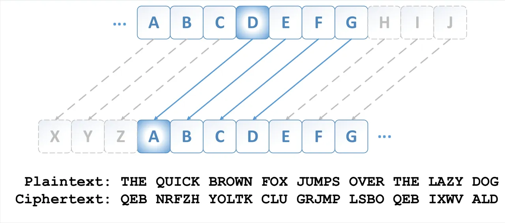

Figure 1: Illustration of Caesar Cipher with shift-3 up

### 2.2 Decryption of Caesar Cipher

To decrypt Caesar Cipher with unknown shift, we need three steps: 1)
acquiring standard English statistics as a “prior”; 2) calculating the
same statistics of the encrypted message, and 3) matching the two
statistics with a trial-and-error scheme to recover the shift. Here we
assume that the encrypted message is large enough that the number of
letters has statistical significance. The process is illustrated in
Figure 2 and explained in details as follows Cipher (2009):

Step 1: Prior standard English statistics To discover the correspondence
between the encrypted letters and standard English letters, we first
need to know precisely how the encrypted letters look like in the
standard alphabet. To this end, for example, one can take a large bulk
of standard English corpus (e.g. newspapers) and calculate the frequency
or histogram of each of 26 English letters, as shown in lower part of
the Figure 2.

Step 2: Encrypted message statistics Similarly, we can determine the
same statistics on our encrypted original message. This can be
accomplished by counting the frequency of each letters in the encrypted
message. We may give the histogram that looks like the one on the upper
part of Figure 2 (after a shift).

Step 3: Matching the two statistics With the two histogram charts side
by side, one can easily try out in a brute-force way all of 25 shifts
and find the best match, as shown in Figure 2. After determining the
shift, one can obtain the shifted alphabet and recover the original
message.

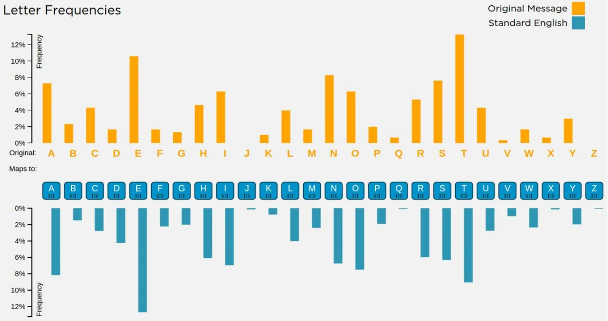

Figure 2: Letter frequency analysis and match between standard English
and original message. \[Screenshot from Caesar Cipher’s online tool
(Cipher, 2009)\]

## 3 Formulation of Unsupervised Learning

The above motivating example of deciphering the original messages
(input) from the encrypted message by Caesar Cipher (input) highlighted
the importance of exploiting the prior output statistics of English
letters. Note that the three-step procedure from input to output
described in Section II does not require the kind of supervised learning
with costly input-output pairs in the training set. We now formulate the
unsupervised learning problem without such a requirement as well.

### 3.1 Formulation of the Unsupervised Learning Problem

Our unsupervised learning problem here is formulated in the simplest
setting of binary classification where no input-output pairs are needed
in the classifier training. The input
$`\mathcal{X}=(\mathbf{x_{1}},\dots,\mathbf{x_{T}})`$ is a sequence of
2-dimensional vectors, where
$`\mathbf{x_{t}}=(x_{t}^{a},x_{t}^{b})\in\mathbb{R}^{2\times 1}`$ is a
2-dimensional vector. The ground-truth labels
$`\mathcal{Y}=(y_{1},\dotsm y_{T})`$ are the corresponding sequence,
where each $`y_{t}`$ denotes the class that $`x_{t}`$ corresponds to.
Note that the ground-truth labels are not used in the training. Here,
analog to Caesar Cipher, the input sequence $`\mathcal{X}`$ acts as the
encrypted message, and $`\mathcal{Y}`$ is the original message to
recover.

Importantly, as any original English message is subject to English
language rules, we also ask that $`y_{t}`$ be subject to a given “rule”.
In this context, we call this rule as “language model” in the form of
N-gram, i.e. the statistics of
$`y_{t}\sim p(y_{N}|y_{N-1},\dots,y_{1})`$. In case of $`N=1`$, the
language model reduces to the basic frequency distribution, i.e.
Unigram, just like the statistics used in the example of Caesar Cipher.
In case of $`N>1`$, the language model describes the sequential pattern
by predicting the next letter in the form of a $`(N-1)`$-th order Markov
model, e.g. $`N=2`$ the Bigram model. We will formulate unsupervised
learning in detail assuming the Unigram model in this section, and walk
through the Bigram case in Section V.

Our problem here is very similar to that of decryption of Caesar Cipher;
i.e. given only the N-gram statistics (analogous to the Prior standard
English statistics) and a sequence
$`(\mathbf{x_{1}},\dots,\mathbf{x_{T}})`$, which is analogous to the
original message) as the input, we desire to predict the true label
sequence $`(y_{1},\dotsm y_{T})`$, which is analogous to the decrypted
message).

### 3.2 An Objective Function for Unsupervised Learning

Since the problem discussed here for pedagogical purposes is binary
classification, we use the most common model, the log-linear model, as
our classifier. In the log-linear model, the output of the classifier is
a posterior probability. Recalling that the input is two-dimensional
$`\mathbf{x_{t}}=(x_{t}^{a},x_{t}^{b})`$, we define the model that has
two learnable parameters denoted as $`\theta=\{w^{a},w^{b}\}`$:

```math
\displaystyle p_{\theta,t}(0)\triangleq p_{\theta}(y_{t}=0|\mathbf{x_{t}})=\frac{e^{\gamma w^{a}x^{a}_{t}}}{e^{\gamma w^{a}x^{a}_{t}}+e^{\gamma w^{b}x^{b}_{t}}}
```

```math
\displaystyle p_{\theta,t}(1)\triangleq p_{\theta}(y_{t}=1|\mathbf{x_{t}})=\frac{e^{\gamma w^{b}x^{b}_{t}}}{e^{\gamma w^{a}x^{a}_{t}}+e^{\gamma w^{b}x^{b}_{t}}} \tag{1}
```

where $`\gamma`$ is a constant (e.g. we fix $`\gamma=10`$ in our
experiments described in Section VI). These formulas calculate the
probability of producing $`y_{t}`$ when receiving input
$`\mathbf{x_{t}}`$. For example, if $`p_{\theta,t}(0)\geq 0.5`$, we
predict label $`\bar{y_{t}}=0`$; otherwise we predict label
$`\bar{y_{t}}=1`$. Note that from Eqn.(1), we always have
$`p_{\theta,t}(0)+p_{\theta,t}(1)=1`$.

We approach the binary classification problem with unsupervised learning
in three steps, analogous to decrypting Caesar Cipher described in
Section III-B. The corresponding three main steps are: 1) Determine
language model statistics as the prior on labels $`\mathcal{Y}`$; 2)
Calculate the statistics on the classifier output, and 3) Match the two
statistics with which a cost function is determined. Next we carry out
this procedure step-by-step to create the cost function.

Step 1: Prior language model statistics. Since the dataset we use is
synthetic data, i.e. both $`\mathcal{X}`$ and $`\mathcal{Y}`$ are known,
we can easily obtain the statistics of a Unigram language model by
calculating the probabilities below with all $`y_{t}\in\mathcal{Y}`$
given in the dataset:

```math
\displaystyle\mathbf{P_{LM}}\triangleq\begin{bmatrix}p(y_{t}=0),~~p(y_{t}=1)\end{bmatrix}=\begin{bmatrix}p_{0},~~p_{1}\end{bmatrix} \tag{2}
```

Note that $`p_{0},p_{1}\geq 0`$ are constants with $`p_{0}+p_{1}=0`$.

Step 2: Classifier output statistics. The classifier outputs from
Eqn.(1) directly determine the probability of data being assigned with
each label. The Unigram (or histogram) statistics can be easily
calculated by

```math
\displaystyle\mathbf{\overline{P_{LM}}}(\theta)=\begin{bmatrix}\frac{1}{T}\sum_{t=1}^{T}p_{\theta,t}(0),~~\frac{1}{T}\sum_{t=1}^{T}p_{\theta,t}(1)\end{bmatrix}^{T} \tag{3}
```

where $`\mathbf{\overline{P_{LM}}}(\theta)`$ stands for the estimated
language model from classifier which is parameterized by $`\theta`$.

Step 3: Matching the two statistics. In the same spirit of decryption of
Caesar Cipher, we need to compare and then match the two statistics
$`\mathbf{P_{LM}}`$ and $`\mathbf{\overline{P_{LM}}}(\theta)`$ in order
to find the best decipher. As suggested in (Chen et al., 2016), the
difference between two distributions can be measured by Kullback-Leibler
(KL) divergence. The KL divergence of the true prior distribution
$`\mathbf{{P_{LM}}}`$ and the estimated distribution
$`\mathbf{\overline{P_{LM}}}`$ is:

```math
\displaystyle D_{KL}(\mathbf{{P_{LM}}}||\mathbf{P_{LM}})=\mathbf{P_{LM}}\ln{{\mathbf{P_{LM}}}^{T}\oslash{\mathbf{\overline{P_{LM}}(\theta)}}}=-\mathbf{P_{LM}}\ln{\mathbf{\overline{P_{LM}}}(\theta)}+\mathbf{P_{LM}}\ln{\mathbf{{P_{LM}}^{T}}} \tag{4}
```

where the sign $`\oslash`$ denotes element-wise division. We minimize
$`D_{KL}`$ in order to learn the model parameters $`\theta`$ to the
effect that the estimated statistics become as close to the prior
statistics as possible. Note that in $`D_{KL}`$ of Eqn. (4), the second
term $`\mathbf{P_{LM}},\ln{\mathbf{{P_{LM}}^{T}}},`$ is a constant and
can be ignored in optimization. Thus, our objective function to be
minimized becomes:

```math
\displaystyle\mathcal{J}(\theta)=-\mathbf{P_{LM}}\ln{\mathbf{\overline{P_{LM}}}(\theta)}=-p_{0}\ln{\frac{1}{T}\sum_{t=1}^{T}{p_{t,\theta}(0)}}-p_{1}\ln{\frac{1}{T}\sum_{t=1}^{T}{p_{t,\theta}(1)}} \tag{5}
```

In summary, we formulate our problem of unsupervised learning in this
pedagogical example as an optimization problem of finding the best
classifier parameters $`\theta^{*}`$ according to

```math
\displaystyle\theta^{*}=\arg\min_{\theta}\mathcal{J}(\theta) \tag{6}
```

### 3.3 Issues of SGD-based Optimization

However, for the objective function of Eqn.(5), it is not feasible to
use SGD-based optimizer to solve the above minimization problem above.
This is due to two reasons: the high cost of computing the gradient and
the highly non-convex profile of the objective function with respect to
the parameters.

High cost of computing the gradient. The SGD-based optimizers, such as
AdaGrad (Duchi et al., 2012) and ADAM (Kingma & Ba, 2014), require that
the sum over training samples be outside of the logarithmic loss
(Ferguson, 1982). However, in the above loss function, the sum over
samples $`t`$, i.e. $`\frac{1}{T}\sum_{t=1}^{T}`$, is inside the
logarithmic loss ($`\ln`$). This makes a very large difference from
traditional neural network error minimization problems solved by SGD.
The special form of the objective function in Eqn. (5) prevents us from
applying SGD to minimize the cost.

Highly non-convex profile. Even worse, the cost function is highly
non-convex, and hard to converge to the optimum. Figure 3 illustrates
this non-convex surface of the cost function $`\mathcal{J}(\theta)`$ in
in Eqn. (5). To obtain this profile surface, we take two steps. First,
we use both data $`\mathcal{X}`$ and true labels $`\mathcal{Y}`$ to find
the global optimum $`\theta^{0}=(w^{a0},w^{b0})`$ (the red points in the
figures) by solving the supervised learning problem

```math
\theta^{0}=\arg\max_{\theta}\sum_{t=1}^{T}\ln{p_{t,\theta}(y_{t}|x_{t})}.
```

This is an ordinary maximum posterior optimization problem with the sum
over training sameples lying outside of the logarithm. Hence we solve it
by plain SGD and plot with red dot in Figure 3. In the second step, we
plot the two-dimensional function around $`w^{a0},w^{b0}`$, i.e.
$`\mathcal{J}(w^{a0}+\lambda_{1},w^{b0}+\lambda_{2})`$ with respect to
$`\lambda_{1},\lambda_{2}\in\mathbb{R}`$. We can observe the surface of
the cost function $`\mathcal{J}(\theta)`$ and find that it is highly
non-convex. There are many local optimal solutions and there is a high
barrier that makes it difficult for naive optimization algorithms to
reach the global optimum.

To overcome the above two difficulties, we can transform the
optimization problem for the cost function in Eqn. (5) into an
equivalent one, called _saddle point problem_, where the cost function
has a more desirable profile surface for gradient-based methods. One
such technique is introduced in Section IV next.

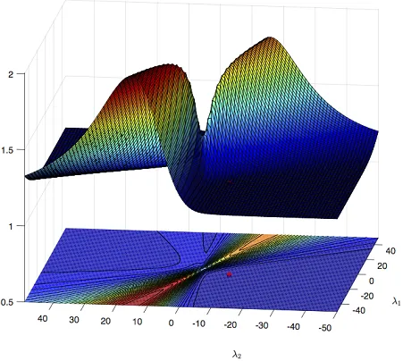

(a)

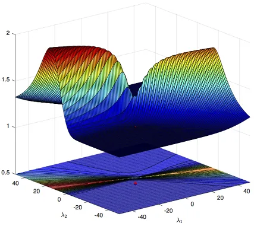

(b)

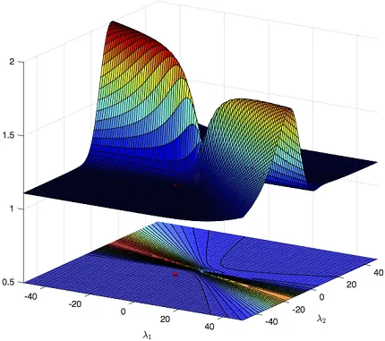

(c)

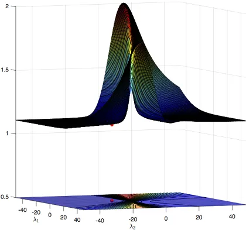

(d)

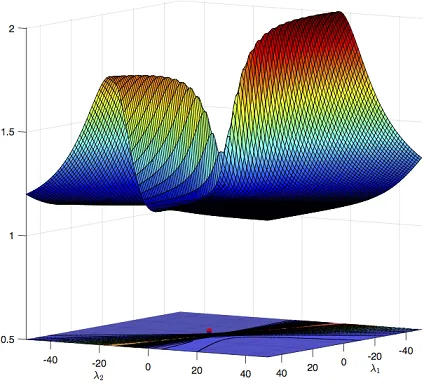

(e)

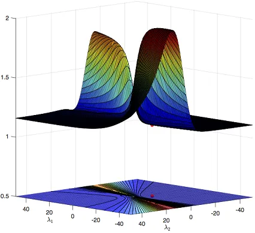

(f)

Figure 3: $`\mathcal{J}(\theta)`$ profile in the primal domain. The six
sub-figures show the same profile from six different angles, spinning
clock-wise from (a)-(f). The red dots indicate the global minimum.

## 4 An Equivalent Saddle Point Problem & Its Solution

### 4.1 Problem Formulation

Let us first introduce a lemma that will be used in the later
description of the saddle point problem.

###### Lemma 1.

For any scaler $`u>0`$, the equation below holds:

```math
\displaystyle-\ln{u}=\max_{v<0}{(uv+\ln{(-v)})}.
```

###### Proof.

We use convex conjugate functions to prove this equation. For a given
convex function $`f(u)`$, its convex conjugate function $`f^{*}(v)`$ is
defined in (Boyd & Vandenberghe, 2004) as:

```math
\displaystyle f^{*}(v)\triangleq\sup_{u}{(v^{T}u-f(u))}. \tag{7}
```

Furthermore, the convex function $`f(u)`$ can be related to its convex
conjugate function $`f^{*}(v)`$ as following relation:

```math
\displaystyle f(u)=\sup_{v}{(u^{T}v-f^{*}(v))}. \tag{8}
```

We now consider a convex function $`f(u)=-\ln{u}`$ where $`u`$ is a
scalar and $`u>0`$. From Eqn. (), the conjugate function for $`f(u)`$
can be obtained:

```math
\displaystyle f^{*}(v)|_{f(u)=-\ln{u}}=\sup_{u}{(uv+\ln{u})}=\max_{u}{(uv+\ln{u})}.
```

Let $`{\partial{(uv+\ln{u})}}/{\partial{u}}=v+{1}/{u}=0`$ and we can
obtain the maximum point for $`u`$ is at $`u=-{1}/{v}`$. Substituting it
in above formula, we can solve to get

```math
\displaystyle f^{*}(v)|_{f(u)=-\ln{u}}=(uv+\ln{u})|_{u=-\frac{1}{v}}=-1-\ln{v} \tag{9}
```

with $`v<0`$ is a scaler. We then replace the $`f^{*}(v)`$ in the right
side of Formula (8) with Formula (9), and replace the $`f(u)`$ in left
side with $`f(u)=-\ln{u}`$. Finally, for any scaler $`u>0`$, we obtan:

```math
\displaystyle-\ln{u}=\max_{v<0}{(uv+\ln{(-v)})}
```

∎

Examining Lemma 1, we find $`\ln{u}`$ on the left side of the equation
is transformed into an maximum over a different variable $`v`$ of a
formula where $`u`$ comes outside the logarithm. Thus, we use this Lemma
to rewrite the logarithm part in the cost function in Eqn. (5):

```math
\displaystyle\min_{\theta} \displaystyle{\mathcal{J}(\theta)}=\min_{\theta}{\left\{-p_{0}\ln{\frac{1}{T}\sum_{t=1}^{T}{p_{t,\theta}(0)}}-p_{1}\ln{\frac{1}{T}\sum_{t=1}^{T}{p_{t,\theta}(1)}}\right\}}
```

```math
\displaystyle= \displaystyle\min_{\theta}\Bigg\{p_{0}\max_{v_{0}<0}{\left[v_{0}\frac{1}{T}\sum_{t=1}^{T}p_{t,\theta}(0)+\ln{(-v_{0})}\right]}+p_{1}\max_{v_{1}<0}{\left[v_{1}\frac{1}{T}\sum_{t=1}^{T}p_{t,\theta}(1)+\ln{(-v_{1})}\right]}\Bigg\}
```

```math
\displaystyle= \displaystyle\min_{\theta}\max_{v_{0},v_{1}<0}\Bigg\{p_{0}v_{0}\frac{1}{T}\sum_{t=1}^{T}p_{t,\theta}(0)+p_{0}\ln{(-v_{0})}+p_{1}v_{1}\frac{1}{T}\sum_{t=1}^{T}p_{t,\theta}(1)+p_{1}\ln{(-v_{1})}\Bigg\}
```

```math
\displaystyle= \displaystyle\min_{\theta}\max_{v_{0},v_{1}<0}\Bigg\{\frac{1}{T}\sum_{t=1}^{T}\left[p_{0}v_{0}p_{t,\theta}(0)+p_{1}v_{1}p_{t,\theta}(1)\right]+p_{0}\ln{(-v_{0})}+p_{1}\ln{(-v_{1})}\Bigg\} \tag{10}
```

Let us now define the new cost function $`\mathcal{L}(\theta,V)`$ to be
the quantity inside the $`\min\max`$ in Equation 10 above:

```math
\displaystyle{\mathcal{L}(\theta,V)}=\frac{1}{T}\sum_{t=1}^{T}\left[p_{0}v_{0}p_{t,\theta}(0)+p_{1}v_{1}p_{t,\theta}(1)\right]+p_{0}\ln{(-v_{0})}+p_{1}\ln{(-v_{1})} \tag{11}
```

where $`V=\{v_{0},v_{1}\}`$. With the use of matrix form
$`\mathbf{V}=\begin{bmatrix}v_{0},v_{1}\end{bmatrix}`$, as well as
Equations (2) and (24), we rewrite the new cost function into a matrix
form (where $`\odot`$ stands for pairwise multiplication between two
matrices):

```math
\displaystyle\min_{\theta}{\max_{\mathbf{V}<\mathbf{0}}{\mathcal{L}(\theta,\mathbf{V})}}=\min_{\mathbf{\theta}}\max_{\mathbf{V}<\mathbf{0}}\bigg\{[\mathbf{P_{LM}}\odot\mathbf{V}]\mathbf{\overline{P_{LM}}}(\theta)+\mathbf{P_{LM}}\ln{(-\mathbf{V})}^{T}\bigg\} \tag{12}
```

Let us provide interpretation for the new cost function
$`\mathcal{L}(\theta,\mathbf{V})`$ in Eqn. (12), contrasting the earlier
form of $`\mathcal{J}(\theta)`$ in Eqn. (5). In the new form, parameter
$`\mathbf{V}`$ is called _dual_ variables, and the original parameters
$`\mathbf{\theta}`$ are called _primal_ variables. Minimization of
$`\mathcal{J}(\theta)`$ over primal variables $`\theta`$ has been
transformed to a min-max problem on $`\mathcal{L}(\theta,\mathbf{V})`$
over both primal variables $`\theta`$ and dual variables $`\mathbf{V}`$.
The min-max problem in this new form is called _saddle-point problem_.
Specifically, the saddle-point problem can be solved by seeking a point,
which is not only the minimum point along primal domain ($`\theta`$) but
also the maximum point along dual domain ($`\mathbf{V}`$). This point,
denoted as $`(\theta^{*},\mathbf{V}^{*})`$, is called the _saddle point_
for the domain of $`(\theta,\mathbf{V})`$ \[2\]. Importantly, we find
that the sum over $`t`$ has been taken outside of logarithm. As a
result, we can now apply SGD or its variation in learning the model.

### 4.2 Profile Surface of $`\mathcal{L(\theta,\mathbf{V})}`$

We now draw the profile of cost function
$`\mathcal{L}(\theta,\mathbf{V})`$ in Figure 4. Like the profile surface
of $`\mathcal{J}(\theta)`$ in Section IV-C, we need to first get
$`\theta^{0}`$ by solving the supervised problem
$`\theta^{0}=\arg\max_{\theta}\sum_{t=1}^{T}\ln{p_{t,\theta}(y_{t}|x_{t})}`$.
Then, we inference $`V^{0}`$ by

```math
\displaystyle\mathbf{V^{0}}=-\frac{1}{\mathbf{\overline{P_{LM}}}^{T}(\theta^{0})} \tag{13}
```

With the supervised optima $`\theta^{0},\mathbf{V^{0}}`$, we can plot
the 3-D cost function surface around this optima. We randomly choose two
direction $`(\theta^{1}-\theta^{0})`$ and
$`(\mathbf{V^{1}}-\mathbf{V^{0}})`$, where $`\theta^{1}`$ and
$`\mathbf{V^{1}}`$ are random vectors with same size of $`\theta^{0}`$
and $`\mathbf{V^{0}}`$. Then we plot on the 3-D space the point
$`(\lambda_{p},\lambda_{d},Z(\lambda_{p},\lambda_{d}))`$, with
$`Z(\lambda_{p},\lambda_{d})=\mathcal{J}(\theta^{*}+\lambda_{p}(\theta_{1}-\theta^{0}),\mathbf{V^{0}}+\lambda_{d}(\mathbf{V_{1}}-\mathbf{V^{0}}))`$.
The Figure 4 shows the plotting results.

Comparing surface of original surface in Figure 3 with surface of
transformed cost function in Figure 4, we can see that, after the
primal-dual reformulation, the barrier in original cost function
$`\mathcal{J}(\theta)`$ disappears. Thus the optimization become much
easier on the new cost function.

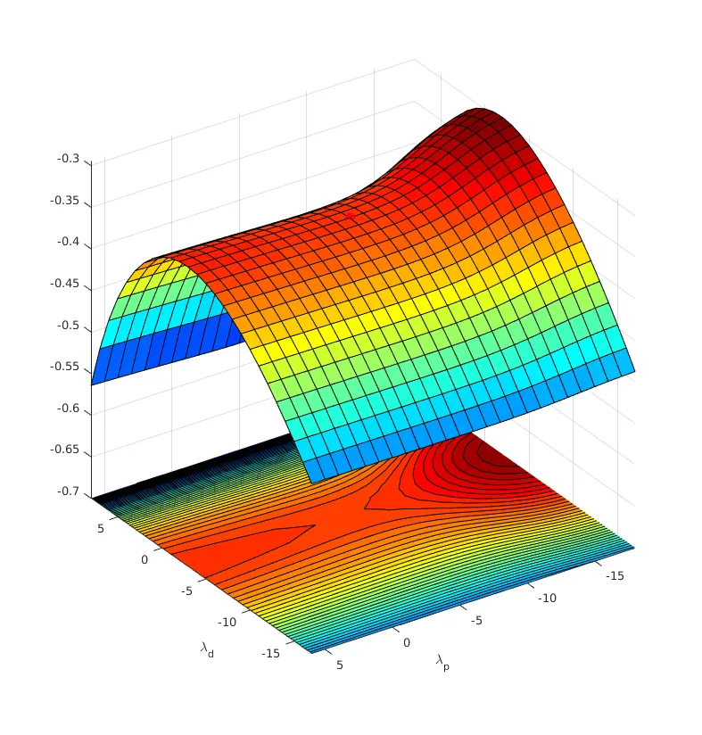

(a)

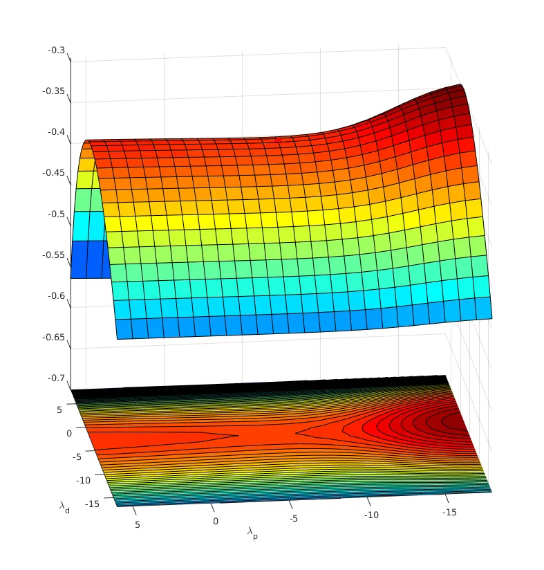

(b)

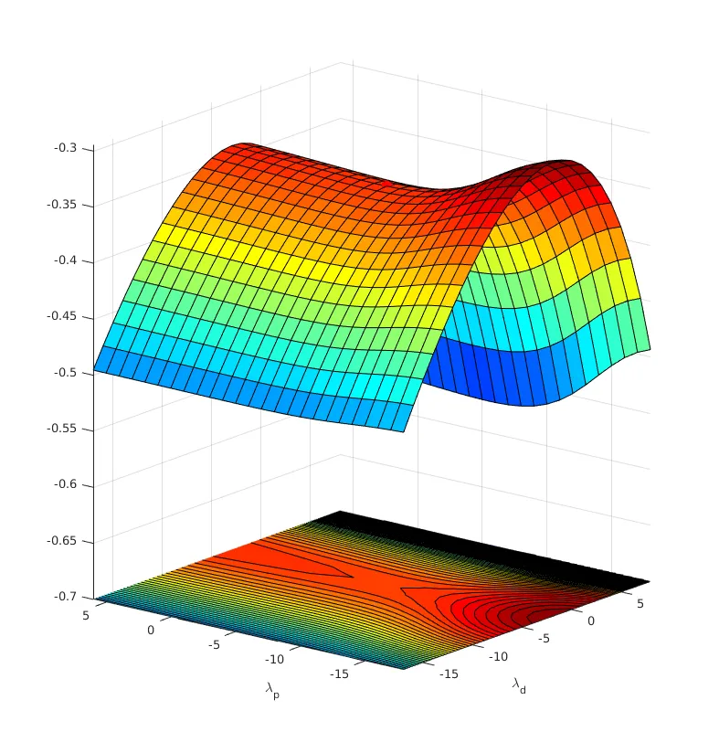

(c)

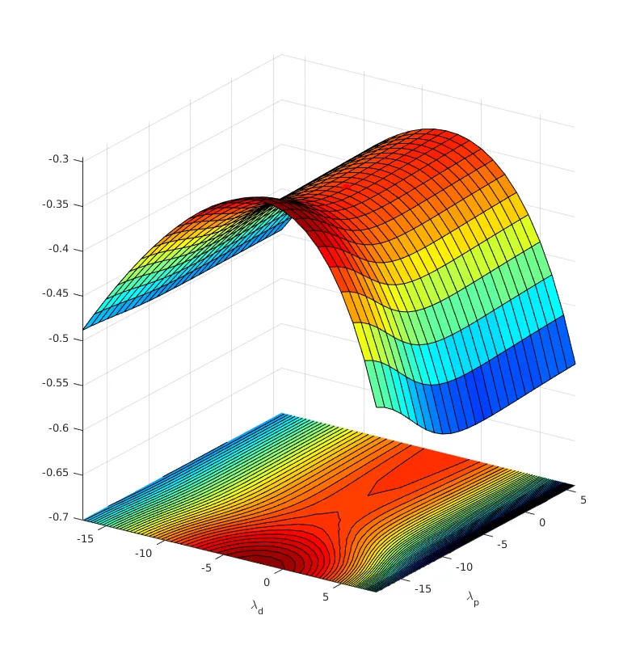

(d)

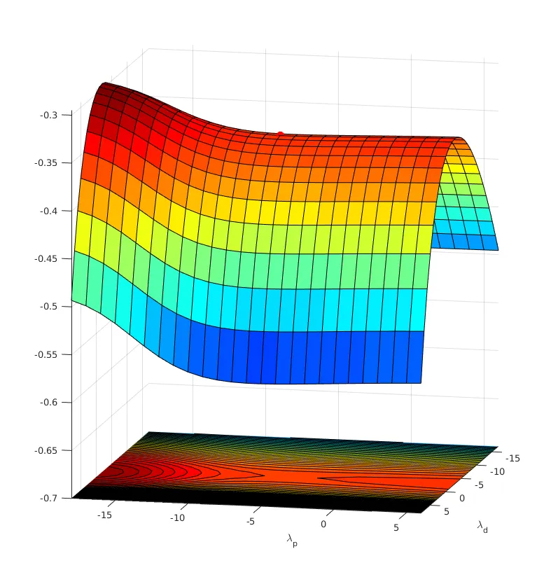

(e)

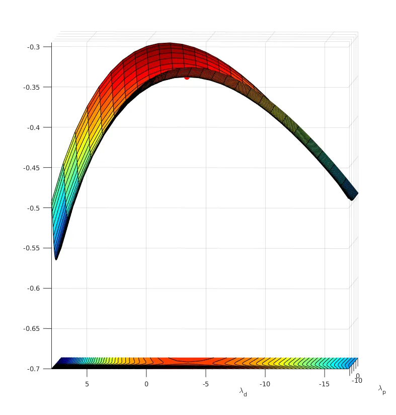

(f)

Figure 4: $`\mathcal{L}(\theta,\mathbf{V})`$ profile surface in the
primal-dual domain of the Unigram case. The six sub-figures show the
same profile from six different angles, spinning clock-wise from
(a)-(f). The red dots indicate the saddle point (global optima).

### 4.3 Solution with Primal-Dual Optimization

In this section, we proceed to find the solution to the saddle-point
problem in Eqn. (12).

To solve a min-max problem, our idea is to minimize
$`\mathcal{L}(\theta,\mathbf{V})`$ with respect to $`\theta`$, while, at
the same time, maximize $`\mathcal{L}(\theta,\mathbf{V})`$ with respect
to $`\mathbf{V}`$. Specifically, we solve the min-max problem by
stochastic gradient _descent_ of $`\mathcal{L}(\theta,\mathbf{V})`$ over
$`\theta`$ while by stochastic _accent_ of
$`\mathcal{L}(\theta,\mathbf{V})`$ over $`\mathbf{V}`$ with following
update equations:

```math
\displaystyle\mathbf{\theta}_{\tau}=\mathbf{\theta}_{\tau-1}-\mu_{\theta}\frac{\partial\mathcal{L}}{\partial\mathbf{\theta}}\bigg|_{\mathbf{\theta}=\mathbf{\theta}_{\tau-1},\mathbf{V}=\mathbf{V}_{\tau-1}}
```

```math
\displaystyle\mathbf{V}_{\tau}=\mathbf{V}_{\tau-1}+\mu_{V}\frac{\partial\mathcal{L}}{\partial\mathbf{V}}\bigg|_{\mathbf{\theta}=\mathbf{\theta}_{\tau-1},\mathbf{V}=\mathbf{V}_{\tau-1}} \tag{14}
```

The updates happens at time $`\tau`$. And $`\mu_{\theta},\mu_{V}>0`$ are
learning rate for primal variables and dual variables, respectively.
Note that we update two of primal and dual variables in a synchronized
manor.

Now we derive the close form of
$`\frac{\partial\mathcal{L}}{\partial\mathbf{\theta}}`$ and
$`\frac{\partial\mathcal{L}}{\partial\mathbf{V}}`$. First, for
$`\frac{\partial\mathcal{L}}{\partial\mathbf{\theta}}`$, from Eqn. (12),
we take partial derivative:

```math
\displaystyle\frac{\partial\mathcal{L}}{\partial\mathbf{\theta}}=\frac{\partial}{\partial\mathbf{\theta}}\bigg\{[\mathbf{P_{LM}}\odot\mathbf{V}]\mathbf{\overline{P_{LM}}}(\theta)+\mathbf{P_{LM}}\ln{(-\mathbf{V})}^{T}\bigg\}=[\mathbf{P_{LM}}\odot\mathbf{V}]\frac{\partial\mathbf{\overline{P_{LM}}}(\theta)}{\partial\mathbf{\theta}} \tag{15}
```

where the term
$`\frac{\partial\mathbf{\overline{P_{LM}}}(\theta)}{\partial\mathbf{\theta}}`$
in above can be decomposed and calculated in element-wise. Recall that
$`\mathbf{P_{LM}}=[p_{0},p_{1}]`$ is constant,
$`\mathbf{\overline{P_{LM}}}(\theta)=[\frac{1}{T}\sum_{t=1}^{T}p_{\theta,t}(0),~~\frac{1}{T}\sum_{t=1}^{T}p_{\theta,t}(1)]^{T}`$
and $`\mathbf{\theta}=[w^{a},w^{b}]^{T}`$. From matrix derivative rules
we know:

```math
\displaystyle\frac{\partial\mathbf{\overline{P_{LM}}}(\theta)}{\partial\mathbf{\theta}}=\frac{1}{T}\sum_{t=1}^{T}\begin{bmatrix}{\partial p_{t,\theta}(0)}/{\partial w^{a}}&{\partial p_{t,\theta}(0)}/{\partial w^{b}}\\
{\partial p_{t,\theta}(1)}/{\partial w^{a}}&{\partial p_{t,\theta}(1)}/{\partial w^{b}}\end{bmatrix} \tag{16}
```

where $`p_{t,\theta}(0)`$ and $`p_{t,\theta}(1)`$ are defined in Eqn.
(1) being log-linear classifier model for classes $`0`$ and $`1`$,
respectively. The four derivatives in Eqn. (16) can be calculated from
definition in Eqn. (1). For example:

```math
\displaystyle\frac{\partial p_{t,\theta}(0)}{\partial w^{a}} \displaystyle=\frac{\partial}{\partial w^{a}}\bigg\{\frac{e^{\gamma w^{a}x^{a}_{t}}}{e^{\gamma w^{a}x^{a}_{t}}+e^{\gamma w^{b}x^{b}_{t}}}\bigg\}
```

```math
\displaystyle=\frac{\partial}{\partial w^{a}}\bigg\{\frac{1}{1+e^{-(\gamma w^{a}x^{a}_{t}-\gamma w^{b}x^{b}_{t})}}\bigg\}
```

```math
\displaystyle=\frac{\partial}{\partial w^{a}}\sigma(\gamma w^{a}x^{a}_{t}-\gamma w^{b}x^{b}_{t})
```

```math
\displaystyle=\sigma(\gamma w^{a}x^{a}_{t}-\gamma w^{b}x^{b}_{t})(1-\sigma(\gamma w^{a}x^{a}_{t}-\gamma w^{b}x^{b}_{t}))\frac{\partial(\gamma w^{a}x^{a}_{t}-\gamma w^{b}x^{b}_{t})}{\partial w^{a}}
```

```math
\displaystyle=p_{t,\theta}(0)(1-p_{t,\theta}(0))(\gamma x^{a}_{t})
```

```math
\displaystyle=\gamma p_{t,\theta}(0)p_{t,\theta}(1)x^{a}_{t} \tag{17}
```

In above derivation, $`\sigma(\cdot)`$ indicate sigmoid function that
$`\sigma(a)=\frac{1}{1+e^{-a}}`$. Note that we use the equation
$`\frac{\partial\sigma(a)}{\partial a}=\sigma(a)(1-\sigma(a))`$ in above
derivation. Similarly, we can get all the derivatives in matrix of 16
as:

```math
\displaystyle\frac{\partial p_{t,\theta}(0)}{\partial w^{a}}=\gamma p_{t,\theta}(0)p_{t,\theta}(1)(x^{a}_{t})
```

```math
\displaystyle\frac{\partial p_{t,\theta}(0)}{\partial w^{b}}=\gamma p_{t,\theta}(0)p_{t,\theta}(1)(-x^{b}_{t})
```

```math
\displaystyle\frac{\partial p_{t,\theta}(1)}{\partial w^{a}}=\gamma p_{t,\theta}(0)p_{t,\theta}(1)(-x^{a}_{t})
```

```math
\displaystyle\frac{\partial p_{t,\theta}(1)}{\partial w^{b}}=\gamma p_{t,\theta}(0)p_{t,\theta}(1)(x^{b}_{t}) \tag{18}
```

Then we substitute all derivative terms in Eqn. (16) using (18):

```math
\displaystyle\frac{\partial\mathbf{\overline{P_{LM}}}(\theta)}{\partial\mathbf{\theta}} \displaystyle=\frac{1}{T}\sum_{t=1}^{T}\gamma p_{t,\theta}(0)p_{t,\theta}(1)\mathbf{X}
```

```math
\displaystyle where~~~\mathbf{X}=\begin{bmatrix}~x_{t}^{a}&-x_{t}^{b}\\
-x_{t}^{a}&~x_{t}^{b}\end{bmatrix} \tag{19}
```

Thus we get the final close form of
$`\frac{\partial\mathcal{L}}{\partial\mathbf{\theta}}`$:

```math
\displaystyle\frac{\partial\mathcal{L}}{\partial\mathbf{\theta}}=\frac{1}{T}\sum_{t=1}^{T}\bigg\{\gamma p_{t-1,\theta}(0)p_{t-1,\theta}(1)[\mathbf{P_{LM}}\odot\mathbf{V}]\mathbf{X}\bigg\} \tag{20}
```

Then for $`\frac{\partial\mathcal{L}}{\partial\mathbf{V}}`$, recall that
$`\mathbf{V}=[v_{0},v_{1}]`$. Simply use matrix derivative rules and we
can get:

```math
\displaystyle\frac{\partial\mathcal{L}}{\partial\mathbf{V}} \displaystyle=\frac{\partial}{\partial\mathbf{V}}\bigg\{[\mathbf{P_{LM}}\odot\mathbf{V}]\mathbf{\overline{P_{LM}}}(\theta)+\mathbf{P_{LM}}\ln{(-\mathbf{V})}^{T}\bigg\}
```

```math
\displaystyle=\mathbf{P_{LM}}\odot\mathbf{\overline{P_{LM}}}^{T}(\theta)+\frac{\mathbf{P_{LM}}}{\mathbf{V}} \tag{21}
```

For mini-batch updates, we simply replace the sum over total data $`T`$
with sum over the mini-batch data
$`B=(\mathbf{x_{s}},…,\mathbf{x_{s+N-1}})`$. For each update, a sequence
of data with size $`N`$ is randomly taken from $`\mathcal{X}`$ as a
mini-batch. Then we use Formula (14) to update both primal and dual
variable with close form (20) and (21). Repeating this process until
convergence. We describe the this process with mini-batch gradient in
Algorithm 1.

### 4.4 The Weakness of Unigram

However, we found the language model of Unigram is too weak. It does not
capture the sequence structure which is important information for
unsupervised classification. As in Chen et al. (2016), the sequence
prior of output labels is a important structure to employ in
unsupervised problems, especially when the order is high. However, the
Unigram language model does not capture such structure.

However, the experiment results turns out to be unsatisfied. The average
classification error rate is $`30.8\%`$, which is just about the error
rate of majority guess. The model constantly predicts class with label
1, regardless of the input data. In experiment we conduct the
experiments on the binary classification task with the dataset we
created for $`(\mathcal{X},\mathcal{Y})`$.

Next, we will walk through this problem by using Bigram language model,
the simplest language model with sequence prior statistics. The main
procedure of the derivation is the same with Unigram we just did in
previous sections. So it can be easier for readers to apply to Bigram
case, in spite of more mathematics will be involved.

1:  Input data: $`\mathcal{X}=(\mathbf{x_{1}},\dots,\mathbf{x_{T}})`$
and $`\mathbf{P_{\mathrm{LM}}}`$.

2:  Initialize $`\theta`$ and $`\mathbf{V}`$ from random numbers where
the elements of $`\mathbf{V}`$ are negative

3:  repeat

4:   Randomly sample a mini-batch of $`B`$ subsequences of length $`N`$,
i.e., $`B=(\mathbf{x_{s}},\dots,\mathbf{x_{s+N-1}})`$.

5:   Compute the stochastic gradients
$`{\partial\mathcal{L}}/{\partial\mathbf{\theta}}`$ and
$`{\partial\mathcal{L}/}{\partial\mathbf{V}}`$ for the subsequence in
the mini-batch using Formula (20) and (21).

6:   Update $`\theta`$ and $`\mathbf{V}`$ according to

```math
\displaystyle\theta \displaystyle\leftarrow\theta-\mu_{\theta}\frac{\partial\mathcal{L}}{\partial\mathbf{\theta}},\hskip 18.49988pt\mathbf{V}\leftarrow\mathbf{V}+\mu_{V}\frac{\partial\mathcal{L}}{\partial\mathbf{V}}
```

7:  until convergence or a certain stopping condition is met

Algorithm 1 Stochastic Primal-Dual Gradient Method

## 5 Extension to the Case with Sequence Prior Statistics

### 5.1 Problem Formulation for the Sequential Bigram Case

In Bigram case, the problem formulation and approach is the same as
Unigram case that we also use model for classifier as in formula 1.
except using Bigram language models. Here below are the three main steps
accordingly.

Step 1: Prior language model statistics (Bigram) We will create
synthetic data with arbitrary given language model. First, we create
output labels $`\mathcal{Y}=(y_{1},y_{2},\dots,y_{T})`$ from a 1st-order
Markov model that is based on a given transition probability:

```math
\displaystyle p(y_{1},y_{2},\dots,y_{T})=\prod_{t=1}^{T}p(y_{t}|y_{t-1}) \tag{22}
```

$`p(y_{t}|y_{t-1})`$ denotes conditional probability of the transition
between adjacent labels $`y_{t-1}`$ to $`y_{t}`$, which is given in
transition matrix $`\mathbf{P_{Trans}}`$. Then, the language model
$`\mathbf{P_{LM}}`$ can be calculated from the transition matrix:

```math
\displaystyle\mathbf{P_{LM}}\triangleq\begin{bmatrix}p_{00}&p_{01}\\
p_{10}&p_{11}\end{bmatrix}=diag(\mathbf{p_{st}})\mathbf{P_{Trans}} \tag{23}
```

$`\mathbf{p_{st}}`$ denotes the steady state vector of transition
$`\mathbf{P_{Trans}}`$. The creation of data, as well as connection
between language model and transition matrix will be explained in detail
in experiment section VII.

Step 2: Classifier output statistics (Bigram) Due to first order
dependency, the probability of data being assigned with each label by
the classifier in Eqn. (1) can be calculated by:

```math
\displaystyle\mathbf{\overline{P_{LM}}}(\theta) \displaystyle=\begin{bmatrix}\frac{1}{T}\sum_{t=1}^{T}p_{\theta,t}(0)p_{\theta,t-1}(0),~~\frac{1}{T}\sum_{t=1}^{T}p_{\theta,t}(0)p_{\theta,t-1}(1)\\
\frac{1}{T}\sum_{t=1}^{T}p_{\theta,t}(1)p_{\theta,t-1}(0),~~\frac{1}{T}\sum_{t=1}^{T}p_{\theta,t}(1)p_{\theta,t-1}(1)\end{bmatrix}
```

```math
\displaystyle=\frac{1}{T}\sum_{t=1}^{T}\begin{bmatrix}p_{\theta,t-1}(0)\\
p_{\theta,t-1}(1)\end{bmatrix}\begin{bmatrix}p_{\theta,t}(0)\\
p_{\theta,t}(1)\end{bmatrix}^{T}
```

```math
\displaystyle=\frac{1}{T}\sum_{t=1}^{T}\mathbf{P_{t-1,\theta}}\mathbf{P_{t,\theta}}^{T}
```

```math
\displaystyle where~~~~ \displaystyle\mathbf{P_{t,\theta}}=\begin{bmatrix}p_{t,\theta}(0)~~p_{t,\theta}(1)\end{bmatrix}^{T} \tag{24}
```

Step 3: Matching the two statistics As with Unigram, we still use
KL-divergence to measure the difference, and obtain cost function :

```math
\displaystyle\mathcal{J}(\theta)=-\left\langle\mathbf{P_{LM}}~,~\ln{\mathbf{\overline{P_{LM}}}(\theta)}\right\rangle=-\sum_{i,j\in\{0,1\}}p_{ij}\ln{\frac{1}{T}\sum_{t=1}^{T}[p_{t-1,\theta}(i)p_{t,\theta}(j)]} \tag{25}
```

where the notation
$`\left\langle\mathbf{A},\mathbf{B}\right\rangle=\sum_{i}\sum_{j}a_{ij}b_{ij}`$
stands for the inner product of two matrices $`\mathbf{A}`$ and
$`\mathbf{B}`$, specifically, sum of the products of the corresponding
components of two matrices. Thus, we formulate our problem as an
optimization problem finding the best classifier parameters
$`\theta^{*}`$:

```math
\displaystyle\theta^{*}=\arg\min_{\theta}\mathcal{J}(\theta) \tag{26}
```

We again observe the sum inside logarithm. With using Lemma 1, we can
transform this problem to its equivalent saddle-point problem:

```math
\displaystyle\min_{\theta}{\mathcal{J}(\theta)} \displaystyle=\min_{\theta}{\left\{\sum_{i,j\in\{0,1\}}p_{ij}\max_{v_{ij}<0}{\left[v_{ij}\frac{1}{T}\sum_{t=1}^{T}[p_{t-1,\theta}(i)p_{t,\theta}(j)]+\ln{(-v_{ij})}\right]}\right\}}
```

```math
\displaystyle=\min_{\theta}{\max_{v_{ij}<0}{\left\{\sum_{i,j\in\{0,1\}}p_{ij}v_{ij}\frac{1}{T}\sum_{t=1}^{T}[p_{t-1,\theta}(i)p_{t,\theta}(j)]+p_{ij}\ln{(-v_{ij})}\right\}}}
```

```math
\displaystyle=\min_{\theta}\max_{v_{ij}<0}\Bigg\{\frac{1}{T}\sum_{t=1}^{T}\sum_{i,j\in\{0,1\}}p_{ij}v_{ij}p_{t-1,\theta}(i)p_{t,\theta}(j)+\sum_{i,j\in\{0,1\}}p_{ij}\ln{(-v_{ij})}\Bigg\}
```

```math
\displaystyle=\min_{\mathbf{\theta}}\max_{\mathbf{V}<0}\bigg\{\frac{1}{T}\sum_{t=1}^{T}(\mathbf{p_{t-1,\theta}^{T}}[\mathbf{P_{LM}}\odot\mathbf{V}]\mathbf{p_{t,\theta}})+\left\langle\mathbf{P_{LM}},\ln{(-\mathbf{V})}\right\rangle\bigg\}
```

As in the case of Unigram, we define the new cost:

```math
\displaystyle\mathcal{L}(\theta,\mathbf{V}) \displaystyle=\frac{1}{T}\sum_{t=1}^{T}(\mathbf{p_{t-1,\theta}^{T}}[\mathbf{P_{LM}}\odot\mathbf{V}]\mathbf{p_{t,\theta}})+\left\langle\mathbf{P_{LM}},\ln{(-\mathbf{V})}\right\rangle
```

```math
\displaystyle\mathbf{V} \displaystyle=\begin{bmatrix}v_{00}~~v_{01}\\
v_{10}~~v_{11}\end{bmatrix}~~~~\mathbf{P_{t,\theta}}=\begin{bmatrix}p_{t,\theta}(0)\\
p_{t,\theta}(1)\end{bmatrix}~~~~\mathbf{P_{LM}}=\begin{bmatrix}p_{00}~~p_{01}\\
p_{10}~~p_{11}\end{bmatrix}~~~~\mathbf{\theta}=\begin{bmatrix}w^{a}\\
w^{b}\end{bmatrix} \tag{27}
```

$`\theta`$ is called _primal_ variables, and $`\mathbf{V}`$ is called
_dual_ variables. Thus, the minimization problem of
$`\mathcal{J}(\theta)`$ over primal variables $`\theta`$ is transformed
to an equivalent saddle-point problem of
$`\mathcal{L}(\theta,\mathbf{V})`$, and the sum over $`t`$ has been
taken outside of logarithm. In other words, the optimal solution
$`(\theta^{*},\mathbf{V}^{*})`$ to $`\mathcal{L}(\theta,\mathbf{V})`$ is
called the saddle point \[2\], which is relative minimum along primal
domain $`\theta`$ while is a relative maximum along dual domain
$`\mathbf{V}`$.

### 5.2 Profile Surface of $`\mathcal{L}(\theta,\mathbf{V})`$

As in the Unigram case, we also visualize the profile surface of cost
function $`\mathcal{L}(\theta,\mathbf{V})`$ in Figure 5. Again, we need
to first get $`\theta^{0}`$ by solving the supervised problem
$`\theta^{0}=\arg\max_{\theta}\sum_{t=1}^{T}\ln{p_{t,\theta}(y_{t}|x_{t})}`$,
and inference $`V^{0}`$ using

```math
\displaystyle\mathbf{V^{0}}=-\frac{T}{\sum_{t=1}^{T}\mathbf{P_{t-1,\theta^{0}}}\mathbf{P_{t,\theta^{0}}^{T}}} \tag{28}
```

Using the same method, we first randomly choose two direction
$`(\theta^{1}-\theta^{0})`$ and $`(\mathbf{V^{1}}-\mathbf{V^{0}})`$,
where $`\theta^{1}`$ and $`\mathbf{V^{1}}`$ are random vectors with same
size of $`\theta^{0}`$ and $`\mathbf{V^{0}}`$. Then we plot on the 3-D
space the point
$`(\lambda_{p},\lambda_{d},Z(\lambda_{p},\lambda_{d}))`$, with
$`Z(\lambda_{p},\lambda_{d})=\mathcal{J}(\theta^{*}+\lambda_{p}(\theta_{1}-\theta^{0}),\mathbf{V^{0}}+\lambda_{d}(\mathbf{V_{1}}-\mathbf{V^{0}}))`$.
The Figure 5 shows the plotting results.

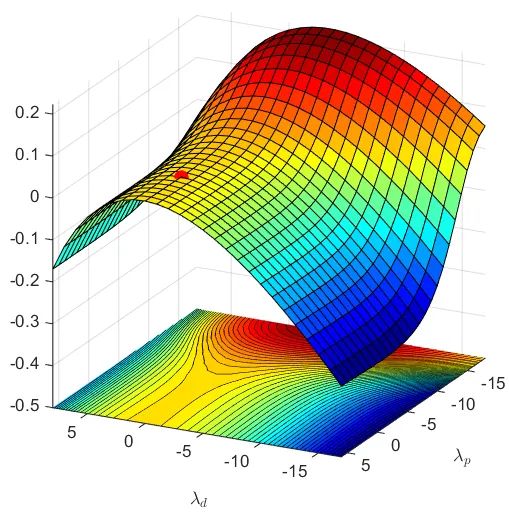

(a)

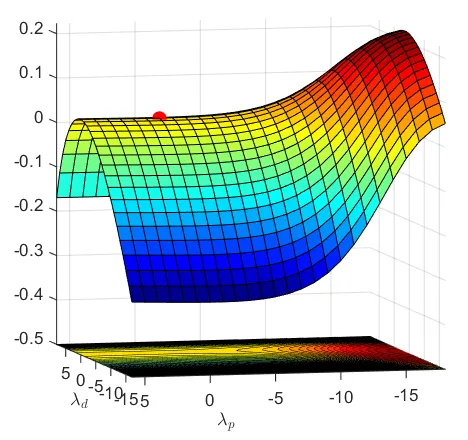

(b)

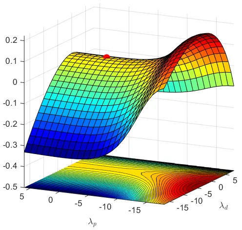

(c)

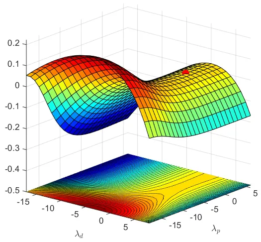

(d)

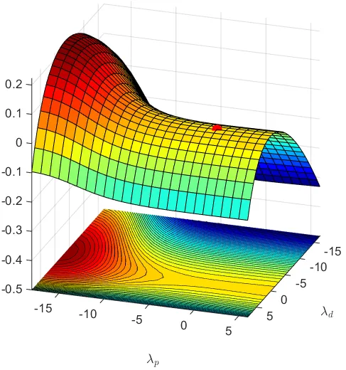

(e)

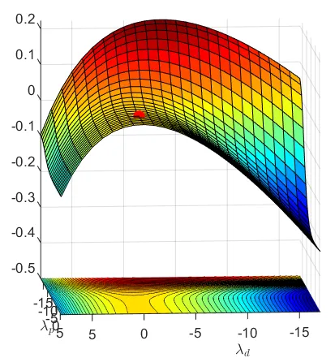

(f)

Figure 5: $`\mathcal{L}(\theta,\mathbf{V})`$ profile in the primal-dual
domain of the Bigram case. The six sub-figures show the same profile
from six different angles, spinning clock-wise from (a)-(f). The red
dots indicate the saddle point (global optima).

### 5.3 Primal-Dual Optimization for Bigram Case

Similarly, we solve the min-max problem by stochastic gradient _descent_
of $`\mathcal{L}(\theta,V)`$ over $`\theta`$ while by stochastic
_accent_ of $`\mathcal{L}(\theta,V)`$ over $`V`$ with the same update
equations:

```math
\displaystyle\mathbf{\theta}_{\tau}=\mathbf{\theta}_{\tau-1}-\mu_{\theta}\frac{\partial\mathcal{L}}{\partial\mathbf{\theta}}\bigg|_{\mathbf{\theta}=\mathbf{\theta}_{\tau-1},\mathbf{V}=\mathbf{V}_{\tau-1}}
```

```math
\displaystyle\mathbf{V}_{\tau}=\mathbf{V}_{\tau-1}+\mu_{V}\frac{\partial\mathcal{L}}{\partial\mathbf{V}}\bigg|_{\mathbf{\theta}=\mathbf{\theta}_{\tau-1},\mathbf{V}=\mathbf{V}_{\tau-1}} \tag{29}
```

The updates happens at time $`\tau`$. And $`\mu_{\theta},\mu_{V}>0`$ are
learning rate for primal variables and dual variables, respectively.
Note that we update two of primal and dual variables in a synchronized
manor.

By using Formula (19), we calculate
$`{\partial\mathcal{L}}/{\partial\mathbf{\theta}}`$ and
$`{\partial\mathcal{L}/}{\partial\mathbf{V}}`$ similar as the Unigram
Case:

```math
\displaystyle\frac{\partial\mathcal{L}}{\partial\mathbf{\theta}}=\frac{1}{T}\sum_{t=1}^{T}\bigg\{\gamma P_{t-1,\theta}(0)P_{t-1,\theta}(1)([\mathbf{X_{t-1}^{T}}(\mathbf{P_{LM}}\odot\mathbf{V})\mathbf{P_{t,\theta}}+(\mathbf{P_{LM}}\odot\mathbf{V})^{T}\mathbf{X_{t}^{T}}\mathbf{P_{t-1,\theta}}]\bigg\}
```

```math
\displaystyle\frac{\partial\mathcal{L}}{\partial\mathbf{V}}=\frac{1}{T}\sum_{t=1}^{T}\bigg\{\mathbf{P_{LM}}\cdot(\mathbf{P_{t-1,\theta}P_{t,\theta}^{T}})+\frac{\mathbf{P_{LM}}}{\mathbf{V}}\bigg\}
```

```math
\displaystyle~~~~~~~~~~~~~~~~~~~~~~~~~~~~~~~~~~~~~~~~~~~~~~~~~where~~\mathbf{X}=\begin{bmatrix}x_{t}^{a}&-x_{t}^{b}\\
-x_{t}^{a}&x_{t}^{b}\end{bmatrix} \tag{30}
```

As Unigram, we also use mini-batch to calculate each update during
training in the Bigram case. It is the same as the Unigram case with
mini-batch gradient in Algorithm 1.

## 6 Experiments

### 6.1 The Case of Unigram

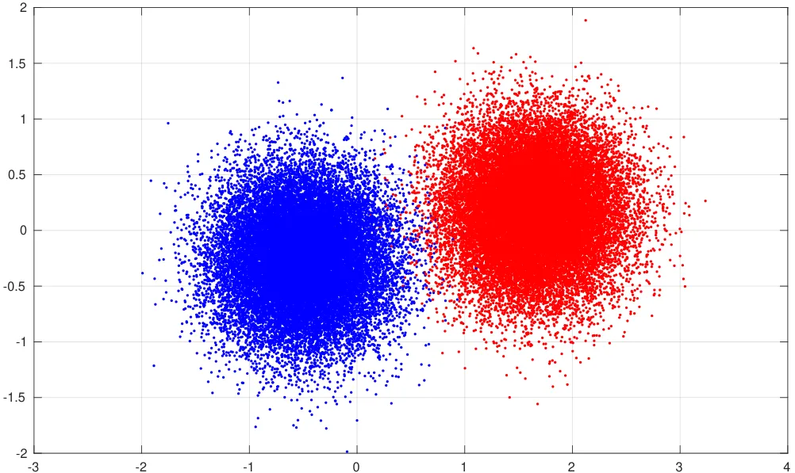

Figure 6: Plot of data points of two classes.

Data Generation We first create synthetic data with Unigram language
model, where the data points and associated labels subject to a given
Unigram language model, such as:

```math
\displaystyle\mathbf{P_{LM}}=\begin{bmatrix}p_{0}~~p_{1}\end{bmatrix}=\begin{bmatrix}0.692~~0.308\end{bmatrix} \tag{31}
```

That is 69.2% of labels “0” and 30.8% of label “1” in
$`\mathcal{Y}=(y_{1},\dots,y_{T})`$.

Given the corresponding label of $`y_{t}`$, we can create the input
points on a 2-dimensional grid
$`\mathcal{X}=(\mathbf{x_{1}}\dots\mathbf{x_{T}})`$ by sampling over
independent following Gaussian distributions:

```math
\displaystyle p(\mathbf{x_{t}}|y_{t}=0)\sim N(\mathbf{\mu_{0}};\mathbf{\Sigma})
```

```math
\displaystyle p(\mathbf{x_{t}}|y_{t}=1)\sim N(\mathbf{\mu_{1}};\mathbf{\Sigma})
```

where the parameters
$`\mathbf{\mu_{0},\mu_{1}}\in\mathbb{R}^{2\times 1}`$ are centers of two
classes data points, and $`\mathbf{\Sigma}`$ denotes the covariance
matrix. In experiment, the central points $`\mathbf{\mu_{0}}`$ and
$`\mathbf{\mu_{1}}`$ are randomly generated, for example,
$`\mathbf{\mu_{0}}=[-0.504,-0.264]^{T}`$ and
$`\mathbf{\mu_{1}}=[1.646,0.181]^{T}`$. Particularly,
$`\mathbf{\Sigma}`$ is manually chosen to make sure the data points of
two classes slightly “blend” into each other, because we need to insure
that an unique optimal solution can be reached. So we set
$`\mathbf{\Sigma}=0.4\cdot\mathbf{I}`$. Following above settings, we
sample total size of $`T=60,000`$ data points, which is then split to
50,000 for training, 5,000 for testing and 5,000 for validation. Figure
6 shows examples of the plot of data points $`\mathcal{X}`$, with blue
points being class “0” and red ones being class “1”.

Experimental Results To validate the analysis and to confirm
mathematical derivation, we implement Algorithm 1 with all
hyper-parameters list in Table 1. We conduct the experiments on the
binary classification task with the dataset we created for
$`(\mathcal{X},\mathcal{Y})`$. However, the results turns out to be
unsatisfactory. The average classification error rate is $`30.8\%`$,
which is just about the error rate of majority guess: it constantly
predicts class “0” regardless of the input data. We repeated the above
experiment 5 times and collect the results as shown in Table 2, which
further validate that this method is nothing more than guessing majority
class.

Problems of Non-sequence Language Model The reason for bad results is
that the Unigram language model is too weak. Unigram is a non-sequence
language model that loses important information for unsupervised
classification problem. As in Chen et al. (2016), the sequence prior of
output labels is a important structure to employ in unsupervised
problems, especially when the order is high. However, the Unigram
language model does not capture such structure. In next experiment we
use Bigram language model that will show much better results.

| Hyper-parameter | Notation         | Value       |
| --------------- | ---------------- | ----------- |
| Learning Rate   | $`\mu_{\theta}`$ | $`10^{-6}`$ |
| Learning Rate   | $`\mu_{V}`$      | $`10^{-4}`$ |
| Mini-batch Size | $`N`$            | 10          |
| Training Size   | $`T_{trn}`$      | 50,000      |
| Test Size       | $`T_{tst}`$      | 5,000       |
| Validation Size | $`T_{val}`$      | 5,000       |

Table 1: The hyper-parameters used in training

|      |                     |            |
| ---- | ------------------- | ---------- |
|      | $`\mathbf{P_{LM}}`$ | Error Rate |
| Exp1 | \[0.692, 0.307\]    | 30.7%      |
| Exp2 | \[0.385, 0.615\]    | 38.5%      |
| Exp3 | \[0.583, 0.417\]    | 41.6%      |
| Exp4 | \[0.692, 0.308\]    | 30.8%      |
| Exp5 | \[0.667, 0.333\]    | 33.3%      |

Table 2: Experiment Results using Unigram

### 6.2 The Case of Bigram

Figure 7: The transition probability of output observation.

Data Generation Different from Unigram data, now we need to create
synthetic data that has additional Markov property: that the class label
of future data point is solely dependent on the current label. We
decided to use Hidden Markov Model to create the dataset, by sampling
from a first-order HMM. First, we sample
$`\mathcal{Y}=(y_{1},\dots,y_{T})`$ from a given transition matrix
$`\mathbf{P_{Trains}}`$. For example,

```math
\displaystyle\mathbf{P_{Trains}}=\begin{bmatrix}p(y_{t}=0|y_{t-1}=0)&p(y_{t}=1|y_{t-1}=0)\\
p(y_{t}=0|y_{t-1}=1)&p(y_{t}=1|y_{t-1}=1)\end{bmatrix}=\begin{bmatrix}0.6&0.4\\
0.9&0.1\end{bmatrix}. \tag{32}
```

where $`P_{Trans}(i,j)=p(y_{t}=j|y_{t-1}=i)`$. This transition relations
are visualized in graph of Figure 7.

Then, similar to Unigram case, we use two Gaussian emission models to
sample the data for $`\mathcal{X}=(\mathbf{x_{1}}\dots\mathbf{x_{T}})`$
given the sampled labels $`\mathcal{Y}=(y_{1},\dots,y_{T})`$:

```math
\displaystyle p(y_{t}=i|y_{t-1}=j)=P_{Trans}(i,j)
```

```math
\displaystyle~~~~~~~~~~~~~~~~~~and
```

```math
\displaystyle p(\mathbf{x_{t}}|y_{t}=0)\sim N(\mathbf{\mu_{0}};\mathbf{\Sigma})
```

```math
\displaystyle p(\mathbf{x_{t}}|y_{t}=1)\sim N(\mathbf{\mu_{1}};\mathbf{\Sigma})
```

In our experiment, we use the same setting for the emission models as in
Unigram case, i.e. $`\mathbf{\mu_{0}}=[-0.504,-0.264]^{T}`$,
$`\mathbf{\mu_{1}}=[1.646,0.181]^{T}`$ and
$`\mathbf{\Sigma}=0.4\cdot\mathbf{I}`$. A total of $`T=60,000`$ labels
$`\mathcal{Y}`$ and data points $`\mathcal{X}`$ are created, and
randomly split to 50,000 training, 5,000 testing and 5,000 validation
partitions.

Note that, instead of estimating the ground-truth language model
$`\mathbf{P_{LM}}`$ from the generated data, we directly calculate
$`\mathbf{P_{LM}}`$ from transition matrix $`\mathbf{P_{Trans}}`$ as
follows. Due to Markov property, the language model
$`{P_{LM}}={p(y_{t},y_{t-1})}`$ is actually joint probability, i.e.
product of prior probability and conditional probability as:

```math
\displaystyle{P_{LM}}=p(y_{t-1},y_{t})=p(y_{t-1})p(y_{t}|y_{t-1}) \tag{33}
```

where $`p(y_{t-1})`$ is actually marginal probability being steady state
of transition of $`\mathbf{P_{Trans}}`$ after infinite steps:

```math
\displaystyle\mathbf{p_{st}}=[p(y_{t-1}=0),p(y_{t-1}=1)]=\mathbf{e}\cdot\mathbf{P_{Trans}^{\infty}} \tag{34}
```

where $`\mathbf{e}`$ indicate unit row vector, i.e.
$`\mathbf{e}=(1,0)`$. For our transition example in Eqn (32), one can
calculate that $`\mathbf{p_{st}}=[0.692,0.308]`$. Thus, from Eqn. (32,
33, 34), the Bigram language model $`\mathbf{P_{LM}}`$ can be calculated
by:

```math
\displaystyle\mathbf{P_{LM}} \displaystyle=\begin{bmatrix}p(y_{t-1}=0)p(y_{t}=0|y_{t-1}=0)&p(y_{t-1}=0)p(y_{t}=1|y_{t-1}=0)\\
p(y_{t-1}=1)p(y_{t}=0|y_{t-1}=1)&p(y_{t-1}=1)p(y_{t}=1|y_{t-1}=1)\end{bmatrix}
```

```math
\displaystyle=diag(\mathbf{p_{st}})\mathbf{P_{Trans}} \tag{35}
```

where $`diag(\mathbf{p_{st}})`$ stands for the diagonal matrix with
vector $`\mathbf{p_{st}}`$ as its main diagonal. Using Eqn. (35), one
can calculate the Bigram language model for our example is:

```math
\displaystyle\mathbf{P_{LM}}=\begin{bmatrix}0.4154&0.2769\\
0.2769&0.0308\end{bmatrix}
```

Experiment Results To fully validate the method, we repeatedly generate
10 synthetic datasets using different HMMs stated in the previous part
of the article. Each of the HMMs in the $`i-th`$ experiment has all the
same settings except the transition matrix $`\mathbf{P_{Trans}^{(i)}}`$.
Here list all the $`{\mathbf{P_{Trans}^{(i)}}}`$ we used in experiments:

```math
\displaystyle{\mathbf{P_{Trans}^{(1)}}}=\begin{bmatrix}0.1&0.9\\
0.8&0.2\end{bmatrix}~~{\mathbf{P_{Trans}^{(2)}}} \displaystyle=\begin{bmatrix}0.6&0.4\\
0.9&0.1\end{bmatrix}~~{\mathbf{P_{Trans}^{(3)}}}=\begin{bmatrix}0.2&0.8\\
0.5&0.5\end{bmatrix}~~{\mathbf{P_{Trans}^{(4)}}}=\begin{bmatrix}0.3&0.7\\
0.4&0.6\end{bmatrix}
```

```math
\displaystyle{\mathbf{P_{Trans}^{(5)}}}=\begin{bmatrix}0.4&0.6\\
0.1&0.9\end{bmatrix}~~{\mathbf{P_{Trans}^{(6)}}} \displaystyle=\begin{bmatrix}0.5&0.5\\
0.7&0.3\end{bmatrix}~~{\mathbf{P_{Trans}^{(7)}}}=\begin{bmatrix}0.7&0.3\\
0.8&0.2\end{bmatrix}~~{\mathbf{P_{Trans}^{(8)}}}=\begin{bmatrix}0.8&0.2\\
0.4&0.6\end{bmatrix}
```

```math
\displaystyle~~{\mathbf{P_{Trans}^{(9)}}} \displaystyle=\begin{bmatrix}0.5&0.5\\
0.4&0.6\end{bmatrix}~~{\mathbf{P_{Trans}^{(10)}}}=\begin{bmatrix}0.9&0.1\\
0.3&0.7\end{bmatrix}
```

Then, we train the model using algorithm 1 with the same set of
hyper-parameters in Table 1. We use training set for learning the model
and validation set for early stop, test set for producing results. We
repeat this process 10 times on the 10 generated dataset, and the test
errors are listed in Table 3.

|           | Supervised | Unsupervised |
| --------- | ---------- | ------------ |
| SynData1  | 5.38%      | 5.55%        |
| SynData2  | 3.62%      | 3.63%        |
| SynData3  | 2.95%      | 2.96%        |
| SynData4  | 2.79%      | 2.79%        |
| SynData5  | 1.06%      | 1.06%        |
| SynData6  | 4.52%      | 4.54%        |
| SynData7  | 5.66%      | 6.25%        |
| SynData8  | 5.13%      | 5.66%        |
| SynData9  | 3.89%      | 6.65%        |
| SynData10 | 5.70%      | 5.70%        |

Table 3: The classification error on test data using Bigram

Discussion of Experiment Results From Table 2, we find all the error
rates in the unsupervised learning column are very low, which verify the
SPDG method we introduce in the article being effective.

Specifically, we first observe by comparing the numbers horizontally
that the unsupervised SPDG method can achieve the almost the same
performance as supervised learning on each dataset. We also observe that
the margin between supervised and unsupervised learning for each
experiment are mostly less than $`1\%`$. Furthermore, comparing the
numbers vertically in the table, it seems that different performances
are yielded by different transition matrix. However, the variance of
performances over 10 experiments is actually caused by the data sampling
from Gaussian models, not the label generation using
$`\mathbf{P_{Trans}}`$, because the error rates of supervised and
unsupervised for each experiment are consistent. Otherwise, the results
of supervised ones should be all the same since this training method is
independent from sequence property lying in the $`\mathbf{P_{Trans}}`$.

Recall the Unigram result we obtained previously (error rate
$`30.8\%`$), with only changing the language model from Unigram to
Bigram, the unsupervised model gains significant improvement in
performance. Therefore, we can conclude that the sequential structure is
indeed an important prior to be used in supervised learning. The Bigram
language model is capable of capturing this prior, despite that it is
only the simplest sequential statistics prior.

## 7 Conclusions & Summary

In this article, we first surveyed major classes of unsupervised
learning methods developed in the past. We then focused on a special
class of unsupervised learning techniques designed for classification
tasks without using labeled data in training via direct, end-to-end
optimization. We motivated the methods using the prominent example of
encryption technique called Caesar Cipher. In technical terms, we
described a novel objective function for optimization in solving this
class of unsupervised learning problems and introduced a new stochastic
primal-dual gradient method for solving the optimization, accomplishing
the desired unsupervised learning for classification.

In this tutorial exposition, we thoroughly carried out the needed
mathematical analysis and illustrated the step-by-step solutions to
unsupervised learning for the cases of Unigram language model and Bigram
language model, respectively. The readers should be able to follow the
self-contained derivations we provided in this article step by step,
without referring to other material. For the readers who want to
implement the unsupervised learning methods without following the
detailed derivation steps, we have provided a summary of the computation
steps in the learning algorithm for the Unigram and Bigram cases in two
separate columns in Table 4.

One technical contribution of this article worth mentioning here is the
data synthesis experiments, as described in Section 6, which we used to
explain and evaluate the unsupervised learning algorithm. In these
computational experiments, we generated a large set of synthetic
sequence data, and use them to validate the mathematical analysis and
derivation. We confirm that the optimization method of SPDG is capable
of effectively exploiting the sequential structure of data on learning
the mapping from input to output without the use of output labels.

The ideas explained in this article open up the potential for
unsupervised learning that would have many practical applications
involving sequential data in real world. An example is unsupervised
character recognition and English spelling correction as explored in
(Liu et al., 2017). More recently, this approach is extended by Yeh
et al. (2019) to speech recognition where the output sequences contain
both sequence and segmentation structures, creating the first success of
fully unsupervised speech recognition following the earlier proposals in
(Chen et al., 2016; Deng, 2015). Another future extension is to further
exploit the structures of the input data and combine it with our method.
For example, in (Eslami et al., 2018), the authors proposed a Generative
Query Network (GQN) to learn internal representations of scenes from
different viewpoints and then use them to render the same scene of a
different viewpoint. With such a learning process, GQN is able to learn
representations that model the inherent input data regularity. Our
method is orthogonal to GQN in that we can always combine our cost
function with those that exploit the input structures, which could
potentially lead to better unsupervised learning methods.

The exposition provided in this article has been limited to a binary
sequence classification problem with label-free data in training the
classifier parameters. This was made possible by making use of the
property of sequential structure in the data as represented by language
models. In practically all past work, sequential classification or
pattern recognition problems have been tackled with supervised learning
requiring labeled data, even if the sequential structure of the data was
available (He et al., 2008; Mesnil et al., 2013). While the structure of
the data exploited is expressed in terms of language models (both
Unigram and Bigram), other ways of representing the structure of the
data (e.g. graph) can also be exploited within the framework of
unsupervised learning described in this tutorial, and we leave this
extension to the interested readers.

|                                                                                                                       | Unigram                                                                                                                                                                 | Bigram                                                                                                                                                                     |
| --------------------------------------------------------------------------------------------------------------------- | ----------------------------------------------------------------------------------------------------------------------------------------------------------------------- | -------------------------------------------------------------------------------------------------------------------------------------------------------------------------- |
| $`\mathbf{P_{LM}}`$                                                                                                   | $`\begin{array}[]{lcl}\begin{bmatrix}p_{0},~~p_{1}\end{bmatrix}\end{array}`$ (Eqn. 2)                                                                                   | $`\begin{bmatrix}p*{00}&p*{01}\\                                                                                                                                           |
| p*{10}&p*{11}\end{bmatrix}`$ (Eqn. 23)                                                                                |
| $`\mathbf{\overline{P_{LM}}}(\theta)`$                                                                                | $`\begin{bmatrix}\frac{1}{T}\sum_{t=1}^{T}p_{\theta,t}(0),~~\frac{1}{T}\sum_{t=1}^{T}p_{\theta,t}(1)\end{bmatrix}^{T}`$ (Eqn. 24)                                       | $`\frac{1}{T}\sum_{t=1}^{T}\mathbf{P_{t-1,\theta}}\mathbf{P_{t,\theta}}^{T}`$ (Eqn. 24)                                                                                    |
| $`\mathcal{J}(\theta)`$                                                                                               | $`-\mathbf{P_{LM}}\ln{\mathbf{\overline{P_{LM}}}(\theta)}`$ (Eqn. 5)                                                                                                    | $`-\left\langle\mathbf{P_{LM}}~,~\ln{\mathbf{\overline{P_{LM}}}(\theta)}\right\rangle`$ (Eqn. 25)                                                                          |
| $`\mathcal{L}(\theta,\mathbf{V})`$                                                                                    | $`\!\begin{aligned} [\mathbf{P_{LM}}\odot\mathbf{V}]\mathbf{\overline{P\_{LM}}}(\theta)\\                                                                               |
| +\mathbf{P\_{LM}}\ln{(-\mathbf{V})}^{T}\end{aligned}`$      (Eqn. 12)                                                 | $`\!\begin{aligned} \frac{1}{T}\sum*{t=1}^{T}(\mathbf{p*{t-1,\theta}^{T}}[\mathbf{P_{LM}}\odot\mathbf{V}]\mathbf{p\_{t,\theta}})\\                                      |
| +\left\langle\mathbf{P\_{LM}},\ln{(-\mathbf{V})}\right\rangle\end{aligned}`$       (Eqn. 27)                          |
| $`\frac{\partial\mathcal{L}}{\partial\mathbf{\theta}}`$                                                               | $`\frac{1}{T}\sum_{t=1}^{T}\bigg\{\gamma p_{t-1,\theta}(0)p_{t-1,\theta}(1)[\mathbf{P_{LM}}\odot\mathbf{V}]\mathbf{X}\bigg\}`$ (Eqn. 20)                                | $`\!\begin{aligned} \frac{1}{T}\sum*{t=1}^{T}\bigg\{\gamma P*{t-1,\theta}(0)P*{t-1,\theta}(1)([\mathbf{X*{t-1}^{T}}(\mathbf{P*{LM}}\odot\mathbf{V})\mathbf{P*{t,\theta}}\\ |
| +(\mathbf{P*{LM}}\odot\mathbf{V})^{T}\mathbf{X*{t}^{T}}\mathbf{P\_{t-1,\theta}}]\bigg\}\end{aligned}`$      (Eqn. 30) |
| $`\frac{\partial\mathcal{L}}{\partial\mathbf{V}}`$                                                                    | $`\frac{\partial}{\partial\mathbf{V}}\bigg\{[\mathbf{P_{LM}}\odot\mathbf{V}]\mathbf{\overline{P_{LM}}}(\theta)+\mathbf{P_{LM}}\ln{(-\mathbf{V})}^{T}\bigg\}`$ (Eqn. 21) | $`\frac{1}{T}\sum_{t=1}^{T}\bigg\{\mathbf{P_{LM}}\cdot(\mathbf{P_{t-1,\theta}P_{t,\theta}^{T}})+\frac{\mathbf{P_{LM}}}{\mathbf{V}}\bigg\}`$ (Eqn. 30)                      |
| $`\mathbf{V^{0}}`$                                                                                                    | $`-\frac{1}{\mathbf{\overline{P_{LM}}}^{T}(\theta^{0})}`$ (Eqn. 13)                                                                                                     | $`-\frac{T}{\sum_{t=1}^{T}\mathbf{P_{t-1,\theta^{0}}}\mathbf{P_{t,\theta^{0}}^{T}}}`$ (Eqn. 28)                                                                            |

Table 4: Summary of Computation Steps and Comparisons of Using Unigram
and Bigram

## References

- Abdel-Hamid et al. (2014) Abdel-Hamid, O., Mohamed, A., Jiang, H.,
  Deng, L., Penn, G., and Yu, D. Convolutional neural networks for
  speech recognition. _IEEE/ACM Trans. Audio, Speech and Language
  Processing_, 22, 2014.
- Artetxe et al. (2017) Artetxe, Mikel, Labaka, Gorka, Agirre, Eneko,
  and Cho, Kyunghyun. Unsupervised neural machine translation. In
  _arXiv:1710.11041v1_, 2017.
- Bahdanau et al. (2015) Bahdanau, Dzmitry, Cho, Kyunghyun, and Bengio,
  Yoshua. Neural machine translation by jointly learning to align and
  translate. _ICLR_, 2015.
- Boyd & Vandenberghe (2004) Boyd, S. and Vandenberghe, L. Convex
  optimization. _Cambridge university press_, 2004.
- Chen et al. (2016) Chen, Jianshu, Huang, Po-Sen, He, Xiaodong, Gao,
  Jianfeng, and Deng, Li. Unsupervised learning of predictors from
  unpaired input-output samples. _arXiv:1606.04646_, 2016.
- Cipher (2009) Cipher, Caesar. Online tool of caesar cipher.
  *https://studio.code.org/s/hoc-encryption/stage/1/puzzle/4*, 2009.
- Dahl et al. (2012) Dahl, George E, Yu, Dong, Deng, Li, and Acero,
  Alex. Context-dependent pre-trained deep neural networks for
  large-vocabulary speech recognition. _Audio, Speech, and Language
  Processing, IEEE Transactions on_, 20(1):30–42, 2012.
- Deng & Yu (2014) Deng, L. and Yu, D. _Deep Learning: Methods and
  Applications_. NOW Publishers, 2014.
- Deng et al. (2010) Deng, L., Seltzer, M., Yu, D., Acero, A., Mohamed,
  A., and Hinton, G. Binary coding of speech spectrograms using a deep
  autoencoder. _Proceedings of Interspeech_, 2010.
- Deng et al. (2013) Deng, L., Hinton, G., and Kingsbury, B. New types
  of deep neural network learning for speech recognition and related
  applications: An overview. _Proceedings of ICASSP_, 2013.
- Deng (2015) Deng, Li. Deep learning for speech and language
  processing: A tutorial. In _Tutorial at Interspeech Conf, Dresden,
  Germany,
  https://www.microsoft.com/en-us/research/wpcontent/uploads/2016/07/interspeech-tutorial-2015-lideng-sept6a.pdf_, 2015.
- Deng & Li (2013) Deng, Li and Li, Xiao. Machine learning paradigms for
  speech recognition: An overview. _IEEE Transactions on Audio, Speech,
  and Language Processing_, 21(5):1060–1089, 2013.
- Devlin et al. (2018) Devlin, Jacob, Chang, Ming-Wei, Lee, Kenton, and
  Toutanova, Kristina. Bert: Pre-training of deep bidirectional
  transformers for language understanding. _arXiv preprint
  arXiv:1810.04805_, 2018.
- Duchi et al. (2012) Duchi, John, Hazan, Elad, and Singer, Yoram.
  Adaptive subgradient methods for online learning and stochastic
  optimization. _Journal of Machine Learning Research_, 2012.
- Eslami et al. (2018) Eslami, SM Ali, Rezende, Danilo Jimenez, Besse,
  Frederic, Viola, Fabio, Morcos, Ari S, Garnelo, Marta, Ruderman,
  Avraham, Rusu, Andrei A, Danihelka, Ivo, Gregor, Karol, et al. Neural
  scene representation and rendering. _Science_,
  360(6394):1204–1210, 2018.
- Ferguson (1982) Ferguson, Thomas S. An inconsistent maximum likelihood
  estimate. _Journal of the American Statistical Association_, 1982.
- Finn et al. (2016) Finn, Chelsea, Goodfellow, Ian, and Levine, Sergey.
  Unsupervised learning for physical interaction through video
  prediction. _Conference on Neural Information Processing
  Systems_, 2016.
- Goodfellow et al. (2014) Goodfellow, Ian, Pouget-Abadie, Jean, Mirza,
  Mehdi, Xu, Bing, Warde-Farley, David, Ozair, Sherjil, Courville,
  Aaron, and Bengio, Yoshua. Generative adversarial nets. In
  _Proceedings of the Advances in Neural Information Processing Systems
  (NIPS)_, pp. 2672–2680, 2014.
- Gupta et al. (2018) Gupta, Ankush, Vedaldi, Andrea, and Zisserman,
  Andrew. Learning to read by spelling: Towards unsupervised text
  recognition. _arXiv preprint arXiv:1809.08675_, 2018.
- He et al. (2008) He, X., Deng, L., and Chou, W. Discriminative
  learning in sequential pattern recognition. 25(5), 2008.
- Hinton et al. (2012) Hinton, Geoffrey, Deng, Li, Yu, Dong, Dahl,
  George E, Mohamed, Abdel-Rahman, Jaitly, Navdeep, Senior, Andrew,
  Vanhoucke, Vincent, Nguyen, Patrick, Sainath, Tara N., and
  Kingsbury, B. Deep neural networks for acoustic modeling in speech
  recognition: The shared views of four research groups. _IEEE Signal
  Processing Magazine_, 29(6):82–97, November 2012.
- ImageNet (2010) ImageNet. Imagenet website.
  *http://www.image-net.org/*, 2010.
- Jakab et al. (2018) Jakab, Tomas, Gupta, Ankush, Bilen, Hakan, and
  Vedaldi, Andrea. Unsupervised learning of object landmarks through
  conditional image generation. 2018.
- Kazemi et al. (2018) Kazemi, Hadi, Soleymani, Sobhan, Taherkhani,
  Fariborz, Iranmanesh, Seyed, and Nasrabadi, Nasser. Unsupervised
  image-to-image translation using domain-specific variational
  information bound. _Conference on Neural Information Processing
  Systems_, 2018.
- Kingma & Ba (2014) Kingma, Diederik P. and Ba, Jimmy. Adam: A method
  for stochastic optimization. _CoRR_, abs/1412.6980, 2014. URL
  [http://arxiv.org/abs/1412.6980](http://arxiv.org/abs/1412.6980).
- Kingma & Welling (2013) Kingma, Diederik P and Welling, Max.
  Auto-encoding variational bayes. _arXiv preprint
  arXiv:1312.6114_, 2013.
- Lample et al. (2017) Lample, Guillaume, Denoyer, Ludovic, and Ranzato,
  Marc Aurelio. Unsupervised machine translation using monolingual
  corpora only. In _arXiv:1711.00043v1_, 2017.
- LeCun et al. (2015) LeCun, Y., Bengio, Y., and Hinton, G. Deep
  learning. _Nature_, 521, 2015.
- Liu et al. (2017) Liu, Yu, Chen, Jianshu, and Deng, Li. An
  unsupervised learning method exploiting output statistics. _Conference
  on Neural Information Processing Systems_, 2017.
- Mejjati et al. (2018) Mejjati, Youssef A., Richardt, Christian,
  Tompkin, James, Cosker, Darren, and Kim, Kwang In. Unsupervised
  attention-guided image to image translation. _Conference on Neural
  Information Processing Systems_, 2018.
- Mesnil et al. (2013) Mesnil, Gregoire, He, Xiaodong, Deng, Li, and
  Bengio, Yoshua. Investigation of recurrent-neural-network
  architectures and learning methods for spoken language understanding.
  In _Proceedings of Interspeech_, 2013.
- Mikolov et al. (2013) Mikolov, T., Sutskever, I., Chen, K, Corrado,
  G., and Dean, J. Distributed representations of words and phrases and
  their compositionality. _Proceedings of NIPS_, 2013.
- Ng et al. (2002) Ng, A., Jordan, M., and Weiss, Y. On spectral
  clustering: analysis and an algorithm. _Conference on Neural
  Information Processing Systems_, 2002.
- OpenAI (2019) OpenAI. Better language models and their implications.
  In
  _[http://aiweb.techfak.uni-bielefeld.de/content/bworld-robot-control-software/](http://aiweb.techfak.uni-bielefeld.de/content/bworld-robot-control-software/)_, 2019.
- Ramachandran et al. (2017) Ramachandran, Prajit, Liu, Peter, and Le,
  Quoc. Unsupervised pretraining for sequence to sequence learning.
  _Proceedings of the 2017 Conference on Empirical Methods in Natural
  Language Processing_, 2017.
- van den Oord et al. (2016a) van den Oord et al. Wavenet: A generative
  mode for raw audio. _arXiv_, 2016a.
- van den Oord et al. (2016b) van den Oord et al. Pixel recurrent neural
  networks. _International Conf. Machine Learning_, 2016b.
- Vincent et al. (2010) Vincent, Pascal, Larochelle, Hugo, Lajoie,
  Isabelle, Bengio, Yoshua, and Manzagol, Pierre-Antoine. Stacked
  denoising autoencoders: Learning useful representations in a deep
  network with a local denoising criterion. _The Journal of Machine
  Learning Research_, 11:3371–3408, 2010.
- Yang et al. (2018a) Yang, Zhilin, Zhao, Jake, Dhingra, Bhuwan, He,
  Kaiming, Cohen, William W., Salakhutdinov, Ruslan R., and LeCun, Yann.
  Glomo: Unsupervised learning of transferable relational graphs. 2018a.
- Yang et al. (2018b) Yang, Zichao, Hu, Zhiting, Dyer, Chris, Xing,
  Eric P., and Berg-Kirkpatrick, Taylor. Unsupervised text style
  transfer using language models as discriminators. _Conference on
  Neural Information Processing Systems_, 2018b.
- Yeh et al. (2019) Yeh, Chih-Kuan, Chen, Jianshu, Yu, Chengzhu, and Yu,
  Dong. Unsupervised speech recognition via segmental empirical output
  distribution matching. _Proc. International Conference of Learning
  Representations_, 2019.
- Yu & Deng (2015) Yu, D. and Deng, L. _Automatic Speech Recognition: A
  Deep Learning Approach_. Springer, 2015.
- Yu et al. (2010) Yu, D., Deng, L., and Dahl, G. Roles of pre-training
  and fine-tuning in context-dependent dbn-hmms for real-world speech
  recognition. _NIPS Workshop_, 2010.
- Zhu et al. (2017) Zhu, J, Park, T, Isola, P, and Efros, A. Unpaired
  image-to-image translation using cycle-consistent adversarial
  networks. In _arXiv:1703_, 2017.
