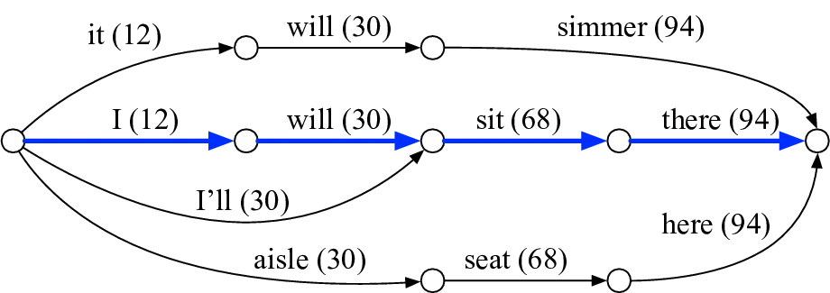
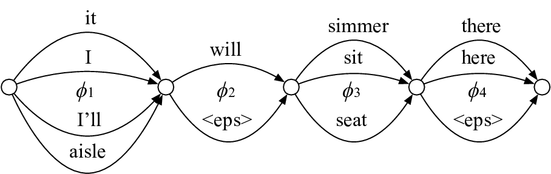
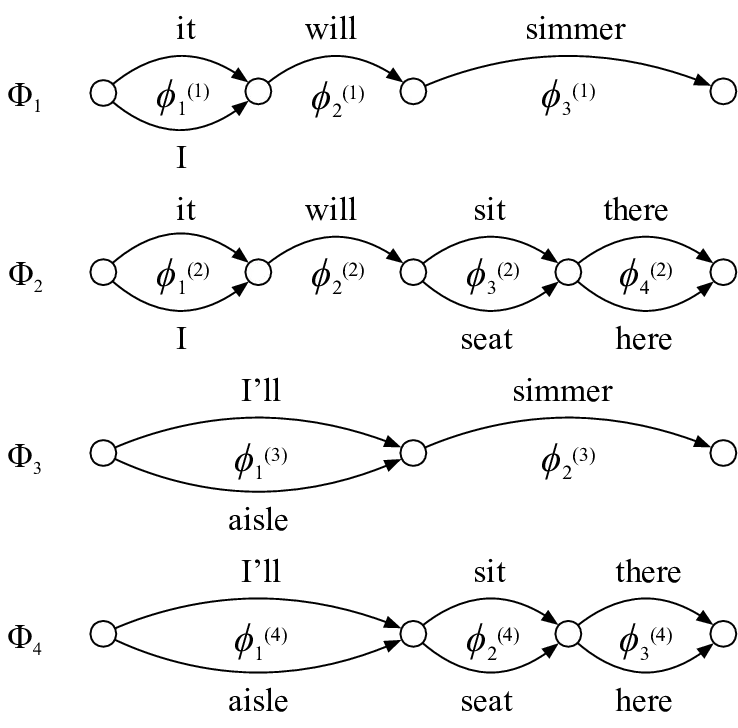
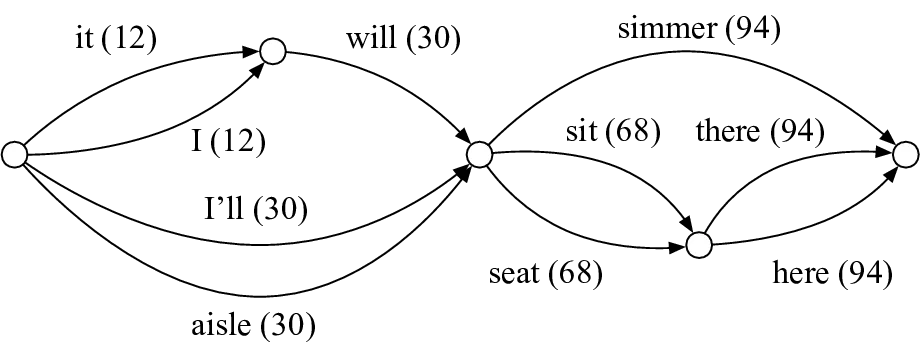
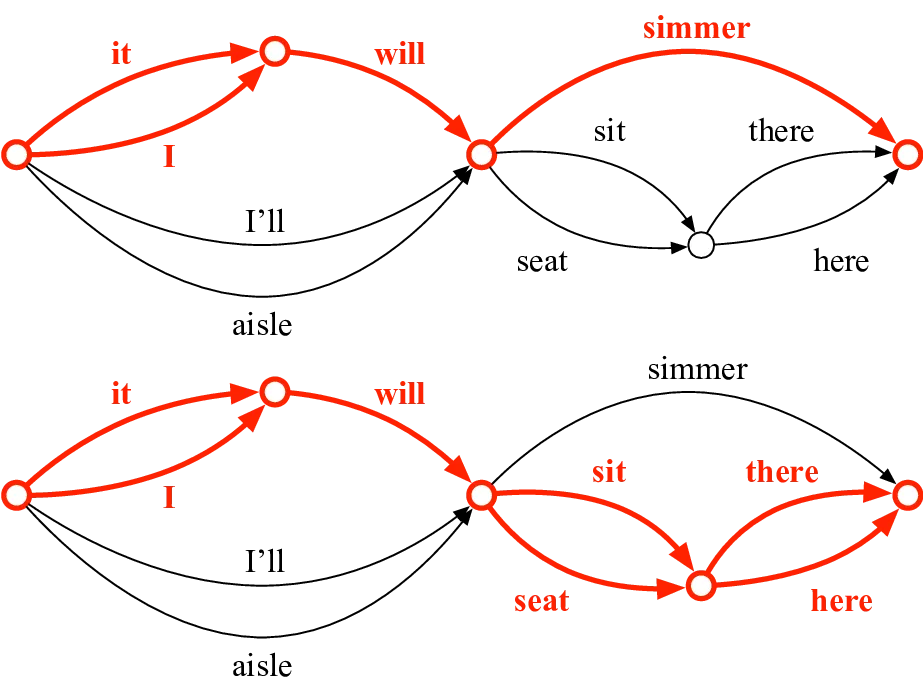

# ON MODELING ASR WORD CONFIDENCE

Woojay Jeon    Maxwell Jordan    Mahesh Krishnamoorthy

###### Abstract

We present a new method for computing ASR word confidences that
effectively mitigates the effect of ASR errors for diverse downstream
applications, improves the word error rate of the 1-best result, and
allows better comparison of scores across different models. We
propose 1) a new method for modeling word confidence using a
Heterogeneous Word Confusion Network (HWCN) that addresses some key
flaws in conventional Word Confusion Networks, and 2) a new score
calibration method for facilitating direct comparison of scores from
different models. Using a bidirectional lattice recurrent neural network
to compute the confidence scores of each word in the HWCN, we show that
the word sequence with the best overall confidence is more accurate than
the default 1-best result of the recognizer, and that the calibration
method can substantially improve the reliability of recognizer
combination.

###### Index Terms: 

confidence, word confusion network, combination, lattice, RNN

^(†)^(†)address: Apple Inc.  
One Apple Park Way, Cupertino, California  
{woojay,maxwell_jordan,maheshk}@apple.com

## 1 Introduction

Automatic speech recognition (ASR) systems often output a confidence
score \[1\] for each word in the recognized results. The confidence
score is an estimate of how likely the word is to be correct, and can
have diverse applications in tasks that consume ASR output.

We are particularly interested in “data-driven” confidence models \[2\]
that are trained on recognition examples to learn systematic “mistakes”
made by the speech recognizer and actively “correct” them. A major
limitation in such confidence modeling methods in the literature is that
they only look at Equal Error Rate (EER) \[1\] or Normalized Cross
Entropy (NCE) \[3\] results and do not investigate their impact on
speech recognizer accuracy in terms of Word Error Rate (WER). Some past
studies \[4\]\[5\] have tried to improve the WER using confidence scores
derived from the word lattice by purely mathematical methods, but to our
knowledge no recent work in the literature on statistical confidence
models has reported WER.

If a confidence score is true to its conceptual definition (the
probability that a given word is correct), then it is natural to expect
that the word sequence with the highest combined confidence should also
be at least as accurate as the default 1-best result (obtained via the
MAP decision rule). One reason that this may not easily hold true is
that word confidence models, by design, often try to force all
recognition hypotheses into a fixed segmentation in the form of a Word
Confusion Network (WCN) \[6\]\[7\]\[2\]. While the original motivation
of WCNs was to obtain a recognition result that is more consistent with
the WER criterion, we argue that it often unnaturally decouples words
from their linguistic or acoustic context and makes accurate model
training difficult by introducing erroneous paths that are difficult to
resolve.

Instead, we propose the use of a “Heterogeneous” Word Confusion Network
(HWCN) for confidence modeling that can be interpreted as a
representation of multiple WCNs for a given utterance. Although the
HWCN’s structure itself is known, our interpretation of HWCNs and our
application of them to data-driven confidence modeling is novel. We
train a bidirectional lattice recurrent neural network \[8\]\[2\] to
obtain confidence values for every arc in the HWCN. Obtaining the
sequence with the best confidence from this network results in better
WER than the default 1-best. In addition, we recognize the need to be
able to directly compare confidence scores between different
independently-trained confidence models, and propose a non-parametric
score calibration method that improves the recognition accuracy when
combining the results of different recognizers via direct comparison of
confidence scores.

## 2 Confidence modeling using Heterogeneous Word Confusion Networks

### 2.1 Defining confidence and addressing key flaws in WCNs

Word Confusion Networks (WCNs) \[6\] were originally proposed with the
motivation of transforming speech recognition hypotheses into a
simplified form where the Levenshtein distance can be approximated by a
linear comparison of posterior probabilities, thereby optimizing the
results for WER instead of Sentence Error Rate (SER).

Subsequent works on word confidence modeling \[2\] have based their
models on WCNs because of their linear nature, which allows easy
identification and comparison of competing words. However, WCNs are
fundamentally flawed in that they force all hypothesized word sequences
to share the same time segmentation, even in cases where the
segmentation is clearly different.

Consider the (contrived) word hypothesis lattice in Fig.1 with 1-best
sequence “I will sit there.” A corresponding WCN is in Fig.2, obtained
by aligning all possible sequences with the 1-best sequence.

Let us define the confidence for a word $`w`$ in a time segment
$`\phi_{j}`$ given acoustic features $`X`$ as

```math
{\textrm{Word \ Confidence \ }}\mathrel{\mathop{\kern 0.0pt=}\limits^{\Delta}}P\left({\left.{{w},{\phi_{j}}}\right|X}\right), \tag{1}
```

where $`\phi_{j}`$ is a tuple of start and end times of the $`j`$’th
slot, drawn from a finite set of time segments, and the set
$`\Phi=\left\{{{\phi_{1}},\cdots,{\phi_{n}}}\right\}`$ is a full
description of the time segmentation of the WCN in Fig. 2.

For a sequence of $`n`$ words $`w_{1},\cdots,w_{n}`$ in the time
segments $`\phi_{1},\cdots,\phi_{n}`$, consider a random variable
$`N_{i}`$ denoting the number of correct words in each slot $`i`$ with
time segment $`\phi_{i}`$ containing $`w_{i}`$. The expectation of
$`N_{i}`$ is directly the confidence probability:

```math
E\left[{{N_{i}}}\right]=P\left({\left.{{w_{i}},{\phi_{i}}}\right|X}\right). \tag{2}
```

Let the random variable $`N`$ denote the total number of correct words
in the sequence. In a manner similar to \[6\], we approximate the WER as
the ratio between the expected number of incorrect words and the total
number of words. Since
$`E\left[N\right]=\sum_{i=1}^{n}{E\left[{{N_{i}}}\right]}`$,

```math
\textrm{WER}\approx\frac{{n-E\left[N\right]}}{n}=1-\frac{1}{n}\sum\limits_{j=1}^{n}{P\left({\left.{{w_{j}},{\phi_{j}}}\right|X}\right)}. \tag{3}
```

Hence, the WER can be minimized by finding, for each slot $`\phi_{j}`$,
the word with the highest
$`{P\left({\left.{{w_{j}},{\phi_{j}}}\right|X}\right)}`$.



Figure 1: Word hypothesis lattice where each arc is labeled with a word
and a number indicating the point in time (in frames) where the word
ends. The best path “I will sit there” is marked in blue.



Figure 2: Word confusion network (WCN) corresponding to Fig. 1, where
the time segments (in frame ranges) are assigned based on the best path:
$`\phi_{1}=(0,12),\phi_{2}=(12,30),\phi_{3}=(30,68),\phi_{4}=(68,94)`$



Figure 3: Four WCNs extracted from Fig.1 that represent all possible
word sequences without requiring forced slotting or $`<`$eps$`>`$
insertion. Each WCN has a time segmentation $`\Phi_{n}`$, where each
time segment is represented by $`\phi^{(n)}_{m}`$, where
$`\phi^{(1)}_{1}\hskip-2.0pt=\hskip-2.0pt\phi^{(2)}_{1}\hskip-2.0pt=(0,12),\phi^{(1)}_{2}\hskip-2.0pt=\hskip-2.0pt\phi^{(2)}_{2}\hskip-2.0pt=(12,30),\phi^{(1)}_{3}\hskip-2.0pt=\hskip-2.0pt\phi^{(3)}_{2}\hskip-2.0pt=(30,94),\phi^{(3)}_{1}\hskip-2.0pt=\hskip-2.0pt\phi^{(4)}_{1}\hskip-2.0pt=(0,30),\phi^{(2)}_{3}\hskip-2.0pt=\hskip-2.0pt\phi^{(4)}_{2}\hskip-2.0pt=(30,68)`$
and
$`\phi^{(2)}_{4}\hskip-2.0pt=\hskip-2.0pt\phi^{(4)}_{3}\hskip-2.0pt=(68,94)`$

However, in Fig.2, all sequences are required to follow the same time
segmentation as the 1-best result, so “I’ll” and “aisle” have been
unnaturally forced into the same slot as “it” and “I”, even though they
actually occupy a much greater length of time extending into the second
slot. Also, in order to be able to encode the hypotheses “I’ll sit
there” and “aisle seat here”, an epsilon “skip” label “$`<`$eps$`>`$”
had to be added to the second slot. Such heuristics add unnecessary
ambiguity to the data that make it difficult to model. Furthermore,
confidences like $`P\left({\left.{aisle,{\phi_{1}}}\right|X}\right)`$
are actually 0, since “aisle” does not even fit into $`\phi_{1}`$, so no
meaningful score can be assigned to “aisle” even though it is a
legitimate hypothesis.

### 2.2 Mitigating flaws in a WCN by using multiple WCNs

To address the aforementioned problems, let us consider deriving
_multiple_ WCNs from the lattice. Fig.3 shows four different WCNs that
represent all possible sequences in Fig.1, but without any
unnaturally-forced slotting or epsilon insertion.

Each WCN has a unique segmentation
$`{\Phi_{k}}=\left\{{\phi_{1}^{\left(k\right)},\cdots,\phi_{{n_{k}}}^{\left(k\right)}}\right\}`$
$`(k=1,\cdots,4)`$ with length $`n_{k}`$, but note that a lot of the
time segments are shared, i.e., $`\phi^{(1)}_{1}=\phi^{(2)}_{1}`$,
$`\phi^{(1)}_{2}=\phi^{(2)}_{2}`$, $`\phi^{(1)}_{3}=\phi^{(3)}_{2}`$,
$`\phi^{(3)}_{1}=\phi^{(4)}_{1}`$, $`\phi^{(2)}_{3}=\phi^{(4)}_{2}`$ and
$`\phi^{(2)}_{4}=\phi^{(4)}_{3}`$. For every $`\Phi_{k}`$ the WER for a
sequence of words $`w_{1},\cdots,w_{n_{k}}`$ is

```math
\textrm{WER}\left({{w_{1}},\cdots,{w_{{n_{k}}}},{\Phi_{k}}}\right)=1-\frac{1}{{{n_{k}}}}\sum\limits_{j=1}^{{n_{k}}}{P\left({\left.{{w_{j}},\phi_{j}^{\left(k\right)}}\right|X}\right)}. \tag{4}
```

To find the best word sequence, we simply look for the sequence of words
across all four segmentations with the lowest WER:

```math
{{\hat{w}}_{1}},\cdots,{{\hat{w}}_{{n_{l}}}},{{\hat{\Phi}}_{l}}=\arg\mathop{\max}\limits_{{w_{1}},\cdots,{w_{{n_{k}}}},{\Phi_{k}}}\textrm{WER}\left({{w_{1}},\cdots,{w_{{n_{k}}}},{\Phi_{k}}}\right). \tag{5}
```

The WER in (4) and (5) is more sensible than the WER in (3) because it
no longer contains invalid probabilities like $`P(aisle,\phi_{1}|X)`$
nor extraneous probabilities like
$`P(<\hskip-4.0pteps\hskip-4.0pt>,\phi_{2}|X)`$. At the same time, it
still retains the basic motivation behind WCNs of approximating
Levenshtein distances with linear comparisons.

### 2.3 The Heterogeneous Word Confusion Network

We now propose using a “Heterogeneous” Word Confusion Network (HWCN).
The HWCN is derived from the word hypothesis lattice by 1) merging all
nodes with similar times (e.g. within a tolerance of 100ms), and then 2)
merging all competing arcs (arcs sharing the same start and end node)
with the same word identity.

The HWCN corresponding to the lattice in Fig.1 is shown in Fig.4. Since
the destination nodes of “it” and “I” have the same time (12), the two
nodes are merged into one. The destination nodes of the two “will” arcs
are also merged, making the two arcs competing arcs. Since they have the
same word, the two arcs are merged.

This sort of partially-merged network has been used in previous systems
in different contexts \[4\], but not with data-driven confidence models.
A key interpretation we contribute in this work is that _the HWCN is in
fact a representation of the four separate WCNs_ in Fig.3. Fig.5 shows
how the first and second WCNs of Fig.3, with segmentations $`\Phi_{1}`$
and $`\Phi_{2}`$, respectively, are encoded inside the HWCN. The third
and fourth WCNs can be easily identified in a similar manner. The shared
time segments (e.g. $`\phi^{(1)}_{1}=\phi^{(2)}_{1}`$ in Fig. 3) are
also fully represented in the HWCN.

Note that there are some extraneous paths in the HWCN that are not
present in the lattice. For example, word sequences like “I will simmer”
or “aisle sit there” can occur. On the other hand, if what the speaker
actually said was “I will sit here”, which is not a possible path in the
lattice, the HWCN has a chance to correct eggregious errors in the
recognizer’s language model to provide the correct transcription.

Now, if we train a word confidence model to compute the scores in Eq.(1)
for every arc in the HWCN, the WER in Eq.(5) can be minimized by finding
the sequence in the HWCN with the highest mean word confidence per
Eq.(4) via dynamic programming.

When merging arcs, such as the two “will” arcs in Fig.1, we must define
how their scores will be merged, as these scores will be used as
features for the confidence model. Assume $`n`$ arcs
$`e_{1},\cdots,e_{n}`$ to be merged, all with the same word, start time,
and end time, and consuming the same acoustic features $`X`$. Each
$`e_{i}`$ starts at node $`v_{i}`$ and ends at $`v^{\prime}_{i}`$, and
has an arc posterior probability
$`{P\left({\left.{{e_{i}}}\right|X}\right)}`$, acoustic likelihood
$`{p\left({\left.{X}\right|{e_{i}}}\right)}`$, and transitional
(language & pronunciation model) probability
$`P\left({\left.{{e_{i}}}\right|{v_{i}}}\right)`$. We want to merge the
start nodes into one node $`v`$, the end nodes into one node
$`v^{\prime}`$, and the arcs into one arc $`e`$. The problem is to
compute $`P\left({\left.e\right|X}\right)`$,
$`p\left({\left.{X}\right|e}\right)`$, and
$`P\left({\left.e\right|v}\right)`$.



Figure 4: The Heterogeneous Word Confusion Network corresponding to Fig.

1. Nodes with the same times have been merged, and competing arcs with
   the same word (“will”) have been merged.



Figure 5: Illustration of how the HWCN is actually an encoding of the
individual WCNs in Fig.3. (Top) Shown in red, the first WCN (with
segmentation $`\Phi_{1}`$) of Fig.3 is encoded in the upper part of the
HWCN. (Bottom) Similarly, the second WCN (with segmentation
$`\Phi_{2}`$) is encoded.

If $`e`$ conceptually represents the union of the $`n`$ arcs, the
posterior of the merged arc $`e`$ is the sum of the posteriors of the
individual arcs. This is because we only merge competing arcs (after
node merging), and there is no way to traverse two or more competing
arcs simultaneously (e.g. the two “will” arcs in Fig.1), so the
traversal of such arcs are always disjoint events. The acoustic scores
of the original arcs should be very similar since their words are the
same (but may have different pronunciations) and occur at the same time,
so we can approximate the acoustic score of the merged arc as the mean
of the individual acoustic scores. Hence,

```math
P\left({\left.e\right|X}\right)=\sum\limits_{i=1}^{n}{P\left({\left.{{e_{i}}}\right|X}\right)},\,\,p\left({\left.X\right|e}\right)\approx\frac{1}{n}\sum\limits_{i=1}^{n}{p\left({\left.X\right|{e_{i}}}\right)}. \tag{6}
```

The transitional score of the merged arc can be written as

```math
P\left({\left.e\right|v}\right)=\sum\limits_{i=1}^{n}{P\left({\left.{e,{v_{i}}}\right|v}\right)}=\sum\limits_{i=1}^{n}{P\left({\left.e\right|{v_{i}},v}\right)P\left({\left.{{v_{i}}}\right|v}\right)}. \tag{7}
```

It is easy to see that the first term in the summation is
$`P\left({\left.e\right|{v_{i}},v}\right)=P\left({\left.e\right|{v_{i}}}\right)=P\left({\left.{{e_{i}}}\right|{v_{i}}}\right)`$.
As for the second term, if $`v`$ represents the union of the $`n`$
nodes, we have

```math
P\left({\left.{{v_{i}}}\right|v}\right)=\frac{{P\left({{v_{i}}}\right)}}{{\sum\limits_{j=1}^{n}{P\left({{v_{j}}}\right)}}} \tag{8}
```

where $`P(v_{i})`$ is the prior transitional probability of node
$`v_{i}`$ that can be obtained by a lattice-forward algorithm on the
transitional scores in the lattice.

When labeling the arcs of the HWCN as correct(1) or incorrect(0) for
model training, we align the 1-best sequence with the reference
sequence. Then, for any arc in the 1-best that has one or more competing
arcs, we label each competing arc as 1 if its word matches the
corresponding reference word or 0 if it does not. All other arcs in the
HWCN are labeled 0. If there is no match between the 1-best and the
reference sequence, all arcs are labeled 0.

## 3 Confidence score calibration

While our abstract definition of confidence is Eq.(1), the confidence
score from model $`i`$ is actually an estimate according to
$`\lambda_{i}`$, i.e.,
$`\widehat{P}\left({\left.{W,\phi}\right|X;{\lambda_{i}}}\right)`$ where
$`\lambda_{i}`$ are the parameters of the ASR and the confidence model
trained on HWCNs. In general, it is problematic to directly compare the
probability estimates computed from two different independently-trained
statistical models. This poses a problem in a personal assistant when a
given downstream natural language processor (that uses the ASR’s
confidence values) is expected to work consistently regardless of
updates to the ASR.

To investigate this problem, we consider a naive classifier combination
method which, given $`n`$ different classifiers, simply chooses the
result with the highest reported confidence score (such as for
personalized ASR \[9\]). Our goal is to calibrate the confidence scores
so that such a direct comparison would work. It is easy to prove that
when the confidence scores are the true probabilities of the words being
correct, the system will always be as least as accurate overall as the
best individual classifier. Suppose each classifier $`k`$ outputs
results with confidence $`C_{k}`$ and hence has expected accuracy
$`E[C_{k}]`$ (since $`C_{k}`$ itself is the probability of being
correct). The combined classifier has confidence
$`C=\max\{C_{1},\cdots,C_{n}\}`$ with expected accuracy
$`E\left[C\right]=E\left[{\max\left\{{{C_{1}},\cdots,{C_{n}}}\right\}}\right]\geq E\left[{{C_{k}}}\right]`$
for all $`k`$, so it is at least as good as the best classifier. When
the confidence scores are not the true probabilities, however, this
guarantee no longer holds, and such a naive system combination may
actually degrade results.

In this work, we propose a data-driven calibration method that is based
on distributions of the training data but do not require heuristic
consideration of histogram bin boundaries \[10\] nor make assumptions of
monotonicity in the transformation \[11\].

Given a confidence score of $`y\in\mathcal{R}`$, we consider the
probability $`P(E_{c}|y)`$ where $`E_{c}`$ is the event that the result
is correct. We also define $`E_{w}`$ as the event that the result is
wrong, and write

```math
P\left({\left.{{E_{c}}}\right|y}\right)=\frac{{p\left({\left.y\right|{E_{c}}}\right)P\left({{E_{c}}}\right)}}{{p\left({\left.y\right|{E_{c}}}\right)P\left({{E_{c}}}\right)+p\left({\left.y\right|{E_{w}}}\right)P\left({{E_{w}}}\right)}}. \tag{9}
```

The priors $`P(E_{c})`$ and $`P(E_{w})`$ can be estimated using the
counts $`N_{c}`$ and $`N_{w}`$ of correctly- and incorrectly-recognized
words, respectively, over the training data, i.e.,
$`P\left({{E_{c}}}\right)\approx\frac{{{N_{c}}}}{{{N_{c}}+{N_{w}}}}`$
and
$`P\left({{E_{w}}}\right)\approx\frac{{{N_{w}}}}{{{N_{c}}+{N_{w}}}}`$.

We use the fact that the probability distribution function is the
derivative of the cumulative distribution function (CDF):

```math
p\left({\left.y\right|{E_{c}}}\right)=\frac{d}{{dy}}p\left({\left.{Y\leq y}\right|{E_{c}}}\right). \tag{10}
```

One immediately recognizes that the CDF is in fact _the miss probability
of the detector at threshold_ $`y`$:

```math
p\left({\left.{Y\leq y}\right|{E_{c}}}\right)={P_{M}}\left(y\right). \tag{11}
```

$`P_{M}`$ can be empirically estimated by counting the number of
positive samples in the training data that have scores less than $`y`$:

```math
{P_{M}}\left(y\right)\approx\frac{1}{{{N_{c}}}}\sum\limits_{i\in{I_{c}}}{u\left({y-{y_{i}}}\right)}. \tag{12}
```

where $`I_{c}`$ is the set of (indices of) positive training samples,
$`y_{i}`$ is the confidence score of the $`i`$’th training sample, and
$`u(x)`$ is a step function with value 1 when $`x>0`$ and 0 when
$`x\leq 0`$. In order to be able to take the derivative, we approximate
$`u(x)`$ as a sigmoid function controlled by a scale factor $`L`$:

```math
u\left(x\right)\approx\frac{1}{{1+{e^{-xL}}}}. \tag{13}
```

This lets us solve Eq.(10) to obtain

```math
p\left({\left.y\right|{E_{c}}}\right)=\frac{1}{{{N_{c}}}}\sum\limits_{i\in{I_{c}}}{\frac{{L{e^{\left({{y_{i}}-y}\right)L}}}}{{{{\left\{{1+{e^{\left({{y_{i}}-y}\right)L}}}\right\}}^{2}}}}}. \tag{14}
```

Likewise, we can see that $`p\left({\left.y\right|{E_{w}}}\right)`$ is
the negative derivative of the _false alarm probability of the detector
at threshold_ $`y`$:

```math
p\left({\left.y\right|{E_{w}}}\right)=\frac{d}{{dy}}p\left({\left.{Y\leq y}\right|{E_{w}}}\right)=-\frac{d}{{dy}}{P_{FA}(y)}, \tag{15}
```

which leads to

```math
p\left({\left.y\right|{E_{w}}}\right)=\frac{1}{{{N_{w}}}}\sum\limits_{j\in{I_{w}}}{\frac{{L{e^{\left({{y_{j}}-y}\right)L}}}}{{{{\left\{{1+{e^{\left({{y_{j}}-y}\right)L}}}\right\}}^{2}}}}}, \tag{16}
```

where $`I_{w}`$ is the set of (indices of) negative training samples.
Applying Eqs. (14) and (16) to Eq.(9) now gives us a closed-form
solution for transforming the confidence score $`y`$ to a calibrated
probability $`P\left({\left.{{E_{c}}}\right|y}\right)`$, where the only
manually-tuned parameter is $`L`$. In our experiments, we found
$`L=1.8`$ to work the best on the development data.

## 4 Experiment

We took 9 different U.S.-English speech recognizers used at different
times in the past for the Apple personal assistant Siri, each with its
own vocabulary, acoustic model, and language model, and trained
lattice-RNN confidence models \[2\] on the labeled HWCNs of 83,860
training utterances. For every speech model set, we trained a range of
confidence models – each with a single hidden layer with 20 to 40 nodes
and arc state vectors with 80 to 200 dimensions – and took the model
with the best EER on the development data of 38,127 utterances. The
optimization criterion was the mean cross entropy error over the
training data. For each arc, the features included 25 GloVe Twitter
\[12\] word embedding features, a binary silence indicator, the number
of phones in the word, the transitional score, the acoustic score, the
arc posterior, the number of frames consumed by the arc, and a binary
feature indicating whether the arc is in the 1-best path or not. The
evaluation data was 38,110 utterances.

To evaluate detection accuracy, we compare the confidence scores with
the arc posteriors obtained from lattice forward-backward computation
and merged via Eq.(6). Tab.1 shows the EER and NCE values, computed
using the posteriors and confidences on the labeled HWCNs on the
evaluation data.

Next, we measure the WER when using the path with the maximum mean word
confidence (which minimizes the WER per Eq.(5) and Sec.2.3). Tab.2 shows
that the WER decreases for every recognizer in this case, compared to
using the default 1-best result. The WER decrease is marginal in some
cases, but there is a decrease in all 9 recognizers, implying that the
effect is statistically significant.

Finally, we assess the impact of the score calibration in Sec.3. There
are $`2^{9}-10=502`$ possible combinations of recognizers from the nine
shown in Tab.2. Combination of $`n`$ recognizers is done by obtaining
$`n`$ results (via best mean confidence search on the HWCN of every
recognizer) and choosing the result with the highest mean word
confidence.

| Method                              | EER (%) | NCE¹¹ 1 Erroneously-swapped values have been corrected after ICASSP 2020 |
| ----------------------------------- | ------- | ------------------------------------------------------------------------ |
| Arc Posterior from Forward-Backward | 4.23    | 0.621                                                                    |
| Proposed Confidence                 | 3.42    | 0.868                                                                    |

Table 1: EER and NCE for the arc posterior from
lattice-forward-backward, and the proposed confidence measure on
evaluation data.

|     | 1     | 2    | 3    | 4    | 5    | 6    | 7     | 8    | 9    |
| --- | ----- | ---- | ---- | ---- | ---- | ---- | ----- | ---- | ---- |
| B   | 12.26 | 6.93 | 4.95 | 4.88 | 4.80 | 4.88 | 10.92 | 6.81 | 6.46 |
| P   | 12.00 | 6.84 | 4.90 | 4.85 | 4.76 | 4.84 | 10.86 | 6.75 | 6.43 |

Table 2: WER (%) of nine recognizers on the evaluation data. The
Baseline (B) uses the default 1-best result obtained from the MAP
decision rule, while the Proposed (P) uses the word sequence with the
maximum mean word confidence.

|                     | Raw         | Calibrated |
| ------------------- | ----------- | ---------- |
| No. of times better | 110 (21.9%) | 502 (100%) |
| No. of times worse  | 392 (78.1%) | 0 (0%)     |

Table 3: Impact of score calibration on system combination. Out of a
total 502 experiments, we counted the number of times the combined
system did better or worse than the best individual system when using
the raw confidence and the calibrated confidence.

|               |             |           |              |
| ------------- | ----------- | --------- | ------------ |
| Recognizers   | Best Indiv. | Raw conf. | Calib. conf. |
| Combined      | WER(%)      | WER(%)    | WER(%)       |
| 2, 7          | 6.84 (no.2) | 7.24      | 6.80         |
| 3, 4, 5, 6, 9 | 4.76 (no.5) | 4.39      | 4.63         |
| 1, 5, 6, 8, 9 | 4.76 (no.5) | 5.33      | 4.61         |

Table 4: Sample recognizer combination results from the experiment in
Tab.3, showing the best individual WER among the recognizers combined,
the WER when combining using raw confidences, and the WER when combining
using calibrated confidences.

We performed all combinations, and counted the number of times the WER
of the combined system was better than the best individual WER of the
recognizers used in each combination.

Tab.3 shows that when using the “raw” confidence scores from the RNN
model, in most cases (78.1%) the combined recognizer had higher WER.
When the calibrated scores proposed in Sec.3 are used, however, the
combined system beat the best recognizer in all trials. Tab.4 shows some
example combination results. Anecdotally, we found the WER from raw
confidences tend to have higher variance than the WER from calibrated
confidences. The raw scores sometimes give very accurate results, but
Tab.3 shows the calibrated scores give improvements much more
consistently.

## 5 Conclusion and future work

We have proposed a method for modeling word confidence using
Heterogeneous Word Confusion Networks and showed that they have better
detection accuracy than lattice arc posteriors as well as improving the
WER compared to the 1-best result from the MAP decision rule. We have
also proposed a method for calibrating the confidence scores so that
scores from different models can be better compared, and demonstrated
the efficacy of the method using system combination experiments.

Future work could address one shortcoming of the proposed method in that
there is no normalization of the confidence scores to ensure that
$`\textstyle\sum_{w,\phi}{P\left({\left.{w,\phi}\right|X}\right)}=1`$.
^(†)^(†) Thanks to Rogier van Dalen, Steve Young, and Melvyn Hunt for
helpful comments.

## References

- \[1\] F. Wessel, R. Schluter, K. Macherey, and H. Ney, “Confidence
  measures for large vocabulary continuous speech recognition,” IEEE
  Transactions on Speech and Audio Processing, vol. 9, no. 3, pp.
  288–298, March 2001.
- \[2\] Q. Li, P. M. Ness, A. Ragni, and M. J. F. Gales, “Bi-directional
  lattice recurrent neural networks for confidence estimation,” in IEEE
  International Conference on Acoustics, Speech and Signal Processing
  (ICASSP), May 2019, pp. 6755–6759.
- \[3\] M.-H. Siu, H. Gish, and F. Richardson, “Improved estimation,
  evaluation and applications of confidence measures for speech
  recognition.,” in Proc. of EUROSPEECH, Jan. 1997.
- \[4\] F. Wessel, R. Schluter, and H. Ney, “Using posterior word
  probabilities for improved speech recognition,” in IEEE International
  Conference on Acoustics, Speech, and Signal Processing (ICASSP), June
  2000, vol. 3, pp. 1587–1590 vol.3.
- \[5\] G. Evermann and P. C. Woodland, “Large vocabulary decoding and
  confidence estimation using word posterior probabilities,” in IEEE
  International Conference on Acoustics, Speech, and Signal Processing
  (ICASSP), June 2000, vol. 3, pp. 1655–1658 vol.3.
- \[6\] L. Mangu, E. Brill, and A. Stolcke, “Finding consensus among
  words: lattice-based word error minimisation,” Computer Speech and
  Language, pp. 373–400, 2000.
- \[7\] D. Hakkani-Tur and G. Riccardi, “A general algorithm for word
  graph matrix decomposition,” in IEEE International Conference on
  Acoustics, Speech, and Signal Processing (ICASSP), April 2003, vol. 1,
  pp. I–I.
- \[8\] F. Ladhak, A. Gandhe, M. Dreyer, L. Mathias, A. Rastrow, and
  B. Hoffmeister, “LatticeRNN: Recurrent neural networks over lattices,”
  in INTERSPEECH 2016, pp. 695–699.
- \[9\] M. Paulik, H. Mason, and M. Seigel, “Privacy preserving
  distributed evaluation framework for embedded personalized systems,”
  in United States Patent 9,972,304 B2, 2018.
- \[10\] B. Zadrozny and C. Elkan, “Obtaining calibrated probability
  estimates from decision trees and naive bayesian classifiers,” in
  Proc. International Conference on Machine Learning, 2001, pp. 609–616.
- \[11\] B. Zadrozny and C. Elkan, “Transforming classifier scores into
  accurate multiclass probability estimates,” in Proc. ACM SIGKDD
  International Conference on Knowledge Discovery and Data Mining, New
  York, NY, USA, 2002, pp. 694–699, ACM.
- \[12\] J. Pennington, R. Socher, and C. D. Manning, “GloVe: Global
  vectors for word representation,” in Empirical Methods in Natural
  Language Processing (EMNLP), 2014, pp. 1532–1543.
