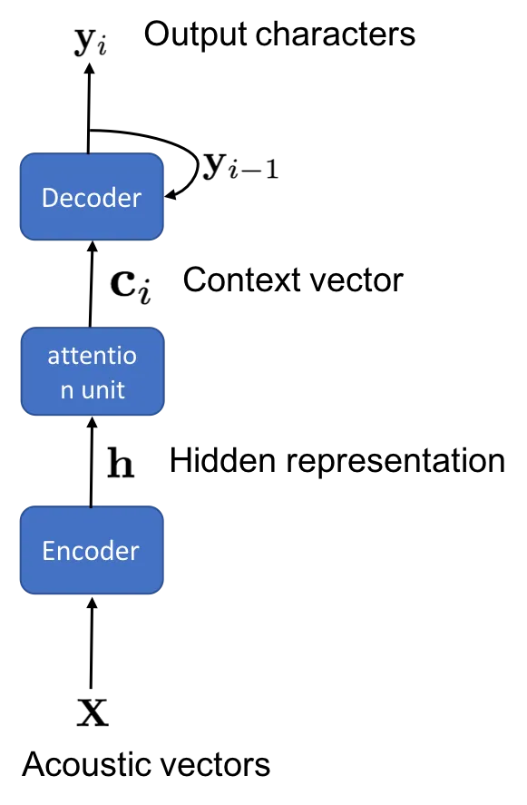
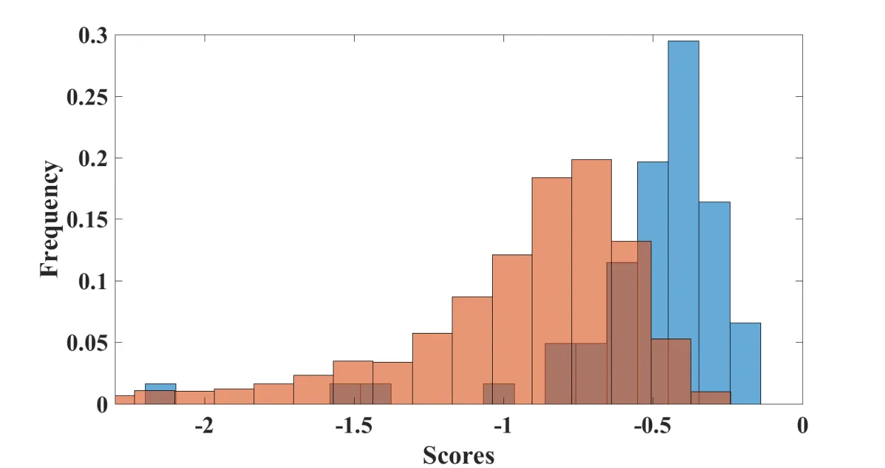

# Exploiting semi-supervised training through a dropout regularization in end-to-end speech recognition

###### Abstract

In this paper, we explore various approaches for semi-supervised
learning in an end-to-end automatic speech recognition (ASR) framework.
The first step in our approach involves training a seed model on the
limited amount of labelled data. Additional unlabelled speech data is
employed through a data-selection mechanism to obtain the best
hypothesized output, further used to retrain the seed model. However,
uncertainties of the model may not be well captured with a single
hypothesis. As opposed to this technique, we apply a dropout mechanism
to capture the uncertainty by obtaining multiple hypothesized text
transcripts of an speech recording. We assume that the diversity of
automatically generated transcripts for an utterance will implicitly
increase the reliability of the model. Finally, the data-selection
process is also applied on these hypothesized transcripts to reduce the
uncertainty. Experiments on freely-available TEDLIUM corpus and
proprietary Adobe’s internal dataset show that the proposed approach
significantly reduces ASR errors, compared to the baseline model.

Subhadeep Dey¹, Petr Motlicek¹, Trung Bui² and Franck Dernoncourt²

¹Idiap Research Institute  
²Adobe Research

sdey@idiap.ch, petr.motlicek@idiap.ch, bui@adobe.com, dernonco@adobe.com

Index Terms: speech recognition, semi-supervised learning, end-to-end
ASR, dropout.

## 1 Introduction

State-of-the-art approaches in automatic speech recognition (ASR)
exploit the powerful discriminative capability of deep neural networks
(DNN) for acoustic modelling \[1, 2, 3\]. The current ASR advancements
offer low error-rates, making the systems applicable for
commercialization. In the past few years, sequence level optimization
algorithms, such as lattice free maximum mutual information (LF-MMI) and
end-to-end frameworks, have been adopted over the frame level
discrimination approaches (like hybrid-DNN \[4\]) \[5, 3, 6\]. As
opposed to LF-MMI, the end-to-end approaches do not require the creation
of lexicon or decision trees for training. End-to-end sequence
classification approaches such as connectionist temporal classification
(CTC) and encoder-decoder frameworks have been successfully applied in
ASR \[6, 7\]. However, the end-to-end ASR requires large amount of
training data to optimize the network, as the model needs to
automatically learn the mapping from the acoustic features to
text-transcripts.

Another interesting concept is a semi-supervised learning. Our objective
is to exploit (relatively) large amount of unlabelled data when building
an end-to-end ASR system \[8, 9\]. This scenario is attractive to wide
range of applications, such as low-resource speech recognition and
computer vision, where unsupervised data is abundant but obtaining
labels is costly \[10\]. Various approaches to semi-supervised learning
have been proposed in the literature \[11, 9, 8\]. A typical approach
involves first training an initial seed-model on the limited amount of
supervised data. The seed-model is applied on the unsupervised data to
automatically generate the transcripts \[10, 11, 12\]. As automatically
generated transcripts may be erroneous, a data-selection mechanism is
applied to filter-out the low confident speech utterances. In \[11\],
the utterance-level confidences are obtained to post-process the one
best hypotheses. As opposed to using only 1-best hypothesized
transcripts, the whole decoding-lattice is used in \[8\] as a
supervision output. For end-to-end ASR, \[9\] has recently explored an
approach exploiting unpaired text and audio data. This technique
proposes to extract intermediate hidden representation of speech and
text data with a shared encoder network. However, this approach requires
text data from the target domain which may not be practically available
during the training stage.

In this paper, we explore a data-selection mechanism for semi-supervised
learning of end-to-end ASR, as it has shown to be a promising approach
in various applications, such as image, text, and speech, and it has not
been well explored for the end-to-end ASR. For data selection, we
explore two confidence based measures, namely, (i) utterance-based
decoding confidence, and (ii) entropy-based confidence. We hypothesize
that these measures indicate the reliability of automatically generated
transcripts using end-to-end ASR, given the speech recording. In the
proposed approach, the $`N`$-best hypothesized transcripts (filtered
using the confidence measures) are used to further retrain the
seed-model.

Further, this paper also explores the application of dropout mechanism
for augmenting the $`N`$-best hypothesized text. Dropout is usually
employed in the conventional ASR during training as a
regularizer \[13\], while during inference, the dropout is not applied.
In \[14, 15\], dropout was applied for semi-supervised learning for
characterizing the uncertainties of the DNN. Motivated by these
evidences, we propose to exploit the dropout mechanism to augment the
$`N`$-best list as follows: During the decoding of an utterance, the
dropout mechanism is employed to output 1-best transcripts. The dropout
is applied on the same utterance multiple times to obtain different
versions of transcripts. We hypothesize that the diversity of decoded
outputs for any utterance can localize the uncertainties of the model.
Experiments are performed on the publicly-available TEDLIUM corpus and
proprietary Adobe’s internal dataset. The results indicate that the
proposed approach allows to efficiently exploit unlabelled data, leading
to significant increase in ASR performance.

This paper is organized as follows. The baseline end-to-end ASR approach
is described in Section 2. The semi-supervised training is described in
Section 3. The experimental setup and results are described in
Sections 4 and 5 respectively. Finally, the paper is concluded in
Section 6.

## 2 End-to-end ASR

The state-of-the-art based ASR (chain model) requires a lexicon and
alignments, usually generated with respect to context-dependent
tri-phonetic states \[3\]. An alternative technique, referred to as
end-to-end, aims to learn the mapping from acoustic features to text
directly without the need of intermediate steps. Recently, various
end-to-end sequence-to-sequence approaches, such as encoder-decoder
model, have been successfully applied to ASR \[6, 7\]. The basic
components of the encoder-decoder model are illustrated in Figure 1 and
are described below:

- •
  Encoder: The purpose of the encoder is to produce hidden
  representation of the utterance $`\mathbf{X}`$ = {$`\mathbf{x}_{1}`$,
  $`\mathbf{x}_{2}`$, $`\cdots`$, $`\mathbf{x}_{T}`$}, as represented by
  {$`\mathbf{h}_{1}`$, $`\mathbf{h}_{2}`$, $`\cdots`$,
  $`\mathbf{h}_{L}`$}, where L $`\leq`$ T. Typically, the encoder
  consists of a few convolutional neural network (CNN) layers and a few
  layers of bidirectional long short-term memory (BLSTM).
- •
  Attention unit: The attention unit takes as input a sequence of
  features and estimates the relative importance of each feature vector.
  The attention unit computes a context vector ($`\mathbf{c}_{i}`$) for
  $`i^{th}`$ output unit.
- •
  Decoder: The context vector is used by the decoder unit to predict a
  character unit. The decoder also uses the previous decoded output
  character to infer current character. Training such an end-to-end ASR
  is performed by optimizing the following loss function:

  ```math
  L_{loss}=-\log p(C|\mathbf{X}), \tag{1}
  ```

  where $`C`$ is the character sequence corresponding to the utterance
  $`\mathbf{X}`$.

A connectionalist temporal classification (CTC) based loss is also
combined with the objective function of Equation 1 for training the
network. During decoding, scores from the CTC and encoder-decoder as the
acoustic models are combined using a beam-search algorithm. Furthermore,
a shallow fusion of language model (LM) with the acoustic-model scores
are applied to obtain text-transcripts. Further details of the
end-to-end ASR can be found in \[5, 6, 16\].



Figure 1: Architecture for encoder decoder network for end-to-end ASR.

## 3 Semi supervised learning

The end-to-end ASR is typically trained with a large amount (at
least$`\sim`$100 hours) of labelled data \[16\]. However in a
semi-supervised setting, it is assumed that only a small amount of
supervised data ($`\sim`$10 to 15 hours) is available for training in
addition to a large amount of untranscribed audio for the target domain.
Estimating parameters of the end-to-end model on the limited data may
not lead to a reliable solution. In this paper, we exploit publicly
available data (source domain) with relatively large amount of speech
recordings for estimating the parameters of the model. This ASR is
referred to as source domain model. The parameters of the model are then
adapted using the limited amount of transcribed data from the target
domain. The adapted end-to-end ASR is finally used as the seed-model for
exploiting the unsupervised data for further retraining.

In the past, various approaches have been explored for unsupervised
model adaptation \[11, 9, 8, 10, 12\]. Most of the approaches rely on
data-selection process for bootstrapping the model with additional
labelled data selected based on high confidence predictions. Process of
data-selection has not been well explored for end-to-end ASR. In this
paper, we explore data-selection approach using, (i) utterance-level
decoding-scores, and (ii) entropy based confidence measures. These
confidence-measures are then applied for selecting highly reliable
utterances.

The decoding-scores are obtained using the posterior probabilities of an
utterance given the acoustic features, as a result of the beam-search
process. Decoding-score for each $`N`$-best text-transcript can be
generated by the ASR. Utterance-based decoding scores can be finally
compared to a predefined threshold to perform a data selection.

Furthermore, we apply entropy as a criteria to filter out utterances
from the hypothesized ASR outputs. The entropy of an utterance measures
the amount of uncertainty of the model. We hypothesize that entropy of
the utterance is well correlated with the performance of the ASR system.
The entropy of an utterance is computed as follows: The posterior
probabilities of the character units are obtained by forward-pass of the
model. The entropy ($`\textbf{H}_{u}`$) is then:

```math
\mathbf{H}_{u}=-\frac{1}{T}\sum_{c}^{C}p(c|\mathbf{X})\log(p(c|\mathbf{X})), \tag{2}
```

where $`C`$ is the number of character outputs,
$`p`$($`c`$$`|`$$`\mathbf{X}`$) is the posterior probability of the
$`c^{th}`$ character unit given the acoustic features ($`\mathbf{X}`$).

We also propose to localize the uncertainty of the end-to-end ASR by
applying dropout mechanism. This method is motivated by the recent
advances of DNN for measuring the reliability of the model \[14, 15\].
The conventional methods do not use dropouts during the decoding time.
As opposed to this approach, sampling from the DNN weight distribution
is done by applying the dropout. The proposed approach is as follows:

1.  1.  Dropout: apply dropout during the inference to obtain $`1`$-best
        hypothesized transcript
2.  2.  Data-selection: augment the adaptation data with this utterance if
        the entropy or the decoding-score is above a threshold
3.  3.  Repeat steps 1 and 2 for $`N`$ times

The above steps are applied to all the utterances of the unsupervised
dataset.

## 4 Experimental Setup

In this section, the experimental setup for the semi-supervised ASR is
detailed. Experiments are performed on TEDLIUM and Adobe (internal)
datasets as the target domain data.

| Data      | LibriSpeech | TEDLIUM   | Adobe     |
| --------- | ----------- | --------- | --------- |
| $`train`$ | 100 hours   | -         | -         |
| $`dev1`$  | -           | 15 hours  | -         |
| $`dev2`$  | -           | 50 hours  | 20 hours  |
| $`dev3`$  | -           | 3 hours   | -         |
| $`test`$  | 5 hours     | 2.5 hours | 2.5 hours |

Table 1: Training, adaptation and test data for different dataset. The
$`dev1`$ represents the supervised data while $`dev2`$ comprises the
unlabelled-data.

### 4.1 LibriSpeech

We selected 100 hours of LibriSpeech clean portion as the source-domain
data, denoted as $`train`$ in Table 1 \[17\]. The LibriSpeech test set
comprises five hours of clean speech recordings.

### 4.2 TEDLIUM

Experiments are conducted in TEDLIUM speech dataset as the target domain
data \[18\]. For our experiments, we used only 15 hours of labelled data
($`dev1`$ part from Table 1). Furthermore, we use 3 hours and 50 hours
of data as the cross validation and unsupervised set ($`dev3`$ from
Table 1) respectively. The test data consists of 2.5 hours. The details
of the TEDLIUM corpora can be found in \[18\].

### 4.3 Adobe

The experiments are also conducted on Adobe’s internal speech dataset.
This corpora contains users uttering a list of commands. An example of a
command is , ”Move the table”. The unsupervised data contains
$`\sim`$24 k utterances spoken by 250 speakers with average duration of
each utterance being 3 s ($`dev2`$). The test data ($`test`$) consists
of 1300 utterances spoken by 50 speakers. The performances of the ASR
are reported in terms of word error rate (WER).

### 4.4 chain model

For chain model, 40 dimensional mel frequency cepstral coefficients
(MFCC) are extracted from the speech utterance as input features to the
neural network \[3\]. Furthermore, we also use online i-vector features
as input. The dimension of the i-vector extractor is fixed to 100. The
DNN uses 7 hidden layers of time delay neural network (TDNN) with 1 k
dimensional units. The DNN is trained to predict senones as the output
and LF-MMI is applied as the optimization criteria. The chain model
employs a 3-gram LM during decoding phase. The pronunciation dictionary
was created on the publicly available CMU-dictionary and include
vocabularies from the training text of LibriSpeech and TEDLIUM datasets.

### 4.5 End-to-end ASR

For the end-to-end ASR, 40 dimensional filter-bank energies are
extracted from the utterances to constitute features for the DNN \[6,
16\]. Delta filter-bank energies and pitch features are appended to the
original features to make it 83 dimensional vectors. The end-to-end ASR
as described in Section 2 is trained to predict English characters
(including semicolon, commas, etc. to make output dimension of 30). The
end-to-end ASR uses 3 CNN layers followed by 2 BLSTM layers as the
encoder, with the dimension of each layer fixed to 512. The decoder
network employs 2 LSTM layers, each with 512 dimensional units. A word
based language model is also trained with a vocabulary size of 50 k
words. The LM uses 2 LSTM layers with dimension of each layers being
1 k. The training text-data from LibriSpeech and TEDLIUM are used to
train the word-based LM.

## 5 Results

In this section, the results of the end-to-end ASR are presented. The
following ASR systems will be analyzed:

- •
  LF-MMI: This ASR refers to the traditional chain model using LF-MMI
  optimization criteria. The system is described in Section 4.4. This
  system is trained using the standard kaldi’s recipe \[19\].
- •
  End-to-end: This refers to end-to-end ASR as presented in Section 2.
  The end-to-end ASR is trained to predict characters and referred to as
  E2E. We also trained an end-to-end ASR using a dropout value of 0.2.
  The dropout is applied to all the layers in encoder and decoder. The
  network (with dropout) is trained to predict characters. The
  end-to-end ASR (source domain data of Section 4.1) with dropout is
  referred to as E2E-drop.
- •
  Adapted ASR: The end-to-end and LF-MMI based ASR are adapted to
  TEDLIUM labelled data. The end-to-end adapted ASR that is trained in a
  supervised manner (on $`dev1`$ data of Table 1) is referred to as
  E2E$`{}_{\textbf{S}}`$, while the adapted LF-MMI is referred to as
  $`\textbf{LF-MMI}_{\textbf{S}}`$. The end-to-end ASR that exploits the
  unsupervised data from TEDLIUM is referred to as
  $`\textbf{E2E}^{\textbf{TED}}_{\textbf{S+U}}`$ and the ASR that uses
  unlabelled Adobe’s internal data is referred to as
  $`\textbf{E2E}^{\textbf{Ab}}_{\textbf{U}}`$.

### 5.1 Baseline

For training the models on source domain, subset of LibriSpeech data is
used as described in the Section 4.1. The results of experiments on
LibriSpeech clean test set (column 2) are tabulated in Table 2. We
observe that LF-MMI outperforms the end-to-end ASR. Furthermore, we also
observe that the E2E-drop performs worse than E2E by 0.8% absolute WER.
The poor performance of the end-to-end ASR could be due to the limited
amount of training data.

| Systems  | LibriSpeech      | TEDLIUM           | Adobe |
| -------- | ---------------- | ----------------- | ----- |
| LF-MMI   | $`\mathbf{7.8}`$ | $`\mathbf{19.5}`$ | 29.7  |
| E2E      | 11.2             | 38.5              | 40.5  |
| E2E-drop | 12.0             | 39.1              | 40.7  |

Table 2: Performance of the various baseline ASR systems in terms of WER
(%) on LibriSpeech clean, TEDLIUM and Adobe test set with the source
domain model. The chain model, LF-MMI, performs better than the
end-to-end ASR systems.

### 5.2 Experiments on the TEDLIUM data

The performances of the various source domain ASRs on the TEDLIUM test
portion are shown in Table 2 (Column 3). It can be observed that the
LF-MMI performs the best on the TEDLIUM test set as well. These ASR
systems are then adapted to labelled data, $`dev1`$ (Table 1). For the
$`\textbf{LF-MMI}_{\textbf{S}}`$, retraining all the parameters of the
model provides good performance while for end-to-end ASR, retraining the
encoder performs the best. From Table 3, it can be observed that
$`\textbf{LF-MMI}_{\textbf{S}}`$ outperforms the
$`\textbf{E2E}_{\textbf{S}}`$. The end-to-end models are used as
seed-model, for exploiting the unsupervised data. We first present
results of an experiment employing decoding-score for end-to-end ASR.

#### 5.2.1 Decoding-score

The first step in data-selection process is to fix a threshold on
decoding-score generated by the seed-model on unlabelled data. The
threshold is obtained by minimizing false alarm and miss detection rate
as follows. The cross validation (CV) part of TEDLIUM data ($`dev3`$
data as described in Table 1) is first decoded using the
$`\textbf{E2E}_{\textbf{S}}`$. For each utterance, the WER is computed.
Thus, WER and decoding-score are associated to each utterance. We divide
the CV set into two parts, (i) Set1: utterances for which WER $`\leq`$
$`10`$%, and (ii) Set2: WER for these utterances $`>`$ $`10`$%. The
histogram plot of the decoding-scores of Set1 and Set2 is illustrated in
Figure 2. To minimize false positive and miss detection (from Figure 2),
the threshold should be fixed between -0.3 to -0.6 (Refer to Figure 2).
This threshold is applied on the unsupervised data ($`dev2`$ of Table 1)
for selecting speech utterances.

The end-to-end ASR (seed-model) is applied to decode the $`dev2`$ data
to obtain text-transcripts (10-best) and decoding-scores for an
utterance. Data-selection is applied on these decoding-scores for
filtering the highly confident outputs (for further retraining the
system). The results of data-selection process using two threshold
values are illustrated in Table 3. We observed that 10-best hypothesis
is beneficial for $`\textbf{E2E}^{\textbf{TED}}_{\textbf{S+U}}`$ than
1-best hypothesis. Data-selection based on 1-best hypothesis provides
WER of 29.5% while data-selection using 10-best decoded-outputs provides
WER of 28.9%. Furthermore, the performance of
$`\textbf{E2E}^{\textbf{TED}}_{\textbf{S+U}}`$ does not improve on
applying more than 10-best hypothesis. From Table 3, it can be observed
that $`\textbf{E2E}^{\textbf{TED}}_{\textbf{S+U}}`$ performs better with
threshold of -0.5. We observed that thresholds less than -0.3 lead to
the selection of shorter duration utterances. The
$`\textbf{E2E}^{\textbf{TED}}_{\textbf{S+U}}`$ outperforms
$`\textbf{E2E}_{\textbf{S}}`$ by 0.3% absolute WER. In rest of the
experimental section, threshold of -0.5 is applied on decoding-score for
data-selection.

We augment the $`N`$-best hypothesized transcripts (generated by
E2E$`{}_{\textbf{S}}`$) by using dropout mechanism from the E2E-drop.
The process for data-selection is described in Section 3. From Table 4,
it can be observed that significant gain in performance is obtained by
this approach ($`\textbf{E2E}^{\textbf{TED}}_{\textbf{S+U}}`$ +
E2E-drop). Furthermore, this technique outperforms the
E2E$`{}_{\textbf{S}}`$ by 2% absolute WER (29.2% to 27.2%) showing the
importance of localizing the uncertainties in the model.

#### 5.2.2 Entropy

We also explore an approach of using entropy as data-selection criteria
as described in Section 3. From Table 4, it can be observed that the
performance of $`\textbf{E2E}^{\textbf{TED}}_{\textbf{S+U}}`$ does not
improve upon $`\textbf{E2E}_{\textbf{S}}`$ on using additional
unsupervised data. Furthermore, we apply dropout mechanism as described
in Section 3 for augmenting the data (as done in Section 5.2.1 on
decoding-score). It can be observed that this approach outperforms
$`\textbf{E2E}_{\textbf{S}}`$ by 0.4% absolute WER.

### 5.3 Experiments on Adobe’s internal dataset

We performed the data-selection process using decoding-score and entropy
based confidence scores on Adobe’s internal data as well. Due to the
lack of development data from Adobe, the thresholds from TEDLIUM are
used for data-selection process. For example, threshold of -0.5 is
applied on decoding-score for utterance-selection. The result of
data-selection process using decoding-score is shown in Table 4. From
the table, it can be observed that
$`\textbf{E2E}^{\textbf{Ab}}_{\textbf{U}}`$ performs best (retrained
with 10-best hypothesized transcripts) with a WER of 32.2%. Furthermore,
additional transcripts generated by the dropout model are used for
augmenting the 10-best hypothesized text. The performance of this
approach ($`\textbf{E2E}^{\textbf{Ab}}_{\textbf{U}}`$ + E2E-drop) does
not improve upon the result of 32.2% WER. The poor performance could be
due to choice of non optimal threshold on decoding-score for
data-selection process. It can be observed that dropout mechanism
benefits performance of the
$`\textbf{E2E}^{\textbf{Ab}}_{\textbf{U}}`$ + E2E-drop over the
non-adapted E2E using entropy based data-selection criteria.

| Systems                                        | adapt-data        | Threshold | TEDLIUM           |
| ---------------------------------------------- | ----------------- | --------- | ----------------- |
| $`\textbf{LF-MMI}_{\textbf{S}}`$               | $`dev1`$          | -         | $`\mathbf{18.5}`$ |
| E2E$`{}_{\textbf{S}}`$                         | $`dev1`$          | -         | 29.2              |
| $`\textbf{E2E}^{\textbf{TED}}_{\textbf{S+U}}`$ | $`dev1`$+$`dev2`$ | -0.3      | 29.7              |
| $`\textbf{E2E}^{\textbf{TED}}_{\textbf{S+U}}`$ | $`dev1`$+$`dev2`$ | -0.5      | 28.9              |

Table 3: Performance of various ASR systems in terms of WER (%) on
TEDLIUM test set. The details of supervised and unsupervised data
(adapt-data) have been tabulated in Table 1.

|                                                           |                   |                   |                   |
| --------------------------------------------------------- | ----------------- | ----------------- | ----------------- |
| Systems                                                   | $`data`$-$`sel`$  | TED               | Adb               |
| E2E                                                       | -                 | 38.5              | 40.5              |
| E2E$`{}_{\textbf{S}}`$                                    | -                 | 29.2              | -                 |
| $`\textbf{E2E}^{\textbf{TED}}_{\textbf{S+U}}`$            | $`dec`$-$`score`$ | 28.9              | -                 |
| $`\textbf{E2E}^{\textbf{Ab}}_{\textbf{U}}`$               | $`dec`$-$`score`$ | -                 | $`\mathbf{32.2}`$ |
| $`\textbf{E2E}^{\textbf{TED}}_{\textbf{S+U}}`$ + E2E-drop | $`dec`$-$`score`$ | $`\mathbf{27.2}`$ | -                 |
| $`\textbf{E2E}^{\textbf{Ab}}_{\textbf{U}}`$ + E2E-drop    | $`dec`$-$`score`$ | -                 | 34.3              |
| $`\textbf{E2E}^{\textbf{TED}}_{\textbf{S+U}}`$            | $`entropy`$       | 29.2              | -                 |
| $`\textbf{E2E}^{\textbf{Ab}}_{\textbf{U}}`$               | $`entropy`$       | -                 | 38.1              |
| $`\textbf{E2E}^{\textbf{TED}}_{\textbf{S+U}}`$ + E2E-drop | $`entropy`$       | 28.8              | -                 |
| $`\textbf{E2E}^{\textbf{Ab}}_{\textbf{U}}`$ + E2E-drop    | $`entropy`$       | -                 | 37.7              |

Table 4: Performance of various ASR systems on TEDLIUM (TED) and Adobe
(Adb) test set using decoding-score (dec-score) and entropy based
data-selection (data-sel) criteria. The
$`\textbf{E2E}^{\textbf{TED}}_{\textbf{S+U}}`$ + E2E-drop performs the
best on TEDLIUM test set.



Figure 2: Histogram plot of decoding-scores for set of utterances, with
WER $`\leq`$ 10% (blue) and decoding-scores for utterances with WER
$`>`$ 10% (orange).

## 6 Conclusions

Techniques for semi-supervised learning for ASR were investigated in
this paper. For exploiting unlabelled data, the baseline system employs
a single best hypothesized text-transcript. As opposed to this approach,
we proposed to capture the uncertainties by applying a dropout mechanism
to generate multiple hypothesized transcripts. Furthermore, we also used
data-selection mechanism to filter the highly confident hypotheses. The
techniques were evaluated in publicly available TEDLIUM and Adobe’s
internal dataset. Experiments show that the proposed approach
($`\textbf{E2E}^{\textbf{TED}}_{\textbf{S+U}}`$ + E2E-drop) outperforms
the baseline method by 2% absolute reduction in WER on TEDLIUM test set.

## 7 Acknowledgements

This work was done under the “SM2 - Extracting semantic meaning from
spoken material” project, partially supported by the Swiss Innovation
Agency (InnoSuisse) as well as by a research grant from Adobe Research,
USA.

## References

- \[1\] G. Hinton, L. Deng, D. Yu, G. Dahl, A.-r. Mohamed, N. Jaitly,
  A. Senior, V. Vanhoucke, P. Nguyen, B. Kingsbury _et al._, “Deep
  neural networks for acoustic modeling in speech recognition,” _IEEE
  Signal processing magazine_, vol. 29, 2012.
- \[2\] L. Deng, G. Hinton, and B. Kingsbury, “New types of deep neural
  network learning for speech recognition and related applications: An
  overview,” in _2013 IEEE International Conference on Acoustics, Speech
  and Signal Processing_. IEEE, 2013, pp. 8599–8603.
- \[3\] D. Povey, V. Peddinti, D. Galvez, P. Ghahremani, V. Manohar,
  X. Na, Y. Wang, and S. Khudanpur, “Purely sequence-trained neural
  networks for asr based on lattice-free mmi.” 2016.
- \[4\] P. Motlicek, D. Imseng, B. Potard, P. N. Garner, and I. Himawan,
  “Exploiting foreign resources for dnn-based asr,” _EURASIP Journal on
  Audio, Speech, and Music Processing_, vol. 2015, no. 1, p. 17, 2015.
- \[5\] S. Kim, T. Hori, and S. Watanabe, “Joint ctc-attention based
  end-to-end speech recognition using multi-task learning,” in _2017
  IEEE international conference on acoustics, speech and signal
  processing (ICASSP)_. IEEE, 2017, pp. 4835–4839.
- \[6\] S. Watanabe, T. Hori, S. Karita, T. Hayashi, J. Nishitoba,
  Y. Unno, N. E. Y. Soplin, J. Heymann, M. Wiesner, N. Chen _et al._,
  “Espnet: End-to-end speech processing toolkit,” _arXiv preprint
  arXiv:1804.00015_, 2018.
- \[7\] Y. Miao, M. Gowayyed, and F. Metze, “Eesen: End-to-end speech
  recognition using deep rnn models and wfst-based decoding,” in _2015
  IEEE Workshop on Automatic Speech Recognition and Understanding
  (ASRU)_. IEEE, 2015, pp. 167–174.
- \[8\] V. Manohar, H. Hadian, D. Povey, and S. Khudanpur,
  “Semi-supervised training of acoustic models using lattice-free mmi,”
  in _2018 IEEE International Conference on Acoustics, Speech and Signal
  Processing (ICASSP)_. IEEE, 2018, pp. 4844–4848.
- \[9\] S. Karita, S. Watanabe, T. Iwata, A. Ogawa, and M. Delcroix,
  “Semi-supervised end-to-end speech recognition,” in _Proc.
  Interspeech_, 2018, pp. 2–6.
- \[10\] D.-H. Lee, “Pseudo-label: The simple and efficient
  semi-supervised learning method for deep neural networks,” in
  _Workshop on Challenges in Representation Learning, ICML_, vol. 3,
  2013, p. 2.
- \[11\] S. Walker, M. Pedersen, I. Orife, and J. Flaks,
  “Semi-supervised model training for unbounded conversational speech
  recognition,” _arXiv preprint arXiv:1705.09724_, 2017.
- \[12\] P. Bachman, O. Alsharif, and D. Precup, “Learning with
  pseudo-ensembles,” in _Advances in Neural Information Processing
  Systems_, 2014, pp. 3365–3373.
- \[13\] N. Srivastava, G. Hinton, A. Krizhevsky, I. Sutskever, and
  R. Salakhutdinov, “Dropout: A simple way to prevent neural networks
  from overfitting,” _Journal of Machine Learning Research_, vol. 15,
  pp. 1929–1958, 2014. \[Online\]. Available:
  http://jmlr.org/papers/v15/srivastava14a.html
- \[14\] A. Vyas, P. Dighe, S. Tong, and H. Bourlard, “Analyzing
  uncertainties in speech recognition using dropout,” in _Proceedings of
  the IEEE International Conference on Acoustics, Speech, and Signal
  Processing (ICASSP)_, Jul. 2019.
- \[15\] Y. Gal and Z. Ghahramani, “Dropout as a bayesian approximation:
  Representing model uncertainty in deep learning,” in _international
  conference on machine learning_, 2016, pp. 1050–1059.
- \[16\] T. Hori, J. Cho, and S. Watanabe, “End-to-end speech
  recognition with word-based rnn language models,” in _2018 IEEE Spoken
  Language Technology Workshop (SLT)_. IEEE, 2018, pp. 389–396.
- \[17\] V. Panayotov, G. Chen, D. Povey, and S. Khudanpur,
  “Librispeech: an asr corpus based on public domain audio books,” in
  _2015 IEEE International Conference on Acoustics, Speech and Signal
  Processing (ICASSP)_. IEEE, 2015, pp. 5206–5210.
- \[18\] A. Rousseau, P. Deléglise, and Y. Esteve, “Ted-lium: an
  automatic speech recognition dedicated corpus.” in _LREC_, 2012, pp.
  125–129.
- \[19\] D. Povey, A. Ghoshal, G. Boulianne, L. Burget, O. Glembek,
  N. Goel, M. Hannemann, P. Motlicek, Y. Qian, P. Schwarz _et al._, “The
  kaldi speech recognition toolkit,” IEEE Signal Processing Society,
  Tech. Rep., 2011.
