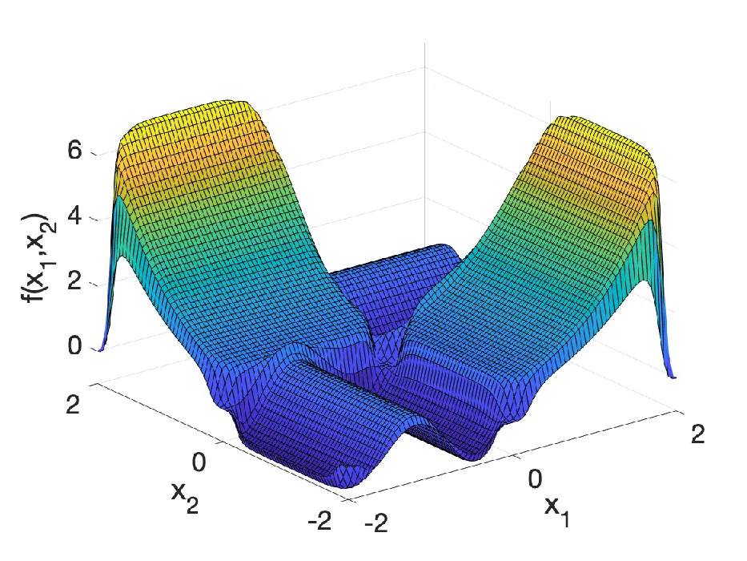

# Estimation of a function of low local dimensionality by deep neural networksThanks:  The author gratefully acknowledge the support from the Natural Sciences and Engineering Research Council of Canada under grant RGPIW-2015-06412.

Michael Kohler ^(†)^(†)thanks: Funded by the Deutsche
Forschungsgemeinschaft (DFG, German Research Foundation) - Projektnummer
57157498 - SFB 805.    Fachbereich Mathematik    Technische Universität
Darmstadt Affiliation: Adam Krzyżak    Department of Computer Science   
Software Engineering Affiliation: Concordia University Affiliation: and
Affiliation: Sophie Langer^(\*) Affiliation: Fachbereich Mathematik,
Technische Universität Darmstadt

###### Abstract

Deep neural networks (DNNs) achieve impressive results for complicated
tasks like object detection on images and speech recognition. Motivated
by this practical success, there is now a strong interest in showing
good theoretical properties of DNNs. To describe for which tasks DNNs
perform well and when they fail, it is a key challenge to understand
their performance. The aim of this paper is to contribute to the current
statistical theory of DNNs.  
We apply DNNs on high dimensional data and we show that the least
squares regression estimates using DNNs are able to achieve
dimensionality reduction in case that the regression function has
locally low dimensionality. Consequently, the rate of convergence of the
estimate does not depend on its input dimension $`d`$, but on its local
dimension $`d^{*}`$ and the DNNs are able to circumvent the curse of
dimensionality in case that $`d^{*}`$ is much smaller than $`d`$. In our
simulation study we provide numerical experiments to support our
theoretical result and we compare our estimate with other conventional
nonparametric regression estimates. The performance of our estimates is
also validated in experiments with real data.

Keywords: curse of dimensionality, deep neural networks, nonparametric
regression, piecewise partitioning, rate of convergence.

## 1 Introduction

### 1.1 Nonparametric regression

Motivated by the huge success of deep neural networks in applications
(cf., e.g., Schmidhuber, (2015) and the literature cited therein) there
is now keen interest in investigating theoretical properties of deep
neural networks. In statistical research this is usually done in context
of nonparametric regression (cf., Kohler and Krzyżak, (2017), Bauer and
Kohler, (2019), Schmidt-Hieber, (2020), Kohler and Langer, (2020),
Imaizumi and Fukumizu, (2019) and Nakada and Imaizumi, (2019)). Here,
$`(X,Y)`$ is an $`\mathbb{R}^{d}\times\mathbb{R}`$–valued random vector
satisfying $`{\mathbf{E}}\{Y^{2}\}<\infty`$, and given a sample of
$`(X,Y)`$ of size $`n`$, i.e., given a data set

```math
{\mathcal{D}}_{n}=\left\{(X_{1},Y_{1}),\dots,(X_{n},Y_{n})\right\}, \tag{1}
```

where $`(X,Y)`$, $`(X_{1},Y_{1})`$, …, $`(X_{n},Y_{n})`$ are i.i.d.
random variables, the aim is to construct an estimate

```math
m_{n}(\cdot)=m_{n}(\cdot,{\mathcal{D}}_{n}):\mathbb{R}^{d}\rightarrow\mathbb{R}
```

of the regression function $`m:\mathbb{R}^{d}\rightarrow\mathbb{R}`$,
$`m(x)={\mathbf{E}}\{Y|X=x\}`$ such that the $`L_{2}`$ error

```math
\int|m_{n}(x)-m(x)|^{2}{\mathbf{P}}_{X}(dx)
```

is “small” (see, e.g., Györfi et al., (2002) for a comprehensive study
to nonparametric regression and motivation for the $`L_{2}`$ error).

### 1.2 Rate of convergence

It is well–known that one needs smoothness assumptions on the regression
function in order to derive non–trivial rates of convergence (cf., e.g.,
Theorem 7.2 and Problem 7.2 in Devroye et al., (1996) and Section 3 in
Devroye and Wagner, (1980)). Thus we introduce the following definition.

###### Definition 1.

Let $`p=q+s`$ for some $`q\in\mathbb{N}_{0}`$ and $`0<s\leq 1`$, where
$`\mathbb{N}_{0}`$ is the set of nonnegative integers. A function
$`f:\mathbb{R}^{d}\rightarrow\mathbb{R}`$ is called $`(p,C)`$-smooth, if
for every $`\alpha=(\alpha_{1},\dots,\alpha_{d})\in\mathbb{N}_{0}^{d}`$
with $`\sum_{j=1}^{d}\alpha_{j}=q`$ the partial derivative
$`\frac{\partial^{q}f}{\partial x_{1}^{\alpha_{1}}\dots\partial x_{d}^{\alpha_{d}}}`$
exists and satisfies

```math
\left|\frac{\partial^{q}f}{\partial x_{1}^{\alpha_{1}}\dots\partial x_{d}^{\alpha_{d}}}(x)-\frac{\partial^{q}f}{\partial x_{1}^{\alpha_{1}}\dots\partial x_{d}^{\alpha_{d}}}(z)\right|\leq C\cdot\|x-z\|^{s}
```

for all $`x,z\in\mathbb{R}^{d}`$, where $`\|\cdot\|`$ denotes the
Euclidean norm.

Stone, (1982) showed that the optimal minimax rate of convergence in
nonparametric regression for $`(p,C)`$-smooth functions is
$`n^{-2p/(2p+d)}`$.

### 1.3 Curse of dimensionality

In case that $`d`$ is large compared to $`p`$ the above rate of
convergence is rather slow which is a symptom of so-called curse of
dimensionality. One way to circumvent it is to impose additional
constraints on the structure of the regression function. Recently it was
shown, that deep neural networks are able to circumvent the curse of
dimensionality whenever suitable hierarchical composition assumptions on
the regression function hold. Here the regression function is contained
in the following function class:

###### Definition 2.

Let $`d\in\mathbb{N}`$ and $`m:\mathbb{R}^{d}\to\mathbb{R}`$ and let
$`{\cal P}`$ be a subset of $`(0,\infty)\times\mathbb{N}`$

a) We say that $`m`$ satisfies a hierarchical composition model of level
$`0`$ with order and smoothness constraint $`\mathcal{P}`$, if there
exists a $`K\in\{1,\dots,d\}`$ such that

```math
m(x)=x^{(K)}\quad\mbox{for all }x=(x^{(1)},\dots,x^{(d)})^{\top}\in\mathbb{R}^{d}.
```

b) We say that $`m`$ satisfies a hierarchical composition model of level
$`\ell+1`$ with order and smoothness constraint $`\mathcal{P}`$, if
there exist $`(p,K)\in{\cal P}`$, $`C>0`$,
$`g:\mathbb{R}^{K}\to\mathbb{R}`$ and
$`f_{1},\dots,f_{K}:\mathbb{R}^{d}\to\mathbb{R}`$, such that $`g`$ is
$`(p,C)`$–smooth, $`f_{1},\dots,f_{K}`$ satisfy a hierarchical
composition model of level $`\ell`$ with order and smoothness constraint
$`\mathcal{P}`$ and

```math
m(x)=g(f_{1}(x),\dots,f_{K}(x))\quad\mbox{for all }x\in\mathbb{R}^{d}.
```

In case that the order and smoothness constraint of $`g`$ alternates
between $`(p,d)`$ and $`(\infty,K)`$ and $`g`$ is a sum in every second
level, this definition equals the definition of the so–called
$`(p,C)`$-smooth generalized hierarchical interaction models of order
$`d^{*}`$, which were introduced by Kohler and Krzyżak, (2017). They
showed that for such models suitably defined multilayer neural networks
(in which the number of hidden layers depends on the level of the
generalized interaction model) achieve the rate of convergence
$`n^{-2p/(2p+d^{*})}`$ (up to some logarithmic factor) in case
$`p\leq 1`$. Bauer and Kohler, (2019) generalized this result for
$`p>1`$ provided the squashing function is suitably chosen. For the
hierarchical composition model of Definition 2, where the smoothness and
dimension is fixed within one level, Schmidt-Hieber, (2020) showed (up
to some logarithmic factor) a rate of convergence

```math
\displaystyle\max_{(p,K)\in{\cal P}}n^{-2p/(2p+K)}
```

for sparse neural networks with ReLU activation function. Kohler and
Langer, (2020) showed that this rate holds even for simple fully
connected neural networks and arbitrary hierarchical composition model
of Definition 2. All the above mentioned results are optimal up to some
logarithmic factor. Liu et al., (2019) showed that some of these results
hold even without the logarithmic factor. For regression functions with
a form of common statistical models, i.e. multivariate adaptive
regression splines (MARS), Eckle and Schmidt-Hieber, (2019) showed that
convergence rate by DNNs can also be improved. In case that the
regression function is defined on a manifold, Schmidt-Hieber, (2019)
showed, that the convergence rate by DNNs depends on the dimension of
the manifold. Nakada and Imaizumi, (2019) analyzed the performance of
DNNs in case that the high-dimensional data have an intrinsic low
dimensionality and showed that the convergence rate by DNNs depends only
on the intrinsic dimension and not on the input dimension.

### 1.4 Low local dimensionality

In this article we consider regression functions with low local
dimensionality. There exist several examples in the literature, where
high dimensional problems can be treated locally in much lower
dimension. Bell and Sejnowski, (1997) showed that the probability
distribution of a natural scene is highly structured, since, for
instance, the neighboring pixel of a natural scene have redundant
informations. Schaal and Vijayakumar, (1997) and Hoffmann et al., (2009)
analyzed in their research on human motor control some regularities in
full-body movement of humans within and across individuals. These
regularities also lead to locally low-dimensional data distributions.
For instance, they showed that for estimating the inverse dynamics of an
arm, a globally 21- dimensional space reduces, on average to 4-6
dimensions locally. And also in our own research it can be reasonably
assumed, that the analyzed data set is of a locally low dimensional
structure. The data set under study (which is part of the Machine
Learning Repository:
https://archive.ics.uci.edu/ml/machine-learning-databases/00275/) is
related to 2–year usage log of a bike sharing system namely Captial Bike
Sharing (CBS) at Washington, D.C., USA (Fanaee-T and Gama, (2013)). The
data show the hourly aggregated count of rental bikes and 12 attributes,
namely the season (1: spring, 2: summer, 3: fall, 4: winter), the year
(0: 2011, 1:2012), the month (1 to 12), the hour (0 to 23), holiday
(whether the day is holiday (1) or not (0)), the day of the week (1 to
7), workingday (if day is neither weekend nor holiday is 1, otherwise is
0), the weather situation (1: Clear, Few clouds, Partly cloudy, 2:
Mist + Cloudy, Mist + Broken clouds, Mist + Few clouds, Mist, 3: Light
Snow, Light Rain + Thunderstorm + Scattered clouds, Light Rain +
Scattered clouds, 4: Heavy Rain + Ice Pallets + Thunderstorm + Mist,
Snow + Fog), the normalized temperature in Celsius, the normalized
feeling temperature in Celsius, the normalized humidity and the
normalized windspeed. For this data set we conjecture that depending on
the season, the hour and the attribute working day the count of rental
bikes depends on different subsets of the other attributes. E.g., in
spring and fall during the rush hour on working day the weather is not
important at all. But on days which are not working days, it depends
mainly on the hour and the weather, where for different seasons
different weather attributes are important (like temperature and
humidity in summer or weather situation in the Spring and in the Fall).
This leads to the assumption, that the underlying regression function
performs differently on different subsets and depends locally only on a
few of its input components. In summary, that means that one can reduce
dimension locally without losing much information for many high
dimensional problems thus avoiding the curse of dimensionality. This
finding motivates us to analyze regression functions with low local
dimensionality.

We say a function $`f:\mathbb{R}^{d}\rightarrow\mathbb{R}`$ has a low
local dimensionality, if it depends locally only on a very few of its
component, where in different areas these subsets of variables can be
different. The simplest way to define this formally is to assume that
there exist $`d^{*}\in\{1,\dots,d\}`$, $`K\in\mathbb{N}`$, disjoint sets
$`A_{1}`$, …, $`A_{K}\subset\mathbb{R}^{d}`$, functions $`f_{1}`$, …,
$`f_{K}:\mathbb{R}^{d^{*}}\rightarrow\mathbb{R}`$ and subsets of indices
$`J_{1}`$, …, $`J_{K}\subset\{1,\dots,d\}`$ of cardinality at most
$`d^{*}`$ such that

```math
f(x)=\sum_{k=1}^{K}f_{k}(x_{J_{k}})\cdot\mathds{1}_{A_{k}}(x) \tag{2}
```

holds for all $`x\in\mathbb{R}^{d}`$, where

```math
\displaystyle x_{\{j_{k,1},\dots,j_{k,d^{*}}\}}=(x^{(j_{k,1})},\dots,x^{(j_{k,d^{*}})})\ \mbox{for}\ 1\leq j_{k,1}<\dots<j_{k,d^{*}}\leq d.
```

As a consequence of using the indicator function, assumption (2) implies
that $`f`$ in general is not globally smooth, in particular it is not
even continuous. In view of many applications where it is intuitively
expected that the dependent variable depends smoothly on the independent
variables, this does not seem to be realistic.

To avoid this problem, we will allow in the sequel smooth transitions
between the different areas $`A_{1}`$, …, $`A_{K}`$ in (2). To achieve
this, we assume that the function $`f`$ is squeezed between two
functions of the form (2). In order to simplify the presentation, we use
in the sequel $`d`$-dimensional polytopes for the sets
$`A_{1},\dots,A_{K}`$. Since polytopes can be described as the
intersection of a finite number of half spaces, we define the local
dimensionality as follows:

###### Definition 3.

A function $`f:\mathbb{R}^{d}\to\mathbb{R}`$ has local dimensionality
$`d^{\ast}\in\{1,\dots,d\}`$ on $`[-A,A]^{d}`$ for $`A>0`$ with order
$`(K_{1},K_{2})`$, $`{\mathbf{P}}_{X}`$-border $`\epsilon>0`$ and
borders $`\delta_{i,k}>0`$ for $`i=1,\dots,K_{1}`$, $`k=1,\dots,K_{2}`$
if there exists $`a_{i,k}\in\mathbb{R}^{d}`$ with $`\|a_{i,k}\|\leq 1`$,
$`b_{i,k}\in\mathbb{R}`$, $`J_{k}\subseteq\{1,\dots,d\}`$ with
$`|J_{k}|\leq d^{\ast}`$ for $`i=1,\dots,K_{1}`$, $`k=1,\dots,K_{2}`$
and

```math
f_{k}:\mathbb{R}^{d^{\ast}}\to\mathbb{R}
```

such that for

```math
(P_{k})_{\delta_{k}}=\{x\in\mathbb{R}^{d}:a_{i,k}^{T}x\leq b_{i,k}-\delta_{i,k}\ \mbox{for $i=1,\dots,K_{1}$}\}
```

and

```math
(P_{k})^{\delta_{k}}=\{x\in\mathbb{R}^{d}:a_{i,k}^{T}x\leq b_{i,k}+\delta_{i,k}\ \mbox{for $i=1,\dots,K_{1}$}\}
```

with $`\delta_{k}=(\delta_{1,k},\dots,\delta_{K_{1},k})`$ we have

```math
\sum_{k=1}^{K_{2}}f_{k}(x_{J_{k}})\cdot 1_{(P_{k})_{\delta_{k}}}(x)\leq f(x)\leq\sum_{k=1}^{K_{2}}f_{k}(x_{J_{k}})\cdot 1_{(P_{k})^{\delta_{k}}}(x)\ \ \ (x\in A)
```

and

```math
{\mathbf{P}}_{X}\left(\left(\bigcup_{k=1}^{K_{2}}(P_{k})^{\delta_{k}}\textbackslash(P_{k})_{\delta_{k}}\right)\cap[-A,A]^{d}\right)\leq\epsilon.
```

Figure 1 shows a function $`f(x)`$ with $`K_{2}=4`$, polytopes
$`P_{1}=[-2,0]\times[-2,0]`$, $`P_{2}=[-2,0]\times[0,2]`$,
$`P_{3}=[0,2]\times[0,2]`$ and $`P_{4}=[0,2]\times[-2,0]`$ and functions
$`f_{1}(x_{1})=\sin(4\cdot x_{1})`$, $`f_{2}(x_{2})=\exp(x_{2})`$,
$`f_{3}(x_{2})=\cos(4\cdot x_{2})`$ and $`f_{4}(x_{2})=\exp(x_{1})`$
with smooth transitions between the polytopes.



Figure 1: An example of a function with low local dimensionality with a
2-dimensional support. The support is divided into four pieces, the
function depends locally only on one variable of the input and is
globally smooth.

### 1.5 Main results

In this paper we show that sparse neural network regression estimates
are able to achieve a dimension reduction in case that the regression
function has a low local dimensionality. We derive the rate of
convergence which depends only on the local dimension $`d^{*}`$ and not
on the input dimension $`d`$ (cf., Theorem 1). Thus our neural network
regression estimates are able to circumvent the curse of dimensionality
in case that $`d^{*}`$ is much smaller than $`d`$. Finally, we verify
the theoretical results using simulation studies and experiments on real
data.

We point out another advantage of DNNs, namely that that neural networks
are able to detect a locally low dimensional structure and therefore
achieve a faster rate of convergence. As a technical contribution of
this paper, we present a result concerning the connection between neural
networks and so-called multivariate adapative regression splines (MARS).
For instance, we show that the sparse neural network regression
estimates, where the weights are chosen by the least squares, satisfy
the expected error bound of MARS in case that this procedure works in an
optimal way (cf., Theorem 2 in the Supplement).  
Our results are based on a set of sparse neural networks instead of
fully connected neural networks. On the one hand this network
architecture leads to a better bound of the covering number, which is
essential to show the convergence result. On the other hand they perform
better with regard to the simulated and real data as shown in our
simulation studies. In applying our estimates to a real-world data
experiment we emphasize the practical relevance of our assumption on the
regression function and show that our sparse neural network estimates
outperform other nonparametric regression estimates, especially MARS, on
this data set.

### 1.6 Discussion of related results

It is frequently observed by various researchers, that the true
intrinsic dimensionality of high dimensional data is often very low
(e.g. Belkin and Niyogi, (2003), Tenenbaum et al., (2000), Hoffmann
et al., (2009), Nakada and Imaizumi, (2019)). Several estimators like
the kernel methods and the Gaussian process regression are able to
exploit the intrinsic low dimensionality of covariates and achieve a
fast rate of convergence depending only on the intrinsic dimensionality
of the data set (e.g. Bickel and Li, (2007), Kpotufe, (2011), Kpotufe
and Garg, (2013), Yang and Barron, (1999)). Recently, Nakada and
Imaizumi, (2019) also derived convergence rates by DNNs, which only
depend on the intrinsic dimension and are free from the nominal
dimension. Schmidt-Hieber, (2019) achieved approximation rates of DNNs
that only depend on $`d^{*}`$, in case that the input lies on on a
$`d^{*}`$-dimension manifold. To describe the intrinsic dimensionality,
both articles used the notion of Minkowski dimension.

All the above mentioned results use the observation, that many high
dimensional problems are contained in a low dimensional space. At this
point we would like to highlight the difference with our assumption.
While these studies focus on the behavior of the measure
$`{\mathbf{P}}_{X}`$ of covariates, we analyze regression functions with
some specific structure, i.e. regression functions with low local
dimensionality. In our case the dimension of the regression function is
locally of size $`d^{*}\leq d`$ and the regression function performs
differently on different subsets. This does not imply, that there is
some intrinsic low dimensionality in the measure $`{\mathbf{P}}_{X}`$ of
covariates.

A similar structure of regression functions has been studied by Imaizumi
and Fukumizu, (2019). They analyzed the performance of DNNs for a
certain class of piecewise smooth functions. Here piecewise smooth
regression functions where the partitions have smooth borders were
considered. For instance, their partition consists of a finite number of
pieces, where each piece is an intersection of so-called basis pieces.
Each basis piece is defined with the help of a horizon function and is
regarded as one side of surfaces by a Hölder-smooth function. Thus the
pieces of the partition in this paper have smooth borders, which is a
more flexible way to define piecewise smooth functions, but which does
not contain the case of globally smooth functions. Since we also want to
take into consideration smooth functions with low local dimensionality,
i.e. functions which perform differently on different pieces (depending
only on a few components of the input on each piece), but are
nevertheless globally smooth, we define our pieces as d–dimensional
polytopes and allow smooth transition between them.

As mentioned earlier, the proof of our main result is based on a result
that analyzes the connection between DNNs and MARS. Eckle and
Schmidt-Hieber, (2019) already showed a similar result for the ReLU
activation function. In particular, they showed that every function
expressed as a function in MARS can also be approximated by a multilayer
neural network (up to a sup-norm error $`\epsilon`$). Using this result
they derived a risk comparison inequality, that bound the statistical
risk of fitting a neural network by the statistical risk of spline-based
methods. Due to the fact that the ReLU activation function and
consequently the corresponding neural network are piecewise linear
functions it is not that suprisingly to find connection to spline
methods. This paper extends this result by showing connection between
neural networks with smooth activation functions and MARS, which was not
covered by the results in Eckle and Schmidt-Hieber, (2019).
Additionally, we show our result for a more general basis of smooth
piecewiese polynomials, i.e. a product of a truncated power basis of
degree 1 and a B-spline basis. This leads to better approximation
properties in case of very smooth regression function.

The approximation of B-Splines by DNNs has also been studied by Liu
et al., (2019). They showed that a DNN with $`const\cdot m`$ hidden
layers and a fixed number of neurons per layer achieves an approximation
rate of size $`4^{-2m}`$ for a tensor product B-spline basis. In the
Supplement we derive a related result for DNN with squashing activation
function.

### 1.7 Notation

Throughout the paper, the following notation is used: The sets of
natural numbers, natural numbers including $`0`$, integers, non-negative
real numbers and real numbers are denoted by $`\mathbb{N}`$,
$`\mathbb{N}_{0}`$, $`\mathbb{Z}`$, $`\mathbb{R}_{+}`$ and
$`\mathbb{R}`$, respectively. For $`z\in\mathbb{R}`$, we denote the
smallest integer greater than or equal to $`z`$ by $`\lceil z\rceil`$,
and $`\lfloor z\rfloor`$ denotes the largest integer that is less than
or equal to $`z`$. Furthermore we set $`z_{+}=\max\{z,0\}`$. The
Euclidean and the supremum norms of $`x\in\mathbb{R}^{d}`$ are denoted
by $`\|x\|_{2}`$ and $`\|x\|_{\infty}`$, respectively. For
$`f:\mathbb{R}^{d}\rightarrow\mathbb{R}`$

```math
\|f\|_{\infty}=\sup_{x\in\mathbb{R}^{d}}|f(x)|
```

is its supremum norm, and the supremum norm of $`f`$ on a set
$`A\subseteq\mathbb{R}^{d}`$ is denoted by

```math
\|f\|_{\infty,A}=\sup_{x\in A}|f(x)|.
```

A finite collection
$`f_{1},\dots,f_{N}:\mathbb{R}^{d}\rightarrow\mathbb{R}`$ is called an
$`\varepsilon`$–$`\|\cdot\|_{\infty,A}`$– cover of $`{\cal F}`$ if for
any $`f\in{\cal F}`$ there exists $`i\in\{1,\dots,N\}`$ such that

```math
\|f-f_{i}\|_{\infty,A}=\sup_{x\in A}|f(x)-f_{i}(x)|<\varepsilon.
```

The $`\varepsilon`$–$`\|\cdot\|_{\infty,A}`$- covering number of
$`{\cal F}`$ is the size $`N`$ of the smallest
$`\varepsilon`$–$`\|\cdot\|_{\infty,A}`$– cover of $`{\cal F}`$ and is
denoted by $`{\mathcal{N}}(\varepsilon,{\cal F},\|\cdot\|_{\infty,A})`$.
We write $`x=\arg\min_{z\in D}f(z)`$ if $`\min_{z\in{\mathcal{D}}}f(z)`$
exists and if $`x`$ satisfies

```math
x\in D\quad\mbox{and}\quad f(x)=\min_{z\in{\mathcal{D}}}f(z).
```

If not otherwise stated, any $`c_{i}`$ with $`i\in\mathbb{N}`$
symbolizes a real nonnegative constant, which is independent of the
sample size $`n`$.

### 1.8 Outline

The outline of this paper is as follows: In Section 2 the sparse neural
network regression estimates analyzed in this paper are introduced. The
main result is presented in Section 3. The finite sample size behavior
of our estimate is analyzed by applying it to simulated and real data in
Section 4.

## 2 Sparse neural network regression estimates

The starting point in defining a neural network is the choice of an
activation function $`\sigma:\mathbb{R}\to\mathbb{R}`$. We use in the
sequel so–called squashing functions, which are nondecreasing and
satisfy $`\lim_{x\rightarrow-\infty}\sigma(x)=0`$ and
$`\lim_{x\rightarrow\infty}\sigma(x)=1`$. An example of a squashing
function is the so-called sigmoidal or logistic squasher

```math
\sigma(x)=\frac{1}{1+\exp(-x)}\quad(x\in\mathbb{R}). \tag{3}
```

A multilayer feedforward neural network with $`L`$ hidden layers and
$`k_{1}`$, $`k_{2}`$, …, $`k_{L}`$ number of neurons in the first,
second, $`\dots`$, $`L`$-th hidden layer and sigmoidal function
$`\sigma`$ is a real-valued function defined on $`\mathbb{R}^{d}`$ of
the form

```math
f(x)=\sum_{i=1}^{k_{L}}c_{1,i}^{(L)}\cdot f_{i}^{(L)}(x)+c_{1,0}^{(L)}, \tag{4}
```

for some $`c_{1,0}^{(L)},\dots,c_{1,k_{L}}^{(L)}\in\mathbb{R}`$ and for
$`f_{i}^{(L)}`$’s recursively defined by

```math
f_{i}^{(r)}(x)=\sigma\left(\sum_{j=1}^{k_{r-1}}c_{i,j}^{(r-1)}\cdot f_{j}^{(r-1)}(x)+c_{i,0}^{(r-1)}\right) \tag{5}
```

for some $`c_{i,0}^{(r-1)},\dots,c_{i,k_{r-1}}^{(r-1)}\in\mathbb{R}`$
$`(r=2,\dots,L)`$ and

```math
f_{i}^{(1)}(x)=\sigma\left(\sum_{j=1}^{d}c_{i,j}^{(0)}\cdot x^{(j)}+c_{i,0}^{(0)}\right) \tag{6}
```

for some $`c_{i,0}^{(0)},\dots,c_{i,d}^{(0)}\in\mathbb{R}`$. We denote
by $`{\cal F}(L,r,\alpha)`$ the set of all fully connected neural
networks with $`L`$ hidden layers, $`r`$ neurons in each hidden layer
and weights bounded in absolute value by $`\alpha`$.  
In the sequel we propose sparse neural networks architectures, where the
consecutive layers of neurons are not fully connected. The structure of
our sparse neural networks depends on smaller neural networks that are
fully connected. For $`M^{*}\in\mathbb{N}`$, $`L\in\mathbb{N}`$,
$`r\in\mathbb{N}`$ and $`\alpha>0`$, we denote the set of all functions
$`f:\mathbb{R}^{d}\to\mathbb{R}`$ that satisfy

```math
f(x)=\sum_{i=1}^{M^{*}}\mu_{i}\cdot f_{i}(x)\ (x\in\mathbb{R}^{d})
```

for some $`f_{i}\in\mathcal{F}(L,r,\alpha)`$ and for some
$`\mu_{i}\in\mathbb{R}`$, where $`|\mu_{i}|\leq\alpha`$, by
$`\mathcal{F}^{(sparse)}_{M^{*},L,r,\alpha}`$. An example of a network
in class $`\mathcal{F}^{(sparse)}_{3,L,r,\alpha}`$ is shown in Figure 2
which gives a good idea of how the network structure looks like.


Figure 2: A neural network with $`M^{*}=3`$ boxes of fully connected
neural networks

In the sequel we want to use data (1) in order to choose a function from
$`\mathcal{F}^{(sparse)}_{M^{*},L,r,\alpha}`$ such that this function is
a good regression estimate. In order to do this, we use the principle of
least squares and define our regression estimate $`\tilde{m}_{n}`$ as a
function

```math
\tilde{m}_{n}(\cdot)=\tilde{m}_{n}(\cdot,{\mathcal{D}}_{n})\in{\cal F}^{(sparse)}_{M^{*},L,r,\alpha_{n}} \tag{7}
```

from $`{\cal F}^{(sparse)}_{M^{*},L,r,\alpha_{n}}`$, which minimizes the
so–called empirical $`L_{2}`$ risk over
$`{\cal F}^{(sparse)}_{M^{*},L,r,\alpha_{n}}`$, i.e., which satisfies

```math
\frac{1}{n}\sum_{i=1}^{n}|Y_{i}-\tilde{m}_{n}(X_{i})|^{2}=\min_{f\in{\cal F}^{(sparse)}_{M^{*},L,r,\alpha_{n}}}\frac{1}{n}\sum_{i=1}^{n}|Y_{i}-f(X_{i})|^{2}. \tag{8}
```

Here we assume for notational simplicity that the minimum above does
indeed exists. In case that it does not exist our results also hold for
any function chosen from $`{\cal F}^{(sparse)}_{M^{*},L,r,\alpha_{n}}`$
which minimizes the empirical $`L_{2}`$ risk in (8) up to some small
additive term, e.g., up to $`1/n`$. For technical reasons in the
analysis of our estimate we need to truncate it at some data–independent
level $`\beta_{n}`$ satisfying $`\beta_{n}\rightarrow\infty`$ for
$`n\rightarrow\infty`$, i.e., we set

```math
m_{n}(x)=T_{\beta_{n}}\tilde{m}_{n}(x)\quad(x\in\mathbb{R}^{d}), \tag{9}
```

where $`T_{\beta_{n}}z=\max\{\min\{z,\beta_{n}\},-\beta_{n}\}`$ for
$`z\in\mathbb{R}`$.

The number $`L`$ of layers and the number $`r`$ of parameters of each
fully connected neural network $`f_{i}`$ will be chosen as a large
enough constant. For the bound $`\alpha_{n}`$ on the absolute value of
the weights we will use a data–independent bound of the form
$`\alpha_{n}=c_{1}\cdot n^{c_{2}}`$ for some $`c_{1},c_{2}>0`$. The main
parameter left which controls the flexibility of the networks is then
the number $`M^{\ast}`$ of fully connected neural networks
$`f_{i}\in{\cal F}(L,r,\alpha_{n})`$ $`(i=1,\dots,M^{*})`$. To choose
it, we will use the principle of splitting of the sample (cf., e.g.,
Chapter 7 in Györfi et al. (2002)). Here we split the sample into a
learning sample of size $`n_{l}`$ and a testing sample of size
$`n_{t}`$, where $`n_{l},n_{t}\geq 1`$ satisfy $`n=n_{l}+n_{t}`$, e.g.,
$`n_{l}=\lceil n/2\rceil`$ and $`n_{t}=n-n_{l}`$. We use the learning
sample

```math
{\mathcal{D}}_{n_{l}}=\left\{(X_{1},Y_{1}),\dots,(X_{n_{l}},Y_{n_{l}})\right\}
```

to define for each $`M^{*}`$ in
$`{\cal P}_{n}=\{2^{l}\,:\,l=1,\dots,\lceil\log n\rceil\}`$ an estimate
$`\tilde{m}_{n_{l},M^{*}}`$ by

```math
\tilde{m}_{n_{l},M^{*}}(\cdot)=\tilde{m}_{n_{l},M^{*}}(\cdot,{\mathcal{D}}_{n_{l}})\in{\cal F}^{(sparse)}_{M^{*},L,r,\alpha_{n}} \tag{10}
```

and

```math
\frac{1}{n_{l}}\sum_{i=1}^{n_{l}}|Y_{i}-\tilde{m}_{n_{l},M^{*}}(X_{i})|^{2}=\min_{f\in{\cal F}^{(sparse)}_{M^{*},L,k,\alpha_{n}}}\frac{1}{n_{l}}\sum_{i=1}^{n_{l}}|Y_{i}-f(X_{i})|^{2}, \tag{11}
```

and set

```math
m_{n_{l},M^{*}}(x)=T_{\beta_{n}}\tilde{m}_{n_{l},M^{*}}(x)\quad(x\in\mathbb{R}^{d}). \tag{12}
```

Then we choose $`M^{*}\in{\cal P}_{n}`$ such that the empirical
$`L_{2}`$ error of the estimate on the testing data is minimal, i.e., we
define

```math
m_{n}(x,{\mathcal{D}}_{n})=m_{n_{l},\hat{M}^{*}}(x,{\mathcal{D}}_{n_{l}}), \tag{13}
```

where

```math
\hat{M^{*}}\in{\cal P}_{n}\quad\mbox{and}\quad\frac{1}{n_{t}}\sum_{i=n_{l}+1}^{n}|Y_{i}-m_{n_{l},\hat{M^{*}}}(X_{i})|^{2}=\min_{M^{*}\in{\cal P}_{n}}\frac{1}{n_{t}}\sum_{i=n_{l}+1}^{n}|Y_{i}-m_{n_{l},M^{*}}(X_{i})|^{2}. \tag{14}
```

## 3 Main result

Our theoretical result will be valid for sigmoidal functions which are
$`2`$–admissible according to the following definition.

###### Definition 4.

Let $`N\in\mathbb{N}_{0}`$. A function $`\sigma:\mathbb{R}\to[0,1]`$ is
called N-admissible, if it is nondecreasing and Lipschitz continuous and
if, in addition, the following three conditions are satisfied:

- (i)
  The function $`\sigma`$ is $`N+1`$ times continuously differentiable
  with bounded derivatives.
- (ii)
  A point $`t_{\sigma}\in\mathbb{R}`$ exists, where all derivatives up
  to order $`N`$ of $`\sigma`$ are nonzero.
- (iii)
  If $`y>0`$, the relation $`|\sigma(y)-1|\leq\frac{1}{y}`$ holds. If
  $`y<0`$, the relation $`|\sigma(y)|\leq\frac{1}{|y|}`$ holds.

It is easy to see that the logistic squasher (3) is $`N`$–admissible for
any $`N\in\mathbb{N}`$ (cf., e.g. Bauer and Kohler, (2019)).

Our main result shows, that the sparse neural networks can achieve the
$`d^{*}`$–dimensional rate of convergence in case that the regression
function has local dimensionality $`d^{*}`$.

###### Theorem 1.

Let $`\beta_{n}=c_{3}\cdot\log(n)`$ for some constant $`c_{3}>0`$.
Assume that the distribution of $`(X,Y)`$ satisfies

```math
\displaystyle\mathbf{E}\left(\exp({c_{4}\cdot|Y|^{2}})\right)<\infty \tag{15}
```

for some constant $`c_{4}>0`$ and that the distribution of $`X`$ has
bounded support $`supp(X)\subseteq[-A,A]^{d}`$ for some $`A\geq 1`$. Let
$`M,K_{1},K_{2}\in\mathbb{N}`$. Assume furthermore that $`m`$ has local
dimensionality $`d^{*}`$ on $`supp(X)`$ with order $`(K_{1},K_{2})`$,
$`{\mathbf{P}}_{X}`$-border $`c_{5}/n`$ and borders $`\delta_{i,k}`$,
where $`\delta_{i,k}\geq c_{6}/n^{c_{7}}`$ holds for some constants
$`c_{5},c_{6},c_{7}>0`$ ($`i=1,\dots,K_{1}`$, $`k=1,\dots,K_{2}`$) and
where all functions $`f_{k}`$ in Definition 3 are bounded and
$`(p,C)`$–smooth for some $`p=q+s`$ with $`0<s\leq 1`$ and $`q\leq M`$.

Let the least squares neural network regression estimate $`m_{n}`$ be
defined as in Section 2 with parameters $`L=3K_{1}+d\cdot(M+2)-1`$,
$`r=2^{M-1}\cdot 16+\sum_{k=2}^{M}2^{M-k+1}+d+5`$,
$`\alpha_{n}=c_{1}\cdot n^{c_{2}}`$ and $`n_{l}=\lceil n/2\rceil`$.
Assume that the sigmoidal function $`\sigma`$ is $`2`$–admissible, and
that $`c_{1},c_{2}>0`$ are suitably large. Then we have for any $`n>7`$:

```math
\displaystyle{\mathbf{E}}\int|m_{n}(x)-m(x)|^{2}{\mathbf{P}}_{X}(dx)\leq c_{8}\cdot(\log n)^{3}\cdot 2^{K_{1}}\cdot K_{2}\cdot n^{-\frac{2p}{2p+d^{*}}.}
```

The proof is available in the Supplement.

###### Remark 1.

The class of regression functions with low local dimensionality
$`d^{*}`$ satisfying the assumptions of Theorem 1 contains all
$`(p,C)`$-smooth functions, which depend at the most on $`d^{*}`$ of its
input components. This is because the polytopes in the definition of low
local dimensionality (see Definition 3) can be chosen as one single
hyperplane $`a^{T}x\leq b`$ ($`K_{1}=K_{2}=1`$) with $`\|a\|\leq 1`$,
$`a\in\mathbb{R}^{d^{*}}`$ and $`b=\sqrt{d\cdot A}+1`$, in which case
the single hyperplane contains all $`x\in[-A,A]^{d}`$. Consequently, the
rate of convergence in Theorem 1 is optimal up to some logarithmic
factor according to Stone, (1982).

###### Remark 2.

The deep neural network estimate in the above theorem achieves a rate of
convergence which is independent of the dimension $`d`$ of $`X`$, hence
it is able to circumvent the curse of dimensionality in case that the
regression function has low local dimensionality.

###### Outline of the proof of Theorem 1.

In the proof of Theorem 1 the following bound on the expected $`L_{2}`$
error of our sparse neural network regression estimate is essential:

```math
\displaystyle{\mathbf{E}}\int|m_{n}(x)-m(x)|^{2}{\mathbf{P}}_{X}(dx)\leq(\log n)^{3}\cdot\inf_{\begin{subarray}{c}I\in\mathbb{N},\ B_{1},\dots,B_{I}\in\mathcal{B}^{*}\end{subarray}}\Bigg(c_{9}\cdot\frac{I}{n}
```

```math
\displaystyle\hskip 85.35826pt+\min_{(a_{i})_{i=1,\dots,I}\in[-c_{10}\cdot n,c_{10}\cdot n]^{I}}\int|\sum_{i=1}^{I}a_{i}\cdot B_{i}(x)-m(x)|^{2}{\mathbf{P}}_{X}(dx)\Bigg). \tag{16}
```

Here $`\mathcal{B}^{*}`$ is a basis consisting of functions
representable as a product of a truncated power basis of degress 1, i.e.
the MARS function class, and a tensor product B-spline basis (see the
Supplement for a detailed definition). A complete proof of this bound
can be found in Theorem 2 in the Supplement. In the proof we derive some
approximation-theoretical properties of sparse DNNs. For instance we
show that our sparse DNNs approximate functions of the form

```math
\displaystyle B(x)=\sum_{i=1}^{I}a_{i}\cdot B_{i}(x),\quad B_{i}\in\mathcal{B}^{*}.
```

Since every function with low local dimensionality $`d^{*}`$ (according
to Definition 3) can be expressed as a linear combination of functions
of $`\mathcal{B}^{*}`$ in case that $`x`$ is not contained in
$`\left(\left(\bigcup_{k=1}^{K_{2}}(P_{k})^{\delta_{k}}\textbackslash(P_{k})_{\delta_{k}}\right)\cap[-A,A]^{d}\right)`$,
we can use the bound (16) to show our main result. Here we proceed as
follows: First we show that an indicator function of a polytope can be
approximated by a linear truncated power basis. In the second step we
prove that every $`(p,C)`$-smooth function can be approximated by a
linear combination of a tensor product B-Spline basis. In the last step
we show that every function of the form

```math
\displaystyle\sum_{k=1}^{K_{2}}f_{k}(x_{J_{k}})\cdot\mathds{1}_{(P_{k})^{\delta_{k}}}(x)
```

with notations according to Definition 3 can be expressed as a linear
combination of functions of $`\mathcal{B}^{*}`$. Together with the
assumption

```math
\displaystyle{\mathbf{P}}_{X}\left(\left(\bigcup_{k=1}^{K_{2}}(P_{k})^{\delta_{k}}\textbackslash(P_{k})_{\delta_{k}}\right)\cap[-A,A]^{d}\right)\leq\frac{c_{5}}{n}
```

we conclude the assertion of the Theorem. ∎

## 4 Simulation study

To illustrate how the introduced nonparametric regression estimate based
on our sparsely connected neural networks behaves in case of finite
sample sizes, we apply it to simulated data using the MATLAB software.
Due to the fact that our estimate contains some parameters that may
influence their behavior, we will choose these parameters in a
data-dependent way by splitting of the sample. Here we use
$`n_{train}=\lceil\frac{4}{5}\cdot n\rceil`$ realizations to train the
estimate several times with different choices for the parameters and
$`n_{test}=n-n_{train}`$ realizations to test the estimate by comparing
the empirical $`L_{2}`$ risk of different parameter settings and
choosing the best estimate according to this criterion. The parameters
$`L`$, $`r`$ and $`M^{*}`$ of the estimates in Section 2 are chosen in a
data-dependent way. Here we choose $`L=\{1,3,6\}`$, $`r\in\{3,6,10\}`$
and $`M^{*}\in\{1,2,\dots,10\}`$. To solve the least squares problem in
(8), we use the quasi-Newton method of the function fminunc in MATLAB to
approximate the solution.  
The results of our estimate are compared to other conventional
estimates. In particular we compare the sparsely connected neural
network estimate (abbr. neural-sc) to a fully connected neural network
(abbr. neural-fc) with adaptively chosen number of hidden layers and
number of neurons per layer. The selected values of these two parameters
to be tested were $`\{1,2,4,6,8,10,12\}`$ for $`L`$ and
$`\{1,2,\dots,6,8,10\}`$ for $`r`$. Beside this, we compare our neural
network estimate to another sparsely connected neural network estimate,
namely the network neural-x defined in Bauer and Kohler, (2019). The
parameters $`l,K,d^{*},M^{*}`$ of this estimate are chosen in a
data-dependent way as described in Bauer and Kohler, (2019). For
instance, we select these parameters out of the set $`\{0,1,2\}`$ for
$`l`$, out of $`\{1,\dots,5\}`$ for $`K`$, out of $`\{1,\dots,d^{*}\}`$
for $`d^{*}`$, and out of $`\{1,\dots,5,6,11,16,21,\dots,46\}`$ for
$`M^{*}`$.  
Furthermore, we consider a nearest neighbor estimate (abbr. neighbor).
This means that the function value at a given point $`x`$ is
approximated by the average of the values $`Y_{1},\dots,Y_{k_{n}}`$
observed for the data points $`X_{1},\dots,X_{k_{n}}`$, which are
closest to $`x`$ with respect to the Euclidean norm (breaking the ties
by indices). Here the parameter $`k_{n}\in\mathbb{N}`$ denoting the
involved neighbors is chosen adaptively from the set
$`\{1,2,3\}\cup\{4,8,12,16,\dots,4\cdot\lceil\frac{n_{train}}{4}\rceil\}`$.
Another competitive approach is the interpolation with radial basis
function (abbr. RBF). Here we use Wendland’s compactly supported radial
basis function $`\phi(r)=(1-r)^{6}_{+}\cdot(35r^{2}+18r+3)`$, which can
be found in Lazzaro and Montefusco, (2002). The radius $`r`$ that scales
the basis functions is also selected adaptively from the set
$`\{0.1,0.5,1,5,30,60,100\}`$. The last competitive approach is of
course MARS. Here we used the ARESLab MATLAB toolbox provided by
Jekabsons, (2016).  
The $`n`$ observations (for $`n\in\{100,200\}`$)
$`(X,Y),(X_{1},Y_{1}),(X_{2},Y_{2}),\dots,(X_{n},Y_{n})`$ are chosen as
independent and identically distributed random vectors with $`X`$
uniformly distributed on $`[0,1]^{10}`$ (in particular, the dimension of
$`X`$ is $`d=10`$) and $`Y`$ generated by

```math
Y=m_{i}(X)+\sigma_{j}\cdot\lambda_{i}\cdot\epsilon\ (i\in\{1,2,3\},j\in\{1,2\})
```

for $`\sigma_{j}\geq 0`$, $`\lambda_{i}\geq 0`$ and $`\epsilon`$
standard normally distributed and independent of $`X`$. The
$`\lambda_{i}`$ is chosen in way that respects the range covered by
$`m_{i}`$ on the distribution of $`X`$. Since our regression functions
perform differently on different polytopes we determine the
interquartile range of $`10^{5}`$ realizations of $`m_{i}(X)`$
(additionally stabilized by taking the median of hundred repetitions of
this procedure) not for the whole regression function, but on each set
seperately and use the average of those values. For the regression
functions below we got $`\lambda_{1}=2.72`$, $`\lambda_{2}=6.28`$ and
$`\lambda_{3}=12.2`$. The parameters scaling the noise are chosen as
$`\sigma_{1}=5\%`$ and $`\sigma_{2}=20\%`$.

The regression functions which were used to compare the different
approaches are listed below.

```math
\displaystyle m_{1}(x)= \displaystyle\left(\frac{10}{1+x_{1}^{2}}+5\cdot\sin(x_{3}\cdot x_{4})+2\cdot x_{5}\right)\cdot 1_{H_{1}}(x)
```

```math
\displaystyle\quad+\left(\exp(x_{1})+x_{2}^{2}+\sin(x_{3}\cdot x_{4})-3\right)\cdot 1_{\mathbb{R}^{10}\textbackslash H_{1}}(x),
```

```math
\displaystyle m_{2}(x)= \displaystyle\left(\cot\left(\frac{\pi}{1+\exp(x_{1}^{2}+2\cdot x_{2}+\sin(6\cdot x_{4}^{3})-3)}\right)\right)\cdot 1_{H_{1}}(x)
```

```math
\displaystyle+\left(\cot\left(\frac{\pi}{1+\exp(x_{1}^{2}+2\cdot x_{2}+\sin(6\cdot x_{4}^{3})-3)}\right)\right.
```

```math
\displaystyle\quad+\exp\left(3\cdot x_{3}+2\cdot x_{4}-5\cdot x_{1}+\sqrt{x_{3}+0.9\cdot x_{4}+0.1}\right)\bigg)\cdot 1_{\mathbb{R}^{10}\textbackslash H_{1}}(x)
```

```math
\displaystyle m_{3}(x)= \displaystyle\left(2\cdot\log(x_{1}\cdot x_{2}+4\cdot x_{3}+|\tan(x_{4})|\right)\cdot 1_{H_{2}\cup H_{3}}(x)+\left(x_{3}^{4}\cdot x_{5}^{2}\cdot x_{6}-x_{4}\cdot x_{7}\right)\cdot 1_{H_{2}^{C}\cup H_{3}}(x)
```

```math
\displaystyle+\left(3\cdot x_{8}^{2}+x_{9}+2\right)^{0.1+4\cdot x_{10}^{2}}\cdot 1_{H_{3}^{C}}(x)
```

with

```math
\displaystyle H_{1}= \displaystyle\{x\in\mathbb{R}^{10}:0.1\cdot x_{1}+0.4\cdot x_{2}+0.3\cdot x_{3}+0.1\cdot x_{4}+0.2\cdot x_{5}+
```

```math
\displaystyle\quad 0.3\cdot x_{6}+0.6\cdot x_{7}+0.02\cdot x_{8}+0.7\cdot x_{9}+0.6\cdot x_{10}\leq 1.63\}
```

```math
\displaystyle H_{2}= \displaystyle\{x\in\mathbb{R}^{10}:0.1\cdot x_{1}+0.4\cdot x_{2}+0.3\cdot x_{3}+0.1\cdot x_{4}+0.2\cdot x_{5}+
```

```math
\displaystyle\quad 0.3\cdot x_{6}+0.6\cdot x_{7}+0.02\cdot x_{8}+0.7\cdot x_{9}+0.6\cdot x_{10}\leq 1.6\}
```

```math
\displaystyle H_{3}= \displaystyle\{x\in\mathbb{R}^{10}:4\cdot x_{1}+2\cdot x_{2}+x_{3}+4\cdot x_{4}+x_{5}+x_{6}\leq 7.5\}.
```

The quality of each of the estimates is determined by the empirical
$`L_{2}`$-error, i.e. we calculate

```math
\epsilon_{L_{2},N}(m_{n,i})=\frac{1}{N}\sum_{k=1}^{N}\left(m_{n,i}(X_{n+k})-m_{i}(X_{n+k}))^{2}\right),
```

where $`m_{n,i}`$ $`(i=1,\dots,4)`$ is one of our estimates based on the
$`n`$ observations and $`m_{i}`$ is our regression function. The input
vectors $`X_{n+1},X_{n+2},\dots,X_{n+N}`$ are newly generated
independent realizations of the random variable $`X`$, i.e. different
from the $`n`$ input vectors for the estimate. We choose $`N=10^{5}`$.
We normalize our error by the error of the simplest estimate of
$`m_{i}`$, i.e. the error of a constant function, calculated by the
average of the observed data. Thus the errors given in our tables below
are normalized error measures of the form
$`\epsilon_{L_{2},N}(m_{n,i})/\bar{\epsilon}_{L_{2},N}(avg)`$. Here
$`\bar{\epsilon}_{L_{2},N}(avg)`$ is the median of $`50`$ independent
realizations you obtain if you plug the average of $`n`$ observations
into $`\epsilon_{L_{2},N}(\cdot)`$. Since our simulation results depend
on randomly chosen data points we repeat our estimation $`50`$ times by
using differently generated random realizations of $`X`$ in each run. In
Table 1 and Table 2 we listed the median (plus interquartile range IQR)
of $`\epsilon_{L_{2},N}(m_{n,i})/\bar{\epsilon}_{L_{2},N}(avg)`$.

| $`m_{1}`$                               |                             |                             |                             |                             |
| --------------------------------------- | --------------------------- | --------------------------- | --------------------------- | --------------------------- |
| noise                                   | $`5\%`$                     |                             | $`20\%`$                    |                             |
| sample size                             | $`n=100`$                   | $`n=200`$                   | $`n=100`$                   | $`n=200`$                   |
| $`\bar{\epsilon}_{L_{2},\bar{N}}(avg)`$ | $`29.5445`$                 | $`29.4330`$                 | $`29.4970`$                 | $`29.4375`$                 |
| neural-sc                               | $`\mathbf{0.3809}(0.1902)`$ | $`\mathbf{0.1926}(0.1568)`$ | $`0.5113(0.3604)`$          | $`0.2971(0.2546)`$          |
| neural-x                                | $`0.4412(0.2653)`$          | $`0.2035(0.2178)`$          | $`\mathbf{0.4674}(0.4427)`$ | $`\mathbf{0.2218}(0.3167)`$ |
| neural-fc                               | $`0.5040(0.3988)`$          | $`0.2220(0.1568)`$          | $`0.4958(0.4742)`$          | $`0.3016(0.1928)`$          |
| RBF                                     | $`0.6856(0.1205)`$          | $`0.6064(0.0670)`$          | $`0.7044(0.1150)`$          | $`0.6173(0.0754)`$          |
| neighbor                                | $`0.6387(0.0785)`$          | $`0.5610(0.0489)`$          | $`0.6411(0.0776)`$          | $`0.5589(0.0500)`$          |
| MARS                                    | $`0.6747(0.1433)`$          | $`0.5091(0.0567)`$          | $`0.6949(0.1787)`$          | $`0.5149(0.0519)`$          |

| $`m_{2}`$                               |                             |                             |                             |                             |
| --------------------------------------- | --------------------------- | --------------------------- | --------------------------- | --------------------------- |
| noise                                   | $`5\%`$                     |                             | $`20\%`$                    |                             |
| sample size                             | $`n=100`$                   | $`n=200`$                   | $`n=100`$                   | $`n=200`$                   |
| $`\bar{\epsilon}_{L_{2},\bar{N}}(avg)`$ | $`671.83`$                  | $`670.77`$                  | $`669.82`$                  | $`672.04`$                  |
| neural-sc                               | $`\mathbf{0.8108}(0.6736)`$ | $`\mathbf{0.5468}(0.6812)`$ | $`\mathbf{0.7453}(0.5348)`$ | $`\mathbf{0.5146}(0.4298)`$ |
| neural-x                                | $`0.8296(0.3139)`$          | $`0.5543(0.3884)`$          | $`0.8788(0.5053)`$          | $`0.5488(0.4127)`$          |
| neural-fc                               | $`1.0668(0.6779)`$          | $`0.7792(0.4642)`$          | $`0.9678(0.4276)`$          | $`0.8476(0.6150)`$          |
| RBF                                     | $`1.0172(0.2613)`$          | $`0.6896(0.3906)`$          | $`1.0179(0.2517)`$          | $`0.6582(0.3297)`$          |
| neighbor                                | $`0.8640(0.1086)`$          | $`0.7990(0.1476)`$          | $`0.8657(0.0884)`$          | $`0.7469(0.1156)`$          |
| MARS                                    | $`1.6299(1.5082)`$          | $`3.4815(16.9055)`$         | $`1.6363(2.4886)`$          | $`2.3530(10.0750)`$         |

Table 1: Median of the normalized empirical $`L_{2}`$-error for each
estimate and regression functions $`m_{1},m_{2}`$

| $`m_{3}`$                               |                             |                             |                             |                             |
| --------------------------------------- | --------------------------- | --------------------------- | --------------------------- | --------------------------- |
| noise                                   | $`5\%`$                     |                             | $`20\%`$                    |                             |
| sample size                             | $`n=100`$                   | $`n=200`$                   | $`n=100`$                   | $`n=200`$                   |
| $`\bar{\epsilon}_{L_{2},\bar{N}}(avg)`$ | $`9023.9`$                  | $`9018.4`$                  | $`9117.1`$                  | $`9017.4`$                  |
| neural-sc                               | $`0.5983(0.6832)`$          | $`\mathbf{0.2006}(0.3523)`$ | $`\mathbf{0.5521}(0.3977)`$ | $`0.3223(0.3143)`$          |
| neural-x                                | $`\mathbf{0.5168}(0.6809)`$ | $`0.3156(0.2091)`$          | $`0.5555(0.6642)`$          | $`\mathbf{0.3147}(0.2386)`$ |
| neural-fc                               | $`0.7337(0.6276)`$          | $`0.3657(0.4543)`$          | $`0.8311(0.4058)`$          | $`0.3397(0.4208)`$          |
| RBF                                     | $`0.6764(0.4601)`$          | $`0.5527(0.3601)`$          | $`0.6580(0.4698)`$          | $`0.5312(0.3780)`$          |
| neighbor                                | $`0.8188(0.1170)`$          | $`0.7137(0.0985)`$          | $`0.8024(0.1117)`$          | $`0.7191(0.0987)`$          |
| MARS                                    | $`0.9925(1.7966)`$          | $`0.6596(0.7020)`$          | $`1.1440(5.5270)`$          | $`0.6445(0.7419)`$          |

Table 2: Median of the normalized empirical $`L_{2}`$-error for each
estimate and regression functions $`m_{3}`$

We observe that our estimate outperforms the other approaches in 8 of 12
examples for regression functions with low local dimensionality.
Especially in cases $`m_{1}`$ and $`m_{3}`$, the error of our estimate
is about half the error in each of the other approaches for $`n=200`$
and $`\sigma=0.05`$, except for the error of the other neural networks.
We also observe, that the relative improvement of our estimate (and of
the other networks) with an increasing sample size is much larger than
the improvement for most of the other approaches (except in $`m_{2}`$
for the RBF and in $`m_{3}`$ for MARS). This could be a plausible
indicator for a better rate of convergence.  
It makes sense that we also get good approximations for the fully
connected neural networks, since some of the sparse networks can be
expressed by fully connected ones (e.g., choosing some weights as zero).
The estimate neural-x of Bauer and Kohler, (2019) was originally
constructed to estimate regression functions with some composition
assumption, for instance $`(p,C)`$-smooth generalized hierarchical
interaction models. Since our regression functions follow a
$`(p,C)`$-smooth generalized hierarchical interaction model on each
polytope, it is plausible that this estimate also performs well for
those regression functions. Nevertheless, with regard to our simulation
results we see, that (with four exception) our sparse neural networks
perform better than the other neural network estimates.

## 5 Real-world data experiment

The different approaches of the simulation study were further tested on
a real–world data set to emphasize the practical relevance of our
estimate. The data set under study was the earlier mentioned 2–year
usage log of a bike sharing system named Captial Bike Sharing (CBS) at
Washington, D.C., USA (Fanaee-T and Gama, (2013)), where we conjecture
some low local dimensionality in the data set, which fits our assumption
on the regression function. The data set consists of $`17379`$ data
points, where each of them represents one hour of a day between 2011 and
2012; $`500`$ were used for training and testing and the rest is used to
compute the errors contained in Table 3. We used the same parameter sets
as in the simulation study for all of our estimates and normalized the
results again with the simplest estimate i.e. the average of the
observed data . Table 3 summarizes the results.

| neural-sc | neural-x   | neural-fc  | RBF        | neighbor   | MARS       |
| --------- | ---------- | ---------- | ---------- | ---------- | ---------- |
| 0.1680    | $`0.3706`$ | $`0.5924`$ | $`0.8121`$ | $`0.6829`$ | $`0.3970`$ |

Table 3: Normalized empirical $`L_{2}`$-risk for each estimate for the
bike sharing data

Again we observe that our estimate outperforms the others i.e. the error
of our estimate is about half the error of the second best approach
(MARS). Hence our assumption of low local dimensionality seems
plausible, at least for this real data set, since the estimate following
this assumption outperforms all other estimates.

## References

- Bagirov et al., (2009) Bagirov, A. M., Clausen, C., and Kohler, M.
  (2009). Estimation of a regression function by maxima of minima of
  linear functions. IEEE Trans. Information Theory, 55(2):833–845.
- Bauer et al., (2017) Bauer, B., Devroye, L., Kohler, M., Krzyżak, A.,
  and Walk, H. (2017). Nonparametric estimation of a function from
  noiseless observations at random points. Journal of Multivariate
  Analysis, 160:93–104.
- Bauer and Kohler, (2019) Bauer, B. and Kohler, M. (2019). On deep
  learning as a remedy for the curse of dimensionality in nonparametric
  regression. The Annals of Statistics, 47(4):2261–2285.
- Belkin and Niyogi, (2003) Belkin, M. and Niyogi, P. (2003). Laplacian
  eigenmaps for dimensionality reduction and data representation. Neural
  Computation, 15(6):1373–1396.
- Bell and Sejnowski, (1997) Bell, A. J. and Sejnowski, T. J. (1997).
  The “independent components” of natural scenes are edge filters.
  Vision Research, 37(23):3327–3338.
- Bickel and Li, (2007) Bickel, P. J. and Li, B. (2007). Local
  polynomial regression on unknown manifolds. Institute of Mathematical
  Statistics Lecture Notes - Monograph Series, pages 177–186.
- Devroye et al., (1996) Devroye, L., Györfi, L., and Lugosi, G. (1996).
  A Probabilistic Theory of Pattern Recognition. Springer.
- Devroye and Wagner, (1980) Devroye, L. P. and Wagner, T. J. (1980).
  Distribution-free consistency results in nonparametric discrimination
  and regression function estimation. The Annals of Statistics,
  8(2):231–239.
- Eckle and Schmidt-Hieber, (2019) Eckle, K. and Schmidt-Hieber, J.
  (2019). A comparison of deep networks with relu activation function
  and linear spline-type methods. Neural Networks, 110:232 – 242.
- Fanaee-T and Gama, (2013) Fanaee-T, H. and Gama, J. (2013). Event
  labeling combining ensemble detectors and background knowledge.
  Progress in Artificial Intelligence, pages 1–15.
- Friedman, (1991) Friedman, J. H. (1991). Multivariate adaptive
  regression splines. The Annals of Statistics, 19(1):1–67.
- Györfi et al., (2002) Györfi, L., Kohler, M., Krzyżak, A., and
  Walk, H. (2002). A Distribution-Free Theory of Nonparametric
  Regression. Springer Series in Statistics. Springer.
- Hoffmann et al., (2009) Hoffmann, H., Schaal, S., and Vijayakumar, S.
  (2009). Local dimensionality reduction for non-parametric regression.
  Neural Processing Letters, 29(2):109.
- Imaizumi and Fukumizu, (2019) Imaizumi, M. and Fukumizu, K. (2019).
  Deep neural networks learn non-smooth functions effectively. In
  AISTATS.
- Jekabsons, (2016) Jekabsons, G. (2016). Areslab: Adaptive regression
  splines toolbox for matlab/octave.
- Kohler, (2014) Kohler, M. (2014). Optimal global rates of convergence
  for noiseless regression estimation problems with adaptively chosen
  design. Journal of Multivariate Analysis, 132:197 – 208.
- Kohler and Krzyżak, (2017) Kohler, M. and Krzyżak, A. (2017).
  Nonparametric regression based on hierarchical interaction models.
  IEEE Trans. Information Theory, 63(3):1620–1630.
- Kohler and Langer, (2020) Kohler, M. and Langer, S. (2020). On the
  rate of convergence of fully connected deep neural network regression
  estimates. arxiv preprint arXiv:1908.11133.
- Kpotufe, (2011) Kpotufe, S. (2011). k-nn regression adapts to local
  intrinsic dimension. In Shawe-Taylor, J., Zemel, R. S., Bartlett,
  P. L., Pereira, F., and Weinberger, K. Q., editors, Advances in Neural
  Information Processing Systems 24, pages 729–737. Curran Associates,
  Inc.
- Kpotufe and Garg, (2013) Kpotufe, S. and Garg, V. (2013). Adaptivity
  to local smoothness and dimension in kernel regression. In Burges, C.
  J. C., Bottou, L., Welling, M., Ghahramani, Z., and Weinberger, K. Q.,
  editors, Advances in Neural Information Processing Systems 26, pages
  3075–3083. Curran Associates, Inc.
- Lazzaro and Montefusco, (2002) Lazzaro, D. and Montefusco, L. B.
  (2002). Radial basis functions for the multivariate interpolation of
  large scattered data sets. Journal of Computational and Applied
  Mathematics, 140(1-2):521–536.
- Liu et al., (2019) Liu, R., Boukai, B., and Shang, Z. (2019). Optimal
  nonparametric inference via deep neural network. CoRR, abs/1902.01687.
- Nakada and Imaizumi, (2019) Nakada, R. and Imaizumi, M. (2019).
  Adaptive approximation and estimation of deep neural network to
  intrinsic dimensionality. ArXiv, abs/1907.02177.
- Scarselli and Tsoi, (1998) Scarselli, F. and Tsoi, A. C. (1998).
  Universal approximation using feedforward neural networks: A survey of
  some existing methods, and some new results. Neural Networks, 11(1):15
  – 37.
- Schaal and Vijayakumar, (1997) Schaal, S. and Vijayakumar, S. (1997).
  Local dimensionality reduction for locally weighted learning. In CIRA,
  pages 220–225. IEEE Computer Society.
- Schmidhuber, (2015) Schmidhuber, J. (2015). Deep learning in neural
  networks: An overview. Neural Networks, 61:85–117.
- Schmidt-Hieber, (2019) Schmidt-Hieber, J. (2019). Deep relu network
  approximation of functions on a manifold. arxiv preprint
  arXiv:1908.00695.
- Schmidt-Hieber, (2020) Schmidt-Hieber, J. (2020). Nonparametric
  regression using deep neural networks with relu activation function.
  To appear in The Annals of Statistics 2020.
- Stone, (1982) Stone, C. J. (1982). Optimal global rates of convergence
  for nonparametric regression. The Annals of Statistics,
  10(4):1040–1053.
- Tenenbaum et al., (2000) Tenenbaum, J. B., Silva, V., and Langford,
  J. C. (2000). A global geometric framework for nonlinear
  dimensionality reduction. Science, 290(5500):2319–2323.
- Yang and Barron, (1999) Yang, Y. and Barron, A. (1999).
  Information-theoretic determination of minimax rates of convergence.
  The Annals of Statistics, pages 1564–1599.

Supplementary material to "Estimation of a function of low local
dimensionality by deep neural networks"

This supplement contains auxiliary results and a detailed proof of
Theorem 1 in Section D.

## A An error bound for sparse neural network regression estimates

The proof of our main result is based on a result that analyzes the
connection between DNNs and multivariate adpative regression splines
(MARS). We show that our estimates satisfy an oracle inequality which
implies that (up to a logarithmic factor) the error of our estimates is
at least as small as the optimal possible error bound which one would
expect for MARS in case that this procedure would work in the optimal
way. Before we show this, we shortly introduce the procedure of MARS.

### A.1 MARS

Friedman, (1991) introduced a procedure called MARS, which uses a
hierarchical forward/backward stepwise subset selection procedure for
choosing a subbasis from a (complete) linear truncated power tensor
product basis. Here the subbasis is chosen in a data–dependent way from
the basis $`{\mathcal{B}}`$ consisting of all functions of the form

```math
B(x)=\prod_{j\in J}(s_{j}\cdot(x^{(j)}-a_{j}))_{+} \tag{17}
```

(with the convention $`\prod_{j\in\emptyset}z_{j}=1`$), where
$`z_{+}=\max\{z,0\}`$ and $`J\subseteq\{1,\dots,d\}`$,
$`s_{j}\in\{-1,1\}`$ and $`a_{j}\in\mathbb{R}`$ are parameters of the
above basis functions. In order to reduce the complexity of the
procedure the locations of $`a_{j}`$ are restricted to the values of the
$`j`$–th component of $`x`$–values of the given data. As soon as such a
subbasis $`B_{1}`$, …, $`B_{K}`$ (where $`K\in\mathbb{N}`$ is the number
of basis functions, which is also data dependent) are chosen, the
principle of least squares is used to construct an estimate of $`m`$ by

```math
m_{n}(x)=\sum_{k=1}^{K}\hat{a}_{k}\cdot B_{k}(x)
```

where

```math
(\hat{a}_{k})_{k=1,\dots,K}=\arg\min_{(a_{k})_{k=1,\dots,K}\in\mathbb{R}^{K}}\frac{1}{n}\sum_{i=1}^{n}|Y_{i}-\sum_{k=1}^{K}a_{k}\cdot B_{k}(X_{i})|^{2}.
```

For any fixed basis $`B_{1}`$, …, $`B_{K}`$ the expected $`L_{2}`$ error
of the above estimate satisfies basically a bound of the form

```math
\displaystyle{\mathbf{E}}\int|m_{n}(x)-m(x)|^{2}{\mathbf{P}}_{X}(dx)
```

```math
\displaystyle\leq const\cdot\frac{K}{n}+\min_{(a_{k})_{k=1,\dots,K}\in\mathbb{R}^{K}}\int|\sum_{k=1}^{K}a_{k}\cdot B_{k}(x)-m(x)|^{2}{\mathbf{P}}_{X}(dx)
```

(cf., e.g., Theorem 11.1 and Theorem 11.3 in Györfi et al., (2002)). So
if we have an oracle which produces the optimal subset of basis
functions, the corresponding least squares estimate would satisfy

```math
\displaystyle{\mathbf{E}}\int|m_{n}(x)-m(x)|^{2}{\mathbf{P}}_{X}(dx)\leq\inf_{K\in\mathbb{N},B_{1},\dots,B_{K}\in{\mathcal{B}}}\Bigg(const\cdot\frac{K}{n}
```

```math
\displaystyle\hskip 85.35826pt+\min_{(a_{k})_{k=1,\dots,K}\in\mathbb{R}^{K}}\int|\sum_{k=1}^{K}a_{k}\cdot B_{k}(x)-m(x)|^{2}{\mathbf{P}}_{X}(dx)\Bigg). \tag{18}
```

The great advantage of such an error bound is that it has the power of
exploiting low local dimensionality of the regression function. For
instance, in case that the multivariate regression function depends
globally on $`d`$ variables, but depends in any local region only on
$`d^{*}\in\{1,\dots,d\}`$ of them, we should be able to derive from the
above bound a rate of convergence depending only on $`d^{*}`$ and not on
$`d`$.

The aim of MARS is to use the data to produce an optimal subbasis with a
hierarchical forward/backward stepwise subset selection procedure. Of
course, there is no guarantee that the resulting basis is as good as the
basis produced by an oracle, therefore (18) does not hold for MARS.

### A.2 Deep Learning and MARS: A Connection

In the following we show that our sparse neural network estimates
achieve the error bound (18). The result will be proven for some
generalization $`{\mathcal{B}}_{n,M,K_{1}}^{*}`$ of the basis
$`{\mathcal{B}}`$. Therefore we introduce polynomial splines i.e., sets
of piecewiese polynomials satisfying a global smoothness condition, and
a corresponding B-spline basis consisting of basis functions with
compact support as follows:

###### Definition 5.

Let $`K\in\mathbb{N}`$ and $`M\in\mathbb{N}_{0}`$.  
Choose $`t_{j}\in\mathbb{R}`$ $`(j\in\{-M,\dots,K+M\})`$, such that
$`t_{-M}<t_{-M+1}<\dots<t_{K+M}`$ and set
$`t=\{t_{j}\}_{j=-M,\dots,K+M}`$. For $`j\in\{-M,-M+1,\dots,K-1\}`$ let
$`B_{j,M,t}:\mathbb{R}\to\mathbb{R}`$ be the univariate B-Spline of
degree $`M`$ recursively defined by

1.  (i)

    ```math
    B_{j,0,t}=\begin{cases}1,\quad x\in[t_{j},t_{j+1})\\
    0,\quad x\notin[t_{j},t_{j+1})\end{cases}
    ```

    for $`j\in\{-M,\dots,K+M-1\}`$ and

2.  (ii)

    ```math
    B_{j,l+1,t}(x)=\frac{x-t_{j}}{t_{j+l+1}-t_{j}}B_{j,l,t}(x)+\frac{t_{j+l+2}-x}{t_{j+l+2}-t_{j+1}}B_{j+1,l,t}(x) \tag{19}
    ```

    for $`j\in\{-M,\dots,K+M-l-2\}`$ and $`l\in\{0,\dots,M-1\}`$.

Choose $`M,K_{1},d,n\in\mathbb{N}`$ and $`c_{11},c_{12}>0`$. The result
will be shown for some generalization $`{\mathcal{B}}_{n,M,K_{1}}^{*}`$
of $`{\mathcal{B}}`$, which consists of all functions of the form

```math
B(x)=\prod_{v\in J_{1}}B_{j_{v},M,t_{v}}(x^{(i_{v})})\cdot\prod_{k\in J_{2}}\left(\sum_{j=1}^{d}\alpha_{k,j}\cdot(x^{(i_{j})}-\gamma_{k,j})\right)_{+} \tag{20}
```

where $`J_{1}\subseteq\left\{1,\dots,d\right\}`$,
$`J_{2}\subseteq\left\{1,\dots,K_{1}\right\}`$, $`K\in\mathbb{N}`$,
$`j_{v}\in\{-M,-M+1,\dots,K-1\}`$, $`i_{v},i_{j}\in\{1,\dots,d\}`$,
$`t_{v}=\{t_{v,k}\}_{k=-M,\dots,K+M}`$ with
$`t_{v,k},\alpha_{k,j},\gamma_{k,j}\in[-c_{11}\cdot n^{c_{12}},c_{11}\cdot n^{c_{12}}]`$
and $`t_{v,k+1}-t_{v,k}\geq\frac{1}{n}`$.

###### Theorem 2.

Let $`\beta_{n}=c_{3}\cdot\log(n)`$ for some constant $`c_{3}>0`$.
Assume that the distribution of $`(X,Y)`$ satisfies

```math
\displaystyle\mathbf{E}\left(\exp({c_{4}\cdot|Y|^{2}})\right)<\infty \tag{21}
```

for some constant $`c_{4}>0`$, that $`supp(X)\subseteq[-A,A]^{d}`$ for
some $`A\geq 1`$ and that the regression function $`m`$ is bounded in
absolute value. Let $`M,K_{1}\in\mathbb{N}`$ and let the least squares
neural network regression estimate $`m_{n}`$ be defined as in Section 2
with parameters

```math
L=3K_{1}+d\cdot(M+2)-1,\quad r=2^{M-1}\cdot 16+\sum_{k=2}^{M}2^{M-k+1}+d+5,\quad\alpha_{n}=c_{1}\cdot n^{c_{2}}
```

and $`n_{l}=\lceil n/2\rceil`$. Assume that the sigmoidal function
$`\sigma`$ is $`2`$–admissible, and that $`c_{1}`$, $`c_{2}`$,
$`c_{10}>0`$ are suitably large. Then we have for any $`n>7`$:

```math
\displaystyle{\mathbf{E}}\int|m_{n}(x)-m(x)|^{2}{\mathbf{P}}_{X}(dx)\leq(\log n)^{3}\cdot\inf_{\begin{subarray}{c}I\in\mathbb{N},\ B_{1},\dots,B_{I}\in\mathcal{B}_{n,M,K_{1}}^{*}\end{subarray}}\Bigg(c_{9}\cdot\frac{I}{n}
```

```math
\displaystyle\hskip 85.35826pt+\min_{(a_{i})_{i=1,\dots,I}\in[-c_{10}\cdot n,c_{10}\cdot n]^{I}}\int|\sum_{i=1}^{I}a_{i}\cdot B_{i}(x)-m(x)|^{2}{\mathbf{P}}_{X}(dx)\Bigg).
```

###### Remark 3.

By combining our proofs with the techniques introduced in
Schmidt-Hieber, (2020) it is possible to show that a similar result also
holds for neural networks using the ReLU-function
$`\sigma_{ReLU}(x)=\max\{0,x\}`$ as activation function.

Corollary 1 concerns the result of Theorem 2, if we choose
$`J_{1}=\emptyset`$ in (20). This results in a basis
$`{\mathcal{B}}_{n,K_{1}}^{*}`$, which consists of all functions of the
form

```math
B(x)=\prod_{k\in J_{2}}\left(\sum_{j=1}^{d}\alpha_{k,j}\cdot(x^{(i_{j})}-\gamma_{k,j})\right)_{+}, \tag{22}
```

with indices defined as in (20). If we choose here $`K_{1}=d`$,
$`\alpha_{k,k}\in\{-1,1\}`$, $`\alpha_{k,j}=0`$ for $`j\neq k`$ and
$`i_{j}=j`$, the basis $`{\mathcal{B}}`$ is contained in
$`{\mathcal{B}}_{n,K_{1}}^{*}`$, provided the location of $`a_{j}`$ in
$`{\mathcal{B}}`$ are restricted to the values of the $`j`$-th component
of the $`x`$-value.

###### Corollary 1.

Assume that the conditions of Theorem 2 are satisfied. Let the least
squares neural network regression estimate $`m_{n}`$ be defined as in
Section 2 with parameters  
$`L=3\cdot(K_{1}+d)-1`$, $`r=d+21`$, $`\alpha_{n}=c_{1}\cdot n^{c_{2}}`$
and $`n_{l}=\lceil n/2\rceil`$. Then we have for any $`n>7`$:

```math
\displaystyle{\mathbf{E}}\int|m_{n}(x)-m(x)|^{2}{\mathbf{P}}_{X}(dx)\leq(\log n)^{3}\cdot\inf_{K\in\mathbb{N},B_{1},\dots,B_{K}\in{\mathcal{B}}_{n,K_{1}}^{*}}\Bigg(c_{13}\cdot\frac{K}{n}
```

```math
\displaystyle\hskip 85.35826pt+\min_{(a_{k})_{k=1,\dots,K}\in[-c_{10}\cdot n,c_{10}\cdot n]^{K}}\int|\sum_{k=1}^{K}a_{k}\cdot B_{k}(x)-m(x)|^{2}{\mathbf{P}}_{X}(dx)\Bigg).
```

###### Proof.

By choosing $`M=1`$ and $`\mathcal{B}_{n,K_{1}}^{*}`$ instead of
$`\mathcal{B}_{n,M,K_{1}}^{*}`$ this follows directly by application of
Theorem 2. ∎

## B Approximation properties of neural networks

In this section we present approximation properties of neural networks,
which are needed to prove Theorem 2.

###### Lemma 1.

Let $`\sigma:\mathbb{R}\rightarrow\mathbb{R}`$ be a function, let
$`R\geq 1`$ and $`a>0`$.

a) Assume that $`\sigma`$ is two times continuously differentiable and
let $`t_{\sigma,id}\in\mathbb{R}`$ be such that
$`\sigma^{\prime}(t_{\sigma,id})\neq 0`$. Then

```math
f_{id}(x)=\frac{R}{\sigma^{\prime}(t_{\sigma,id})}\cdot\left(\sigma\left(\frac{x}{R}+t_{\sigma,id}\right)-\sigma(t_{\sigma,id})\right)\in{\cal F}(1,1,c_{14}\cdot R)
```

satisfies for any $`x\in[-a,a]`$:

```math
|f_{id}(x)-x|\leq\frac{\|\sigma^{\prime\prime}\|_{\infty}\cdot a^{2}}{2\cdot|\sigma^{\prime}(t_{\sigma,id})|}\cdot\frac{1}{R}.
```

b) Assume that $`\sigma`$ is three times continuously differentiable and
let $`t_{\sigma,sq}\in\mathbb{R}`$ be such that
$`\sigma^{\prime\prime}(t_{\sigma,sq})\neq 0`$. Then

```math
f_{sq}(x)=\frac{R^{2}}{\sigma^{\prime\prime}(t_{\sigma,sq})}\cdot\left(\sigma\left(\frac{2x}{R}+t_{\sigma,sq}\right)-2\cdot\sigma\left(\frac{x}{R}+t_{\sigma,sq}\right)+\sigma(t_{\sigma,sq})\right)\in{\cal F}(1,2,c_{15}\cdot R^{2})
```

satisfies for any $`x\in[-a,a]`$:

```math
|f_{sq}(x)-x^{2}|\leq\frac{5\cdot\|\sigma^{\prime\prime\prime}\|_{\infty}\cdot a^{3}}{3\cdot|\sigma^{\prime\prime}(t_{\sigma,sq})|}\cdot\frac{1}{R}.
```

###### Proof.

The result follows in a straightforward way from the proof of Theorem 2
in Scarselli and Tsoi, (1998). For the sake of completeness we provide
nevertheless the detailed proof below.

We get by Taylor expansion of order $`2`$

```math
\displaystyle|f_{id}(x)-x|
```

```math
\displaystyle=\left|\frac{R}{\sigma^{\prime}(t_{\sigma,id})}\cdot\left(\sigma\left(t_{\sigma,id}\right)+\sigma^{\prime}(t_{\sigma,id})\frac{x}{R}+\frac{1}{2}\sigma^{\prime\prime}(\xi)\frac{x^{2}}{R^{2}}-\sigma(t_{\sigma,id})\right)-x\right|
```

```math
\displaystyle=\left|\frac{R}{\sigma^{\prime}(t_{\sigma,id})}\cdot\frac{1}{2}\sigma^{\prime\prime}(\xi)\frac{x^{2}}{R^{2}}\right|\leq\frac{\|\sigma^{\prime\prime}\|_{\infty}\cdot a^{2}}{2\cdot|\sigma^{\prime}(t_{\sigma,id})|}\cdot\frac{1}{R}.
```

The second part follows in the same way by using twice Taylor expansion
of order $`3`$. ∎

In the sequel we will use the abbreviations

```math
\displaystyle f_{id}(z)=\left(f_{id}\left(z^{(1)}\right),\dots,f_{id}\left(z^{(d)}\right)\right)=\left(z^{(1)},\dots,z^{(d)}\right),\quad z\in\mathbb{R}^{d}
```

and

```math
\displaystyle f_{id}^{0}(z)=z,\quad z\in\mathbb{R}^{d}
```

```math
\displaystyle f_{id}^{t+1}(z)=f_{id}\left(f_{id}^{t}(z)\right)=z,\quad t\in\mathbb{N}_{0},z\in\mathbb{R}^{d}.
```

###### Lemma 2.

Let $`\sigma:\mathbb{R}\to[0,1]`$ be 2-admissible according to
Definition 3. Then for any $`R\geq 1`$ and any $`a>0`$ the neural
network

```math
\displaystyle f_{mult}(x,y) \displaystyle= \displaystyle\frac{R^{2}}{4\cdot\sigma^{\prime\prime}(t_{\sigma})}\cdot\Bigg(\sigma\left(\frac{2\cdot(x+y)}{R}+t_{\sigma}\right)-2\cdot\sigma\left(\frac{x+y}{R}+t_{\sigma}\right)
```

```math
\displaystyle\hskip 56.9055pt-\sigma\left(\frac{2\cdot(x-y)}{R}+t_{\sigma}\right)+2\cdot\sigma\left(\frac{x-y}{R}+t_{\sigma}\right)\Bigg)
```

```math
\displaystyle\quad\in{\cal F}(1,4,c_{16}\cdot R^{2})
```

satisfies for any $`x,y\in[-a,a]`$:

```math
|f_{mult}(x,y)-x\cdot y|\leq\frac{20\cdot\|\sigma^{\prime\prime\prime}\|_{\infty}\cdot a^{3}}{3\cdot|\sigma^{\prime\prime}(t_{\sigma})|}\cdot\frac{1}{R}.
```

###### Proof.

Let $`f_{sq}`$ be the network of Lemma 1 satisfying

```math
|f_{sq}(x)-x^{2}|\leq\frac{40\cdot\|\sigma^{\prime\prime\prime}\|_{\infty}\cdot a^{3}}{3\cdot|\sigma^{\prime\prime}(t_{\sigma})|}\cdot\frac{1}{R}
```

for $`x\in[-2a,2a]`$, and set

```math
f_{mult}(x,y)=\frac{1}{4}\cdot\left(f_{sq}(x+y)-f_{sq}(x-y)\right).
```

Since

```math
x\cdot y=\frac{1}{4}\left((x+y)^{2}-(x-y)^{2}\right)
```

we have

```math
\displaystyle\begin{split}|f_{mult}(x,y)-x\cdot y|&\leq\frac{1}{4}\cdot\left|f_{sq}(x+y)-(x+y)^{2}\right|+\frac{1}{4}\cdot\left|(x-y)^{2}-f_{sq}(x-y)\right|\\
&\leq 2\cdot\frac{1}{4}\cdot\frac{40\cdot\|\sigma^{\prime\prime\prime}\|_{\infty}\cdot a^{3}}{3\cdot|\sigma^{\prime\prime}(t_{\sigma})|}\cdot\frac{1}{R}.\end{split}
```

for $`x,y\in[-a,a]`$. ∎

###### Lemma 3.

Let $`\sigma:\mathbb{R}\to[0,1]`$ be 2-admissible according to
Definition 3. Let $`f_{mult}`$ be the neural network from Lemma 2 and
let $`f_{id}`$ be the network from Lemma 1. Assume

```math
a\geq 1\quad\mbox{and}\quad R\geq\max\left(\frac{\|\sigma^{\prime\prime}\|_{\infty}\cdot a}{2\cdot|\sigma^{\prime}(t_{\sigma.id})|},1\right). \tag{23}
```

Then the neural network

```math
\displaystyle f_{ReLU}(x) \displaystyle= \displaystyle f_{mult}\left(f_{id}(x),\sigma\left(R\cdot x\right)\right)
```

```math
\displaystyle= \displaystyle\sum_{k=1}^{4}d_{k}\cdot\sigma\left(\sum_{i=1}^{2}b_{k,i}\cdot\sigma(a_{i}\cdot x+t_{\sigma})+b_{k,3}\cdot\sigma(a_{3}\cdot x)+t_{\sigma}\right)
```

satisfies

```math
|f_{ReLU}(x)-\max\{x,0\}|\leq 56\cdot\frac{\max\left\{\|\sigma^{\prime\prime}\|_{\infty},\|\sigma^{\prime\prime\prime}\|_{\infty},1\right\}}{\min\left\{2\cdot|\sigma^{\prime}(t_{\sigma.id})|,|\sigma^{\prime\prime}(t_{\sigma})|,1\right\}}\cdot a^{3}\cdot\frac{1}{R}
```

for all $`x\in[-a,a]`$. Here the weights $`d_{k}`$, $`b_{k,i}`$ and
$`t_{\sigma}`$ of this neural network are bounded in absolute value by

```math
\alpha=c_{17}\cdot R^{2},
```

and consequently this network is contained in
$`{\cal F}(2,4,c_{17}\cdot R^{2})`$.

###### Proof.

Since $`\sigma`$ is admissible we have

```math
|\sigma(R\cdot x)-\mathds{1}_{[0,\infty)}(x)|\leq\frac{1}{R\cdot|x|}\quad(x\in\mathbb{R}\setminus\{0\}). \tag{24}
```

By Lemma 1 and Lemma 2 we have

```math
|f_{id}(x)-x|\leq\frac{\|\sigma^{\prime\prime}\|_{\infty}\cdot a^{2}}{2\cdot|\sigma^{\prime}(t_{\sigma,id})|}\cdot\frac{1}{R}\quad\mbox{for }x\in[-a,a] \tag{25}
```

and

```math
|f_{mult}(x,y)-x\cdot y|\leq\frac{160\cdot\|\sigma^{\prime\prime\prime}\|_{\infty}\cdot a^{3}}{3\cdot|\sigma^{\prime\prime}(t_{\sigma})|}\cdot\frac{1}{R}\quad\mbox{for }x\in[-2a,2a].
```

By inequalities (23) we can conclude that $`f_{id}(x)`$ and
$`\sigma(R\cdot x)`$ are both contained in $`[-2a,2a]`$. Using this
together with (24) and the above inequalities we can conclude

```math
\displaystyle|f_{ReLU}(x)-\max\{x,0\}|
```

```math
\displaystyle=|f_{mult}\left(f_{id}(x),\sigma\left(R\cdot x\right)\right)-x\cdot\mathds{1}_{[0,\infty)}(x)|
```

```math
\displaystyle\leq|f_{mult}\left(f_{id}(x),\sigma\left(R\cdot x\right)\right)-f_{id}(x)\cdot\sigma\left(R\cdot x\right)|
```

```math
\displaystyle\quad+|f_{id}(x)\cdot\sigma\left(R\cdot x\right)-x\cdot\sigma\left(R\cdot x\right)|+|x\cdot\sigma\left(R\cdot x\right)-x\cdot\mathds{1}_{[0,\infty)}(x)|
```

```math
\displaystyle\leq\frac{160\cdot\|\sigma^{\prime\prime\prime}\|_{\infty}\cdot a^{3}}{3\cdot|\sigma^{\prime\prime}(t_{\sigma})|}\cdot\frac{1}{R}+\frac{\|\sigma^{\prime\prime}\|_{\infty}\cdot a^{2}}{2\cdot|\sigma^{\prime}(t_{\sigma,id})|}\cdot\frac{1}{R}\cdot 1+\frac{1}{R}
```

```math
\displaystyle\leq 56\cdot\frac{\max\left\{\|\sigma^{\prime\prime}\|_{\infty},\|\sigma^{\prime\prime\prime}\|_{\infty},1\right\}}{\min\left\{2\cdot|\sigma^{\prime}(t_{\sigma.id})|,|\sigma^{\prime\prime}(t_{\sigma})|,1\right\}}\cdot a^{3}\cdot\frac{1}{R}
```

for all $`x\in[-a,a]`$. ∎

###### Lemma 4.

Let $`\sigma:\mathbb{R}\to[0,1]`$ be 2-admissible according to
Definition 3. Let $`f_{ReLU}`$ be the neural network from Lemma 3. Let
$`a,b\geq 1`$, $`d\in\mathbb{N}`$,
$`\gamma_{1},\dots,\gamma_{d}\in[-a,a]`$ and
$`\alpha_{1},\dots,\alpha_{d}\in[-b,b]`$. Assume

```math
R\geq\max\left\{\frac{\|\sigma^{\prime\prime}\|_{\infty}\cdot d\cdot a\cdot b}{|\sigma^{\prime}(t_{\sigma.id})|},1\right\}. \tag{26}
```

Then the neural network

```math
\displaystyle f_{trunc}(x) \displaystyle= \displaystyle f_{ReLU}\left(\sum_{k=1}^{d}\alpha_{k}\cdot(x^{(k)}-\gamma_{k})\right)
```

satisfies

```math
\left|f_{trunc}(x)-\max\left\{\sum_{k=1}^{d}\alpha_{k}\cdot(x^{(k)}-\gamma_{k}),0\right\}\right|\leq 448\cdot\frac{\max\left\{\|\sigma^{\prime\prime}\|_{\infty},\|\sigma^{\prime\prime\prime}\|_{\infty},1\right\}}{\min\left\{2\cdot|\sigma^{\prime}(t_{\sigma.id})|,|\sigma^{\prime\prime}(t_{\sigma})|,1\right\}}\cdot d^{3}\cdot a^{3}\cdot b^{3}\cdot\frac{1}{R}
```

for all $`x\in[-a,a]^{d}`$. Here the weights of this neural network are
bounded in absolute value by

```math
\alpha=c_{18}\cdot R^{2}\cdot\max\left\{1,|\alpha_{1}|,\dots,|\alpha_{d}|,\left|\sum_{k=1}^{d}\alpha_{k}\cdot\gamma_{k}\right|\right\}
```

and consequently this network is contained in $`{\cal F}(2,4,\alpha)`$.

###### Proof.

For $`x\in[-a,a]^{d}`$ we have

```math
\sum_{k=1}^{d}\alpha_{k}\cdot(x^{(k)}-\gamma_{k})\in[-2\cdot d\cdot a\cdot b,2\cdot d\cdot a\cdot b].
```

Application of Lemma 3 with $`a`$ replaced by $`2\cdot d\cdot a\cdot b`$
yields the assertion. ∎

###### Lemma 5.

Let $`\sigma:\mathbb{R}\to[0,1]`$ be $`2`$-admissible according to
Definition 3. Let $`M,K\in\mathbb{N}`$, $`j\in\{-M,-M+1,\dots,K-1\}`$
and $`a\geq 1`$. Assume

```math
\displaystyle R\geq\max \displaystyle\left\{M\cdot\frac{9\cdot\|\sigma^{{}^{\prime\prime}}\|_{\infty}\cdot(an)^{2}}{2\cdot|\sigma^{{}^{\prime}}(t_{\sigma.id})|},\right.
```

```math
\displaystyle\left.\quad(4\cdot 3\cdot(M-1))^{M-2}\cdot\left(an\right)^{M+1}\cdot 4\cdot 448\cdot\frac{\max\{\|\sigma^{{}^{\prime\prime}}\|_{\infty},\|\sigma^{{}^{\prime\prime\prime}}\|_{\infty},1\}}{\min\{2\cdot|\sigma^{{}^{\prime}}(t_{\sigma.id})|,|\sigma^{{}^{\prime\prime}}(t_{\sigma})|,1\}}\right\}.
```

Let $`f_{id}`$ be the network from Lemma 1 , $`f_{mult}`$ be the network
from Lemma 2 and $`f_{ReLU}`$ be the network from Lemma 3. Let
$`B_{j,M,t}:\mathbb{R}\to\mathbb{R}`$ be a univariate B-Spline of degree
$`M`$ according to Definition 4 with knot sequence
$`t=\{t_{k}\}_{k=-M,\dots,M+K}`$ such that $`t_{k}\in[-a,a]`$ and
$`t_{k+1}-t_{k}\geq\frac{1}{n}`$. Then the neural network
$`f_{B_{j,M,t}}`$ recursively defined by

```math
\displaystyle f_{B_{j,l+1,t}}(x)= \displaystyle f_{mult}\left(f_{id}^{l+1}\left(\frac{x-t_{j}}{t_{j+l+1}-t_{j}}\right),f_{B_{j,l,t}}(x)\right)
```

```math
\displaystyle+f_{mult}\left(f_{id}^{l+1}\left(\frac{t_{j+l+2}-x}{t_{j+l+2}-t_{j+1}}\right),f_{B_{j+1,l,t}}(x)\right)
```

with $`l=1,\dots,M-1`$ and

```math
\displaystyle f_{B_{j,1,t}}(x)= \displaystyle f_{ReLU}\left(\frac{x-t_{j}}{t_{j+1}-t_{j}}\right)-f_{ReLU}\left(\frac{x-t_{j+1}}{t_{j+1}-t_{j}}\right)
```

```math
\displaystyle-f_{ReLU}\left(\frac{x-t_{j+1}}{t_{j+2}-t_{j+1}}\right)+f_{ReLU}\left(\frac{x-t_{j+2}}{t_{j+2}-t_{j+1}}\right)
```

satisfies

```math
\displaystyle\left|f_{B_{j,M,t}}(x)-B_{j,M,t}(x)\right|\leq(4\cdot 3\cdot M)^{M-1}\cdot\left(an\right)^{M+2}\cdot 4\cdot 448\cdot\frac{\max\{\|\sigma^{{}^{\prime\prime}}\|_{\infty},\|\sigma^{{}^{\prime\prime\prime}}\|_{\infty},1\}}{\min\{2\cdot|\sigma^{{}^{\prime}}(t_{\sigma.id})|,|\sigma^{{}^{\prime\prime}}(t_{\sigma})|,1\}}\cdot\frac{1}{R}
```

for all $`x\in[-a,a]`$. Here the weights of this neural network are
bounded in absolute value by

```math
\alpha=c_{19}\cdot R^{2},
```

and consequently this network is contained in
$`{\cal F}(M+1,2^{M-1}\cdot 16+\sum_{k=2}^{M}2^{M-k+1},c_{19}\cdot R^{2})`$.

###### Proof.

Let $`f_{ReLU}`$ be the network from Lemma 3 satisfying

```math
\left|f_{ReLU}(x)-\max\{x,0\}\right|\leq 448\cdot\frac{\max\{\|\sigma^{{}^{\prime\prime}}\|_{\infty},\|\sigma^{{}^{\prime\prime\prime}}\|_{\infty},1\}}{\min\{2\cdot|\sigma^{{}^{\prime}}(t_{\sigma.id})|,|\sigma^{{}^{\prime\prime}}(t_{\sigma})|,1\}}\cdot\left(an\right)^{3}\cdot\frac{1}{R} \tag{27}
```

for $`x\in\left[-2an,2an\right]`$. Since
$`t_{j+1}-t_{j}\geq\frac{1}{n}`$ all inputs of $`f_{B_{j,1,t}}`$ are
contained in the interval, where (27) holds. Together with

```math
\displaystyle B_{j,1,t}(x) \displaystyle=\frac{x-t_{j}}{t_{j+1}-t_{j}}\cdot\mathds{1}_{[t_{j},t_{j+1})}(x)+\frac{t_{j+2}-x}{t_{j+2}-t_{j+1}}\cdot\mathds{1}_{[t_{j+1},t_{j+2})}(x)
```

```math
\displaystyle=\left(\frac{x-t_{j}}{t_{j+1}-t_{j}}\right)_{+}-\left(\frac{x-t_{j+1}}{t_{j+1}-t_{j}}\right)_{+}-\left(\frac{x-t_{j+1}}{t_{j+2}-t_{j+1}}\right)_{+}+\left(\frac{x-t_{j+2}}{t_{j+2}-t_{j+1}}\right)_{+}
```

we have

```math
\displaystyle|f_{B_{j,1,t}}(x)-B_{j,1,t}(x)|\leq \displaystyle\left|f_{ReLU}\left(\frac{x-t_{j}}{t_{j+1}-t_{j}}\right)-\left(\frac{x-t_{j}}{t_{j+1}-t_{j}}\right)_{+}\right|
```

```math
\displaystyle+\left|f_{ReLU}\left(\frac{x-t_{j+1}}{t_{j+1}-t_{j}}\right)-\left(\frac{x-t_{j+1}}{t_{j+1}-t_{j}}\right)_{+}\right|
```

```math
\displaystyle+\left|f_{ReLU}\left(\frac{x-t_{j+1}}{t_{j+2}-t_{j+1}}\right)-\left(\frac{x-t_{j+1}}{t_{j+2}-t_{j+1}}\right)_{+}\right|
```

```math
\displaystyle+\left|f_{ReLU}\left(\frac{x-t_{j+2}}{t_{j+2}-t_{j+1}}\right)-\left(\frac{x-t_{j+2}}{t_{j+2}-t_{j+1}}\right)_{+}\right|
```

```math
\displaystyle\leq \displaystyle 4\cdot 448\cdot\frac{\max\{\|\sigma^{{}^{\prime\prime}}\|_{\infty},\|\sigma^{{}^{\prime\prime\prime}}\|_{\infty},1\}}{\min\{2\cdot|\sigma^{{}^{\prime}}(t_{\sigma.id})|,|\sigma^{{}^{\prime\prime}}(t_{\sigma})|,1\}}\cdot\left(an\right)^{3}\cdot\frac{1}{R} \tag{28}
```

and $`f_{B_{j,1,t}}`$ is contained in
$`\mathcal{F}(2,16,c_{20}\cdot R^{2})`$ for some constant
$`c_{20}>0`$.

By Lemma 1 we have

```math
|f_{id}(x)-x|\leq\frac{9\cdot\|\sigma^{{}^{\prime\prime}}\|_{\infty}\cdot(an)^{2}}{2\cdot|\sigma^{{}^{\prime}}(t_{\sigma.id})|}\cdot\frac{1}{R} \tag{29}
```

for $`x\in\left[-3an,3an\right]`$ and $`f_{mult}`$ from Lemma 2
satisfies

```math
|f_{mult}(x,y)-xy|\leq\frac{180\cdot\|\sigma^{{}^{\prime\prime\prime}}\|_{\infty}\cdot(an)^{3}}{|\sigma^{{}^{\prime\prime}}(t_{\sigma})|}\cdot\frac{1}{R} \tag{30}
```

for $`x,y\in\left[-3an,3an\right]`$. For $`x\in\left[-2an,2an\right]`$
and
$`R>(t-1)\cdot\frac{9\cdot\|\sigma^{{}^{\prime\prime}}\|_{\infty}\cdot(an)^{2}}{2\cdot|\sigma^{{}^{\prime}}(t_{\sigma.id})|}`$
we get from (29) that

```math
\displaystyle|f_{id}^{t}(x)-x| \displaystyle\leq\sum_{k=1}^{t}|f_{id}^{k}(x)-f_{id}^{k-1}(x)|
```

```math
\displaystyle=\sum_{k=1}^{t}|f_{id}(f_{id}^{k-1}(x))-f_{id}^{k-1}(x)|
```

```math
\displaystyle\leq t\cdot\frac{9\cdot\|\sigma^{{}^{\prime\prime}}\|_{\infty}\cdot(an)^{2}}{2\cdot|\sigma^{{}^{\prime}}(t_{\sigma.id})|}\cdot\frac{1}{R}.
```

For
$`R>M\cdot\frac{9\cdot\|\sigma^{{}^{\prime\prime}}\|_{\infty}\cdot(an)^{2}}{2\cdot|\sigma^{{}^{\prime}}(t_{\sigma.id})|}`$
we can conclude, that

```math
\left|f_{id}^{l}\left(\frac{x-t_{j}}{t_{j+l}-t_{j}}\right)\right|\leq 3an\quad\text{and}\quad\left|f_{id}^{l}\left(\frac{t_{j+l+1}-x}{t_{j+l+2}-t_{j+1}}\right)\right|\leq 3an. \tag{31}
```

for all $`l\in\{1,\dots,M\}`$. When $`l>1`$ we have

```math
\displaystyle f_{B_{j,l+1,t}}(x)= \displaystyle f_{mult}\left(f_{id}^{l+1}\left(\frac{x-t_{j}}{t_{j+l+1}-t_{j}}\right),f_{B_{j,l,t}}(x)\right)
```

```math
\displaystyle+f_{mult}\left(f_{id}^{l+1}\left(\frac{t_{j+l+2}-x}{t_{j+l+2}-t_{j+1}}\right),f_{B_{j+1,l,t}}(x)\right).
```

In the sequel we show by induction, that

```math
|f_{B_{j,l,t}}(x)-B_{j,l,t}(x)|\leq(4\cdot 3\cdot l)^{l-1}\cdot\left(an\right)^{l+2}\cdot 4\cdot 448\cdot\frac{\max\{\|\sigma^{{}^{\prime\prime}}\|_{\infty},\|\sigma^{{}^{\prime\prime\prime}}\|_{\infty},1\}}{\min\{2\cdot|\sigma^{{}^{\prime}}(t_{\sigma.id})|,|\sigma^{{}^{\prime\prime}}(t_{\sigma})|,1\}}\cdot\frac{1}{R} \tag{32}
```

for $`l=1,\dots,M`$. For $`l=1`$ inequality (32) follows by (28). Assume
now that (32) holds for some $`l\in\{1,\dots,M-1\}`$. We have

```math
\displaystyle|f_{B_{j,l+1,t}}(x)-B_{j,l+1,t}(x)|
```

```math
\displaystyle= \displaystyle\left|f_{mult}\left(f_{id}^{l+1}\left(\frac{x-t_{j}}{t_{j+l+1}-t_{j}}\right),f_{B_{j,l,t}}(x)\right)+f_{mult}\left(f_{id}^{l+1}\left(\frac{t_{j+l+2}-x}{t_{j+l+2}-t_{j+1}}\right),f_{B_{j+1,l,t}}(x)\right)\right.
```

```math
\displaystyle\left.\quad-\frac{x-t_{j}}{t_{j+l+1}-t_{j}}\cdot B_{j,l,t}(x)-\frac{t_{j+l+2}-x}{t_{j+l+2}-t_{j+1}}\cdot B_{j+1,l,t}(x)\right|
```

```math
\displaystyle\leq \displaystyle\left|f_{mult}\left(f_{id}^{l+1}\left(\frac{x-t_{j}}{t_{j+l+1}-t_{j}}\right),f_{B_{j,l,t}}(x)\right)-f_{id}^{l+1}\left(\frac{x-t_{j}}{t_{j+l+1}-t_{j}}\right)\cdot f_{B_{j,l,t}}(x)\right|
```

```math
\displaystyle\quad+\left|f_{id}^{l+1}\left(\frac{x-t_{j}}{t_{j+l+1}-t_{j}}\right)\cdot f_{B_{j,l,t}}(x)-\frac{x-t_{j}}{t_{j+l+1}-t_{j}}\cdot f_{B_{j,l,t}}(x)\right|
```

```math
\displaystyle\quad+\left|\frac{x-t_{j}}{t_{j+l+1}-t_{j}}\cdot f_{B_{j,l,t}}(x)-\frac{x-t_{j}}{t_{j+l+1}-t_{j}}\cdot B_{j,l,t}(x)\right|
```

```math
\displaystyle+\left|f_{mult}\left(f_{id}^{l+1}\left(\frac{t_{j+l+2}-x}{t_{j+l+2}-t_{j+1}}\right),f_{B_{j+1,l,t}}(x)\right)-f_{id}^{l+1}\left(\frac{t_{j+l+2}-x}{t_{j+l+2}-t_{j+1}}\right)\cdot f_{B_{j+1,l,t}}(x)\right|
```

```math
\displaystyle\quad+\left|f_{id}^{l+1}\left(\frac{t_{j+l+2}-x}{t_{j+l+2}-t_{j+1}}\right)\cdot f_{B_{j+1,l,t}}(x)-\frac{t_{j+l+2}-x}{t_{j+l+2}-t_{j+1}}\cdot f_{B_{j+1,l,t}}(x)\right|
```

```math
\displaystyle\quad+\left|\frac{t_{j+l+2}-x}{t_{j+l+2}-t_{j+1}}\cdot f_{B_{j+1,l,t}}(x)-\frac{t_{j+l+2}-x}{t_{j+l+2}-t_{j+1}}\cdot B_{j+1,l,t}(x)\right|.
```

For
$`R\geq(4\cdot 3\cdot l)^{l-1}\cdot\left(an\right)^{l+2}\cdot 4\cdot 448\cdot\frac{\max\{\|\sigma^{{}^{\prime\prime}}\|_{\infty},\|\sigma^{{}^{\prime\prime\prime}}\|_{\infty},1\}}{\min\{2\cdot|\sigma^{{}^{\prime}}(t_{\sigma.id})|,|\sigma^{{}^{\prime\prime}}(t_{\sigma})|,1\}}`$
we can conclude with Lemma 14.2 and 14.3 in Györfi et al., (2002) and
the induction hypothesis, that

```math
\displaystyle|f_{B_{j,l,t}}(x)| \displaystyle\leq|f_{B_{j,l,t}}(x)-B_{j,l,t}(x)|+|B_{j,l,t}(x)|\leq 2
```

and analogously

```math
\displaystyle|f_{B_{j+1,l,t}}(x)|\leq 2. \tag{33}
```

Together with (31) we can conclude, that
$`f_{id}^{l}\left(\frac{x-t_{j}}{t_{j+l+1}-t_{j}}\right)`$,
$`f_{id}^{l}\left(\frac{t_{j+l+2}-x}{t_{j+l+2}-t_{j+1}}\right)`$,
$`f_{B_{j,l,t}}(x)`$ and $`f_{B_{j+1,l,t}}(x)`$ are contained in the
interval, where (30) holds. This together with (28) and the induction
hypothesis leads to

```math
\displaystyle|f_{B_{j,l+1,t}}(x)-B_{j,l+1,t}(x)|
```

```math
\displaystyle\leq \displaystyle\frac{180\cdot\|\sigma^{{}^{\prime\prime\prime}}\|_{\infty}\cdot(an)^{3}}{|\sigma^{{}^{\prime\prime}}(t_{\sigma})|}\cdot\frac{1}{R}+|f_{B_{j,l,t}}(x)|\cdot(l+1)\cdot\frac{9\cdot\|\sigma^{{}^{\prime\prime}}\|_{\infty}\cdot(an)^{2}}{2\cdot|\sigma^{{}^{\prime}}(t_{\sigma.id})|}\cdot\frac{1}{R}
```

```math
\displaystyle\quad+\left|\frac{x-t_{j}}{t_{j+l+1}-t_{j}}\right|\cdot\left|f_{B_{j,l,t}}(x)-B_{j,l,t}(x)\right|+\frac{180\cdot\|\sigma^{{}^{\prime\prime\prime}}\|_{\infty}\cdot(an)^{3}}{|\sigma^{{}^{\prime\prime}}(t_{\sigma})|}\cdot\frac{1}{R}
```

```math
\displaystyle\quad+|f_{B_{j+1,l,t}}(x)|\cdot(l+1)\cdot\frac{9\cdot\|\sigma^{{}^{\prime\prime}}\|_{\infty}\cdot(an)^{2}}{2\cdot|\sigma^{{}^{\prime}}(t_{\sigma.id})|}\cdot\frac{1}{R}+\left|\frac{t_{j+l+2}-x}{t_{j+l+2}-t_{j+1}}\right|\cdot|f_{B_{j+1,l,t}}(x)-B_{j+1,l,t}(x)|
```

```math
\displaystyle\leq \displaystyle 6\cdot(l+1)\cdot 2an\cdot(4\cdot 3\cdot l)^{l-1}\cdot\left(an\right)^{l+2}\cdot 4\cdot 448\cdot\frac{\max\{\|\sigma^{{}^{\prime\prime}}\|_{\infty},\|\sigma^{{}^{\prime\prime\prime}}\|_{\infty},1\}}{\min\{2\cdot|\sigma^{{}^{\prime}}(t_{\sigma.id})|,|\sigma^{{}^{\prime\prime}}(t_{\sigma})|,1\}}\cdot\frac{1}{R}
```

```math
\displaystyle\leq \displaystyle(4\cdot 3\cdot(l+1))^{l}\cdot\left(an\right)^{l+3}\cdot 4\cdot 448\cdot\frac{\max\{\|\sigma^{{}^{\prime\prime}}\|_{\infty},\|\sigma^{{}^{\prime\prime\prime}}\|_{\infty},1\}}{\min\{2\cdot|\sigma^{{}^{\prime}}(t_{\sigma.id})|,|\sigma^{{}^{\prime\prime}}(t_{\sigma})|,1\}}\cdot\frac{1}{R},
```

which shows the assertion. ∎

###### Lemma 6.

Let $`K\in\mathbb{N}`$,
$`f_{1},\dots,f_{K}:\mathbb{R}^{d}\rightarrow\mathbb{R}`$ and
$`a\geq 1`$. Let $`r\in\mathbb{N}`$, $`\alpha\geq 1`$ and let
$`f_{net,1}`$, …, $`f_{net,K}`$ be neural networks satisfying

```math
f_{net,k}\in{\cal F}(L_{k},r,\alpha)\quad(k=1,\dots,K).
```

Let $`0\leq\epsilon_{k}\leq 1\leq\beta_{k}`$ be such that

```math
|f_{net,k}(x)-f_{k}(x)|\leq\epsilon_{k}\quad\mbox{for all }x\in[-2a,2a]^{d} \tag{34}
```

and

```math
|f_{k}(x)|\leq\beta_{k}\quad\mbox{for all }x\in[-2a,2a]^{d} \tag{35}
```

$`(k=1,\dots,K)`$. Let $`C\geq 1`$ be such that

```math
|f_{k}(x)-f_{k}(z)|\leq C\cdot\|x-z\|\quad\mbox{for all }x,z\in[-2a,2a]^{d},k\in\{1,\dots,K\}. \tag{36}
```

Then there exists a neural network

```math
f_{prod}\in{\cal F}\left(K-1+\sum_{k=1}^{K}L_{k},r+d+5,\alpha_{prod}\right)
```

with

```math
\alpha_{prod}=c_{21}\cdot\alpha\cdot a^{6}\cdot K^{8}\cdot 2^{8K}\cdot(\prod_{j=1}^{K}\beta_{j})^{8}\cdot d^{2}\cdot C^{2}\cdot(L_{1}+\dots+L_{K}+K-1)^{2}\cdot n^{6},
```

which satisfies

```math
|f_{prod}(x)-\prod_{k=1}^{K}f_{k}(x)|\leq\max\left\{K\cdot 2^{K}\cdot(\prod_{j=1}^{K}\beta_{j})\cdot\max\left\{\epsilon_{1},\dots,\epsilon_{K}\right\},\frac{1}{n^{3}}\right\}
```

for all $`x\in[-a,a]^{d}`$

###### Proof.

In the construction of $`f_{prod}`$ we will use the networks $`f_{id}`$
from Lemma 1 and $`f_{mult}`$ from Lemma 2 chosen such that

```math
|f_{id}(z)-z|\leq\frac{2\cdot\|\sigma^{\prime\prime}\|_{\infty}\cdot(\max\{a,K\cdot 2^{K}\cdot\prod_{j=1}^{K}\beta_{j}\})^{2}}{|\sigma^{\prime}(t_{\sigma,id})|}\cdot\frac{1}{R_{id}}
```

for
$`z\in[-2\max\{a,K\cdot 2^{K}\cdot\prod_{j=1}^{K}\beta_{j}\},2\max\{a,K\cdot 2^{K}\cdot\prod_{j=1}^{K}\beta_{j}\}]`$
and

```math
|f_{mult}(z_{1},z_{2})-z_{1}\cdot z_{2}|\leq\frac{160\cdot\|\sigma^{\prime\prime\prime}\|_{\infty}\cdot(\max\{a,K\cdot 2^{K}\cdot\prod_{j=1}^{K}\beta_{j}\})^{3}}{3\cdot|\sigma^{\prime\prime}(t_{\sigma})|}\cdot\frac{1}{R_{mult}}
```

for
$`z_{1},z_{2}\in[-2\max\{a,K\cdot 2^{K}\cdot\prod_{j=1}^{K}\beta_{j}\},2\max\{a,K\cdot 2^{K}\cdot\prod_{j=1}^{K}\beta_{j}\}]`$.
Here we will use

```math
\displaystyle R_{id} \displaystyle= \displaystyle\frac{2\cdot\|\sigma^{\prime\prime}\|_{\infty}\cdot(\max\{a,K\cdot 2^{K}\cdot\prod_{j=1}^{K}\beta_{j}\})^{2}}{|\sigma^{\prime}(t_{\sigma,id})|}
```

```math
\displaystyle\hskip 85.35826pt\cdot 4d\cdot C\cdot(L_{1}+\dots+L_{K}+K-1)\cdot n^{3}\cdot K\cdot 2^{K}\cdot\prod_{j=1}^{K}\beta_{j}
```

and

```math
\displaystyle R_{mult} \displaystyle= \displaystyle\frac{160\cdot\|\sigma^{\prime\prime\prime}\|_{\infty}\cdot(\max\{a,K\cdot 2^{K}\cdot\prod_{j=1}^{K}\beta_{j}\})^{3}}{3\cdot|\sigma^{\prime\prime}(t_{\sigma})|}
```

```math
\displaystyle\hskip 85.35826pt\cdot 4d\cdot C\cdot(L_{1}+\dots+L_{K}+K-1)\cdot n^{3}\cdot K\cdot 2^{K}\cdot\prod_{j=1}^{K}\beta_{j}
```

which implies that the network $`f_{id}`$ satisfies

```math
|f_{id}(z)-z|\leq\frac{1}{4d\cdot C\cdot(L_{1}+\dots+L_{K}+K-1)\cdot n^{3}\cdot K\cdot 2^{K}\cdot\prod_{j=1}^{K}\beta_{j}} \tag{37}
```

for
$`z\in[-2\max\{a,K\cdot 2^{K}\cdot\prod_{j=1}^{K}\beta_{j}\},2\max\{a,K\cdot 2^{K}\cdot\prod_{j=1}^{K}\beta_{j}\}]`$
and that all its weights are bounded in absolute value by
$`c_{22}\cdot a^{2}\cdot K^{3}\cdot 2^{3K}\cdot(\prod_{j=1}^{K}\beta_{j})^{3}\cdot d\cdot C\cdot(L_{1}+\dots+L_{K}+K)\cdot n^{3}`$,
and that the network $`f_{mult}`$ satisfies

```math
|f_{mult}(z_{1},z_{2})-z_{1}\cdot z_{2}|\leq\frac{1}{4d\cdot C\cdot(L_{1}+\dots+L_{K}+K-1)\cdot n^{3}\cdot K\cdot 2^{K}\cdot\prod_{j=1}^{K}\beta_{j}} \tag{38}
```

for
$`z_{1},z_{2}\in[-2\max\{a,K\cdot 2^{K}\cdot\prod_{j=1}^{K}\beta_{j}\},2\max\{a,K\cdot 2^{K}\cdot\prod_{j=1}^{K}\beta_{j}\}]`$
and that all its weights are bounded in absolute value by
$`c_{23}\cdot a^{6}\cdot K^{8}\cdot 2^{8K}\cdot(\prod_{j=1}^{K}\beta_{j})^{8}\cdot d^{2}\cdot C^{2}\cdot(L_{1}+\dots+L_{K}+K)^{2}\cdot n^{6}`$.
We start the construction of $`f_{prod}`$ by defining a neural network
with $`L=K-1+\sum_{k=1}^{K}L_{k}`$ hidden layers and
$`k_{1}=\dots=k_{L}=r+d+5`$ neurons in each layer by (6)–(8).

Neurons $`1,\dots,d`$ of this network will be used to provide the value
of the input in layers $`2,3,\dots,L`$. To achieve this, we copy the
network $`f_{id}`$ in neuron $`k`$ in layer $`1`$, …, $`L-1`$, where
$`f_{id}`$ gets in layer one the $`k`$–th component of $`x`$ as input,
and where $`f_{id}`$ gets in all other layers as input the output of
$`f_{id}`$ from the previous layer $`(k=1,\dots,d)`$.

Neurons $`d+1`$, …, $`d+r`$ will be used to compute $`f_{net,1}`$, …,
$`f_{net,K}`$. To achieve this, we copy these networks successively in
the neurons $`d+1`$, …, $`d+r`$ in layers $`1`$, …, $`L`$ such that
$`f_{net,1}`$ is contained in layers $`1`$ till $`L_{1}`$, and for
$`k\in\{2,\dots,K\}`$ the network $`f_{net,k}`$ is contained in layers
$`L_{1}+L_{2}+\dots+L_{k-1}+k-1`$,…, $`L_{1}+\dots+L_{k}+k-2`$. Here
$`f_{net,1}`$ gets as input the input of our network, while all other
networks $`f_{net,k}`$ get as input the value of the input provided by
the neurons $`1,\dots,d`$ in the layer before the network $`f_{net,k}`$
starts.

Neurons $`d+r+1`$, …, $`d+r+4`$ are used to compute the product of the
networks $`f_{net,1}`$, …, $`f_{net,K}`$, and neuron $`d+r+5`$ is used
to provide the value of the part of the product, which is already
computed, for the next level. To achieve this, we copy the network
$`f_{mult}`$ in the neurons $`d+r+1`$, …, $`d+r+4`$ in each of the
layers $`L_{1}+L_{2}+1`$,
$`L_{1}+L_{2}+L_{3}+2`$,…,$`L_{1}+L_{2}+\dots+L_{K}+K-1`$ and we copy
the network $`f_{id}`$ in the neuron $`d+r+5`$ in layers $`L_{1}+1`$,
$`L_{1}+2`$, …, $`L-1`$. Here the network $`f_{mult}`$ gets as input the
output of the neurons $`d+1`$, $`d+2`$ …, $`d+r`$ and $`d+r+5`$ in the
layer before the network $`f_{mult}`$ starts. And the network $`f_{id}`$
gets in layer $`L_{1}+L_{2}+2`$,
$`L_{1}+L_{2}+L_{3}+3`$,…,$`L_{1}+L_{2}+\dots+L_{K-1}+K-1`$ the output
of the neurons $`d+r+1`$, …, $`d+r+4`$ of the previous layer as input,
in layer $`L_{1}+1`$ it gets the output of neurons $`d+1`$, …, $`d+r`$
of layer $`L_{1}`$ as input, and in all other layers it gets the output
of the neuron $`d+r+5`$ of the previous layer as input.

The output of the neural network is the sum of the outputs of the
neurons $`d+r+1`$, …, $`d+r+4`$.

By construction, this network successively computes

```math
g_{1}(x)=f_{net,1}(x),
```

```math
g_{2}(x)=f_{mult}(f_{id}^{L_{2}}(g_{1}(x)),f_{net,2}(f_{id}^{L_{1}}(x))),
```

```math
g_{3}(x)=f_{mult}(f_{id}^{L_{3}}(g_{2}(x)),f_{net,3}(f_{id}^{L_{1}+L_{2}+1}(x))),
```

⋮

```math
g_{K}(x)=f_{mult}(f_{id}^{L_{K}}(g_{K-1}(x)),f_{net,K}(f_{id}^{L_{1}+L_{2}+\dots+L_{K-1}+K-2}(x))).
```

The output of the network is

```math
f_{prod}(x)=g_{K}(x).
```

In the sequel we show by induction

```math
\left|g_{k}(x)-\prod_{j=1}^{k}f_{j}(x)\right|\leq k\cdot 2^{k}\cdot\left(\prod_{j=1}^{k}\beta_{j}\right)\cdot\max\left\{\epsilon_{1},\dots,\epsilon_{k},\frac{1}{n^{3}\cdot K\cdot 2^{K}\cdot\prod_{j=1}^{K}\beta_{j}}\right\} \tag{39}
```

for $`k\in\{1,\dots,K\}`$.

For $`k=1`$ inequality (39) follows from (34). Assume now that (39)
holds for some $`k\in\{1,\dots,K-1\}`$. We have

```math
\displaystyle\left|g_{k+1}(x)-\prod_{j=1}^{k+1}f_{j}(x)\right|
```

```math
\displaystyle=\left|f_{mult}(f_{id}^{L_{k+1}}(g_{k}(x)),f_{net,k+1}(f_{id}^{L_{1}+L_{2}+\dots+L_{k}+k-1}(x)))-f_{k+1}(x)\cdot\prod_{j=1}^{k}f_{j}(x)\right|
```

```math
\displaystyle\leq\bigg|f_{mult}(f_{id}^{L_{k+1}}(g_{k}(x)),f_{net,k+1}(f_{id}^{L_{1}+L_{2}+\dots+L_{k}+k-1}(x)))
```

```math
\displaystyle\hskip 85.35826pt-f_{id}^{L_{k+1}}(g_{k}(x))\cdot f_{net,k+1}(f_{id}^{L_{1}+L_{2}+\dots+L_{k}+k-1}(x)))\bigg|
```

```math
\displaystyle\quad+\bigg|f_{id}^{L_{k+1}}(g_{k}(x))\cdot f_{net,k+1}(f_{id}^{L_{1}+L_{2}+\dots+L_{k}+k-1}(x))
```

```math
\displaystyle\hskip 85.35826pt-g_{k}(x)\cdot f_{net,k+1}(f_{id}^{L_{1}+L_{2}+\dots+L_{k}+k-1}(x))\bigg|
```

```math
\displaystyle\quad+\bigg|g_{k}(x)\cdot f_{net,k+1}(f_{id}^{L_{1}+L_{2}+\dots+L_{k}+k-1}(x))
```

```math
\displaystyle\hskip 85.35826pt-(\prod_{j=1}^{k}f_{j}(x))\cdot f_{net,k+1}(f_{id}^{L_{1}+L_{2}+\dots+L_{k}+k-1}(x))\bigg|
```

```math
\displaystyle\quad+\bigg|(\prod_{j=1}^{k}f_{j}(x))\cdot f_{net,k+1}(f_{id}^{L_{1}+L_{2}+\dots+L_{k}+k-1}(x))
```

```math
\displaystyle\hskip 85.35826pt-(\prod_{j=1}^{k}f_{j}(x))\cdot f_{k+1}(f_{id}^{L_{1}+L_{2}+\dots+L_{k}+k-1}(x))\bigg|
```

```math
\displaystyle\quad+\left|(\prod_{j=1}^{k}f_{j}(x))\cdot f_{k+1}(f_{id}^{L_{1}+L_{2}+\dots+L_{k}+k-1}(x))-(\prod_{j=1}^{k}f_{j}(x))\cdot f_{k+1}(x)\right|.
```

For any $`t\in\{1,\dots,L_{1}+\dots+L_{K}+K-1\}`$ and

```math
\displaystyle z\in[-\max\{a,K\cdot 2^{K}\cdot\prod_{j=1}^{K}\beta_{j}\},\max\{a,K\cdot 2^{K}\cdot\prod_{j=1}^{K}\beta_{j}\}]
```

we get from (37) that

```math
\displaystyle\left|f_{id}^{t}(z)-z\right| \displaystyle\leq \displaystyle\sum_{k=1}^{t}|f_{id}^{k}(z)-f_{id}^{k-1}(z)|=\sum_{k=1}^{t}|f_{id}(f_{id}^{k-1}(z))-f_{id}^{k-1}(z)| \tag{40}
```

```math
\displaystyle\leq \displaystyle\frac{t}{4d\cdot C\cdot(L_{1}+\dots+L_{K}+K-1)\cdot n^{3}\cdot K\cdot 2^{K}\cdot\prod_{j=1}^{K}\beta_{j}},
```

which implies that for $`x\in[-a,a]^{d}`$ we have

```math
f_{id}^{L_{1}+L_{2}+\dots+L_{k}+k-1}(x)\in[-2a,2a]^{d}.
```

Similarly we can conclude from the induction hypothesis and (35), which
imply

```math
|g_{k}(x)|\leq|g_{k}(x)-\prod_{j=1}^{k}f_{j}(x)|+\prod_{j=1}^{k}\beta_{j}\leq K\cdot 2^{K}\cdot\prod_{j=1}^{K}\beta_{j} \tag{41}
```

that we also have

```math
f_{id}^{L_{k+1}}(g_{k}(x))\in[-2\max\{a,K\cdot 2^{K}\cdot\prod_{j=1}^{K}\beta_{j}\},2\max\{a,K\cdot 2^{K}\cdot\prod_{j=1}^{K}\beta_{j}\}].
```

By (35), (36) and (40) we get

```math
\displaystyle\left|(\prod_{j=1}^{k}f_{j}(x))\cdot f_{k+1}(f_{id}^{L_{1}+L_{2}+\dots+L_{k}+k-1}(x))-(\prod_{j=1}^{k}f_{j}(x))\cdot f_{k+1}(x)\right|
```

```math
\displaystyle\leq(\prod_{j=1}^{k}\beta_{j})\cdot C\cdot\|f_{id}^{L_{1}+L_{2}+\dots+L_{k}+k-1}(x)-x\|
```

```math
\displaystyle\leq\frac{d\cdot C\cdot(\prod_{j=1}^{k}\beta_{j})\cdot(L_{1}+L_{2}+\dots+L_{k}+k-1)}{4d\cdot C\cdot(L_{1}+\dots+L_{K}+K-1)\cdot n^{3}\cdot K\cdot 2^{K}\cdot\prod_{j=1}^{K}\beta_{j}}\leq\frac{\prod_{j=1}^{k}\beta_{j}}{4n^{3}\cdot K\cdot 2^{K}\cdot\prod_{j=1}^{K}\beta_{j}}.
```

In addition we have

```math
\displaystyle\left|(\prod_{j=1}^{k}f_{j}(x))\cdot f_{net,k+1}(f_{id}^{L_{1}+L_{2}+\dots+L_{k}+k-1}(x))-(\prod_{j=1}^{k}f_{j}(x))\cdot f_{k+1}(f_{id}^{L_{1}+L_{2}+\dots+L_{k}+k-1}(x))\right|
```

```math
\displaystyle\leq(\prod_{j=1}^{k}\beta_{j})\cdot\epsilon_{k+1}.
```

By a similar argument we get

```math
\displaystyle|f_{net,k+1}(f_{id}^{L_{1}+L_{2}+\dots+L_{k}+k-1}(x))|
```

```math
\displaystyle\leq|f_{net,k+1}(f_{id}^{L_{1}+L_{2}+\dots+L_{k}+k-1}(x))-f_{k+1}(f_{id}^{L_{1}+L_{2}+\dots+L_{k}+k-1}(x))|
```

```math
\displaystyle\quad+|f_{k+1}(f_{id}^{L_{1}+L_{2}+\dots+L_{k}+k-1}(x))|
```

```math
\displaystyle\leq\epsilon_{k+1}+\beta_{k+1}.
```

This together with the induction hypothesis implies

```math
\displaystyle\left|g_{k}(x)\cdot f_{net,k+1}(f_{id}^{L_{1}+L_{2}+\dots+L_{k}+k-1}(x))-(\prod_{j=1}^{k}f_{j}(x))\cdot f_{net,k+1}(f_{id}^{L_{1}+L_{2}+\dots+L_{k}+k-1}(x))\right|
```

```math
\displaystyle\leq k\cdot 2^{k}\cdot(\prod_{j=1}^{k}\beta_{j})\cdot\max\left\{\epsilon_{1},\dots,\epsilon_{k},\frac{1}{n^{3}\cdot K\cdot 2^{K}\cdot\prod_{j=1}^{K}\beta_{j}}\right\}\cdot(\epsilon_{k+1}+\beta_{k+1}).
```

Using (41) we can apply (40) once more and conclude also that

```math
\displaystyle\left|f_{id}^{L_{k+1}}(g_{k}(x))\cdot f_{net,k+1}(f_{id}^{L_{1}+L_{2}+\dots+L_{k}+k-1}(x))-g_{k}(x)\cdot f_{net,k+1}(f_{id}^{L_{1}+L_{2}+\dots+L_{k}+k-1}(x))\right|
```

```math
\displaystyle\leq\frac{L_{k+1}}{4d\cdot C\cdot(L_{1}+\dots+L_{K}+K-1)\cdot n^{3}\cdot K\cdot 2^{K}\cdot\prod_{j=1}^{K}\beta_{j}}\cdot(\epsilon_{k+1}+\beta_{k+1})
```

```math
\displaystyle\leq\frac{\epsilon_{k+1}+\beta_{k+1}}{4n^{3}\cdot K\cdot 2^{K}\cdot\prod_{j=1}^{K}\beta_{j}}.
```

And finally we see that $`g_{k}(x)`$ and
$`f_{net,k+1}(f_{id}^{L_{1}+L_{2}+\dots+L_{k}}(x)`$ are both contained
in the interval where (38) holds, which implies

```math
\displaystyle\bigg|f_{mult}(f_{id}^{L_{k+1}}(g_{k}(x)),f_{net,k+1}(f_{id}^{L_{1}+L_{2}+\dots+L_{k}}(x)))
```

```math
\displaystyle\hskip 85.35826pt-f_{id}^{L_{k+1}}(g_{k}(x))\cdot f_{net,k+1}(f_{id}^{L_{1}+L_{2}+\dots+L_{k}}(x)))\bigg|
```

```math
\displaystyle\leq\frac{1}{4n^{3}\cdot K\cdot 2^{K}\cdot\prod_{j=1}^{K}\beta_{j}}.
```

Summarizing the above result we get

```math
\displaystyle\left|g_{k+1}(x)-\prod_{j=1}^{k+1}f_{j}(x)\right|
```

```math
\displaystyle\leq\frac{1}{4n^{3}\cdot K\cdot 2^{K}\cdot\prod_{j=1}^{K}\beta_{j}}+\frac{1}{4n^{3}\cdot K\cdot 2^{K}\cdot\prod_{j=1}^{K}\beta_{j}}\cdot(\epsilon_{k+1}+\beta_{k+1})
```

```math
\displaystyle\quad+k\cdot 2^{k}\cdot(\prod_{j=1}^{k}\beta_{j})\cdot\max\left\{\epsilon_{1},\dots,\epsilon_{k},\frac{1}{n^{3}\cdot K\cdot 2^{K}\cdot\prod_{j=1}^{K}\beta_{j}}\right\}\cdot(\epsilon_{k+1}+\beta_{k+1})
```

```math
\displaystyle\quad+(\prod_{j=1}^{k}\beta_{j})\cdot\epsilon_{k+1}+\frac{\prod_{j=1}^{k}\beta_{j}}{4n^{3}\cdot K\cdot 2^{K}\cdot\prod_{j=1}^{K}\beta_{j}}
```

```math
\displaystyle\leq 2\cdot(\prod_{j=1}^{k+1}\beta_{j})\cdot\max\left\{\epsilon_{k+1},\frac{1}{n^{3}\cdot K\cdot 2^{K}\cdot\prod_{j=1}^{K}\beta_{j}}\right\}
```

```math
\displaystyle\quad+2\cdot k\cdot 2^{k}\cdot(\prod_{j=1}^{k+1}\beta_{j})\cdot\max\left\{\epsilon_{1},\dots,\epsilon_{k},\frac{1}{n^{3}\cdot K\cdot 2^{K}\cdot\prod_{j=1}^{K}\beta_{j}}\right\}
```

```math
\displaystyle\leq(k+1)\cdot 2^{k+1}\cdot(\prod_{j=1}^{k+1}\beta_{j})\cdot\max\left\{\epsilon_{1},\dots,\epsilon_{k+1},\frac{1}{n^{3}\cdot K\cdot 2^{K}\cdot\prod_{j=1}^{K}\beta_{j}}\right\}.
```

The proof of (39) is complete, which implies the assertion of Lemma 6. ∎

###### Lemma 7.

Let $`a\geq 1`$, $`M,K,K_{1}\in\mathbb{N}`$, $`J\leq d`$,
$`\alpha_{k,j}\in\mathbb{R}`$, $`\gamma_{k,j}\in[-a,a]`$
$`(j=1,\dots,d,k=1,\dots,K_{1})`$ and $`j_{v}\in\{-M,\dots,K-1\}`$
$`(v=1,\dots,J)`$. Let $`B_{j_{v},M,t_{v}}`$ be a B-Spline of degree
$`M`$ according to Definition 4 with knot sequence
$`t_{v}=\{t_{v,k}\}_{k=-M,\dots,M+K}`$ such that $`t_{v,k}\in[-a,a]`$
and $`t_{v,k+1}-t_{v,k}\geq\frac{1}{n}`$. Set

```math
f(x)=\prod_{v=1}^{J}B_{j_{v},M,t_{v}}(x^{(v)})\cdot\prod_{k=1}^{K_{1}}\max\left\{\sum_{j=1}^{d}\alpha_{k,j}\cdot(x^{(j)}-\gamma_{k,j}),0\right\}.
```

Then there exists a neural network

```math
f_{basis}\in\mathcal{F}(3K_{1}+J\cdot(M+2)-1,2^{M-1}\cdot 16+\sum_{k=2}^{M}2^{M-k+1}+d+5,\alpha_{basis}),
```

where

```math
\displaystyle\alpha_{basis}= \displaystyle c_{24}\cdot 4^{3M+4\cdot(J+K_{1})}\cdot 9^{K_{1}+M}\cdot M^{2\cdot(M-1)}\cdot a^{2\cdot(M+K_{1}+6)}
```

```math
\displaystyle\cdot d^{2K_{1}+17}\cdot(J+K_{1})^{10}\cdot n^{2M+16}\cdot\max\{\max_{k,j}|\alpha_{k,j}|,1\}^{2K_{1}+15}
```

```math
\displaystyle\cdot\max\{d\cdot\max_{k,j}|\alpha_{k,j}|,n\}^{2}\cdot((M+2)\cdot J+3K_{1})^{2}
```

such that

```math
|f(x)-f_{basis}(x)|\leq\frac{1}{n^{3}}
```

for all $`x\in[-a,a]^{d}`$.

###### Proof.

Set

```math
\displaystyle f_{k}(x)=B_{j_{k},M,t_{k}}(x^{(k)})\ \mbox{for}\ k=1,\dots,J
```

and

```math
\displaystyle f_{k}(x)=\max\left\{\sum_{j=1}^{d}\alpha_{k,j}\cdot(x^{(j)}-\gamma_{k,j}),0\right\}\ \mbox{for}\ k=J+1,\dots,J+K_{1}.
```

By Lemma 5 there exists a neural network

```math
\displaystyle f_{B_{j_{k},M,t_{k}}}\in\mathcal{F}\left(M+1,2^{M-1}\cdot 16+\sum_{k=2}^{M}2^{M-k+1},c_{25}\cdot R_{B}^{2}\right),
```

satisfying

```math
\displaystyle|f_{B_{j_{k},M,t_{k}}}-f_{k}(x)|
```

```math
\displaystyle\leq \displaystyle(4\cdot 3\cdot M)^{M-1}\cdot(2an)^{M+2}\cdot 4\cdot 448\cdot\frac{\max\{\|\sigma^{{}^{\prime\prime}}\|_{\infty},\|\sigma^{{}^{\prime\prime\prime}}\|_{\infty},1\}}{\min\{2\cdot|\sigma^{{}^{\prime}}(t_{\sigma.id})|,|\sigma^{{}^{\prime\prime}}(t_{\sigma})|,1\}}\cdot\frac{1}{R_{B}}
```

for $`k=1,\dots,J`$ and $`x\in[-2a,2a]`$. Here we will use

```math
\displaystyle R_{B} \displaystyle=(4\cdot 3\cdot M)^{M-1}\cdot(2an)^{M+2}\cdot 4\cdot 448\cdot\frac{\max\{\|\sigma^{{}^{\prime\prime}}\|_{\infty},\|\sigma^{{}^{\prime\prime\prime}}\|_{infty},1\}}{\min\{2\cdot|\sigma^{{}^{\prime}}(t_{\sigma.id}|,|\sigma^{{}^{\prime\prime}}|,1\}}
```

```math
\displaystyle\cdot(J+K_{1})\cdot 2^{J+K_{1}}\cdot(3d\cdot\max\{\max_{k,j}|\alpha_{k,j}|,1\}\cdot a)^{K_{1}}\cdot n^{3},
```

which implies that the network $`f_{B_{j_{k},M,t_{k}}}`$ satisfies

```math
\displaystyle|f_{B_{j_{k},M,t_{k}}}(x)-B_{j_{k},M,t_{k}}(x^{(k)})|
```

```math
\displaystyle\leq \displaystyle\frac{1}{(J+K_{1})\cdot 2^{J+K_{1}}\cdot(3d\cdot\max\{\max_{k,j}|\alpha_{k,j}|,1\}\cdot a)^{K_{1}}\cdot n^{3}}:=\epsilon_{k}
```

for $`k=1,\dots,J`$ and all $`x\in[-2a,2a]^{d}`$ and that the weights
are bounded in absolute value by

```math
\displaystyle\alpha_{B_{j_{k},M,t_{k}}}= \displaystyle c_{26}\cdot(4\cdot 3\cdot M)^{2M-2}\cdot a^{2\cdot(M+K_{1}+2)}\cdot n^{2M+10}
```

```math
\displaystyle\cdot(J+K_{1})^{2}\cdot 4^{J+K_{1}+M}\cdot(3d\cdot\max\{\max_{k,j}|\alpha_{k,j}|,1\})^{2K_{1}}.
```

By Lemma 4 there exists a neural network

```math
\displaystyle f_{trunc,k}\in{\cal F}(2,4,c_{27}\cdot R_{trunc}^{2}\cdot\max\{1,d\cdot\max_{k,j}|\alpha_{k,j}|\cdot a\}),
```

satisfying

```math
\displaystyle|f_{trunc,k}(x)-f_{k}(x)|
```

```math
\displaystyle\leq \displaystyle 448\cdot\frac{\max\{\|\sigma^{{}^{\prime\prime}}\|_{\infty},\|\sigma^{{}^{\prime\prime\prime}}\|_{\infty},1\}}{\min\{2\cdot|\sigma^{{}^{\prime}}(t_{\sigma.id})|,|\sigma^{{}^{\prime\prime}}(t_{\sigma})|,1\}}\cdot d^{3}\cdot 8\cdot a^{3}\cdot\max\{\max_{k,j}|\alpha_{k,j}|,1\}^{3}\cdot\frac{1}{R_{trunc}}.
```

for $`k=J+1,\dots,J+K_{1}`$ and $`x\in[-2a,2a]^{d}`$. Here we will use

```math
\displaystyle R_{trunc}= \displaystyle 448\cdot\frac{\max\{\|\sigma^{{}^{\prime\prime}}\|_{\infty},\|\sigma^{{}^{\prime\prime\prime}}\|_{\infty},1\}}{\min\{2\cdot|\sigma^{{}^{\prime}}(t_{\sigma.id})|,|\sigma^{{}^{\prime\prime}}(t_{\sigma})|,1\}}\cdot d^{3}\cdot 8\cdot a^{3}\cdot\max\{\max_{k,j}|\alpha_{k,j}|,1\}^{3}
```

```math
\displaystyle\cdot(J+K_{1})\cdot 2^{J+K_{1}}\cdot(3d\cdot\max\{\max_{k,j}|\alpha_{k,j}|,1\}\cdot a)^{K_{1}}\cdot n^{3},
```

which implies that the network $`f_{trunc,k}`$ satisfies

```math
\displaystyle|f_{trunc,k}(x)-f_{k}(x)|
```

```math
\displaystyle\leq \displaystyle\frac{1}{(J+K_{1})\cdot 2^{J+K_{1}}\cdot(3d\cdot\max\{\max_{k,j}|\alpha_{k,j}|,1\}\cdot a)^{K_{1}}}\cdot\frac{1}{n^{3}}:=\epsilon_{k}
```

for $`k=J+1,\dots,J+K_{1}`$ and all $`x\in[-2a,2a]^{d}`$ and that all
weights are bounded in absolute value by

```math
\displaystyle\alpha_{trunc}=c_{28}\cdot 4^{J+K_{1}}\cdot 9^{K_{1}}\cdot a^{2K_{1}+7}\cdot(J+K_{1})^{2}\cdot d^{2K_{1}+7}\cdot(\max\{\max_{k,j}|\alpha_{k,j}|,1\})^{2K_{1}+7}\cdot n^{6}.
```

For $`x,z\in[-2a,2a]^{d}`$ we have

```math
\displaystyle|f_{k}(x)|\leq 1\  \displaystyle\mbox{for}\ k=1,\dots,J,
```

```math
\displaystyle|f_{k}(x)|\leq 3d\cdot\max\{\max_{k,j}|\alpha_{k,j}|,1\}\cdot a\  \displaystyle\mbox{for}\ k=J+1,\dots,J+K_{1},
```

where we have used Lemma 14.2 and 14.3 in Györfi et al., (2002) for the
first inequality, and for $`k=J+1,\dots,J+K_{1}`$

```math
\displaystyle|f_{k}(x)-f_{k}(z)| \displaystyle\leq \displaystyle\left|\sum_{j=1}^{d}|\alpha_{k,j}|\cdot|x^{(j)}-z^{(j)}|\right|
```

```math
\displaystyle\leq \displaystyle\sqrt{\sum_{j=1}^{d}|\alpha_{k,j}|^{2}}\cdot\|x-z\|.
```

By Lemma 14.6 in Györfi et al., (2002) and
$`0\leq B_{j_{k},M-1,t_{k}}\leq 1`$ $`(k=1,\dots,J)`$ we can conclude

```math
\displaystyle\left|\frac{\partial}{\partial x^{(k)}}B_{j_{k},M,t_{k}}(x^{(k)})\right| \displaystyle=\left|\frac{M}{t_{k,j_{k}+M}-t_{k,j_{k}}}\cdot B_{j_{k},M-1,t_{k}}(x^{(k)})\right.
```

```math
\displaystyle\quad-\frac{M}{t_{k,j_{k}+M+1}-t_{k,j_{k}+1}}\cdot B_{j_{k}+1,M-1,t_{k}}(x^{(k)})\Bigg|
```

```math
\displaystyle\leq\max\left\{\frac{M}{t_{k,j_{k}+M}-t_{k,j_{k}}},\frac{M}{t_{k,j_{k}+M+1}-t_{k,j_{k}+1}}\right\}
```

and by the the mean value theorem there exists $`x^{(k)}<\eta<z^{(k)}`$
such that

```math
\displaystyle\left|\frac{B_{j_{k},M,t_{k}}(x^{(k)})-B_{j_{k},M,t_{k}}(z^{(k)})}{x^{(k)}-z^{(k)}}\right|= \displaystyle\left|\frac{\partial}{\partial\eta}B_{j_{k},M,t_{k}}(\eta)\right|
```

```math
\displaystyle\ \leq \displaystyle\left|\max\left\{\frac{M}{t_{k,j_{k}+M}-t_{k,j_{k}}},\frac{M}{t_{k,j_{k}+M+1}-t_{k,j_{k}+1}}\right\}\right|
```

```math
\displaystyle\leq \displaystyle n.
```

Lemma 6 with $`\epsilon_{k}`$ as above, $`\beta_{k}=1`$ for
$`k=1,\dots,J`$ and
$`\beta_{k}=3d\cdot\max\{\max_{k,j}|\alpha_{k,j}|,1\}\cdot a`$ for
$`k=J+1,\dots,J+K_{1}`$ and
$`C=\max\{d\cdot\max_{k,j}|\alpha_{k,j}|,n\}`$ yields the assertion. ∎

###### Lemma 8.

Let $`a\geq 1`$, let $`K,M,I,K_{1}\in\mathbb{N}`$, $`J\leq d`$ and for
$`i\in\{1,\dots,I\}`$, $`j\in\{1,\dots,d\}`$ and
$`k\in\{1,\dots,K_{1}\}`$ let $`w_{i}\in\mathbb{R}`$,
$`\alpha_{i,k,j}\in\mathbb{R}`$ and $`\gamma_{i,k,j}\in[-a,a]`$. Let
$`j_{i,v}\in\{-M,\dots,K-1\}`$ $`(i\in\{1,\dots,I\},v\in\{1,\dots,J\})`$
and let $`B_{j_{i,v},M,t_{i,v}}:\mathbb{R}\to\mathbb{R}`$ be a B-Spline
of degree $`M`$ according to Definition 4 with knot sequence
$`t_{i,v}=\{t_{i,v,k}\}_{k=-M,\dots,K+M}`$ such that
$`t_{i,v,k}\in[-a,a]`$ and $`t_{i,v,k+1}-t_{i,v,k}\geq\frac{1}{n}`$. Set

```math
f(x)=\sum_{i=1}^{I}w_{i}\prod_{v=1}^{J}B_{j_{i,v},M,t_{i,v}}(x^{(v)})\cdot\prod_{k=1}^{K_{1}}\l\max\left\{\sum_{j=1}^{d}\alpha_{i,k,j}\cdot(x^{(j)}-\gamma_{i,k,j}),0\right\}.
```

Then there exists a neural network

```math
f_{lcb}\in{\cal F}^{(sparse)}_{I,L,r,\alpha_{lcb}},
```

where $`L=3K_{1}+J\cdot(M+2)-1`$,
$`r=2^{M-1}\cdot 16+\sum_{k=2}^{M}2^{M-k+1}+d+5`$ and

```math
\alpha_{lcb}=\max\{\alpha_{basis},\max\{|w_{1}|,\dots,|w_{I}|\}\}
```

with $`\alpha_{basis}`$ as in Lemma 7, such that

```math
|f_{lcb}(x)-f(x)|\leq I\cdot\max\{|w_{1}|,\dots,|w_{I}|\}\cdot\frac{1}{n^{3}}
```

for all $`x\in[-a,a]^{d}`$.

###### Proof.

According to Lemma 7 there exists a neural network

```math
f_{basis,i}\in{\cal F}(3K_{1}+J\cdot(M+2)-1,2^{M-1}\cdot 16+\sum_{k=2}^{M}2^{M-k+1}+d+5,\alpha_{basis}),
```

where

```math
\displaystyle\alpha_{basis}= \displaystyle c_{24}\cdot 4^{3M+4\cdot(J+K_{1})}\cdot 9^{K_{1}+M}\cdot M^{2\cdot(M-1)}\cdot a^{2\cdot(M+K_{1}+6)}
```

```math
\displaystyle\cdot d^{2K_{1}+17}\cdot(J+K_{1})^{10}\cdot n^{2M+16}\cdot\max\{\max_{k,j}|\alpha_{k,j}|,1\}^{2K_{1}+15}
```

```math
\displaystyle\cdot\max\{d\cdot\max_{k,j}|\alpha_{k,j}|,n\}^{2}\cdot((M+2)\cdot J+3K_{1})^{2}
```

such that

```math
\displaystyle\left|f_{basis,i}(x)-\prod_{v=1}^{J}B_{j_{i,v},M,t_{i,v}}(x^{(v)})\cdot\prod_{k=1}^{K}\max\left\{\sum_{j=1}^{d}\alpha_{i,k,j}\cdot(x^{(j)}-\gamma_{i,k,j}),0\right\}\right|\leq\frac{1}{n^{3}}
```

for $`x\in[-a,a]^{d}`$. Set

```math
\displaystyle f_{lcb}(x)=\sum_{i=1}^{I}w_{i}\cdot f_{basis,i}(x)\in{\cal F}^{(sparse)}_{I,L,r,\alpha}
```

with $`L=3K_{1}+J\cdot(M+2)-1`$,
$`r=2^{M-1}\cdot 16+\sum_{k=2}^{M}2^{M-k+1}+d+5`$ and  
$`\alpha=\max\{\alpha_{basis},\max\{|w_{1}|,\dots,|w_{I}|\}\}`$. Then we
obtain

```math
\displaystyle|f_{lcb}(x)-f(x)|
```

```math
\displaystyle\leq \displaystyle\sum_{i=1}^{I}|w_{i}|\cdot\left|f_{basis,i}(x)-\prod_{v=1}^{J}B_{j_{i,v},M,t_{i,v}}(x^{(v)})\cdot\prod_{k=1}^{K}\max\left\{\sum_{j=1}^{d}\alpha_{i,k,j}\cdot(x^{(j)}-\gamma_{i,k,j}),0\right\}\right|
```

```math
\displaystyle\leq \displaystyle\sum_{i=1}^{I}|w_{i}|\cdot\frac{1}{n^{3}}
```

```math
\displaystyle\leq \displaystyle I\cdot\max\{|w_{1}|,\dots,|w_{I}|\}\cdot\frac{1}{n^{3}}.
```

∎

## C Proof of Theorem 2

The following three auxiliary lemmatas are needed for the proof of
Theorem 2.

###### Lemma 9.

Let $`\beta_{n}=c_{3}\cdot\log(n)`$ for some constant $`c_{3}>0`$.
Assume that the distribution of $`(X,Y)`$ satisfies (24) for some
constant $`c_{4}>0`$ and that the regression function $`m`$ is bounded
in absolute value. Let $`\tilde{m}_{n}`$ be the least squares estimate

```math
\tilde{m}_{n}(\cdot)=\arg\min_{f\in{\cal F}_{n}}\frac{1}{n}\sum_{i=1}^{n}|Y_{i}-f(X_{i})|^{2}
```

based on some function space $`{\cal F}_{n}`$ and set
$`m_{n}=T_{\beta_{n}}\tilde{m}_{n}`$. Then $`m_{n}`$ satisfies for any
$`n>1`$

```math
\displaystyle\mathbf{E}\int|m_{n}(x)-m(x)|^{2}{\mathbf{P}}_{X}(dx) \displaystyle\leq\frac{c_{29}\cdot\log(n)^{2}\cdot\left(\log\left(\mathcal{N}\left(\frac{1}{n\cdot\beta_{n}},\mathcal{F}_{n},\|\cdot\|_{\infty,supp(X)}\right)\right)+1\right)}{n}
```

```math
\displaystyle\quad+2\cdot\inf_{f\in\mathcal{F}_{n}}\int|f(x)-m(x)|^{2}{\mathbf{P}}_{X}(dx),
```

where $`c_{29}>0`$ is a constant, which does not depend on
$`n,\beta_{n}`$ or the parameters of the estimate.

Proof. This lemma follows in a straightforward way from the proof of
Theorem 1 in Bagirov et al., (2009). A complete version of the proof can
be found in Bauer and Kohler, (2019). $`\Box`$

In order to bound the covering number
$`\mathcal{N}\left(\frac{1}{n\cdot\beta_{n}},\mathcal{F}_{n},\|\cdot\|_{\infty,supp(X)}\right)`$
we will use the following lemma.

###### Lemma 10.

Let $`\epsilon\geq\frac{1}{n^{c_{30}}}`$ and let
$`\mathcal{F}_{M^{*},L,r,\alpha}^{(sparse)}`$ defined as in Section 2
with $`1\leq\max\{a,\alpha,M^{*}\}\leq n^{c_{31}}`$ and
$`L,r\leq c_{32}`$ for certain constants $`c_{30},c_{31},c_{32}>0`$.
Assume that the squashing function $`\sigma`$ used in
$`\mathcal{F}_{M^{*},L,r,\alpha}^{(sparse)}`$ is Lipschitz continuous.
Then

```math
\displaystyle\log\left(\mathcal{N}(\epsilon,\mathcal{F}_{M^{*},L,r,\alpha}^{(sparse)},\|\cdot\|_{\infty,[-a,a]^{d}})\right)\leq c_{33}\cdot\log(n)\cdot M^{*}
```

holds for any $`n>1`$ and a constant $`c_{33}>0`$ independent of $`n`$
and $`M^{*}`$.

###### Proof.

The result follows in a straightforward way from the proof of Lemma 9 in
Bauer and Kohler, (2019). For the sake of completeness we provide
nevertheless the detailed proof below.

Let

```math
g(x)=\sum_{k=1}^{M^{*}}c_{k}\cdot f_{k}^{(L+1)}\ \mbox{and}\ \bar{g}(x)=\sum_{k=1}^{M^{*}}\bar{c}_{k}\cdot\bar{f}_{k}^{(L+1)}(x)
```

with

```math
\displaystyle f_{k}^{(L+1)} \displaystyle=\sum_{i=1}^{r}c_{k,i}^{(L)}\cdot f_{k,i}^{(L)}(x)+c_{k,0}^{(L)}
```

```math
\displaystyle\bar{f}_{k}^{(L+1)} \displaystyle=\sum_{i=1}^{r}\bar{c}_{k,i}^{(L)}\cdot\bar{f}_{k,i}^{(L)}(x)+\bar{c}_{k,0}^{(L)}
```

for some
$`c_{k,i}^{(L)},\bar{c}_{k,i}^{(L)},c_{k,0}^{(L)},\bar{c}_{k,0}^{(L)}\in\mathbb{R}`$
$`(k=1,\dots,M^{*},i=1,\dots,r)`$ and for
$`f_{k,i}^{(L)},\bar{f}_{k,i}^{(L)}`$ recursively defined by

```math
\displaystyle f_{k,i}^{(s)}(x) \displaystyle=\sigma\left(\sum_{j=1}^{r}c_{k,i,j}^{(s-1)}\cdot f_{k,j}^{(s-1)}(x)+c_{k,i,0}^{(s-1)}\right)
```

```math
\displaystyle\bar{f}_{k,i}^{(s)}(x) \displaystyle=\sigma\left(\sum_{j=1}^{r}\bar{c}_{k,i,j}^{(s-1)}\cdot\bar{f}_{k,j}^{(s-1)}(x)+\bar{c}_{k,i,0}^{(s-1)}\right)
```

for some
$`c_{k,i,0}^{(s-1)},\bar{c}_{k,i,0}^{(s-1)},\dots,c_{k,i,r}^{(s-1)},\bar{c}_{k,i,r}^{(s-1)}\in\mathbb{R}`$
($`s=2,\dots,L`$) and

```math
\displaystyle f_{k,i}^{(1)} \displaystyle=\sigma\left(\sum_{j=1}^{d}c_{k,i,j}^{(0)}\cdot x^{(j)}+c_{k,i,0}^{(0)}\right)
```

```math
\displaystyle\bar{f}_{k,i}^{(1)} \displaystyle=\sigma\left(\sum_{j=1}^{d}\bar{c}_{k,i,j}^{(0)}\cdot x^{(j)}+\bar{c}_{k,i,0}^{(0)}\right)
```

for some
$`c_{k,i,0}^{(0)},\bar{c}_{k,i,0}^{(0)},\dots,c_{k,i,d}^{(0)},\bar{c}_{k,i,d}^{(0)}`$.
Let $`C_{Lip}\geq 1`$ be an upper bound on the Lipschitz constant of
$`\sigma`$. Then

```math
\displaystyle|g(x)-\bar{g}(x)| \displaystyle\leq\sum_{k=1}^{M^{*}}c_{k}\cdot|f_{k}^{(L+1)}(x)-\bar{f}_{k}^{(L+1)}(x)|
```

```math
\displaystyle\quad+\sum_{k=1}^{M^{*}}|c_{k}-\bar{c}_{k}|\cdot|\bar{f}_{k}^{(L+1)}(x)|
```

```math
\displaystyle\leq M^{*}\cdot\max_{k=1,\dots,M^{*}}|c_{k}|\cdot\max_{k=1,\dots,M^{*}}|f_{k}^{(L+1)}(x)-\bar{f}_{k}^{(L+1)}(x)|
```

```math
\displaystyle\quad+M^{*}\cdot\max_{k=1,\dots,M^{*}}|c_{k}-\bar{c}_{k}|\cdot\max_{k=1,\dots,M^{*}}|\bar{f}_{k}^{(L+1)}(x)|
```

```math
\displaystyle\leq M^{*}\cdot\max_{k=1,\dots,M^{*}}|c_{k}|\cdot\max_{k=1,\dots,M^{*}}|f_{k}^{(L+1)}(x)-\bar{f}_{k}^{(L+1)}(x)|
```

```math
\displaystyle\quad+M^{*}\cdot\max_{k=1,\dots,M^{*}}|c_{k}-\bar{c}_{k}|\cdot(r+1)\cdot\max_{\begin{subarray}{c}k=1,\dots,M^{*},\\
i=1,\dots,r\end{subarray}}|\bar{c}_{k,i}^{(L)}|
```

From Lemma 5 in Bauer et al., (2017) we can conclude, that for any
$`k=1,\dots,M^{*}`$

```math
\displaystyle|f_{k}^{(L+1)}(x)-\bar{f}_{k}^{(L+1)}(x)|
```

```math
\displaystyle\leq(L+1)\cdot C_{Lip}^{L+1}\cdot(r+1)^{L+1}\cdot\max\{\alpha,1\}^{L}\cdot\max\{\|x\|_{\infty},1\}\cdot\max_{\begin{subarray}{c}k=1,\dots,M^{*},s=0,\dots,L\\
i,j=1,\dots,r\end{subarray}}\left|c_{k,i,j}^{(s)}-\bar{c}_{k,i,j}^{(s)}\right|
```

```math
\displaystyle\leq n^{c_{34}}\cdot\max_{\begin{subarray}{c}k=1,\dots,M^{*},s=0,\dots,L\\
i,j=1,\dots,r\end{subarray}}\left|c_{k,i,j}^{(s)}-\bar{c}_{k,i,j}^{(s)}\right|
```

for $`n`$ sufficiently large and an adequately chosen $`c_{34}>0`$
thanks to $`\max\{a,\alpha,M^{*}\}\leq n^{c_{31}}`$ and
$`L,r\leq c_{32}`$. This leads to

```math
\displaystyle|g(x)-\bar{g}(x)| \displaystyle\leq M^{*}\cdot\alpha\cdot n^{c_{34}}\cdot\max_{\begin{subarray}{c}k=1,\dots,M^{*},s=0,\dots,L\\
i,j=1,\dots,r\end{subarray}}\left|c_{k,i,j}^{(s)}-\bar{c}_{k,i,j}^{(s)}\right|
```

```math
\displaystyle\quad+M^{*}\cdot\max_{k=1,\dots,M^{*}}|c_{k}-\bar{c}_{k}|\cdot(r+1)\cdot\alpha
```

```math
\displaystyle\leq n^{c_{35}}\cdot\max\left\{\max_{k=1,\dots,M^{*}}|c_{k}-\bar{c}_{k}|,\max_{\begin{subarray}{c}k=1,\dots,M^{*},s=0,\dots,L\\
i,j=1,\dots,r\end{subarray}}\left|c_{k,i,j}^{(s)}-\bar{c}_{k,i,j}^{(s)}\right|\right\}.
```

Thus, if we consider an arbitrary
$`g\in\mathcal{F}_{M^{*},L,r,\alpha}^{(sparse)}`$, it suffices to choose
the coefficients $`\bar{c}_{k}`$ and $`\bar{c}_{k,i,j}^{(s)}`$ of a
function $`\bar{g}\in\mathcal{F}_{M^{*},L,r,\alpha}^{(sparse)}`$ such
that

```math
\displaystyle|c_{k,i,j}^{(s)}-\bar{c}_{k,i,j}^{(s)}|\leq\frac{\epsilon}{n^{c_{35}}}\ \mbox{and}\ |c_{k}-\bar{c}_{k}|\leq\frac{\epsilon}{n^{c_{35}}}, \tag{42}
```

which leads to $`\|g-\bar{g}\|_{\infty,supp(X)}\leq\epsilon`$. All
coefficients are bounded by $`\alpha\leq n^{c_{31}}`$ and
$`\epsilon\geq\frac{1}{n^{c_{30}}}`$, thus a number of

```math
\displaystyle\left\lceil\frac{2\cdot\alpha\cdot n^{c_{35}}}{2\cdot\epsilon}\right\rceil\leq n^{c_{36}}
```

different $`\bar{c}_{k,i,j}^{(s)}`$ or $`\bar{c}_{k}`$ (with an equal
distribution of the values in the interval $`[-\alpha,\alpha]`$)
suffices to guarantee, that at least one of them satisfies the relation
(42) for any $`c_{k,i,j}^{(s)}`$ or $`c_{k}`$ with fixed indices.
Additionally every function
$`g\in\mathcal{F}_{M^{*},L,r,\alpha}^{(sparse)}`$ depends on

```math
(d\cdot(r+1)+L\cdot(r+1)^{2}+(r+1)+1)\cdot M^{*}\leq c_{37}\cdot M^{*}
```

different coefficients. So the logarithm of the covering number
$`\mathcal{N}(\epsilon,\mathcal{F}_{M^{*},L,r,\alpha}^{(sparse)},\|\cdot\|_{\infty,supp(X)})`$
can be bounded by

```math
\displaystyle\mathcal{N}(\epsilon,\mathcal{F}_{M^{*},L,r,\alpha}^{(sparse)},\|\cdot\|_{\infty,supp(X)})\leq\log\left((n^{c_{36}})^{c_{37}\cdot M^{*}}\right)\leq c_{38}\cdot\log(n)\cdot M^{*},
```

which shows the assertion. ∎

###### Lemma 11.

Let $`\beta_{n}=c_{3}\cdot\log(n)`$ for some constant $`c_{3}>0`$.
Assume that the distribution of $`(X,Y)`$ satisfies (24) for some
constant $`c_{4}>0`$ and that the regression function $`m`$ is bounded
in absolute value. Let $`{\cal P}_{n}`$ be a finite set of parameters,
let $`n=n_{l}+n_{t}`$ and assume that for each $`p\in{\cal P}_{n}`$ an
estimate

```math
m_{n_{l},p}(x)=m_{n_{l},p}(x,{\mathcal{D}}_{n_{l}})
```

of $`m`$ is given which is bounded in absolute value by $`\beta_{n}`$.
Set

```math
\hat{p}=\arg\min_{p\in{\cal P}_{n}}\frac{1}{n_{t}}\sum_{i=n_{l}+1}^{n_{l}+n_{t}}|Y_{i}-m_{n_{l},p}(X_{i})|^{2}
```

and define

```math
m_{n}(x)=m_{n_{l},\hat{p}}(x).
```

Then $`m_{n}`$ satisfies for any $`n_{t}>1`$

```math
\displaystyle{\mathbf{E}}\left\{\int|m_{n}(x)-m(x)|^{2}{\mathbf{P}}_{X}(dx)\big|{\mathcal{D}}_{n_{l}}\right\}
```

```math
\displaystyle\leq\frac{c_{39}\cdot\log(n)^{2}\cdot\left(\log\left(|{\cal P}_{n}|\right)+1\right)}{n_{t}}+2\cdot\min_{p\in{\cal P}_{n}}\int|m_{n_{l},p}(x)-m(x)|^{2}{\mathbf{P}}_{X}(dx).
```

###### Proof.

Follows by an application of Lemma 9 conditioned on
$`{\mathcal{D}}_{n_{l}}`$. Here the covering number is trivially bounded
by $`|{\cal P}_{n}|`$. ∎

###### Proof of Theorem 2.

The definition of the estimate together with Lemma 11 yields

```math
\displaystyle{\mathbf{E}}\int|m_{n}(x)-m(x)|^{2}{\mathbf{P}}_{X}(dx)
```

```math
\displaystyle={\mathbf{E}}\left\{{\mathbf{E}}\left\{\int|m_{n}(x)-m(x)|^{2}{\mathbf{P}}_{X}(dx)\bigg|{\mathcal{D}}_{n_{l}}\right\}\right\}
```

```math
\displaystyle\leq\frac{c_{39}\cdot(\log n)^{2}\cdot\left(\log(\left\lceil\log n\right\rceil)+1\right)}{n_{t}}+2\cdot\min_{M^{*}\in{\cal P}_{n}}{\mathbf{E}}\int|m_{n_{l},M^{*}}(x)-m(x)|^{2}{\mathbf{P}}_{X}(dx).
```

From Lemma 9 and Lemma 10 we conclude

```math
\displaystyle{\mathbf{E}}\int|m_{n_{l},M^{*}}(x)-m(x)|^{2}{\mathbf{P}}_{X}(dx)
```

```math
\displaystyle\leq\frac{c_{38}\cdot(\log n)^{3}\cdot M^{*}}{n_{l}}+2\cdot\inf_{f\in{\cal F}^{(sparse)}_{M^{*},L,r,\alpha_{n}}}\int|f(x)-m(x)|^{2}{\mathbf{P}}_{X}(dx).
```

with $`L=3K_{1}+d\cdot(M+2)-1`$ and
$`r=2^{M-1}\cdot 16+\sum_{k=2}^{M}2^{M-k+1}+d+5`$.  
Combining these two results we see that

```math
\displaystyle{\mathbf{E}}\int|m_{n}(x)-m(x)|^{2}{\mathbf{P}}_{X}(dx)
```

```math
\displaystyle\leq\min_{M^{*}\in\{2^{l}\,:\,l=1,\dots,\lceil\log n\rceil\}}\left(\frac{c_{40}\cdot(\log n)^{3}\cdot M^{*}}{n}+4\cdot\inf_{f\in{\cal F}^{(sparse)}_{M^{*},L,r,\alpha_{n}}}\int|f(x)-m(x)|^{2}{\mathbf{P}}_{X}(dx)\right).
```

For $`I\in\{1,\dots,n\}`$, $`a_{i}\in[-c_{10}\cdot n,c_{10}\cdot n]`$
and $`B_{i}\in{\mathcal{B}}_{n,M,K_{1}}^{*}`$ $`(i=1,\dots,I)`$ set

```math
g(x)=\sum_{i=1}^{I}a_{i}\cdot B_{i}(x).
```

Then the right–hand side of the above inequality is bounded from above
by

```math
\displaystyle\min_{M^{*}\in\{2^{l}\,:\,l=1,\dots,\lceil\log n\rceil\}}\left(\frac{c_{40}\cdot(\log n)^{3}\cdot M^{*}}{n}+8\cdot\inf_{f\in{\cal F}^{(sparse)}_{M^{*},L,r,\alpha_{n}}}\int|f(x)-g(x)|^{2}{\mathbf{P}}_{X}(dx)\right)
```

```math
\displaystyle+8\cdot\int|g(x)-m(x)|^{2}{\mathbf{P}}_{X}(dx).
```

Choose $`l_{I}`$ minimal with $`2^{l_{I}}\geq M^{*}=I`$, then Lemma 8
with $`J=d`$ and $`c_{i}=0`$ for $`i>M^{*}`$ implies

```math
\displaystyle\min_{M^{*}\in\{2^{l}\,:\,l=1,\dots,\lceil\log n\rceil\}}\left(\frac{c_{40}\cdot(\log n)^{3}\cdot M^{*}}{n}+8\cdot\inf_{f\in{\cal F}^{(sparse)}_{M^{*},L,r,\alpha_{n}}}\int|f(x)-g(x)|^{2}{\mathbf{P}}_{X}(dx)\right)
```

```math
\displaystyle\leq\frac{c_{40}\cdot(\log n)^{3}\cdot 2^{l_{I}}}{n}+8\cdot\inf_{f\in{\cal F}^{(sparse)}_{2^{l_{I}},L,r,\alpha_{n}}}\int|f(x)-g(x)|^{2}{\mathbf{P}}_{X}(dx)
```

```math
\displaystyle\leq c_{40}\cdot 2\cdot(\log n)^{3}\cdot\frac{I}{n}+8\cdot\left(\frac{2\cdot I\cdot c_{10}\cdot n}{n^{3}}\right)^{2}.
```

Summarizing the above results we see that we have shown for any
$`I\in\{1,\dots,n\}`$

```math
{\mathbf{E}}\int|m_{n}(x)-m(x)|^{2}{\mathbf{P}}_{X}(dx)\leq\frac{c_{41}\cdot(\log n)^{3}\cdot I}{n}+8\cdot\int|g(x)-m(x)|^{2}{\mathbf{P}}_{X}(dx).
```

Since the above bound is valid for any function $`g`$ of the above form
and any $`I\in\{1,\dots,n\}`$, this implies the assertion. $`\Box`$ ∎

## D Proof of Theorem 1

The proof will be divided into 4 steps.

In the first step of the proof we approximate the indicator function of
a polytope by a linear combination of some linear truncated power basis
as in (20).

Let $`a_{i}\in\mathbb{R}^{d}`$ with $`\|a_{i}\|\leq 1`$,
$`b_{i}\in[-a,a]`$, $`\delta_{i}\geq c_{6}\cdot\frac{1}{n^{c_{7}}}`$ and
set

```math
H_{i}=\{x\in\mathbb{R}^{d}:a_{i}^{T}x\leq b_{i}\},
```

```math
(H_{i})_{\delta_{i}}=\{x\in\mathbb{R}^{d}:a_{i}^{T}x\leq b_{i}-\delta_{i}\}
```

and

```math
(H_{i})^{\delta_{i}}=\{x\in\mathbb{R}^{d}:a_{i}^{T}x\leq b_{i}+\delta_{i}\}.
```

Obviously we have
$`(H_{i})_{\delta_{i}}\subseteq H_{i}\subseteq(H_{i})^{\delta_{i}}`$.  
Set

```math
h_{i}(x)=\left(\frac{1}{\delta_{i}}\cdot\left(-a_{i}^{T}x+b_{i}+\delta_{i}\right)\right)_{+}-\left(\frac{1}{\delta_{i}}\cdot\left(-a_{i}^{T}x+b_{i}\right)\right)_{+}.
```

So for $`x\in H_{i}`$

```math
-a_{i}^{T}x+b_{i}\geq 0
```

and since $`\delta_{i}>0`$

```math
-a_{i}^{T}x+b_{i}+\delta_{i}>0,
```

this implies

```math
h_{i}(x)=1\ \mbox{for $x\in H_{i}$}.
```

Furthermore for $`x\notin(H_{i})^{\delta_{i}}`$ we know, that

```math
-a_{i}^{T}x+b_{i}+\delta_{i}<0,
```

and then also

```math
-a_{i}^{T}x+b_{i}<0.
```

This leads to

```math
h_{i}(x)=0\ \mbox{for $x\notin(H_{i})^{\delta_{i}}$}.
```

For $`x\in(H_{i})^{\delta_{i}}\textbackslash H_{i}`$ we can conclude,
that

```math
-a_{i}^{T}x+b_{i}+\delta_{i}\geq 0\ \mbox{, but}\ -a_{i}^{T}x+b_{i}<0,
```

which leads to

```math
h_{i}(x)=\frac{1}{\delta_{i}}\cdot(-a_{i}^{T}x+b_{i}+\delta_{i})\in[0,1).
```

Therefore we can conclude, that

```math
1_{(H_{i})_{\delta_{i}}}(x)\leq h_{i}(x)\leq 1_{(H_{i})^{\delta_{i}}}(x)\ \mbox{for all $x\in\mathbb{R}^{d}$}.
```

This implies that for $`\delta=(\delta_{1},\dots,\delta_{K_{1}})`$ and
polytopes

```math
\displaystyle P \displaystyle=\{x\in\mathbb{R}^{d}:a_{i}^{T}x\leq b_{i},i=1,\dots,K_{1}\}
```

```math
\displaystyle P_{\delta} \displaystyle=\{x\in\mathbb{R}^{d}:a_{i}^{T}x\leq b_{i}-\delta_{i},i=1,\dots,K_{1}\}
```

```math
\displaystyle P^{\delta} \displaystyle=\{x\in\mathbb{R}^{d}:a_{i}^{T}x\leq b_{i}+\delta_{i},i=1,\dots,K_{1}\}
```

we have

```math
1_{P_{\delta}}(x)\leq\prod_{i=1}^{K_{1}}h_{i}(x)\leq 1_{P^{\delta}}(x)\ \mbox{for all $x\in\mathbb{R}^{d}$}.
```

We see that $`\prod_{i=1}^{K_{1}}h_{i}(x)`$ can be expanded in a linear
combination of $`2^{K_{1}}`$ functions of $`\mathcal{B}^{*}_{n,K_{1}}`$,
if we choose $`J_{2}=\{1,\dots,K_{1}\}`$,
$`(\alpha_{k,1},\dots,\alpha_{k,d})^{T}=-\frac{a_{k}}{\delta_{k}}`$ and
$`\gamma_{k,1}=\frac{b_{k}+\delta_{k}}{a_{k}^{(1)}}`$ or
$`\gamma_{k,j}=\frac{b_{k}}{a_{k}^{(1)}}`$ and $`\gamma_{k,j}=0`$ for
$`j>1`$. Thus we have shown: For any polytope
$`P=\{x\in\mathbb{R}^{d}:a_{i}^{T}x\leq b_{i},i=1,\dots,K_{1}\}`$ there
exist basis functions
$`B^{(trunc)}_{1},\dots,{\mathcal{B}}^{(trunc)}_{2^{K_{1}}}\in\mathcal{B}_{n,K_{1}}^{*}`$
and coefficients $`c_{1},\dots,c_{2^{K_{1}}}\in\{-1,1\}`$ such that

```math
\mathds{1}_{P_{\delta}}(x)\leq\sum_{k=1}^{2^{K_{1}}}c_{k}\cdot B^{(trunc)}_{k}(x)\leq\mathds{1}_{P^{\delta}}(x)\ \mbox{for all $x\in[-A,A]^{d}$}.
```

In the second step of the proof we show how we can approximate a
$`(p,C)`$–smooth function (in case $`q\leq M`$) by a linear combination
of some tensor product B-spline basis, i.e. functions of the form

```math
\displaystyle B_{{\mathbf{j}},M,\mathbf{t}}(x):=\prod_{v=1}^{d}B_{j_{v},M,t_{v}}(x^{(v)})
```

with $`\mathbf{j}=(j_{1},\dots,j_{d})\in\{-M,-M+1,\dots,K-1\}^{d}`$,
$`\mathbf{t}=(t_{1},\dots,t_{d})`$ such that
$`t_{v}=\{t_{v,k}\}_{k=-M,\dots,K+M}`$ and
$`t_{v,k}=-A+k\cdot\frac{A}{K}`$ $`(v\in\{1,\dots,d\},k\in\mathbb{Z})`$
for some fixed $`K\in\mathbb{N}`$ and
$`B_{j_{v},M,t_{v}}:\mathbb{R}\to\mathbb{R}`$ as in Definition 4. Choose
$`A\geq 1`$ such that $`supp(X)\subseteq[-A,A]^{d}`$. Let
$`f:\mathbb{R}^{d}\rightarrow\mathbb{R}`$ be a $`(p,C)`$–smooth
function. If the spline degree $`M\in\mathbb{N}`$ fulfills the condition
$`M\geq q`$ and we choose a knot sequence
$`t_{v,k}=-A+k\cdot\frac{A}{K}`$ $`(v\in\{1,\dots,d\},k\in\mathbb{Z})`$
for some fixed $`K\in\mathbb{N}`$, standard results from the theory of
B-splines (cf., e.g., Theorems 15.1 and 15.2 in Györfi et al., (2002)
and Theorem 1 in Kohler, (2014)) imply that there exist coefficients
$`b_{\mathbf{j}}\in\mathbb{R}`$ which are bounded in absolute value by
some constant times $`\|f\|_{\infty}`$, such that

```math
|f(x)-\sum_{{\mathbf{j}}\in\{-M,\dots,K-1\}^{d}}b_{\mathbf{j}}\cdot B_{{\mathbf{j}},M,\mathbf{t}}(x)|\leq c_{42}\cdot\left(\frac{2A}{K}\right)^{p}\quad\mbox{for all }x\in[-A,A]^{d}.
```

In the third step of the proof we will use Theorem 1 together with the
results of the previous two steps in order to show the assertion.
Application of Theorem 1 yields

```math
\displaystyle{\mathbf{E}}\int|m_{n}(x)-m(x)|^{2}{\mathbf{P}}_{X}(dx)\leq(\log n)^{3}\cdot\inf_{I\in\mathbb{N},B_{1},\dots,B_{I}\in{\mathcal{B}}_{n,M,K_{1}}^{*}}\Bigg(c_{9}\cdot\frac{I}{n}
```

```math
\displaystyle\hskip 85.35826pt+\min_{(a_{k})_{k=1,\dots,I}\in[-c_{10}\cdot n,c_{10}\cdot n]^{I}}\int|\sum_{k=1}^{I}a_{k}\cdot B_{k}(x)-m(x)|^{2}{\mathbf{P}}_{X}(dx)\Bigg).
```

Hence it suffices to show that there exist $`J\in\mathbb{N}`$,
$`a_{k}\in[-c_{10}\cdot n,c_{10}\cdot n]`$ and
$`B_{k}\in{\mathcal{B}}_{n,M,K_{1}}^{*}`$ $`(k=1,\dots,J)`$ such that

```math
\frac{J}{n}+\int|\sum_{k=1}^{J}a_{k}\cdot B_{k}(x)-m(x)|^{2}{\mathbf{P}}_{X}(dx)\leq c_{43}\cdot n^{-\frac{2p}{2p+d^{*}}}.
```

By the assumption of the theorem there exist $`K_{2}\in\mathbb{N}`$,
polytopes $`P_{1}`$, …, $`P_{K_{2}}\subset\mathbb{R}^{d}`$,
$`(p,C)`$–smooth and bounded functions $`f_{1}`$, …,
$`f_{K_{2}}:\mathbb{R}^{d^{*}}\rightarrow\mathbb{R}`$ and subsets
$`J_{1}`$, …, $`J_{K_{2}}\subset\{1,\dots,d\}`$ of cardinality at most
$`d^{*}`$ such that

```math
\sum_{k=1}^{K_{2}}f_{k}(x_{J_{k}})\cdot 1_{(P_{k})_{\delta_{k}}}(x)\leq m(x)\leq\sum_{k=1}^{K_{2}}f_{k}(x_{J_{k}})\cdot 1_{(P_{k})^{\delta_{k}}}(x)
```

holds for all $`x\in[-A,A]^{d}`$.

First we show that we can approximate $`m(x)`$ by a linear combination
of our basis function in (18) in case

```math
x\in\mathbb{R}^{d}\setminus\left(\left(\cup_{k=1}^{K_{2}}(P_{k})^{\delta_{k}}\textbackslash(P_{k})_{\delta_{k}}\right)\cap[-A,A]^{d}\right).
```

Here we have

```math
m(x)=\sum_{k=1}^{K_{2}}f_{k}(x_{J_{k}})\cdot 1_{(P_{k})_{\delta_{k}}}(x).
```

By the first step of the proof there exist $`c_{k,j}\in\{-1,1\}`$
$`(k=1,\dots,K_{2},j=1,\dots,2^{K_{1}})`$ and  
$`B^{(trunc)}_{k,1},\dots,B^{(trunc)}_{k,{2^{K_{1}}}}\in{\mathcal{B}}_{n,K_{1}}^{*}`$,
such that

```math
\sum_{j=1}^{2^{K_{1}}}c_{k,j}\cdot B_{k,j}^{(trunc)}(x)=1\ \mbox{for}\ x\in(P_{k})_{\delta_{k}}
```

and

```math
\sum_{j=1}^{2^{K_{1}}}c_{k,j}\cdot B_{k,j}^{(trunc)}(x)=0\ \mbox{for}\ x\notin(P_{k})^{\delta_{k}}
```

for some $`k\in\{1,\dots,K_{2}\}`$. By the second step of the proof each
$`f_{k}(x_{J_{k}})`$ $`(k=1,\dots,K_{2})`$ can be approximated by a
linear combination of a tensor product B-Spline
$`(B_{{\mathbf{j}},M,{\mathbf{t}}})_{\mathbf{j}\in\{-M,-M+1,\dots,K-1\}^{d^{*}}}`$
with $`\mathbf{t}`$ chosen as in the second step. Remark that we replace
$`d`$ by $`d^{*}`$, since $`f_{k}`$ depends only on a maximum of
$`d^{*}`$ input coefficients. Set

```math
\displaystyle\bar{m}(x) \displaystyle=\sum_{k=1}^{K_{2}}\left(\sum_{j=1}^{2^{K_{1}}}c_{k,j}\cdot B_{k,j}^{(trunc)}(x)\right)\cdot\left(\sum_{\mathbf{j}\in\{-M,-M+1,\dots,K-1\}^{d^{*}}}b_{k,{\mathbf{j}}}\cdot B_{{\mathbf{j}},M,{\mathbf{t}}}(x)\right)
```

```math
\displaystyle=\sum_{k=1}^{K_{2}\cdot 2^{K_{1}}\cdot(M+K)^{d^{*}}}\tilde{c}_{k}\cdot B_{k}(x)
```

with

```math
\displaystyle|b_{k,{\mathbf{j}}}|\leq c_{43}\cdot\max_{k}\|f_{k}\|_{\infty}\ (k=1,\dots,K_{2},\mathbf{j}\in\{-M,-M+1,\dots,K-1\}^{d^{*}}),
```

```math
\displaystyle B_{1},\dots,B_{K_{2}\cdot 2^{K_{1}}\cdot(M+K)^{d^{*}}}\in{\mathcal{B}}_{n,M,K_{1}}^{*},
```

```math
\displaystyle\tilde{c}_{k}\in[-c_{43}\cdot\max_{k}\|f_{k}\|_{\infty},c_{43}\cdot\max_{k}\|f_{k}\|_{\infty}]\ (k=1,\dots,K_{2}\cdot 2^{K_{1}}\cdot(M+K)^{d^{*}}).
```

Then it follows

```math
\displaystyle|\bar{m}(x)-m(x)|\leq c_{44}\cdot K_{2}\cdot\left(\frac{2A}{K}\right)^{p}
```

for

```math
x\in\mathbb{R}^{d}\setminus\left(\left(\cup_{k=1}^{K_{2}}(P_{k})^{\delta_{k}}\textbackslash(P_{k})_{\delta_{k}}\right)\cap[-A,A]^{d}\right).
```

Now we choose $`K=\lceil n^{\frac{1}{2p+d^{*}}}\rceil`$ and set
$`J=K_{2}\cdot 2^{K_{1}}\cdot(c_{45}\cdot\lceil n^{\frac{1}{2p+d^{*}}}\rceil)^{d^{*}}`$
with $`c_{45}>0`$ suitably large. With the previous result we can
conclude that there exist $`B_{1}`$, …,
$`B_{J}\in{\mathcal{B}}_{n,M,K_{1}}^{*}`$ and
$`\gamma_{1},\dots,\gamma_{J}\in[-c_{43}\cdot\max_{k}\|f_{k}\|_{\infty},c_{43}\cdot\max_{k}\|f_{k}\|_{\infty}]`$
such that for any

```math
x\in\mathbb{R}^{d}\setminus\left(\left(\cup_{k=1}^{K_{2}}(P_{k})^{\delta_{k}}\textbackslash(P_{k})_{\delta_{k}}\right)\cap[-a,a]^{d}\right)
```

the following inequality holds:

```math
\displaystyle|\sum_{j=1}^{J}\gamma_{j}\cdot B_{j}(x)-m(x)| \displaystyle\leq c_{46}\cdot K_{2}\cdot\left(\frac{1}{\lceil n^{\frac{1}{2p+d^{*}}}\rceil}\right)^{p}.
```

Additionally, we can conclude, that

```math
\displaystyle|\sum_{j=1}^{J}\gamma_{j}\cdot B_{j}(x)| \displaystyle\leq\sum_{k=1}^{K_{2}}\left|\sum_{\mathbf{j}\in\{-M,-M+1,\dots,K-1\}^{d^{*}}}b_{k,\mathbf{j}}\cdot B_{\mathbf{j},M,\mathbf{t}}(x)\right|
```

```math
\displaystyle\leq\sum_{k=1}^{K_{2}}\left|\sum_{\mathbf{j}\in\{-M,-M+1,\dots,K-1\}^{d^{*}}}b_{k,\mathbf{j}}\cdot B_{\mathbf{j},M,\mathbf{t}}(x)-f_{k}(x_{J_{k}})\right|+\max_{k}\|f_{k}\|_{\infty}\cdot K_{2}
```

```math
\displaystyle\leq c_{47}\cdot K_{2}.
```

This together with the assumed $`{\mathbf{P}}_{X}`$-border
$`\frac{c_{7}}{n}`$ of the Theorem implies

```math
\displaystyle\frac{J}{n}+\int|\sum_{k=1}^{J}a_{k}\cdot B_{k}(x)-m(x)|^{2}{\mathbf{P}}_{X}(dx)
```

```math
\displaystyle\leq c_{48}\cdot 2^{K_{1}}\cdot K_{2}\cdot n^{-\frac{2p}{2p+d^{*}}}+c_{49}\cdot K_{2}\cdot{\mathbf{P}}_{X}\left(\left(\bigcup_{k=1}^{K_{2}}(P_{k})^{\delta_{k}}\textbackslash(P_{k})_{\delta_{k}}\right)\cap[-a,a]^{d}\right)
```

```math
\displaystyle\leq c_{48}\cdot 2^{K_{1}}\cdot K_{2}\cdot n^{-\frac{2p}{2p+d^{*}}}+c_{49}\cdot K_{2}\cdot\frac{c_{7}}{n}\leq c_{50}\cdot 2^{K_{1}}\cdot K_{2}\cdot n^{-\frac{2p}{2p+d^{*}}}.
```

$`\Box`$
