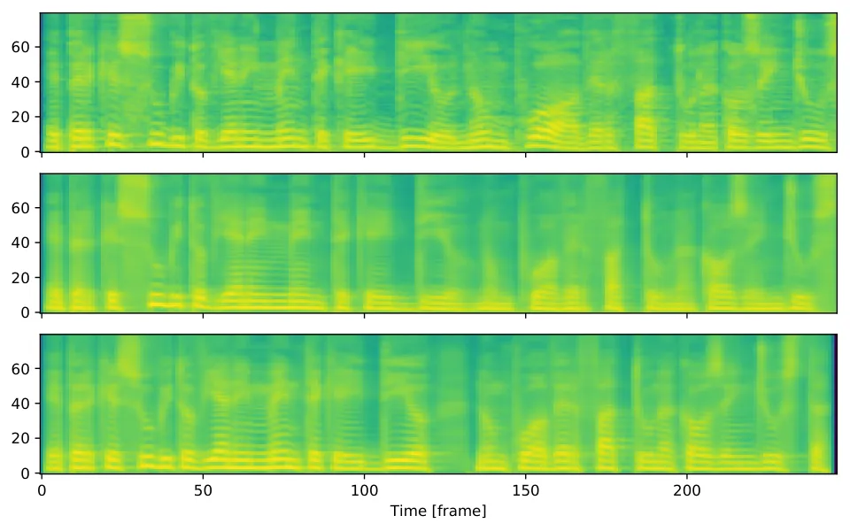
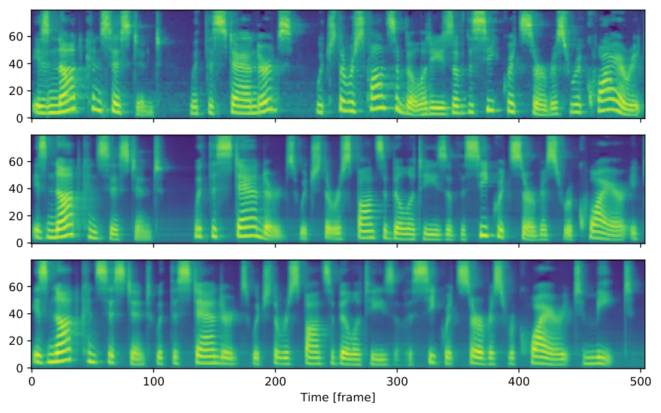

# A Comparative Study on Transformer vs RNN in Speech Applications

Shigeki Karita    (Alphabetical Order) Nanxin Chen    Tomoki Hayashi   
Takaaki Hori    Hirofumi Inaguma    Ziyan Jiang    Masao Someki   
Nelson Enrique Yalta Soplin    Ryuichi Yamamoto    Xiaofei Wang   
Shinji Watanabe    Takenori Yoshimura    Wangyou Zhang

###### Abstract

Sequence-to-sequence models have been widely used in end-to-end speech
processing, for example, automatic speech recognition (ASR), speech
translation (ST), and text-to-speech (TTS). This paper focuses on an
emergent sequence-to-sequence model called Transformer, which achieves
state-of-the-art performance in neural machine translation and other
natural language processing applications. We undertook intensive studies
in which we experimentally compared and analyzed Transformer and
conventional recurrent neural networks (RNN) in a total of 15 ASR, one
multilingual ASR, one ST, and two TTS benchmarks. Our experiments
revealed various training tips and significant performance benefits
obtained with Transformer for each task including the surprising
superiority of Transformer in 13/15 ASR benchmarks in comparison with
RNN. We are preparing to release Kaldi-style reproducible recipes using
open source and publicly available datasets for all the ASR, ST, and TTS
tasks for the community to succeed our exciting outcomes.

###### Index Terms: 

Transformer, Recurrent Neural Networks, Speech Recognition,
Text-to-Speech, Speech Translation

^(†)^(†)address: ¹NTT Communication Science Laboratories, ²Waseda
University, ³Johns Hopkins University,  
⁴LINE Corporation, ⁵Nagoya University, ⁶Human Dataware Lab. Co., Ltd.,  
⁷Mitsubishi Electric Research Laboratories, ⁸Kyoto University, ⁹Shanghai
Jiao Tong University

## 1 Introduction

Transformer is a sequence-to-sequence (S2S) architecture originally
proposed for neural machine translation (NMT) \[1\] that rapidly
replaces recurrent neural networks (RNN) in natural language processing
tasks. This paper provides intensive comparisons of its performance with
that of RNN for speech applications; automatic speech recognition (ASR),
speech translation (ST), and text-to-speech (TTS).

One of the major difficulties when applying Transformer to speech
applications is that it requires more complex configurations (e.g.,
optimizer, network structure, data augmentation) than the conventional
RNN based models. Our goal is to share our knowledge on the use of
Transformer in speech tasks so that the community can fully succeed our
exciting outcomes with reproducible open source tools and recipes.

Currently, existing Transformer-based speech applications \[2, 3, 4\]
still lack an open source toolkit and reproducible experiments while
previous studies in NMT \[5, 6\] provide them. Therefore, we work on an
open community-driven project for end-to-end speech applications using
both Transformer and RNN by following the success of Kaldi for hidden
Markov model (HMM)-based ASR \[7\]. Specifically, our experiments
provide practical guides for tuning Transformer in speech tasks to
achieve state-of-the-art results.

In our speech application experiments, we investigate several aspects of
Transformer and RNN-based systems. For example, we measure the
word/character/regression error from the ground truth, training curve,
and scalability for multiple GPUs.

The contributions of this work are:

- •
  We conduct a larges-scale comparative study on Transformer and RNN
  with significant performance gains especially for the ASR related
  tasks.
- •
  We explain our training tips for Transformer in speech applications:
  ASR, TTS and ST.
- •
  We provide reproducible end-to-end recipes and models pretrained on a
  large number of publicly available datasets in our open source toolkit
  ESPnet \[8\]¹¹ 1
  [https://github.com/espnet/espnet](https://github.com/espnet/espnet).

#### Related studies

As Transformer was originally proposed as an NMT system \[1\], it has
been widely studied on NMT tasks including hyperparameter search \[9\],
parallelism implementation \[5\] and in comparison with RNN \[10\]. On
the other hand, speech processing tasks have just provided their
preliminary results in ASR \[2, 11\], ST \[3\] and TTS \[4\]. Therefore,
this paper aims to gather the previous basic research and to explore
wider topics (e.g., accuracy, speed, training tips) in our experiments.

## 2 Sequence-to-sequence RNN

### 2.1 Unified formulation for S2S

S2S is a variant of neural networks that learns to transform a source
sequence $`X`$ to a target sequence $`Y`$ \[12\]. In Fig. 1, we
illustrate a common S2S structure for ASR, TTS and ST tasks. S2S
consists of two neural networks: an encoder

```math
\displaystyle X_{0} \displaystyle=\textrm{EncPre}(X), \tag{1}
```

```math
\displaystyle X_{e} \displaystyle=\textrm{EncBody}(X_{0}), \tag{2}
```

and a decoder

```math
\displaystyle Y_{0}[1:t-1] \displaystyle=\textrm{DecPre}(Y[1:t-1]), \tag{3}
```

```math
\displaystyle Y_{d}[t] \displaystyle=\textrm{DecBody}(X_{e},Y_{0}[1:t-1]), \tag{4}
```

```math
\displaystyle Y_{\textrm{post}}[1:t] \displaystyle=\textrm{DecPost}(Y_{d}[1:t]), \tag{5}
```

where $`X`$ is the source sequence (e.g., a sequence of speech features
(for ASR and ST) or characters (for TTS)), $`e`$ is the number of layers
in EncBody, $`d`$ is the number of layers in DecBody, $`t`$ is a target
frame index, and all the functions in the above equations are
implemented by neural networks. For the decoder input $`Y[1:t-1]`$, we
use a ground-truth prefix in the training stage, while we use a
generated prefix in the decoding stage. During training, the S2S model
learns to minimize the scalar loss value

```math
\displaystyle L \displaystyle=\textrm{Loss}(Y_{\textrm{post}},Y) \tag{6}
```

between the generated sequence $`Y_{\textrm{post}}`$ and the target
sequence $`Y`$.

The remainder of this section describes RNN-based universal modules:
“EncBody” and “DecBody”. We regard “EncPre”, “DecPre”, “DecPost” and
“Loss” as task-specific modules and we describe them in the later
sections.

### 2.2 RNN encoder

$`\textrm{EncBody}(\cdot)`$ in Eq. (2) transforms a source sequence
$`X_{0}`$ into an intermediate sequence $`X_{e}`$. Existing RNN-based
$`\textrm{EncBody}(\cdot)`$ implementations \[13, 14, 15\] typically
adopt a bi-directional long short-term memory (BLSTM) that can perform
such an operation thanks to its recurrent connection. For ASR, an
encoded sequence $`X_{e}`$ can also be used for source-level frame-wise
prediction using connectionist temporal classification (CTC) \[16\] for
joint training and decoding \[17\].

### 2.3 RNN decoder

$`\textrm{DecBody}(\cdot)`$ in Eq. (4) generates a next target frame
with the encoded sequence $`X_{e}`$ and the prefix of target prefix
$`Y_{0}[1:t-1]`$. For sequence generation, the decoder is mostly
unidirectional. For example, uni-directional LSTM with an attention
mechanism \[13\] is often used in RNN-based $`\textrm{DecBody}(\cdot)`$
implementations. That attention mechanism emits source frame-wise
weights to sum the encoded source frames $`X_{e}`$ as a target
frame-wise vector to be transformed with the prefix $`Y_{0}[0:t-1]`$. We
refer to this type of attention as “encoder-decoder attention”.

Figure 1: Sequence-to-sequence architecture in speech applications.

## 3 Transformer

Transformer learns sequential information via a self-attention mechanism
instead of the recurrent connection employed in RNN. This section
describes the self-attention based modules in Transformer in detail.

### 3.1 Multi-head attention

Transformer consists of multiple dot-attention layers \[18\]:

```math
\displaystyle\mathrm{att}(X^{\text{q}},X^{\text{k}},X^{\text{v}})=\mathrm{softmax}\left(\frac{X^{\text{q}}X^{\text{k}\top}}{\sqrt{d^{\mathrm{att}}}}\right)X^{\text{v}}, \tag{7}
```

where
$`X^{\text{k}},X^{\text{v}}\in\mathbb{R}^{n^{\text{k}}\times d^{\mathrm{att}}}`$
and $`X^{\text{q}}\in\mathbb{R}^{n^{\text{q}}\times d^{\mathrm{att}}}`$
are inputs for this attention layer, $`d^{\mathrm{att}}`$ is the number
of feature dimensions, $`n^{\text{q}}`$ is the length of
$`X^{\text{q}}`$, and $`n^{\text{k}}`$ is the length of $`X^{\text{k}}`$
and $`X^{\text{v}}`$. We refer to $`X^{\text{q}}X^{\text{k}\top}`$ as
the “attention matrix”. Vaswani et al. \[1\] considered these inputs
$`X^{\text{q}},X^{\text{k}}`$ and $`X^{\text{v}}`$ to be a query and a
set of key-value pairs, respectively.

In addition, to allow the model to deal with multiple attentions in
parallel, Vaswani et al. \[1\] extended this attention layer in Eq. (7)
to multi-head attention (MHA):

```math
\displaystyle\mathrm{MHA}(Q,K,V) \displaystyle=[H_{1},H_{2},\dots,H_{d^{\mathrm{head}}}]W^{\mathrm{head}}, \tag{8}
```

```math
\displaystyle H_{h} \displaystyle=\mathrm{att}(QW^{\text{q}}_{h},KW^{\text{k}}_{h},VW^{\text{v}}_{h}), \tag{9}
```

where $`K,V\in\mathbb{R}^{n^{\text{k}}\times d^{\mathrm{att}}}`$ and
$`Q\in\mathbb{R}^{n^{\text{q}}\times d^{\mathrm{att}}}`$ are inputs for
this MHA layer,
$`H_{h}\in\mathbb{R}^{n^{\text{q}}\times d^{\mathrm{att}}}`$ is the
$`h`$-th attention layer output ($`h=1,\dots,d^{\mathrm{head}}`$),
$`W^{\text{q}}_{h},W^{\text{k}}_{h},W^{\text{v}}_{h}\in\mathbb{R}^{d^{\mathrm{att}}\times d^{\mathrm{att}}}`$
and
$`W^{\mathrm{head}}\in\mathbb{R}^{d^{\mathrm{att}}d^{\mathrm{head}}\times d^{\mathrm{att}}}`$
are learnable weight matrices and $`d^{\mathrm{head}}`$ is the number of
attentions in this layer.

### 3.2 Self-attention encoder

We define Transformer-based $`\textrm{EncBody}(\cdot)`$ used for Eq. (2)
unlike the RNN encoder in Section 2.2 as follows:

```math
\displaystyle X_{i}^{\prime} \displaystyle=X_{i}+\mathrm{MHA}_{i}(X_{i},X_{i},X_{i}),
```

```math
\displaystyle X_{i+1} \displaystyle=X_{i}^{\prime}+\mathrm{FF}_{i}(X_{i}^{\prime}), \tag{10}
```

where $`i=0,\dots,e-1`$ is the index of encoder layers, and
$`\mathrm{FF}_{i}`$ is the $`i`$-th two-layer feedforward network:

```math
\displaystyle\mathrm{FF}(X[t])=\mathrm{ReLU}(X[t]W^{\text{ff}}_{1}+b^{\text{ff}}_{1})W^{\text{ff}}_{2}+b^{\text{ff}}_{2}, \tag{11}
```

where $`X[t]\in\mathbb{R}^{d^{\mathrm{att}}}`$ is the $`t`$-th frame of
the input sequence $`X`$,
$`W^{\text{ff}}_{1}\in\mathbb{R}^{d^{\mathrm{att}}\times d^{\mathrm{ff}}},W^{\text{ff}}_{2}\in\mathbb{R}^{d^{\mathrm{ff}}\times d^{\mathrm{att}}}`$
are learnable weight matrices, and
$`b^{\text{ff}}_{1}\in\mathbb{R}^{d^{\mathrm{ff}}},b^{\text{ff}}_{2}\in\mathbb{R}^{d^{\mathrm{att}}}`$
are learnable bias vectors. We refer to
$`\mathrm{MHA}_{i}(X_{i},X_{i},X_{i})`$ in Eq. (10) as “self attention”.

### 3.3 Self-attention decoder

Transformer-based $`\textrm{DecBody}(\cdot)`$ used for Eq. (4) consists
of two attention modules:

```math
\displaystyle Y_{j}[t]^{\prime} \displaystyle=Y_{j}[t]+\mathrm{MHA}^{\mathrm{self}}_{j}(Y_{j}[t],Y_{j}[1:t],Y_{j}[1:t]),
```

```math
\displaystyle Y_{j}^{\prime\prime} \displaystyle=Y_{j}+\mathrm{MHA}^{\mathrm{src}}_{j}(Y^{\prime}_{j},X_{e},X_{e}),
```

```math
\displaystyle Y_{j+1} \displaystyle=Y_{j}^{\prime\prime}+\mathrm{FF}_{j}(Y_{j}^{\prime\prime}), \tag{12}
```

where $`j=0,\dots,d-1`$ is the index of the decoder layers. We refer to
the attention matrix between the decoder input and the encoder output in
$`\mathrm{MHA}^{\mathrm{src}}_{j}(Y^{\prime}_{j},X_{e},X_{e})`$ as
“encoder-decoder attention’ as same as the one in RNN in Sec 2.3.
Because the unidirectional decoder is useful for sequence generation,
its attention matrices at the $`t`$-th target frame are masked so that
they do not connect with future frames later than $`t`$. This masking of
the sequence can be done in parallel using an elementwise product with a
triangular binary matrix. Because it requires no sequential operation,
it provides a faster implementation than RNN.

### 3.4 Positional encoding

To represent the time location in the non-recurrent model, Transformer
adopts sinusoidal positional encoding:

```math
\displaystyle\mathrm{PE}[t]=\begin{cases}\sin{\frac{t}{10000^{t/d^{\mathrm{att}}}}}&\text{if $t$ is even},\\
\cos{\frac{t}{10000^{t/d^{\mathrm{att}}}}}&\text{if $t$ is odd}.\end{cases} \tag{13}
```

The input sequences $`X_{0},Y_{0}`$ are concatenated with
$`(\textrm{PE}[1],\textrm{PE}[2],\dots)`$ before
$`\textrm{EncBody}(\cdot)`$ and $`\textrm{DecBody}(\cdot)`$ modules.

## 4 ASR extensions

In our ASR framework, the S2S predicts a target sequence $`Y`$ of
characters or SentencePiece \[19\] from an input sequence
$`X^{\mathrm{fbank}}`$ of log-mel filterbank speech features.

### 4.1 ASR encoder architecture

The source $`X`$ in ASR is represented as a sequence of 83-dim log-mel
filterbank frames with pitch features \[20\]. First,
$`\textrm{EncPre}(\cdot)`$ transforms the source sequence $`X`$ into a
subsampled sequence
$`X_{0}\in\mathbb{R}^{n^{\textrm{sub}}\times d^{\textrm{att}}}`$ by
using two-layer CNN with 256 channels, stride size 2 and kernel size 3
in \[2\], or VGG-like max pooling in \[21\], where $`n^{\mathrm{sub}}`$
is the length of the output sequence of the CNN. This CNN corresponds to
$`\textrm{EncPre}(\cdot)`$ in Eq. (1). Then, $`\textrm{EncBody}(\cdot)`$
transforms $`X_{0}`$ into a sequence of encoded features
$`X_{e}\in\mathbb{R}^{n^{\mathrm{sub}}\times d^{\mathrm{att}}}`$ for the
CTC and decoder networks.

### 4.2 ASR decoder architecture

The decoder network receives the encoded sequence $`X_{e}`$ and the
prefix of a target sequence $`Y[1:t-1]`$ of token IDs: characters or
SentencePiece \[19\]. First, $`\textrm{DecPre}(\cdot)`$ in Eq. (3)
embeds the tokens into learnable vectors. Next,
$`\textrm{DecBody}(\cdot)`$ and single-linear layer
$`\textrm{DecPost}(\cdot)`$ predicts the posterior distribution of the
next token prediction $`Y_{\textrm{post}}[t]`$ given $`X_{e}`$ and
$`Y[1:t-1]`$.

### 4.3 ASR training and decoding

During ASR training, both the decoder and the CTC module predict the
frame-wise posterior distribution of $`Y`$ given corresponding source
$`X`$: $`p_{\mathrm{s2s}}(Y|X)`$ and $`p_{\mathrm{ctc}}(Y|X)`$,
respectively. We simply use the weighted sum of those negative log
likelihood values:

```math
\displaystyle L^{\mathrm{ASR}}=-\alpha\log p_{\mathrm{s2s}}(Y|X)-(1-\alpha)\log p_{\mathrm{ctc}}(Y|X), \tag{14}
```

where $`\alpha`$ is a hyperparameter.

In the decoding stage, the decoder predicts the next token given the
speech feature $`X`$ and the previous predicted tokens using beam
search, which combines the scores of S2S, CTC and the RNN language model
(LM) \[22\] as follows:

```math
\displaystyle\hat{Y}=\mathop{\mathrm{}}{argmax}\limits_{Y\in\mathcal{Y}^{*}}\,\{\lambda\log p_{\mathrm{s2s}}(Y|X_{e}) \displaystyle+(1-\lambda)\log p_{\mathrm{ctc}}(Y|X_{e})
```

```math
\displaystyle+\gamma\log p_{\mathrm{lm}}(Y)\}, \tag{15}
```

where $`\mathcal{Y}^{*}`$ is a set of hypotheses of the target sequence,
and $`\gamma,\lambda`$ are hyperparameters.

## 5 ST extensions

In ST, S2S receives the same source speech feature and target token
sequences in ASR but the source and target languages are different. Its
modules are also defined in the same ways as in ASR. However, ST cannot
cooperate with the CTC module introduced in Section 4.3 because the
translation task does not guarantee the monotonic alignment of the
source and target sequences unlike ASR \[23\].

## 6 TTS extensions

In the TTS framework, the S2S generates a sequence of log-mel filterbank
features and predicts the probabilities of the end of sequence (EOS)
given an input character sequence \[15\].

### 6.1 TTS encoder architecture

The input of the encoder in TTS is a sequence of IDs corresponding to
the input characters and the EOS symbol. First, the character ID
sequence is converted into a sequence of character vectors with an
embedding layer, and then the positional encoding scaled by a learnable
scalar parameter is added to the vectors \[4\]. This process is a TTS
implementation of $`\textrm{EncPre}(\cdot)`$ in Eq. (1). Finally, the
encoder $`\textrm{EncBody}(\cdot)`$ in Eq. (2) transforms this input
sequence into a sequence of encoded features for the decoder network.

### 6.2 TTS decoder architecture

The inputs of the decoder in TTS are a sequence of encoder features and
a sequence of log-mel filterbank features. In training, ground-truth
log-mel filterbank features are used with an teacher-forcing manner
while in inference, predicted ones are used with an autoregressive
manner.

First, the target sequence of 80-dim log-mel filterbank features is
converted into a sequence of hidden features by Prenet \[15\] as a TTS
implementation of $`\textrm{DecPre}(\cdot)`$ in Eq. (3). This network
consists of two linear layers with 256 units, a ReLU activation
function, and dropout followed by a projection linear layer with
$`d^{\textrm{att}}`$ units. Since it is expected that the hidden
representations converted by Prenet are located in the similar feature
space to that of encoder features, Prenet helps to learn a diagonal
encoder-decoder attention \[4\]. Then the decoder
$`\textrm{DecBody}(\cdot)`$ in Eq. (4), whose architecture is the same
as the encoder, transforms the sequence of encoder features and that of
hidden features into a sequence of decoder features. Two linear layers
are applied for each frame of $`Y_{d}`$ to calculate the target feature
and the probability of the EOS, respectively. Finally, Postnet \[15\] is
applied to the sequence of predicted target features to predict its
components in detail. Postnet is a five-layer CNN, each layer of which
is a 1d convolution with 256 channels and a kernel size of 5 followed by
batch normalization, a tanh activation function, and dropout. These
modules are a TTS implementation of $`\textrm{DecPost}(\cdot)`$ in
Eq. (5).

### 6.3 TTS training and decoding

In TTS training, the whole network is optimized to minimize two loss
functions in TTS; 1) L1 loss for the target features and 2) binary cross
entropy (BCE) loss for the probability of the EOS. To address the issue
of class imbalance in the calculation of the BCE, a constant weight
(e.g. 5) is used for a positive sample \[4\].

Additionally, we apply a guided attention loss \[24\] to accelerate the
learning of diagonal attention to only the two heads of two layers from
the target side. This is because it is known that the encoder-decoder
attention matrices are diagonal in only certain heads of a few layers
from the target side \[4\]. We do not introduce any hyperparameters to
balance the three loss values. We simply add them all together.

In inference, the network predicts the target feature of the next frame
in an autoregressive manner. And if the probability of the EOS becomes
higher than a certain threshold (e.g. 0.5), the network will stop the
prediction.

## 7 ASR Experiments

### 7.1 Dataset

In Table 1, we summarize the 15 datasets we used in our ASR experiment.
Our experiment covered various topics in ASR including recording (clean,
noisy, far-field, etc), language (English, Japanese, Mandarin Chinese,
Spanish, Italian) and size (10 - 960 hours). Except for JSUT \[25\] and
Fisher-CALLHOME Spanish, our data preparation scripts are based on
Kaldi’s “s5x” recipe \[7\]. Technically, we tuned all the configurations
(e.g., feature extraction, SentencePiece \[19\], language modeling,
decoding, data augmentation \[26, 27\]) except for the training stage to
their optimum in the existing RNN-based system. We used data
augmentation for several corpora. For example, we applied speed
perturbation \[27\] at ratio 0.9, 1.0 and 1.1 to CSJ, CHiME4,
Fisher-CALLHOME Spanish, HKUST, and TED-LIUM2/3, and we also applied
SpecAugment \[26\] to Aurora4, LibriSpeech, TED-LIUM2/3 and WSJ.²² 2 We
chose datasets to apply these data augmentation methods by preliminary
experiments with our RNN-based system.

|                         |          |       |                                         |                                                 |
| ----------------------- | -------- | ----- | --------------------------------------- | ----------------------------------------------- |
| dataset                 | language | hours | speech                                  | test sets                                       |
| AISHELL \[28\]          | zh       | 170   | read                                    | dev / test                                      |
| AURORA4 \[29\] (\*)     | en       | 15    | noisy read                              | (dev_0330) A / B / C / D                        |
| CSJ \[30\]              | ja       | 581   | spontaneous                             | eval1 / eval2 / eval3                           |
| CHiME4 \[31\] (\*)      | en       | 108   | noisy far-field multi-ch read           | dt05_simu / dt05_real / et05_simu / et05_real   |
| CHiME5 \[32\]           | en       | 40    | noisy far-field multi-ch conversational | dev_worn / kinect                               |
| Fisher-CALLHOME Spanish | es       | 170   | telephone conversational                | dev / dev2 / test / devtest / evltest           |
| HKUST \[33\]            | zh       | 200   | telephone conversational                | dev                                             |
| JSUT \[25\]             | ja       | 10    | read                                    | (our split)                                     |
| LibriSpeech \[34\]      | en       | 960   | clean/noisy read                        | dev_clean / dev_other / test_clean / test_other |
| REVERB \[35\] (\*)      | en       | 124   | far-field multi-ch read                 | et_near / et_far                                |
| SWITCHBOARD \[36\]      | en       | 260   | telephone conversational                | (eval2000) callhm / swbd                        |
| TED-LIUM2 \[37\]        | en       | 118   | spontaneous                             | dev / test                                      |
| TED-LIUM3 \[38\]        | en       | 452   | spontaneous                             | dev / test                                      |
| VoxForge \[39\]         | it       | 16    | read                                    | (our split)                                     |
| WSJ \[40\]              | en       | 81    | read                                    | dev93 / eval92                                  |

Table 1: ASR dataset description. Names listed in “test sets” correspond
to ASR results in Table 2. We enlarged corpora marked with (\*) by the
external WSJ train_si284 dataset (81 hours).

### 7.2 Settings

We adopted the same architecture for Transformer in \[41\]
($`e=12,d=6,d^{\textrm{ff}}=2048,d^{\textrm{head}}=4,d^{\textrm{att}}=256`$)
for every corpus except for the largest, LibriSpeech
($`d^{\textrm{head}}=8,d^{\textrm{att}}=512`$). For RNN, we followed our
existing best architecture configured on each corpus as in previous
studies \[17, 42\].

Transformer requires a different optimizer configuration from RNN
because Transformer’s training iteration is eight times faster and its
update is more fine-grained than RNN. For RNN, we followed existing best
systems for each corpus using Adadelta \[43\] with early stopping. To
train Transformer, we basically followed the previous literature \[2\]
(e.g., dropout, learning rate, warmup steps). We did not use development
sets for early stopping in Transformer. We simply ran 20 – 200 epochs
(mostly 100 epochs) and averaged the model parameters stored at the last
10 epochs as the final model.

We conducted our training on a single GPU for larger corpora such as
LibriSpeech, CSJ and TED-LIUM3. We also confirmed that the emulation of
multiple GPUs using accumulating gradients over multiple
forward/backward steps \[5\] could result in similar performance with
those corpora. In the decoding stage, Transformer and RNN share the same
configuration for each corpus, for example, beam size (e.g., 20 – 40),
CTC weight $`\lambda`$ (e.g., 0.3), and LM weight $`\gamma`$ (e.g., 0.3
– 1.0) introduced in Section 4.3.

### 7.3 Results

Table 2 summarizes the ASR results in terms of character/word error rate
(CER/WER) on each corpora. It shows that Transformer outperforms RNN on
13/15 corpora in our experiment. Although our system has no
pronunciation dictionary, part-of-speech tag nor alignment-based data
cleaning unlike Kaldi, our Transformer provides comparable CER/WERs to
the HMM-based system, Kaldi on 7/12 corpora. We conclude that
Transformer has ability to outperform the RNN-based end-to-end system
and the DNN/HMM-based system even in low resource (JSUT), large resource
(LibriSpeech, CSJ), noisy (AURORA4) and far-field (REVERB) tasks.
Table 3 also summarizes the LibriSpeech ASR benchmark with ours and
other reports because it is one of the most competitive task. Our
transformer results are comparable to the best performance in \[44, 45,
26\].

Fig. 2 shows an ASR training curve obtained with multiple GPUs on
LibriSpeech. We observed that Transformer trained with a larger
minibatch became more accurate while RNN did not. On the other hand,
when we use a smaller minibatch for Transformer, it typically became
under-fitted after the warmup steps. In this task, Transformer achieved
the best accuracy provided by RNN about eight times faster than RNN with
a single GPU.

Figure 2: ASR training curve with LibriSpeech dataset. Minibatches had
the maximum number of utterances for each models on GPUs.

|                         |       |       |                              |                                  |                                  |
| ----------------------- | ----- | ----- | ---------------------------- | -------------------------------- | -------------------------------- |
| dataset                 | token | error | Kaldi (s5)                   | ESPnet RNN (ours)                | ESPnet Transformer (ours)        |
| AISHELL                 | char  | CER   | N/A / 7.4                    | 6.8 / 8.0                        | 6.0 / 6.7                        |
| AURORA4                 | char  | WER   | (\*) 3.6 / 7.7 / 10.0 / 22.3 | 3.5 / 6.4 / 5.1 / 12.3           | 3.3 / 6.0 / 4.5 / 10.6           |
| CSJ                     | char  | CER   | (\*) 7.5 / 6.3 / 6.9         | 6.6 / 4.8 / 5.0                  | 5.7 / 4.1 / 4.5                  |
| CHiME4                  | char  | WER   | 6.8 / 5.6 / 12.1 / 11.4      | 9.5 / 8.9 / 18.3 / 16.6          | 9.6 / 8.2 / 15.7 / 14.5          |
| CHiME5                  | char  | WER   | 47.9 / 81.3                  | 59.3 / 88.1                      | 60.2 / 87.1                      |
| Fisher-CALLHOME Spanish | char  | WER   | N/A                          | 27.9 / 27.8 / 25.4 / 47.2 / 47.9 | 27.0 / 26.3 / 24.4 / 45.3 / 46.2 |
| HKUST                   | char  | CER   | 23.7                         | 27.4                             | 23.5                             |
| JSUT                    | char  | CER   | N/A                          | 20.6                             | 18.7                             |
| LibriSpeech             | BPE   | WER   | 3.9 / 10.4 / 4.3 / 10.8      | 3.1 / 9.9 / 3.3 / 10.8           | 2.2 / 5.6 / 2.6 / 5.7            |
| REVERB                  | char  | WER   | 18.2 / 19.9                  | 24.1 / 27.2                      | 15.5 / 19.0                      |
| SWITCHBOARD             | BPE   | WER   | 18.1 / 8.8                   | 28.5 / 15.6                      | 18.1 / 9.0                       |
| TED-LIUM2               | BPE   | WER   | 9.0 / 9.0                    | 11.2 / 11.0                      | 9.3 / 8.1                        |
| TED-LIUM3               | BPE   | WER   | 6.2 / 6.8                    | 14.3 / 15.0                      | 9.7 / 8.0                        |
| VoxForge                | char  | CER   | N/A                          | 12.9 / 12.6                      | 9.4 / 9.1                        |
| WSJ                     | char  | WER   | 4.3 / 2.3                    | 7.0 / 4.7                        | 6.8 / 4.4                        |

Table 2: ASR results of char/word error rates. Results marked with (\*)
were evaluated in our environment because the official results were not
provided. Kaldi official results were retrieved from the version
“c7876a33”.

|                           |           |           |            |            |
| ------------------------- | --------- | --------- | ---------- | ---------- |
|                           | dev_clean | dev_other | test_clean | test_other |
| RWTH (E2E) \[44\]         | 2.9       | 8.8       | 3.1        | 9.8        |
| RWTH (HMM) \[45\]         | 2.3       | 5.2       | 2.7        | 5.7        |
| Google SpecAug. \[26\]    | N/A       | N/A       | 2.5        | 5.8        |
| ESPnet Transformer (ours) | 2.2       | 5.6       | 2.6        | 5.7        |

Table 3: Comparison of the Librispeech ASR benchmark

### 7.4 Discussion

We summarize the training tips we observed in our experiment:

- •
  When Transformer suffers from under-fitting, we recommend increasing
  the minibatch size because it also results in a faster training time
  and better accuracy simultaneously unlike any other hyperparameters.
- •
  The accumulating gradient strategy \[5\] can be adopted to emulate the
  large minibatch if multiple GPUs are unavailable.
- •
  While dropout did not improve the RNN results, it is essential for
  Transformer to avoid over-fitting.
- •
  We tried several data augmentation methods \[27, 26\]. They greatly
  improved both Transformer and RNN.
- •
  The best decoding hyperparameters $`\gamma,\lambda`$ for RNN are
  generally the best for Transformer.

Transformer’s weakness is decoding. It is much slower than Kaldi’s
system because the self-attention requires $`O(n^{2})`$ in a naive
implementation, where $`n`$ is the speech length. To directly compare
the performance with DNN-HMM based ASR systems, we need to develop a
faster decoding algorithm for Transformer.

## 8 Multilingual ASR Experiments

This section compares the ASR performance of RNN and Transformer in a
multilingual setup given the success of Transformer for the monolingual
ASR tasks in the previous section. In accordance with \[46\], we
prepared 10 different languages, namely WSJ (English), CSJ (Japanese)
\[30\], HKUST \[33\] (Mandarin Chinese), and VoxForge (German, Spanish,
French, Italian, Dutch, Portuguese, Russian). The model is based on a
single multilingual model, where the parameters are shared across all
the languages and whose output units include the graphemes of all 10
languages (totally 5,297 graphemes and special symbols). We used a
default setup for both RNN and Transformer introduced in Section 7.2
without RNNLM shallow fusion \[21\].

Figure 3: Comparison of multilingual end-to-end ASR with the RNN in
Watanabe et al. \[46\], ESPnet RNN, and ESPnet Transformer.

Figure 3 clearly shows that our Transformer significantly outperformed
our RNN in 9 languages. It realized a more than 10% relative improvement
in 8 languages and with the largest value of 28.0% for relative
improvement in VoxForge Italian. When compared with the RNN result
reported in \[46\], which used a deeper BLSTM (7 layer) and RNNLM, our
Transformer still provided superior performance in 9 languages. From
this result, we can conclude that Transformer also outperforms RNN in
multilingual end-to-end ASR.

## 9 Speech Translation Experiments

Our baseline end-to-end ST RNN is based on \[23\], which is similar to
the RNN structure used in our ASR system, but we did not use a
convolutional LSTM layer in the original paper. The configuration of our
ST Transformer was the same as that of our ASR system.

We conducted our ST experiment on the Fisher-CALLHOME English–Spanish
corpus \[47\]. Our Transformer improved the BLEU score to 17.2 from our
RNN baseline BLEU 16.5 on the CALLHOME “evltest” set. While training
Transformer, we observed more serious under-fitting than with RNN. The
solution for this is to use the pretrained encoder from our ASR
experiment since the ST dataset contains Fisher-CALLHOME Spanish corpus
used in our ASR experiment.

## 10 TTS Experiments

### 10.1 Settings

Our baseline RNN-based TTS model is Tacotron 2 \[15\]. We followed its
model and optimizer setting. We reuse existing TTS recipes including
those for data preparation and waveform generation that we configured to
be the best for RNN. We configured our Transformer-based configurations
introduced in Section 3 as follows:
$`e=6,d=6,d^{\textrm{att}}=384,d^{\textrm{ff}}=1536,d^{\textrm{head}}=4`$.
The input for both systems was the sequence of characters.

### 10.2 Results

We compared Transformer and RNN based TTS using two corpora:
M-AILABS \[48\] (Italian, 16 kHz, 31 hours) and LJSpeech \[49\]
(English, 22 kHz, 24 hours). A single Italian male speaker (Riccardo)
was used in the case of M-AILABS. Figures  4 and 5 show training curves
in the two corpora. In these figures, Transformer and RNN provide
similar L1 loss convergence. As seen in ASR, we observed that a larger
minibatch results in better validation L1 loss for Transformer and
faster training, while it has a detrimental effect on the L1 loss for
RNN. We also provide generated speech mel-spectrograms in Fig. 6 and 7³³
3 Our audio samples generated by Tacotron 2, Transformer, and FastSpeech
are available at [https://bit.ly/329gif5](https://bit.ly/329gif5). We
conclude that Transformer-based TTS can achieve almost the same
performance as RNN-based.

Figure 4: TTS training curve on M-AILABS.

Figure 5: TTS training curve on LJSpeech.

### 10.3 Discussion

Our lessons for training Transformer in TTS are as follows:

- •
  It is possible to accelerate TTS training by using a large minibatch
  as well as ASR if a lot of GPUs are available.
- •
  The validation loss value, especially BCE loss, could be over-fitted
  more easily with Transformer. We recommend monitoring attention maps
  rather than the loss when checking its convergence.
- •
  Some heads of attention maps in Transformer are not always diagonal as
  found with Tacotron 2. We needed to select where to apply the guided
  attention loss \[24\].
- •
  Decoding filterbank features with Transformer is also slower than with
  RNN (6.5 ms vs 78.5 ms per frame, on CPU w/ single thread). We also
  tried FastSpeech \[50\], which realizes non-autoregressive
  Transformer-based TTS. It greatly improves the decoding speed (0.6 ms
  per frame, on CPU w/ single thread) and generates comparable quality
  of speech with the autoregressive Transformer.
- •
  A reduction factor introduced in \[51\] was also effective for
  Transformer. It can greatly reduce training and inference time but
  slightly degrades the quality.

As future work, we need further investigation of the trade off between
training speed and quality, and the introduction of ASR techniques
(e.g., data augmentation, speech enhancement) for TTS.



Figure 6: Samples of mel-spectrograms on M-AILABs. (top) ground-truth,
(middle) Tacotron 2 sample, (bottom) Transformer sample. The input text
is “E PERCHÈ SUBITO VIENE IN MENTE CHE IDDIO NON PUÒ AVER FATTO UNA COSA
INGIUSTA”.



Figure 7: Samples of mel-spectrograms on LJSpeech. (top) ground-truth,
(middle) Tacotron 2 sample, (bottom) Transformer sample. The input text
is “IS NOT CONSISTENT WITH THE STANDARDS WHICH THE RESPONSIBILITIES OF
THE SECRET SERVICE REQUIRE IT TO MEET.”.

## 11 Summary

We presented a comparative study of Transformer and RNN in speech
applications with various corpora, namely ASR (15 monolingual + one
multilingual), ST (one corpus), and TTS (two corpora). In our
experiments on these tasks, we obtained the promising results including
huge improvements in many ASR tasks and explained how we improved our
models. We believe that the reproducible recipes, pretrained models and
training tips described in this paper will accelerate Transformer
research directions on speech applications.

## 12 References

## References

- \[1\] Ashish Vaswani et al. “Attention is All you Need” In _Advances
  in Neural Information Processing Systems 30_, 2017, pp. 5998–6008 URL:
  [http://papers.nips.cc/paper/7181-attention-is-all-you-need.pdf](http://papers.nips.cc/paper/7181-attention-is-all-you-need.pdf)
- \[2\] L. Dong, S. Xu and B. Xu “Speech-Transformer: A No-Recurrence
  Sequence-to-Sequence Model for Speech Recognition” In _ICASSP_, 2018,
  pp. 5884–5888 DOI:
  [10.1109/ICASSP.2018.8462506](https://dx.doi.org/10.1109/ICASSP.2018.8462506)
- \[3\] Laura Cross Vila, Carlos Escolano, José.. Fonollosa and Marta R.
  Costa-Jussà “End-to-End Speech Translation with the Transformer” In
  _Proc. IberSPEECH 2018_, 2018, pp. 60–63 DOI:
  [10.21437/IberSPEECH.2018-13](https://dx.doi.org/10.21437/IberSPEECH.2018-13)
- \[4\] Naihan Li et al. “Neural Speech Synthesis with Transformer
  Network” In _The AAAI Conference on Artificial Intelligence (AAAI)_,
  2019
- \[5\] Myle Ott, Sergey Edunov, David Grangier and Michael Auli
  “Scaling Neural Machine Translation” In _Proceedings of the Third
  Conference on Machine Translation: Research Papers_, 2018, pp. 1–9
  URL:
  [https://www.aclweb.org/anthology/W18-6301](https://www.aclweb.org/anthology/W18-6301)
- \[6\] Ashish Vaswani et al. “Tensor2Tensor for Neural Machine
  Translation” In _Proceedings of the 13th Conference of the Association
  for Machine Translation in the Americas_, 2018, pp. 193–199 URL:
  [http://aclweb.org/anthology/W18-1819](http://aclweb.org/anthology/W18-1819)
- \[7\] Daniel Povey et al. “The Kaldi Speech Recognition Toolkit” In
  _IEEE 2011 Workshop on Automatic Speech Recognition and
  Understanding_, 2011
- \[8\] Shinji Watanabe et al. “ESPnet: End-to-End Speech Processing
  Toolkit” In _Proc. Interspeech_, 2018, pp. 2207–2211 DOI:
  [10.21437/Interspeech.2018-1456](https://dx.doi.org/10.21437/Interspeech.2018-1456)
- \[9\] Martin Popel and Ondrej Bojar “Training Tips for the Transformer
  Model” In _Prague Bull. Math. Linguistics_ 110, 2018, pp. 43–70 URL:
  [http://ufal.mff.cuni.cz/pbml/110/art-popel-bojar.pdf](http://ufal.mff.cuni.cz/pbml/110/art-popel-bojar.pdf)
- \[10\] Surafel Lakew, Mauro Cettolo and Marcello Federico “A
  Comparison of Transformer and Recurrent Neural Networks on
  Multilingual Neural Machine Translation” In _Proceedings of the 27th
  International Conference on Computational Linguistics_, 2018, pp.
  641–652 URL:
  [https://www.aclweb.org/anthology/C18-1054](https://www.aclweb.org/anthology/C18-1054)
- \[11\] Shiyu Zhou, Linhao Dong, Shuang Xu and Bo Xu “Syllable-Based
  Sequence-to-Sequence Speech Recognition with the Transformer in
  Mandarin Chinese” In _Proc. Interspeech_, 2018, pp. 791–795 DOI:
  [10.21437/Interspeech.2018-1107](https://dx.doi.org/10.21437/Interspeech.2018-1107)
- \[12\] Ilya Sutskever, Oriol Vinyals and Quoc Le “Sequence to Sequence
  Learning with Neural Networks” In _Advances in Neural Information
  Processing Systems 27_, 2014, pp. 3104–3112 URL:
  [http://papers.nips.cc/paper/5346-sequence-to-sequence-learning-with-neural-networks.pdf](http://papers.nips.cc/paper/5346-sequence-to-sequence-learning-with-neural-networks.pdf)
- \[13\] Dzmitry Bahdanau, Kyunghyun Cho and Yoshua Bengio “Neural
  Machine Translation by Jointly Learning to Align and Translate” In
  _International Conference on Learning Representations_, 2015 URL:
  [http://arxiv.org/abs/1409.0473](http://arxiv.org/abs/1409.0473)
- \[14\] William Chan, Navdeep Jaitly, Quoc Le and Oriol Vinyals
  “Listen, attend and spell: A neural network for large vocabulary
  conversational speech recognition” In _ICASSP_ 2016-May, 2016, pp.
  4960–4964 DOI:
  [10.1109/ICASSP.2016.7472621](https://dx.doi.org/10.1109/ICASSP.2016.7472621)
- \[15\] Jonathan Shen et al. “Natural TTS Synthesis by Conditioning
  Wavenet on MEL Spectrogram Predictions” In _ICASSP_, 2018, pp.
  4779–4783
- \[16\] Alex Graves, Santiago Fernández, Faustino. Gomez and Jürgen
  Schmidhuber “Connectionist temporal classification: labelling
  unsegmented sequence data with recurrent neural networks” In _ICML_
  148, ACM International Conference Proceeding Series, 2006, pp. 369–376
- \[17\] Takaaki Hori, Jaejin Cho and Shinji Watanabe “End-to-end Speech
  Recognition With Word-Based Rnn Language Models” In _2018 IEEE Spoken
  Language Technology Workshop, SLT 2018, Athens, Greece, December
  18-21, 2018_, 2018, pp. 389–396 DOI:
  [10.1109/SLT.2018.8639693](https://dx.doi.org/10.1109/SLT.2018.8639693)
- \[18\] Thang Luong, Hieu Pham and Christopher. Manning “Effective
  Approaches to Attention-based Neural Machine Translation” In
  _Proceedings of the 2015 Conference on Empirical Methods in Natural
  Language Processing_, 2015, pp. 1412–1421 DOI:
  [10.18653/v1/D15-1166](https://dx.doi.org/10.18653/v1/D15-1166)
- \[19\] Taku Kudo and John Richardson “SentencePiece: A simple and
  language independent subword tokenizer and detokenizer for Neural Text
  Processing” In _Proceedings of the 2018 Conference on Empirical
  Methods in Natural Language Processing: System Demonstrations_, 2018,
  pp. 66–71 URL:
  [https://www.aclweb.org/anthology/D18-2012](https://www.aclweb.org/anthology/D18-2012)
- \[20\] P. Ghahremani et al. “A pitch extraction algorithm tuned for
  automatic speech recognition” In _ICASSP_, 2014, pp. 2494–2498 DOI:
  [10.1109/ICASSP.2014.6854049](https://dx.doi.org/10.1109/ICASSP.2014.6854049)
- \[21\] Takaaki Hori, Shinji Watanabe, Yu Zhang and William Chan
  “Advances in Joint CTC-Attention Based End-to-End Speech Recognition
  with a Deep CNN Encoder and RNN-LM” In _Proc. Interspeech_, 2017, pp.
  949–953 URL:
  [http://www.isca-speech.org/archive/Interspeech](http://www.isca-speech.org/archive/Interspeech)
- \[22\] T Mikolov et al. “Recurrent Neural Network based Language
  Model” In _Proc. Interspeech_, 2010, pp. 1045–1048
- \[23\] Ron. Weiss et al. “Sequence-to-Sequence Models Can Directly
  Translate Foreign Speech” In _Proc. Interspeech_, 2017, pp. 2625–2629
  DOI:
  [10.21437/Interspeech.2017-503](https://dx.doi.org/10.21437/Interspeech.2017-503)
- \[24\] Hideyuki Tachibana, Katsuya Uenoyama and Shunsuke Aihara
  “Efficiently trainable text-to-speech system based on deep
  convolutional networks with guided attention” In _ICASSP_, 2018, pp.
  4784–4788 IEEE
- \[25\] Ryosuke Sonobe, Shinnosuke Takamichi and Hiroshi Saruwatari
  “JSUT corpus: free large-scale Japanese speech corpus for end-to-end
  speech synthesis” In _CoRR_ abs/1711.00354, 2017 arXiv:
  [http://arxiv.org/abs/1711.00354](http://arxiv.org/abs/1711.00354)
- \[26\] D.. Park et al. “SpecAugment: A Simple Data Augmentation Method
  for Automatic Speech Recognition” In _arXiv_, 2019
- \[27\] Tom Ko, Vijayaditya Peddinti, Daniel Povey and Sanjeev
  Khudanpur “Audio augmentation for speech recognition” In _Sixteenth
  Annual Conference of the International Speech Communication
  Association_, 2015
- \[28\] H. Bu et al. “AISHELL-1: An open-source Mandarin speech corpus
  and a speech recognition baseline” In _2017 20th Conference of the
  Oriental Chapter of the International Coordinating Committee on Speech
  Databases and Speech I/O Systems and Assessment (O-COCOSDA)_, 2017,
  pp. 1–5 DOI:
  [10.1109/ICSDA.2017.8384449](https://dx.doi.org/10.1109/ICSDA.2017.8384449)
- \[29\] David Pearce and J Picone “Aurora working group: DSR front end
  LVCSR evaluation AU/384/02” In _Inst. for Signal & Inform. Process.,
  Mississippi State Univ., Tech. Rep_, 2002
- \[30\] Kikuo Maekawa, Hanae Koiso, Sadaoki Furui and Hitoshi Isahara
  “Spontaneous Speech Corpus of Japanese” In _Proceedings of the Second
  International Conference on Language Resources and Evaluation
  (LREC’00)_, 2000 URL:
  [http://www.lrec-conf.org/proceedings/lrec2000/pdf/262.pdf](http://www.lrec-conf.org/proceedings/lrec2000/pdf/262.pdf)
- \[31\] Jon Barker, Ricard Marxer, Emmanuel Vincent and Shinji Watanabe
  “The third CHiME speech separation and recognition challenge: Analysis
  and outcomes” In _Computer Speech & Language_ 46, 2017, pp. 605–626
- \[32\] Jon Barker, Shinji Watanabe, Emmanuel Vincent and Jan Trmal
  “The Fifth ’CHiME’ Speech Separation and Recognition Challenge:
  Dataset, Task and Baselines” In _Proc. Interspeech_, 2018, pp.
  1561–1565 DOI:
  [10.21437/Interspeech.2018-1768](https://dx.doi.org/10.21437/Interspeech.2018-1768)
- \[33\] Yi Liu et al. “HKUST/MTS: A Very Large Scale Mandarin Telephone
  Speech Corpus” In _Chinese Spoken Language Processing_, 2006, pp.
  724–735
- \[34\] Vassil Panayotov, Guoguo Chen, Daniel Povey and Sanjeev
  Khudanpur “LibriSpeech: An ASR corpus based on public domain audio
  books” In _ICASSP_, 2015, pp. 5206–5210
- \[35\] Keisuke Kinoshita et al. “The REVERB Challenge: A Benchmark
  Task for Reverberation-Robust ASR Techniques” In _New Era for Robust
  Speech Recognition: Exploiting Deep Learning_, 2017, pp. 345–354 DOI:
  [10.1007/978-3-319-64680-0˙15](https://dx.doi.org/10.1007/978-3-319-64680-0_15)
- \[36\] J. Godfrey, E. Holliman and J. McDaniel “SWITCHBOARD: telephone
  speech corpus for research and development” In _ICASSP_ 1, 1992, pp.
  517–520
- \[37\] Anthony Rousseau, Paul Deleglise and Yannick Esteve “TED-LIUM:
  an automatic speech recognition dedicated corpus” In _Proceedings of
  the Eighth International Conference on Language Resources and
  Evaluation (LREC’12)_, 2012
- \[38\] Francois Hernandez et al. “TED-LIUM 3: Twice as Much Data and
  Corpus Repartition for Experiments on Speaker Adaptation” In _Speech
  and Computer_, 2018, pp. 198–208
- \[39\] “VoxForge”, [http://www.voxforge.org](http://www.voxforge.org)
- \[40\] Douglas. Paul and Janet. Baker “The Design for the Wall Street
  Journal-based CSR Corpus” In _Proceedings of the Workshop on Speech
  and Natural Language_, HLT ’91, 1992, pp. 357–362 DOI:
  [10.3115/1075527.1075614](https://dx.doi.org/10.3115/1075527.1075614)
- \[41\] Shigeki Karita et al. “Improving Transformer-Based End-to-End
  Speech Recognition with Connectionist Temporal Classification and
  Language Model Integration” In _Proc. Interspeech_, 2019, pp.
  1408–1412 DOI:
  [10.21437/Interspeech.2019-1938](https://dx.doi.org/10.21437/Interspeech.2019-1938)
- \[42\] Albert Zeyer, Kazuki Irie, Ralf Schluter and Hermann Ney
  “Improved Training of End-to-end Attention Models for Speech
  Recognition” In _Proc. Interspeech_, 2018, pp. 7–11
- \[43\] Matthew. Zeiler “ADADELTA: An Adaptive Learning Rate Method” In
  _CoRR_ abs/1212.5701, 2012 URL:
  [http://dblp.uni-trier.de/db/journals/corr/corr1212.html#abs-1212-5701](http://dblp.uni-trier.de/db/journals/corr/corr1212.html#abs-1212-5701)
- \[44\] Kazuki Irie, Albert Zeyer, Ralf Schlüter and Hermann Ney
  “Language Modeling with Deep Transformers” In _arXiv preprint
  arXiv:1905.04226_, 2019
- \[45\] Christoph Lüscher et al. “RWTH ASR Systems for LibriSpeech:
  Hybrid vs Attention-w/o Data Augmentation” In _arXiv preprint
  arXiv:1905.03072_, 2019
- \[46\] Shinji Watanabe, Takaaki Hori and John Hershey “Language
  independent end-to-end architecture for joint language identification
  and speech recognition” In _IEEE Automatic Speech Recognition and
  Understanding Workshop (ASRU)_, 2017, pp. 265–271 IEEE
- \[47\] Matt Post et al. “Improved Speech-to-Text Translation with the
  Fisher and Callhome Spanish–English Speech Translation Corpus” In
  _Proceedings of the International Workshop on Spoken Language
  Translation (IWSLT)_, 2013
- \[48\] Imdat Solak “The M-AILABS Speech Dataset”,
  [https://www.caito.de/2019/01/the-m-ailabs-speech-dataset/](https://www.caito.de/2019/01/the-m-ailabs-speech-dataset/),
  2019
- \[49\] Keith Ito “The LJ Speech Dataset”,
  [https://keithito.com/LJ-Speech-Dataset/](https://keithito.com/LJ-Speech-Dataset/),
  2017
- \[50\] Yi Ren et al. “FastSpeech: Fast, Robust and Controllable Text
  to Speech” In _arXiv e-prints_, 2019, pp. arXiv:1905.09263
  arXiv:[1905.09263 \[cs.CL\]](https://arxiv.org/abs/1905.09263)
- \[51\] Yuxuan Wang et al. “Tacotron: Towards End-to-End Speech
  Synthesis” In _Proc. Interspeech_, 2017, pp. 4006–4010 DOI:
  [10.21437/Interspeech.2017-1452](https://dx.doi.org/10.21437/Interspeech.2017-1452)
