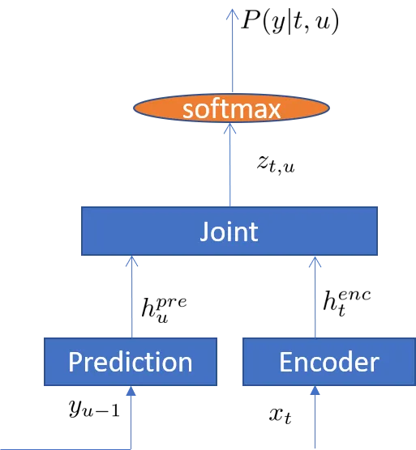
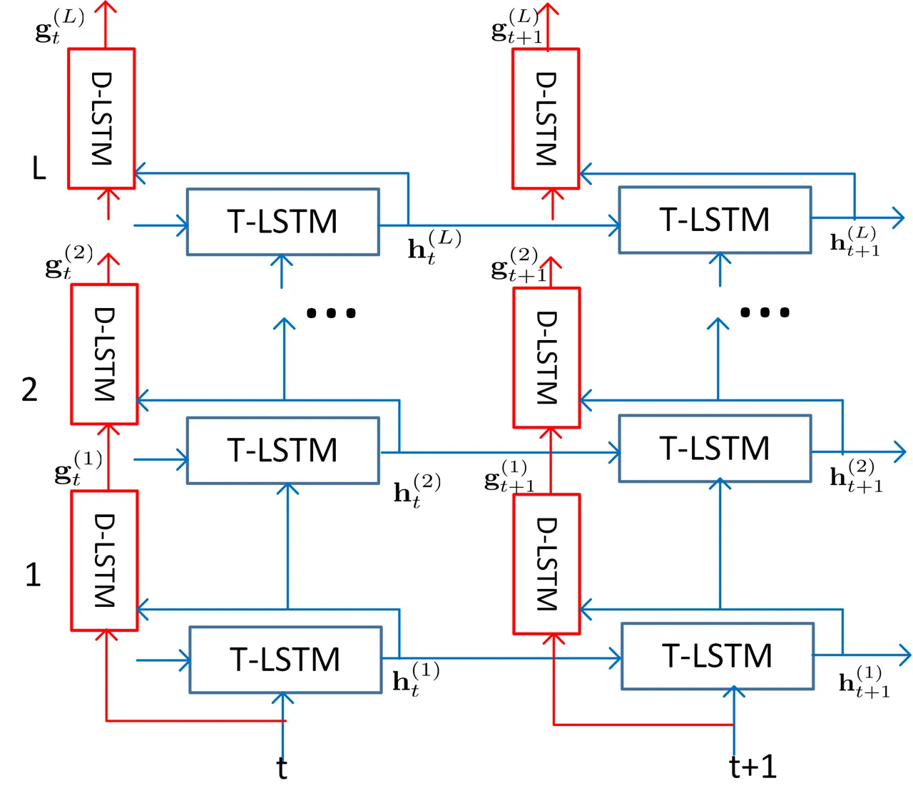
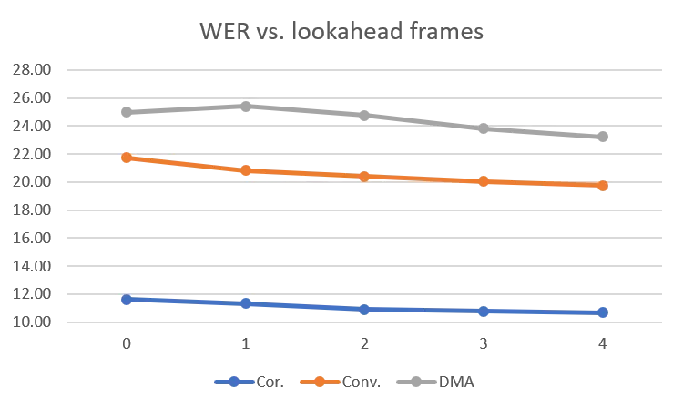
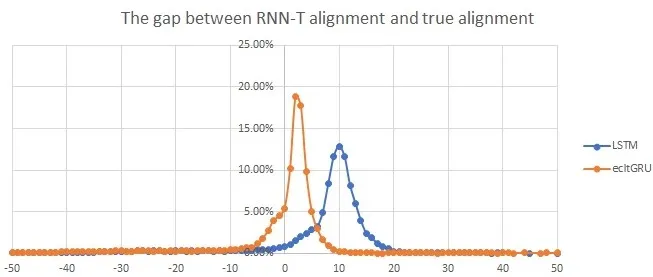

# Improving RNN Transducer Modeling for End-to-End Speech Recognition

Jinyu Li    Rui Zhao    Hu Hu\sthanksThe work was done as an intern at
Microsoft    Yifan Gong

###### Abstract

In the last few years, an emerging trend in automatic speech recognition
research is the study of end-to-end (E2E) systems. Connectionist
Temporal Classification (CTC), Attention Encoder-Decoder (AED), and RNN
Transducer (RNN-T) are the most popular three methods. Among these three
methods, RNN-T has the advantages to do online streaming which is
challenging to AED and it doesn’t have CTC’s frame-independence
assumption. In this paper, we improve the RNN-T training in two aspects.
First, we optimize the training algorithm of RNN-T to reduce the memory
consumption so that we can have larger training minibatch for faster
training speed. Second, we propose better model structures so that we
obtain RNN-T models with the very good accuracy but small footprint.
Trained with 30 thousand hours anonymized and transcribed Microsoft
production data, the best RNN-T model with even smaller model size (216
Megabytes) achieves up-to 11.8% relative word error rate (WER) reduction
from the baseline RNN-T model. This best RNN-T model is significantly
better than the device hybrid model with similar size by achieving up-to
15.0% relative WER reduction, and obtains similar WERs as the server
hybrid model of 5120 Megabytes in size.

###### Index Terms: 

RNN Transducer, LSTM, GRU, layer trajectory, speech recognition

^(†)^(†)address: Speech and Language Group, Microsoft

## 1 Introduction

Recent advances in automatic speech recognition (ASR) have been mostly
due to the advent of using deep learning algorithms to build hybrid ASR
systems with deep acoustic models like Deep Neural Networks (DNNs),
Convolutional Neural Networks (CNNs), and Recurrent Neural Networks
(RNNs). However, one problem with these hybrid systems is that there are
several intermediate models (acoustic model, language model, lexicon
model, decision tree, etc.) which either need expert linguistic
knowledge or need to be trained separately. In the last few years, an
emerging trend in ASR is the study of end-to-end (E2E) systems \[1, 2,
3, 4, 5, 6, 7, 8, 9, 10\]. The E2E ASR system directly transduces an
input sequence of acoustic features to an output sequence of tokens
(phonemes, characters, words etc). This reconciles well with the notion
that ASR is inherently a sequence-to-sequence task mapping input
waveforms to output token sequences. Some widely used contemporary E2E
approaches for sequence-to-sequence transduction are: (a) Connectionist
Temporal Classification (CTC) \[11, 12\], (b) Attention Encoder-Decoder
(AED) \[13, 14, 15, 16, 3\], and (c) RNN Transducer (RNN-T)\[17\]. These
approaches have been successfully applied to large-scale ASR systems
\[1, 2, 3, 4, 5, 8, 18, 19, 20\].

Among all these three approaches, AED (or LAS: Listen, Attend and Spell
\[3, 8\]) is the most popular one. It contains three components: Encoder
which is similar to a conventional acoustic model; Attender which works
as an alignment model; Decoder which is analogous to a conventional
language model. However, it is very challenging for AED to do online
streaming, which is an important requirement for ASR services. Although
there are several studies towards that direction, such as monotonic
chunkwise attention \[21\] and triggered attention \[22\], it’s still a
big challenge. As for CTC, it enjoys its simplicity by only using an
encoder to map the speech signal to target labels. However, its
frame-independence assumption is most criticized. There are several
attempts to improve CTC modeling by relaxing or removing such
assumption. In \[23, 24\], attention modeling was directly integrated
into the CTC framework to relax the frame-independence assumption by
working on model hidden layers without changing the CTC objective
function and training process, hence enjoying the simplicity of CTC
training.

A more elegant solution is RNN-T \[17\], which extends CTC modeling by
incorporating acoustic model with its encoder, language model with its
prediction network, and decoding process with its joint network. There
is no frame-independence assumption anymore and it is very natural to do
online streaming. As a result, RNN-T instead of AED was successfully
deployed to Google’s device \[20\] with great impacts. In spite of its
recent success in industry, there is less research in RNN-T when
compared to the popular AED or CTC, possibly due to the complexity of
RNN-T training \[25\]. For example, the encoder and prediction network
compose a grid of alignments, and the posteriors need to be calculated
at each point in the grid to perform the forward-backward training of
RNN-T. This three-dimension tensor requires much more memory than what
is required in AED or CTC training. Given there are lots of network
structure studies in hybrid systems (e.g., \[26, 27, 28, 29, 30, 31, 32,
33, 34\]), it is also desirable to explore advanced network structures
so that we can put a RNN-T model into devices with both good accuracy
and small footprint.

In this paper, we use the methods presented in the latest work \[20\] as
the baseline and improve the RNN-T modeling in two aspects. First, we
optimize the training algorithm of RNN-T to reduce the memory
consumption so that we can have larger training minibatch for faster
training speed. Second, we propose better model structures than the
layer-normalized long short-term memory (LSTM) used in \[20\] so that we
obtain RNN-T models with better accuracy but smaller footprint.

This paper is organized as follows. In Section 2, we briefly describe
the basic RNN-T method. Then, in Section 3, we propose how to improve
the RNN-T training by reducing the memory consumption which constrains
the training minibatch size because of the large-size tensors in RNN-T.
In Section 4, we propose several model structures which improve the
baseline LSTM model used in \[20\] for better accuracy and smaller model
size. We evaluate the proposed models in Section 5 by training them with
30 thousand hours anonymized and transcribed production data, and
evaluating with several ASR tasks. Finally, we conclude the study in
Section 6.

## 2 RNN-T

Figure 1 shows the diagram of the RNN-T model, which consists of
encoder, prediction, and joint networks. The encoder network is
analogous to the acoustic model, which converts the acoustic feature
$`x_{t}`$ into a high-level representation $`h_{t}^{enc}`$, where $`t`$
is time index.

```math
h_{t}^{enc}=f^{enc}(x_{t}) \tag{1}
```

The prediction network works like a RNN language model, which produces a
high-level representation $`h_{u}^{pre}`$ by conditioning on the
previous non-blank target $`y_{u-1}`$ predicted by the RNN-T model,
where $`u`$ is output label index.

```math
h_{u}^{pre}=f^{pre}(y_{u-1}) \tag{2}
```

The joint network is a feed-forward network that combines the encoder
network output $`h_{t}^{enc}`$ and the prediction network output
$`h_{u}^{pre}`$ as

```math
\displaystyle z_{t,u} \displaystyle=f^{joint}(h_{t}^{enc},h_{u}^{pre}) \tag{3}
```

```math
\displaystyle=\psi(Uh_{t}^{enc}+Vh_{u}^{pre}+b_{z}), \tag{4}
```

where $`U`$ and $`V`$ are weight matrices, $`b_{z}`$ is a bias vector,
and $`\psi`$ is a non-linear function, e.g. Tanh or ReLU \[35\].

The $`z_{t,u}`$ is connected to the output layer with a linear transform

```math
\displaystyle h_{t,u}=W_{y}z_{t,u}+b_{y}. \tag{5}
```

The final posterior for each output token $`k`$ is obtained after
applying softmax operation

```math
\displaystyle P(k|t,u)=softmax(h_{t,u}^{k}). \tag{6}
```



Figure 1: Diagram of RNN-Transducer.

The loss function of RNN-T is the negative log posterior of output label
sequence $`\bf{y}`$ given input acoustic feature $`\bf{x}`$,

```math
\displaystyle L=-lnP(\bf{y}|\bf{x}), \tag{7}
```

which is calculated based on the forward-backward algorithm described in
\[17\]. The derivatives of loss $`L`$ with respect to $`P⁡(k|t,u)`$ is

```math
\displaystyle\frac{\partial L}{\partial P⁡(k|t,u)}=-\frac{\alpha(t,u)}{P(\bf{y}|\bf{x})}\left\{\begin{array}[]{ll}\beta(t,u+1)&\text{if}\quad k=y_{u+1}\\
\beta(t+1,u)&\text{if}\quad k=\emptyset\\
0&\text{otherwise}\end{array}\right.
```

where $`\emptyset`$ denotes the blank label. $`\alpha(t,u)`$ is is the
probability of outputting $`{\bf{y}}_{[1:u]}`$ during
$`{\bf{x}}_{[1:t]}`$ while $`\beta(t,u)`$ is the probability of
outputting $`{\bf{y}}_{[u+1:U]}`$ during $`{\bf{x}}_{[t:T]}`$, assuming
one sequence with acoustic feature length as T and label sequence length
as U.

## 3 Training Improvement

We use $`K`$ to denote the number of all output labels (including
blank), and $`D`$ to denote the dimension of $`z_{t,u}`$. From Eq. (4)
and (5), we can see the size of $`z`$ is $`T*U*D`$, and the size of
$`h`$ is $`K*T*U`$. Compared with other E2E models, such as CTC or AED,
RNN-T model consumes much more memory during training. This restricts
the training minibatch size, especially when trained on GPUs with
limited memory capacity. The training speed would be slow if small
minibatch is used, therefore reducing memory cost is important for fast
RNN-T training. In this paper, we use two methods to reduce memory cost
for RNN-T model training.

### 3.1 Efficient encoder and prediction output combination

To improve the training efficiency of RNN, usually several sequences are
used in parallel in one minibatch. Given $`N`$ sequences in one
minibatch with acoustic feature lengths $`(T_{1},T_{2},...,T_{N})`$, the
dimension of $`h^{enc}`$ would be $`(N,max(T_{1},T_{2},...,T_{N}),F)`$
($`F`$ is the size of vector $`h_{t}^{enc}`$) when they are paralleled
in one minibatch. Because the actual element number in $`h^{enc}`$ is
$`\sum_{n=1}^{N}T_{n}*F`$, some of the memory is wasted. Such waste is
worse for RNN-T when combining encoder and prediction network output
with the broadcasting method which is a popular implementation for
dealing with different-size tensors in neural network training tools
such as PyTorch.

Suppose the label length of N sequences are $`(U_{1},U_{2},...,U_{N})`$.
The dimension of $`h^{pre}`$ would then be
$`(N,max(U_{1},U_{2},...,U_{N}),F)`$. To combine $`h^{enc}`$ and
$`h^{pre}`$ with the broadcasting method, the dimension of $`h^{enc}`$
and $`h^{pre}`$ is expanded to

```math
\displaystyle(N,1,max(T_{1},T_{2},...,T_{N}),F) \tag{11}
```

and

```math
\displaystyle(N,max(U_{1},U_{2},...,U_{N}),1,F) \tag{12}
```

respectively. Then, they are combined according to Eq. (4) and the
output dimension becomes

```math
\displaystyle(N,max(U_{1},U_{2},...,U_{N}),max(T_{1},T_{2},...,T_{N}),D). \tag{13}
```

Note the last dimension is $`D`$ instead of $`F`$ because of the
projection matrices in Eq. (4). Hence, $`z`$ becomes a four-dimension
tensor, which requires very large memory
$`(N*max(U_{1},U_{2},...,U_{N})*max(T_{1},T_{2},...,T_{N})*D)`$ to
accommodate.

To eliminate such memory waste, we did not use the broadcasting method
to combine $`h^{enc}`$ and $`h^{pre}`$. Instead, we implement the
combination sequence by sequence. Hence, the size of $`z_{n}`$ for
utterance $`n`$ is $`T_{n}*U_{n}*D`$ instead of
$`max(T_{1},T_{2},…,T_{N})*max⁡〖(U_{1},U_{2},…,U_{N})*D`$. Then we
concatenate all $`z_{n}`$ instead of paralleling them, which means we
convert $`z`$ into a two-dimension tensor
$`(\sum_{n=1}^{N}T_{n}*U_{n}),D)`$. In this way, the total memory cost
for $`z_{1},z_{2},...z_{N}`$ is $`(\sum_{n=1}^{N}T_{n}*U_{n})*D`$. This
significantly reduces the memory cost, compared to the broadcasting
method. There is no recurrent operation after the combination, hence
such conversion will not affect the training speed for the operations
following it. Of course, we need to pass the sequence information like
$`T_{n}`$, $`U_{n}`$ to any later operations so that they could process
the sequences correctly based on such information.

Another way to reduce memory waste is to sort the sequences with respect
to both acoustic feature and label length, and then performing the
training with sorted sequences. However, from our experience, this
generates worse accuracy than presenting randomized utterances to the
training. In the deep speech 2 work \[36\], SortaGrad was used to
present the sorted utterances to training in the first epoch for the
better initialization of CTC training. After the first epoch, the
training then is reverted back to a random order of data over
minibatches, which indicates the importance of data shuffle.

### 3.2 Function merging

Most of the neural network training tools (e.g., PyTorch) are modular
based. Although this is convenient for user to try various model
structure, the memory usage is not efficient. For RNN-T model, if we
define softmax and loss function with two separate modules, to get the
derivative of loss with respect to $`h_{t,u}^{k}`$, i.e.,
$`\frac{\partial L}{\partial h_{t,u}^{k}}`$, we may use the chain rule

```math
\displaystyle\frac{\partial L}{\partial h_{t,u}^{k}}=\frac{\partial L}{\partial P⁡(k|t,u)}\frac{\partial P⁡(k|t,u)}{\partial h_{t,u}^{k}} \tag{14}
```

to first calculate $`\frac{\partial L}{\partial P⁡(k|t,u)}`$ with Eq. (2)
and then$`\frac{\partial P⁡(k|t,u)}{\partial h_{t,u}^{k}}`$. However,
calculating and storing $`\frac{\partial L}{\partial P(k|t,u)}`$ is not
necessary. Instead we directly derive the formulation of
$`\frac{\partial L}{\partial h_{t,u}^{k}}`$ as

```math
\displaystyle{\scriptsize\frac{\partial L}{\partial h_{t,u}^{k}}=\frac{P⁡(k|t,u)\alpha(t,u)}{P(\bf{y}|\bf{x})}\left[\beta(t,u)-\left\{\begin{array}[]{ll}\beta(t,u+1)&\text{if}\ k=y_{u+1}\\
\beta(t+1,u)&\text{if}\ k=\emptyset\\
0&\text{otherwise}\end{array}\right.\right]}.
```

The tenor size of $`\frac{\partial L}{\partial P(k|t,u)}`$ of one
minibatch is very big, hence Eq. (3.2) saves large memory compared with
Eq. (14). To further optimize this, we calculate softmax in-place ¹¹ 1
the operation that directly changes the content of a given tensor
without making a copy. for Eq. (6) and let
$`\frac{\partial L}{\partial h_{t,u}^{k}}`$ take the memory storage
place of $`P⁡(k|t,u)`$ in Eq. (3.2) . In this way, for this part we only
have one very large tensor in the memory (either $`P⁡(k|t,u)`$ or
$`\frac{\partial L}{\partial h_{t,u}^{k}}`$), compared to standard chain
rule implementation which needs to store three large tensors (
$`P⁡(k|t,u)`$, $`\frac{\partial L}{\partial h_{t,u}^{k}}`$, and
$`\frac{\partial L}{\partial P(k|t,u)}`$ ) in the memory.

With above two methods, memory cost is reduced significantly, which
helps to increase the training minibatch size. For a RNN-T model with
around 4,000 output labels, the minibatch size could be increased from
2000 to 4000 when it is trained with V100 GPU which has 16 Gigabytes
memory. The improvement is even larger for a RNN-T model with 36,000
output labels. The minibatch size could be increased from 500 to 2000.

## 4 Model Structure Exploration

In the latest successful RNN-T work \[20\], the layer-normalized LSTMs
with projection layer were used in both encoder and prediction networks.
We describe it in Section 4.1 and use it as the baseline structure in
this study. From Section 4.2 to Section 4.6, we propose different
structures for RNN-T. These new structures achieve more modeling power
by 1) decoupling the target classification task and temporal modeling
task with separate modeling units; 2) exploring future context frames to
generate more informative encoder output.

### 4.1 Layer normalized LSTM

In \[20\], layer normalization and projection layer for LSTM were
reported important to the success of RNN-T modeling. Following \[37\],
we define the layer normalization function for vector $`v`$ given
adaptive gain $`\alpha`$ and bias $`\beta`$ as

```math
\displaystyle LN(v) \displaystyle=(v-\mu)/\sigma\odot\alpha+\beta, \tag{18}
```

```math
\displaystyle\mu \displaystyle=\frac{1}{D_{v}}\sum_{i=1}^{D_{v}}v_{i}, \tag{19}
```

```math
\displaystyle\sigma \displaystyle=\sqrt{\frac{1}{D_{v}}\sum_{i=1}^{D_{v}}(v_{i}-\mu)^{2}} \tag{20}
```

where $`{D_{v}}`$ is the dimension of $`v`$, and $`\odot`$ is
element-wise product.

Then, we define the layer normalized LSTM function with project layer
$`{h}_{t}^{l}=LSTM({h}_{t-1}^{l},{x}_{t}^{l},{c}_{t-1}^{l})`$ as

```math
\displaystyle{i}_{t}^{l} \displaystyle=\sigma(LN({W}^{l}_{ix}{x}_{t}^{l}+{W}^{l}_{ih}{h}_{t-1}^{l}+{b}^{l}_{i})) \tag{21}
```

```math
\displaystyle{f}_{t}^{l} \displaystyle=\sigma(LN({W}^{l}_{fx}{x}_{t}^{l}+{W}^{l}_{fh}{h}_{t-1}^{l}+{b}^{l}_{f})) \tag{22}
```

```math
\displaystyle{c}_{t}^{l} \displaystyle={f}_{t}^{l}\odot{c}_{t-1}^{l}+{i}_{t}^{l}\odot\phi(LN({W}^{l}_{cx}{x}_{t}^{l}+{W}^{l}_{ch}{h}_{t-1}^{l}+{b}^{l}_{c})) \tag{23}
```

```math
\displaystyle{o}_{t}^{l} \displaystyle=\sigma(LN({W}^{l}_{ox}{x}_{t}^{l}+{W}^{l}_{oh}{h}_{t-1}^{l}+{b}^{l}_{o})) \tag{24}
```

```math
\displaystyle{q}_{t}^{l} \displaystyle={o}_{t}^{l}\odot\phi(LN({c}_{t}^{l})) \tag{25}
```

```math
\displaystyle{h}_{t}^{l} \displaystyle=W_{p}^{l}q_{t}^{l} \tag{26}
```

The vectors $`{i}_{t}^{l}`$, $`{o}_{t}^{l}`$, $`{f}_{t}^{l}`$,
$`{c}_{t}^{l}`$ are the activations of the input, output, forget gates,
and memory cells, respectively. $`{h}_{t}^{l}`$ is the output of the
LSTM. $`{W}^{l}_{.x}`$ and $`{W}^{l}_{.h}`$ are the weight matrices for
the inputs $`{x}_{t}^{l}`$ and the recurrent inputs $`{h}_{t-1}^{l}`$,
respectively. $`{b}^{l}_{.}`$ are bias vectors. The functions $`\sigma`$
and $`\phi`$ are the logistic sigmoid and hyperbolic tangent
nonlinearity, respectively.

For the multi-layer LSTM, $`x_{t}^{l}=h_{t}^{l-1}`$, then we have the
hidden output of the $`l`$th layer at time $`t`$ as

```math
\displaystyle{h}_{t}^{l} \displaystyle=LSTM(h_{t-1}^{l},h_{t}^{l-1},c_{t-1}^{l}), \tag{27}
```

and we use the last hidden layer output $`h_{t}^{L}`$ and $`h_{u}^{M}`$
of the encoder and prediction networks as $`h_{t}^{enc}`$ and
$`h_{u}^{pre}`$, where $`L`$ and $`M`$ denote the number of layers in
encoder and prediction networks respectively.

### 4.2 Layer trajectory LSTM

Recently, significant accuracy improvement was reported with a layer
trajectory LSTM (ltLSTM) model \[38, 39\] in which depth-LSTMs are used
to scan the outputs of multi-layer time-LSTMs to extract information for
label classification. By decoupling the temporal modeling and senone
classification tasks, ltLSTM allows time and depth LSTMs focusing on
their individual tasks. The model structure is illustrated by Figure 2.



Figure 2: Diagram of layer trajectory LSTM (ltLSTM). Depth-LSTM (D-LSTM)
is used to scan the outputs of time-LSTM (T-LSTM) across all layers at
the current time step to get summarized layer trajectory information for
senone classification. Note that There is no time recurrence in D-LSTMs,
which only occurs in T-LSTMs.

Following \[38\], we define the layer-normalized ltLSTM formulation
using

```math
\displaystyle{h}_{t}^{l} \displaystyle=LSTM(h_{t-1}^{l},h_{t}^{l-1},c_{t-1}^{l}) \tag{28}
```

```math
\displaystyle{g}_{t}^{l} \displaystyle=LSTM(h_{t}^{l},{g}_{t}^{l-1},d_{t}^{l-1}), \tag{29}
```

with the LSTM function defined from Eq. (21) to Eq. (27), where
$`c_{t-1}^{l}`$ and $`d_{t}^{l-1}`$ are the memory cells from time-LSTM
(time $`t-1`$ and layer $`l`$) and depth-LSTM (time $`t`$ and layer
$`l-1`$), respectively. The time-LSTM formulation in Eq. (28) performs
temporal modeling, while the depth-LSTM formulation in Eq. (29) works
across layers for the target classification. $`{g}_{t}^{l}`$ is the
output of the depth-LSTM at time $`t`$ and layer $`l`$. Similarly, we
can use the last hidden layer output $`g_{t}^{L}`$ and $`g_{u}^{M}`$ of
the encoder and prediction networks as $`h_{t}^{enc}`$ and
$`h_{u}^{pre}`$ for RNN-T.

### 4.3 Contextual layer trajectory LSTM

In \[40\], the contextual layer trajectory LSTM (cltLSTM) was proposed
to further improve the performance of ltLSTM models by using context
frames to capture future information. In cltLSTM, $`{g}_{t}^{l-1}`$ used
in Eq. (29) is replaced by the lookahead embedding vector
$`{\zeta}_{t}^{l-1}`$ in order to incorporate the future context
information. The embedding vector is computed from the depth-LSTM using
Eq. (30)

```math
\displaystyle{\zeta}_{t}^{l-1} \displaystyle=\sum_{\delta=0}^{\tau}{G}_{\delta}^{l-1}{g}_{t+\delta}^{l-1} \tag{30}
```

```math
\displaystyle{h}_{t}^{l} \displaystyle=LSTM(h_{t-1}^{l},h_{t}^{l-1},c_{t-1}^{l}) \tag{31}
```

```math
\displaystyle{g}_{t}^{l} \displaystyle=LSTM(h_{t}^{l},\bm{\zeta}_{t}^{l-1},d_{t}^{l-1}), \tag{32}
```

where $`{G}_{\delta}^{l-1}`$ denotes the weight matrix applied to
depth-LSTM output $`{g}_{t+\delta}^{l-1}`$. Note it is only meaningful
to have future context lookahead for the encoder network. Therefore,
$`{\zeta}_{t}^{L}`$ of the encoder network can be used as
$`h_{t}^{enc}`$ for RNN-T. In Eq. (30), every layer has $`\tau`$ frames
lookahead. To generate $`{\zeta}_{t}^{L}`$, we have $`L*\tau`$ frames
lookahead in total.

### 4.4 Layer normalized gated recurrent units

Similar to \[20\], our target is to deploy RNN-T for device ASR.
Therefore, footprint is a major factor when developing models. As gated
recurrent unit (GRU) \[41\] usually has light weight compared to LSTM,
we use it as the building block for RNN-T and define the layer
normalized GRU function $`GRU({h}_{t-1}^{l},{x}_{t}^{l})`$ as

```math
\displaystyle{z}_{t}^{l} \displaystyle=\sigma(LN({W}^{l}_{zx}{x}_{t}^{l}+{W}^{l}_{zh}{h}_{t-1}^{l}+{b}^{l}_{z})) \tag{33}
```

```math
\displaystyle{r}_{t}^{l} \displaystyle=\sigma(LN({W}^{l}_{rx}{x}_{t}^{l}+{W}^{l}_{rh}{h}_{t-1}^{l}+{b}^{l}_{r})) \tag{34}
```

```math
\displaystyle{\tilde{h}}_{t}^{l} \displaystyle=\phi(LN({W}^{l}_{hx}{x}_{t}^{l}+{W}^{l}_{hh}({r}_{t}^{l}\odot{h}_{t-1}^{l})+{b}^{l}_{h})) \tag{35}
```

```math
\displaystyle{h}_{t}^{l} \displaystyle={z}_{t}^{l}\odot{h}_{t-1}^{l}+(1-{z}_{t}^{l})\odot{\tilde{h}}_{t}^{l} \tag{36}
```

Again, $`{W}^{l}_{.x}`$ and $`{W}^{l}_{.h}`$ are the weight matrices for
the inputs $`{x}_{t}^{l}`$ and the recurrent inputs $`{h}_{t-1}^{l}`$,
respectively. $`{b}^{l}_{.}`$ are bias vectors. For the multi-layer GRU,
$`x_{t}^{l}=h_{t}^{l-1}`$, then we have the hidden output of the $`l`$th
layer at time $`t`$ as

```math
\displaystyle{h}_{t}^{l} \displaystyle=GRU(h_{t-1}^{l},h_{t}^{l-1}) \tag{37}
```

Note that all the networks in this study are uni-directional and our
layer normalized GRU is different from the bi-directional GRU with batch
normalization used in \[5\]. Layer normalization is better than batch
normalization for recurrent neural networks \[37\].

### 4.5 Layer trajectory GRU

Similar to the layer normalized ltLSTM presented in Section 4.2, we
propose layer trajectory GRU (ltGRU) with layer normalization in this
study as

```math
\displaystyle{h}_{t}^{l} \displaystyle=GRU(h_{t-1}^{l},h_{t}^{l-1}) \tag{38}
```

```math
\displaystyle{g}_{t}^{l} \displaystyle=GRU(h_{t}^{l},{g}_{t}^{l-1}). \tag{39}
```

The time-GRU formulation in Eq. (38) performs temporal modeling, while
the depth-GRU formulation in Eq. (39) works across layer for target
classification. $`{g}_{t}^{l}`$ is the output of the depth-GRU at time
$`t`$ and layer $`l`$. We can use the last hidden layer output
$`g_{t}^{L}`$ and $`g_{u}^{M}`$ of the encoder and prediction networks
as $`h_{t}^{enc}`$ and $`h_{u}^{pre}`$ for RNN-T.

### 4.6 Contextual layer trajectory GRU

To further improve the performance of ltGRU models, we extend ltGRU in
Section 4.5 by utilizing the lookahead embedding vector in order to
incorporate the future context information. The embedding vector
$`{\zeta}_{t}^{l-1}`$ is computed from the depth-GRU using Eq. (40)

```math
\displaystyle{\zeta}_{t}^{l-1} \displaystyle=\sum_{\delta=0}^{\tau}{q}_{\delta}^{l-1}\odot{g}_{t+\delta}^{l-1} \tag{40}
```

```math
\displaystyle{h}_{t}^{l} \displaystyle=GRU(h_{t-1}^{l},h_{t}^{l-1}) \tag{41}
```

```math
\displaystyle{g}_{t}^{l} \displaystyle=GRU(h_{t}^{l},\bm{\zeta}_{t}^{l-1}) \tag{42}
```

Different from Eq. (30), Eq. (40) uses vector $`{q}_{\delta}^{l-1}`$
instead of matrix $`{G}_{\delta}^{l-1}`$ to integrate future context
$`{g}_{t+\delta}^{l-1}`$ from the depth-GRU. This further reduces the
model footprint. Hence we call this model as elementwise contextual
layer trajectory GRU (ecltGRU).

$`{\zeta}_{t}^{L}`$ of the encoder network can then be used as
$`h_{t}^{enc}`$ for RNN-T. In Eq. (40), every layer has $`\tau`$ frames
lookahead, and we have $`L*\tau`$ frames lookahead in total to generate
$`{\zeta}_{t}^{L}`$.

## 5 Experiments

In this section, we evaluate the effectiveness of the proposed models.
In our experiments, all models are uni-directional, and were trained
with 30 thousand (k) hours of anonymized and transcribed Microsoft
production data, including Cortana and Conversation data, recorded in
both close-talk and far-field conditions. We evaluated all models with
Cortana and Conversation test sets. Both sets contain mixed close-talk
and far-field recordings, with 439k and 111k words, respectively. The
Cortana set has shorter utterances related to voice search and commands,
while the Conversation set has longer utterances from conversations. We
also evaluate the models on the third test set named as DMA with 29k
words, which is not in Cortana or Conversation domain. The DMA domain
was unseen during the model training, and serves to evaluate the
generalization capacity of the model.

### 5.1 RNN-T models with greedy search

| enc.    | pred.  | size Mb | Cortana % | Conv. % | DMA % |
| ------- | ------ | ------- | --------- | ------- | ----- |
| LSTM    | LSTM   | 255     | 12.03     | 22.18   | 26.78 |
| ltLSTM  | LSTM   | 422     | 11.11     | 22.41   | 24.70 |
| ltLSTM  | ltLSTM | 482     | 10.91     | 22.51   | 25.15 |
| cltLSTM | LSTM   | 469     | 9.92      | 19.86   | 23.03 |
| GRU     | GRU    | 139     | 12.30     | 22.90   | 26.50 |
| ltGRU   | GRU    | 216     | 11.60     | 21.74   | 24.99 |
| ltGRU   | ltGRU  | 235     | 11.58     | 21.69   | 26.00 |
| ecltGRU | GRU    | 216     | 10.68     | 19.76   | 23.22 |

Table 1: WERs and sizes of all RNN-T models on Cortana, Conversation
(Conv.), and DMA test sets. All test sets are mixed with close-talk and
far-field recordings. All encoder (enc.) networks have 6 hidden layers,
and all prediction (pred.) networks have 2 hidden layers. The decoding
results are generated by greedy search. The cltLSTM and ecltGRU set
$`\tau=4`$, i.e., using 4 future context frames at each layer.

In Table 1, we compare different structures of RNN-T models in terms of
size and word error rate (WER) using greedy search. The computational
cost of RNN-T models during runtime is proportional to the model size.
The feature is 80-dimension log Mel filter bank for every 10
milliseconds (ms) speech. Three of them are stacked together to form a
frame of 240-dimension input acoustic feature to the encoder network.
All encoder (enc.) networks have 6 hidden layers, and all prediction
(pred.) networks have 2 hidden layers. The joint network always outputs
a vector with dimension 640. The output layer models 4096 word piece
units together with blank label. The word piece units are generated by
running byte pair encoding \[42\] on the acoustic training texts.
Similar to the latest successful RNN-T model on device \[20\], our first
model uses LSTM for both encoder and prediction networks. The encoder
network has a 6 layer layer-normalized LSTM with 1280 hidden units at
each layer and the output size then is reduced to 640 using a linear
projection layer. We denote this layer-normalized LSTM structure as
1280p640. The prediction network has 2 hidden layers, and each layer is
with the 1280p640 LSTM structure. This model has total size of 255
megabytes (Mb). We use this RNN-T model as the baseline model.

Then, we explore ltLSTM structures described in Section 4.2 for encoder
and prediction networks. All the LSTM components in ltLSTM use the
1280p640 LSTM structure. Simply using ltLSTM in the encoder
significantly reduces the WERs on Cortana and DMA test sets, but
increases the model size from 255 Mb to 422 Mb. Further using ltLSTM in
prediction network increases the model size to 482 Mb, without
benefiting the WER clearly. Hence, using ltLSTM only in the encoder is a
good setup.

Using cltLSTM described in Section 4.3 in the encoder network with
$`\tau=4`$ at each layer improves the WERs significantly, with
respectively 17.5%, 10.5%, and 14.0% relative WER reduction on Cortana,
Conversation, and DMA test sets from the baseline RNN-T model which uses
layer-normalized LSTM in both encoder and decoder networks. This clearly
shows the advantage of using future context for the encoder network.
However, this model also has a very large model size as 469 Mb, which
especially brings challenges to the deployment into devices.

Next, layer-normalized LSTM is replaced with layer-normalized GRU
described in Section 4.4. The GRU in this study is with 800 units at
each layer without any projection layer. When using layer-normalized GRU
in both encoder and prediction networks, we significantly reduce the
RNN-T model size to 139 Mb and obtain slightly worse WERs than the
baseline RNN-T model using LSTM.

The RNN-T model using ltGRU proposed in Section 4.5 in the encoder
network has the model size 216 Mb, and significantly improves the RNN-T
model with GRU in the encoder network. Again, applying ltGRU to
prediction network doesn’t bring any additional benefits but increases
the model size.

Finally, ecltGRU which uses $`\tau=4`$ at each layer has almost the same
size as ltGRU in the encoder network due to the use of vectors instead
of matrices when incorporating future context, but significantly
improves the WERs because of the future context access. The size of this
model (216 Mb) is smaller than that (255 Mb) of the baseline RNN-T model
which uses LSTM in the encoder and prediction networks. At the same
time, it outperforms the baseline RNN-T model with 11.2%, 10.9% and
13.3% relative WER reduction on Cortana, Conversation, and DMA test
sets, respectively.

Given the good performance of ecltGRU, we evaluate the impact of future
frame contexts at each layer in Figure 3 by varying the value of
$`\tau`$. When $`\tau=0`$, the ecltGRU model just reduces to the ltGRU
model. With larger $`\tau`$ value, the WERs drop monotonically. Setting
$`\tau`$ as 3 or 4 doesn’t have too much WER difference while smaller
$`\tau`$ value does reduce the model latency with less future context
access.



Figure 3: The WERs of the ecltGRU model with respect to $`\tau`$ future
context frames at each layer.

### 5.2 Comparison with hybrid models

[TABLE]

Table 2: Comparison of hybrid models with RNN-T models on Cortana,
Conversation (Conv.), and DMA test sets. The RNN-T decoding results are
generated by beam search with beam width 10. The ecltGRU sets
$`\tau=4`$, i.e., using 4 future context frames at each layer.

In Table 2, we compare RNN-T models decoded using beam search with
hybrid models trained with cross entropy criterion on Cortana,
Conversation, and DMA test sets. Note that all models, not matter RNN-T
or hybrid, can be improved by sequence discriminative training. The
acoustic model of this hybrid model is a 6 layer LSTM with 1024 hidden
units at each layer and the output size then is reduced to 512 using a
linear projection layer. The softmax layer has 9404-dimension output to
model the senone labels. The input feature is also 80-dimension log Mel
filter bank for every 10 milliseconds (ms) speech. We applied frame
skipping by a factor of 2 \[43\] to reduce the runtime cost, which
corresponds to 20ms per frame. This acoustic model (AM) has the size of
120 Mb. The language model (LM) is a 5-gram with around 100 million (M)
ngrams, which is compiled into a graph of 5 gigabytes (Gb) size. We
refer this configuration as the server setup. We also prune the LM for
the purpose of device usage, resulting in a graph of 98 Mb size. The
decoding of these two hybrid models uses our production setup, differing
only the LM size. We list the WERs of this AM combined with both the
large LM and pruned LM in Table 2. Clearly, the device setup with small
LM gives worse WERs than the server setup using large LM.

The RNN-T decoding results are generated by beam search with beam width 10. Comparing the results in Table 2 and Table 1, we can see that beam
search significantly improves the WERs from the greedy search. Using
ecltGRU in the encoder network and GRU in the prediction network for
RNN-T outperforms the baseline RNN-T which uses LSTM everywhere, with
6.6%, 7.5%, and 11.8% relative WER reduction on Cortana, Conversation,
and DMA test sets, respectively. The size of this best RNN-T model is
216 Mb, less than the baseline RNN-T model with LSTM units. Moreover,
the WERs of this best RNN-T model matches the WERs of hybrid model with
server setup which has a 5 Gb LM. Comparing to the device hybrid setup
which has similar size (218 Mb), this best RNN-T obtains 15.0%, 9.9%,
and 11.3% relative WER reduction on Cortana, Conversation, and DMA test
sets, respectively. With the high recognition accuracy and small
footprint, this RNN-T model is ideal for device ASR.

Finally, we look at the gap between ground truth word alignment obtained
by force alignment with a hybrid model and the word alignment generated
by greedy decoding from two RNN-T models in Table 2. As shown in Figure
4, the baseline RNN-T with LSTM in the encoder network has larger delay
than the ground truth alignment. The average delay is about 10 input
frames. In contrast, the RNN-T model with ecltGRU has less alignment
discrepancy, with average 2 input frames delay. This is because the
ecltGRU encoder has total 24 frames lookahead, which provides more
information to RNN-T so that it makes decision earlier than the baseline
model. Because the input to RNN-T models spans 30ms by stacking 3 10ms
frames together, therefore the average latency of RNN-T with ecltGRU
encoder is (24+2)\*30ms = 780ms while the average latency of RNN-T with
LSTM encoder is 10\*30ms = 300ms. Hence, partial accuracy advantage of
ecltGRU encoder comes from the tradeoff of latency.



Figure 4: The gap between ground truth word alignment and the word
alignment from two RNN-T models in Table 2. The ecltGRU sets $`\tau=4`$,
i.e., using 4 future context frames at each layer.

## 6 Conclusions

In this paper, we improve the RNN-T training for end-to-end ASR from two
aspects. First, we reduce the memory consumption of RNN-T training with
efficient combination of the encoder and prediction network outputs, and
by reformulating the gradient calculation to avoid storing multiple
large tensors in the memory. In this way, we significantly increase the
minibatch size (otherwise constrained by the memory usage) during
training. Second, we improve the baseline RNN-T model structure which
uses LSTM units by proposing several new structures. All the proposed
structures use the concept of layer trajectory which decouples the
classification task and temporal modeling task by using depth LSTM / GRU
units and time LSTM / GRU units, respectively. The best tradeoff between
model size and accuracy is obtained by the RNN-T model with ecltGRU in
the encoder network and GRU in the prediction network. The future
context lookahead at each layer helps to build accurate models with
better performance.

Trained with 30 thousand hours anonymized and transcribed Microsoft
production data, this best RNN-T model achieves respectively 6.6%, 7.5%,
and 11.8% relative WER reduction on Cortana, Conversation, and DMA test
sets, from the baseline RNN-T model but with smaller model size (216
Megabytes), which is ideal for the deployment to devices. This best
RNN-T model is significantly better than the hybrid model with similar
size, by reducing 15.0%, 9.9%, and 11.3% relative WER on Cortana,
Conversation, and DMA test sets, respectively. It also obtains similar
WERs as the server-size hybrid model of 5120 Megabytes in size.

## References

- \[1\] H. Sak, A. Senior, K. Rao, O. Irsoy, A. Graves, F. Beaufays, and
  J. Schalkwyk, “Learning Acoustic Frame Labeling for Speech Recognition
  with Recurrent Neural Networks,” in Proc. ICASSP. IEEE, 2015, pp.
  4280–4284.
- \[2\] Y. Miao, M. Gowayyed, and F. Metze, “EESEN: End-to-End Speech
  Recognition using Deep RNN Models and WFST-based Decoding,” in Proc.
  ASRU. IEEE, 2015, pp. 167–174.
- \[3\] William Chan, Navdeep Jaitly, Quoc Le, and Oriol Vinyals,
  “Listen, attend and spell: A neural network for large vocabulary
  conversational speech recognition,” in Proc. ICASSP, 2016, pp.
  4960–4964.
- \[4\] R. Prabhavalkar, K. Rao, T. N. Sainath, B. Li, L. Johnson, and
  N. Jaitly, “A Comparison of Sequence-to-Sequence Models for Speech
  Recognition,” in Proc. Interspeech, 2017, pp. 939–943.
- \[5\] E. Battenberg, J. Chen, R. Child, A. Coates, Y. Gaur, Y. Li,
  H. Liu, S. Satheesh, D. Seetapun, A. Sriram, et al., “Exploring Neural
  Transducers for End-to-End Speech Recognition,” in Proc. ASRU, 2017.
- \[6\] Hasim Sak, Matt Shannon, Kanishka Rao, and Françoise Beaufays,
  “Recurrent neural aligner: An encoder-decoder neural network model for
  sequence to sequence mapping,” in Proc. Interspeech, 2017.
- \[7\] Hossein Hadian, Hossein Sameti, Daniel Povey, and Sanjeev
  Khudanpur, “Towards Discriminatively-trained HMM-based End-to-end
  models for Automatic Speech Recognition,” in Proc. ICASSP, 2018.
- \[8\] Chung-Cheng Chiu, Tara N Sainath, Yonghui Wu, Rohit
  Prabhavalkar, Patrick Nguyen, Zhifeng Chen, Anjuli Kannan, Ron J
  Weiss, Kanishka Rao, Katya Gonina, et al., “State-of-the-art speech
  recognition with sequence-to-sequence models,” in Proc. ICASSP, 2018.
- \[9\] Tara N Sainath, Chung-Cheng Chiu, Rohit Prabhavalkar, Anjuli
  Kannan, Yonghui Wu, Patrick Nguyen, and ZhiJeng Chen, “Improving the
  performance of online neural transducer models,” in Proc. ICASSP,
  2018, pp. 5864–5868.
- \[10\] Jinyu Li, Guoli Ye, Amit Das, Rui Zhao, and Yifan Gong,
  “Advancing acoustic-to-word CTC model,” in Proc. ICASSP, 2018, pp.
  5794–5798.
- \[11\] A. Graves, S. Fernández, F. Gomez, and J. Schmidhuber,
  “Connectionist Temporal Classification: Labelling Unsegmented Sequence
  Data with Recurrent Neural Networks,” in ICML, 2006, pp. 369–376.
- \[12\] A. Graves and N. Jaitley, “Towards End-to-End Speech
  Recognition with Recurrent Neural Networks,” in PMLR, 2014, pp.
  1764–1772.
- \[13\] K. Cho, B. van Merriënboer, C. Gulcehre, D. Bahdanau,
  F. Bougares, H. Schwenk, and Y. Bengio, “Learning Phrase
  Representations using RNN Encoder-Decoder for Statistical Machine
  Translation,” in EMNLP, 2014.
- \[14\] D. Bahdanau, K. Cho, and Y. Bengio, “Neural Machine Translation
  by Jointly Learning to Align and Translate,” in ICLR, 2015.
- \[15\] Dzmitry Bahdanau, Jan Chorowski, Dmitriy Serdyuk, Philemon
  Brakel, and Yoshua Bengio, “End-to-end attention-based large
  vocabulary speech recognition,” in Proc. ICASSP, 2016, pp. 4945–4949.
- \[16\] J. Chorowski, D. Bahdanau, D. Serdyuk, K. Cho, and Y. Bengio,
  “Attention-Based Models for Speech Recognition,” in NIPS, 2015.
- \[17\] A. Graves, “Sequence Transduction with Recurrent Neural
  Networks,” CoRR, vol. abs/1211.3711, 2012.
- \[18\] H. Soltau, H. Liao, and H. Sak, “Neural Speech Recognizer:
  Acoustic-to-word LSTM Model for Large Vocabulary Speech Recognition,”
  arXiv preprint arXiv:1610.09975, 2016.
- \[19\] Kanishka Rao, Haşim Sak, and Rohit Prabhavalkar, “Exploring
  architectures, data and units for streaming end-to-end speech
  recognition with RNN-transducer,” in Proc. ASRU, 2017.
- \[20\] Yanzhang He, Tara N Sainath, Rohit Prabhavalkar, Ian McGraw,
  Raziel Alvarez, Ding Zhao, David Rybach, Anjuli Kannan, Yonghui Wu,
  Ruoming Pang, et al., “Streaming end-to-end speech recognition for
  mobile devices,” in Proc. ICASSP, 2019, pp. 6381–6385.
- \[21\] Chung-Cheng Chiu and Colin Raffel, “Monotonic chunkwise
  attention,” arXiv preprint arXiv:1712.05382, 2017.
- \[22\] Niko Moritz, Takaaki Hori, and Jonathan Le Roux, “Triggered
  attention for end-to-end speech recognition,” in Proc. ICASSP, 2019,
  pp. 5666–5670.
- \[23\] A. Das, J. Li, R. Zhao, and Y. Gong, “Advancing connectionist
  temporal classification with attention modeling,” in Proc.
  ICASSP, 2018.
- \[24\] Amit Das, Jinyu Li, Guoli Ye, Rui Zhao, and Yifan Gong,
  “Advancing acoustic-to-word CTC model with attention and mixed-units,”
  IEEE/ACM Transactions on Audio, Speech, and Language Processing, vol.
  27, no. 12, pp. 1880–1892, 2019.
- \[25\] Tom Bagby, Kanishka Rao, and Khe Chai Sim, “Efficient
  implementation of recurrent neural network transducer in tensorflow,”
  in Proc. SLT, 2018, pp. 506–512.
- \[26\] Tara N Sainath, Oriol Vinyals, Andrew Senior, and Haşim Sak,
  “Convolutional, long short-term memory, fully connected deep neural
  networks,” in Proc. ICASSP, 2015, pp. 4580–4584.
- \[27\] J. Li, A. Mohamed, G. Zweig, and Y. Gong, “LSTM time and
  frequency recurrence for automatic speech recognition,” in ASRU, 2015.
- \[28\] J. Li, A. Mohamed, G. Zweig, and Y. Gong, “Exploring
  multidimensional LSTMs for large vocabulary ASR,” in Proc.
  ICASSP, 2016.
- \[29\] Tara N Sainath and Bo Li, “Modeling time-frequency patterns
  with LSTM vs. convolutional architectures for LVCSR tasks,” in Proc.
  Interspeech, 2016.
- \[30\] Wei-Ning Hsu, Yu Zhang, and James Glass, “A prioritized grid
  long short-term memory RNN for speech recognition,” in Proc. SLT.
  IEEE, 2016, pp. 467–473.
- \[31\] Yuanyuan Zhao, Shuang Xu, and Bo Xu, “Multidimensional residual
  learning based on recurrent neural networks for acoustic modeling,” in
  Proc. Interspeech, 2016, pp. 3419–3423.
- \[32\] Jaeyoung Kim, Mostafa El-Khamy, and Jungwon Lee, “Residual
  LSTM: Design of a deep recurrent architecture for distant speech
  recognition,” arXiv preprint arXiv:1701.03360, 2017.
- \[33\] Yu Zhang, Guoguo Chen, Dong Yu, Kaisheng Yao, Sanjeev
  Khudanpur, and James Glass, “Highway long short-term memory rnns for
  distant speech recognition,” ICASSP, 2016.
- \[34\] Golan Pundak and Tara N Sainath, “Highway-LSTM and recurrent
  highway networks for speech recognition,” in Proc. of
  Interspeech, 2017.
- \[35\] Vinod Nair and Geoffrey E Hinton, “Rectified linear units
  improve restricted boltzmann machines,” in Proceedings of the 27th
  international conference on machine learning (ICML-10), 2010, pp.
  807–814.
- \[36\] Dario Amodei, Sundaram Ananthanarayanan, Rishita Anubhai,
  Jingliang Bai, Eric Battenberg, Carl Case, Jared Casper, Bryan
  Catanzaro, Qiang Cheng, Guoliang Chen, et al., “Deep speech 2:
  End-to-end speech recognition in English and Mandarin,” in
  International conference on machine learning, 2016, pp. 173–182.
- \[37\] Jimmy Lei Ba, Jamie Ryan Kiros, and Geoffrey E Hinton, “Layer
  normalization,” arXiv preprint arXiv:1607.06450, 2016.
- \[38\] Jinyu Li, Changliang Liu, and Yifan Gong, “Layer trajectory
  LSTM,” in Proc. Interspeech, 2018.
- \[39\] Jinyu Li, Liang Lu, Changliang Liu, and Yifan Gong, “Exploring
  layer trajectory LSTM with depth processing units and attention,” in
  Proc. IEEE SLT, 2018.
- \[40\] Jinyu Li, Liang Lu, Changliang Liu, and Yifan Gong, “Improving
  layer trajectory LSTM with future context frames,” in Proc.
  ICASSP, 2019.
- \[41\] Junyoung Chung, Caglar Gulcehre, KyungHyun Cho, and Yoshua
  Bengio, “Empirical evaluation of gated recurrent neural networks on
  sequence modeling,” arXiv preprint arXiv:1412.3555, 2014.
- \[42\] Rico Sennrich, Barry Haddow, and Alexandra Birch, “Neural
  machine translation of rare words with subword units,” arXiv preprint
  arXiv:1508.07909, 2015.
- \[43\] Y. Miao, J. Li, Y. Wang, S. Zhang, and Y. Gong, “Simplifying
  long short-term memory acoustic models for fast training and
  decoding,” in Proc. ICASSP, 2016.
